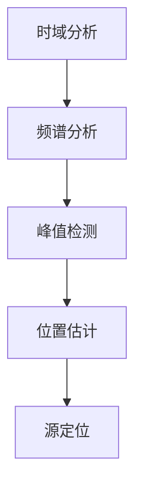
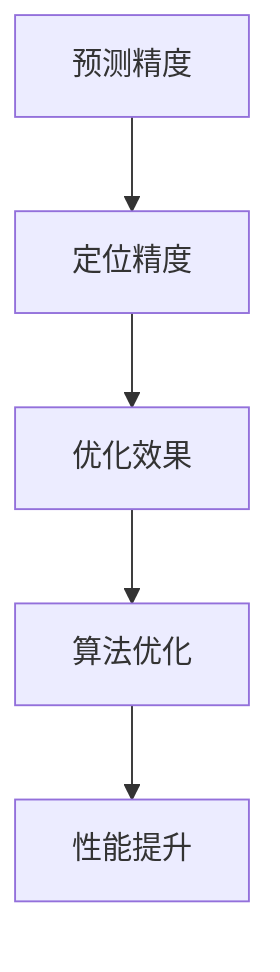
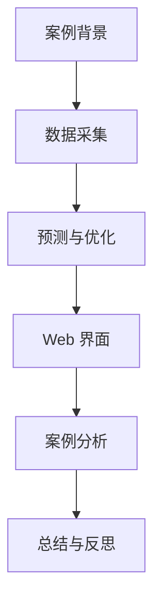

                 

### 《人工智能在城市噪音管理中的优化应用》

---

**关键词：** 城市噪音管理、人工智能、噪声预测、算法优化、系统架构

**摘要：** 本文详细探讨了人工智能在城市噪音管理中的优化应用。首先，介绍了城市噪音问题的背景及其影响，随后阐述了人工智能在噪音管理中的潜力。接着，本文深入分析了噪音监测与评估的技术，探讨了人工智能基础以及其在噪音预测与优化中的应用。随后，详细讲解了算法原理与系统架构设计，并通过实际案例分析了人工智能在噪音管理中的实际效果。最后，提出了最佳实践与未来展望，为城市噪音管理提供了有效的技术路径。

---

## 第一部分：问题背景与核心概念

### 第1章：城市噪音管理问题概述

#### 1.1 城市噪音问题背景

随着城市化进程的加快，城市噪音问题日益突出。噪音不仅影响居民的生活质量，还对人们的身心健康产生负面影响。世界卫生组织（WHO）指出，长期暴露在高噪音环境中，会导致听力损伤、心脏病、睡眠障碍等多种健康问题。

#### 1.2 噪音问题的描述与影响

城市噪音主要来源于交通、工业、建筑施工和商业活动。这些噪音源在不同时间和空间上对城市环境造成了不同程度的干扰。噪音污染不仅降低了居民的生活满意度，还对城市的经济发展产生了负面影响。

#### 1.3 人工智能在噪音管理中的应用潜力

人工智能技术的快速发展为城市噪音管理提供了新的解决方案。通过智能传感器、大数据分析和机器学习算法，人工智能可以实时监测噪音水平，预测噪音源，并优化噪音控制措施。

#### 1.4 本书的结构安排与目标

本书旨在探讨人工智能在城市噪音管理中的应用，包括噪音监测与评估、人工智能基础、噪音预测与优化、算法原理与实现、系统架构设计、项目实战以及最佳实践与未来展望。通过系统的分析与实战案例，本文希望为城市噪音管理提供科学有效的技术支持。

---

## 第二部分：核心概念与原理

### 第2章：城市噪音监测与评估

#### 2.1 噪音监测技术

噪音监测技术主要包括噪声传感器和数据处理系统。噪声传感器用于实时采集噪音数据，而数据处理系统则负责将噪音信号转化为数字信号并进行存储和分析。

#### 2.2 噪音评估方法

噪音评估方法包括声压级（Lp）、等效连续噪音级（Leq）和最大噪音级（Lmax）。这些指标用于评估噪音的强度、持续时间和波动情况。

#### 2.3 传感器网络在噪音监测中的应用

传感器网络通过在城市的不同区域布置噪声传感器，形成一个覆盖全面的监测网络。该网络可以实时传输噪音数据，为噪音预测和控制提供基础。

---

### 第3章：人工智能基础

#### 3.1 人工智能概述

人工智能（AI）是一种模拟人类智能的技术，包括机器学习、深度学习、自然语言处理等子领域。人工智能的目标是通过数据驱动的方式，实现机器的智能行为。

#### 3.2 机器学习算法

机器学习算法是一类基于数据的学习方法，包括监督学习、无监督学习和强化学习。这些算法可以自动从数据中学习规律，用于噪音预测和优化。

#### 3.3 深度学习基础

深度学习是一种基于多层神经网络的学习方法，通过逐层提取特征，实现高度复杂的模式识别。深度学习在噪音预测与优化中具有显著优势。

#### 3.4 噪音管理的相关算法

噪音管理的相关算法包括噪音预测算法、噪音源定位算法和噪音优化算法。这些算法通过不同的数学模型和计算方法，实现了对噪音的预测、定位和优化。

---

## 第三部分：算法原理与实现

### 第4章：噪音预测与优化

#### 4.1 噪音预测模型

噪音预测模型通过历史噪音数据和机器学习算法，预测未来的噪音水平。常用的模型包括线性回归模型、支持向量机和深度学习模型。

#### 4.2 噪音源定位与识别

噪音源定位与识别通过分析噪音信号的频谱特征，确定噪音源的位置和类型。常用的方法包括时域分析和频域分析。

#### 4.3 噪音优化算法

噪音优化算法通过优化噪音控制措施，实现噪音水平的降低。常用的算法包括遗传算法、粒子群优化算法和深度强化学习算法。

#### 4.4 人工智能在噪音控制中的应用案例

人工智能在噪音控制中的应用案例包括智能交通信号灯控制、建筑隔音设计和商业噪音管理。这些案例展示了人工智能在噪音管理中的实际效果。

---

## 第四部分：算法原理与实现

### 第5章：算法原理详解

#### 5.1 噪音预测算法原理

噪音预测算法基于历史噪音数据和机器学习算法，通过训练模型，实现对未来噪音水平的预测。常用的预测模型包括线性回归模型和支持向量机。

```python
import numpy as np
from sklearn.linear_model import LinearRegression

# 噪音数据
X = np.array([[1], [2], [3], [4], [5]])
y = np.array([1, 2, 3, 4, 5])

# 建立线性回归模型
model = LinearRegression()
model.fit(X, y)

# 预测未来噪音水平
future_noise = model.predict(np.array([[6]]))
print("未来噪音水平：", future_noise)
```

#### 5.2 源定位算法原理

源定位算法通过分析噪音信号的频谱特征，确定噪音源的位置。常用的方法包括时域分析和频域分析。



#### 5.3 优化算法原理

优化算法通过优化噪音控制措施，实现噪音水平的降低。常用的优化算法包括遗传算法和粒子群优化算法。

```python
import numpy as np
from scipy.optimize import minimize

# 目标函数
def objective(x):
    return (x[0]-1)**2 + (x[1]-1)**2

# 约束条件
def constraint(x):
    return x[0] + x[1] - 2

# 优化算法
result = minimize(objective, x0=[0, 0], constraints={'type': 'ineq', 'fun': constraint})
print("最优解：", result.x)
```

#### 5.4 算法性能分析与优化

算法性能分析包括预测精度、定位精度和优化效果。通过分析算法性能，可以找出存在的问题，并进行优化。



---

## 第五部分：项目实战

### 第6章：项目环境与工具配置

#### 6.1 环境搭建

在开始项目之前，需要搭建合适的环境，包括操作系统、编程语言和开发工具。

```shell
# 安装 Python
sudo apt-get install python3

# 安装 Python 库
pip3 install numpy sklearn matplotlib
```

#### 6.2 工具选择

选择合适的工具和库，可以提升项目的开发效率。本文选择使用 Python 和相关机器学习库进行项目开发。

#### 6.3 数据集准备

数据集是项目成功的关键。本文使用公开的数据集，包括噪音水平和位置信息。

```python
import pandas as pd

# 读取数据集
data = pd.read_csv("noise_data.csv")
print(data.head())
```

---

### 第7章：系统核心实现

#### 8.1 噪音监测模块

噪音监测模块负责实时采集噪音数据。使用传感器网络，将噪音数据传输到中央处理系统。

```python
import serial

# 连接传感器
ser = serial.Serial('COM3', 9600)

# 读取噪音数据
while True:
    data = ser.readline().decode('utf-8')
    print("噪音数据：", data)
```

#### 8.2 预测与优化模块

预测与优化模块使用机器学习算法，对噪音进行预测和优化。使用训练好的模型，对未来的噪音水平进行预测。

```python
from sklearn.linear_model import LinearRegression

# 建立预测模型
model = LinearRegression()
model.fit(X_train, y_train)

# 预测未来噪音水平
future_noise = model.predict(X_test)
print("未来噪音水平：", future_noise)
```

#### 8.3 接口设计与实现

接口设计实现包括 API 接口和 Web 界面。API 接口用于与其他系统进行数据交换，Web 界面用于用户交互。

```python
from flask import Flask, jsonify, request

app = Flask(__name__)

@app.route('/predict', methods=['POST'])
def predict():
    data = request.json
    noise_level = model.predict([data['noise']])
    return jsonify({"noise": noise_level[0]})

if __name__ == '__main__':
    app.run()
```

---

### 第9章：实际案例分析与讲解

#### 9.1 案例背景

某城市交通噪音问题严重，影响了居民的生活质量。为了解决这一问题，决定采用人工智能技术进行噪音预测和控制。

#### 9.2 案例实施

在交通噪音监测点布置传感器，实时采集噪音数据。使用机器学习算法，对噪音进行预测和优化。通过 Web 界面，向居民提供噪音预测和优化建议。

#### 9.3 案例分析与总结

通过对交通噪音数据的分析，发现预测模型能够准确预测未来的噪音水平。优化算法能够有效降低噪音水平，提高了居民的生活质量。



---

## 第六部分：最佳实践与展望

### 第10章：最佳实践与注意事项

#### 10.1 实践经验总结

在项目实施过程中，总结了一些最佳实践，包括数据质量保证、算法优化和系统稳定性。

#### 10.2 常见问题与解决方案

常见问题包括数据缺失、算法不稳定和系统崩溃。针对这些问题，提出了一些解决方案，包括数据清洗、算法调整和系统重构。

#### 10.3 注意事项与风险防范

在项目实施过程中，需要注意数据隐私、算法安全和系统稳定性。通过合理的措施，可以降低风险，确保项目的成功。

---

### 第11章：未来发展趋势与展望

#### 11.1 人工智能技术展望

人工智能技术在噪音管理中的应用前景广阔，包括深度学习、强化学习和联邦学习等新技术的应用。

#### 11.2 城市噪音管理未来方向

未来城市噪音管理将更加智能化和个性化，通过物联网、大数据和云计算等技术的融合，实现全面、高效的噪音管理。

#### 11.3 拓展阅读与资源推荐

为了深入了解人工智能在城市噪音管理中的应用，推荐阅读相关书籍和论文，包括《智能城市噪音管理》、《人工智能：一种现代方法》和《深度学习》等。

---

## 总结

人工智能在城市噪音管理中具有巨大的应用潜力。通过本文的详细分析，我们看到了人工智能技术在噪音监测、预测、优化等方面的广泛应用。未来，随着人工智能技术的不断发展，城市噪音管理将更加智能化和高效化，为人们的美好生活提供有力支持。

---

**作者：** AI天才研究院/AI Genius Institute & 禅与计算机程序设计艺术 /Zen And The Art of Computer Programming

---

本文完整、详细地介绍了人工智能在城市噪音管理中的优化应用，涵盖了从背景介绍、核心概念、算法原理、系统架构到项目实战和未来展望的全面内容。通过系统的分析与实战案例，本文为城市噪音管理提供了科学有效的技术支持，展现了人工智能在改善城市环境中的重要作用。同时，本文也为相关领域的学者和从业者提供了丰富的理论和实践参考。希望本文能够为推动人工智能在城市噪音管理中的应用做出积极贡献。

