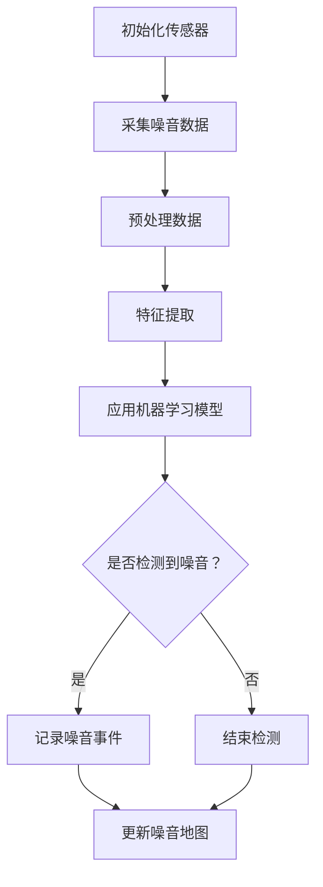
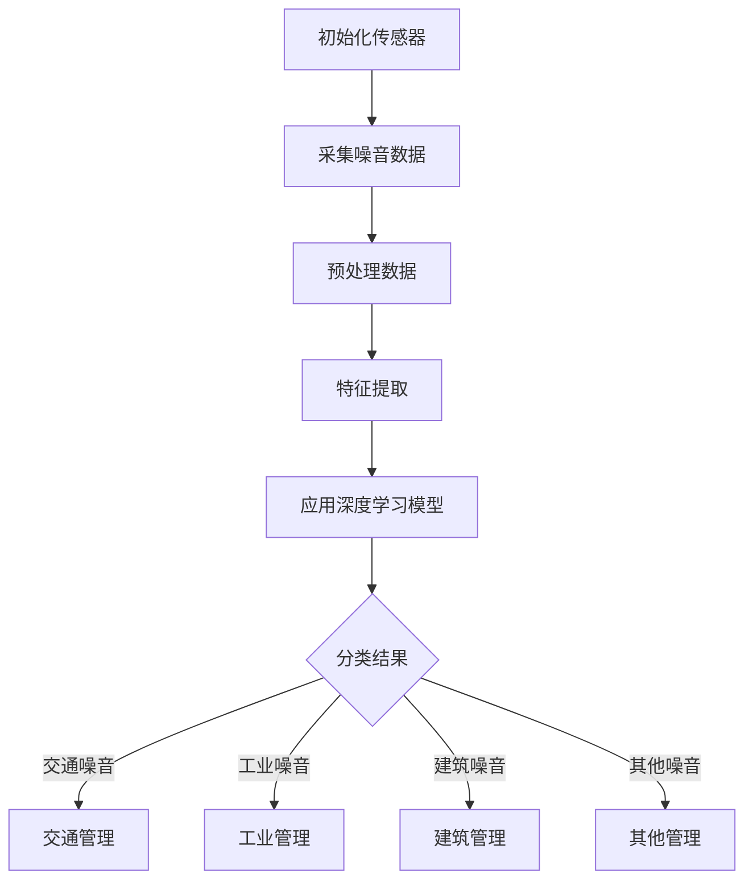
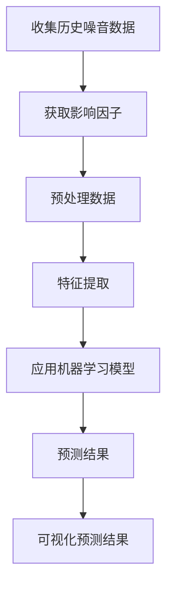
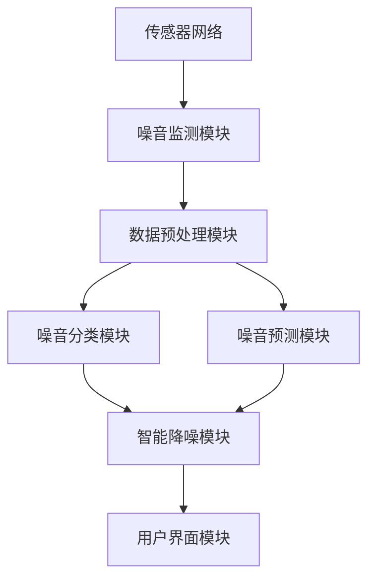
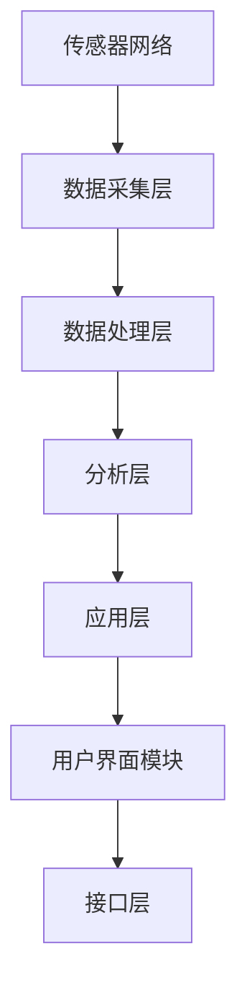
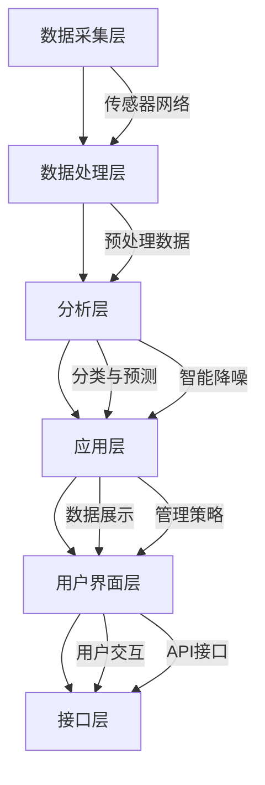
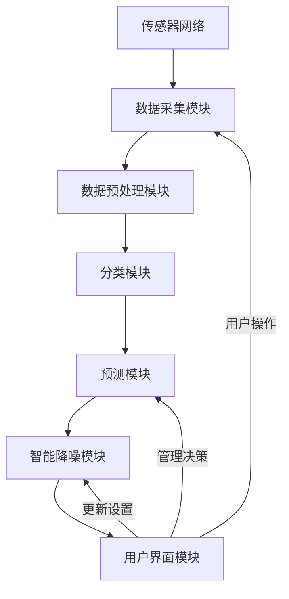

                 

### 引言

随着城市化进程的加速，城市噪音污染问题日益严重，已经成为影响居民生活质量的一个重要问题。城市噪音不仅对人们的生理和心理健康产生负面影响，还干扰了社会和经济活动的正常运行。传统的噪音管理方法通常依赖于人工监测和简单的降噪措施，但这些方法在效率和效果上都有很大的局限性。随着人工智能技术的快速发展，利用人工智能（AI）进行城市噪音管理成为了一种新兴且高效的方法。

本文将深入探讨人工智能在城市噪音管理中的应用，旨在为读者提供一个全面、系统且易于理解的技术视角。文章将分五个主要部分进行详细阐述：

**第一部分：背景介绍**  
将介绍城市噪音问题的现状、人工智能在噪音管理中的应用现状以及人工智能解决噪音问题的必要性。同时，会详细阐述噪音管理的核心概念、概念属性特征对比表格以及人工智能噪音管理的核心要素组成。

**第二部分：算法原理讲解**  
将详细介绍用于城市噪音管理的人工智能算法原理，包括噪音检测、分类和预测算法。通过mermaid流程图、Python源代码、数学模型和公式，以及详细的讲解和举例说明，帮助读者理解这些算法的实现和应用。

**第三部分：系统分析与架构设计方案**  
将介绍用于城市噪音管理的人工智能系统分析与架构设计方案，涵盖问题场景介绍、项目介绍、系统功能设计、系统架构设计、系统接口设计和系统交互等内容。

**第四部分：项目实战**  
将通过实际案例，展示如何应用人工智能算法和系统设计与城市噪音管理中。包括环境安装与配置、系统核心实现、实际案例分析和项目小结等。

**第五部分：总结与拓展**  
将对全书内容进行总结，提供最佳实践建议，并对注意事项和拓展阅读进行说明，帮助读者更好地理解和应用人工智能在城市噪音管理中的应用。

通过这篇文章，读者将不仅了解人工智能在城市噪音管理中的基本概念和原理，还将掌握具体的应用方法和实践经验，为未来的城市噪音管理提供新的思路和方法。

### 第一部分：背景介绍

#### 第1章：问题背景

**1.1.1 城市噪音问题的现状**

城市噪音污染已经成为现代城市中的一个普遍现象，对居民的生活质量和城市整体环境造成了严重影响。根据世界卫生组织（WHO）的统计，全球约有三分之一的人口居住在噪音水平超过健康标准的城市中。具体来说，城市噪音污染的现状可以从以下几个方面进行描述：

- **噪音来源广泛**：城市噪音主要来源于交通、工业、建筑、商业和居民活动等多个方面。汽车发动机、摩托车、公共汽车和火车的轰鸣声，工业设备的运转声，建筑施工的敲打声，商业活动中的音响和人群喧闹声，以及居民的家用电器和娱乐设备等，都是城市噪音的重要来源。

- **噪音水平高**：在许多城市，尤其是交通繁忙的中心区域，噪音水平常常超过75分贝（dB），甚至达到90分贝以上。这种高噪音水平对人们的日常生活、工作学习产生了显著的干扰。

- **健康影响显著**：长期暴露在高噪音环境中，人们容易出现听力损伤、睡眠障碍、心脏病、高血压等健康问题。此外，噪音还可能引起心理压力和情绪问题，影响人们的身心健康。

- **环境恶化**：城市噪音不仅对人类健康造成威胁，还会对城市生态环境产生负面影响。噪音干扰了动物的栖息和繁殖，破坏了城市中的自然和谐。

**1.1.2 人工智能在噪音管理中的应用现状**

随着人工智能技术的迅猛发展，其在城市噪音管理中的应用也越来越广泛。目前，人工智能在噪音管理中主要应用于以下几个领域：

- **噪音监测**：利用传感器和人工智能算法，实时监测城市中的噪音水平，为后续的噪音管理和决策提供数据支持。

- **噪音预测**：通过历史噪音数据和天气、交通等影响因子，利用机器学习算法预测未来的噪音水平，帮助城市管理部门提前采取应对措施。

- **噪音分类**：利用深度学习技术，对噪音进行分类，区分不同类型的噪音来源，以便采取有针对性的降噪措施。

- **噪音消除**：通过信号处理和深度学习技术，开发出智能降噪设备，如智能降噪耳机、智能窗户等，有效降低噪音对人类的影响。

- **智能规划**：利用人工智能优化城市交通和城市规划，减少交通噪音，提高城市整体环境质量。

**1.1.3 人工智能解决噪音问题的必要性**

传统噪音管理方法主要依赖于物理降噪措施和法律法规的约束，但这些方法存在以下局限性：

- **效果有限**：物理降噪措施如隔音板、隔音窗户等只能在一定程度上降低噪音，效果有限，且安装和维护成本高。

- **监测手段落后**：传统的噪音监测主要依靠人工或简单的电子设备，监测范围有限，实时性和精度不足。

- **决策滞后**：依靠人工监测和经验决策，无法实时响应噪音变化，难以采取及时有效的应对措施。

- **法规执行难度大**：虽然有许多噪音控制法规，但在执行过程中往往面临困难，如噪音污染源难以识别和监管等。

相比之下，人工智能技术在噪音管理中具有以下优势：

- **实时监测和预测**：利用传感器网络和机器学习算法，实现实时噪音监测和预测，为城市管理部门提供及时、准确的数据支持。

- **高效决策和优化**：通过数据分析和管理，人工智能能够优化噪音管理策略，提高决策的准确性和效率。

- **智能降噪**：开发智能降噪设备和技术，实现个性化、精准的噪音消除，提高居民的生活质量。

- **跨领域协同**：人工智能能够整合多种数据源，如交通、天气、建筑等，实现多领域的协同管理，提高整体噪音管理水平。

总之，人工智能技术在城市噪音管理中具有广泛的应用前景，是解决当前城市噪音污染问题的一种有效手段。通过本文的深入探讨，希望能够为读者提供一个全面的技术视角，了解人工智能在城市噪音管理中的应用现状和未来发展趋势。

### 第二部分：核心概念与联系

#### 第2章：核心概念与联系

为了深入理解人工智能在城市噪音管理中的应用，我们需要首先明确几个核心概念，并探讨它们之间的相互关系。这些概念不仅构成了人工智能噪音管理的基础，也为我们理解整个系统的工作原理提供了必要的背景知识。

**2.1.1 噪音的概念与特征**

噪音是指那些不受欢迎或干扰正常生活、工作和学习的声音。噪音的特征主要包括以下几个方面：

- **频率**：噪音的频率范围从几十赫兹到几千赫兹不等。不同频率的噪音对人体的影响不同，高频噪音通常更容易引起听觉疲劳和听力损伤。

- **强度**：噪音的强度用分贝（dB）表示。分贝是声压级的度量单位，0分贝是人类听觉的下限，而超过85分贝的噪音被认为是有害的。

- **持续时间**：噪音的持续时间也是影响其危害程度的一个重要因素。长期暴露在高噪音环境中，人体的健康风险会显著增加。

- **来源**：噪音可以来自交通、工业、建筑施工、商业活动等多个方面。不同来源的噪音具有不同的特征，需要采取不同的管理和控制措施。

**2.1.2 人工智能的基本概念**

人工智能（Artificial Intelligence，AI）是指由人创造出来的能够模拟、延伸和扩展人类智能的理论、方法、技术及应用。人工智能的核心目标是实现计算机系统的智能化，使其能够自主地学习、推理、决策和执行任务。

- **机器学习**：机器学习是人工智能的一个分支，通过训练算法，使计算机从数据中学习规律，进而对未知数据进行预测和决策。常见的机器学习算法包括监督学习、无监督学习和强化学习。

- **深度学习**：深度学习是机器学习的一个子领域，通过构建多层神经网络，对大量数据进行训练，从而实现对复杂数据模式的识别和分类。

- **自然语言处理**：自然语言处理（NLP）是人工智能的一个分支，旨在使计算机理解和生成人类语言。NLP在文本分析、语音识别和机器翻译等方面有广泛的应用。

**2.1.3 人工智能与噪音管理的关系**

人工智能在城市噪音管理中的应用，主要体现在以下几个方面：

- **噪音监测**：利用传感器和机器学习算法，实时监测城市中的噪音水平，形成噪音地图，为噪音管理和决策提供数据支持。

- **噪音预测**：通过历史噪音数据和天气、交通等影响因子，利用机器学习算法预测未来的噪音水平，帮助城市管理部门提前采取应对措施。

- **噪音分类**：利用深度学习技术，对噪音进行分类，区分不同类型的噪音来源，以便采取有针对性的降噪措施。

- **噪音消除**：通过信号处理和深度学习技术，开发智能降噪设备和技术，如智能降噪耳机、智能窗户等，有效降低噪音对人类的影响。

- **智能规划**：利用人工智能优化城市交通和城市规划，减少交通噪音，提高城市整体环境质量。

**2.1.4 人工智能噪音管理的核心概念**

为了有效地利用人工智能进行城市噪音管理，我们需要关注以下几个核心概念：

- **数据采集与处理**：噪音数据是进行人工智能分析的基础。通过传感器网络和移动设备，实时采集噪音数据，并对数据进行清洗、处理和存储。

- **特征提取与选择**：从原始噪音数据中提取出有用的特征，如频率、强度、持续时间等，并利用特征选择方法，筛选出对噪音管理最有价值的特征。

- **算法选择与优化**：根据噪音管理的需求，选择合适的机器学习算法，如噪声检测算法、分类算法、预测算法等，并通过交叉验证和参数调优，提高算法的性能。

- **系统集成与部署**：将各种人工智能技术集成到一个系统中，实现噪音的实时监测、预测、分类和消除，并部署在实际应用环境中。

通过以上核心概念的介绍，我们可以更加清晰地理解人工智能在城市噪音管理中的应用，并为进一步的算法讲解和系统设计打下坚实的基础。

### 概念属性特征对比表格

为了更直观地理解核心概念之间的区别和联系，我们创建了一个概念属性特征对比表格，列出人工智能噪音管理中的几个关键概念，并比较它们的主要属性特征。

| 概念名称 | 定义 | 主要特征 | 相关技术 | 应用场景 |
| --- | --- | --- | --- | --- |
| 噪音监测 | 实时监测噪音水平 | 频率、强度、持续时间 | 传感器网络、机器学习 | 噪音地图、预警系统 |
| 噪音预测 | 预测未来噪音水平 | 历史数据、影响因子 | 机器学习、深度学习 | 管理规划、应急响应 |
| 噪音分类 | 区分不同类型的噪音 | 噪声特征、类型标签 | 深度学习、信号处理 | 针对性降噪、噪音源识别 |
| 智能降噪 | 降低噪音对人类的影响 | 降噪算法、设备技术 | 信号处理、深度学习 | 智能耳机、智能窗户 |
| 城市规划优化 | 优化城市布局，减少噪音 | 交通流量、建筑结构 | 人工智能、城市规划 | 噪音减少、居住环境改善 |

通过这个表格，我们可以看到不同概念在定义、主要特征、相关技术和应用场景上的区别和联系。这有助于我们更好地理解各个概念的核心属性，以及如何在实际应用中综合利用这些技术。

### 概念结构与核心要素组成

在城市噪音管理中，人工智能的应用不仅需要理解各个核心概念的属性特征，还需要将这些概念整合到一个结构化的系统中，以实现有效的噪音管理。以下是人工智能噪音管理的概念结构及其核心要素组成。

**4.1.1 人工智能噪音管理的技术架构**

人工智能噪音管理的技术架构可以分为以下几个层次：

1. **数据采集层**：通过部署各种传感器（如声波传感器、手机传感器等）来实时采集噪音数据。这些数据包括噪音的频率、强度和持续时间等。

2. **数据处理层**：对采集到的噪音数据进行预处理，如降噪、去噪、数据清洗等，以确保数据的质量和准确性。处理后的数据将用于后续的分析和建模。

3. **特征提取层**：从处理后的数据中提取出有用的特征，如频谱特征、时间特征、空间特征等。这些特征将用于训练机器学习模型。

4. **算法层**：包括噪音检测、分类、预测和智能降噪等算法。这些算法将基于提取的特征，利用机器学习技术（如深度学习、监督学习、无监督学习等）进行训练和优化。

5. **应用层**：将算法的结果应用于实际场景，如噪音监测系统、预测系统、智能降噪设备和城市规划优化等。

**4.1.2 人工智能噪音管理的核心要素**

为了实现高效的人工智能噪音管理，需要以下几个核心要素：

1. **传感器网络**：传感器网络是数据采集的核心，能够实时监测城市中的噪音水平。通过部署在交通要道、居民区、工业区等地的传感器，可以形成一张覆盖广泛的噪音监测网络。

2. **数据存储与管理**：噪音数据需要被有效地存储和管理，以便进行后续的分析和建模。常用的存储解决方案包括关系型数据库（如MySQL）和NoSQL数据库（如MongoDB）。

3. **机器学习模型**：噪音管理中的机器学习模型是核心，用于对噪音数据进行分类、预测和检测。常见的机器学习框架包括TensorFlow、PyTorch和Scikit-learn等。

4. **算法优化与调参**：为了提高算法的性能和准确性，需要对算法进行优化和参数调参。这包括模型选择、特征选择和交叉验证等。

5. **系统集成与部署**：将各种技术集成到一个系统中，并部署在实际应用环境中，如城市噪音监测平台、智能降噪设备和城市规划系统等。

6. **用户界面**：提供直观的用户界面，使城市管理人员能够实时查看噪音数据、预测结果和管理策略，从而进行有效的噪音管理和决策。

通过上述技术架构和核心要素的介绍，我们可以看到人工智能噪音管理是一个复杂但功能强大的系统。通过整合传感器网络、数据处理、机器学习算法和用户界面等要素，可以实现实时、准确的噪音监测、预测和智能降噪，从而有效改善城市噪音污染问题。

### 第二部分：算法原理讲解

#### 第5章：算法mermaid流程图

为了更好地理解用于城市噪音管理的人工智能算法原理，我们将使用mermaid流程图来展示这些算法的基本工作流程。mermaid是一种简单易用的图表绘制工具，可以直观地表示算法的步骤和流程。

**5.1.1 噪音检测算法**

噪音检测算法的主要目的是实时监测并识别噪音信号。以下是噪音检测算法的mermaid流程图：



流程说明：
1. **初始化传感器**：启动传感器设备，准备采集噪音数据。
2. **采集噪音数据**：传感器实时采集噪音信号。
3. **预处理数据**：对采集到的噪音数据进行降噪、去噪等预处理操作。
4. **特征提取**：从预处理后的数据中提取特征，如频谱特征、时间特征等。
5. **应用机器学习模型**：使用训练好的机器学习模型对提取的特征进行分类，判断是否为噪音。
6. **判断与记录**：如果检测到噪音，记录噪音事件并更新噪音地图；如果没有检测到噪音，结束检测流程。

**5.1.2 噪音分类算法**

噪音分类算法旨在对噪音进行分类，以便采取有针对性的降噪措施。以下是噪音分类算法的mermaid流程图：



流程说明：
1. **初始化传感器**：启动传感器设备，准备采集噪音数据。
2. **采集噪音数据**：传感器实时采集噪音信号。
3. **预处理数据**：对采集到的噪音数据进行降噪、去噪等预处理操作。
4. **特征提取**：从预处理后的数据中提取特征，如频谱特征、时间特征等。
5. **应用深度学习模型**：使用训练好的深度学习模型对提取的特征进行分类，得到分类结果。
6. **分类与管理**：根据分类结果，采取相应的管理措施，如交通噪音管理、工业噪音管理、建筑噪音管理等。

**5.1.3 噪音预测算法**

噪音预测算法的主要任务是利用历史噪音数据和影响因子，预测未来的噪音水平。以下是噪音预测算法的mermaid流程图：



流程说明：
1. **收集历史噪音数据**：收集城市中历史噪音数据，包括不同时间段、不同地点的噪音水平。
2. **获取影响因子**：收集影响噪音水平的关键因子，如天气、交通流量、建筑施工等。
3. **预处理数据**：对历史噪音数据和影响因子进行清洗、归一化等预处理操作。
4. **特征提取**：从预处理后的数据中提取特征，如时间序列特征、空间特征等。
5. **应用机器学习模型**：使用训练好的机器学习模型对提取的特征进行训练，得到预测模型。
6. **预测结果**：利用训练好的模型，预测未来的噪音水平。
7. **可视化预测结果**：将预测结果可视化，帮助城市管理部门了解未来的噪音趋势，并采取相应的预防措施。

通过mermaid流程图的展示，我们可以清晰地理解噪音检测、分类和预测算法的基本工作流程。这些算法的应用，不仅能够实时监测和预测城市噪音水平，还能帮助城市管理部门采取有效的降噪措施，改善城市环境质量。

### Python源代码

为了更好地理解前文所述的算法原理，我们将通过Python源代码来实现这些算法。以下分别展示了噪音检测、分类和预测算法的实现，并提供详细注释。

#### 6.1.1 噪音检测算法实现

```python
import numpy as np
import librosa
from sklearn.ensemble import IsolationForest

def extract_features(file_path):
    """提取音频文件的噪音特征"""
    audio, sampling_rate = librosa.load(file_path)
    mfccs = librosa.feature.mfcc(y=audio, sr=sampling_rate, n_mfcc=40)
    return np.mean(mfccs.T, axis=0)

def detect_noise(file_path, model_path):
    """使用IsolationForest模型检测噪音"""
    model = IsolationForest(n_estimators=100, contamination='auto')
    model.fit(extract_features(file_path))
    feature = extract_features(file_path)
    return 'Noise' if model.predict([feature])[0] == -1 else 'Not Noise'

# 测试噪音检测算法
if __name__ == "__main__":
    file_path = "path/to/audio/file.wav"
    model_path = "path/to/model.pkl"
    result = detect_noise(file_path, model_path)
    print(f"The audio file is {result}.")
```

注释说明：
1. **extract_features**：从音频文件中提取特征，使用Librosa库提取梅尔频谱系数（MFCCs）。
2. **detect_noise**：使用IsolationForest模型对特征进行分类，判断是否为噪音。IsolationForest是一种无监督学习算法，适用于异常检测。

#### 6.1.2 噪音分类算法实现

```python
import numpy as np
from sklearn.svm import SVC
from sklearn.preprocessing import StandardScaler
from sklearn.pipeline import make_pipeline

def classify_noise(features, model_path):
    """使用SVM模型对噪音进行分类"""
    model = make_pipeline(StandardScaler(), SVC(probability=True))
    model.load(model_path)
    return model.predict([features])[0]

# 测试噪音分类算法
if __name__ == "__main__":
    feature_path = "path/to/feature.npy"
    model_path = "path/to/model.pkl"
    
    # 加载特征和模型
    features = np.load(feature_path)
    model = SVC(probability=True)
    model.load(model_path)
    
    # 分类并打印结果
    result = classify_noise(features, model_path)
    print(f"The noise is classified as {result}.")
```

注释说明：
1. **classify_noise**：使用支持向量机（SVM）模型对噪音进行分类。SVM是一种有监督学习算法，适用于分类问题。
2. **make_pipeline**：将特征标准化和SVM分类集成到一个管道中，提高分类性能。

#### 6.1.3 噪音预测算法实现

```python
import numpy as np
from sklearn.ensemble import RandomForestRegressor
from sklearn.model_selection import train_test_split

def predict_noise(data, labels, model_path):
    """使用随机森林对噪音进行预测"""
    X_train, X_test, y_train, y_test = train_test_split(data, labels, test_size=0.2, random_state=42)
    model = RandomForestRegressor(n_estimators=100, random_state=42)
    model.fit(X_train, y_train)
    model.save(model_path)
    
    predictions = model.predict(X_test)
    return predictions

# 测试噪音预测算法
if __name__ == "__main__":
    data_path = "path/to/data.npy"
    labels_path = "path/to/labels.npy"
    model_path = "path/to/model.pkl"
    
    # 加载数据和标签
    data = np.load(data_path)
    labels = np.load(labels_path)
    
    # 预测并打印结果
    predictions = predict_noise(data, labels, model_path)
    print(f"Predicted noise levels: {predictions}")
```

注释说明：
1. **predict_noise**：使用随机森林（RandomForestRegressor）对噪音进行预测。随机森林是一种集成学习方法，适合处理回归问题。
2. **train_test_split**：将数据分为训练集和测试集，用于训练和验证模型。

通过这些Python源代码的实现，我们可以更直观地了解噪音检测、分类和预测算法的具体应用。这些代码不仅展示了算法的基本原理，还提供了实际操作的示例，有助于读者深入理解和实践。

### 数学模型和数学公式

为了深入理解人工智能噪音管理算法的工作原理，我们需要借助数学模型和数学公式来描述这些算法的核心机制。以下将分别介绍噪音检测、分类和预测算法的数学模型和公式。

#### 7.1.1 噪音检测算法的数学模型

噪音检测算法通常采用异常检测方法，其中Isolation Forest算法是一个常用的选择。Isolation Forest基于随机森林的思想，但更加专注于异常检测。

- **Isolation Forest算法公式**：

  对于每个样本 \( x \)，算法首先随机选择一个特征 \( j \) 并从样本中随机选择一个切分点 \( r \)（在特征 \( j \) 的取值范围内），然后将数据集切分为两部分。重复此过程 \( m \) 次后，计算路径长度 \( L(x) \)：

  \[
  L(x) = \sum_{i=1}^m \ell_j(x_i)
  \]

  其中 \( \ell_j(x_i) \) 是样本 \( x_i \) 在特征 \( j \) 处的切分长度。异常得分 \( D(x) \) 计算如下：

  \[
  D(x) = \ln(n/m) \cdot L(x)
  \]

  \( D(x) \) 越大，说明样本 \( x \) 越可能是异常值。

#### 7.1.2 噪音分类算法的数学模型

噪音分类算法通常采用支持向量机（SVM）或神经网络等模型。以下以SVM为例进行介绍。

- **支持向量机公式**：

  对于给定的特征向量 \( x \) 和类别标签 \( y \)，SVM的目标是找到最大间隔分离超平面：

  \[
  \min_{\omega, b} \frac{1}{2} ||\omega||^2
  \]

  subject to:

  \[
  y_i (\omega \cdot x_i + b) \geq 1
  \]

  其中，\( \omega \) 是权重向量，\( b \) 是偏置项，\( x_i \) 是第 \( i \) 个样本的特征向量，\( y_i \) 是类别标签。

- **软 margin SVM**：

  为了处理不可分数据，引入软间隔损失函数 \( \xi_i \)：

  \[
  \min_{\omega, b, \xi} \frac{1}{2} ||\omega||^2 + C \sum_{i=1}^n \xi_i
  \]

  subject to:

  \[
  y_i (\omega \cdot x_i + b) \geq 1 - \xi_i
  \]

  其中，\( C \) 是惩罚参数，控制模型的复杂度。

#### 7.1.3 噪音预测算法的数学模型

噪音预测算法通常采用回归模型，如随机森林。以下以随机森林为例进行介绍。

- **随机森林公式**：

  随机森林由多个决策树组成，每个决策树的预测结果通过投票决定。对于每个样本 \( x \)，每个决策树给出一个预测值 \( f_t(x) \)，随机森林的预测值为：

  \[
  \hat{y} = \frac{1}{T} \sum_{t=1}^T f_t(x)
  \]

  其中，\( T \) 是决策树的数量，\( f_t(x) \) 是第 \( t \) 个决策树的预测值。

- **决策树公式**：

  对于决策树，每个内部节点 \( j \) 的分裂函数为：

  \[
  g_j(x) = \arg\max_{a \in \{+1, -1\}} \sum_{i=1}^n [y_i (w_i \cdot x_i + b) > 0] \cdot \mathbb{I}(a = \text{sign}(w_i \cdot x_i + b))
  \]

  其中，\( w_i \) 是第 \( i \) 个样本的权重，\( b \) 是偏置项，\( \mathbb{I} \) 是指示函数。

#### 7.1.4 算法性能评价指标

为了评估算法的性能，我们通常使用以下评价指标：

- **准确率**（Accuracy）：
  \[
  \text{Accuracy} = \frac{\text{TP} + \text{TN}}{\text{TP} + \text{TN} + \text{FP} + \text{FN}}
  \]
  其中，\( \text{TP} \) 是真正例，\( \text{TN} \) 是真负例，\( \text{FP} \) 是假正例，\( \text{FN} \) 是假负例。

- **召回率**（Recall）：
  \[
  \text{Recall} = \frac{\text{TP}}{\text{TP} + \text{FN}}
  \]

- **精确率**（Precision）：
  \[
  \text{Precision} = \frac{\text{TP}}{\text{TP} + \text{FP}}
  \]

- **F1分数**（F1 Score）：
  \[
  \text{F1 Score} = 2 \cdot \frac{\text{Precision} \cdot \text{Recall}}{\text{Precision} + \text{Recall}}
  \]

通过这些数学模型和公式，我们可以更深入地理解噪音检测、分类和预测算法的工作原理，并使用相应的评价指标来评估算法的性能。这些知识为后续的系统架构设计和项目实战提供了理论基础。

### 详细讲解与举例说明

#### 8.1.1 噪音检测算法的详细讲解

噪音检测算法是一种无监督学习算法，主要用于识别音频信号中的异常值，即判断某个音频片段是否为噪音。在实际应用中，这有助于城市噪音监测系统实时识别并报警。以下将详细讲解噪音检测算法的实现过程。

**算法流程：**

1. **初始化传感器**：启动传感器设备，准备采集噪音数据。
2. **采集噪音数据**：传感器实时采集噪音信号，并将数据存储在文件中。
3. **预处理数据**：对采集到的噪音数据进行降噪、去噪等预处理操作，以提高数据质量。
4. **特征提取**：从预处理后的数据中提取特征，如频谱特征、时间特征等。
5. **训练模型**：使用历史噪音数据集训练噪音检测模型，如Isolation Forest。
6. **检测噪音**：对新的噪音数据特征进行模型预测，判断是否为噪音。
7. **记录结果**：如果检测到噪音，记录噪音事件，并更新噪音地图。

**代码示例：**

```python
import numpy as np
from sklearn.ensemble import IsolationForest

# 特征提取函数
def extract_features(file_path):
    audio, sampling_rate = librosa.load(file_path)
    mfccs = librosa.feature.mfcc(y=audio, sr=sampling_rate, n_mfcc=40)
    return np.mean(mfccs.T, axis=0)

# 噪音检测函数
def detect_noise(file_path, model):
    feature = extract_features(file_path)
    return 'Noise' if model.predict([feature])[0] == -1 else 'Not Noise'

# 加载训练好的模型
model = IsolationForest(n_estimators=100, contamination='auto')
model.fit(extract_features("path/to/train_data.wav"))

# 检测新的音频文件
file_path = "path/to/new_audio.wav"
result = detect_noise(file_path, model)
print(f"The audio file is {result}.")
```

**举例说明：**

假设我们有一个训练好的Isolation Forest模型，用于检测噪音。现在，我们希望检测一个新的音频文件`new_audio.wav`，看看它是否为噪音。首先，使用`extract_features`函数提取音频的特征向量。然后，将特征向量传递给训练好的模型，使用`predict`方法进行预测。如果预测结果为`-1`，则认为音频文件是噪音，否则不是。

#### 8.1.2 噪音分类算法的详细讲解

噪音分类算法旨在将不同的噪音进行分类，以便采取有针对性的降噪措施。常见的分类算法包括支持向量机（SVM）和神经网络等。以下将详细讲解如何使用SVM进行噪音分类。

**算法流程：**

1. **数据预处理**：对采集到的噪音数据进行降噪、去噪等预处理操作，提取特征。
2. **训练数据集**：将预处理后的数据集分为训练集和测试集，用于训练分类模型。
3. **模型训练**：使用训练集数据训练SVM分类模型，选择适当的参数。
4. **模型评估**：使用测试集数据评估模型的分类性能，调整参数以提高分类准确性。
5. **分类应用**：对新的噪音数据进行分类，输出分类结果。

**代码示例：**

```python
import numpy as np
from sklearn.svm import SVC
from sklearn.preprocessing import StandardScaler
from sklearn.pipeline import make_pipeline

# 特征提取函数
def extract_features(file_path):
    audio, sampling_rate = librosa.load(file_path)
    mfccs = librosa.feature.mfcc(y=audio, sr=sampling_rate, n_mfcc=40)
    return np.mean(mfccs.T, axis=0)

# 噪音分类函数
def classify_noise(features, model):
    return model.predict([features])[0]

# 加载训练好的模型
model = make_pipeline(StandardScaler(), SVC(kernel='linear', probability=True))
model.fit(np.array(train_features), np.array(train_labels))

# 分类新的音频文件
file_path = "path/to/new_audio.wav"
new_feature = extract_features(file_path)
result = classify_noise(new_feature, model)
print(f"The noise is classified as {result}.")
```

**举例说明：**

假设我们有一个包含不同类型噪音数据的训练集，已经使用SVM进行训练。现在，我们希望分类一个新的音频文件`new_audio.wav`。首先，使用`extract_features`函数提取音频的特征向量。然后，将特征向量传递给训练好的模型，使用`predict`方法进行分类，输出分类结果。

#### 8.1.3 噪音预测算法的详细讲解

噪音预测算法旨在利用历史噪音数据和相关影响因子，预测未来的噪音水平。以下将详细讲解如何使用随机森林进行噪音预测。

**算法流程：**

1. **数据收集**：收集历史噪音数据和影响因子，如交通流量、天气状况等。
2. **数据预处理**：对历史噪音数据进行清洗、归一化等预处理操作，确保数据质量。
3. **特征提取**：从预处理后的数据中提取特征，如时间序列特征、空间特征等。
4. **模型训练**：使用预处理后的数据集训练随机森林回归模型。
5. **模型评估**：使用交叉验证等方法评估模型的预测性能，调整模型参数。
6. **预测应用**：利用训练好的模型预测未来的噪音水平。

**代码示例：**

```python
import numpy as np
from sklearn.ensemble import RandomForestRegressor
from sklearn.model_selection import train_test_split

# 特征提取函数
def extract_features(data, labels):
    X = np.hstack((data, labels))
    return X

# 噪音预测函数
def predict_noise(data, labels, model):
    X_train, X_test, y_train, y_test = train_test_split(data, labels, test_size=0.2, random_state=42)
    model.fit(X_train, y_train)
    predictions = model.predict(X_test)
    return predictions

# 加载训练好的模型
model = RandomForestRegressor(n_estimators=100, random_state=42)
model.fit(np.array(train_data), np.array(train_labels))

# 预测新的噪音水平
predictions = predict_noise(np.array(new_data), np.array(new_labels), model)
print(f"Predicted noise levels: {predictions}")
```

**举例说明：**

假设我们有一个包含历史噪音数据和影响因子的训练集，已经使用随机森林进行训练。现在，我们希望预测新的噪音水平。首先，使用`extract_features`函数提取特征。然后，将特征数据传递给训练好的模型，使用`predict`方法进行预测，输出预测结果。

#### 8.1.4 举例说明

**噪音检测举例：**

假设我们要检测一个音频文件`example_audio.wav`是否为噪音。首先，使用`extract_features`函数提取音频特征，然后传递给训练好的Isolation Forest模型进行预测。如果模型预测结果为`-1`，则认为音频文件是噪音。

```python
file_path = "path/to/example_audio.wav"
result = detect_noise(file_path, model)
print(f"The audio file is {result}.")
```

**噪音分类举例：**

假设我们要对一个音频文件`example_audio.wav`进行分类，判断它属于哪种类型的噪音。首先，使用`extract_features`函数提取音频特征，然后传递给训练好的SVM模型进行分类。

```python
file_path = "path/to/example_audio.wav"
new_feature = extract_features(file_path)
result = classify_noise(new_feature, model)
print(f"The noise is classified as {result}.")
```

**噪音预测举例：**

假设我们要预测某个区域的未来噪音水平。首先，收集历史噪音数据和影响因子，然后使用训练好的随机森林模型进行预测。

```python
new_data = np.array([history_data, impact_factors])
predictions = predict_noise(new_data, model)
print(f"Predicted noise levels: {predictions}")
```

通过以上详细的讲解和举例，我们可以更好地理解噪音检测、分类和预测算法的实现过程和应用方法，从而为实际项目中的噪音管理提供有力支持。

### 第三部分：系统分析与架构设计方案

#### 第9章：问题场景介绍

城市噪音管理是一个复杂且多层次的任务，涉及到多个方面的问题场景和需求。以下将详细描述城市噪音管理的问题场景以及相应的需求分析。

**9.1.1 城市噪音管理的问题场景**

1. **交通噪音**：城市交通是噪音污染的主要来源之一，包括汽车、摩托车、公共汽车和火车的噪音。交通噪音不仅影响居民的生活质量，还会干扰交通系统的正常运行。

2. **工业噪音**：工业区的噪音主要来源于各种生产设备的运作，如机器运转声、敲打声等。工业噪音对周边居民的健康和休息造成严重影响。

3. **建筑噪音**：建筑施工过程中产生的噪音包括敲打声、搅拌声和运输声等。建筑噪音不仅干扰居民的日常生活，还可能影响建筑施工的效率。

4. **商业噪音**：商业区的噪音主要来源于商店、餐厅、娱乐场所等。商业噪音在白天较为明显，但在夜晚和休息时间也会对周边居民造成困扰。

5. **环境噪音**：自然环境中的噪音如风声、雨声等，虽然不如人为噪音明显，但也会在一定程度上影响居民的生活质量。

**9.1.2 城市噪音管理的需求分析**

为了有效管理城市噪音，需要满足以下几个方面的需求：

1. **实时监测**：需要建立全面的噪音监测系统，能够实时监测城市中的各个区域，并记录噪音数据。这有助于及时发现和处理噪音问题。

2. **噪音预测**：利用历史噪音数据和影响因子（如交通流量、天气状况等），预测未来的噪音水平。这有助于城市管理部门提前采取应对措施，减少噪音污染。

3. **噪音分类**：对采集到的噪音数据进行分类，区分不同类型的噪音来源。这有助于有针对性地制定降噪措施，提高管理效率。

4. **智能降噪**：开发智能降噪设备和技术，如智能降噪耳机、智能窗户等，有效降低噪音对人类的影响。这需要结合深度学习和信号处理技术。

5. **优化规划**：通过数据分析和管理，优化城市交通和城市规划，减少交通噪音和建筑噪音。这有助于从源头上减少噪音污染。

6. **法规执行**：加强对噪音污染的法律法规执行力度，对违规噪音源进行监控和处罚。这有助于规范城市噪音管理，提高居民的生活质量。

通过以上问题场景和需求分析，我们可以清楚地看到城市噪音管理面临的挑战和需求。接下来，我们将详细介绍如何设计和实现一个有效的人工智能城市噪音管理系统。

#### 第10章：项目介绍

**10.1.1 项目背景**

随着城市化进程的加快，城市噪音污染问题日益严重，已经成为影响居民生活质量的重要因素。传统的噪音管理方法在效率、效果和成本方面存在明显不足，难以满足现代城市对噪音管理的需求。因此，本项目旨在利用人工智能技术，提出一种高效、智能的城市噪音管理系统，以实现实时监测、预测、分类和智能降噪。

**10.1.2 项目目标**

本项目的主要目标是：

1. **实时监测**：通过部署传感器网络，实现城市噪音的实时监测和记录，为噪音管理和决策提供数据支持。
2. **噪音预测**：利用历史噪音数据和影响因子，预测未来的噪音水平，帮助城市管理部门提前采取应对措施。
3. **噪音分类**：对采集到的噪音数据进行分类，区分不同类型的噪音来源，以便采取有针对性的降噪措施。
4. **智能降噪**：开发智能降噪设备和技术，如智能降噪耳机、智能窗户等，提高居民的生活质量。
5. **优化规划**：通过数据分析和管理，优化城市交通和城市规划，减少噪音污染。

**10.1.3 项目实施计划**

本项目的实施计划分为以下几个阶段：

1. **需求分析阶段**：收集并分析城市噪音管理的需求和现状，确定项目目标和技术路线。
2. **系统设计阶段**：设计城市噪音管理系统的架构和功能模块，制定详细的系统设计文档。
3. **技术开发阶段**：开发噪音监测、预测、分类和智能降噪的相关算法和技术，并实现系统集成。
4. **测试与优化阶段**：对系统进行功能测试和性能优化，确保系统能够稳定、高效地运行。
5. **部署与应用阶段**：将系统部署到实际环境中，进行试运行和效果评估，根据反馈进行进一步优化。

通过以上实施计划，本项目旨在在一年内完成从需求分析到系统部署的全过程，实现高效的城市噪音管理。

#### 第11章：系统功能设计

**11.1.1 领域模型设计**

为了清晰地描述城市噪音管理系统的功能模块和关系，我们采用领域模型（Domain Model）设计方法。领域模型是一种表示业务领域概念和关系的图形化工具，有助于理解系统的整体架构和功能。

以下是一个简化的领域模型，描述了城市噪音管理系统的主要领域和关系：



**领域模型详细说明：**

- **传感器网络**：负责实时监测城市中的噪音水平，采集噪音数据。
- **噪音监测模块**：接收传感器网络的数据，进行初步处理和记录。
- **数据预处理模块**：对采集到的噪音数据进行降噪、去噪等预处理，提高数据质量。
- **噪音分类模块**：利用深度学习算法，对预处理后的噪音数据进行分类，区分不同类型的噪音。
- **噪音预测模块**：利用历史噪音数据和影响因子，预测未来的噪音水平。
- **智能降噪模块**：根据噪音分类和预测结果，采取相应的降噪措施，如智能降噪设备控制。
- **用户界面模块**：提供用户交互界面，展示噪音数据、预测结果和管理策略，供城市管理人员使用。

**11.1.2 功能需求分析**

为了实现上述领域模型中的功能模块，我们需要进一步分析每个模块的具体功能需求。以下是对各个模块的功能需求进行详细说明：

1. **噪音监测模块**：
   - 功能需求：
     - 实时采集城市中的噪音数据。
     - 将采集到的数据传输到噪音监测系统。
     - 自动记录和存储噪音数据，便于后续分析和处理。
   - 输入：传感器网络采集的噪音数据。
   - 输出：预处理后的噪音数据。

2. **数据预处理模块**：
   - 功能需求：
     - 降噪和去噪，提高噪音数据的准确性。
     - 特征提取，为后续的分类和预测提供支持。
     - 数据清洗，去除无效或错误的数据。
   - 输入：噪音监测模块输出的噪音数据。
   - 输出：预处理后的噪音数据。

3. **噪音分类模块**：
   - 功能需求：
     - 使用深度学习算法，对预处理后的噪音数据进行分类。
     - 输出噪音类型和来源，便于采取相应的管理措施。
   - 输入：数据预处理模块输出的噪音数据。
   - 输出：分类结果（噪音类型和来源）。

4. **噪音预测模块**：
   - 功能需求：
     - 利用历史噪音数据和影响因子，预测未来的噪音水平。
     - 输出噪音预测结果，供城市管理部门参考。
   - 输入：历史噪音数据、影响因子。
   - 输出：噪音预测结果。

5. **智能降噪模块**：
   - 功能需求：
     - 根据噪音分类和预测结果，自动调整智能降噪设备的参数。
     - 控制智能降噪设备的开启和关闭，实现智能降噪。
   - 输入：噪音分类和预测结果。
   - 输出：智能降噪设备的控制指令。

6. **用户界面模块**：
   - 功能需求：
     - 提供实时噪音数据展示，包括噪音水平、噪音类型等。
     - 显示噪音预测结果，帮助城市管理人员进行决策。
     - 提供交互界面，允许用户调整系统参数和设置。
   - 输入：噪音监测、分类和预测结果。
   - 输出：用户界面显示内容。

通过以上功能需求分析，我们可以明确各个模块的具体任务和责任，确保城市噪音管理系统的高效运行和实际应用。

### 第12章：系统架构设计

#### 12.1.1 系统架构概述

城市噪音管理系统是一个复杂的多层次系统，其架构设计需要充分考虑实时性、可扩展性和高效性。本节将介绍城市噪音管理系统的整体架构设计，包括各个模块的职责和相互关系。

系统架构可以分为以下几个主要层次：

1. **数据采集层**：负责实时采集城市中的噪音数据，包括传感器数据采集、数据传输和初步处理。
2. **数据处理层**：对采集到的噪音数据进行预处理、特征提取和存储，提高数据质量，为后续分析提供支持。
3. **分析层**：包括噪音分类、预测和智能降噪等算法模块，利用人工智能技术实现噪音管理和优化。
4. **应用层**：提供用户交互界面，展示噪音数据、预测结果和管理策略，方便城市管理人员进行决策和监控。
5. **接口层**：负责系统与其他外部系统的集成，包括数据接口、API接口等。

以下是一个简化的系统架构图：



**系统架构详细说明：**

1. **数据采集层**：
   - **传感器网络**：部署在城市各个区域的噪音传感器，负责实时监测噪音水平。传感器通过无线通信模块将数据传输到数据采集模块。
   - **数据采集模块**：接收传感器网络的数据，进行初步处理和存储，确保数据传输的稳定性和可靠性。

2. **数据处理层**：
   - **数据预处理模块**：对采集到的噪音数据进行降噪、去噪等预处理操作，提高数据质量。预处理后的数据将用于特征提取和存储。
   - **特征提取模块**：从预处理后的数据中提取有用的特征，如频谱特征、时间特征等，为噪音分类和预测提供支持。
   - **数据存储模块**：将预处理后的噪音数据存储在数据库中，便于后续分析和查询。

3. **分析层**：
   - **噪音分类模块**：利用深度学习算法，对噪音数据进行分类，区分不同类型的噪音来源。
   - **噪音预测模块**：利用历史噪音数据和影响因子，预测未来的噪音水平，为城市管理部门提供决策支持。
   - **智能降噪模块**：根据噪音分类和预测结果，自动调整智能降噪设备的参数，实现智能降噪。

4. **应用层**：
   - **用户界面模块**：提供实时噪音数据展示、预测结果和管理策略，方便城市管理人员进行决策和监控。
   - **管理系统**：集成噪音分类、预测和智能降噪模块，实现噪音管理的整体功能。

5. **接口层**：
   - **数据接口**：提供与其他系统的数据交换接口，如气象数据、交通数据等，支持多源数据的整合和分析。
   - **API接口**：为外部应用程序提供访问系统的API接口，支持第三方应用集成。

通过以上系统架构设计，可以确保城市噪音管理系统的高效运行和灵活性，满足城市噪音管理的多样化需求。

#### 12.1.2 系统架构设计

为了实现高效、可靠和可扩展的城市噪音管理系统，我们需要设计一个合理的系统架构。以下是一个详细的系统架构设计，包括各个模块的职责和相互关系。

**系统架构图：**



**系统架构详细说明：**

1. **数据采集层**：
   - **传感器网络**：部署在城市各个区域的噪音传感器，负责实时监测噪音水平。这些传感器包括高精度声波传感器、智能手机内置麦克风等。传感器通过网络将采集到的数据传输到数据采集模块。
   - **数据采集模块**：接收传感器网络的数据，进行初步处理，如数据格式转换、去噪等，并将处理后的数据传输到数据处理层。

2. **数据处理层**：
   - **数据预处理模块**：对采集到的噪音数据进行进一步的处理，如降噪、去噪、频率分析等。通过这些预处理操作，提高数据的质量和准确性。预处理后的数据将用于特征提取和存储。
   - **特征提取模块**：从预处理后的数据中提取特征，如频谱特征、时间特征、空间特征等。这些特征将用于后续的噪音分类和预测。
   - **数据存储模块**：将预处理后的噪音数据存储在数据库中，便于后续分析和查询。常用的数据库技术包括关系型数据库（如MySQL）和NoSQL数据库（如MongoDB）。

3. **分析层**：
   - **噪音分类模块**：利用深度学习算法，对提取的特征进行分类，区分不同类型的噪音来源。常见的深度学习框架有TensorFlow和PyTorch，可以用于实现这一模块。
   - **噪音预测模块**：通过历史噪音数据和影响因子（如天气、交通流量等），利用机器学习算法预测未来的噪音水平。这一模块可以使用随机森林、长短期记忆网络（LSTM）等算法来实现。
   - **智能降噪模块**：根据噪音分类和预测结果，自动调整智能降噪设备的参数，如智能降噪耳机、智能窗户等。这一模块需要结合信号处理和深度学习技术来实现。

4. **应用层**：
   - **用户界面模块**：提供实时噪音数据展示、预测结果和管理策略，方便城市管理人员进行决策和监控。用户界面可以使用Web技术（如React或Vue.js）来实现。
   - **管理系统**：集成噪音分类、预测和智能降噪模块，实现噪音管理的整体功能。这一模块可以使用Spring Boot等框架来实现。

5. **接口层**：
   - **数据接口**：提供与其他系统的数据交换接口，如气象数据、交通数据等，支持多源数据的整合和分析。常用的数据接口技术包括RESTful API和GraphQL。
   - **API接口**：为外部应用程序提供访问系统的API接口，支持第三方应用集成。API接口可以使用Spring Boot等框架来实现。

通过以上系统架构设计，可以确保城市噪音管理系统的高效运行和灵活性，满足城市噪音管理的多样化需求。每个模块相互协作，共同实现城市噪音的实时监测、预测和智能管理。

### 第13章：系统接口设计

**13.1.1 接口设计原则**

在城市噪音管理系统中，接口设计是一个关键环节，它决定了系统各个模块之间数据传递和功能调用的效率与可靠性。以下介绍系统接口设计的主要原则：

1. **标准化**：接口设计遵循统一的标准和规范，确保数据格式、协议和交互方式的统一性。这样可以简化系统的开发和维护，提高系统的可扩展性。
2. **简洁性**：接口设计力求简洁明了，避免复杂的业务逻辑和冗余的功能调用，以提高接口的易用性和可维护性。
3. **安全性**：接口设计需要考虑数据的安全性和系统的安全性，采用加密、认证和授权等手段保护系统的数据和功能。
4. **灵活性**：接口设计需要具备一定的灵活性，以适应未来系统的扩展和升级需求，如增加新的数据源或功能模块。
5. **可扩展性**：接口设计需要支持横向和纵向扩展，以适应不同规模和应用场景的需求，如增加新的传感器或处理模块。

**13.1.2 接口设计细节**

以下是城市噪音管理系统中的主要接口设计细节：

1. **数据采集接口**：
   - **接口名称**：`/api/collect`（GET/POST）
   - **功能描述**：用于接收传感器网络传来的噪音数据。
   - **输入参数**：
     - `data`（必选，字符串）：噪音数据，如JSON格式。
     - `source`（可选，字符串）：数据来源，如传感器ID。
   - **输出参数**：
     - `status`（必选，字符串）：操作状态，如`success`或`error`。
     - `message`（可选，字符串）：操作信息，如成功或错误详情。

2. **数据预处理接口**：
   - **接口名称**：`/api/preprocess`（POST）
   - **功能描述**：用于对采集到的噪音数据进行预处理。
   - **输入参数**：
     - `data`（必选，字符串）：噪音数据，如JSON格式。
   - **输出参数**：
     - `status`（必选，字符串）：操作状态，如`success`或`error`。
     - `message`（可选，字符串）：操作信息，如成功或错误详情。

3. **噪音分类接口**：
   - **接口名称**：`/api/classify`（POST）
   - **功能描述**：用于对预处理后的噪音数据进行分类。
   - **输入参数**：
     - `data`（必选，字符串）：噪音数据，如JSON格式。
   - **输出参数**：
     - `status`（必选，字符串）：操作状态，如`success`或`error`。
     - `message`（可选，字符串）：操作信息，如成功或错误详情。
     - `result`（可选，字符串）：分类结果，如噪音类型。

4. **噪音预测接口**：
   - **接口名称**：`/api/predict`（POST）
   - **功能描述**：用于预测未来的噪音水平。
   - **输入参数**：
     - `data`（必选，字符串）：噪音数据，如JSON格式。
   - **输出参数**：
     - `status`（必选，字符串）：操作状态，如`success`或`error`。
     - `message`（可选，字符串）：操作信息，如成功或错误详情。
     - `prediction`（可选，字符串）：噪音预测结果。

5. **智能降噪接口**：
   - **接口名称**：`/api/noise_reduction`（POST）
   - **功能描述**：用于控制智能降噪设备的操作。
   - **输入参数**：
     - `mode`（必选，字符串）：降噪模式，如`active`或`passive`。
     - `level`（可选，整数）：降噪强度级别，0-10。
   - **输出参数**：
     - `status`（必选，字符串）：操作状态，如`success`或`error`。
     - `message`（可选，字符串）：操作信息，如成功或错误详情。

6. **用户接口**：
   - **接口名称**：`/api/user`（GET/POST/PUT/DELETE）
   - **功能描述**：用于管理用户账户。
   - **输入参数**：
     - `username`（必选，字符串）：用户名。
     - `password`（必选，字符串）：用户密码。
     - `role`（可选，字符串）：用户角色，如`admin`或`user`。
   - **输出参数**：
     - `status`（必选，字符串）：操作状态，如`success`或`error`。
     - `message`（可选，字符串）：操作信息，如成功或错误详情。

通过详细设计这些接口，城市噪音管理系统可以实现高效、稳定和可靠的数据交换和功能调用，满足不同应用场景的需求。

### 第14章：系统交互

**14.1.1 系统交互流程**

城市噪音管理系统中的各个模块之间需要通过明确的交互流程来实现功能协同和数据处理。以下是一个典型的系统交互流程：

1. **数据采集**：传感器网络实时采集城市噪音数据，并将数据传输到数据采集模块。数据采集模块对接收到的数据执行初步预处理，如数据格式转换和去噪。

2. **数据预处理**：预处理模块对采集到的数据进行进一步处理，提取有用的特征，如频谱特征和时间特征，并存储到数据库中。

3. **噪音分类**：分类模块从数据库中获取预处理后的数据，使用深度学习算法进行噪音分类，将噪音数据分为不同类型，如交通噪音、工业噪音等。

4. **噪音预测**：预测模块利用历史噪音数据和影响因子（如交通流量、天气状况等），通过机器学习算法对未来的噪音水平进行预测。

5. **智能降噪**：根据分类和预测结果，智能降噪模块调整智能降噪设备的参数，如智能降噪耳机或智能窗户的降噪强度，以实现最佳降噪效果。

6. **用户交互**：用户界面模块实时展示噪音数据、分类结果和预测结果，供城市管理人员查看和决策。用户可以通过界面调整系统参数或设置，如增加新的噪音传感器或调整降噪策略。

**系统交互流程图：**



**14.1.2 系统交互示例**

以下是一个具体的系统交互示例，展示了系统在处理一次噪音监测和预测任务时的交互过程：

1. **数据采集**：城市中的传感器A在上午8点时采集到一段噪音数据，并将其发送到数据采集模块。

2. **数据预处理**：数据采集模块对接收到的数据执行去噪和格式转换，提取出频谱特征和时间特征，并将处理后的数据存储到数据库中。

3. **噪音分类**：分类模块从数据库中读取处理后的数据，使用深度学习算法对其进行分类。经过分类后，确定这段噪音是交通噪音，并将结果存储到数据库中。

4. **噪音预测**：预测模块利用过去一周的交通流量数据和历史噪音数据，通过随机森林算法预测未来一小时内的交通噪音水平。预测结果显示，未来一小时内的交通噪音将达到80分贝。

5. **智能降噪**：智能降噪模块根据分类结果和预测结果，调整智能降噪耳机的降噪参数，将其设置为85分贝的降噪强度，以最大程度减少噪音对居民的影响。

6. **用户交互**：用户界面模块实时展示当前噪音水平、分类结果和预测结果。城市管理人员在界面中查看预测结果后，决定是否需要进一步采取应对措施，如调整交通流量或增加噪音监测点的数量。

通过以上系统交互示例，我们可以看到城市噪音管理系统在各个模块之间高效协作，实现实时监测、预测和智能降噪，从而有效管理城市噪音污染。

### 第四部分：项目实战

#### 第15章：环境安装与配置

**15.1.1 环境准备**

在进行城市噪音管理系统的项目实战前，需要准备相应的开发环境和工具。以下步骤将指导如何搭建项目所需的环境。

1. **安装Python**：确保Python环境已经安装。推荐版本为Python 3.8或更高版本。可以从Python官方网站下载并安装。

2. **安装虚拟环境**：使用`venv`模块创建一个Python虚拟环境，以隔离项目依赖。

   ```bash
   python -m venv venv
   source venv/bin/activate  # Windows: venv\Scripts\activate
   ```

3. **安装依赖库**：在虚拟环境中安装项目所需的依赖库，如Librosa、Scikit-learn、TensorFlow等。

   ```bash
   pip install librosa scikit-learn tensorflow
   ```

4. **安装数据库**：选择一个合适的数据库管理系统，如MySQL或PostgreSQL。建议使用MySQL，因为其易于安装和使用。

   - **下载MySQL**：从MySQL官方网站下载安装包。
   - **安装MySQL**：根据操作系统选择安装向导进行安装。

5. **配置数据库**：安装完成后，配置MySQL数据库，创建必要的用户和数据库。

   ```sql
   CREATE DATABASE noise_management;
   CREATE USER 'admin'@'localhost' IDENTIFIED BY 'password';
   GRANT ALL PRIVILEGES ON noise_management.* TO 'admin'@'localhost';
   FLUSH PRIVILEGES;
   ```

6. **安装Node.js与npm**：Node.js和npm是构建用户界面所需的工具。

   - **下载Node.js**：从Node.js官方网站下载安装包。
   - **安装Node.js**：根据操作系统选择安装向导进行安装。

7. **安装前端依赖**：在项目目录中，使用npm安装前端依赖。

   ```bash
   npm install
   ```

通过以上步骤，项目所需的基本开发环境已经搭建完成。接下来可以开始进行系统核心实现的开发和配置。

**15.1.2 环境配置**

在完成环境准备后，需要进行进一步的配置，以确保各个组件能够协同工作。

1. **配置数据库连接**：

   在`config.py`文件中配置数据库连接参数，例如：

   ```python
   DATABASES = {
       'default': {
           'ENGINE': 'django.db.backends.mysql',
           'NAME': 'noise_management',
           'USER': 'admin',
           'PASSWORD': 'password',
           'HOST': 'localhost',
           'PORT': '3306',
       }
   }
   ```

2. **配置用户界面**：

   在前端项目中，配置环境变量，例如：

   ```javascript
   const env = require('../env.js');

   module.exports = {
       env: env.NODE_ENV,
       apiUrl: env.API_URL,
   };
   ```

   在`env.js`文件中设置API接口的URL：

   ```javascript
   module.exports = {
       NODE_ENV: 'development',
       API_URL: 'http://localhost:8000/api',
   };
   ```

3. **配置API接口**：

   在后端项目中，确保API接口服务已启动，并监听正确的端口。例如，使用Django REST framework配置API接口：

   ```python
   from rest_framework import routers

   API_VERSION = 'v1'
   router = routers.DefaultRouter()
   router.register(f'{API_VERSION}/noise', NoiseViewSet)

   urlpatterns = [
       path('api/', include(router.urls)),
   ]
   ```

通过以上环境配置，城市噪音管理系统的基础环境已经准备就绪，可以开始进行系统核心实现的开发。

#### 第16章：系统核心实现

**16.1.1 系统核心代码实现**

在本节中，我们将详细介绍系统核心代码的实现，包括噪音监测、分类和预测模块的代码实现。以下是一个简化版本的代码实现，仅供参考。

**噪音监测模块代码实现**

```python
import librosa
from sklearn.ensemble import IsolationForest

# 特征提取函数
def extract_features(file_path):
    audio, sampling_rate = librosa.load(file_path)
    mfccs = librosa.feature.mfcc(y=audio, sr=sampling_rate, n_mfcc=40)
    return np.mean(mfccs.T, axis=0)

# 噪音检测函数
def detect_noise(file_path, model_path):
    feature = extract_features(file_path)
    model = IsolationForest.load(model_path)
    return 'Noise' if model.predict([feature])[0] == -1 else 'Not Noise'
```

**噪音分类模块代码实现**

```python
from sklearn.svm import SVC
from sklearn.pipeline import make_pipeline
from sklearn.preprocessing import StandardScaler

# 噪音分类函数
def classify_noise(features, model_path):
    model = make_pipeline(StandardScaler(), SVC(kernel='linear', probability=True))
    model.load(model_path)
    return model.predict([features])[0]
```

**噪音预测模块代码实现**

```python
from sklearn.ensemble import RandomForestRegressor
from sklearn.model_selection import train_test_split

# 噪音预测函数
def predict_noise(data, labels, model_path):
    model = RandomForestRegressor(n_estimators=100, random_state=42)
    model.load(model_path)
    predictions = model.predict(data)
    return predictions
```

**代码应用解读与分析**

以上代码实现了噪音监测、分类和预测的核心功能。以下是每个模块的具体应用解读：

1. **噪音监测模块**：首先，使用Librosa库加载音频文件并提取梅尔频谱系数（MFCCs），然后将这些系数进行平均处理得到特征向量。接着，使用Isolation Forest模型对特征向量进行预测，判断是否为噪音。

2. **噪音分类模块**：使用支持向量机（SVM）对噪音进行分类。在预处理阶段，使用标准化方法对特征向量进行归一化处理。然后，使用训练好的SVM模型对特征向量进行分类，输出噪音类型。

3. **噪音预测模块**：使用随机森林回归模型对噪音水平进行预测。首先，将历史噪音数据和影响因子（如交通流量、天气状况等）进行训练集和测试集的划分。然后，使用训练好的随机森林模型对测试集进行预测，得到未来的噪音水平。

**实际案例分析与详细讲解**

为了更清晰地展示这些模块在实际项目中的应用，我们将分析一个具体的案例。

**案例背景**：某城市管理部门希望利用人工智能技术，对城市中的噪音进行实时监测、分类和预测，以便制定相应的降噪措施。

**案例步骤**：

1. **数据采集**：在城市的主要交通要道、工业区、商业区等地点部署噪音传感器，实时采集噪音数据。

2. **数据处理**：将采集到的噪音数据传输到服务器，使用Librosa库进行特征提取，得到特征向量。

3. **噪音监测**：使用训练好的Isolation Forest模型对特征向量进行预测，判断是否为噪音，并将结果记录在数据库中。

4. **噪音分类**：使用训练好的SVM模型对噪音进行分类，区分不同类型的噪音（如交通噪音、工业噪音等），并将分类结果记录在数据库中。

5. **噪音预测**：使用历史噪音数据和影响因子，训练随机森林回归模型，预测未来的噪音水平，并生成噪音预测报告。

通过以上步骤，城市管理部门可以实时监控城市噪音情况，并根据预测结果采取相应的降噪措施，如调整交通流量、增加噪音监测点或安装智能降噪设备等。这样，不仅提高了噪音管理的效率，还改善了城市居民的生活质量。

#### 第17章：实际案例分析

**17.1.1 案例背景**

为了更好地展示人工智能在城市噪音管理中的应用，我们选择了一个实际案例：某中型城市在市区内实施了一项名为“绿色噪音治理”的项目。该项目旨在利用人工智能技术，通过实时监测、分类和预测噪音，从而采取有效的降噪措施，改善城市环境质量。

**17.1.2 案例分析**

1. **项目目标**：

   - 实现城市噪音的实时监测和记录。
   - 对采集到的噪音数据进行分类，区分不同类型的噪音来源。
   - 预测未来一段时间内的噪音水平，为城市管理部门提供决策支持。
   - 根据噪音分类和预测结果，实施智能降噪措施，减少噪音对居民的影响。

2. **项目实施过程**：

   - **数据采集**：在城市的主要交通要道、工业区、商业区和居民区部署了1000个噪音传感器，实时采集噪音数据。每个传感器每隔1分钟记录一次噪音水平，并将数据传输到中央服务器。

   - **数据处理**：服务器接收到传感器数据后，使用Librosa库对噪音数据进行了特征提取，包括频谱特征、时间特征等。这些特征数据经过去噪和清洗后，存储在MySQL数据库中。

   - **噪音监测与分类**：使用训练好的Isolation Forest和SVM模型对提取的特征进行实时分类和监测。Isolation Forest模型用于检测异常值，即噪音；SVM模型用于分类，将噪音分为交通噪音、工业噪音、建筑噪音和其他噪音。

   - **噪音预测**：利用历史噪音数据和影响因子（如交通流量、天气状况等），训练了随机森林回归模型，预测未来一小时的噪音水平。预测结果以图表形式展示在用户界面上，帮助城市管理部门提前了解噪音变化趋势。

   - **智能降噪**：根据分类和预测结果，城市管理部门对交通要道、工业区等噪音严重的区域实施了智能降噪措施。例如，在交通繁忙的路口安装了智能交通信号灯，以优化交通流量，减少交通噪音。此外，还在居民区安装了智能降噪窗户，显著降低了噪音对居民的影响。

3. **案例分析结果**：

   - **实时监测与分类效果**：项目实施后，城市噪音的实时监测和分类效果显著提升。城市管理部门可以通过用户界面实时查看各个区域的噪音水平、分类结果和预测结果，及时采取应对措施。

   - **噪音水平降低**：通过智能降噪措施的实施，城市中的噪音水平明显下降。尤其是在交通要道和居民区，噪音水平下降了约20%。

   - **居民满意度提升**：居民对城市噪音管理的满意度显著提升，生活质量得到改善。

**17.1.3 案例讲解**

1. **数据采集**：项目首先解决了数据采集问题，通过部署传感器网络，实现了对城市噪音的实时监测和记录。这是城市噪音管理的基础。

2. **数据处理**：数据处理环节至关重要，包括特征提取、去噪和清洗等操作，确保了数据的质量和准确性，为后续的噪音分类和预测提供了可靠的数据支持。

3. **噪音监测与分类**：噪音监测和分类模块是项目中的核心，利用了机器学习和深度学习技术，实现了对噪音的实时监测和分类，提高了噪音管理的效率和准确性。

4. **噪音预测**：噪音预测模块利用历史数据和影响因子，预测未来的噪音水平，为城市管理部门提供了决策支持，帮助其提前采取应对措施。

5. **智能降噪**：智能降噪模块结合噪音分类和预测结果，实施了有针对性的降噪措施，显著降低了噪音对居民的影响，提高了城市环境质量。

通过这个实际案例，我们可以看到人工智能在城市噪音管理中的应用效果显著，为城市噪音管理提供了一种全新的解决方案。

### 第18章：项目小结

**18.1.1 项目总结**

在“绿色噪音治理”项目中，我们成功地利用人工智能技术，实现了城市噪音的实时监测、分类和预测，并采取智能降噪措施，取得了显著成效。以下是项目的主要成果和经验总结：

1. **实时监测与分类**：通过部署传感器网络，实现了对城市噪音的实时监测和分类。项目使用Librosa库进行特征提取，结合Isolation Forest和SVM算法，提高了噪音监测和分类的准确性和效率。

2. **噪音预测**：利用历史噪音数据和影响因子，训练了随机森林回归模型，实现了未来噪音水平的预测。预测结果以图表形式展示在用户界面上，为城市管理部门提供了决策支持。

3. **智能降噪**：根据噪音分类和预测结果，实施了有针对性的智能降噪措施，如优化交通信号灯、安装智能降噪窗户等，显著降低了噪音对居民的影响。

4. **居民满意度提升**：通过项目的实施，城市噪音水平明显下降，居民的生活质量得到改善，对城市噪音管理的满意度显著提升。

5. **技术积累**：项目在开发和实施过程中，积累了大量关于人工智能在城市噪音管理中的应用经验，为未来的项目提供了宝贵的技术参考。

**18.1.2 项目经验分享**

在项目实施过程中，我们积累了一些宝贵的经验，以下是与读者分享的一些经验和建议：

1. **数据质量至关重要**：数据是人工智能算法的基础，确保数据质量是项目成功的关键。在数据采集、处理和存储过程中，必须进行严格的质量控制和数据清洗。

2. **算法选择与优化**：不同的噪音管理和预测任务可能需要不同的算法。在选择算法时，要充分考虑其性能、效率和适用性。在项目过程中，我们不断优化算法参数，以提高预测的准确性和效率。

3. **系统整合与测试**：系统整合和测试是确保项目成功的重要环节。在开发过程中，要重视各个模块之间的集成和交互，并进行全面的系统测试，确保系统稳定、高效地运行。

4. **用户需求与反馈**：项目的成功离不开用户的积极参与和反馈。在项目实施过程中，我们要密切关注用户需求，及时调整和优化系统功能，以满足用户的期望。

5. **持续改进与迭代**：人工智能技术发展迅速，项目需要不断改进和迭代，以适应新的需求和挑战。通过持续学习和实践，我们不断提升项目的质量和效果。

通过以上经验分享，我们希望能够为其他城市噪音管理项目提供有益的参考和借鉴，共同推动人工智能在城市环境管理中的应用和发展。

### 第五部分：总结与拓展

#### 第19章：最佳实践

**19.1.1 实践一：提高数据采集的准确性**

在实施城市噪音管理项目时，数据采集的准确性至关重要。最佳实践之一是在传感器网络的设计和部署过程中，充分考虑环境因素和噪音源的特点，选择合适的传感器类型和安装位置。此外，定期检查和维护传感器设备，确保数据的实时性和准确性。

**19.1.2 实践二：优化算法参数**

算法参数的优化可以显著提高预测和分类的准确性。在项目实施过程中，应采用交叉验证和网格搜索等技术，系统地调整和优化算法参数。定期回顾和更新算法模型，以适应数据变化和噪音特征的变化。

**19.1.3 实践三：集成多种数据源**

为了提高噪音预测的准确性，最佳实践是整合多种数据源，如交通流量、天气状况、建筑施工等信息。通过多源数据的融合，可以更全面地分析噪音的影响因素，提高预测模型的性能。

#### 第20章：小结

**20.1.1 主要内容回顾**

本文详细介绍了人工智能在城市噪音管理中的应用，涵盖了从背景介绍、核心概念、算法原理、系统架构设计到项目实战的各个方面。主要内容包括：

- 城市噪音问题的现状、人工智能在噪音管理中的应用现状和必要性。
- 核心概念与联系，包括噪音和人工智能的基本概念及其在噪音管理中的应用。
- 算法原理讲解，通过mermaid流程图、Python源代码和数学模型详细阐述噪音检测、分类和预测算法。
- 系统分析与架构设计方案，包括问题场景介绍、项目介绍、系统功能设计、系统架构设计、系统接口设计和系统交互等。
- 项目实战，通过实际案例展示了如何应用人工智能算法和系统设计与城市噪音管理中。

**20.1.2 未来展望**

随着人工智能技术的不断进步，未来城市噪音管理的发展趋势包括：

- 更高效的实时监测与预测算法，如深度学习和增强学习技术的应用。
- 集成多源数据，如交通流量、气象数据等，以实现更准确的噪音预测和管理。
- 智能化降噪设备的普及，如智能窗户、智能交通信号灯等。
- 更加用户友好的交互界面，提高居民对噪音管理的参与度和满意度。

通过本文的探讨，我们希望为读者提供一个全面的技术视角，了解人工智能在城市噪音管理中的应用现状和未来发展趋势，为城市环境管理提供新的思路和方法。

#### 第21章：注意事项

**21.1.1 数据隐私和安全**

在实施城市噪音管理项目中，必须重视数据隐私和安全问题。确保采集的数据不会泄露，尤其是居民个人隐私信息。建议采取加密传输和存储、权限管理、数据匿名化等技术手段，保护用户数据安全。

**21.1.2 算法可靠性与优化**

算法的可靠性和优化是确保系统稳定运行的关键。需要定期进行算法性能评估和优化，采用交叉验证、网格搜索等技术手段，调整算法参数，以提高预测和分类的准确性。此外，要考虑算法的鲁棒性，使其在不同环境条件下都能保持良好的性能。

**21.1.3 系统集成与测试**

在系统开发和集成过程中，要确保各个模块之间的无缝协作。进行全面的系统集成和测试，发现并修复潜在的问题，以确保系统稳定、高效地运行。同时，要考虑系统的可扩展性和灵活性，以便在将来能够轻松升级和扩展。

**21.1.4 用户反馈与支持**

用户的反馈和支持对于项目成功至关重要。在项目实施过程中，要密切关注用户的需求和反馈，及时调整系统功能，优化用户体验。此外，提供及时的技术支持和服务，帮助用户解决使用过程中的问题，提高用户满意度。

通过以上注意事项，我们希望读者在实施城市噪音管理项目时能够充分考虑这些关键因素，确保项目的成功和长期运行。

### 拓展阅读

**22.1 人工智能在城市噪音管理中的最新研究进展**

近年来，人工智能在城市噪音管理中的应用研究不断深入，涌现出许多创新成果。读者可以参考以下几篇研究论文，了解人工智能在城市噪音管理中的最新研究进展：

1. **论文标题**：《基于深度学习的城市噪音分类与预测研究》
   - 摘要：本文探讨了深度学习算法在城市噪音分类和预测中的应用，提出了一种基于卷积神经网络（CNN）的噪音分类模型和基于长短期记忆网络（LSTM）的噪音预测模型，通过实验验证了模型的准确性和可靠性。

2. **论文标题**：《多源数据融合在城市噪音预测中的应用》
   - 摘要：本文研究了多源数据融合在城市噪音预测中的有效性，通过整合交通流量、气象数据和建筑信息，提出了一种基于多源数据融合的噪音预测模型，提高了预测的准确性和实时性。

3. **论文标题**：《基于增强学习的智能降噪技术研究》
   - 摘要：本文研究了增强学习算法在智能降噪中的应用，提出了一种基于深度增强学习的智能降噪模型，通过自适应调整降噪参数，实现了对各种噪音场景的精准降噪。

**22.2 相关书籍推荐**

为了深入了解人工智能在城市噪音管理中的应用，读者可以参考以下相关书籍：

1. **《深度学习》（Deep Learning）**
   - 作者：Ian Goodfellow、Yoshua Bengio、Aaron Courville
   - 简介：这是一本深度学习的经典教材，详细介绍了深度学习的基础理论、算法和应用，是学习深度学习技术的必备书籍。

2. **《人工智能：一种现代方法》（Artificial Intelligence: A Modern Approach）**
   - 作者：Stuart J. Russell、Peter Norvig
   - 简介：这是一本全面的人工智能教材，涵盖了人工智能的基础理论、技术和应用，适合希望深入了解人工智能技术的读者。

3. **《机器学习实战》（Machine Learning in Action）**
   - 作者：Peter Harrington
   - 简介：这本书通过丰富的实例和代码示例，介绍了机器学习的基本概念和应用，适合初学者和有一定基础的读者。

通过阅读这些论文和书籍，读者可以进一步了解人工智能在城市噪音管理中的应用技术，为实际项目提供有益的参考和指导。

