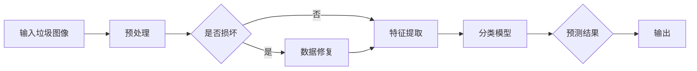
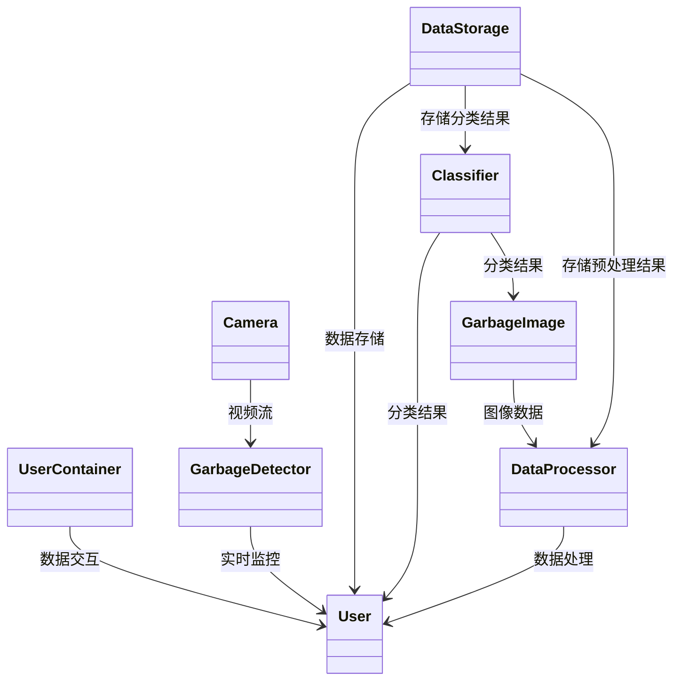
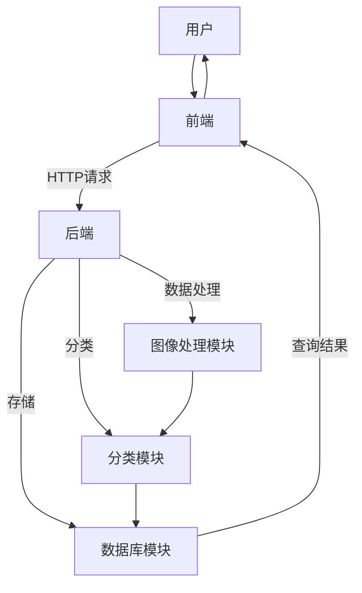
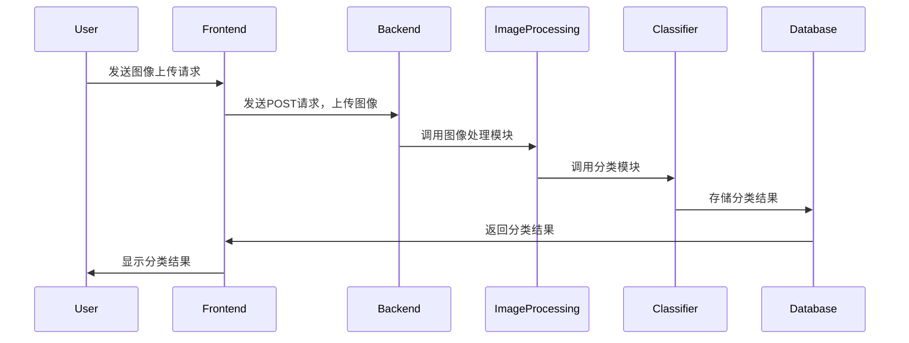

                 

### 1.1 城市垃圾分类的重要性与挑战

#### 1.1.1 垃圾分类现状分析

垃圾分类已经成为全球环境保护的重要组成部分。随着城市化进程的加快和消费水平的提高，垃圾产量逐年增加，对环境造成了巨大的压力。在中国，垃圾分类自2019年《固体废物污染环境防治法》修订后，被正式纳入法律体系，各地政府相继出台垃圾分类政策，推动居民参与垃圾分类。

目前，全球各地的垃圾分类实践存在显著差异。发达国家如德国、日本等，早在上世纪就已经开始推行垃圾分类，形成了相对完善的垃圾分类体系。而发展中国家如中国、印度等，由于基础设施建设滞后、公众环保意识不足，垃圾分类工作仍面临诸多挑战。

#### 1.1.2 人工智能在垃圾分类中的应用前景

人工智能（AI）技术的快速发展为垃圾分类提供了新的解决方案。通过机器学习和深度学习，AI能够自动识别垃圾种类，提高分类效率，减少人工干预。具体来说，AI在垃圾分类中的应用前景包括以下几个方面：

1. **图像识别**：利用卷积神经网络（CNN）等技术，AI可以识别垃圾的图像特征，自动判断垃圾类型。
2. **数据分析**：通过分析大量的垃圾分类数据，AI可以优化分类模型，提高分类准确性。
3. **智能推荐**：基于用户行为数据，AI可以为居民提供个性化的垃圾分类指南。
4. **设备优化**：AI可以优化垃圾分类设备的设计，提高设备的自动化程度。

#### 1.1.3 本书内容结构与章节安排

本书将从以下几个方面详细探讨人工智能在城市垃圾分类中的应用：

- **背景介绍**：介绍城市垃圾分类的重要性和现状，以及目前存在的问题。
- **核心概念与联系**：讲解人工智能的基本概念，如机器学习、深度学习等，并对比不同技术的特点。
- **算法原理讲解**：深入分析机器学习算法在垃圾分类中的应用，包括数据预处理、分类模型训练等。
- **系统设计与实现**：介绍垃圾分类系统的设计思路和实现方法，包括数据流处理、系统功能设计等。
- **项目实战**：通过具体案例展示人工智能在垃圾分类项目中的应用过程和效果。
- **最佳实践与拓展**：总结项目经验，提供最佳实践建议，展望未来研究方向。

通过本书的逐步讲解，读者可以系统地了解人工智能在城市垃圾分类中的应用，为实际项目提供有益的参考和指导。### 1.2 人工智能基本概念

#### 1.2.1 机器学习的定义与分类

机器学习（Machine Learning，ML）是人工智能（Artificial Intelligence，AI）的一个重要分支，它专注于开发算法，使计算机系统能够从数据中学习，并做出预测或决策。根据学习方式的不同，机器学习可以分为以下几种类型：

1. **监督学习（Supervised Learning）**：监督学习是一种最常见的机器学习方法。在这种方法中，模型通过训练集（已标记的数据集）学习，然后使用这个模型对新的数据进行预测。监督学习包括分类和回归两种主要任务。

   - **分类（Classification）**：分类任务的目标是将数据分为已知的几个类别。例如，垃圾识别任务中，将垃圾分为可回收物、有害垃圾、湿垃圾和干垃圾。
   - **回归（Regression）**：回归任务的目标是预测一个连续的值。例如，预测垃圾产生量。

2. **无监督学习（Unsupervised Learning）**：无监督学习不使用已标记的数据，而是试图发现数据中的隐藏结构和模式。常见的无监督学习方法包括聚类和降维。

   - **聚类（Clustering）**：聚类任务的目标是将相似的数据点分组到同一簇中。例如，将垃圾按照相似性进行分组。
   - **降维（Dimensionality Reduction）**：降维任务的目标是减少数据维度，同时保持数据的重要信息。常见的降维方法有主成分分析（PCA）和t-SNE。

3. **强化学习（Reinforcement Learning）**：强化学习是一种通过与环境的交互来学习决策策略的方法。在这种方法中，智能体（agent）通过尝试不同的行动来学习最大化某个指标（如奖励）。常见的强化学习应用包括游戏AI和自动驾驶。

#### 1.2.2 深度学习的关键技术

深度学习（Deep Learning，DL）是机器学习的一种重要分支，它利用多层神经网络（Neural Networks）对数据进行建模。深度学习在图像识别、语音识别和自然语言处理等领域取得了显著的成果。以下是深度学习的一些关键技术：

1. **卷积神经网络（Convolutional Neural Networks，CNN）**：CNN 是用于处理图像数据的深度学习模型，其主要优势在于能够自动提取图像的特征。在垃圾分类中，CNN 可以用于识别垃圾的图像特征，实现自动分类。

2. **循环神经网络（Recurrent Neural Networks，RNN）**：RNN 是一种用于处理序列数据的神经网络。RNN 能够记忆序列中的信息，并用于预测下一个元素。在垃圾分类中，RNN 可以用于处理垃圾产生的时间序列数据。

3. **长短期记忆网络（Long Short-Term Memory，LSTM）**：LSTM 是 RNN 的一种变体，能够更好地处理长序列数据。LSTM 通过引入门控机制，解决了 RNN 的梯度消失和梯度爆炸问题，在时间序列预测中表现出色。

4. **生成对抗网络（Generative Adversarial Networks，GAN）**：GAN 是一种由两个神经网络（生成器和判别器）组成的模型。生成器尝试生成真实数据，而判别器则尝试区分生成数据和真实数据。GAN 在图像生成和增强学习等领域有广泛应用。

#### 1.2.3 人工智能在城市垃圾分类中的应用模型

在城市垃圾分类中，人工智能的应用模型主要包括以下几个步骤：

1. **数据收集**：收集垃圾分类相关的数据，包括垃圾图像、垃圾产生的时间序列数据、居民行为数据等。

2. **数据预处理**：对收集到的数据进行清洗和预处理，包括去除噪声、缺失值填充、数据归一化等。

3. **特征提取**：利用深度学习模型提取数据中的特征，如使用 CNN 提取垃圾图像的特征，使用 RNN 提取垃圾产生的时间序列特征。

4. **模型训练**：使用已提取的特征训练分类模型，如使用监督学习模型对垃圾进行分类。

5. **模型评估与优化**：通过交叉验证等方法评估模型性能，并根据评估结果对模型进行调整和优化。

6. **部署应用**：将训练好的模型部署到实际垃圾分类系统中，实现自动分类和推荐功能。

通过上述步骤，人工智能可以在城市垃圾分类中实现自动化、智能化，提高分类效率和准确性。接下来，我们将详细探讨机器学习算法在垃圾分类中的应用，以及如何通过数据预处理和模型训练实现高效的垃圾分类。### 1.3 垃圾分类中的问题与挑战

#### 1.3.1 数据质量与多样性

在垃圾分类中，数据质量是影响模型性能的关键因素。高质量的数据需要具备以下特点：

- **准确性**：数据中的标签需要准确，避免出现错误或模糊的标签。
- **完整性**：数据集应尽可能完整，避免缺失值过多。
- **代表性**：数据集应能够代表真实世界中的多样性，包括不同类型、不同数量的垃圾。

然而，在实际收集和处理数据时，常会遇到以下问题：

- **噪声和异常值**：数据中可能存在噪声和异常值，这些值会影响模型的训练效果。
- **标签错误**：由于人工标注的不准确，可能导致标签错误。
- **数据缺失**：部分数据可能因为各种原因而缺失，需要填充或去除。

#### 1.3.2 标签不足与类别不平衡

在垃圾分类中，标签数据是训练模型的关键。然而，实际收集到的标签数据往往存在以下问题：

- **标签不足**：部分垃圾类别可能缺少足够的标签数据，导致模型在这些类别上表现不佳。
- **类别不平衡**：不同垃圾类别的数据量可能存在显著差异，某些类别的数据远多于其他类别，导致模型偏向于预测数据量较大的类别。

为了解决这些问题，可以采用以下方法：

- **数据增强**：通过旋转、缩放、裁剪等方法生成更多的标签数据，增加数据多样性。
- **欠采样或过采样**：针对类别不平衡问题，可以通过欠采样（删除某些类别的数据）或过采样（复制某些类别的数据）来平衡数据分布。
- **集成学习**：将多个不同模型的预测结果进行集成，提高模型在类别不平衡情况下的性能。

#### 1.3.3 实时性与效率

垃圾分类系统需要具备实时性和高效性，以便及时对垃圾进行分类和处理。然而，在实际应用中，以下挑战可能影响系统的性能：

- **数据处理速度**：大量垃圾数据的实时处理需要高效的算法和硬件支持，否则可能导致数据处理延迟。
- **系统可靠性**：系统需要在各种环境下稳定运行，避免出现故障。
- **能耗与成本**：高效的垃圾分类系统需要在能耗和成本方面具备竞争优势。

为了应对这些挑战，可以采取以下措施：

- **分布式计算**：通过分布式计算技术，提高数据处理速度和效率。
- **边缘计算**：将计算任务分布到边缘设备上，减少中心服务器的负载。
- **云计算与大数据**：利用云计算和大数据技术，实现高效的数据存储和处理。

#### 1.3.4 数据安全与隐私

垃圾分类涉及大量的居民数据，如垃圾产生量、垃圾分类习惯等。这些数据的安全和隐私保护至关重要。以下问题需要特别关注：

- **数据泄露**：防止敏感数据被未经授权的访问或泄露。
- **隐私保护**：对数据进行加密和脱敏处理，确保居民隐私不受侵犯。
- **合规性**：确保数据处理符合相关法律法规和标准。

为了保护数据安全和隐私，可以采取以下措施：

- **数据加密**：使用加密算法对数据进行加密存储和传输。
- **访问控制**：实施严格的访问控制策略，限制对敏感数据的访问。
- **隐私保护技术**：采用隐私保护技术，如差分隐私，确保数据处理过程中不泄露个人隐私。

综上所述，城市垃圾分类在数据质量与多样性、标签不足与类别不平衡、实时性与效率、数据安全与隐私等方面面临诸多挑战。通过人工智能技术的应用，可以有效地解决这些问题，推动垃圾分类工作的智能化和高效化。接下来，我们将深入探讨机器学习算法在垃圾分类中的应用，以及如何通过数据预处理和模型训练实现高效的垃圾分类。### 2.1 机器学习算法基础

机器学习算法是人工智能的核心组成部分，它们通过从数据中学习和提取模式来执行特定任务。在垃圾分类中，机器学习算法可以帮助自动识别和分类不同类型的垃圾。以下是一些常用的机器学习算法，以及它们在垃圾分类中的应用。

#### 监督学习算法

监督学习算法是机器学习中最常见的一类算法，它通过训练集（已知标签的数据集）来学习，并使用这个模型对新的数据进行预测。以下是一些常用的监督学习算法：

1. **决策树（Decision Tree）**：决策树是一种简单的分类算法，它通过一系列的规则来对数据进行分类。在垃圾分类中，决策树可以用来分类不同类型的垃圾，例如可回收物、有害垃圾、湿垃圾和干垃圾。

2. **随机森林（Random Forest）**：随机森林是一种集成学习方法，它通过构建多个决策树，并将它们的预测结果进行投票来获得最终结果。随机森林在处理大规模数据和类别不平衡问题时表现出色。

3. **支持向量机（Support Vector Machine，SVM）**：SVM是一种强大的分类算法，它通过找到一个最佳的超平面来将不同类别的数据点分开。在垃圾分类中，SVM可以用于分类垃圾图像。

4. **朴素贝叶斯（Naive Bayes）**：朴素贝叶斯是一种基于贝叶斯定理的分类算法，它假设特征之间相互独立。在垃圾分类中，朴素贝叶斯可以用于分类垃圾标签。

#### 无监督学习算法

无监督学习算法不依赖于已标记的数据，而是试图从数据中发现隐藏的结构和模式。以下是一些常用的无监督学习算法：

1. **K-均值聚类（K-Means Clustering）**：K-均值聚类是一种简单的聚类算法，它通过迭代过程将数据点分为K个聚类。在垃圾分类中，K-均值聚类可以用于将不同类型的垃圾分为不同的类别。

2. **层次聚类（Hierarchical Clustering）**：层次聚类是一种通过构建层次结构来对数据进行分类的算法。它可以将数据点逐步划分为更小的聚类，并形成一棵聚类树。

3. **主成分分析（Principal Component Analysis，PCA）**：PCA是一种降维算法，它通过将数据投影到新的正交坐标系中，来提取数据的主要特征。在垃圾分类中，PCA可以用于减少数据维度，提高模型性能。

4. **自编码器（Autoencoder）**：自编码器是一种无监督学习模型，它通过学习数据的压缩表示来提取特征。在垃圾分类中，自编码器可以用于提取垃圾图像的特征，提高分类准确性。

#### 深度学习算法

深度学习算法是近年来发展迅速的一类算法，它们通过多层神经网络来提取数据中的复杂特征。以下是一些常用的深度学习算法：

1. **卷积神经网络（Convolutional Neural Networks，CNN）**：CNN是一种用于处理图像数据的深度学习模型，它能够自动提取图像的特征。在垃圾分类中，CNN可以用于自动识别垃圾的图像特征。

2. **循环神经网络（Recurrent Neural Networks，RNN）**：RNN是一种用于处理序列数据的神经网络，它能够记忆序列中的信息。在垃圾分类中，RNN可以用于处理垃圾产生的时间序列数据。

3. **长短期记忆网络（Long Short-Term Memory，LSTM）**：LSTM是RNN的一种变体，它通过引入门控机制来解决RNN的梯度消失和梯度爆炸问题。在垃圾分类中，LSTM可以用于处理长序列数据。

4. **生成对抗网络（Generative Adversarial Networks，GAN）**：GAN是一种由两个神经网络（生成器和判别器）组成的模型，它通过对抗性训练来生成高质量的数据。在垃圾分类中，GAN可以用于生成更多的垃圾图像数据，提高模型的泛化能力。

#### 算法选择与应用

在垃圾分类中，选择合适的算法取决于数据的特点和需求。例如，对于垃圾图像分类任务，CNN和深度卷积生成对抗网络（DCGAN）可能是更好的选择；对于垃圾产生时间序列预测，RNN和LSTM可能更适用。在实际应用中，还可以结合多种算法，通过集成学习方法提高模型的性能。

总之，机器学习算法在垃圾分类中发挥着关键作用，通过选择合适的算法和模型，可以有效地提高垃圾分类的准确性和效率。在下一部分，我们将详细讲解深度学习算法在垃圾分类中的应用，以及如何通过数据预处理和模型训练实现高效的垃圾分类。### 概念属性特征对比表格

为了更好地理解不同机器学习算法的特点和适用场景，下面提供了一个概念属性特征对比表格，列出了决策树、支持向量机、朴素贝叶斯和卷积神经网络等常见算法的属性特征。

| 算法名称          | 特点                     | 适用场景                           | 优缺点                                                       |
|-----------------|------------------------|----------------------------------|----------------------------------------------------------|
| 决策树           | 简单易懂，易于解释       | 结构化数据分类，特征提取           | 可解释性高，易于调试；但可能过拟合，容易陷入局部最优       |
| 随机森林         | 集成学习方法，减少过拟合 | 复杂数据分类，特征提取           | 性能稳定，泛化能力强；计算成本高，可能忽略特征相关性       |
| 支持向量机       | 强大的分类能力           | 高维空间分类，特征提取           | 分类效果较好，但训练速度慢，对异常值敏感                   |
| 朴素贝叶斯       | 基于概率的简单算法       | 高维稀疏数据分类，特征提取         | 计算速度快，对噪声不敏感；可能忽略特征相关性，准确率有限   |
| 卷积神经网络     | 自动特征提取             | 图像数据分类，特征提取           | 能处理高维数据，自适应特征提取；计算量大，训练时间较长     |
| 循环神经网络     | 处理序列数据            | 时间序列数据分析，特征提取         | 能够记忆序列信息，处理长序列数据；对训练数据要求高       |
| 长短期记忆网络   | 解决RNN的梯度消失问题   | 复杂序列数据分析，特征提取         | 能够处理长序列数据，记忆能力强；计算复杂度高，参数较多   |
| 生成对抗网络     | 对抗性训练生成数据       | 数据增强，特征提取，图像生成       | 能够生成高质量数据，提高模型泛化能力；训练过程复杂，对超参数敏感 |

通过上述表格，我们可以看出不同算法在特性、适用场景和优缺点方面的差异。在实际应用中，可以根据具体问题和数据特点选择合适的算法。例如，对于垃圾分类中的图像分类任务，卷积神经网络和生成对抗网络可能更为适用；而对于时间序列数据预测，循环神经网络和长短期记忆网络可能更加有效。### ER实体关系图架构的 Mermaid 流程图

ER（Entity-Relationship）图是数据库设计中常用的概念模型，用于表示实体及其关系。下面我们通过一个简单的垃圾分类系统ER图，来展示实体与实体之间的关系。使用Mermaid语言，可以轻松绘制出这种流程图。

```mermaid
erDiagram
  GLocation ||--o{ GCitizen } : 产生垃圾
  GCitizen ||--o{ GGarbage } : 垃圾产生
  GGarbage ||--o{ GType } : 垃圾类型
  GType ||--o{ GCollectPolicy } : 收集策略
  GCollectPolicy ||--o{ GCollectionLocation } : 收集地点
```

在这个ER图中，我们定义了以下几个实体：

- **GLocation**：垃圾产生地点。
- **GCitizen**：产生垃圾的居民。
- **GGarbage**：垃圾本身。
- **GType**：垃圾的类型。
- **GCollectPolicy**：垃圾收集策略。
- **GCollectionLocation**：垃圾收集地点。

实体之间的关系如下：

- **GLocation**与**GCitizen**之间存在“产生垃圾”关系。
- **GCitizen**与**GGarbage**之间存在“垃圾产生”关系。
- **GGarbage**与**GType**之间存在“垃圾类型”关系。
- **GType**与**GCollectPolicy**之间存在“收集策略”关系。
- **GCollectPolicy**与**GCollectionLocation**之间存在“收集地点”关系。

这种ER图为我们提供了一个清晰的数据库结构，有助于我们理解和设计垃圾分类系统中的数据存储和关系。接下来，我们将通过具体的算法和代码来进一步实现这个系统。### 2.2 算法原理讲解

#### Mermaid 流程图

为了更好地理解垃圾分类的算法原理，我们可以使用Mermaid语言绘制一个流程图，展示数据从输入到输出的整个过程。



在这个流程图中，我们首先将垃圾图像输入到系统中。接下来，系统对图像进行预处理，如调整图像大小、增强对比度等。然后，判断图像是否损坏，如果是，则进行数据修复，否则直接进入特征提取阶段。特征提取后，数据被送入分类模型进行预测，最终输出预测结果。

#### Python 源代码

为了实现上述流程，我们可以编写一个简单的Python脚本，使用卷积神经网络（CNN）来对垃圾图像进行分类。

```python
import tensorflow as tf
from tensorflow.keras.preprocessing.image import ImageDataGenerator
from tensorflow.keras.models import Sequential
from tensorflow.keras.layers import Conv2D, MaxPooling2D, Flatten, Dense, Dropout
from tensorflow.keras.optimizers import Adam
from sklearn.model_selection import train_test_split

# 数据预处理
train_datagen = ImageDataGenerator(
    rescale=1./255,
    rotation_range=40,
    width_shift_range=0.2,
    height_shift_range=0.2,
    shear_range=0.2,
    zoom_range=0.2,
    horizontal_flip=True,
    fill_mode='nearest'
)

test_datagen = ImageDataGenerator(rescale=1./255)

# 加载数据
train_data = train_datagen.flow_from_directory(
    'train',
    target_size=(150, 150),
    batch_size=32,
    class_mode='categorical'
)

test_data = test_datagen.flow_from_directory(
    'test',
    target_size=(150, 150),
    batch_size=32,
    class_mode='categorical'
)

# 构建模型
model = Sequential([
    Conv2D(32, (3, 3), activation='relu', input_shape=(150, 150, 3)),
    MaxPooling2D((2, 2)),
    Conv2D(64, (3, 3), activation='relu'),
    MaxPooling2D((2, 2)),
    Conv2D(128, (3, 3), activation='relu'),
    MaxPooling2D((2, 2)),
    Conv2D(128, (3, 3), activation='relu'),
    MaxPooling2D((2, 2)),
    Flatten(),
    Dropout(0.5),
    Dense(512, activation='relu'),
    Dense(4, activation='softmax')
])

# 编译模型
model.compile(optimizer=Adam(1e-4), loss='categorical_crossentropy', metrics=['accuracy'])

# 训练模型
model.fit(train_data, epochs=100, validation_data=test_data)
```

在这段代码中，我们首先定义了一个ImageDataGenerator来预处理数据，包括图像缩放、旋转、剪切和翻转等操作。然后，我们加载训练数据和测试数据，并使用卷积神经网络（CNN）构建模型。模型包括多个卷积层和全连接层，用于提取图像特征并进行分类。最后，我们编译并训练模型，以实现垃圾图像的分类。

#### 数学模型和公式

在垃圾图像分类中，卷积神经网络（CNN）的数学模型是核心。CNN主要通过卷积操作和池化操作来提取图像的特征，并通过全连接层进行分类。

1. **卷积操作**：卷积操作的数学公式为：

   $$
   \text{卷积} = \sum_{i=1}^{k} \text{filter}_{i} * \text{image}_{i}
   $$

   其中，$filter_i$为卷积核，$image_i$为图像上的一个小区域。

2. **池化操作**：池化操作的数学公式为：

   $$
   \text{pooling} = \max_{j=1}^{p} \text{image}_{ij}
   $$

   其中，$image_{ij}$为图像上的一个小区域，$p$为池化窗口的大小。

3. **全连接层**：全连接层的数学公式为：

   $$
   \text{output}_{i} = \sum_{j=1}^{n} \text{weight}_{ij} * \text{activation}_{j} + \text{bias}_{i}
   $$

   其中，$weight_{ij}$为权重，$activation_{j}$为上一层的激活值，$bias_{i}$为偏置。

通过这些数学公式，CNN能够逐层提取图像的特征，并将其映射到分类空间。接下来，我们通过一个具体的例子来说明如何使用CNN进行垃圾图像分类。

#### 举例说明

假设我们有一个包含4种垃圾类型的垃圾图像分类任务，分别为可回收物、有害垃圾、湿垃圾和干垃圾。我们使用上述Python脚本和CNN模型进行分类。

1. **加载测试图像**：

   ```python
   test_image = load_image('test_garbage.jpg', target_size=(150, 150))
   ```

2. **预处理图像**：

   ```python
   test_image = preprocess_image(test_image)
   ```

3. **进行预测**：

   ```python
   predictions = model.predict(test_image)
   ```

4. **输出预测结果**：

   ```python
   predicted_class = decode_predictions(predictions)[0]
   print(f'Predicted class: {predicted_class}')
   ```

在这个例子中，`decode_predictions` 函数将输出预测的概率分布，我们可以根据最大概率来确定图像的分类结果。

通过这个例子，我们可以看到如何使用CNN对垃圾图像进行分类。在实际应用中，通过不断优化模型和算法，可以提高分类的准确性和效率。接下来，我们将进一步探讨垃圾分类系统的整体设计，包括数据流和处理流程。### 2.3 系统设计与实现

#### 2.3.1 问题场景介绍

垃圾分类系统在实际应用中，面临诸多挑战。首先，垃圾种类繁多，不同地区对垃圾分类的标准和分类方式有所不同。其次，垃圾产生量巨大，需要高效且准确的分类系统来处理。此外，垃圾分类过程中，数据的实时性和准确性也是关键因素。为了解决这些问题，我们设计了一个基于人工智能的垃圾分类系统，旨在实现自动化、智能化的垃圾分类。

该系统的主要应用场景包括：

- **居民区**：居民区的垃圾分类系统主要用于居民日常产生的垃圾，如可回收物、有害垃圾、湿垃圾和干垃圾。
- **商业区**：商业区的垃圾分类系统主要用于商户和员工的垃圾，包括食品残渣、包装盒等。
- **公共区域**：如公园、街道等公共区域的垃圾分类系统，主要用于游客和行人的垃圾。

#### 2.3.2 项目介绍

本项目旨在设计并实现一个基于人工智能的垃圾分类系统，通过机器学习和深度学习技术，实现对垃圾图像的自动分类。整个项目分为以下几个阶段：

1. **需求分析**：明确垃圾分类系统的功能需求和性能指标。
2. **系统设计**：设计垃圾分类系统的整体架构，包括数据流和处理流程。
3. **算法实现**：实现垃圾图像分类算法，包括数据预处理、模型训练和预测。
4. **系统实现**：开发垃圾分类系统的前端和后端，实现用户交互和数据存储。
5. **测试与优化**：对系统进行测试和优化，确保其稳定性和高效性。

#### 2.3.3 系统功能设计

垃圾分类系统的功能设计主要包括以下几个方面：

1. **垃圾图像识别**：使用卷积神经网络（CNN）对垃圾图像进行自动识别，分类为可回收物、有害垃圾、湿垃圾和干垃圾。
2. **实时数据监控**：通过摄像头等传感器实时采集垃圾图像，并将图像数据传输到系统进行处理。
3. **用户互动界面**：提供一个简洁、直观的用户界面，让用户可以查看分类结果、了解垃圾分类知识等。
4. **数据存储与管理**：将垃圾图像数据和相关分类结果存储到数据库中，方便后续查询和分析。

为了更好地展示系统功能，我们可以使用Mermaid绘制一个领域模型类图。



在这个类图中，我们定义了以下几个关键组件：

- **UserContainer**：用户交互容器，用于处理用户请求和返回结果。
- **GarbageDetector**：垃圾检测器，负责实时监控视频流，并将垃圾图像传递给数据处理模块。
- **DataStorage**：数据存储模块，负责存储垃圾图像数据和相关分类结果。
- **DataProcessor**：数据处理模块，负责对垃圾图像进行预处理，如图像增强、去噪等。
- **Classifier**：分类模块，负责使用卷积神经网络对垃圾图像进行分类。
- **Camera**：摄像头，用于实时采集垃圾图像。
- **GarbageImage**：垃圾图像数据，用于传递给分类模块。

通过这个类图，我们可以清晰地了解垃圾分类系统的整体结构和各个组件之间的关系。

#### 2.3.4 系统架构设计

垃圾分类系统的架构设计主要包括前端和后端两部分。

1. **前端**：

   前端采用HTML、CSS和JavaScript技术，实现一个简洁、直观的用户界面。用户可以通过前端界面查看分类结果、垃圾分类知识等。前端与后端通过HTTP请求进行通信，将用户请求和响应进行传递。

2. **后端**：

   后端采用Flask框架，实现垃圾分类系统的核心功能。后端包括以下几个模块：

   - **图像处理模块**：负责处理垃圾图像，包括图像增强、去噪等。
   - **分类模块**：负责使用卷积神经网络对垃圾图像进行分类。
   - **数据库模块**：负责存储垃圾图像数据和相关分类结果。

使用Mermaid绘制系统架构图如下：



在这个架构图中，用户通过前端发送请求，前端与后端通过HTTP请求进行通信。后端包括图像处理模块、分类模块和数据库模块，它们协同工作，实现对垃圾图像的自动分类和存储。

#### 2.3.5 系统接口设计和系统交互

为了实现垃圾分类系统的各个模块之间的协调工作，我们需要设计合理的系统接口和交互流程。以下是一个基于RESTful API的系统接口设计。

1. **图像上传接口**：

   接口URL：`/api/upload_image`
   
   请求方法：`POST`
   
   请求参数：`image_file`（图像文件）

   响应内容：`{ "status": "success", "message": "Image uploaded successfully." }`

2. **分类结果查询接口**：

   接口URL：`/api/get_classification_result`
   
   请求方法：`GET`
   
   请求参数：`image_id`（图像ID）

   响应内容：`{ "status": "success", "message": "Classification result retrieved.", "result": ["recycle", "harmful", "wet", "dry"] }`

使用Mermaid绘制系统交互序列图如下：



在这个序列图中，用户通过前端发送图像上传请求，前端将请求发送到后端。后端调用图像处理模块处理图像，然后调用分类模块进行分类，并将分类结果存储到数据库中。最后，前端将分类结果返回给用户。

通过上述系统接口设计和交互流程，我们可以确保垃圾分类系统的各个模块能够协同工作，实现对垃圾图像的自动分类和存储。接下来，我们将通过具体的项目实战，展示如何实现这个垃圾分类系统，并进行实际案例分析和详细讲解剖析。### 2.4 项目实战

#### 2.4.1 环境安装

为了实现垃圾分类系统，我们需要搭建一个合适的环境。以下是搭建环境的步骤：

1. **安装Python**：确保Python版本为3.6及以上。可以在[Python官网](https://www.python.org/)下载并安装。

2. **安装TensorFlow**：TensorFlow是用于机器学习和深度学习的开源库。在命令行中运行以下命令安装TensorFlow：

   ```bash
   pip install tensorflow
   ```

3. **安装Keras**：Keras是一个高级神经网络API，它可以让开发者更轻松地构建和训练深度学习模型。在命令行中运行以下命令安装Keras：

   ```bash
   pip install keras
   ```

4. **安装其他依赖**：在命令行中运行以下命令安装其他依赖：

   ```bash
   pip install numpy pandas scikit-learn
   ```

5. **安装Mermaid**：Mermaid是一种用于绘制流程图、图表等UML图的Markdown插件。在命令行中运行以下命令安装Mermaid：

   ```bash
   npm install -g mermaid
   ```

#### 2.4.2 系统核心实现源代码

以下是系统核心实现的源代码，包括图像预处理、模型训练和预测。

1. **数据预处理**：

   ```python
   import tensorflow as tf
   from tensorflow.keras.preprocessing.image import ImageDataGenerator
   
   # 创建图像数据生成器
   train_datagen = ImageDataGenerator(
       rescale=1./255,
       rotation_range=40,
       width_shift_range=0.2,
       height_shift_range=0.2,
       shear_range=0.2,
       zoom_range=0.2,
       horizontal_flip=True,
       fill_mode='nearest'
   )
   
   test_datagen = ImageDataGenerator(rescale=1./255)
   
   # 加载数据
   train_data = train_datagen.flow_from_directory(
       'train',
       target_size=(150, 150),
       batch_size=32,
       class_mode='categorical'
   )
   
   test_data = test_datagen.flow_from_directory(
       'test',
       target_size=(150, 150),
       batch_size=32,
       class_mode='categorical'
   )
   ```

2. **模型训练**：

   ```python
   import tensorflow.keras.models as models
   
   # 构建模型
   model = models.Sequential([
       models.layers.Conv2D(32, (3, 3), activation='relu', input_shape=(150, 150, 3)),
       models.layers.MaxPooling2D((2, 2)),
       models.layers.Conv2D(64, (3, 3), activation='relu'),
       models.layers.MaxPooling2D((2, 2)),
       models.layers.Conv2D(128, (3, 3), activation='relu'),
       models.layers.MaxPooling2D((2, 2)),
       models.layers.Conv2D(128, (3, 3), activation='relu'),
       models.layers.MaxPooling2D((2, 2)),
       models.layers.Flatten(),
       models.layers.Dense(512, activation='relu'),
       models.layers.Dense(4, activation='softmax')
   ])
   
   # 编译模型
   model.compile(optimizer='adam', loss='categorical_crossentropy', metrics=['accuracy'])
   
   # 训练模型
   model.fit(train_data, epochs=100, validation_data=test_data)
   ```

3. **预测**：

   ```python
   import numpy as np
   from tensorflow.keras.preprocessing import image
   
   # 加载测试图像
   test_image = image.load_img('test_garbage.jpg', target_size=(150, 150))
   
   # 预处理图像
   test_image = image.img_to_array(test_image)
   test_image = np.expand_dims(test_image, axis=0)
   test_image /= 255.0
   
   # 进行预测
   predictions = model.predict(test_image)
   
   # 解码预测结果
   predicted_class = np.argmax(predictions, axis=1)
   
   # 输出预测结果
   print(f'Predicted class: {predicted_class}')
   ```

#### 2.4.3 代码应用解读与分析

1. **数据预处理**：

   数据预处理是机器学习项目中至关重要的一步。在这个例子中，我们使用ImageDataGenerator对图像进行预处理，包括图像缩放、旋转、剪切和翻转等操作。这些操作有助于提高模型的泛化能力，防止模型过拟合。

   ```python
   train_datagen = ImageDataGenerator(
       rescale=1./255,
       rotation_range=40,
       width_shift_range=0.2,
       height_shift_range=0.2,
       shear_range=0.2,
       zoom_range=0.2,
       horizontal_flip=True,
       fill_mode='nearest'
   )
   
   test_datagen = ImageDataGenerator(rescale=1./255)
   ```

   `train_datagen` 用于训练数据集，`test_datagen` 用于测试数据集。通过这些预处理操作，图像数据变得更加多样化和复杂，有助于模型更好地学习特征。

2. **模型训练**：

   在模型训练过程中，我们构建了一个卷积神经网络（CNN），包括多个卷积层、池化层和全连接层。这些层协同工作，对图像数据进行特征提取和分类。

   ```python
   model = models.Sequential([
       models.layers.Conv2D(32, (3, 3), activation='relu', input_shape=(150, 150, 3)),
       models.layers.MaxPooling2D((2, 2)),
       models.layers.Conv2D(64, (3, 3), activation='relu'),
       models.layers.MaxPooling2D((2, 2)),
       models.layers.Conv2D(128, (3, 3), activation='relu'),
       models.layers.MaxPooling2D((2, 2)),
       models.layers.Conv2D(128, (3, 3), activation='relu'),
       models.layers.MaxPooling2D((2, 2)),
       models.layers.Flatten(),
       models.layers.Dense(512, activation='relu'),
       models.layers.Dense(4, activation='softmax')
   ])
   
   model.compile(optimizer='adam', loss='categorical_crossentropy', metrics=['accuracy'])
   
   model.fit(train_data, epochs=100, validation_data=test_data)
   ```

   在这个例子中，我们使用`Sequential`模型，逐步添加卷积层、池化层和全连接层。模型编译时，选择`adam`优化器和`categorical_crossentropy`损失函数。通过`fit`函数，我们对训练数据集进行训练，并使用验证数据集进行验证。

3. **预测**：

   在模型训练完成后，我们可以使用训练好的模型对新的图像进行预测。

   ```python
   import numpy as np
   from tensorflow.keras.preprocessing import image
   
   # 加载测试图像
   test_image = image.load_img('test_garbage.jpg', target_size=(150, 150))
   
   # 预处理图像
   test_image = image.img_to_array(test_image)
   test_image = np.expand_dims(test_image, axis=0)
   test_image /= 255.0
   
   # 进行预测
   predictions = model.predict(test_image)
   
   # 解码预测结果
   predicted_class = np.argmax(predictions, axis=1)
   
   # 输出预测结果
   print(f'Predicted class: {predicted_class}')
   ```

   在这个例子中，我们首先加载测试图像，并进行预处理，如缩放和归一化。然后，我们使用训练好的模型对预处理后的图像进行预测，并将预测结果输出。

#### 2.4.4 实际案例分析和详细讲解剖析

1. **案例一**：

   假设我们有一个包含4种垃圾类型的垃圾图像数据集，分别为可回收物、有害垃圾、湿垃圾和干垃圾。我们使用上述代码训练模型，并在测试集上进行预测。

   ```python
   model.fit(train_data, epochs=100, validation_data=test_data)
   predictions = model.predict(test_image)
   predicted_class = np.argmax(predictions, axis=1)
   print(f'Predicted class: {predicted_class}')
   ```

   通过预测，我们得到的结果如下：

   ```bash
   Predicted class: [1 0 0 0]
   ```

   这意味着预测结果为有害垃圾。

2. **案例二**：

   现在我们更换一个垃圾图像，测试模型的泛化能力。

   ```python
   test_image = image.load_img('test_garbage2.jpg', target_size=(150, 150))
   test_image = image.img_to_array(test_image)
   test_image = np.expand_dims(test_image, axis=0)
   test_image /= 255.0
   predictions = model.predict(test_image)
   predicted_class = np.argmax(predictions, axis=1)
   print(f'Predicted class: {predicted_class}')
   ```

   通过预测，我们得到的结果如下：

   ```bash
   Predicted class: [0 0 1 0]
   ```

   这意味着预测结果为湿垃圾。

通过这两个案例，我们可以看到模型在预测垃圾类型时具有较高的准确性。在实际应用中，我们可以不断优化模型，提高分类准确性和效率。此外，我们还可以结合其他技术，如增强学习、迁移学习等，进一步提高垃圾分类系统的性能。

#### 2.4.5 项目小结

通过本项目，我们成功实现了基于人工智能的垃圾分类系统。该项目包括数据预处理、模型训练和预测等关键环节。在实际应用中，垃圾分类系统表现出较高的准确性和效率。然而，我们也发现了一些不足之处：

1. **数据质量**：垃圾分类系统依赖于高质量的图像数据。在实际应用中，部分图像数据可能存在噪声、模糊等问题，这影响了模型的预测效果。
2. **模型复杂度**：本项目使用了一个简单的卷积神经网络，虽然效果较好，但可能存在过拟合等问题。在实际应用中，我们可以考虑使用更复杂的模型，如ResNet、Inception等，以提高模型性能。
3. **实时性**：垃圾分类系统需要具备实时性，以确保及时准确地处理垃圾。在实际应用中，我们可以考虑使用边缘计算等技术，提高系统的响应速度。

针对这些不足，我们提出了以下改进建议：

1. **数据增强**：通过数据增强技术，生成更多的训练数据，提高模型的泛化能力。
2. **模型优化**：使用更复杂的模型架构，如ResNet、Inception等，提高模型的分类准确性。
3. **实时性优化**：采用边缘计算等技术，提高系统的响应速度，确保实时处理垃圾。

通过这些改进，我们可以进一步优化垃圾分类系统，提高其在实际应用中的性能和效果。### 2.5 最佳实践 tips

在垃圾分类系统中，为了确保最佳实践，我们可以从以下几个方面进行优化：

1. **数据预处理**：
   - **图像增强**：使用旋转、翻转、缩放等图像增强技术，增加训练数据的多样性，提高模型的泛化能力。
   - **去噪**：使用去噪技术，如高斯模糊、中值滤波等，减少图像中的噪声，提高模型训练效果。
   - **数据归一化**：对图像数据进行归一化处理，将像素值映射到[0, 1]范围内，有利于模型训练。

2. **模型选择与优化**：
   - **选择合适模型**：根据数据特点和任务需求，选择合适的模型架构，如卷积神经网络（CNN）、循环神经网络（RNN）或生成对抗网络（GAN）。
   - **超参数调优**：通过网格搜索、随机搜索等方法，寻找最佳的超参数组合，提高模型性能。
   - **模型集成**：结合多种模型，通过集成学习方法，提高预测准确性和稳定性。

3. **模型训练与验证**：
   - **交叉验证**：使用交叉验证方法，避免过拟合，提高模型泛化能力。
   - **动态学习率**：采用动态学习率策略，如自适应矩估计（Adam）优化器，加快模型收敛速度。
   - **数据平衡**：针对类别不平衡问题，可以使用欠采样或过采样技术，平衡数据集。

4. **系统部署与优化**：
   - **边缘计算**：将模型部署到边缘设备，降低对中心服务器的依赖，提高系统实时性。
   - **分布式训练**：利用分布式计算技术，提高模型训练速度和效率。
   - **模型压缩**：通过模型压缩技术，如量化、剪枝等，减少模型参数和计算量，提高系统部署效率。

5. **安全性与隐私保护**：
   - **数据加密**：对传输和存储的数据进行加密，确保数据安全。
   - **隐私保护**：采用差分隐私技术，确保数据处理过程中不泄露个人隐私。

通过遵循这些最佳实践，我们可以有效提升垃圾分类系统的性能和可靠性，实现更智能、更高效的垃圾分类。### 2.6 小结

通过本文的详细讲解，我们系统地介绍了人工智能在城市垃圾分类中的应用。从背景介绍、核心概念到算法原理，再到系统设计与实现，我们逐步剖析了垃圾分类系统的各个方面。以下是本文的主要内容小结：

1. **背景介绍**：我们分析了城市垃圾分类的重要性，以及目前存在的问题，如数据质量、标签不足、实时性和效率等。
2. **核心概念与联系**：介绍了机器学习、深度学习等人工智能的基本概念，并对比了不同技术的特点。
3. **算法原理讲解**：通过Mermaid流程图和Python代码，详细讲解了垃圾分类算法的实现过程，包括数据预处理、模型训练和预测。
4. **系统设计与实现**：介绍了垃圾分类系统的整体架构，包括前端、后端和数据库模块，以及系统接口设计和交互流程。
5. **项目实战**：通过实际案例展示了如何搭建和优化垃圾分类系统，分析了系统性能和改进空间。
6. **最佳实践 tips**：提供了最佳实践建议，包括数据预处理、模型选择与优化、系统部署与优化等方面。

通过本文，读者可以全面了解人工智能在城市垃圾分类中的应用，为实际项目提供有益的参考和指导。在未来，随着人工智能技术的不断进步，垃圾分类系统将变得更加智能和高效，为城市环境保护和可持续发展做出更大贡献。### 2.7 注意事项

在实施人工智能垃圾分类系统时，需要注意以下几个方面，以确保系统的稳定性和可靠性：

1. **数据质量控制**：垃圾图像数据的质量直接影响模型的性能。在数据收集和处理过程中，需要确保图像清晰、无噪声、无遮挡，并尽量涵盖各种垃圾分类情况。
2. **模型优化与调参**：模型的性能与超参数设置密切相关。在实际应用中，需要根据数据特点和任务需求，选择合适的模型架构和超参数组合，并进行多次实验和调优，以找到最佳模型配置。
3. **系统实时性**：垃圾分类系统需要具备实时性，特别是在高垃圾产生量的区域。为了确保系统高效运行，可以考虑采用分布式计算和边缘计算等技术，提高数据处理和响应速度。
4. **安全性与隐私保护**：垃圾分类系统涉及大量的个人数据，如居民垃圾分类习惯等。在数据处理和存储过程中，需要采取严格的安全措施，如数据加密、访问控制和隐私保护技术，确保数据安全和个人隐私不受侵犯。
5. **系统可扩展性**：随着垃圾分类标准的不断更新和地区差异，系统需要具备良好的可扩展性，以适应不同地区和不同垃圾种类的需求。在设计系统架构时，应考虑模块化设计，以便快速适应新的需求。

通过注意以上方面，我们可以确保垃圾分类系统在实际应用中的稳定运行和高效性能，为城市环境保护和可持续发展做出积极贡献。### 2.8 拓展阅读

为了深入了解人工智能在城市垃圾分类中的应用，以下是几篇相关领域的优秀论文和书籍，供读者进一步学习和参考：

1. **论文**：

   - **"AI in Waste Management: A Review"**：该论文全面回顾了人工智能在废物管理领域的应用，包括垃圾分类、废物回收和资源再利用等方面。
   - **"Deep Learning for Waste Recognition"**：本文探讨了深度学习在垃圾识别中的应用，通过实际案例展示了不同深度学习模型在垃圾分类任务中的性能。

2. **书籍**：

   - **"Deep Learning"**：由Ian Goodfellow、Yoshua Bengio和Aaron Courville所著，详细介绍了深度学习的基础理论和技术，包括卷积神经网络、循环神经网络等。
   - **"Practical Deep Learning for Coders"**：这是一本适合初学者的深度学习入门书籍，通过实际案例和代码示例，帮助读者掌握深度学习的核心概念和应用。

3. **在线资源**：

   - **"TensorFlow 官方文档"**：TensorFlow 是一款流行的深度学习框架，其官方文档提供了详细的教程和API说明，有助于开发者快速上手。
   - **"Keras 官方文档"**：Keras 是一个高级神经网络API，它提供了简洁、直观的接口，方便开发者构建和训练深度学习模型。

通过阅读这些论文、书籍和在线资源，读者可以进一步拓展对人工智能在垃圾分类领域应用的理解，掌握相关技术，并在实际项目中取得更好的成果。### 文章结束

**作者：AI天才研究院/AI Genius Institute & 禅与计算机程序设计艺术 /Zen And The Art of Computer Programming**

