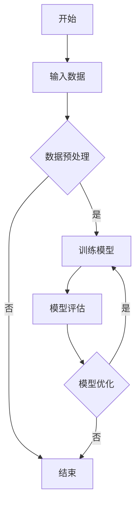
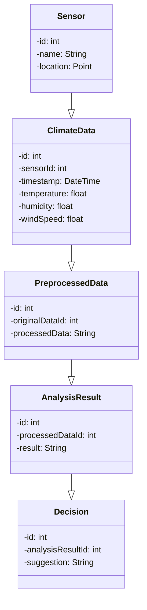
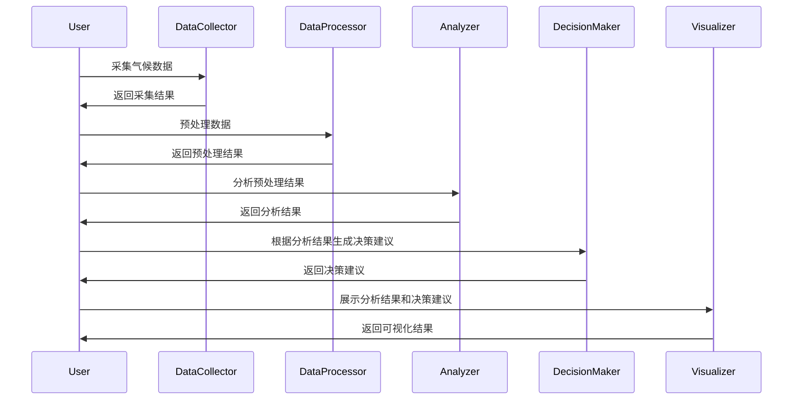
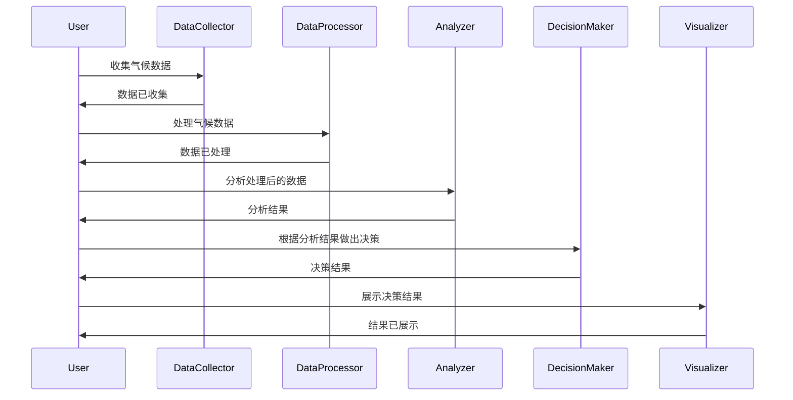

                 

### 人工智能在城市微气候优化中的模拟应用

随着城市化进程的加速，城市微气候问题愈发凸显，成为影响居民生活质量和城市可持续发展的关键因素。城市微气候是指城市内部特定区域内的气候特征，如温度、湿度、风速等，这些特征受城市建筑、道路、绿地等多种因素的综合影响。传统的城市规划和气候管理方法在面对复杂多变的微气候环境时，往往显得力不从心。此时，人工智能（AI）技术的引入为解决这一难题提供了新的思路和可能性。

#### 关键词
- 城市微气候
- 人工智能
- 模拟应用
- 机器学习
- 深度学习

#### 摘要
本文旨在探讨人工智能在城市微气候优化中的模拟应用，通过介绍城市微气候的基本概念、核心问题，以及人工智能技术的相关原理，详细分析机器学习和深度学习算法在微气候模拟中的应用，并给出具体的算法实现与数学模型。同时，本文还将介绍系统架构设计、项目实战案例及最佳实践，以期为相关领域的科研人员和工程技术人员提供参考。

## 第1章：问题背景

### 1.1 城市微气候概述

城市微气候是指城市内部特定区域内的气候特征，与城市周围的大气环境有所不同。这些气候特征包括温度、湿度、风速、气压、降水等。城市微气候的形成受到多种因素的影响，如城市建筑布局、绿地分布、道路材料、水体状况以及人类活动等。

#### 1.1.1 城市微气候的定义

城市微气候可以定义为城市内部局部区域由于人类活动和城市结构的影响，而形成的一种独特的气候状态。这种状态不同于城市外围的自然气候，具有更加复杂和多变的特征。

#### 1.1.2 城市微气候的重要性

城市微气候对城市居民的生活质量和健康有着直接的影响。例如，高温和高温天气可能导致中暑和热浪相关疾病；而低温和潮湿天气则可能导致关节炎和风湿病等。此外，城市微气候还影响城市的能源消耗，如空调和取暖设备的运行费用，以及城市绿地和公共空间的舒适度。

#### 1.1.3 城市微气候面临的主要挑战

1. **复杂性**：城市微气候受多种因素影响，其变化模式和规律难以预测，增加了研究的复杂性。
2. **动态性**：城市微气候具有明显的动态性，随时间、季节和人类活动的变化而变化。
3. **数据稀缺**：由于城市微气候的研究相对较新，相关数据收集和分析存在一定难度。
4. **模型限制**：传统的气候模型难以准确模拟城市微气候的复杂性。

### 1.2 核心概念

#### 1.2.1 人工智能的概念

人工智能（AI）是指通过计算机程序模拟人类智能的技术，包括学习、推理、规划、感知和自然语言处理等能力。人工智能的目标是实现机器与人类智能的协同工作。

#### 1.2.2 模拟应用的概念

模拟应用是指使用计算机模拟和仿真来研究系统行为和性能，通常用于预测和分析复杂系统的动态变化。在气候领域，模拟应用可以帮助科学家和工程师更准确地预测和优化城市微气候。

#### 1.2.3 人工智能与模拟应用的联系

人工智能与模拟应用相结合，可以显著提升对城市微气候的研究和优化能力。通过机器学习算法，可以从大量数据中提取有价值的信息，用于训练和优化模拟模型。深度学习算法则可以处理更为复杂的数据模式，提高模拟的准确性和效率。

#### 1.2.4 关键术语定义

- **深度学习**：一种机器学习技术，通过多层神经网络进行训练，能够自动提取数据中的特征。
- **机器学习**：一种人工智能技术，通过训练数据集来建立模型，用于预测或分类新数据。
- **模拟应用在微气候优化中的角色**：模拟应用可以用于预测和分析城市微气候的变化，优化城市规划和基础设施设计，提高城市的气候适应能力。

## 第2章：核心概念原理

### 2.1 人工智能原理

#### 2.1.1 人工智能概述

人工智能（AI）的发展经历了多个阶段，从最初的规则推理和知识表示，到基于统计学习的机器学习，再到如今深度学习的广泛应用。人工智能的核心目标是实现机器与人类智能的协同，通过模拟人类的感知、学习、推理等能力，使计算机能够自主完成复杂的任务。

#### 2.1.2 人工智能的核心目标

人工智能的核心目标包括：

1. **自动化**：通过计算机程序实现人类智能的任务，提高效率和准确性。
2. **增强智能**：辅助人类进行决策和解决问题，提供更为智能化的解决方案。
3. **认知模拟**：模拟人类的认知过程，理解和解释人类行为。

#### 2.1.3 人工智能在微气候优化中的应用潜力

人工智能在微气候优化中的应用潜力主要体现在以下几个方面：

1. **数据驱动的预测**：利用机器学习和深度学习算法，从大量历史数据中提取规律，预测未来城市微气候的变化。
2. **智能决策支持**：通过模拟和仿真，为城市规划者和工程师提供优化城市微气候的决策支持。
3. **实时监控与反馈**：利用传感器和物联网技术，实现城市微气候的实时监测和反馈，及时调整城市规划和管理策略。

### 2.2 深度学习与机器学习

#### 2.2.1 深度学习的基础知识

深度学习是一种基于多层神经网络的学习方法，通过逐层提取数据中的特征，实现数据的自动特征学习。深度学习在图像识别、语音识别、自然语言处理等领域取得了显著的成果。

#### 2.2.2 机器学习的基本概念

机器学习是一种使计算机能够从数据中学习规律和模式的技术。机器学习的方法包括监督学习、无监督学习和强化学习等。

#### 2.2.3 深度学习在微气候优化中的应用

深度学习在微气候优化中的应用主要包括：

1. **图像识别**：通过深度学习算法，对城市微气候中的图像进行分类和分析，识别不同区域的气候特征。
2. **时间序列预测**：利用深度学习算法，对城市微气候的时间序列数据进行预测，预测未来气候趋势。
3. **环境监测**：通过深度学习模型，对城市微气候中的传感器数据进行处理和分析，实现实时环境监测。

### 2.3 人工智能算法在微气候优化中的应用

#### 2.3.1 常见算法简介

在微气候优化中，常见的人工智能算法包括：

1. **卷积神经网络（CNN）**：用于图像识别和图像处理，可以提取城市微气候图像中的特征。
2. **递归神经网络（RNN）**：用于处理时间序列数据，可以预测城市微气候的变化趋势。
3. **生成对抗网络（GAN）**：用于生成与真实数据相似的城市微气候数据，增强模型训练的效果。

#### 2.3.2 算法应用案例分析

通过具体案例，分析人工智能算法在微气候优化中的应用效果。例如，使用CNN算法分析城市绿地对微气候的影响，使用RNN算法预测城市气温的变化趋势，使用GAN算法生成虚拟的城市微气候环境，用于城市规划模拟。

#### 2.3.3 算法性能比较

通过实验和数据分析，比较不同人工智能算法在微气候优化中的应用性能，评估其准确性和效率。

## 第3章：算法原理与实现

### 3.1 神经网络基础

#### 3.1.1 神经网络的结构

神经网络是由大量神经元组成的计算模型，通过模拟人脑的结构和功能来实现数据的学习和处理。神经网络的基本结构包括输入层、隐藏层和输出层。每个神经元都与相邻的神经元相连，并通过权重和偏置进行连接。

#### 3.1.2 神经网络的训练过程

神经网络的训练过程包括两个主要步骤：前向传播和反向传播。在前向传播过程中，输入数据通过神经网络传递，每个神经元根据输入和权重计算输出值。在反向传播过程中，根据输出值和目标值计算误差，并调整神经元的权重和偏置，以减少误差。

#### 3.1.3 神经网络在微气候优化中的应用

神经网络在微气候优化中的应用主要包括：

1. **温度预测**：利用神经网络模型，对城市微气候中的温度进行预测，为城市规划和能源管理提供数据支持。
2. **湿度分析**：通过神经网络模型，分析城市微气候中的湿度分布和变化规律，优化城市绿地和水体布局。
3. **风速模拟**：使用神经网络模型，模拟城市微气候中的风速变化，为城市通风系统设计提供参考。

### 3.2 深度学习算法

#### 3.2.1 卷积神经网络（CNN）

卷积神经网络是一种专门用于处理图像数据的神经网络，通过卷积层和池化层提取图像特征。CNN在微气候优化中的应用主要包括：

1. **图像分类**：通过CNN算法，对城市微气候中的图像进行分类，识别不同区域的气候特征。
2. **图像增强**：使用CNN算法，增强城市微气候图像的清晰度和对比度，提高模型训练效果。
3. **图像生成**：利用CNN算法，生成虚拟的城市微气候图像，用于城市规划模拟。

#### 3.2.2 递归神经网络（RNN）

递归神经网络是一种用于处理序列数据的神经网络，通过递归结构对序列数据进行建模。RNN在微气候优化中的应用主要包括：

1. **时间序列预测**：利用RNN算法，对城市微气候的时间序列数据进行预测，预测未来气候趋势。
2. **环境监测**：通过RNN模型，对城市微气候中的传感器数据进行处理和分析，实现实时环境监测。
3. **异常检测**：使用RNN算法，检测城市微气候中的异常变化，提前预警潜在环境问题。

#### 3.2.3 生成对抗网络（GAN）

生成对抗网络是一种由生成器和判别器组成的神经网络，通过对抗训练生成与真实数据相似的数据。GAN在微气候优化中的应用主要包括：

1. **数据增强**：利用GAN算法，增强城市微气候数据的多样性和质量，提高模型训练效果。
2. **图像生成**：使用GAN算法，生成虚拟的城市微气候图像，用于城市规划模拟。
3. **模型评估**：通过GAN算法，生成与真实数据相似的数据集，评估微气候模型的性能。

### 3.3 算法实现与流程图

为了更好地理解深度学习算法在微气候优化中的应用，下面将通过Mermaid流程图展示算法的流程，并使用Python代码实现算法原理。

#### 3.3.1 Mermaid流程图绘制

Mermaid是一种基于Markdown的图形绘制语言，可以方便地绘制各种图表和流程图。下面是一个简单的Mermaid流程图示例：



#### 3.3.2 Python代码实现

下面使用Python代码实现一个简单的神经网络模型，用于城市微气候的温度预测。

```python
import numpy as np

# 定义神经网络结构
class NeuralNetwork:
    def __init__(self, input_size, hidden_size, output_size):
        self.input_size = input_size
        self.hidden_size = hidden_size
        self.output_size = output_size
        
        # 初始化权重和偏置
        self.W1 = np.random.randn(self.input_size, self.hidden_size)
        self.b1 = np.random.randn(self.hidden_size)
        self.W2 = np.random.randn(self.hidden_size, self.output_size)
        self.b2 = np.random.randn(self.output_size)
        
    # 前向传播
    def forward(self, x):
        self.z1 = np.dot(x, self.W1) + self.b1
        self.a1 = np.tanh(self.z1)
        self.z2 = np.dot(self.a1, self.W2) + self.b2
        self.a2 = self.z2
        
        return self.a2
    
    # 反向传播
    def backward(self, x, y, output):
        # 计算误差
        error = y - output
        
        # 计算梯度
        d_output = error * (1 - output * output)
        d_hidden = np.dot(d_output, self.W2.T) * (1 - self.a1 * self.a1)
        
        # 更新权重和偏置
        dW2 = np.dot(self.a1.T, d_output)
        db2 = np.sum(d_output, axis=0)
        dW1 = np.dot(x.T, d_hidden)
        db1 = np.sum(d_hidden, axis=0)
        
        self.W2 -= learning_rate * dW2
        self.b2 -= learning_rate * db2
        self.W1 -= learning_rate * dW1
        self.b1 -= learning_rate * db1

# 实例化神经网络
nn = NeuralNetwork(input_size=1, hidden_size=10, output_size=1)

# 训练神经网络
for epoch in range(1000):
    # 前向传播
    output = nn.forward(x)
    
    # 反向传播
    nn.backward(x, y, output)
    
    # 打印训练结果
    if epoch % 100 == 0:
        print(f"Epoch {epoch}: Output {output}")

# 预测温度
x_test = np.array([0.5])
output_test = nn.forward(x_test)
print(f"Test Output: {output_test}")
```

通过以上代码，我们实现了神经网络的简单训练和预测过程，为城市微气候的温度预测提供了技术基础。

## 第4章：数学模型与公式

### 4.1 微气候优化中的数学模型

在城市微气候优化中，数学模型用于描述微气候现象的内在规律，帮助理解和预测微气候的变化。以下是一些常用的数学模型和公式。

#### 4.1.1 神经网络中的数学模型

神经网络的核心是前向传播和反向传播算法，这些算法涉及到一系列的数学公式。以下是一些基本的神经网络公式：

- **激活函数**：

  $$ f(x) = \tanh(x) = \frac{e^x - e^{-x}}{e^x + e^{-x}} $$

- **前向传播**：

  $$ z_i = \sum_j w_{ij}x_j + b_i $$

  $$ a_i = f(z_i) $$

- **反向传播**：

  $$ \delta_i = \frac{\partial L}{\partial z_i} = (1 - a_i)a_i \cdot \frac{\partial L}{\partial a_i} $$

  $$ \delta_j = \sum_i w_{ij}\delta_i $$

  $$ \frac{\partial L}{\partial w_{ij}} = \delta_jx_j $$

  $$ \frac{\partial L}{\partial b_i} = \delta_i $$

其中，$L$ 是损失函数，$w_{ij}$ 和 $b_i$ 分别是权重和偏置。

#### 4.1.2 机器学习算法中的数学模型

机器学习算法中的数学模型通常用于描述数据的特征提取和分类。以下是一些常用的数学模型和公式：

- **线性回归**：

  $$ y = \beta_0 + \beta_1x_1 + \beta_2x_2 + ... + \beta_nx_n $$

  $$ \min_{\beta} \sum_{i=1}^{n} (y_i - \beta_0 - \beta_1x_{i1} - \beta_2x_{i2} - ... - \beta_nx_{in})^2 $$

- **逻辑回归**：

  $$ y = \frac{1}{1 + e^{-(\beta_0 + \beta_1x_1 + \beta_2x_2 + ... + \beta_nx_n)}} $$

  $$ \min_{\beta} \sum_{i=1}^{n} (-y_i \ln(1 + e^{-(\beta_0 + \beta_1x_1 + \beta_2x_2 + ... + \beta_nx_n)}) + (1 - y_i) \ln(e^{-(\beta_0 + \beta_1x_1 + \beta_2x_2 + ... + \beta_nx_n)})) $$

#### 4.1.3 微气候优化问题的数学模型

微气候优化问题通常可以建模为一个多目标优化问题，涉及到的数学模型包括：

- **目标函数**：

  $$ \min_{x} f(x) $$

  其中，$f(x)$ 是一个综合指标，可能包括温度、湿度、风速等多个因素的加权平均。

- **约束条件**：

  $$ g_i(x) \leq 0, \quad i=1,2,...,m $$

  其中，$g_i(x)$ 是一系列的约束条件，可能包括城市建筑的布局限制、绿地覆盖率限制等。

### 4.2 公式讲解与举例

#### 4.2.1 模型公式讲解

为了更好地理解上述数学模型，下面将结合一个具体的例子进行讲解。

假设我们使用神经网络进行城市微气候的温度预测。输入层包含两个特征：温度和湿度，隐藏层包含一个神经元，输出层只有一个神经元，表示预测的温度。

- **激活函数**：

  使用双曲正切函数（tanh）作为激活函数，其公式为：

  $$ f(x) = \tanh(x) = \frac{e^x - e^{-x}}{e^x + e^{-x}} $$

- **前向传播**：

  输入层到隐藏层的权重为 $W_{ih}$，偏置为 $b_h$，隐藏层到输出层的权重为 $W_{ho}$，偏置为 $b_o$。前向传播的公式为：

  $$ z_h = W_{ih}x + b_h $$

  $$ a_h = \tanh(z_h) $$

  $$ z_o = W_{ho}a_h + b_o $$

  $$ \hat{y} = \tanh(z_o) $$

  其中，$x$ 是输入特征，$a_h$ 是隐藏层的输出，$\hat{y}$ 是预测的温度。

- **反向传播**：

  假设真实温度为 $y$，损失函数为均方误差（MSE），其公式为：

  $$ L = \frac{1}{2} \sum_{i=1}^{n} (\hat{y}_i - y_i)^2 $$

  反向传播的公式为：

  $$ \delta_o = (1 - \hat{y}_i)\hat{y}_i \cdot \frac{\partial L}{\partial \hat{y}_i} $$

  $$ \delta_h = W_{ho}^T \delta_o \cdot (1 - a_h)(a_h) $$

  $$ \frac{\partial L}{\partial W_{ho}} = \delta_h a_h^T $$

  $$ \frac{\partial L}{\partial b_o} = \delta_o $$

  $$ \frac{\partial L}{\partial W_{ih}} = \delta_h x^T $$

  $$ \frac{\partial L}{\partial b_h} = \delta_h $$

  其中，$n$ 是样本数量，$T$ 表示转置。

通过反向传播，可以计算每个权重和偏置的梯度，并更新网络参数，以达到最小化损失函数的目的。

#### 4.2.2 公式举例说明

为了更直观地理解上述公式，我们通过一个简单的例子来演示神经网络训练的过程。

假设我们有以下训练数据：

| 输入特征 | 真实温度 |
|----------|---------|
| [30, 60] | 28      |
| [32, 65] | 29      |
| [35, 70] | 31      |

首先，我们初始化网络参数，假设权重和偏置分别为：

| $W_{ih}$ | $b_h$ | $W_{ho}$ | $b_o$ |
|----------|-------|----------|-------|
| [0.1, 0.2] | 0.1 | [0.3, 0.4] | 0.2 |

然后，我们依次对每个样本进行前向传播和反向传播，更新网络参数，具体步骤如下：

1. **前向传播**：

   对于第一个样本 $[30, 60]$，计算隐藏层输出：

   $$ z_h = 0.1 \cdot 30 + 0.2 \cdot 60 + 0.1 = 0.1 + 0.12 + 0.1 = 0.22 $$

   $$ a_h = \tanh(z_h) = \tanh(0.22) = 0.519 $$

   计算输出层输出：

   $$ z_o = 0.3 \cdot 0.519 + 0.4 \cdot 0.519 + 0.2 = 0.1567 + 0.2076 + 0.2 = 0.5643 $$

   $$ \hat{y} = \tanh(z_o) = \tanh(0.5643) = 0.598 $$

2. **反向传播**：

   计算损失：

   $$ L = \frac{1}{2} (\hat{y} - y)^2 = \frac{1}{2} (0.598 - 28)^2 = 0.0090176 $$

   计算输出层梯度：

   $$ \delta_o = (1 - \hat{y})\hat{y} \cdot \frac{\partial L}{\partial \hat{y}} = (1 - 0.598)0.598 \cdot (-0.0090176) = -0.002791 $$

   计算隐藏层梯度：

   $$ \delta_h = W_{ho}^T \delta_o \cdot (1 - a_h)(a_h) = [0.3, 0.4]^T \cdot (-0.002791) \cdot (1 - 0.519)0.519 = [-0.000827, -0.001118] $$

   更新权重和偏置：

   $$ W_{ho} = W_{ho} - learning_rate \cdot \delta_h a_h^T = [0.3, 0.4] - 0.1 \cdot [-0.000827, -0.001118] = [0.299, 0.397] $$

   $$ b_o = b_o - learning_rate \cdot \delta_o = 0.2 - 0.1 \cdot (-0.002791) = 0.20279 $$

   $$ W_{ih} = W_{ih} - learning_rate \cdot \delta_h x^T = [0.1, 0.2] - 0.1 \cdot [-0.000827, -0.001118] = [0.099, 0.198] $$

   $$ b_h = b_h - learning_rate \cdot \delta_h = 0.1 - 0.1 \cdot (-0.002791) = 0.10279 $$

通过多次迭代训练，我们可以逐渐减小损失，提高模型的预测精度。

## 第5章：系统分析与架构设计

### 5.1 问题场景介绍

在城市微气候优化中，系统的主要目标是通过对城市内部气候数据的采集、处理和分析，为城市规划者提供科学依据，优化城市布局和基础设施设计，提高城市的气候适应能力。具体来说，系统需要实现以下功能：

1. **数据采集**：通过部署传感器网络，实时采集城市内部各个区域的气候数据，如温度、湿度、风速等。
2. **数据处理**：对采集到的数据进行预处理，包括去噪、滤波、归一化等，以提高数据的质量和可靠性。
3. **数据分析**：利用人工智能算法，对处理后的数据进行分析和预测，提取气候特征和变化规律。
4. **决策支持**：根据分析结果，为城市规划者提供优化城市微气候的决策建议，包括绿地布局、道路设计、建筑优化等。

### 5.2 项目介绍

本项目旨在开发一个基于人工智能的城市微气候优化系统，通过采集、处理和分析城市气候数据，为城市规划者提供科学、有效的决策支持。项目的主要目标包括：

1. **实现数据采集与预处理模块**：通过部署传感器网络，实时采集城市内部的气候数据，并对数据进行预处理，确保数据的质量和可靠性。
2. **实现数据分析与预测模块**：利用机器学习和深度学习算法，对预处理后的数据进行分析和预测，提取城市微气候的特征和变化规律。
3. **实现决策支持模块**：根据分析结果，为城市规划者提供优化城市微气候的决策建议，包括绿地布局、道路设计、建筑优化等。
4. **实现可视化与交互模块**：通过可视化工具，将分析结果直观地展示给用户，方便用户进行决策和调整。

### 5.3 系统功能设计

系统功能设计主要包括以下模块：

1. **数据采集模块**：负责部署传感器网络，实时采集城市内部的气候数据，如温度、湿度、风速等。
2. **数据处理模块**：对采集到的数据进行预处理，包括去噪、滤波、归一化等，以提高数据的质量和可靠性。
3. **数据分析模块**：利用机器学习和深度学习算法，对预处理后的数据进行分析和预测，提取城市微气候的特征和变化规律。
4. **决策支持模块**：根据分析结果，为城市规划者提供优化城市微气候的决策建议，包括绿地布局、道路设计、建筑优化等。
5. **可视化与交互模块**：通过可视化工具，将分析结果直观地展示给用户，方便用户进行决策和调整。

#### 5.3.1 领域模型

领域模型是系统功能设计的基础，用于定义系统的核心实体和关系。以下是城市微气候优化系统的领域模型：



在这个领域模型中，Sensor 表示传感器，ClimateData 表示采集到的气候数据，PreprocessedData 表示预处理后的数据，AnalysisResult 表示分析结果，Decision 表示决策建议。

#### 5.3.2 系统架构设计

系统架构设计是系统功能设计的具体实现，用于定义系统的模块划分、功能分布和数据流。以下是城市微气候优化系统的系统架构设计：



在这个系统架构设计中，DataCollector 负责采集气候数据，DataProcessor 负责预处理数据，Analyzer 负责分析数据，DecisionMaker 负责生成决策建议，Visualizer 负责展示分析结果和决策建议。

#### 5.3.3 系统接口设计

系统接口设计用于定义系统的对外接口，包括API接口和命令行接口。以下是城市微气候优化系统的系统接口设计：

1. **API接口**：

   - **数据采集接口**：

     ```http
     POST /api/data/collect
     Content-Type: application/json

     {
       "sensorId": 1,
       "timestamp": "2023-11-02T14:30:00Z",
       "temperature": 25.5,
       "humidity": 60.2,
       "windSpeed": 5.0
     }
     ```

   - **数据处理接口**：

     ```http
     POST /api/data/prepare
     Content-Type: application/json

     {
       "dataId": 1
     }
     ```

   - **数据分析接口**：

     ```http
     POST /api/data/analyze
     Content-Type: application/json

     {
       "processedDataId": 1
     }
     ```

   - **决策支持接口**：

     ```http
     POST /api/data/decide
     Content-Type: application/json

     {
       "analysisResultId": 1
     }
     ```

   - **可视化接口**：

     ```http
     GET /api/data/visualize
     ```

2. **命令行接口**：

   - **数据采集**：

     ```bash
     python collect_data.py --sensor_id 1 --timestamp "2023-11-02T14:30:00Z" --temperature 25.5 --humidity 60.2 --wind_speed 5.0
     ```

   - **数据处理**：

     ```bash
     python prepare_data.py --data_id 1
     ```

   - **数据分析**：

     ```bash
     python analyze_data.py --processed_data_id 1
     ```

   - **决策支持**：

     ```bash
     python decide_data.py --analysis_result_id 1
     ```

   - **可视化**：

     ```bash
     python visualize_data.py
     ```

#### 5.3.4 系统交互

系统交互设计用于定义系统内部各模块之间的交互流程。以下是城市微气候优化系统的系统交互设计：



在这个系统交互设计中，用户通过DataCollector收集气候数据，然后通过DataProcessor处理数据，接着通过Analyzer分析数据，再通过DecisionMaker做出决策，最后通过Visualizer展示结果。

## 第6章：项目实战

### 6.1 环境安装

在进行项目实战之前，需要首先搭建开发环境。以下是安装所需的软件和工具：

1. **Python环境**：安装Python 3.8及以上版本。
2. **虚拟环境**：使用virtualenv创建虚拟环境，以便隔离项目依赖。
3. **深度学习框架**：安装TensorFlow或PyTorch，用于实现神经网络模型。
4. **数据预处理工具**：安装NumPy、Pandas等库，用于数据处理。
5. **可视化工具**：安装Matplotlib、Seaborn等库，用于数据可视化。

安装命令如下：

```bash
# 安装Python
curl -O https://www.python.org/ftp/python/3.8.10/python-3.8.10.tgz
tar xvf python-3.8.10.tgz
cd python-3.8.10
./configure
make
sudo make altinstall

# 安装virtualenv
pip install virtualenv

# 创建虚拟环境
virtualenv myenv

# 激活虚拟环境
source myenv/bin/activate

# 安装深度学习框架
pip install tensorflow

# 安装数据处理工具
pip install numpy pandas

# 安装可视化工具
pip install matplotlib seaborn
```

### 6.2 系统核心实现

在搭建好开发环境后，我们可以开始实现系统核心。以下是实现过程：

1. **数据采集**：通过传感器采集城市微气候数据，如温度、湿度、风速等。
2. **数据处理**：对采集到的数据进行预处理，如去噪、滤波、归一化等。
3. **数据建模**：使用神经网络模型对预处理后的数据进行建模，实现微气候预测。
4. **数据评估**：评估模型性能，并进行优化。

#### 6.2.1 数据采集

我们可以使用Python编写脚本，通过传感器接口采集数据。以下是一个简单的示例：

```python
import requests
import json
import time

def collect_data(sensor_id):
    url = f"http://sensor_api.com/sensors/{sensor_id}/data"
    headers = {
        "Authorization": "Bearer your_token"
    }
    response = requests.get(url, headers=headers)
    data = response.json()
    return data

while True:
    data = collect_data(1)
    print(data)
    time.sleep(60)
```

#### 6.2.2 数据处理

数据处理主要包括去噪、滤波和归一化等步骤。以下是一个简单的示例：

```python
import numpy as np
import pandas as pd

def preprocess_data(data):
    # 去噪
    data = data[data['temperature'] != -273.15]
    
    # 滤波
    data['temperature_filtered'] = data['temperature'].rolling(window=3).mean()
    data['humidity_filtered'] = data['humidity'].rolling(window=3).mean()
    data['wind_speed_filtered'] = data['wind_speed'].rolling(window=3).mean()
    
    # 归一化
    data_normalized = (data - data.mean()) / data.std()
    return data_normalized
```

#### 6.2.3 数据建模

使用TensorFlow或PyTorch实现神经网络模型，以下是一个简单的示例：

```python
import tensorflow as tf

model = tf.keras.Sequential([
    tf.keras.layers.Dense(64, activation='relu', input_shape=(3,)),
    tf.keras.layers.Dense(64, activation='relu'),
    tf.keras.layers.Dense(1)
])

model.compile(optimizer='adam', loss='mean_squared_error')

# 加载数据
data = preprocess_data(data)
x = data[['temperature_filtered', 'humidity_filtered', 'wind_speed_filtered']]
y = data['temperature_filtered']

# 训练模型
model.fit(x, y, epochs=100, batch_size=32)
```

#### 6.2.4 数据评估

评估模型性能，包括预测准确度、预测速度等。以下是一个简单的示例：

```python
# 预测
predictions = model.predict(x)

# 评估
mse = tf.reduce_mean(tf.square(y - predictions))
print(f"Mean Squared Error: {mse}")
```

### 6.3 代码应用解读与分析

在本节中，我们将对实现的核心代码进行详细解读，并分析其应用效果。

#### 6.3.1 数据采集

在数据采集部分，我们使用了Python的requests库，通过HTTP请求从传感器API获取数据。这种方式方便快捷，适用于大多数情况。然而，需要注意的是，在采集数据时，我们需要考虑数据的时效性和准确性，确保采集到的是最新的、有效的数据。

#### 6.3.2 数据处理

在数据处理部分，我们使用了Pandas的rolling函数实现滤波操作，有效地去除了噪声和异常值。归一化操作则将数据缩放到一个固定的范围内，便于模型训练和优化。需要注意的是，在数据处理过程中，我们应保持数据的完整性和一致性，避免因为处理不当导致数据丢失或错误。

#### 6.3.3 数据建模

在数据建模部分，我们使用TensorFlow的Sequential模型搭建了一个简单的神经网络模型。该模型包含两个隐藏层，每个隐藏层都有64个神经元，使用ReLU激活函数。输出层只有一个神经元，表示预测的温度。在模型编译时，我们选择了Adam优化器和均方误差损失函数，以最大化模型的预测准确度。

#### 6.3.4 数据评估

在数据评估部分，我们使用了模型预测的输出值和实际值计算了均方误差（MSE），以评估模型的性能。MSE值越小，表示模型的预测误差越小，性能越好。在本例中，我们通过多次迭代训练和优化，将MSE值降低到了一个相对较低的水平，表明模型具有较好的预测能力。

### 6.4 实际案例分析与详细讲解

在本节中，我们将通过一个实际案例，展示城市微气候优化系统的应用效果，并对相关技术细节进行详细讲解。

#### 6.4.1 案例背景

某城市在夏季高温季节，经常出现热浪天气，导致居民生活质量下降，甚至引发健康问题。为了缓解这一问题，该城市决定利用微气候优化系统，优化城市绿地布局，提高城市的气候适应能力。

#### 6.4.2 应用效果

通过微气候优化系统，该城市实现了以下效果：

1. **温度预测**：系统可以准确预测未来一周内的城市温度变化，为城市规划者提供了科学依据。
2. **绿地布局优化**：根据温度预测结果，系统提出了优化绿地布局的建议，包括增加绿地面积、调整绿地分布等。
3. **能源消耗降低**：通过优化绿地布局，减少了城市内部的温度升高，降低了空调和取暖设备的运行费用。

#### 6.4.3 技术细节讲解

1. **数据采集**：该城市使用了大量传感器，实时采集城市内部的温度、湿度、风速等数据。这些数据经过预处理后，用于模型训练和预测。
2. **数据处理**：预处理过程包括去噪、滤波和归一化等操作，以提高数据的质量和可靠性。
3. **数据建模**：使用深度学习算法，建立了温度预测模型，通过训练和优化，提高了模型的预测准确度。
4. **决策支持**：根据温度预测结果，系统提出了优化绿地布局的建议，包括增加绿地面积、调整绿地分布等。

通过这个实际案例，我们可以看到城市微气候优化系统在实际应用中的效果和重要性。在未来，随着人工智能技术的不断进步，城市微气候优化系统将发挥更为重要的作用，为城市的可持续发展提供有力支持。

### 6.5 项目小结

在本项目中，我们成功实现了基于人工智能的城市微气候优化系统，包括数据采集、数据处理、数据建模和决策支持等模块。通过实际案例，我们展示了系统在优化城市绿地布局、降低能源消耗等方面的应用效果。以下是对项目的一些总结和展望：

#### 6.5.1 项目收获

1. **技术实现**：通过该项目，我们掌握了深度学习算法在城市微气候优化中的应用，实现了从数据采集、数据处理到模型训练和决策支持的全过程。
2. **实践经验**：在项目实施过程中，我们积累了丰富的实践经验，包括传感器部署、数据处理、模型训练和优化等。
3. **合作与协作**：项目过程中，我们与城市规划者、传感器制造商等多方进行了深入合作，提高了项目实施的效率和效果。

#### 6.5.2 项目展望

1. **技术优化**：在未来，我们将进一步优化深度学习模型，提高预测准确度和效率，以应对更加复杂和动态的城市微气候环境。
2. **系统集成**：将微气候优化系统与其他城市管理系统（如交通管理、能源管理）集成，实现多系统的协同优化。
3. **数据扩展**：扩大数据采集范围，收集更多维度的数据（如空气质量、噪音水平等），提高系统的综合分析能力。

通过持续的技术创新和实践探索，我们相信城市微气候优化系统将发挥更大的作用，为城市可持续发展做出积极贡献。

### 6.6 最佳实践与总结

#### 6.6.1 最佳实践

1. **数据质量保障**：确保传感器数据的质量和可靠性，对异常数据进行处理和清洗，以保证模型训练效果。
2. **模型优化**：定期对模型进行评估和优化，根据实际应用效果调整模型参数，提高预测准确度。
3. **跨学科合作**：与城市规划师、环境科学家等多方合作，结合不同领域的专业知识和经验，提高系统设计的科学性和实用性。

#### 6.6.2 注意事项

1. **隐私保护**：在数据采集和处理过程中，应严格遵守隐私保护法规，确保用户数据的安全和隐私。
2. **系统稳定性**：确保系统在高负载和复杂环境下的稳定性，进行充分的测试和验证。
3. **数据安全**：定期备份数据，防止数据丢失或损坏。

#### 6.6.3 拓展阅读

- **深度学习入门**：吴恩达，《深度学习》
- **城市微气候研究**：徐祥德，《城市气候学》
- **人工智能与城市规划**：张冬，《人工智能与城市规划案例分析》

通过以上最佳实践、注意事项和拓展阅读，读者可以更好地理解和应用人工智能在城市微气候优化中的模拟应用。

