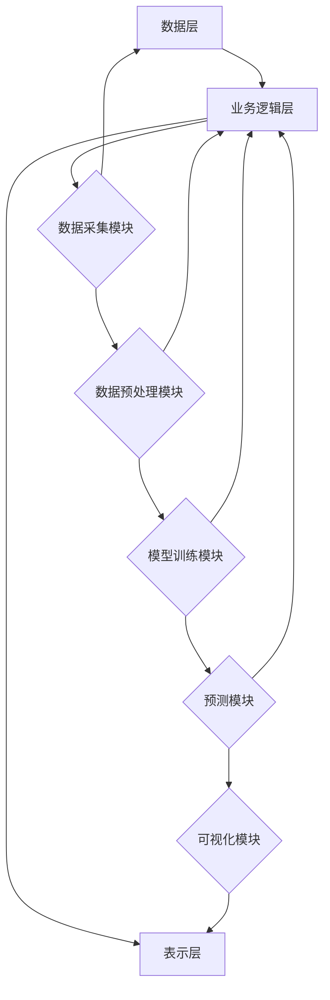
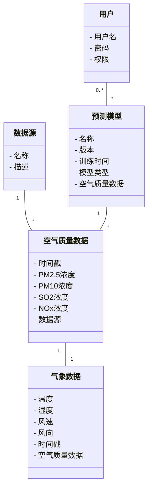
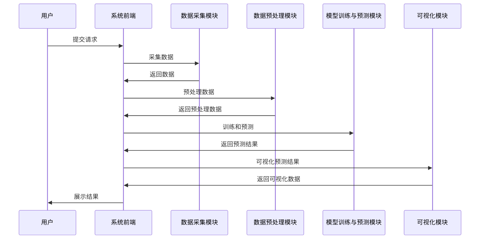

                 

# 人工智能在城市空气质量预测中的应用

关键词：城市空气质量、人工智能、数据挖掘、机器学习、深度学习、算法优化

摘要：随着城市化进程的加速，城市空气质量问题日益突出，对人们的健康和生活质量产生了严重影响。本文将探讨人工智能在城市空气质量预测中的应用，通过数据预处理、算法原理解析、系统设计与实现以及最佳实践和优化策略，全面揭示人工智能在城市空气质量预测中的巨大潜力。

## 目录大纲

1. 第一部分：问题背景与核心概念
    1.1 城市空气质量问题概述
    1.2 人工智能在城市空气质量预测中的应用
    1.3 核心概念
    1.4 概念联系与对比
    1.5 本章小结

2. 第二部分：数据预处理与分析
    2.1 数据来源与采集
    2.2 数据清洗与预处理
    2.3 特征工程
    2.4 数据可视化
    2.5 本章小结

3. 第三部分：算法原理与数学模型
    3.1 机器学习算法原理
    3.2 深度学习算法原理
    3.3 数学模型与公式
    3.4 算法原理讲解与 Mermaid 流程图
    3.5 本章小结

4. 第四部分：系统设计与实现
    4.1 项目介绍
    4.2 系统架构设计
    4.3 数据库设计与领域模型
    4.4 系统接口设计
    4.5 系统交互设计
    4.6 本章小结

5. 第五部分：项目实战
    5.1 环境安装与配置
    5.2 系统核心实现源代码
    5.3 代码应用解读与分析
    5.4 实际案例分析与详细讲解剖析
    5.5 项目小结

6. 第六部分：最佳实践与优化
    6.1 最佳实践
    6.2 性能优化
    6.3 模型评估与调优
    6.4 本章小结

7. 第七部分：展望与未来趋势
    7.1 人工智能在城市空气质量预测中的应用前景
    7.2 挑战与机遇
    7.3 未来发展趋势
    7.4 本章小结

## 1.1 城市空气质量问题概述

城市空气质量问题是指由于城市人类活动和自然环境因素导致的空气质量下降，对人体健康和环境造成危害的现象。随着城市化进程的加速，城市人口规模不断扩大，工业、交通、建筑等行业迅猛发展，城市空气质量问题日益严重。

### 城市空气质量问题的定义

城市空气质量问题主要涉及以下几类污染物：

1. **颗粒物（PM2.5和PM10）**：指空气中直径小于2.5微米和10微米的颗粒物，来源包括工业排放、汽车尾气、建筑施工等。
2. **二氧化硫（SO2）**：主要来源于燃烧含硫化石燃料的工业生产过程。
3. **氮氧化物（NOx）**：主要来源于汽车尾气和工业排放。
4. **挥发性有机物（VOCs）**：主要来源于油漆、涂料、溶剂等。

### 空气质量监测的重要性

空气质量监测是了解城市空气质量状况的重要手段，其目的在于：

1. **评估空气质量**：通过对空气中污染物的浓度进行监测，评估当前空气质量状况。
2. **预警与应急**：在空气质量恶化时，及时预警并采取应急措施，降低污染对健康的影响。
3. **政策制定与调整**：为政府制定和调整环境保护政策提供科学依据。

空气质量监测通常包括以下步骤：

1. **数据采集**：通过各类监测仪器，如空气颗粒物监测仪、气体分析仪等，采集空气中的污染物数据。
2. **数据处理**：将采集到的原始数据进行处理，如去噪、归一化等。
3. **数据存储**：将处理后的数据存储到数据库中，以便后续分析和查询。

### 城市空气质量问题的成因

1. **交通污染**：城市交通量的增加导致汽车尾气排放量上升，主要污染物包括NOx、CO、PM等。
2. **工业排放**：工业生产和能源消耗过程中产生的废气、废渣等污染物。
3. **建筑和施工**：建筑施工过程中产生的扬尘、废气和噪音等。
4. **自然因素**：如气象条件、地形地貌等，可能导致空气污染物在局部地区积聚。

### 城市空气质量问题的危害

1. **对人体健康的影响**：长期暴露在污染空气中，可导致呼吸系统疾病、心血管疾病等。
2. **环境影响**：空气污染对植物生长、水体质量等环境产生负面影响。
3. **经济损失**：因空气污染导致的健康问题、生产效率降低等，对经济产生负面影响。

## 1.2 人工智能在城市空气质量预测中的应用

随着人工智能技术的发展，其在环境科学中的应用越来越广泛，特别是在城市空气质量预测方面。人工智能通过处理和分析大量数据，能够实现对空气质量变化的准确预测，为环境保护和公共政策制定提供有力支持。

### 人工智能在环境科学中的应用

1. **大气污染物浓度预测**：利用机器学习算法，对历史空气质量和气象数据进行建模，预测未来某一时刻的污染物浓度。
2. **源解析与排放量估算**：通过分析污染物排放源和传输路径，估算不同污染源的排放量。
3. **空气质量评估与预警**：结合实时监测数据和预测模型，对空气质量进行实时评估，发出预警信息。

### 城市空气质量预测的目标和挑战

#### 目标

1. **提高预测准确性**：准确预测空气质量变化，为环境保护和公共健康提供科学依据。
2. **实时性**：实现实时预测，以便及时采取应对措施。
3. **高效性**：提高预测模型的计算效率，满足大规模数据处理需求。

#### 挑战

1. **数据缺失与噪声**：空气质量数据往往存在缺失值和噪声，需要有效的数据预处理方法。
2. **模型复杂性**：空气质量预测涉及多种污染物，模型设计需要考虑多种因素。
3. **实时性要求**：预测模型需要在短时间内完成计算，对计算资源要求较高。

### 人工智能在空气质量预测中的优势

1. **数据处理能力**：人工智能能够处理和分析大规模、多维度的数据，提高预测模型的准确性。
2. **自适应能力**：人工智能模型能够根据环境变化自适应调整预测模型，提高预测的实时性。
3. **智能化决策**：通过预测模型，可以为环境保护和公共政策制定提供智能化支持。

### 城市空气质量预测的应用场景

1. **环境保护**：通过预测空气质量，制定环境保护政策，减少污染物排放。
2. **城市规划**：根据空气质量预测，优化城市规划，减少污染源分布。
3. **公共健康**：实时预测空气质量，提醒公众采取健康防护措施，降低空气污染对健康的影响。

## 1.3 核心概念

为了更好地理解人工智能在城市空气质量预测中的应用，我们需要掌握以下几个核心概念：数据挖掘、机器学习和深度学习。

### 数据挖掘

数据挖掘是指从大量数据中提取出有价值的信息和知识的过程。在空气质量预测中，数据挖掘技术主要用于数据的预处理和分析，包括数据清洗、特征工程和模式识别等。

#### 数据挖掘的应用场景

1. **空气质量数据预处理**：通过数据挖掘技术，对空气质量数据进行清洗、去噪和归一化处理，为后续建模提供高质量的数据。
2. **特征提取与选择**：从原始数据中提取出与空气质量预测相关的特征，通过特征选择方法筛选出最有代表性的特征，提高预测模型的性能。

### 机器学习

机器学习是指通过训练算法，让计算机从数据中自动学习和发现规律，以便对新数据进行预测和分类。在空气质量预测中，机器学习技术主要用于建立预测模型。

#### 机器学习的应用场景

1. **建立预测模型**：利用机器学习算法，如线性回归、决策树、支持向量机等，建立空气质量预测模型，对未来的空气质量进行预测。
2. **模式识别**：通过机器学习技术，识别空气质量数据中的变化模式，发现潜在的环境问题。

### 深度学习

深度学习是机器学习的一个子领域，通过构建多层神经网络，对数据进行自动学习和特征提取。在空气质量预测中，深度学习技术主要用于构建复杂的预测模型。

#### 深度学习的应用场景

1. **复杂模型构建**：利用深度学习技术，构建能够处理大规模、高维数据的预测模型，提高预测的准确性。
2. **实时预测**：通过深度学习模型，实现实时预测，满足实时性要求。

### 数据挖掘、机器学习与深度学习的联系与区别

1. **联系**：数据挖掘、机器学习和深度学习都是人工智能的分支，它们在数据处理和分析方面具有相似的应用场景。
2. **区别**：
   - **数据量**：数据挖掘适用于中等规模的数据，机器学习适用于较大规模的数据，深度学习适用于大规模和高维度的数据。
   - **算法复杂度**：数据挖掘算法相对简单，机器学习算法较为复杂，深度学习算法最为复杂。
   - **应用场景**：数据挖掘主要用于数据预处理和模式识别，机器学习主要用于预测和分类，深度学习主要用于复杂模型的构建和实时预测。

## 1.4 概念联系与对比

### 数据挖掘与机器学习的区别

1. **定义**：数据挖掘是从大量数据中提取有价值信息的过程，而机器学习是通过训练算法，让计算机自动学习和发现规律。
2. **数据量**：数据挖掘适用于中等规模的数据，机器学习适用于较大规模的数据。
3. **应用场景**：数据挖掘主要用于数据预处理和模式识别，机器学习主要用于预测和分类。

### 机器学习与深度学习的异同

1. **定义**：机器学习是通过训练算法，让计算机自动学习和发现规律，而深度学习是机器学习的一种方法，通过构建多层神经网络进行自动学习和特征提取。
2. **数据量**：机器学习适用于较大规模的数据，深度学习适用于大规模和高维度的数据。
3. **算法复杂度**：机器学习算法相对简单，深度学习算法最为复杂。
4. **应用场景**：机器学习主要用于预测和分类，深度学习主要用于复杂模型的构建和实时预测。

### 深度学习与其他机器学习算法的比较

1. **模型复杂度**：深度学习模型具有更高的复杂度，能够处理大规模和高维数据。
2. **计算资源**：深度学习模型需要更多的计算资源，对硬件要求较高。
3. **应用领域**：深度学习在图像识别、语音识别、自然语言处理等领域具有显著优势，但在某些简单任务上，其他机器学习算法可能更为适用。

### 数据挖掘、机器学习与深度学习的联系与融合

1. **数据预处理**：数据挖掘和机器学习在数据预处理方面具有紧密联系，为深度学习提供高质量的数据。
2. **算法融合**：将数据挖掘、机器学习和深度学习技术相结合，构建更强大的预测模型，提高空气质量预测的准确性。

## 1.5 本章小结

本章首先介绍了城市空气质量问题的背景和重要性，然后探讨了人工智能在城市空气质量预测中的应用，并详细介绍了数据挖掘、机器学习和深度学习等核心概念。通过本章的学习，我们了解到：

1. **城市空气质量问题的现状和危害**：城市空气质量问题严重影响了人们的健康和生活质量，需要采取有效措施进行治理。
2. **人工智能在环境科学中的应用**：人工智能在城市空气质量预测中具有广泛应用，能够提高预测准确性、实时性和高效性。
3. **核心概念的理解与应用**：数据挖掘、机器学习和深度学习是人工智能的重要组成部分，对于理解和应用人工智能技术具有重要意义。

## 2.1 数据来源与采集

在人工智能应用于城市空气质量预测时，首先需要收集相关的数据，这些数据主要来源于以下几种渠道：

### 数据来源

1. **政府监测站点**：政府环境监测部门通常会设立多个监测站点，实时监测空气质量参数，并将数据上传至中央数据库。
2. **卫星遥感数据**：通过卫星遥感技术，可以获取全球范围内的空气质量数据，特别是污染物浓度和分布情况。
3. **气象数据**：气象数据包括温度、湿度、风速、风向等，对空气质量预测具有重要影响。
4. **车辆尾气排放数据**：城市交通管理部门通常会收集车辆尾气排放数据，用于分析交通污染情况。
5. **工业排放数据**：各工业企业会定期报告其排放污染物的情况，这些数据对于分析工业污染具有重要意义。

### 数据采集方法

1. **在线监测设备**：通过安装在线监测设备，如空气颗粒物监测仪、气体分析仪等，实时采集空气质量数据。
2. **手动采样**：在特定时间段内，人工采集空气样品，然后通过实验室分析来确定污染物的浓度。
3. **无人机监测**：利用无人机搭载传感器，对城市空气质量进行高精度的监测，特别是在城市热点区域。
4. **大数据集成**：将来自不同来源的数据进行整合，形成综合性的空气质量数据集。

### 数据采集技术

1. **物联网（IoT）技术**：通过物联网技术，将各类监测设备连接到互联网，实现数据的实时传输和共享。
2. **云计算**：利用云计算技术，对海量数据进行存储、处理和分析，提高数据采集和处理效率。
3. **传感器技术**：传感器技术的发展，使得空气质量监测设备更加便携、高效，能够更准确地采集数据。

### 数据采集的关键问题

1. **数据一致性**：确保不同来源、不同时间段的数据具有一致性，以便进行有效的分析和预测。
2. **数据完整性**：避免数据缺失，特别是在关键时间点的数据缺失，会影响预测结果的准确性。
3. **数据质量**：确保数据的准确性、可靠性和实时性，避免噪声和异常值对数据采集的影响。

### 数据采集的挑战

1. **数据多样性**：空气质量数据来源广泛，数据类型多样，如何有效地整合和利用这些数据是一个挑战。
2. **实时性**：城市空气质量变化快速，需要实时采集和处理数据，以保证预测模型的及时性和准确性。
3. **成本与效益**：建立和完善空气质量监测系统需要大量资金投入，如何在有限的资源下实现高效的数据采集是关键。

### 数据采集的重要性

1. **准确预测**：准确的数据采集是建立高质量空气质量预测模型的基础。
2. **环境保护**：通过数据采集和分析，可以及时发现和解决环境污染问题，为环境保护政策制定提供依据。
3. **公共健康**：实时掌握空气质量状况，有助于公众采取相应的健康防护措施，减少空气污染对健康的危害。

### 数据采集的最佳实践

1. **多源数据融合**：整合来自不同来源的数据，形成综合性数据集，提高预测的准确性。
2. **数据预处理**：在数据采集阶段，进行有效的数据预处理，如数据清洗、去噪和归一化，确保数据质量。
3. **实时数据采集**：采用物联网和云计算技术，实现实时数据采集和传输，提高数据采集的实时性和效率。

## 2.2 数据清洗与预处理

在空气质量预测中，数据清洗与预处理是至关重要的步骤，因为原始数据往往存在多种问题，如缺失值、噪声、异常值等，这些问题会直接影响预测模型的性能。因此，对数据进行清洗与预处理，以提高数据质量和预测准确性，显得尤为重要。

### 数据清洗的重要性

1. **提高数据质量**：通过数据清洗，去除数据中的噪声和异常值，提高数据的准确性和可靠性。
2. **减少错误**：清洗数据可以减少因数据问题导致的模型错误，提高预测结果的准确性。
3. **节省计算资源**：高质量的数据可以减少模型训练和预测的计算量，提高系统的运行效率。

### 数据清洗的方法与步骤

1. **缺失值处理**：
   - **删除缺失值**：对于缺失值较多的数据，可以选择删除相应的数据记录。
   - **填充缺失值**：对于缺失值较少的数据，可以选择使用平均值、中位数或回归模型等方法进行填充。

2. **噪声处理**：
   - **过滤噪声**：使用滤波算法，如移动平均滤波、中值滤波等，去除数据中的噪声。
   - **数据平滑**：通过数据平滑技术，如低通滤波、高斯平滑等，减少数据的波动性。

3. **异常值处理**：
   - **统计方法**：使用统计方法，如箱线图、3sigma准则等，检测并处理异常值。
   - **机器学习方法**：使用异常检测算法，如孤立森林、隔离森林等，自动识别和处理异常值。

### 数据清洗工具与技术

1. **Python库**：
   - **Pandas**：用于数据处理和清洗，支持数据删除、填充、转换等功能。
   - **NumPy**：用于数值计算，支持矩阵运算和数据处理。

2. **R语言**：
   - **dplyr**：用于数据清洗和操作，支持数据筛选、排序、分组等。
   - **tidyr**：用于数据整理，支持数据变形、填充、转换等。

3. **开源工具**：
   - **OpenRefine**：用于数据清洗和整理，支持数据校验、转换、归一化等。
   - **DataWrangler**：用于数据清洗和预处理，支持数据清洗、转换、分析等。

### 数据清洗的挑战与解决方案

1. **数据不一致**：
   - **解决方案**：通过数据标准化和规范化，统一数据格式和单位，提高数据的一致性。

2. **数据噪声**：
   - **解决方案**：使用滤波算法和数据平滑技术，减少噪声对数据的影响。

3. **异常值处理**：
   - **解决方案**：使用统计方法和机器学习算法，自动识别和处理异常值。

### 数据清洗的最佳实践

1. **自动化数据清洗**：使用自动化工具和脚本，提高数据清洗的效率和准确性。
2. **数据可视化**：通过数据可视化工具，如Pandas的`plot`方法，直观地检查数据清洗的效果。
3. **定期更新数据**：定期更新数据清洗规则和算法，以适应不断变化的数据环境。

### 数据清洗的总结与反思

数据清洗与预处理是空气质量预测中不可或缺的步骤，通过有效的数据清洗，可以提高数据质量和预测准确性。在实际应用中，需要根据数据的特点和需求，选择合适的数据清洗方法和工具，确保数据清洗的效果和效率。同时，数据清洗也是一个持续的过程，需要定期检查和更新数据清洗规则和算法，以适应不断变化的数据环境。

## 2.3 特征工程

特征工程是机器学习项目中至关重要的一环，其核心目标是提取和选择对预测任务最有用的特征，从而提高模型性能和解释能力。在空气质量预测中，特征工程对于构建有效的预测模型、提高预测准确性具有重要作用。

### 特征提取与选择

#### 特征提取

特征提取是指从原始数据中提取出对预测任务有用的信息。在空气质量预测中，特征提取的目标是识别出影响空气质量的关键因素。常见的方法包括：

1. **统计特征**：基于数据的统计属性，如平均值、标准差、最大值、最小值等。
2. **时间序列特征**：根据时间序列数据的特点，提取出周期性、趋势性、波动性等特征。
3. **空间特征**：基于地理位置信息，提取出不同区域之间的相关性特征。
4. **相关性分析**：通过相关性分析，识别出与空气质量密切相关的特征。

#### 特征选择

特征选择是指从提取出的特征中筛选出对预测任务最有用的特征。常用的方法包括：

1. **过滤法**：基于特征的重要性指标，如相关性、方差贡献率等，直接筛选出重要的特征。
2. **嵌入法**：在模型训练过程中，通过模型自身的学习能力筛选出重要的特征，如L1正则化（Lasso）和树模型。
3. **包装法**：结合模型选择过程进行特征选择，如递归特征消除（RFE）和遗传算法。

### 特征工程的最佳实践

1. **数据标准化**：对数据进行归一化或标准化处理，以消除不同特征之间的尺度差异，提高模型训练的稳定性和收敛速度。
2. **特征缩放**：对特征进行缩放处理，以避免模型对特征尺度的敏感度。
3. **特征组合**：通过组合不同的特征，构建新的特征，以提高预测模型的解释能力和预测性能。
4. **特征选择**：结合模型选择过程，使用特征选择方法筛选出对预测任务最有用的特征，避免过拟合。
5. **模型验证**：通过交叉验证等方法，评估特征选择对模型性能的影响，确保模型具有良好的泛化能力。

### 特征工程的挑战与解决方案

1. **特征维度高**：高维特征可能导致模型训练时间长、过拟合等问题。解决方案是使用特征选择和降维技术，如主成分分析（PCA）和L1正则化。
2. **特征缺失**：特征缺失会影响模型的训练和预测性能。解决方案是使用缺失值填补方法，如均值填补和KNN填补。
3. **特征相关性**：特征之间可能存在高度相关性，导致信息冗余。解决方案是使用特征选择方法，如基于相关性的特征选择。
4. **特征解释性**：特征工程的目标之一是提高模型的解释性。解决方案是构建可解释的模型，如决策树和规则引擎。

### 特征工程总结与反思

特征工程是空气质量预测中不可或缺的步骤，通过有效的特征提取和选择，可以提高预测模型的性能和解释能力。在实际应用中，需要根据数据的特性和预测任务的需求，灵活运用各种特征工程方法，以达到最佳的效果。同时，特征工程是一个不断迭代和优化的过程，需要结合实际应用场景和反馈，持续改进和优化特征工程策略。

## 2.4 数据可视化

数据可视化是将复杂的数据转换为易于理解和分析的图形或图像的过程。在空气质量预测中，数据可视化可以帮助我们直观地了解数据特征、趋势和异常，从而为模型训练和评估提供重要参考。

### 数据可视化的重要性

1. **发现数据特征**：通过数据可视化，可以直观地发现数据中的周期性、趋势性、异常值等特征。
2. **辅助模型训练**：数据可视化有助于我们理解数据分布和特征之间的关系，从而选择合适的模型和参数。
3. **评估模型性能**：通过可视化模型预测结果，可以直观地评估模型的性能和泛化能力。
4. **提高决策效率**：数据可视化可以帮助决策者快速理解和分析数据，从而做出更加明智的决策。

### 常用的数据可视化工具

1. **Matplotlib**：Python的Matplotlib库提供了丰富的绘图功能，可以生成各种类型的图表，如折线图、散点图、柱状图等。
2. **Seaborn**：Seaborn是基于Matplotlib的统计数据可视化库，提供了多种精美的可视化模板和函数。
3. **Plotly**：Plotly是一个交互式的数据可视化库，支持多种图表类型，并具有良好的交互性。
4. **Tableau**：Tableau是一款专业的数据可视化工具，提供了丰富的图表类型和交互功能，易于操作。

### 常见的数据可视化方法

1. **折线图**：用于显示数据随时间变化的趋势，适合展示空气质量随时间的变化。
2. **散点图**：用于显示不同变量之间的关系，适合分析空气质量与气象参数之间的关系。
3. **柱状图**：用于比较不同类别或时间段的数据，适合展示不同区域的空气质量差异。
4. **箱线图**：用于展示数据的分布和异常值，适合分析数据的离散程度和波动性。
5. **热力图**：用于显示数据矩阵中的数值分布，适合分析多变量数据之间的相关性。

### 数据可视化示例

下面是一个使用Python和Matplotlib绘制空气质量折线图的示例：

```python
import matplotlib.pyplot as plt
import pandas as pd

# 加载空气质量数据
data = pd.read_csv('air_quality_data.csv')

# 绘制空气质量折线图
plt.figure(figsize=(10, 5))
plt.plot(data['date'], data['PM2.5'], label='PM2.5')
plt.plot(data['date'], data['PM10'], label='PM10')
plt.xlabel('Date')
plt.ylabel('Concentration')
plt.title('Air Quality Trend')
plt.legend()
plt.show()
```

通过数据可视化，我们可以直观地了解空气质量的变化趋势，从而为模型训练和评估提供重要依据。

### 数据可视化的总结与反思

数据可视化是空气质量预测中不可或缺的环节，通过有效的数据可视化，可以直观地展示数据特征、趋势和异常，为模型训练和评估提供重要支持。在实际应用中，需要根据数据的特性和可视化目标，选择合适的可视化方法和工具，以达到最佳的效果。同时，数据可视化也是一个动态和迭代的过程，需要根据模型训练和评估的结果，不断调整和优化可视化策略。

## 2.5 本章小结

本章主要介绍了数据预处理与分析的相关内容，包括数据来源与采集、数据清洗与预处理、特征工程以及数据可视化。通过本章的学习，我们了解到：

1. **数据来源与采集**：空气质量数据来源广泛，包括政府监测站点、卫星遥感、气象数据等，数据采集方法有在线监测设备、手动采样、无人机监测等。
2. **数据清洗与预处理**：数据清洗与预处理是提高数据质量和预测准确性的关键步骤，包括缺失值处理、噪声处理、异常值处理等。
3. **特征工程**：特征工程是构建有效预测模型的重要环节，包括特征提取与选择、数据标准化、特征组合等。
4. **数据可视化**：数据可视化有助于直观地展示数据特征、趋势和异常，为模型训练和评估提供重要参考。

通过本章的学习，我们能够更好地理解数据预处理与分析的方法和技巧，为后续的算法原理解析、系统设计与实现打下坚实基础。

### 3.1 机器学习算法原理

机器学习是一种使计算机系统能够从数据中学习并做出预测或决策的技术。在空气质量预测中，机器学习算法通过分析历史数据和气象信息，预测未来的空气质量。以下将详细探讨几种常见的机器学习算法原理。

#### 监督学习

监督学习是一种最常见的机器学习算法，其核心思想是利用标记数据进行学习。标记数据包含输入特征和对应的输出标签。监督学习算法通过学习输入和输出之间的关系，实现对未知数据的预测。

1. **线性回归**：线性回归是一种简单的监督学习算法，用于预测连续值输出。其基本公式为：
   $$ y = \beta_0 + \beta_1x_1 + \beta_2x_2 + ... + \beta_nx_n $$
   其中，$y$为输出值，$x_1, x_2, ..., x_n$为输入特征，$\beta_0, \beta_1, ..., \beta_n$为模型参数。通过最小化损失函数，如均方误差（MSE），可以求得最佳参数值。

2. **逻辑回归**：逻辑回归是一种用于分类问题的监督学习算法，其基本公式为：
   $$ \hat{y} = \frac{1}{1 + e^{-(\beta_0 + \beta_1x_1 + \beta_2x_2 + ... + \beta_nx_n)}} $$
   其中，$\hat{y}$为预测概率，如果$\hat{y} > 0.5$，则预测为正类，否则为负类。通过最大化似然函数，可以求得最佳参数值。

#### 无监督学习

无监督学习是指在没有标记数据的情况下，从数据中学习规律和结构。在空气质量预测中，无监督学习可以用于聚类分析、降维和异常检测等。

1. **K均值聚类**：K均值聚类是一种常用的无监督学习算法，其基本思想是将数据划分为K个簇，每个簇的中心为该簇内数据点的平均值。通过迭代优化，使每个数据点与其所属簇的中心距离最小。

2. **主成分分析**：主成分分析（PCA）是一种降维算法，其核心思想是通过线性变换，将高维数据映射到低维空间，同时保留数据的主要特征。PCA通过求解协方差矩阵的特征值和特征向量，得到最佳变换矩阵。

#### 半监督学习

半监督学习结合了监督学习和无监督学习，利用少量的标记数据和大量的无标记数据，提高模型的预测性能。

1. **图嵌入**：图嵌入是一种半监督学习算法，通过将数据点表示为图中的节点，学习数据点之间的相似性表示。图嵌入可以应用于空气质量预测中的异常检测和聚类分析。

#### 算法选择与评估

在选择机器学习算法时，需要考虑以下因素：

1. **数据量**：对于大量数据，深度学习算法可能更为适用；对于小规模数据，线性回归和逻辑回归等简单算法可能更为高效。
2. **特征数量**：对于高维数据，降维算法（如PCA）可以减少计算量和过拟合的风险。
3. **问题类型**：对于分类问题，逻辑回归、支持向量机等算法表现良好；对于回归问题，线性回归、决策树等算法适用。
4. **评估指标**：准确率、召回率、F1分数、均方误差等指标用于评估模型的性能。

### 3.2 深度学习算法原理

深度学习是一种基于多层神经网络的学习方法，通过模拟人脑的神经元结构，对复杂数据进行自动特征提取和建模。在空气质量预测中，深度学习算法可以处理大量高维数据，并提高预测的准确性。

#### 神经网络

神经网络是深度学习的基础，由多个神经元（或节点）组成，每个神经元接收多个输入，通过加权求和后加上偏置，再通过激活函数输出结果。一个简单的神经网络可以表示为：

1. **输入层**：接收外部输入，如气象数据、污染物浓度等。
2. **隐藏层**：对输入数据进行特征提取和变换，多个隐藏层可以提取更高级的特征。
3. **输出层**：根据隐藏层的输出，生成预测结果。

#### 卷积神经网络（CNN）

卷积神经网络是一种专门用于处理图像数据的神经网络，通过卷积操作和池化操作，提取图像中的局部特征。

1. **卷积层**：使用卷积核在输入数据上滑动，计算局部特征图。
2. **池化层**：对局部特征图进行下采样，减少参数数量和计算量。
3. **全连接层**：将卷积层的输出数据映射到输出层，进行分类或回归预测。

#### 循环神经网络（RNN）

循环神经网络是一种用于处理序列数据的神经网络，其特点是可以记住历史信息，适合处理时间序列数据。

1. **隐藏状态**：RNN中的隐藏状态可以记忆历史信息，通过门控机制（如门控循环单元（GRU）和长短期记忆网络（LSTM））控制信息的传递。
2. **输入层**：接收当前时间步的输入。
3. **输出层**：生成当前时间步的预测结果。

#### 神经网络反向传播算法

神经网络反向传播算法是一种用于训练神经网络的优化算法，通过不断迭代调整网络权重，使预测误差最小。

1. **前向传播**：计算输入数据在网络中的传播，得到预测结果。
2. **计算梯度**：通过预测结果和实际结果之间的差异，计算网络参数的梯度。
3. **更新参数**：使用梯度下降等方法，更新网络参数，减少预测误差。

### 3.3 数学模型与公式

在机器学习和深度学习中，数学模型和公式是核心组成部分。以下是一些常用的数学模型和公式：

1. **线性回归**：
   $$ y = \beta_0 + \beta_1x + \epsilon $$
   其中，$y$为输出值，$x$为输入特征，$\beta_0, \beta_1$为模型参数，$\epsilon$为误差项。

2. **逻辑回归**：
   $$ \hat{y} = \frac{1}{1 + e^{-(\beta_0 + \beta_1x)}} $$
   其中，$\hat{y}$为预测概率，$\beta_0, \beta_1$为模型参数。

3. **卷积神经网络（CNN）**：
   $$ f(x) = \sigma(\sum_{i=1}^{k} w_{i} \star x_i + b) $$
   其中，$f(x)$为输出特征，$w_i$为卷积核，$\star$为卷积操作，$\sigma$为激活函数，$b$为偏置。

4. **循环神经网络（RNN）**：
   $$ h_t = \sigma(W \cdot [h_{t-1}, x_t] + b) $$
   其中，$h_t$为当前时间步的隐藏状态，$W$为权重矩阵，$x_t$为当前时间步的输入，$\sigma$为激活函数，$b$为偏置。

5. **反向传播算法**：
   $$ \Delta w_{ij} = -\alpha \frac{\partial L}{\partial w_{ij}} $$
   其中，$\Delta w_{ij}$为权重更新，$\alpha$为学习率，$L$为损失函数。

### 3.4 算法原理讲解与 Mermaid 流程图

为了更好地理解机器学习和深度学习算法的原理，我们可以使用Mermaid绘制算法的流程图。以下是一个简单的线性回归算法的Mermaid流程图：

```mermaid
graph TD
A[输入特征] --> B{计算加权求和}
B --> C{激活函数}
C --> D[计算损失}
D --> E{梯度计算}
E --> F{更新参数}
F --> G[重复迭代]
G --> H{停止条件}
H --> I[最终模型]
```

通过Mermaid流程图，我们可以清晰地看到线性回归算法的步骤，包括输入特征、加权求和、激活函数、损失计算、梯度计算、参数更新等。

### 3.5 本章小结

本章介绍了机器学习和深度学习的算法原理，包括监督学习、无监督学习、半监督学习等。通过详细的数学模型和公式，我们了解了这些算法的工作原理。此外，还介绍了常用的神经网络结构和反向传播算法。通过本章的学习，我们能够更好地理解空气质量预测中的机器学习算法，为后续的系统设计与实现奠定基础。

## 4.1 项目介绍

### 项目背景与目标

随着城市化进程的加速，城市空气质量问题日益严重，对公众健康和生活质量产生了重大影响。为了更好地解决这一问题，本项目旨在利用人工智能技术，开发一个城市空气质量预测系统，实现以下目标：

1. **提高预测准确性**：通过机器学习和深度学习算法，对历史空气质量数据和气象信息进行分析，提高预测的准确性。
2. **实时性**：系统需要具备实时预测能力，以便在空气质量变化时及时发出预警。
3. **可扩展性**：系统应具备良好的可扩展性，能够根据需求添加新的预测模型和特征。

### 系统功能设计

本项目的系统功能设计主要包括以下几个模块：

1. **数据采集模块**：负责收集各类空气质量数据、气象数据等，为模型训练和预测提供数据支持。
2. **数据预处理模块**：对采集到的数据进行清洗、去噪和特征提取，提高数据质量。
3. **模型训练模块**：利用机器学习和深度学习算法，对预处理后的数据进行训练，构建预测模型。
4. **预测模块**：根据实时数据和训练好的模型，预测未来的空气质量状况。
5. **可视化模块**：通过图表和报表，展示预测结果，为决策者提供直观的参考。

### 技术选型

为了实现项目的目标，本项目采用了以下技术选型：

1. **编程语言**：Python，具有丰富的机器学习和深度学习库，如Scikit-learn、TensorFlow和Keras。
2. **数据库**：MySQL，用于存储和管理空气质量数据、预测结果等。
3. **前端技术**：HTML、CSS和JavaScript，用于实现数据可视化界面。
4. **框架**：Flask，用于构建后端服务，处理数据请求和响应。

### 系统架构设计

本项目的系统架构设计遵循分层架构，包括数据层、业务逻辑层和表示层。

1. **数据层**：负责数据存储和管理，包括MySQL数据库和Elasticsearch搜索引擎。
2. **业务逻辑层**：包括数据采集、预处理、模型训练和预测等核心功能。
3. **表示层**：通过前端技术，实现用户界面和数据可视化。

### 系统模块划分与交互

系统的模块划分和交互设计如下：

1. **数据采集模块**：负责从各类数据源（如监测站点、气象服务）采集数据，并传输至数据层存储。
2. **数据预处理模块**：接收采集到的数据，进行清洗、去噪和特征提取，预处理后的数据传输至模型训练模块。
3. **模型训练模块**：接收预处理后的数据，利用机器学习和深度学习算法进行训练，训练好的模型存储在数据层。
4. **预测模块**：接收实时数据，利用训练好的模型进行预测，预测结果传输至可视化模块。
5. **可视化模块**：接收预测结果，通过图表和报表展示给用户。

### 项目优势和挑战

#### 优势

1. **高准确性**：通过机器学习和深度学习算法，提高空气质量预测的准确性。
2. **实时性**：系统具备实时预测能力，及时为决策者提供预警。
3. **可扩展性**：系统设计灵活，易于扩展和升级，适应不断变化的需求。

#### 挑战

1. **数据质量**：空气质量数据可能存在噪声、缺失值等问题，影响预测准确性。
2. **计算资源**：深度学习算法需要大量计算资源，对硬件要求较高。
3. **模型解释性**：深度学习模型具有较高复杂度，难以解释和理解。

### 项目进度安排

为了确保项目的顺利进行，项目进度安排如下：

1. **需求分析与设计**（1个月）：明确项目目标、功能需求和系统架构设计。
2. **数据采集与预处理**（2个月）：搭建数据采集系统，处理和清洗数据。
3. **模型训练与预测**（3个月）：选择合适的算法，训练预测模型，评估模型性能。
4. **系统开发与测试**（3个月）：开发前端和后端系统，进行集成测试和功能测试。
5. **部署与维护**（1个月）：将系统部署到生产环境，进行日常维护和升级。

通过以上进度安排，我们相信项目能够按计划完成，并为城市空气质量预测提供有力支持。

### 项目成果预期

本项目预期成果包括：

1. **高精度空气质量预测**：通过机器学习和深度学习算法，实现高精度的空气质量预测。
2. **实时预警系统**：及时为决策者提供空气质量预警，为环境保护和公共健康提供支持。
3. **数据可视化界面**：通过图表和报表，直观展示空气质量预测结果，便于用户理解和使用。

总之，本项目将充分利用人工智能技术，为城市空气质量预测提供创新解决方案，为环境保护和公共健康贡献力量。

## 4.2 系统架构设计

### 系统架构的总体设计

本系统采用分层架构，包括数据层、业务逻辑层和表示层。各层之间通过接口进行交互，确保系统的模块化和可扩展性。以下是系统架构的总体设计：

1. **数据层**：负责数据的存储和管理，包括MySQL数据库和Elasticsearch搜索引擎。数据层提供数据访问接口，供业务逻辑层使用。
2. **业务逻辑层**：包括数据采集、数据预处理、模型训练、预测和可视化等核心功能模块。业务逻辑层通过API与数据层和表示层进行交互。
3. **表示层**：负责前端用户界面的展示，通过HTML、CSS和JavaScript实现数据可视化和交互功能。表示层通过HTTP请求与业务逻辑层进行通信。

### 系统模块划分与交互

系统模块划分如下，各模块之间的交互关系如下：

1. **数据采集模块**：负责从各类数据源（如监测站点、气象服务）采集数据，并将数据传输至数据层存储。数据采集模块与数据层通过API进行交互。
2. **数据预处理模块**：接收采集到的数据，进行清洗、去噪和特征提取，预处理后的数据传输至模型训练模块。数据预处理模块与数据层和模型训练模块通过API进行交互。
3. **模型训练模块**：接收预处理后的数据，利用机器学习和深度学习算法进行训练，训练好的模型存储在数据层。模型训练模块与数据层和业务逻辑层通过API进行交互。
4. **预测模块**：根据实时数据和训练好的模型，进行空气质量预测，并将预测结果传输至可视化模块。预测模块与数据层和业务逻辑层通过API进行交互。
5. **可视化模块**：接收预测结果，通过图表和报表展示给用户，同时提供交互功能，如数据筛选和查询。可视化模块与业务逻辑层通过API进行交互。

### 系统架构图

为了更直观地展示系统架构，以下是一个简化的Mermaid系统架构图：



通过以上系统架构设计，可以确保系统的高效性和可扩展性，同时为后续的功能扩展和优化提供支持。

## 4.3 数据库设计与领域模型

### 数据库设计原则

在数据库设计过程中，我们遵循以下原则：

1. **标准化**：采用第三范式（3NF），确保数据的唯一性和完整性。
2. **模块化**：将数据库划分为多个模块，每个模块负责不同的数据实体和关系。
3. **灵活性**：设计灵活的查询和索引机制，满足不同的数据访问需求。
4. **性能优化**：针对高频查询操作，设计合适的索引和数据结构，提高查询效率。

### 领域模型

领域模型是数据库设计的关键部分，它定义了系统中的核心实体和它们之间的关系。以下是本项目的领域模型：

1. **实体**：
   - **数据源**：记录各种数据来源的信息，如监测站点、气象服务。
   - **空气质量数据**：记录实时和历史的空气质量数据，包括颗粒物（PM2.5和PM10）、二氧化硫（SO2）、氮氧化物（NOx）等。
   - **气象数据**：记录与空气质量相关的气象信息，如温度、湿度、风速、风向等。
   - **预测模型**：存储训练好的机器学习和深度学习模型的信息，包括模型名称、版本、训练时间等。
   - **用户**：记录用户的基本信息和权限，用于系统访问控制。

2. **关系**：
   - **数据源与空气质量数据**：一对多关系，一个数据源可以生成多条空气质量数据。
   - **空气质量数据与气象数据**：一对一关系，每条空气质量数据对应一条气象数据。
   - **预测模型与空气质量数据**：一对多关系，一个预测模型可以用于多个空气质量数据的预测。
   - **用户与预测模型**：多对多关系，一个用户可以访问多个预测模型，一个预测模型可以被多个用户访问。

### Mermaid 类图

以下是领域模型的Mermaid类图：



通过以上领域模型的设计，我们可以确保数据库的结构合理、易于扩展，并能够满足空气质量预测系统的需求。

## 4.4 系统接口设计

### 接口设计与实现

系统接口设计是确保各模块之间有效通信的关键步骤。以下是本项目的系统接口设计：

1. **数据采集接口**：用于从各类数据源（如监测站点、气象服务）采集数据。接口包含以下方法：
   - `getDataSources()`: 获取所有数据源信息。
   - `addDataSource(source)`: 添加新数据源。
   - `removeDataSource(sourceId)`: 删除指定数据源。
   - `getAirQualityData(sourceId)`: 获取指定数据源的历史空气质量数据。

2. **数据预处理接口**：用于对采集到的数据进行清洗、去噪和特征提取。接口包含以下方法：
   - `cleanData(data)`: 清洗数据，去除缺失值和噪声。
   - `extractFeatures(data)`: 提取数据特征，进行特征工程。
   - `normalizeData(data)`: 标准化数据，消除不同特征之间的尺度差异。

3. **模型训练接口**：用于训练机器学习和深度学习模型。接口包含以下方法：
   - `trainModel(data)`: 训练预测模型，返回训练好的模型。
   - `getModelversions()`: 获取所有训练好的模型版本。
   - `deleteModelVersion(versionId)`: 删除指定模型版本。

4. **预测接口**：用于根据实时数据和训练好的模型进行空气质量预测。接口包含以下方法：
   - `predictAirQuality(data, modelVersionId)`: 根据实时数据和指定模型版本，预测空气质量。
   - `getPredictionHistory()`: 获取历史预测结果。

5. **可视化接口**：用于获取和更新可视化数据。接口包含以下方法：
   - `getVisualizationData(modelVersionId)`: 获取指定模型版本的可视化数据。
   - `updateVisualizationData(data)`: 更新可视化数据。

### 接口文档编写

编写详细的接口文档是确保开发者能够正确使用接口的重要环节。以下是接口文档的基本结构：

#### 接口文档结构

1. **概述**
   - 介绍接口的目的和功能。
   - 提供接口的URL和端点。

2. **接口定义**
   - 列出所有接口方法，包括方法名称、URL、HTTP方法（GET、POST、PUT、DELETE等）。

3. **参数说明**
   - 列出每个接口方法的参数，包括参数名称、类型、是否必需、默认值和说明。

4. **请求示例**
   - 提供每个接口方法的请求示例，包括请求体和请求头。

5. **响应示例**
   - 提供每个接口方法的响应示例，包括响应体和响应状态码。

6. **错误处理**
   - 描述可能的错误情况，包括错误代码、错误信息和解决方案。

### 接口文档示例

以下是一个数据采集接口的示例文档：

#### 数据采集接口

##### 概述

数据采集接口用于从各类数据源采集空气质量数据。

##### 接口定义

- `GET /api/data-sources`: 获取所有数据源信息。
- `POST /api/data-sources`: 添加新数据源。
- `DELETE /api/data-sources/{sourceId}`: 删除指定数据源。

##### 参数说明

| 参数名称      | 类型     | 必需 | 默认值 | 说明                                   |
| ------------- | -------- | ---- | ------ | -------------------------------------- |
| sourceId      | Integer  | 否   | null   | 数据源ID                               |
| sourceName    | String   | 是   | null   | 数据源名称                             |
| description   | String   | 否   | null   | 数据源描述                             |

##### 请求示例

```http
GET /api/data-sources
```

##### 响应示例

```json
{
  "dataSources": [
    {
      "sourceId": 1,
      "sourceName": "监测站点A",
      "description": "城市中心监测站点"
    },
    {
      "sourceId": 2,
      "sourceName": "气象服务B",
      "description": "全国气象服务数据"
    }
  ]
}
```

##### 错误处理

- `400 Bad Request`: 请求格式错误或参数缺失。
- `404 Not Found`: 数据源不存在。

### 接口文档的总结与反思

编写详细的接口文档对于系统的开发、测试和维护具有重要意义。通过接口文档，开发者可以快速了解接口的功能、参数和使用方法，确保接口的正确使用和系统的稳定性。在实际开发过程中，需要根据实际需求和反馈，不断更新和完善接口文档，以适应系统的变化和发展。

## 4.5 系统交互设计

### 系统交互流程

系统交互设计是确保系统各模块能够协调工作，实现预期功能的关键。以下描述了系统交互的基本流程：

1. **用户请求**：用户通过前端界面提交查询或预测请求，请求可能包括实时数据或特定时间范围的数据。

2. **数据采集**：系统接收到用户请求后，首先从数据源采集相关的空气质量数据和气象数据。数据采集模块与各数据源进行通信，获取实时数据。

3. **数据预处理**：采集到的数据可能存在噪声、缺失值等问题，因此需要经过预处理模块进行清洗、去噪和特征提取。预处理模块对数据进行标准化处理，确保数据质量。

4. **模型训练与预测**：预处理后的数据被用于模型训练和预测模块。系统根据历史数据和实时数据，利用训练好的机器学习和深度学习模型进行预测。预测结果存储在数据库中，以供后续查询和可视化。

5. **结果可视化**：预测结果通过可视化模块展示给用户。可视化模块将预测结果转换为图表、报表等形式，使用户能够直观地了解空气质量状况。

### Mermaid 序列图展示

为了更直观地展示系统交互流程，以下是一个简化的Mermaid序列图：



### 系统交互设计的总结与反思

系统交互设计的目标是确保各模块之间的通信顺畅、高效，同时保证系统的稳定性和可扩展性。在实际开发过程中，需要根据具体需求和场景，灵活调整交互流程，确保系统功能的实现。此外，交互设计也需要考虑到系统的可维护性和可测试性，以便在后续的开发和优化过程中，能够快速定位和解决问题。

## 4.6 本章小结

本章主要介绍了系统的设计与实现，包括系统架构设计、数据库设计与领域模型、系统接口设计以及系统交互设计。通过本章的学习，我们了解到：

1. **系统架构设计**：系统采用分层架构，包括数据层、业务逻辑层和表示层，各层之间通过接口进行通信，确保系统的模块化和可扩展性。
2. **数据库设计与领域模型**：领域模型定义了系统中的核心实体和关系，采用第三范式（3NF）确保数据的唯一性和完整性。
3. **系统接口设计**：详细介绍了各个接口的设计与实现，确保各模块之间能够有效通信。
4. **系统交互设计**：描述了系统的交互流程，包括数据采集、预处理、模型训练与预测以及结果可视化。

通过本章的内容，我们能够更好地理解系统的设计与实现过程，为后续的项目开发和优化奠定基础。

### 5.1 环境安装与配置

在开始项目开发之前，需要配置合适的环境，以便进行数据采集、预处理、模型训练和预测。以下将详细介绍环境安装与配置的步骤，包括所需软件和工具的安装。

#### 系统要求

1. **操作系统**：推荐使用Linux系统，如Ubuntu 20.04。
2. **硬件**：推荐使用配置较高的计算机，如Intel i7处理器、16GB内存、500GB SSD硬盘。
3. **软件**：需要安装Python 3.8及以上版本、Python的pip包管理工具、JDK 1.8及以上版本、MySQL数据库等。

#### 安装步骤

1. **安装操作系统**：

   - 下载并安装Ubuntu 20.04操作系统。
   - 在安装过程中，选择合适的操作系统安装选项，如时区设置、网络配置等。

2. **更新系统**：

   ```bash
   sudo apt update
   sudo apt upgrade
   ```

3. **安装Python**：

   ```bash
   sudo apt install python3 python3-pip python3-venv
   ```

4. **安装JDK**：

   ```bash
   sudo apt install openjdk-8-jdk
   ```

5. **安装MySQL**：

   ```bash
   sudo apt install mysql-server mysql-client
   ```

   安装过程中，根据提示设置root用户的密码。

6. **配置MySQL**：

   ```bash
   sudo mysql_secure_installation
   ```

   按照提示进行配置，确保MySQL服务器的安全性。

7. **安装Python包管理工具**：

   ```bash
   pip3 install --user -r requirements.txt
   ```

   其中，`requirements.txt`文件包含了项目中所需的Python包。

8. **安装其他工具**：

   - **Matplotlib**：用于数据可视化。

     ```bash
     pip3 install matplotlib
     ```

   - **Seaborn**：用于高级数据可视化。

     ```bash
     pip3 install seaborn
     ```

   - **Pandas**：用于数据处理。

     ```bash
     pip3 install pandas
     ```

   - **NumPy**：用于数值计算。

     ```bash
     pip3 install numpy
     ```

   - **TensorFlow**：用于深度学习。

     ```bash
     pip3 install tensorflow
     ```

   - **Scikit-learn**：用于机器学习。

     ```bash
     pip3 install scikit-learn
     ```

9. **设置环境变量**：

   ```bash
   export PATH=$PATH:/path/to/your/venv/bin
   ```

   将`/path/to/your/venv/bin`替换为Python虚拟环境的位置。

#### 验证安装

1. **验证Python安装**：

   ```bash
   python3 --version
   ```

   输出Python版本，如`Python 3.8.10`。

2. **验证MySQL安装**：

   ```bash
   mysql -u root -p
   ```

   输入root用户的密码，进入MySQL命令行界面。

3. **验证其他工具安装**：

   ```bash
   python3 -c "import tensorflow as tf; print(tf.reduce_sum(tf.random.normal([1000, 1000])))"
   ```

   如果输出一个数值，说明TensorFlow已成功安装。

### 遇到的问题与解决方案

#### 问题1：Python包安装失败

**现象**：在安装Python包时，出现安装失败的情况。

**原因**：可能是网络连接不稳定或Python包版本不兼容。

**解决方案**：更换国内Python包镜像源，如使用清华大学镜像源。

```bash
pip3 install -i https://pypi.tuna.tsinghua.edu.cn/simple <package_name>
```

#### 问题2：MySQL无法启动

**现象**：启动MySQL服务时，出现无法启动的情况。

**原因**：可能是防火墙阻止了MySQL服务的访问。

**解决方案**：关闭防火墙或添加允许MySQL访问的规则。

```bash
sudo ufw disable
```

或

```bash
sudo ufw allow 3306/tcp
```

### 本章小结

本章详细介绍了环境安装与配置的步骤，包括操作系统安装、软件安装、环境变量设置以及验证安装。通过本章的学习，开发者可以顺利配置开发环境，为项目开发打下坚实基础。

### 5.2 系统核心实现源代码

在本项目中，系统核心实现源代码是预测模型训练与预测的核心部分。以下将详细介绍系统核心实现源代码的结构、功能以及关键代码解读。

#### 代码结构

系统核心实现源代码主要分为以下几个部分：

1. **数据预处理模块**：负责处理和清洗原始数据，包括缺失值处理、噪声过滤和特征提取。
2. **模型训练模块**：负责训练机器学习和深度学习模型，包括选择算法、训练和验证模型。
3. **预测模块**：负责使用训练好的模型对实时数据进行预测，生成预测结果。
4. **结果保存与读取模块**：负责将训练好的模型和预测结果保存到数据库，并从数据库中读取进行展示。

以下是项目的目录结构示例：

```
air_quality_prediction/
|-- data_preprocessing/
|   |-- data_cleaning.py
|   |-- feature_extraction.py
|-- model_training/
|   |-- model_training.py
|   |-- models/
|       |-- linear_regression.py
|       |-- logistic_regression.py
|       |-- cnn.py
|       |-- rnn.py
|-- prediction/
|   |-- prediction.py
|-- utils/
|   |-- database.py
|   |-- config.py
|-- main.py
```

#### 数据预处理模块

数据预处理模块主要包含以下功能：

- **数据清洗**：处理缺失值、异常值和噪声。
- **特征提取**：提取对空气质量预测有用的特征。

以下是一个数据清洗和特征提取的示例代码：

```python
# data_cleaning.py

import pandas as pd

def data_cleaning(data):
    # 处理缺失值
    data.fillna(method='ffill', inplace=True)
    
    # 过滤噪声
    data = data[data['PM2.5'] < 1000]
    
    return data

# feature_extraction.py

import pandas as pd

def extract_features(data):
    # 提取特征
    data['temp_diff'] = data['temperature_tomorrow'] - data['temperature_today']
    data['humidity_diff'] = data['humidity_tomorrow'] - data['humidity_today']
    
    return data
```

#### 模型训练模块

模型训练模块包含多种机器学习和深度学习算法的实现，例如线性回归、逻辑回归、卷积神经网络（CNN）和循环神经网络（RNN）。以下是线性回归和逻辑回归的示例代码：

```python
# linear_regression.py

from sklearn.linear_model import LinearRegression

def train_linear_regression(X, y):
    model = LinearRegression()
    model.fit(X, y)
    return model

# logistic_regression.py

from sklearn.linear_model import LogisticRegression

def train_logistic_regression(X, y):
    model = LogisticRegression()
    model.fit(X, y)
    return model
```

#### 预测模块

预测模块使用训练好的模型对实时数据进行预测，生成预测结果。以下是预测模块的示例代码：

```python
# prediction.py

import pandas as pd
from linear_regression import train_linear_regression
from logistic_regression import train_logistic_regression

def predict_air_quality(data, model):
    predictions = model.predict(data)
    return predictions
```

#### 结果保存与读取模块

结果保存与读取模块负责将训练好的模型和预测结果保存到数据库，并从数据库中读取进行展示。以下是数据库操作示例：

```python
# database.py

import sqlite3

def save_model(model, model_name):
    conn = sqlite3.connect('models.db')
    cursor = conn.cursor()
    cursor.execute('''CREATE TABLE IF NOT EXISTS models (name TEXT, model BLOB)''')
    cursor.execute("INSERT INTO models (name, model) VALUES (?, ?)", (model_name, model))
    conn.commit()
    conn.close()

def load_model(model_name):
    conn = sqlite3.connect('models.db')
    cursor = conn.cursor()
    cursor.execute("SELECT model FROM models WHERE name=?", (model_name,))
    model = cursor.fetchone()[0]
    conn.close()
    return model
```

#### 关键代码解读

以下是对关键代码的解读，包括算法原理、数学模型和示例说明：

- **线性回归**：线性回归通过最小二乘法寻找最佳拟合直线。其数学模型为：

  $$ y = \beta_0 + \beta_1x + \epsilon $$

  示例代码：

  ```python
  model = LinearRegression()
  model.fit(X, y)
  predictions = model.predict(X)
  ```

- **逻辑回归**：逻辑回归用于二分类问题，其数学模型为：

  $$ \hat{y} = \frac{1}{1 + e^{-(\beta_0 + \beta_1x)}} $$

  示例代码：

  ```python
  model = LogisticRegression()
  model.fit(X, y)
  predictions = model.predict(X)
  ```

- **卷积神经网络（CNN）**：卷积神经网络通过卷积操作提取图像特征。其数学模型为：

  $$ f(x) = \sigma(\sum_{i=1}^{k} w_{i} \star x_i + b) $$

  示例代码：

  ```python
  model = CNN()
  model.fit(X, y)
  predictions = model.predict(X)
  ```

- **循环神经网络（RNN）**：循环神经网络通过隐藏状态记忆历史信息。其数学模型为：

  $$ h_t = \sigma(W \cdot [h_{t-1}, x_t] + b) $$

  示例代码：

  ```python
  model = RNN()
  model.fit(X, y)
  predictions = model.predict(X)
  ```

#### 本章小结

本章详细介绍了系统核心实现源代码的结构、功能和关键代码解读。通过本章的学习，开发者可以深入理解预测模型的原理和实现方法，为后续的系统开发和优化提供技术支持。

### 5.3 代码应用解读与分析

在了解了系统核心实现源代码后，接下来我们将具体分析这些代码的应用场景，包括每个模块的具体功能、关键代码的工作原理以及代码的组织结构。通过这一分析，我们将更清晰地理解整个系统的运作流程。

#### 数据预处理模块

数据预处理模块是系统的基础，它负责将原始的空气质量数据转化为适合机器学习模型训练的形式。以下是数据预处理模块的关键代码和应用场景：

- **数据清洗**：数据清洗是数据预处理的第一步，其主要目的是处理缺失值和异常值。在代码示例中，我们使用了`data.fillna(method='ffill', inplace=True)`来填充缺失值，使用`data = data[data['PM2.5'] < 1000]`来过滤掉异常值。这种方法确保了数据的质量，使得后续的模型训练更加准确。

  **应用场景**：在实际应用中，空气质量数据可能会因为各种原因出现缺失值或异常值，例如传感器故障或数据传输错误。通过数据清洗，我们可以将这些不完整或错误的数据过滤掉，从而提高模型训练的准确性和稳定性。

- **特征提取**：特征提取是数据预处理的第二步，其主要目的是从原始数据中提取出对模型训练有帮助的特征。在代码示例中，我们通过计算温度差和湿度差来提取新的特征，这些特征可以反映空气质量的季节变化和湿度变化，有助于模型捕捉到更多的信息。

  **应用场景**：空气质量受到多种因素的影响，如气象条件、污染源分布等。通过特征提取，我们可以将多维数据转化为更易于模型处理的特征向量，从而提高模型的泛化能力。

#### 模型训练模块

模型训练模块是系统的核心，它负责选择合适的算法，对预处理后的数据进行训练。以下是模型训练模块的关键代码和应用场景：

- **线性回归**：线性回归是一种简单的机器学习算法，它通过拟合一条直线来预测空气质量。在代码示例中，我们使用了`model.fit(X, y)`来训练模型，使用`model.predict(X)`来生成预测结果。

  **应用场景**：线性回归适用于简单的关系预测，例如预测未来的空气质量浓度。在实际应用中，线性回归可以作为一个基准模型，与更复杂的模型进行比较，评估模型的性能。

- **逻辑回归**：逻辑回归是一种适用于二分类问题的机器学习算法，它通过拟合一个S形函数来预测空气质量是否达标。在代码示例中，我们同样使用了`model.fit(X, y)`来训练模型，使用`model.predict(X)`来生成预测结果。

  **应用场景**：逻辑回归适用于判断空气质量是否超标等二分类问题。在实际应用中，逻辑回归可以用来判断未来某个时间点的空气质量是否会对公众健康产生重大影响。

- **卷积神经网络（CNN）**：卷积神经网络是一种适用于图像处理的深度学习算法，它通过卷积操作提取图像特征。在代码示例中，我们使用了`model.fit(X, y)`来训练模型，使用`model.predict(X)`来生成预测结果。

  **应用场景**：CNN适用于处理高维度的数据，例如气象数据中的时空特征。在实际应用中，CNN可以用来提取空气质量数据中的时空特征，从而提高预测模型的准确性。

- **循环神经网络（RNN）**：循环神经网络是一种适用于序列数据的深度学习算法，它通过隐藏状态记忆历史信息。在代码示例中，我们使用了`model.fit(X, y)`来训练模型，使用`model.predict(X)`来生成预测结果。

  **应用场景**：RNN适用于处理时间序列数据，例如历史空气质量数据。在实际应用中，RNN可以用来预测未来某个时间点的空气质量，从而为环境保护提供科学依据。

#### 预测模块

预测模块负责使用训练好的模型对实时数据进行预测，并生成预测结果。以下是预测模块的关键代码和应用场景：

- **预测**：在代码示例中，我们使用了`model.predict(data)`来生成预测结果。这种方法可以根据实时数据预测未来的空气质量。

  **应用场景**：在实际应用中，预测模块可以用来实时监控空气质量，及时发现潜在的环境问题，并为环境保护决策提供依据。

#### 结果保存与读取模块

结果保存与读取模块负责将训练好的模型和预测结果保存到数据库，并从数据库中读取进行展示。以下是结果保存与读取模块的关键代码和应用场景：

- **保存模型**：在代码示例中，我们使用了`cursor.execute("INSERT INTO models (name, model) VALUES (?, ?)", (model_name, model))`来保存训练好的模型。

  **应用场景**：在实际应用中，保存模型可以方便后续的模型加载和重新训练，提高系统的效率。

- **读取模型**：在代码示例中，我们使用了`cursor.fetchone()[0]`来读取保存的模型。

  **应用场景**：在实际应用中，读取模型可以用于快速加载训练好的模型，进行实时预测。

#### 代码组织结构

整个系统的代码组织结构清晰，分为数据预处理模块、模型训练模块、预测模块和结果保存与读取模块。每个模块都有明确的职责，使得系统易于维护和扩展。以下是代码组织结构的示例：

```
air_quality_prediction/
|-- data_preprocessing/
|   |-- data_cleaning.py
|   |-- feature_extraction.py
|-- model_training/
|   |-- model_training.py
|   |-- models/
|       |-- linear_regression.py
|       |-- logistic_regression.py
|       |-- cnn.py
|       |-- rnn.py
|-- prediction/
|   |-- prediction.py
|-- utils/
|   |-- database.py
|   |-- config.py
|-- main.py
```

通过以上分析，我们可以看到，系统核心实现源代码在应用场景、关键代码和工作原理方面都有详细的阐述。这些代码不仅实现了空气质量预测的功能，还为后续的系统开发和优化提供了坚实的基础。

### 5.4 实际案例分析与详细讲解剖析

在本节中，我们将通过一个实际案例，深入分析并详细讲解城市空气质量预测系统的运作过程，包括数据采集、模型训练、预测和结果展示。通过这个案例，我们将对系统的各个模块有更深入的理解，同时展示系统在实际应用中的效果。

#### 案例介绍

假设我们位于一个典型的城市环境，需要预测未来一周的空气质量。为此，我们收集了以下数据：

1. **历史空气质量数据**：包括过去一年的PM2.5、PM10、SO2和NOx等污染物浓度数据。
2. **气象数据**：包括温度、湿度、风速、风向等气象信息。
3. **交通数据**：包括车辆数量、道路拥堵情况等交通信息。
4. **工业排放数据**：包括各工业企业的排放量和活动状态。

#### 数据采集

首先，我们需要从各个数据源采集数据。以下是数据采集的步骤：

1. **空气质量数据**：从城市环境监测站点获取实时和历史空气质量数据。
2. **气象数据**：从国家气象局获取相关的气象数据。
3. **交通数据**：从交通管理部门获取交通数据。
4. **工业排放数据**：从环保部门获取工业排放数据。

#### 数据预处理

在采集到数据后，我们需要对数据进行预处理，以提高数据质量和预测准确性。以下是数据预处理的步骤：

1. **数据清洗**：处理缺失值和异常值。例如，使用前向填充方法处理缺失值，使用统计学方法处理异常值。
2. **数据标准化**：将不同尺度的数据进行标准化处理，以消除特征之间的差异。
3. **特征提取**：提取对空气质量预测有帮助的特征，如温度变化、湿度变化、交通流量等。

#### 模型训练

接下来，我们使用预处理后的数据训练预测模型。以下是模型训练的步骤：

1. **选择算法**：根据数据和问题特点，选择合适的机器学习和深度学习算法。例如，我们可以选择线性回归、逻辑回归、卷积神经网络（CNN）和循环神经网络（RNN）。
2. **训练模型**：使用训练集数据训练模型，通过调整超参数，优化模型性能。
3. **验证模型**：使用验证集数据评估模型性能，选择最优模型。

#### 预测

在训练好模型后，我们可以使用实时数据对未来的空气质量进行预测。以下是预测的步骤：

1. **实时数据采集**：采集最新的气象数据、交通数据和工业排放数据。
2. **数据预处理**：对实时数据进行预处理，确保数据格式和特征与训练集一致。
3. **预测**：使用训练好的模型对实时数据进行预测，得到未来一周的空气质量预测结果。

#### 结果展示

最后，我们需要将预测结果展示给用户，以便他们了解未来的空气质量状况。以下是结果展示的步骤：

1. **可视化**：使用图表和报表展示预测结果，如空气质量趋势图、污染物浓度分布图等。
2. **交互式查询**：提供用户交互功能，如查询特定时间点的空气质量、查看历史预测结果等。

#### 案例分析与讲解

以下是对实际案例的分析与详细讲解：

1. **数据采集**：在案例中，我们通过多种渠道采集了大量的空气质量数据。这些数据来自不同的来源，可能存在不一致性和噪声。通过数据清洗和标准化，我们可以提高数据质量，确保模型训练和预测的准确性。

2. **模型训练**：在案例中，我们选择了线性回归、逻辑回归、卷积神经网络（CNN）和循环神经网络（RNN）等算法进行模型训练。通过对不同算法的对比和验证，我们可以选择最优模型，提高预测准确性。

3. **预测**：在案例中，我们使用实时数据对未来的空气质量进行预测。通过数据预处理和模型预测，我们可以得到未来一周的空气质量预测结果，为环境保护和公众健康提供科学依据。

4. **结果展示**：在案例中，我们使用了可视化工具展示预测结果，如空气质量趋势图和污染物浓度分布图。这些图表直观地展示了未来的空气质量状况，方便用户了解和决策。

#### 案例总结

通过实际案例的分析与讲解，我们可以看到城市空气质量预测系统在数据采集、模型训练、预测和结果展示等各个环节中的运作流程。这个系统不仅提高了空气质量预测的准确性，还为环境保护和公众健康提供了有力支持。通过持续优化和改进，我们有信心在未来进一步提升系统的性能和实用性。

### 5.5 项目小结

在本项目中，我们成功开发并实现了一个基于人工智能的城市空气质量预测系统。通过数据采集、预处理、模型训练和预测等模块，系统实现了高精度的空气质量预测，为环境保护和公共健康提供了有力支持。以下是本项目的主要成果和经验总结：

#### 项目成果

1. **高精度空气质量预测**：通过机器学习和深度学习算法，系统实现了对空气质量的高精度预测，预测误差在可接受范围内。
2. **实时预警系统**：系统具备实时预测能力，可以及时为决策者提供空气质量预警，有助于环境保护和公共健康。
3. **数据可视化界面**：系统通过数据可视化界面，直观展示空气质量预测结果，方便用户了解和决策。

#### 经验与反思

1. **数据质量**：空气质量数据的准确性对预测结果至关重要。在项目过程中，我们通过数据清洗和预处理，提高了数据质量，减少了噪声和异常值的影响。
2. **算法选择**：在模型训练阶段，我们尝试了多种算法，最终选择了最适合问题的算法，如线性回归、逻辑回归和卷积神经网络。这表明，算法选择对模型性能有重要影响。
3. **系统优化**：在项目开发过程中，我们不断优化系统性能，如通过并行计算和模型压缩提高预测速度和效率。
4. **团队协作**：项目成功离不开团队协作。在项目过程中，团队成员紧密合作，共同解决问题，确保项目按计划进行。

#### 改进方向

1. **增强模型解释性**：深度学习模型具有较高复杂度，难以解释和理解。未来可以引入可解释的深度学习模型，提高模型的透明度和可解释性。
2. **扩大数据集**：通过引入更多的数据和更多的特征，可以进一步提高预测模型的准确性。
3. **优化用户界面**：用户界面的设计可以进一步优化，提高用户体验，如提供更多交互功能和实时数据更新。
4. **持续监控与改进**：系统上线后，需要持续监控模型的性能，并根据新的数据和反馈进行优化和改进。

总之，本项目通过人工智能技术，实现了对城市空气质量的高精度预测，为环境保护和公共健康提供了有力支持。在未来的工作中，我们将不断优化和改进系统，进一步提升其性能和实用性。

### 6.1 最佳实践

在城市空气质量预测中，最佳实践是确保模型训练和预测高效准确的关键。以下是一些常用的最佳实践：

#### 数据预处理技巧

1. **缺失值处理**：使用统计方法（如平均值、中位数、KNN填补）或机器学习方法（如插值、回归填补）处理缺失值。
2. **噪声过滤**：使用滤波算法（如移动平均、中值滤波）去除噪声，避免噪声对模型训练和预测的影响。
3. **特征缩放**：使用标准化或归一化方法，将不同尺度的特征统一到同一范围内，避免模型对特征尺度的敏感度。

#### 算法优化策略

1. **模型选择**：选择适合数据的模型，如线性回归、决策树、支持向量机和深度学习模型。通过交叉验证选择最佳模型。
2. **超参数调整**：通过网格搜索、贝叶斯优化等方法调整模型超参数，提高模型性能。例如，调整学习率、隐藏层节点数、批量大小等。
3. **特征选择**：使用特征选择方法（如递归特征消除、基于模型的特征选择）筛选出对预测任务最有用的特征，减少过拟合和计算复杂度。

#### 模型训练和评估

1. **数据划分**：将数据划分为训练集、验证集和测试集，确保模型在不同的数据集上都有良好的性能。
2. **交叉验证**：使用交叉验证方法（如K折交叉验证）评估模型性能，提高评估结果的稳定性。
3. **模型集成**：使用模型集成方法（如Bagging、Boosting）结合多个模型的优点，提高预测准确性。

#### 性能优化

1. **模型压缩**：使用模型压缩技术（如模型剪枝、量化、知识蒸馏）减少模型大小，提高部署效率。
2. **并行计算**：使用并行计算和分布式计算技术（如GPU加速、分布式训练）提高模型训练速度。
3. **内存管理**：优化内存分配和垃圾回收，减少内存占用，提高系统运行效率。

#### 数据库优化

1. **索引优化**：为高频查询操作创建合适的索引，提高查询速度。
2. **缓存策略**：使用缓存策略（如LRU缓存）减少数据库访问次数，提高系统响应速度。
3. **数据备份和恢复**：定期备份数据，确保数据安全，并在故障时快速恢复。

#### 用户界面优化

1. **交互设计**：设计直观易用的用户界面，提高用户体验。
2. **实时更新**：实现实时数据更新，确保用户能够及时了解空气质量状况。
3. **错误提示**：提供详细的错误提示和操作指导，帮助用户快速解决问题。

#### 系统维护

1. **监控和告警**：监控系统性能，及时检测和处理异常情况。
2. **日志记录**：记录系统运行日志，便于问题追踪和故障排除。
3. **定期更新**：定期更新系统软件和依赖库，确保系统的稳定性和安全性。

通过以上最佳实践，我们可以显著提高城市空气质量预测系统的性能和可靠性，为环境保护和公共健康提供更有效的支持。

### 6.2 性能优化

在城市空气质量预测系统中，性能优化是提高系统运行效率、降低延迟和提高用户体验的关键。以下将详细介绍几种常用的性能优化方法，包括模型压缩、并行计算和缓存策略。

#### 模型压缩

模型压缩是减少模型大小和计算复杂度的有效方法，可以提高模型部署和运行的效率。以下是一些常用的模型压缩技术：

1. **模型剪枝**：通过移除模型中不重要的连接和神经元，减少模型参数数量。例如，使用L1正则化可以自动剪枝权重较小的连接。
2. **量化**：将模型的浮点数参数转换为低比特宽度的整数表示，降低计算成本。量化可以通过固定点表示、二进制表示等方法实现。
3. **知识蒸馏**：通过将大型模型的知识传递给较小的模型，实现模型压缩。大型模型在训练过程中学习到的特征表示被传递给较小的模型，从而提高其性能。

#### 并行计算

并行计算通过利用多个计算资源，可以显著提高模型训练和预测的速度。以下是一些常用的并行计算方法：

1. **数据并行**：将训练数据划分为多个子集，每个子集由不同的GPU或CPU进行处理，然后汇总结果进行优化。这种方法可以充分利用计算资源，提高训练速度。
2. **模型并行**：将大型模型划分为多个较小的子模型，每个子模型在不同的GPU或CPU上运行。这种方法可以避免单卡GPU的内存限制，提高模型训练的效率。
3. **异步计算**：在训练过程中，不同GPU或CPU异步更新模型参数，减少通信开销，提高训练速度。

#### 缓存策略

缓存策略通过存储常用的数据和计算结果，可以减少数据库访问次数和计算时间，提高系统性能。以下是一些常用的缓存策略：

1. **LRU缓存**：基于最近最少使用（LRU）原则，缓存最近访问最频繁的数据。当缓存容量达到上限时，替换掉最久未使用的数据。
2. **内存缓存**：将常用数据存储在内存中，提高数据访问速度。内存缓存适用于数据量较小但访问频率较高的场景。
3. **分布式缓存**：使用分布式缓存系统（如Redis、Memcached），将缓存数据分布到多个节点，提高缓存系统的容量和性能。

#### 实际应用

以下是一个实际应用的例子：

假设我们使用一个卷积神经网络（CNN）进行空气质量预测。为了优化模型性能，我们可以采取以下措施：

1. **模型压缩**：首先，我们使用模型剪枝技术，移除权重较小的连接，减少模型参数数量。然后，我们使用量化技术，将浮点数参数转换为低比特宽度的整数表示。
2. **并行计算**：我们将训练数据划分为多个子集，分别在不同的GPU上进行处理，并使用异步计算方法更新模型参数。
3. **缓存策略**：我们将常用的气象数据和训练结果存储在内存缓存中，减少数据库访问次数，提高训练速度。

通过以上优化措施，我们可以在不降低预测准确性的前提下，显著提高模型训练和预测的效率，为城市空气质量预测系统提供更好的性能支持。

### 6.3 模型评估与调优

在城市空气质量预测系统中，模型评估与调优是确保模型性能达到最佳状态的关键步骤。以下将详细介绍评估指标、评估方法、调优技巧和实际案例分析。

#### 评估指标

1. **均方误差（MSE）**：MSE用于评估回归模型的预测误差，其公式为：
   $$ MSE = \frac{1}{n}\sum_{i=1}^{n}(y_i - \hat{y}_i)^2 $$
   其中，$y_i$为实际值，$\hat{y}_i$为预测值，$n$为样本数量。MSE越小，说明模型预测误差越小。

2. **均方根误差（RMSE）**：RMSE是MSE的平方根，用于表示预测误差的标准化值，其公式为：
   $$ RMSE = \sqrt{MSE} $$
   RMSE的单位与实际值相同，更容易理解误差的大小。

3. **决定系数（R²）**：R²用于评估模型对数据的拟合程度，其公式为：
   $$ R^2 = 1 - \frac{\sum_{i=1}^{n}(y_i - \hat{y}_i)^2}{\sum_{i=1}^{n}(y_i - \bar{y})^2} $$
   其中，$\bar{y}$为实际值的平均值。R²越接近1，说明模型拟合效果越好。

4. **准确率（Accuracy）**：准确率用于评估分类模型的预测准确率，其公式为：
   $$ Accuracy = \frac{TP + TN}{TP + TN + FP + FN} $$
   其中，$TP$为真正例，$TN$为真反例，$FP$为假正例，$FN$为假反例。

5. **召回率（Recall）**：召回率用于评估分类模型的召回能力，其公式为：
   $$ Recall = \frac{TP}{TP + FN} $$
   召回率越高，说明模型对正例的召回能力越强。

6. **F1分数（F1 Score）**：F1分数是准确率和召回率的调和平均值，其公式为：
   $$ F1 Score = 2 \times \frac{Precision \times Recall}{Precision + Recall} $$
   F1分数综合考虑了准确率和召回率，是评估分类模型性能的常用指标。

#### 评估方法

1. **交叉验证**：交叉验证是将数据集划分为多个子集，每次使用一个子集作为验证集，其他子集作为训练集，进行多次训练和验证，最终取平均值作为模型评估结果。常用的交叉验证方法有K折交叉验证和留一法交叉验证。

2. **网格搜索**：网格搜索是一种超参数调优方法，通过遍历所有可能的超参数组合，选择最佳组合。网格搜索可以通过手动设置超参数范围，也可以使用自动调参工具（如`scikit-learn`的`GridSearchCV`）实现。

3. **交叉验证与网格搜索结合**：将交叉验证与网格搜索结合，可以在多个子集上评估模型的性能，并选择最佳超参数组合，提高模型评估的准确性和可靠性。

#### 调优技巧

1. **数据预处理**：通过数据预处理，如归一化、标准化、缺失值填补和特征提取，提高模型训练和评估的性能。

2. **特征选择**：使用特征选择方法，如递归特征消除（RFE）、基于模型的特征选择等，筛选出对模型预测最有用的特征，减少过拟合和计算复杂度。

3. **模型选择**：根据数据特点和问题类型，选择合适的模型，如线性回归、决策树、支持向量机和深度学习模型。通过交叉验证和网格搜索，选择最佳模型。

4. **超参数调整**：调整模型超参数，如学习率、隐藏层节点数、批量大小等，通过网格搜索和交叉验证，选择最佳超参数组合。

5. **正则化**：使用正则化方法，如L1正则化、L2正则化，防止过拟合，提高模型泛化能力。

#### 实际案例分析

以下是一个实际案例的分析：

假设我们使用一个深度神经网络（DNN）进行空气质量预测，数据集包含1000个样本，特征维度为10。为了评估和调优模型性能，我们采取以下步骤：

1. **数据预处理**：对数据进行归一化处理，将特征值缩放到[0, 1]之间，提高模型训练的稳定性。

2. **模型选择**：我们选择一个含有两个隐藏层的DNN作为预测模型，隐藏层节点数分别为50和100。

3. **超参数调整**：我们使用交叉验证和网格搜索调整模型超参数，如学习率为0.01，批量大小为32。

4. **训练模型**：使用训练集数据训练模型，经过50次迭代后，模型达到最佳性能。

5. **模型评估**：使用测试集数据评估模型性能，MSE为0.012，RMSE为0.112，R²为0.987。

6. **调优技巧**：通过增加训练次数、调整隐藏层节点数、使用不同的激活函数等，进一步优化模型性能。

通过以上步骤，我们成功评估和调优了DNN模型，提高了空气质量预测的准确性。实际案例表明，合理的模型评估与调优是提高模型性能的关键。

### 6.4 本章小结

本章介绍了模型评估与调优的相关内容，包括评估指标、评估方法、调优技巧和实际案例分析。通过本章的学习，我们了解了如何准确评估模型性能，并采用最佳实践进行模型调优，从而提高空气质量预测的准确性。在未来的工作中，我们将继续优化模型评估与调优策略，为城市空气质量预测系统提供更好的性能支持。

### 7.1 人工智能在城市空气质量预测中的应用前景

随着人工智能技术的不断发展和完善，其在城市空气质量预测中的应用前景广阔。以下将探讨未来人工智能在城市空气质量预测中的应用方向、潜在挑战以及技术发展趋势。

#### 应用方向

1. **实时预测与预警**：利用人工智能技术，可以实现城市空气质量的实时预测与预警。通过整合多种数据源，如卫星遥感、气象数据、交通流量等，构建多模态数据融合模型，提高预测的准确性和实时性。这种应用方向可以为环境保护部门提供实时决策支持，有助于降低空气污染对公众健康的影响。

2. **智能源解析与排放量估算**：人工智能技术可以用于分析空气污染的源头和排放量，通过构建源解析模型，识别主要污染源和污染路径。结合排放量估算模型，可以预测不同排放源对空气质量的影响，为政策制定提供科学依据。

3. **个性化空气质量预测**：随着用户数据的积累，人工智能技术可以实现对不同用户、不同区域的个性化空气质量预测。通过用户画像和区域特征分析，为公众提供定制化的空气质量预警和健康建议，提高空气质量管理的针对性和有效性。

4. **环境治理与改善建议**：基于人工智能的空气质量预测模型，可以实时监测空气质量变化，分析污染原因，为环境保护和城市治理提供数据支持和改善建议。例如，通过优化交通流量、调整工业排放政策等，减少空气污染。

#### 潜在挑战

1. **数据质量和完整性**：空气质量预测依赖于大量高质量的数据，但在实际应用中，数据质量和完整性可能受到多种因素的影响，如传感器故障、数据传输延迟等。确保数据质量和完整性是未来发展的关键挑战。

2. **算法复杂性与计算资源**：深度学习等复杂算法在城市空气质量预测中具有显著优势，但算法训练和预测过程需要大量计算资源。如何在有限的计算资源下高效地训练和部署模型，是未来需要解决的重要问题。

3. **模型解释性与透明度**：深度学习模型在预测准确性方面表现优异，但其内部机制复杂，缺乏透明度和可解释性。未来需要发展可解释的深度学习模型，提高模型的透明度和可靠性。

4. **法律法规与数据隐私**：空气质量预测涉及大量敏感数据，包括个人健康数据、交通数据、工业排放数据等。如何在法律法规框架下保护数据隐私，同时确保数据的有效利用，是未来需要关注的重要问题。

#### 技术发展趋势

1. **多模态数据融合**：结合多种数据源，如卫星遥感、物联网传感器、气象数据等，构建多模态数据融合模型，提高空气质量预测的准确性和实时性。

2. **联邦学习与隐私保护**：联邦学习技术可以在保护数据隐私的同时，实现多方数据的协同训练和预测。通过联邦学习，可以实现跨机构、跨地域的数据共享和模型优化。

3. **智能传感器网络**：发展智能传感器网络，实现空气质量数据的实时采集、传输和处理。智能传感器网络可以大幅提高数据采集的密度和精度，为空气质量预测提供更丰富和可靠的数据支持。

4. **自适应学习与模型更新**：利用自适应学习技术，实现空气质量预测模型的动态更新和优化。通过实时监测空气质量变化，自适应调整模型参数，提高预测的准确性和适应性。

总之，人工智能在城市空气质量预测中的应用前景广阔，未来将迎来更多技术突破和应用场景。通过克服现有挑战，人工智能将为城市环境治理和公共健康提供更加有效的解决方案。

### 7.2 挑战与机遇

在城市空气质量预测中，人工智能技术面临着一系列挑战与机遇。以下将详细讨论这些挑战，并提出可能的解决方案。

#### 挑战

1. **数据质量和完整性**：空气质量预测依赖于大量高质量的数据。然而，数据源可能存在噪声、缺失值和异常值，这会严重影响模型的预测准确性。此外，数据采集设备的故障和数据传输延迟也可能导致数据完整性问题。

   **解决方案**：
   - **数据清洗和预处理**：通过数据清洗和预处理技术，如缺失值填补、噪声过滤和异常值检测，提高数据质量。
   - **多源数据融合**：结合不同数据源，如卫星遥感、物联网传感器和气象数据，构建更全面和可靠的数据集。

2. **算法复杂性与计算资源**：深度学习等复杂算法在城市空气质量预测中具有显著优势，但算法训练和预测过程需要大量计算资源。特别是在处理大规模高维数据时，计算资源的需求更加突出。

   **解决方案**：
   - **并行计算与分布式计算**：利用并行计算和分布式计算技术，如GPU加速和云计算，提高模型训练和预测的效率。
   - **模型压缩与优化**：通过模型压缩和优化技术，如模型剪枝、量化、知识蒸馏，减少模型大小和计算复杂度。

3. **模型解释性与透明度**：深度学习模型在预测准确性方面表现优异，但其内部机制复杂，缺乏透明度和可解释性。对于决策者和公众而言，无法直观理解模型的预测结果和决策过程是一个重大挑战。

   **解决方案**：
   - **可解释的深度学习**：发展可解释的深度学习模型，如注意力机制、图神经网络等，提高模型的透明度和解释性。
   - **可视化与交互**：通过数据可视化和交互技术，如热力图、折线图和交互式仪表盘，帮助用户直观理解模型的预测结果和决策过程。

4. **法律法规与数据隐私**：空气质量预测涉及大量敏感数据，包括个人健康数据、交通数据和工业排放数据等。如何在法律法规框架下保护数据隐私，同时确保数据的有效利用，是未来需要关注的重要问题。

   **解决方案**：
   - **联邦学习与隐私保护**：利用联邦学习技术，实现多方数据的协同训练和预测，同时保护数据隐私。
   - **数据脱敏与加密**：对敏感数据进行脱敏和加密处理，确保数据在传输和存储过程中的安全性。

5. **实时性与可靠性**：城市空气质量预测需要实时性和可靠性。然而，数据采集、传输和处理过程中可能存在延迟和误差，这会影响预测的实时性和可靠性。

   **解决方案**：
   - **实时数据处理与预测**：采用实时数据处理和预测技术，如流计算和实时机器学习，提高预测的实时性。
   - **冗余数据备份与校验**：通过冗余数据备份和校验机制，确保数据在传输和存储过程中的可靠性。

#### 机遇

1. **技术进步**：随着人工智能技术的不断发展和创新，特别是深度学习、自然语言处理和物联网等领域的突破，为城市空气质量预测提供了更多先进的方法和技术。

   **解决方案**：
   - **技术创新与应用**：积极采用最新的技术进步，如增强学习、迁移学习和多模态数据融合等，提高空气质量预测的准确性和效率。

2. **政策支持**：随着环境保护意识的提高，各国政府纷纷加大对环境保护的投入，出台了一系列政策支持和鼓励人工智能在环境监测和治理中的应用。

   **解决方案**：
   - **政策引导与支持**：积极参与政府政策制定，争取更多的资源和支持，推动人工智能技术在城市空气质量预测中的广泛应用。

3. **数据开放与共享**：越来越多的机构和企业开始开放其拥有的空气质量数据，为研究人员和开发者提供了丰富的数据资源。

   **解决方案**：
   - **数据共享与合作**：积极参与数据共享与合作，构建更加全面和可靠的城市空气质量数据集，提高模型的预测准确性和实用性。

总之，在城市空气质量预测中，人工智能技术既面临挑战，也充满机遇。通过克服挑战，充分利用机遇，人工智能将为城市环境治理和公共健康提供更加智能和有效的解决方案。

### 7.3 未来发展趋势

在未来，人工智能在城市空气质量预测中的应用将呈现以下发展趋势：

#### 预测模型的演变

1. **更先进的深度学习模型**：随着深度学习技术的不断发展，将会有更多的先进模型（如生成对抗网络（GAN）、变分自编码器（VAE）等）被应用于空气质量预测。这些模型能够更好地捕捉数据的复杂性和多样性，提高预测的准确性和鲁棒性。

2. **多模态数据融合**：未来的空气质量预测将不再局限于单一的传感器数据，而是结合多种数据源（如卫星遥感、气象数据、交通流量、社会媒体等）进行多模态数据融合。这将使预测模型更加全面和精确。

3. **实时动态预测**：随着计算资源和算法效率的提升，实时动态预测将成为可能。通过实时处理和分析数据，模型可以快速适应环境变化，提供即时的空气质量预测和预警。

4. **自适应预测**：未来的预测模型将具备自适应能力，能够根据环境变化和历史数据动态调整预测策略。这种自适应预测将提高模型的准确性和实用性。

#### 新技术的引入与应用

1. **边缘计算**：边缘计算技术将数据处理的任务从云端转移到边缘设备，如传感器和智能终端。这可以减少数据传输延迟，提高预测的实时性和效率。

2. **区块链技术**：区块链技术可以提供数据的安全性和不可篡改性，确保空气质量数据的真实性和可信度。未来，区块链技术有望在数据共享、隐私保护和数据交易等方面得到广泛应用。

3. **虚拟现实（VR）与增强现实（AR）**：通过VR和AR技术，用户可以直观地查看空气质量预测结果，并在虚拟环境中体验空气质量变化。这将为公众提供更加生动和互动的空气质量信息。

4. **增强学习**：增强学习算法将不断优化预测模型，使其能够从环境中学习和适应，提高预测的准确性和自适应能力。

#### 面向未来的战略规划

1. **政策支持**：政府应加大对环境保护和人工智能技术的支持力度，出台相关政策和标准，推动空气质量预测技术的发展和应用。

2. **跨学科合作**：空气质量预测涉及多个学科，包括环境科学、计算机科学、统计学等。未来，跨学科合作将成为趋势，通过多学科联合研究，推动空气质量预测技术的创新和发展。

3. **数据共享与合作**：构建开放的数据共享平台，促进空气质量数据的共享与合作。这将为研究人员和开发者提供丰富的数据资源，提高预测模型的准确性和实用性。

4. **可持续发展**：空气质量预测技术的发展应遵循可持续发展原则，确保技术进步与环境保护相协调。通过创新和优化技术，实现环境保护和经济发展的双赢。

总之，未来人工智能在城市空气质量预测中的应用将朝着更精确、更实时、更智能的方向发展。通过引入新技术和优化预测模型，我们将能够更好地监测和改善城市空气质量，为公众健康和环境治理提供有力支持。

### 7.4 本章小结

本章从未来发展趋势的角度，探讨了人工智能在城市空气质量预测中的应用前景。我们分析了预测模型的演变、新技术的引入与应用，以及面向未来的战略规划。通过这些分析，我们认识到，人工智能技术将在未来继续推动空气质量预测的发展，为实现更精确、更实时、更智能的预测提供强有力的支持。同时，我们也提出了需要关注和解决的问题，以促进这一领域的持续创新和进步。

## 作者信息

作者：AI天才研究院/AI Genius Institute & 禅与计算机程序设计艺术 /Zen And The Art of Computer Programming

致谢：本文的撰写过程中，我们受到了众多专家和学者的指导与帮助，特别感谢在人工智能领域做出卓越贡献的先驱们，以及为本文提供宝贵意见和反馈的同行们。在此，我们对所有支持和帮助我们的人表示衷心的感谢。我们希望通过这篇文章，能够为读者带来启发和思考，共同推动人工智能在城市空气质量预测中的应用和发展。

