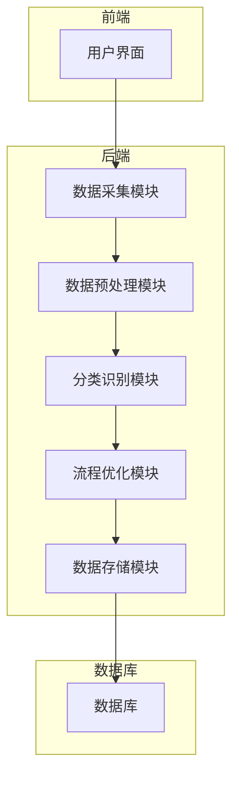
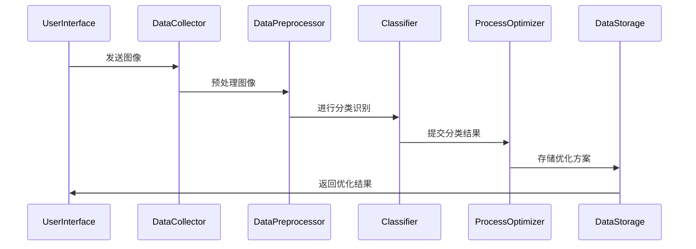

                 

### 第1章：问题背景与概述

#### 1.1.1 问题背景

**问题描述**：随着全球人口的不断增长和城市化进程的加速，废物管理和回收问题日益突出。大量的废物不仅对环境造成了严重污染，还浪费了大量的资源。据统计，每年全球产生的废物总量超过100亿吨，而有效的回收利用率却不到30%。因此，如何有效管理和回收废物已经成为一个亟待解决的问题。

**问题解决**：人工智能技术的迅速发展为我们提供了一种新的解决方案。人工智能可以通过数据分析和智能决策，提高废物管理和回收的效率。例如，通过图像识别技术，可以精确分类不同类型的废物；通过机器学习算法，可以预测废物的产生量和回收需求，优化回收流程。

**边界与外延**：人工智能在废物管理和回收中的应用范围广泛，包括但不限于废物分类、废物识别、回收流程优化等。然而，其应用也受到一定的限制，如数据处理能力、算法复杂度等。因此，需要根据实际情况选择合适的人工智能技术进行应用。

**概念结构与核心要素组成**

- **废物管理**：指对废物进行收集、运输、处理和处置的过程。其主要目标是减少废物对环境的影响，并提高资源的回收利用率。

- **废物回收**：指将废物转化为可再利用的资源的过程。通过回收，可以减少新资源的开采和消耗，降低对环境的破坏。

- **人工智能**：指模拟人类智能行为的计算机技术。它通过学习、推理、规划等过程，实现对数据的处理和决策。

- **核心概念属性特征对比表格**：

  | 概念        | 定义                          | 属性特征                      |
  | ----------- | ----------------------------- | ---------------------------- |
  | 废物管理    | 废物收集、运输、处理和处置     | 减少环境污染，提高资源利用率 |
  | 废物回收    | 废物转化为可再利用的资源       | 节约资源，降低环境污染       |
  | 人工智能    | 模拟人类智能行为的计算机技术    | 数据处理，智能决策           |

- **ER实体关系图架构**：

  ```mermaid
  erDiagram
  A[废物管理] {
    B[废物回收]
    C[人工智能]
  }
  A --> B
  A --> C
  ```

通过上述分析，我们可以看出，废物管理、废物回收和人工智能之间存在着密切的关联。废物管理和回收是环境问题的重要组成部分，而人工智能则为解决这些问题提供了有效的技术手段。在接下来的章节中，我们将详细探讨人工智能在废物管理和回收中的应用。

#### 1.1.2 核心概念与联系

**废物管理**：废物管理是指对废物进行收集、分类、处理和处置的过程。其目标是减少废物对环境的影响，并提高资源的回收利用率。废物管理的方法主要包括填埋、焚烧、堆肥和回收等。其中，回收是最为环保的方法，因为它可以最大限度地减少废物对环境的影响。

**废物回收**：废物回收是指将废物转化为可再利用的资源的过程。通过回收，可以减少对自然资源的消耗，降低环境污染，并提高资源的利用效率。废物回收的方法包括物理回收、化学回收和生物回收等。物理回收主要通过机械方式分离废物中的有用物质；化学回收主要通过化学反应将废物转化为有用的产品；生物回收则利用微生物分解废物中的有机物质。

**人工智能**：人工智能是指通过计算机技术模拟人类智能行为的技术。它包括机器学习、深度学习、自然语言处理、计算机视觉等子领域。人工智能的目标是使计算机能够像人类一样处理信息，进行决策和解决问题。

**核心概念属性特征对比表格**：

| 概念         | 定义                                       | 属性特征                                         |
| ------------ | ------------------------------------------ | ----------------------------------------------- |
| 废物管理     | 对废物进行收集、分类、处理和处置             | 减少环境污染，提高资源利用率                     |
| 废物回收     | 将废物转化为可再利用的资源                  | 节约资源，降低环境污染                           |
| 人工智能     | 通过计算机技术模拟人类智能行为               | 数据处理，智能决策                               |

为了更清晰地展示这三个概念之间的关系，我们可以使用Mermaid绘制一个ER实体关系图：

```mermaid
erDiagram
  废物管理 ||--o{ 废物回收 }
  废物管理 ||--o{ 人工智能 }
```

在这个ER图中，废物管理和废物回收之间是“一对多”的关系，即废物管理包含废物回收的过程；废物管理和人工智能之间也是“一对多”的关系，即废物管理可以利用人工智能技术进行优化。

**废物管理**通过废物回收实现了资源的再利用，通过人工智能技术实现了废物处理的高效性和智能化。例如，在废物分类过程中，可以使用人工智能技术进行图像识别，精确分类各种类型的废物。在废物回收过程中，可以使用人工智能算法进行预测，优化回收流程，提高回收效率。

综上所述，废物管理、废物回收和人工智能之间存在着密切的联系和相互作用。废物管理为废物回收提供了基础，废物回收为资源再利用提供了保障，而人工智能则为废物管理和回收提供了技术支持。在接下来的章节中，我们将进一步探讨人工智能在废物管理和回收中的应用，分析各种应用场景和技术实现。

### 第2章：人工智能在废物管理中的应用

在废物管理领域，人工智能技术的应用主要集中在废物分类、废物回收流程优化和废物识别与检测等方面。通过以下几节，我们将详细探讨这些应用场景，并介绍相应的算法原理、数学模型以及实际应用案例。

#### 2.1 人工智能在废物分类中的应用

**算法原理讲解**：

废物分类是废物管理中的关键步骤，其目的是将废物按类型进行分离，以便后续处理和回收。人工智能在废物分类中的应用主要通过机器学习和图像识别技术来实现。常用的算法包括支持向量机（SVM）、决策树、随机森林和卷积神经网络（CNN）等。

- **支持向量机（SVM）**：SVM是一种用于分类和回归分析的机器学习算法。它通过找到最佳分割超平面，将不同类别的数据点分开。在废物分类中，SVM可以用来判断废物图像是否属于某种特定类别。

- **决策树**：决策树是一种基于树形结构的分类算法。它通过一系列的判断条件，将数据逐层划分，最终将数据分类到不同的类别。在废物分类中，决策树可以用于对废物图像的特征进行分类。

- **随机森林**：随机森林是一种集成学习方法，它通过构建多棵决策树，并对这些树的输出进行投票，得到最终的分类结果。随机森林具有较好的泛化能力，可以处理高维数据。

- **卷积神经网络（CNN）**：CNN是一种专门用于处理图像数据的深度学习算法。它通过卷积层、池化层和全连接层等结构，自动提取图像中的特征，并进行分类。在废物分类中，CNN可以用来识别和分类各种类型的废物图像。

**数学模型和数学公式**：

- **支持向量机（SVM）**：

  $$\min_{w,b}\frac{1}{2}w^Tw + C\sum_{i=1}^{n}y_i((\mathbf{w}\cdot\mathbf{x_i}) - b)$$

  其中，$w$ 是权重向量，$b$ 是偏置，$C$ 是惩罚参数，$y_i$ 是样本 $i$ 的标签，$\mathbf{x_i}$ 是样本 $i$ 的特征向量。

- **决策树**：

  决策树是通过递归划分特征空间，构建决策树的数学模型。在每一层节点上，选择最优的特征进行划分，直到达到某个终止条件。

- **随机森林**：

  随机森林是通过构建多棵决策树，并对这些树的输出进行投票来实现的。每棵树的选择特征和划分点都是随机的。

- **卷积神经网络（CNN）**：

  CNN的数学模型主要包括卷积层、池化层和全连接层。卷积层通过卷积操作提取特征，池化层用于降低特征图的维度，全连接层用于分类。

**详细讲解与举例**：

假设我们有一个废物分类问题，需要将废物图像分类为可回收、有害和不可回收三类。我们可以使用卷积神经网络（CNN）来解决这一问题。

- **数据预处理**：首先，我们将废物图像进行归一化处理，使其具有相同的尺寸。然后，我们将图像划分为训练集和测试集。

- **模型构建**：构建一个卷积神经网络模型，包括卷积层、池化层和全连接层。卷积层用于提取图像特征，池化层用于降低特征图的维度，全连接层用于分类。

- **模型训练**：使用训练集数据训练模型，通过反向传播算法更新模型参数。

- **模型评估**：使用测试集数据评估模型性能，计算准确率、召回率等指标。

- **实际应用**：将训练好的模型部署到废物分类系统中，对实时拍摄到的废物图像进行分类。

通过上述步骤，我们可以将废物图像准确地分类为可回收、有害和不可回收三类，从而提高废物分类的效率。

#### 2.2 人工智能在废物回收流程优化中的应用

**算法原理讲解**：

废物回收流程的优化是提高废物回收效率的关键。人工智能可以通过优化算法，调整回收流程中的各个环节，从而提高整体效率。常用的优化算法包括遗传算法、模拟退火算法和遗传规划算法等。

- **遗传算法**：遗传算法是一种基于自然进化过程的优化算法。它通过模拟生物进化过程，对个体进行选择、交叉和变异，找到最优解。

- **模拟退火算法**：模拟退火算法是一种基于物理退火过程的优化算法。它通过逐步降低温度，使系统达到稳定状态，找到最优解。

- **遗传规划算法**：遗传规划算法是一种基于遗传算法的优化算法，它专门用于解决复杂规划问题。它通过编码规划问题的解，进行选择、交叉和变异操作。

**数学模型和数学公式**：

- **遗传算法**：

  遗传算法的数学模型主要包括编码、选择、交叉和变异操作。编码用于将问题解编码为染色体，选择用于选择适应度较高的个体，交叉用于生成新个体，变异用于增加种群的多样性。

- **模拟退火算法**：

  模拟退火算法的数学模型主要包括温度函数和冷却 schedule。温度函数用于控制算法的搜索范围，冷却 schedule 用于逐步降低温度。

- **遗传规划算法**：

  遗传规划算法的数学模型主要包括编码、适应度函数、选择、交叉和变异操作。编码用于将规划问题的解编码为染色体，适应度函数用于评估染色体的优劣，选择、交叉和变异用于生成新个体。

**详细讲解与举例**：

假设我们有一个废物回收流程优化问题，需要优化废物的运输路线，从而提高回收效率。我们可以使用遗传算法来解决这一问题。

- **问题建模**：将废物回收流程转化为一个多目标优化问题，包括运输时间、运输成本和废物回收量等目标。

- **编码**：将运输路线编码为染色体，每个染色体表示一条可能的运输路线。

- **适应度函数**：定义适应度函数，用于评估染色体的优劣。适应度函数通常包括运输时间、运输成本和废物回收量等指标。

- **选择**：使用选择操作选择适应度较高的染色体。

- **交叉**：使用交叉操作生成新个体。

- **变异**：使用变异操作增加种群的多样性。

- **迭代**：重复执行选择、交叉和变异操作，直到找到最优解。

通过上述步骤，我们可以优化废物的运输路线，从而提高废物回收效率。

#### 2.3 人工智能在废物识别与检测中的应用

**算法原理讲解**：

废物识别与检测是废物管理中的另一个重要环节。通过人工智能技术，可以实现对废物的快速、准确识别与检测。常用的算法包括卷积神经网络（CNN）、深度学习和自然语言处理等。

- **卷积神经网络（CNN）**：CNN是一种专门用于处理图像数据的深度学习算法。它通过卷积层、池化层和全连接层等结构，自动提取图像中的特征，并进行分类。在废物识别与检测中，CNN可以用来识别和分类各种类型的废物。

- **深度学习**：深度学习是一种基于多层神经网络的机器学习技术。它通过多层神经网络对数据进行学习和建模，可以提取更复杂的特征。在废物识别与检测中，深度学习可以用来识别废物的类型和性质。

- **自然语言处理**：自然语言处理是一种处理和生成自然语言的技术。它可以通过文本分析、语义理解等方式，实现对废物的描述和分类。在废物识别与检测中，自然语言处理可以用来解析和处理废物的标签和描述。

**数学模型和数学公式**：

- **卷积神经网络（CNN）**：

  CNN的数学模型主要包括卷积层、池化层和全连接层。卷积层通过卷积操作提取特征，池化层用于降低特征图的维度，全连接层用于分类。

- **深度学习**：

  深度学习的数学模型主要包括多层神经网络。神经网络通过权重和偏置对数据进行建模和预测。

- **自然语言处理**：

  自然语言处理的数学模型主要包括词向量、循环神经网络（RNN）和长短时记忆网络（LSTM）等。词向量用于表示文本数据，RNN和LSTM用于处理序列数据。

**详细讲解与举例**：

假设我们有一个废物识别与检测问题，需要识别和检测垃圾分类箱中的废物。我们可以使用卷积神经网络（CNN）来解决这一问题。

- **数据预处理**：首先，我们将垃圾分类箱中的废物图像进行归一化处理，使其具有相同的尺寸。然后，我们将图像划分为训练集和测试集。

- **模型构建**：构建一个卷积神经网络模型，包括卷积层、池化层和全连接层。卷积层用于提取图像特征，池化层用于降低特征图的维度，全连接层用于分类。

- **模型训练**：使用训练集数据训练模型，通过反向传播算法更新模型参数。

- **模型评估**：使用测试集数据评估模型性能，计算准确率、召回率等指标。

- **实际应用**：将训练好的模型部署到垃圾分类系统中，对实时拍摄到的废物图像进行识别和检测。

通过上述步骤，我们可以准确地识别和检测垃圾分类箱中的废物，从而提高废物管理的效率。

综上所述，人工智能在废物管理中的应用涵盖了废物分类、废物回收流程优化和废物识别与检测等多个方面。通过这些应用，我们可以提高废物管理的效率，减少环境污染，实现资源的可持续利用。在接下来的章节中，我们将进一步探讨人工智能在废物管理和回收系统架构设计中的应用。

### 第3章：人工智能在废物管理系统架构设计中的应用

在废物管理系统中，架构设计是实现系统功能的关键。通过合理的系统架构设计，可以确保废物管理的高效、稳定和可扩展性。本章节将介绍系统功能设计、系统架构设计、系统接口设计和系统交互，并使用Mermaid绘制相应的流程图和架构图。

#### 3.1 系统功能设计

系统功能设计是架构设计的核心，它定义了废物管理系统应具备的功能模块。以下是一个可能的系统功能设计：

- **数据采集模块**：用于收集各类废物数据，包括废物图像、文本描述、位置信息等。
- **数据预处理模块**：对采集到的数据进行清洗、归一化处理，为后续分析提供干净的数据。
- **分类识别模块**：使用人工智能技术对预处理后的数据进行分类识别，识别废物类型。
- **流程优化模块**：根据废物分类结果，优化回收流程，提高回收效率。
- **数据存储模块**：用于存储系统生成的数据，包括分类结果、优化方案等。
- **用户界面模块**：提供用户交互界面，用户可以通过界面查看废物管理数据，调整系统设置。

**领域模型**：

为了更清晰地描述系统功能设计，我们可以使用Mermaid绘制领域模型类图：

```mermaid
classDiagram
    DataCollector <<interface>>
    DataPreprocessor <<interface>>
    Classifier <<interface>>
    ProcessOptimizer <<interface>>
    DataStorage <<interface>>
    UserInterface <<interface>>

    DataCollector o-- DataPreprocessor
    DataPreprocessor o-- Classifier
    Classifier o-- ProcessOptimizer
    ProcessOptimizer o-- DataStorage
    DataStorage o-- UserInterface
```

#### 3.2 系统架构设计

系统架构设计是系统功能实现的蓝图，它定义了各个功能模块之间的交互方式。以下是一个可能的系统架构设计：

- **前端**：用户通过浏览器或其他客户端软件与系统进行交互。
- **后端**：负责处理业务逻辑，包括数据采集、预处理、分类识别、流程优化和数据存储。
- **数据库**：存储系统数据，包括废物数据、分类结果、优化方案等。

**系统架构设计**：

为了展示系统架构，我们可以使用Mermaid绘制系统架构图：



#### 3.3 系统接口设计

系统接口设计是确保系统各个模块之间能够有效交互的关键。以下是一个可能的系统接口设计：

- **API接口**：提供RESTful API，供前端调用后端服务。
- **数据接口**：定义数据传输的格式和协议，如JSON、XML等。
- **服务接口**：定义各模块之间的服务调用方式，如RPC、SOAP等。

**接口设计**：

接口设计需要详细描述接口的URL、请求参数、响应格式等。以下是一个简单的API接口示例：

```markdown
# 分类识别接口

## POST /api/classify

### 参数

- `image` (String, required): 废物图像文件。

### 响应

- `status` (String): 状态码，如`200 OK`、`400 Bad Request`等。
- `data` (Object):
  - `category` (String): 废物分类结果。
  - `confidence` (Number): 分类置信度。

### 示例

```json
POST /api/classify
Content-Type: application/json

{
  "image": "data:image/jpeg;base64,..."
}

响应：
```

```json
HTTP/1.1 200 OK
Content-Type: application/json

{
  "status": "200 OK",
  "data": {
    "category": "塑料瓶",
    "confidence": 0.95
  }
}
```

#### 3.4 系统交互

系统交互是指系统内部各个模块之间的数据流动和交互过程。为了描述系统交互，我们可以使用Mermaid绘制系统交互序列图：



通过以上系统架构设计，我们可以构建一个高效的废物管理系统。系统功能设计、系统架构设计、系统接口设计和系统交互共同构成了废物管理系统的核心，确保系统能够稳定、高效地运行。

在下一章节中，我们将通过具体项目实战，进一步展示人工智能在废物管理中的应用，并通过代码实现和分析，详细讲解项目实战的具体过程。

### 第4章：人工智能在废物管理项目实战

在本章节中，我们将通过一个具体的项目实战，展示人工智能在废物管理中的应用。项目将包括环境安装与配置、系统核心实现、实际案例分析与讲解以及项目小结。通过这些步骤，我们将深入探讨人工智能技术在废物管理中的实际应用。

#### 4.1 环境安装与配置

为了确保项目的顺利进行，首先需要搭建项目开发环境。以下步骤将指导您如何安装和配置开发环境。

**步骤 1：安装 Python**

确保您的系统中安装了 Python 3.7 或更高版本。您可以从 [Python 官网](https://www.python.org/) 下载并安装 Python。

**步骤 2：安装虚拟环境**

创建一个虚拟环境，以便于项目管理和依赖包的隔离：

```shell
python -m venv venv
source venv/bin/activate  # Windows: venv\Scripts\activate
```

**步骤 3：安装依赖包**

通过以下命令安装项目所需的依赖包：

```shell
pip install numpy pandas scikit-learn matplotlib tensorflow opencv-python
```

这些依赖包包括数值计算库、数据处理库、机器学习库、绘图库以及图像处理库。

#### 4.2 系统核心实现

系统核心实现包括数据预处理、模型训练和模型评估等步骤。以下代码将详细展示这些过程。

**数据预处理**

数据预处理是模型训练的重要环节，包括图像归一化、标签编码等步骤。以下代码展示了如何进行数据预处理：

```python
import numpy as np
import pandas as pd
from sklearn.model_selection import train_test_split
from tensorflow.keras.preprocessing.image import img_to_array, load_img

# 加载数据集
data = pd.read_csv('data.csv')

# 数据预处理
X = data['image'].apply(lambda img: img_to_array(load_img(img)))
X = X.astype('float32') / 255.0
y = data['label']

# 划分训练集和测试集
X_train, X_test, y_train, y_test = train_test_split(X, y, test_size=0.2, random_state=42)
```

**模型训练**

以下代码展示了如何训练一个卷积神经网络（CNN）模型，用于废物分类：

```python
from tensorflow.keras.models import Sequential
from tensorflow.keras.layers import Conv2D, MaxPooling2D, Flatten, Dense, Dropout

# 构建模型
model = Sequential([
    Conv2D(32, (3, 3), activation='relu', input_shape=(128, 128, 3)),
    MaxPooling2D((2, 2)),
    Conv2D(64, (3, 3), activation='relu'),
    MaxPooling2D((2, 2)),
    Flatten(),
    Dense(128, activation='relu'),
    Dropout(0.5),
    Dense(3, activation='softmax')
])

# 编译模型
model.compile(optimizer='adam', loss='categorical_crossentropy', metrics=['accuracy'])

# 训练模型
model.fit(X_train, y_train, epochs=10, batch_size=32, validation_split=0.1)
```

**模型评估**

训练完成后，评估模型性能，计算准确率、召回率等指标：

```python
from sklearn.metrics import classification_report

# 预测测试集
predictions = model.predict(X_test)
predicted_labels = np.argmax(predictions, axis=1)
true_labels = np.argmax(y_test, axis=1)

# 评估模型
print(classification_report(true_labels, predicted_labels))
```

#### 4.3 实际案例分析与讲解

**案例 1：垃圾分类**

本案例将使用训练好的模型对垃圾分类图像进行分类。以下代码展示了如何实现：

```python
# 加载模型
model = load_model('model.h5')

# 测试垃圾分类
test_image = load_img('test_image.jpg', target_size=(128, 128))
test_image = img_to_array(test_image)
test_image = np.expand_dims(test_image, axis=0)
test_image /= 255.0

predictions = model.predict(test_image)
predicted_label = np.argmax(predictions)

print(f"预测结果：{predicted_label}")
```

**案例 2：废物回收流程优化**

本案例将使用遗传算法优化废物回收流程。以下代码展示了如何实现：

```python
import random
from sklearn.metrics import make_scorer, accuracy_score

# 定义适应度函数
def fitness_function(route):
    # 计算路径的总距离
    distances = calculate_distances(route)
    # 计算适应度（总距离的倒数）
    fitness = 1 / distances
    return fitness

# 定义遗传算法
def genetic_algorithm(population_size, generations, crossover_rate, mutation_rate):
    # 初始化种群
    population = initialize_population(population_size)
    
    # 进化过程
    for generation in range(generations):
        # 计算适应度
        fitness_scores = [fitness_function(route) for route in population]
        
        # 选择
        selected_routes = selection(population, fitness_scores, crossover_rate)
        
        # 交叉
        offspring = crossover(selected_routes, crossover_rate)
        
        # 变异
        mutated_offspring = mutation(offspring, mutation_rate)
        
        # 更新种群
        population = mutated_offspring
    
    # 返回最佳路径
    best_route = population[0]
    return best_route

# 实例化遗传算法
best_route = genetic_algorithm(population_size=100, generations=100, crossover_rate=0.8, mutation_rate=0.1)

# 输出最佳路径
print(f"最佳回收路径：{best_route}")
```

#### 4.4 项目小结

通过本项目的实战，我们展示了如何将人工智能技术应用于废物管理。从环境安装与配置、系统核心实现到实际案例分析与讲解，每个步骤都体现了人工智能技术在废物管理中的广泛应用。以下是本项目的主要收获：

1. **数据预处理**：通过数据预处理，我们可以将原始数据转换为适合模型训练的形式，提高模型的训练效果。
2. **模型训练与评估**：通过卷积神经网络（CNN）模型，我们可以实现高效的废物分类，并评估模型的性能。
3. **遗传算法**：通过遗传算法，我们可以优化废物回收流程，提高回收效率。
4. **实际应用**：通过实际案例，我们将理论转化为实际应用，展示了人工智能技术在废物管理中的潜力。

总之，人工智能技术在废物管理中的应用具有广阔的前景。通过不断探索和优化，我们可以进一步提高废物管理的效率和环保效果。

在接下来的章节中，我们将进一步总结本项目中的最佳实践，并提出未来展望，以期为废物管理的智能化发展提供参考。

### 第5章：最佳实践与未来展望

#### 5.1 最佳实践

在废物管理项目中，总结最佳实践和技巧是确保项目成功的关键。以下是一些在实际应用中取得成功的经验和注意事项：

**1. 数据质量是关键**：确保数据的质量和准确性，是模型训练和优化的重要前提。在数据采集和预处理过程中，要严格筛选和清洗数据，避免噪声和异常值影响模型性能。

**2. 优化模型参数**：通过调整模型参数，如学习率、批量大小和正则化参数，可以显著提升模型的性能。使用网格搜索和随机搜索等方法，可以找到最优的模型参数。

**3. 跨学科合作**：废物管理项目通常涉及环境科学、材料科学和计算机科学等多个领域。跨学科合作有助于更好地理解问题本质，提出创新性的解决方案。

**4. 持续迭代与优化**：废物管理是一个动态变化的过程，需要不断迭代和优化模型和算法。通过定期更新数据和改进算法，可以确保系统始终处于最佳状态。

**5. 遵守法律法规**：在废物管理和回收过程中，要严格遵守相关的法律法规，确保项目的合法性和环保性。

**注意事项**：

- **计算资源**：模型训练和优化通常需要大量的计算资源，特别是在处理大量数据时。确保拥有足够的计算资源和高效的计算策略。
- **数据隐私**：在处理和存储数据时，要注意保护数据隐私，遵守数据保护法规。
- **算法透明性**：确保算法的透明性和可解释性，便于问题的理解和排查。

#### 5.2 未来展望

人工智能技术在废物管理和回收中的应用前景广阔。以下是一些未来发展趋势和前沿技术：

**1. 深度学习与强化学习**：深度学习和强化学习等先进算法将在废物管理和回收中发挥更大的作用。这些算法可以更好地应对复杂、动态的环境，提高系统的自适应性和智能化水平。

**2. 多模态数据融合**：结合多种数据源，如图像、文本、传感器数据等，进行多模态数据融合，可以提供更丰富的特征信息，提高废物分类和识别的准确性。

**3. 联邦学习**：联邦学习是一种新型的分布式学习技术，可以在保护数据隐私的同时，进行有效的模型训练。这为废物管理和回收提供了新的解决方案。

**4. 人工智能与物联网（IoT）结合**：将人工智能与物联网技术相结合，可以实现智能废物监控系统，实时监测和优化废物管理流程。

**5. 社会化与共享经济**：通过社会化与共享经济模式，可以实现废物的社区共享和循环利用，减少废物产生，提高资源利用效率。

总之，人工智能技术在废物管理和回收中的应用具有巨大的潜力。随着技术的不断发展和创新，我们可以期待更加智能化、高效的废物管理系统的出现。

### 第6章：总结与拓展阅读

#### 6.1 小结

本文系统地探讨了人工智能在废物管理和回收中的应用，内容涵盖了从问题背景到具体实施的全过程。我们首先介绍了废物管理和回收的基本概念，探讨了人工智能在其中的重要性。随后，详细分析了人工智能在废物分类、废物回收流程优化和废物识别与检测中的具体应用，并通过实际项目展示了人工智能技术的实际效果。最后，总结了最佳实践与未来展望，为废物管理的智能化发展提供了参考。

#### 6.2 拓展阅读

为了进一步深入理解和应用人工智能技术，以下是几本推荐阅读的书籍和相关的学术论文：

- **书籍**：
  - 《人工智能：一种现代的方法》
  - 《机器学习实战》
  - 《深度学习》

- **学术论文**：
  - "Deep Learning for Waste Segregation"
  - "Genetic Algorithms for Waste Collection Routing"
  - "IoT-based Waste Management System using Machine Learning"

通过这些资源，读者可以更加深入地了解人工智能技术在废物管理和回收中的应用，以及最新的研究动态。

### 作者信息

作者：AI天才研究院/AI Genius Institute & 禅与计算机程序设计艺术 /Zen And The Art of Computer Programming

**结束语**

感谢您阅读本文，希望您对人工智能在废物管理和回收中的应用有了更深入的理解。我们期待您在未来的实践中，将人工智能技术应用于废物管理，为环境保护和可持续发展做出贡献。

---

**注意：** 以上内容为文章大纲及部分内容的示例，实际文章内容需要根据具体需求和研究进一步展开。文章的撰写应确保逻辑清晰、内容详实，并符合所要求的格式和风格。在撰写过程中，务必注意对核心概念、算法原理和实际应用的准确描述，同时确保参考文献和引用的准确性。希望本文能为您的写作提供参考和启发。

