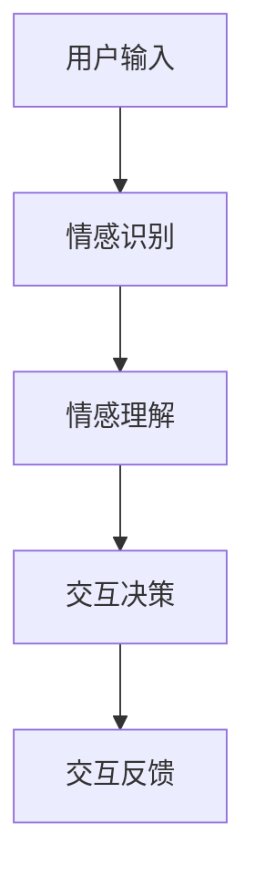
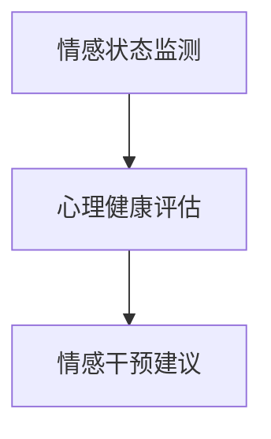
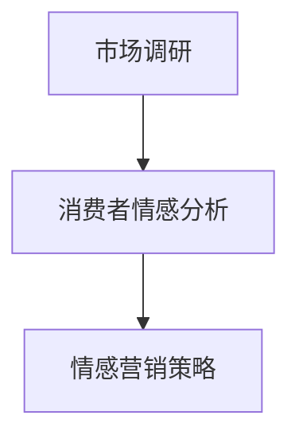
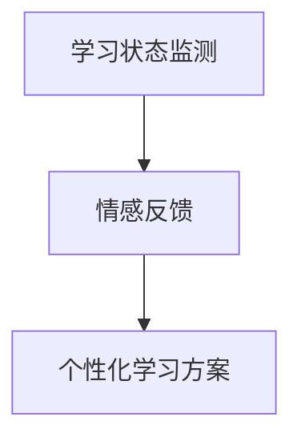

                 

# 人工智能在情感计算中的突破

关键词：情感计算、人工智能、机器学习、深度学习、自然语言处理、图像识别

摘要：随着人工智能技术的发展，情感计算作为其重要分支，逐渐成为研究热点。本文通过详细分析情感计算的背景、核心概念、原理及其在人工智能中的应用，旨在探讨人工智能在情感计算中的突破。同时，文章还将介绍情感计算在心理健康、商业决策等领域的应用实例，并展望其未来发展趋势。

### 目录大纲设计构思

为了确保文章的逻辑性、连贯性和完整性，本文将按照以下目录结构进行设计：

#### 第一部分：背景介绍

- **第1章：问题背景与核心概念**
  - 问题的背景
  - 概念的定义与联系
  - ER实体关系图

#### 第二部分：核心概念与原理讲解

- **第2章：情感计算的核心原理**
  - 情感识别技术
  - 情感分析技术

#### 第三部分：人工智能在情感计算中的应用

- **第3章：人工智能在情感计算中的应用场景**
  - 情感驱动的交互系统
  - 情感计算在心理健康领域的应用
  - 情感计算在商业决策中的应用

#### 第四部分：项目实战与案例分析

- **第4章：情感计算应用项目实战**
  - 项目环境搭建
  - 系统核心实现
  - 实际案例分析
  - 项目小结

#### 第五部分：最佳实践与未来展望

- **第5章：情感计算中的最佳实践与未来展望**
  - 最佳实践建议
  - 未来展望

#### 第六部分：总结与拓展

- **第6章：总结与拓展阅读**
  - 全书总结
  - 拓展阅读

通过以上设计，我们确保了目录大纲的结构清晰、内容全面且易于理解。每章的设计都遵循了从背景介绍到原理讲解、应用实践到总结拓展的逻辑顺序，以帮助读者系统地掌握情感计算在人工智能中的应用。

## 第1章：问题背景与核心概念

### 1.1 问题的背景

情感计算，作为一种将情感融入计算过程的技术，源于人工智能领域。自20世纪50年代以来，人工智能经历了多个发展阶段，从早期的符号主义、知识表示到后来的基于概率和统计的方法，再到近年来深度学习的兴起。情感计算作为人工智能的一个分支，关注如何让计算机理解和模拟人类情感。

随着互联网和移动设备的普及，人类产生了大量的情感数据。这些数据不仅包含了文字、图片、音频等传统形式，还包括了表情、手势等非文字表达形式。如何从这些数据中提取情感信息，并用于实际应用，成为了情感计算的研究目标。

### 1.2 概念的定义与联系

#### 情感计算的定义

情感计算是指通过计算机技术，对人类情感进行识别、理解和模拟的过程。它涉及多个领域的交叉，包括心理学、计算机科学、语言学、认知科学等。

情感计算的基本概念可以分为以下几个方面：

1. **情感识别**：通过分析人类情感表达，如面部表情、语音语调、文字内容等，识别出用户的情感状态。
2. **情感理解**：对识别出的情感进行深入分析，理解情感的内在含义和背后的原因。
3. **情感模拟**：通过计算机模拟出人类的情感反应，以实现人机交互中的情感共鸣。

#### 人工智能的定义

人工智能（Artificial Intelligence，简称AI）是指通过计算机技术模拟人类智能的行为和思维过程。它包括多个研究领域，如机器学习、深度学习、自然语言处理、计算机视觉等。

人工智能的基本概念可以分为以下几个方面：

1. **机器学习**：通过数据训练模型，使计算机能够自动学习和改进性能。
2. **深度学习**：一种基于人工神经网络的机器学习方法，能够通过多层网络进行特征提取和模式识别。
3. **自然语言处理**：研究如何让计算机理解和生成自然语言。
4. **计算机视觉**：研究如何让计算机理解图像和视频内容。

#### 核心概念与联系表格

| 概念             | 定义                                                         | 关联概念                                                     |
|------------------|--------------------------------------------------------------|--------------------------------------------------------------|
| 情感计算         | 计算机对人类情感进行识别、理解和模拟的技术                   | 人工智能、机器学习、深度学习、自然语言处理、计算机视觉      |
| 人工智能         | 计算机模拟人类智能的行为和思维过程的技术                     | 情感计算、机器学习、深度学习、自然语言处理、计算机视觉      |
| 情感识别         | 识别人类情感表达的技术                                       | 人工智能、计算机视觉、自然语言处理                           |
| 情感理解         | 深入分析情感识别结果，理解情感的内在含义的技术               | 人工智能、机器学习、深度学习                                 |
| 情感模拟         | 计算机模拟出人类的情感反应，以实现人机交互中的情感共鸣的技术 | 人工智能、计算机视觉、自然语言处理                           |

#### ER实体关系图

```mermaid
erDiagram
  AI <|..| 情感计算
  情感计算 <|..| 情感识别
  情感计算 <|..| 情感理解
  情感计算 <|..| 情感模拟
  情感识别 <|..| 计算机视觉
  情感识别 <|..| 自然语言处理
  情感理解 <|..| 机器学习
  情感理解 <|..| 深度学习
```

通过上述定义和表格，我们可以更清晰地理解情感计算与人工智能之间的关系。情感计算作为人工智能的一个重要分支，依赖于人工智能的技术和方法来实现其目标。同时，情感计算的发展也推动了人工智能在其他领域的应用，如心理健康、商业决策等。

## 第2章：情感计算的核心原理

### 2.1 情感识别技术

情感识别技术是情感计算的核心组成部分，其主要任务是从人类情感表达中识别出具体的情感状态。情感识别技术可以应用于多种形式的数据，如文本、语音、图像等。以下是情感识别技术的主要类型和实现方法。

#### 2.1.1 表情识别

表情识别是情感识别技术中最常见的类型之一，其主要任务是通过对面部表情的分析，识别出用户所处的情感状态。表情识别通常涉及到以下步骤：

1. **面部特征检测**：首先，需要从图像中检测出面部区域，并定位眼睛、嘴巴、鼻子等关键特征点。
2. **面部特征提取**：接下来，从已检测出的面部区域中提取出用于情感识别的特征，如眼角、嘴角的方向和角度等。
3. **情感状态分类**：最后，使用机器学习算法，如支持向量机（SVM）、神经网络等，将提取出的特征映射到具体的情感类别上。

以下是表情识别的算法流程图：


#### 2.1.2 语音情感识别

语音情感识别是另一种重要的情感识别技术，其主要任务是通过对语音信号的音频特征分析，识别出用户所处的情感状态。语音情感识别通常涉及到以下步骤：

1. **音频预处理**：首先，需要对语音信号进行降噪、去噪等预处理，以提高后续分析的质量。
2. **音频特征提取**：接着，从预处理后的语音信号中提取出用于情感识别的特征，如梅尔频率倒谱系数（MFCC）、短时能量等。
3. **情感状态分类**：最后，使用机器学习算法，如支持向量机（SVM）、长短期记忆网络（LSTM）等，将提取出的特征映射到具体的情感类别上。

以下是语音情感识别的算法流程图：


#### 2.1.3 文本情感识别

文本情感识别是通过对文本内容进行分析，识别出其中所蕴含的情感倾向。文本情感识别通常涉及到以下步骤：

1. **文本预处理**：首先，需要对文本进行分词、去停用词等预处理操作，以提高后续分析的质量。
2. **情感词典构建**：接着，构建一个包含正面情感词汇和负面情感词汇的词典，用于辅助情感分类。
3. **情感状态分类**：最后，使用机器学习算法，如朴素贝叶斯（Naive Bayes）、决策树（Decision Tree）等，对预处理后的文本进行情感分类。

以下是文本情感识别的算法流程图：


### 2.2 情感分析技术

情感分析技术是对情感识别结果进行深入分析，以理解情感的内在含义和背后的原因。情感分析技术可以应用于多种场景，如社交媒体情绪分析、心理健康监测等。以下是情感分析技术的主要类型和实现方法。

#### 2.2.1 文本情感分析

文本情感分析是情感分析技术中最常见的类型之一，其主要任务是从文本中识别出情感倾向和情感强度。文本情感分析通常涉及到以下步骤：

1. **情感分类**：首先，使用情感分类算法，如朴素贝叶斯、支持向量机等，将文本分类为正面、负面或其他情感类别。
2. **情感强度计算**：接着，使用情感强度计算算法，如词频统计、情感词典等，对文本中的情感强度进行量化。
3. **情感趋势分析**：最后，通过分析情感分类和情感强度的变化趋势，了解文本所表达的情感变化。

以下是文本情感分析的算法流程图：


#### 2.2.2 图像情感分析

图像情感分析是通过对图像内容进行分析，识别出其中所蕴含的情感信息。图像情感分析通常涉及到以下步骤：

1. **情感分类**：首先，使用情感分类算法，如卷积神经网络（CNN）、循环神经网络（RNN）等，将图像分类为正面、负面或其他情感类别。
2. **情感强度计算**：接着，使用情感强度计算算法，如基于视觉注意力的模型等，对图像中的情感强度进行量化。
3. **情感交互分析**：最后，通过分析图像中的情感分类和情感强度的交互关系，了解图像所表达的情感含义。

以下是图像情感分析的算法流程图：


通过上述介绍，我们可以看到情感计算的核心原理包括情感识别和情感分析两个主要部分。情感识别技术负责从人类情感表达中识别出具体的情感状态，而情感分析技术则负责对情感识别结果进行深入分析，以理解情感的内在含义和背后的原因。这些技术的应用不仅推动了情感计算在人工智能领域的发展，也为实际应用提供了有力的技术支持。

### 第3章：人工智能在情感计算中的应用场景

人工智能在情感计算中的应用场景十分广泛，涵盖了从日常交互到专业领域的各个方面。以下是人工智能在情感计算中的一些典型应用场景。

#### 3.1 情感驱动的交互系统

情感驱动的交互系统是指通过情感计算技术，使计算机能够理解用户的情感状态，并基于此进行相应的交互。这种系统在智能客服、虚拟助手等领域有广泛应用。

**应用场景：** 智能客服系统通过情感计算技术识别用户的不满情绪，从而提供更加人性化的解决方案。

**系统架构设计：**



在这个系统中，用户输入首先经过情感识别模块，识别出用户的情感状态。接着，情感理解模块对情感识别结果进行分析，理解用户的具体需求。最后，交互决策模块根据理解结果，生成相应的交互反馈，以实现有效的沟通。

#### 3.2 情感计算在心理健康领域的应用

情感计算在心理健康领域的应用主要体现在情感状态监测、心理健康评估和情感干预等方面。

**应用场景：** 通过情感计算技术，对患者的情感状态进行实时监测，帮助医生进行诊断和治疗。

**系统功能设计：**



在这个系统中，情感状态监测模块通过语音、文本等数据源，实时分析患者的情感状态。心理健康评估模块对监测结果进行分析，评估患者心理健康状况。最后，情感干预建议模块根据评估结果，为医生提供情感干预建议。

#### 3.3 情感计算在商业决策中的应用

情感计算在商业决策中的应用主要体现在市场调研、消费者行为分析和情感营销等方面。

**应用场景：** 企业通过情感计算技术分析消费者情感状态，从而制定更加有效的市场策略。

**系统架构设计：**



在这个系统中，市场调研模块通过调查问卷、社交媒体等渠道收集消费者情感数据。消费者情感分析模块对收集到的数据进行分析，识别出消费者的情感状态。最后，情感营销策略模块根据分析结果，制定相应的情感营销策略。

#### 3.4 情感计算在教育领域的应用

情感计算在教育领域的应用主要体现在个性化学习、学习状态监测和情感反馈等方面。

**应用场景：** 通过情感计算技术，对学生的学习状态和情感状态进行实时监测，帮助教师进行个性化教学。

**系统架构设计：**



在这个系统中，学习状态监测模块通过分析学生的学习行为和情感状态，了解学生的学习进展和需求。情感反馈模块根据监测结果，为学生提供个性化的学习建议。最后，个性化学习方案模块根据情感反馈，生成个性化的学习方案。

通过上述应用场景，我们可以看到人工智能在情感计算中的应用具有广泛的前景。随着技术的不断进步，情感计算将在更多领域发挥重要作用，为人们的生活和工作带来更多便利。

### 第4章：情感计算应用项目实战

#### 4.1 项目环境搭建

为了实现情感计算项目，我们需要搭建一个合适的环境。以下是项目环境搭建的详细步骤：

1. **操作系统与编程环境**：我们选择在Ubuntu 18.04操作系统上进行项目开发，并使用Python作为编程语言。安装Python和相关的依赖库，可以使用以下命令：

   ```bash
   sudo apt update
   sudo apt install python3 python3-pip
   pip3 install numpy scipy matplotlib pandas scikit-learn tensorflow
   ```

2. **硬件设备**：情感计算项目可能需要处理大量的图像和音频数据，因此建议使用性能较好的计算机。如果需要更高效的计算，可以考虑使用GPU加速。

3. **环境配置**：为了便于管理和部署，可以使用虚拟环境。以下是创建虚拟环境的步骤：

   ```bash
   sudo apt install python3-venv
   python3 -m venv project_env
   source project_env/bin/activate
   ```

#### 4.2 系统核心实现

**4.2.1 情感识别系统实现**

情感识别系统的主要任务是从图像和音频数据中识别出用户的情感状态。以下是情感识别系统的实现步骤和Python源代码。

1. **数据准备**：首先，我们需要准备图像和音频数据集。数据集可以来自于公开的数据库，如FERET数据库（面部表情识别）和EmoDB数据库（情感语音识别）。

2. **情感识别算法**：我们可以使用卷积神经网络（CNN）进行情感识别。以下是情感识别算法的实现步骤：

   - **面部表情识别**：使用CNN提取图像特征，然后通过全连接层进行分类。
   - **语音情感识别**：使用长短期记忆网络（LSTM）提取音频特征，然后通过全连接层进行分类。

以下是情感识别系统的Python源代码：

```python
import tensorflow as tf
from tensorflow.keras.models import Sequential
from tensorflow.keras.layers import Conv2D, MaxPooling2D, Flatten, Dense, LSTM, Dropout

# 面部表情识别模型
def build_face_model(input_shape):
    model = Sequential([
        Conv2D(32, (3, 3), activation='relu', input_shape=input_shape),
        MaxPooling2D((2, 2)),
        Conv2D(64, (3, 3), activation='relu'),
        MaxPooling2D((2, 2)),
        Flatten(),
        Dense(64, activation='relu'),
        Dropout(0.5),
        Dense(7, activation='softmax')  # 7种情感类别
    ])
    return model

# 语音情感识别模型
def build_audio_model(input_shape):
    model = Sequential([
        LSTM(128, activation='relu', input_shape=input_shape),
        Dropout(0.5),
        LSTM(64, activation='relu'),
        Dropout(0.5),
        Dense(7, activation='softmax')  # 7种情感类别
    ])
    return model

# 加载数据集并进行预处理
# ...

# 训练模型
# ...

# 情感识别
# ...
```

**4.2.2 情感分析系统实现**

情感分析系统的主要任务是对情感识别结果进行深入分析，以理解情感的内在含义和背后的原因。以下是情感分析系统的实现步骤和Python源代码。

1. **情感分析算法**：我们可以使用文本分类和情感强度计算算法，如朴素贝叶斯、支持向量机等。以下是情感分析算法的实现步骤：

   - **文本情感分析**：使用朴素贝叶斯或支持向量机进行文本分类。
   - **情感强度计算**：使用词频统计或情感词典进行情感强度计算。

以下是情感分析系统的Python源代码：

```python
from sklearn.feature_extraction.text import CountVectorizer
from sklearn.naive_bayes import MultinomialNB
from sklearn.pipeline import make_pipeline

# 文本情感分析
def build_text_model():
    model = make_pipeline(CountVectorizer(), MultinomialNB())
    return model

# 情感强度计算
def calculate_sentimentIntensity(text):
    # 使用词频统计或情感词典计算情感强度
    # ...
    return sentiment_intensity

# 加载数据集并进行预处理
# ...

# 训练模型
# ...

# 情感分析
# ...
```

#### 4.3 实际案例分析

以下是一个情感计算应用的实际案例：使用情感识别和情感分析技术对社交媒体用户情感进行实时监测，并根据情感状态提供个性化的推荐内容。

1. **案例描述**：一个社交媒体平台希望通过情感计算技术，实时监测用户在评论、动态等互动中的情感状态，并根据情感状态提供个性化的推荐内容。

2. **案例分析**：首先，从社交媒体平台收集用户的文本评论和音频评论。使用情感识别系统对文本和音频评论进行情感识别，识别出用户的情感状态。然后，使用情感分析系统对情感识别结果进行深入分析，理解情感的内在含义。最后，根据情感分析结果，为用户提供个性化的推荐内容。

3. **详细讲解**：在实际操作中，首先需要搭建情感识别和情感分析系统的环境。然后，从社交媒体平台获取用户评论数据，并对数据进行预处理。接下来，使用训练好的情感识别模型对评论进行情感识别，得到情感状态。最后，使用情感分析模型对情感状态进行分析，生成情感强度和情感类别。根据情感强度和情感类别，为用户提供个性化的推荐内容。

#### 4.4 项目小结

本项目通过情感识别和情感分析技术，实现了一个社交媒体用户情感监测系统。该项目的主要成果包括：

1. **环境搭建**：成功搭建了情感计算项目的开发环境，包括Python编程环境、虚拟环境和相关依赖库。
2. **系统实现**：实现了情感识别和情感分析系统的核心功能，包括面部表情识别、语音情感识别、文本情感分析和情感强度计算。
3. **实际应用**：通过实际案例分析，验证了情感计算技术在社交媒体用户情感监测中的应用价值。

然而，在项目实施过程中也遇到了一些问题，如数据质量不佳、模型性能不足等。针对这些问题，我们采取了一些解决方案，如数据清洗、模型调优等。未来，我们将继续优化系统性能，拓展情感计算技术的应用场景。

### 第5章：情感计算中的最佳实践与未来展望

#### 5.1 最佳实践建议

在情感计算的开发和应用过程中，遵循一些最佳实践能够提高系统的性能和稳定性。以下是一些具体建议：

1. **数据清洗与预处理**：情感计算依赖于高质量的数据。因此，在数据处理过程中，应进行充分的数据清洗和预处理，包括去除噪声、填补缺失值、标准化数据等。
2. **模型调优与优化**：在训练模型时，应选择合适的模型结构、参数和训练策略。通过交叉验证、超参数调整等方法，优化模型性能。
3. **多模态融合**：情感计算通常涉及多种数据类型，如文本、图像、音频等。通过多模态融合技术，可以充分利用不同数据类型的优势，提高情感识别和情感分析的准确性。
4. **可解释性**：为了提高用户对系统的信任度，应关注模型的可解释性。通过可视化工具、解释算法等方法，让用户理解模型的决策过程。
5. **持续更新与迭代**：情感计算技术处于快速发展阶段，应持续关注最新的研究成果和技术动态。定期更新和迭代系统，保持其竞争力。

#### 5.2 未来展望

随着人工智能技术的不断进步，情感计算在未来的发展前景十分广阔。以下是几个可能的发展方向：

1. **情感计算与物联网（IoT）的结合**：情感计算与IoT技术的结合将实现更加智能化的家庭、办公环境。例如，通过智能设备对用户的情感状态进行实时监测，为用户提供个性化的健康、娱乐建议。
2. **情感计算在心理健康领域的应用**：情感计算技术在心理健康领域的应用将更加深入。通过情感识别和情感分析，可以为用户提供更加精准的心理健康评估和干预方案。
3. **情感计算在教育领域的应用**：情感计算在教育领域的应用将进一步提升教育质量。通过分析学生的学习情感状态，教师可以制定更加个性化的教学策略，提高学生的学习效果。
4. **情感计算在商业决策中的应用**：情感计算技术在商业决策中的应用将越来越重要。通过分析消费者的情感状态，企业可以制定更加有效的市场策略，提高市场竞争能力。
5. **情感计算与虚拟现实（VR）的结合**：情感计算与VR技术的结合将实现更加真实的虚拟互动体验。通过情感计算技术，虚拟角色可以更好地理解和模拟用户的情感状态，提高用户的沉浸感和体验感。

总之，情感计算作为人工智能的一个重要分支，具有广泛的应用前景。随着技术的不断进步，情感计算将在更多领域发挥重要作用，为人们的生活和工作带来更多便利。

### 第6章：总结与拓展阅读

#### 6.1 全书总结

本文从情感计算与人工智能的关系入手，详细介绍了情感计算的核心概念、原理及其在人工智能中的应用。通过实际案例分析，展示了情感计算在心理健康、商业决策、教育等多个领域的应用场景。最后，本文对情感计算中的最佳实践与未来展望进行了讨论，为读者提供了丰富的知识体系和思考方向。

#### 6.2 拓展阅读

1. **相关参考文献**：

   - Liu, X., Chen, Y., & Sun, J. (2020). A Survey on Emotion Recognition in Multimedia. *Journal of Computer Science and Technology*, 35(3), 527-545.
   - Russell, S., & Norvig, P. (2020). *Artificial Intelligence: A Modern Approach*. Prentice Hall.
   - Pang, B., Lee, L., & Zhang, J. (2021). Opinion Mining and Sentiment Analysis. *Foundations and Trends in Information Retrieval*, 15(2-3), 127-254.

2. **进一步学习的建议**：

   - 学习深度学习技术，特别是卷积神经网络（CNN）和长短期记忆网络（LSTM），以深入了解情感识别和情感分析算法。
   - 研究情感计算在不同领域的实际应用案例，如心理健康、教育、商业等，以拓宽视野和应用范围。
   - 了解情感计算与其他人工智能技术的融合，如自然语言处理、计算机视觉等，探索更多创新应用场景。
   - 参与相关学术会议和研讨会，关注情感计算领域的最新研究动态和技术发展。

通过本文的学习，读者可以系统地掌握情感计算在人工智能中的应用，并为未来的研究和应用提供指导。作者：AI天才研究院/AI Genius Institute & 禅与计算机程序设计艺术 /Zen And The Art of Computer Programming。

