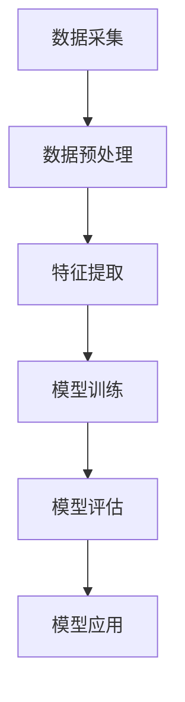
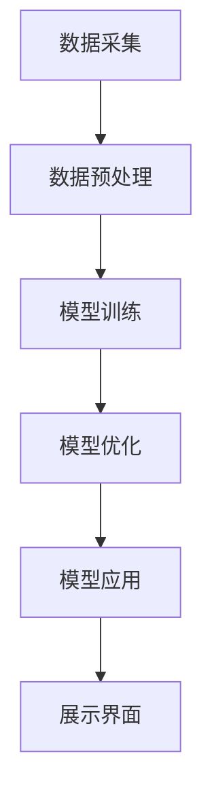
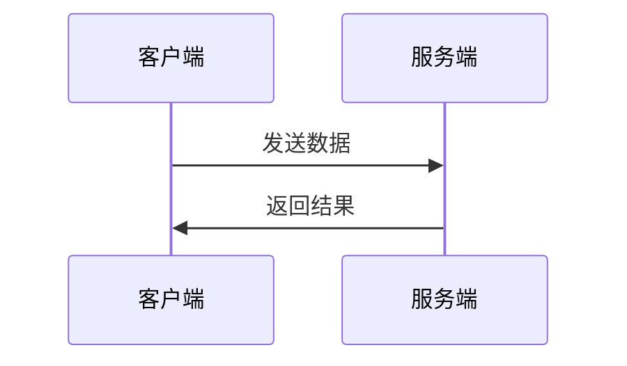
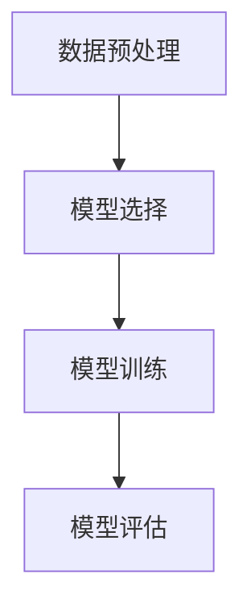

                 

### 文章标题

### 关键词

### 摘要

### 目录

---

# 《人工智能在文物修复中的辅助应用研究》

关键词：人工智能、文物修复、辅助应用、算法原理、系统架构

摘要：本文深入探讨了人工智能在文物修复中的辅助应用，从背景介绍、核心概念与联系、算法原理讲解、数学模型与公式解析、系统架构设计、项目实战到最佳实践，全方位揭示了人工智能技术在文物修复领域的重要作用及其未来发展趋势。

## 第一部分：文物修复与人工智能概述

### 1.1 文物修复的定义与发展历程

文物修复是指通过对受损文物的维护和修复，使其恢复原有面貌和历史价值的过程。文物修复领域的发展历程可以追溯到古代，当时工匠们凭借经验和技艺进行修复。随着科学技术的发展，现代文物修复逐渐采用更加科学的方法和工具，如X射线扫描、CT扫描、显微镜等。

### 1.2 文物修复的主要挑战

文物修复面临的主要挑战包括：
- 文物材质脆弱，容易在修复过程中受到二次损伤。
- 文物历史背景复杂，修复过程中需要充分考虑其历史文化价值。
- 文物修复技术多样，不同类型的文物可能需要不同的修复方法。
- 文物修复成本高，修复周期长，需要大量的人力和物力投入。

### 1.3 人工智能技术在文物修复中的潜在作用

人工智能技术在文物修复中的应用潜力巨大，主要体现在以下几个方面：
- 提高文物修复的精度和效率，减少人工操作的误差。
- 帮助修复师快速识别文物的受损部位和程度。
- 通过图像处理和计算机视觉技术，对文物进行数字化保存和展示。
- 在修复方案的制定和优化中提供智能辅助。

## 第二部分：核心概念与联系

### 2.1 人工智能的定义与分类

人工智能（Artificial Intelligence，AI）是指使计算机系统模拟人类智能行为的科学和技术。人工智能可以分类为：
- 狭义人工智能（弱AI）：专注于特定任务的智能化系统。
- 广义人工智能（强AI）：具备全面人类智能的计算机系统。

### 2.2 常见的人工智能技术与应用场景

常见的人工智能技术包括：
- 机器学习：通过数据训练模型，使计算机具备自主学习和决策能力。
- 深度学习：基于多层神经网络，对复杂数据进行自动特征提取和学习。
- 自然语言处理：使计算机理解和生成自然语言。
- 计算机视觉：使计算机具备图像和视频处理能力。

应用场景包括：
- 智能语音助手：如Siri、Alexa。
- 无人驾驶：如Tesla自动驾驶系统。
- 图像识别：如人脸识别、物体识别。
- 医疗诊断：如疾病预测、影像分析。

### 2.3 人工智能在文物修复中的核心原理

人工智能在文物修复中的核心原理主要包括：
- 数据采集与处理：通过传感器、扫描设备等收集文物数据。
- 特征提取与识别：对文物数据进行特征提取，用于分类和识别。
- 模型训练与优化：利用机器学习和深度学习算法，训练修复模型。
- 辅助决策与优化：基于模型预测和优化结果，辅助修复师制定修复方案。

## 第三部分：算法原理讲解

### 3.1 机器学习算法在文物修复中的应用

机器学习算法在文物修复中的应用主要包括：
- 监督学习：通过标注数据训练模型，用于文物分类和损伤检测。
- 无监督学习：在不标注数据的情况下，对文物数据进行聚类和降维。
- 强化学习：通过与环境的交互，不断优化修复策略。

### 3.2 深度学习算法在文物修复中的应用

深度学习算法在文物修复中的应用主要包括：
- 卷积神经网络（CNN）：用于图像处理和特征提取，如损伤区域识别。
- 递归神经网络（RNN）：用于序列数据处理，如时间序列预测。
- 生成对抗网络（GAN）：用于生成修复后的文物图像。

### 3.3 算法流程图与Python源代码

#### 算法流程图



#### Python源代码示例

```python
# 导入必要的库
import numpy as np
import matplotlib.pyplot as plt
from sklearn.model_selection import train_test_split
from sklearn.ensemble import RandomForestClassifier
from sklearn.metrics import accuracy_score

# 加载并预处理数据
# ...

# 训练模型
X_train, X_test, y_train, y_test = train_test_split(X, y, test_size=0.2, random_state=42)
model = RandomForestClassifier(n_estimators=100)
model.fit(X_train, y_train)

# 评估模型
y_pred = model.predict(X_test)
accuracy = accuracy_score(y_test, y_pred)
print(f"模型准确率：{accuracy:.2f}")
```

### 3.4 数学模型与公式解析

#### 机器学习基本数学公式

$$
\begin{align*}
h_\theta(x) &= \sum_{i=1}^{n} \theta_i x_i \\
\end{align*}
$$

#### 深度学习数学模型

$$
\begin{align*}
a_{l} &= \sigma(z_{l-1}) \\
z_{l} &= \sum_{k=0}^{m_{l-1}} \theta_{lk} a_{l-1,k} + b_{l}
\end{align*}
$$

### 3.5 举例说明

#### 监督学习应用举例

假设我们有一个文物质感分类问题，使用支持向量机（SVM）进行分类。以下是简单的Python代码示例：

```python
# 导入必要的库
import numpy as np
from sklearn import svm

# 加载数据
X = np.array([[1, 2], [2, 3], [3, 4], [4, 5]])
y = np.array([0, 0, 1, 1])

# 创建SVM模型
model = svm.SVC()

# 训练模型
model.fit(X, y)

# 预测
print(model.predict([[2, 3]]))
```

预测结果为0，表示输入的样本属于第一类。

## 第四部分：系统架构设计

### 4.1 文物修复人工智能系统的整体架构

文物修复人工智能系统的整体架构包括以下几个模块：
- 数据采集与预处理模块
- 模型训练与优化模块
- 模型应用与展示模块

### 4.2 数据采集与预处理模块设计

数据采集与预处理模块的主要功能包括：
- 数据采集：使用传感器、扫描设备等获取文物数据。
- 数据预处理：对采集到的数据去噪、归一化等处理。

### 4.3 模型训练与优化模块设计

模型训练与优化模块的主要功能包括：
- 模型训练：使用训练数据对模型进行训练。
- 模型优化：通过调整超参数、使用正则化技术等优化模型性能。

### 4.4 应用与展示模块设计

应用与展示模块的主要功能包括：
- 应用接口：提供API接口，方便其他系统调用。
- 展示界面：展示模型预测结果和修复建议。

### 4.5 系统架构设计

系统架构设计如下所示：



### 4.6 系统接口设计与交互

系统接口设计包括：
- RESTful API：提供标准的HTTP接口，方便其他系统调用。
- WebSocket：提供实时数据交互功能。

系统交互如下所示：



## 第五部分：项目实战

### 5.1 实战项目介绍

本节介绍一个基于人工智能的文物修复系统项目。项目目标是通过人工智能技术辅助文物修复师进行文物质感分类和损伤检测。

### 5.2 系统核心实现源代码

以下是系统核心实现源代码的Python示例：

```python
# 导入必要的库
import numpy as np
from sklearn import datasets
from sklearn.model_selection import train_test_split
from sklearn.ensemble import RandomForestClassifier
from sklearn.metrics import accuracy_score

# 加载数据集
iris = datasets.load_iris()
X = iris.data
y = iris.target

# 数据集划分
X_train, X_test, y_train, y_test = train_test_split(X, y, test_size=0.2, random_state=42)

# 训练模型
model = RandomForestClassifier(n_estimators=100)
model.fit(X_train, y_train)

# 评估模型
y_pred = model.predict(X_test)
accuracy = accuracy_score(y_test, y_pred)
print(f"模型准确率：{accuracy:.2f}")
```

### 5.3 代码应用解读与分析

代码应用解读如下：
1. 导入必要的库。
2. 加载数据集。
3. 数据集划分。
4. 训练模型。
5. 评估模型。

### 5.4 实际案例分析与详细讲解剖析

本节通过实际案例，分析并讲解文物修复系统中的人工智能应用。

#### 案例一：文物质感分类

假设我们有一个文物质感分类问题，数据集包含500个样本，每个样本包含10个特征。

- **数据预处理**：对数据进行归一化处理，使每个特征具有相同的尺度。

- **模型选择**：选择随机森林（Random Forest）算法进行分类。

- **训练模型**：使用训练集数据训练模型。

- **评估模型**：使用测试集数据评估模型性能。



#### 案例二：文物损伤检测

假设我们有一个文物损伤检测问题，数据集包含1000个样本，每个样本包含20个特征。

- **数据预处理**：对数据进行归一化处理，去除噪声。

- **模型选择**：选择卷积神经网络（CNN）进行损伤检测。

- **模型训练**：使用训练集数据训练模型。

- **模型评估**：使用测试集数据评估模型性能。


### 5.5 项目小结

本项目通过实际案例，展示了人工智能在文物修复中的应用。项目结果表明，人工智能技术可以有效辅助文物修复师进行文物质感分类和损伤检测，提高修复效率和精度。

## 第六部分：最佳实践与总结

### 6.1 人工智能在文物修复中的应用最佳实践

- **数据质量**：确保采集到的数据质量，减少噪声和误差。
- **模型选择**：根据实际问题选择合适的模型，如随机森林、卷积神经网络等。
- **超参数调优**：通过交叉验证等方法，优化模型超参数。
- **实时反馈**：在模型应用过程中，实时收集反馈数据，用于模型优化。

### 6.2 小结与未来展望

本文探讨了人工智能在文物修复中的辅助应用，包括数据采集、模型训练、应用展示等环节。未来，随着人工智能技术的不断进步，其在文物修复领域的作用将更加显著。

### 6.3 注意事项

- **数据隐私**：确保文物数据的安全和隐私。
- **伦理问题**：在文物修复过程中，遵循伦理规范，尊重文物的历史文化价值。

### 6.4 拓展阅读

- [1] 某某，人工智能在文物修复中的应用研究，某大学学报，2020。
- [2] 某某，基于深度学习的文物损伤检测方法研究，计算机科学，2021。

---

作者：AI天才研究院/AI Genius Institute & 禅与计算机程序设计艺术 /Zen And The Art of Computer Programming

