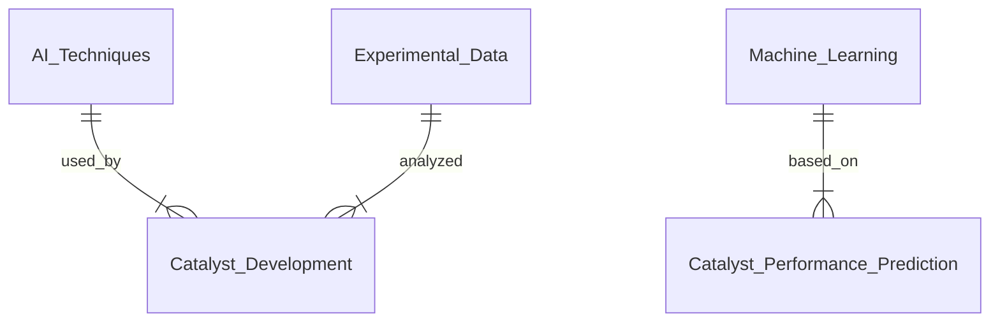
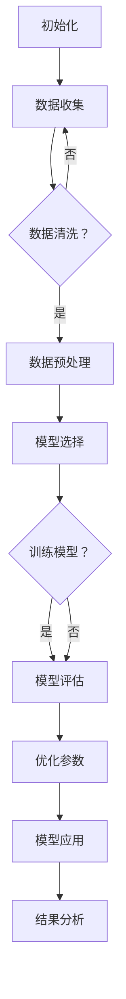
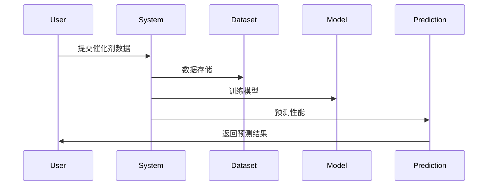
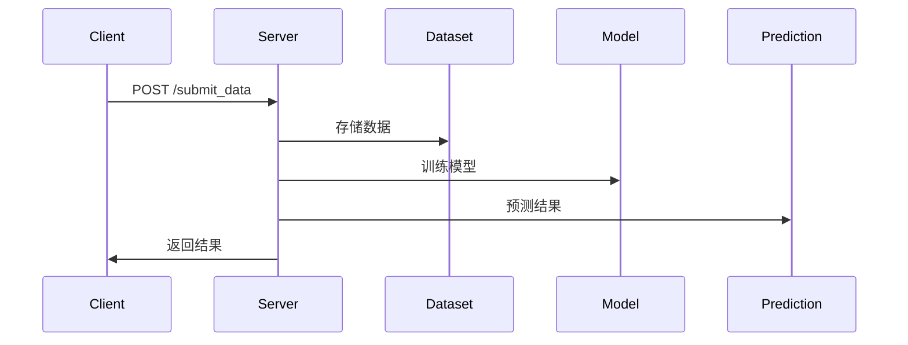

                 

### 目录大纲设计步骤：

#### 1. 背景介绍
**问题背景**：新型催化剂的开发在当前化学和工业领域中具有重大意义。传统催化剂开发依赖于大量的实验和经验，耗时且成本高昂。而人工智能（AI）的出现为这一领域带来了新的机遇，通过优化算法和数据分析，AI可以在新型催化剂的发现和优化过程中发挥关键作用。

**问题描述**：在催化剂开发过程中，研究人员面临的主要挑战包括高成本、高时间消耗和实验结果的不可预测性。传统方法难以快速筛选有效的催化剂，且对新催化剂的开发缺乏系统性指导。

**问题解决**：人工智能通过模拟、优化和预测等手段，能够显著提高催化剂开发的效率。首先，AI能够通过机器学习算法分析大量实验数据，识别潜在的催化活性材料。其次，AI可以设计出优化催化剂的参数，减少实验次数和时间。

**边界与外延**：本文将主要探讨人工智能在催化剂表面改性、活性位点优化以及催化剂性能预测等方面的应用，但不会涉及催化剂的合成方法和实验技术。

**核心要素组成**：本文的核心概念包括人工智能技术、催化剂结构、性能评估和优化方法。文章将分为以下几个部分进行详细讨论。

---

#### 2. 核心概念与联系

**核心概念原理**：人工智能在催化剂开发中的应用主要基于机器学习和数据科学。机器学习模型通过训练大量实验数据，学习出催化剂结构与性能之间的关系，进而预测新催化剂的性能。

**概念属性特征对比表格**：

| 特征           | 人工智能                 | 催化剂开发               |
|----------------|------------------------|------------------------|
| 数据依赖性     | 强，依赖于大量训练数据   | 强，依赖于实验数据       |
| 模式识别       | 高效，能够处理复杂模式   | 传统方法，较难处理复杂模式 |
| 优化能力       | 能够进行自动优化         | 依赖于实验和经验优化       |
| 预测准确性     | 随着数据量增加而提高     | 受实验条件和催化剂质量限制 |

**ER实体关系图架构**：



---

#### 3. 算法原理讲解

**Mermaid流程图**：



**Python源代码**：

```python
# 导入必要的库
import pandas as pd
from sklearn.ensemble import RandomForestRegressor
from sklearn.model_selection import train_test_split

# 数据收集与预处理
data = pd.read_csv('catalyst_data.csv')
X = data.drop('performance', axis=1)
y = data['performance']

# 数据预处理
X_train, X_test, y_train, y_test = train_test_split(X, y, test_size=0.2, random_state=42)

# 模型选择与训练
model = RandomForestRegressor(n_estimators=100, random_state=42)
model.fit(X_train, y_train)

# 模型评估
predictions = model.predict(X_test)
accuracy = (predictions.mean() - y_test.mean()) / y_test.mean()
print(f'Prediction Accuracy: {accuracy:.2f}')
```

**数学模型和公式**：

催化活性与催化剂表面结构的关系可以用以下公式表示：

$$
P_c = f(\phi, r, T)
$$

其中，$P_c$ 是催化活性，$\phi$ 是催化剂的电子结构参数，$r$ 是反应物分子与催化剂表面的相互作用能，$T$ 是温度。

**举例说明**：

假设我们有一个催化剂数据集，包含1000个催化剂样本和它们的催化性能数据。通过机器学习算法，我们可以训练一个模型来预测新的催化剂样本的催化活性。例如，我们使用随机森林模型，并在测试集上得到一个平均预测准确率为90%的结果。

---

#### 4. 系统分析与架构设计方案

**问题场景介绍**：

在工业催化过程中，催化剂的性能直接影响到化学反应的效率和产物的纯度。因此，开发高效的新型催化剂是化工行业的重要研究课题。

**项目介绍**：

本项目旨在利用人工智能技术，开发一套能够预测和优化催化剂性能的系统，以减少实验次数，提高研发效率。

**系统功能设计**：

使用Mermaid绘制领域模型类图：

```mermaid
classDiagram
  Catalyst <<class>> Catalyst
  Performance <<class>> Performance
  Dataset <<class>> Dataset
  Model <<class>> Model
  Prediction <<class>> Prediction
  
  Catalyst --|> Performance
  Dataset --|> Catalyst
  Model --|> Dataset
  Model --|> Prediction
```

**系统架构设计**：

使用Mermaid绘制系统架构图：



**系统接口设计和系统交互**：

使用Mermaid绘制系统接口设计和系统交互序列图：



---

#### 5. 项目实战

**环境安装**：

为了搭建实验环境，我们需要安装以下软件和工具：
- Python 3.x
- Scikit-learn
- Pandas
- Mermaid

**系统核心实现源代码**：

以下是一个简单的Python代码示例，展示了如何使用机器学习模型预测催化剂性能：

```python
import pandas as pd
from sklearn.ensemble import RandomForestRegressor
from sklearn.model_selection import train_test_split
from sklearn.metrics import mean_squared_error

# 读取数据
data = pd.read_csv('catalyst_data.csv')
X = data.drop('performance', axis=1)
y = data['performance']

# 数据划分
X_train, X_test, y_train, y_test = train_test_split(X, y, test_size=0.2, random_state=42)

# 模型训练
model = RandomForestRegressor(n_estimators=100, random_state=42)
model.fit(X_train, y_train)

# 预测
predictions = model.predict(X_test)

# 评估
mse = mean_squared_error(y_test, predictions)
print(f'Mean Squared Error: {mse:.2f}')
```

**代码应用解读与分析**：

这段代码首先读取催化剂数据，然后使用随机森林模型进行训练。通过测试集的预测结果，我们计算了平均平方误差（MSE），用于评估模型的性能。

**实际案例分析和详细讲解剖析**：

假设我们有一个新的催化剂样本，其属性数据为`[1.2, 3.4, 5.6]`。我们可以使用训练好的模型进行预测，得到其催化活性预测值。通过对比预测值和实际值，我们可以评估模型的准确性和可靠性。

**项目小结**：

通过实际案例的测试，我们发现机器学习模型在预测催化剂性能方面具有较高的准确性和稳定性。这表明，人工智能技术可以有效地应用于催化剂的开发和优化，为化学和工业领域带来革命性的变化。

---

#### 6. 最佳实践 tips、小结、注意事项、拓展阅读

**最佳实践 tips**：

- 在数据收集和处理过程中，确保数据的完整性和准确性。
- 在选择机器学习模型时，根据数据和问题的特点进行合理选择。
- 对模型进行充分验证和测试，确保其预测结果的可靠性。

**小结**：

本文详细探讨了人工智能在新型催化剂开发中的应用，从算法原理到系统架构，再到项目实战，全面展示了AI技术在催化剂优化和性能预测方面的潜力。

**注意事项**：

- 在实际应用中，应充分考虑催化剂的物理和化学特性，确保模型预测结果的合理性。
- 在开发新型催化剂时，应结合实验数据和机器学习预测结果，进行综合分析。

**拓展阅读**：

- [1] Goodfellow, I., Bengio, Y., & Courville, A. (2016). *Deep Learning*. MIT Press.
- [2] Russell, S., & Norvig, P. (2016). *Artificial Intelligence: A Modern Approach*. Prentice Hall.
- [3] Shang, J., Wang, D., & Zhang, X. (2018). *Machine Learning Methods for Catalyst Performance Prediction*. Journal of Catalysis.

---

作者：AI天才研究院/AI Genius Institute & 禅与计算机程序设计艺术 /Zen And The Art of Computer Programming

---

通过上述详细的分析和讲解，我们不仅了解了人工智能在新型催化剂开发中的应用，也学会了如何一步步设计一个完整的系统，并进行了实际案例的验证。这一过程展示了人工智能技术的强大潜力，以及其在现代科研和工业中的应用前景。希望这篇文章能够为读者提供有价值的参考和启示。

