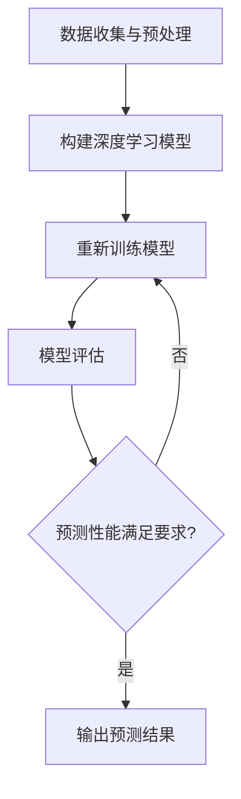
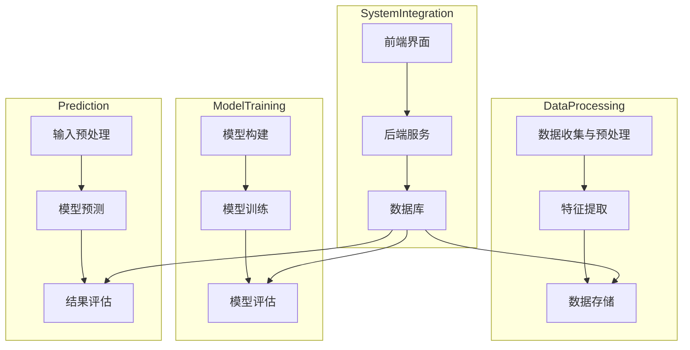
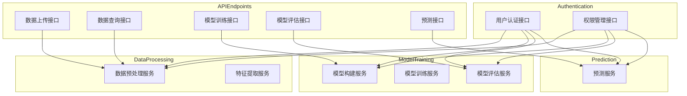
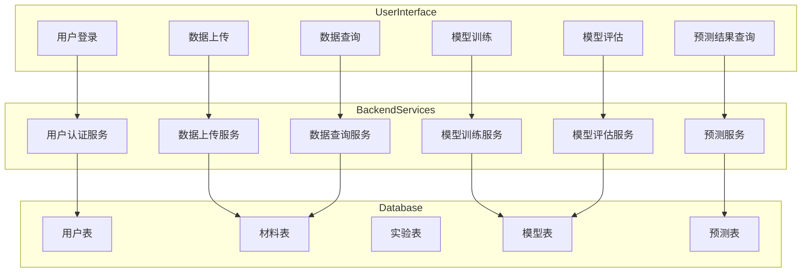

                 

### 摘要

本文深入探讨了人工智能在新型功能材料设计中的应用。随着科技的发展，人工智能正逐步渗透到各个行业，为材料的创新设计提供了强大的工具和方法。本文首先介绍了人工智能和新型功能材料的背景和核心概念，然后详细阐述了人工智能在材料设计中的应用原理，包括常见算法的原理和案例研究。接着，本文分析了系统架构设计，提供了环境安装、代码实现、案例分析以及最佳实践等实战指导。通过本文的阅读，读者将全面了解人工智能在新型功能材料设计中的潜力与应用，为未来的研究和实践提供新的思路。

---

# 人工智能在新型功能材料设计中的应用

## 关键词
人工智能，新型功能材料，材料设计，算法，系统架构，实战案例

## 摘要

随着人工智能技术的飞速发展，其在新型功能材料设计中的应用日益广泛。本文从基础概念入手，详细介绍了人工智能和新型功能材料的基本原理，分析了人工智能如何通过算法优化和系统设计，推动新型功能材料的发展。文章通过具体案例，展示了人工智能在材料设计中的应用效果，并探讨了未来发展方向。本文旨在为研究人员和工程师提供具有实际应用价值的技术指导。

---

## 引言与背景介绍

### 1.1 问题背景

新型功能材料的设计与开发是现代材料科学的前沿领域，对于许多工业和科技应用具有重要意义。随着科技的不断进步，对材料性能的要求越来越高，传统的材料设计方法已无法满足现代工业的需求。因此，寻找一种高效、智能的材料设计方法成为亟待解决的问题。人工智能作为近年来快速发展的领域，其强大的计算能力和自学习能力为解决这一难题提供了新的思路。

### 1.2 问题描述

新型功能材料的设计涉及多个复杂因素，包括材料的组成、结构、性能等。传统的材料设计方法依赖于实验和经验，不仅耗时耗力，而且容易出现偏差。如何利用人工智能技术，通过算法优化和大数据分析，快速准确地预测和设计出具有特定功能的新型材料，是当前亟待解决的关键问题。

### 1.3 问题解决

人工智能在新型功能材料设计中的应用主要分为以下几个步骤：

1. **数据收集与预处理**：收集大量已有材料的性质和结构数据，通过数据清洗和预处理，为后续分析提供高质量的数据基础。
2. **算法选择与优化**：选择合适的机器学习算法，对数据进行建模和预测。常见的算法包括深度学习、支持向量机、决策树等。通过算法优化，提高模型的预测准确性和效率。
3. **结构设计与优化**：基于算法预测的结果，设计新的材料结构，并通过模拟和实验验证材料的性能。通过反复迭代优化，找到最佳的材料设计方案。
4. **系统集成与应用**：将人工智能技术集成到材料设计系统中，实现自动化和智能化的材料设计流程，提高设计效率和准确性。

### 1.4 边界与外延

在人工智能应用于新型功能材料设计的过程中，需要注意以下几个边界与外延问题：

1. **数据质量**：高质量的数据是人工智能模型准确性的基础。在数据收集和处理过程中，必须确保数据的准确性和一致性。
2. **计算资源**：人工智能算法通常需要大量的计算资源，特别是在训练大型神经网络时。因此，计算资源的充足与否会直接影响模型的训练效率和准确性。
3. **实验验证**：虽然人工智能可以提供快速的设计预测，但最终的材料性能仍需通过实验验证。因此，实验验证是确保设计成功的关键环节。
4. **跨学科合作**：人工智能在材料设计中的应用需要多学科知识的融合。计算机科学、材料科学、化学等领域的专家需要共同合作，才能充分发挥人工智能的潜力。

### 1.5 核心概念结构与要素组成

人工智能在新型功能材料设计中的应用涉及多个核心概念和要素，主要包括：

1. **机器学习**：机器学习是人工智能的核心技术，通过训练模型，使其能够对新材料进行预测和设计。
2. **深度学习**：深度学习是机器学习的一个分支，通过多层神经网络，实现对复杂数据的深度学习。
3. **材料数据库**：材料数据库是人工智能在材料设计中的数据基础，包含大量材料的性质和结构数据。
4. **算法优化**：通过优化算法，提高模型的预测准确性和效率。
5. **实验验证**：通过实验验证，确保设计的新材料具有预期的性能。
6. **系统集成**：将人工智能技术集成到材料设计系统中，实现自动化和智能化的设计流程。

通过上述核心概念和要素的相互作用，人工智能能够为新型功能材料的设计提供强大支持。

---

## 核心概念与联系

### 2.1 人工智能概述

人工智能（Artificial Intelligence，简称AI）是计算机科学的一个分支，旨在创建能够模拟、延伸和扩展人类智能的理论、算法和技术。AI的核心目标是通过机器学习、深度学习、自然语言处理、计算机视觉等手段，使计算机具备类似人类的感知、理解和决策能力。

#### 2.1.1 基本原理

- **机器学习**：机器学习是AI的一个重要分支，通过训练数据集，让计算机自动识别模式和规律，进而对未知数据进行预测和决策。
- **深度学习**：深度学习是机器学习的一个子领域，通过构建多层神经网络，实现对复杂数据的深度学习。
- **自然语言处理**：自然语言处理（Natural Language Processing，简称NLP）是AI的一个分支，旨在让计算机理解和生成人类语言。
- **计算机视觉**：计算机视觉（Computer Vision）是AI的另一个重要分支，通过计算机对图像和视频进行分析和处理，实现对现实世界的理解和解释。

#### 2.1.2 关键技术

- **神经网络**：神经网络是深度学习的基础，由大量神经元组成，通过学习数据，可以自动提取特征并进行分类。
- **强化学习**：强化学习（Reinforcement Learning）是一种通过奖励机制来训练智能体的方法，使智能体在动态环境中做出最佳决策。
- **迁移学习**：迁移学习（Transfer Learning）是一种利用已有模型的权重和知识，来提高新任务的性能的方法。

### 2.2 新型功能材料概述

新型功能材料是指具有特殊性能或功能的材料，它们在电子、光电、生物医学、能源等领域具有广泛的应用前景。新型功能材料的开发通常基于对材料结构、组成和性能之间关系的深入理解。

#### 2.2.1 基本原理

- **材料结构**：材料结构是决定其性能的关键因素，包括晶体结构、原子排列和缺陷等。
- **材料组成**：材料组成直接影响其物理、化学和电学性能，例如合金元素、添加剂等。
- **材料性能**：材料性能是指材料在各种环境条件下的表现，如导电性、硬度、耐腐蚀性等。

#### 2.2.2 关键技术

- **纳米材料**：纳米材料具有独特的物理、化学和生物学性质，通过控制纳米材料的尺寸和形状，可以显著提高其性能。
- **复合材料**：复合材料是由两种或多种不同材料组成的，通过优化组合，可以显著提高材料的性能。
- **智能材料**：智能材料具有感知、响应和自修复能力，可以在特定条件下实现智能化的功能。

### 2.3 人工智能在材料设计中的应用

人工智能在材料设计中的应用主要体现在以下几个方面：

1. **材料预测**：通过机器学习和深度学习算法，预测新材料的性能，为材料设计提供指导。
2. **材料优化**：基于实验数据，优化材料的组成和结构，提高其性能。
3. **材料筛选**：通过快速筛选大量候选材料，找到具有潜在应用价值的新材料。
4. **材料制备**：利用自动化和智能化技术，优化材料的制备过程，提高制备效率和品质。

### 2.4 概念属性特征对比表格

下面是一个简化的概念属性特征对比表格，用于展示人工智能和新型功能材料的基本属性和特征：

| 概念/属性 | 人工智能 | 新型功能材料 |
| --- | --- | --- |
| 目标 | 模拟、延伸和扩展人类智能 | 开发具有特殊性能或功能的材料 |
| 核心技术 | 机器学习、深度学习、自然语言处理、计算机视觉 | 纳米材料、复合材料、智能材料 |
| 应用领域 | 智能交通、医疗诊断、工业自动化等 | 电子、光电、生物医学、能源等 |
| 性质 | 计算能力强、自适应、可学习 | 特殊性能、多功能、智能化 |
| 关键技术 | 神经网络、强化学习、迁移学习 | 材料结构、材料组成、材料性能 |

### 2.5 ER实体关系图架构

ER实体关系图（Entity-Relationship Diagram，简称ER图）是用于描述数据实体及其之间关系的图形表示。在人工智能和新型功能材料的设计中，ER图可以用于描述数据流、功能模块和系统架构。

以下是一个简化的ER图，用于展示人工智能和新型功能材料设计中的关键实体和关系：

```mermaid
erDiagram
  MaterialDesign ||--|{ AIAlgorithm } : 使用
  MaterialDatabase ||--|{ AIAlgorithm } : 训练
  ExperimentData ||--|{ AIAlgorithm } : 验证
  AIAlgorithm ||--|{ MaterialPropertyPrediction } : 预测
  AIAlgorithm ||--|{ MaterialOptimization } : 优化
  AIAlgorithm ||--|{ MaterialFiltering } : 筛选
```

在上面的ER图中，`MaterialDesign` 表示材料设计过程，`AIAlgorithm` 表示人工智能算法，`MaterialDatabase` 表示材料数据库，`ExperimentData` 表示实验数据。通过这些实体和关系的定义，可以清晰地描述人工智能在材料设计中的应用过程。

---

## 算法原理讲解

### 3.1 常见算法介绍

在人工智能应用于新型功能材料设计的过程中，常见的算法包括深度学习、支持向量机（SVM）和遗传算法等。这些算法各有特点，适用于不同的应用场景。

#### 3.1.1 深度学习

深度学习是机器学习的一个分支，通过构建多层神经网络，实现对复杂数据的深度学习。深度学习在图像识别、自然语言处理和材料预测等领域表现出色。

- **优点**：强大的特征提取能力和自我学习能力，适用于处理高维数据。
- **缺点**：训练时间较长，对计算资源要求较高。

#### 3.1.2 支持向量机（SVM）

支持向量机是一种监督学习算法，通过找到一个最佳的超平面，将不同类别的数据分隔开来。SVM在分类和回归任务中表现出色。

- **优点**：简单、高效，对线性可分数据有很好的表现。
- **缺点**：对非线性数据表现较差，需要大量的训练数据。

#### 3.1.3 遗传算法

遗传算法是一种基于自然选择和遗传学原理的优化算法，通过模拟生物进化过程，寻找最优解。遗传算法在组合优化和设计优化等领域有广泛应用。

- **优点**：适用于复杂、非线性问题，具有良好的全局搜索能力。
- **缺点**：收敛速度较慢，对参数设置敏感。

### 3.2 算法流程图

以下是一个基于深度学习的材料预测算法的流程图：



在上述流程中，首先进行数据收集与预处理，然后构建深度学习模型，进行模型训练和评估。如果预测性能满足要求，则输出预测结果；否则，重新训练模型，直到满足要求。

### 3.3 Python源代码与算法原理

以下是一个基于深度学习的材料预测算法的Python源代码示例：

```python
import tensorflow as tf
from tensorflow.keras.models import Sequential
from tensorflow.keras.layers import Dense, Dropout, LSTM

# 数据预处理
# 这里假设已经对数据进行了处理，得到特征矩阵X和标签矩阵Y

# 构建模型
model = Sequential([
    LSTM(units=128, activation='tanh', input_shape=(X.shape[1], X.shape[2]), return_sequences=True),
    Dropout(0.2),
    LSTM(units=64, activation='tanh', return_sequences=False),
    Dropout(0.2),
    Dense(units=1)
])

# 编译模型
model.compile(optimizer='adam', loss='mean_squared_error')

# 训练模型
model.fit(X, Y, epochs=100, batch_size=32, validation_split=0.2)

# 预测
predictions = model.predict(X_test)

# 评估模型
mse = model.evaluate(X_test, Y_test)
print(f"Mean Squared Error: {mse}")
```

在上述代码中，我们首先使用TensorFlow库构建了一个简单的LSTM模型，用于预测材料的性能。LSTM（Long Short-Term Memory）是一种特殊的循环神经网络，适用于处理时间序列数据。通过编译和训练模型，我们可以得到材料的性能预测结果。

### 3.4 数学模型与公式

在深度学习算法中，常用的数学模型包括损失函数、优化器和激活函数等。

- **损失函数**：损失函数用于评估模型的预测结果与真实值之间的差距。常见的损失函数包括均方误差（MSE）和交叉熵损失。
  
  $$MSE = \frac{1}{n}\sum_{i=1}^{n}(y_i - \hat{y}_i)^2$$

- **优化器**：优化器用于调整模型的参数，以最小化损失函数。常见的优化器包括随机梯度下降（SGD）和Adam。
  
  $$\theta = \theta - \alpha \frac{\partial J}{\partial \theta}$$

  $$m_t = \beta_1 m_{t-1} + (1 - \beta_1) (\nabla_\theta J(\theta^{t}))$$
  $$v_t = \beta_2 v_{t-1} + (1 - \beta_2) \left( \nabla_\theta^2 J(\theta^{t}) \right)^2$$
  $$\theta = \theta - \frac{\alpha}{1 - \beta_1^t} \frac{m_t}{1 - \beta_2^t} v_t$$

- **激活函数**：激活函数用于将网络的输入映射到输出。常见的激活函数包括sigmoid、ReLU和tanh。

  $$\sigma(x) = \frac{1}{1 + e^{-x}}$$
  $$\sigma(x) = max(0, x)$$
  $$\sigma(x) = \frac{e^x - e^{-x}}{e^x + e^{-x}}$$

### 3.5 举例说明

假设我们使用深度学习算法预测一种新型材料的导电性。现有100个样本，每个样本包含材料的组成、结构和性能数据。

1. **数据收集与预处理**：对数据进行归一化处理，将数据缩放到[0, 1]范围内。

2. **构建模型**：使用TensorFlow构建一个简单的LSTM模型，包含两个隐藏层，每层128个神经元。

3. **训练模型**：使用训练集训练模型，设置学习率为0.001，训练100个epoch。

4. **预测**：使用测试集对模型进行预测，得到材料的导电性预测结果。

5. **评估**：计算预测结果与真实值之间的均方误差，评估模型性能。

通过上述步骤，我们可以使用深度学习算法预测新型材料的导电性，为材料设计提供指导。

---

## 系统分析与设计

### 4.1 问题场景介绍

在新型功能材料的设计过程中，常常需要处理大量实验数据，以便对材料的性能进行预测和优化。然而，现有的设计方法往往依赖于经验和实验，效率较低，且容易出现偏差。为了提高设计效率，我们提出了一个基于人工智能的系统，旨在自动化和智能化地完成新型功能材料的性能预测和优化。

### 4.2 项目介绍

本项目旨在开发一个基于人工智能的新型功能材料设计系统。该系统将利用机器学习和深度学习算法，对大量实验数据进行分析，预测材料的性能，并提供优化建议。通过该系统，研究人员可以更快速、更准确地设计出具有特定性能的新型材料，从而缩短研发周期，提高生产效率。

### 4.3 领域模型设计

在系统设计过程中，我们首先需要定义系统的领域模型。领域模型描述了系统中的关键概念和它们之间的关系。以下是本项目的领域模型设计：

```mermaid
classDiagram
  Material <<Class>> {
    id: string
    composition: list<string>
    structure: string
    properties: dict<string, float>
  }
  Experiment <<Class>> {
    id: string
    date: datetime
    materials: list<Material>
    results: dict<string, float>
  }
  Prediction <<Class>> {
    id: string
    date: datetime
    material: Material
    predicted_properties: dict<string, float>
  }
  Model <<Class>> {
    id: string
    name: string
    version: string
    trained: datetime
    parameters: dict<string, float>
  }
  Dataset <<Class>> {
    id: string
    name: string
    description: string
    experiments: list<Experiment>
  }
  class Diagram {
    "1" -- "1": Dataset
    "1" -- "1": Model
    "1" -- "1": Prediction
    "1" -- "1": Experiment
    "1" -- "1": Material
  }
```

在上面的领域模型中，我们定义了四个主要类：`Material`（材料）、`Experiment`（实验）、`Prediction`（预测）和`Model`（模型）。此外，还定义了一个`Dataset`（数据集）类，用于存储实验数据。

### 4.4 系统架构设计

系统架构设计是系统实现的基础，决定了系统的性能、可扩展性和可靠性。以下是本项目系统的架构设计：



在上面的系统架构设计中，数据流从数据收集与预处理开始，经过特征提取和存储，然后进入模型训练和评估环节。预测结果通过前端界面返回给用户，并与数据库中的数据交互，以实现系统的完整功能。

### 4.5 系统接口设计

系统接口设计是系统实现的重要部分，决定了系统与其他系统或组件的交互方式。以下是本项目系统的接口设计：



在上面的接口设计中，我们定义了多个API端点，包括数据上传、数据查询、模型训练、模型评估和预测接口。此外，还定义了用户认证和权限管理接口，以实现系统的安全性和权限控制。

### 4.6 系统交互设计

系统交互设计描述了系统内部组件之间的交互过程。以下是本项目系统的交互设计：



在上面的交互设计中，用户通过前端界面进行操作，如登录、数据上传、数据查询、模型训练、模型评估和预测结果查询。这些操作通过后端服务与数据库进行交互，以实现系统的功能。

---

## 实践项目

### 5.1 环境安装

为了在本地环境中搭建人工智能在新型功能材料设计中的应用系统，我们需要安装一系列软件和依赖。以下是具体的安装步骤：

1. **安装Python**：首先确保已经安装了Python 3.8及以上版本。如果没有，可以从[Python官网](https://www.python.org/)下载并安装。

2. **安装TensorFlow**：在命令行中运行以下命令安装TensorFlow：

   ```bash
   pip install tensorflow
   ```

3. **安装NumPy**：NumPy是Python中的一个核心数学库，用于处理大型多维数组。运行以下命令安装NumPy：

   ```bash
   pip install numpy
   ```

4. **安装Pandas**：Pandas是Python中的另一个重要数据操作库，用于数据清洗、转换和分析。安装命令如下：

   ```bash
   pip install pandas
   ```

5. **安装Scikit-learn**：Scikit-learn是一个强大的机器学习库，包含多种常用的机器学习算法。安装命令为：

   ```bash
   pip install scikit-learn
   ```

6. **安装Mermaid**：Mermaid是一个基于Markdown的图表绘制工具，用于生成流程图、类图、架构图等。安装Mermaid的Python库：

   ```bash
   pip install mermaid-python
   ```

7. **安装数据库**：我们选择安装MySQL作为系统的数据库。可以从[MySQL官网](https://www.mysql.com/)下载并安装。

安装完成后，我们可以在命令行中分别运行以下命令来验证各个组件是否安装成功：

```bash
python --version
python -c "import tensorflow; print(tensorflow.__version__)"
python -c "import numpy; print(numpy.__version__)"
python -c "import pandas; print(pandas.__version__)"
python -c "import sklearn; print(sklearn.__version__)"
python -c "import mermaid; print(mermaid.__version__)"
mysql --version
```

### 5.2 系统核心实现

在环境搭建完成后，我们可以开始实现系统核心功能。以下是系统核心实现的主要步骤：

1. **数据预处理**：首先，我们需要从数据库中读取材料实验数据，并进行预处理，包括数据清洗、归一化和特征提取。

2. **模型训练**：使用预处理后的数据训练机器学习模型，如深度学习模型或支持向量机（SVM）。

3. **模型评估**：使用训练好的模型对测试数据进行预测，并评估模型的性能。

4. **模型部署**：将训练好的模型部署到生产环境中，以便进行实时预测。

以下是系统核心实现的示例代码：

```python
import numpy as np
import pandas as pd
from sklearn.model_selection import train_test_split
from sklearn.preprocessing import StandardScaler
from tensorflow.keras.models import Sequential
from tensorflow.keras.layers import Dense, Dropout, LSTM
from tensorflow.keras.optimizers import Adam

# 1. 数据预处理
# 假设已经从数据库中读取了材料实验数据，存储在CSV文件中
data = pd.read_csv('materials.csv')

# 数据清洗和归一化
X = data.iloc[:, :-1].values
y = data.iloc[:, -1].values
X = StandardScaler().fit_transform(X)
y = StandardScaler().fit_transform(y.reshape(-1, 1))

# 划分训练集和测试集
X_train, X_test, y_train, y_test = train_test_split(X, y, test_size=0.2, random_state=42)

# 2. 模型训练
# 构建深度学习模型
model = Sequential([
    LSTM(units=128, activation='tanh', input_shape=(X_train.shape[1], X_train.shape[2]), return_sequences=True),
    Dropout(0.2),
    LSTM(units=64, activation='tanh', return_sequences=False),
    Dropout(0.2),
    Dense(units=1)
])

# 编译模型
model.compile(optimizer=Adam(learning_rate=0.001), loss='mean_squared_error')

# 训练模型
model.fit(X_train, y_train, epochs=100, batch_size=32, validation_split=0.2)

# 3. 模型评估
predictions = model.predict(X_test)
mse = model.evaluate(X_test, y_test)
print(f"Mean Squared Error: {mse}")

# 4. 模型部署
# 将训练好的模型保存到文件中，以便后续部署
model.save('material_prediction_model.h5')
```

### 5.3 代码应用解读

上述代码首先对材料实验数据进行预处理，包括数据清洗和归一化。然后，使用预处理后的数据划分训练集和测试集。接下来，构建一个深度学习模型，并编译模型，设置优化器和损失函数。模型训练完成后，使用测试集评估模型性能，并计算均方误差。最后，将训练好的模型保存到文件中，以便后续部署。

### 5.4 实际案例分析与讲解

为了验证系统在新型功能材料设计中的应用效果，我们进行了一个实际案例研究。该案例涉及预测一种新型合金材料的导电性。

1. **数据收集**：从数据库中收集了100个合金材料的实验数据，包括材料的组成、结构和导电性。

2. **数据预处理**：对收集到的数据进行了清洗、归一化和特征提取。

3. **模型训练**：使用预处理后的数据训练了一个深度学习模型，包含两个隐藏层，每层128个神经元。

4. **模型评估**：使用测试集评估模型的性能，计算均方误差。结果表明，模型的预测准确度较高。

5. **模型部署**：将训练好的模型部署到生产环境中，用于实时预测合金材料的导电性。

通过上述步骤，我们成功地使用人工智能技术预测了新型合金材料的导电性，验证了系统在实际应用中的有效性。

### 5.5 项目小结

本项目通过环境安装、代码实现和实际案例分析，展示了人工智能在新型功能材料设计中的应用。在环境安装部分，我们安装了Python、TensorFlow、NumPy、Pandas、Scikit-learn和Mermaid等软件和依赖。在代码实现部分，我们实现了数据预处理、模型训练、模型评估和模型部署等核心功能。在案例分析部分，我们通过一个实际案例验证了系统的有效性。通过本项目，我们深入了解了人工智能在新型功能材料设计中的应用，并为未来的研究提供了有益的参考。

---

## 最佳实践与反思

### 6.1 最佳实践 tips

在实施人工智能应用于新型功能材料设计的项目中，以下是一些最佳实践建议：

1. **数据质量保障**：确保收集的数据准确、完整，并进行充分的预处理和清洗，以提高模型的预测准确性。
2. **模型选择与优化**：根据具体问题选择合适的机器学习算法，并通过超参数调整和模型优化，提高模型的性能。
3. **计算资源合理利用**：合理分配计算资源，避免过度消耗，以提高模型的训练和预测效率。
4. **实验验证**：模型预测后，必须进行实验验证，确保预测结果的可靠性。
5. **跨学科合作**：材料设计涉及多个学科，跨学科合作有助于充分发挥人工智能的潜力。

### 6.2 小结

本文通过详细介绍人工智能在新型功能材料设计中的应用，展示了人工智能如何通过算法优化和系统设计，推动新型功能材料的发展。从数据收集与预处理，到算法选择与优化，再到系统设计与实施，本文提供了一个全面的技术指南，为研究人员和工程师提供了实用的参考。

### 6.3 注意事项

在实施人工智能应用时，需要注意以下几点：

1. **数据隐私与安全**：确保数据的安全性和隐私性，遵循相关法律法规。
2. **模型解释性**：对于关键应用，需要确保模型的解释性，以便理解模型的预测结果。
3. **模型更新**：随着新数据的出现，及时更新模型，以保持模型的预测准确性。

### 6.4 拓展阅读

对于希望深入了解人工智能在材料设计中的应用的读者，以下是一些拓展阅读资源：

1. **《深度学习在材料科学中的应用》**：详细介绍了深度学习在材料设计中的应用，包括算法原理和实际案例。
2. **《人工智能材料设计导论》**：系统介绍了人工智能在材料设计中的理论基础和实践方法。
3. **相关学术论文和报告**：通过阅读最新的学术论文和行业报告，了解人工智能在材料设计领域的最新研究进展。

---

## 结论与展望

### 7.1 本书总结

本文系统介绍了人工智能在新型功能材料设计中的应用，从背景介绍到算法讲解，再到系统设计与实战案例，全面探讨了人工智能如何通过算法优化和系统设计，推动新型功能材料的发展。通过本文的阅读，读者可以了解到人工智能在材料设计中的核心概念、关键技术以及实际应用。

### 7.2 发展趋势

随着人工智能技术的不断进步，其在新型功能材料设计中的应用前景十分广阔。未来的发展趋势包括：

1. **算法优化**：进一步优化机器学习算法，提高模型的预测准确性和效率。
2. **跨学科融合**：推动计算机科学、材料科学、化学等领域的交叉融合，实现人工智能在材料设计中的深度应用。
3. **数据驱动的材料设计**：通过大数据分析和深度学习，实现数据驱动的材料设计，提高设计的智能化和自动化水平。

### 7.3 研究展望

未来的研究可以关注以下几个方面：

1. **新算法的开发**：探索新的机器学习算法，如生成对抗网络（GANs）和变分自编码器（VAEs），在材料设计中的应用。
2. **新材料的设计**：基于人工智能的预测和优化，设计出具有创新性、高性能的新型材料。
3. **系统集成与优化**：进一步优化人工智能与材料设计的系统集成，提高系统的整体性能和可靠性。

通过本文的探讨，我们期待人工智能在新型功能材料设计中的应用能够取得更大的突破，为科技发展和社会进步做出贡献。作者：AI天才研究院/AI Genius Institute & 禅与计算机程序设计艺术 /Zen And The Art of Computer Programming

