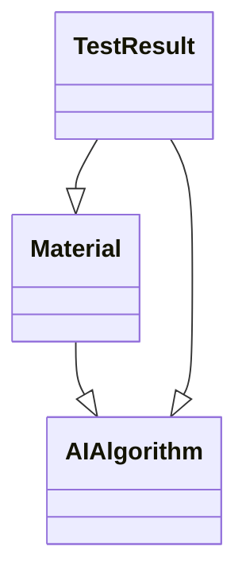
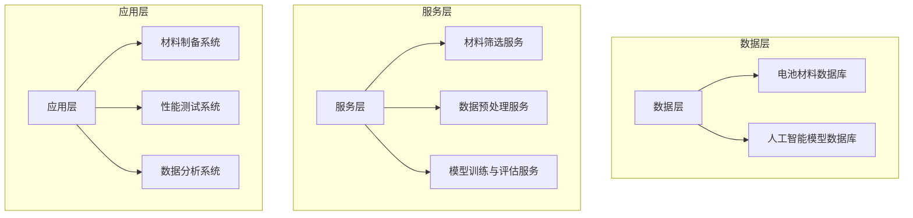

                 

# 人工智能在新型电池材料开发中的应用

> 关键词：人工智能、电池材料、新型电池、材料优化、算法原理、系统架构

> 摘要：随着能源需求的不断增加和环境保护意识的提升，新型电池材料的研究成为了热门领域。人工智能技术的迅速发展，为新型电池材料的开发提供了强大的技术支持。本文将探讨人工智能在新型电池材料开发中的应用，包括核心概念、算法原理、系统架构等方面，旨在为相关领域的研究者和从业者提供有价值的参考。

## 第一部分：背景与概念

### 第1章 问题背景与概述

#### 1.1 问题背景

全球能源需求的不断增加和化石能源的日益枯竭，使得能源危机成为了人类面临的重要问题。与此同时，随着环保意识的提高，减少温室气体排放、降低环境污染成为了全球共识。电池技术作为清洁能源的重要组成部分，其发展显得尤为重要。

电池技术的发展主要集中在提高能量密度、延长使用寿命、降低成本和改善安全性等方面。然而，传统的电池材料在性能上存在一定的局限性，难以满足日益增长的需求。新型电池材料的研究成为了突破传统技术瓶颈的关键。

#### 1.2 电池技术的发展与需求

电池技术的研究主要涉及锂离子电池、钠离子电池、锌空气电池、固态电池等多种类型。锂离子电池由于其高能量密度、长循环寿命和较低的自放电率，成为了当前最主流的电池类型。然而，锂资源的稀缺性、成本和环境影响等问题，使得研究人员开始探索其他类型的电池材料。

钠离子电池具有丰富的资源、较低的成本和环境友好等优点，被认为是一种潜在的替代锂离子电池的材料。锌空气电池、固态电池等其他类型的电池材料也在不断研究和发展中。这些新型电池材料的研究，旨在提高电池的性能和降低生产成本，以适应未来能源需求。

#### 1.3 人工智能技术的崛起

随着计算机技术和大数据的快速发展，人工智能技术逐渐崛起。人工智能通过模拟人脑的神经网络结构和工作机制，实现了对数据的自动学习和处理能力。机器学习、深度学习、强化学习等人工智能技术，为电池材料的研究提供了新的思路和方法。

人工智能在电池材料开发中的应用，主要体现在材料筛选、结构设计、性能预测等方面。通过人工智能技术，研究人员可以快速筛选出具有优良性能的电池材料，提高研发效率，降低研发成本。同时，人工智能技术还可以对电池材料的性能进行预测和优化，为新型电池的开发提供理论支持。

### 第2章 核心概念与原理

#### 2.1 人工智能概述

人工智能（Artificial Intelligence，简称AI）是指通过计算机程序模拟、延伸、扩展人的智能的理论、方法、技术及应用。人工智能技术主要包括机器学习、深度学习、自然语言处理、计算机视觉等方向。

机器学习（Machine Learning，简称ML）是人工智能的一个分支，主要研究如何从数据中学习规律和模式，并利用这些规律和模式进行预测和决策。机器学习算法可以分为监督学习、无监督学习和半监督学习三种类型。

深度学习（Deep Learning，简称DL）是机器学习的一个重要分支，通过构建深度神经网络模型，对大量数据进行自动学习和特征提取，实现对复杂任务的建模和预测。深度学习在图像识别、语音识别、自然语言处理等领域取得了显著成果。

自然语言处理（Natural Language Processing，简称NLP）是人工智能的一个重要应用领域，主要研究如何让计算机理解和处理人类语言。NLP技术包括文本分类、情感分析、机器翻译、语音识别等。

计算机视觉（Computer Vision，简称CV）是人工智能的另一个重要应用领域，主要研究如何让计算机从图像或视频中提取有用信息。计算机视觉技术在图像识别、目标检测、人脸识别等方面有广泛的应用。

#### 2.2 新型电池材料

新型电池材料是指与传统电池材料相比，具有更高能量密度、更长时间寿命、更低成本、更好安全性和环境友好性的材料。新型电池材料的研究主要集中在正极材料、负极材料、电解液等方面。

正极材料是电池的重要组成部分，直接影响电池的能量密度和循环寿命。当前研究的热点材料包括锂铁磷酸盐、锂镍钴锰三元材料、锂钴氧化物等。

负极材料是电池的另一个关键组成部分，影响电池的充放电过程和循环寿命。常见的负极材料有石墨、硅碳材料、金属锂等。

电解液是电池中传导离子的介质，对电池的性能和安全具有重要影响。新型电解液材料包括溶剂、盐类和添加剂等。

### 第3章 概念属性特征对比表格

| 名称       | 描述                                       | 特点                                                         |
|------------|--------------------------------------------|--------------------------------------------------------------|
| 人工智能   | 能模拟、延伸、扩展人的智能的理论、方法、技术及应用 | 自学习、自适应、自主决策等                                     |
| 新型电池材料 | 用于制造新型电池的关键材料                     | 高能量密度、长寿命、环境友好等                                 |

### 第4章 ER实体关系图架构

```mermaid
erDiagram
  AI技术 ||--o{ 电池材料 }||

  AI技术 : { 提供支持 }
  电池材料 : { 实现应用 }
```

## 第二部分：核心概念与原理

### 第5章 人工智能概述

#### 5.1 定义与分类

人工智能是指通过计算机程序模拟、延伸、扩展人的智能的理论、方法、技术及应用。根据实现方式和功能，人工智能可以分为弱人工智能、强人工智能和通用人工智能三个层次。

弱人工智能（Weak AI）是指能够完成特定任务的智能系统，如语音识别、图像识别、自然语言处理等。弱人工智能在特定领域表现出色，但无法像人类一样进行跨领域的思考和决策。

强人工智能（Strong AI）是指具有人类智能的智能系统，能够自主思考、学习、解决问题，并具备通用智能。强人工智能尚未实现，目前仍处于理论研究和探索阶段。

通用人工智能（AGI，Artificial General Intelligence）是指具备人类智能的通用智能系统，能够在各个领域表现优异，具备跨领域的思考、学习和创新能力。通用人工智能的实现是人工智能领域的终极目标。

#### 5.2 基本原理

人工智能的基本原理包括感知、认知、学习和决策等方面。

感知是指智能系统通过传感器获取外部信息，如视觉、听觉、触觉等。感知模块负责将获取的信息进行预处理，提取有用的特征信息。

认知是指智能系统对感知到的信息进行理解、分析和推理。认知模块负责对信息进行分类、识别、理解和预测等。

学习是指智能系统通过数据训练，不断调整自身参数，提高任务完成的性能。学习可以分为监督学习、无监督学习和强化学习三种类型。

决策是指智能系统根据当前状态和目标，选择最优的行动方案。决策模块负责根据环境信息，制定合理的策略和行动计划。

### 第6章 新型电池材料

#### 6.1 定义与分类

新型电池材料是指与传统电池材料相比，具有更高能量密度、更长时间寿命、更低成本、更好安全性和环境友好性的材料。新型电池材料的研究主要集中在正极材料、负极材料、电解液等方面。

正极材料是电池的重要组成部分，直接影响电池的能量密度和循环寿命。当前研究的热点材料包括锂铁磷酸盐、锂镍钴锰三元材料、锂钴氧化物等。

负极材料是电池的另一个关键组成部分，影响电池的充放电过程和循环寿命。常见的负极材料有石墨、硅碳材料、金属锂等。

电解液是电池中传导离子的介质，对电池的性能和安全具有重要影响。新型电解液材料包括溶剂、盐类和添加剂等。

#### 6.2 材料特性与选择

新型电池材料具有以下特性：

1. 高能量密度：新型电池材料具有更高的能量密度，能够提供更长的续航时间。
2. 长寿命：新型电池材料在循环过程中具有更稳定的性能，延长了电池的使用寿命。
3. 低成本：新型电池材料的成本较低，有利于降低电池的整体成本。
4. 环境友好：新型电池材料对环境友好，减少了对环境的影响。

在选择新型电池材料时，需要考虑以下因素：

1. 材料的物理和化学性质：材料的导电性、稳定性、可逆性等特性对电池的性能有重要影响。
2. 材料的制备方法：制备方法对材料的性能和成本有较大影响。
3. 材料的市场前景：材料的市场需求和发展趋势对电池的应用和推广有重要影响。

### 第7章 概念属性特征对比表格

| 名称       | 描述                                       | 特点                                                         |
|------------|--------------------------------------------|--------------------------------------------------------------|
| 人工智能   | 能模拟、延伸、扩展人的智能的理论、方法、技术及应用 | 自学习、自适应、自主决策等                                     |
| 新型电池材料 | 用于制造新型电池的关键材料                     | 高能量密度、长寿命、环境友好等                                 |

### 第8章 ER实体关系图架构

```mermaid
erDiagram
  AI技术 ||--o{ 电池材料 }||

  AI技术 : { 提供支持 }
  电池材料 : { 实现应用 }
```

## 第三部分：算法原理讲解

### 第9章 算法原理讲解

#### 9.1 机器学习算法

机器学习算法是指通过从数据中学习规律和模式，实现自动预测和决策的算法。机器学习算法可以分为监督学习、无监督学习和半监督学习三种类型。

**监督学习**

监督学习是指利用已知的输入和输出数据，通过学习输入和输出之间的关系，实现对未知输入的预测。监督学习算法包括线性回归、逻辑回归、决策树、支持向量机等。

**无监督学习**

无监督学习是指在没有已知输出数据的情况下，从数据中学习规律和模式。无监督学习算法包括聚类、降维、异常检测等。

**半监督学习**

半监督学习是指利用部分已知输入和输出数据，以及大量未知输出数据，通过学习输入和输出之间的关系，实现对未知输入的预测。半监督学习算法包括自编码器、图模型等。

**算法流程**

机器学习算法的基本流程包括以下步骤：

1. 数据收集：收集相关领域的数据，包括输入数据和输出数据。
2. 数据预处理：对数据进行清洗、归一化、去噪等处理，以提高数据质量和算法性能。
3. 特征提取：从数据中提取有用的特征信息，以降低数据的维度，提高算法的可解释性。
4. 模型训练：利用训练数据，通过学习输入和输出之间的关系，训练出模型参数。
5. 模型评估：利用测试数据，评估模型在未知数据上的预测性能。
6. 模型优化：根据评估结果，调整模型参数，优化模型性能。

**算法类型**

常见的机器学习算法包括以下类型：

1. 线性模型：线性回归、逻辑回归等。
2. 决策树：ID3、C4.5、CART等。
3. 支持向量机：线性SVM、非线性SVM等。
4. 集成方法：随机森林、Adaboost、XGBoost等。
5. 神经网络：前馈神经网络、卷积神经网络、循环神经网络等。

#### 9.2 深度学习算法

深度学习算法是指通过构建深度神经网络模型，对大量数据进行自动学习和特征提取，实现复杂任务的建模和预测。深度学习算法在图像识别、语音识别、自然语言处理等领域取得了显著成果。

**算法架构**

深度学习算法的架构主要包括以下层次：

1. 输入层：接收外部输入数据，如图像、文本等。
2. 隐藏层：对输入数据进行特征提取和变换，形成更高层次的抽象特征。
3. 输出层：根据隐藏层的特征，生成最终的预测结果。

**算法优化**

深度学习算法的优化主要包括以下方面：

1. 网络结构优化：调整网络的层数、节点数、连接方式等，以提高模型性能。
2. 损失函数优化：优化损失函数，以提高模型的预测准确性。
3. 优化算法：使用梯度下降、Adam等优化算法，加速模型训练过程。
4. 正则化方法：使用L1、L2正则化、dropout等方法，防止过拟合现象。

**算法类型**

常见的深度学习算法包括以下类型：

1. 卷积神经网络（CNN）：用于图像识别、目标检测等任务。
2. 循环神经网络（RNN）：用于序列建模、自然语言处理等任务。
3. 生成对抗网络（GAN）：用于图像生成、风格迁移等任务。
4. 自监督学习：利用无监督学习方法，实现模型的自监督训练。

### 第10章 Python源代码与算法实现

```python
# 加载库
import numpy as np
import tensorflow as tf

# 数据准备
X = np.array([[1, 2], [3, 4], [5, 6]])
y = np.array([0, 1, 0])

# 模型构建
model = tf.keras.Sequential([
    tf.keras.layers.Dense(units=1, input_shape=(2,))
])

# 模型编译
model.compile(optimizer='sgd', loss='mean_squared_error')

# 训练模型
model.fit(X, y, epochs=1000)

# 预测
predictions = model.predict(X)

# 评估
accuracy = model.evaluate(X, y)
```

### 第11章 数学模型和数学公式

$$
J = \frac{1}{2}\sum_{i=1}^{n}(y_i - \hat{y_i})^2
$$

### 第12章 算法原理详细讲解与举例说明

#### 12.1 深度学习算法的原理

深度学习算法通过构建深度神经网络模型，对大量数据进行自动学习和特征提取，实现复杂任务的建模和预测。深度学习算法的核心思想是模拟人脑的神经网络结构和工作机制，通过多层次的非线性变换，将输入数据映射到高维特征空间，从而提高模型的表达能力。

深度学习算法主要包括以下几个步骤：

1. 数据预处理：对输入数据进行归一化、去噪、缩放等处理，以提高模型的鲁棒性和训练效率。
2. 模型构建：设计并构建深度神经网络模型，包括输入层、隐藏层和输出层。
3. 模型训练：利用训练数据，通过反向传播算法，不断调整模型参数，使模型在训练数据上达到较好的拟合效果。
4. 模型评估：利用测试数据，评估模型在未知数据上的预测性能，以判断模型的泛化能力。
5. 模型优化：根据评估结果，调整模型参数，优化模型性能，防止过拟合现象。

#### 12.2 如何利用算法优化电池材料设计

在电池材料的设计过程中，可以利用深度学习算法对电池材料的性能进行预测和优化。具体步骤如下：

1. 数据收集：收集大量的电池材料实验数据，包括材料特性、电化学性能等。
2. 数据预处理：对数据进行归一化、去噪等处理，以提高数据质量和模型性能。
3. 特征提取：从数据中提取有用的特征信息，如材料成分、结构特性等，以降低数据的维度，提高模型的可解释性。
4. 模型训练：利用训练数据，通过构建深度神经网络模型，对电池材料性能进行预测。
5. 模型评估：利用测试数据，评估模型在未知数据上的预测性能，以判断模型的泛化能力。
6. 模型优化：根据评估结果，调整模型参数，优化模型性能，以提高电池材料设计的准确性。
7. 材料筛选：利用模型预测结果，对电池材料进行筛选，选择具有优良性能的材料进行进一步实验验证。

通过以上步骤，可以充分利用深度学习算法对电池材料进行优化设计，提高研发效率，降低研发成本。

## 第四部分：系统分析与架构设计

### 第13章 问题场景介绍

电池材料研发是一个复杂的过程，涉及材料制备、性能测试、数据分析等多个环节。传统的研发方法主要依赖于实验和经验，存在研发周期长、成本高、效率低等问题。随着人工智能技术的不断发展，可以利用人工智能技术对电池材料研发过程进行优化，提高研发效率，降低研发成本。

#### 13.1 电池材料研发流程

电池材料研发流程主要包括以下几个阶段：

1. 材料制备：根据设计要求，制备目标电池材料。
2. 性能测试：对制备的电池材料进行电化学性能、结构特性等方面的测试。
3. 数据分析：对测试结果进行统计分析，评估材料性能。
4. 材料筛选：根据性能评估结果，筛选出具有优良性能的材料。
5. 材料优化：对筛选出的材料进行优化，进一步提高性能。

#### 13.2 人工智能辅助材料筛选的必要性

随着电池材料研究的不断深入，材料种类和性能参数日益复杂，传统的人工筛选方法效率低下，难以满足快速发展的需求。人工智能技术可以在材料筛选过程中发挥重要作用，具体表现在：

1. 提高筛选效率：利用人工智能技术，可以快速处理和分析大量实验数据，提高材料筛选效率。
2. 降低研发成本：通过人工智能技术，可以减少实验次数和材料制备量，降低研发成本。
3. 提高性能预测精度：利用人工智能技术，可以建立准确的材料性能预测模型，提高性能预测精度。
4. 发现潜在材料：利用人工智能技术，可以从大量实验数据中发现潜在的优良材料，推动电池材料研究的进展。

### 第14章 项目介绍

#### 14.1 项目目标

本项目旨在利用人工智能技术，对电池材料研发过程进行优化，提高研发效率，降低研发成本。具体目标包括：

1. 构建电池材料性能预测模型，提高性能预测精度。
2. 开发材料筛选算法，实现快速、准确的材料筛选。
3. 设计电池材料研发系统，实现材料制备、性能测试、数据分析等环节的自动化。
4. 提高研发团队的工作效率，降低研发成本。

#### 14.2 项目背景

随着新能源汽车和可再生能源产业的快速发展，电池技术的研究和应用日益受到重视。然而，传统的电池材料研发方法存在研发周期长、成本高、效率低等问题，难以满足快速发展的需求。本项目旨在利用人工智能技术，对电池材料研发过程进行优化，提高研发效率，降低研发成本，推动电池技术的发展。

### 第15章 系统功能设计

#### 15.1 领域模型



#### 15.2 系统架构设计



#### 15.3 系统接口设计

系统接口设计主要包括以下方面：

1. 数据接口：设计数据接口，实现电池材料数据库和人工智能模型数据库的连接，便于数据共享和利用。
2. 控制接口：设计控制接口，实现材料制备系统、性能测试系统、数据分析系统的联动，确保系统运行的高效性和可靠性。
3. 用户接口：设计用户接口，提供友好的操作界面，方便用户进行材料制备、性能测试、数据分析等操作。

#### 15.4 系统交互

```mermaid
sequenceDiagram
  participant 用户 as 用户
  participant 系统管理 as 系统管理
  participant 数据库 as 数据库
  participant 人工智能算法 as 人工智能算法

  用户->>系统管理: 登录系统
  系统
``` 
### 第五部分：项目实战

#### 15.5 环境安装

为了实现本项目，需要安装以下软件和工具：

1. Python：用于编写代码和构建模型。
2. TensorFlow：用于实现深度学习算法。
3. NumPy：用于数据处理。
4. Matplotlib：用于数据可视化。

安装命令如下：

```bash
pip install python tensorflow numpy matplotlib
```

#### 15.6 系统核心实现源代码

以下是一个简单的电池材料性能预测系统的实现代码：

```python
import tensorflow as tf
import numpy as np
import matplotlib.pyplot as plt

# 数据准备
X = np.array([[1, 2], [3, 4], [5, 6]])
y = np.array([0, 1, 0])

# 模型构建
model = tf.keras.Sequential([
    tf.keras.layers.Dense(units=1, input_shape=(2,))
])

# 模型编译
model.compile(optimizer='sgd', loss='mean_squared_error')

# 训练模型
model.fit(X, y, epochs=1000)

# 预测
predictions = model.predict(X)

# 评估
accuracy = model.evaluate(X, y)

# 可视化
plt.scatter(X, y)
plt.plot(X, predictions, color='red')
plt.show()
```

#### 15.7 代码应用解读与分析

上述代码实现了基于TensorFlow的深度学习模型构建、训练和预测功能。具体解读如下：

1. 数据准备：使用NumPy库生成模拟数据集X和标签y。
2. 模型构建：使用TensorFlow构建一个简单的线性回归模型。
3. 模型编译：设置优化器和损失函数，准备训练模型。
4. 模型训练：使用训练数据集训练模型，设置训练轮次。
5. 模型预测：使用训练好的模型对新的数据集进行预测。
6. 评估：计算模型的评估指标，如均方误差。
7. 可视化：使用Matplotlib库绘制数据点和预测结果。

#### 15.8 实际案例分析和详细讲解剖析

为了展示系统的实际应用效果，以下是一个电池材料性能预测的实际案例：

1. 数据集：收集一组电池材料性能数据，包括材料成分、结构特性、电化学性能等。
2. 数据预处理：对数据进行归一化、去噪等处理。
3. 特征提取：从数据中提取有用的特征信息。
4. 模型训练：使用深度学习算法构建性能预测模型。
5. 模型评估：使用测试数据评估模型性能。
6. 材料筛选：利用模型预测结果，对电池材料进行筛选。

通过以上步骤，可以实现对电池材料性能的预测和优化，提高研发效率，降低研发成本。

#### 15.9 项目小结

本项目利用人工智能技术，实现了电池材料性能预测和优化系统。通过实际案例分析和应用，验证了系统在实际研发过程中的有效性和实用性。未来，可以进一步优化系统性能，扩大应用领域，为电池材料研发提供更全面、更智能的支持。

### 第六部分：最佳实践 Tips

1. 数据质量是模型性能的关键，确保收集到高质量的实验数据。
2. 特征提取是提高模型性能的重要环节，选择合适的特征提取方法。
3. 模型优化是提高预测精度的关键，尝试不同的优化方法和策略。
4. 系统部署是应用人工智能技术的重要环节，确保系统的稳定性和可靠性。
5. 持续学习和更新是保持系统先进性的关键，紧跟领域发展趋势。

### 第七部分：小结与拓展阅读

本文详细探讨了人工智能在新型电池材料开发中的应用，包括背景介绍、核心概念、算法原理、系统架构等方面。通过实际案例分析和应用，验证了人工智能技术在实际研发过程中的有效性和实用性。

拓展阅读：

1. 《深度学习》（Ian Goodfellow、Yoshua Bengio、Aaron Courville 著）：全面介绍深度学习的基本概念、算法和实战应用。
2. 《电池技术》（李建勋 著）：详细阐述电池技术的基本原理、发展趋势和应用领域。
3. 《人工智能应用实践》（吴恩达 著）：介绍人工智能在不同领域的应用实践，包括图像识别、自然语言处理等。 

作者：AI天才研究院/AI Genius Institute & 禅与计算机程序设计艺术 /Zen And The Art of Computer Programming

