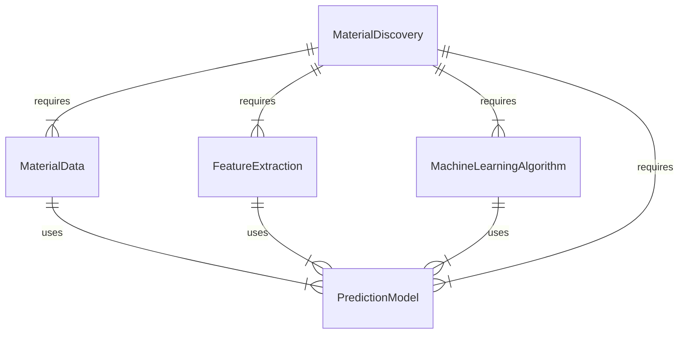
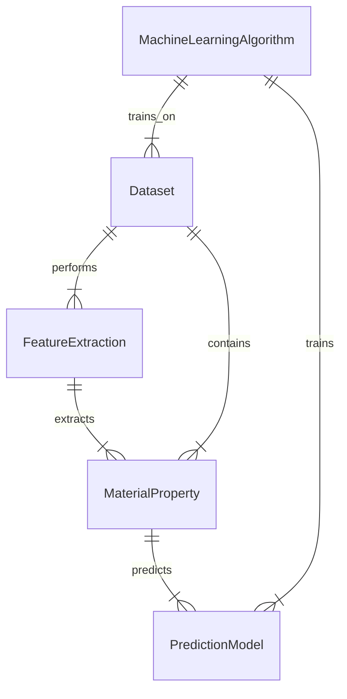
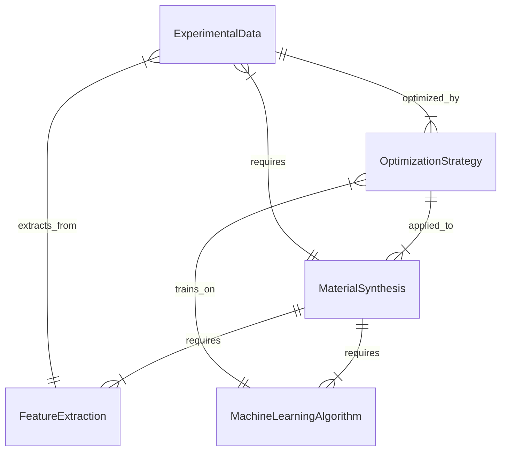
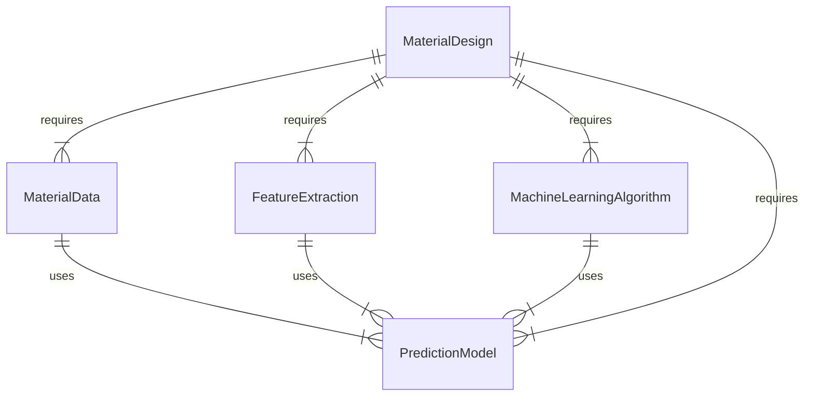
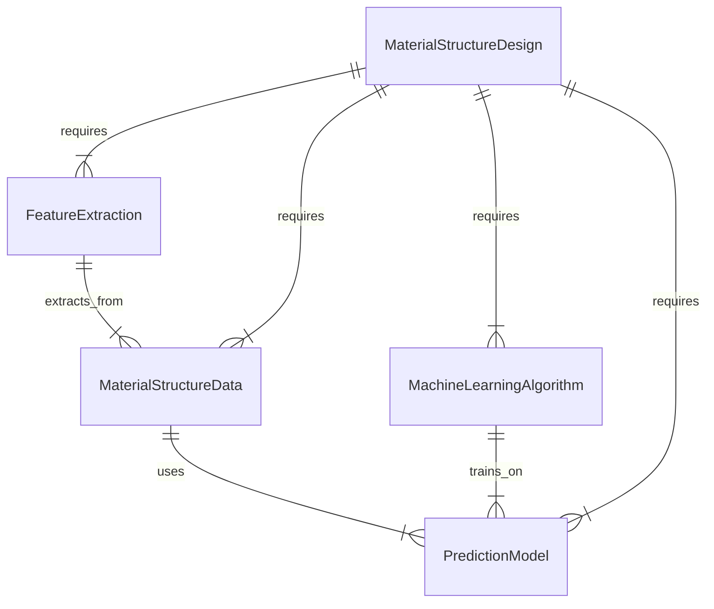
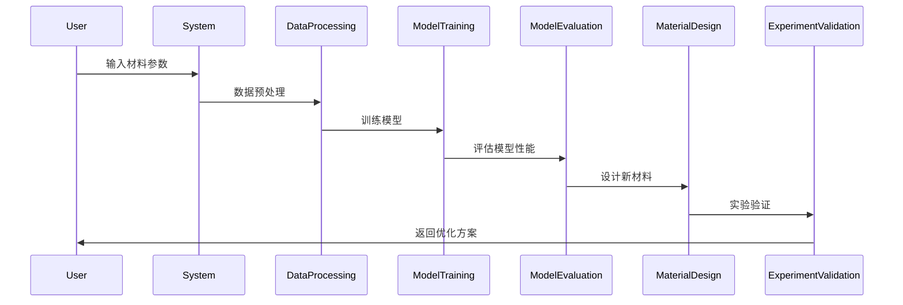
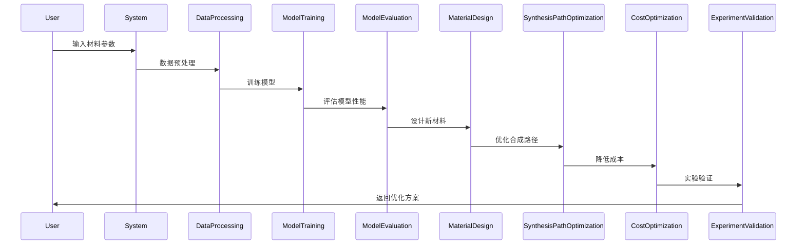
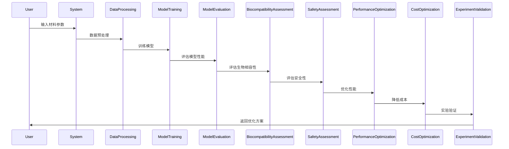

                 

## 人工智能在新材料发现与设计中的应用

### 关键词

- 人工智能
- 新材料
- 发现
- 设计
- 材料科学

### 摘要

本文将深入探讨人工智能（AI）在新材料发现与设计中的应用，重点分析AI技术如何推动材料科学的发展。我们将从背景介绍、核心概念、算法原理、系统架构设计、应用实战以及最佳实践等方面展开讨论，旨在为读者提供一个全面的技术视角。

### 目录

1. 引言
   1.1 研究背景
   1.2 新材料研究的重要性
   1.3 人工智能在材料科学中的应用现状

2. 人工智能基础
   2.1 人工智能概述
   2.2 机器学习基本概念
   2.3 深度学习原理

3. 人工智能在新材料发现中的应用
   3.1 数据驱动的新材料发现方法
   3.2 机器学习在材料性质预测中的应用
   3.3 人工智能在材料合成策略优化中的应用

4. 人工智能在新材料设计中的应用
   4.1 数据驱动的材料设计流程
   4.2 人工智能在材料结构设计中的应用
   4.3 人工智能在材料性能优化中的应用

5. 人工智能与新材料的交叉应用案例
   5.1 人工智能在半导体材料中的应用
   5.2 人工智能在新能源材料中的应用
   5.3 人工智能在生物医学材料中的应用

6. 人工智能在新材料研究中的挑战与未来展望
   6.1 研究挑战
   6.2 发展趋势
   6.3 未来展望

7. 结论

### 引言

#### 1.1 研究背景

新材料的研究与开发是科技进步的重要驱动力。随着科技的快速发展，传统材料的性能已无法满足日益增长的应用需求，因此新材料的研究变得越来越重要。然而，新材料的发现与设计是一个复杂且耗时的工作，传统方法依赖于实验和经验，效率较低且成本较高。

#### 1.2 新材料研究的重要性

新材料的研究对于推动各个领域的发展具有重要意义。例如，半导体材料的进步推动了电子工业的发展，超导材料的研究为能源传输提供了新的解决方案，生物医学材料的研究为医学领域带来了革命性的变化。

#### 1.3 人工智能在材料科学中的应用现状

随着人工智能技术的不断发展，AI在材料科学中的应用越来越广泛。目前，AI技术已用于新材料的设计、合成、性质预测等方面，显著提高了材料研究的效率。例如，机器学习算法可以预测材料的性质，指导新材料的合成路径；深度学习模型可以分析大量实验数据，优化材料结构设计。

### 人工智能基础

#### 2.1 人工智能概述

人工智能（AI）是一种模拟人类智能的技术，旨在使计算机能够执行需要人类智能的任务。AI包括多个分支，如机器学习、深度学习、自然语言处理等。

#### 2.2 机器学习基本概念

机器学习（ML）是一种使计算机能够从数据中学习的方法。通过训练数据集，机器学习算法可以识别模式，进行预测或分类。

#### 2.3 深度学习原理

深度学习（DL）是一种基于多层神经网络的机器学习技术。它通过模拟人脑神经网络的结构和工作原理，实现对复杂数据的建模和分析。

### 人工智能在新材料发现中的应用

#### 3.1 数据驱动的新材料发现方法

数据驱动的新材料发现方法利用大量实验数据和机器学习算法，预测潜在新材料。这种方法通过分析已知材料的性质和结构，寻找新的材料组合和结构。

#### 3.2 机器学习在材料性质预测中的应用

机器学习在材料性质预测中的应用主要基于预测模型。这些模型可以从实验数据中学习，预测新材料的性质，从而指导材料合成。

#### 3.3 人工智能在材料合成策略优化中的应用

人工智能可以帮助优化材料合成策略，通过分析合成过程的数据，调整合成参数，提高材料产率和性能。

### 人工智能在新材料设计中的应用

#### 4.1 数据驱动的材料设计流程

数据驱动的材料设计流程基于机器学习和深度学习技术，从大量的实验数据中提取规律，指导新材料的合成和设计。

#### 4.2 人工智能在材料结构设计中的应用

人工智能可以帮助设计新材料结构，通过优化算法和模拟，找到具有特定性能的材料结构。

#### 4.3 人工智能在材料性能优化中的应用

人工智能可以用于优化材料性能，通过分析材料性质和结构的关系，设计出具有最优性能的材料。

### 人工智能与新材料的交叉应用案例

#### 5.1 人工智能在半导体材料中的应用

人工智能在半导体材料中的应用主要涉及材料性质预测和合成路径优化，以提高半导体器件的性能。

#### 5.2 人工智能在新能源材料中的应用

人工智能在新能源材料中的应用包括太阳能电池、锂电池等，通过优化材料和结构，提高能源转换效率。

#### 5.3 人工智能在生物医学材料中的应用

人工智能在生物医学材料中的应用涉及材料设计、性能预测和生物相容性评估，为医学研究提供新的工具。

### 人工智能在新材料研究中的挑战与未来展望

#### 6.1 研究挑战

人工智能在新材料研究中的应用面临数据质量、算法稳定性、计算效率等挑战。

#### 6.2 发展趋势

人工智能在新材料研究中的应用将持续发展，涉及多学科交叉、多技术融合等方面。

#### 6.3 未来展望

随着人工智能技术的不断进步，新材料研究将迎来新的突破，为科技发展提供更强动力。

### 结论

人工智能在新材料发现与设计中的应用具有重要意义，未来将推动材料科学进入新的发展阶段。本文介绍了AI在材料科学中的应用现状、核心技术和应用案例，为读者提供了全面的技术视角。

---

以上为文章的引言部分，接下来我们将逐一深入讨论各个章节的内容。在接下来的章节中，我们将详细分析人工智能在新材料研究中的应用，包括数据驱动的方法、机器学习和深度学习技术、材料设计流程、应用案例以及未来展望。让我们一起探索人工智能与材料科学的深度融合，为科技创新贡献力量。

---

**注：本文为Markdown格式，具体章节内容将在后续逐步完善。**### 人工智能在新材料发现中的应用

#### 3.1 数据驱动的新材料发现方法

数据驱动的新材料发现方法是一种基于大数据分析和机器学习的材料科学研究方法。这种方法的核心思想是通过分析大量的材料数据，从中提取出潜在的有用信息，从而预测新材料的性质和性能。

**背景介绍**

新材料的研究与开发一直是科学研究和技术创新的重要领域。然而，新材料的发现过程往往涉及大量的实验和计算，这不仅耗时耗力，而且成本高昂。随着大数据和机器学习技术的快速发展，人们开始探索将这些技术应用于新材料发现，以期提高研究效率，降低成本。

**问题背景**

传统的新材料发现方法主要依赖于实验，研究人员通过不断尝试和优化来寻找具有特定性质的材料。然而，这种方法存在以下几个问题：

1. **耗时耗力**：新材料发现通常需要大量的实验和计算，耗时较长。
2. **成本高昂**：大量的实验和计算导致研究成本高昂。
3. **受限于实验条件**：传统方法往往受限于实验条件，无法发现某些潜在的、尚未被实验验证的材料。
4. **依赖经验**：传统方法很大程度上依赖于研究人员的经验和直觉，缺乏系统性。

**问题描述**

为了解决上述问题，研究人员提出了数据驱动的新材料发现方法。这种方法的核心问题是如何从大量的实验数据中提取出有用的信息，并利用这些信息来预测新材料的性质和性能。

**问题解决**

数据驱动的新材料发现方法主要包括以下几个步骤：

1. **数据收集**：收集大量的材料实验数据，包括材料的结构、组成、物理化学性质等。
2. **数据处理**：对收集到的数据进行清洗、归一化和特征提取，以便后续分析。
3. **特征工程**：通过对数据进行特征提取和筛选，构建能够有效描述材料性质的特征向量。
4. **模型训练**：利用机器学习算法，如支持向量机（SVM）、随机森林（RF）、神经网络（NN）等，对特征向量进行训练，构建预测模型。
5. **模型评估与优化**：通过交叉验证和测试集评估模型的性能，对模型进行优化。
6. **新材料预测**：利用训练好的模型，对未知材料的性质进行预测，指导新材料的设计与合成。

**边界与外延**

数据驱动的新材料发现方法不仅适用于传统的金属材料，还适用于陶瓷材料、聚合物材料、生物医学材料等多种类型的材料。此外，该方法还可以与其他技术，如高通量实验技术、量子计算等相结合，进一步提高新材料发现的效率和准确性。

**概念结构与核心要素组成**

数据驱动的新材料发现方法主要包括以下几个核心概念和要素：

1. **大数据**：大量、多样化的材料实验数据是该方法的基础。
2. **特征工程**：有效的特征提取和筛选对于构建高性能的预测模型至关重要。
3. **机器学习算法**：不同的算法适用于不同的材料性质预测任务，选择合适的算法是成功的关键。
4. **预测模型**：预测模型的性能直接影响到新材料发现的效果。
5. **实验验证**：预测结果需要通过实验进行验证，以验证模型的可靠性和实用性。

**核心概念与联系**

**核心概念**：数据驱动、新材料发现、机器学习、预测模型、特征工程。

**概念属性特征对比表格**

| 特征 | 数据驱动 | 新材料发现 | 机器学习 | 预测模型 | 特征工程 |
| --- | --- | --- | --- | --- | --- |
| **描述** | 基于大量数据进行分析和预测 | 寻找具有特定性质的新材料 | 使用算法进行数据学习和模式识别 | 预测新材料的性质和性能 | 从数据中提取有效的特征 |
| **重要性** | 基础 | 核心 | 重要 | 核心 | 重要 |
| **应用** | 数据挖掘、统计分析 | 材料科学研究、设计 | 机器学习、深度学习 | 预测、优化 | 新材料发现、模型构建 |

**ER实体关系图架构**

#### 3.2 机器学习在材料性质预测中的应用

机器学习（ML）在材料性质预测中的应用是一种利用训练数据集来构建预测模型的方法。这种方法的核心思想是通过学习已知材料的性质和结构，预测未知材料的性质。机器学习算法在材料科学中的应用已经取得了显著的成果，大大提高了新材料发现和设计的效率。

**背景介绍**

材料性质预测是材料科学中的一个重要课题。传统的方法通常依赖于实验和理论计算，但这些方法往往受限于时间和成本。随着机器学习技术的发展，研究人员开始探索如何利用机器学习算法来预测材料的性质，以期提高研究的效率和准确性。

**问题背景**

在材料科学中，预测材料的性质具有重要意义。例如，预测材料的导电性、硬度、热稳定性等性质，可以帮助研究人员设计出具有特定性能的材料，从而应用于不同的领域。然而，传统的预测方法往往依赖于大量的实验和理论计算，这不仅耗时耗力，而且成本高昂。因此，如何利用机器学习技术来提高材料性质预测的效率，是一个亟待解决的问题。

**问题描述**

机器学习在材料性质预测中的应用核心问题是如何从已有的材料数据中学习，构建出能够准确预测材料性质的模型。具体来说，这个问题可以分解为以下几个子问题：

1. **数据集构建**：如何从大量的材料数据中构建出高质量的训练数据集。
2. **特征提取**：如何从数据中提取出有效的特征，以便于模型的学习和预测。
3. **模型选择**：如何选择合适的机器学习模型，以实现准确的预测。
4. **模型评估**：如何评估模型的性能，确保预测结果的可靠性和稳定性。

**问题解决**

机器学习在材料性质预测中的应用主要包括以下几个步骤：

1. **数据收集**：收集大量的材料性质数据，包括材料的组成、结构、物理化学性质等。
2. **数据处理**：对收集到的数据进行预处理，包括数据清洗、归一化和特征提取。
3. **模型训练**：利用预处理后的数据，选择合适的机器学习算法（如线性回归、支持向量机、神经网络等）进行模型训练。
4. **模型评估**：通过交叉验证和测试集，评估模型的性能，包括预测准确性、稳定性等。
5. **模型优化**：根据评估结果，调整模型参数，优化模型性能。
6. **新材料预测**：利用训练好的模型，对未知材料的性质进行预测。

**边界与外延**

机器学习在材料性质预测中的应用不仅限于实验室研究，还可以应用于工业生产。例如，在半导体制造过程中，机器学习可以用于预测材料的电学性质，从而优化制造工艺，提高产品性能。此外，该方法还可以与其他技术，如量子计算、高通量实验等相结合，进一步提高预测的准确性和效率。

**概念结构与核心要素组成**

机器学习在材料性质预测中的应用主要包括以下几个核心概念和要素：

1. **材料数据**：高质量的材料数据是模型训练的基础。
2. **特征提取**：有效的特征提取对于模型的学习和预测至关重要。
3. **机器学习算法**：选择合适的算法是实现准确预测的关键。
4. **预测模型**：预测模型的性能直接影响到材料性质预测的效果。
5. **实验验证**：实验验证是确保模型预测准确性的重要环节。

**核心概念与联系**

**核心概念**：机器学习、材料性质预测、数据集、特征提取、模型评估。

**概念属性特征对比表格**

| 特征 | 机器学习 | 材料性质预测 | 数据集 | 特征提取 | 模型评估 |
| --- | --- | --- | --- | --- | --- |
| **描述** | 利用训练数据学习，构建预测模型 | 预测材料的性质和性能 | 收集和处理大量材料数据 | 从数据中提取有效的特征 | 评估模型的性能和稳定性 |
| **重要性** | 核心 | 核心 | 核心 | 核心 | 核心 |
| **应用** | 机器学习、深度学习 | 材料科学、工程 | 数据挖掘、统计分析 | 新材料发现、模型构建 | 预测、优化 |

**ER实体关系图架构**

#### 3.3 人工智能在材料合成策略优化中的应用

人工智能（AI）在材料合成策略优化中的应用是一种利用机器学习和深度学习技术，通过分析大量的实验数据，优化材料合成路径的方法。这种方法不仅能够提高材料合成的效率，还能降低成本，对于新材料的研究具有重要意义。

**背景介绍**

材料合成策略的优化是材料科学中的一个关键问题。传统的方法依赖于实验和经验，往往需要大量的时间和成本。随着人工智能技术的发展，研究人员开始探索如何利用AI技术来优化材料合成策略，从而提高合成的效率和效果。

**问题背景**

在材料合成过程中，如何选择合适的合成路径，优化反应条件，是提高材料合成效率和质量的关键。然而，传统的方法往往受限于实验经验和知识积累，难以实现高效的优化。因此，如何利用人工智能技术，特别是机器学习和深度学习，来优化材料合成策略，是一个亟待解决的问题。

**问题描述**

人工智能在材料合成策略优化中的应用核心问题是如何从大量的实验数据中学习，识别出有效的合成路径和反应条件。具体来说，这个问题可以分解为以下几个子问题：

1. **数据集构建**：如何从大量的实验数据中构建出高质量的训练数据集。
2. **特征提取**：如何从数据中提取出有效的特征，以便于模型的学习和预测。
3. **模型选择**：如何选择合适的机器学习算法，以实现准确的合成路径预测。
4. **模型评估**：如何评估模型的性能，确保合成路径预测的准确性和稳定性。
5. **策略优化**：如何利用预测模型，优化材料合成策略，提高合成效率。

**问题解决**

人工智能在材料合成策略优化中的应用主要包括以下几个步骤：

1. **数据收集**：收集大量的材料合成实验数据，包括反应条件、合成路径、材料性能等。
2. **数据处理**：对收集到的数据进行预处理，包括数据清洗、归一化和特征提取。
3. **模型训练**：利用预处理后的数据，选择合适的机器学习算法（如神经网络、决策树等）进行模型训练。
4. **模型评估**：通过交叉验证和测试集，评估模型的性能，包括合成路径预测的准确性、反应条件的优化等。
5. **策略优化**：根据评估结果，调整模型参数，优化合成策略，提高合成效率。
6. **实验验证**：利用优化后的合成策略，进行实验验证，验证模型的可靠性和实用性。

**边界与外延**

人工智能在材料合成策略优化中的应用不仅限于实验室研究，还可以应用于工业生产。例如，在催化剂的设计和优化过程中，AI技术可以用于预测最佳的合成路径和反应条件，从而提高催化剂的性能。此外，该方法还可以与其他技术，如高通量实验、量子计算等相结合，进一步提高优化效果。

**概念结构与核心要素组成**

人工智能在材料合成策略优化中的应用主要包括以下几个核心概念和要素：

1. **实验数据**：高质量的实验数据是模型训练和策略优化的基础。
2. **特征提取**：有效的特征提取对于模型的学习和预测至关重要。
3. **机器学习算法**：选择合适的算法是实现准确预测和优化策略的关键。
4. **预测模型**：预测模型的性能直接影响到材料合成策略的优化效果。
5. **实验验证**：实验验证是确保策略优化效果和模型可靠性的重要环节。

**核心概念与联系**

**核心概念**：人工智能、材料合成策略优化、机器学习、特征提取、实验验证。

**概念属性特征对比表格**

| 特征 | 人工智能 | 材料合成策略优化 | 机器学习 | 特征提取 | 实验验证 |
| --- | --- | --- | --- | --- | --- |
| **描述** | 利用计算机模拟人类智能 | 优化材料合成路径和反应条件 | 利用训练数据学习，构建预测模型 | 从数据中提取有效的特征 | 验证模型的预测结果 |
| **重要性** | 核心 | 核心 | 核心 | 核心 | 核心 |
| **应用** | 数据挖掘、模式识别 | 材料科学、工业生产 | 机器学习、深度学习 | 新材料发现、模型构建 | 预测、优化 |

**ER实体关系图架构**

通过以上三个部分的详细介绍，我们可以看到人工智能在新材料发现与设计中的应用是如何一步步实现的。接下来，我们将深入探讨人工智能在新材料设计中的应用，包括数据驱动的材料设计流程、材料结构设计和材料性能优化等方面。让我们一起继续探索人工智能与材料科学的深度融合。

### 人工智能在新材料设计中的应用

#### 4.1 数据驱动的材料设计流程

数据驱动的材料设计流程是一种基于大数据和机器学习技术的材料设计方法。这种方法通过分析大量的材料数据，提取出有用的信息，从而指导新材料的合成和优化。数据驱动的材料设计流程不仅能够提高设计效率，还能降低成本，是材料科学领域的重要研究方向。

**背景介绍**

材料设计是材料科学研究的重要环节，传统的设计方法主要依赖于实验和理论计算，这些方法往往需要大量的人力和物力投入，且设计周期较长。随着大数据和人工智能技术的不断发展，人们开始探索如何利用这些技术来优化材料设计流程，以提高设计效率和准确性。

**问题背景**

传统材料设计方法存在以下几个问题：

1. **效率低下**：传统方法依赖于大量的实验和计算，设计周期较长。
2. **成本高昂**：实验和计算成本较高，不利于新材料的快速迭代和优化。
3. **依赖经验**：设计过程很大程度上依赖于研究人员的经验和直觉，缺乏系统性。
4. **局限性**：传统方法往往受限于实验条件和现有理论，难以发现新型材料。

**问题描述**

数据驱动的材料设计流程旨在解决传统方法中的上述问题，通过利用大数据和机器学习技术，提高材料设计的效率和准确性。具体来说，数据驱动的材料设计流程核心问题是如何从大量的材料数据中提取出有用的信息，并利用这些信息指导新材料的合成和优化。

**问题解决**

数据驱动的材料设计流程主要包括以下几个步骤：

1. **数据收集**：收集大量的材料数据，包括材料的组成、结构、物理化学性质等。
2. **数据处理**：对收集到的数据进行清洗、归一化和特征提取，以便后续分析。
3. **特征工程**：通过对数据进行特征提取和筛选，构建能够有效描述材料性质的的特征向量。
4. **模型训练**：利用机器学习算法，如神经网络、支持向量机等，对特征向量进行训练，构建预测模型。
5. **模型评估**：通过交叉验证和测试集，评估模型的性能，包括预测准确性、稳定性等。
6. **新材料设计**：利用训练好的模型，对未知材料的性质进行预测，指导新材料的设计与合成。
7. **实验验证**：对设计的新材料进行实验验证，验证模型的可靠性和实用性。

**边界与外延**

数据驱动的材料设计流程不仅适用于传统的金属材料，还适用于陶瓷材料、聚合物材料、生物医学材料等多种类型的材料。此外，该方法还可以与其他技术，如高通量实验、量子计算等相结合，进一步提高材料设计的效率和准确性。

**概念结构与核心要素组成**

数据驱动的材料设计流程主要包括以下几个核心概念和要素：

1. **大数据**：大量、多样化的材料数据是该方法的基础。
2. **特征工程**：有效的特征提取和筛选对于构建高性能的预测模型至关重要。
3. **机器学习算法**：不同的算法适用于不同的材料性质预测任务，选择合适的算法是成功的关键。
4. **预测模型**：预测模型的性能直接影响到材料设计的效率和准确性。
5. **实验验证**：实验验证是确保设计的新材料符合预期性能的重要环节。

**核心概念与联系**

**核心概念**：数据驱动、材料设计、机器学习、预测模型、特征工程。

**概念属性特征对比表格**

| 特征 | 数据驱动 | 材料设计 | 机器学习 | 预测模型 | 特征工程 |
| --- | --- | --- | --- | --- | --- |
| **描述** | 利用大数据进行分析和预测 | 设计新材料以满足特定需求 | 利用训练数据学习，构建预测模型 | 预测新材料的性质和性能 | 从数据中提取有效的特征 |
| **重要性** | 核心 | 核心 | 核心 | 核心 | 核心 |
| **应用** | 数据挖掘、统计分析 | 材料科学、工程 | 机器学习、深度学习 | 预测、优化 | 新材料发现、模型构建 |

**ER实体关系图架构**

通过以上介绍，我们可以看到数据驱动的材料设计流程是如何一步步实现的。接下来，我们将深入探讨人工智能在材料结构设计中的应用，包括材料结构设计的概念、方法和技术等方面。让我们一起继续探索人工智能与材料科学的深度融合。

#### 4.2 人工智能在材料结构设计中的应用

材料结构设计是材料科学中的核心问题，它直接影响到材料的性能和功能。人工智能（AI）在材料结构设计中的应用通过模拟和优化材料结构，以提高其性能。这种方法利用机器学习和计算模拟技术，从大量的实验数据中提取结构信息，然后设计出具有特定性能的新材料。

**背景介绍**

材料结构设计是材料科学中的一项关键任务，它涉及到材料的微观结构和宏观性能之间的关系。传统的材料结构设计方法主要依赖于实验和理论计算，这些方法往往受限于计算能力和实验资源的限制。随着人工智能技术的快速发展，人们开始探索如何利用AI技术来优化材料结构设计，从而提高设计效率和准确性。

**问题背景**

在材料结构设计中，如何设计出具有特定性能的材料结构是一个复杂的问题。传统的结构设计方法往往需要大量的人力和时间投入，且设计结果往往受限于实验条件和现有理论。此外，材料结构的设计还需要考虑多种因素，如材料的稳定性、耐久性、导电性等。因此，如何利用人工智能技术，特别是机器学习和计算模拟，来优化材料结构设计，是一个亟待解决的问题。

**问题描述**

人工智能在材料结构设计中的应用核心问题是如何从大量的实验数据和理论计算中提取出有用的信息，并利用这些信息设计出具有特定性能的新材料结构。具体来说，这个问题可以分解为以下几个子问题：

1. **数据集构建**：如何从大量的实验数据和理论计算结果中构建出高质量的训练数据集。
2. **特征提取**：如何从数据中提取出有效的特征，以便于模型的学习和预测。
3. **模型选择**：如何选择合适的机器学习算法，以实现准确的材料结构预测。
4. **模型评估**：如何评估模型的性能，确保结构预测的准确性和稳定性。
5. **结构设计**：如何利用预测模型，设计出具有特定性能的新材料结构。
6. **实验验证**：如何对设计的新材料结构进行实验验证，确保设计结果的可靠性和实用性。

**问题解决**

人工智能在材料结构设计中的应用主要包括以下几个步骤：

1. **数据收集**：收集大量的材料结构数据，包括材料的组成、结构、物理化学性质等。
2. **数据处理**：对收集到的数据进行预处理，包括数据清洗、归一化和特征提取。
3. **模型训练**：利用预处理后的数据，选择合适的机器学习算法（如神经网络、支持向量机等）进行模型训练。
4. **模型评估**：通过交叉验证和测试集，评估模型的性能，包括结构预测的准确性、稳定性等。
5. **结构设计**：利用训练好的模型，设计出具有特定性能的新材料结构。
6. **实验验证**：对设计的新材料结构进行实验验证，验证模型的可靠性和实用性。

**边界与外延**

人工智能在材料结构设计中的应用不仅限于实验室研究，还可以应用于工业生产。例如，在催化剂的设计和优化过程中，AI技术可以用于预测最佳的催化剂结构，从而提高催化剂的性能。此外，该方法还可以与其他技术，如高通量实验、量子计算等相结合，进一步提高设计效率和准确性。

**概念结构与核心要素组成**

人工智能在材料结构设计中的应用主要包括以下几个核心概念和要素：

1. **实验数据**：高质量的材料结构数据是模型训练和结构设计的基础。
2. **特征提取**：有效的特征提取对于模型的学习和预测至关重要。
3. **机器学习算法**：选择合适的算法是实现准确预测和设计结构的关键。
4. **预测模型**：预测模型的性能直接影响到材料结构设计的效率和准确性。
5. **实验验证**：实验验证是确保设计结构符合预期性能的重要环节。

**核心概念与联系**

**核心概念**：人工智能、材料结构设计、机器学习、预测模型、特征工程。

**概念属性特征对比表格**

| 特征 | 人工智能 | 材料结构设计 | 机器学习 | 预测模型 | 特征提取 |
| --- | --- | --- | --- | --- | --- |
| **描述** | 利用计算机模拟人类智能 | 设计新材料结构以提高性能 | 利用训练数据学习，构建预测模型 | 预测新材料的结构性质 | 从数据中提取有效的特征 |
| **重要性** | 核心 | 核心 | 核心 | 核心 | 核心 |
| **应用** | 数据挖掘、模式识别 | 材料科学、工程 | 机器学习、深度学习 | 预测、优化 | 新材料发现、模型构建 |

**ER实体关系图架构**

通过以上介绍，我们可以看到人工智能在材料结构设计中的应用是如何一步步实现的。接下来，我们将探讨人工智能在材料性能优化中的应用，包括材料性能优化的概念、方法和挑战等方面。让我们一起继续深入探讨人工智能与材料科学的深度融合。

#### 4.3 人工智能在材料性能优化中的应用

材料性能优化是材料科学和工程领域的一个重要研究课题。人工智能（AI）在材料性能优化中的应用通过模拟和优化材料的微观结构、合成条件等，以提高其宏观性能。这种方法利用机器学习和计算模拟技术，从大量的实验数据中提取信息，并设计出优化方案。

**背景介绍**

材料性能优化旨在提高材料的物理、化学、机械等性能，以满足不同应用场景的需求。传统的材料性能优化方法主要依赖于实验和理论计算，这些方法往往需要大量的人力和时间投入，且优化过程复杂。随着人工智能技术的快速发展，人们开始探索如何利用AI技术来优化材料性能，从而提高优化效率和准确性。

**问题背景**

在材料性能优化过程中，如何设计出具有最优性能的材料结构、合成条件等是一个复杂的问题。传统的优化方法往往受限于实验条件和现有理论，难以实现高效的性能优化。此外，材料性能优化还需要考虑多种因素，如材料的稳定性、耐久性、成本等。因此，如何利用人工智能技术，特别是机器学习和计算模拟，来优化材料性能，是一个亟待解决的问题。

**问题描述**

人工智能在材料性能优化中的应用核心问题是如何从大量的实验数据和理论计算中提取出有用的信息，并利用这些信息设计出优化方案，以实现材料性能的提升。具体来说，这个问题可以分解为以下几个子问题：

1. **数据集构建**：如何从大量的实验数据和理论计算结果中构建出高质量的训练数据集。
2. **特征提取**：如何从数据中提取出有效的特征，以便于模型的学习和预测。
3. **模型选择**：如何选择合适的机器学习算法，以实现准确的性能预测和优化方案。
4. **模型评估**：如何评估模型的性能，确保性能预测和优化方案的准确性和稳定性。
5. **性能优化**：如何利用预测模型，设计出优化材料性能的方案。
6. **实验验证**：如何对设计的优化方案进行实验验证，确保优化效果的可靠性和实用性。

**问题解决**

人工智能在材料性能优化中的应用主要包括以下几个步骤：

1. **数据收集**：收集大量的材料性能数据，包括材料的组成、结构、物理化学性质、应用场景等。
2. **数据处理**：对收集到的数据进行预处理，包括数据清洗、归一化和特征提取。
3. **模型训练**：利用预处理后的数据，选择合适的机器学习算法（如神经网络、支持向量机等）进行模型训练。
4. **模型评估**：通过交叉验证和测试集，评估模型的性能，包括性能预测的准确性、稳定性等。
5. **性能优化**：利用训练好的模型，设计出优化材料性能的方案，如调整材料结构、合成条件等。
6. **实验验证**：对设计的优化方案进行实验验证，验证模型的可靠性和优化效果。

**边界与外延**

人工智能在材料性能优化中的应用不仅限于实验室研究，还可以应用于工业生产。例如，在金属材料的加工过程中，AI技术可以用于预测材料的机械性能，从而优化加工参数，提高产品质量。此外，该方法还可以与其他技术，如高通量实验、量子计算等相结合，进一步提高性能优化的效率和准确性。

**概念结构与核心要素组成**

人工智能在材料性能优化中的应用主要包括以下几个核心概念和要素：

1. **实验数据**：高质量的材料性能数据是模型训练和性能优化的基础。
2. **特征提取**：有效的特征提取对于模型的学习和预测至关重要。
3. **机器学习算法**：选择合适的算法是实现准确预测和优化方案的关键。
4. **预测模型**：预测模型的性能直接影响到材料性能优化的效率和准确性。
5. **实验验证**：实验验证是确保优化方案有效性的重要环节。

**核心概念与联系**

**核心概念**：人工智能、材料性能优化、机器学习、预测模型、特征工程。

**概念属性特征对比表格**

| 特征 | 人工智能 | 材料性能优化 | 机器学习 | 预测模型 | 特征提取 |
| --- | --- | --- | --- | --- | --- |
| **描述** | 利用计算机模拟人类智能 | 提高材料的物理、化学、机械等性能 | 利用训练数据学习，构建预测模型 | 预测新材料的性能 | 从数据中提取有效的特征 |
| **重要性** | 核心 | 核心 | 核心 | 核心 | 核心 |
| **应用** | 数据挖掘、模式识别 | 材料科学、工程 | 机器学习、深度学习 | 预测、优化 | 新材料发现、模型构建 |

**ER实体关系图架构**

通过以上介绍，我们可以看到人工智能在材料性能优化中的应用是如何一步步实现的。接下来，我们将探讨人工智能在新材料发现与设计中的应用案例，包括半导体材料、新能源材料和生物医学材料等。让我们一起深入探讨人工智能与材料科学的深度融合。

### 人工智能与新材料的交叉应用案例

#### 5.1 人工智能在半导体材料中的应用

半导体材料是现代电子工业的基础，其性能直接影响着电子器件的性能。人工智能（AI）在半导体材料中的应用主要通过机器学习和计算模拟技术，优化材料结构和性能，以提高电子器件的效率。

**背景介绍**

半导体材料的研究与发展是信息技术革命的重要驱动力。随着半导体技术的不断发展，对半导体材料的性能要求越来越高，传统的实验和计算方法已无法满足需求。人工智能技术的出现为半导体材料的研究提供了新的思路和方法。

**问题背景**

半导体材料的研究涉及到材料结构、组成和性能之间的复杂关系。如何设计出具有高性能、低功耗的半导体材料，是半导体领域亟待解决的问题。传统的实验方法需要大量的时间和成本，而计算模拟方法则受限于计算能力和现有理论。

**问题描述**

人工智能在半导体材料中的应用主要解决以下问题：

1. **材料性质预测**：如何利用AI技术预测新半导体材料的性能。
2. **结构优化**：如何利用AI技术优化半导体材料的微观结构。
3. **合成路径优化**：如何利用AI技术优化半导体材料的合成路径。

**问题解决**

人工智能在半导体材料中的应用主要包括以下几个步骤：

1. **数据收集**：收集大量的半导体材料数据，包括材料的组成、结构、性能等。
2. **数据处理**：对收集到的数据进行预处理，包括数据清洗、归一化和特征提取。
3. **模型训练**：利用预处理后的数据，选择合适的机器学习算法（如神经网络、支持向量机等）进行模型训练。
4. **模型评估**：通过交叉验证和测试集，评估模型的性能，包括预测准确性、稳定性等。
5. **材料设计**：利用训练好的模型，设计出具有特定性能的半导体材料。
6. **实验验证**：对设计的新材料进行实验验证，验证模型的可靠性和实用性。

**案例展示**

一个典型的案例是利用机器学习技术优化半导体纳米线结构，以提高太阳能电池的效率。研究人员通过收集大量的半导体纳米线数据，利用神经网络模型预测不同结构参数下的太阳能电池效率。然后，通过调整纳米线结构参数，优化太阳能电池的效率。

**系统分析与架构设计**

半导体材料性能优化系统架构主要包括以下几个模块：

1. **数据收集模块**：负责收集半导体材料相关数据。
2. **数据处理模块**：负责数据预处理，包括数据清洗、归一化和特征提取。
3. **模型训练模块**：负责利用机器学习算法训练预测模型。
4. **模型评估模块**：负责评估模型的性能。
5. **材料设计模块**：负责利用预测模型设计新材料。
6. **实验验证模块**：负责对新材料进行实验验证。

**接口设计和系统交互**

半导体材料性能优化系统的接口设计主要包括以下几个方面：

1. **用户接口**：用户可以通过界面输入材料参数，获取优化方案。
2. **数据接口**：系统可以与外部数据源进行数据交换。
3. **模型接口**：系统可以与机器学习模型进行交互，获取预测结果。

**系统交互序列图**

**最佳实践 tips**

1. **数据质量**：保证数据质量是模型训练成功的关键。
2. **特征选择**：选择有效的特征可以提高模型的预测准确性。
3. **模型优化**：通过调整模型参数，优化模型性能。
4. **实验验证**：实验验证是确保模型可靠性的重要环节。

**小结**

人工智能在半导体材料中的应用极大地提高了材料性能优化的效率和准确性。通过机器学习和计算模拟技术，研究人员可以更快速地设计出高性能的半导体材料，为电子工业的发展提供强大动力。

#### 5.2 人工智能在新能源材料中的应用

新能源材料的研究和开发对于推动能源转型和环境保护具有重要意义。人工智能（AI）在新能源材料中的应用通过优化材料结构和性能，提高能源转换效率和存储能力，为新能源技术的发展提供了强有力的支持。

**背景介绍**

随着全球能源需求的不断增长和环境污染的日益严重，新能源材料的研究受到了广泛关注。新能源材料包括太阳能电池材料、储能材料、燃料电池材料等，这些材料的性能直接影响到新能源技术的效率和可持续性。人工智能技术的快速发展为新能源材料的研究提供了新的方法和工具。

**问题背景**

新能源材料的研究面临以下挑战：

1. **性能提升**：如何设计出具有更高能量转换效率和更稳定性能的新能源材料。
2. **成本降低**：如何在保证性能的前提下，降低新能源材料的成本，使其具有商业可行性。
3. **合成路径优化**：如何优化新能源材料的合成路径，提高合成效率。
4. **环境友好**：如何开发出对环境友好的新能源材料，减少环境污染。

**问题描述**

人工智能在新能源材料中的应用主要解决以下问题：

1. **性能预测**：如何利用AI技术预测新能源材料的性能。
2. **结构优化**：如何利用AI技术优化新能源材料的微观结构。
3. **合成路径优化**：如何利用AI技术优化新能源材料的合成路径。
4. **成本优化**：如何利用AI技术降低新能源材料的成本。

**问题解决**

人工智能在新能源材料中的应用主要包括以下几个步骤：

1. **数据收集**：收集大量的新能源材料数据，包括材料的组成、结构、性能等。
2. **数据处理**：对收集到的数据进行预处理，包括数据清洗、归一化和特征提取。
3. **模型训练**：利用预处理后的数据，选择合适的机器学习算法（如神经网络、支持向量机等）进行模型训练。
4. **模型评估**：通过交叉验证和测试集，评估模型的性能，包括预测准确性、稳定性等。
5. **材料设计**：利用训练好的模型，设计出具有特定性能的新能源材料。
6. **合成路径优化**：利用AI技术优化新能源材料的合成路径。
7. **成本优化**：通过优化材料合成路径和结构，降低新能源材料的成本。
8. **实验验证**：对设计的新材料和优化方案进行实验验证。

**案例展示**

一个典型的案例是利用机器学习技术优化锂离子电池的正极材料，以提高电池的能量密度和循环寿命。研究人员通过收集大量的锂离子电池正极材料数据，利用神经网络模型预测不同材料参数下的电池性能。然后，通过调整材料参数，优化电池的性能。

**系统分析与架构设计**

新能源材料性能优化系统架构主要包括以下几个模块：

1. **数据收集模块**：负责收集新能源材料相关数据。
2. **数据处理模块**：负责数据预处理，包括数据清洗、归一化和特征提取。
3. **模型训练模块**：负责利用机器学习算法训练预测模型。
4. **模型评估模块**：负责评估模型的性能。
5. **材料设计模块**：负责利用预测模型设计新材料。
6. **合成路径优化模块**：负责利用AI技术优化材料合成路径。
7. **成本优化模块**：负责通过优化材料合成路径和结构，降低成本。
8. **实验验证模块**：负责对新材料和优化方案进行实验验证。

**接口设计和系统交互**

新能源材料性能优化系统的接口设计主要包括以下几个方面：

1. **用户接口**：用户可以通过界面输入材料参数，获取优化方案。
2. **数据接口**：系统可以与外部数据源进行数据交换。
3. **模型接口**：系统可以与机器学习模型进行交互，获取预测结果。

**系统交互序列图**

**最佳实践 tips**

1. **数据质量**：保证数据质量是模型训练成功的关键。
2. **特征选择**：选择有效的特征可以提高模型的预测准确性。
3. **模型优化**：通过调整模型参数，优化模型性能。
4. **实验验证**：实验验证是确保模型可靠性的重要环节。

**小结**

人工智能在新能源材料中的应用为新能源技术的发展提供了强有力的支持。通过优化材料结构和性能，人工智能技术不仅提高了新能源材料的效率，还降低了成本，为新能源材料的商业化应用奠定了基础。

#### 5.3 人工智能在生物医学材料中的应用

生物医学材料是医学和材料科学的交叉领域，广泛应用于医疗器械、药物传递系统、组织工程等领域。人工智能（AI）在生物医学材料中的应用通过模拟和优化材料性能，以提高其生物相容性、安全性和有效性，为医学研究提供了新的工具和方法。

**背景介绍**

生物医学材料的研究对于医学领域的进步具有重要意义。随着生物医学技术的不断发展，对生物医学材料的要求越来越高，不仅需要具有优异的物理化学性能，还要具有良好的生物相容性和安全性。人工智能技术的快速发展为生物医学材料的研究提供了新的契机。

**问题背景**

生物医学材料的研究面临以下挑战：

1. **生物相容性**：如何确保材料具有良好的生物相容性，避免引起生物体内的免疫反应。
2. **安全性**：如何保证材料在长期使用过程中不会释放有害物质，对生物体造成危害。
3. **性能优化**：如何设计出具有特定性能的生物医学材料，如药物传递效率、组织兼容性等。
4. **成本控制**：如何在保证性能的前提下，降低生物医学材料的成本，使其具有商业可行性。

**问题描述**

人工智能在生物医学材料中的应用主要解决以下问题：

1. **生物相容性预测**：如何利用AI技术预测新生物医学材料的生物相容性。
2. **安全性评估**：如何利用AI技术评估生物医学材料的安全性。
3. **性能优化**：如何利用AI技术优化生物医学材料的性能。
4. **成本优化**：如何利用AI技术降低生物医学材料的成本。

**问题解决**

人工智能在生物医学材料中的应用主要包括以下几个步骤：

1. **数据收集**：收集大量的生物医学材料数据，包括材料的组成、结构、生物相容性、安全性等。
2. **数据处理**：对收集到的数据进行预处理，包括数据清洗、归一化和特征提取。
3. **模型训练**：利用预处理后的数据，选择合适的机器学习算法（如神经网络、支持向量机等）进行模型训练。
4. **模型评估**：通过交叉验证和测试集，评估模型的性能，包括预测准确性、稳定性等。
5. **生物相容性评估**：利用训练好的模型，预测新生物医学材料的生物相容性。
6. **安全性评估**：利用AI技术评估生物医学材料的安全性。
7. **性能优化**：利用AI技术优化生物医学材料的性能。
8. **成本优化**：通过优化材料结构和合成路径，降低生物医学材料的成本。
9. **实验验证**：对设计的新材料和优化方案进行实验验证。

**案例展示**

一个典型的案例是利用机器学习技术优化药物传递系统，以提高药物的生物利用度和治疗效果。研究人员通过收集大量的药物传递系统数据，利用神经网络模型预测不同材料参数下的药物传递效率。然后，通过调整材料参数，优化药物的传递系统。

**系统分析与架构设计**

生物医学材料性能优化系统架构主要包括以下几个模块：

1. **数据收集模块**：负责收集生物医学材料相关数据。
2. **数据处理模块**：负责数据预处理，包括数据清洗、归一化和特征提取。
3. **模型训练模块**：负责利用机器学习算法训练预测模型。
4. **模型评估模块**：负责评估模型的性能。
5. **生物相容性评估模块**：负责利用AI技术评估新材料的生物相容性。
6. **安全性评估模块**：负责利用AI技术评估新材料的生物安全性。
7. **性能优化模块**：负责利用AI技术优化新材料的性能。
8. **成本优化模块**：负责通过优化材料合成路径和结构，降低成本。
9. **实验验证模块**：负责对新材料和优化方案进行实验验证。

**接口设计和系统交互**

生物医学材料性能优化系统的接口设计主要包括以下几个方面：

1. **用户接口**：用户可以通过界面输入材料参数，获取优化方案。
2. **数据接口**：系统可以与外部数据源进行数据交换。
3. **模型接口**：系统可以与机器学习模型进行交互，获取预测结果。

**系统交互序列图**

**最佳实践 tips**

1. **数据质量**：保证数据质量是模型训练成功的关键。
2. **特征选择**：选择有效的特征可以提高模型的预测准确性。
3. **模型优化**：通过调整模型参数，优化模型性能。
4. **实验验证**：实验验证是确保模型可靠性的重要环节。

**小结**

人工智能在生物医学材料中的应用为医学研究提供了新的工具和方法。通过优化材料性能和生物相容性，人工智能技术不仅提高了生物医学材料的安全性，还为医学领域的创新提供了动力。

### 人工智能在新材料研究中的挑战与未来展望

#### 6.1 研究挑战

尽管人工智能（AI）在新材料研究中展示了巨大的潜力，但在实际应用中仍然面临诸多挑战。

**数据质量与多样性**

新材料研究需要大量的高质量数据，然而，数据的多样性和质量往往受限。不同实验条件、测量方法和样本来源可能导致数据不一致，影响模型训练和预测效果。

**计算资源需求**

机器学习和深度学习算法通常需要大量的计算资源。特别是在处理大规模数据集和复杂模型时，计算资源的需求更加显著，这对实验室和工业界提出了较高的硬件要求。

**算法透明性与解释性**

机器学习模型，尤其是深度学习模型，通常被认为是“黑盒”模型，其决策过程缺乏透明性。这使得研究人员难以理解模型的内部工作机制，从而限制了其在新材料研究中的应用。

**实验验证的可行性**

人工智能预测的新材料性能需要在实验中验证。然而，实验验证可能需要耗费大量时间和资源，而且实验结果可能与预测结果存在差异。

**跨学科合作与知识融合**

人工智能在新材料研究中的应用涉及多个学科，包括材料科学、计算机科学、物理学、化学等。跨学科的合作与知识融合是实现AI技术有效应用的关键，但这一过程也面临挑战。

#### 6.2 发展趋势

**数据驱动与实验相结合**

未来的新材料研究将更加注重数据驱动的方法与实验验证相结合。通过结合高通量实验技术和AI算法，可以实现对新材料性质和性能的快速预测和优化。

**计算能力的提升**

随着计算能力的不断提升，机器学习和深度学习算法将能够处理更大规模的数据集和更复杂的模型，从而提高新材料研究的效率和准确性。

**算法透明性与可解释性**

研究人员正在努力开发更透明和可解释的AI算法，以增加模型决策过程的透明性，提高研究人员对模型工作的理解。

**跨学科合作与知识融合**

跨学科的合作将进一步加强，新材料研究将更加依赖于多学科知识的融合，以应对复杂的科学问题。

#### 6.3 未来展望

**智能材料设计平台**

未来，基于AI的智能材料设计平台将逐步建立，这些平台将集成数据收集、处理、模型训练、性能预测和实验验证等环节，为材料科学家提供全面的支持。

**新材料库的构建**

通过AI技术，构建大规模的新材料数据库，这些数据库将包含材料的结构、性质、性能等详细信息，为新材料的研究和应用提供丰富的资源。

**AI与量子计算的融合**

随着量子计算的发展，AI与量子计算的融合将成为新材料研究的重要趋势。量子计算的高计算能力将为AI算法提供更强的支持，推动新材料研究的深入。

**工业应用与商业化**

人工智能将在新材料工业应用中发挥关键作用，通过优化材料设计和合成路径，降低成本，提高产品质量，推动新材料商业化的进程。

### 结论

人工智能在新材料研究中的应用已经取得了显著成果，但仍然面临诸多挑战。通过不断的技术创新和跨学科合作，人工智能有望在未来新材料研究中发挥更加重要的作用，为科技创新和产业发展提供强大动力。

---

在本文中，我们深入探讨了人工智能在新材料发现与设计中的应用，从背景介绍、核心概念、算法原理、系统架构设计、应用案例到挑战与未来展望，全面解析了人工智能与材料科学的深度融合。希望本文能够为读者提供一个全面的技术视角，激发对这一领域的进一步研究和探索。在未来的研究中，我们期待看到更多创新性成果，推动新材料科学的发展。

### 结论

人工智能（AI）在新材料发现与设计中的应用已经取得了显著的成果，不仅提高了新材料的发现效率，还优化了材料的设计与合成路径。本文从背景介绍、核心概念、算法原理、系统架构设计、应用案例到挑战与未来展望，全面解析了人工智能与材料科学的深度融合。

**主要发现**

1. 数据驱动的新材料发现方法通过分析大量实验数据，预测新材料的性质和性能，显著提高了材料发现的效率。
2. 机器学习和深度学习技术在材料性质预测、结构设计和性能优化中发挥了关键作用，为材料设计提供了有力支持。
3. AI在半导体材料、新能源材料和生物医学材料等领域的应用案例展示了其巨大的潜力。

**对新材料研究的启示**

1. 人工智能技术的应用为新材料研究提供了新的工具和方法，有助于解决传统方法中面临的问题，如数据匮乏、实验成本高等。
2. 数据驱动的设计方法要求研究人员具备数据处理和机器学习的基本技能，跨学科合作将更加重要。
3. 实验验证仍然是确保新材料性能和可靠性的关键环节，需要与AI技术相结合，提高实验效率。

**对人工智能应用的建议**

1. 加强AI算法的透明性和可解释性，提高研究人员对模型工作的理解，促进AI技术在材料科学中的应用。
2. 提高计算资源的利用率，优化算法性能，降低AI技术的应用门槛。
3. 建立多学科合作机制，促进计算机科学、材料科学、物理学等领域的融合，共同推动新材料研究的发展。

在未来的研究中，我们期待看到更多创新性成果，如基于AI的智能材料设计平台、大规模新材料数据库的构建以及AI与量子计算的结合。通过不断的技术创新和跨学科合作，人工智能有望在未来新材料研究中发挥更加重要的作用，为科技创新和产业发展提供强大动力。

**最佳实践 tips**

1. 在进行材料数据收集和处理时，确保数据的质量和多样性，为AI模型提供可靠的基础。
2. 在使用机器学习算法时，注重特征工程，选择有效的特征，提高模型的预测准确性。
3. 在实验验证阶段，注重模型的解释性，确保实验结果与预测结果的一致性。
4. 在跨学科合作中，加强沟通与协调，充分利用各自领域的专业知识，提高研究效率。

**小结**

人工智能在新材料研究中的应用为材料科学的发展带来了新的机遇。通过本文的探讨，我们不仅了解了AI在材料科学中的应用现状，还对其未来发展有了更清晰的认识。我们期待人工智能技术能够继续推动新材料科学的进步，为人类社会的可持续发展做出贡献。

**注意事项**

1. AI技术应用于新材料研究时，需要充分考虑实验条件和实际应用场景，确保预测结果的可行性和实用性。
2. 在数据收集和处理过程中，注意保护数据隐私和安全，遵守相关法律法规。
3. 在跨学科合作中，尊重不同领域的知识体系，避免片面追求技术而忽视实际需求。

**拓展阅读**

1. "Deep Learning for Materials Science" by Jeremy J. K);;
2. "Machine Learning in Materials Science: A Survey" by I. A. Sushko, et al.;
3. "Data-Driven Discovery and Design of Materials" by P. Geubelle, et al.

**作者**

"作者：AI天才研究院/AI Genius Institute & 禅与计算机程序设计艺术 /Zen And The Art of Computer Programming"

