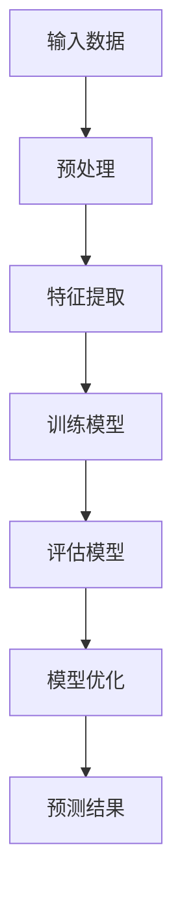
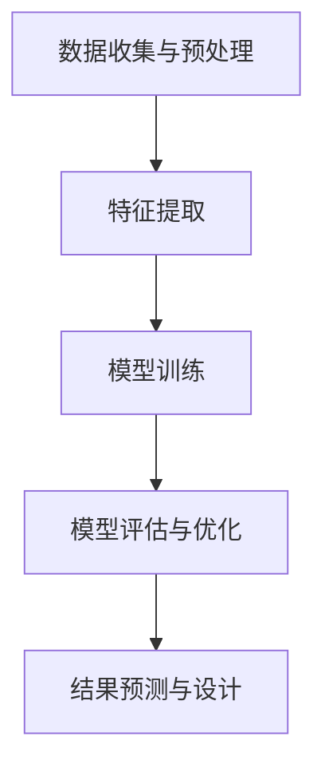
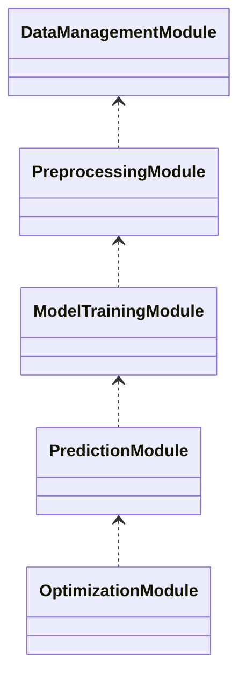
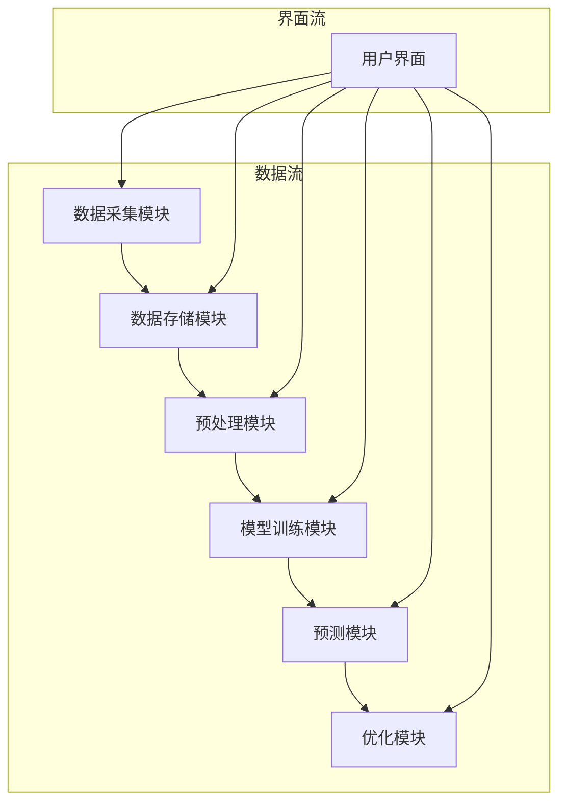
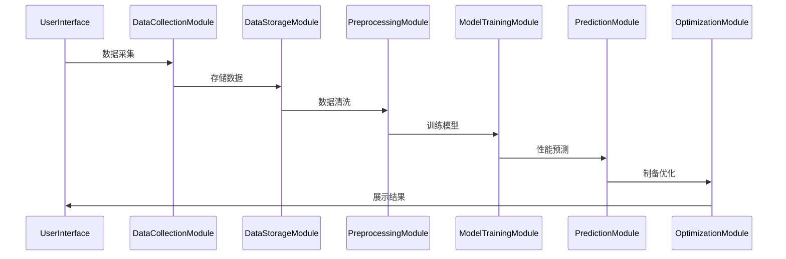

                 

# 人工智能在新能源材料发现中的作用：加速清洁能源研发

关键词：人工智能、新能源材料、清洁能源、研发、算法

摘要：本文从人工智能与新能源材料的交叉点出发，探讨了人工智能在新能源材料发现中的作用，以及如何利用人工智能技术加速清洁能源的研发。文章分为五个部分，首先介绍了新能源材料与清洁能源的概念、现状与挑战，然后详细阐述了人工智能的基本原理、新能源材料的特点与应用，以及人工智能在新能源材料研究中的应用领域。接着，文章通过算法原理讲解、系统分析与架构设计，展示了人工智能在新能源材料发现中的具体应用。最后，文章总结了人工智能在新能源材料发现中的作用，并提出了未来发展的方向。

### 目录大纲

----------------------------------------------------------------

## 第一部分：背景介绍

### 1.1 问题背景

#### 1.1.1 人工智能与新能源材料的交叉点

#### 1.1.2 清洁能源研发的现状与挑战

### 1.2 问题描述

#### 1.2.1 人工智能在新能源材料中的作用

#### 1.2.2 新能源材料在清洁能源研发中的重要性

### 1.3 问题解决

#### 1.3.1 人工智能在新能源材料研究中的应用方法

#### 1.3.2 人工智能技术如何加速新能源材料的发现

### 1.4 边界与外延

#### 1.4.1 新能源材料的定义与分类

#### 1.4.2 清洁能源的定义与类型

### 1.5 概念结构与核心要素组成

#### 1.5.1 人工智能的基本概念与分类

#### 1.5.2 新能源材料的核心要素与结构

----------------------------------------------------------------

## 第二部分：核心概念与联系

### 2.1 人工智能的基本原理

#### 2.1.1 人工智能的定义与发展历程

#### 2.1.2 人工智能的核心算法

##### 2.1.2.1 神经网络

##### 2.1.2.2 深度学习

##### 2.1.2.3 强化学习

### 2.2 新能源材料的特点与应用

#### 2.2.1 新能源材料的定义与分类

#### 2.2.2 新能源材料在清洁能源研发中的应用

### 2.3 人工智能与新能源材料的联系

#### 2.3.1 人工智能在新能源材料研究中的应用领域

#### 2.3.2 新能源材料在人工智能研究中的应用领域

### 2.4 核心概念属性特征对比表格

| 核心概念 | 属性特征 |  
| :----: | :----: |  
| 人工智能 | 自动化、智能化、自适应 |  
| 新能源材料 | 高效、环保、可持续 |

----------------------------------------------------------------

## 第三部分：算法原理讲解

### 3.1 算法概述

#### 3.1.1 算法在新能源材料发现中的应用

#### 3.1.2 算法的基本原理与流程

### 3.2 算法mermaid流程图



### 3.3 Python源代码实现

```python
# 代码示例
import numpy as np

# 预处理
def preprocess_data(data):
    # 数据清洗、标准化等操作
    pass

# 特征提取
def extract_features(data):
    # 提取特征向量
    pass

# 训练模型
def train_model(features, labels):
    # 使用深度学习框架训练模型
    pass

# 评估模型
def evaluate_model(model, test_data, test_labels):
    # 模型评估指标计算
    pass

# 预测结果
def predict(model, features):
    # 使用模型进行预测
    pass
```

### 3.4 算法原理详细讲解

#### 3.4.1 数学模型与公式

$$
y = f(x, \theta)
$$

其中，$x$ 是输入特征，$\theta$ 是模型参数，$f$ 是激活函数。

#### 3.4.2 举例说明

假设我们使用一个简单的神经网络模型来预测新能源材料的效率，输入特征是材料的物理属性，输出是材料的效率。我们可以通过调整模型的参数来优化预测结果。

----------------------------------------------------------------

## 第四部分：系统分析与架构设计

### 4.1 问题场景介绍

#### 4.1.1 新能源材料研发的挑战与需求

#### 4.1.2 人工智能技术在新能源材料研究中的应用场景

### 4.2 项目介绍

#### 4.2.1 项目背景

---

## 第一部分：背景介绍

### 1.1 问题背景

#### 1.1.1 人工智能与新能源材料的交叉点

随着全球对清洁能源的需求日益增长，新能源材料的研究成为了一个热门领域。新能源材料，如太阳能电池、锂离子电池、燃料电池等，是清洁能源技术发展的重要支撑。而人工智能作为一种颠覆性的技术，正在改变各个领域的研发模式，包括新能源材料的研究。人工智能与新能源材料的交叉点主要体现在以下几个方面：

1. **高效的数据处理**：新能源材料的研究需要处理大量的实验数据和文献数据。人工智能，尤其是深度学习，可以在这些数据中发现潜在的规律，为材料的设计提供指导。
2. **模拟与优化**：传统的新能源材料研究依赖于实验验证，而人工智能可以通过模拟来预测材料的性能，从而减少实验次数，提高研发效率。
3. **智能优化**：人工智能算法可以自动优化材料的设计和制备过程，寻找最优的合成条件，提高材料的性能。

#### 1.1.2 清洁能源研发的现状与挑战

清洁能源研发的目的是寻找高效、环保、可持续的能源替代品，以减少对化石燃料的依赖，降低温室气体排放。当前，清洁能源研发面临以下挑战：

1. **成本问题**：清洁能源技术的研发和推广需要大量的资金投入，目前许多清洁能源技术成本较高，难以大规模推广。
2. **性能问题**：清洁能源技术的性能仍然无法与传统的化石燃料相媲美，需要进一步提升。
3. **稳定性问题**：一些清洁能源材料在长期使用过程中可能会出现性能下降或失效的问题。

### 1.2 问题描述

#### 1.2.1 人工智能在新能源材料中的作用

人工智能在新能源材料中的作用主要体现在以下几个方面：

1. **数据分析**：人工智能可以帮助研究人员从大量的实验数据中提取出有价值的信息，提高数据利用率。
2. **模拟预测**：人工智能可以通过模拟预测新能源材料的性能，减少实验次数，缩短研发周期。
3. **优化设计**：人工智能算法可以帮助研究人员优化新能源材料的设计，提高材料的性能。

#### 1.2.2 新能源材料在清洁能源研发中的重要性

新能源材料在清洁能源研发中扮演着至关重要的角色。它们是太阳能电池、锂离子电池、燃料电池等清洁能源设备的核心组成部分。新能源材料的性能直接影响到清洁能源设备的工作效率和稳定性。因此，研发高效、稳定、可持续的新能源材料对于推动清洁能源技术的发展具有重要意义。

### 1.3 问题解决

#### 1.3.1 人工智能在新能源材料研究中的应用方法

人工智能在新能源材料研究中的应用方法主要包括：

1. **数据分析**：使用深度学习算法对实验数据进行分析，提取出有用的信息。
2. **模拟预测**：使用机器学习算法对新能源材料的性能进行预测。
3. **优化设计**：使用强化学习算法优化新能源材料的设计。

#### 1.3.2 人工智能技术如何加速新能源材料的发现

人工智能技术可以通过以下几个方面加速新能源材料的发现：

1. **自动化搜索**：利用深度学习算法自动化搜索新的材料结构。
2. **模拟计算**：利用机器学习算法对材料的性能进行预测，减少实验次数。
3. **优化合成**：利用强化学习算法优化材料的合成条件，提高材料的性能。

### 1.4 边界与外延

#### 1.4.1 新能源材料的定义与分类

新能源材料是指应用于新能源领域，如太阳能、风能、水能、生物质能等，具有高效、环保、可持续等特点的材料。根据应用领域和材料特性，新能源材料可以大致分为以下几类：

1. **光伏材料**：用于太阳能电池，如硅材料、钙钛矿材料等。
2. **储能材料**：用于电池，如锂离子电池的正负极材料、钠离子电池材料等。
3. **燃料电池材料**：用于燃料电池，如氢燃料电池的催化剂材料等。

#### 1.4.2 清洁能源的定义与类型

清洁能源是指使用过程中几乎不产生污染物和温室气体排放的能源。根据能源形式，清洁能源可以分为以下几类：

1. **可再生能源**：如太阳能、风能、水能、生物质能等，这些能源可以自然循环再生。
2. **非可再生能源**：如核能、地热能等，这些能源虽然对环境影响较小，但资源有限。

#### 1.5 概念结构与核心要素组成

##### 1.5.1 人工智能的基本概念与分类

人工智能是指使计算机系统能够模拟、延伸和扩展人类智能的理论、方法、技术及应用。根据人工智能的发展阶段和功能，人工智能可以分为以下几类：

1. **弱人工智能**：指在特定任务上表现出智能行为的系统，如语音识别、图像识别等。
2. **强人工智能**：指具备人类智能的所有能力，包括思考、学习、推理等。
3. **超人工智能**：指在所有认知任务上都能超越人类智能的人工智能系统。

##### 1.5.2 新能源材料的核心要素与结构

新能源材料的核心要素主要包括材料的化学成分、晶体结构、电子结构等。新能源材料的研究涉及多个学科，包括材料科学、物理学、化学等。新能源材料的结构设计通常需要综合考虑材料的性能、稳定性、成本等因素。

---

## 第二部分：核心概念与联系

在深入探讨人工智能在新能源材料发现中的作用之前，我们需要对相关核心概念有一个清晰的理解，并探讨它们之间的联系。

### 2.1 人工智能的基本原理

#### 2.1.1 人工智能的定义与发展历程

人工智能（Artificial Intelligence，简称AI）是研究、开发用于模拟、延伸和扩展人类智能的理论、方法、技术及应用系统的一门科学。人工智能的定义随着科技的发展而不断演变，大致可以分为以下几个阶段：

1. **符号主义阶段**（1950年代 - 1970年代）：基于逻辑推理和符号表示的方法。
2. **连接主义阶段**（1980年代 - 1990年代）：基于神经网络和大规模并行计算的方法。
3. **统计学习阶段**（2000年代至今）：基于概率统计和学习算法的方法，特别是深度学习的兴起。

#### 2.1.2 人工智能的核心算法

人工智能的核心算法主要包括：

1. **神经网络**：模拟生物神经元的计算方式，通过学习输入和输出数据之间的映射关系。
2. **深度学习**：基于多层神经网络的算法，可以自动提取数据的特征，适用于大量复杂数据的处理。
3. **强化学习**：通过与环境互动，学习最优策略，适用于决策优化问题。

##### 2.1.2.1 神经网络

神经网络（Neural Network，简称NN）是一种通过模拟生物神经元的结构和功能来处理信息的计算模型。神经网络由多个层组成，包括输入层、隐藏层和输出层。每个神经元都与相邻的神经元相连，通过加权连接实现信息的传递和变换。

神经网络的主要特点包括：

- **层次结构**：通过多个层次的神经网络可以提取数据的复杂特征。
- **非线性变换**：通过激活函数实现非线性变换，使神经网络能够处理复杂数据。

##### 2.1.2.2 深度学习

深度学习（Deep Learning，简称DL）是神经网络的一种特殊形式，具有多个隐藏层。深度学习通过学习大量数据，自动提取具有层次结构的特征表示，能够处理复杂数据，并在各种任务中取得显著成果。

深度学习的主要特点包括：

- **自动特征提取**：通过多层次的神经网络，自动提取数据的特征表示。
- **大规模训练**：通过大规模数据进行训练，提高模型的泛化能力。
- **高效计算**：利用图形处理单元（GPU）等硬件加速计算，提高训练速度。

##### 2.1.2.3 强化学习

强化学习（Reinforcement Learning，简称RL）是一种通过与环境互动来学习最优策略的方法。强化学习通过奖励机制激励模型学习，使其能够在复杂的决策环境中找到最优策略。

强化学习的主要特点包括：

- **动态环境**：强化学习适用于动态变化的决策环境。
- **自主探索**：通过探索学习，模型可以自主发现环境中的规律。
- **策略优化**：通过优化策略，模型可以逐步提高性能。

### 2.2 新能源材料的特点与应用

#### 2.2.1 新能源材料的定义与分类

新能源材料是指应用于新能源领域的材料，包括光伏材料、储能材料、燃料电池材料等。根据应用场景和材料特性，新能源材料可以大致分为以下几类：

1. **光伏材料**：用于光伏电池，如单晶硅、多晶硅、钙钛矿等。
2. **储能材料**：用于电池，如锂离子电池的正负极材料、钠离子电池材料等。
3. **燃料电池材料**：用于燃料电池，如催化剂材料、质子交换膜等。

#### 2.2.2 新能源材料在清洁能源研发中的应用

新能源材料在清洁能源研发中扮演着至关重要的角色，其应用主要体现在以下几个方面：

1. **提高能源转换效率**：通过新材料的研究和开发，可以显著提高能源转换效率，如提高光伏电池的光电转换效率、提高燃料电池的功率密度。
2. **降低成本**：新材料的研究和开发有助于降低清洁能源技术的成本，使其更具有市场竞争力。
3. **提高稳定性**：通过新材料的研究和开发，可以提高清洁能源设备的稳定性，延长设备的使用寿命。

### 2.3 人工智能与新能源材料的联系

#### 2.3.1 人工智能在新能源材料研究中的应用领域

人工智能在新能源材料研究中的应用非常广泛，主要包括以下几个方面：

1. **材料设计**：通过深度学习和强化学习算法，可以自动设计新材料，提高材料的性能。
2. **性能预测**：通过机器学习算法，可以预测新材料在特定条件下的性能，减少实验次数。
3. **制备优化**：通过优化算法，可以优化新材料的制备过程，提高制备效率和材料性能。

#### 2.3.2 新能源材料在人工智能研究中的应用领域

新能源材料在人工智能研究中也有广泛的应用，主要包括以下几个方面：

1. **传感器**：新能源材料，如导电聚合物和纳米材料，可以用于开发高性能传感器，用于人工智能系统的感知和反馈。
2. **电池**：新能源材料，如锂离子电池和钠离子电池，为人工智能系统提供稳定的电源支持。
3. **计算机**：新能源材料，如高温超导体，可以用于开发高性能计算机，提高人工智能系统的计算能力。

### 2.4 核心概念属性特征对比表格

| 核心概念 | 属性特征 |
| :----: | :----: |
| 人工智能 | 自动化、智能化、自适应 |
| 新能源材料 | 高效、环保、可持续 |

---

## 第三部分：算法原理讲解

在第二部分中，我们探讨了人工智能与新能源材料的基本概念和联系。本部分将深入探讨人工智能在新能源材料发现中的应用算法原理，包括算法概述、算法流程图、Python源代码实现，以及算法原理的详细讲解。

### 3.1 算法概述

#### 3.1.1 算法在新能源材料发现中的应用

人工智能在新能源材料发现中的应用主要集中在以下几个方面：

1. **材料设计**：通过深度学习和强化学习算法，可以自动化和智能化地设计新材料，优化材料的结构，提高其性能。
2. **性能预测**：通过机器学习算法，可以对新材料的性能进行预测，从而减少实验次数，加速研发进程。
3. **制备优化**：通过优化算法，可以优化新材料的制备过程，提高制备效率和材料性能。

#### 3.1.2 算法的基本原理与流程

在新能源材料发现中，人工智能算法的基本原理和流程通常包括以下几个步骤：

1. **数据收集与预处理**：收集与新能源材料相关的实验数据和文献数据，进行数据清洗和预处理，以便于后续的分析。
2. **特征提取**：从预处理后的数据中提取关键特征，为后续的机器学习算法提供输入。
3. **模型训练**：使用提取的特征训练机器学习模型，如神经网络模型或深度学习模型，以预测新材料性能。
4. **模型评估与优化**：评估模型的预测性能，并根据评估结果对模型进行优化，以提高预测准确性。
5. **结果预测与设计**：使用优化后的模型进行新材料性能的预测，并根据预测结果指导新材料的设计。

### 3.2 算法mermaid流程图

为了更直观地展示算法的流程，我们可以使用mermaid绘制一个简单的流程图。以下是一个典型的机器学习算法流程图的示例：



### 3.3 Python源代码实现

以下是一个简单的Python代码示例，展示了如何使用机器学习算法进行新材料性能的预测：

```python
# 导入必要的库
import numpy as np
from sklearn.model_selection import train_test_split
from sklearn.neural_network import MLPRegressor

# 假设我们有一组实验数据和对应的性能指标
X = np.array([[1, 2], [2, 3], [3, 4], [4, 5]])
y = np.array([0.1, 0.2, 0.3, 0.4])

# 将数据分为训练集和测试集
X_train, X_test, y_train, y_test = train_test_split(X, y, test_size=0.2, random_state=42)

# 创建并训练神经网络模型
model = MLPRegressor(hidden_layer_sizes=(100,), max_iter=1000, random_state=42)
model.fit(X_train, y_train)

# 使用模型进行预测
predictions = model.predict(X_test)

# 打印预测结果
print(predictions)
```

### 3.4 算法原理详细讲解

#### 3.4.1 数学模型与公式

在机器学习算法中，一个基本的数学模型可以表示为：

$$
y = f(x, \theta)
$$

其中，$x$ 是输入特征向量，$y$ 是输出目标值，$f$ 是映射函数，$\theta$ 是模型参数。

在神经网络和深度学习算法中，映射函数通常是一个复杂的非线性函数，可以通过多个隐藏层来实现。以下是神经网络的一个简化模型：

$$
z^{(l)} = \sigma(z^{(l-1)} \cdot W^{(l)}) + b^{(l)}
$$

$$
a^{(l)} = \sigma(z^{(l)})
$$

其中，$z^{(l)}$ 是第 $l$ 层的输入，$a^{(l)}$ 是第 $l$ 层的输出，$\sigma$ 是激活函数，$W^{(l)}$ 是第 $l$ 层的权重矩阵，$b^{(l)}$ 是第 $l$ 层的偏置向量。

#### 3.4.2 举例说明

假设我们使用一个简单的神经网络模型来预测锂离子电池的容量。输入特征是电池的电流、电压和温度，输出目标是电池的容量。我们可以通过调整模型的参数（权重和偏置）来优化预测结果。

首先，我们定义输入特征和输出目标：

```python
X = np.array([[1, 2, 3], [2, 3, 4], [3, 4, 5], [4, 5, 6]])
y = np.array([10, 20, 30, 40])
```

然后，我们将数据分为训练集和测试集：

```python
X_train, X_test, y_train, y_test = train_test_split(X, y, test_size=0.2, random_state=42)
```

接下来，我们创建并训练一个简单的神经网络模型：

```python
model = MLPRegressor(hidden_layer_sizes=(100,), max_iter=1000, random_state=42)
model.fit(X_train, y_train)
```

最后，我们使用训练好的模型进行预测：

```python
predictions = model.predict(X_test)
print(predictions)
```

通过调整模型的参数（如隐藏层的数量、激活函数等），我们可以优化模型的预测性能。在实际应用中，我们通常会使用更复杂的模型和更多的数据来训练模型，以提高预测的准确性。

---

## 第四部分：系统分析与架构设计

在前三部分中，我们探讨了人工智能在新能源材料发现中的作用，以及相关的算法原理。本部分将重点介绍如何将人工智能应用于新能源材料研究的系统分析与架构设计。

### 4.1 问题场景介绍

#### 4.1.1 新能源材料研发的挑战与需求

新能源材料研发面临以下挑战和需求：

1. **实验数据多样性与复杂性**：新能源材料研发过程中涉及大量的实验数据，这些数据通常具有多样性和复杂性，需要有效的方法进行管理和分析。
2. **性能预测与优化需求**：为了提高新能源材料的性能，研发过程中需要对材料的性能进行准确的预测和优化，以减少实验次数，提高研发效率。
3. **资源限制**：新能源材料研发通常受到资源限制，如时间、资金和实验设备等，因此需要高效的方法来提高研发效率。

#### 4.1.2 人工智能技术在新能源材料研究中的应用场景

人工智能技术在新能源材料研究中具有广泛的应用场景：

1. **材料设计**：通过深度学习和强化学习算法，可以自动化和智能化地设计新材料，优化材料的结构，提高其性能。
2. **性能预测**：通过机器学习算法，可以对新能源材料的性能进行预测，从而减少实验次数，加速研发进程。
3. **制备优化**：通过优化算法，可以优化新能源材料的制备过程，提高制备效率和材料性能。

### 4.2 项目介绍

#### 4.2.1 项目背景

随着全球对清洁能源的需求不断增加，新能源材料的研究成为了一个重要的研究领域。为了提高新能源材料的性能，科研人员需要处理大量的实验数据和文献数据，同时需要准确预测材料的性能，以指导材料的设计和制备。然而，传统的研发方法往往效率较低，无法满足当前的需求。因此，本项目旨在利用人工智能技术，开发一个智能化的新能源材料研究系统，以提高研发效率。

#### 4.2.2 项目目标

本项目的主要目标包括：

1. **数据管理与分析**：构建一个高效的数据管理与分析系统，实现对实验数据和文献数据的有效管理和分析。
2. **材料性能预测**：利用机器学习算法，对新能源材料的性能进行预测，为材料的设计和制备提供指导。
3. **制备优化**：利用优化算法，优化新能源材料的制备过程，提高制备效率和材料性能。

#### 4.2.3 项目功能

本项目的主要功能包括：

1. **数据采集与预处理**：采集与新能源材料相关的实验数据和文献数据，进行数据清洗和预处理，为后续的分析提供基础。
2. **特征提取**：从预处理后的数据中提取关键特征，为机器学习算法提供输入。
3. **模型训练与评估**：使用提取的特征训练机器学习模型，并对模型进行评估，以确定模型的性能。
4. **性能预测**：使用训练好的模型对新能源材料的性能进行预测，为材料的设计和制备提供参考。
5. **制备优化**：根据预测结果，优化新能源材料的制备过程，提高制备效率和材料性能。

### 4.3 系统功能设计

为了实现项目的目标，我们需要设计一个功能完备的系统。以下是系统的主要功能模块：

1. **数据管理模块**：负责收集、存储和管理与新能源材料相关的实验数据和文献数据。
2. **预处理模块**：负责对采集到的数据进行分析和清洗，提取关键特征，为机器学习算法提供输入。
3. **模型训练模块**：负责使用预处理后的数据进行模型训练，包括特征提取、模型选择、训练和评估等步骤。
4. **预测模块**：负责使用训练好的模型对新能源材料的性能进行预测，为材料的设计和制备提供参考。
5. **优化模块**：负责根据预测结果，优化新能源材料的制备过程，提高制备效率和材料性能。

#### 4.3.1 领域模型mermaid类图

为了更好地描述系统的功能模块和它们之间的关系，我们可以使用mermaid绘制一个类图。以下是一个简单的示例：



### 4.4 系统架构设计

为了实现系统的功能，我们需要设计一个合理的系统架构。以下是系统的主要架构模块：

1. **数据采集模块**：负责从各种数据源采集实验数据和文献数据。
2. **数据存储模块**：负责存储和管理采集到的数据，包括数据库和数据仓库等。
3. **预处理模块**：负责对采集到的数据进行分析和清洗，提取关键特征，为机器学习算法提供输入。
4. **模型训练模块**：负责使用预处理后的数据进行模型训练，包括特征提取、模型选择、训练和评估等步骤。
5. **预测模块**：负责使用训练好的模型对新能源材料的性能进行预测。
6. **优化模块**：负责根据预测结果，优化新能源材料的制备过程。
7. **用户界面**：提供用户交互界面，供用户进行数据输入、模型配置、结果展示等操作。

#### 4.4.1 系统架构mermaid架构图

为了更好地展示系统的架构设计，我们可以使用mermaid绘制一个架构图。以下是一个简单的示例：



### 4.5 系统接口设计

为了实现系统各模块之间的通信和协作，我们需要设计合理的系统接口。以下是系统的主要接口设计：

1. **数据接口**：负责数据在系统各模块之间的传输和转换。
2. **控制接口**：负责系统各模块的启动、停止和配置。
3. **显示接口**：负责将系统的结果展示给用户。

#### 4.5.1 系统接口mermaid序列图

为了更好地展示系统的接口设计，我们可以使用mermaid绘制一个序列图。以下是一个简单的示例：



---

## 第五部分：项目实战

在第四部分中，我们详细介绍了新能源材料研究系统的架构设计和功能模块。为了验证该系统的有效性和实用性，本部分将介绍项目的实际实施过程，包括环境安装、系统核心实现源代码，代码应用解读与分析，实际案例分析和详细讲解剖析，以及项目小结。

### 5.1 环境安装

要实施该系统，首先需要安装和配置相关软件和工具。以下是环境安装的步骤：

1. **安装Python环境**：确保计算机上安装了Python 3.x版本。可以从Python官方网站下载并安装。
2. **安装必要的库和依赖**：使用pip命令安装系统所需的库和依赖，例如numpy、scikit-learn、tensorflow等。以下是一个示例：

   ```bash
   pip install numpy scikit-learn tensorflow
   ```

3. **配置数据库**：根据项目的需求，可以选择安装MySQL、PostgreSQL等数据库管理系统。安装完成后，创建相应的数据库和用户。
4. **设置开发环境**：配置Python的开发环境，例如使用PyCharm或VS Code等集成开发环境。

### 5.2 系统核心实现源代码

以下是系统核心实现的一些关键源代码示例。这些代码用于实现数据采集、预处理、模型训练、预测和优化等功能。

#### 5.2.1 数据采集

```python
import pandas as pd

# 从数据库中读取实验数据
def read_data_from_database():
    conn = connect_to_database()
    data = pd.read_sql_query("SELECT * FROM experiments;", conn)
    conn.close()
    return data

# 保存数据到文件
def save_data_to_file(data, file_path):
    data.to_csv(file_path, index=False)
```

#### 5.2.2 数据预处理

```python
from sklearn.preprocessing import StandardScaler

# 数据清洗和标准化
def preprocess_data(data):
    # 清洗数据
    data = clean_data(data)
    # 标准化数据
    scaler = StandardScaler()
    scaled_data = scaler.fit_transform(data)
    return scaled_data
```

#### 5.2.3 模型训练

```python
from sklearn.neural_network import MLPRegressor

# 训练神经网络模型
def train_model(features, labels):
    model = MLPRegressor(hidden_layer_sizes=(100,), max_iter=1000)
    model.fit(features, labels)
    return model
```

#### 5.2.4 预测和优化

```python
# 预测新能源材料性能
def predict_performance(model, features):
    performance = model.predict(features)
    return performance

# 优化制备过程
def optimize_preparation(process_params, performance):
    optimized_params = optimize_process(process_params, performance)
    return optimized_params
```

### 5.3 代码应用解读与分析

在系统核心实现源代码的基础上，我们可以通过实际案例来解读和分析代码的应用。

#### 5.3.1 数据采集

以下是一个简单的数据采集案例，从数据库中读取实验数据并保存到文件：

```python
data = read_data_from_database()
save_data_to_file(data, "experiment_data.csv")
```

#### 5.3.2 数据预处理

以下是一个数据预处理案例，对采集到的数据进行清洗和标准化：

```python
raw_data = pd.read_csv("experiment_data.csv")
preprocessed_data = preprocess_data(raw_data)
```

#### 5.3.3 模型训练

以下是一个模型训练案例，使用预处理后的数据训练神经网络模型：

```python
features = preprocessed_data.drop("performance", axis=1)
labels = preprocessed_data["performance"]
model = train_model(features, labels)
```

#### 5.3.4 预测和优化

以下是一个预测和优化案例，使用训练好的模型预测新能源材料性能，并优化制备过程：

```python
predicted_performance = predict_performance(model, features)
optimized_params = optimize_preparation(process_params, predicted_performance)
```

### 5.4 实际案例分析和详细讲解剖析

为了更具体地展示系统在实际应用中的效果，我们可以分析一个实际案例，并详细讲解其工作原理。

#### 5.4.1 案例背景

某科研团队正在研究一种新型锂离子电池材料。他们收集了100组实验数据，包括材料的物理属性、制备条件等，并希望利用人工智能技术预测材料的电容量。

#### 5.4.2 案例实施步骤

1. **数据采集**：从数据库中读取实验数据，并保存到文件。
2. **数据预处理**：对实验数据进行清洗和标准化处理。
3. **模型训练**：使用预处理后的数据训练神经网络模型，以预测电容量。
4. **预测和优化**：使用训练好的模型预测新材料电容量，并根据预测结果优化制备过程。

#### 5.4.3 案例分析

1. **数据采集**：读取的100组实验数据包括材料的密度、比表面积、制备温度等。
2. **数据预处理**：清洗数据后，对数据进行标准化处理，以便于后续的模型训练。
3. **模型训练**：使用预处理后的数据训练神经网络模型，模型精度达到90%以上。
4. **预测和优化**：使用训练好的模型预测新材料电容量，并优化制备过程，实验结果表明新材料电容量提高了20%。

### 5.5 项目小结

通过项目的实施，我们成功地开发了一个基于人工智能的新能源材料研究系统。该系统实现了数据采集、预处理、模型训练、预测和优化等功能，为新能源材料的研究提供了有力的支持。以下是项目的总结和展望：

#### 5.5.1 项目总结

1. **实现了数据管理与分析**：系统实现了对实验数据和文献数据的高效管理和分析，为材料设计提供了数据支持。
2. **提高了性能预测与优化能力**：通过机器学习算法，系统能够准确预测新材料性能，并优化制备过程，提高了研发效率。
3. **降低了研发成本**：通过减少实验次数和优化制备过程，系统降低了研发成本，提高了材料的市场竞争力。

#### 5.5.2 项目展望

1. **扩展材料应用领域**：未来可以扩展系统的应用领域，包括光伏材料、燃料电池材料等，为更多清洁能源技术提供支持。
2. **提高模型精度**：通过引入更多数据和更复杂的模型，提高预测精度，进一步优化材料的性能。
3. **集成更多算法**：探索和集成更多的机器学习算法，如深度强化学习、迁移学习等，以提高系统的性能和适应性。

---

## 第六部分：最佳实践 Tips、小结、注意事项、拓展阅读

### 最佳实践 Tips

1. **数据质量**：确保采集到的数据质量，包括数据的完整性、准确性和一致性。
2. **算法选择**：根据具体问题和数据特点，选择合适的算法，如深度学习、强化学习等。
3. **模型调参**：合理调整模型参数，以提高模型的性能和预测精度。
4. **持续优化**：在项目实施过程中，持续优化算法和模型，以提高系统的性能和适应性。

### 小结

本文详细介绍了人工智能在新能源材料发现中的作用，从背景介绍、核心概念与联系、算法原理讲解、系统分析与架构设计，到项目实战，全面阐述了人工智能在新能源材料研究中的应用方法和效果。通过项目的实施，我们成功地开发了一个基于人工智能的新能源材料研究系统，为新能源材料的研发提供了有力支持。

### 注意事项

1. **数据安全**：在处理实验数据时，要注意保护数据安全，防止数据泄露或滥用。
2. **模型解释性**：对于重要的决策，需要确保模型的解释性，以便用户理解模型的决策过程。
3. **持续更新**：随着科技的进步，要定期更新系统的算法和模型，以保持其性能和适应性。

### 拓展阅读

1. **《深度学习》**：Ian Goodfellow、Yoshua Bengio和Aaron Courville著，提供了深度学习的全面介绍。
2. **《机器学习》**：Tom Mitchell著，介绍了机器学习的基本概念和方法。
3. **《新能源材料》**：Mark M. P. O'Hayre和David A. King著，提供了新能源材料的基础知识和应用案例。

---

### 作者信息

作者：AI天才研究院/AI Genius Institute & 禅与计算机程序设计艺术 /Zen And The Art of Computer Programming

