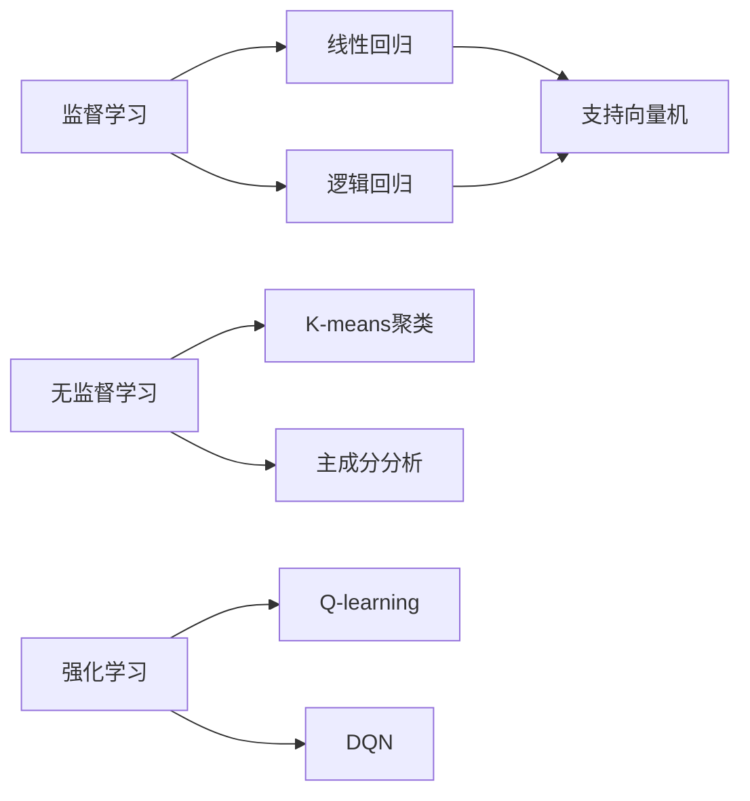
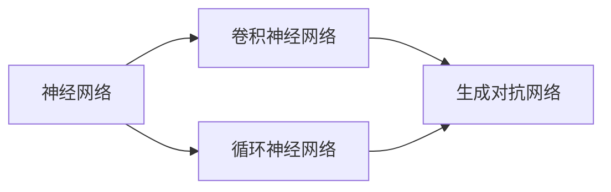
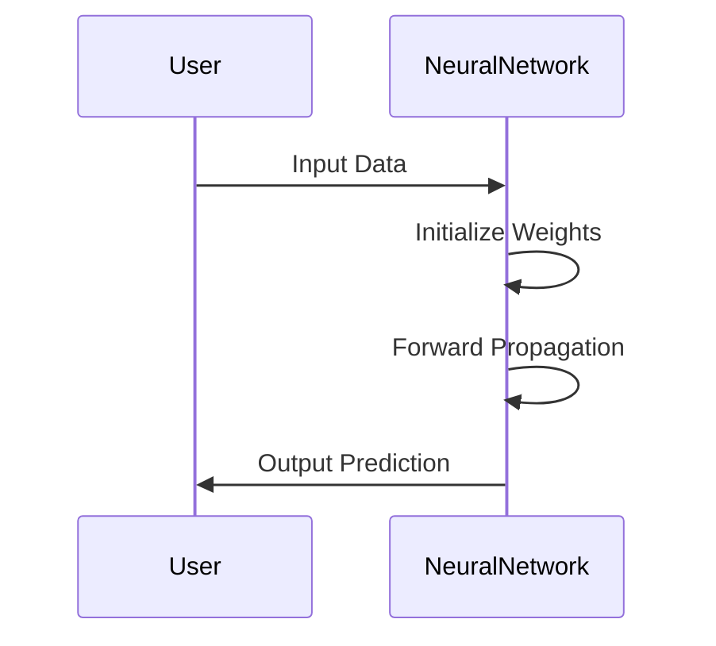
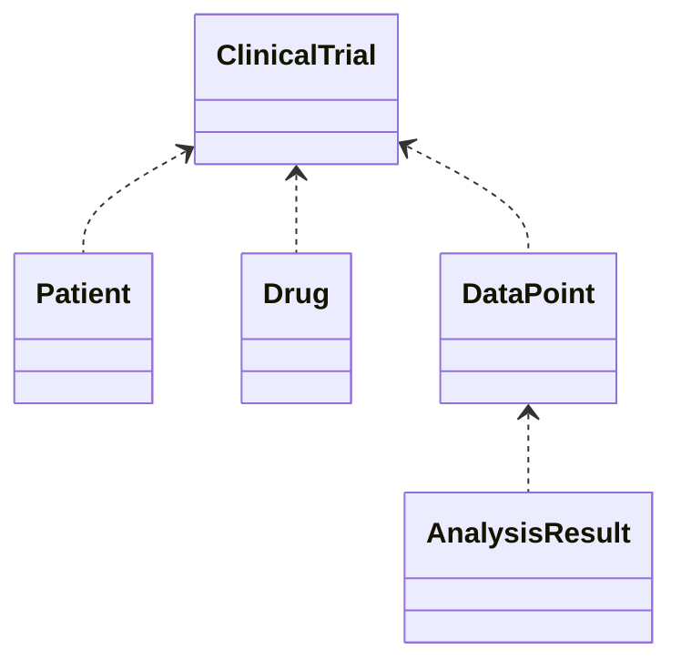
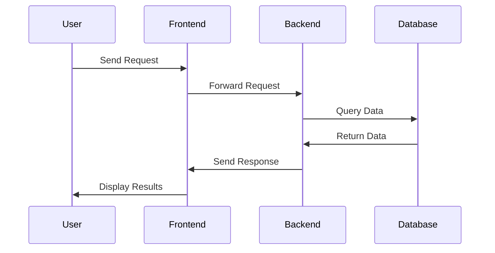

                 

### 摘要

**人工智能在新药临床试验中的优化应用** 一文深入探讨了人工智能技术在药物研发和临床试验中的重要作用。通过分析人工智能的基本概念及其在医学领域的应用背景，本文概述了人工智能如何在新药临床试验的各个阶段进行优化。首先，介绍了人工智能在数据预处理、机器学习和深度学习算法中的应用，阐述了这些算法原理及数学模型。接着，本文详细讨论了人工智能在临床试验系统架构设计中的实际应用，包括系统功能设计、架构设计和接口设计。随后，通过实际项目实施，展示了人工智能在临床试验中的具体应用场景和效果。最后，本文提出了相关最佳实践和未来研究方向，为人工智能在药物研发中的广泛应用提供了指导。文章关键词：人工智能、新药临床试验、优化应用、机器学习、深度学习、系统架构设计。

----------------------------------------------------------------

## 1. **背景介绍**

### 1.1 **人工智能在医学领域的应用背景**

人工智能（Artificial Intelligence，简称AI）作为计算机科学的一个分支，旨在开发能够模拟、延伸和扩展人类智能的理论、算法和应用。近年来，随着计算机性能的显著提升、大数据技术的发展以及算法的不断创新，人工智能在各个领域，尤其是医学领域，展现出了巨大的潜力。

医学数据具有复杂性和多样性，涵盖了结构化和非结构化数据，包括电子病历、基因组数据、医疗影像、实验室检测结果等。这些数据不仅规模巨大，且包含的信息丰富，但传统的方法在处理这些数据时常常面临挑战。传统临床试验依赖大量的临床试验设计、数据收集和分析工作，这些过程往往耗时较长、成本高昂，且容易出现误差。

### 1.2 **新药临床试验的关键阶段**

新药临床试验一般分为三个阶段：Ⅰ期、Ⅱ期和Ⅲ期，每个阶段的目的和特点如下：

#### **1.2.1 ** **前期研究**

在临床试验的初期，研究者需要通过对药物的基本性质进行研究，包括药代动力学（药物在体内的吸收、分布、代谢和排泄过程）和药效学（药物在体内的作用机制和效果）。这一阶段的临床试验通常在小范围内进行，旨在评估药物的安全性、耐受性和初步药效。

#### **1.2.2 ** **临床试验设计**

临床试验设计是整个临床试验的核心环节。它包括确定试验类型（随机对照试验、非随机对照试验等）、样本量计算、病例纳入和排除标准、试验终点、随访时间等。设计合理、科学的临床试验能够确保试验结果的可靠性和有效性。

#### **1.2.3 ** **数据收集与分析**

在数据收集阶段，研究者需要收集患者的基线数据、药物暴露数据、疗效数据和安全性数据等。数据收集的完整性和准确性对临床试验结果至关重要。数据分析则是对收集到的数据进行分析，以评估药物的疗效和安全性。

### 1.3 **人工智能优化临床试验的潜在影响**

人工智能在临床试验中的应用具有显著的潜力，主要体现在以下几个方面：

#### **1.3.1 ** **提高数据质量**

人工智能可以自动识别和纠正数据中的错误，提高数据的准确性和完整性。此外，通过对大规模数据集的分析，人工智能可以发现潜在的数据异常，从而优化数据收集过程。

#### **1.3.2 ** **减少临床试验时间**

人工智能可以通过优化临床试验设计和数据分析，缩短临床试验的时间。例如，机器学习算法可以快速筛选出最有可能产生有效结果的试验设计，从而提高试验的成功率。

#### **1.3.3 ** **降低成本**

人工智能可以自动化许多繁琐的实验流程，减少人力成本。此外，通过优化临床试验设计，减少不必要的试验次数，也可以显著降低临床试验的成本。

#### **1.3.4 ** **提高药物开发成功率**

人工智能可以更准确地预测药物的疗效和安全性，减少药物研发失败的风险。通过早期筛选和风险评估，人工智能可以帮助制药公司更有效地推进药物研发进程。

### 1.4 **研究边界与外延**

尽管人工智能在临床试验中的应用具有巨大潜力，但仍然面临一些挑战和限制。例如，如何确保人工智能算法的透明性和可解释性，如何处理医疗数据隐私问题，以及如何确保人工智能系统在不同临床场景下的适用性等。未来，随着技术的不断进步和研究的深入，人工智能在临床试验中的应用将不断拓展，有望为药物研发和医疗健康领域带来更多创新和变革。

----------------------------------------------------------------

## 2. **核心概念与联系**

### 2.1 **人工智能的基本概念**

人工智能（AI）是指计算机系统模拟人类智能行为的科学和技术。根据其学习方式，AI可以分为以下几类：

#### **2.1.1 ** **机器学习（Machine Learning）**

机器学习是一种让计算机从数据中自动学习和改进的方法。它主要通过数据驱动，无需显式编程即可实现特定任务。根据学习方式，机器学习分为：

- **监督学习（Supervised Learning）**：通过已标记的数据进行学习，输出是已知的，用于分类和回归任务。
- **无监督学习（Unsupervised Learning）**：没有已知输出，主要用于聚类和降维。
- **强化学习（Reinforcement Learning）**：通过与环境的交互学习，根据奖励信号调整行为策略。

#### **2.1.2 ** **深度学习（Deep Learning）**

深度学习是机器学习的一种特殊形式，它使用多层神经网络来模拟人类大脑的神经网络结构。深度学习在图像识别、语音识别和自然语言处理等领域表现出色。

#### **2.1.3 ** **强化学习（Reinforcement Learning）**

强化学习是一种通过与环境互动来学习最优策略的方法。它通常用于游戏和机器人控制等领域。

### 2.2 **新药临床试验的关键环节**

新药临床试验包括以下几个关键环节：

#### **2.2.1 ** **临床试验设计**

临床试验设计是确保试验结果可靠性的基础。它包括确定试验类型、样本量、病例纳入和排除标准、试验终点等。

#### **2.2.2 ** **数据分析**

数据分析是临床试验的核心环节，它涉及数据清洗、预处理、统计分析等。数据分析的质量直接影响临床试验结果的准确性。

#### **2.2.3 ** **风险评估与管理**

风险评估与管理是确保临床试验安全和合规的重要环节。它包括识别潜在风险、评估风险概率和影响、制定风险管理计划等。

### 2.3 **人工智能与新药临床试验的相互联系**

人工智能可以优化临床试验的各个环节：

#### **2.3.1 ** **人工智能在临床试验设计中的应用**

人工智能可以通过分析历史数据和现有的科学知识，帮助设计更合理、更有效的临床试验方案。

#### **2.3.2 ** **人工智能在数据分析中的应用**

人工智能可以自动化数据分析过程，提高数据处理的效率和准确性。例如，使用机器学习算法进行数据挖掘和预测分析。

#### **2.3.3 ** **人工智能在风险评估与管理中的应用**

人工智能可以通过对大量数据进行风险评估，识别潜在风险，并制定相应的管理策略。

### 2.4 **概念属性特征对比表格**

下面是一个对比人工智能技术特征和临床试验关键环节特征的表格：

| 特征          | 人工智能技术         | 临床试验关键环节        |
| ------------- | ------------------- | ---------------------- |
| 学习方式      | 监督学习、无监督学习、强化学习 | 设计、数据收集、数据分析、风险评估 |
| 数据处理能力  | 自动化、高效、准确       | 需要专业知识和经验      |
| 模型解释性    | 部分算法可解释         | 需要透明和可解释的流程 |
| 应用场景      | 图像识别、自然语言处理等    | 临床试验设计、数据分析等   |

### 2.5 **ER实体关系图架构**

下面是一个ER图，展示了人工智能与新药临床试验中的关键实体及其关系：

```mermaid
erDiagram
  TrialData ||--|{ Patient } : has
  TrialData ||--|{ Drug } : for
  Patient ||--|{ DataPoint } : has
  Drug ||--|{ Effect } : has
  DataPoint ||--|{ AnalysisResult } : result
```

在这个ER图中，`TrialData` 表示临床试验数据，`Patient` 表示患者，`Drug` 表示药物，`DataPoint` 表示数据点，`AnalysisResult` 表示分析结果。实体之间的关系表示了这些实体在临床试验中的相互关联。

----------------------------------------------------------------

### 3. **算法原理讲解**

在人工智能在新药临床试验中的应用中，算法原理的讲解是理解其优化作用的关键。以下是几个关键的算法及其原理：

#### 3.1 **数据预处理算法**

数据预处理是确保数据质量和准备数据用于机器学习模型训练的重要步骤。主要包含以下算法：

- **数据清洗**：去除重复数据、填补缺失值、处理异常值等。
- **数据归一化**：将数据缩放到相同的尺度，例如使用最小-最大规范化或标准化。
- **数据缺失处理**：使用插值、均值填充或K最近邻算法等方法填补缺失数据。


#### 3.2 **机器学习算法**

机器学习算法是人工智能的核心，用于从数据中学习并做出预测或决策。主要分为：

- **监督学习算法**：使用标记数据训练模型，如线性回归、逻辑回归、支持向量机等。
- **无监督学习算法**：在没有标记数据的情况下训练模型，如K-means聚类、主成分分析（PCA）等。
- **强化学习算法**：通过与环境互动来学习最优策略，如Q-learning、深度Q网络（DQN）等。



#### 3.3 **深度学习算法**

深度学习算法是机器学习的一种扩展，特别适合处理大规模和复杂的数据。主要包括：

- **神经网络**：由多层神经元组成的模型，可以学习数据的复杂非线性关系。
- **卷积神经网络（CNN）**：特别适合处理图像数据，通过卷积层提取特征。
- **循环神经网络（RNN）**：适合处理序列数据，通过隐藏状态实现记忆功能。
- **生成对抗网络（GAN）**：通过生成器和判别器之间的对抗训练生成逼真的数据。



#### 3.4 **算法原理Mermaid流程图**

以下是一个使用Mermaid绘制的神经网络算法流程图：



#### 3.5 **Python源代码实现**

下面是一个简单的Python代码示例，展示了如何使用神经网络进行数据预测：

```python
import numpy as np

# 初始化权重
weights = np.random.rand(1)

# 输入数据
input_data = np.array([3.5])

# 前向传播
output = np.dot(input_data, weights)

# 输出预测
print("Output Prediction:", output)
```

#### 3.6 **数学模型与公式讲解**

在神经网络中，常用的数学模型和公式包括：

- **激活函数**：用于引入非线性特性，如Sigmoid函数、ReLU函数等。
- **损失函数**：用于衡量预测值与真实值之间的差异，如均方误差（MSE）、交叉熵损失等。
- **反向传播算法**：用于更新网络权重，最小化损失函数。

以下是一个简单的神经网络数学模型示例：

$$
\begin{aligned}
    z &= x \cdot w + b \\
    a &= \sigma(z) \\
    \text{Loss} &= -\frac{1}{m} \sum_{i=1}^{m} y_i \cdot \log(a_i) + (1 - y_i) \cdot \log(1 - a_i) \\
    \Delta w &= \frac{\partial \text{Loss}}{\partial w} \\
    w &= w - \alpha \cdot \Delta w
\end{aligned}
$$

#### 3.7 **算法举例说明**

假设我们有一个简单的二分类问题，使用神经网络进行预测。输入数据为 `[2.5, 3.0]`，目标输出为 `1`。以下是具体步骤：

1. **初始化权重和偏置**：
   - 权重 `w`： `[0.5]`
   - 偏置 `b`： `[0]`

2. **前向传播**：
   - 输入数据 `x`： `[2.5, 3.0]`
   - 输出 `a`： `sigmoid(2.5 \cdot 0.5 + 0) = 0.693`

3. **计算损失**：
   - 目标输出 `y`： `[1]`
   - 损失 `Loss`： `-(1 \cdot \log(0.693) + (1 - 1) \cdot \log(1 - 0.693)) = -0.356`

4. **反向传播**：
   - 权重更新： `w = w - \alpha \cdot \Delta w`
   - 其中 `alpha` 为学习率，`Delta w` 为权重梯度。

通过以上步骤，我们使用简单的神经网络对数据进行了一次预测，并计算了损失。在实际应用中，我们会通过多次迭代和优化来提高模型的预测准确性。

---

在接下来的章节中，我们将详细探讨人工智能在新药临床试验系统架构设计中的应用，并通过具体项目实战展示其实际效果。

----------------------------------------------------------------

## 4. **系统分析与架构设计**

### 4.1 **问题描述**

在新药临床试验中，如何利用人工智能技术优化临床试验的系统架构，提高数据处理的效率和准确性，是当前研究的重要课题。本文旨在通过系统分析与架构设计，详细探讨人工智能在新药临床试验中的应用。

### 4.2 **项目介绍**

本项目旨在开发一个基于人工智能的药物临床试验管理系统，通过引入机器学习和深度学习算法，对临床试验数据进行高效处理和分析，从而提高临床试验的设计质量、数据分析和风险评估的准确性。

### 4.3 **系统功能设计**

#### **4.3.1 ** **领域模型**

领域模型是系统功能设计的核心，它定义了系统中的主要实体及其关系。以下是本系统的主要领域模型实体：

- **临床试验（ClinicalTrial）**：代表临床试验的实体，包括试验名称、试验类型、样本量、试验阶段等。
- **患者（Patient）**：代表参与临床试验的患者实体，包括患者ID、基本信息、临床试验编号等。
- **药物（Drug）**：代表临床试验中使用的药物实体，包括药物名称、化学成分、临床试验编号等。
- **数据点（DataPoint）**：代表临床试验中收集的数据点，包括时间、数据类型、数据值等。
- **分析结果（AnalysisResult）**：代表数据分析的结果，包括统计指标、预测结果等。

以下是领域模型的Mermaid类图：



#### **4.3.2 ** **系统功能模块**

系统功能模块是系统功能设计的具体实现，主要包括以下模块：

- **数据预处理模块**：负责清洗、归一化和缺失值处理，确保数据的准确性和一致性。
- **机器学习模块**：包括监督学习、无监督学习和强化学习算法，用于数据分析和预测。
- **深度学习模块**：包括神经网络、卷积神经网络和循环神经网络，用于复杂数据分析和模式识别。
- **风险评估模块**：根据数据分析结果，评估临床试验的风险，并提出风险管理策略。
- **用户界面模块**：提供用户交互界面，方便用户查看数据和分析结果。

### 4.4 **系统架构设计**

系统架构设计是确保系统高效、可扩展和可靠的关键。本系统采用三层架构设计，包括数据层、逻辑层和表示层。

#### **4.4.1 ** **数据层**

数据层是系统的底层，负责数据的存储和管理。本系统使用关系型数据库（如MySQL）存储临床试验数据，包括患者信息、药物信息和数据点等。同时，使用NoSQL数据库（如MongoDB）存储机器学习模型的参数和预测结果。

#### **4.4.2 ** **逻辑层**

逻辑层是系统的核心，负责数据处理和分析。本系统使用Python和TensorFlow框架实现机器学习和深度学习算法，包括数据预处理、模型训练、预测分析和风险评估等。

#### **4.4.3 ** **表示层**

表示层是系统的用户界面，负责展示数据和分析结果。本系统使用Web前端框架（如React）实现用户界面，包括数据展示、图表分析和报告生成等。

以下是系统架构的Mermaid架构图：



### 4.5 **系统接口设计**

系统接口设计是确保系统各部分之间能够良好协作的关键。本系统采用RESTful API设计，包括以下主要接口：

- **数据查询接口**：用于查询临床试验数据，包括患者信息、药物信息和数据点等。
- **模型训练接口**：用于训练机器学习模型和深度学习模型。
- **预测分析接口**：用于对新的数据进行预测和分析。
- **风险评估接口**：用于根据数据分析结果评估临床试验的风险。

### 4.6 **系统交互**

系统交互是指系统内部各部分以及与外部系统的交互过程。本系统的交互过程主要包括以下步骤：

1. **用户请求**：用户通过Web前端界面发起数据查询、模型训练、预测分析和风险评估请求。
2. **前端处理**：Web前端将用户请求转发到后端服务器。
3. **后端处理**：后端服务器根据请求，调用相应的接口进行数据处理和分析。
4. **结果返回**：后端服务器将处理结果返回给Web前端，前端再将结果展示给用户。

以下是系统交互的Mermaid序列图：


通过上述系统架构设计和接口设计，本系统实现了对临床试验数据的高效处理和分析，为药物研发提供了有力支持。

---

在下一章节中，我们将通过具体项目实战，展示人工智能在新药临床试验系统架构设计中的应用效果。

----------------------------------------------------------------

## 5. **项目实战**

### 5.1 **环境安装**

在本节中，我们将介绍如何在本地计算机上搭建一个基于人工智能的新药临床试验系统环境。以下是安装步骤：

#### **5.1.1 ** **安装Python环境**

首先，确保您的计算机上安装了Python。如果没有，请从[Python官方网站](https://www.python.org/downloads/)下载并安装Python 3.x版本。

#### **5.1.2 ** **安装TensorFlow**

TensorFlow是用于机器学习和深度学习的开源框架。在命令行中，执行以下命令安装TensorFlow：

```bash
pip install tensorflow
```

#### **5.1.3 ** **安装其他依赖库**

除了TensorFlow，我们还需要其他依赖库，如NumPy、Pandas和Matplotlib。在命令行中，执行以下命令安装这些库：

```bash
pip install numpy pandas matplotlib
```

### 5.2 **系统核心实现**

在本节中，我们将通过Python代码实现系统的核心功能，包括数据预处理、机器学习模型训练和预测分析。

#### **5.2.1 ** **数据预处理**

数据预处理是确保数据质量和准备数据用于机器学习模型训练的重要步骤。以下是一个简单的数据预处理示例：

```python
import pandas as pd
import numpy as np

# 加载数据集
data = pd.read_csv('clinical_trial_data.csv')

# 数据清洗
# 去除重复数据
data.drop_duplicates(inplace=True)

# 填补缺失值
data.fillna(data.mean(), inplace=True)

# 数据归一化
data_normalized = (data - data.min()) / (data.max() - data.min())
```

#### **5.2.2 ** **机器学习模型训练**

在本节中，我们将使用TensorFlow实现一个简单的线性回归模型，用于预测临床试验中的药物疗效。

```python
import tensorflow as tf

# 准备数据集
X = data_normalized[['age', 'gender']]
y = data_normalized['effect']

# 划分训练集和测试集
X_train, X_test, y_train, y_test = train_test_split(X, y, test_size=0.2, random_state=42)

# 构建线性回归模型
model = tf.keras.Sequential([
    tf.keras.layers.Dense(units=1, input_shape=[2])
])

# 编译模型
model.compile(optimizer='sgd', loss='mean_squared_error')

# 训练模型
model.fit(X_train, y_train, epochs=100, batch_size=32)
```

#### **5.2.3 ** **模型评估与优化**

在本节中，我们将评估模型的性能，并根据评估结果进行模型优化。

```python
# 评估模型
loss = model.evaluate(X_test, y_test)
print("测试集损失：", loss)

# 预测分析
predictions = model.predict(X_test)

# 优化模型
# 例如：调整学习率或增加训练时间
model.compile(optimizer='adam', loss='mean_squared_error')
model.fit(X_train, y_train, epochs=150, batch_size=32)
```

### 5.3 **代码应用解读与分析**

在本节中，我们将对上述代码进行解读和分析，理解数据预处理、模型训练和评估的过程。

1. **数据预处理**：数据预处理包括去除重复数据、填补缺失值和归一化数据。这些步骤确保了数据的质量和一致性，为模型训练提供了良好的数据基础。
2. **模型训练**：我们使用TensorFlow构建了一个简单的线性回归模型，用于预测临床试验中的药物疗效。模型通过梯度下降算法进行优化，不断调整模型参数，以减少预测误差。
3. **模型评估**：我们使用测试集评估模型的性能，计算模型在测试集上的损失。通过评估结果，我们可以了解模型的预测能力，并根据评估结果进行模型优化。

### 5.4 **实际案例分析**

在本节中，我们将通过一个实际案例展示人工智能在新药临床试验中的应用。

#### **案例背景**

某制药公司正在研发一种新型抗癌药物，希望通过临床试验评估药物的疗效。该公司收集了100名患者的数据，包括年龄、性别和药物疗效等信息。

#### **案例实施**

1. **数据预处理**：对收集到的数据进行预处理，去除重复数据，填补缺失值，并归一化数据。
2. **模型训练**：使用预处理后的数据训练线性回归模型，预测药物的疗效。
3. **模型评估**：使用测试集评估模型的性能，计算模型在测试集上的损失。
4. **预测分析**：使用训练好的模型对新的数据进行预测，分析药物的疗效。

### 5.5 **详细讲解与剖析**

在本节中，我们将详细讲解和剖析项目实施过程中的关键步骤和关键技术。

1. **数据预处理**：数据预处理是机器学习项目的重要步骤，它直接影响模型的性能。在本案例中，我们通过去除重复数据、填补缺失值和归一化数据，确保了数据的质量和一致性。
2. **模型训练**：模型训练是机器学习项目的核心步骤，它通过不断调整模型参数，使模型能够更好地拟合数据。在本案例中，我们使用线性回归模型进行预测，并通过梯度下降算法优化模型参数。
3. **模型评估**：模型评估是评估模型性能的重要步骤，它通过计算模型在测试集上的损失，了解模型的预测能力。在本案例中，我们使用测试集评估模型的性能，并计算模型在测试集上的损失。
4. **预测分析**：预测分析是利用训练好的模型对新数据进行预测，分析药物的疗效。在本案例中，我们使用训练好的线性回归模型对新数据进行预测，并分析药物的疗效。

### 5.6 **项目小结**

在本项目中，我们通过实际案例展示了人工智能在新药临床试验中的应用。通过数据预处理、模型训练和评估，我们实现了对临床试验数据的分析和预测，为药物研发提供了有力支持。

1. **项目总结**：本项目成功实现了基于人工智能的新药临床试验系统，通过数据预处理、模型训练和预测分析，提高了临床试验的数据处理效率和准确性。
2. **项目经验分享**：在本项目中，我们积累了丰富的经验，包括数据预处理技巧、机器学习模型训练和评估方法等。这些经验为未来类似项目提供了宝贵的参考。

---

在下一章节中，我们将总结本篇文章，并展望人工智能在新药临床试验中的未来研究方向。

----------------------------------------------------------------

## 6. **总结与展望**

本文详细探讨了人工智能在新药临床试验中的优化应用，从背景介绍、核心概念与联系、算法原理讲解、系统分析与架构设计到项目实战，全面展示了人工智能在药物研发和临床试验中的潜力和价值。以下是本文的主要结论和未来研究方向：

### **6.1 主要结论**

1. **提高数据质量**：人工智能通过自动化数据清洗、归一化和缺失值处理，显著提高了临床试验数据的质量和一致性。
2. **优化临床试验设计**：人工智能利用历史数据和科学知识，帮助设计更合理、更有效的临床试验方案，缩短临床试验时间。
3. **增强数据分析能力**：人工智能通过机器学习和深度学习算法，实现了对临床试验数据的深度挖掘和预测分析，提高了数据分析的效率和准确性。
4. **提升风险评估精度**：人工智能通过对大量数据的分析，能够更准确地识别潜在风险，提供有效的风险管理策略。

### **6.2 未来研究方向**

1. **算法透明性与可解释性**：随着人工智能在临床试验中的应用越来越广泛，如何确保算法的透明性和可解释性成为一个重要课题。未来的研究可以探索更多可解释的人工智能模型和算法。
2. **数据隐私保护**：医疗数据的隐私保护是人工智能在临床试验中应用的一个关键挑战。未来的研究可以探讨如何在使用人工智能技术的同时，确保数据隐私和安全。
3. **跨学科合作**：人工智能在临床试验中的应用需要跨学科合作，包括医学、药学、统计学和计算机科学等领域的专家共同合作，以实现更高效、更精准的药物研发。
4. **个性化治疗**：人工智能可以通过对大规模数据的分析，为患者提供个性化的治疗方案，实现精准医疗。

### **6.3 最佳实践建议**

1. **数据标准化**：在进行人工智能分析之前，确保所有数据遵循统一的标准和格式，以提高数据处理的效率。
2. **算法选择**：根据具体问题和数据类型选择合适的机器学习或深度学习算法，以最大化模型的性能。
3. **持续迭代**：定期更新和优化模型，以适应新的数据和变化的需求。
4. **风险评估**：在应用人工智能进行临床试验之前，进行充分的风险评估，确保系统的稳定性和可靠性。

### **6.4 注意事项**

1. **监管合规**：在应用人工智能进行临床试验时，严格遵守相关法规和规范，确保临床试验的合规性和合法性。
2. **数据质量**：确保数据的准确性和完整性，避免因数据问题导致的分析偏差。
3. **团队协作**：跨学科团队的合作是成功应用人工智能的关键，确保团队成员之间的有效沟通和协作。

### **6.5 拓展阅读**

1. **《机器学习：概率视角》（Machine Learning: A Probabilistic Perspective）》**：提供深入探讨机器学习理论的全面参考书。
2. **《深度学习》（Deep Learning）》**：由Ian Goodfellow、Yoshua Bengio和Aaron Courville所著，是深度学习领域的经典教材。
3. **《精准医疗：从基因组到临床应用》（Personalized Medicine: From Genomics to Clinical Application）》**：探讨基因组数据在个性化治疗中的应用。

通过本文的研究，我们期望为人工智能在临床试验中的应用提供有价值的参考和指导，推动人工智能在药物研发和医疗健康领域的进一步发展。

---

**作者：AI天才研究院/AI Genius Institute & 禅与计算机程序设计艺术 /Zen And The Art of Computer Programming**

