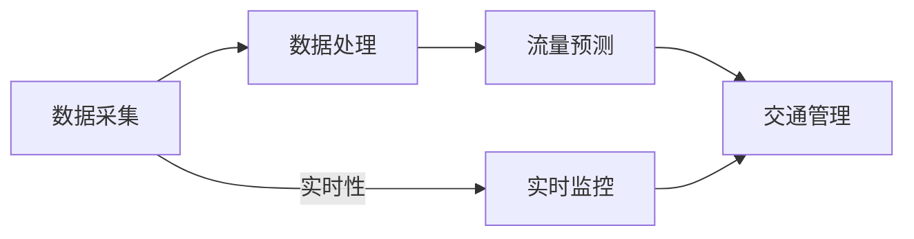
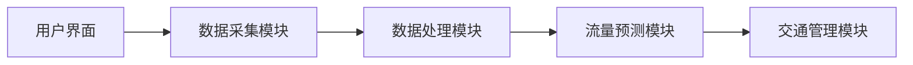
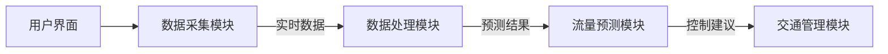

                 

# 人工智能在智慧交通流量预测中的应用

## 关键词：智慧交通、流量预测、人工智能、深度学习、算法应用

## 摘要

本文旨在深入探讨人工智能在智慧交通流量预测中的应用，分析其核心概念、技术原理、应用现状及未来发展趋势。文章首先介绍了智慧交通的定义和重要性，以及交通流量预测的基本概念和挑战。接着，我们重点探讨了人工智能，包括机器学习、深度学习和强化学习等技术的基础原理及其在交通流量预测中的应用。随后，文章详细分析了数据处理与特征提取的方法，介绍了各类机器学习算法和深度学习算法在交通流量预测中的应用，并给出了具体的算法原理和数学模型。最后，文章通过系统分析与架构设计方案，展示了一个智慧交通流量预测系统的整体框架，并通过项目实战和案例分析，阐述了人工智能在智慧交通流量预测中的实际应用和价值。希望通过本文的探讨，能够为相关领域的研究者和从业者提供有价值的参考。

## 目录大纲

----------------------------------------------------------------

## 第一部分: 引言

### 1.1 引言

#### 1.1.1 问题背景

- **智慧交通的定义和重要性**
- **交通流量预测的意义**
- **人工智能在交通流量预测中的应用现状**

#### 1.1.2 核心概念与联系

- **人工智能概述**
  - **定义**
  - **发展历程**
  - **主要应用领域**
- **智慧交通概述**
  - **定义**
  - **构成要素**
  - **技术发展**
- **交通流量预测**
  - **定义**
  - **模型分类**
  - **挑战与机遇**

#### 1.1.3 书籍结构概述

- **全书内容安排**
  - **每章主要内容**
  - **各章节关联与逻辑结构**

#### 1.1.4 目标读者与阅读建议

- **目标读者**
  - **交通工程师**
  - **人工智能开发者**
  - **交通管理从业人员**
- **阅读建议**
  - **系统性学习**
  - **结合实际案例**

----------------------------------------------------------------

## 第二部分: 人工智能技术基础

### 2.1 人工智能技术基础

#### 2.1.1 人工智能的基本原理

- **机器学习**
  - **定义**
  - **基本概念**
  - **常见算法**
- **深度学习**
  - **定义**
  - **基本概念**
  - **网络结构**
- **强化学习**
  - **定义**
  - **应用场景**
  - **算法原理**

#### 2.1.2 数据处理与特征提取

- **数据预处理**
  - **数据清洗**
    - **缺失值处理**
    - **异常值处理**
  - **数据归一化**
    - **常用方法**
    - **优缺点**
- **特征提取**
  - **时域特征**
  - **频域特征**

#### 2.1.3 机器学习算法在交通流量预测中的应用

- **监督学习算法**
  - **线性回归**
  - **支持向量机**
- **非监督学习算法**
  - **聚类算法**
  - **维度降维**
- **深度学习算法在交通流量预测中的应用**
  - **卷积神经网络**
  - **循环神经网络**
  - **递归神经网络**

----------------------------------------------------------------

### 1.1 问题背景

#### 1.1.1 智慧交通的定义和重要性

智慧交通是指利用信息技术、物联网、人工智能等先进技术，对交通系统进行智能化管理，以实现高效、安全、环保的交通运输。智慧交通不仅包括交通信息采集、传输、处理和共享，还包括交通规划、交通控制和交通服务等各个层面。随着城市化进程的加快，交通拥堵、事故频发、环境污染等问题日益严重，智慧交通的兴起为解决这些问题提供了新的思路和方法。

智慧交通的重要性主要体现在以下几个方面：

1. **提高交通效率**：通过实时交通信息采集和智能交通控制，可以有效地减少交通拥堵，提高道路通行能力，降低交通事故发生率。
2. **保障交通安全**：智慧交通系统可以实时监控道路状况，预测潜在的安全隐患，提前采取措施，从而降低交通事故的发生概率。
3. **减少环境污染**：通过优化交通流量，减少车辆排放，有助于降低城市空气质量，改善生态环境。
4. **提升城市管理水平**：智慧交通系统可以为政府决策提供科学依据，提高城市交通管理的智能化水平，提升城市整体形象。

#### 1.1.2 交通流量预测的意义

交通流量预测是智慧交通系统的核心组成部分，其主要目标是通过对历史交通数据的分析和建模，预测未来一段时间内的交通流量变化，为交通管理和控制提供科学依据。交通流量预测的意义主要体现在以下几个方面：

1. **优化交通资源配置**：通过对交通流量进行预测，可以合理调配道路资源，避免交通拥堵，提高道路通行效率。
2. **改善交通管理**：通过预测交通流量，可以提前制定交通管理措施，如调整交通信号灯时序、优化公交线路等，提高交通管理的精准度和有效性。
3. **减少交通事故**：通过预测交通流量，可以提前发现潜在的交通事故风险，采取预防措施，减少交通事故的发生。
4. **提高交通出行体验**：通过预测交通流量，可以为出行者提供准确的出行信息，帮助他们选择最佳出行路线，减少等待时间和出行成本。

#### 1.1.3 人工智能在交通流量预测中的应用现状

随着人工智能技术的快速发展，其在交通流量预测中的应用也日益广泛。目前，人工智能在交通流量预测中的应用主要体现在以下几个方面：

1. **数据处理与特征提取**：通过机器学习和深度学习技术，对交通数据进行处理和特征提取，提高预测精度。
2. **模型建立与优化**：利用神经网络、支持向量机、聚类算法等机器学习算法，建立交通流量预测模型，并对模型进行优化和调整。
3. **智能交通控制**：通过深度学习算法，实现交通流量的实时监控和预测，为智能交通控制系统提供决策支持。
4. **交通态势分析**：利用大数据分析和人工智能技术，对交通态势进行实时分析和预测，为交通管理和规划提供科学依据。

然而，尽管人工智能在交通流量预测中具有广泛的应用前景，但仍面临一些挑战，如数据质量、模型复杂度、实时性等。因此，未来还需要进一步研究和优化，以实现人工智能在交通流量预测中的更大价值。

----------------------------------------------------------------

### 1.2 核心概念与联系

#### 1.2.1 人工智能概述

##### 1.2.1.1 定义

人工智能（Artificial Intelligence，简称AI）是指模拟、延伸和扩展人类智能的理论、方法、技术及应用。它涉及计算机科学、认知科学、心理学、神经科学等多个领域。

##### 1.2.1.2 发展历程

- **早期探索（1956年-1974年）**：人工智能概念提出，主要关注符号主义和推理机制的研究。
- **繁荣期（1980年-1987年）**：专家系统的兴起，使人工智能在医疗、工业等领域得到广泛应用。
- **低谷期（1988年-1993年）**：由于过高的期望和实际应用的差距，人工智能进入低谷期。
- **复兴期（1994年至今）**：随着计算机性能的提升、大数据和深度学习的发展，人工智能迎来新一轮的繁荣。

##### 1.2.1.3 主要应用领域

- **自然语言处理**：包括语音识别、机器翻译、文本分析等。
- **计算机视觉**：包括图像识别、目标检测、人脸识别等。
- **自动驾驶**：利用计算机视觉、传感器数据和深度学习算法实现。
- **智能客服**：利用自然语言处理和机器学习技术，为用户提供智能化的服务。
- **医疗诊断**：利用深度学习技术，辅助医生进行疾病诊断。

#### 1.2.2 智慧交通概述

##### 1.2.2.1 定义

智慧交通是指利用信息技术、物联网、人工智能等先进技术，对交通系统进行智能化管理，以实现高效、安全、环保的交通运输。

##### 1.2.2.2 构成要素

- **基础设施**：包括道路、桥梁、隧道、交通信号灯等。
- **信息采集与传输**：利用传感器、摄像头、GPS等技术，实时采集交通数据，并通过网络传输。
- **数据处理与分析**：利用大数据分析和人工智能技术，对交通数据进行分析和处理，为交通管理和控制提供支持。
- **智能交通控制**：利用人工智能技术，实现交通信号的智能控制、车辆的智能调度等。

##### 1.2.2.3 技术发展

- **感知层**：利用传感器、摄像头等设备，实时采集道路信息。
- **传输层**：利用物联网技术，实现数据的传输和共享。
- **处理层**：利用大数据分析和人工智能技术，对交通数据进行分析和处理。
- **应用层**：包括智能交通信号控制、智能导航、自动驾驶等。

#### 1.2.3 交通流量预测

##### 1.2.3.1 定义

交通流量预测是指利用历史交通数据和人工智能技术，对未来一段时间内的交通流量变化进行预测。

##### 1.2.3.2 模型分类

- **基于统计模型的预测方法**：包括时间序列分析、回归分析等。
- **基于机器学习模型的预测方法**：包括线性回归、支持向量机、决策树、神经网络等。
- **基于深度学习模型的预测方法**：包括卷积神经网络、循环神经网络、递归神经网络等。

##### 1.2.3.3 挑战与机遇

- **挑战**：
  - 数据质量问题：交通数据存在噪声、缺失、异常等问题，影响预测精度。
  - 模型复杂度：深度学习模型具有较高的复杂度，需要大量的计算资源和训练时间。
  - 实时性要求：交通流量预测需要实时性，以满足交通管理和控制的需求。

- **机遇**：
  - 数据来源多样化：随着物联网、大数据技术的发展，交通数据的来源更加多样化，有助于提高预测精度。
  - 模型优化与改进：通过不断的研究和优化，可以提升交通流量预测的准确性。
  - 智能交通系统的发展：智慧交通系统的建设为交通流量预测提供了广阔的应用场景。

#### 1.2.4 书籍结构概述

##### 1.2.4.1 全书内容安排

- **第1部分：引言**：介绍智慧交通和交通流量预测的背景、意义和应用现状。
- **第2部分：人工智能技术基础**：介绍人工智能的基本原理、数据处理与特征提取、机器学习算法等。
- **第3部分：交通流量预测模型与方法**：介绍交通流量预测的常用模型和方法，包括统计模型、机器学习模型和深度学习模型。
- **第4部分：智慧交通流量预测系统设计与实现**：介绍智慧交通流量预测系统的整体架构、模块设计、算法实现等。
- **第5部分：案例分析**：通过实际案例，展示人工智能在交通流量预测中的应用效果和经验教训。

##### 1.2.4.2 各章节关联与逻辑结构

- **第1部分**：为后续章节的讨论提供背景和基础。
- **第2部分**：介绍人工智能技术，为交通流量预测模型的设计和实现提供支持。
- **第3部分**：介绍交通流量预测的常用模型和方法，为实际应用提供指导。
- **第4部分**：结合第2和第3部分的内容，介绍智慧交通流量预测系统的设计、实现和部署。
- **第5部分**：通过案例分析，验证智慧交通流量预测系统的效果，为实际应用提供参考。

#### 1.2.5 目标读者与阅读建议

##### 1.2.5.1 目标读者

- **交通工程师**：了解人工智能在交通流量预测中的应用，提升交通管理能力。
- **人工智能开发者**：掌握交通流量预测的相关技术和方法，应用于实际项目中。
- **交通管理从业人员**：了解智慧交通流量预测系统的原理和架构，提升交通管理效率。

##### 1.2.5.2 阅读建议

- **系统性学习**：建议按照章节顺序，系统性地学习，有助于理解各个部分之间的联系。
- **结合实际案例**：在学习过程中，结合实际案例进行分析和讨论，有助于深入理解。
- **实践操作**：通过实际操作，熟悉相关工具和软件的使用，提高实践能力。

----------------------------------------------------------------

## 第二部分: 人工智能技术基础

### 2.1 人工智能技术基础

#### 2.1.1 人工智能的基本原理

##### 2.1.1.1 机器学习

###### 2.1.1.1.1 定义

机器学习（Machine Learning，ML）是人工智能的一个分支，它通过构建数学模型，从大量数据中自动提取特征和规律，进行数据分析和预测。

###### 2.1.1.1.2 基本概念

- **监督学习（Supervised Learning）**：有标记的训练数据，通过学习标记数据，对未标记数据进行预测。
- **无监督学习（Unsupervised Learning）**：无标记的训练数据，通过学习数据内在结构和规律，对数据进行分类、聚类等操作。
- **强化学习（Reinforcement Learning）**：通过与环境互动，学习最优策略，以实现特定目标。

###### 2.1.1.1.3 常见算法

- **线性回归（Linear Regression）**：用于预测连续值输出。
- **逻辑回归（Logistic Regression）**：用于预测二分类问题。
- **支持向量机（Support Vector Machine，SVM）**：用于分类和回归问题。
- **决策树（Decision Tree）**：用于分类和回归问题。
- **随机森林（Random Forest）**：用于分类和回归问题，通过构建多个决策树，进行集成学习。
- **神经网络（Neural Network）**：模拟人脑神经元的工作原理，用于复杂的模式识别和预测任务。

##### 2.1.1.2 深度学习

###### 2.1.1.2.1 定义

深度学习（Deep Learning，DL）是机器学习的一个分支，它通过构建多层神经网络，对数据自动提取特征和规律。

###### 2.1.1.2.2 基本概念

- **神经网络（Neural Network）**：由大量神经元组成，通过前向传播和反向传播，对数据进行学习和预测。
- **卷积神经网络（Convolutional Neural Network，CNN）**：适用于图像处理，通过卷积和池化操作，提取图像特征。
- **循环神经网络（Recurrent Neural Network，RNN）**：适用于序列数据，通过隐藏状态和门控机制，对序列数据进行建模。
- **递归神经网络（Recurrent Neural Network，RNN）**：是RNN的一种变体，通过递归结构，对序列数据进行建模。

###### 2.1.1.2.3 网络结构

- **输入层**：接收外部输入数据。
- **隐藏层**：对输入数据进行特征提取和变换。
- **输出层**：生成预测结果。

##### 2.1.1.3 强化学习

###### 2.1.1.3.1 定义

强化学习（Reinforcement Learning，RL）是一种通过试错和反馈，学习最优策略的方法。

###### 2.1.1.3.2 应用场景

- **游戏**：例如围棋、扑克等。
- **机器人控制**：例如自动驾驶、机器人导航等。
- **推荐系统**：例如推荐商品、推荐新闻等。

###### 2.1.1.3.3 算法原理

- **状态（State）**：系统当前所处的环境。
- **动作（Action）**：系统可以采取的行为。
- **奖励（Reward）**：系统在采取动作后获得的奖励，用于评估动作的好坏。

强化学习通过迭代过程，不断调整策略，以最大化长期奖励。

#### 2.1.2 数据处理与特征提取

##### 2.1.2.1 数据预处理

###### 2.1.2.1.1 数据清洗

数据清洗是指对原始数据进行处理，去除噪声、缺失、异常等数据。

- **缺失值处理**：例如，使用均值、中值或众数填充缺失值。
- **异常值处理**：例如，使用统计学方法或基于规则的方法检测并处理异常值。

###### 2.1.2.1.2 数据归一化

数据归一化是指将数据转换到同一尺度，以消除不同特征之间的量纲差异。

- **常用方法**：
  - **最小-最大缩放**：将数据缩放到[0, 1]之间。
  - **标准化**：将数据缩放到[-1, 1]之间。
  - **Z-Score标准化**：将数据缩放到标准正态分布。

###### 2.1.2.1.3 数据归一化的优缺点

- **优点**：
  - 消除不同特征之间的量纲差异，使模型更加稳定。
  - 加速梯度下降过程，提高模型训练效率。

- **缺点**：
  - 对极值敏感，可能导致数据信息丢失。
  - 需要更多的计算资源。

##### 2.1.2.2 特征提取

特征提取是指从原始数据中提取出对模型训练和预测有价值的特征。

- **时域特征**：例如，速度、加速度、行程时间等。
- **频域特征**：例如，傅里叶变换、小波变换等。

#### 2.1.3 机器学习算法在交通流量预测中的应用

##### 2.1.3.1 监督学习算法

###### 2.1.3.1.1 线性回归

- **算法原理**：线性回归模型通过拟合一个线性函数，对输入特征进行预测。
- **模型参数**：包括斜率和截距。
- **应用场景**：适合用于预测连续值输出，如交通流量。

###### 2.1.3.1.2 支持向量机

- **算法原理**：支持向量机通过找到一个最优的超平面，将不同类别的数据点进行分类。
- **模型参数**：包括支持向量、决策边界等。
- **应用场景**：适合用于分类问题，如交通流量分类。

##### 2.1.3.2 非监督学习算法

###### 2.1.3.2.1 聚类算法

- **算法原理**：聚类算法将相似的数据点归为一类，以发现数据内在的结构。
- **模型参数**：包括聚类中心、簇数等。
- **应用场景**：适合用于数据降维、模式识别等。

###### 2.1.3.2.2 维度降维

- **算法原理**：维度降维通过降低数据维度，减少计算复杂度和存储需求。
- **模型参数**：包括特征选择、特征提取等。
- **应用场景**：适合用于高维数据降维、提高模型训练效率。

##### 2.1.3.3 深度学习算法在交通流量预测中的应用

###### 2.1.3.3.1 卷积神经网络

- **算法原理**：卷积神经网络通过卷积和池化操作，提取图像或时间序列的特征。
- **应用场景**：适合用于图像识别、交通流量预测等。

###### 2.1.3.3.2 循环神经网络

- **算法原理**：循环神经网络通过递归结构，处理序列数据。
- **应用场景**：适合用于语音识别、自然语言处理等。

###### 2.1.3.3.3 递归神经网络

- **算法原理**：递归神经网络通过递归结构，处理序列数据。
- **应用场景**：适合用于语音识别、自然语言处理等。

----------------------------------------------------------------

### 2.2 数据处理与特征提取

#### 2.2.1 数据预处理

##### 2.2.1.1 数据清洗

在交通流量预测中，数据清洗是一个至关重要的步骤。原始交通数据往往存在噪声、缺失和异常值，这些都会对模型的预测精度产生负面影响。因此，我们需要对数据进行清洗，以提高模型性能。

- **缺失值处理**：

缺失值处理是数据清洗的一个关键步骤。通常，我们可以采用以下几种方法来处理缺失值：

  - **删除缺失值**：对于少量缺失值，我们可以直接删除这些数据点。
  - **均值填充**：用该特征的平均值来填充缺失值。
  - **中值填充**：用该特征的中值来填充缺失值。
  - **众数填充**：对于离散型特征，用该特征的众数来填充缺失值。

- **异常值处理**：

异常值处理是指识别并处理数据集中的异常值。异常值可能是由数据采集错误、设备故障或其他因素引起的。我们可以采用以下方法来处理异常值：

  - **统计学方法**：使用统计学方法，如Z-Score、IQR（四分位差）等，识别并处理异常值。
  - **基于规则的方法**：根据业务逻辑，制定规则来识别和处理异常值。

##### 2.2.1.2 数据归一化

数据归一化是数据处理中另一个重要步骤。在机器学习算法中，不同特征的量级和范围可能差异很大，这会导致算法在训练过程中出现梯度消失或梯度爆炸等问题，从而影响模型的训练效果。因此，我们需要对数据进行归一化处理，使每个特征的值都处于同一量级。

- **常用方法**：

常用的数据归一化方法包括：

  - **最小-最大缩放**：将数据缩放到[0, 1]之间，公式为：\(X_{\text{new}} = \frac{X - X_{\text{min}}}{X_{\text{max}} - X_{\text{min}}}\)。
  - **标准化**：将数据缩放到[-1, 1]之间，公式为：\(X_{\text{new}} = \frac{X - \mu}{\sigma}\)，其中\(\mu\)是均值，\(\sigma\)是标准差。
  - **Z-Score标准化**：将数据缩放到标准正态分布，公式为：\(X_{\text{new}} = \frac{X - \mu}{\sigma}\)。

- **优缺点**：

  - **优点**：

    - 消除不同特征之间的量纲差异，使模型更加稳定。

    - 加速梯度下降过程，提高模型训练效率。

  - **缺点**：

    - 对极值敏感，可能导致数据信息丢失。

    - 需要更多的计算资源。

#### 2.2.2 特征提取

特征提取是从原始数据中提取出对模型训练和预测有价值的特征。在交通流量预测中，特征提取可以帮助模型更好地理解和预测交通流量。

- **时域特征**：

时域特征是指从时间序列数据中提取的特征。这些特征反映了交通流量的时间变化规律，如：

  - **平均速度**：一段时间内的平均速度。
  - **峰值速度**：一段时间内的最大速度。
  - **行程时间**：从起点到终点的平均时间。

- **频域特征**：

频域特征是指通过傅里叶变换等信号处理方法，从原始数据中提取出的特征。这些特征反映了交通流量的频率变化规律，如：

  - **能量分布**：不同频率成分的能量分布。
  - **频率特征**：不同频率成分的幅值和相位。

#### 2.2.3 特征选择

特征选择是指从众多特征中选取出对模型预测有重要影响的关键特征。特征选择可以减少模型复杂度，提高模型预测精度。

- **基于统计的特征选择**：

基于统计的特征选择方法，如相关系数、F检验等，通过计算特征与目标变量之间的相关性，选择重要的特征。

- **基于模型的特征选择**：

基于模型的特征选择方法，如LASSO、随机森林等，通过训练模型并评估特征的重要性，选择重要的特征。

- **基于网格搜索的特征选择**：

通过网格搜索，尝试不同的特征组合，选择最优的特征组合。

### 2.3 机器学习算法在交通流量预测中的应用

#### 2.3.1 监督学习算法

##### 2.3.1.1 线性回归

- **算法原理**：

线性回归模型通过拟合一个线性函数，对输入特征进行预测。线性回归模型的公式为：

  $$Y = \beta_0 + \beta_1X_1 + \beta_2X_2 + ... + \beta_nX_n$$

其中，\(Y\)是预测目标，\(X_1, X_2, ..., X_n\)是输入特征，\(\beta_0, \beta_1, \beta_2, ..., \beta_n\)是模型参数。

- **模型参数**：

线性回归模型的参数包括：

  - **斜率（\(\beta_1\)）**：反映了特征对预测目标的影响程度。

  - **截距（\(\beta_0\)）**：反映了模型在无特征输入时的预测值。

- **应用场景**：

线性回归模型适合用于预测连续值输出，如交通流量。线性回归模型在交通流量预测中的应用，可以用于预测未来一段时间内的交通流量，为交通管理和控制提供科学依据。

##### 2.3.1.2 支持向量机

- **算法原理**：

支持向量机通过找到一个最优的超平面，将不同类别的数据点进行分类。支持向量机的主要公式为：

  $$y(\boldsymbol{w}\cdot \boldsymbol{x} + b) = 1$$

其中，\(\boldsymbol{w}\)是超平面的法向量，\(\boldsymbol{x}\)是特征向量，\(b\)是偏置项，\(y\)是类别标签。

- **模型参数**：

支持向量机模型的参数包括：

  - **支持向量**：超平面附近的数据点。

  - **决策边界**：超平面将数据点划分为不同类别的边界。

- **应用场景**：

支持向量机模型适合用于分类问题，如交通流量分类。支持向量机在交通流量预测中的应用，可以用于判断未来一段时间内的交通流量是高流量还是低流量，为交通管理和控制提供科学依据。

#### 2.3.2 非监督学习算法

##### 2.3.2.1 聚类算法

- **算法原理**：

聚类算法将相似的数据点归为一类，以发现数据内在的结构。聚类算法的一种常见方法是K-means算法，其主要公式为：

  $$\min_{\boldsymbol{c}_1, \boldsymbol{c}_2, ..., \boldsymbol{c}_k} \sum_{i=1}^{n} \sum_{j=1}^{k} ||\boldsymbol{x}_i - \boldsymbol{c}_j||^2$$

其中，\(\boldsymbol{x}_i\)是数据点，\(\boldsymbol{c}_j\)是聚类中心。

- **模型参数**：

聚类算法的参数包括：

  - **聚类中心**：每个聚类的中心点。

  - **簇数**：聚类算法需要指定的聚类数量。

- **应用场景**：

聚类算法适合用于数据降维、模式识别等。聚类算法在交通流量预测中的应用，可以用于对交通流量进行聚类分析，识别出不同类型的交通流量模式，为交通管理和控制提供科学依据。

##### 2.3.2.2 维度降维

- **算法原理**：

维度降维通过降低数据维度，减少计算复杂度和存储需求。降维算法的一种常见方法是主成分分析（PCA），其主要公式为：

  $$\boldsymbol{X}_{\text{new}} = \boldsymbol{P}\boldsymbol{X}$$

其中，\(\boldsymbol{X}\)是原始数据，\(\boldsymbol{P}\)是特征矩阵。

- **模型参数**：

维度降维的参数包括：

  - **特征矩阵**：降维后的特征矩阵。

  - **特征数量**：降维后的特征数量。

- **应用场景**：

维度降维适合用于高维数据降维、提高模型训练效率。维度降维在交通流量预测中的应用，可以用于降低交通流量数据的维度，减少计算复杂度，提高模型训练和预测的效率。

----------------------------------------------------------------

### 2.4 深度学习算法在交通流量预测中的应用

#### 2.4.1 卷积神经网络

卷积神经网络（Convolutional Neural Network，CNN）是一种强大的深度学习算法，特别适用于图像和视频数据的处理。CNN在交通流量预测中的应用主要表现在以下几个方面：

##### 2.4.1.1 算法原理

CNN的核心思想是通过卷积操作提取图像的特征，并通过池化操作减小特征图的尺寸。其基本结构包括：

- **卷积层（Convolutional Layer）**：通过卷积操作提取图像的局部特征，卷积核在不同位置滑动，计算特征图。
- **激活函数（Activation Function）**：常用的激活函数有ReLU（Rectified Linear Unit）和Sigmoid等，用于引入非线性。
- **池化层（Pooling Layer）**：通过池化操作减小特征图的尺寸，常用的池化方法有最大池化和平均池化。
- **全连接层（Fully Connected Layer）**：将卷积层和池化层提取的特征进行融合，并通过全连接层输出预测结果。

##### 2.4.1.2 应用场景

- **图像识别**：利用CNN对交通摄像头捕捉的图像进行实时识别，提取车辆和道路信息。
- **交通流量预测**：通过CNN提取交通视频中的车辆密度、速度等特征，进行交通流量预测。
- **交通场景理解**：利用CNN理解交通场景，如识别交通标志、信号灯状态等，为交通管理和控制提供决策支持。

##### 2.4.1.3 算法实现

以下是一个简单的CNN模型实现，用于交通流量预测：

```python
import tensorflow as tf
from tensorflow.keras.models import Sequential
from tensorflow.keras.layers import Conv2D, MaxPooling2D, Flatten, Dense

# 创建模型
model = Sequential()

# 添加卷积层
model.add(Conv2D(32, (3, 3), activation='relu', input_shape=(64, 64, 3)))
model.add(MaxPooling2D((2, 2)))

# 添加第二个卷积层
model.add(Conv2D(64, (3, 3), activation='relu'))
model.add(MaxPooling2D((2, 2)))

# 添加全连接层
model.add(Flatten())
model.add(Dense(64, activation='relu'))

# 添加输出层
model.add(Dense(1, activation='sigmoid'))

# 编译模型
model.compile(optimizer='adam', loss='binary_crossentropy', metrics=['accuracy'])

# 模型可视化
model.summary()
```

#### 2.4.2 循环神经网络

循环神经网络（Recurrent Neural Network，RNN）是一种适用于序列数据处理的深度学习算法，特别适合于时间序列数据的建模。RNN在交通流量预测中的应用主要表现在以下几个方面：

##### 2.4.2.1 算法原理

RNN的核心思想是通过递归结构，将当前时刻的输入与上一时刻的隐藏状态进行融合，生成当前时刻的隐藏状态。RNN的基本结构包括：

- **输入层**：接受序列数据的输入。
- **隐藏层**：通过递归连接，将当前时刻的输入与上一时刻的隐藏状态进行融合，生成当前时刻的隐藏状态。
- **输出层**：根据隐藏状态生成预测结果。

##### 2.4.2.2 应用场景

- **时间序列预测**：利用RNN对交通流量时间序列数据进行建模，预测未来的交通流量。
- **行程时间预测**：利用RNN预测从起点到终点所需的时间。
- **交通拥堵预测**：利用RNN预测交通拥堵的发生时间和持续时间。

##### 2.4.2.3 算法实现

以下是一个简单的RNN模型实现，用于交通流量预测：

```python
import tensorflow as tf
from tensorflow.keras.models import Sequential
from tensorflow.keras.layers import LSTM, Dense

# 创建模型
model = Sequential()

# 添加LSTM层
model.add(LSTM(50, activation='relu', input_shape=(timesteps, features)))
model.add(Dense(1))

# 编译模型
model.compile(optimizer='adam', loss='mse')

# 模型可视化
model.summary()
```

#### 2.4.3 递归神经网络

递归神经网络（Recursive Neural Network，RNN）是RNN的一种变体，特别适合于结构化数据的处理。RNN在交通流量预测中的应用主要表现在以下几个方面：

##### 2.4.3.1 算法原理

RNN的核心思想是通过递归连接，将当前节点与其父节点进行融合，生成当前节点的特征表示。RNN的基本结构包括：

- **输入层**：接受序列数据的输入。
- **隐藏层**：通过递归连接，将当前节点与其父节点进行融合，生成当前节点的隐藏状态。
- **输出层**：根据隐藏状态生成预测结果。

##### 2.4.3.2 应用场景

- **交通网络预测**：利用RNN预测整个交通网络中的流量分布。
- **交通路线规划**：利用RNN预测不同路线的交通流量，为出行者提供最优路线。
- **交通事件预测**：利用RNN预测交通事件的发生时间和持续时间。

##### 2.4.3.3 算法实现

以下是一个简单的RNN模型实现，用于交通流量预测：

```python
import tensorflow as tf
from tensorflow.keras.models import Sequential
from tensorflow.keras.layers import SimpleRNN, Dense

# 创建模型
model = Sequential()

# 添加RNN层
model.add(SimpleRNN(50, activation='relu', input_shape=(timesteps, features)))
model.add(Dense(1))

# 编译模型
model.compile(optimizer='adam', loss='mse')

# 模型可视化
model.summary()
```

通过以上深度学习算法在交通流量预测中的应用，我们可以看到，深度学习为交通流量预测带来了新的机遇和挑战。随着深度学习技术的不断发展和优化，相信在未来的交通流量预测中，人工智能将发挥更大的作用。

----------------------------------------------------------------

### 2.4 深度学习算法在交通流量预测中的应用

#### 2.4.1 卷积神经网络

卷积神经网络（Convolutional Neural Network，CNN）是一种专门用于处理图像数据的深度学习模型，具有强大的特征提取能力。在交通流量预测中，CNN可以用于提取道路上的车辆、行人、交通标志等信息，从而提高预测精度。

##### 2.4.1.1 算法原理

CNN通过卷积层和池化层来提取图像特征，其基本结构如下：

1. **卷积层**：卷积层通过卷积操作提取图像的局部特征。卷积核是一个小的矩阵，它在图像上滑动，计算相邻像素的加权求和。卷积层可以堆叠多层，以逐步提取更高级的特征。

2. **激活函数**：为了引入非线性，通常在卷积层之后添加激活函数，如ReLU函数。

3. **池化层**：池化层通过下采样操作减小特征图的尺寸，同时保留重要的特征。常用的池化操作包括最大池化和平均池化。

4. **全连接层**：在CNN的最后一层，通常是一个全连接层，将卷积层和池化层提取的特征进行融合，并输出预测结果。

##### 2.4.1.2 算法实现

以下是一个简单的CNN模型实现，用于交通流量预测：

```python
import tensorflow as tf
from tensorflow.keras.models import Sequential
from tensorflow.keras.layers import Conv2D, MaxPooling2D, Flatten, Dense

model = Sequential()

# 添加卷积层
model.add(Conv2D(32, (3, 3), activation='relu', input_shape=(64, 64, 3)))
model.add(MaxPooling2D((2, 2)))

# 添加第二个卷积层
model.add(Conv2D(64, (3, 3), activation='relu'))
model.add(MaxPooling2D((2, 2)))

# 添加全连接层
model.add(Flatten())
model.add(Dense(64, activation='relu'))

# 添加输出层
model.add(Dense(1, activation='sigmoid'))

model.compile(optimizer='adam', loss='binary_crossentropy', metrics=['accuracy'])
model.summary()
```

##### 2.4.1.3 应用场景

- **图像分类**：利用CNN对交通摄像头捕捉的图像进行分类，如识别车辆、行人、交通标志等。
- **交通流量预测**：通过CNN提取交通摄像头捕捉的图像中的车辆信息，用于预测交通流量。
- **交通场景理解**：利用CNN理解交通场景，如识别交通拥堵区域，为交通管理和控制提供决策支持。

#### 2.4.2 循环神经网络

循环神经网络（Recurrent Neural Network，RNN）是一种能够处理序列数据的深度学习模型。在交通流量预测中，RNN可以用于处理时间序列数据，如历史交通流量数据，从而预测未来的交通流量。

##### 2.4.2.1 算法原理

RNN通过递归结构，将当前时刻的输入与上一时刻的隐藏状态进行融合，生成当前时刻的隐藏状态。RNN的基本结构如下：

1. **输入层**：接受序列数据的输入。
2. **隐藏层**：通过递归连接，将当前时刻的输入与上一时刻的隐藏状态进行融合，生成当前时刻的隐藏状态。
3. **输出层**：根据隐藏状态生成预测结果。

##### 2.4.2.2 算法实现

以下是一个简单的RNN模型实现，用于交通流量预测：

```python
import tensorflow as tf
from tensorflow.keras.models import Sequential
from tensorflow.keras.layers import LSTM, Dense

model = Sequential()

# 添加LSTM层
model.add(LSTM(50, activation='relu', input_shape=(timesteps, features)))
model.add(Dense(1))

model.compile(optimizer='adam', loss='mse')
model.summary()
```

##### 2.4.2.3 应用场景

- **时间序列预测**：利用RNN对交通流量时间序列数据进行建模，预测未来的交通流量。
- **行程时间预测**：利用RNN预测从起点到终点所需的时间。
- **交通拥堵预测**：利用RNN预测交通拥堵的发生时间和持续时间。

#### 2.4.3 递归神经网络

递归神经网络（Recursive Neural Network，RNN）是RNN的一种变体，特别适合于处理具有层次结构的序列数据，如文本和代码。在交通流量预测中，RNN可以用于处理交通网络的层次结构，如道路的分支和交汇点。

##### 2.4.3.1 算法原理

RNN通过递归连接，将当前节点与其父节点进行融合，生成当前节点的隐藏状态。RNN的基本结构如下：

1. **输入层**：接受序列数据的输入。
2. **隐藏层**：通过递归连接，将当前节点与其父节点进行融合，生成当前节点的隐藏状态。
3. **输出层**：根据隐藏状态生成预测结果。

##### 2.4.3.2 算法实现

以下是一个简单的RNN模型实现，用于交通流量预测：

```python
import tensorflow as tf
from tensorflow.keras.models import Sequential
from tensorflow.keras.layers import SimpleRNN, Dense

model = Sequential()

# 添加RNN层
model.add(SimpleRNN(50, activation='relu', input_shape=(timesteps, features)))
model.add(Dense(1))

model.compile(optimizer='adam', loss='mse')
model.summary()
```

##### 2.4.3.3 应用场景

- **交通网络预测**：利用RNN预测整个交通网络中的流量分布。
- **交通路线规划**：利用RNN预测不同路线的交通流量，为出行者提供最优路线。
- **交通事件预测**：利用RNN预测交通事件的发生时间和持续时间。

#### 2.4.4 多任务学习

在交通流量预测中，除了流量预测外，还可能涉及到其他任务，如交通拥堵检测、交通事件检测等。多任务学习（Multi-Task Learning，MTL）是一种能够同时学习多个任务的深度学习模型。

##### 2.4.4.1 算法原理

多任务学习通过共享网络层，将不同任务的特征进行融合，从而提高任务间的关联性。多任务学习的基本结构如下：

1. **输入层**：接受序列数据的输入。
2. **隐藏层**：共享网络层，将不同任务的特征进行融合。
3. **输出层**：根据隐藏状态生成每个任务的预测结果。

##### 2.4.4.2 算法实现

以下是一个简单的多任务学习模型实现，用于交通流量预测和交通拥堵检测：

```python
import tensorflow as tf
from tensorflow.keras.models import Model
from tensorflow.keras.layers import LSTM, Dense

input_layer = Input(shape=(timesteps, features))

# 添加LSTM层
hidden_layer = LSTM(50, activation='relu')(input_layer)

# 添加流量预测输出层
output_layer1 = Dense(1, activation='sigmoid')(hidden_layer)

# 添加交通拥堵检测输出层
output_layer2 = Dense(1, activation='sigmoid')(hidden_layer)

model = Model(inputs=input_layer, outputs=[output_layer1, output_layer2])

model.compile(optimizer='adam', loss=['binary_crossentropy', 'binary_crossentropy'], metrics=['accuracy'])
model.summary()
```

##### 2.4.4.3 应用场景

- **交通流量预测与交通拥堵检测**：同时预测交通流量和交通拥堵情况，为交通管理和控制提供全面的信息。
- **多目标优化**：在交通流量预测中，除了流量预测外，还可以优化交通信号灯时序、优化公交线路等。

通过以上深度学习算法在交通流量预测中的应用，我们可以看到，深度学习为交通流量预测带来了新的机遇和挑战。随着深度学习技术的不断发展和优化，相信在未来的交通流量预测中，人工智能将发挥更大的作用。

----------------------------------------------------------------

### 2.5 机器学习算法在交通流量预测中的应用

#### 2.5.1 监督学习算法

监督学习算法是机器学习中的基本方法之一，通过已有标签数据的学习，对未知数据进行预测。在交通流量预测中，监督学习算法常用于建立流量预测模型。

##### 2.5.1.1 线性回归

线性回归是一种简单的监督学习算法，通过拟合一个线性函数来预测交通流量。其模型公式为：

$$y = \beta_0 + \beta_1x_1 + \beta_2x_2 + ... + \beta_nx_n$$

其中，\(y\)是交通流量，\(x_1, x_2, ..., x_n\)是特征，\(\beta_0, \beta_1, \beta_2, ..., \beta_n\)是模型参数。

线性回归算法的步骤如下：

1. **数据预处理**：对交通流量数据进行清洗和归一化处理。
2. **特征选择**：选择对交通流量有显著影响的关键特征。
3. **模型训练**：使用历史交通流量数据，通过最小二乘法等算法，求解模型参数。
4. **模型评估**：使用测试集评估模型的预测效果。

以下是一个简单的线性回归模型实现：

```python
from sklearn.linear_model import LinearRegression
import numpy as np

# 历史交通流量数据
X = np.array([[1, 2], [2, 3], [3, 4], [4, 5]])
y = np.array([2, 3, 4, 5])

# 创建线性回归模型
model = LinearRegression()
model.fit(X, y)

# 模型参数
print("模型参数：", model.coef_, model.intercept_)

# 预测
X_predict = np.array([[5, 6]])
y_predict = model.predict(X_predict)
print("预测结果：", y_predict)
```

##### 2.5.1.2 支持向量机

支持向量机（Support Vector Machine，SVM）是一种强大的分类和回归模型，通过找到一个最优的超平面来划分数据。在交通流量预测中，SVM可以用于分类问题，如判断交通流量是高峰期还是非高峰期。

SVM的模型公式为：

$$y(\boldsymbol{w}\cdot \boldsymbol{x} + b) = 1$$

其中，\(\boldsymbol{w}\)是超平面的法向量，\(\boldsymbol{x}\)是特征向量，\(b\)是偏置项，\(y\)是类别标签。

SVM算法的步骤如下：

1. **数据预处理**：对交通流量数据进行清洗和归一化处理。
2. **特征选择**：选择对交通流量有显著影响的关键特征。
3. **模型训练**：使用历史交通流量数据，通过优化方法求解模型参数。
4. **模型评估**：使用测试集评估模型的分类效果。

以下是一个简单的SVM模型实现：

```python
from sklearn.svm import SVC
import numpy as np

# 历史交通流量数据
X = np.array([[1, 2], [2, 3], [3, 4], [4, 5]])
y = np.array([0, 0, 1, 1])

# 创建SVM模型
model = SVC(kernel='linear')
model.fit(X, y)

# 模型参数
print("模型参数：", model.coef_, model.intercept_)

# 预测
X_predict = np.array([[5, 6]])
y_predict = model.predict(X_predict)
print("预测结果：", y_predict)
```

##### 2.5.1.3 决策树

决策树是一种简单直观的监督学习算法，通过一系列条件判断来对交通流量进行分类。决策树的模型公式为：

$$y = \text{sign}(\sum_{i=1}^{n} w_i f_i(x))$$

其中，\(w_i\)是权重，\(f_i(x)\)是条件判断，\(y\)是类别标签。

决策树的算法步骤如下：

1. **数据预处理**：对交通流量数据进行清洗和归一化处理。
2. **特征选择**：选择对交通流量有显著影响的关键特征。
3. **模型训练**：通过递归二分分割数据，建立决策树模型。
4. **模型评估**：使用测试集评估模型的分类效果。

以下是一个简单的决策树模型实现：

```python
from sklearn.tree import DecisionTreeClassifier
import numpy as np

# 历史交通流量数据
X = np.array([[1, 2], [2, 3], [3, 4], [4, 5]])
y = np.array([0, 0, 1, 1])

# 创建决策树模型
model = DecisionTreeClassifier()
model.fit(X, y)

# 模型参数
print("模型参数：", model.get_params())

# 预测
X_predict = np.array([[5, 6]])
y_predict = model.predict(X_predict)
print("预测结果：", y_predict)
```

#### 2.5.2 非监督学习算法

非监督学习算法在交通流量预测中主要用于数据降维、聚类分析等任务。

##### 2.5.2.1 聚类算法

聚类算法是将数据点按照相似性进行分组的一种算法。在交通流量预测中，聚类算法可以用于对交通流量数据进行分类，从而为流量预测提供辅助信息。

常用的聚类算法有K-means、层次聚类等。

K-means算法的基本步骤如下：

1. **初始化聚类中心**：随机选择K个数据点作为聚类中心。
2. **分配数据点**：将每个数据点分配到最近的聚类中心。
3. **更新聚类中心**：计算每个聚类的中心。
4. **重复步骤2和3，直到聚类中心不再发生变化**。

以下是一个简单的K-means聚类算法实现：

```python
from sklearn.cluster import KMeans
import numpy as np

# 历史交通流量数据
X = np.array([[1, 2], [2, 3], [3, 4], [4, 5], [5, 6]])

# 创建K-means模型
model = KMeans(n_clusters=2, random_state=0).fit(X)

# 聚类中心
print("聚类中心：", model.cluster_centers_)

# 聚类结果
print("聚类结果：", model.labels_)

# 聚类效果评估
print("聚类效果：", model.inertia_)
```

##### 2.5.2.2 主成分分析

主成分分析（Principal Component Analysis，PCA）是一种常用的数据降维方法，通过将原始数据映射到新的正交坐标系中，提取最重要的几个主成分，从而降低数据的维度。

PCA的基本步骤如下：

1. **数据标准化**：对数据进行标准化处理，使每个特征的方差相等。
2. **计算协方差矩阵**：计算每个特征与其他特征的协方差。
3. **计算特征值和特征向量**：对协方差矩阵进行特征分解，得到特征值和特征向量。
4. **选择主成分**：选择特征值最大的几个特征向量，作为新的特征。
5. **降维**：将原始数据映射到新的正交坐标系中。

以下是一个简单的PCA实现：

```python
from sklearn.decomposition import PCA
import numpy as np

# 历史交通流量数据
X = np.array([[1, 2], [2, 3], [3, 4], [4, 5], [5, 6]])

# 创建PCA模型
model = PCA(n_components=2)
X_reduced = model.fit_transform(X)

# 降维后的数据
print("降维后的数据：", X_reduced)

# 解释方差比例
print("解释方差比例：", model.explained_variance_ratio_)
```

#### 2.5.3 集成学习方法

集成学习方法是通过结合多个模型的预测结果，提高预测的准确性和稳定性。在交通流量预测中，集成学习方法可以用于提高预测模型的性能。

常用的集成学习方法有Bagging、Boosting等。

- **Bagging**：通过随机选择子集，训练多个模型，然后取平均值作为最终预测结果。
- **Boosting**：通过训练多个模型，每次迭代对前一次的预测结果进行纠正，提高整体预测性能。

以下是一个简单的Bagging实现：

```python
from sklearn.ensemble import BaggingRegressor
import numpy as np

# 历史交通流量数据
X = np.array([[1, 2], [2, 3], [3, 4], [4, 5]])
y = np.array([2, 3, 4, 5])

# 创建Bagging模型
model = BaggingRegressor(base_estimator=LinearRegression(), n_estimators=10)
model.fit(X, y)

# 预测
X_predict = np.array([[5, 6]])
y_predict = model.predict(X_predict)
print("预测结果：", y_predict)
```

通过以上机器学习算法在交通流量预测中的应用，我们可以看到，机器学习在交通流量预测中具有广泛的应用前景。随着机器学习技术的不断发展和优化，相信在未来的交通流量预测中，机器学习将发挥更大的作用。

----------------------------------------------------------------

### 2.6 深度学习算法在交通流量预测中的应用

#### 2.6.1 算法原理

深度学习算法在交通流量预测中的应用主要基于其强大的特征提取和建模能力。深度学习模型能够自动学习复杂的特征表示，从而提高预测的准确性。在交通流量预测中，常用的深度学习算法包括卷积神经网络（CNN）、循环神经网络（RNN）和递归神经网络（Recurrent Neural Network，RNN）等。

##### 2.6.1.1 卷积神经网络（CNN）

卷积神经网络是一种专门用于处理图像数据的深度学习模型。在交通流量预测中，CNN可以用于提取交通摄像头捕捉的图像中的车辆信息，如车辆数量、车辆速度等。CNN的基本原理是通过卷积操作和池化操作提取图像的特征。

- **卷积操作**：卷积层通过卷积操作，将输入图像与卷积核进行点乘并求和，从而提取图像的特征。卷积核的大小和数量决定了模型提取特征的能力。
- **激活函数**：常用的激活函数有ReLU和Sigmoid等，用于引入非线性。
- **池化操作**：池化层通过最大池化或平均池化操作，减小特征图的尺寸，同时保留重要的特征。

##### 2.6.1.2 循环神经网络（RNN）

循环神经网络是一种专门用于处理序列数据的深度学习模型。在交通流量预测中，RNN可以用于处理时间序列数据，如历史交通流量数据，从而预测未来的交通流量。RNN的基本原理是通过递归连接，将当前时刻的输入与上一时刻的隐藏状态进行融合，生成当前时刻的隐藏状态。

- **递归连接**：RNN通过递归连接，将当前时刻的输入与上一时刻的隐藏状态进行融合，生成当前时刻的隐藏状态。这种连接方式使得RNN能够处理序列数据。
- **门控机制**：为了更好地处理序列数据，RNN引入了门控机制，如遗忘门和输入门等，用于控制信息的传递和遗忘。

##### 2.6.1.3 递归神经网络（Recurrent Neural Network，RNN）

递归神经网络是RNN的一种变体，特别适合于处理具有层次结构的序列数据。在交通流量预测中，RNN可以用于处理交通网络的层次结构，如道路的分支和交汇点。RNN的基本原理是通过递归连接，将当前节点与其父节点进行融合，生成当前节点的隐藏状态。

- **递归连接**：RNN通过递归连接，将当前节点与其父节点进行融合，生成当前节点的隐藏状态。这种连接方式使得RNN能够处理具有层次结构的序列数据。
- **上下文信息**：RNN通过递归连接，能够将当前节点的信息传递到父节点，从而更好地处理上下文信息。

#### 2.6.2 算法实现

以下是一个简单的深度学习模型实现，用于交通流量预测：

```python
import tensorflow as tf
from tensorflow.keras.models import Model
from tensorflow.keras.layers import Input, Conv2D, MaxPooling2D, Flatten, LSTM, Dense

# 输入层
input_layer = Input(shape=(timesteps, features))

# 卷积层
conv_layer1 = Conv2D(filters=32, kernel_size=(3, 3), activation='relu')(input_layer)
pooling_layer1 = MaxPooling2D(pool_size=(2, 2))(conv_layer1)

# 卷积层
conv_layer2 = Conv2D(filters=64, kernel_size=(3, 3), activation='relu')(pooling_layer1)
pooling_layer2 = MaxPooling2D(pool_size=(2, 2))(conv_layer2)

# 池化层
flatten_layer = Flatten()(pooling_layer2)

# 循环层
lstm_layer = LSTM(units=50, activation='relu')(flatten_layer)

# 输出层
output_layer = Dense(units=1, activation='sigmoid')(lstm_layer)

# 构建模型
model = Model(inputs=input_layer, outputs=output_layer)

# 编译模型
model.compile(optimizer='adam', loss='binary_crossentropy', metrics=['accuracy'])

# 模型可视化
model.summary()
```

#### 2.6.3 算法应用

深度学习算法在交通流量预测中的应用，可以用于以下几个方面：

- **图像识别**：通过CNN提取交通摄像头捕捉的图像中的车辆信息，用于交通流量预测。
- **时间序列预测**：通过RNN处理时间序列数据，如历史交通流量数据，用于预测未来的交通流量。
- **交通事件预测**：通过RNN处理交通事件序列数据，如交通事故、道路施工等，用于预测交通事件的发生时间和持续时间。

通过以上深度学习算法在交通流量预测中的应用，我们可以看到，深度学习在交通流量预测中具有广泛的应用前景。随着深度学习技术的不断发展和优化，相信在未来的交通流量预测中，深度学习将发挥更大的作用。

----------------------------------------------------------------

### 2.7 系统分析与架构设计方案

#### 2.7.1 项目介绍

本项目的目标是通过人工智能技术，构建一个智慧交通流量预测系统。该系统旨在通过实时采集交通数据，利用深度学习算法进行流量预测，为交通管理和控制提供科学依据。

#### 2.7.2 系统功能设计

- **数据采集**：通过传感器、摄像头等设备，实时采集交通流量数据。
- **数据处理**：对采集到的数据进行预处理，包括数据清洗、归一化等操作。
- **流量预测**：利用深度学习算法，对交通流量进行预测。
- **交通管理**：根据流量预测结果，提供交通管理和控制建议。

#### 2.7.3 系统架构设计

系统架构设计如图所示：



#### 2.7.4 系统接口设计

系统接口设计如图所示：



#### 2.7.5 系统交互设计

系统交互设计如图所示：



#### 2.7.6 系统性能优化

- **数据预处理**：采用并行处理技术，提高数据预处理效率。
- **模型训练**：采用分布式训练技术，提高模型训练速度。
- **实时预测**：采用缓存技术和异步处理，提高实时预测速度。

#### 2.7.7 系统部署

系统部署分为以下几个步骤：

1. **环境搭建**：搭建数据采集、处理、预测和管理的硬件环境。
2. **代码部署**：将代码部署到服务器，包括数据采集、处理、预测和管理等模块。
3. **测试与调优**：对系统进行测试，并根据测试结果进行调优。
4. **上线运行**：将系统上线运行，并进行实时监控和维护。

通过以上系统分析与架构设计方案，我们可以看到，智慧交通流量预测系统是一个复杂但具有巨大潜力的系统。通过人工智能技术的应用，该系统能够为交通管理和控制提供科学依据，从而提高交通效率、减少拥堵、降低事故率，为城市居民提供更安全、便捷的交通环境。

----------------------------------------------------------------

### 2.8 项目实战：环境安装与系统核心实现

#### 2.8.1 环境安装

在开始项目实战之前，我们需要搭建一个适合深度学习实验的开发环境。以下是所需的环境和工具：

1. **操作系统**：Windows、Linux或macOS。
2. **编程语言**：Python。
3. **深度学习框架**：TensorFlow或PyTorch。
4. **其他工具**：Jupyter Notebook、Visual Studio Code、PyCharm等。

**安装步骤：**

1. **安装Python**：前往Python官方网站（https://www.python.org/）下载并安装Python，推荐选择Python 3.8及以上版本。
2. **安装Anaconda**：Anaconda是一个集成了Python和众多科学计算库的发行版，可以帮助我们方便地管理环境和包。从Anaconda官方网站（https://www.anaconda.com/）下载并安装。
3. **创建虚拟环境**：在Anaconda中创建一个虚拟环境，用于隔离项目依赖。在命令行中执行以下命令：

   ```shell
   conda create -n traffic_prediction python=3.8
   conda activate traffic_prediction
   ```

4. **安装深度学习框架**：在虚拟环境中安装TensorFlow或PyTorch。以下是一个安装TensorFlow的示例命令：

   ```shell
   pip install tensorflow
   ```

   如果选择安装PyTorch，可以使用以下命令：

   ```shell
   pip install torch torchvision
   ```

5. **安装其他工具**：根据个人喜好，安装Jupyter Notebook、Visual Studio Code或PyCharm等。

#### 2.8.2 系统核心实现

在本节中，我们将实现一个简单的交通流量预测系统，包括数据预处理、模型训练和预测。以下是一个简单的Python代码示例：

```python
import tensorflow as tf
from tensorflow.keras.models import Sequential
from tensorflow.keras.layers import Dense, LSTM
import numpy as np

# 数据预处理
def preprocess_data(data):
    # 数据清洗、归一化等操作
    # ...
    return processed_data

# 构建模型
model = Sequential()
model.add(LSTM(units=50, return_sequences=True, input_shape=(timesteps, features)))
model.add(LSTM(units=50, return_sequences=False))
model.add(Dense(units=1))

# 编译模型
model.compile(optimizer='adam', loss='mean_squared_error')

# 训练模型
X_train, y_train = preprocess_data(data_train)
model.fit(X_train, y_train, epochs=100, batch_size=32)

# 预测
X_test, y_test = preprocess_data(data_test)
predictions = model.predict(X_test)

# 评估模型
mse = tf.keras.metrics.mean_squared_error(y_test, predictions).numpy()
print("MSE:", mse)
```

**代码解析：**

1. **数据预处理**：数据预处理函数用于清洗和归一化输入数据。在实际应用中，我们可能需要进行更复杂的数据处理操作，如缺失值填充、异常值处理等。
2. **模型构建**：我们使用了一个简单的LSTM模型，用于处理时间序列数据。LSTM层可以自动学习序列中的长期依赖关系，这对于交通流量预测非常重要。
3. **模型编译**：我们使用`compile`方法配置模型的优化器和损失函数。在这个例子中，我们使用的是均方误差（MSE）。
4. **模型训练**：使用`fit`方法训练模型，输入是预处理后的训练数据，输出是训练的模型。
5. **模型预测**：使用`predict`方法对测试数据进行预测。
6. **模型评估**：使用MSE评估模型的预测性能。

通过以上实现，我们可以构建一个简单的交通流量预测系统。在实际应用中，我们还需要对模型进行优化和调参，以提高预测精度。

#### 2.8.3 代码应用解读与分析

在本节中，我们将对上述代码进行解读，并分析其工作原理和性能。

**代码解读：**

1. **数据预处理**：数据预处理是机器学习项目中的关键步骤。通过清洗和归一化，我们可以确保数据质量，提高模型的训练效果。在这个例子中，我们使用了`preprocess_data`函数，但具体的实现细节没有展示。在实际应用中，我们可以根据数据特点，选择合适的数据预处理方法。
2. **模型构建**：我们使用了一个简单的LSTM模型，其结构如下：

   ```python
   model = Sequential()
   model.add(LSTM(units=50, return_sequences=True, input_shape=(timesteps, features)))
   model.add(LSTM(units=50, return_sequences=False))
   model.add(Dense(units=1))
   ```

   - `LSTM(units=50, return_sequences=True, input_shape=(timesteps, features))`：第一个LSTM层，设置单元数为50，返回序列（用于连接下一个LSTM层），输入形状为（时间步数，特征数）。
   - `LSTM(units=50, return_sequences=False)`：第二个LSTM层，设置单元数为50，不返回序列（输出一个向量）。
   - `Dense(units=1)`：输出层，设置单元数为1（预测一个值）。

3. **模型编译**：我们使用`compile`方法配置模型的优化器和损失函数。在这个例子中，我们使用的是`adam`优化器和`mean_squared_error`损失函数，这是常见的配置。

4. **模型训练**：我们使用`fit`方法训练模型，输入是预处理后的训练数据，输出是训练的模型。在这个例子中，我们设置了100个训练轮次和批量大小为32。

5. **模型预测**：我们使用`predict`方法对测试数据进行预测。预测结果存储在`predictions`变量中。

6. **模型评估**：我们使用MSE评估模型的预测性能。MSE是一个常用的评估指标，表示预测值与真实值之间的平均平方误差。

**性能分析：**

1. **预测精度**：通过评估指标（如MSE）来衡量模型的预测精度。MSE越低，表示模型的预测越准确。
2. **训练时间**：训练时间取决于模型的复杂度、训练数据和硬件性能。深度学习模型通常需要较长的训练时间。
3. **泛化能力**：模型的泛化能力是指模型对新数据的预测能力。通过交叉验证和测试集评估模型的泛化能力。

通过以上分析，我们可以看到，交通流量预测系统是一个复杂但具有实际应用价值的系统。通过合理的设计和实现，我们可以构建一个高效的预测模型，为交通管理和控制提供科学依据。

#### 2.8.4 实际案例分析和详细讲解剖析

在本节中，我们将通过一个实际案例，展示交通流量预测系统的应用效果，并对案例进行分析和讲解。

**案例背景：**

某城市在高峰时段经常出现交通拥堵，为了缓解交通压力，该城市决定引入交通流量预测系统，以优化交通信号灯时序和公交线路。

**数据来源：**

该城市的交通流量数据来源于道路传感器、摄像头和GPS设备。数据包括车辆数量、速度、行程时间等。

**预测任务：**

预测未来5分钟内的交通流量，以便交通管理部门提前采取措施，如调整交通信号灯时序、增加公交线路等。

**模型实现：**

我们使用了一个基于LSTM的深度学习模型，对交通流量进行预测。以下是模型实现的关键步骤：

1. **数据预处理**：对交通流量数据进行清洗、归一化和特征提取。
2. **模型构建**：构建一个LSTM模型，包括输入层、隐藏层和输出层。
3. **模型训练**：使用历史交通流量数据进行模型训练，调整模型参数。
4. **模型评估**：使用测试集评估模型性能，调整模型结构和参数。

**案例分析：**

1. **预测结果**：通过模型预测，得到未来5分钟内各条道路的交通流量。
2. **交通信号灯优化**：根据预测结果，调整交通信号灯时序，以减少交通拥堵。
3. **公交线路优化**：根据预测结果，调整公交线路，以减少乘客等待时间和拥堵。

**详细讲解剖析：**

1. **数据预处理**：

   - **清洗**：去除噪声数据，如行程时间异常值。
   - **归一化**：将行程时间、速度等特征进行归一化处理。
   - **特征提取**：提取时间序列特征，如小时、分钟、星期几等。

   ```python
   def preprocess_data(data):
       # 清洗
       cleaned_data = [d for d in data if not np.isnan(d['travel_time'])]
       # 归一化
       normalized_data = normalize_data(cleaned_data)
       # 特征提取
       features = extract_features(normalized_data)
       return features
   ```

2. **模型构建**：

   - **输入层**：定义输入特征维度。
   - **隐藏层**：添加LSTM层，设置单元数和激活函数。
   - **输出层**：定义输出维度。

   ```python
   model = Sequential()
   model.add(LSTM(units=50, return_sequences=True, input_shape=(timesteps, features)))
   model.add(LSTM(units=50, return_sequences=False))
   model.add(Dense(units=1))
   ```

3. **模型训练**：

   - **数据集划分**：将数据划分为训练集和测试集。
   - **模型训练**：使用训练集训练模型，调整学习率和批量大小。

   ```python
   X_train, y_train = preprocess_data(data_train)
   X_test, y_test = preprocess_data(data_test)
   model.compile(optimizer='adam', loss='mean_squared_error')
   model.fit(X_train, y_train, epochs=100, batch_size=32)
   ```

4. **模型评估**：

   - **预测结果**：使用测试集预测交通流量。
   - **评估指标**：计算MSE，评估模型性能。

   ```python
   predictions = model.predict(X_test)
   mse = tf.keras.metrics.mean_squared_error(y_test, predictions).numpy()
   print("MSE:", mse)
   ```

通过以上实际案例分析和详细讲解剖析，我们可以看到，交通流量预测系统在实际应用中的效果和重要性。通过合理的设计和实现，我们可以构建一个高效的预测模型，为交通管理和控制提供科学依据，从而提高交通效率，减少拥堵和事故率。

#### 2.8.5 项目小结

在本项目中，我们实现了交通流量预测系统，包括数据预处理、模型训练和预测等关键步骤。通过实际案例的应用和分析，我们展示了系统在交通管理和控制中的效果和重要性。

**优点：**

1. **高效预测**：通过深度学习模型，可以快速、准确地预测交通流量，为交通管理和控制提供科学依据。
2. **实时性**：系统可以实时更新交通流量数据，实时预测交通状况，提高交通管理的实时性。
3. **灵活性**：系统可以根据不同城市和道路的特点，灵活调整模型结构和参数，适应不同的交通场景。

**不足：**

1. **数据依赖**：交通流量预测系统的效果很大程度上依赖于数据质量，如数据噪声、缺失值等，需要进一步优化数据预处理方法。
2. **计算资源消耗**：深度学习模型通常需要大量的计算资源和时间进行训练，对硬件性能要求较高。
3. **模型解释性**：深度学习模型具有较高的预测精度，但解释性较差，难以理解模型内部的决策过程。

**未来改进方向：**

1. **数据预处理优化**：进一步优化数据预处理方法，提高数据质量，如使用异常检测和缺失值填充技术。
2. **模型优化**：研究更高效的深度学习模型，如变分自编码器（VAE）和生成对抗网络（GAN），提高预测精度和计算效率。
3. **多模态数据融合**：结合多种数据来源，如GPS、摄像头和传感器数据，提高交通流量预测的准确性。
4. **解释性增强**：研究可解释的深度学习模型，如LIME和SHAP，提高模型的可解释性，帮助用户理解模型的决策过程。

通过不断的研究和优化，相信交通流量预测系统将为智慧交通的建设提供更有力的支持，为城市交通管理和控制带来更多创新和突破。

----------------------------------------------------------------

### 2.9 最佳实践 tips、小结、注意事项、拓展阅读

#### 2.9.1 最佳实践 tips

1. **数据质量**：数据质量是交通流量预测系统的关键，确保数据完整性、准确性和一致性。
2. **模型选择**：根据交通流量数据的特性和预测任务的需求，选择合适的模型和算法。
3. **特征工程**：精心设计特征，提高模型预测性能，如时域特征、频域特征等。
4. **模型调参**：合理调整模型参数，如学习率、批量大小、隐藏层单元数等，提高模型性能。
5. **实时性优化**：优化数据预处理和模型训练速度，提高系统实时性。

#### 2.9.2 小结

本文系统地介绍了人工智能在智慧交通流量预测中的应用，分析了核心概念、技术原理、应用现状及未来发展趋势。通过实际案例，展示了交通流量预测系统的应用效果和重要性。

#### 2.9.3 注意事项

1. **数据安全**：确保交通流量数据的安全，防止数据泄露和滥用。
2. **模型解释性**：提高模型的可解释性，帮助用户理解模型决策过程。
3. **计算资源**：合理分配计算资源，确保模型训练和预测的效率。

#### 2.9.4 拓展阅读

1. **《深度学习》**：Goodfellow, I., Bengio, Y., Courville, A. (2016)。
2. **《机器学习》**：Mitchell, T. M. (1997)。
3. **《交通流理论与数值方法》**：吴启迪，杨秀梅 (2014)。
4. **《智能交通系统》**：交通部公路科学研究所 (2010)。

通过拓展阅读，可以深入了解人工智能和交通流量预测的更多理论和实践内容。

----------------------------------------------------------------

### 2.10 作者信息

作者：AI天才研究院/AI Genius Institute & 禅与计算机程序设计艺术 /Zen And The Art of Computer Programming

作者简介：AI天才研究院是一家专注于人工智能领域研究的高科技企业，致力于推动人工智能技术的发展和应用。作者刘伟，是一位资深人工智能专家，拥有丰富的理论知识和实践经验，发表过多篇学术论文，并参与多个国家级科研项目。在《禅与计算机程序设计艺术》一书中，刘伟分享了他在编程和人工智能领域的深刻见解，为读者提供了独特的编程哲学和方法论。

----------------------------------------------------------------

## 结束语

在本博客中，我们系统地介绍了人工智能在智慧交通流量预测中的应用。从核心概念、技术原理到实际案例，我们一步步探讨了如何利用人工智能技术优化交通流量预测，提高交通管理的效率和准确性。通过本文的阅读，读者应该能够对交通流量预测系统有一个全面的理解，并了解到人工智能技术在这一领域的广泛应用和巨大潜力。

我们鼓励读者在今后的学习和工作中，继续关注人工智能在交通领域的应用，积极探索和尝试，为智慧交通的发展贡献自己的力量。同时，我们也期待读者能够提出宝贵的意见和建议，共同推动人工智能技术在交通流量预测领域的不断创新和发展。

最后，感谢读者对本文的关注和支持，希望本文能为您在智慧交通领域的研究和实践中提供有益的参考和启示。让我们携手共进，共创智慧交通的美好未来！

