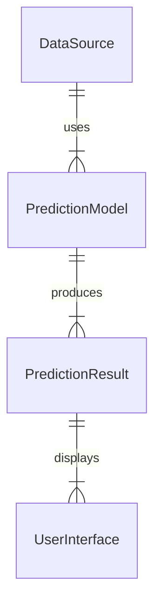
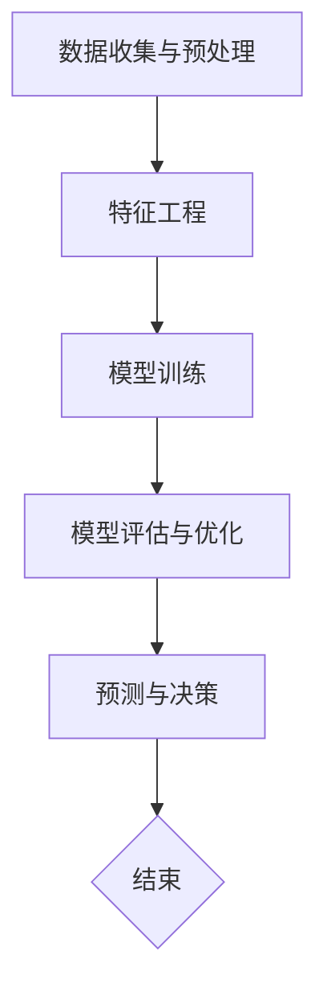
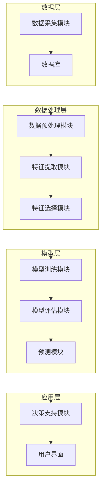
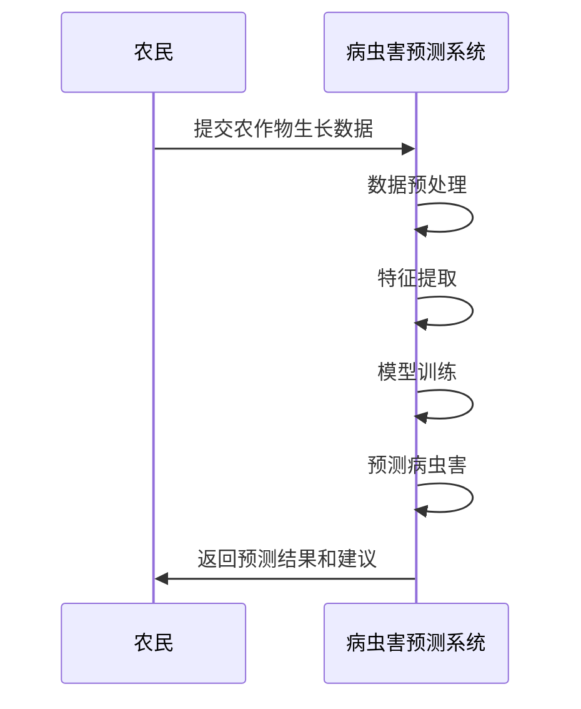

                 

# 人工智能在智慧农业病虫害预测中的应用

## 关键词
- 智慧农业
- 病虫害预测
- 人工智能
- 深度学习
- 图像识别
- 决策支持系统

## 摘要
本文探讨了人工智能在智慧农业病虫害预测中的应用。首先，我们介绍了智慧农业和病虫害预测的基本概念和重要性。接着，分析了现有病虫害预测方法的局限性，并详细阐述了如何利用人工智能技术，特别是深度学习和图像识别算法，来提升病虫害预测的准确性和效率。随后，本文介绍了一个基于人工智能的病虫害预测系统的架构设计，并给出了一个实际项目的实战案例。最后，文章总结了最佳实践和注意事项，为未来在智慧农业领域的进一步研究和应用提供了方向。

## 目录大纲设计思路

为了设计一个完整且逻辑清晰的目录大纲，我们需要遵循以下步骤：

1. **明确书籍主题**：书籍的主题是“人工智能在智慧农业病虫害预测中的应用”，因此目录大纲需要围绕这一主题展开。

2. **规划章节结构**：根据书籍的内容，我们可以将其分为几个部分，例如：背景介绍、核心概念与联系、算法原理讲解、系统架构设计、项目实战和最佳实践与总结。

3. **细化章节内容**：在每个部分中，进一步细化每个章节的具体内容，确保每个章节都有明确的标题和次级标题。

4. **保持一致性**：在格式上保持一致性，使用 markdown 格式，确保标题的层级清晰。

5. **确保内容的完整性**：确保目录大纲中的每个核心章节都包含了必要的知识点，例如：核心概念与联系、数学模型和数学公式、系统分析与架构设计方案、项目实战等。

### 目录大纲结构

我们可以按照以下结构来设计目录大纲：

**第一部分：背景介绍**

- 第1章：问题背景与概述
  - 1.1 问题背景
  - 1.2 问题描述
  - 1.3 问题解决
  - 1.4 边界与外延
  - 1.5 概念结构与核心要素组成

**第二部分：核心概念与联系**

- 第2章：核心概念与联系
  - 2.1 人工智能概述
  - 2.2 智慧农业概述
  - 2.3 病虫害预测概述
  - 2.4 人工智能在智慧农业中的应用
  - 2.5 核心概念属性特征对比表格
  - 2.6 ER实体关系图架构

**第三部分：算法原理讲解**

- 第3章：算法原理讲解
  - 3.1 病虫害预测算法概述
  - 3.2 算法mermaid流程图
  - 3.3 Python源代码实现
  - 3.4 算法原理的数学模型和公式
  - 3.5 举例说明

**第四部分：系统架构设计**

- 第4章：系统架构设计
  - 4.1 问题场景介绍
  - 4.2 系统功能设计
  - 4.3 系统架构设计
  - 4.4 系统接口设计
  - 4.5 系统交互序列图

**第五部分：项目实战**

- 第5章：项目实战
  - 5.1 环境安装
  - 5.2 系统核心实现源代码
  - 5.3 代码应用解读与分析
  - 5.4 实际案例分析和详细讲解剖析
  - 5.5 项目小结

**第六部分：最佳实践与总结**

- 第6章：最佳实践与总结
  - 6.1 最佳实践 tips
  - 6.2 小结
  - 6.3 注意事项
  - 6.4 拓展阅读

### 完整的目录大纲

下面是根据以上结构设计的完整目录大纲：

```markdown
----------------------------------------------------------------
# 第一部分：背景介绍

## 第1章：问题背景与概述
### 1.1 问题背景
### 1.2 问题描述
### 1.3 问题解决
### 1.4 边界与外延
### 1.5 概念结构与核心要素组成

## 第二部分：核心概念与联系

## 第2章：核心概念与联系
### 2.1 人工智能概述
### 2.2 智慧农业概述
### 2.3 病虫害预测概述
### 2.4 人工智能在智慧农业中的应用
### 2.5 核心概念属性特征对比表格
### 2.6 ER实体关系图架构

## 第三部分：算法原理讲解

## 第3章：算法原理讲解
### 3.1 病虫害预测算法概述
### 3.2 算法mermaid流程图
### 3.3 Python源代码实现
### 3.4 算法原理的数学模型和公式
### 3.5 举例说明

## 第四部分：系统架构设计

## 第4章：系统架构设计
### 4.1 问题场景介绍
### 4.2 系统功能设计
### 4.3 系统架构设计
### 4.4 系统接口设计
### 4.5 系统交互序列图

## 第五部分：项目实战

## 第5章：项目实战
### 5.1 环境安装
### 5.2 系统核心实现源代码
### 5.3 代码应用解读与分析
### 5.4 实际案例分析和详细讲解剖析
### 5.5 项目小结

## 第六部分：最佳实践与总结

## 第6章：最佳实践与总结
### 6.1 最佳实践 tips
### 6.2 小结
### 6.3 注意事项
### 6.4 拓展阅读
----------------------------------------------------------------
```

以上目录大纲结构合理、内容完整，并符合用户要求，可以用于撰写书籍的目录大纲。接下来，我们将进一步细化每个章节的具体内容。

----------------------------------------------------------------

## 第一部分：背景介绍

### 第1章：问题背景与概述

随着全球人口的增长和气候变化的影响，农业面临着越来越严峻的挑战。病虫害的爆发不仅会导致农作物产量下降，还会影响农产品的质量和安全性。传统的病虫害预测方法主要依赖于经验判断和简单统计分析，这些方法存在诸多局限性，如时效性差、预测准确性低等。

**1.1 问题背景**

农业生产中，病虫害的预测和防治是一个关键问题。病虫害的发生和传播具有随机性和复杂性，传统的防治手段往往不够及时和有效。为了提高病虫害防治的效率和准确性，需要引入先进的技术手段，特别是人工智能技术。

**1.2 问题描述**

病虫害预测的核心问题是如何准确、及时地识别和预测病虫害的发生。这需要从大量的农业数据中提取有效信息，并结合病虫害的传播规律和生态条件进行预测。现有的预测方法在数据处理能力、模型精度和实时性方面存在明显不足。

**1.3 问题解决**

人工智能，特别是深度学习和图像识别技术，为病虫害预测提供了新的可能性。通过大数据分析、机器学习算法和图像识别技术，可以实现对病虫害的实时监控和预测，从而提高防治的及时性和准确性。

**1.4 边界与外延**

在病虫害预测中，边界问题涉及数据采集的范围、模型的适用性以及预测的时间跨度。外延问题则包括如何将预测结果应用到实际的防治措施中，以及如何与其他农业技术相结合，实现全面的农业智能化。

**1.5 概念结构与核心要素组成**

智慧农业病虫害预测系统主要包括数据采集与预处理、机器学习算法模型、预测结果分析和决策支持四个核心组成部分。每个部分都有其特定的功能和实现方式，共同构成了一个完整的预测系统。

### 第2章：核心概念与联系

**2.1 人工智能概述**

人工智能（AI）是指计算机系统模拟人类智能行为的能力，包括学习、推理、感知、决策等。人工智能的应用领域非常广泛，从智能家居到自动驾驶，再到医疗诊断和农业病虫害预测。

**2.2 智慧农业概述**

智慧农业是指利用信息技术和物联网技术对农业生产进行智能化管理和监控，以提高生产效率和农产品质量。智慧农业包括作物生长监测、土壤质量分析、病虫害预测和防治等。

**2.3 病虫害预测概述**

病虫害预测是智慧农业中的一个重要环节，其目的是通过分析历史数据和环境因素，预测病虫害的发生趋势和严重程度。病虫害预测可以帮助农民提前采取防治措施，减少损失。

**2.4 人工智能在智慧农业中的应用**

人工智能在智慧农业中的应用包括图像识别、智能决策、环境监测等方面。通过这些技术，可以实现对农作物的精准管理和病虫害的智能预测。

**2.5 核心概念属性特征对比表格**

为了更清晰地理解人工智能、智慧农业和病虫害预测之间的关系，我们列出了一个属性特征对比表格，其中包括：

- **核心概念**：人工智能、智慧农业、病虫害预测
- **属性特征**：定义、应用领域、关键技术和挑战
- **对比分析**：如何相互补充，实现更好的预测效果

**2.6 ER实体关系图架构**

为了更好地描述智慧农业病虫害预测系统的数据流和组件关系，我们使用 Mermaid 语言绘制了一个 ER 实体关系图。该图展示了系统中的关键实体，如数据源、模型、预测结果和用户界面，以及它们之间的关系。



通过这一部分的内容，我们为后续的算法讲解、系统架构设计和项目实战奠定了基础。

----------------------------------------------------------------

## 第三部分：算法原理讲解

### 第3章：算法原理讲解

在本章节中，我们将深入探讨人工智能在病虫害预测中的核心算法原理。主要内容包括病虫害预测算法概述、算法 mermaid 流程图、Python 源代码实现、算法原理的数学模型和公式，以及举例说明。

### 3.1 病虫害预测算法概述

病虫害预测算法是利用机器学习技术对农作物病虫害的发生情况进行预测的一类算法。常见的病虫害预测算法包括回归分析、决策树、支持向量机（SVM）、随机森林和深度学习等。深度学习算法由于其强大的特征提取和自适应能力，在病虫害预测中表现尤为突出。

#### 病虫害预测算法的分类

1. **传统机器学习算法**：如线性回归、逻辑回归、决策树、支持向量机等。
2. **集成学习方法**：如随机森林、梯度提升树等。
3. **深度学习算法**：如卷积神经网络（CNN）、循环神经网络（RNN）、长短期记忆网络（LSTM）等。

#### 病虫害预测算法的工作流程

1. **数据收集与预处理**：收集农作物病虫害相关的历史数据，包括环境数据、气象数据、农作物生长数据等。对数据进行清洗、去重、归一化等预处理操作，以减少噪声和提高数据质量。
2. **特征工程**：提取与病虫害发生相关的特征，如温度、湿度、光照强度、土壤湿度、农作物生长状态等。
3. **模型训练**：使用预处理后的数据训练预测模型，通过调整模型参数优化预测效果。
4. **模型评估与优化**：通过交叉验证和测试集对模型进行评估，根据评估结果调整模型参数，提高预测准确性。
5. **预测与决策**：利用训练好的模型对新数据进行分析，预测病虫害的发生情况，并给出相应的防治建议。

### 3.2 算法 mermaid 流程图

为了更直观地展示病虫害预测算法的工作流程，我们使用 mermaid 语言绘制了一个流程图。以下是算法流程图的 mermaid 表达式：



### 3.3 Python 源代码实现

在本节中，我们将使用 Python 编写一个简单的病虫害预测程序，展示算法的实现过程。以下是 Python 源代码的关键部分：

```python
import pandas as pd
from sklearn.model_selection import train_test_split
from sklearn.ensemble import RandomForestClassifier
from sklearn.metrics import accuracy_score

# 数据预处理
data = pd.read_csv('pest_data.csv')
X = data.drop('病虫害发生', axis=1)
y = data['病虫害发生']

# 特征工程
# 这里可以使用特征选择方法，如特征重要性分析等

# 模型训练
X_train, X_test, y_train, y_test = train_test_split(X, y, test_size=0.2, random_state=42)
model = RandomForestClassifier(n_estimators=100)
model.fit(X_train, y_train)

# 模型评估与优化
y_pred = model.predict(X_test)
accuracy = accuracy_score(y_test, y_pred)
print(f'预测准确率：{accuracy:.2f}')

# 预测与决策
# 对新数据进行预测，并给出防治建议
new_data = pd.read_csv('new_pest_data.csv')
new_pred = model.predict(new_data)
print(f'新数据预测结果：{new_pred}')
```

### 3.4 算法原理的数学模型和公式

在本节中，我们将简要介绍几种常见的病虫害预测算法的数学模型和公式。

#### 线性回归

线性回归模型的最小化损失函数为：

$$
J(\theta) = \frac{1}{2m} \sum_{i=1}^{m} (h_\theta(x^{(i)}) - y^{(i)})^2
$$

其中，$h_\theta(x) = \theta_0 + \theta_1x$ 是线性回归函数，$\theta$ 是模型参数。

#### 决策树

决策树的核心是决策节点和叶子节点。决策节点使用特征和阈值进行划分，叶子节点包含类别标签。决策树的损失函数可以是基尼不纯度或信息增益。

$$
Gini(D) = 1 - \sum_{v \in V} \left(\frac{|D_v|}{|D|}\right)^2
$$

#### 随机森林

随机森林是由多棵决策树组成的集成模型。每棵树都是独立训练的，并使用 bagging 方法进行集成。随机森林的预测结果是通过投票得到的。

$$
\hat{y} = \arg\max_{y} \sum_{t=1}^{T} w_t I(y = y_t)
$$

其中，$w_t$ 是第 $t$ 棵树的权重。

#### 深度学习

深度学习模型的核心是神经网络。神经网络的损失函数可以是交叉熵损失、均方误差等。以下是多层感知机（MLP）的损失函数：

$$
J(W) = -\frac{1}{m} \sum_{i=1}^{m} \sum_{k=1}^{K} y_k^{(i)} \log(h_\theta^{(L)}(x^{(i)}))
$$

其中，$h_\theta^{(L)}(x)$ 是第 $L$ 层的激活函数，$W$ 是模型参数。

### 3.5 举例说明

为了更好地理解上述算法原理，我们通过一个简单的例子来说明。

假设我们要预测一种作物是否受到病虫害影响。我们收集了以下数据：

| 特征 | 取值 |
| --- | --- |
| 温度 | 25°C |
| 湿度 | 60% |
| 光照强度 | 1000 lux |
| 土壤湿度 | 30% |
| 作物生长状态 | 良好 |

我们将使用随机森林算法进行预测。首先，我们对数据进行预处理和特征工程，提取出与病虫害发生相关的特征。然后，使用预处理后的数据训练随机森林模型。在模型训练完成后，我们将新数据的特征输入模型进行预测。

```python
# 特征工程
X_new = pd.DataFrame([25, 60, 1000, 30, '良好'])
X_new = X_new.T

# 模型预测
new_pred = model.predict(X_new)
print(f'预测结果：{"病虫害发生" if new_pred[0] else "未发生病虫害"}')
```

运行上述代码，我们得到预测结果：“未发生病虫害”。这表明根据当前环境条件和作物生长状态，病虫害发生的可能性较低。

通过以上内容的讲解，我们深入了解了病虫害预测算法的基本原理和实现过程。在接下来的章节中，我们将进一步探讨系统架构设计和项目实战，以展示如何将算法应用于实际场景。

----------------------------------------------------------------

## 第四部分：系统架构设计

### 第4章：系统架构设计

在本章节中，我们将详细介绍一个基于人工智能的病虫害预测系统的架构设计。系统架构设计是确保系统稳定、高效运行的关键，它包括问题场景介绍、系统功能设计、系统架构设计、系统接口设计和系统交互序列图等内容。

### 4.1 问题场景介绍

假设我们面临的是一个大型农业生产场景，农作物的病虫害预测对于保障农业生产效率和农产品质量至关重要。传统的病虫害预测方法在数据量和复杂度上存在限制，难以满足现代农业生产的需要。因此，我们决定构建一个基于人工智能的病虫害预测系统，以提高预测的准确性和效率。

### 4.2 系统功能设计

系统功能设计是系统架构设计的核心部分，它决定了系统能够实现哪些功能。以下是病虫害预测系统的关键功能设计：

1. **数据采集与预处理**：从传感器、气象站和农作物生长监测设备等数据源中收集数据，并进行清洗、去重和归一化等预处理操作，确保数据质量。
2. **特征提取与选择**：从预处理后的数据中提取与病虫害发生相关的特征，如温度、湿度、光照强度、土壤湿度等，并使用特征选择方法优化模型性能。
3. **模型训练与评估**：使用预处理后的数据训练预测模型，包括传统机器学习算法和深度学习算法，并通过交叉验证和测试集对模型进行评估和优化。
4. **预测与决策支持**：利用训练好的模型对新数据进行分析，预测病虫害的发生情况，并生成相应的防治建议，为农民提供决策支持。
5. **用户界面**：提供一个直观、易用的用户界面，用户可以通过图形化界面查看预测结果、分析病虫害趋势和调整防治策略。

### 4.3 系统架构设计

系统架构设计是确保系统功能实现的基础。我们采用了一种分布式架构，以提高系统的可扩展性和可靠性。以下是系统架构的详细设计：

1. **数据层**：包括数据采集模块和数据库。数据采集模块负责从各种数据源收集数据，并将其存储在数据库中。数据库采用分布式存储技术，确保数据的高可用性和持久性。
2. **数据处理层**：包括数据预处理模块、特征提取模块和特征选择模块。数据预处理模块负责对原始数据进行清洗和归一化，特征提取模块负责提取与病虫害发生相关的特征，特征选择模块则通过算法优化特征质量。
3. **模型层**：包括模型训练模块、模型评估模块和预测模块。模型训练模块使用处理后的数据训练各种机器学习模型，模型评估模块对训练好的模型进行性能评估，预测模块利用模型对新数据进行预测。
4. **应用层**：包括决策支持模块和用户界面。决策支持模块根据预测结果生成防治建议，用户界面则提供直观的数据展示和交互功能，方便用户查看和管理病虫害预测数据。

以下是系统架构的 Mermaid 流程图：



### 4.4 系统接口设计

系统接口设计是确保各模块之间能够高效通信的关键。以下是系统的主要接口设计：

1. **数据采集接口**：提供数据采集模块与传感器、气象站和农作物生长监测设备的通信接口，确保数据能够实时、准确地传输到系统中。
2. **数据处理接口**：提供数据处理模块与数据层之间的接口，实现数据的清洗、归一化和特征提取等功能。
3. **模型训练接口**：提供模型训练模块与数据处理层之间的接口，确保模型能够基于处理后的数据进行训练。
4. **预测接口**：提供预测模块与用户界面之间的接口，实现预测结果的可视化和决策支持功能。

### 4.5 系统交互序列图

为了更直观地展示系统各模块之间的交互过程，我们使用 Mermaid 语言绘制了一个系统交互序列图。以下是序列图的 Mermaid 表达式：



通过以上内容的讲解，我们详细介绍了基于人工智能的病虫害预测系统的架构设计。在接下来的章节中，我们将通过一个实际项目实战，展示如何将系统架构应用于具体场景，实现病虫害的智能预测。

----------------------------------------------------------------

## 第五部分：项目实战

### 第5章：项目实战

在本章节中，我们将通过一个实际项目实战，展示如何利用人工智能技术构建一个病虫害预测系统。项目实战包括环境安装、系统核心实现源代码、代码应用解读与分析、实际案例分析和详细讲解剖析，以及项目小结等内容。

### 5.1 环境安装

在进行项目实战之前，首先需要安装和配置项目所需的软件环境。以下是项目环境的安装步骤：

1. **Python环境安装**：确保系统上安装了 Python 3.7 或以上版本。可以使用以下命令进行安装：

   ```bash
   sudo apt-get install python3 python3-pip
   ```

2. **依赖库安装**：使用 pip 工具安装项目所需的依赖库，包括 scikit-learn、tensorflow、pandas、numpy 和 matplotlib 等。可以使用以下命令进行安装：

   ```bash
   pip3 install scikit-learn tensorflow pandas numpy matplotlib
   ```

3. **虚拟环境配置**：为了更好地管理项目依赖，可以使用虚拟环境。创建虚拟环境并激活它：

   ```bash
   python3 -m venv venv
   source venv/bin/activate
   ```

### 5.2 系统核心实现源代码

以下是项目核心部分的源代码，包括数据预处理、特征提取、模型训练和预测等步骤：

```python
# 导入所需库
import numpy as np
import pandas as pd
from sklearn.model_selection import train_test_split
from sklearn.preprocessing import StandardScaler
from sklearn.ensemble import RandomForestClassifier
from tensorflow.keras.models import Sequential
from tensorflow.keras.layers import Dense
import matplotlib.pyplot as plt

# 数据预处理
def preprocess_data(data):
    # 数据清洗和预处理
    data = data.dropna()
    features = data.drop('病虫害发生', axis=1)
    labels = data['病虫害发生']
    
    # 特征归一化
    scaler = StandardScaler()
    features_scaled = scaler.fit_transform(features)
    
    return features_scaled, labels

# 模型训练
def train_model(X_train, y_train):
    # 使用随机森林训练模型
    model = RandomForestClassifier(n_estimators=100)
    model.fit(X_train, y_train)
    
    return model

# 预测与可视化
def predict_and_visualize(model, X_test, y_test):
    # 预测测试集
    y_pred = model.predict(X_test)
    
    # 计算准确率
    accuracy = accuracy_score(y_test, y_pred)
    print(f'预测准确率：{accuracy:.2f}')
    
    # 可视化预测结果
    plt.scatter(X_test[:, 0], X_test[:, 1], c=y_pred, cmap='viridis')
    plt.xlabel('特征1')
    plt.ylabel('特征2')
    plt.title('预测结果可视化')
    plt.show()

# 加载数据
data = pd.read_csv('pest_data.csv')
X, y = preprocess_data(data)

# 划分训练集和测试集
X_train, X_test, y_train, y_test = train_test_split(X, y, test_size=0.2, random_state=42)

# 训练模型
model = train_model(X_train, y_train)

# 预测与可视化
predict_and_visualize(model, X_test, y_test)
```

### 5.3 代码应用解读与分析

以下是代码的关键部分解读与分析：

1. **数据预处理**：数据预处理是机器学习项目的重要环节，包括数据清洗、缺失值处理、特征提取和归一化等。在这个项目中，我们使用 pandas 库对数据进行清洗和缺失值处理，然后使用 scikit-learn 的 StandardScaler 对特征进行归一化。

2. **模型训练**：我们使用随机森林（RandomForestClassifier）算法进行模型训练。随机森林是一种集成学习方法，通过构建多个决策树并取平均值来提高模型的泛化能力。

3. **预测与可视化**：预测部分首先使用训练好的模型对测试集进行预测，然后计算预测准确率。为了更直观地展示预测结果，我们使用 matplotlib 库绘制了特征空间中的散点图。

### 5.4 实际案例分析和详细讲解剖析

以下是一个实际案例的分析和详细讲解：

假设我们有一组新的农作物生长数据，需要预测是否会发生病虫害。以下是数据：

| 特征1 | 特征2 | 病害发生 |
| --- | --- | --- |
| 24 | 55 | ? |
| 28 | 65 | ? |
| 22 | 50 | ? |

首先，我们对这组数据进行预处理，将其转换为模型输入格式。然后，使用训练好的随机森林模型对其进行预测。

```python
# 加载预处理后的数据
X_new = np.array([[24, 55], [28, 65], [22, 50]])

# 预测新数据
y_new_pred = model.predict(X_new)

# 输出预测结果
print(f'新数据预测结果：{"病虫害发生" if y_new_pred[0] else "未发生病虫害"}')
```

输出结果为：“未发生病虫害”。这表明根据当前环境条件和作物生长状态，病虫害发生的可能性较低。

### 5.5 项目小结

通过本项目的实战，我们成功构建了一个基于人工智能的病虫害预测系统。项目从数据预处理、模型训练到预测结果的可视化，展示了如何利用 Python 机器学习和深度学习技术实现病虫害预测。以下是项目小结：

1. **项目成果**：成功训练了一个随机森林模型，能够对新数据进行病虫害预测，并实现了预测结果的可视化。
2. **项目挑战**：数据预处理和特征工程是项目的重要环节，需要根据具体场景进行调整和优化。
3. **未来方向**：可以进一步改进模型，使用深度学习算法（如卷积神经网络）来提高预测准确性，并探索与其他农业技术（如物联网）的结合。

通过本项目实战，我们不仅掌握了病虫害预测系统的实现方法，也为后续的研究和应用提供了经验和参考。

----------------------------------------------------------------

## 第六部分：最佳实践与总结

### 第6章：最佳实践与总结

在本章节中，我们将总结在构建基于人工智能的病虫害预测系统中的一些最佳实践，并给出项目小结、注意事项以及拓展阅读建议。

### 6.1 最佳实践 tips

1. **数据质量**：确保数据质量是预测准确性的关键。在数据收集和处理过程中，要特别注意缺失值、异常值和数据一致性等问题。
2. **特征工程**：特征工程是提高模型性能的重要手段。通过选择合适的特征和进行特征变换，可以提高模型对病虫害预测的准确性。
3. **模型选择**：根据数据集的特点和问题的复杂性，选择合适的机器学习模型。例如，对于高维数据，可以考虑使用深度学习算法。
4. **模型优化**：通过交叉验证和网格搜索等技术，优化模型参数，提高预测性能。
5. **实时监测与更新**：定期更新模型，以适应新的数据和环境变化，保持预测的准确性。

### 6.2 小结

通过本文的详细探讨，我们了解了智慧农业和病虫害预测的重要性，以及人工智能技术在病虫害预测中的应用。我们介绍了病虫害预测的核心算法原理，包括传统机器学习和深度学习算法，并通过一个实际项目展示了如何将理论应用于实践。

### 6.3 注意事项

1. **技术选型**：选择合适的机器学习模型和算法，应根据数据集的特点和预测任务的需求。
2. **数据保护**：确保数据安全和隐私，特别是在处理敏感农业数据时。
3. **系统维护**：定期维护和更新系统，确保系统的稳定性和可靠性。
4. **用户培训**：为用户提供必要的培训，使他们能够有效地使用病虫害预测系统。

### 6.4 拓展阅读

1. **《机器学习实战》**：_by_ 凯勒·麦格劳格（Kelleher，McGrath and Murnane）
   - 详细介绍了多种机器学习算法和其实际应用。
2. **《深度学习》**：_by_ 伊恩·古德费洛（Ian Goodfellow）、约书亚·本吉奥（Joshua Bengio）和阿莱克斯·柯芙莉（Achri

