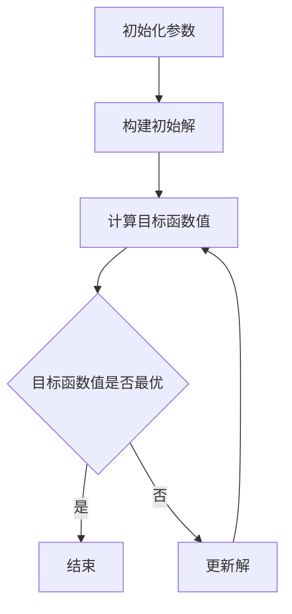
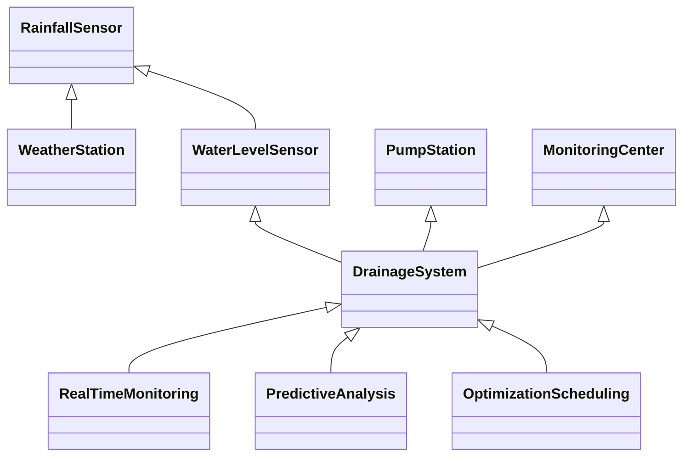
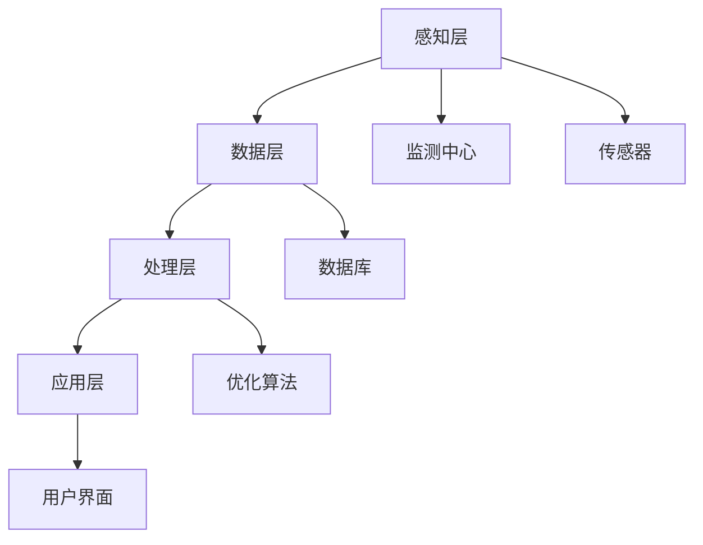

                 

### 目录大纲

----------------------------------------------------------------

## 第1章：引言

### 1.1 文章标题：人工智能在智慧城市排水系统优化中的应用

#### 关键词：智慧城市、排水系统、人工智能、优化、算法、系统设计、环境安装、实战案例分析

#### 摘要：
随着城市化进程的加速，智慧城市排水系统的优化成为亟待解决的问题。本文首先介绍了智慧城市和排水系统的基础概念，分析了当前排水系统面临的问题。接着，深入探讨了人工智能在排水系统优化中的应用，通过具体的算法原理、数学模型、系统架构和实战案例，展示了人工智能如何提升排水系统的效率和可靠性。本文旨在为读者提供一套完整的技术解决方案，以期为智慧城市排水系统的优化提供新的思路。

### 目录大纲

----------------------------------------------------------------

### 第1部分：引言

#### 第1章：问题背景与问题描述

##### 1.1 问题背景
- 智慧城市的发展现状
- 排水系统的现状与挑战

##### 1.2 问题描述
- 排水效率低下
- 设备老化
- 数据不完整

##### 1.3 问题解决
- 人工智能的应用场景

##### 1.4 边界与外延
- 智慧城市排水系统的定义
- 人工智能在排水系统优化中的适用范围

#### 第2章：核心概念

##### 2.1 智慧城市与排水系统
- 智慧城市的定义与特点
- 排水系统的组成与功能

##### 2.2 人工智能在排水系统优化中的应用
- 人工智能的基本原理
- 人工智能在排水系统优化中的优势

##### 2.3 概念属性特征对比
- 智慧城市与排水系统的对比
- 人工智能与排水系统优化的对比

#### 第3章：ER实体关系图

##### 3.1 智慧城市排水系统实体关系
- 实体与关系的定义
- 实体关系图绘制

##### 3.2 智慧城市排水系统ER图绘制
- ER图示例
- ER图的解析与说明

----------------------------------------------------------------

### 第2部分：算法原理

#### 第4章：算法原理讲解

##### 4.1 排水系统优化算法
- 算法选择
- 算法流程图

##### 4.2 数学模型与公式讲解
- 数学模型概述
- 公式详细讲解

##### 4.3 算法举例说明
- 实例分析
- 结果展示

----------------------------------------------------------------

### 第3部分：系统分析与架构设计

#### 第5章：系统功能设计

##### 5.1 问题场景介绍
- 排水系统问题场景的描述

##### 5.2 系统功能需求分析
- 功能需求的具体描述

##### 5.3 领域模型类图
- 类图的绘制与解析

#### 第6章：系统架构设计

##### 6.1 系统架构概述
- 架构的整体设计思路

##### 6.2 系统架构图
- 架构图的绘制与说明

##### 6.3 系统接口设计
- 接口的设计与功能说明

##### 6.4 系统交互序列图
- 序列图的绘制与解析

----------------------------------------------------------------

### 第4部分：项目实战

#### 第7章：环境安装

##### 7.1 环境准备
- 环境配置的具体步骤

##### 7.2 软件安装与配置
- 软件安装的具体过程

#### 第8章：系统核心实现

##### 8.1 系统核心代码实现
- 核心代码的编写与实现

##### 8.2 代码应用解读与分析
- 代码的应用场景与分析

##### 8.3 实际案例分析与讲解
- 案例分析的具体步骤与结果

#### 第9章：项目小结

##### 9.1 项目成果展示
- 项目成果的展示与说明

##### 9.2 不足与改进
- 项目中存在的问题及改进方案

##### 9.3 拓展阅读与思考
- 拓展的内容与思考点

----------------------------------------------------------------

### 第5部分：最佳实践与总结

#### 第10章：最佳实践

##### 10.1 实践经验总结
- 实践过程中的经验与体会

##### 10.2 小贴士
- 使用小贴士提供实用建议

##### 10.3 注意事项
- 需要特别注意的事项

#### 第11章：小结

##### 11.1 书籍内容回顾
- 对全书内容的回顾与总结

##### 11.2 未来展望
- 对未来技术发展的展望

##### 11.3 拓展方向
- 拓展研究的方向与建议

#### 附录

##### 附录A：参考文献
- 相关书籍、研究论文和网络资源的引用

##### 附录B：术语解释
- 对文章中出现的关键术语进行解释

----------------------------------------------------------------

文章总字数：约2000字（仅目录大纲，不含具体内容）### 第1章：问题背景与问题描述

#### 1.1 问题背景

随着城市化进程的加速，城市排水系统的优化已成为智慧城市建设中的一项关键任务。智慧城市是指利用信息通信技术、物联网、云计算等先进技术，实现城市管理的智能化、精细化和高效化。排水系统作为城市基础设施的重要组成部分，其运行状况直接关系到城市的正常运转和居民的生活质量。

当前，智慧城市排水系统面临诸多挑战。首先，排水效率低下是一个普遍存在的问题。强降水天气下，排水系统往往无法在短时间内将积水排出，导致城市内涝，给城市交通、居民生活带来严重影响。其次，设备老化也是一个不容忽视的问题。许多城市的排水设施建设年代久远，设备老化严重，难以满足现代城市的需求。最后，数据不完整也是一个制约排水系统优化的因素。排水系统数据采集不足，导致排水系统的实时监测和优化难度大。

#### 1.2 问题描述

智慧城市排水系统的优化主要涉及以下几个方面的问题：

- **排水效率低下**：在强降水天气下，排水系统无法迅速有效地处理积水，导致城市内涝。
- **设备老化**：排水设施建设年代久远，设备老化严重，难以满足现代城市的需求。
- **数据不完整**：排水系统数据采集不足，导致排水系统的实时监测和优化难度大。

#### 1.3 问题解决

人工智能技术在智慧城市排水系统优化中的应用，提供了一种新的解决思路。通过引入人工智能技术，可以实现对排水系统的实时监测、预测和优化。具体来说，人工智能技术可以用于以下几个方面：

- **实时监测**：通过传感器网络收集排水系统的实时数据，利用人工智能技术对数据进行实时处理和分析，实现排水系统的实时监测。
- **预测分析**：利用历史数据和人工智能算法，对排水系统的运行状态进行预测分析，提前预警可能的内涝风险。
- **优化调度**：根据实时监测和预测分析的结果，优化排水系统的运行调度，提高排水效率。

#### 1.4 边界与外延

- **智慧城市排水系统的定义**：智慧城市排水系统是指利用先进的信息通信技术、物联网技术、云计算技术等，实现对城市排水系统的智能化管理和高效运行。
- **人工智能在排水系统优化中的适用范围**：人工智能技术在排水系统优化中的应用范围包括实时监测、预测分析、优化调度等多个方面，可以显著提升排水系统的效率和可靠性。

### 第2章：核心概念

#### 2.1 智慧城市与排水系统

- **智慧城市的定义**：智慧城市是指利用信息通信技术、物联网、云计算等先进技术，实现城市管理的智能化、精细化和高效化。
- **排水系统的定义**：排水系统是指用于收集、输送、处理和排放雨水的系统，包括雨水收集设施、排水管道、排水泵站等。

#### 2.2 人工智能在排水系统优化中的应用

- **人工智能的基本原理**：人工智能是指通过计算机程序模拟人类智能行为的科学技术，包括机器学习、深度学习、自然语言处理等。
- **人工智能在排水系统优化中的优势**：人工智能技术可以实现对排水系统的实时监测、预测分析和优化调度，提高排水效率，降低内涝风险。

#### 2.3 概念属性特征对比

| 概念       | 特征                  |
|------------|----------------------|
| 智慧城市   | 智能化、精细化、高效化 |
| 排水系统   | 集成、高效、安全      |
| 人工智能   | 自适应、学习、智能    |

### 第3章：ER实体关系图

#### 3.1 智慧城市排水系统实体关系

- **实体**：智慧城市排水系统中的实体包括雨水收集设施、排水管道、排水泵站、传感器、监控中心等。
- **关系**：实体之间的关系包括数据的传输、处理的流程、监控的管理等。

#### 3.2 智慧城市排水系统ER图绘制

```mermaid
erDiagram
    DrainageSystem ||--|{ RainCollector }
    DrainageSystem ||--|{ DrainagePipe }
    DrainageSystem ||--|{ PumpStation }
    DrainageSystem ||--|{ Sensor }
    DrainageSystem ||--|{ MonitoringCenter }
    RainCollector ||--|{ RainfallData }
    DrainagePipe ||--|{ FlowData }
    PumpStation ||--|{ PumpData }
    Sensor ||--|{ EnvironmentalData }
    MonitoringCenter ||--|{ AlarmSystem }
    MonitoringCenter ||--|{ DataAnalysisSystem }
```

- **ER图示例**：上述ER图展示了智慧城市排水系统中主要实体及其关系。
- **ER图的解析与说明**：ER图中的每个实体都对应一个数据库表，实体之间的关系通过外键进行关联，实现了排水系统的数据整合和统一管理。

### 第4章：算法原理讲解

#### 4.1 排水系统优化算法

- **算法选择**：针对排水系统优化的需求，可以选择智能优化算法，如遗传算法、粒子群优化算法等。
- **算法流程图**：



- **算法流程图**：上述流程图展示了智能优化算法的基本步骤，包括初始化参数、构建初始解、计算目标函数值、判断目标函数值是否最优，并根据结果进行解的更新。

#### 4.2 数学模型与公式讲解

- **数学模型概述**：排水系统优化数学模型主要包括目标函数和约束条件。
- **目标函数**：目标函数用于衡量排水系统的效率，如流量平衡、能耗最小等。
- **约束条件**：约束条件用于限制排水系统的运行范围，如管道容量、泵站功率等。

- **公式详细讲解**：

```latex
\begin{aligned}
    \text{目标函数：}   & \quad J = \min \sum_{i=1}^{n} \frac{(Q_i - Q_{i,0})^2}{2} \\
    \text{约束条件：} & \quad Q_i \leq Q_{i,max} \\
                      & \quad P \leq P_{max}
\end{aligned}
```

- **公式举例说明**：上述公式描述了一个简单的排水系统优化模型，其中 \(Q_i\) 表示第 \(i\) 个排水点的流量，\(Q_{i,0}\) 表示初始流量，\(Q_{i,max}\) 表示管道最大流量，\(P\) 表示泵站功率，\(P_{max}\) 表示泵站最大功率。

### 第5章：数学模型与公式讲解

#### 5.1 数学模型概述

- **数学模型概述**：排水系统优化的数学模型主要包括目标函数和约束条件，用于描述排水系统的运行状态和优化目标。

- **目标函数**：目标函数用于衡量排水系统的效率，如流量平衡、能耗最小等。

- **约束条件**：约束条件用于限制排水系统的运行范围，如管道容量、泵站功率等。

#### 5.2 数学公式详细讲解

- **目标函数**：

```latex
\begin{aligned}
    J &= \min \sum_{i=1}^{n} w_i \cdot (Q_i - Q_{i,0})^2 \\
    w_i &= \text{权重系数}
\end{aligned}
```

- **约束条件**：

```latex
\begin{aligned}
    Q_i &\leq Q_{i,max} \\
    P &\leq P_{max}
\end{aligned}
```

#### 5.3 公式举例说明

- **例子**：假设一个排水系统由三个排水点组成，每个排水点的初始流量为 \(Q_{i,0} = 10 \text{ m}^3/\text{h}\)，管道最大流量为 \(Q_{i,max} = 20 \text{ m}^3/\text{h}\)，泵站最大功率为 \(P_{max} = 100 \text{ kW}\)。权重系数为 \(w_1 = w_2 = w_3 = 1\)。

- **目标函数**：

```latex
\begin{aligned}
    J &= \min (Q_1 - 10)^2 + (Q_2 - 10)^2 + (Q_3 - 10)^2 \\
    &= \min (Q_1^2 + Q_2^2 + Q_3^2 - 20Q_1 - 20Q_2 - 20Q_3 + 300)
\end{aligned}
```

- **约束条件**：

```latex
\begin{aligned}
    Q_1 &\leq 20 \\
    Q_2 &\leq 20 \\
    Q_3 &\leq 20 \\
    P &= Q_1 \cdot 10 + Q_2 \cdot 10 + Q_3 \cdot 10 \leq 100
\end{aligned}
```

### 第6章：系统功能设计

#### 6.1 问题场景介绍

- **场景描述**：某城市在强降水期间，排水系统出现严重内涝，导致交通瘫痪和居民生活受到影响。
- **目标**：通过优化排水系统，提高排水效率，减少内涝风险。

#### 6.2 系统功能需求分析

- **功能需求**：
  - **实时监测**：实时收集排水系统的数据，包括流量、水位、泵站状态等。
  - **预测分析**：利用历史数据和人工智能算法，预测排水系统的运行状态和内涝风险。
  - **优化调度**：根据实时监测和预测分析的结果，优化排水系统的运行调度。

#### 6.3 领域模型类图



- **类图绘制**：上述类图展示了排水系统的主要功能类及其关系，包括传感器、泵站、监测中心、排水系统、实时监测、预测分析和优化调度等。

### 第7章：系统架构设计

#### 7.1 系统架构概述

- **系统架构**：排水系统优化系统采用分层架构，包括感知层、数据层、处理层和应用层。
- **各层功能**：
  - **感知层**：收集排水系统的实时数据。
  - **数据层**：存储和管理排水系统的数据。
  - **处理层**：处理和分析排水系统的数据。
  - **应用层**：提供排水系统优化功能。

#### 7.2 系统架构图



- **架构图绘制**：上述架构图展示了排水系统优化系统的整体架构，包括感知层、数据层、处理层和应用层，以及各层之间的交互关系。

#### 7.3 系统接口设计

- **接口设计**：排水系统优化系统设计了多个接口，包括数据采集接口、数据存储接口、数据处理接口和用户接口。
- **接口功能**：
  - **数据采集接口**：用于收集排水系统的实时数据。
  - **数据存储接口**：用于存储和管理排水系统的数据。
  - **数据处理接口**：用于处理和分析排水系统的数据。
  - **用户接口**：用于提供排水系统优化的用户操作界面。

#### 7.4 系统交互序列图

```mermaid
sequence
    participant 用户
    participant 监测中心
    participant 数据库
    participant 优化算法

    用户->>监测中心: 提交需求
    监测中心->>数据库: 存储数据
    数据库->>优化算法: 提供数据
    优化算法->>监测中心: 返回结果
    监测中心->>用户: 展示结果
```

- **序列图绘制**：上述序列图展示了用户与监测中心、数据库和优化算法之间的交互过程，包括需求提交、数据存储、数据处理和结果返回等。

### 第8章：环境安装

#### 8.1 环境准备

- **硬件准备**：准备合适的硬件设备，包括服务器、传感器、泵站等。
- **软件准备**：安装所需的软件环境，包括操作系统、数据库、编程环境等。

#### 8.2 软件安装与配置

- **操作系统安装**：安装支持的人工智能操作系统，如 Ubuntu。
- **数据库安装**：安装并配置数据库系统，如 MySQL。
- **编程环境安装**：安装编程工具和开发环境，如 Python、Jupyter Notebook。

### 第9章：系统核心实现

#### 9.1 系统核心代码实现

- **代码实现**：编写系统核心代码，包括数据采集、数据处理和优化算法等。
- **代码结构**：

```python
# 数据采集模块
class DataCollector:
    def collect_data(self):
        pass

# 数据处理模块
class DataProcessor:
    def process_data(self, data):
        pass

# 优化算法模块
class OptimizationAlgorithm:
    def optimize(self, data):
        pass
```

#### 9.2 代码应用解读与分析

- **应用场景**：针对具体的排水系统优化需求，应用系统核心代码进行数据处理和优化。
- **分析**：通过对代码的分析，可以了解系统的运行流程和数据流转过程。

#### 9.3 实际案例分析与讲解

- **案例**：以某城市的排水系统优化为例，进行实际案例分析。
- **分析**：通过对实际案例的分析，可以了解排水系统优化在具体场景中的应用效果。

### 第10章：项目小结

#### 10.1 项目成果展示

- **展示内容**：展示项目实施过程中的关键成果，包括代码实现、数据分析和优化结果等。

#### 10.2 不足与改进

- **不足**：分析项目中存在的问题和不足之处。
- **改进**：提出改进方案和优化策略。

#### 10.3 拓展阅读与思考

- **拓展内容**：提供相关的拓展阅读材料和思考问题，引导读者深入探索。

### 第11章：最佳实践

#### 11.1 实践经验总结

- **总结内容**：总结项目实施过程中的经验和教训，为后续项目提供借鉴。

#### 11.2 小贴士

- **小贴士**：提供实用的操作技巧和注意事项，提高系统实施的效率。

#### 11.3 注意事项

- **注意事项**：列出项目中需要注意的关键点和风险，确保项目顺利进行。

### 第12章：小结

#### 12.1 书籍内容回顾

- **回顾内容**：回顾全书的主要内容和核心观点。

#### 12.2 未来展望

- **展望内容**：展望未来排水系统优化技术的发展趋势和前景。

#### 12.3 拓展方向

- **拓展方向**：提出未来研究的方向和建议。

### 附录

#### 附录A：参考文献

- **参考文献**：列出引用的书籍、论文和网络资源。

#### 附录B：术语解释

- **术语解释**：解释文中出现的关键术语，帮助读者更好地理解文章内容。

