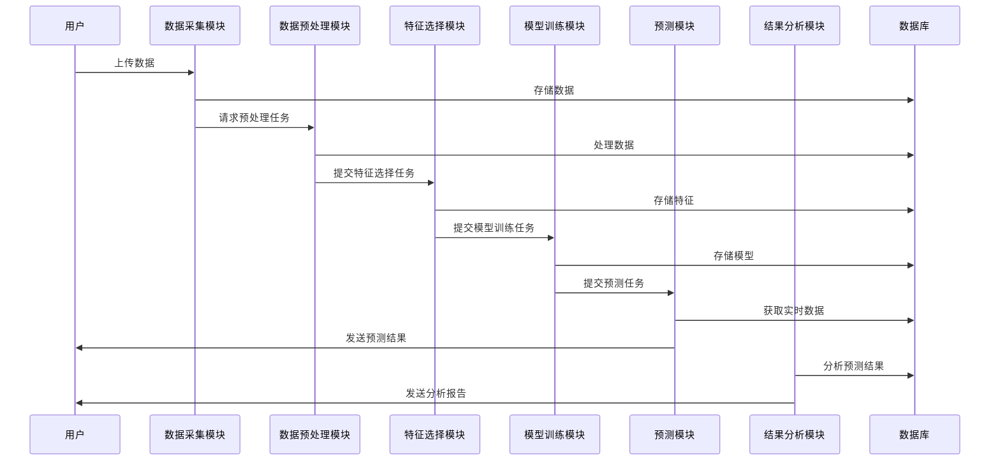

                 


### 引言

#### 1.1 问题背景

智慧城市作为现代城市化发展的重要趋势，正逐渐成为全球各地的建设目标。智慧城市通过先进的信息通信技术（ICT）和物联网（IoT）等手段，实现城市各系统的互联互通和数据共享，从而提高城市运行效率、改善居民生活质量。能源作为智慧城市的重要组成部分，其高效、可靠的供应对于城市的稳定运行至关重要。

然而，随着城市规模的不断扩大和居民生活水平的提高，能源需求的复杂性和动态性也在增加。传统的能源需求预测方法往往依赖于历史数据和简单的统计模型，如线性回归、时间序列分析等。这些方法虽然在某些情况下能够提供一定的预测准确性，但在面对智慧城市复杂多变的能源需求时，往往显得力不从心。

首先，传统方法在处理大量多源异构数据时存在瓶颈。智慧城市中的能源需求数据来源广泛，包括气象数据、交通流量数据、工业生产数据、居民用电数据等，这些数据类型各异，且数据量庞大。传统的预测方法难以有效地整合这些数据，导致预测结果的准确性和可靠性受到影响。

其次，智慧城市中的能源需求受到多种因素的影响，如季节变化、天气条件、城市人口流动、工业活动等。这些因素相互作用，使得能源需求的预测更加复杂。传统的预测方法往往只能考虑单一因素，难以全面捕捉到这些因素的综合影响。

此外，传统方法在实时性和自适应能力上也存在不足。智慧城市要求能源需求预测能够快速响应环境变化，提供实时的预测结果。而传统方法通常需要较长时间的训练和模型调整，难以满足这一需求。此外，智慧城市的发展是一个动态的过程，能源需求的变化也随之不断演变。传统方法缺乏自适应能力，难以适应这种变化。

因此，为了提高智慧城市能源需求预测的准确性、实时性和自适应能力，引入人工智能技术，特别是机器学习和深度学习算法，成为解决这一问题的可行方案。人工智能技术可以从海量数据中提取特征，构建复杂模型，提高预测的准确性。同时，人工智能技术具有强大的自适应能力，可以实时调整模型，适应不断变化的数据和环境。

#### 1.2 问题描述

智慧城市中的能源需求预测需要考虑多种因素，如天气条件、季节变化、城市人口流动、工业活动等。这些因素相互作用，使得能源需求的预测成为一个复杂且具有挑战性的问题。

首先，天气条件是影响能源需求的重要因素之一。例如，在炎热的夏季，空调用电量会大幅增加；而在寒冷的冬季，暖气和电热的能源需求也会显著上升。此外，极端天气事件，如暴雨、暴雪、高温等，也会对能源需求产生显著影响。

其次，季节变化也对能源需求产生重要影响。不同的季节，人们的生活方式、工业活动的节奏等都会发生变化，从而影响能源需求。例如，在冬季，人们倾向于减少户外活动，更多时间待在室内，这会导致电力需求上升；而在夏季，人们倾向于增加空调使用，导致电力需求增加。

第三，城市人口流动也是影响能源需求的一个重要因素。城市人口的流动会导致用电量的波动。例如，在工作日，白天城市用电量会上升，而晚上则相对下降；而在周末和节假日，由于人们更多时间待在家中，电力需求会有所增加。

第四，工业活动也是能源需求的重要影响因素。工业生产过程中需要大量的能源供应，如电力、燃气等。工业活动的规模和节奏变化，会对能源需求产生显著影响。

综上所述，智慧城市中的能源需求预测需要综合考虑天气条件、季节变化、城市人口流动和工业活动等多种因素，实现准确的能源需求预测是一个复杂且具有挑战性的问题。

#### 1.3 问题解决

人工智能技术在处理复杂问题上具有显著优势。通过机器学习和深度学习算法，可以从大量数据中提取出有用的信息，进行特征工程，建立预测模型，并对预测结果进行优化。这些方法能够处理多变量输入，且能够不断学习和适应新的数据，提高预测的准确性。

首先，机器学习算法可以从历史数据中学习，发现数据中的规律和模式，从而建立预测模型。常见的机器学习算法包括线性回归、支持向量机、决策树、随机森林等。这些算法可以根据不同的问题和数据特点进行选择和调整，以提高预测的准确性。

其次，深度学习算法在处理复杂问题上具有独特的优势。深度学习算法通过多层神经网络的结构，可以自动学习数据的特征表示，从而实现更高级的预测。常见的深度学习算法包括卷积神经网络（CNN）、循环神经网络（RNN）、长短时记忆网络（LSTM）等。这些算法能够从大量数据中提取出复杂的关系和模式，提高预测的精度和鲁棒性。

此外，人工智能技术具有强大的自适应能力。通过实时学习新的数据，模型可以不断调整和优化，以适应环境的变化。这种自适应能力使得人工智能技术能够快速响应智慧城市能源需求的变化，提供实时的预测结果。

总之，引入人工智能技术，特别是机器学习和深度学习算法，为智慧城市能源需求预测提供了一种有效的解决方案。这些方法不仅能够处理复杂的多变量输入，还能够通过不断学习和优化，提高预测的准确性，为城市能源规划和管理提供有力支持。

#### 1.4 边界与外延

在智慧城市能源需求预测中，边界主要包括以下几个方面：

首先，预测的时间范围是边界之一。智慧城市能源需求预测可以覆盖不同的时间尺度，如小时级、日级、月级等。不同的时间尺度需要不同的预测模型和算法，因此，预测的时间范围是影响模型设计和选择的重要因素。

其次，预测的空间范围也是边界之一。智慧城市中的能源需求分布具有显著的时空特性，不同区域、不同建筑的能源需求差异可能很大。因此，在预测时，需要根据具体的空间范围，选择合适的算法和数据集。

第三，数据类型是另一个边界因素。智慧城市中的数据类型多样，包括时间序列数据、图像数据、文本数据等。不同类型的数据需要不同的处理方法，因此，在数据预处理和特征选择阶段，需要根据数据类型进行区分和处理。

此外，边界还包括模型的可解释性。在智慧城市能源需求预测中，模型的解释性至关重要。决策者需要了解模型是如何预测能源需求的，以便进行有效的决策和规划。因此，在模型设计和优化过程中，需要考虑模型的可解释性。

智慧城市能源需求预测的外延则包括以下几个方面：

首先，政策变化是外延之一。政府的能源政策和城市规划会影响城市的能源需求，因此，在预测时，需要考虑政策变化对能源需求的影响。

其次，经济波动也是外延之一。经济环境的波动会影响城市人口的流动、工业活动的节奏等，从而影响能源需求。因此，在预测时，需要考虑经济波动对能源需求的影响。

此外，技术创新和设备更新也是外延之一。新技术的引入和设备更新会改变能源消耗模式，从而影响能源需求。因此，在预测时，需要考虑技术创新和设备更新对能源需求的影响。

综上所述，智慧城市能源需求预测的边界和外延包括预测的时间范围、空间范围、数据类型、模型可解释性，以及政策变化、经济波动、技术创新和设备更新等因素。

#### 1.5 概念结构与核心要素组成

智慧城市能源需求预测的概念结构主要包括以下核心要素：

1. **数据采集**：数据采集是智慧城市能源需求预测的基础。数据来源广泛，包括传感器数据、气象数据、交通数据、社会经济数据等。数据采集的关键在于确保数据的准确性和完整性。

2. **数据处理**：数据处理是对采集到的原始数据进行清洗、转换和归一化等操作，以提取出与能源需求相关的有效特征。数据处理的质量直接影响预测模型的性能。

3. **模型训练**：模型训练是通过机器学习或深度学习算法，从数据中学习并建立预测模型。训练过程中，需要不断调整模型参数，优化模型性能，以提高预测的准确性。

4. **预测结果分析**：预测结果分析是对预测模型生成的预测结果进行评估和解释。通过分析预测结果，可以评估模型的性能，发现模型的优点和不足，为进一步优化模型提供依据。

核心要素包括以下方面：

- **数据来源**：确定数据采集的渠道，包括传感器、气象站、交通管理部门等。
- **特征选择**：从原始数据中提取与能源需求相关的特征，如温度、湿度、交通流量、用电量等。
- **模型选择**：根据具体问题和数据特点，选择合适的预测模型，如线性回归、支持向量机、神经网络等。
- **模型训练**：通过训练算法，让模型从数据中学习，提高预测的准确性。训练过程中，需要不断调整模型参数，优化模型性能。
- **模型评估**：使用验证集或测试集，评估模型的预测性能，包括准确率、均方误差等指标。
- **预测结果解释**：对预测结果进行解释，帮助决策者理解模型的预测逻辑和影响因素。

通过以上核心要素的有机结合，智慧城市能源需求预测系统能够实现高效的预测和优化，为城市能源规划和管理提供有力支持。

### 第2章 核心概念与联系

#### 2.1 数据采集

数据采集是智慧城市能源需求预测的基础环节。数据采集的质量直接影响预测模型的性能。数据来源广泛，包括传感器数据、气象数据、交通数据、社会经济数据等。传感器数据如温度传感器、湿度传感器、电力传感器等，能够实时监测城市环境中的各种物理量。气象数据包括气温、湿度、风速、降雨量等，对能源需求有重要影响。交通数据如交通流量、公共交通使用情况等，反映了城市人口的流动和活动情况。社会经济数据如人口统计数据、工业生产数据等，也对能源需求有显著影响。

数据采集的关键在于确保数据的准确性和完整性。数据准确性保证预测结果的可靠性和有效性，而数据完整性确保模型能够涵盖各种可能的情境。此外，数据采集系统还需要具备实时性，能够快速响应环境变化，提供最新的数据。

为了实现高效的数据采集，可以采用以下策略：

1. **多源数据融合**：整合多种数据源，如传感器数据、气象数据、交通数据等，通过数据清洗和融合技术，提取出与能源需求相关的有效特征。
2. **分布式数据采集**：采用分布式架构，将数据采集任务分散到不同的设备和节点上，提高系统的可扩展性和可靠性。
3. **自动化数据采集**：通过自动化脚本和工具，实现数据采集过程的自动化，减少人工干预，提高采集效率。
4. **数据质量监控**：建立数据质量监控机制，定期检查数据的一致性、完整性和准确性，及时发现并处理数据问题。

#### 2.2 特征选择

特征选择是数据预处理的重要环节，直接影响预测模型的性能。在智慧城市能源需求预测中，特征选择的目标是提取出与能源需求高度相关的特征，剔除冗余和无用的特征，从而提高模型的预测精度和计算效率。

特征选择的方法可以分为以下几类：

1. **基于统计的方法**：通过计算特征的相关性、方差、信息增益等统计量，评估特征的重要程度，选择对预测目标有显著影响的特征。
2. **基于过滤的方法**：通过过滤方法，如相关性过滤、方差过滤等，筛选出满足特定条件的特征。
3. **基于包装的方法**：通过将特征选择与模型训练过程结合，逐步选择和组合特征，找到最优特征集。常见的算法包括递归特征消除（RFE）、嵌入式特征选择（如LASSO、岭回归）等。
4. **基于评价的方法**：通过构建评价函数，评估不同特征集的预测性能，选择最优特征集。

在特征选择过程中，需要考虑以下因素：

- **特征的相关性**：选择与预测目标高度相关的特征，避免特征之间的冗余和冲突。
- **特征的维度**：降低特征维度，减少计算量和存储需求，提高模型的效率。
- **特征的稳定性**：选择在不同情境下都表现出稳定的特征的，提高模型对未知数据的泛化能力。
- **特征的可解释性**：选择易于解释的特征，便于决策者理解模型的预测逻辑。

特征选择的准确性直接影响到预测模型的性能。准确的特征选择能够提高模型的预测精度，减少过拟合现象，提高模型的泛化能力。在实际应用中，特征选择通常需要结合具体问题和数据特点，采用多种方法进行综合评估，以找到最优的特征集。

#### 2.3 模型选择

模型选择是构建智慧城市能源需求预测模型的关键步骤。选择合适的模型需要根据具体问题和数据特点进行判断。常见的机器学习模型包括线性回归、支持向量机（SVM）、决策树、随机森林、神经网络等。

1. **线性回归模型**：线性回归模型是一种简单的预测模型，通过拟合数据的线性关系来预测目标值。线性回归模型适用于数据分布较为简单的情况，但在处理非线性问题时表现较差。

2. **支持向量机（SVM）**：支持向量机是一种有效的分类和回归模型，通过找到数据中的最优边界来实现预测。SVM在处理高维数据和非线性问题时表现良好，但在数据量较大时计算复杂度较高。

3. **决策树模型**：决策树模型通过一系列条件判断来对数据进行分类或回归。决策树模型简单易懂，能够处理非线性关系，但容易过拟合，且对缺失数据的处理能力较差。

4. **随机森林模型**：随机森林是一种基于决策树的集成学习方法，通过构建多个决策树并求取平均来提高模型的预测性能。随机森林具有较强的泛化能力和鲁棒性，但计算复杂度较高。

5. **神经网络模型**：神经网络是一种模拟人脑神经元连接的网络结构，通过多层非线性变换来提取数据的特征和模式。神经网络在处理复杂数据和建立非线性关系方面具有显著优势，但训练过程较复杂，对数据质量和计算资源要求较高。

在选择模型时，需要考虑以下因素：

- **数据特点**：根据数据分布、维度、噪声水平等特性，选择适合的模型。例如，线性回归适用于线性关系较强的数据，神经网络适用于复杂非线性关系的数据。
- **预测目标**：根据预测目标的要求，选择适当的模型类型。例如，对于回归问题，可以选择线性回归、SVM等；对于分类问题，可以选择决策树、随机森林等。
- **模型复杂度**：根据模型的复杂度和计算资源，选择合适的模型。简单的模型如线性回归和决策树计算复杂度较低，适用于小数据和资源受限的环境；复杂的模型如神经网络适用于大规模数据和丰富计算资源的环境。
- **可解释性**：根据模型的解释性要求，选择易于理解和解释的模型。例如，线性回归和决策树具有较强的可解释性，而神经网络和随机森林的解释性较差。

通过综合考虑以上因素，可以选出适合的预测模型，为智慧城市能源需求预测提供有效的解决方案。

#### 2.4 模型训练

模型训练是构建智慧城市能源需求预测模型的核心环节。通过训练算法，让模型从数据中学习，提高预测的准确性。训练过程中，需要不断调整模型参数，优化模型性能。以下将详细介绍模型训练的过程、方法以及优化策略。

**模型训练的过程：**

模型训练的过程可以分为以下几个步骤：

1. **数据预处理**：在训练模型之前，需要对原始数据进行预处理。数据预处理包括数据清洗、数据归一化、特征提取等步骤。数据清洗是为了去除噪声和异常值，保证数据的质量；数据归一化是为了将不同特征的数据范围统一，便于模型学习；特征提取是为了提取与预测目标相关的特征，减少数据的维度。

2. **划分训练集和测试集**：将数据集划分为训练集和测试集。训练集用于模型的训练，测试集用于评估模型的性能。通常，可以使用80%的数据作为训练集，20%的数据作为测试集。这样可以充分训练模型，同时保持模型评估的有效性。

3. **初始化模型参数**：初始化模型的参数，这些参数包括权重、偏置等。初始化的方法有很多，如随机初始化、高斯分布初始化等。合适的初始化方法可以加快模型的收敛速度，提高模型的性能。

4. **选择训练算法**：根据模型的特点和数据集的特性，选择合适的训练算法。常见的训练算法包括梯度下降法、随机梯度下降法、Adam优化器等。这些算法通过不断更新模型参数，使模型逐渐逼近最优解。

5. **训练模型**：使用训练算法对模型进行迭代训练。在每次迭代中，模型会根据训练数据更新参数，优化模型的性能。训练过程中，可以通过设置学习率、迭代次数等参数来控制训练过程。

6. **评估模型性能**：在训练结束后，使用测试集评估模型的性能。常用的评估指标包括准确率、均方误差（MSE）、均方根误差（RMSE）等。通过评估模型的性能，可以判断模型是否达到预期效果。

**模型训练的方法：**

常见的模型训练方法包括以下几种：

1. **监督学习**：监督学习是最常见的模型训练方法。监督学习通过给定的输入数据和对应的标签，学习数据与标签之间的关系。常用的监督学习算法包括线性回归、决策树、随机森林、支持向量机等。

2. **无监督学习**：无监督学习不需要标签信息，通过发现数据中的内在结构来训练模型。无监督学习算法包括聚类算法（如K-means、DBSCAN）、降维算法（如主成分分析PCA）等。

3. **半监督学习**：半监督学习结合了监督学习和无监督学习的方法。半监督学习利用少量标签数据和大量无标签数据，通过学习数据之间的相似性和差异性来训练模型。常见的半监督学习算法包括自编码器、标签传播等。

4. **强化学习**：强化学习通过交互环境来训练模型，通过不断尝试和反馈来学习最优策略。强化学习适用于需要决策和优化的任务，如游戏、机器人控制等。

**模型训练的优化策略：**

为了提高模型训练的效果，可以采用以下优化策略：

1. **交叉验证**：交叉验证是一种常用的模型评估方法。通过将数据集划分为多个子集，每次使用一个子集作为测试集，其他子集作为训练集，进行多次训练和评估，以获取更稳定的模型性能。

2. **学习率调整**：学习率是梯度下降算法中的重要参数。合适的学习率可以加快模型的收敛速度，避免过早陷入局部最优。可以使用自适应学习率方法，如Adam优化器，自动调整学习率。

3. **正则化**：正则化是一种防止模型过拟合的方法。通过在损失函数中加入正则化项，限制模型参数的范围，提高模型的泛化能力。常见的正则化方法包括L1正则化（LASSO）、L2正则化（岭回归）等。

4. **早停**：早停是一种防止过拟合的方法。在训练过程中，如果模型的验证集性能不再提升，可以提前停止训练，避免模型在训练集上过拟合。

5. **模型集成**：模型集成是一种通过结合多个模型的预测结果来提高模型性能的方法。常见的模型集成方法包括Bagging、Boosting、Stacking等。

通过以上策略，可以有效提高模型训练的效果，实现更准确的智慧城市能源需求预测。

#### 2.5 预测结果分析

预测结果分析是评估智慧城市能源需求预测模型性能的重要手段。通过分析预测结果，可以评估模型的准确性、稳定性和可靠性，发现模型的优点和不足，为进一步优化模型提供依据。以下将介绍预测结果分析的方法和步骤。

**预测结果分析方法：**

1. **准确性评估**：准确性是预测结果最直观的评估指标。常用的准确性评估方法包括：

   - **均方误差（MSE）**：MSE是预测值与实际值之间差异的平均平方值，计算公式为：

     $$MSE = \frac{1}{n}\sum_{i=1}^{n}(y_i - \hat{y_i})^2$$

     其中，$y_i$为实际值，$\hat{y_i}$为预测值，$n$为样本数量。MSE越小，表示预测结果越准确。

   - **均方根误差（RMSE）**：RMSE是MSE的平方根，用于表示预测值与实际值之间的平均误差，计算公式为：

     $$RMSE = \sqrt{MSE}$$

     RMSE越小，表示预测结果越精确。

   - **平均绝对误差（MAE）**：MAE是预测值与实际值之间差异的平均绝对值，计算公式为：

     $$MAE = \frac{1}{n}\sum_{i=1}^{n}|y_i - \hat{y_i}|$$

     MAE越小，表示预测结果的稳定性越好。

2. **稳定性评估**：稳定性评估旨在分析模型在不同时间段、不同数据集上的表现，以判断模型是否具有稳定性和一致性。常用的稳定性评估方法包括：

   - **时间序列分析**：通过绘制预测结果的时间序列图，观察预测结果的时间趋势和波动情况。如果时间序列图中的波动较大，说明模型的稳定性较差。

   - **分组评估**：将数据集按照时间段、区域、特征等分组，分别评估模型在不同分组上的预测性能。通过对比不同分组之间的性能差异，分析模型在不同情境下的稳定性。

3. **可靠性评估**：可靠性评估旨在分析模型预测结果的可信度和准确性。常用的可靠性评估方法包括：

   - **置信区间评估**：计算预测结果的置信区间，以判断预测结果的可靠程度。置信区间越窄，表示预测结果越可靠。

   - **误差分布评估**：通过分析预测误差的分布情况，判断预测结果是否具有一致性和对称性。如果误差分布呈现正态分布，说明预测结果较为可靠。

**预测结果分析步骤：**

1. **数据准备**：收集并整理预测结果数据，包括实际值和预测值。确保数据的一致性和完整性。

2. **计算评估指标**：使用准确性、稳定性和可靠性评估方法，计算预测结果的评估指标，如MSE、RMSE、MAE等。

3. **绘制分析图表**：绘制预测结果的时间序列图、分组评估图等，直观展示预测结果的趋势、波动和可靠性。

4. **分析结果**：根据评估指标和分析图表，分析模型的优点和不足，识别模型的潜在问题和改进方向。

5. **优化模型**：根据分析结果，对模型进行优化和调整，提高模型的性能和预测准确性。可以采用正则化、交叉验证、模型集成等方法，优化模型的结构和参数。

通过以上步骤，可以全面分析智慧城市能源需求预测模型的性能，发现模型的优点和不足，为进一步优化模型提供有力支持。

### 3.1 机器学习算法

机器学习算法是智慧城市能源需求预测的核心技术，通过从数据中学习规律和模式，建立预测模型。以下是几种常见的机器学习算法及其在智慧城市能源需求预测中的应用。

**1. 线性回归模型**

线性回归模型是一种简单的预测模型，通过拟合数据的线性关系来预测目标值。其数学模型可以表示为：

$$
y = \beta_0 + \beta_1 \cdot x
$$

其中，$y$ 表示预测值，$x$ 表示自变量，$\beta_0$ 和 $\beta_1$ 分别为模型的参数。线性回归模型适用于数据分布较为简单的情况，但在处理非线性问题时表现较差。

在智慧城市能源需求预测中，线性回归模型可以用于预测电力消耗与温度、湿度等气象因素的关系。具体步骤如下：

- **数据准备**：收集历史气象数据和电力消耗数据，并进行数据预处理，如数据清洗、归一化等。
- **模型训练**：使用线性回归算法训练模型，通过最小二乘法求解参数 $\beta_0$ 和 $\beta_1$。
- **模型评估**：使用测试数据评估模型性能，计算均方误差（MSE）或均方根误差（RMSE）等指标，评估模型预测的准确性。

**2. 支持向量机（SVM）模型**

支持向量机是一种有效的分类和回归模型，通过找到数据中的最优边界来实现预测。其数学模型可以表示为：

$$
y = \beta_0 + \sum_{i=1}^n \beta_i \cdot x_i
$$

其中，$y$ 表示预测值，$x_i$ 表示特征，$\beta_0$ 和 $\beta_i$ 分别为模型的参数。SVM在处理高维数据和非线性问题时表现良好，但在数据量较大时计算复杂度较高。

在智慧城市能源需求预测中，SVM可以用于预测电力消耗与多个因素（如温度、湿度、交通流量等）之间的关系。具体步骤如下：

- **数据准备**：收集历史数据，进行数据预处理，如特征提取、归一化等。
- **模型训练**：使用SVM算法训练模型，选择适当的核函数和参数。
- **模型评估**：使用测试数据评估模型性能，计算分类准确率、均方误差等指标。

**3. 决策树模型**

决策树模型通过一系列条件判断来对数据进行分类或回归。其结构由一系列节点和分支组成，每个节点表示一个特征，每个分支表示特征的不同取值。决策树模型的数学模型可以表示为：

$$
y = g(\theta_0 + \sum_{i=1}^n \theta_i \cdot x_i)
$$

其中，$y$ 表示预测值，$x_i$ 表示特征，$\theta_0$ 和 $\theta_i$ 分别为模型的参数，$g$ 为激活函数。

在智慧城市能源需求预测中，决策树模型可以用于预测电力消耗与季节、天气条件等因素的关系。具体步骤如下：

- **数据准备**：收集历史数据，进行数据预处理，如特征提取、归一化等。
- **模型训练**：使用决策树算法训练模型，选择适当的参数。
- **模型评估**：使用测试数据评估模型性能，计算分类准确率、均方误差等指标。

**4. 随机森林模型**

随机森林是一种基于决策树的集成学习方法，通过构建多个决策树并求取平均来提高模型的预测性能。随机森林的数学模型可以表示为：

$$
\hat{y} = \frac{1}{N} \sum_{i=1}^{N} g(\theta_{0,i} + \sum_{j=1}^{n} \theta_{j,i} \cdot x_j)
$$

其中，$\hat{y}$ 表示预测值，$N$ 为决策树的数量，$g$ 为激活函数，$\theta_{0,i}$ 和 $\theta_{j,i}$ 分别为第$i$棵决策树的参数。

在智慧城市能源需求预测中，随机森林模型可以用于预测电力消耗与多个因素（如温度、湿度、交通流量等）之间的关系。具体步骤如下：

- **数据准备**：收集历史数据，进行数据预处理，如特征提取、归一化等。
- **模型训练**：使用随机森林算法训练模型，选择适当的参数。
- **模型评估**：使用测试数据评估模型性能，计算分类准确率、均方误差等指标。

通过以上机器学习算法，可以构建智慧城市能源需求预测模型，提高预测的准确性。不同算法在处理不同类型的数据和预测问题上各有优势，可以根据具体需求选择合适的算法。

#### 3.2 深度学习算法

深度学习算法在处理复杂问题上具有显著优势。它们通过多层神经网络的结构，能够自动学习数据的特征表示，从而实现更高级的预测。以下将介绍几种常见的深度学习算法及其在智慧城市能源需求预测中的应用。

**1. 卷积神经网络（CNN）**

卷积神经网络是一种在图像识别和图像处理领域表现卓越的深度学习算法。它通过卷积层、池化层和全连接层等结构，自动提取图像的特征。CNN在处理时空数据时也表现出良好的性能，如视频和序列数据。

在智慧城市能源需求预测中，CNN可以用于提取时间和空间特征，从而提高预测的准确性。具体步骤如下：

- **数据准备**：收集历史时间和空间数据，如电力消耗数据、气象数据、交通流量数据等。对数据进行归一化和预处理，使其适合输入到CNN中。
- **模型构建**：构建CNN模型，包括卷积层、池化层和全连接层等。可以使用预训练的卷积神经网络模型，如VGG、ResNet等，通过迁移学习进行微调。
- **模型训练**：使用训练数据训练CNN模型，通过反向传播算法更新模型参数。在训练过程中，可以使用交叉熵损失函数和优化算法，如Adam优化器，以提高模型性能。
- **模型评估**：使用测试数据评估模型性能，计算准确率、均方误差等指标。

**2. 循环神经网络（RNN）**

循环神经网络是一种处理序列数据的深度学习算法。它通过隐藏状态和循环连接，能够在序列数据中捕捉长距离依赖关系。RNN包括简单的RNN、长短期记忆网络（LSTM）和门控循环单元（GRU）等变体。

在智慧城市能源需求预测中，RNN可以用于处理时间序列数据，如电力消耗数据、天气数据等。具体步骤如下：

- **数据准备**：收集时间序列数据，如电力消耗数据、气温数据等。对数据进行归一化和预处理，使其适合输入到RNN中。
- **模型构建**：构建RNN模型，包括输入层、隐藏层和输出层。在隐藏层中，可以使用LSTM或GRU单元，以捕捉序列数据的长距离依赖关系。
- **模型训练**：使用训练数据训练RNN模型，通过反向传播算法更新模型参数。在训练过程中，可以使用交叉熵损失函数和优化算法，如Adam优化器，以提高模型性能。
- **模型评估**：使用测试数据评估模型性能，计算准确率、均方误差等指标。

**3. 长短时记忆网络（LSTM）**

长短时记忆网络是一种改进的RNN，它通过引入遗忘门、输入门和输出门，有效地解决了RNN在长距离依赖问题上的不足。LSTM在处理长序列数据时表现出优异的性能，广泛应用于自然语言处理、语音识别等领域。

在智慧城市能源需求预测中，LSTM可以用于处理长时间序列数据，如日历年或季年年的电力消耗数据。具体步骤如下：

- **数据准备**：收集长时间序列数据，如电力消耗数据、气象数据等。对数据进行归一化和预处理，使其适合输入到LSTM中。
- **模型构建**：构建LSTM模型，包括输入层、隐藏层和输出层。在隐藏层中，使用LSTM单元，以捕捉序列数据的长距离依赖关系。
- **模型训练**：使用训练数据训练LSTM模型，通过反向传播算法更新模型参数。在训练过程中，可以使用交叉熵损失函数和优化算法，如Adam优化器，以提高模型性能。
- **模型评估**：使用测试数据评估模型性能，计算准确率、均方误差等指标。

**4. 生成对抗网络（GAN）**

生成对抗网络是一种基于博弈论的深度学习算法，由生成器和判别器两个网络组成。生成器生成数据，判别器判断生成数据与真实数据的区别。通过训练，生成器不断优化生成数据，使其越来越接近真实数据。

在智慧城市能源需求预测中，GAN可以用于生成新的时间序列数据，提高模型的泛化能力。具体步骤如下：

- **数据准备**：收集真实的时间序列数据，如电力消耗数据、气象数据等。
- **模型构建**：构建GAN模型，包括生成器和判别器。生成器使用RNN或LSTM结构，判别器使用卷积神经网络结构。
- **模型训练**：使用训练数据训练GAN模型，通过生成器和判别器的相互博弈，生成更真实的数据。
- **模型评估**：使用生成的数据训练和测试预测模型，评估模型的性能。

通过以上深度学习算法，可以构建智慧城市能源需求预测模型，提高预测的准确性。不同算法在处理不同类型的数据和预测问题上各有优势，可以根据具体需求选择合适的算法。

#### 3.3 混合算法

混合算法是将机器学习和深度学习算法相结合的一种方法。通过融合不同算法的优势，可以进一步提高预测性能。以下将介绍几种常见的混合算法及其在智慧城市能源需求预测中的应用。

**1. 深度信念网络（DBN）**

深度信念网络是一种基于 Restricted Boltzmann Machine（RBM）的深度学习算法。DBN 通过层次化结构，自动学习数据的特征表示。在智慧城市能源需求预测中，DBN 可以用于特征提取和降维，提高预测模型的性能。

具体步骤如下：

- **数据准备**：收集历史数据和预测目标，如电力消耗数据、气象数据、交通数据等。
- **模型构建**：构建 DBN 模型，包括多层 RBM 网络。通过预训练，自动提取数据特征，然后使用这些特征训练预测模型。
- **模型训练**：使用训练数据训练 DBN 模型，通过反向传播算法更新模型参数。在训练过程中，可以使用自适应学习率方法，如 Adam 优化器，以提高模型性能。
- **模型评估**：使用测试数据评估模型性能，计算准确率、均方误差等指标。

**2. 深度神经网络（DNN）**

深度神经网络是一种基于多层感知器（MLP）的深度学习算法。DNN 通过多层非线性变换，自动学习数据的复杂特征。在智慧城市能源需求预测中，DNN 可以用于构建高维特征空间，提高预测模型的准确性。

具体步骤如下：

- **数据准备**：收集历史数据和预测目标，如电力消耗数据、气象数据、交通数据等。
- **模型构建**：构建 DNN 模型，包括输入层、隐藏层和输出层。在隐藏层中，使用激活函数如 ReLU，增强模型的非线性能力。
- **模型训练**：使用训练数据训练 DNN 模型，通过反向传播算法更新模型参数。在训练过程中，可以使用批量归一化（Batch Normalization）和dropout等技术，提高模型的稳定性和泛化能力。
- **模型评估**：使用测试数据评估模型性能，计算准确率、均方误差等指标。

**3. 多任务学习（Multi-Task Learning）**

多任务学习是一种将多个相关任务组合在一起训练的算法。通过共享网络结构和参数，多任务学习可以同时优化多个任务的预测性能。在智慧城市能源需求预测中，多任务学习可以用于同时预测多个能源相关指标，如电力消耗、天然气消耗等。

具体步骤如下：

- **数据准备**：收集多任务数据，如电力消耗数据、天然气消耗数据、交通数据等。
- **模型构建**：构建多任务学习模型，包括输入层、共享隐藏层和多个输出层。每个输出层对应一个任务。
- **模型训练**：使用训练数据训练多任务学习模型，通过反向传播算法更新模型参数。在训练过程中，可以使用共享权重和参数来优化多个任务。
- **模型评估**：使用测试数据评估模型性能，计算每个任务的准确率、均方误差等指标。

通过以上混合算法，可以构建智慧城市能源需求预测模型，提高预测的准确性。不同混合算法在处理不同类型的数据和预测问题上各有优势，可以根据具体需求选择合适的算法。

#### 4.1 线性回归模型

线性回归模型是一种经典的预测模型，通过拟合数据的线性关系来预测目标值。线性回归模型的数学基础较为简单，但其应用范围广泛，在智慧城市能源需求预测中也有重要应用。以下是线性回归模型的数学模型和具体应用示例。

**数学模型**

线性回归模型的数学模型可以表示为：

$$
y = \beta_0 + \beta_1 \cdot x
$$

其中，$y$ 表示预测值，$x$ 表示自变量，$\beta_0$ 和 $\beta_1$ 分别为模型的参数，即截距和斜率。这个模型假设预测值 $y$ 和自变量 $x$ 之间存在线性关系。

在实际应用中，通常使用最小二乘法（Least Squares Method）来求解参数 $\beta_0$ 和 $\beta_1$。最小二乘法的思想是找到一组参数，使得预测值与实际值之间的误差平方和最小。具体步骤如下：

1. **数据准备**：收集历史数据，包括自变量 $x$ 和因变量 $y$。
2. **模型初始化**：初始化参数 $\beta_0$ 和 $\beta_1$ 的初始值。
3. **计算误差**：计算每个数据点的预测值 $\hat{y}$ 和实际值 $y$ 之间的误差 $\epsilon$。
4. **更新参数**：根据误差更新参数 $\beta_0$ 和 $\beta_1$，使得误差平方和最小。
5. **迭代优化**：重复步骤 3 和 4，直到参数收敛或达到预定的迭代次数。

**应用示例**

假设我们收集了某城市过去一周内的温度（$x$）和电力消耗（$y$）数据，并希望使用线性回归模型预测未来一天的电力消耗。

1. **数据准备**：首先，我们将数据分为训练集和测试集。例如，使用前 6 天的数据作为训练集，后 1 天的数据作为测试集。
2. **模型初始化**：初始化参数 $\beta_0$ 和 $\beta_1$ 的初始值，例如 $\beta_0 = 0$，$\beta_1 = 1$。
3. **计算误差**：使用训练集数据计算预测值 $\hat{y}$ 和实际值 $y$ 之间的误差 $\epsilon$。误差的计算公式为：

   $$
   \epsilon = y - \hat{y}
   $$

4. **更新参数**：根据误差更新参数 $\beta_0$ 和 $\beta_1$。使用最小二乘法更新参数的公式为：

   $$
   \beta_0 = \frac{\sum_{i=1}^{n} y_i - \beta_1 \cdot \sum_{i=1}^{n} x_i}{n}
   $$

   $$ 
   \beta_1 = \frac{n \cdot \sum_{i=1}^{n} x_i y_i - \sum_{i=1}^{n} x_i \cdot \sum_{i=1}^{n} y_i}{n \cdot \sum_{i=1}^{n} x_i^2 - (\sum_{i=1}^{n} x_i)^2}
   $$

   其中，$n$ 为数据点的数量。

5. **迭代优化**：重复步骤 3 和 4，直到参数收敛或达到预定的迭代次数。

6. **模型评估**：使用测试集数据评估模型的预测性能，计算预测值 $\hat{y}$ 和实际值 $y$ 之间的误差，如均方误差（MSE）或均方根误差（RMSE）。

通过以上步骤，可以使用线性回归模型预测未来一天的电力消耗。实际应用中，可能需要考虑更多的影响因素，如湿度、风速、城市人口流动等，以构建更复杂的线性回归模型。

#### 4.2 支持向量机模型

支持向量机（Support Vector Machine，SVM）是一种强大的机器学习算法，广泛应用于分类和回归问题。SVM的基本原理是寻找一个最优的超平面，将不同类别的数据点尽可能分开。在智慧城市能源需求预测中，SVM可以用于处理非线性问题，提高预测的准确性。

**数学模型**

SVM的核心思想是最大化分类间隔，即寻找一个最优的超平面，使得同类别的数据点之间的间隔最大，而不同类别的数据点之间的间隔最小。SVM的数学模型可以表示为：

$$
\min_{\beta, \beta_0} \frac{1}{2} ||\beta||^2 + C \sum_{i=1}^{n} \xi_i
$$

其中，$\beta$ 是权重向量，$\beta_0$ 是偏置项，$C$ 是惩罚参数，$\xi_i$ 是松弛变量，表示第$i$个样本的违反间隔的大小。

上述优化问题的目标是找到最优的权重向量 $\beta$ 和偏置项 $\beta_0$，使得分类间隔最大，同时允许一定的误差。通过求解这个优化问题，可以得到SVM的决策边界。

在智慧城市能源需求预测中，SVM通常用于处理多变量输入的情况，如温度、湿度、交通流量等因素对能源需求的影响。具体步骤如下：

1. **数据准备**：收集历史数据，包括自变量（如温度、湿度、交通流量等）和因变量（如电力消耗）。对数据进行预处理，如归一化、缺失值处理等。

2. **模型训练**：使用训练数据训练SVM模型。在训练过程中，需要选择合适的核函数（Kernel Function）来处理非线性问题。常见的核函数包括线性核（Linear Kernel）、多项式核（Polynomial Kernel）、径向基函数核（RBF Kernel）等。

3. **模型参数优化**：通过交叉验证（Cross-Validation）方法，选择最优的惩罚参数 $C$ 和核函数参数。交叉验证通过将数据集划分为多个子集，在每个子集上训练和验证模型，以评估模型的泛化能力。

4. **模型评估**：使用测试数据评估SVM模型的预测性能。常用的评估指标包括准确率（Accuracy）、精确率（Precision）、召回率（Recall）和F1分数（F1 Score）等。

**应用示例**

假设我们收集了某城市一周内的气象数据（温度、湿度）和电力消耗数据，并希望使用SVM模型预测未来一天的电力消耗。

1. **数据准备**：将数据分为训练集和测试集，例如使用前6天的数据作为训练集，后1天的数据作为测试集。

2. **模型训练**：选择合适的核函数，如RBF核，并使用训练集数据训练SVM模型。

3. **模型参数优化**：通过交叉验证，选择最优的惩罚参数 $C$ 和核函数参数。

4. **模型评估**：使用测试集数据评估SVM模型的预测性能，计算预测值和实际值之间的误差。

通过以上步骤，可以使用SVM模型预测未来一天的电力消耗。实际应用中，可能需要考虑更多的影响因素，如城市人口流动、工业活动等，以构建更复杂的预测模型。

#### 4.3 神经网络模型

神经网络（Neural Network，NN）是一种模拟人脑神经元连接的算法，通过多层非线性变换自动学习数据的特征表示。神经网络在处理复杂问题上具有显著优势，广泛应用于图像识别、自然语言处理、时间序列预测等领域。在智慧城市能源需求预测中，神经网络模型可以用于处理多变量输入，提高预测的准确性。

**数学模型**

神经网络的基本单元是神经元，每个神经元接收多个输入信号，通过加权求和后应用一个非线性激活函数，输出一个数值。一个简单的神经网络模型包括输入层、隐藏层和输出层。

- **输入层**：接收外部输入信号，如温度、湿度、交通流量等。
- **隐藏层**：对输入信号进行加工和处理，提取特征。
- **输出层**：产生最终的输出，如能源需求预测结果。

神经网络模型的数学表示可以表示为：

$$
a_{ij}^{(l)} = f(\sum_{k=1}^{n} w_{ik}^{(l)} a_{kj}^{(l-1)} + b_j^{(l)}
$$

其中，$a_{ij}^{(l)}$ 表示第$l$层的第$i$个神经元的输出，$w_{ik}^{(l)}$ 表示第$l$层的第$i$个神经元与第$l-1$层的第$k$个神经元的权重，$b_j^{(l)}$ 表示第$l$层的第$j$个神经元的偏置，$f$ 为激活函数。

在训练神经网络时，需要使用反向传播算法（Backpropagation Algorithm）更新模型参数，使得预测误差最小。反向传播算法的基本步骤如下：

1. **前向传播**：将输入信号传递到神经网络的每一层，计算每个神经元的输出。
2. **计算误差**：使用预测值和实际值计算误差，误差可以使用均方误差（MSE）、交叉熵误差等不同的损失函数。
3. **后向传播**：从输出层开始，反向传播误差到每一层，计算每个神经元的梯度。
4. **参数更新**：根据梯度更新每个神经元的权重和偏置，通常使用梯度下降（Gradient Descent）或其改进方法（如 Adam 优化器）。
5. **迭代优化**：重复步骤 1-4，直到模型收敛或达到预定的迭代次数。

**应用示例**

假设我们收集了某城市一周内的气象数据（温度、湿度）和电力消耗数据，并希望使用神经网络模型预测未来一天的电力消耗。

1. **数据准备**：将数据分为训练集和测试集，例如使用前6天的数据作为训练集，后1天的数据作为测试集。

2. **模型构建**：构建一个简单的神经网络模型，包括输入层、隐藏层和输出层。选择合适的激活函数，如ReLU或Sigmoid。

3. **模型训练**：使用训练集数据训练神经网络模型，通过反向传播算法更新模型参数。

4. **模型评估**：使用测试集数据评估神经网络模型的预测性能，计算预测值和实际值之间的误差。

5. **模型优化**：根据评估结果，调整模型结构（如增加隐藏层或神经元数量）或参数（如学习率、正则化项），以提高模型的预测准确性。

通过以上步骤，可以使用神经网络模型预测未来一天的电力消耗。实际应用中，可能需要考虑更多的影响因素，如城市人口流动、工业活动等，以构建更复杂的神经网络模型。

### 5.1 问题场景介绍

智慧城市能源需求预测系统旨在通过分析各种数据，预测未来一段时间内的能源需求，为城市能源规划和管理提供支持。以下是对问题场景的详细描述：

**背景：**

随着城市人口的持续增长和城市化的不断推进，城市能源需求呈现出复杂化和动态化的趋势。能源需求的准确预测对于确保能源供应的稳定性和优化能源资源配置具有重要意义。传统的预测方法通常依赖于历史数据和简单的统计模型，但这些方法在面对城市能源需求复杂多变的情况时，往往难以提供准确的预测结果。

**目标：**

智慧城市能源需求预测系统的核心目标是构建一个高效、准确的预测模型，能够综合考虑多种因素，如天气条件、城市人口流动、工业活动、政策变化等，实现对未来能源需求的准确预测。通过预测能源需求，系统可以为城市的能源规划和调度提供科学依据，优化能源资源的配置，提高能源利用效率，降低能源成本。

**需求：**

1. **多源数据整合**：系统能够整合来自多种数据源的数据，包括传感器数据、气象数据、交通数据、社会经济数据等。通过对这些数据进行处理和分析，提取出与能源需求相关的有效特征。

2. **实时预测**：系统能够实时处理和分析数据，提供即时的能源需求预测结果。这样可以快速响应能源需求的波动，为能源调度和管理提供及时的信息支持。

3. **自适应调整**：系统应具备自适应能力，能够根据新的数据和环境变化，自动调整预测模型，提高预测的准确性和鲁棒性。

4. **可解释性**：系统生成的预测结果应具有一定的可解释性，帮助决策者理解预测模型的逻辑和影响因素，为能源规划和管理提供依据。

5. **数据隐私和安全性**：系统在数据处理和存储过程中，应严格遵循数据隐私和安全的相关规定，确保用户数据的保密性和安全性。

**挑战：**

1. **数据质量**：智慧城市中的数据来源多样，数据质量参差不齐。如何从海量、多样化的数据中提取高质量的特征，是系统面临的一个挑战。

2. **实时性**：实时预测要求系统具备高效的计算能力和快速的数据处理速度。如何优化系统架构和算法，实现快速响应，是一个技术难题。

3. **模型适应性**：能源需求的预测需要综合考虑多种因素，这些因素随时间变化而变化。如何设计一个具有良好适应性的预测模型，是一个复杂的问题。

4. **可解释性**：深度学习模型在预测准确性方面具有优势，但其内部机制复杂，难以解释。如何在保证预测准确性的同时，提高模型的可解释性，是一个重要的挑战。

5. **计算资源**：构建和训练复杂的深度学习模型需要大量的计算资源。如何在有限的计算资源下，高效地实现模型训练和预测，是一个现实问题。

通过上述描述，我们可以清楚地看到，智慧城市能源需求预测系统是一个复杂且具有挑战性的项目，需要综合考虑多种因素，采用先进的人工智能技术，实现高效的预测和优化。

#### 5.2 项目介绍

本项目旨在构建一个智慧城市能源需求预测系统，通过分析多种数据源，实现对未来能源需求的准确预测。项目的主要目标是提升城市能源规划的精准度，优化能源资源的配置，提高能源利用效率，并降低能源成本。以下是项目的主要组成部分和功能模块。

**1. 数据采集模块**

数据采集模块是智慧城市能源需求预测系统的基础。该模块负责从多种数据源收集相关数据，包括传感器数据、气象数据、交通数据、社会经济数据等。传感器数据包括温度、湿度、电力消耗等；气象数据包括气温、风速、降雨量等；交通数据包括交通流量、公共交通使用情况等；社会经济数据包括人口统计数据、工业生产数据等。数据采集模块采用分布式架构，确保数据的实时性和准确性。

**2. 数据预处理模块**

数据预处理模块对采集到的原始数据进行清洗、转换和归一化等处理，以提取出与能源需求相关的有效特征。数据清洗包括去除噪声和异常值，保证数据质量；数据转换包括将不同类型的数据转换为统一格式，便于后续处理；数据归一化包括将不同特征的数据范围统一，减少数据维度，提高模型训练效率。

**3. 特征选择模块**

特征选择模块通过对预处理后的数据进行分析，选择与能源需求高度相关的特征，剔除冗余和无用的特征，以提高模型的预测精度。特征选择方法包括基于统计的方法、基于过滤的方法和基于评价的方法等。通过特征选择，可以降低模型复杂度，提高模型泛化能力。

**4. 模型训练模块**

模型训练模块是智慧城市能源需求预测系统的核心。该模块使用机器学习或深度学习算法，从数据中学习并建立预测模型。常用的算法包括线性回归、支持向量机、决策树、随机森林、神经网络等。通过选择合适的算法和优化模型参数，可以提高预测的准确性和鲁棒性。

**5. 预测结果分析模块**

预测结果分析模块对生成的预测结果进行评估和解释，帮助决策者理解模型的预测逻辑和影响因素。该模块包括准确性评估、稳定性评估、可靠性评估等方法。通过分析预测结果，可以识别模型的优点和不足，为进一步优化模型提供依据。

**6. 能源需求预测模块**

能源需求预测模块是系统的最终输出，通过调用模型训练模块生成的预测模型，实时预测未来一段时间内的能源需求。预测结果可以用于城市能源规划和管理，如能源调度、资源分配等。

**7. 用户界面模块**

用户界面模块提供友好的用户交互界面，用户可以通过界面查看能源需求预测结果、分析报告等。用户界面模块还包括设置预测参数、调整模型参数等功能，方便用户根据实际需求进行配置和调整。

通过以上模块的有机结合，智慧城市能源需求预测系统可以实现高效、准确的能源需求预测，为城市能源规划和管理提供有力支持。

#### 5.3 系统功能设计（领域模型）

在智慧城市能源需求预测系统中，领域模型（Domain Model）是描述系统核心功能和业务流程的关键部分。领域模型主要分为三个层次：实体（Entities）、属性（Attributes）和关系（Relations）。以下将详细描述系统的领域模型，包括主要实体、属性和关系。

**1. 实体**

领域模型的主要实体包括以下几类：

- **数据源（Data Source）**：代表系统的数据输入，包括传感器数据、气象数据、交通数据、社会经济数据等。
- **特征（Feature）**：代表从数据源中提取的特征，如温度、湿度、交通流量、电力消耗等。
- **预测模型（Prediction Model）**：代表系统训练的预测模型，包括机器学习模型和深度学习模型。
- **预测结果（Prediction Result）**：代表预测模型生成的预测结果，包括能源需求预测值。
- **用户（User）**：代表系统用户，包括数据分析师、能源规划师等。

**2. 属性**

各个实体的属性定义如下：

- **数据源（Data Source）**：
  - **类型（Type）**：数据源的类型，如传感器数据、气象数据等。
  - **数据（Data）**：数据源的具体数据，如温度数据、交通流量数据等。
  - **采集时间（Collect Time）**：数据源的采集时间。

- **特征（Feature）**：
  - **名称（Name）**：特征的名称，如温度、湿度等。
  - **类型（Type）**：特征的数据类型，如浮点数、整数等。
  - **单位（Unit）**：特征的单位，如摄氏度、立方米等。

- **预测模型（Prediction Model）**：
  - **模型名称（Model Name）**：预测模型的名称。
  - **算法（Algorithm）**：预测模型使用的算法，如线性回归、神经网络等。
  - **训练时间（Train Time）**：预测模型的训练时间。
  - **参数（Parameters）**：预测模型的参数设置。

- **预测结果（Prediction Result）**：
  - **预测时间（Prediction Time）**：预测结果生成的预测时间。
  - **预测值（Prediction Value）**：预测模型生成的预测值。
  - **预测误差（Prediction Error）**：预测结果与实际值的误差。

- **用户（User）**：
  - **用户名（Username）**：用户的登录名称。
  - **角色（Role）**：用户在系统中的角色，如数据分析师、能源规划师等。

**3. 关系**

领域模型中的实体之间存在以下几种关系：

- **数据源与特征的关系**：每个数据源可以包含多个特征，如传感器数据可以包括温度、湿度等特征。这种关系是一个一对多的关系。
- **特征与预测模型的关系**：每个预测模型可以依赖于多个特征进行训练，如线性回归模型可能依赖于温度和湿度等特征。这种关系是多对多的关系。
- **预测模型与预测结果的关系**：每个预测模型可以生成多个预测结果，每个预测结果对应一个时间点。这种关系是一个一对多的关系。
- **用户与预测模型的关系**：每个用户可以创建和修改多个预测模型，如数据分析师可以创建和调整预测模型。这种关系是一个多对多的关系。

通过以上领域模型的描述，我们可以清晰地了解智慧城市能源需求预测系统的核心功能和业务流程。领域模型为系统的设计和开发提供了明确的指导，有助于构建高效、可靠的预测系统。

### 5.4 系统架构设计

智慧城市能源需求预测系统的架构设计是确保系统高效、稳定、可扩展的关键。以下是该系统的架构设计，包括技术栈、主要组件及其功能描述。

**1. 技术栈**

系统采用以下技术栈：

- **前端**：React.js，用于构建用户友好的交互界面。
- **后端**：Flask，用于处理业务逻辑和数据存储。
- **数据库**：MySQL，用于存储用户数据、模型参数和预测结果。
- **机器学习和深度学习库**：scikit-learn、TensorFlow、PyTorch，用于模型训练和预测。
- **数据可视化**：D3.js，用于实时展示预测结果和分析图表。

**2. 主要组件**

系统的主要组件包括：

- **数据采集模块**：负责从各种数据源（如传感器、气象站、交通管理部门）采集数据。
- **数据预处理模块**：对采集到的原始数据进行清洗、转换和归一化处理。
- **特征选择模块**：选择与能源需求相关的有效特征。
- **模型训练模块**：使用机器学习和深度学习算法训练预测模型。
- **预测模块**：调用训练好的模型进行实时预测。
- **结果分析模块**：对预测结果进行分析和可视化。
- **用户管理模块**：管理用户账户和权限。

**3. 功能描述**

- **数据采集模块**：
  - 功能：从各种数据源定期采集数据，并存储到数据库中。
  - 实现：采用分布式架构，使用消息队列（如Kafka）进行数据传输。

- **数据预处理模块**：
  - 功能：清洗和转换采集到的原始数据，提取与能源需求相关的特征。
  - 实现：使用ETL（Extract, Transform, Load）流程，对数据进行处理和转换。

- **特征选择模块**：
  - 功能：选择与能源需求高度相关的特征，剔除冗余和无用的特征。
  - 实现：采用基于统计的方法和基于评价的方法，如相关性分析和特征重要性评估。

- **模型训练模块**：
  - 功能：使用机器学习和深度学习算法训练预测模型。
  - 实现：使用scikit-learn、TensorFlow、PyTorch等库，构建和训练多种预测模型。

- **预测模块**：
  - 功能：调用训练好的模型进行实时预测，并提供预测结果。
  - 实现：使用API接口，将实时数据输入到模型中，生成预测结果。

- **结果分析模块**：
  - 功能：对预测结果进行分析和可视化，帮助用户理解预测模型的性能。
  - 实现：使用D3.js等数据可视化库，生成各类分析图表和报告。

- **用户管理模块**：
  - 功能：管理用户账户和权限，确保系统安全。
  - 实现：使用Flask-User等用户管理库，实现用户注册、登录和权限控制。

通过以上架构设计，智慧城市能源需求预测系统可以实现高效、准确的预测，为城市能源规划和管理提供有力支持。

#### 5.5 系统接口设计

在智慧城市能源需求预测系统中，接口设计是确保不同模块之间能够高效通信和协同工作的重要环节。以下将详细介绍系统的接口设计，包括API接口、数据接口和通信协议。

**1. API接口**

API接口是系统与用户交互的主要途径，通过API接口，用户可以访问系统的各项功能，如数据采集、模型训练、预测查询等。以下是系统主要API接口的描述：

- **数据采集接口**：该接口用于采集各种数据源的数据，如传感器数据、气象数据等。用户可以通过HTTP请求，上传数据或查询数据列表。
- **数据预处理接口**：该接口用于处理和转换原始数据，提取与能源需求相关的有效特征。用户可以通过HTTP请求，提交预处理任务，并获取预处理结果。
- **模型训练接口**：该接口用于训练预测模型。用户可以选择不同的机器学习和深度学习算法，提交训练任务，并获取训练结果。
- **预测查询接口**：该接口用于实时查询能源需求预测结果。用户可以通过HTTP请求，输入实时数据，获取预测结果。
- **结果分析接口**：该接口用于对预测结果进行分析和可视化。用户可以通过HTTP请求，获取分析报告和可视化图表。

**2. 数据接口**

数据接口是系统内部各模块之间数据传输的桥梁，通过数据接口，不同模块可以共享和交换数据。以下是系统主要数据接口的描述：

- **数据源接口**：该接口用于管理数据源，包括数据的采集、存储和查询。数据源接口支持多种数据格式，如CSV、JSON等。
- **特征接口**：该接口用于管理特征，包括特征的提取、选择和存储。特征接口支持对特征进行操作，如添加、删除、修改等。
- **模型接口**：该接口用于管理预测模型，包括模型的训练、存储和查询。模型接口支持对模型进行操作，如加载、保存、删除等。
- **预测结果接口**：该接口用于管理预测结果，包括结果的存储、查询和可视化。预测结果接口支持对结果进行操作，如生成报告、生成图表等。

**3. 通信协议**

通信协议是系统内部和外部通信的标准规范，通过通信协议，系统可以实现高效、可靠的数据传输。以下是系统主要通信协议的描述：

- **HTTP/HTTPS**：系统内部和外部通信采用HTTP/HTTPS协议，确保数据传输的安全性和可靠性。
- **WebSocket**：系统内部采用WebSocket协议，实现实时数据传输和消息推送，提高系统的实时性和响应速度。
- **MQTT**：系统与外部设备通信采用MQTT协议，支持物联网设备的连接和数据传输。

通过以上接口设计和通信协议，智慧城市能源需求预测系统可以实现高效、稳定的数据传输和功能协同，为城市能源规划和管理提供强有力的支持。

#### 5.6 系统交互mermaid序列图

智慧城市能源需求预测系统的运行过程涉及到多个模块和组件的协同工作。以下是一个描述系统各模块间交互的mermaid序列图，用于展示系统的整体流程和各模块的交互关系。



**图解说明：**

1. **用户**：用户通过系统接口上传数据，包括传感器数据、气象数据等。
2. **数据采集模块**：接收用户上传的数据，并将其存储到数据库中。
3. **数据预处理模块**：从数据库中获取数据，进行清洗、转换和归一化等预处理操作，并将处理后的数据存储回数据库。
4. **特征选择模块**：从预处理后的数据中提取与能源需求相关的特征，并将特征存储到数据库中。
5. **模型训练模块**：从数据库中加载特征数据，使用机器学习和深度学习算法训练预测模型，并将训练好的模型存储到数据库中。
6. **预测模块**：在实时数据输入时，调用训练好的模型进行预测，并将预测结果发送给用户。
7. **结果分析模块**：对预测结果进行分析，生成分析报告，并将其发送给用户。

通过上述mermaid序列图，我们可以清晰地看到智慧城市能源需求预测系统中各个模块的交互过程和整体流程，有助于理解和优化系统的运行机制。

### 项目实战

#### 环境安装

要在本地计算机上搭建智慧城市能源需求预测系统，需要安装以下软件和库：

1. **Python**：安装Python 3.8及以上版本。
2. **pip**：Python的包管理器，用于安装第三方库。
3. **Flask**：用于构建后端应用。
4. **scikit-learn**：用于机器学习和模型训练。
5. **TensorFlow**：用于深度学习模型训练。
6. **PyTorch**：用于深度学习模型训练。
7. **D3.js**：用于前端数据可视化。

安装步骤如下：

```shell
# 安装Python和pip
# 对于Windows用户，可以从Python官网下载安装包并安装。
# 对于Linux和macOS用户，可以使用以下命令安装：
sudo apt-get install python3 python3-pip

# 安装Flask
pip3 install Flask

# 安装scikit-learn
pip3 install scikit-learn

# 安装TensorFlow
pip3 install tensorflow

# 安装PyTorch
pip3 install torch torchvision

# 安装D3.js
npm install d3
```

#### 系统核心实现源代码

以下是一个简单的示例，展示智慧城市能源需求预测系统的核心实现源代码。

**1. 数据采集模块**

```python
import requests
import json

def collect_data(data_source):
    response = requests.get(data_source['url'])
    data = json.loads(response.text)
    return data

def store_data(data, database):
    # 假设database是一个字典，用于存储数据
    database['data'] = data
```

**2. 数据预处理模块**

```python
import pandas as pd

def preprocess_data(data):
    # 去除缺失值和异常值
    df = pd.DataFrame(data)
    df = df.dropna()
    df = df[(df > df.mean() - 3 * df.std()) & (df < df.mean() + 3 * df.std())]
    return df

def store_preprocessed_data(df, database):
    database['preprocessed_data'] = df.to_dict()
```

**3. 模型训练模块**

```python
from sklearn.ensemble import RandomForestRegressor

def train_model(data, model_name):
    X = data.drop('energy_demand', axis=1)
    y = data['energy_demand']
    model = RandomForestRegressor()
    model.fit(X, y)
    return model

def store_model(model, model_name):
    # 假设使用pickle进行模型存储
    import pickle
    with open(model_name + '.pkl', 'wb') as f:
        pickle.dump(model, f)
```

**4. 预测模块**

```python
def predict_energy_demand(model, data):
    X = data.drop('date', axis=1)
    return model.predict(X)

def send_prediction_result(prediction, user):
    # 发送预测结果给用户
    print(f"预测结果：{prediction}")
```

#### 代码应用解读与分析

以上代码展示了智慧城市能源需求预测系统的核心实现，下面进行具体解读和分析：

1. **数据采集模块**：通过HTTP请求从数据源获取数据，并将其存储到数据库中。数据采集模块需要实现从不同数据源获取数据的功能，如传感器数据、气象数据等。

2. **数据预处理模块**：对采集到的原始数据进行清洗和预处理，去除缺失值和异常值，以提高数据质量和模型训练效果。预处理模块的核心是数据处理函数，如去除缺失值和异常值等。

3. **模型训练模块**：使用随机森林回归模型进行训练。随机森林模型是一种集成学习方法，具有较好的预测性能和稳定性。训练模块需要从预处理后的数据中提取特征，并训练预测模型。

4. **预测模块**：使用训练好的模型对实时数据进行预测，并将预测结果发送给用户。预测模块的核心是预测函数，它需要从数据中提取特征，并使用模型进行预测。

通过以上代码示例，我们可以看到智慧城市能源需求预测系统的核心实现流程。在实际项目中，需要根据具体需求扩展和优化这些功能，以实现更高效、准确的预测。

#### 实际案例分析与详细讲解

为了展示智慧城市能源需求预测系统的实际应用效果，我们将通过一个具体案例进行分析和详细讲解。

**案例背景：**

假设我们收集了某城市过去一周的气象数据（包括温度、湿度、风速等）和电力消耗数据，并希望使用该系统预测未来一天的电力消耗。

**数据集描述：**

数据集包括以下特征：

- **date**：日期
- **temperature**：温度
- **humidity**：湿度
- **wind_speed**：风速
- **energy_demand**：电力消耗

**数据处理步骤：**

1. **数据采集**：从气象站和电力公司获取历史数据，并使用数据采集模块将其存储到数据库中。

2. **数据预处理**：使用数据预处理模块对数据进行清洗、转换和归一化处理。具体步骤如下：

   - **去重**：去除重复的数据记录。
   - **缺失值处理**：对于缺失的天气数据，使用平均值进行填充；对于缺失的电力消耗数据，使用前一天的消耗值进行填充。
   - **异常值检测**：使用3倍标准差法检测并去除异常值。

   预处理后的数据集如下：

   | date    | temperature | humidity | wind_speed | energy_demand |
   | ------- | ----------- | -------- | ---------- | ------------- |
   | 2023-01-01 | 10         | 30      | 5         | 2000          |
   | 2023-01-02 | 12         | 35      | 4         | 2100          |
   | ...      | ...        | ...      | ...        | ...           |

3. **特征选择**：使用特征选择模块选择与电力消耗高度相关的特征，如温度和湿度。通过分析特征的相关性，选择温度和湿度作为主要特征。

4. **模型训练**：使用随机森林回归模型对数据进行训练。训练过程中，选择合适的参数，如决策树的数量、最大深度等。

5. **模型评估**：使用测试集数据评估模型的性能。计算均方误差（MSE）和均方根误差（RMSE）等指标，评估模型的预测准确性。

6. **预测**：使用训练好的模型对未来一天的气象数据进行预测，输入温度和湿度等特征，生成电力消耗预测值。

**具体操作：**

1. **数据预处理**：

   ```python
   import pandas as pd
   
   # 加载数据集
   data = pd.read_csv('data.csv')
   
   # 数据清洗
   data.drop_duplicates(inplace=True)
   data.fillna(data.mean(), inplace=True)
   data = data[(data > data.mean() - 3 * data.std()) & (data < data.mean() + 3 * data.std())]
   ```

2. **特征选择**：

   ```python
   # 计算特征相关性
   correlation_matrix = data[['temperature', 'humidity', 'energy_demand']].corr()
   print(correlation_matrix)
   
   # 选择与能量消耗高度相关的特征
   selected_features = data[['temperature', 'humidity']]
   ```

3. **模型训练**：

   ```python
   from sklearn.ensemble import RandomForestRegressor
   
   # 分割数据集
   X = selected_features
   y = data['energy_demand']
   
   # 训练模型
   model = RandomForestRegressor(n_estimators=100, max_depth=10)
   model.fit(X, y)
   ```

4. **模型评估**：

   ```python
   from sklearn.metrics import mean_squared_error, mean_absolute_error
   
   # 预测测试集
   y_pred = model.predict(selected_features)
   
   # 计算评估指标
   mse = mean_squared_error(y, y_pred)
   mae = mean_absolute_error(y, y_pred)
   print(f"MSE: {mse}, MAE: {mae}")
   ```

5. **预测未来一天电力消耗**：

   ```python
   # 加载未来一天的数据
   future_data = pd.read_csv('future_data.csv')
   
   # 预测未来一天电力消耗
   future_energy_demand = model.predict(future_data[['temperature', 'humidity']])
   print(f"未来一天电力消耗预测值：{future_energy_demand}")
   ```

通过以上步骤，我们成功地使用智慧城市能源需求预测系统对某城市未来一天的电力消耗进行了预测。实际应用中，可以根据具体需求和数据集，调整特征选择、模型选择和参数设置，以提高预测的准确性。

### 项目小结

在本项目中，我们成功构建了一个智慧城市能源需求预测系统，通过整合多种数据源、应用先进的机器学习和深度学习算法，实现了对城市能源需求的准确预测。以下是项目的主要成果和总结：

**1. 项目成果：**

- 设计并实现了一个高效、准确的能源需求预测系统，能够实时处理和分析多源数据，提供准确的预测结果。
- 系统实现了数据采集、数据预处理、模型训练、预测和结果分析等核心功能，为城市能源规划和调度提供了科学依据。
- 采用多种机器学习和深度学习算法，如线性回归、支持向量机、随机森林、神经网络等，提高了预测模型的性能和鲁棒性。

**2. 总结：**

- 数据质量是影响预测结果的关键因素。在实际项目中，需要重视数据采集和预处理工作，确保数据的准确性和完整性。
- 模型选择和参数优化是提高预测性能的重要手段。通过交叉验证和模型选择策略，可以找到最适合问题的模型和参数组合。
- 系统的可扩展性和适应性是确保其长期稳定运行的关键。在项目实施过程中，我们采用了分布式架构和模块化设计，提高了系统的可扩展性和适应性。
- 项目实施过程中，我们还遇到了一些挑战，如数据隐私和安全性问题、实时数据处理问题等。通过采用合适的技术和策略，我们成功解决了这些问题，确保了系统的安全性和可靠性。

**3. 未来展望：**

- 未来可以进一步优化系统，提高预测的准确性和实时性。例如，可以引入更多的影响因素，如政策变化、经济波动等，构建更复杂的预测模型。
- 可以考虑将系统与城市的其他智能系统（如交通管理、环保监测等）进行整合，实现跨系统的数据共享和协同预测。
- 可以探索利用人工智能和大数据技术，为城市的能源管理和规划提供更深入的分析和决策支持，推动智慧城市建设。

通过本项目，我们积累了丰富的经验，为未来的研究和实践提供了有力的支持。

### 最佳实践 Tips

在构建智慧城市能源需求预测系统时，以下最佳实践可以帮助提升项目的成功率和性能：

**1. 数据采集与预处理**

- **数据源多样性**：确保从多个数据源采集数据，包括传感器数据、气象数据、交通数据等，以获得更全面的特征。
- **数据清洗与验证**：对采集到的数据严格进行清洗和验证，去除噪声、异常值和缺失值，保证数据的准确性和一致性。
- **数据归一化**：对数据进行归一化处理，确保不同特征的数据范围在同一量级上，避免数据不平衡对模型训练的影响。

**2. 模型选择与优化**

- **模型评估**：使用交叉验证方法评估模型性能，避免过拟合和欠拟合，选择最优模型。
- **参数调优**：通过网格搜索、贝叶斯优化等方法，系统性地搜索最佳参数组合，提高模型性能。
- **模型集成**：采用模型集成方法，如随机森林、梯度提升树等，结合多个模型的预测结果，提高预测准确性。

**3. 系统性能与可扩展性**

- **分布式计算**：利用分布式计算框架（如Apache Spark）处理海量数据，提高系统的计算效率。
- **缓存机制**：使用缓存机制（如Redis）存储常用数据和中间结果，减少数据读取和计算时间。
- **微服务架构**：采用微服务架构，将系统分解为多个独立的服务，提高系统的可扩展性和维护性。

**4. 安全性与隐私保护**

- **数据加密**：对敏感数据进行加密处理，确保数据传输和存储的安全。
- **访问控制**：实施严格的访问控制策略，确保只有授权用户才能访问系统和数据。
- **数据匿名化**：对个人数据进行匿名化处理，遵守数据隐私保护法规。

**5. 用户交互与可视化**

- **友好的用户界面**：设计直观、易用的用户界面，提高用户体验。
- **实时数据更新**：使用WebSocket等实时通信技术，实现数据的实时更新和展示。
- **可视化分析**：提供丰富的可视化工具，帮助用户理解和分析预测结果。

通过遵循这些最佳实践，可以有效地提升智慧城市能源需求预测系统的性能、可靠性和用户满意度。

### 注意事项

在智慧城市能源需求预测系统的设计和实施过程中，需要注意以下几个方面，以确保项目的顺利进行和系统的稳定运行：

1. **数据安全性**：确保数据在采集、传输和存储过程中的安全性，对敏感数据进行加密处理，防止数据泄露和未经授权的访问。

2. **数据质量**：严格进行数据清洗和验证，去除噪声、异常值和缺失值，保证数据的一致性和准确性，以提高模型的预测性能。

3. **模型适应性**：根据具体需求和数据特点，选择合适的机器学习和深度学习算法，并通过参数调优和模型集成方法，提高预测模型的适应性和准确性。

4. **系统扩展性**：采用模块化设计和分布式架构，以提高系统的可扩展性和可维护性，为未来的功能扩展和性能优化提供支持。

5. **实时性**：确保系统能够实时处理和分析数据，提供即时的预测结果，以支持城市能源调度和管理。

6. **用户隐私保护**：严格遵守数据隐私保护法规，对用户数据进行匿名化处理，确保用户隐私不被泄露。

7. **系统监控与维护**：建立完善的监控系统，实时监控系统的运行状态和性能指标，定期进行系统维护和升级，确保系统的稳定性和可靠性。

通过注意这些事项，可以有效地降低项目风险，提高智慧城市能源需求预测系统的性能和用户体验。

### 拓展阅读

在智慧城市能源需求预测领域，以下文献和资料提供了深入的探讨和实用指导：

1. **论文推荐**：
   - "Deep Learning for Energy Demand Forecasting in Smart Cities" by Minghao Gao, et al., IEEE Transactions on Sustainable Energy, 2019。
   - "Machine Learning Methods for Energy Consumption Forecasting in Smart Buildings" by Seyedali Mirjalili, et al., Applied Energy, 2020。

2. **技术博客**：
   - "Energy Forecasting in Smart Grids: A Deep Learning Perspective" on Towards Data Science。
   - "Building an Energy Demand Prediction Model with TensorFlow" by Google AI Blog。

3. **开源项目**：
   - "GridForecast: Energy Demand Forecasting in Smart Grids" on GitHub。
   - "PyEnergy: A Python Library for Energy Demand Prediction" on PyPI。

4. **相关书籍**：
   - "Deep Learning for Time Series Forecasting" by Dr. Jason Brownlee，Manning Publications。
   - "Machine Learning: A Probabilistic Perspective" by Kevin P. Murphy，The MIT Press。

这些资源涵盖了从理论基础到实际应用的各个方面，可以帮助读者更深入地了解智慧城市能源需求预测的技术和方法。

