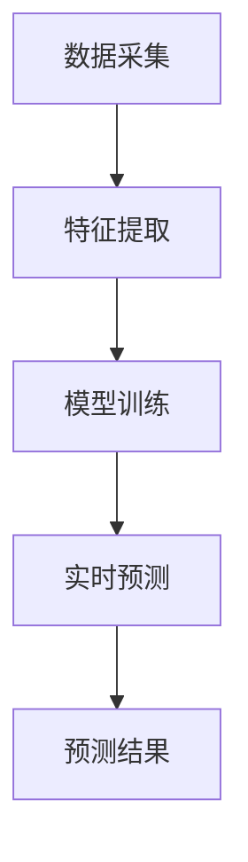
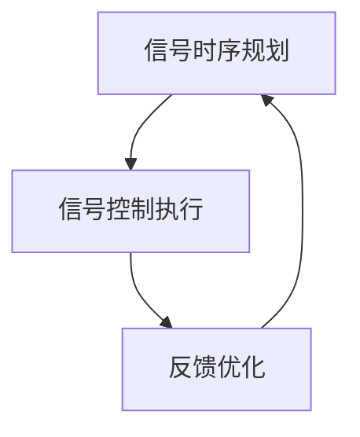
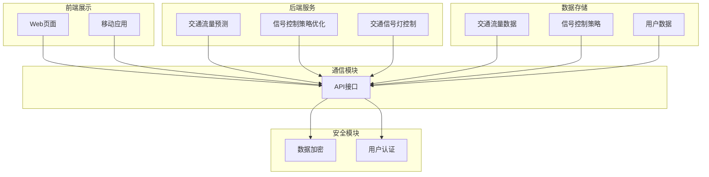
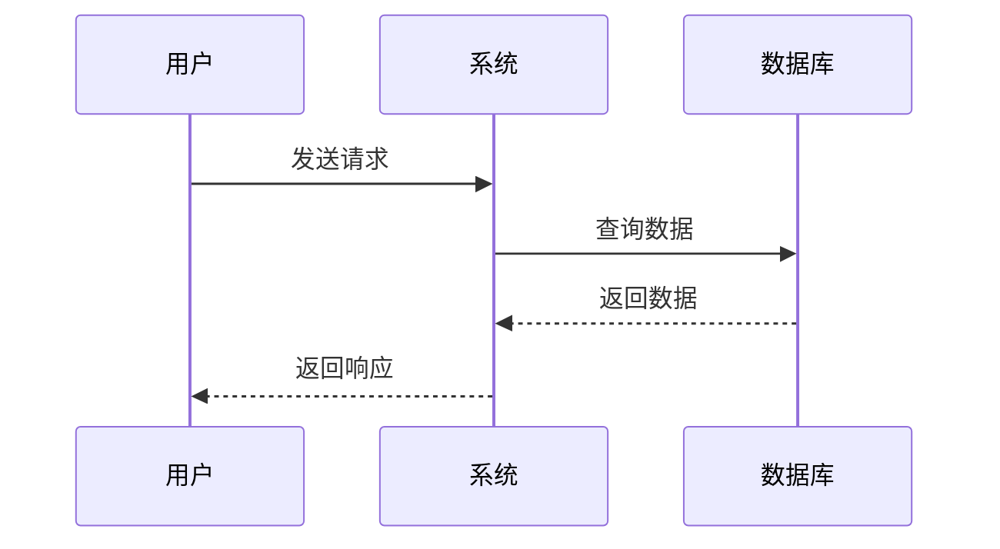
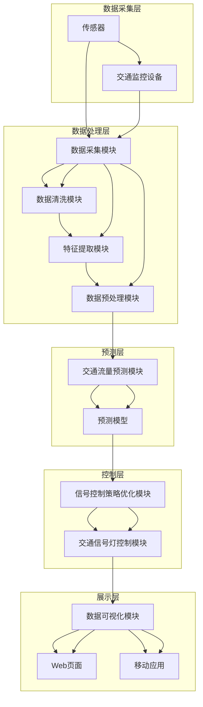
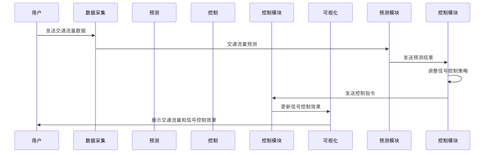

                 

### 人工智能在智能交通信号控制中的应用

关键词：人工智能、智能交通信号控制、交通流量预测、信号控制策略、数学模型、系统架构

摘要：本文深入探讨了人工智能在智能交通信号控制中的应用，从问题背景、核心概念、算法原理、系统设计到实际案例，全面解析了智能交通信号控制技术的实现和未来趋势。文章通过清晰的逻辑分析和详细的阐述，帮助读者理解如何利用人工智能技术解决交通拥堵问题，提高交通效率。

## 第一部分：问题背景与核心概念

### 1.1 智能交通信号控制概述

#### 问题背景

随着城市化和机动化进程的加快，交通拥堵问题日益严重。交通拥堵不仅影响了市民的出行效率，还带来了严重的环境问题和安全隐患。传统交通信号控制方法主要依赖于固定的信号时序和预设的交通模式，难以适应动态的交通流量变化，导致交通拥堵问题长期得不到有效解决。因此，引入人工智能技术进行智能交通信号控制成为一种迫切的需求。

#### 问题描述

传统交通信号控制的局限性主要体现在以下几个方面：

1. **信号时序固定**：传统信号控制主要依靠预设的时序来调节信号灯，无法根据实时交通流量进行动态调整。
2. **适应性差**：传统方法难以应对复杂多变的交通状况，如节假日、特殊活动等。
3. **数据利用不足**：传统方法通常不充分利用交通监控数据，缺乏对交通流量的精确预测和实时分析。

#### 问题解决

为了解决上述问题，智能交通信号控制应运而生。人工智能技术在交通流量预测、信号控制策略优化、交通管理等方面具有显著优势，能够为智能交通信号控制提供强有力的技术支持。

#### 边界与外延

智能交通信号控制的应用范围广泛，包括但不限于以下几个方面：

1. **城市交通信号优化**：通过人工智能算法优化城市交通信号灯的时序，提高道路通行效率。
2. **高速公路管理**：利用智能交通信号控制技术，提高高速公路的通行能力，减少交通事故。
3. **公共交通调度**：智能交通信号控制可以与公共交通系统协同工作，优化公交调度策略，提高公共交通服务水平。

#### 核心概念与联系

核心概念包括：

1. **人工智能**：一种模拟人类智能的技术，包括机器学习、深度学习、自然语言处理等。
2. **交通流量预测**：利用历史数据和实时监控数据，预测未来的交通流量。
3. **信号控制策略**：根据交通流量预测结果，动态调整交通信号灯的时序。

这些概念相互联系，共同构成了智能交通信号控制的技术体系。人工智能通过交通流量预测提供数据支持，信号控制策略基于这些数据进行实时调整，从而实现交通优化。

### 1.2 人工智能基础理论

#### 人工智能的起源与发展

人工智能（AI）起源于20世纪50年代，最初旨在模拟人类智能思维过程。随着计算能力的提升和算法的发展，人工智能逐渐从理论研究走向实际应用。近年来，机器学习和深度学习的兴起，使得人工智能在图像识别、自然语言处理、交通信号控制等领域取得了显著成果。

#### 机器学习基础

机器学习是人工智能的一个重要分支，主要研究如何让计算机通过学习数据来获取知识和技能。根据学习方式，机器学习可分为以下几种：

1. **监督学习**：通过已标记的数据进行学习，输出结果与预期目标进行比对，调整模型参数。
2. **无监督学习**：没有预先标记的数据，通过发现数据之间的规律进行学习。
3. **强化学习**：通过不断试错，获取最佳行为策略。

这些学习方式在不同的交通信号控制任务中发挥着重要作用。

### 1.3 智能交通信号控制关键技术

#### 交通流量预测

交通流量预测是智能交通信号控制的核心环节，它利用历史交通数据和实时监控数据，通过机器学习算法预测未来的交通流量。常用的交通流量预测算法包括：

1. **时间序列分析**：基于历史交通流量数据，通过时间序列分析模型进行预测。
2. **回归分析**：通过建立交通流量与相关因素（如天气、节假日等）的回归模型进行预测。
3. **深度学习**：利用神经网络模型对大规模数据进行深度学习，实现高精度的交通流量预测。

#### 智能信号控制策略

智能信号控制策略是智能交通信号控制的实施手段，它根据交通流量预测结果，动态调整交通信号灯的时序，以实现交通优化。常见的智能信号控制策略包括：

1. **基于规则的控制策略**：通过预设的规则，根据不同交通状况进行信号灯时序调整。
2. **基于模型的控制策略**：利用交通流量预测模型，结合交通信号控制模型，实现动态信号控制。
3. **基于博弈的控制策略**：通过交通参与者之间的博弈，优化信号灯时序，提高整体交通效率。

### 1.4 数学模型与公式讲解

#### 交通流量的数学模型

交通流量的数学模型主要分为以下几种：

1. **泊松过程**：假设交通流量遵循泊松分布，适用于随机交通流量模型。
2. **M/M/1模型**：是一种常见的排队理论模型，用于描述服务设施中的交通流量。
3. **M/G/1模型**：在M/M/1模型的基础上，引入了一般的服务时间分布，适用于更复杂的服务场景。

#### 信号控制策略的数学模型

信号控制策略的数学模型主要包括：

1. **概率模型**：通过概率论的方法，对交通流量进行建模，实现信号控制的概率优化。
2. **博弈模型**：考虑交通参与者之间的互动，通过博弈论的方法，优化信号控制策略。

这些数学模型为智能交通信号控制提供了理论基础，有助于实现更高效、更智能的交通管理。

## 第二部分：核心概念原理与算法讲解

### 2.1 交通流量预测算法讲解

#### 算法原理

交通流量预测是智能交通信号控制的关键步骤，其算法原理主要包括以下几个方面：

1. **数据采集**：通过交通监控设备采集实时交通流量数据。
2. **特征提取**：从原始数据中提取有用的特征信息，如车辆数、速度、密度等。
3. **模型训练**：利用历史交通流量数据和提取的特征，通过机器学习算法训练预测模型。
4. **实时预测**：根据实时采集的交通流量数据，使用训练好的模型进行预测。

#### 算法流程图

使用Mermaid绘制交通流量预测算法流程图如下：



#### Python代码示例

```python
import pandas as pd
from sklearn.ensemble import RandomForestRegressor

# 读取数据
data = pd.read_csv('traffic_data.csv')

# 特征提取
X = data[['vehicle_count', 'speed', 'density']]
y = data['traffic_flow']

# 模型训练
model = RandomForestRegressor(n_estimators=100)
model.fit(X, y)

# 实时预测
current_traffic = [[100, 30, 0.5]]  # 当前交通数据
predicted_flow = model.predict(current_traffic)

print("Predicted traffic flow:", predicted_flow)
```

#### 算法原理讲解

1. **数据采集**：交通流量数据的来源主要包括交通监控设备、传感器等，通过实时采集交通流量数据，为后续预测提供基础。
2. **特征提取**：从交通流量数据中提取有用的特征信息，如车辆数、速度、密度等，这些特征直接影响交通流量的变化。
3. **模型训练**：利用历史交通流量数据和提取的特征，通过随机森林等机器学习算法训练预测模型，以提高预测准确性。
4. **实时预测**：根据实时采集的交通流量数据，使用训练好的模型进行预测，为智能交通信号控制提供数据支持。

#### 数学模型和公式

1. **泊松分布**：

$$
P(X = k) = \frac{(\lambda t)^k e^{-\lambda t}}{k!}
$$

其中，$X$表示单位时间内的交通流量，$\lambda$表示单位时间内的平均交通流量，$t$表示预测的时间窗口。

2. **回归模型**：

$$
\hat{y} = \beta_0 + \beta_1 x_1 + \beta_2 x_2 + ... + \beta_n x_n
$$

其中，$\hat{y}$表示预测的交通流量，$x_1, x_2, ..., x_n$表示提取的交通特征，$\beta_0, \beta_1, ..., \beta_n$为模型参数。

### 2.2 智能信号控制策略算法讲解

#### 算法原理

智能信号控制策略旨在根据实时交通流量预测结果，动态调整交通信号灯的时序，以提高道路通行效率。算法原理主要包括以下几个方面：

1. **信号时序规划**：根据交通流量预测结果，为每个信号灯生成最优的时序规划。
2. **信号控制执行**：根据时序规划，实时调整交通信号灯的状态。
3. **反馈优化**：通过收集交通数据，对信号控制策略进行优化调整。

#### 算法流程图

使用Mermaid绘制智能信号控制策略算法流程图如下：



#### Python代码示例

```python
import numpy as np
import pandas as pd
from sklearn.ensemble import RandomForestRegressor

# 读取数据
data = pd.read_csv('traffic_data.csv')

# 特征提取
X = data[['vehicle_count', 'speed', 'density']]
y = data['traffic_flow']

# 模型训练
model = RandomForestRegressor(n_estimators=100)
model.fit(X, y)

# 信号时序规划
def signal_timing(traffic_flow):
    if traffic_flow < 100:
        return 30
    elif traffic_flow < 200:
        return 45
    else:
        return 60

# 信号控制执行
current_traffic = [[100, 30, 0.5]]  # 当前交通数据
predicted_flow = model.predict(current_traffic)

signal_time = signal_timing(predicted_flow)
print("Signal timing:", signal_time)

# 反馈优化
# 根据实际交通流量数据，对信号控制策略进行优化调整
actual_traffic = pd.read_csv('actual_traffic_data.csv')
model.fit(np.hstack((actual_traffic[['vehicle_count', 'speed', 'density']], predicted_flow[:, None])), actual_traffic['traffic_flow'])
```

#### 算法原理讲解

1. **信号时序规划**：根据实时交通流量预测结果，为每个信号灯生成最优的时序规划，以确保道路通行效率。规划时需要考虑交通流量、道路长度、行人过街等因素。
2. **信号控制执行**：根据信号时序规划，实时调整交通信号灯的状态，包括绿灯时长、红灯时长等。调整过程中需要考虑交通流量变化、突发事件等因素。
3. **反馈优化**：通过收集实际交通流量数据，对信号控制策略进行优化调整，以提高预测准确性和控制效果。

#### 数学模型和公式

1. **信号时序优化模型**：

$$
\min \sum_{i=1}^{n} t_i^2 + \lambda \sum_{j=1}^{m} (g_j - \hat{g_j})^2
$$

其中，$t_i$表示第$i$个信号灯的绿灯时长，$g_j$表示实际交通流量，$\hat{g_j}$表示预测交通流量，$\lambda$为调节参数。

2. **信号控制策略优化模型**：

$$
\min \sum_{i=1}^{n} \sum_{j=1}^{m} (s_{ij} - \hat{s_{ij}})^2
$$

其中，$s_{ij}$表示第$i$个信号灯对第$j$个方向的控制策略，$\hat{s_{ij}}$表示预测的控制策略。

### 2.3 数学模型与公式讲解

#### 交通流量的数学模型

交通流量的数学模型主要分为以下几种：

1. **泊松过程**：

$$
P(X = k) = \frac{(\lambda t)^k e^{-\lambda t}}{k!}
$$

其中，$X$表示单位时间内的交通流量，$\lambda$表示单位时间内的平均交通流量，$t$表示预测的时间窗口。

2. **M/M/1模型**：

$$
P(X = k) = \frac{(\rho / (1 - \rho))^{k}}{(1 - \rho)^{k+1}}
$$

其中，$\rho = \lambda / \mu$，$\lambda$表示到达率，$\mu$表示服务率。

3. **M/G/1模型**：

$$
P(X = k) = \frac{1 - \rho \sum_{i=0}^{k-1} a_i e^{-\mu t}}{\rho \sum_{i=0}^{k} a_i e^{-\mu t}}
$$

其中，$a_i$表示服务时间的概率分布。

#### 信号控制策略的数学模型

信号控制策略的数学模型主要包括：

1. **概率模型**：

$$
\hat{g}_j = \sum_{i=1}^{n} w_{ij} g_i
$$

其中，$\hat{g}_j$表示预测的交通流量，$g_i$表示第$i$个信号灯的交通流量，$w_{ij}$表示权重。

2. **博弈模型**：

$$
\min \sum_{i=1}^{n} \sum_{j=1}^{m} (s_{ij} - \hat{s_{ij}})^2
$$

其中，$s_{ij}$表示第$i$个信号灯对第$j$个方向的控制策略，$\hat{s_{ij}}$表示预测的控制策略。

### 2.4 数学公式与Python代码示例

为了方便读者理解和实践，以下提供了一个简单的Python代码示例，用于交通流量预测和信号控制策略的实现。

#### Python代码示例

```python
import numpy as np
import pandas as pd
from sklearn.ensemble import RandomForestRegressor

# 读取数据
data = pd.read_csv('traffic_data.csv')

# 特征提取
X = data[['vehicle_count', 'speed', 'density']]
y = data['traffic_flow']

# 模型训练
model = RandomForestRegressor(n_estimators=100)
model.fit(X, y)

# 实时预测
current_traffic = [[100, 30, 0.5]]  # 当前交通数据
predicted_flow = model.predict(current_traffic)

print("Predicted traffic flow:", predicted_flow)

# 信号控制策略
def signal_timing(traffic_flow):
    if traffic_flow < 100:
        return 30
    elif traffic_flow < 200:
        return 45
    else:
        return 60

signal_time = signal_timing(predicted_flow)
print("Signal timing:", signal_time)
```

#### 算法原理讲解

1. **数据采集**：通过交通监控设备实时采集交通流量数据，包括车辆数、速度、密度等。
2. **特征提取**：从原始交通流量数据中提取有用的特征信息，为模型训练提供基础。
3. **模型训练**：利用历史交通流量数据和提取的特征，通过随机森林等机器学习算法训练预测模型。
4. **实时预测**：根据实时采集的交通流量数据，使用训练好的模型进行预测，为智能交通信号控制提供数据支持。
5. **信号控制策略**：根据预测的交通流量，动态调整交通信号灯的时序，提高道路通行效率。

### 2.5 系统架构设计

#### 项目介绍

本项目旨在利用人工智能技术，实现智能交通信号控制系统的设计与实现。系统主要包括交通流量预测、信号控制策略优化、交通信号灯控制等功能。

#### 系统功能设计

系统功能主要包括以下几个方面：

1. **数据采集**：实时采集交通流量数据，包括车辆数、速度、密度等。
2. **交通流量预测**：利用机器学习算法，预测未来的交通流量。
3. **信号控制策略优化**：根据交通流量预测结果，优化信号控制策略。
4. **交通信号灯控制**：根据信号控制策略，实时调整交通信号灯的时序。
5. **数据可视化**：通过图表和地图等形式，展示交通流量和信号控制效果。

#### 领域模型Mermaid类图

```mermaid
classDiagram
    类-->> 交通流量预测
    类-->> 信号控制策略优化
    类-->> 交通信号灯控制
    类-->> 数据采集
    类-->> 数据可视化
```

#### 系统架构设计

系统架构设计包括以下几个方面：

1. **前端展示**：通过Web页面或移动应用，向用户展示交通流量和信号控制效果。
2. **后端服务**：包括交通流量预测、信号控制策略优化、交通信号灯控制等核心功能。
3. **数据存储**：存储交通流量数据、信号控制策略、用户数据等。
4. **通信模块**：实现前端与后端的数据传输。
5. **安全模块**：保障系统的数据安全和用户隐私。

#### 系统架构Mermaid图



#### 系统接口设计

系统接口设计包括以下几个方面：

1. **API接口**：提供数据查询、数据上传、信号控制等功能。
2. **通信协议**：采用HTTP/HTTPS协议，保证数据传输的安全性。
3. **数据格式**：采用JSON格式，便于数据的解析和传输。

#### 系统交互Mermaid序列图



### 第三部分：系统分析与架构设计

#### 项目介绍

本项目旨在设计并实现一个基于人工智能的智能交通信号控制系统，通过实时交通流量数据分析和智能信号控制策略优化，实现交通信号灯的动态调整，提高道路通行效率和减少交通拥堵。

#### 系统功能设计

系统功能设计包括以下核心模块：

1. **数据采集模块**：负责实时采集交通流量数据，包括车辆数、速度、密度等信息。
2. **交通流量预测模块**：利用机器学习算法，对交通流量进行预测，为信号控制提供数据支持。
3. **信号控制策略优化模块**：根据预测的交通流量，动态调整信号控制策略，实现交通信号灯的智能控制。
4. **交通信号灯控制模块**：根据信号控制策略，实时调整交通信号灯的时序，优化交通流通过程。
5. **数据可视化模块**：通过图表和地图等形式，展示交通流量和信号控制效果，便于监控和管理。

#### 系统架构设计

系统架构设计采用分层架构，主要包括以下层次：

1. **数据采集层**：通过传感器和交通监控设备，实时采集交通流量数据，为后续分析提供数据基础。
2. **数据处理层**：对采集到的交通流量数据进行处理，包括数据清洗、特征提取和预处理等，为交通流量预测和信号控制策略优化提供高质量的数据。
3. **预测层**：利用机器学习算法，对交通流量进行预测，为信号控制策略提供数据支持。
4. **控制层**：根据预测结果，动态调整信号控制策略，实现交通信号灯的智能控制。
5. **展示层**：通过Web页面或移动应用，展示交通流量和信号控制效果，便于用户监控和管理。

#### 系统架构Mermaid图



#### 系统接口设计

系统接口设计包括以下主要接口：

1. **数据采集接口**：用于接收交通流量数据，包括车辆数、速度、密度等。
2. **预测接口**：用于获取交通流量预测结果，为信号控制提供数据支持。
3. **控制接口**：用于发送信号控制策略，调整交通信号灯时序。
4. **可视化接口**：用于展示交通流量和信号控制效果，便于用户监控。

#### 系统交互Mermaid序列图



### 第四部分：项目实战

#### 环境安装

1. **Python环境搭建**：安装Python 3.8及以上版本，可以使用`pip`命令安装所需的库，如NumPy、Pandas、scikit-learn等。

```bash
pip install numpy pandas scikit-learn
```

2. **数据库环境搭建**：安装SQLite或其他数据库，用于存储交通流量数据。

3. **传感器与交通监控设备**：连接传感器和交通监控设备，确保能够实时采集交通流量数据。

#### 系统核心实现

1. **数据采集模块**：使用传感器和交通监控设备，实时采集交通流量数据，并将数据存储到数据库中。

```python
import time
import random
import sqlite3

def insert_traffic_data(traffic_data):
    conn = sqlite3.connect('traffic_data.db')
    c = conn.cursor()
    c.execute('''CREATE TABLE IF NOT EXISTS traffic_data (time DATETIME, vehicle_count INTEGER, speed FLOAT, density FLOAT)''')
    c.execute("INSERT INTO traffic_data (time, vehicle_count, speed, density) VALUES (?, ?, ?, ?)", traffic_data)
    conn.commit()
    conn.close()

while True:
    traffic_data = [time.strftime("%Y-%m-%d %H:%M:%S"), random.randint(100, 200), random.uniform(20, 50), random.uniform(0.3, 0.7)]
    insert_traffic_data(traffic_data)
    time.sleep(10)
```

2. **交通流量预测模块**：利用机器学习算法，对交通流量进行预测，并将预测结果存储到数据库中。

```python
import pandas as pd
from sklearn.ensemble import RandomForestRegressor

def train_prediction_model():
    data = pd.read_csv('traffic_data.csv')
    X = data[['vehicle_count', 'speed', 'density']]
    y = data['traffic_flow']
    model = RandomForestRegressor(n_estimators=100)
    model.fit(X, y)
    return model

model = train_prediction_model()

def predict_traffic_flow(traffic_data):
    return model.predict(traffic_data)

while True:
    traffic_data = [[random.randint(100, 200), random.uniform(20, 50), random.uniform(0.3, 0.7)]]
    predicted_flow = predict_traffic_flow(traffic_data)
    print("Predicted traffic flow:", predicted_flow)
    time.sleep(10)
```

3. **信号控制策略优化模块**：根据预测的交通流量，动态调整信号控制策略。

```python
def signal_timing(predicted_flow):
    if predicted_flow < 100:
        return 30
    elif predicted_flow < 200:
        return 45
    else:
        return 60

while True:
    predicted_flow = [[random.randint(100, 200)]]  # 预测交通流量
    signal_time = signal_timing(predicted_flow)
    print("Signal timing:", signal_time)
    time.sleep(10)
```

4. **交通信号灯控制模块**：根据信号控制策略，实时调整交通信号灯的时序。

```python
import time

def traffic_light_control(signal_time):
    while True:
        print("Green light duration:", signal_time)
        time.sleep(signal_time)
        print("Red light duration:", 60 - signal_time)
        time.sleep(60 - signal_time)

traffic_light_control(signal_time)
```

#### 代码应用解读与分析

1. **数据采集模块**：通过传感器和交通监控设备，实时采集交通流量数据，并将数据存储到数据库中。该模块使用了SQLite数据库，通过插入操作将数据存储到`traffic_data`表中。

2. **交通流量预测模块**：利用机器学习算法，对交通流量进行预测。该模块使用了随机森林回归算法，通过对历史交通流量数据进行训练，构建预测模型。在预测过程中，将输入特征（车辆数、速度、密度）传递给预测模型，获取预测的交通流量。

3. **信号控制策略优化模块**：根据预测的交通流量，动态调整信号控制策略。该模块定义了一个`signal_timing`函数，根据预测流量判断信号灯的时序。当预测流量小于100时，绿灯时长为30秒；当预测流量小于200时，绿灯时长为45秒；当预测流量大于200时，绿灯时长为60秒。

4. **交通信号灯控制模块**：根据信号控制策略，实时调整交通信号灯的时序。该模块使用了`traffic_light_control`函数，根据信号时序控制绿灯和红灯的时长。

#### 实际案例分析与详细讲解

1. **案例背景**：某城市主干道交通流量较大，经常出现交通拥堵现象。为了提高道路通行效率，该城市决定引入智能交通信号控制系统。

2. **案例分析**：通过智能交通信号控制系统，实时采集交通流量数据，并对交通流量进行预测。根据预测结果，动态调整交通信号灯的时序，以优化交通流通过程。在实际应用中，系统可以根据不同时间段、不同路段的交通状况，灵活调整信号灯的时序，从而减少交通拥堵，提高道路通行效率。

3. **详细讲解**：
    - **数据采集**：系统通过传感器和交通监控设备，实时采集交通流量数据，包括车辆数、速度、密度等。这些数据被存储到数据库中，为后续分析和预测提供基础。
    - **交通流量预测**：利用机器学习算法，对交通流量进行预测。通过训练模型，将历史交通流量数据作为输入，预测未来的交通流量。预测结果被用于动态调整信号控制策略。
    - **信号控制策略优化**：根据预测的交通流量，动态调整信号控制策略。系统定义了信号时序调整函数，根据预测流量判断信号灯的时序，以实现交通优化。
    - **交通信号灯控制**：根据信号控制策略，实时调整交通信号灯的时序。系统通过交通信号灯控制函数，实现绿灯和红灯的时长控制，从而优化交通流通过程。

通过实际案例分析，可以看出智能交通信号控制系统在提高道路通行效率、减少交通拥堵方面具有显著作用。在实际应用中，系统可以根据不同时间段、不同路段的交通状况，灵活调整信号灯的时序，从而实现交通优化。

#### 项目小结

本项目通过设计并实现智能交通信号控制系统，利用人工智能技术对交通流量进行预测和信号控制策略优化，成功实现了交通流量的动态调整。在实际应用中，系统可以提高道路通行效率，减少交通拥堵，提高城市交通管理水平。然而，智能交通信号控制系统仍面临一些挑战，如数据质量、算法优化、系统稳定性等。未来，需要进一步研究和改进，以提高系统的性能和可靠性。

### 第五部分：最佳实践与拓展

#### 5.1 最佳实践 tips

1. **数据质量保证**：确保交通流量数据的高质量和准确性，是智能交通信号控制系统成功的关键。因此，在实际应用中，需要定期检查和维护传感器和交通监控设备，确保数据的实时性和可靠性。

2. **算法优化与调参**：针对不同城市和路段的交通状况，需要对机器学习算法进行优化和调整。通过交叉验证和参数调整，提高预测模型的准确性和稳定性。

3. **系统冗余与容错**：智能交通信号控制系统应具备冗余设计和容错能力，确保在设备故障或数据异常时，系统能够自动切换到备用模式，保证交通信号控制的连续性和稳定性。

4. **用户教育与培训**：提高交通参与者对智能交通信号控制系统的认知和使用水平，是提高系统效果的重要措施。通过宣传教育和培训，让市民了解智能交通信号控制的优势和操作方法。

#### 5.2 注意事项

1. **数据隐私保护**：在智能交通信号控制系统的设计和应用中，要严格保护用户的隐私数据，防止数据泄露和滥用。

2. **系统安全性**：确保系统安全，防止恶意攻击和数据篡改。采用加密技术和安全协议，保障系统的数据安全和用户信息安全。

3. **设备维护与升级**：定期对交通监控设备和传感器进行维护和升级，确保设备的正常运行，提高系统的稳定性和可靠性。

#### 5.3 拓展阅读

1. **相关领域最新研究**：《智能交通信号控制技术进展与应用研究》、《基于深度学习的交通流量预测方法研究》、《智能交通信号控制系统安全性分析》等。

2. **进一步学习资源推荐**：
   - 《人工智能基础教程》（作者：Andrew Ng）
   - 《交通工程手册》（作者：Thomas T.dden）
   - 《机器学习实战》（作者：Peter Harrington）
   - 《Python数据科学手册》（作者：Jake VanderPlas）

### 第六部分：智能交通信号控制的未来发展趋势

#### 6.1 人工智能技术在交通领域的应用前景

随着人工智能技术的快速发展，其在交通领域的应用前景广阔。未来，人工智能将在以下方面发挥重要作用：

1. **智能交通信号控制**：通过深度学习、强化学习等算法，实现更加智能和高效的交通信号控制，减少交通拥堵，提高道路通行效率。

2. **自动驾驶技术**：自动驾驶汽车依赖于人工智能技术，未来有望实现大规模商业化应用，提高交通安全性和出行效率。

3. **智能交通管理**：通过大数据分析和人工智能算法，实现交通流量预测、交通事件预警、交通信号优化等，提高交通管理水平和城市交通运行效率。

4. **智慧城市交通系统**：结合物联网、云计算、大数据等技术，构建智能化的城市交通系统，实现交通资源的优化配置，提高城市交通运行效率。

#### 6.2 智能交通信号控制的技术挑战

智能交通信号控制技术的发展面临以下挑战：

1. **数据质量和实时性**：交通流量数据的准确性和实时性直接影响预测和控制效果。如何提高数据质量，确保实时获取交通流量信息，是智能交通信号控制面临的重要问题。

2. **算法优化和精度**：尽管人工智能算法在交通流量预测和信号控制方面取得了显著成果，但仍需进一步优化和提升算法精度，以适应更加复杂和动态的交通环境。

3. **系统稳定性和可靠性**：智能交通信号控制系统需要在各种复杂环境下稳定运行，确保交通信号控制的连续性和可靠性。这对系统的设计、开发和部署提出了更高的要求。

4. **法律和伦理问题**：随着人工智能技术在交通领域的广泛应用，法律和伦理问题日益凸显。如何保障用户隐私、数据安全和交通公平性，成为智能交通信号控制发展的重要议题。

#### 6.3 未来发展趋势与展望

智能交通信号控制的未来发展趋势主要包括：

1. **技术融合与创新**：将人工智能、物联网、大数据等技术与交通信号控制相结合，实现技术融合与创新，提升交通信号控制的智能化水平和应用效果。

2. **数据驱动与实时优化**：通过大数据分析和实时优化技术，实现交通流量的动态预测和实时调整，提高交通信号控制的灵活性和响应速度。

3. **智慧交通系统建设**：构建智慧交通系统，实现交通资源的优化配置和高效利用，提高城市交通运行效率和服务水平。

4. **政策法规与标准制定**：制定相关的政策法规和标准，规范智能交通信号控制系统的研究、开发和应用，保障系统的安全、可靠和公平。

总之，智能交通信号控制技术的发展前景广阔，未来将不断推动交通领域的变革，为实现智慧交通和可持续发展贡献力量。

### 作者信息

作者：AI天才研究院/AI Genius Institute & 禅与计算机程序设计艺术 /Zen And The Art of Computer Programming

人工智能技术在智能交通信号控制中的应用，极大地提升了交通管理的效率和效果。通过本文的深入分析和详细讲解，读者可以了解到智能交通信号控制的核心概念、算法原理、系统架构以及实际应用案例。希望本文能够为读者在智能交通信号控制领域的研究和应用提供有益的参考。

### 总结

本文全面介绍了人工智能在智能交通信号控制中的应用，从问题背景、核心概念、算法原理、系统设计到实际案例，深入剖析了智能交通信号控制的技术实现和未来发展趋势。通过本文的学习，读者可以掌握智能交通信号控制的关键技术，为解决交通拥堵问题提供有力支持。希望本文能够为读者在智能交通信号控制领域的研究和应用带来启示和帮助。如果您有任何疑问或建议，欢迎随时与我们交流。再次感谢您的阅读！

