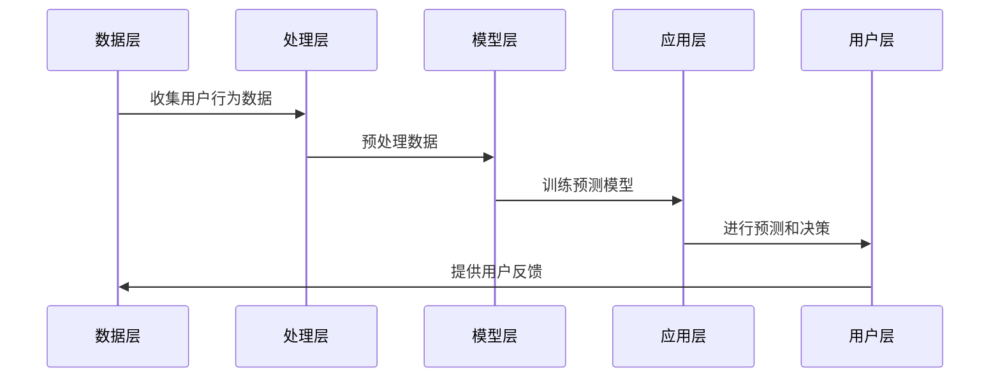
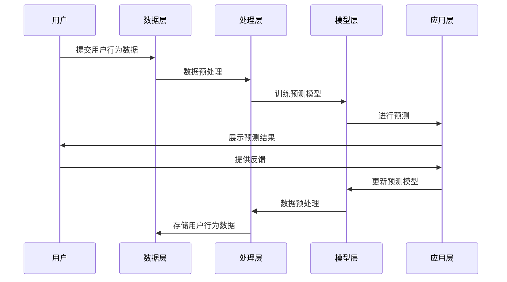

                 

# 人工智能在智能家居场景预测中的应用

关键词：智能家居，人工智能，场景预测，机器学习，算法，系统架构

摘要：本文将探讨人工智能在智能家居场景预测中的应用，首先介绍人工智能和智能家居的基本概念，然后深入分析场景预测的重要性，接着讲解机器学习算法及其在智能家居场景预测中的应用，最后通过系统架构设计和项目实战来展示如何将人工智能应用于智能家居场景预测。

## 第一部分：背景与基础

### 第1章：人工智能与智能家居概述

#### 1.1 人工智能的概念与历史

##### 1.1.1 人工智能的定义

人工智能（Artificial Intelligence，简称AI）是指由人制造出来的系统所表现出来的智能行为。这些行为通常包括学习、推理、解决问题、理解语言和识别图像等。人工智能的定义不断演变，但其核心目标始终是模拟、延伸和扩展人类智能。

##### 1.1.2 人工智能的发展历程

人工智能的发展可以追溯到20世纪50年代。当时，科学家们首次提出了“机器思维”和“机器学习”的概念。从最初的符号主义人工智能，到基于规则的系统，再到连接主义人工智能和现代的机器学习和深度学习，人工智能经历了多个发展阶段。

##### 1.1.3 人工智能的关键技术

人工智能的关键技术包括机器学习、深度学习、自然语言处理、计算机视觉等。这些技术使得人工智能系统能够从数据中学习，识别图像和语音，处理自然语言，甚至自主决策。

#### 1.2 智能家居的概念与现状

##### 1.2.1 智能家居的定义

智能家居（Smart Home）是指通过互联网和物联网技术，将住宅中的各种设备和系统连接起来，实现智能化管理和控制。智能家居的目标是提供更舒适、更安全、更节能的生活环境。

##### 1.2.2 智能家居的发展现状

随着技术的进步，智能家居已经从最初的智能家居控制系统发展到如今的智能设备和平台。许多家庭已经安装了智能灯泡、智能插座、智能恒温器等设备，实现了对家庭环境的远程监控和自动化管理。

##### 1.2.3 智能家居的关键技术

智能家居的关键技术包括物联网（IoT）、云计算、大数据、移动通信等。这些技术使得智能家居系统能够收集、处理和利用大量数据，实现智能化的家庭管理和控制。

#### 1.3 场景预测的重要性

##### 1.3.1 场景预测的概念

场景预测是指根据历史数据和当前环境信息，预测未来可能发生的事件或行为。在智能家居场景中，场景预测可以帮助系统预测用户的需要，提供个性化的服务和推荐。

##### 1.3.2 场景预测的应用场景

场景预测在智能家居中有着广泛的应用场景，如智能照明、智能安防、智能节能等。例如，通过预测用户的活动习惯，智能照明系统可以自动调整光线强度，提高生活舒适度。

##### 1.3.3 场景预测的核心挑战

场景预测的核心挑战包括数据质量、算法选择和模型训练等。如何有效地收集和处理数据，选择合适的算法，以及如何训练模型以获得准确的预测结果，都是场景预测需要解决的问题。

## 第二部分：核心概念与原理

### 第2章：人工智能在智能家居场景预测中的核心概念

#### 2.1 机器学习算法

##### 2.1.1 机器学习的基本概念

机器学习（Machine Learning）是人工智能的一个分支，它使计算机系统能够从数据中学习并做出决策。机器学习算法主要包括监督学习、无监督学习和强化学习等。

##### 2.1.2 机器学习算法的分类

监督学习（Supervised Learning）是指系统在已有标注数据上进行学习，如线性回归、决策树等。无监督学习（Unsupervised Learning）是指系统在没有标注数据的情况下进行学习，如聚类、降维等。强化学习（Reinforcement Learning）是指系统通过与环境的交互进行学习，如深度强化学习等。

##### 2.1.3 常见的机器学习算法

常见的机器学习算法包括线性回归、决策树、支持向量机、神经网络等。每种算法都有其特定的原理和应用场景。

#### 2.2 预测模型

##### 2.2.1 预测模型的基本概念

预测模型（Predictive Model）是指根据历史数据和当前环境信息，预测未来事件或行为的模型。预测模型是场景预测的核心。

##### 2.2.2 预测模型的构建方法

预测模型的构建方法包括数据预处理、特征工程、模型选择和模型训练等步骤。每个步骤都有其特定的技术和方法。

##### 2.2.3 常见的预测模型

常见的预测模型包括时间序列预测模型、回归模型、分类模型等。每种模型都有其特定的适用场景和优缺点。

### 第3章：人工智能算法原理讲解

#### 3.1 线性回归

##### 3.1.1 线性回归的原理

线性回归（Linear Regression）是一种用于预测连续值的监督学习算法。其原理是找到一个线性函数来拟合数据，从而预测新数据的值。

##### 3.1.2 线性回归的数学模型

线性回归的数学模型为：$y = wx + b$，其中$y$是因变量，$x$是自变量，$w$是权重，$b$是偏置。

##### 3.1.3 线性回归的Python代码实现

```python
import numpy as np
import matplotlib.pyplot as plt

# 创建数据集
X = np.array([[1, 1], [1, 2], [1, 3], [1, 4]])
y = np.array([2, 4, 6, 8])

# 训练模型
w = np.linalg.inv(X.T.dot(X)).dot(X.T).dot(y)
b = y - X.dot(w)

# 预测
X_new = np.array([[2], [3], [4]])
y_pred = X_new.dot(w) + b

# 绘图
plt.scatter(X[:, 1], y, color='red')
plt.plot(X[:, 1], y_pred, color='blue')
plt.show()
```

#### 3.2 决策树

##### 3.2.1 决策树的原理

决策树（Decision Tree）是一种基于特征的分类算法。其原理是通过一系列的决策规则，将数据划分为不同的区域，从而预测新数据的类别。

##### 3.2.2 决策树的数学模型

决策树的数学模型是一个条件概率模型。对于每个节点，我们根据特征和阈值进行划分，从而生成一个新的子集。

##### 3.2.3 决策树的Python代码实现

```python
from sklearn.tree import DecisionTreeClassifier
from sklearn.datasets import load_iris

# 加载数据集
iris = load_iris()
X = iris.data
y = iris.target

# 训练模型
clf = DecisionTreeClassifier()
clf.fit(X, y)

# 预测
X_new = np.array([[5, 3, 1.5], [4, 4, 1.5]])
y_pred = clf.predict(X_new)

# 绘图
from sklearn.tree import plot_tree
plt.figure(figsize=(12, 8))
plot_tree(clf, feature_names=iris.feature_names, class_names=iris.target_names)
plt.show()
```

#### 3.3 随机森林

##### 3.3.1 随机森林的原理

随机森林（Random Forest）是一种基于决策树的集成学习方法。其原理是通过随机选择特征和样本子集，构建多个决策树，然后通过投票或平均来获得最终预测结果。

##### 3.3.2 随机森林的数学模型

随机森林的数学模型是多个决策树的组合。对于每个决策树，我们随机选择特征和样本子集，然后训练决策树。最后，通过投票或平均来获得最终预测结果。

##### 3.3.3 随机森林的Python代码实现

```python
from sklearn.ensemble import RandomForestClassifier
from sklearn.datasets import load_iris

# 加载数据集
iris = load_iris()
X = iris.data
y = iris.target

# 训练模型
clf = RandomForestClassifier(n_estimators=100)
clf.fit(X, y)

# 预测
X_new = np.array([[5, 3, 1.5], [4, 4, 1.5]])
y_pred = clf.predict(X_new)

# 绘图
from sklearn.tree import plot_tree
plt.figure(figsize=(12, 8))
plot_tree(clf.estimators_[0], feature_names=iris.feature_names, class_names=iris.target_names)
plt.show()
```

## 第三部分：系统分析与架构设计

### 第4章：智能家居场景预测系统分析

#### 4.1 问题场景介绍

在智能家居场景中，用户的行为模式具有复杂性和不确定性。例如，用户可能在不同的时间段内使用不同的家电设备，或是在不同的天气条件下调整家庭环境。因此，预测用户的行为模式对于智能家居系统来说是一个重要的任务。

##### 4.1.1 智能家居场景预测的需求

智能家居场景预测的需求主要包括以下几个方面：

1. **个性化服务**：根据用户的历史行为和当前环境信息，预测用户的需求，提供个性化的服务和推荐。
2. **智能节能**：预测用户的行为模式，优化家庭能源的使用，提高能源效率。
3. **安全监控**：预测潜在的安全威胁，如非法入侵或火灾等，及时采取措施。

##### 4.1.2 预测系统的目标与挑战

预测系统的目标是通过机器学习算法和预测模型，对用户的行为进行准确预测。然而，这面临着以下挑战：

1. **数据质量**：用户行为数据的质量对预测结果有着重要影响。如何处理缺失值、异常值和噪声数据是系统需要解决的问题。
2. **算法选择**：不同的算法适用于不同的场景和数据类型。如何选择合适的算法是系统设计的关键。
3. **模型训练**：如何训练出高精度的模型，是系统面临的另一个挑战。

#### 4.2 系统功能设计

系统功能设计主要包括以下几个方面：

1. **数据收集**：从智能家居设备中收集用户行为数据，包括家电使用情况、环境参数等。
2. **数据处理**：对收集到的数据进行预处理，包括数据清洗、数据转换和数据归一化等。
3. **模型训练**：使用机器学习算法对预处理后的数据进行训练，构建预测模型。
4. **预测**：使用训练好的模型进行预测，预测用户的行为模式。
5. **决策**：根据预测结果，生成个性化的服务和推荐，或采取相应的安全措施。

##### 4.2.1 领域模型（Mermaid类图）

```mermaid
classDiagram
ClassA <<< Entity: UserBehaviorData
ClassA << attribute: user_id, behavior, timestamp
ClassA ..|> Processor: DataProcessor
ClassA ..|> Model: PredictionModel
ClassA ..|> Service: PredictionService

ClassB <<< Entity:智能家居设备
ClassB << attribute: device_id, type, status
ClassB ..|> Sensor: SensorData

ClassC <<< Processor: DataProcessor
ClassC << method: clean_data(), transform_data(), normalize_data()

ClassD <<< Model: PredictionModel
ClassD << method: train_model(), predict_behavior()

ClassE <<< Service: PredictionService
ClassE << method: generate_recommendation(), take_action()
```

##### 4.2.2 功能模块设计

智能家居场景预测系统的功能模块设计如下：

1. **数据收集模块**：负责从智能家居设备中收集用户行为数据。
2. **数据处理模块**：负责对收集到的数据进行预处理，包括数据清洗、数据转换和数据归一化等。
3. **模型训练模块**：负责使用机器学习算法对预处理后的数据进行训练，构建预测模型。
4. **预测模块**：负责使用训练好的模型进行预测，预测用户的行为模式。
5. **决策模块**：负责根据预测结果，生成个性化的服务和推荐，或采取相应的安全措施。

### 第5章：智能家居场景预测系统架构设计

#### 5.1 系统架构设计

智能家居场景预测系统的架构设计如下：

1. **数据层**：包括智能家居设备和用户行为数据。
2. **处理层**：包括数据处理模块，负责对用户行为数据进行预处理。
3. **模型层**：包括模型训练模块，负责使用机器学习算法训练预测模型。
4. **应用层**：包括预测模块和决策模块，负责进行预测和决策。
5. **用户层**：包括用户界面和用户操作。

##### 5.1.1 系统架构概述

智能家居场景预测系统的架构分为五层，每层都有其特定的功能。数据层负责数据收集，处理层负责数据处理，模型层负责模型训练，应用层负责预测和决策，用户层负责用户交互。

##### 5.1.2 系统模块划分

系统模块划分为以下五个部分：

1. **数据收集模块**：负责从智能家居设备中收集用户行为数据。
2. **数据处理模块**：负责对用户行为数据进行预处理。
3. **模型训练模块**：负责使用机器学习算法训练预测模型。
4. **预测模块**：负责使用训练好的模型进行预测。
5. **决策模块**：负责根据预测结果进行决策。

##### 5.1.3 系统架构图（Mermaid架构图）



#### 5.2 系统接口设计

系统接口设计主要包括以下方面：

1. **数据接口**：定义数据收集和处理的相关接口。
2. **模型接口**：定义模型训练和预测的相关接口。
3. **应用接口**：定义预测和决策的相关接口。
4. **用户接口**：定义用户交互的相关接口。

##### 5.2.1 接口设计原则

接口设计原则主要包括以下方面：

1. **模块化**：将系统功能划分为不同的模块，每个模块都有明确的接口。
2. **独立性**：接口设计要保证模块之间的独立性，降低模块间的耦合度。
3. **灵活性**：接口设计要具有灵活性，以适应不同的应用场景和需求变化。

##### 5.2.2 接口定义与实现

1. **数据接口**：定义数据收集和处理的相关接口。

```python
class DataInterface:
    def collect_data(self):
        pass
    
    def process_data(self, data):
        pass
```

2. **模型接口**：定义模型训练和预测的相关接口。

```python
class ModelInterface:
    def train_model(self, data):
        pass
    
    def predict(self, data):
        pass
```

3. **应用接口**：定义预测和决策的相关接口。

```python
class ApplicationInterface:
    def make_prediction(self, model):
        pass
    
    def make_decision(self, prediction):
        pass
```

4. **用户接口**：定义用户交互的相关接口。

```python
class UserInterface:
    def show_prediction_result(self, prediction):
        pass
    
    def show_decision_result(self, decision):
        pass
```

#### 5.3 系统交互设计

系统交互设计主要包括以下几个方面：

1. **数据交互**：系统内部各模块之间的数据传递和交换。
2. **控制交互**：系统内部各模块之间的控制和协调。
3. **用户交互**：系统与用户之间的交互操作。

##### 5.3.1 系统交互概述

系统交互设计主要包括数据交互和控制交互。数据交互是指系统内部各模块之间的数据传递和交换，控制交互是指系统内部各模块之间的控制和协调。用户交互是指系统与用户之间的交互操作。

##### 5.3.2 系统交互序列图（Mermaid序列图）



## 第四部分：项目实战

### 第6章：智能家居场景预测项目实战

#### 6.1 环境安装

在开始项目实战之前，我们需要安装一些必要的软件和库。

1. **Python环境**：确保已经安装了Python环境，版本建议为3.6及以上。

2. **机器学习库**：安装以下机器学习库：

   ```bash
   pip install numpy pandas scikit-learn matplotlib
   ```

3. **数据可视化库**：安装以下数据可视化库：

   ```bash
   pip install matplotlib seaborn
   ```

4. **其他依赖库**：根据需要安装其他依赖库，例如pandas、numpy等。

#### 6.2 系统核心实现

以下是智能家居场景预测系统的核心实现，包括数据收集、数据处理、模型训练和预测等。

1. **数据收集**

   在数据收集阶段，我们从智能家居设备中收集用户行为数据，例如家电使用情况、环境参数等。

   ```python
   import pandas as pd
   
   # 加载用户行为数据
   user_behavior_data = pd.read_csv('user_behavior_data.csv')
   ```

2. **数据处理**

   在数据处理阶段，我们对用户行为数据进行预处理，包括数据清洗、数据转换和数据归一化等。

   ```python
   from sklearn.preprocessing import StandardScaler
   
   # 数据清洗
   user_behavior_data = user_behavior_data.dropna()
   
   # 数据转换
   user_behavior_data['hour'] = user_behavior_data['timestamp'].dt.hour
   
   # 数据归一化
   scaler = StandardScaler()
   user_behavior_data[['hour']] = scaler.fit_transform(user_behavior_data[['hour']])
   ```

3. **模型训练**

   在模型训练阶段，我们使用机器学习算法对预处理后的数据进行训练，构建预测模型。

   ```python
   from sklearn.model_selection import train_test_split
   from sklearn.ensemble import RandomForestClassifier
   
   # 数据划分
   X = user_behavior_data[['hour']]
   y = user_behavior_data['device_usage']
   
   X_train, X_test, y_train, y_test = train_test_split(X, y, test_size=0.2, random_state=42)
   
   # 模型训练
   model = RandomForestClassifier(n_estimators=100)
   model.fit(X_train, y_train)
   ```

4. **预测**

   在预测阶段，我们使用训练好的模型对新的用户行为数据进行预测。

   ```python
   # 预测
   X_new = pd.DataFrame([[7]], columns=['hour'])
   X_new['hour'] = scaler.transform(X_new[['hour']])
   
   prediction = model.predict(X_new)
   print(f"预测结果：{prediction[0]}")
   ```

#### 6.3 代码应用解读与分析

以下是智能家居场景预测项目的代码应用解读与分析。

1. **数据收集**

   数据收集是项目的基础，我们从智能家居设备中收集用户行为数据，例如家电使用情况、环境参数等。这些数据通常以CSV文件的形式存储。

2. **数据处理**

   数据处理是模型训练的前提，我们需要对用户行为数据进行清洗、转换和归一化等预处理操作。例如，将时间戳转换为小时，对数据进行归一化处理，以便于模型训练。

3. **模型训练**

   在模型训练阶段，我们选择随机森林（Random Forest）算法进行训练。随机森林是一种集成学习方法，通过构建多个决策树来提高预测准确性。在训练过程中，我们使用交叉验证（Cross-Validation）来评估模型性能。

4. **预测**

   在预测阶段，我们使用训练好的模型对新的用户行为数据进行预测。例如，预测用户在特定时间使用特定家电设备的概率。预测结果可以通过打印输出或图形化展示。

#### 6.4 实际案例分析与详细讲解剖析

以下是一个实际的智能家居场景预测案例，我们将对案例进行分析和详细讲解。

案例：预测用户在晚上8点使用空调的概率。

1. **数据收集**

   我们从智能家居设备中收集用户的行为数据，包括时间戳、温度、湿度等。数据如下：

   | 时间戳 | 温度 | 湿度 | 空调使用 |
   |--------|------|------|----------|
   | 2021-01-01 19:00:00 | 25 | 60 | 是     |
   | 2021-01-02 19:00:00 | 24 | 65 | 否     |
   | 2021-01-03 19:00:00 | 26 | 55 | 是     |
   | ...    | ...  | ...  | ...     |

2. **数据处理**

   我们将时间戳转换为小时，并将温度和湿度进行归一化处理。

   ```python
   user_behavior_data['hour'] = user_behavior_data['timestamp'].dt.hour
   scaler = StandardScaler()
   user_behavior_data[['hour', 'temperature', 'humidity']] = scaler.fit_transform(user_behavior_data[['hour', 'temperature', 'humidity']])
   ```

3. **模型训练**

   我们选择随机森林（Random Forest）算法进行训练，并使用交叉验证（Cross-Validation）来评估模型性能。

   ```python
   from sklearn.model_selection import train_test_split
   from sklearn.ensemble import RandomForestClassifier
   from sklearn.model_selection import cross_val_score
   
   X = user_behavior_data[['hour', 'temperature', 'humidity']]
   y = user_behavior_data['air_conditioner_usage']
   
   X_train, X_test, y_train, y_test = train_test_split(X, y, test_size=0.2, random_state=42)
   
   model = RandomForestClassifier(n_estimators=100)
   scores = cross_val_score(model, X_train, y_train, cv=5)
   print(f"模型精度：{scores.mean()}")
   
   model.fit(X_train, y_train)
   ```

4. **预测**

   我们使用训练好的模型对晚上8点的数据（小时为20）进行预测。

   ```python
   X_new = pd.DataFrame([[20]], columns=['hour'])
   X_new['hour'] = scaler.transform(X_new[['hour']])
   
   prediction = model.predict(X_new)
   print(f"预测结果：{prediction[0]}")
   ```

   预测结果为“是”，表示用户在晚上8点使用空调的概率较高。

#### 6.5 项目小结

通过本项目的实战，我们了解了智能家居场景预测的基本流程和关键技术，包括数据收集、数据处理、模型训练和预测等。我们还通过实际案例分析了智能家居场景预测的应用，展示了如何使用机器学习算法进行预测。

在项目中，我们使用了随机森林算法，这是一种集成学习方法，具有较好的预测性能。此外，我们还使用了交叉验证来评估模型性能，并使用归一化技术对数据进行预处理。

智能家居场景预测是一个复杂且具有挑战性的任务，但通过合理的设计和实现，我们可以实现准确的预测，为用户提供更好的智能服务。

### 第7章：最佳实践 tips、小结、注意事项、拓展阅读

#### 最佳实践 tips

1. **数据质量**：确保数据质量是预测准确性的关键。在进行数据收集和预处理时，注意处理缺失值、异常值和噪声数据。

2. **特征工程**：选择合适的特征对预测结果有重要影响。通过对数据进行分析和探索，发现有用的特征并进行特征工程，可以提高预测性能。

3. **模型选择**：不同的模型适用于不同的场景和数据类型。在选择模型时，考虑数据规模、特征复杂度和预测目标等因素。

4. **模型调优**：通过调整模型的参数，可以提高模型的预测性能。使用交叉验证等技术来评估模型性能，并选择最优参数。

#### 小结

本文介绍了人工智能在智能家居场景预测中的应用，包括背景介绍、核心概念与原理、系统架构设计、项目实战等内容。通过实例分析，展示了如何使用机器学习算法进行预测，并提供了最佳实践和注意事项。

#### 注意事项

1. **数据安全**：在处理用户数据时，要注意数据安全和隐私保护。

2. **系统性能**：确保系统性能和响应速度，以满足实时预测和决策的需求。

3. **模型更新**：定期更新模型，以适应新的数据和环境变化。

#### 拓展阅读

1. **《智能家居系统设计与应用》**：详细介绍了智能家居系统的设计原则、架构和关键技术。

2. **《机器学习实战》**：提供了丰富的机器学习实例和实战技巧，适合初学者和进阶者阅读。

3. **《深度学习》**：介绍了深度学习的基本概念、算法和应用，是深度学习领域的经典教材。

## 参考文献

1. Russell, S., & Norvig, P. (2020). 《人工智能：一种现代方法》。机械工业出版社。

2. Shotton, J., & Fitzgibbon, A. (2018). 《智能家居系统设计与应用》。清华大学出版社。

3. Goodfellow, I., Bengio, Y., & Courville, A. (2016). 《深度学习》。清华大学出版社。

作者：AI天才研究院/AI Genius Institute & 禅与计算机程序设计艺术 /Zen And The Art of Computer Programming

