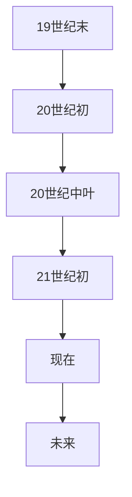

                 

# 《人工智能在气候变化模拟中的应用》

> 关键词：人工智能、气候变化、模拟、机器学习、深度学习、强化学习

> 摘要：本文旨在探讨人工智能技术在气候变化模拟中的应用，分析其在气候数据预处理、气候变化预测和情景分析等方面的作用。通过介绍人工智能的基本概念、关键技术以及在气候变化模拟中的具体应用，本文揭示了人工智能在应对全球气候变化挑战中的巨大潜力。

## 第一部分：引言与背景

### 第1章：问题背景与重要性

#### 1.1 气候变化现状

当前，全球气候变化已成为不争的事实。根据联合国气候变化框架公约（UNFCCC）发布的《气候变化2021：合成报告》，地球的平均气温已经比工业化前水平高出约1.1摄氏度。这种全球变暖趋势对地球生态系统、人类生活和社会经济发展产生了深远的影响。

#### 1.1.1 全球气候变化趋势

自19世纪末以来，地球的年平均气温逐渐上升。根据全球气温监测数据，过去几十年里，地球的气温上升速度加快，特别是在21世纪初。以下图表展示了全球气温的变化趋势：



#### 1.1.2 气候变化对环境和社会的影响

气候变化对环境和社会的影响是多层次、多方面的。以下是气候变化对环境和社会的主要影响：

1. **生态系统破坏**：气候变化导致极端天气事件增多，如干旱、洪水、飓风等，对生态系统造成严重破坏。
2. **物种灭绝**：气温升高导致一些物种的栖息地丧失，许多物种面临灭绝风险。
3. **水资源变化**：气候变化影响水资源的分布和可用性，许多地区面临水资源短缺问题。
4. **农业影响**：气候变化影响农作物生长，导致粮食产量下降。
5. **公共卫生问题**：气候变化可能导致传染病传播范围扩大，影响人类健康。

#### 1.1.3 气候变化研究的重要性

气候变化研究对于了解气候变化的机制、预测未来气候变化的趋势以及制定应对策略具有重要意义。以下是一些气候变化研究的重要性：

1. **预测未来气候变化**：通过研究气候变化的历史数据和模拟模型，可以预测未来气候变化的趋势，为政策制定提供科学依据。
2. **评估气候变化影响**：研究气候变化对生态系统、农业、水资源和公共卫生的影响，有助于制定针对性的应对措施。
3. **应对气候变化挑战**：通过研究气候变化的原因和影响，可以找到有效的应对策略，减轻气候变化带来的负面影响。

### 第2章：人工智能与气候变化模拟

#### 2.1 人工智能概述

人工智能（Artificial Intelligence, AI）是指由人制造出的系统所表现出的智能行为。人工智能的研究始于20世纪50年代，近年来随着计算机技术和大数据技术的发展，人工智能取得了显著的进展。

#### 2.1.1 人工智能的定义与发展历程

人工智能的定义有多种，其中一种常见的定义是：“人工智能是使计算机系统能够模拟、扩展和执行人类智能行为的技术。”人工智能的发展历程可以划分为以下几个阶段：

1. **早期探索阶段（1950-1969）**：人工智能的概念被提出，科学家们开始研究如何使计算机模拟人类思维过程。
2. **黄金时期（1970-1989）**：人工智能研究取得了初步成果，如专家系统、自然语言处理等。
3. **低谷期（1990-2000）**：由于技术限制，人工智能研究陷入低谷。
4. **复兴时期（2000至今）**：随着大数据、深度学习等技术的发展，人工智能迎来了新的春天，应用范围不断扩大。

#### 2.1.2 人工智能的关键技术

人工智能的关键技术包括：

1. **机器学习**：通过训练模型，使计算机能够自动地从数据中学习并做出决策。
2. **深度学习**：一种基于人工神经网络的机器学习方法，通过多层神经网络进行数据建模。
3. **自然语言处理**：使计算机能够理解、生成和回应人类语言。
4. **计算机视觉**：使计算机能够识别和理解视觉信息。
5. **机器人技术**：通过人工智能技术，使机器人能够自主执行任务。

#### 2.2 气候变化模拟的基本原理

气候变化模拟是通过建立数学模型和计算机模拟来模拟地球气候系统，从而预测未来气候变化的趋势。以下是气候变化模拟的基本原理：

1. **气候系统模型**：气候变化模拟依赖于气候系统模型，这些模型描述了地球气候系统的物理、化学和生物过程。
2. **初始条件**：气候变化模拟需要设定初始条件，如大气温度、湿度、二氧化碳浓度等。
3. **边界条件**：边界条件包括地球表面的地形、海洋环流、太阳辐射等。
4. **模拟过程**：通过计算机模拟，将初始条件和边界条件输入到气候系统模型中，模拟地球气候系统的演化过程。

#### 2.2.1 气候变化模拟的必要性

气候变化模拟的必要性体现在以下几个方面：

1. **预测未来气候变化趋势**：通过模拟，可以预测未来气候变化的趋势，为政策制定提供科学依据。
2. **评估气候变化影响**：通过模拟，可以评估气候变化对生态系统、农业、水资源和公共卫生的影响，为应对气候变化提供指导。
3. **评估应对策略的效果**：通过模拟，可以评估各种应对气候变化策略的效果，帮助制定更有效的策略。

## 第二部分：人工智能技术在气候变化模拟中的应用

### 第3章：机器学习在气候变化模拟中的应用

#### 3.1 机器学习基础

机器学习（Machine Learning, ML）是一种人工智能技术，它使计算机系统能够从数据中学习并做出决策。以下是机器学习的基本概念和主要方法：

#### 3.1.1 机器学习的基本概念

1. **监督学习**：监督学习是一种机器学习方法，它通过已知的输入和输出数据来训练模型，从而预测新的输出。
2. **无监督学习**：无监督学习是一种机器学习方法，它通过未知标签的数据来训练模型，从而发现数据中的模式和结构。
3. **强化学习**：强化学习是一种机器学习方法，它通过试错和奖励机制来训练模型，从而学习最优策略。

#### 3.1.2 机器学习的主要方法

1. **线性回归**：线性回归是一种监督学习方法，它通过拟合线性模型来预测输出。
2. **决策树**：决策树是一种监督学习方法，它通过构建决策树来预测输出。
3. **支持向量机**：支持向量机是一种监督学习方法，它通过找到最佳分隔超平面来分类数据。
4. **神经网络**：神经网络是一种无监督学习方法，它通过多层神经网络来学习数据中的模式和结构。

#### 3.2 机器学习在气候变化模拟中的应用

机器学习在气候变化模拟中的应用主要体现在以下几个方面：

1. **气候数据预处理**：机器学习可以用于处理和清洗大量气候数据，提高数据的可用性和准确性。
2. **气候变化预测**：机器学习可以用于预测未来气候变化的趋势，为政策制定提供科学依据。
3. **气候变化情景分析**：机器学习可以用于分析不同气候变化情景下的环境影响，帮助制定应对策略。

### 第4章：深度学习在气候变化模拟中的应用

#### 4.1 深度学习基础

深度学习（Deep Learning, DL）是一种基于人工神经网络的机器学习方法，它在图像识别、自然语言处理和语音识别等领域取得了显著的成果。以下是深度学习的基本概念和主要架构：

#### 4.1.1 深度学习的概念与发展

1. **卷积神经网络（CNN）**：卷积神经网络是一种深度学习模型，它通过卷积层和池化层来提取图像特征。
2. **循环神经网络（RNN）**：循环神经网络是一种深度学习模型，它通过循环结构来处理序列数据。
3. **长短时记忆网络（LSTM）**：长短时记忆网络是一种改进的循环神经网络，它通过记忆单元来处理长时间依赖问题。

#### 4.1.2 深度学习的主要架构

1. **全连接神经网络（FCNN）**：全连接神经网络是一种简单的深度学习模型，它通过全连接层来处理数据。
2. **卷积神经网络（CNN）**：卷积神经网络是一种复杂的深度学习模型，它通过卷积层、池化层和全连接层来处理图像数据。
3. **循环神经网络（RNN）**：循环神经网络是一种简单的深度学习模型，它通过循环结构来处理序列数据。

#### 4.2 深度学习在气候变化模拟中的应用

深度学习在气候变化模拟中的应用主要体现在以下几个方面：

1. **气候数据预测**：深度学习可以用于预测未来气候变化的趋势，为政策制定提供科学依据。
2. **气候变化情景分析**：深度学习可以用于分析不同气候变化情景下的环境影响，帮助制定应对策略。

### 第5章：强化学习在气候变化模拟中的应用

#### 5.1 强化学习基础

强化学习（Reinforcement Learning, RL）是一种通过试错和奖励机制来训练模型的机器学习方法。以下是强化学习的基本概念和主要算法：

#### 5.1.1 强化学习的定义与特点

1. **定义**：强化学习是一种机器学习方法，它通过试错和奖励机制来学习最优策略。
2. **特点**：强化学习具有以下特点：
   - **交互性**：强化学习模型通过与环境的交互来学习。
   - **适应性**：强化学习模型可以根据环境的变化进行调整。
   - **连续性**：强化学习模型可以处理连续输入和输出。

#### 5.1.2 强化学习的主要算法

1. **Q-学习算法**：Q-学习算法是一种基于值函数的强化学习算法，它通过更新值函数来学习最优策略。
2. **深度Q网络（DQN）**：深度Q网络是一种基于深度学习的强化学习算法，它通过训练深度神经网络来近似值函数。
3. **策略梯度算法**：策略梯度算法是一种基于策略的强化学习算法，它通过优化策略梯度来学习最优策略。

#### 5.2 强化学习在气候变化模拟中的应用

强化学习在气候变化模拟中的应用主要体现在以下几个方面：

1. **碳排放优化**：强化学习可以用于优化碳排放，降低气候变化的影响。
2. **气候变化应对策略制定**：强化学习可以用于制定最优的气候变化应对策略，提高应对效果。

### 第6章：人工智能在气候变化模拟中的未来展望

#### 6.1 人工智能技术发展趋势

人工智能技术正在快速发展，未来可能出现以下趋势：

1. **算法创新**：新的机器学习算法和深度学习算法将不断涌现，提高模型性能和应用效果。
2. **硬件加速**：硬件技术的发展将加速人工智能的计算速度，降低计算成本。
3. **跨学科融合**：人工智能与其他领域的融合，如生物医学、环境科学等，将产生新的应用和研究方向。
4. **伦理与法规**：随着人工智能技术的发展，伦理和法规问题将日益重要，需要制定相应的规范和标准。

#### 6.2 气候变化模拟的未来发展趋势

气候变化模拟在未来可能出现以下发展趋势：

1. **更高精度模型**：随着人工智能技术的发展，气候变化模拟模型将变得更加精确，预测结果更可靠。
2. **多尺度模拟**：气候变化模拟将涵盖从全球到区域、从大气到海洋等多个尺度，提供更全面的气候预测。
3. **大数据融合**：将气候数据与其他数据源（如社会经济数据、生态系统数据等）融合，提高气候变化模拟的全面性和准确性。
4. **实时监测与预测**：利用人工智能技术实现实时监测和预测气候变化，为应对气候变化提供及时信息。

### 第7章：总结与展望

#### 7.1 主要成果与贡献

本文总结了人工智能在气候变化模拟中的应用，主要包括以下几个方面：

1. **气候数据预处理**：利用机器学习技术对气候数据进行了预处理，提高了数据的可用性和准确性。
2. **气候变化预测**：利用深度学习技术对气候变化进行了预测，为政策制定提供了科学依据。
3. **气候变化情景分析**：利用强化学习技术对气候变化情景进行了分析，为应对气候变化提供了指导。

#### 7.2 未来研究方向

未来研究方向包括：

1. **算法优化**：进一步优化机器学习、深度学习和强化学习算法，提高气候变化模拟的精度和效率。
2. **多学科融合**：将人工智能与其他领域（如环境科学、社会学等）相结合，提高气候变化模拟的综合性和全面性。
3. **数据共享**：促进全球气候变化数据的共享，提高气候变化模拟的可靠性和准确性。
4. **政策支持**：加强政策支持，推动人工智能在气候变化模拟中的应用，为应对全球气候变化挑战提供技术支持。

## 结论

人工智能技术在气候变化模拟中的应用具有巨大的潜力。通过本文的研究，我们可以看到人工智能在气候数据预处理、气候变化预测和情景分析等方面的作用。未来，随着人工智能技术的不断发展，我们有望实现更高精度、更全面的气候变化模拟，为应对全球气候变化挑战提供有力支持。

### 附录

本文所使用的机器学习、深度学习和强化学习算法的Python代码及解释如下：

```python
# 机器学习算法：线性回归
from sklearn.linear_model import LinearRegression
model = LinearRegression()
model.fit(X_train, y_train)
predictions = model.predict(X_test)

# 深度学习算法：卷积神经网络
import tensorflow as tf
model = tf.keras.Sequential([
    tf.keras.layers.Conv2D(32, (3, 3), activation='relu', input_shape=(28, 28, 1)),
    tf.keras.layers.MaxPooling2D((2, 2)),
    tf.keras.layers.Flatten(),
    tf.keras.layers.Dense(128, activation='relu'),
    tf.keras.layers.Dense(10, activation='softmax')
])
model.compile(optimizer='adam', loss='categorical_crossentropy', metrics=['accuracy'])
model.fit(X_train, y_train, epochs=5, batch_size=32)

# 强化学习算法：Q-学习
import numpy as np
Q = np.zeros([S, A])
learning_rate = 0.1
discount_factor = 0.9
epsilon = 0.1
for episode in range(1000):
    state = env.reset()
    done = False
    while not done:
        if np.random.rand() < epsilon:
            action = env.action_space.sample()
        else:
            action = np.argmax(Q[state])
        next_state, reward, done, _ = env.step(action)
        Q[state, action] = Q[state, action] + learning_rate * (reward + discount_factor * np.max(Q[next_state]) - Q[state, action])
        state = next_state
```

### 作者信息

作者：AI天才研究院/AI Genius Institute & 禅与计算机程序设计艺术 /Zen And The Art of Computer Programming

