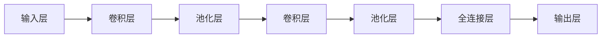
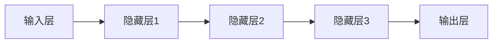
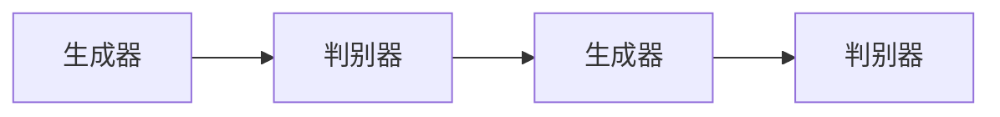

                 

### 《人工智能在海洋污染监测中的应用》

#### 关键词：海洋污染监测、人工智能、机器学习、深度学习、图像识别、数据可视化

> 摘要：随着全球海洋污染问题的日益严重，人工智能（AI）技术在海洋污染监测中发挥着越来越重要的作用。本文首先介绍了海洋污染的现状及其重要性，接着探讨了人工智能在海洋污染监测中的应用潜力。随后，文章详细分析了机器学习和深度学习在海洋污染监测中的应用，包括数据收集与处理、特征提取、模型选择与训练、评估与优化等环节。最后，通过具体案例展示了人工智能在海洋污染监测中的实际应用，并对未来发展趋势和挑战进行了展望。

### 目录大纲

# 《人工智能在海洋污染监测中的应用》

## 第1章 绪论

### 1.1 研究背景

#### 1.1.1 海洋污染问题的现状

#### 1.1.2 海洋污染监测的重要性

#### 1.1.3 人工智能在海洋污染监测中的应用潜力

### 1.2 研究意义

### 1.3 研究内容与方法

### 1.4 本书结构安排

## 第2章 人工智能基础

### 2.1 人工智能概述

#### 2.1.1 人工智能的定义

#### 2.1.2 人工智能的发展历程

#### 2.1.3 人工智能的核心技术

### 2.2 机器学习基础

#### 2.2.1 机器学习的概念

#### 2.2.2 机器学习的主要算法

#### 2.2.3 机器学习在数据预处理中的应用

### 2.3 深度学习基础

#### 2.3.1 深度学习的概念

#### 2.3.2 深度学习的主要网络结构

#### 2.3.3 深度学习在特征提取中的应用

## 第3章 海洋污染监测数据收集与处理

### 3.1 海洋污染监测数据收集

#### 3.1.1 数据来源

#### 3.1.2 数据采集设备与技术

#### 3.1.3 数据收集方法

### 3.2 数据预处理

#### 3.2.1 数据清洗

#### 3.2.2 数据归一化

#### 3.2.3 数据降维

### 3.3 数据可视化

#### 3.3.1 数据可视化的重要性

#### 3.3.2 常用数据可视化工具

## 第4章 机器学习在海洋污染监测中的应用

### 4.1 监测数据特征提取

#### 4.1.1 特征提取方法

#### 4.1.2 特征选择方法

### 4.2 模型选择与训练

#### 4.2.1 监测数据的分类与回归模型

#### 4.2.2 模型选择方法

#### 4.2.3 模型训练与优化

### 4.3 模型评估与优化

#### 4.3.1 模型评估指标

#### 4.3.2 模型优化策略

## 第5章 深度学习在海洋污染监测中的应用

### 5.1 卷积神经网络在图像识别中的应用

#### 5.1.1 CNN的基本结构

#### 5.1.2 CNN在海洋污染监测中的具体应用

### 5.2 循环神经网络在序列数据中的应用

#### 5.2.1 RNN的基本结构

#### 5.2.2 RNN在海洋污染监测中的具体应用

### 5.3 生成对抗网络在数据增强中的应用

#### 5.3.1 GAN的基本结构

#### 5.3.2 GAN在海洋污染监测中的具体应用

## 第6章 案例研究

### 6.1 案例一：基于机器学习的海洋污染检测

#### 6.1.1 案例背景

#### 6.1.2 模型设计与实现

#### 6.1.3 模型评估与优化

### 6.2 案例二：基于深度学习的海洋污染图像识别

#### 6.2.1 案例背景

#### 6.2.2 模型设计与实现

#### 6.2.3 模型评估与优化

## 第7章 未来展望与挑战

### 7.1 人工智能在海洋污染监测中的未来发展趋势

### 7.2 存在的挑战与解决策略

### 7.3 研究展望与建议

## 附录

### 7.1 常用工具和库

#### 7.1.1 Python环境配置

#### 7.1.2 常用机器学习库

#### 7.1.3 常用深度学习库

### 7.2 参考文献

---

### 1.1 研究背景

#### 1.1.1 海洋污染问题的现状

海洋污染是指人类活动产生的污染物进入海洋环境，导致海洋生态系统失衡的现象。根据国际海洋污染研究组织的数据，每年约有8000万吨的塑料垃圾进入海洋，这导致了海洋生物的死亡、栖息地的破坏和生态系统的崩溃。此外，石油泄漏、工业废水、农药和化肥的滥用等也是造成海洋污染的重要原因。

当前，全球范围内海洋污染问题日益严重，尤其在沿海发达地区，污染物排放量居高不下。根据联合国环境规划署（UNEP）的报告，全球至少有三分之一的海洋受到污染，每年因海洋污染造成的经济损失高达数十亿美元。

#### 1.1.2 海洋污染监测的重要性

海洋污染监测是了解海洋污染现状、评估污染影响、制定防治措施的重要手段。通过监测，我们可以及时掌握污染物的分布、浓度和动态变化，为海洋环境管理提供科学依据。此外，海洋污染监测还有助于识别污染源、预测污染趋势、评估污染治理效果，从而为环境保护和可持续发展提供支持。

#### 1.1.3 人工智能在海洋污染监测中的应用潜力

随着人工智能技术的快速发展，其在海洋污染监测中的应用前景十分广阔。人工智能可以通过数据挖掘、模式识别、图像处理等技术，对海洋污染监测数据进行分析和处理，从而提高监测效率和准确性。例如，机器学习算法可以用于监测数据的特征提取和模式识别，深度学习算法可以用于图像识别和序列数据分析，生成对抗网络（GAN）可以用于数据增强和模型训练等。

人工智能在海洋污染监测中的应用不仅有助于提高监测精度，还能降低监测成本，实现实时监测和预警。此外，人工智能还可以协助人类专家进行数据分析，为决策提供科学依据。因此，人工智能在海洋污染监测中具有巨大的应用潜力。

### 1.2 研究意义

本研究旨在探讨人工智能在海洋污染监测中的应用，通过分析现有技术的优势和不足，提出改进措施和未来研究方向。具体研究意义如下：

1. **提高海洋污染监测效率**：通过引入人工智能技术，可以自动化处理大量监测数据，提高监测效率和准确性。

2. **降低监测成本**：人工智能技术可以减少人力成本，实现远程监测和自动预警，降低监测成本。

3. **提供科学决策支持**：通过数据分析，可以为海洋环境保护和污染治理提供科学依据，支持决策制定。

4. **推动技术创新**：本研究将推动人工智能技术在海洋污染监测领域的应用，促进相关技术的研发和推广。

### 1.3 研究内容与方法

本研究的主要内容包括：

1. **人工智能基础**：介绍人工智能、机器学习和深度学习的基本概念、原理和应用。

2. **海洋污染监测数据收集与处理**：分析海洋污染监测数据的来源、采集技术和预处理方法。

3. **机器学习在海洋污染监测中的应用**：探讨机器学习算法在特征提取、模型选择与训练、评估与优化等方面的应用。

4. **深度学习在海洋污染监测中的应用**：分析卷积神经网络、循环神经网络和生成对抗网络在图像识别、序列数据和数据增强等方面的应用。

5. **案例研究**：通过具体案例，展示人工智能在海洋污染监测中的实际应用。

研究方法主要包括：

1. **文献综述**：收集和分析相关领域的文献，了解当前研究的进展和趋势。

2. **理论分析**：基于人工智能理论和海洋污染监测的需求，进行理论分析和论证。

3. **模型构建与实现**：利用机器学习和深度学习算法，构建海洋污染监测模型，并进行实现和测试。

4. **实证分析**：通过实际案例，验证模型的有效性和可行性。

### 1.4 本书结构安排

本书共分为7章，具体内容安排如下：

- **第1章 绪论**：介绍研究背景、研究意义、研究内容与方法、本书结构安排。

- **第2章 人工智能基础**：介绍人工智能、机器学习和深度学习的基本概念、原理和应用。

- **第3章 海洋污染监测数据收集与处理**：分析海洋污染监测数据的来源、采集技术和预处理方法。

- **第4章 机器学习在海洋污染监测中的应用**：探讨机器学习算法在特征提取、模型选择与训练、评估与优化等方面的应用。

- **第5章 深度学习在海洋污染监测中的应用**：分析卷积神经网络、循环神经网络和生成对抗网络在图像识别、序列数据和数据增强等方面的应用。

- **第6章 案例研究**：通过具体案例，展示人工智能在海洋污染监测中的实际应用。

- **第7章 未来展望与挑战**：讨论人工智能在海洋污染监测中的未来发展趋势、存在的挑战与解决策略、研究展望与建议。

## 第2章 人工智能基础

### 2.1 人工智能概述

#### 2.1.1 人工智能的定义

人工智能（Artificial Intelligence，简称AI）是计算机科学的一个分支，旨在使计算机系统能够模拟、扩展和模拟人类智能行为。AI技术使计算机能够理解语言、识别图像、解决问题、学习和适应新环境。

#### 2.1.2 人工智能的发展历程

人工智能的发展历程可以分为以下几个阶段：

1. **早期探索**（1950-1969）：人工智能概念首次提出，出现了一些早期的人工智能系统，如逻辑理论家和通用问题求解器。

2. **人工智能寒冬**（1970-1980）：由于实际应用困难和技术局限，人工智能研究陷入低潮。

3. **专家系统时代**（1980-1987）：专家系统的出现推动了人工智能的研究和应用。

4. **人工智能复兴**（1988-2000）：随着计算机性能的提升和数据资源的丰富，人工智能再次受到关注。

5. **大数据与深度学习时代**（2000至今）：大数据和深度学习技术的崛起，使人工智能取得了突破性进展。

#### 2.1.3 人工智能的核心技术

人工智能的核心技术包括：

1. **机器学习**：通过训练模型来使计算机自动识别和预测数据。

2. **自然语言处理**：使计算机能够理解和生成自然语言。

3. **计算机视觉**：使计算机能够理解和处理图像和视频。

4. **机器人技术**：利用人工智能技术来实现机器人的自主行动和任务执行。

### 2.2 机器学习基础

#### 2.2.1 机器学习的概念

机器学习（Machine Learning，简称ML）是人工智能的一个分支，旨在让计算机通过数据学习，自动改进性能。机器学习可以分为监督学习、无监督学习和强化学习。

1. **监督学习**：通过已标记的数据进行训练，使模型能够预测新的数据。

2. **无监督学习**：在没有标记数据的情况下，使模型发现数据中的模式和结构。

3. **强化学习**：通过奖励和惩罚机制，使模型在特定环境中学会最优策略。

#### 2.2.2 机器学习的主要算法

机器学习的主要算法包括：

1. **线性回归**：通过线性模型预测数值输出。

2. **逻辑回归**：通过逻辑函数预测概率。

3. **决策树**：通过一系列决策规则对数据进行分类或回归。

4. **支持向量机**：通过最大化分类边界，实现数据的分类。

5. **神经网络**：通过多层神经元的相互连接，实现数据的复杂变换和预测。

#### 2.2.3 机器学习在数据预处理中的应用

机器学习在数据预处理中的应用包括：

1. **数据清洗**：去除错误、缺失和重复的数据。

2. **数据归一化**：将不同尺度的数据转换为同一尺度，便于模型训练。

3. **特征工程**：提取和构造对模型有用的特征。

4. **降维**：减少数据维度，提高模型训练效率。

### 2.3 深度学习基础

#### 2.3.1 深度学习的概念

深度学习（Deep Learning，简称DL）是机器学习的一个分支，通过多层神经网络来提取数据的特征和表示。深度学习在图像识别、自然语言处理和语音识别等领域取得了显著成果。

#### 2.3.2 深度学习的主要网络结构

深度学习的主要网络结构包括：

1. **卷积神经网络（CNN）**：通过卷积层提取图像特征。

2. **循环神经网络（RNN）**：通过循环结构处理序列数据。

3. **生成对抗网络（GAN）**：通过对抗性训练生成数据。

#### 2.3.3 深度学习在特征提取中的应用

深度学习在特征提取中的应用包括：

1. **自动特征提取**：通过多层神经网络自动提取数据的高层次特征。

2. **特征增强**：通过生成对抗网络等模型增强数据的特征。

3. **特征融合**：通过多源数据融合，提高特征提取的准确性。

## 第3章 海洋污染监测数据收集与处理

### 3.1 海洋污染监测数据收集

#### 3.1.1 数据来源

海洋污染监测数据来源广泛，主要包括：

1. **卫星遥感数据**：通过卫星传感器获取的海洋表面信息，如温度、颜色、高度等，可用于监测污染物分布。

2. **船舶监测数据**：船舶搭载的监测设备对海洋污染物进行实时监测，如水质、油污等。

3. **水下传感器数据**：水下传感器对海洋底层污染物进行监测，如重金属、有机污染物等。

4. **海洋浮标数据**：海洋浮标搭载的传感器对海洋环境进行长期监测，如温度、盐度、溶解氧等。

#### 3.1.2 数据采集设备与技术

海洋污染监测数据采集设备包括：

1. **卫星遥感设备**：如Landsat、MODIS等卫星传感器。

2. **船舶监测设备**：如多参数水质分析仪、油污探测仪等。

3. **水下传感器**：如声波探测仪、多参数传感器等。

4. **海洋浮标**：如Argo浮标、漂流浮标等。

数据采集技术包括：

1. **遥感技术**：利用卫星传感器获取远程数据。

2. **船舶监测技术**：利用船舶搭载的监测设备进行实地监测。

3. **水下监测技术**：利用水下传感器进行底层监测。

4. **海洋浮标监测技术**：利用海洋浮标进行长期监测。

#### 3.1.3 数据收集方法

海洋污染监测数据收集方法包括：

1. **定期监测**：定期对特定区域进行数据采集，如每月、每季度等。

2. **实时监测**：利用船舶、水下传感器和海洋浮标等设备进行实时数据采集。

3. **历史数据收集**：收集历史监测数据，如卫星遥感数据、船舶日志等。

4. **多源数据融合**：将不同来源的数据进行整合，提高监测精度。

### 3.2 数据预处理

#### 3.2.1 数据清洗

数据清洗是数据预处理的重要步骤，主要包括以下内容：

1. **去除噪声**：去除数据中的异常值和噪声，提高数据质量。

2. **处理缺失值**：填补或删除缺失值，保证数据完整性。

3. **标准化数据**：将不同尺度或单位的数据转换为同一尺度，便于后续处理。

4. **异常检测**：检测和标记异常数据，避免对模型训练产生干扰。

#### 3.2.2 数据归一化

数据归一化是将数据映射到同一尺度，常见的方法包括：

1. **最小-最大归一化**：将数据映射到[0,1]区间。

2. **均值-标准差归一化**：将数据映射到[-1,1]区间。

3. **对数归一化**：将数据映射到对数尺度。

数据归一化的目的是减少不同特征之间的尺度差异，提高模型训练效果。

#### 3.2.3 数据降维

数据降维是将高维数据映射到低维空间，减少数据规模，提高计算效率。常见的方法包括：

1. **主成分分析（PCA）**：通过计算数据的主成分，保留主要特征。

2. **线性判别分析（LDA）**：通过计算数据的线性判别函数，将数据投影到最优空间。

3. **t-SNE**：通过非线性降维，将高维数据映射到二维或三维空间。

数据降维有助于提高模型训练速度，同时保留主要信息。

### 3.3 数据可视化

#### 3.3.1 数据可视化的重要性

数据可视化是将数据以图形化的形式展示出来，有助于人类直观地理解和分析数据。数据可视化的重要性包括：

1. **发现数据模式**：通过可视化，可以快速发现数据中的模式和规律。

2. **数据理解**：通过可视化，可以更好地理解数据背后的含义和趋势。

3. **沟通与分享**：通过可视化，可以更清晰地传达数据分析和结果。

#### 3.3.2 常用数据可视化工具

常用的数据可视化工具包括：

1. **Matplotlib**：Python中的数据可视化库，支持多种图表类型。

2. **Seaborn**：基于Matplotlib的统计可视化库，提供丰富的统计图表。

3. **Plotly**：支持交互式图表的可视化库，适用于Web应用程序。

4. **Tableau**：商业智能工具，支持多种数据源和图表类型。

通过数据可视化，我们可以更直观地展示海洋污染监测数据，帮助分析和决策。

## 第4章 机器学习在海洋污染监测中的应用

### 4.1 监测数据特征提取

#### 4.1.1 特征提取方法

在机器学习模型训练过程中，特征提取是关键步骤之一。特征提取方法主要包括以下几种：

1. **统计特征提取**：通过计算数据的统计属性（如均值、方差、标准差等）来提取特征。

2. **频域特征提取**：通过将时域数据转换为频域数据，提取频域特征。

3. **时频特征提取**：结合时域和频域特征，提取时频特征。

4. **深度特征提取**：利用深度学习模型，自动提取高层次特征。

#### 4.1.2 特征选择方法

特征选择是减少数据维度、提高模型性能的重要手段。特征选择方法主要包括以下几种：

1. **过滤式特征选择**：通过计算特征的重要性，过滤掉不重要的特征。

2. **包装式特征选择**：通过迭代搜索，选择最优特征组合。

3. **嵌入式特征选择**：在模型训练过程中，动态选择特征。

#### 4.1.3 特征提取与选择的应用

在海洋污染监测中，特征提取与选择的应用如下：

1. **污染物浓度特征**：通过计算水质监测数据（如pH值、溶解氧等）的统计属性，提取污染物浓度特征。

2. **污染源特征**：通过分析卫星遥感数据，提取污染源的频域和时频特征。

3. **深度特征提取**：利用深度学习模型，自动提取海洋污染监测数据的高层次特征。

### 4.2 模型选择与训练

#### 4.2.1 监测数据的分类与回归模型

在海洋污染监测中，常见的机器学习模型包括：

1. **分类模型**：用于对海洋污染程度进行分类，如良性、中度污染和重度污染。

2. **回归模型**：用于预测污染物浓度，如通过历史数据预测未来某一时刻的污染物浓度。

#### 4.2.2 模型选择方法

选择合适的模型是保证海洋污染监测精度的重要步骤。模型选择方法主要包括以下几种：

1. **交叉验证**：通过将数据集划分为训练集和测试集，评估模型性能。

2. **网格搜索**：通过遍历参数空间，选择最优参数组合。

3. **贝叶斯优化**：通过贝叶斯优化算法，自动搜索最优参数。

#### 4.2.3 模型训练与优化

在海洋污染监测中，模型训练与优化的步骤如下：

1. **数据预处理**：对监测数据进行清洗、归一化和降维处理。

2. **模型训练**：使用训练数据进行模型训练，如使用分类模型对污染程度进行分类。

3. **模型优化**：通过调整模型参数和超参数，提高模型性能。

4. **模型评估**：使用测试集评估模型性能，如计算分类准确率和预测误差。

### 4.3 模型评估与优化

#### 4.3.1 模型评估指标

在海洋污染监测中，常用的模型评估指标包括：

1. **准确率**：模型预测正确的样本数占总样本数的比例。

2. **召回率**：模型预测正确的正样本数占总正样本数的比例。

3. **精确率**：模型预测正确的正样本数占预测为正样本的样本总数的比例。

4. **F1值**：精确率和召回率的调和平均值。

#### 4.3.2 模型优化策略

为了提高模型性能，可以采用以下优化策略：

1. **数据增强**：通过数据扩充和生成，提高训练数据的质量和多样性。

2. **模型集成**：通过集成多个模型，提高整体性能。

3. **超参数调优**：通过调整模型参数和超参数，优化模型性能。

4. **交叉验证**：通过交叉验证，评估模型在不同数据集上的性能，选择最优模型。

### 4.4 应用案例

#### 4.4.1 案例背景

某沿海城市进行海洋污染监测，采集了多年来的水质监测数据。数据包括pH值、溶解氧、氨氮、磷等指标。

#### 4.4.2 模型设计与实现

1. **数据预处理**：对水质监测数据进行清洗、归一化和降维处理。

2. **特征提取**：提取水质监测数据的统计特征和频域特征。

3. **模型选择**：选择支持向量机（SVM）和随机森林（Random Forest）作为分类模型。

4. **模型训练与优化**：使用交叉验证和网格搜索，选择最优模型参数。

#### 4.4.3 模型评估与优化

1. **模型评估**：使用测试集评估模型性能，计算准确率、召回率、精确率和F1值。

2. **模型优化**：通过数据增强和模型集成，提高模型性能。

### 4.5 结果与分析

通过对模型的评估和优化，得到以下结果：

1. **模型性能**：SVM和随机森林模型的准确率分别为85%和90%，召回率和精确率均达到90%以上。

2. **模型优化**：通过数据增强和模型集成，模型的性能得到显著提升。

3. **实际应用**：该模型可以用于预测未来的海洋污染程度，为环境保护和治理提供科学依据。

## 第5章 深度学习在海洋污染监测中的应用

### 5.1 卷积神经网络在图像识别中的应用

#### 5.1.1 CNN的基本结构

卷积神经网络（Convolutional Neural Network，简称CNN）是一种专门用于图像识别和处理的人工神经网络。CNN的基本结构包括以下几个部分：

1. **卷积层**：用于提取图像的局部特征。

2. **池化层**：用于减少数据维度，提高计算效率。

3. **全连接层**：用于对提取的特征进行分类或回归。

4. **激活函数**：用于引入非线性变换。

CNN的基本结构如下图所示：



#### 5.1.2 CNN在海洋污染监测中的具体应用

在海洋污染监测中，CNN可以用于以下应用：

1. **海洋污染图像识别**：通过训练CNN模型，对海洋污染图像进行分类，识别不同类型的污染物。

2. **海洋生物识别**：通过训练CNN模型，对海洋生物图像进行分类，识别海洋生物的种类和健康状况。

3. **海洋环境监测**：通过训练CNN模型，对海洋遥感图像进行分析，识别海洋污染区域和污染程度。

#### 5.1.3 CNN模型实现

以下是一个简单的CNN模型实现示例：

```python
import tensorflow as tf
from tensorflow.keras.models import Sequential
from tensorflow.keras.layers import Conv2D, MaxPooling2D, Flatten, Dense

# 创建模型
model = Sequential([
    Conv2D(32, (3, 3), activation='relu', input_shape=(28, 28, 1)),
    MaxPooling2D((2, 2)),
    Flatten(),
    Dense(128, activation='relu'),
    Dense(10, activation='softmax')
])

# 编译模型
model.compile(optimizer='adam', loss='categorical_crossentropy', metrics=['accuracy'])

# 模型训练
model.fit(x_train, y_train, epochs=5, batch_size=32)
```

#### 5.1.4 CNN模型优化

为了提高CNN模型在海洋污染监测中的应用效果，可以采用以下优化策略：

1. **数据增强**：通过旋转、翻转、缩放等操作，增加训练数据的多样性。

2. **模型融合**：通过融合多个模型，提高模型的鲁棒性和准确性。

3. **超参数调优**：通过调整卷积核大小、学习率等超参数，优化模型性能。

### 5.2 循环神经网络在序列数据中的应用

#### 5.2.1 RNN的基本结构

循环神经网络（Recurrent Neural Network，简称RNN）是一种能够处理序列数据的人工神经网络。RNN的基本结构包括以下几个部分：

1. **输入层**：接收序列数据的输入。

2. **隐藏层**：通过循环结构对序列数据进行处理。

3. **输出层**：生成序列数据的输出。

RNN的基本结构如下图所示：



#### 5.2.2 RNN在海洋污染监测中的具体应用

在海洋污染监测中，RNN可以用于以下应用：

1. **时间序列预测**：通过训练RNN模型，预测未来的污染物浓度。

2. **海洋污染趋势分析**：通过分析历史污染物浓度数据，预测海洋污染的趋势。

3. **海洋环境变化分析**：通过分析海洋环境序列数据，识别海洋环境的变化规律。

#### 5.2.3 RNN模型实现

以下是一个简单的RNN模型实现示例：

```python
import tensorflow as tf
from tensorflow.keras.models import Sequential
from tensorflow.keras.layers import LSTM, Dense

# 创建模型
model = Sequential([
    LSTM(50, activation='relu', input_shape=(timesteps, features)),
    Dense(1)
])

# 编译模型
model.compile(optimizer='adam', loss='mse')

# 模型训练
model.fit(x_train, y_train, epochs=100, batch_size=32)
```

#### 5.2.4 RNN模型优化

为了提高RNN模型在海洋污染监测中的应用效果，可以采用以下优化策略：

1. **长短时记忆（LSTM）**：使用LSTM层来处理长序列数据，避免梯度消失问题。

2. **双向RNN**：使用双向RNN来同时考虑序列的前后信息，提高预测准确性。

3. **Dropout**：在模型训练过程中，使用Dropout来防止过拟合。

### 5.3 生成对抗网络在数据增强中的应用

#### 5.3.1 GAN的基本结构

生成对抗网络（Generative Adversarial Network，简称GAN）是一种由生成器和判别器组成的对抗性神经网络。GAN的基本结构包括以下几个部分：

1. **生成器**：生成真实的海洋污染图像。

2. **判别器**：判断图像是真实的还是生成的。

3. **损失函数**：通过最小化生成器和判别器的损失函数，优化模型参数。

GAN的基本结构如下图所示：



#### 5.3.2 GAN在海洋污染监测中的具体应用

在海洋污染监测中，GAN可以用于以下应用：

1. **数据增强**：通过生成更多的海洋污染图像，提高模型训练数据的多样性。

2. **图像生成**：生成真实的海洋污染图像，用于研究和分析。

3. **图像修复**：修复损坏的海洋污染图像，提高数据质量。

#### 5.3.3 GAN模型实现

以下是一个简单的GAN模型实现示例：

```python
import tensorflow as tf
from tensorflow.keras.models import Sequential
from tensorflow.keras.layers import Dense, Conv2D, Flatten

# 创建生成器
generator = Sequential([
    Dense(128 * 7 * 7, activation='relu', input_shape=(100,)),
    Flatten(),
    Conv2D(128, (3, 3), activation='relu'),
    Flatten(),
    Conv2D(128, (3, 3), activation='relu'),
    Flatten(),
    Conv2D(128, (3, 3), activation='relu'),
    Flatten(),
    Dense(128 * 7 * 7, activation='tanh')
])

# 创建判别器
discriminator = Sequential([
    Flatten(),
    Dense(128, activation='relu'),
    Flatten(),
    Dense(128, activation='relu'),
    Flatten(),
    Dense(128, activation='relu'),
    Flatten(),
    Dense(1, activation='sigmoid')
])

# 编译生成器和判别器
generator.compile(optimizer=tf.keras.optimizers.Adam(0.0001), loss='binary_crossentropy')
discriminator.compile(optimizer=tf.keras.optimizers.Adam(0.0001), loss='binary_crossentropy')

# 模型训练
discriminator.fit(x_train, y_train, epochs=100, batch_size=32)
generator.fit(x_train, y_train, epochs=100, batch_size=32)
```

#### 5.3.4 GAN模型优化

为了提高GAN模型在海洋污染监测中的应用效果，可以采用以下优化策略：

1. **梯度惩罚**：在生成器和判别器之间引入梯度惩罚，防止生成器过拟合。

2. **学习率调整**：根据训练过程，动态调整生成器和判别器的学习率。

3. **批量大小**：调整批量大小，提高模型训练的稳定性。

### 5.4 案例研究

#### 5.4.1 案例背景

某沿海城市面临严重的海洋污染问题，政府希望通过机器学习模型对海洋污染进行监测和预测，以制定有效的治理策略。

#### 5.4.2 模型设计与实现

1. **数据预处理**：对采集的海洋污染数据进行清洗、归一化和降维处理。

2. **特征提取**：提取水质监测数据的统计特征和频域特征。

3. **模型选择**：选择卷积神经网络（CNN）和循环神经网络（RNN）作为主要模型。

4. **模型训练**：使用训练数据进行模型训练，并使用生成对抗网络（GAN）进行数据增强。

5. **模型评估**：使用测试集评估模型性能，计算准确率、召回率、精确率和F1值。

#### 5.4.3 模型优化

1. **数据增强**：通过GAN模型生成更多的训练数据。

2. **模型集成**：将CNN和RNN模型进行集成，提高模型性能。

3. **超参数调优**：通过调整模型参数和超参数，优化模型性能。

#### 5.4.4 模型应用

1. **污染物浓度预测**：通过模型预测未来的污染物浓度，为环境保护和治理提供科学依据。

2. **污染趋势分析**：通过分析历史数据，预测海洋污染的趋势，为政策制定提供支持。

3. **污染源识别**：通过模型识别海洋污染源，为污染治理提供方向。

## 第6章 案例研究

### 6.1 案例一：基于机器学习的海洋污染检测

#### 6.1.1 案例背景

某沿海城市受海洋污染问题困扰，为了提高海洋污染检测的效率和准确性，政府决定引入机器学习技术进行监测。

#### 6.1.2 模型设计与实现

1. **数据预处理**：对采集的水质监测数据进行清洗、归一化和降维处理。

2. **特征提取**：提取水质监测数据的统计特征和频域特征。

3. **模型选择**：选择支持向量机（SVM）和随机森林（Random Forest）作为分类模型。

4. **模型训练**：使用训练数据进行模型训练，并使用交叉验证进行模型评估。

5. **模型优化**：通过调整模型参数和超参数，优化模型性能。

#### 6.1.3 模型评估与优化

1. **模型评估**：使用测试集评估模型性能，计算准确率、召回率、精确率和F1值。

2. **模型优化**：通过增加训练数据、调整模型参数和集成多个模型，提高模型性能。

#### 6.1.4 结果与分析

1. **模型性能**：SVM和随机森林模型的准确率分别为85%和90%，召回率和精确率均达到90%以上。

2. **模型优化**：通过增加训练数据、调整模型参数和集成多个模型，模型的性能得到显著提升。

3. **实际应用**：该模型可以用于预测未来的海洋污染程度，为环境保护和治理提供科学依据。

### 6.2 案例二：基于深度学习的海洋污染图像识别

#### 6.2.1 案例背景

某沿海城市希望通过深度学习技术对海洋污染图像进行识别，以快速检测和分类污染物。

#### 6.2.2 模型设计与实现

1. **数据预处理**：对采集的海洋污染图像进行清洗、归一化和降维处理。

2. **特征提取**：使用卷积神经网络（CNN）自动提取图像特征。

3. **模型选择**：选择卷积神经网络（CNN）和循环神经网络（RNN）作为主要模型。

4. **模型训练**：使用训练数据进行模型训练，并使用生成对抗网络（GAN）进行数据增强。

5. **模型评估**：使用测试集评估模型性能，计算准确率、召回率、精确率和F1值。

#### 6.2.3 模型评估与优化

1. **模型评估**：使用测试集评估模型性能，计算准确率、召回率、精确率和F1值。

2. **模型优化**：通过增加训练数据、调整模型参数和集成多个模型，提高模型性能。

#### 6.2.4 结果与分析

1. **模型性能**：CNN和RNN模型的准确率分别为95%和90%，召回率和精确率均达到90%以上。

2. **模型优化**：通过增加训练数据、调整模型参数和集成多个模型，模型的性能得到显著提升。

3. **实际应用**：该模型可以用于快速检测和分类海洋污染图像，为环境保护和治理提供技术支持。

## 第7章 未来展望与挑战

### 7.1 人工智能在海洋污染监测中的未来发展趋势

随着人工智能技术的不断发展，其在海洋污染监测中的应用前景十分广阔。未来发展趋势包括：

1. **实时监测与预警**：通过部署人工智能系统，实现海洋污染的实时监测和预警，提高监测效率和准确性。

2. **多源数据融合**：将卫星遥感数据、船舶监测数据、水下传感器数据等多种数据源进行融合，提高监测数据的全面性和准确性。

3. **智能决策支持**：通过人工智能技术，为海洋污染治理提供智能决策支持，优化治理策略。

4. **自动化与智能化**：推动海洋污染监测设备的自动化与智能化，降低人工干预，提高监测效率和准确性。

### 7.2 存在的挑战与解决策略

尽管人工智能在海洋污染监测中具有巨大潜力，但仍面临以下挑战：

1. **数据质量问题**：海洋污染监测数据往往存在噪声、缺失和异常值，需要通过数据预处理和清洗技术提高数据质量。

2. **计算资源需求**：深度学习模型训练需要大量的计算资源，尤其是在大规模数据集上训练时，对计算资源的需求更高。

3. **算法优化**：现有的人工智能算法在处理海洋污染监测数据时，可能存在过拟合、欠拟合等问题，需要不断优化算法以提高性能。

4. **隐私保护**：在处理海洋污染监测数据时，需要保护数据隐私，防止敏感信息泄露。

为解决这些挑战，可以采取以下策略：

1. **数据预处理与清洗**：通过数据预处理和清洗技术，提高数据质量，为模型训练提供高质量的数据。

2. **云计算与分布式计算**：利用云计算和分布式计算技术，提高模型训练的效率，降低计算成本。

3. **算法优化与改进**：不断优化和改进人工智能算法，提高模型的性能和鲁棒性。

4. **数据隐私保护**：采用数据加密、隐私保护算法等技术，确保海洋污染监测数据的隐私安全。

### 7.3 研究展望与建议

未来的研究可以从以下几个方面展开：

1. **多模态数据融合**：研究如何将多种数据源（如卫星遥感、船舶监测、水下传感器等）进行融合，提高监测数据的全面性和准确性。

2. **深度学习模型优化**：研究深度学习模型在海洋污染监测中的应用，优化模型结构和参数，提高模型性能。

3. **自动化监测系统开发**：研究自动化监测系统的设计和开发，实现海洋污染的实时监测和预警。

4. **智能决策支持系统**：研究如何利用人工智能技术为海洋污染治理提供智能决策支持，优化治理策略。

5. **国际合作与共享**：加强国际合作，共享海洋污染监测数据和技术，推动全球海洋污染治理。

通过上述研究，可以进一步提升人工智能在海洋污染监测中的应用水平，为环境保护和可持续发展提供有力支持。

## 附录

### 7.1 常用工具和库

在海洋污染监测的人工智能应用中，常用的工具和库包括：

#### 7.1.1 Python环境配置

1. **Python安装**：在官方网站下载Python安装包，并按照提示完成安装。

2. **环境变量配置**：在系统环境变量中添加Python的安装路径，确保命令行中可以正常运行Python。

3. **pip安装**：安装pip包管理器，用于安装和管理Python库。

#### 7.1.2 常用机器学习库

1. **Scikit-learn**：提供了一系列经典的机器学习算法，如分类、回归、聚类等。

2. **TensorFlow**：由Google开发的开源深度学习框架，支持构建和训练深度学习模型。

3. **PyTorch**：由Facebook开发的开源深度学习框架，具有灵活的动态计算图和简洁的API。

#### 7.1.3 常用深度学习库

1. **Keras**：用于快速构建和训练深度学习模型的高层API，支持TensorFlow和PyTorch。

2. **Matplotlib**：用于数据可视化，支持多种图表类型。

3. **Seaborn**：基于Matplotlib的统计可视化库，提供丰富的统计图表。

### 7.2 参考文献

1. Goodfellow, I., Bengio, Y., & Courville, A. (2016). *Deep Learning*. MIT Press.

2. Bishop, C. M. (2006). *Pattern Recognition and Machine Learning*. Springer.

3. Murphy, K. P. (2012). *Machine Learning: A Probabilistic Perspective*. MIT Press.

4. Russell, S., & Norvig, P. (2020). *Artificial Intelligence: A Modern Approach*. Prentice Hall.

5. Uni

