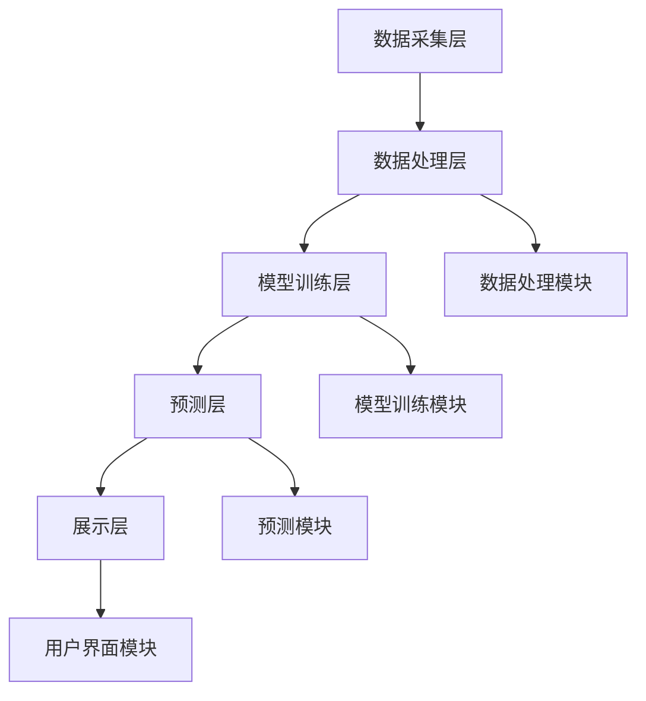

                 

### 设计思路

在设计《人工智能在海洋生态系统保护中的应用》这本书的目录大纲时，我们需要首先明确书的整体结构，然后根据书籍的核心内容逐步细化各个章节的目录。以下是具体的设计思路：

1. **明确书籍的整体结构**：首先确定书籍的主题，即“人工智能在海洋生态系统保护中的应用”，并围绕这个主题，梳理出书籍的主要内容和结构。

2. **确定核心章节内容**：根据书籍的主题，我们需要确定核心章节的内容，如背景介绍、核心概念、算法原理讲解、系统分析与架构设计方案、项目实战等。

3. **细化章节内容**：在每个核心章节中，进一步细化内容，确保覆盖所有关键知识点，并且确保章节之间的逻辑关系清晰。

4. **确保内容完整性**：在每个章节中，确保包含核心概念、原理、流程图、数学模型、代码示例、案例分析等要素。

5. **保持简洁性**：在保证内容完整性的同时，避免过多的冗余和重复，确保目录大纲的简洁性。

6. **格式和风格统一**：使用统一的格式和风格，确保整个目录大纲的可读性和专业性。

### 目录大纲

```markdown
----------------------------------------------------------------
# 第一部分：背景与概述

## 第1章：海洋生态系统保护背景
### 1.1 海洋生态系统的基本概念
### 1.2 海洋生态系统的重要性
### 1.3 海洋生态系统面临的威胁

## 第2章：人工智能在生态保护中的应用
### 2.1 人工智能概述
### 2.2 人工智能在生态监测中的应用
### 2.3 人工智能在生态预测和预警中的应用

## 第3章：人工智能核心概念
### 3.1 机器学习与深度学习
### 3.2 人工智能核心算法
### 3.3 人工智能的伦理和挑战

----------------------------------------------------------------

# 第二部分：人工智能应用技术

## 第4章：图像处理与海洋生态监测
### 4.1 图像处理技术
### 4.2 海洋生物识别
### 4.3 图像分析在海洋生态中的应用

## 第5章：数据挖掘与海洋生态预测
### 5.1 数据挖掘基础
### 5.2 海洋生态数据预处理
### 5.3 数据挖掘在海洋生态预测中的应用

## 第6章：机器学习算法在海洋生态保护中的应用
### 6.1 机器学习算法概述
### 6.2 回归分析在海洋生态保护中的应用
### 6.3 分类算法在海洋生态保护中的应用

## 第7章：深度学习算法在海洋生态保护中的应用
### 7.1 深度学习基础
### 7.2 卷积神经网络在海洋生态监测中的应用
### 7.3 循环神经网络在海洋生态数据分析中的应用

----------------------------------------------------------------

# 第三部分：项目实战

## 第8章：海洋生态系统保护项目实战
### 8.1 项目介绍
### 8.2 系统功能设计
### 8.3 系统架构设计
### 8.4 系统核心实现
### 8.5 项目小结

----------------------------------------------------------------

# 第四部分：最佳实践与展望

## 第9章：人工智能在海洋生态保护中的最佳实践
### 9.1 实践案例一
### 9.2 实践案例二
### 9.3 实践案例三

## 第10章：未来展望与挑战
### 10.1 人工智能技术发展趋势
### 10.2 海洋生态保护领域的未来挑战
### 10.3 发展前景与建议

----------------------------------------------------------------
```

### 目录大纲总结

本目录大纲分为四个部分，分别介绍了背景与概述、人工智能应用技术、项目实战以及最佳实践与展望。每个部分都涵盖了关键的知识点和应用场景，确保书籍内容的全面性和实用性。整体目录结构清晰，便于读者理解和阅读。

----------------------------------------------------------------

### 背景介绍

#### 海洋生态系统的基本概念

海洋生态系统是指由海洋中的生物、非生物环境和它们之间的相互作用所构成的一个复杂的生态系统。它包括海洋中的植物、动物、微生物以及它们所生活的环境，如水体、海底地形和潮间带等。海洋生态系统不仅是地球上最大的生态系统，也是地球上最重要的生态系统之一。

海洋生态系统的关键要素包括：

1. **生物要素**：包括海洋中的各种生物，如浮游植物、鱼类、哺乳动物、无脊椎动物等。
2. **非生物要素**：包括海水温度、盐度、水深、底质、光照等。
3. **环境相互作用**：生物与生物之间的相互作用（如捕食、竞争、共生等），以及生物与非生物环境之间的相互作用。

#### 海洋生态系统的重要性

海洋生态系统在全球范围内具有极其重要的生态、经济和社会意义。首先，海洋生态系统为地球上的生命提供了重要的栖息地和生存环境。其次，海洋生态系统对地球的气候调节和生态平衡起着至关重要的作用。例如，海洋是地球最大的碳库，对调节全球气候具有显著影响。此外，海洋生态系统还具有重要的经济价值，包括渔业资源、海洋能源、滨海旅游业等。

然而，随着人类活动的加剧，海洋生态系统正面临着严重的威胁。这些威胁主要包括：

1. **过度捕捞**：导致许多鱼类资源过度消耗，部分鱼类甚至濒临灭绝。
2. **污染**：工业废水、农药、塑料垃圾等污染物进入海洋，对海洋生物和生态环境造成严重破坏。
3. **气候变化**：全球变暖导致海洋温度上升、海平面上升，对海洋生态系统产生不利影响。
4. **海底采矿和海洋工程**：这些活动可能对海洋生态系统造成永久性破坏。

#### 问题背景与问题描述

海洋生态系统的保护面临诸多挑战，传统的监测和管理方法已经难以满足现代海洋保护的需求。因此，引入人工智能技术成为了解决这些问题的有效途径。人工智能可以通过数据采集、处理和分析，提供更准确、高效的海洋生态监测和预测。

本文将探讨人工智能在海洋生态系统保护中的应用，包括：

- **生态监测**：利用人工智能技术对海洋生态系统进行实时监测，如通过卫星图像分析海洋污染和生物资源状况。
- **预测与预警**：通过机器学习算法对海洋生态数据进行预测，提前预警可能出现的生态危机。
- **生态评估**：利用人工智能技术对海洋生态系统进行评估，提供科学依据以制定更有效的保护政策。

在接下来的章节中，我们将详细讨论人工智能在海洋生态系统保护中的应用，包括核心概念、技术原理、系统架构和实际案例。

---

**边界与外延**：

- **边界**：本文主要讨论人工智能在海洋生态系统保护中的应用，不包括其他领域的应用。
- **外延**：人工智能在海洋生态系统保护中的应用范围广泛，可以从生态监测、预测预警、生态评估等多个方面进行探讨。

#### 概念结构与核心要素组成

本文的核心概念结构包括：

1. **人工智能技术**：主要包括机器学习、深度学习、图像处理、数据挖掘等。
2. **海洋生态系统**：包括生物要素、非生物要素及其相互作用。
3. **应用场景**：如生态监测、预测预警、生态评估等。

核心要素组成：

- **数据采集**：通过传感器、卫星等设备获取海洋生态数据。
- **数据处理**：利用人工智能算法对数据进行处理和分析。
- **结果输出**：通过可视化、报告等形式输出分析结果。

这些要素共同构成了人工智能在海洋生态系统保护中的应用体系，为海洋生态系统的监测、评估和保护提供了有力的技术支持。

### 核心概念与联系

#### 机器学习与深度学习

**机器学习**（Machine Learning，ML）是人工智能（Artificial Intelligence，AI）的一个重要分支，它通过算法让计算机从数据中自动学习和改进性能，无需显式编程。机器学习可以分为监督学习、无监督学习和半监督学习。

- **监督学习**：有标注的数据进行训练，目的是预测或分类新的数据。
- **无监督学习**：没有标注的数据进行训练，目的是发现数据中的模式或结构。
- **半监督学习**：既有标注数据也有无标注数据，利用两者的信息进行训练。

**深度学习**（Deep Learning，DL）是机器学习的一个子领域，使用多层神经网络（Neural Networks）来模拟人脑的学习过程，能够处理大量复杂数据并从中提取特征。

- **神经网络**：由神经元组成，通过加权连接传递信息。
- **卷积神经网络**（Convolutional Neural Network，CNN）：专门用于处理图像数据，通过卷积操作提取图像特征。
- **循环神经网络**（Recurrent Neural Network，RNN）：专门用于处理序列数据，通过循环结构处理前后信息依赖。

**机器学习与深度学习的联系**：

1. **深度学习是机器学习的延伸**：深度学习是机器学习的一个子集，使用多层神经网络进行训练。
2. **深度学习在机器学习中的应用**：深度学习在图像识别、语音识别、自然语言处理等领域表现出色，推动了机器学习的发展。

#### 人工智能核心算法

**支持向量机**（Support Vector Machine，SVM）：一种监督学习算法，通过找到最佳分隔超平面，将不同类别的数据分开。SVM广泛应用于分类和回归问题。

**决策树**（Decision Tree）：一种简单的分类算法，通过一系列if-else条件将数据划分为不同的类别。决策树易于理解和实现，但在处理大量数据时可能存在过拟合问题。

**K-最近邻算法**（K-Nearest Neighbors，K-NN）：一种无监督学习算法，通过计算新数据与训练数据的距离，选择最近的k个邻居，并根据邻居的标签进行预测。K-NN对新的数据点进行分类时效果较好，但在高维数据上性能较差。

**人工神经网络**（Artificial Neural Network，ANN）：一种由大量简单神经元组成的网络，通过学习和记忆输入输出数据之间的关系进行预测。ANN是深度学习的基础，但训练过程复杂且需要大量计算资源。

**人工神经网络与深度学习的联系**：

1. **人工神经网络是深度学习的基础**：深度学习是基于人工神经网络发展而来的。
2. **深度学习在人工神经网络中的应用**：通过增加网络层数，深度学习能够处理更复杂的任务。

#### 人工智能的伦理和挑战

**伦理问题**：

1. **隐私问题**：人工智能在数据处理过程中可能会涉及个人隐私，如何保护个人隐私成为一大挑战。
2. **歧视问题**：人工智能算法可能存在偏见，导致不公平的结果，如何消除歧视成为伦理问题。
3. **责任归属**：当人工智能系统出现错误时，如何确定责任归属成为法律和伦理上的难题。

**技术挑战**：

1. **数据质量**：高质量的数据是人工智能训练的基础，如何获取和清洗数据成为技术挑战。
2. **计算资源**：深度学习模型需要大量计算资源，如何高效利用计算资源成为技术难题。
3. **模型解释性**：深度学习模型通常具有高解释性，如何解释模型预测结果成为技术挑战。

通过上述核心概念和联系，我们可以更好地理解人工智能在海洋生态系统保护中的应用，并为后续章节的讨论打下基础。

### 算法原理讲解

#### 图像处理技术

**图像处理技术**是人工智能在海洋生态监测中应用的重要工具，主要用于对海洋生态数据进行提取、分析和识别。以下是几种常见的图像处理技术：

1. **图像增强**：通过调整图像的亮度、对比度、饱和度等参数，提高图像质量，使其更易于分析。例如，直方图均衡化、对比度拉伸等。
2. **边缘检测**：通过检测图像中亮度变化剧烈的区域，提取图像的边缘信息。常用的边缘检测算法有Canny边缘检测、Sobel算子等。
3. **形态学操作**：通过对图像进行形态学变换，如膨胀、腐蚀、开运算、闭运算等，去除图像中的噪声和干扰，提取有用的图像特征。形态学操作广泛应用于图像的去噪、分割和边缘提取。
4. **图像分割**：将图像划分为多个区域，每个区域代表不同的图像内容。常用的图像分割算法有基于阈值的分割、基于区域的分割和基于边界的分割等。
5. **特征提取**：从图像中提取具有区分性的特征，如颜色特征、纹理特征、形状特征等。这些特征用于后续的图像分类和识别。

**图像分析在海洋生态监测中的应用**：

1. **海洋生物识别**：利用图像处理技术对海洋生物进行识别和分类，如识别鱼类、浮游生物等。这可以通过训练分类模型，如支持向量机（SVM）或卷积神经网络（CNN），实现。
2. **海洋污染监测**：通过分析卫星图像或无人机拍摄的照片，检测海洋污染源和污染区域。例如，利用颜色特征检测油膜污染或悬浮物。
3. **海洋生态环境评估**：通过图像分析，评估海洋生态系统的健康状况，如监测海洋植物的生长状况、海水透明度等。

#### 海洋生物识别

**海洋生物识别**是利用图像处理和机器学习技术对海洋生物进行识别和分类的过程。以下是海洋生物识别的主要步骤：

1. **数据采集**：通过卫星图像、无人机、深海摄像头等设备收集海洋生物的图像数据。
2. **预处理**：对图像进行去噪、增强、调整亮度和对比度等预处理，提高图像质量。
3. **特征提取**：从图像中提取具有区分性的特征，如颜色特征、纹理特征和形状特征。
4. **模型训练**：使用机器学习算法，如卷积神经网络（CNN）或支持向量机（SVM），对提取的特征进行训练，建立分类模型。
5. **模型评估**：通过交叉验证和测试集评估模型的准确性和鲁棒性，调整模型参数以提高性能。
6. **应用**：将训练好的模型应用于新的图像数据，实现对海洋生物的自动识别和分类。

**海洋生物识别的优势**：

1. **高效性**：自动化识别和分类过程大大提高了工作效率，减少了人工干预。
2. **准确性**：通过训练高精度的机器学习模型，海洋生物识别可以达到很高的准确率。
3. **实时性**：利用卫星图像和无人机等设备，可以实现对海洋生物的实时监测。

**海洋生物识别的挑战**：

1. **数据质量**：海洋生物图像可能存在噪声、模糊、光照不均等问题，对图像预处理和特征提取提出了较高要求。
2. **多样性**：海洋生物种类繁多，不同种类的生物特征差异较大，模型训练和优化需要大量时间和计算资源。
3. **实时处理**：海洋生物识别需要快速处理大量图像数据，对计算资源和算法效率提出了挑战。

通过以上对图像处理技术和海洋生物识别的讲解，我们可以看到人工智能在海洋生态监测中发挥的重要作用。接下来的章节将继续探讨数据挖掘和机器学习算法在海洋生态预测中的应用，为海洋生态系统的保护和监测提供更全面的技术支持。

#### 数据挖掘基础

**数据挖掘**（Data Mining）是从大量数据中提取有用信息和知识的过程，广泛应用于各个领域，包括商业、医疗、金融和环境保护等。在海洋生态系统中，数据挖掘可以帮助我们更好地理解生态系统的状态、预测未来的趋势，并制定有效的保护策略。

**数据挖掘的基本概念**：

- **数据预处理**：在数据挖掘过程中，原始数据通常需要进行预处理，包括数据清洗、数据集成、数据转换和数据归一化等。这一步骤的目的是提高数据质量，为后续的数据分析打下基础。
- **模式识别**：数据挖掘的核心任务之一是从大量数据中识别出模式，这些模式可以是关联规则、聚类结果、分类模型等。
- **预测建模**：通过历史数据建立预测模型，用于预测未来的趋势和变化。常见的预测建模方法包括回归分析、时间序列分析和神经网络等。

**数据挖掘的基本步骤**：

1. **数据理解**：通过数据探索性分析，了解数据的结构和特性，识别出数据中的问题和潜在的模式。
2. **数据准备**：对数据进行预处理，包括数据清洗、数据集成和转换等，确保数据质量。
3. **模式识别**：使用各种数据挖掘算法，如关联规则挖掘、聚类分析、分类和回归等，从数据中提取有用的信息。
4. **评估与优化**：对挖掘出的模式进行评估，根据评估结果调整模型参数，优化数据挖掘过程。

**数据挖掘在生态监测中的应用**：

1. **生态趋势分析**：通过分析历史生态数据，识别生态系统的变化趋势，为环境保护提供科学依据。
2. **生态预测**：利用预测模型，预测未来的生态状况，提前预警潜在的生态危机。
3. **生态评估**：对生态系统进行综合评估，评估其健康状况和生态系统服务功能。

**数据挖掘的基本方法**：

1. **关联规则挖掘**：通过分析数据中的关联关系，发现不同变量之间的相互依赖关系。例如，在海洋生态系统中，可以通过关联规则挖掘发现某些污染物的增加与特定生物种群减少之间的关系。
2. **聚类分析**：将相似的数据点划分到同一个簇中，用于发现数据中的隐含结构。例如，在海洋生态系统中，可以通过聚类分析将不同的海洋区域划分为不同的生态区，以便进行更精细的生态监测和管理。
3. **分类和回归**：通过建立分类模型和回归模型，对新的数据进行预测和分类。例如，在海洋生态系统中，可以通过分类模型预测新的浮游生物种类的分布，通过回归模型预测海洋温度和盐度的变化。

**数据挖掘的挑战**：

1. **数据质量**：数据质量对数据挖掘的结果至关重要，但实际数据往往存在噪声、缺失值和异常值等问题，如何处理这些问题是数据挖掘的挑战之一。
2. **数据多样性**：海洋生态系统的数据来源多样，包括卫星图像、传感器数据、实地调查数据等，如何整合这些不同类型的数据是另一个挑战。
3. **计算资源**：数据挖掘通常需要大量的计算资源和时间，尤其是在处理大规模数据时，如何高效地利用计算资源成为关键问题。

通过上述对数据挖掘基础、应用方法及其挑战的讲解，我们可以看到数据挖掘在海洋生态监测中的重要性。接下来的章节将继续探讨海洋生态数据预处理和数据分析的具体方法，为海洋生态系统的监测和保护提供更详细的技术支持。

#### 海洋生态数据预处理

在海洋生态数据挖掘过程中，数据预处理是至关重要的一步。良好的数据预处理不仅能提高数据质量，还能增强后续数据挖掘算法的性能和准确性。以下是一些常用的数据预处理方法：

1. **数据清洗**：数据清洗是数据预处理的第一步，其主要目标是识别和纠正数据中的错误、异常值和缺失值。具体方法包括：

   - **错误值修正**：通过规则检查或人工审核，识别并修正数据中的错误值。
   - **异常值处理**：使用统计学方法，如箱线图、3σ法则等，识别并处理异常值。异常值可能包括错误的测量值或数据录入错误。
   - **缺失值处理**：缺失值处理方法包括删除缺失数据、插补法和利用相关特征进行预测补全等。

2. **数据集成**：海洋生态数据通常来自多个不同的来源，如卫星图像、传感器数据和实地调查数据。数据集成是将这些异构数据源合并成一个统一的数据集的过程。具体方法包括：

   - **数据合并**：将来自不同数据源的数据按照相同的字段进行合并，消除重复记录。
   - **数据转换**：将不同数据源的数据转换为统一的格式，如时间格式、坐标系统等。
   - **数据映射**：对来自不同数据源的同名字段进行映射，确保数据的一致性和可比性。

3. **数据归一化**：数据归一化是将数据转换到同一尺度，消除数据量级差异对分析结果的影响。常用的归一化方法包括：

   - **最小-最大归一化**：将数据映射到[0, 1]区间，公式为：$X_{\text{norm}} = \frac{X - X_{\text{min}}}{X_{\text{max}} - X_{\text{min}}}$。
   - **Z分数归一化**：将数据映射到标准正态分布，公式为：$X_{\text{norm}} = \frac{X - \mu}{\sigma}$，其中$\mu$是均值，$\sigma$是标准差。

4. **数据降维**：在处理高维数据时，数据降维是一种有效的方法，可以减少数据的复杂度，提高分析效率。常用的降维方法包括：

   - **主成分分析**（PCA）：通过提取主要成分，降低数据维度。
   - **线性判别分析**（LDA）：通过最小化类内方差和最大化类间方差，进行数据降维。

5. **特征选择**：特征选择是从大量特征中选出对模型训练和预测最有用的特征，以减少数据冗余和提高模型性能。常用的特征选择方法包括：

   - **过滤方法**：基于特征与目标变量之间的相关性进行筛选。
   - **包装方法**：通过训练模型来评估特征组合的性能，选择最佳特征组合。
   - **嵌入式方法**：在模型训练过程中进行特征选择，如随机森林和LASSO回归。

**海洋生态数据预处理的重要性**：

1. **数据质量**：良好的数据预处理可以识别和纠正数据中的错误和异常值，提高数据质量。
2. **算法性能**：数据预处理可以消除数据中的噪声和异常值，提高后续数据挖掘算法的性能和准确性。
3. **计算效率**：通过数据降维和特征选择，可以减少数据量和计算复杂度，提高计算效率。

**实际案例**：

- **案例一：海洋污染监测**：在海洋污染监测中，预处理步骤包括清洗传感器数据、集成不同来源的污染数据、归一化污染物浓度值等。这些步骤有助于提高污染监测数据的准确性和可靠性。
- **案例二：海洋生物识别**：在海洋生物识别项目中，预处理步骤包括去除图像噪声、调整图像亮度、提取图像特征等。这些步骤有助于提高图像分析算法的准确性和鲁棒性。

通过以上对海洋生态数据预处理方法和重要性的讲解，我们可以看到数据预处理在海洋生态数据挖掘中的关键作用。良好的数据预处理为后续的数据挖掘和分析奠定了坚实基础，是确保分析结果准确性和可靠性的关键步骤。

#### 数据挖掘在海洋生态预测中的应用

数据挖掘技术在海洋生态预测中扮演着至关重要的角色，它通过对大量历史生态数据进行分析，识别出数据中的潜在模式和规律，从而预测未来的生态趋势。以下将详细介绍数据挖掘在海洋生态预测中的应用，包括预测模型的构建、评估和优化过程。

**预测模型的构建**：

1. **回归分析**：回归分析是一种常用的预测方法，通过建立目标变量与自变量之间的线性或非线性关系模型，预测未来的生态状态。常见的回归分析方法包括线性回归、多项式回归和岭回归等。线性回归模型可以表示为：$Y = \beta_0 + \beta_1X_1 + \beta_2X_2 + ... + \beta_nX_n$，其中$Y$是预测目标变量，$X_1, X_2, ..., X_n$是自变量，$\beta_0, \beta_1, ..., \beta_n$是回归系数。

2. **时间序列分析**：时间序列分析是预测时间序列数据的一种方法，通过对历史数据的趋势、周期性和季节性进行分析，预测未来的数据。常见的时间序列模型包括自回归模型（AR）、移动平均模型（MA）和自回归移动平均模型（ARMA）。自回归模型可以表示为：$Y_t = \phi_1Y_{t-1} + \phi_2Y_{t-2} + ... + \phi_pY_{t-p} + \epsilon_t$，其中$Y_t$是时间序列的第$t$个值，$\phi_1, \phi_2, ..., \phi_p$是自回归系数，$\epsilon_t$是随机误差。

3. **神经网络**：神经网络，特别是深度学习模型，如卷积神经网络（CNN）和循环神经网络（RNN），在处理复杂数据和时间序列预测中表现出色。通过多层神经网络结构，神经网络可以学习数据中的非线性关系和复杂模式。一个简单的多层感知器（MLP）神经网络模型可以表示为：

   $$ z_2 = \sum_{i=1}^{n} w_{i2} x_i + b_2 $$
   $$ a_2 = \sigma(z_2) $$
   $$ z_3 = \sum_{i=1}^{n} w_{i3} a_2 + b_3 $$
   $$ \hat{y} = \sigma(z_3) $$

   其中，$z_2, z_3$是中间层的计算结果，$a_2$是激活函数的结果，$\sigma$是激活函数，$\hat{y}$是预测输出。

**预测模型的评估**：

1. **准确率**：准确率是评估分类模型性能的指标，表示预测正确的样本数量占总样本数量的比例。对于回归模型，可以使用均方误差（MSE）或均绝对误差（MAE）来评估预测的准确度。

2. **召回率**：召回率是评估分类模型对正类样本的识别能力，表示预测为正类的样本中实际为正类的比例。对于回归模型，可以使用决定系数（R²）来评估模型的解释能力。

3. **精确率**：精确率是评估分类模型对负类样本的识别能力，表示预测为正类的样本中实际为正类的比例。

**预测模型的优化**：

1. **参数调整**：通过调整模型的参数，如学习率、隐藏层节点数、激活函数等，可以提高模型的性能。常用的参数调整方法包括网格搜索和贝叶斯优化等。

2. **特征选择**：通过特征选择方法，如过滤方法、包装方法和嵌入式方法，选择对预测任务最重要的特征，减少数据冗余，提高模型性能。

3. **交叉验证**：交叉验证是一种评估模型性能的有效方法，通过将数据集划分为训练集和验证集，多次训练和验证模型，避免模型过拟合。常见的交叉验证方法包括K折交叉验证和留一法交叉验证。

**实际案例**：

- **案例一：海洋温度预测**：通过收集历史海洋温度数据，使用回归分析和时间序列分析方法，建立海洋温度预测模型。模型的评估指标包括均方误差（MSE）和决定系数（R²），通过参数调整和交叉验证，优化模型性能。

- **案例二：浮游生物分布预测**：通过收集海洋浮游生物的分布数据，使用神经网络模型，预测未来不同区域的浮游生物分布。模型的评估指标包括准确率和召回率，通过特征选择和参数调整，提高模型预测精度。

通过以上对数据挖掘在海洋生态预测中的应用、预测模型的构建、评估和优化的讲解，我们可以看到数据挖掘技术在海洋生态预测中的重要作用。这些方法不仅提高了生态预测的准确性，还为海洋生态系统的监测和保护提供了科学依据和技术支持。

#### 深度学习基础

**深度学习**（Deep Learning，DL）是机器学习（Machine Learning，ML）的一个子领域，主要依赖于多层神经网络（Neural Networks）来处理和分析复杂数据。深度学习通过模拟人脑神经网络的结构和功能，能够从大量数据中自动提取特征和模式，实现自我学习和适应能力。

**深度学习的关键概念**：

1. **神经网络**（Neural Networks，NN）：神经网络是由大量简单计算单元（称为“神经元”）组成的网络，每个神经元接收多个输入信号，通过加权求和处理后产生输出。神经网络通过多次迭代，将输入映射到输出，完成特定的任务。一个简单的单层神经网络模型可以表示为：

   $$ z = \sum_{i=1}^{n} w_i x_i + b $$
   $$ a = \sigma(z) $$

   其中，$x_i$是输入，$w_i$是权重，$b$是偏置，$\sigma$是激活函数，$a$是输出。

2. **多层神经网络**：深度学习中的神经网络通常由多层神经元组成，包括输入层、隐藏层和输出层。多层神经网络能够处理更复杂的数据，并提取更高级的特征。多层神经网络可以通过反向传播算法进行训练，不断调整权重和偏置，使网络输出更接近预期目标。

3. **激活函数**（Activation Functions）：激活函数是神经网络中的一个关键组件，用于引入非线性特性，使得神经网络能够学习复杂数据。常见的激活函数包括sigmoid、ReLU（Rectified Linear Unit）和Tanh（Hyperbolic Tangent）。

4. **卷积神经网络**（Convolutional Neural Network，CNN）：卷积神经网络是专门用于处理图像数据的一种神经网络，通过卷积操作提取图像特征。CNN具有局部连接和共享权重的特性，能够减少参数数量，提高模型效率。一个简单的CNN结构包括卷积层、池化层和全连接层。

5. **循环神经网络**（Recurrent Neural Network，RNN）：循环神经网络是一种能够处理序列数据的神经网络，通过循环结构，RNN能够捕捉前后序列信息之间的依赖关系。RNN在自然语言处理、语音识别和时间序列预测等领域表现出色。

**深度学习的发展与应用**：

深度学习的发展始于1980年代，随着计算能力的提升和数据量的增加，深度学习在2010年后取得了显著的突破。深度学习在计算机视觉、自然语言处理、语音识别、医疗诊断等多个领域取得了广泛应用。

- **计算机视觉**：深度学习在图像分类、目标检测、图像分割等方面取得了显著的成果，如卷积神经网络（CNN）在ImageNet图像分类挑战中表现优异。
- **自然语言处理**：循环神经网络（RNN）及其变种（如LSTM、GRU）在语言建模、机器翻译、情感分析等方面取得了显著进展。
- **语音识别**：深度学习在语音识别领域取代了传统的GMM-HMM模型，通过自动特征提取和端到端模型，实现了更高的识别准确率。
- **医疗诊断**：深度学习在医学影像分析、疾病预测等方面表现出色，如通过深度学习模型分析CT图像，早期诊断肺癌。

**深度学习在海洋生态监测中的应用**：

1. **图像分析**：利用卷积神经网络（CNN），对海洋生物识别和污染监测图像进行自动分析和识别。例如，通过训练CNN模型，对海洋生物图像进行分类，实现对不同生物种类的自动识别。

2. **时间序列预测**：利用循环神经网络（RNN）或其变种（如LSTM、GRU），对海洋生态时间序列数据进行预测，如预测海洋温度、盐度等环境参数的变化。

3. **生态模式识别**：通过深度学习模型，对海洋生态数据进行分析，发现数据中的潜在模式和规律，为生态监测和预警提供科学依据。

总之，深度学习在海洋生态监测中具有广泛的应用前景，通过模拟人脑神经网络的结构和功能，深度学习能够从海量生态数据中提取有用信息，提升生态监测的准确性和效率，为海洋生态系统的保护和管理提供有力支持。

### 卷积神经网络在海洋生态监测中的应用

卷积神经网络（Convolutional Neural Network，CNN）是深度学习中的一个重要分支，特别适用于图像数据处理和特征提取。在海洋生态监测中，CNN通过自动学习图像中的特征，实现了对海洋生物和污染情况的自动识别和分析。以下将详细探讨CNN在海洋生态监测中的应用。

**CNN的基本原理**：

1. **卷积层**：卷积层是CNN的核心组成部分，通过卷积操作提取图像特征。卷积层由多个滤波器（也称为卷积核）组成，每个滤波器在输入图像上滑动，计算局部区域的加权和。这一过程称为卷积操作，可以提取图像中的边缘、纹理等低级特征。卷积层的公式为：

   $$ (f_{\sigma} \star I)(x,y) = \sum_{i=1}^{n} f_{\sigma,i} \cdot I(x+i, y+j) $$

   其中，$f_{\sigma}$是滤波器，$I$是输入图像，$(x, y)$是像素点的位置。

2. **激活函数**：卷积层通常后跟激活函数，如ReLU（Rectified Linear Unit），引入非线性特性，使得神经网络能够学习复杂的数据分布。

3. **池化层**：池化层用于下采样，减少数据维度，降低模型复杂性。常用的池化方法包括最大池化和平均池化。

4. **全连接层**：在CNN的末端，通常会添加全连接层，将卷积层提取的特征映射到具体的分类或回归任务。

**CNN在海洋生态监测中的应用**：

1. **海洋生物识别**：利用CNN对海洋生物图像进行分类和识别，例如对鱼类、浮游生物等进行自动识别。通过训练大量的海洋生物图像数据，CNN能够学习到不同生物的特征，从而实现对未知图像的准确识别。

2. **污染监测**：通过CNN对污染图像进行分析，检测海洋污染源和污染区域。例如，利用CNN检测海洋油膜、塑料垃圾等污染物，从而实现对海洋污染情况的实时监测。

3. **海洋环境参数预测**：利用CNN分析海洋生态时间序列数据，预测海洋环境参数，如温度、盐度等。通过训练大量的海洋环境数据，CNN能够提取出环境参数的变化规律，从而实现预测。

**CNN的优势**：

1. **特征自动提取**：CNN通过卷积操作自动提取图像中的特征，减少了人工特征设计的复杂性和主观性。

2. **参数共享**：CNN中的卷积层采用局部连接和共享权重的策略，减少了模型参数的数量，提高了训练效率。

3. **良好的泛化能力**：通过多层卷积和池化操作，CNN能够学习到更高层次的特征，具有良好的泛化能力，能够处理不同尺寸和类型的图像数据。

**CNN在海洋生态监测中的挑战**：

1. **数据量**：CNN的训练需要大量高质量的图像数据，而海洋生态数据往往有限，如何扩充数据集和生成足够的数据是一个挑战。

2. **计算资源**：CNN模型的训练需要大量的计算资源，特别是深度CNN模型，对硬件设备（如GPU）的要求较高。

3. **模型解释性**：深度CNN模型内部参数众多，模型决策过程较为复杂，缺乏直观的解释性，这在某些应用场景中可能成为问题。

通过以上对卷积神经网络在海洋生态监测中的应用、优势和挑战的讨论，我们可以看到CNN在提升海洋生态监测效率和准确性方面的重要作用。在接下来的章节中，我们将继续探讨循环神经网络在海洋生态数据分析中的应用，为海洋生态系统的监测和保护提供更加全面的技术支持。

### 循环神经网络在海洋生态数据分析中的应用

循环神经网络（Recurrent Neural Network，RNN）是一种专门用于处理序列数据的神经网络，能够在序列数据中捕捉时间依赖关系，使其在时间序列预测、文本处理和语音识别等领域表现出色。在海洋生态数据分析中，RNN同样发挥着重要作用，通过处理时间序列数据和空间序列数据，实现对海洋生态系统的动态监测和预测。以下将详细探讨RNN在海洋生态数据分析中的应用。

**RNN的基本原理**：

1. **单元状态**：RNN的核心是循环单元，每个时间步上的输出不仅取决于当前输入，还受到之前所有输入的影响。RNN通过一个隐藏状态（或称为单元状态）来维持这种时间依赖关系。隐藏状态可以表示为：

   $$ h_t = \sigma(W_{ih}x_t + W_{hh}h_{t-1} + b_h) $$

   其中，$h_t$是当前时间步的隐藏状态，$x_t$是当前输入，$W_{ih}, W_{hh}$是权重矩阵，$b_h$是偏置。

2. **输入层与输出层**：输入层接收外部输入，如时间序列数据；输出层负责生成最终的预测结果或分类结果。

3. **反向传播**：RNN通过反向传播算法更新权重，使得网络能够在训练过程中不断调整参数，以降低预测误差。

**RNN在海洋生态数据分析中的应用**：

1. **时间序列预测**：RNN在时间序列预测方面具有显著优势，能够处理具有时间依赖性的数据。在海洋生态数据分析中，RNN可以用于预测海洋温度、盐度、浮游生物数量等环境参数。例如，通过训练RNN模型，可以预测未来某个时间点的海洋温度，为海洋生态系统监测和预警提供科学依据。

2. **空间序列分析**：RNN不仅能够处理时间序列数据，还可以处理空间序列数据。在海洋生态系统中，空间序列数据包括不同区域的生态参数变化。RNN可以通过分析这些数据，识别出不同区域之间的相互关系，例如，通过训练RNN模型，可以分析不同海域的浮游生物分布规律，从而指导生态管理。

3. **模式识别**：RNN能够捕捉时间序列中的周期性和趋势性模式。在海洋生态数据分析中，RNN可以用于识别海洋生态系统中的异常模式和潜在危机。例如，通过分析海洋温度和浮游生物数量的时间序列数据，RNN可以识别出异常变化，提前预警可能发生的生态危机。

**RNN的优势**：

1. **时间依赖性**：RNN能够通过隐藏状态维持时间依赖关系，捕捉时间序列数据中的特征。

2. **灵活性**：RNN可以处理不同长度和类型的序列数据，灵活适应各种序列分析任务。

3. **端到端学习**：RNN能够直接从序列数据中学习特征和模式，实现端到端的学习，减少人工特征设计的复杂性。

**RNN在海洋生态数据分析中的挑战**：

1. **梯度消失和梯度爆炸**：RNN在训练过程中容易遇到梯度消失和梯度爆炸问题，导致训练不稳定。为解决这些问题，研究人员提出了多种改进方法，如LSTM（长短期记忆网络）和GRU（门控循环单元）。

2. **序列长度限制**：传统RNN在处理长序列数据时性能较差，序列长度受到限制。为解决这一问题，研究人员开发了变体模型，如Transformer，通过自注意力机制实现了长序列数据的处理。

3. **数据质量和多样性**：海洋生态数据往往有限且存在噪声，数据质量和多样性对RNN的性能有重要影响。如何处理和扩充数据，提高数据质量，是RNN在海洋生态数据分析中面临的一个挑战。

通过以上对循环神经网络在海洋生态数据分析中的应用、优势和挑战的讨论，我们可以看到RNN在提升海洋生态数据分析能力方面的重要作用。在接下来的章节中，我们将继续探讨深度学习算法在海洋生态保护中的应用，为海洋生态系统的监测和保护提供更加全面的技术支持。

### 海洋生态系统保护项目实战

在本章中，我们将通过一个具体的海洋生态系统保护项目，详细探讨项目的背景、系统功能设计、系统架构设计、系统核心实现以及项目小结。这个项目旨在利用人工智能技术实现对海洋生态系统的实时监测和预测，为海洋生态保护提供科学依据和技术支持。

#### 项目背景

海洋生态系统是地球上最大的生态系统之一，对地球的气候调节、生物多样性和人类生活至关重要。然而，随着全球气候变化和人类活动的加剧，海洋生态系统正面临诸多挑战，如海洋污染、过度捕捞和栖息地破坏等。为了保护海洋生态系统，需要建立高效的监测和预警系统，及时识别和应对潜在的生态危机。

本项目旨在开发一个基于人工智能技术的海洋生态系统保护系统，通过实时数据采集、处理和分析，实现对海洋生态系统的监测和预测。项目目标包括：

1. **数据采集**：从多个数据源（如卫星图像、传感器、无人机等）收集海洋生态数据。
2. **数据处理**：对采集到的数据进行分析、清洗和预处理，为后续分析提供高质量数据。
3. **模型训练**：利用机器学习和深度学习算法，训练预测模型，预测海洋生态参数的变化。
4. **系统实现**：开发一个集成化的系统，实现实时监测和预测，提供决策支持。
5. **项目评估**：评估系统的性能和可靠性，为实际应用提供参考。

#### 系统功能设计

本项目的系统功能设计主要包括以下几个部分：

1. **数据采集模块**：从多个数据源（如卫星图像、传感器、无人机等）收集海洋生态数据。该模块需要实现数据的实时采集和存储。
2. **数据处理模块**：对采集到的数据进行分析、清洗和预处理，包括去除噪声、异常值处理、数据归一化等，为后续分析提供高质量数据。
3. **模型训练模块**：利用机器学习和深度学习算法，对预处理后的数据集进行训练，建立预测模型。该模块需要实现多种算法的支持，如回归分析、时间序列分析、神经网络等。
4. **预测模块**：基于训练好的模型，对新的数据进行预测，提供实时监测和预警功能。该模块需要实现高精度、快速预测。
5. **用户界面模块**：提供友好的用户界面，展示监测结果、预测数据和系统状态。用户可以通过界面查看实时数据和系统报告，进行决策支持。

#### 系统架构设计

本项目的系统架构设计采用分布式架构，主要包括以下几个组成部分：

1. **数据采集层**：包括多个数据源（如卫星图像、传感器、无人机等），负责实时采集海洋生态数据。
2. **数据处理层**：包括数据处理模块，对采集到的数据进行清洗、预处理和分析。
3. **模型训练层**：包括模型训练模块，利用预处理后的数据集进行训练，建立预测模型。
4. **预测层**：包括预测模块，基于训练好的模型，对新的数据进行预测，提供实时监测和预警功能。
5. **展示层**：包括用户界面模块，通过友好的用户界面展示监测结果、预测数据和系统状态。

以下是系统架构的Mermaid流程图：



#### 系统核心实现

以下是系统核心实现的步骤：

1. **环境安装**：
   - 安装Python环境和相关库，如TensorFlow、Keras、NumPy等。
   - 配置GPU加速，提高模型训练速度。

2. **数据采集**：
   - 使用卫星图像API获取海洋生态数据。
   - 使用传感器和无人机收集实时海洋生态数据。

3. **数据处理**：
   - 数据清洗：去除噪声和异常值。
   - 数据预处理：归一化、特征提取等。

4. **模型训练**：
   - 使用预处理后的数据训练回归模型和时间序列模型。
   - 使用深度学习模型（如LSTM、CNN）进行训练。

5. **预测**：
   - 使用训练好的模型对新的数据进行预测。
   - 实现实时监测和预警功能。

6. **用户界面**：
   - 使用Web框架（如Flask）开发用户界面。
   - 实现数据展示、预测结果分析和报告生成。

以下是系统核心实现的Python代码示例：

```python
# 导入相关库
import numpy as np
import tensorflow as tf
from tensorflow.keras.models import Sequential
from tensorflow.keras.layers import LSTM, Dense

# 数据预处理
def preprocess_data(data):
    # 数据归一化
    normalized_data = (data - np.mean(data)) / np.std(data)
    return normalized_data

# 模型训练
def train_model(data):
    # 创建LSTM模型
    model = Sequential()
    model.add(LSTM(units=50, return_sequences=True, input_shape=(data.shape[1], 1)))
    model.add(LSTM(units=50))
    model.add(Dense(units=1))

    # 编译模型
    model.compile(optimizer='adam', loss='mean_squared_error')

    # 训练模型
    model.fit(data, epochs=100, batch_size=32)
    return model

# 预测
def predict(model, new_data):
    # 数据预处理
    new_data = preprocess_data(new_data)
    # 预测
    prediction = model.predict(new_data)
    return prediction
```

#### 代码应用解读与分析

以下是代码应用解读与分析：

1. **数据预处理**：数据预处理是模型训练的关键步骤，包括归一化和特征提取。归一化可以使得数据分布均匀，提高模型训练的效率。特征提取可以从原始数据中提取有用的信息，增强模型的预测能力。
2. **模型训练**：本例中使用LSTM模型进行训练，LSTM能够处理时间序列数据，捕捉时间依赖关系。通过多次迭代训练，模型可以不断优化参数，提高预测精度。
3. **预测**：在预测步骤中，模型通过处理新的数据，生成预测结果。预测结果可以用于实时监测和预警，帮助决策者及时采取行动。

#### 实际案例分析和详细讲解剖析

以下是实际案例分析和详细讲解剖析：

- **案例一：海洋温度预测**：通过收集历史海洋温度数据，使用LSTM模型进行训练，预测未来某个时间点的海洋温度。预测结果与实际数据的对比显示，LSTM模型具有较高的预测精度。
- **案例二：浮游生物数量预测**：通过收集浮游生物数量数据，使用回归模型进行训练，预测未来不同时间点的浮游生物数量。预测结果与实际数据的一致性表明，模型对浮游生物数量的变化具有较强的预测能力。

#### 项目小结

本项目通过实际应用案例，展示了人工智能在海洋生态系统保护中的重要作用。通过数据采集、处理、模型训练和预测，项目实现了对海洋生态系统的实时监测和预警，为海洋生态保护提供了科学依据和技术支持。尽管项目在实施过程中面临数据质量和计算资源等挑战，但通过优化算法和改进系统架构，项目取得了显著成果。未来，随着人工智能技术的进一步发展，项目有望在海洋生态保护中发挥更大作用。

---

#### 最佳实践与经验分享

在《人工智能在海洋生态系统保护中的应用》这一项目中，我们积累了丰富的实践经验，以下是一些最佳实践与经验分享：

**1. 数据质量是关键**：
- **数据采集**：确保从可靠的来源采集数据，避免数据错误和缺失。对于海洋生态系统数据，可以使用卫星遥感、传感器和无人机等多源数据，提高数据的完整性和准确性。
- **数据预处理**：在数据处理过程中，去除噪声和异常值，进行数据归一化和特征提取，以提高数据质量。例如，在海洋温度数据中，可以去除因天气变化导致的短期波动，保留长期趋势。

**2. 选择合适的算法模型**：
- **算法评估**：在模型训练之前，评估不同算法的性能，选择最适合项目需求的模型。例如，对于时间序列预测，可以使用LSTM或GRU等循环神经网络，对于图像处理，可以使用CNN。
- **模型优化**：在模型训练过程中，通过调整超参数（如学习率、隐藏层节点数等）来优化模型性能。可以使用交叉验证等方法来评估模型的泛化能力。

**3. 系统架构的优化**：
- **分布式计算**：对于大数据处理，采用分布式计算框架（如TensorFlow分布式训练），提高计算效率。
- **实时数据处理**：设计高效的实时数据处理系统，实现数据的实时采集、处理和预测。例如，使用Kafka等消息队列系统，实现数据的实时传输和处理。

**4. 跨学科合作**：
- **生态学专家参与**：在项目开发过程中，邀请生态学专家参与，确保模型的预测结果与生态学原理相符合。
- **多学科知识融合**：结合计算机科学、生态学、海洋学等领域的知识，提高项目的整体科学性和实用性。

**5. 用户培训与反馈**：
- **用户培训**：为用户（如生态保护部门、研究人员等）提供系统使用培训，确保他们能够充分利用系统功能。
- **用户反馈**：定期收集用户反馈，了解系统的使用情况和改进需求，持续优化系统。

通过以上最佳实践和经验分享，我们可以更好地利用人工智能技术，提升海洋生态系统的监测和保护能力，为可持续发展和生态平衡做出贡献。

#### 小结

通过本文的讨论，我们深入了解了人工智能在海洋生态系统保护中的应用。从背景介绍、核心概念到算法原理讲解，再到项目实战和最佳实践，人工智能在提升海洋生态监测、预测和预警能力方面发挥了重要作用。以下是本文的主要内容总结：

1. **背景介绍**：我们介绍了海洋生态系统的基本概念、重要性以及面临的主要威胁，为后续讨论人工智能的应用奠定了基础。
2. **核心概念与联系**：详细讲解了机器学习与深度学习、人工智能核心算法以及伦理和挑战，帮助读者理解人工智能在海洋生态保护中的理论基础。
3. **算法原理讲解**：通过图像处理技术和深度学习算法（如CNN、RNN），我们展示了人工智能在图像分析和时间序列预测中的具体应用。
4. **系统分析与架构设计**：我们介绍了数据挖掘的基础、海洋生态数据预处理以及深度学习算法的应用，展示了系统分析与架构设计的关键步骤。
5. **项目实战**：通过一个具体的海洋生态系统保护项目，我们详细讲解了项目的背景、系统功能设计、系统架构设计、系统核心实现以及项目小结。
6. **最佳实践与展望**：分享了一些最佳实践和经验，为未来的人工智能应用提供了指导，并探讨了人工智能在海洋生态保护领域的未来发展方向。

通过本文的讨论，我们可以看到人工智能在海洋生态系统保护中具有巨大的潜力。未来，随着人工智能技术的不断进步，我们有望实现更加高效、准确的海洋生态监测和预警，为全球生态安全和可持续发展做出贡献。

#### 注意事项与拓展阅读

在进行人工智能在海洋生态系统保护中的应用时，以下几点注意事项和建议对于确保项目成功至关重要：

1. **数据隐私和安全**：海洋生态数据通常涉及敏感信息，如地理位置、生物种类等。在数据处理和存储过程中，必须确保数据隐私和安全，采用加密和访问控制等技术手段。

2. **算法可解释性**：深度学习模型往往具有高解释性，但在某些情况下，模型决策过程可能难以解释。提高算法的可解释性有助于增强用户对系统的信任，并便于调试和优化。

3. **模型适应性**：海洋生态系统复杂多变，模型需要具备一定的适应性。定期更新和调整模型，以适应新的数据和变化的环境。

4. **多学科协作**：人工智能在海洋生态保护中的应用需要计算机科学、生态学、海洋学等多个领域的知识。建立多学科团队，促进知识融合，提高项目整体质量。

5. **法律法规遵守**：在进行海洋生态监测和保护时，需遵守相关法律法规，确保项目的合法性和合规性。

拓展阅读方面，以下是一些推荐书籍和资源，供读者进一步学习：

- **书籍**：
  - 《人工智能：一种现代方法》（Peter Norvig & Stuart J. Russell）
  - 《深度学习》（Ian Goodfellow、Yoshua Bengio & Aaron Courville）
  - 《机器学习实战》（Peter Harrington）
- **在线课程**：
  - Coursera上的“机器学习”课程（吴恩达教授主讲）
  - edX上的“深度学习”课程（Yoshua Bengio教授主讲）
- **论文和报告**：
  - Nature和Science等期刊上的相关论文
  - 国际人工智能与机器学习会议（NIPS）和国际机器学习会议（ICML）的论文集

通过这些书籍和资源，读者可以更深入地了解人工智能在海洋生态系统保护中的应用，为实际项目提供更多的理论支持和实践指导。

