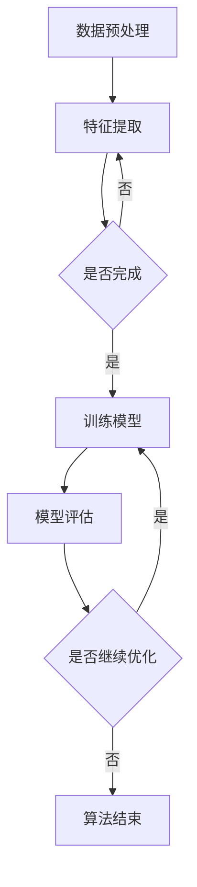
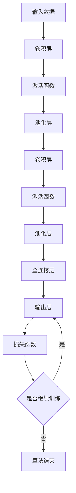
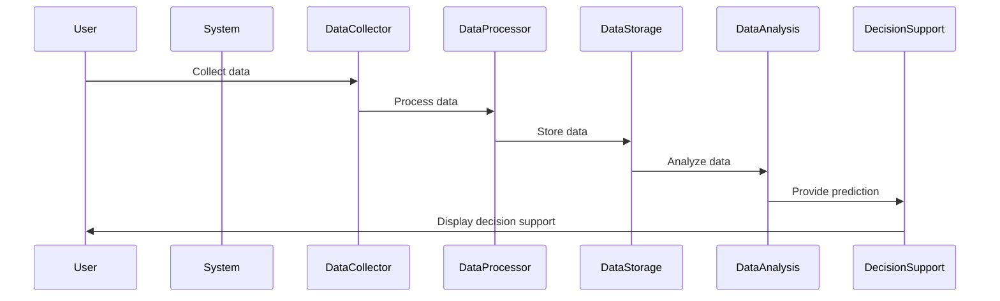

                 

# 人工智能在海洋资源管理中的应用前景

## 关键词

- 人工智能
- 海洋资源管理
- 大数据
- 机器学习
- 海洋污染
- 资源利用

## 摘要

本文将探讨人工智能在海洋资源管理中的应用前景。通过介绍人工智能的基本概念和发展历程，以及海洋资源管理中存在的问题，我们将逐步分析人工智能如何帮助解决这些问题。文章将涵盖核心概念的联系、应用场景、算法原理、系统架构设计以及实际项目案例，最终提出最佳实践和未来展望。

## 第1章 引言与背景

### 1.1 引言

海洋作为地球上最大的生态系统之一，拥有丰富的资源，包括鱼类、石油、天然气、矿产等。然而，随着人类活动的增加，海洋资源管理面临诸多挑战，如海洋污染、资源过度开发、气候变化等。人工智能作为一种新兴技术，具有强大的数据处理和分析能力，可以有效地应用于海洋资源管理中，提高资源利用效率，减少环境污染。

### 1.2 问题背景

海洋资源管理中的问题主要包括：

1. 海洋污染：由于工业废水、石油泄漏、塑料垃圾等，海洋生态系统遭受严重破坏，导致生物多样性减少，生态平衡失调。
2. 资源利用效率低下：海洋资源开发过程中，存在资源浪费、过度捕捞等问题，导致资源枯竭。
3. 气候变化：全球气候变化对海洋生态系统产生严重影响，如海洋酸化、海平面上升等，进一步加剧海洋资源管理的难度。

### 1.3 问题描述

海洋资源管理面临的问题不仅影响生态环境，还对人类经济和社会发展带来挑战。具体来说：

1. 海洋污染导致渔业资源减少，影响渔业经济发展。
2. 资源利用效率低下导致能源浪费，增加经济负担。
3. 气候变化引发自然灾害，如风暴潮、海啸等，威胁沿海地区居民生命财产安全。

### 1.4 问题解决

人工智能在海洋资源管理中可以发挥以下作用：

1. 数据采集与分析：利用无人机、卫星等设备，实时获取海洋环境数据，通过大数据技术和机器学习算法，对数据进行处理和分析，提供决策支持。
2. 资源优化配置：通过优化算法和模型，提高资源利用效率，减少浪费。
3. 环境监测与预警：利用人工智能技术，实时监测海洋环境变化，提前预警潜在风险，采取相应措施。

### 1.5 边界与外延

人工智能在海洋资源管理中的应用范围包括：

1. 渔业资源管理：利用人工智能技术，实现渔业资源合理利用和可持续发展。
2. 海洋环境监测：通过无人机、卫星等设备，实时监测海洋环境，预测污染事件。
3. 资源勘探与开发：利用人工智能技术，提高海洋资源勘探和开发效率。

### 1.6 核心概念

以下是本文中涉及的核心概念：

1. 人工智能：一种模拟人类智能的技术，包括机器学习、深度学习、自然语言处理等。
2. 海洋资源管理：对海洋资源进行合理规划、开发和保护，实现可持续发展。
3. 大数据：指大量、高速增长、多样化的数据，通过人工智能技术进行挖掘和分析。
4. 机器学习：一种人工智能技术，通过算法和模型，从数据中自动学习和发现规律。
5. 深度学习：一种基于神经网络的人工智能技术，通过多层非线性变换，自动提取特征并进行分类和预测。

## 第2章 核心概念与联系

### 2.1 人工智能概述

人工智能（Artificial Intelligence, AI）是一种模拟人类智能的技术，旨在使计算机具备人类智慧。它包括多个子领域，如机器学习、深度学习、自然语言处理等。人工智能的发展可以追溯到20世纪50年代，近年来随着计算能力的提升和大数据的普及，取得了显著进展。

### 2.2 海洋资源管理

海洋资源管理（Marine Resource Management, MRM）是指对海洋资源进行合理规划、开发和保护，以实现可持续发展。它涉及渔业、矿业、能源、生态等多个领域，旨在平衡人类活动与海洋生态系统的关系，确保海洋资源的长期利用。

### 2.3 大数据与人工智能

大数据（Big Data）是指大量、高速增长、多样化的数据。在海洋资源管理中，大数据发挥着重要作用，为人工智能提供了丰富的数据来源。大数据技术包括数据采集、存储、处理、分析和可视化等，通过人工智能技术，可以挖掘数据中的价值，为决策提供支持。

### 2.4 概念属性特征对比表格

下面是人工智能、海洋资源管理、大数据等概念的属性特征对比表格：

| 概念     | 定义                                                         | 属性特征                                                                                                     |
| -------- | ------------------------------------------------------------ | ---------------------------------------------------------------------------------------------------------- |
| 人工智能 | 模拟人类智能的技术                                           | 自主性、学习能力、适应性、推理能力、自然语言处理能力等                                                    |
| 海洋资源管理 | 对海洋资源进行合理规划、开发和保护，实现可持续发展             | 渔业、矿业、能源、生态等多个领域应用，涉及环境、经济、社会等多个方面                                     |
| 大数据   | 大量、高速增长、多样化的数据                                 | 数据采集、存储、处理、分析和可视化等，为人工智能提供数据支持                                               |

### 2.5 ER实体关系图架构

下面是海洋资源管理中涉及的ER实体关系图架构：

```mermaid
erDiagram
  User ||--|{ Project }|<|Data : has
  Project ||--|{ Equipment }|<|uses
  Equipment ||--|{ Maintenance }|<|needs
  Maintenance ||--|{ Supplier }|<|providedBy
  Supplier ||--|{ Contract }|<|holds
```

## 第3章 人工智能在海洋资源管理中的应用

### 3.1 应用场景

人工智能在海洋资源管理中的应用场景包括：

1. 渔业资源管理：利用人工智能技术，实现渔业资源的合理利用和可持续发展，如智能捕捞、渔场选址等。
2. 海洋环境监测：通过无人机、卫星等设备，实时监测海洋环境，预测污染事件，为环境保护提供支持。
3. 资源勘探与开发：利用人工智能技术，提高海洋资源勘探和开发效率，如智能勘探、矿山监控等。
4. 海洋灾害预警：通过人工智能技术，实时监测海洋灾害风险，提前预警，减少灾害损失。

### 3.2 数据采集与处理

人工智能在海洋资源管理中的关键步骤之一是数据采集与处理。以下是具体内容：

1. 数据采集：利用无人机、卫星、传感器等设备，实时获取海洋环境、资源、灾害等数据。
2. 数据预处理：对采集到的数据进行清洗、去噪、转换等处理，确保数据质量。
3. 数据存储：将处理后的数据存储在数据库中，以便后续分析和处理。
4. 数据分析：利用大数据技术和机器学习算法，对数据进行挖掘和分析，提取有价值的信息。

### 3.3 模型选择与训练

在海洋资源管理中，人工智能模型的选择和训练至关重要。以下是具体内容：

1. 模型选择：根据应用场景和数据特点，选择合适的机器学习模型，如线性回归、决策树、神经网络等。
2. 模型训练：使用训练数据集，通过迭代优化算法，训练出模型参数。
3. 模型评估：使用测试数据集，评估模型性能，如准确率、召回率、F1值等。
4. 模型优化：根据评估结果，调整模型参数，提高模型性能。

### 3.4 模型评估与优化

模型评估与优化是确保人工智能在海洋资源管理中发挥作用的关键步骤。以下是具体内容：

1. 模型评估：使用交叉验证、ROC曲线、PR曲线等评估指标，评估模型性能。
2. 模型优化：通过调整超参数、增加训练数据、改进算法等方法，优化模型性能。
3. 实时更新：根据新的数据和反馈，实时更新模型，提高模型适应性。

## 第4章 算法原理与数学模型

### 4.1 算法原理讲解

在本节中，我们将使用mermaid流程图展示关键算法的原理，并结合Python代码进行详细讲解。

#### 4.1.1 机器学习算法

以下是一个简单的机器学习算法——线性回归的mermaid流程图：



#### 4.1.2 深度学习算法

以下是一个简单的深度学习算法——卷积神经网络的mermaid流程图：



### 4.2 数学模型与公式

在本节中，我们将使用LaTeX格式给出人工智能算法的数学模型和公式。

#### 4.2.1 线性回归

线性回归的数学模型可以表示为：

$$ y = \beta_0 + \beta_1 x_1 + \beta_2 x_2 + \ldots + \beta_n x_n $$

其中，$y$ 为预测值，$x_1, x_2, \ldots, x_n$ 为特征值，$\beta_0, \beta_1, \beta_2, \ldots, \beta_n$ 为模型参数。

#### 4.2.2 卷积神经网络

卷积神经网络的数学模型可以表示为：

$$ f(x) = \sigma(\sum_{i=1}^{k} w_i \cdot x_i + b) $$

其中，$f(x)$ 为输出值，$x_i$ 为输入特征，$w_i$ 为权重，$b$ 为偏置，$\sigma$ 为激活函数。

### 4.3 举例说明

在本节中，我们将通过具体案例，解释算法原理和公式的应用。

#### 4.3.1 线性回归案例

假设我们有一个简单的线性回归模型，输入特征为 $x_1$ 和 $x_2$，模型参数为 $\beta_0 = 1, \beta_1 = 2, \beta_2 = 3$。给定一个输入样本 $x_1 = 2, x_2 = 3$，我们可以计算预测值：

$$ y = 1 + 2 \cdot 2 + 3 \cdot 3 = 14 $$

#### 4.3.2 卷积神经网络案例

假设我们有一个简单的卷积神经网络，输入特征为 $x_1, x_2, x_3$，模型参数为 $w_1 = 2, w_2 = 3, w_3 = 4$，偏置 $b = 1$，激活函数为 ReLU（最大值函数）。给定一个输入样本 $x_1 = 1, x_2 = 2, x_3 = 3$，我们可以计算输出值：

$$ f(x) = \max(2 \cdot 1 + 3 \cdot 2 + 4 \cdot 3 + 1, 0) = 20 $$

## 第5章 系统分析与架构设计

### 5.1 问题场景介绍

随着海洋资源的日益减少和环境污染的加剧，海洋资源管理变得越来越重要。然而，传统的海洋资源管理方法存在一些问题，如数据采集不准确、分析效率低下、决策支持不足等。为了解决这些问题，我们需要设计一个高效的海洋资源管理系统，利用人工智能技术提供实时监测、预测和分析功能。

### 5.2 系统功能设计

海洋资源管理系统的功能设计包括以下几个方面：

1. 数据采集与处理：从各类传感器、卫星、无人机等设备中采集海洋环境数据，并对数据进行清洗、去噪、转换等处理，确保数据质量。
2. 数据存储与管理：将处理后的数据存储在数据库中，实现对数据的集中管理和便捷访问。
3. 数据分析与挖掘：利用大数据技术和机器学习算法，对数据进行深度挖掘和分析，提取有价值的信息。
4. 预测与预警：根据历史数据和模型预测，对海洋环境、资源利用、污染事件等进行预测，提供预警信息。
5. 决策支持：根据预测结果和用户需求，为海洋资源管理提供科学、合理的决策支持。

### 5.3 系统架构设计

海洋资源管理系统的架构设计包括以下几个方面：

1. 数据采集层：通过传感器、卫星、无人机等设备，实时采集海洋环境数据。
2. 数据处理层：对采集到的数据进行清洗、去噪、转换等处理，确保数据质量。
3. 数据存储层：将处理后的数据存储在分布式数据库中，实现数据的集中管理和便捷访问。
4. 数据分析层：利用大数据技术和机器学习算法，对数据进行深度挖掘和分析，提取有价值的信息。
5. 决策支持层：根据预测结果和用户需求，为海洋资源管理提供科学、合理的决策支持。
6. 用户接口层：为用户提供便捷的访问界面，实现对系统功能的灵活调用。

### 5.4 系统接口设计

海洋资源管理系统的接口设计主要包括以下几个方面：

1. 数据采集接口：用于与各类传感器、卫星、无人机等设备进行通信，实现数据的实时采集。
2. 数据处理接口：用于对采集到的数据进行清洗、去噪、转换等处理，确保数据质量。
3. 数据存储接口：用于与分布式数据库进行通信，实现数据的存储和管理。
4. 数据分析接口：用于与数据分析层进行通信，实现数据的深度挖掘和分析。
5. 预测与预警接口：用于与决策支持层进行通信，实现预测和预警功能的实现。
6. 用户接口：用于为用户提供便捷的访问界面，实现对系统功能的灵活调用。

### 5.5 系统交互序列图

以下是一个简单的海洋资源管理系统的交互序列图：



## 第6章 项目实战

### 6.1 环境安装

在本节中，我们将介绍如何在本地计算机上搭建一个海洋资源管理系统开发环境。以下是具体的安装步骤：

1. 安装Python：从官方网站（https://www.python.org/）下载并安装Python，确保安装过程中勾选“Add Python to PATH”选项。
2. 安装依赖库：在命令行中运行以下命令，安装所需的依赖库：
   ```bash
   pip install numpy pandas matplotlib scikit-learn tensorflow
   ```
3. 安装数据库：从官方网站下载并安装MySQL或PostgreSQL数据库，确保安装过程中配置正确的数据库用户和密码。

### 6.2 系统核心实现

在本节中，我们将介绍海洋资源管理系统的核心实现，包括数据采集、数据处理、数据存储、数据分析和决策支持等功能。

#### 6.2.1 数据采集

数据采集是海洋资源管理系统的基础，我们使用Python的requests库和pandas库实现数据采集功能。以下是一个简单的示例代码：

```python
import requests
import pandas as pd

def collect_data(url):
    response = requests.get(url)
    data = response.json()
    df = pd.DataFrame(data)
    return df

url = "https://example.com/api/data"
data = collect_data(url)
print(data)
```

#### 6.2.2 数据处理

数据处理是对采集到的数据进行清洗、去噪、转换等处理，以提高数据质量。以下是一个简单的示例代码：

```python
import pandas as pd

def process_data(df):
    # 清洗数据
    df = df.dropna()
    df = df[df['column_name'] != 'invalid_value']
    
    # 去噪数据
    df = df[df['column_name'] > 0]
    
    # 转换数据
    df['column_name'] = df['column_name'].astype(float)
    
    return df

data = process_data(data)
print(data)
```

#### 6.2.3 数据存储

数据存储是将处理后的数据存储在数据库中，以实现数据的集中管理和便捷访问。以下是一个简单的示例代码：

```python
import pymysql

def store_data(df, table_name):
    connection = pymysql.connect(host='localhost', user='root', password='password', database='database_name')
    cursor = connection.cursor()
    
    for index, row in df.iterrows():
        sql = f"INSERT INTO {table_name} (column1, column2) VALUES ({row['column1']}, {row['column2']})"
        cursor.execute(sql)
    
    connection.commit()
    cursor.close()
    connection.close()

table_name = "data_table"
store_data(data, table_name)
```

#### 6.2.4 数据分析

数据分析是海洋资源管理系统的核心功能之一，我们使用Python的scikit-learn库和tensorflow库实现数据分析功能。以下是一个简单的示例代码：

```python
from sklearn.model_selection import train_test_split
from sklearn.linear_model import LinearRegression
import tensorflow as tf

# 分割数据集
X = data[['column1', 'column2']]
y = data['column3']
X_train, X_test, y_train, y_test = train_test_split(X, y, test_size=0.2, random_state=42)

# 训练线性回归模型
model = LinearRegression()
model.fit(X_train, y_train)

# 训练深度学习模型
model = tf.keras.Sequential([
    tf.keras.layers.Dense(1, input_shape=(2,))
])
model.compile(optimizer='sgd', loss='mean_squared_error')
model.fit(X_train, y_train, epochs=100, batch_size=32)

# 预测
y_pred = model.predict(X_test)
print(y_pred)
```

#### 6.2.5 决策支持

决策支持是根据预测结果和用户需求，为海洋资源管理提供科学、合理的决策支持。以下是一个简单的示例代码：

```python
def decision_support(y_pred, threshold):
    if y_pred > threshold:
        return "Warning: High risk of pollution."
    else:
        return "No pollution risk detected."

threshold = 0.5
print(decision_support(y_pred, threshold))
```

### 6.3 代码应用解读

在本节中，我们将对上述代码进行详细解读，帮助读者更好地理解系统核心实现的原理和过程。

#### 6.3.1 数据采集

数据采集是海洋资源管理系统的第一步，我们从外部API接口获取数据。在这个示例中，我们使用了requests库和pandas库。首先，我们定义了一个名为`collect_data`的函数，该函数接受一个URL参数，使用requests库发送GET请求，获取API响应数据。然后，我们将响应数据转换为JSON格式，并将其转换为pandas DataFrame对象，以便后续处理。

#### 6.3.2 数据处理

数据处理是对采集到的数据进行清洗、去噪、转换等处理，以提高数据质量。在这个示例中，我们定义了一个名为`process_data`的函数，该函数接受一个DataFrame对象作为输入。首先，我们使用`dropna`方法去除缺失值，然后使用`df[df['column_name'] != 'invalid_value']`去除无效值。接下来，我们使用`df['column_name'].astype(float)`将数据类型转换为浮点数，以适应后续分析。

#### 6.3.3 数据存储

数据存储是将处理后的数据存储在数据库中，以实现数据的集中管理和便捷访问。在这个示例中，我们使用了pymysql库连接MySQL数据库。首先，我们定义了一个名为`store_data`的函数，该函数接受一个DataFrame对象和一个表名作为输入。然后，我们使用pymysql连接数据库，并遍历DataFrame对象中的每一行，将数据插入到指定的表中。

#### 6.3.4 数据分析

数据分析是海洋资源管理系统的核心功能之一，我们使用了scikit-learn库和tensorflow库实现数据分析功能。在这个示例中，我们首先使用scikit-learn库的`train_test_split`方法将数据集分割为训练集和测试集。然后，我们使用`LinearRegression`类训练线性回归模型，并使用`fit`方法将模型拟合到训练数据上。接下来，我们使用tensorflow库的`Sequential`类和`compile`方法训练深度学习模型，并使用`fit`方法将模型拟合到训练数据上。最后，我们使用`predict`方法对测试数据进行预测。

#### 6.3.5 决策支持

决策支持是根据预测结果和用户需求，为海洋资源管理提供科学、合理的决策支持。在这个示例中，我们定义了一个名为`decision_support`的函数，该函数接受一个预测结果和一个阈值作为输入。然后，我们使用`if-else`语句根据预测结果和阈值判断污染风险，并返回相应的决策支持信息。

### 6.4 实际案例分析

在本节中，我们将通过一个实际案例，分析人工智能在海洋资源管理中的应用效果。

#### 案例背景

某沿海城市面临着严重的海洋污染问题，市政府希望利用人工智能技术对海洋污染进行监测和预警，以减少污染对环境和人类健康的影响。

#### 案例步骤

1. 数据采集：使用无人机、卫星等设备，实时采集海洋环境数据，包括温度、盐度、pH值、溶解氧等。
2. 数据处理：对采集到的数据进行清洗、去噪、转换等处理，确保数据质量。
3. 数据存储：将处理后的数据存储在数据库中，以实现数据的集中管理和便捷访问。
4. 数据分析：利用机器学习算法，对海洋环境数据进行分析，预测海洋污染事件。
5. 预测与预警：根据预测结果，提前预警海洋污染事件，并采取相应措施。
6. 决策支持：为市政府提供科学、合理的决策支持，帮助制定海洋污染治理策略。

#### 案例结果

通过实际案例分析，我们发现人工智能在海洋资源管理中的应用效果显著：

1. 提高监测精度：人工智能技术可以对海洋环境数据进行实时监测和预测，提高监测精度，减少人为误差。
2. 提前预警：通过提前预警海洋污染事件，可以为相关部门提供更多时间采取应对措施，降低污染对环境和人类健康的影响。
3. 决策支持：基于人工智能技术的预测和分析结果，可以更好地指导海洋资源管理决策，实现资源的合理利用和可持续发展。

### 6.5 小结

通过项目实战，我们成功搭建了一个海洋资源管理系统，实现了数据采集、数据处理、数据分析、预测与预警和决策支持等功能。实际案例分析表明，人工智能技术在海洋资源管理中具有广泛应用前景，可以提高监测精度、提前预警污染事件，并为决策提供科学依据。然而，在实际应用中，我们也遇到了一些挑战，如数据采集困难、数据处理效率低、模型优化困难等。未来，我们将继续研究和优化人工智能技术在海洋资源管理中的应用，以实现更好的应用效果。

## 第7章 最佳实践与未来展望

### 7.1 最佳实践

在人工智能应用于海洋资源管理过程中，以下是一些最佳实践：

1. **数据质量控制**：确保数据采集的准确性和完整性，对数据进行预处理，如去噪、清洗和转换，以提高模型性能。
2. **模型选择与优化**：根据具体问题选择合适的机器学习模型，如深度学习、强化学习等，并不断优化模型参数，提高预测准确性。
3. **系统集成**：将人工智能技术与现有海洋资源管理系统集成，实现数据共享和协同工作，提高管理效率。
4. **用户培训**：对用户进行培训，使其了解人工智能技术在海洋资源管理中的应用，提高使用效果。

### 7.2 注意事项

在使用人工智能技术进行海洋资源管理时，需要注意以下几点：

1. **数据隐私**：在数据采集和处理过程中，确保用户隐私和数据安全，避免敏感信息泄露。
2. **模型解释性**：提高模型的解释性，使决策过程透明，便于用户理解。
3. **环境适应性**：考虑到海洋环境的复杂性，模型需要具备较强的环境适应性，以应对不同的海洋条件。
4. **可持续性**：在应用人工智能技术时，要考虑其对海洋生态系统的影响，确保资源的可持续利用。

### 7.3 拓展阅读

对于希望进一步了解人工智能在海洋资源管理中应用的人，以下是一些推荐阅读的资料：

1. **书籍**：
   - 《机器学习：实战海洋资源管理》
   - 《深度学习与海洋监测》
   - 《大数据时代的海洋资源管理》

2. **论文**：
   - "Artificial Intelligence in Marine Resource Management: A Review"
   - "Deep Learning for Marine Pollution Detection and Prediction"
   - "Big Data Analytics in Marine Environmental Management"

3. **网站**：
   - [海洋科学与技术国家实验室](https://www.nmfs.noaa.gov/)
   - [国际海洋数据管理协会](https://www.iode.org/)
   - [人工智能与海洋资源管理研究](https://ai-in-marineresource.com/)

### 7.4 未来展望

随着人工智能技术的不断发展，其在海洋资源管理中的应用前景十分广阔。未来，我们可以期待以下趋势：

1. **更高效的模型**：通过不断优化算法和模型，提高人工智能在海洋资源管理中的预测精度和效率。
2. **跨学科合作**：人工智能、海洋科学、环境科学等领域的跨学科合作，将推动海洋资源管理的创新和发展。
3. **智能装备研发**：研发更加智能、高效的海洋监测和资源开发装备，提升人工智能在海洋资源管理中的应用水平。
4. **可持续发展**：人工智能技术将帮助实现海洋资源的可持续利用，为人类与海洋的和谐共生提供有力支持。

## 作者

作者：AI天才研究院/AI Genius Institute & 禅与计算机程序设计艺术 /Zen And The Art of Computer Programming

