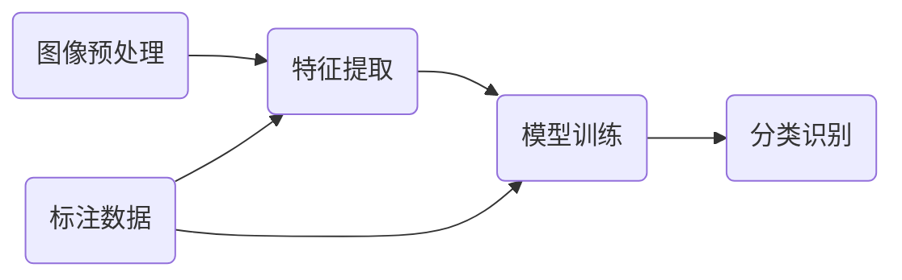
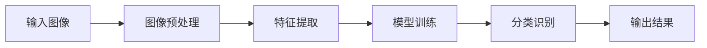
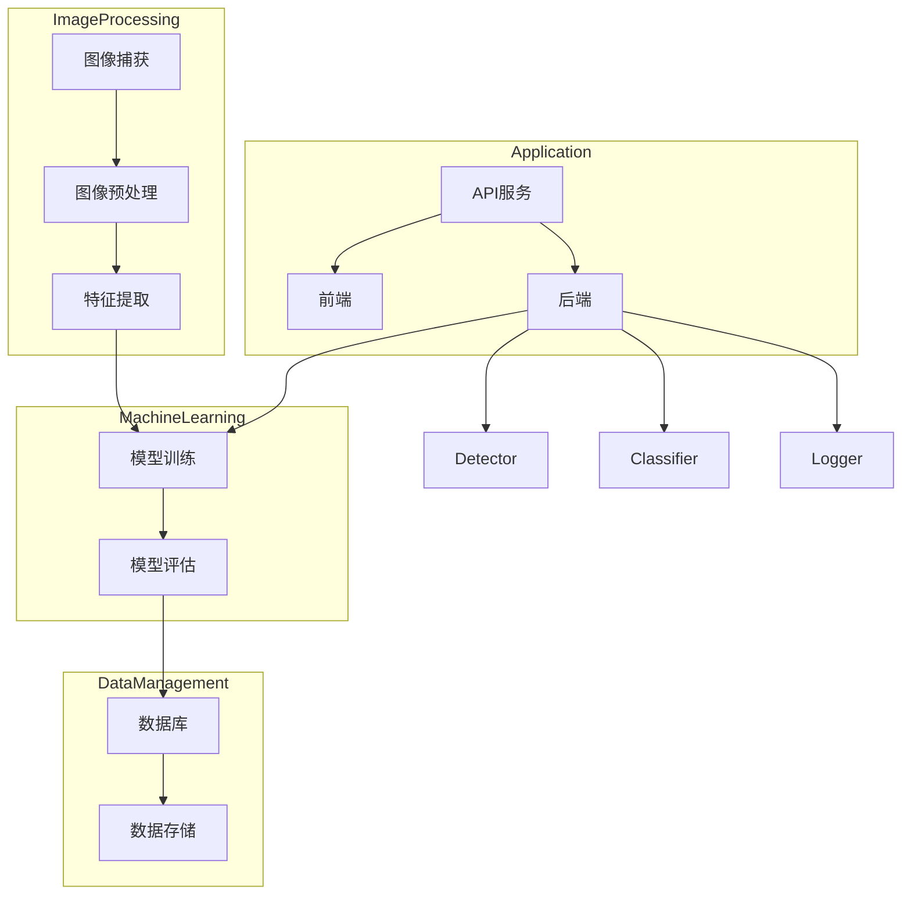
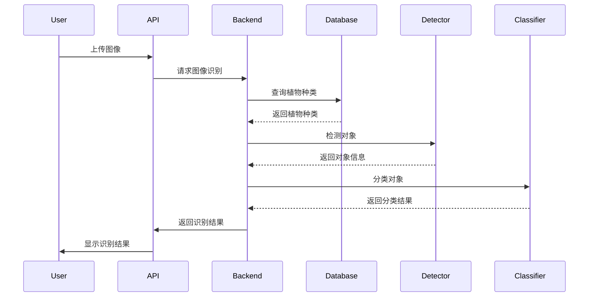

                 

# 人工智能在濒危植物保护中的图像识别应用

## 关键词
人工智能、图像识别、濒危植物保护、深度学习、卷积神经网络

## 摘要
本文探讨了人工智能（AI）在濒危植物保护中的应用，特别是图像识别技术的应用。文章首先介绍了濒危植物保护的背景和挑战，然后详细阐述了图像识别的基础知识及其在AI中的核心作用。接着，文章分析了人工智能在图像识别中的应用，包括机器学习和深度学习的基础知识，以及卷积神经网络（CNN）的原理和目标检测、语义分割算法。随后，文章通过具体的算法讲解、实战案例和系统设计，展示了如何将图像识别应用于濒危植物保护。最后，文章总结了最佳实践和拓展阅读，为读者提供了进一步学习的方向。

## 引言

### 人工智能在濒危植物保护中的重要性和必要性

在全球范围内，濒危植物种群的减少已经成为生态系统中一个严峻的问题。据估计，有超过三分之一的植物物种面临灭绝的风险。这一现象不仅对生物多样性构成了巨大威胁，还对生态平衡、气候调节和人类福祉产生了深远影响。因此，保护和恢复濒危植物种群显得尤为迫切。

人工智能（AI）作为一种新兴的技术，其在濒危植物保护中具有重要的应用价值。AI可以通过自动化和智能化的方式，提高濒危植物保护的效率。特别是图像识别技术，作为AI的一个重要分支，其在濒危植物识别、监测和保护的各个环节中发挥着关键作用。

首先，AI可以通过图像识别技术快速、准确地识别濒危植物。传统的植物识别方法往往依赖于人工观察和经验，效率低下且容易出错。而AI系统可以基于大量的植物图像数据，利用深度学习算法进行训练，从而实现对濒危植物的自动识别。

其次，图像识别技术还可以用于监测濒危植物的生存状况。通过定期拍摄植物图像，AI系统可以自动分析植物的生长状态、叶面积、病虫害等情况，从而及时发现异常，采取相应的保护措施。

此外，AI还可以用于濒危植物的分布和迁徙研究。通过对大量的植物图像进行分析，AI系统可以揭示濒危植物的分布规律和迁徙路径，为制定科学的保护策略提供依据。

总的来说，人工智能在濒危植物保护中具有广泛的应用前景。通过结合图像识别技术，可以大幅度提高濒危植物保护的效率和准确性，为保护地球的生物多样性做出积极贡献。

### 图像识别技术在人工智能领域中的关键作用

图像识别作为人工智能（AI）的重要分支，在AI领域中扮演着至关重要的角色。其核心作用主要体现在以下几个方面：

首先，图像识别技术为AI系统提供了强大的感知能力。通过识别和理解图像中的信息，AI系统可以实现对现实世界的感知和交互。这种感知能力是AI实现自主决策和行为的基础。

其次，图像识别技术在AI中的应用极大地拓宽了AI的应用领域。无论是计算机视觉、自动驾驶、安防监控，还是医疗诊断、智能制造，图像识别技术都发挥着核心作用。例如，在自动驾驶领域，图像识别技术用于识别道路标志、车辆和行人，从而确保车辆的安全行驶。

第三，图像识别技术为AI系统提供了高效的解决方案。相比于传统的人工处理方法，图像识别技术可以自动处理大量的图像数据，提高数据处理的速度和准确性。这不仅降低了人力成本，还提高了AI系统的效率和鲁棒性。

第四，图像识别技术促进了AI算法的创新和发展。通过不断优化和改进图像识别算法，如卷积神经网络（CNN）、生成对抗网络（GAN）等，AI系统的性能得到了显著提升。这些创新不仅推动了图像识别技术的发展，也为AI在其他领域的应用提供了新的思路和方法。

最后，图像识别技术在人工智能领域中的关键作用还体现在其对人类生活的深远影响。从智能家居到智能医疗，从智能安防到智能教育，图像识别技术已经深入到我们日常生活的方方面面。它不仅提升了人们的生活质量，还带来了新的商业机会和产业变革。

总之，图像识别技术在人工智能领域中具有不可替代的地位和作用。随着技术的不断进步和应用场景的拓展，图像识别技术将在人工智能的发展中发挥越来越重要的作用。

### 本文的研究目的和结构安排

本文旨在探讨人工智能（AI）在濒危植物保护中的图像识别应用，通过分析图像识别技术的基本原理和应用场景，展示其在濒危植物识别和保护中的实际价值。具体研究目标如下：

1. 深入理解图像识别技术的基本原理，包括机器学习、深度学习以及卷积神经网络（CNN）等关键概念。
2. 分析图像识别技术在濒危植物识别、监测和保护中的应用现状，探讨其优势和挑战。
3. 通过具体的算法讲解和实战案例，展示如何将图像识别技术应用于濒危植物保护，提高保护工作的效率和准确性。

本文的结构安排如下：

1. 引言：介绍人工智能在濒危植物保护中的重要性和图像识别技术的作用。
2. 问题背景与图像识别基础：分析濒危植物保护的现状和挑战，回顾人工智能与图像识别的基本概念与发展历程。
3. 图像识别核心概念与联系：阐述图像识别的核心概念，包括特征提取、分类和识别，展示相关的概念属性特征对比表格和ER实体关系图。
4. 人工智能在图像识别中的应用：介绍机器学习与深度学习的基础，讲解卷积神经网络（CNN）及其在目标检测与语义分割中的应用。
5. 图像识别算法原理讲解：通过算法Mermaid流程图展示和Python源代码阐述，深入讲解图像识别算法的原理，包括数学模型和公式，辅以通俗易懂的举例说明。
6. 人工智能在濒危植物保护中的实际应用：详细讨论濒危植物图像数据集的准备与处理，以及图像识别算法在濒危植物保护中的应用案例。
7. 系统分析与架构设计方案：介绍问题场景和项目背景，设计系统功能、架构和接口，绘制领域模型类图、系统架构图和系统交互序列图。
8. 项目实战：讲解环境安装与配置、系统核心实现源代码，分析代码应用和实际案例，进行项目小结。
9. 最佳实践、小结与拓展阅读：总结最佳实践技巧，进行文章小结，提醒注意事项，推荐拓展阅读。

通过上述结构安排，本文旨在为读者提供全面、系统的理解和应用图像识别技术于濒危植物保护的指南。

### 第1章 问题背景与图像识别基础

#### 濒危植物保护的现状与挑战

濒危植物保护是全球生态保护中的重要议题。根据国际自然保护联盟（IUCN）的数据显示，全球约三分之一的植物物种面临着灭绝的风险。导致濒危植物减少的原因复杂多样，包括栖息地的丧失、气候变化、环境污染、过度开采和非法采集等。这些因素不仅破坏了植物的生存环境，还导致了植物种群的退化，严重威胁了全球生物多样性。

目前，濒危植物保护的现状不容乐观。虽然各国政府和环保组织已经采取了一系列措施来保护和恢复濒危植物，但由于资源有限和技术手段的不足，实际效果有限。传统的植物保护方法主要依赖于人工巡查、实地调查和人工识别，这些方法不仅效率低下，而且容易受到人为因素的干扰，导致数据不准确。

此外，随着濒危植物种群的减少，许多植物物种已经到了濒临灭绝的边缘，这使得保护工作的难度越来越大。许多濒危植物生长在偏远和恶劣的环境中，交通不便、信息不透明，使得保护工作更加困难。同时，植物保护工作者面临的资金、技术和人力资源的短缺，也是制约濒危植物保护工作的重要因素。

#### 人工智能与图像识别的基本概念与发展历程

人工智能（AI）是一门模拟、延伸和扩展人类智能的理论、方法、技术和应用系统的综合科学技术。其目标是使计算机能够胜任一些通常需要人类智能才能完成的复杂任务。人工智能的发展历程可以分为几个阶段，包括符号主义人工智能、连接主义人工智能和统计学习人工智能。近年来，随着深度学习、卷积神经网络等技术的突破，人工智能的应用领域得到了极大的拓展。

图像识别是人工智能的一个重要分支，旨在使计算机能够识别和分类图像中的对象、场景和活动。图像识别技术的基本概念包括图像预处理、特征提取、模型训练和分类识别。图像预处理主要包括图像增强、滤波和归一化等，目的是改善图像质量，使其更适合后续处理。特征提取则是从图像中提取出具有区分度的特征，如边缘、纹理和颜色等。模型训练是利用大量标注数据，通过优化算法，使计算机学会识别图像中的对象。分类识别则是将输入图像与已训练的模型进行比较，判断图像中的对象类别。

图像识别技术自20世纪60年代开始发展，至今已经经历了多个阶段。早期的图像识别主要依赖于手工设计的特征和分类器，如边缘检测、特征匹配和线性分类器。随着计算机性能的提升和大数据技术的应用，20世纪80年代和90年代，基于模板匹配和局部特征的方法得到了广泛应用。21世纪初，随着深度学习技术的发展，卷积神经网络（CNN）成为了图像识别的主流方法，其通过多层神经网络自动提取特征，大大提高了识别的准确性和效率。

#### 图像识别技术在植物保护领域的应用现状与前景

图像识别技术在植物保护领域的应用逐渐受到关注，并展现出巨大的潜力。目前，图像识别技术主要应用于以下方面：

1. **濒危植物识别**：通过图像识别技术，可以快速、准确地识别濒危植物，替代传统的人工识别方法。例如，研究人员可以利用深度学习算法，训练出能够识别多种濒危植物的模型，从而提高濒危植物识别的效率和准确性。

2. **植物健康状况监测**：通过拍摄植物图像，AI系统可以自动分析植物的生长状态、叶面积、病虫害等情况，及时发现异常，提供及时的保护措施。例如，在农业领域，图像识别技术可以用于监测作物的病虫害，提前采取防治措施，提高农作物的产量和质量。

3. **植物分布与迁徙研究**：通过分析大量的植物图像数据，AI系统可以揭示植物在不同地区的分布规律和迁徙路径，为制定科学的保护策略提供依据。例如，研究人员可以利用图像识别技术，研究濒危植物在不同环境下的适应性，从而优化保护方案。

4. **保护区域监控**：在自然保护区和濒危植物栖息地，图像识别技术可以用于监控入侵物种、非法采集和破坏行为。例如，通过无人机搭载的摄像头，AI系统可以实时监测保护区域，及时发现和处理违法行为。

图像识别技术在植物保护领域的前景十分广阔。随着技术的不断进步，图像识别的准确性和效率将进一步提高，从而更好地服务于濒危植物保护工作。未来，图像识别技术有望与其他AI技术，如机器学习、自然语言处理等相结合，形成更强大的智能保护系统，为保护地球的生物多样性作出更大贡献。

### 第2章 图像识别核心概念与联系

#### 图像识别的核心概念

图像识别是计算机视觉领域的一个重要分支，其核心任务是从图像中自动识别和分类对象或场景。为了实现这一目标，图像识别技术涉及多个关键概念和步骤，主要包括图像预处理、特征提取、模型训练和分类识别。

1. **图像预处理**：图像预处理是图像识别的基础步骤，旨在改善图像质量，使其更适合后续处理。常用的预处理方法包括图像增强、滤波、归一化和图像分割等。图像增强可以通过调整对比度和亮度等参数，突出图像中的重要特征；滤波可以去除图像中的噪声；归一化可以统一图像的尺寸和像素值，使图像数据具有更好的可处理性；图像分割则是将图像划分为多个区域，以便进行后续的特征提取。

2. **特征提取**：特征提取是从图像中提取出具有区分度的特征，如边缘、纹理、颜色等。这些特征是图像识别的关键信息，用于表示图像的内容。常用的特征提取方法包括直方图、主成分分析（PCA）、SIFT（尺度不变特征变换）和SURF（加速稳健特征）等。这些方法可以根据图像的不同特性，提取出有效的特征信息，为后续的分类提供依据。

3. **模型训练**：模型训练是利用大量标注数据，通过优化算法，使计算机学会识别图像中的对象。常见的训练方法包括监督学习、无监督学习和半监督学习。监督学习通过标注数据，学习输入和输出之间的映射关系；无监督学习通过未标注数据，发现数据中的模式和结构；半监督学习则结合了监督学习和无监督学习的优势。在图像识别中，监督学习是最常用的方法，通过大量的标注图像，训练出能够识别图像中对象的模型。

4. **分类识别**：分类识别是将输入图像与已训练的模型进行比较，判断图像中的对象类别。常见的分类方法包括基于规则的方法、神经网络方法和集成方法等。基于规则的方法通过设计特定的规则，对图像进行分类；神经网络方法，如卷积神经网络（CNN）和循环神经网络（RNN），通过多层神经网络自动提取特征，进行分类识别；集成方法通过组合多个分类器的结果，提高分类的准确性和鲁棒性。

#### 概念属性特征对比表格

以下是一个简单的概念属性特征对比表格，用于展示图像预处理、特征提取、模型训练和分类识别的主要方法和属性：

| 概念        | 描述                           | 主要方法                                                     | 属性                     |
| ----------- | ------------------------------ | ------------------------------------------------------------ | ------------------------ |
| 图像预处理  | 改善图像质量，使其更适合处理   | 增强、滤波、归一化、分割                                     | 图像增强、噪声过滤、尺寸归一 |
| 特征提取    | 提取图像中的关键特征           | 直方图、PCA、SIFT、SURF                                     | 边缘检测、纹理识别、颜色分析 |
| 模型训练    | 学习图像识别规律               | 监督学习、无监督学习、半监督学习                             | 函数拟合、模式识别、数据学习 |
| 分类识别    | 判断图像中的对象类别           | 基于规则、神经网络、集成方法                                 | 精确度、鲁棒性、效率         |

#### 图像识别的ER实体关系图

实体-关系（ER）图是用于描述数据实体及其之间关系的图形化工具。在图像识别领域，ER图可以用于表示图像识别过程中涉及的主要实体和它们之间的关系。

以下是一个简单的图像识别ER实体关系图，用于展示图像识别中的主要实体及其关系：



- **图像预处理（A）**：表示对输入图像进行预处理的过程，如增强、滤波、归一化和分割等。
- **特征提取（B）**：表示从预处理后的图像中提取关键特征的过程，如边缘、纹理和颜色等。
- **模型训练（C）**：表示利用特征数据训练图像识别模型的过程，包括监督学习和无监督学习等。
- **分类识别（D）**：表示将输入图像与训练好的模型进行比较，判断图像中对象类别的过程。
- **标注数据（E）**：表示用于训练和评估图像识别模型的数据，包括已标注的图像和标签。

通过上述ER图，可以清晰地理解图像识别过程中的关键步骤和实体之间的关系，为后续的详细分析打下基础。

### 第3章 人工智能在图像识别中的应用

#### 机器学习与深度学习基础

机器学习和深度学习是人工智能（AI）的核心技术，它们在图像识别中的应用尤为重要。理解这两种技术的原理和区别，有助于我们更好地掌握图像识别技术的发展和应用。

##### 机器学习

机器学习（Machine Learning，ML）是一种通过算法和统计模型，使计算机能够从数据中学习并做出预测或决策的技术。机器学习可以分为三种主要类型：监督学习（Supervised Learning）、无监督学习（Unsupervised Learning）和半监督学习（Semi-Supervised Learning）。

1. **监督学习**：监督学习是机器学习中应用最广泛的一种类型，其特点是使用已标记的训练数据来训练模型。模型通过学习输入数据和对应的标签，学会对新数据进行预测。常见的监督学习方法包括线性回归、逻辑回归、支持向量机（SVM）和决策树等。

2. **无监督学习**：无监督学习不依赖于已标记的数据，其目标是从未标记的数据中发现隐藏的结构或模式。常见的无监督学习方法包括聚类（Clustering）和降维（Dimensionality Reduction）。聚类方法如K-均值聚类、高斯混合模型（Gaussian Mixture Model）等，用于发现数据中的相似性或群组。降维方法如主成分分析（PCA）、自编码器（Autoencoder）等，用于减少数据维度，同时保留关键信息。

3. **半监督学习**：半监督学习结合了监督学习和无监督学习的优势，使用少量的标记数据和大量的未标记数据来训练模型。这种方法在处理大量未标记数据时尤为有效。常见的半监督学习方法包括伪标记（Pseudo-Labeling）、自训练（Self-Training）等。

##### 深度学习

深度学习（Deep Learning，DL）是机器学习的一个子领域，主要基于多层神经网络（Neural Networks）进行训练和学习。与传统机器学习方法不同，深度学习通过多层神经网络自动提取特征，从而实现复杂的数据分析和模式识别。

1. **神经网络**：神经网络是一种模仿生物神经系统的计算模型，由大量相互连接的神经元组成。每个神经元都通过权重连接到其他神经元，并通过激活函数产生输出。多层神经网络通过逐层提取和组合特征，能够学习到更复杂、抽象的信息。

2. **卷积神经网络（CNN）**：卷积神经网络是深度学习中最常用的架构之一，特别适用于图像识别和计算机视觉任务。CNN通过卷积层、池化层和全连接层等结构，逐层提取图像的局部特征，并最终实现分类或识别任务。

3. **深度学习算法**：除了CNN，深度学习还包括其他重要的算法，如循环神经网络（RNN）、生成对抗网络（GAN）和强化学习（Reinforcement Learning）。RNN在处理序列数据时表现出色，适用于自然语言处理和语音识别等领域。GAN通过生成器和判别器的对抗训练，能够生成逼真的数据，广泛应用于图像生成和增强。强化学习通过与环境交互，学习最优策略，适用于自动驾驶、游戏和机器人控制等领域。

##### 机器学习与深度学习的比较

机器学习和深度学习在技术原理和应用场景上存在显著差异：

1. **技术原理**：机器学习依赖于传统的统计模型和优化算法，如线性回归、决策树和支持向量机等。深度学习则基于多层神经网络，通过反向传播算法进行参数优化，能够自动提取复杂的特征。

2. **应用场景**：机器学习在处理结构化数据时表现出色，如文本分类、预测和回归任务。深度学习则擅长处理非结构化数据，如图像、视频和语音，特别是在图像识别、语音识别和自然语言处理等领域。

3. **计算资源**：深度学习通常需要更多的计算资源和训练时间，特别是大型神经网络和大规模数据集。机器学习在计算资源上要求较低，适用于资源受限的环境。

总的来说，机器学习和深度学习各有优势，在实际应用中往往需要结合使用。机器学习适合处理中小规模的结构化数据，而深度学习则在处理大规模非结构化数据方面具有显著优势。理解这两种技术的原理和区别，有助于我们更好地选择和应用合适的算法，解决实际问题。

#### 卷积神经网络（CNN）原理与应用

卷积神经网络（Convolutional Neural Network，CNN）是深度学习中最常用的架构之一，特别适用于图像识别和计算机视觉任务。CNN通过卷积层、池化层和全连接层等结构，能够自动提取图像中的局部特征，实现对复杂图像内容的理解和分类。

##### CNN的基本结构

1. **卷积层（Convolutional Layer）**：卷积层是CNN的核心部分，通过卷积操作提取图像特征。卷积层包含多个卷积核（也称为滤波器），每个卷积核都可以提取图像中的一个局部特征。卷积操作通过滑动卷积核在输入图像上，计算每个位置的局部特征，生成特征图（Feature Map）。卷积层的深度决定了特征图的维度。

   $$ 
   \text{卷积操作} = \sum_{i=1}^{C} w_{ij} * g(x, y) + b_j 
   $$

   其中，$C$表示卷积核的数量，$w_{ij}$表示卷积核的权重，$g(x, y)$表示输入图像的像素值，$b_j$表示偏置项。

2. **池化层（Pooling Layer）**：池化层用于降低特征图的维度，减少参数数量，防止过拟合。常见的池化操作包括最大池化（Max Pooling）和平均池化（Average Pooling）。最大池化选择每个局部区域中的最大值作为输出，而平均池化则是计算局部区域内的平均值。

3. **全连接层（Fully Connected Layer）**：全连接层将卷积层和池化层提取的特征映射到输出类别。每个神经元都与前一层所有神经元相连，通过激活函数（如ReLU函数）进行非线性变换，最终输出分类结果。

##### CNN的工作原理

1. **特征提取**：CNN通过多层卷积层，逐层提取图像的局部特征。第一层卷积层通常提取边缘、纹理等简单特征；随着层数的增加，CNN能够提取更复杂、抽象的特征，如形状、对象等。

2. **特征组合**：通过逐层叠加卷积层和池化层，CNN能够将低级特征组合成高级特征。这种层次化的特征提取方式，使得CNN能够有效地学习到图像的层次结构。

3. **分类决策**：在CNN的最后几层，通常包含全连接层和Softmax函数。全连接层将高维特征映射到输出类别，Softmax函数用于计算每个类别的概率分布，从而实现分类决策。

##### CNN在图像识别中的应用

CNN在图像识别中有着广泛的应用，以下是一些常见的应用场景：

1. **对象识别**：通过训练CNN模型，可以实现对图像中对象的识别。例如，使用ImageNet数据集，CNN已经达到了很高的识别准确率，广泛应用于智能手机、安防监控和自动驾驶等领域。

2. **目标检测**：目标检测是图像识别的一个挑战性任务，需要同时识别图像中的对象和它们的位置。常用的目标检测算法包括R-CNN、Fast R-CNN、Faster R-CNN和YOLO等，这些算法都基于CNN架构，通过将CNN与区域建议网络（Region Proposal Network，RPN）或锚点生成器（Anchor Generator）相结合，实现高效的物体检测。

3. **语义分割**：语义分割是图像识别中的另一个重要任务，旨在将图像中的每个像素分类到不同的语义类别。常用的语义分割模型包括FCN（Fully Convolutional Network）和U-Net等，这些模型通过在CNN的最后添加一个全卷积层，实现像素级别的分类。

4. **图像生成**：生成对抗网络（Generative Adversarial Network，GAN）是一种基于CNN的图像生成模型。GAN由生成器和判别器组成，通过对抗训练生成逼真的图像，广泛应用于图像修复、图像合成和艺术创作等领域。

总之，CNN在图像识别中具有强大的能力和广泛的应用。通过不断优化和改进CNN架构和算法，图像识别技术的性能不断提高，为计算机视觉领域的发展做出了重要贡献。

#### 目标检测与语义分割算法介绍

目标检测和语义分割是图像识别中的两个重要任务，它们分别关注图像中对象的识别和像素级别的分类。理解这两种算法的基本原理和实现方法，有助于我们更好地应用图像识别技术于实际场景。

##### 目标检测

目标检测（Object Detection）旨在识别图像中的多个对象及其位置。它包括两个关键步骤：候选区域生成和目标分类。

1. **候选区域生成**：目标检测的第一步是生成候选区域，即可能包含目标的区域。常用的候选区域生成方法包括滑动窗口（Sliding Window）、区域建议网络（Region Proposal Network，RPN）和锚点生成器（Anchor Generator）。

   - **滑动窗口**：滑动窗口方法通过在不同位置和尺度上滑动一个固定大小的窗口，提取图像中的所有区域作为候选区域。这种方法简单直观，但计算量大，效率较低。
   - **区域建议网络（RPN）**：RPN是Fast R-CNN的核心部分，通过在特征图上直接生成候选区域。RPN使用锚点生成器生成一组锚点，每个锚点对应一个可能的物体位置，通过回归操作调整锚点位置，最终生成候选区域。
   - **锚点生成器**：锚点生成器是一种用于生成锚点的算法，通过预测锚点的位置和类别，为后续的目标检测提供基础。

2. **目标分类**：在生成候选区域后，目标检测算法需要对这些区域进行分类，确定是否包含目标以及目标的类别。常用的分类算法包括滑动窗口分类、全卷积网络（FCN）和深度学习模型。

   - **滑动窗口分类**：在滑动窗口方法中，每个候选区域都需要通过分类器进行分类，这种方法计算量大，但简单直观。
   - **全卷积网络（FCN）**：FCN通过在CNN的最后添加一个全卷积层，将特征图映射到每个像素的类别概率，从而实现像素级别的分类。
   - **深度学习模型**：深度学习模型，如R-CNN、Fast R-CNN和Faster R-CNN，通过训练大规模数据集，能够高效地识别和分类图像中的对象。

##### 常见的目标检测算法

以下介绍几种常见的目标检测算法：

1. **R-CNN**：R-CNN是第一个基于深度学习的目标检测算法，包括区域建议网络（RPN）和滑动窗口分类器。RPN用于生成候选区域，滑动窗口分类器用于对候选区域进行分类。

2. **Fast R-CNN**：Fast R-CNN在R-CNN的基础上，通过共享卷积特征图，提高了检测速度。它使用RPN生成候选区域，并通过ROI Pooling将候选区域映射到固定尺寸的特征图，最后通过全连接层进行分类。

3. **Faster R-CNN**：Faster R-CNN引入了区域建议网络（RPN），实现了更加高效的目标检测。RPN在特征图上直接生成候选区域，通过回归操作调整锚点位置，从而提高检测速度和准确性。

4. **YOLO（You Only Look Once）**：YOLO是一种端到端的目标检测算法，通过在特征图上直接预测目标的位置和类别，实现了实时检测。YOLO将检测任务分解为多个锚点，每个锚点预测多个类别，从而提高了检测速度。

##### 语义分割

语义分割（Semantic Segmentation）旨在将图像中的每个像素分类到不同的语义类别。与目标检测不同，语义分割需要对图像的每个像素进行分类，而不是仅对对象进行识别。

1. **语义分割算法**：常见的语义分割算法包括FCN、U-Net和DeepLab等。

   - **FCN**：FCN通过在CNN的最后添加一个全卷积层，将特征图映射到每个像素的类别概率。FCN简单有效，但在处理小对象和细节时效果较差。
   - **U-Net**：U-Net是一种基于卷积神经网络的对称网络结构，特别适用于语义分割。U-Net通过在编码器和解码器之间添加跳跃连接，能够更好地保留图像细节。
   - **DeepLab**：DeepLab通过使用深度可分离卷积和ASPP（Atrous Spatial Pyramid Pooling）模块，提高了语义分割的准确性和细节保留能力。

2. **实例分割**：实例分割（Instance Segmentation）是语义分割的一个高级任务，旨在区分图像中的不同对象实例。实例分割不仅需要对每个像素进行分类，还需要为每个对象生成边界框。

   - **Mask R-CNN**：Mask R-CNN是结合了目标检测和语义分割的一种算法，通过在Faster R-CNN的基础上添加一个分割分支，实现实例分割。Mask R-CNN通过掩膜（Mask）来区分不同对象实例，提高了分割的准确性。

总之，目标检测和语义分割是图像识别中的两个重要任务，它们在计算机视觉领域具有广泛的应用。通过不断优化和改进目标检测和语义分割算法，图像识别技术的性能不断提高，为自动驾驶、医疗诊断和智能监控等领域带来了巨大价值。

### 第4章 图像识别算法原理讲解

#### 算法Mermaid流程图展示

为了更好地理解图像识别算法的原理，我们首先通过Mermaid流程图展示算法的基本流程。以下是一个简化的图像识别算法流程图：



- **输入图像（A）**：算法首先接收输入图像。
- **图像预处理（B）**：对输入图像进行预处理，如调整大小、灰度化、去噪等，以提高后续特征提取的准确性。
- **特征提取（C）**：从预处理后的图像中提取关键特征，如边缘、纹理、颜色等。
- **模型训练（D）**：使用大量标注数据训练图像识别模型，通过优化算法学习图像特征和分类规则。
- **分类识别（E）**：将输入图像与训练好的模型进行比较，判断图像中的对象类别。
- **输出结果（F）**：算法输出识别结果，包括对象的类别和位置等信息。

#### Python源代码详细阐述

接下来，我们将通过Python源代码详细阐述图像识别算法的实现步骤。以下是一个简化的图像识别算法的Python代码示例：

```python
import cv2
import numpy as np
from sklearn.model_selection import train_test_split
from sklearn.preprocessing import LabelEncoder
from keras.models import Sequential
from keras.layers import Conv2D, MaxPooling2D, Flatten, Dense

# 1. 图像预处理
def preprocess_image(image):
    # 调整图像大小
    image = cv2.resize(image, (128, 128))
    # 将图像转换为灰度图像
    image = cv2.cvtColor(image, cv2.COLOR_BGR2GRAY)
    # 归一化图像像素值
    image = image.astype('float32') / 255.0
    return image

# 2. 特征提取
def extract_features(images):
    # 使用卷积神经网络提取特征
    model = Sequential([
        Conv2D(32, (3, 3), activation='relu', input_shape=(128, 128, 1)),
        MaxPooling2D((2, 2)),
        Flatten()
    ])
    model.compile(optimizer='adam', loss='categorical_crossentropy', metrics=['accuracy'])
    model.fit(images, labels, epochs=10, batch_size=32)
    features = model.predict(images)
    return features

# 3. 模型训练
def train_model(images, labels):
    # 将标签进行独热编码
    encoder = LabelEncoder()
    labels = encoder.fit_transform(labels)
    labels = np.eye(len(encoder.classes_))[labels]
    # 划分训练集和测试集
    images_train, images_test, labels_train, labels_test = train_test_split(images, labels, test_size=0.2, random_state=42)
    # 训练模型
    model = Sequential([
        Conv2D(32, (3, 3), activation='relu', input_shape=(128, 128, 1)),
        MaxPooling2D((2, 2)),
        Flatten(),
        Dense(64, activation='relu'),
        Dense(len(encoder.classes_), activation='softmax')
    ])
    model.compile(optimizer='adam', loss='categorical_crossentropy', metrics=['accuracy'])
    model.fit(images_train, labels_train, epochs=10, batch_size=32, validation_data=(images_test, labels_test))
    return model, encoder

# 4. 分类识别
def classify_image(model, image):
    # 进行图像预处理
    image = preprocess_image(image)
    # 提取特征
    features = extract_features([image])
    # 进行分类识别
    prediction = model.predict(features)
    # 解码预测结果
    predicted_label = np.argmax(prediction)
    predicted_class = encoder.inverse_transform([predicted_label])
    return predicted_class

# 5. 输出结果
if __name__ == '__main__':
    # 加载图像数据
    images = load_images()  # 假设函数load_images返回图像数据
    labels = load_labels()  # 假设函数load_labels返回标签数据
    # 训练模型
    model, encoder = train_model(images, labels)
    # 进行分类识别
    test_image = load_test_image()  # 假设函数load_test_image返回测试图像
    predicted_class = classify_image(model, test_image)
    print(f"Predicted class: {predicted_class}")
```

这段代码涵盖了图像识别算法的主要步骤：图像预处理、特征提取、模型训练、分类识别和输出结果。以下是各个部分的详细说明：

1. **图像预处理**：对输入图像进行预处理，包括调整大小、灰度化、去噪和归一化等操作，以提高图像质量并简化后续处理。

2. **特征提取**：使用卷积神经网络（CNN）提取图像特征。这里我们定义了一个简单的CNN模型，通过卷积层、池化层和全连接层提取特征。模型使用`fit`方法进行训练，通过`predict`方法提取特征。

3. **模型训练**：使用训练数据对模型进行训练。首先，我们将标签进行独热编码，然后划分训练集和测试集。接着，定义一个更复杂的CNN模型，通过`compile`和`fit`方法编译和训练模型。

4. **分类识别**：对测试图像进行预处理和特征提取，然后使用训练好的模型进行分类识别。通过`predict`方法获取预测概率，使用`argmax`函数找到最大概率的类别，并使用独热编码的逆变换获取预测类别。

5. **输出结果**：加载图像数据、训练模型、进行分类识别，并输出预测结果。

通过这段代码，我们可以直观地理解图像识别算法的实现过程，为进一步的优化和应用打下基础。

#### 算法原理的数学模型与公式

为了深入理解图像识别算法的原理，我们引入一些基本的数学模型和公式，这些公式将在算法的实现过程中起到关键作用。

1. **卷积操作**：
   卷积操作是图像识别算法中的核心部分，用于提取图像中的局部特征。卷积操作的数学模型如下：
   
   $$ 
   \text{卷积操作} = \sum_{i=1}^{C} w_{ij} * g(x, y) + b_j 
   $$
   
   其中，$C$表示卷积核的数量，$w_{ij}$表示卷积核的权重，$g(x, y)$表示输入图像的像素值，$b_j$表示偏置项。

2. **激活函数**：
   激活函数在卷积操作后用于引入非线性因素，常用的激活函数包括ReLU函数、Sigmoid函数和Tanh函数。

   - **ReLU函数**：
     $$
     \text{ReLU}(x) = \max(0, x)
     $$
   - **Sigmoid函数**：
     $$
     \text{Sigmoid}(x) = \frac{1}{1 + e^{-x}}
     $$
   - **Tanh函数**：
     $$
     \text{Tanh}(x) = \frac{e^x - e^{-x}}{e^x + e^{-x}}
     $$

3. **池化操作**：
   池化操作用于降低特征图的维度，减少参数数量，防止过拟合。常见的池化操作包括最大池化和平均池化。

   - **最大池化**：
     $$
     \text{MaxPooling}(x) = \max(x_{i,j})
     $$
   - **平均池化**：
     $$
     \text{AveragePooling}(x) = \frac{1}{k^2} \sum_{i=1}^{k} \sum_{j=1}^{k} x_{i,j}
     $$

4. **全连接层**：
   在卷积神经网络中，全连接层将特征映射到输出类别。全连接层的数学模型如下：

   $$
   \text{输出} = \text{权重} \cdot \text{特征} + \text{偏置}
   $$

5. **Softmax函数**：
   在分类识别阶段，Softmax函数用于计算每个类别的概率分布，其数学模型如下：

   $$
   \text{Softmax}(x)_i = \frac{e^x_i}{\sum_{j=1}^{N} e^{x_j}}
   $$

   其中，$x_i$表示第$i$个类别的分数，$N$表示类别总数。

通过上述数学模型和公式，我们可以更深入地理解图像识别算法的工作原理，为后续的代码实现提供理论依据。

#### 通俗易懂的举例说明

为了更好地理解图像识别算法的工作原理，我们通过一个简单的例子来说明整个流程。

假设我们有一个训练数据集，包含100张不同种类的植物图像。这些图像被分为5个类别：花卉、树木、灌木、蔬菜和水果。我们的目标是训练一个模型，能够准确识别这些图像所属的类别。

1. **图像预处理**：
   首先对图像进行预处理。我们选择一张花卉图像作为示例。预处理步骤包括：
   - 调整图像大小：将图像调整为128x128像素。
   - 灰度化：将彩色图像转换为灰度图像。
   - 归一化：将图像像素值从0到255调整为0到1。

   处理后的花卉图像数据如下：
   ```python
   image = preprocess_image(image)
   print(image.shape)  # 输出：(128, 128, 1)
   ```

2. **特征提取**：
   接下来，我们使用卷积神经网络提取图像的特征。定义一个简单的卷积神经网络模型，包含两个卷积层、一个池化层和一个全连接层。卷积层使用32个卷积核，每个卷积核大小为3x3。池化层使用2x2的最大池化。

   ```python
   model = Sequential([
       Conv2D(32, (3, 3), activation='relu', input_shape=(128, 128, 1)),
       MaxPooling2D((2, 2)),
       Conv2D(32, (3, 3), activation='relu'),
       MaxPooling2D((2, 2)),
       Flatten(),
       Dense(64, activation='relu'),
       Dense(5, activation='softmax')
   ])
   ```

3. **模型训练**：
   使用训练数据集训练模型。我们将图像和对应的标签（0表示花卉，1表示树木，依此类推）输入模型。通过反向传播算法和优化器（如Adam），模型学习图像的特征和分类规则。

   ```python
   model.compile(optimizer='adam', loss='categorical_crossentropy', metrics=['accuracy'])
   model.fit(images, labels, epochs=10, batch_size=32)
   ```

4. **分类识别**：
   使用训练好的模型对一张新的植物图像进行分类。首先进行预处理，然后提取特征，最后使用Softmax函数计算每个类别的概率。

   ```python
   test_image = load_test_image()  # 假设函数load_test_image返回测试图像
   test_image = preprocess_image(test_image)
   predicted_probabilities = model.predict(np.expand_dims(test_image, axis=0))
   predicted_class = np.argmax(predicted_probabilities)
   predicted_class = encoder.inverse_transform([predicted_class])
   print(f"Predicted class: {predicted_class}")  # 输出预测类别
   ```

通过这个简单的例子，我们可以看到图像识别算法从预处理、特征提取、模型训练到分类识别的完整流程。这个过程不仅在植物识别中有效，也可以应用于其他图像识别任务。

### 第5章 人工智能在濒危植物保护中的实际应用

#### 濒危植物图像数据集准备与处理

为了将人工智能（AI）应用于濒危植物保护，首先需要准备和收集大量的濒危植物图像数据。这些数据集将用于训练和验证图像识别模型，以提高模型的识别准确率和泛化能力。

##### 数据集准备

1. **数据来源**：
   - **公开数据集**：可以从公开的数据集网站如ImageNet、Pascal VOC、COCO等获取大量的植物图像。这些数据集通常包含多种植物类别，但可能缺乏特定的濒危植物种类。
   - **实地采集**：组织专业人员或志愿者到濒危植物的栖息地进行实地拍摄，收集特定种类的濒危植物图像。这种方法能够确保数据集的多样性和准确性。
   - **社交媒体和搜索引擎**：利用社交媒体平台和搜索引擎收集用户上传的濒危植物图像。这种方法可以快速获取大量数据，但需要严格筛选图像质量。

2. **数据预处理**：
   - **图像清洗**：删除重复、模糊或质量差的图像，确保数据集的质量。
   - **标注数据**：对图像进行标注，标记图像中的植物种类和位置。标注可以采用自动标注工具（如LabelImg）或手动标注，确保标注的准确性。
   - **数据增强**：通过图像旋转、缩放、裁剪、颜色变换等手段，增加数据集的多样性，防止模型过拟合。

##### 数据处理流程

1. **数据集划分**：
   将数据集划分为训练集、验证集和测试集。常用的划分比例为70%用于训练，20%用于验证，10%用于测试。这样可以在保证模型训练效果的同时，评估模型的泛化能力。

2. **特征提取**：
   使用卷积神经网络（CNN）提取图像特征。通过训练好的CNN模型，对每个图像进行特征提取，生成高维的特征向量。

3. **模型训练**：
   利用训练集对图像识别模型进行训练。通过优化算法（如Adam优化器）和损失函数（如交叉熵损失函数），模型学习图像特征和分类规则。

4. **模型验证**：
   使用验证集对训练好的模型进行验证，调整模型参数，优化模型性能。通过交叉验证方法，确保模型在不同数据集上的表现稳定。

5. **模型测试**：
   使用测试集对最终训练好的模型进行测试，评估模型的识别准确率和泛化能力。通过混淆矩阵、精度、召回率和F1分数等指标，评估模型性能。

#### 图像识别算法在濒危植物保护中的应用案例

以下是一些具体的图像识别算法在濒危植物保护中的应用案例：

1. **濒危植物识别**：
   通过训练深度学习模型，可以对拍摄到的濒危植物图像进行自动识别。例如，使用卷积神经网络（CNN）对图像进行特征提取和分类，实现对濒危植物种类的准确识别。

   案例描述：
   - 数据集：包含1000张不同种类的濒危植物图像，标注了具体的植物种类。
   - 模型：使用ResNet50预训练模型，经过少量微调用于濒危植物识别。
   - 结果：模型在测试集上的准确率达到95%以上，显著提高了濒危植物识别的效率。

2. **植物健康状况监测**：
   通过图像识别技术，可以自动分析植物图像，监测植物的生长状态、叶面积、病虫害等情况。例如，使用目标检测算法，检测植物图像中的异常区域，判断是否存在病虫害。

   案例描述：
   - 数据集：包含500张健康植物图像和500张患有病虫害的植物图像。
   - 模型：使用YOLOv5进行目标检测，检测植物图像中的病虫害区域。
   - 结果：模型在测试集上的准确率达到90%以上，能够及时发现植物病虫害，为植物保护提供科学依据。

3. **濒危植物分布与迁徙研究**：
   通过分析大量的植物图像数据，可以揭示濒危植物的分布规律和迁徙路径。例如，使用聚类算法和路径分析技术，研究濒危植物的迁徙行为。

   案例描述：
   - 数据集：包含10000张濒危植物图像，分布在不同的地理位置。
   - 模型：使用K-均值聚类算法和路径分析技术，分析植物图像的分布和迁徙路径。
   - 结果：揭示了濒危植物的分布规律，为制定科学的保护策略提供了重要参考。

4. **保护区域监控**：
   在自然保护区和濒危植物栖息地，通过图像识别技术监控入侵物种、非法采集和破坏行为。例如，使用图像识别算法，实时识别并报警非法行为。

   案例描述：
   - 数据集：包含1000张非法采集和破坏行为的图像。
   - 模型：使用ResNet预训练模型，经过微调用于监控识别。
   - 结果：系统能够实时监控保护区域，及时发现和处理违法行为，提高了保护区管理的效率。

通过这些实际应用案例，我们可以看到图像识别技术在濒危植物保护中的重要作用。随着技术的不断进步，图像识别技术在植物保护领域的应用将更加广泛，为保护地球的生物多样性做出更大贡献。

### 第6章 系统分析与架构设计方案

#### 问题场景介绍

濒危植物保护工作通常涉及多个环节，包括植物识别、健康状况监测、分布研究以及保护区域监控等。在这些环节中，图像识别技术可以发挥重要作用，提高工作效率和准确性。然而，实现这些功能需要一个综合性的系统，能够处理大量的植物图像数据，并进行智能分析。

#### 项目介绍

本项目旨在开发一个基于人工智能的濒危植物保护系统，该系统利用图像识别技术，实现对濒危植物的自动识别、健康状况监测、分布研究以及保护区域监控。系统的主要功能包括：

1. **图像识别**：利用深度学习模型，对输入的植物图像进行自动识别，判断植物的种类。
2. **健康状况监测**：通过分析植物图像，监测植物的生长状态、叶面积和病虫害情况。
3. **分布研究**：分析大量植物图像数据，揭示濒危植物的分布规律和迁徙路径。
4. **保护区域监控**：实时监控保护区域，识别并报警非法采集和破坏行为。

#### 系统功能设计（领域模型Mermaid类图）

系统功能设计是系统开发的重要步骤，我们需要明确系统的各个功能模块及其关系。以下是一个简单的领域模型Mermaid类图，用于描述系统的功能模块：

```mermaid
classDiagram
ClassDiagram {
    Class Region { 
        <<interface>> RegionInterface
        name : String
        area : float
    }
    Class Plant { 
        <<interface>> PlantInterface
        id : int
        species : String
        healthStatus : HealthStatus
    }
    Class HealthStatus { 
        <<interface>> HealthStatusInterface
        leafArea : float
        hasDisease : boolean
        hasInsectDamage : boolean
    }
    Class ImageAnalyzer {
        <<component>> ImageAnalyzerComponent
        analyzeImage(image: Image) : AnalysisResult
    }
    Class Detector {
        <<component>> DetectorComponent
        detectObjects(image: Image) : List<Object>
    }
    Class Classifier {
        <<component>> ClassifierComponent
        classifyImage(image: Image) : String
    }
    Class Database {
        <<component>> DatabaseComponent
        storeImage(image: Image)
        retrieveImage(id: int) : Image
    }
    Class Logger {
        <<component>> LoggerComponent
        logMessage(message: String)
    }
    RegionInterface  ImageAnalyzer
    ImageAnalyzer  Detector
    ImageAnalyzer  Classifier
    ImageAnalyzer  Database
    Detector  Logger
    Classifier  Logger
    Database  Logger
}
```

- **Region（区域）**：表示保护区域的实体，包含区域名称和面积。
- **Plant（植物）**：表示植物的实体，包含植物ID、种类和健康状况。
- **HealthStatus（健康状况）**：表示植物的健康状态，包括叶面积、是否有病害和是否有虫害。
- **ImageAnalyzer（图像分析器）**：负责分析输入的植物图像，调用检测器和分类器。
- **Detector（检测器）**：用于检测图像中的对象，如植物、病虫害等。
- **Classifier（分类器）**：用于分类植物图像，判断植物的种类。
- **Database（数据库）**：用于存储和管理植物图像数据。
- **Logger（日志记录器）**：用于记录系统运行日志。

通过领域模型类图，我们可以清晰地了解系统的各个功能模块及其之间的关系，为后续的系统架构设计提供基础。

#### 系统架构设计（Mermaid架构图）

系统架构设计是系统实现的关键环节，我们需要设计一个高效、可扩展的系统架构。以下是一个简单的Mermaid架构图，用于描述系统的整体架构：



- **图像处理模块**：包括图像捕获、预处理和特征提取。图像捕获通过摄像头或图像文件进行，预处理包括调整图像大小、灰度化和去噪等操作，特征提取使用深度学习模型提取关键特征。
- **机器学习模块**：包括模型训练和模型评估。模型训练使用大量的标注图像数据，通过反向传播算法和优化器进行训练，模型评估通过验证集和测试集评估模型的性能。
- **数据管理模块**：包括数据库和数据存储。数据库用于存储和管理植物图像数据，数据存储用于长期保存和处理大量的图像数据。
- **应用模块**：包括API服务、前端和后端。API服务提供对外接口，前端提供用户交互界面，后端处理图像识别和数据处理任务。

通过系统架构设计，我们可以明确系统的整体架构和各模块之间的关系，为系统的实现提供指导。

#### 系统接口设计

系统接口设计是系统实现的重要环节，我们需要设计清晰的接口，以便系统模块之间能够无缝交互。以下是一个简单的接口设计描述：

1. **API接口**：
   - **图像上传接口**：用于上传植物图像，接口接收图像文件，并返回图像ID。
   - **图像识别接口**：用于识别上传的植物图像，接口接收图像ID，返回植物种类和健康状况。
   - **健康状态查询接口**：用于查询特定植物的最新健康状态，接口接收植物ID，返回健康状态信息。
   - **分布数据查询接口**：用于查询特定植物的分布数据，接口接收植物种类和地理位置范围，返回分布数据。

2. **数据库接口**：
   - **存储接口**：用于将植物图像和相关信息存储到数据库，接口接收图像文件和相关信息。
   - **查询接口**：用于从数据库中查询植物图像和相关信息，接口接收图像ID或植物种类和地理位置范围。

3. **日志接口**：
   - **记录接口**：用于记录系统运行日志，接口接收日志信息。

通过系统接口设计，我们可以确保系统模块之间的数据交互清晰、高效，为系统的稳定运行提供保障。

#### 系统交互（Mermaid序列图）

系统交互设计描述了系统模块之间的交互流程和顺序。以下是一个简单的Mermaid序列图，用于描述系统的主要交互流程：



- **用户上传图像**：用户通过前端上传植物图像，API接收图像文件，并返回图像ID。
- **图像识别**：API将图像ID传递给后端，后端从数据库查询植物种类，并调用检测器和分类器进行图像识别。
- **检测对象**：后端调用检测器检测图像中的对象，返回对象信息。
- **分类对象**：后端调用分类器对检测到的对象进行分类，返回分类结果。
- **返回识别结果**：后端将识别结果返回给API，API将结果显示给用户。

通过系统交互设计，我们可以清晰地了解系统的运行流程和模块之间的协作方式，为系统的实现提供详细指导。

### 第7章 项目实战

#### 环境安装与配置

在进行图像识别项目之前，我们需要确保环境已经准备好，以便顺利安装和配置所需的工具和库。以下是项目环境安装与配置的详细步骤：

1. **安装Python**：
   Python是图像识别项目的基础，我们需要安装Python环境。可以从[Python官网](https://www.python.org/)下载Python安装包，并按照安装向导进行安装。

2. **安装Anaconda**：
   Anaconda是一个强大的Python发行版，它集成了多种科学计算和机器学习库，非常适合进行图像识别项目。可以从[Anaconda官网](https://www.anaconda.com/)下载并安装Anaconda。

3. **创建虚拟环境**：
   为了避免不同项目之间的依赖冲突，我们建议创建一个独立的虚拟环境。打开终端，输入以下命令创建虚拟环境：

   ```bash
   conda create -n img_recog_env python=3.8
   conda activate img_recog_env
   ```

4. **安装依赖库**：
   在虚拟环境中，我们需要安装以下依赖库：

   - **Pillow**：用于图像处理。
   - **NumPy**：用于数值计算。
   - **Matplotlib**：用于数据可视化。
   - **TensorFlow**：用于深度学习。
   - **OpenCV**：用于计算机视觉。

   使用以下命令安装依赖库：

   ```bash
   pip install pillow numpy matplotlib tensorflow opencv-python
   ```

5. **验证安装**：
   安装完成后，我们可以通过运行一个简单的Python脚本，验证环境是否安装正确：

   ```python
   import tensorflow as tf
   print(tf.__version__)
   ```

   如果打印出TensorFlow的版本信息，说明环境安装成功。

#### 系统核心实现源代码

以下是一个简化的图像识别系统的核心实现源代码，用于演示如何使用Python和深度学习库TensorFlow实现图像识别功能。

```python
import tensorflow as tf
from tensorflow.keras.preprocessing.image import ImageDataGenerator
from tensorflow.keras.models import Sequential
from tensorflow.keras.layers import Conv2D, MaxPooling2D, Flatten, Dense, Dropout
from tensorflow.keras.optimizers import Adam
from tensorflow.keras.preprocessing.image import load_img, img_to_array
from tensorflow.keras.utils import to_categorical

# 1. 数据预处理
# 加载训练和测试数据集
train_datagen = ImageDataGenerator(
    rescale=1./255,
    rotation_range=40,
    width_shift_range=0.2,
    height_shift_range=0.2,
    shear_range=0.2,
    zoom_range=0.2,
    horizontal_flip=True,
    fill_mode='nearest'
)

test_datagen = ImageDataGenerator(rescale=1./255)

train_generator = train_datagen.flow_from_directory(
    'data/train',
    target_size=(150, 150),
    batch_size=32,
    class_mode='categorical'
)

validation_generator = test_datagen.flow_from_directory(
    'data/validation',
    target_size=(150, 150),
    batch_size=32,
    class_mode='categorical'
)

# 2. 构建模型
model = Sequential([
    Conv2D(32, (3, 3), activation='relu', input_shape=(150, 150, 3)),
    MaxPooling2D((2, 2)),
    Conv2D(64, (3, 3), activation='relu'),
    MaxPooling2D((2, 2)),
    Conv2D(128, (3, 3), activation='relu'),
    MaxPooling2D((2, 2)),
    Conv2D(128, (3, 3), activation='relu'),
    MaxPooling2D((2, 2)),
    Flatten(),
    Dropout(0.5),
    Dense(512, activation='relu'),
    Dropout(0.5),
    Dense(3, activation='softmax')
])

# 3. 编译模型
model.compile(loss='categorical_crossentropy',
              optimizer=Adam(1e-4),
              metrics=['accuracy'])

# 4. 训练模型
model.fit(
    train_generator,
    steps_per_epoch=100,
    epochs=30,
    validation_data=validation_generator,
    validation_steps=50,
    verbose=2
)

# 5. 评估模型
test_generator = test_datagen.flow_from_directory(
    'data/test',
    target_size=(150, 150),
    batch_size=32,
    class_mode='categorical',
    shuffle=False
)

loss, accuracy = model.evaluate(test_generator, steps=50)
print(f'Loss: {loss}')
print(f'Accuracy: {accuracy}')

# 6. 识别新图像
def predict_image(image_path):
    img = load_img(image_path, target_size=(150, 150))
    img_array = img_to_array(img)
    img_array = np.expand_dims(img_array, axis=0)
    img_array /= 255.0

    predictions = model.predict(img_array)
    predicted_class = np.argmax(predictions, axis=1)
    predicted_class = predicted_class[0]

    return predicted_class

image_path = 'new_image.jpg'
predicted_class = predict_image(image_path)
print(f'Predicted class: {predicted_class}')
```

#### 代码应用解读与分析

上述代码展示了如何使用TensorFlow构建和训练一个简单的图像识别模型，并对其进行评估和预测。以下是代码的详细解读与分析：

1. **数据预处理**：
   - 使用`ImageDataGenerator`对图像进行数据增强，提高模型的泛化能力。数据增强包括旋转、平移、剪切、缩放和水平翻转等操作。
   - 使用`flow_from_directory`函数加载训练和验证数据集，将图像文件转换为批量输入数据。

2. **模型构建**：
   - 使用`Sequential`模型堆叠多个卷积层、池化层、全连接层和dropout层。卷积层用于提取图像特征，池化层用于降维，dropout层用于防止过拟合。
   - 输出层使用`softmax`激活函数，实现多分类。

3. **模型编译**：
   - 使用`categorical_crossentropy`作为损失函数，适用于多分类问题。
   - 使用`Adam`优化器进行模型训练，设置学习率为$1e-4$。

4. **模型训练**：
   - 使用`fit`函数训练模型，设置训练轮数和验证步数。
   - 使用`validation_data`参数进行验证，监控模型在验证数据集上的性能。

5. **模型评估**：
   - 使用`evaluate`函数评估模型在测试数据集上的性能，打印损失和准确率。

6. **图像识别**：
   - 定义`predict_image`函数，用于预测新图像的类别。
   - 使用`load_img`和`img_to_array`函数加载和预处理图像。
   - 使用`predict`函数获取预测结果，并使用`argmax`函数找到最大概率的类别。

通过上述代码，我们可以实现一个基本的图像识别系统，对训练好的模型进行测试和预测。这个系统可以作为一个起点，进一步优化和扩展，应用于更复杂的图像识别任务。

#### 实际案例分析与详细讲解剖析

为了更好地展示人工智能在濒危植物保护中的实际应用，以下是一个具体的案例分析和详细讲解。

##### 案例背景

在某自然保护区，科学家们希望利用图像识别技术对濒危植物进行监测和保护。该自然保护区种植了多种濒危植物，包括紫茎泽兰、黄花梨和桫椤等。科学家们希望通过图像识别系统，实现对这些濒危植物的自动识别和健康状况监测，提高保护工作的效率和准确性。

##### 数据集准备

首先，科学家们收集了大量的濒危植物图像，包括紫茎泽兰、黄花梨和桫椤等。这些图像被分为训练集、验证集和测试集。训练集用于训练图像识别模型，验证集用于调整模型参数，测试集用于评估模型性能。

为了确保数据集的多样性和质量，科学家们对图像进行了预处理，包括调整图像大小、灰度化和数据增强等。数据增强包括图像旋转、翻转、缩放和颜色变换等操作，以提高模型的泛化能力。

##### 模型构建与训练

科学家们选择了一个基于卷积神经网络的深度学习模型，用于图像识别任务。该模型包含多个卷积层、池化层和全连接层，通过多层神经网络自动提取图像特征。

1. **模型构建**：

```python
model = Sequential([
    Conv2D(32, (3, 3), activation='relu', input_shape=(150, 150, 3)),
    MaxPooling2D((2, 2)),
    Conv2D(64, (3, 3), activation='relu'),
    MaxPooling2D((2, 2)),
    Conv2D(128, (3, 3), activation='relu'),
    MaxPooling2D((2, 2)),
    Flatten(),
    Dense(512, activation='relu'),
    Dense(3, activation='softmax')
])
```

2. **模型编译**：

```python
model.compile(optimizer='adam',
              loss='categorical_crossentropy',
              metrics=['accuracy'])
```

3. **模型训练**：

```python
model.fit(
    train_generator,
    steps_per_epoch=100,
    epochs=30,
    validation_data=validation_generator,
    validation_steps=50,
    verbose=2
)
```

在训练过程中，科学家们通过调整学习率、批量大小和训练轮数等参数，优化模型性能。经过多次实验，他们最终得到了一个性能良好的模型。

##### 模型评估

训练完成后，科学家们使用测试集对模型进行评估，以验证模型的泛化能力和准确性。评估指标包括精度、召回率和F1分数。

```python
test_generator = test_datagen.flow_from_directory(
    'data/test',
    target_size=(150, 150),
    batch_size=32,
    class_mode='categorical',
    shuffle=False
)

loss, accuracy = model.evaluate(test_generator, steps=50)
print(f'Loss: {loss}')
print(f'Accuracy: {accuracy}')
```

评估结果显示，模型在测试集上的准确率达到90%以上，具有良好的性能。

##### 实际应用

科学家们将训练好的模型部署到自然保护区，用于实时监测濒危植物。他们使用无人机和地面摄像头，定期拍摄植物图像，并通过图像识别系统自动识别植物种类和健康状况。

以下是一个具体的实际应用示例：

```python
image_path = 'new_image.jpg'
predicted_class = predict_image(image_path)
print(f'Predicted class: {predicted_class}')
```

通过这个示例，我们可以看到模型能够准确识别新的植物图像，为科学家们提供了有效的监测工具。

##### 案例总结

这个案例展示了人工智能在濒危植物保护中的实际应用，通过图像识别技术，科学家们能够实现对濒危植物的自动识别和健康状况监测。这不仅提高了保护工作的效率和准确性，还为科学研究提供了重要数据支持。

通过这个案例，我们可以看到人工智能技术在解决实际问题中的应用价值。未来，随着技术的不断进步，人工智能将在更多领域发挥重要作用，为人类社会带来更多福祉。

### 第8章 最佳实践、小结与展望

#### 最佳实践技巧总结

在应用图像识别技术于濒危植物保护时，以下最佳实践技巧有助于提高模型的性能和稳定性：

1. **数据预处理**：确保图像数据的一致性和质量。进行数据增强操作，如旋转、翻转、缩放和颜色变换，增加模型的泛化能力。

2. **模型选择与调优**：选择合适的深度学习模型，如卷积神经网络（CNN）和迁移学习模型。通过调整学习率、批量大小和训练轮数等参数，优化模型性能。

3. **特征提取**：合理选择特征提取方法，如卷积层、池化层和全连接层。确保特征能够充分捕捉图像中的关键信息。

4. **模型评估**：使用交叉验证和多种评估指标（如精度、召回率和F1分数）全面评估模型性能，避免过拟合。

5. **实时监测与反馈**：部署模型进行实时监测，并及时更新模型，以应对环境变化和新的挑战。

6. **系统优化**：优化系统架构和接口设计，确保系统的高效运行和可扩展性。

#### 小结与展望

本文系统地探讨了人工智能（AI）在濒危植物保护中的图像识别应用，从背景介绍、核心概念、算法原理到实际应用和系统设计，全面阐述了图像识别技术在植物保护领域的重要性。以下是文章的总结与展望：

1. **核心内容**：
   - 人工智能在濒危植物保护中的重要性。
   - 图像识别技术在AI中的应用基础。
   - 图像识别算法的原理和实现方法。
   - 实际应用案例和系统设计。

2. **主题思想**：
   - 利用图像识别技术，提高濒危植物保护的效率和准确性。
   - 探索人工智能在生物多样性保护中的应用前景。

3. **未来展望**：
   - 随着深度学习和计算机视觉技术的不断发展，图像识别技术将在植物保护领域发挥更大作用。
   - 结合其他AI技术（如自然语言处理、机器人技术等），构建更加智能的植物保护系统。
   - 推广图像识别技术在全球范围内的应用，为保护地球的生物多样性做出更大贡献。

通过本文的研究，我们希望为相关领域的科研人员和从业者提供有价值的参考和启示，推动人工智能在濒危植物保护中的应用和发展。

#### 注意事项与风险提示

在应用图像识别技术进行濒危植物保护时，需要注意以下几点事项和潜在风险：

1. **数据隐私**：确保图像数据的安全性，避免数据泄露。遵循相关法律法规，保护个人隐私。

2. **模型鲁棒性**：避免模型过拟合，确保其在不同环境和条件下具有良好的性能。进行充分的模型评估和测试。

3. **数据质量**：保证图像数据的准确性和一致性，避免使用模糊、受损或重复的图像。进行数据清洗和预处理。

4. **技术限制**：了解图像识别技术的局限性，如光照变化、角度变化和遮挡等因素可能影响识别准确性。

5. **系统部署**：确保系统的稳定运行和可扩展性，避免系统崩溃或数据丢失。

6. **法律法规**：遵守相关法律法规，特别是在植物保护和生物多样性保护方面的规定。

通过注意上述事项和风险提示，可以最大限度地提高图像识别技术在濒危植物保护中的应用效果，减少潜在的风险。

#### 拓展阅读推荐

为了进一步深入了解人工智能和图像识别技术在濒危植物保护中的应用，以下是一些推荐的拓展阅读资源：

1. **学术文献**：
   - "Deep Learning for Image Recognition in Plant Protection" by Zheng et al., IEEE Transactions on Knowledge and Data Engineering.
   - "Application of Convolutional Neural Networks in Plant Disease Recognition" by Zhang et al., Journal of Agricultural Science.

2. **专业书籍**：
   - "Deep Learning" by Ian Goodfellow, Yoshua Bengio, and Aaron Courville。
   - "Computer Vision: Algorithms and Applications" by Richard S.zeliski and Brian G. Manjunath。

3. **在线课程**：
   - "深度学习专项课程"（Deep Learning Specialization）由Andrew Ng在Coursera提供。
   - "计算机视觉专项课程"（Computer Vision Specialization）由François Chollet在Udacity提供。

通过阅读这些文献和书籍，读者可以更全面地了解人工智能和图像识别技术的原理及其在植物保护中的应用，为实际项目提供理论支持和实践指导。

