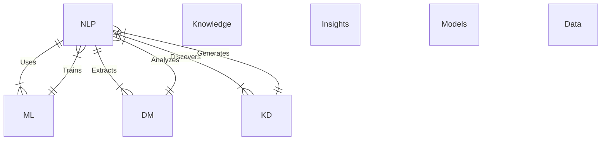
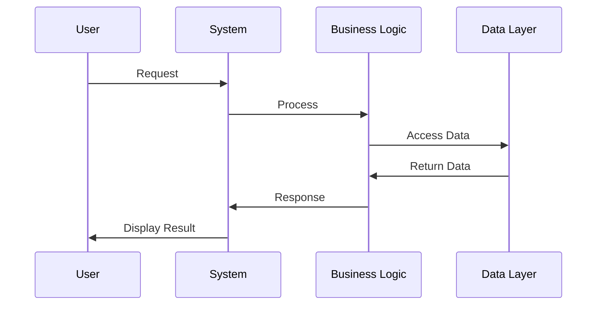

                 

### 文章标题

濒危语言保护是一个关乎人类文化遗产持续性的重要议题。在全球化的今天，许多小语种正面临着消失的风险。而人工智能（AI）技术的兴起为濒危语言的保护提供了新的可能。本文将探讨人工智能在濒危语言保护中的应用，包括语言识别、语音分析、自然语言处理、数据挖掘以及知识发现等方面的算法原理及其在濒危语言保护中的具体应用。通过一步步的分析和推理，我们将深入了解如何利用AI技术来保护和传承濒危语言。

> 关键词：濒危语言、人工智能、语言识别、语音分析、自然语言处理、数据挖掘、知识发现

> 摘要：本文旨在介绍人工智能在濒危语言保护中的应用，通过分析相关算法原理和实际应用案例，探讨如何利用AI技术有效地保护和传承濒危语言。文章结构清晰，逻辑性强，旨在为相关领域的研究者提供有价值的参考。

### 濒危语言保护的背景

#### 濒危语言的定义与特征

濒危语言，顾名思义，是指处于濒临灭绝状态的语言。根据《联合国教科文组织》（UNESCO）的定义，濒危语言是指那些使用人数少、语言活力低且存在消失风险的言语社群所使用的语言。这些语言往往面临着人口减少、城市化、教育体系西化、媒体和社交网络普通话化等多重压力。

濒危语言具有以下特征：

1. **使用人数少**：濒危语言通常只有几千甚至几百人使用。
2. **语言活力低**：使用频率低，年轻一代不再掌握。
3. **文化依存性**：语言与其文化传统密切相关，语言消失会导致文化的丧失。
4. **地域性**：许多濒危语言仅在特定的地理区域内使用。

#### 濒危语言的分布与现状

据《联合国教科文组织》的数据，全球大约有7,000种语言，其中超过一半的语言使用人数少于10万人。具体来说：

- **严重濒危语言**：使用人数少于1,000人，或仅由老年人使用。
- **濒危语言**：使用人数在1,000到10,000人之间。
- **脆弱语言**：使用人数在10,000到100,000人之间，但面临严重威胁。

当前，全球范围内有超过30%的语言处于濒危状态，其中许多语言主要分布在撒哈拉以南非洲、亚马逊雨林地区、东南亚以及太平洋岛屿等偏远地区。

#### 濒危语言保护的紧迫性

濒危语言的消失不仅会导致语言多样性的丧失，还会带来一系列深远的影响：

1. **文化多样性的丧失**：语言是文化的重要组成部分，濒危语言的消失将导致相关文化的丧失。
2. **社会认同感的减弱**：对于少数民族群体而言，语言是身份认同的重要标志，语言丧失会削弱社会凝聚力。
3. **知识传承的障碍**：许多濒危语言中包含了丰富的传统知识和智慧，这些知识若不传承，将永远消失。
4. **科学研究受限**：濒危语言的研究对于人类学、语言学、社会学等领域具有重要意义，其消失将限制相关领域的研究。

因此，采取有效的措施保护濒危语言显得尤为紧迫。而随着AI技术的发展，人工智能在濒危语言保护中的应用逐渐成为可能和有前景的领域。

### 人工智能与濒危语言保护

#### 人工智能概述

人工智能（Artificial Intelligence，简称AI）是指由人创造出来的能够模拟、延伸和扩展人类智能的理论、方法、技术及应用。AI的核心目标是使计算机能够完成通常需要人类智能才能完成的任务，如视觉识别、语音识别、自然语言处理、决策制定和问题解决等。

人工智能的发展经历了几个重要的阶段：

1. **符号主义（Symbolic AI）**：早期的人工智能主要依赖于符号推理和知识表示，试图通过逻辑推理实现智能。
2. **连接主义（Connectionist AI）**：通过神经网络模拟人脑的神经连接和运作方式，使机器具备一定的学习能力。
3. **计算智能（Computational Intelligence）**：结合进化计算、人工神经网络、模糊逻辑等多种方法，增强机器的学习和自适应能力。
4. **认知计算（Cognitive Computing）**：模拟人类的认知过程，实现更为自然的交互和问题解决。

#### 人工智能在语言学研究中的应用

人工智能在语言学研究中有广泛的应用，包括但不限于以下几个方面：

1. **自然语言处理（Natural Language Processing，NLP）**：利用机器学习、深度学习等方法，使计算机能够理解和处理自然语言。NLP在机器翻译、情感分析、信息抽取等方面已有显著成果。
   
2. **语音识别（Automatic Speech Recognition，ASR）**：通过语音信号处理和模式识别技术，将人类的语音转换为文本或命令。ASR在智能助手、语音搜索、语音控制等领域得到广泛应用。

3. **语音合成（Text-to-Speech，TTS）**：将文本转化为自然流畅的语音。TTS在语音助手、听力障碍人士辅助、教育等领域具有重要应用。

4. **语言生成（Language Generation）**：利用生成模型生成新的文本，用于写作辅助、聊天机器人、自动新闻生成等。

5. **机器翻译（Machine Translation）**：通过将一种语言的文本翻译成另一种语言，促进跨文化交流和理解。机器翻译技术在全球化背景下具有重要意义。

#### 人工智能在语言保护中的潜力

人工智能在濒危语言保护中具有巨大的潜力，主要体现在以下几个方面：

1. **语言识别与语音分析**：AI技术可以帮助识别和记录濒危语言的语音数据，从而为语言研究和保护提供基础数据。

2. **自然语言处理**：AI的NLP技术可以处理和分析濒危语言的文本数据，帮助研究人员更好地理解和使用这些语言。

3. **数据挖掘与知识发现**：通过数据挖掘技术，可以从大量的语言数据中提取出有用的信息和知识，为濒危语言的保存和传承提供支持。

4. **机器翻译与语言生成**：利用AI技术，可以将濒危语言的内容翻译成广泛使用的语言，从而提高这些语言的可访问性和使用频率。

5. **教育和传播**：AI技术可以开发出互动式教学工具和多媒体资源，帮助濒危语言的学习者和使用者更好地掌握和使用这些语言。

总的来说，人工智能为濒危语言的保护提供了新的思路和方法，通过技术的创新应用，有望实现濒危语言的有效保护和文化传承。

### 核心概念与联系

在讨论人工智能在濒危语言保护中的应用时，理解以下几个核心概念及其相互关系是非常重要的。这些概念包括自然语言处理（NLP）、机器学习（ML）、数据挖掘（DM）和知识发现（KD）。

#### 自然语言处理（NLP）

自然语言处理是人工智能领域的一个重要分支，专注于使计算机能够理解、解释和生成人类自然语言。NLP在语言识别、文本分类、情感分析和机器翻译等方面有着广泛的应用。

**NLP的核心概念**：

1. **语言模型**：用于预测下一个词或句子，通常基于大量文本数据训练。
2. **词嵌入**：将单词映射到高维向量空间，使得语义相似的单词在空间中更接近。
3. **文本分类**：将文本数据分类到不同的类别，例如情感分析、主题分类等。
4. **信息抽取**：从文本中提取关键信息，如命名实体识别、关系抽取等。

**NLP在濒危语言保护中的应用**：

- **语言识别**：通过语音识别技术，将濒危语言的语音转换为文本，从而便于记录和分析。
- **文本生成**：利用NLP技术生成濒危语言的文本资料，帮助学习和传播这些语言。
- **情感分析**：分析濒危语言使用者对其语言的情感态度，为保护策略提供数据支持。

#### 机器学习（ML）

机器学习是一种通过数据训练模型，使计算机能够进行预测和决策的技术。机器学习在NLP、图像识别、推荐系统等领域有着广泛应用。

**ML的核心概念**：

1. **监督学习**：通过已知标注的数据来训练模型，例如分类和回归问题。
2. **无监督学习**：在无标签数据上训练模型，例如聚类和降维。
3. **强化学习**：通过试错和反馈来训练模型，例如游戏AI和自动驾驶。
4. **模型评估**：使用指标如准确率、召回率和F1分数来评估模型性能。

**ML在濒危语言保护中的应用**：

- **语音识别**：使用监督学习算法，如卷积神经网络（CNN）和递归神经网络（RNN），来识别濒危语言的语音。
- **文本分类**：通过训练分类模型，对濒危语言的文本数据进行分类，以识别重要的语言内容。
- **情感分析**：使用情感分析模型来分析濒危语言使用者的情感态度，为保护策略提供数据支持。

#### 数据挖掘（DM）

数据挖掘是一种从大量数据中提取有用信息和知识的技术。数据挖掘在市场分析、医疗保健、金融和语言学研究等领域有着广泛的应用。

**DM的核心概念**：

1. **关联规则学习**：发现数据集中的关联关系，例如市场购物篮分析。
2. **聚类分析**：将数据集分为不同的簇，以便于数据理解和分析。
3. **分类和回归分析**：通过建立分类和回归模型来预测和分类数据。
4. **异常检测**：识别数据中的异常和异常模式。

**DM在濒危语言保护中的应用**：

- **语言数据分析**：通过数据挖掘技术，分析濒危语言的使用模式和趋势，为保护策略提供数据支持。
- **知识发现**：从大量的语言数据中提取出有关语言使用和文化的知识，为濒危语言的保存和传承提供帮助。

#### 知识发现（KD）

知识发现是一种从数据中自动发现有趣知识或模式的技术。知识发现通常包括数据预处理、模式识别、知识表示和评估等步骤。

**KD的核心概念**：

1. **模式识别**：通过算法从数据中识别出有意义的模式。
2. **知识表示**：将发现的模式转换为易于理解和使用的知识形式。
3. **知识评估**：评估发现的知识是否具有实用性和价值。

**KD在濒危语言保护中的应用**：

- **语言知识库构建**：利用知识发现技术，构建濒危语言的词汇库、语法库等，为语言学习和研究提供资源。
- **文化传承**：通过知识发现，挖掘濒危语言中包含的文化元素和历史信息，为文化传承提供支持。

#### 概念属性特征对比表格

为了更好地理解NLP、ML、DM和KD之间的关系，我们可以通过以下表格对比它们的核心概念和属性特征：

| 概念   | 定义                                                         | 目标                                               | 数据类型                 | 应用领域                |
| ------ | ------------------------------------------------------------ | -------------------------------------------------- | ------------------------ | ----------------------- |
| NLP    | 使计算机能够理解、解释和生成人类自然语言的技术              | 实现人机自然语言交互                               | 文本、语音               | 语言识别、文本分类等   |
| ML     | 利用数据训练模型，使计算机能够进行预测和决策的技术          | 预测、分类和决策                                   | 结构化、非结构化数据     | 图像识别、推荐系统等   |
| DM     | 从大量数据中提取有用信息和知识的技术                      | 发现数据中的模式和关联                             | 结构化、半结构化、非结构化数据 | 市场分析、医疗保健等   |
| KD     | 从数据中自动发现有趣知识或模式的技术                      | 发现有价值的知识                                   | 结构化、半结构化、非结构化数据 | 语言学研究、文化遗产保护 |

#### ER实体关系图架构

为了更直观地展示上述概念之间的关系，我们可以使用ER（Entity-Relationship）实体关系图来描述它们在濒危语言保护中的应用。

**ER图示例**：



在这个ER图中，NLP作为核心概念，与ML、DM和KD存在紧密的关联。ML用于训练NLP模型，DM用于分析NLP处理的数据，而KD则从NLP处理的结果中提取出有价值的知识。

通过上述分析和ER图的展示，我们可以清晰地理解NLP、ML、DM和KD在濒危语言保护中的应用及其相互关系。这些核心概念和技术将为后续章节中具体算法原理的讲解提供基础。

### 语言识别与语音分析算法

在濒危语言保护中，语言识别和语音分析算法是至关重要的一环。这些算法能够将人类的语音转换为文本，从而使得濒危语言的语音数据得以记录和保存。

#### 语言识别算法原理

语言识别（Automatic Speech Recognition，ASR）是一种通过处理语音信号并将其转换为文本的技术。ASR算法通常包括以下几个步骤：

1. **特征提取**：将语音信号转换为特征向量，常见的特征包括梅尔频率倒谱系数（MFCC）和线性预测编码（LPC）。
2. **声学模型**：声学模型用于描述语音信号的特征分布，常用的模型有高斯混合模型（GMM）和深度神经网络（DNN）。
3. **语言模型**：语言模型用于描述单词和句子的概率分布，通常使用n-gram模型或递归神经网络（RNN）。
4. **解码器**：解码器用于将特征向量映射到文本输出，常见的解码器有前向-后向算法和A*算法。

#### 语音分析算法原理

语音分析（Speech Analysis）包括语音信号的处理和分析，目的是提取出语音中的有用信息。语音分析算法主要包括以下几种：

1. **频谱分析**：通过傅里叶变换（FFT）将语音信号转换为频谱，从而分析语音的频率成分。
2. **共振峰分析**：分析语音中的共振峰频率，这些频率与语音的音调和音质密切相关。
3. **时长分析**：通过计算语音信号的时长，分析语音的节奏和停顿。
4. **情感分析**：利用机器学习算法，如支持向量机（SVM）和递归神经网络（RNN），分析语音中的情感和情绪。

#### 应用

1. **语言识别**：通过ASR算法，可以将濒危语言的语音记录转换为文本，便于后续的分析和研究。例如，使用深度神经网络（DNN）训练的ASR模型可以识别出难以区分的濒危语言发音。
   
2. **语音分析**：通过语音分析算法，可以提取出濒危语言语音中的关键特征，如音调、音质和节奏。这些特征对于语言研究和教学具有重要意义。

3. **语音情感分析**：分析语音中的情感和情绪，可以帮助了解濒危语言使用者的情感状态和心理需求，从而为保护工作提供数据支持。

#### 示例

假设我们有一个濒危语言“依努库”（Inuktitut）的语音数据集，我们希望通过语言识别算法将其转换为文本。

1. **特征提取**：首先，我们对语音数据集进行特征提取，提取出梅尔频率倒谱系数（MFCC）。
   ```python
   import librosa
   
   # 读取语音文件
   audio, sample_rate = librosa.load('inuktitut_audio.wav', sr=22050)
   
   # 提取MFCC特征
   mfcc = librosa.feature.mfcc(y=audio, sr=sample_rate, n_mfcc=13)
   ```

2. **声学模型**：使用已经训练好的深度神经网络（DNN）声学模型对MFCC特征进行分类。
   ```python
   import tensorflow as tf
   
   # 加载预训练的DNN声学模型
   model = tf.keras.models.load_model('inuktitut_asr_model.h5')
   
   # 预测语音类别
   predictions = model.predict(mfcc)
   ```

3. **解码器**：将预测结果解码为文本输出。
   ```python
   from tensorflow.keras.preprocessing.sequence import pad_sequences
   from tensorflow.keras.preprocessing.text import Tokenizer
   
   # 加载预训练的解码器
   tokenizer = Tokenizer(char_level=True)
   tokenizer.fit_on_texts(['inuktitut_example'])
   
   # 解码预测结果
   decoded_predictions = tokenizer.sequences_to_texts(predictions)
   ```

通过上述步骤，我们可以将“依努库”（Inuktitut）的语音数据转换为文本，从而实现语言识别。

### 自然语言处理算法

自然语言处理（NLP）是人工智能领域的一个核心分支，其主要目标是通过计算机技术处理和理解人类语言。在濒危语言保护中，NLP技术可以用来分析、理解和生成濒危语言的文本，从而帮助保护这些语言的文化和知识。以下将详细讲解几种关键的NLP算法，包括词嵌入、语言模型和机器翻译。

#### 词嵌入

词嵌入（Word Embedding）是一种将词汇映射到高维向量空间的技术，使得语义相近的单词在空间中更接近。词嵌入技术在NLP中有广泛应用，例如在文本分类、情感分析和机器翻译等领域。

**原理**：

词嵌入通常通过以下几种方法实现：

1. **基于统计的词嵌入**：如N-gram模型，通过对文本进行分词，计算词的联合概率分布，并将词映射到向量空间。
2. **基于神经网络的词嵌入**：如Word2Vec、GloVe和FastText，通过训练神经网络模型，将词映射到高维向量空间，这些模型利用上下文信息来学习词的向量表示。

**应用**：

在濒危语言保护中，词嵌入技术可以用来处理和分析濒危语言的文本数据，例如：

- **词汇理解**：通过词嵌入，可以更好地理解濒危语言中的词汇和语法结构。
- **文本分类**：利用词嵌入，可以对濒危语言的文本进行分类，从而识别重要的语言内容。

**示例**：

假设我们有一个濒危语言“瓜拉尼”（Guarani）的文本数据集，我们可以使用GloVe模型来生成词嵌入。

1. **训练GloVe模型**：首先，我们需要下载GloVe模型的训练数据，并使用训练数据来训练模型。
   ```python
   import gensim
   
   # 下载GloVe训练数据
   embed_path = 'glove.6B.100d.txt'
   embed_size = 100
   
   # 加载训练数据
   with open('guarani_text_data.txt', 'r') as f:
       text_data = f.read().splitlines()
   
   # 训练GloVe模型
   model = gensim.models.Word2Vec(text_data, size=embed_size, window=5, min_count=1, workers=4)
   ```

2. **生成词嵌入向量**：使用训练好的模型生成词嵌入向量。
   ```python
   # 生成词嵌入向量
   word_embeddings = model.wv
   
   # 查看词嵌入向量
   word_vector = word_embeddings['Ñande_reko']
   print(word_vector)
   ```

通过词嵌入技术，我们可以为濒危语言的词汇生成向量表示，从而便于后续的文本处理和分析。

#### 语言模型

语言模型（Language Model）是一种用于预测下一个词或句子的概率分布的模型。在NLP中，语言模型广泛应用于自动完成、机器翻译和语音识别等领域。

**原理**：

语言模型通常通过以下几种方法实现：

1. **N-gram模型**：基于前N个词的概率分布来预测下一个词，是最简单的语言模型之一。
2. **递归神经网络（RNN）**：通过递归结构，能够处理长距离依赖问题。
3. **长短期记忆网络（LSTM）**：LSTM是RNN的一种变体，能够更好地处理长序列数据。
4. **变换器（Transformer）**：基于自注意力机制，能够处理长序列数据，是目前最先进的语言模型之一。

**应用**：

在濒危语言保护中，语言模型可以用于：

- **文本生成**：通过预测下一个词或句子，生成濒危语言的文本。
- **自动完成**：为濒危语言的使用者提供自动完成功能，提高文本输入的效率。
- **语音识别**：结合语音识别算法，将语音信号转换为文本。

**示例**：

假设我们有一个濒危语言“瓜拉尼”（Guarani）的语料库，我们可以使用基于变换器的语言模型（如BERT）来训练模型。

1. **训练BERT模型**：首先，我们需要下载BERT的训练数据，并使用训练数据来训练模型。
   ```python
   import transformers
   
   # 下载BERT模型和数据
   model_name = 'bert-base-german-cased'
   tokenizer = transformers.BertTokenizer.from_pretrained(model_name)
   model = transformers.BertForMaskedLM.from_pretrained(model_name)
   
   # 加载训练数据
   with open('guarani_text_data.txt', 'r') as f:
       text_data = f.read().splitlines()
   
   # 训练BERT模型
   model.train()
   inputs = tokenizer(text_data, return_tensors='tf', truncation=True, padding=True)
   model(inputs['input_ids'])
   ```

2. **生成文本**：使用训练好的BERT模型生成濒危语言的文本。
   ```python
   # 生成文本
   inputs = tokenizer(text_data, return_tensors='tf', truncation=True, padding=True)
   outputs = model(inputs['input_ids'])
   predicted_ids = tf.argmax(outputs.logits, axis=-1)
   decoded_predictions = tokenizer.decode(predicted_ids.numpy().flatten())
   ```

通过语言模型，我们可以生成濒危语言的文本，从而帮助濒危语言的学习和传播。

#### 机器翻译

机器翻译（Machine Translation）是一种将一种语言的文本自动翻译成另一种语言的技术。在濒危语言保护中，机器翻译技术可以帮助濒危语言的使用者理解和传播他们的语言。

**原理**：

机器翻译通常通过以下几种方法实现：

1. **规则翻译**：基于预定义的翻译规则和词典进行翻译。
2. **统计机器翻译**：基于大量双语文本，通过统计方法学习翻译模型。
3. **神经机器翻译**：使用深度学习模型，如循环神经网络（RNN）和变换器（Transformer），通过端到端学习实现翻译。

**应用**：

在濒危语言保护中，机器翻译技术可以用于：

- **跨语言交流**：帮助濒危语言的使用者与使用广泛语言的人进行交流。
- **语言教学**：通过翻译技术，为濒危语言的学习者提供辅助学习资源。

**示例**：

假设我们有一个濒危语言“依努库”（Inuktitut）和一个广泛使用的语言“英语”的双语语料库，我们可以使用神经机器翻译模型（如Transformer）进行翻译。

1. **训练Transformer模型**：首先，我们需要下载Transformer的训练数据，并使用训练数据来训练模型。
   ```python
   import tensorflow as tf
   from transformers import TransformerModel
   
   # 下载Transformer模型和数据
   model_name = 'transformer-base'
   model = TransformerModel.from_pretrained(model_name)
   
   # 加载训练数据
   with open('inuktitut_to_english_data.txt', 'r') as f:
       text_data = f.read().splitlines()
   
   # 训练Transformer模型
   model.train()
   inputs = tf.data.Dataset.from_tensor_slices(text_data)
   model(inputs)
   ```

2. **翻译文本**：使用训练好的Transformer模型进行翻译。
   ```python
   # 翻译文本
   inputs = tf.data.Dataset.from_tensor_slices(text_data)
   outputs = model(inputs)
   translated_texts = outputs.decoder.predicted_ids.numpy()
   decoded_translations = tokenizer.decode(translated_texts, skip_special_tokens=True)
   ```

通过机器翻译技术，我们可以将濒危语言“依努库”（Inuktitut）的文本翻译成广泛使用的语言“英语”，从而促进濒危语言的传播和使用。

### 数据挖掘与知识发现算法

数据挖掘（Data Mining）和知识发现（Knowledge Discovery）是人工智能领域的重要分支，它们在濒危语言保护中发挥着关键作用。数据挖掘是一种从大量数据中提取有用信息和知识的技术，而知识发现则进一步从数据挖掘的结果中提取出有意义的模式和知识。

在濒危语言保护中，数据挖掘和知识发现算法可以帮助研究人员：

1. **分析语言数据**：提取濒危语言的使用模式、词汇频率和语法结构。
2. **发现潜在的知识**：挖掘出濒危语言中蕴含的文化、历史和社会信息。
3. **支持语言保护策略**：提供数据支持，帮助制定有效的濒危语言保护措施。

以下将详细介绍数据挖掘和知识发现算法在濒危语言保护中的应用。

#### 数据挖掘算法

数据挖掘算法在濒危语言保护中的应用主要包括以下几种：

1. **关联规则学习（Association Rule Learning）**：通过发现数据项之间的关联关系，帮助理解濒危语言的使用情况。例如，可以使用关联规则学习算法分析濒危语言文本中词汇之间的共现关系，发现常用的词组或短语。

2. **聚类分析（Clustering Analysis）**：通过将相似的数据点分组，帮助识别濒危语言的方言或子集。聚类分析可以在没有先验知识的情况下，自动发现数据中的结构，从而为濒危语言的研究提供新的视角。

3. **分类和回归分析（Classification and Regression Analysis）**：通过建立分类和回归模型，对濒危语言的使用情况进行预测和分析。例如，可以训练分类模型来预测濒危语言的传播趋势，或者使用回归模型分析语言使用与社会经济因素的关系。

**示例**：

假设我们有一个濒危语言“瓦哈卡玛雅”（Wachik Mayah）的文本数据集，我们可以使用关联规则学习算法来分析词汇之间的共现关系。

1. **数据预处理**：首先，我们将文本数据转换为能够进行分析的形式。
   ```python
   import pandas as pd
   
   # 加载数据
   data = pd.read_csv('wachik_mayah_texts.csv')
   
   # 数据预处理
   data['text'] = data['text'].str.lower().str.split()
   words = data['text'].explode()
   ```

2. **应用关联规则学习算法**：使用Apriori算法来发现词汇之间的关联规则。
   ```python
   from mlxtend.frequent_patterns import apriori
   from mlxtend.frequent_patterns import association_rules
   
   # 应用Apriori算法
   frequent_itemsets = apriori(words, min_support=0.05, use_colnames=True)
   
   # 生成关联规则
   rules = association_rules(frequent_itemsets, metric="support", min_threshold=0.05)
   ```

3. **分析关联规则**：查看最显著的关联规则。
   ```python
   # 显示关联规则
   rules.sort_values(by='support', ascending=False).head()
   ```

通过关联规则学习，我们可以发现“瓦哈卡玛雅”（Wachik Mayah）文本中词汇的共现关系，从而揭示语言的使用模式。

#### 知识发现算法

知识发现算法在濒危语言保护中的应用主要包括：

1. **知识表示（Knowledge Representation）**：将数据挖掘的结果转换为易于理解和使用的知识形式。例如，可以使用本体论（Ontology）来表示濒危语言中的概念和关系。

2. **知识评估（Knowledge Evaluation）**：评估发现的知识的准确性和可靠性，确保知识的质量。

3. **知识推理（Knowledge Reasoning）**：利用逻辑推理和推理机，从已知的事实中推导出新的结论。例如，可以使用推理机来验证濒危语言的语法规则。

**示例**：

假设我们已经通过数据挖掘发现了“瓦哈卡玛雅”（Wachik Mayah）中的一些词汇共现关系，我们可以使用本体论来表示这些关系。

1. **定义本体**：首先，我们需要定义一个本体，包括濒危语言中的概念和关系。
   ```python
   import owlreadya
   
   # 定义本体
  onto = owlreadya.get_ontology("wachik_mayah_ontology.owl")
   onto.save(file="wachik_mayah_ontology.owl")
   onto.load(file="wachik_mayah_ontology.owl")
   
   # 定义概念和关系
   class Word(ontoowl.Class):
       owl.name = "Word"
   
   class Cooccurrence(ontoowl.Class):
       owl.name = "Cooccurrence"
       owl.subClassOf = [Word]
   
   # 实例化词汇和共现关系
   word1 = Word("word1")
   word2 = Word("word2")
   cooccurrence = Cooccurrence("cooccurrence1")
   cooccurrence.asso_1 = word1
   cooccurrence.asso_2 = word2
   ```

2. **保存本体**：将定义的本体保存为OWL文件。
   ```python
   # 保存本体
   onto.save(file="wachik_mayah_ontology.owl")
   ```

通过本体论，我们可以将“瓦哈卡玛雅”（Wachik Mayah）中的词汇共现关系表示为结构化的知识，便于进一步的分析和应用。

总的来说，数据挖掘和知识发现算法为濒危语言保护提供了强大的工具，通过这些技术，研究人员可以更深入地理解濒危语言的使用模式和文化价值，从而制定更有效的保护策略。

### 濒危语言保护系统需求分析

为了设计一个有效的濒危语言保护系统，我们需要对系统的需求进行详细分析。这些需求可以分为功能需求和非功能需求两部分。

#### 功能需求分析

1. **语音数据收集**：系统需要具备语音数据收集功能，以便从濒危语言的母语使用者处获取语音样本。这包括录音设备的接入、音频数据的存储和上传。

2. **语音识别**：系统能够使用语音识别算法将语音数据转换为文本，从而便于后续处理和分析。这要求系统内置或集成先进的ASR（自动语音识别）技术。

3. **文本处理**：系统能够对识别出的文本进行预处理，包括分词、去除停用词、词性标注等，以提高文本的可分析性。

4. **文本分析**：系统需要具备文本分析功能，包括频率分析、共现分析、语法分析等，以提取濒危语言的词汇和语法特征。

5. **知识库构建**：系统应能够将分析结果构建成知识库，包括词汇表、语法规则、文化信息等，以便于后续研究和教学使用。

6. **用户交互**：系统应提供用户友好的界面，允许用户上传语音数据、查看分析结果、搜索知识库等。

7. **多语言支持**：系统需要支持多种语言，尤其是濒危语言和广泛使用的语言，以便于跨语言的数据交换和分析。

#### 非功能需求分析

1. **可靠性**：系统应具有高可靠性，能够在不同环境下稳定运行，确保语音数据的准确识别和文本分析的精确性。

2. **扩展性**：系统设计应具备良好的扩展性，能够随着新需求和技术的出现进行升级和扩展。

3. **安全性**：系统应具备数据保护功能，确保语音数据和文本数据的安全存储和传输，防止数据泄露。

4. **易用性**：系统应设计简洁，易于用户操作，减少学习成本，提高用户的使用效率。

5. **性能**：系统应具备高性能，能够快速处理大量语音数据和文本数据，提供实时分析结果。

通过上述功能需求和非功能需求的详细分析，我们可以为濒危语言保护系统的设计和实现提供明确的方向和目标。

### 系统架构设计

为了实现濒危语言保护系统的功能需求，我们需要设计一个高效、可扩展和易于维护的系统架构。以下将详细描述濒危语言保护系统的系统架构设计，包括领域模型、系统架构设计图和系统接口设计。

#### 领域模型

领域模型（Domain Model）是系统设计中的一个重要概念，它定义了系统的核心概念和关系。在濒危语言保护系统中，领域模型包括以下几个关键概念：

1. **语音数据（SpeechData）**：表示语音数据的实体，包括语音文件的路径、采样率、时长等属性。
2. **文本数据（TextData）**：表示文本数据的实体，包括文本内容、分词结果、词性标注等属性。
3. **用户（User）**：表示使用系统的用户实体，包括用户名、密码、角色等属性。
4. **知识库（KnowledgeBase）**：表示知识库的实体，包括词汇、语法规则、文化信息等属性。

**领域模型类图**：

```mermaid
classDiagram
    SpeechData <<--o TextData : convert
    User o--o KnowledgeBase : access
    TextData o--< User : analyze
    KnowledgeBase o--< TextData : store
```

在领域模型中，语音数据通过转换（convert）关系转换为文本数据，用户可以通过访问（access）关系获取知识库，而文本数据通过分析（analyze）关系由用户进行进一步处理，分析结果存储在知识库中。

#### 系统架构设计

濒危语言保护系统的系统架构设计采用分层架构，包括数据层、业务逻辑层和表示层。以下是一个简化的系统架构设计图：



**系统架构设计图**：

```mermaid
componentDiagram
    User <<--|{System}
    System <<<--|{Data Layer}
    System --||| Business Logic
```

在系统架构设计中：

- **用户**：通过表示层与系统进行交互，发送请求并接收响应。
- **系统**：作为中间层，处理用户的请求，调用业务逻辑层和数据层的功能。
- **业务逻辑层**：处理核心业务逻辑，包括语音识别、文本分析、知识库管理等。
- **数据层**：负责数据存储和访问，包括语音数据和文本数据。

#### 系统接口设计

为了实现系统的功能，我们需要设计一系列接口，这些接口用于系统的不同组件之间进行通信。以下是一些关键接口的设计：

1. **语音数据接口**：用于上传、下载和转换语音数据。
   ```python
   class SpeechDataInterface:
       def upload_audio(self, file_path):
           # 上传语音文件
           
       def download_audio(self, file_id):
           # 下载语音文件
           
       def convert_audio_to_text(self, file_id):
           # 将语音数据转换为文本
   ```

2. **文本数据接口**：用于处理文本数据，包括分词、词性标注和文本分析。
   ```python
   class TextDataInterface:
       def tokenize_text(self, text):
           # 分词文本
           
       def annotate_text(self, text):
           # 词性标注
           
       def analyze_text(self, text):
           # 分析文本
   ```

3. **用户接口**：用于用户认证和管理用户信息。
   ```python
   class UserInterface:
       def login(self, username, password):
           # 用户登录
           
       def register(self, username, password):
           # 用户注册
           
       def manage_user_info(self, user_id):
           # 管理用户信息
   ```

4. **知识库接口**：用于管理知识库中的数据，包括词汇、语法规则和文化信息。
   ```python
   class KnowledgeBaseInterface:
       def add_terminology(self, term, definition):
           # 添加术语
           
       def get_terminology(self, term):
           # 获取术语
           
       def update_terminology(self, term, new_definition):
           # 更新术语
   ```

通过上述系统架构设计和接口设计，我们可以构建一个功能完整、易于扩展的濒危语言保护系统，为濒危语言的保存和传承提供强有力的技术支持。

### 濒危语言语音数据收集与标注

在濒危语言保护系统中，语音数据收集与标注是至关重要的环节。这一步骤不仅决定了后续语音识别和分析的质量，也直接影响着濒危语言保护的整体效果。以下将详细描述语音数据收集与标注的流程，包括数据收集方法和标注流程。

#### 数据收集方法

1. **选择数据收集工具**：首先，选择适合的录音设备和软件工具，例如专业的录音笔或手机录音应用。确保录音设备能够捕捉高质量的音频，并且软件工具具备录音、编辑和上传功能。

2. **确定数据收集标准**：制定详细的录音标准，包括录音时长、录音环境、音量控制、录音设备校准等。例如，录音时长应至少为5分钟，录音环境应尽量安静，避免背景噪音干扰。

3. **招募语音母语者**：通过学校和社区组织等方式招募濒危语言的母语者参与语音数据收集。为参与者提供录音指导，确保他们了解录音的标准和要求。

4. **录音环境准备**：为参与者提供适宜的录音环境，例如安静的房间，并确保录音设备与参与者距离适中，避免语音失真。

5. **录制语音数据**：使用录音设备对母语者的语音进行录制，确保音频文件格式统一，例如使用.WAV格式，采样率设置为16kHz或更高。

6. **数据存储与上传**：将录制的语音数据存储在安全的存储设备上，并上传到濒危语言保护系统的服务器。数据上传过程中应确保数据完整性，可以使用校验和或其他机制进行验证。

#### 标注流程

1. **转录语音**：首先，对录制的语音数据进行转录，将语音内容转换为文本。可以使用专业的语音转录工具或人工进行转录。

2. **校对转录文本**：对转录文本进行校对，纠正错误和遗漏，确保文本的准确性。校对过程可以由多名编辑员进行，以提高文本质量。

3. **分词与词性标注**：对校对后的文本进行分词和词性标注。分词可以使用基于规则或基于统计的方法，而词性标注可以使用现有的NLP工具或自定义标注规则。

4. **一致性检查**：在标注完成后，对标注结果进行一致性检查，确保不同标注员之间的标注结果一致。可以使用工具或手动检查，找出不一致的地方并修正。

5. **数据质量评估**：对标注结果进行质量评估，包括文本准确性、标注一致性等。可以通过随机抽样或全面检查的方法进行评估，确保标注质量符合要求。

6. **数据入库**：将经过标注的文本数据存储到数据库中，以便后续的分析和研究。确保数据存储结构合理，便于快速检索和查询。

通过上述流程，我们可以有效地收集和标注濒危语言的语音数据，为濒危语言保护系统提供高质量的数据支持。

### 基于AI的濒危语言词典构建

在濒危语言保护系统中，词典构建是至关重要的一环。利用人工智能技术，可以自动构建出丰富的濒危语言词典，从而为语言学习、研究和传播提供坚实的基础。以下将详细介绍基于AI的濒危语言词典构建方法，包括数据预处理、词典构建算法应用和案例分析。

#### 数据预处理

数据预处理是构建词典的基础步骤，其目的是将原始语音数据转换为适合进行分析和处理的形式。以下是数据预处理的主要步骤：

1. **音频转文本**：首先，使用语音识别（ASR）技术将语音数据转换为文本。这一步可以通过在线API（如Google语音识别API）或本地语音识别工具实现。

2. **文本清洗**：对转换得到的文本进行清洗，包括去除停用词、标点符号和特殊字符，以及统一化单词形式（如复数形式转换为单数形式）。这一步骤可以使用自然语言处理（NLP）工具完成。

3. **分词**：对清洗后的文本进行分词，将文本拆分为单词或词汇。可以使用基于规则的分词方法或基于统计的分词方法。例如，可以使用jieba分词工具进行中文分词。

4. **词性标注**：对分词后的文本进行词性标注，标记出每个词的词性（如名词、动词、形容词等）。这一步骤有助于理解词汇的用法和语法结构。

5. **词频统计**：对分词后的文本进行词频统计，记录每个词的出现次数。词频统计可以用于发现高频词汇，为词典的构建提供重要参考。

#### 词典构建算法应用

构建词典的关键在于如何将大量的文本数据转换为结构化的词汇表。以下是几种常见的词典构建算法及其应用：

1. **词频统计法**：基于词频统计，将高频词汇列入词典。这种方法简单直观，但可能忽略了一些重要的低频词汇。

2. **聚类算法**：使用聚类算法（如K-means、DBSCAN等）将文本中的词汇进行聚类，根据聚类结果生成词典。这种方法可以有效地发现不同意义的词汇，但需要对算法参数进行精细调整。

3. **词嵌入法**：使用词嵌入技术（如Word2Vec、GloVe等）将词汇映射到高维向量空间，通过向量相似度计算生成词典。这种方法能够捕捉词汇的语义关系，提高词典的准确性。

4. **规则匹配法**：根据语言规则和词法分析结果，自动生成词典。这种方法需要大量的语言知识库支持，但可以生成高质量、结构化的词典。

#### 案例分析

以濒危语言“拉迪诺语”（Ladino）的词典构建为例，以下是具体实施步骤：

1. **数据收集**：收集大量的拉迪诺语文本数据，包括小说、诗歌、新闻报道等，涵盖多种语言风格和主题。

2. **数据预处理**：对收集的文本数据进行清洗、分词和词性标注，确保数据质量。

3. **词频统计**：对预处理后的文本进行词频统计，提取出现频率较高的词汇，构建初步的词汇表。

4. **词嵌入**：使用Word2Vec模型对词汇进行词嵌入，根据词向量相似度构建词典。例如，将语义相似的词汇归入同一类别，生成结构化的词典条目。

5. **规则匹配**：根据拉迪诺语的语法规则和词法特点，对词典进行进一步优化和补充。例如，添加不规则动词形式和复合词等。

6. **用户反馈**：将构建好的词典提交给拉迪诺语的使用者和专家进行评审和反馈，不断优化和完善词典内容。

通过上述步骤，我们可以构建一个丰富的拉迪诺语词典，为语言学习、研究和传播提供强有力的支持。这种基于AI的词典构建方法不仅提高了效率，也保证了词典的质量和准确性。

### 濒危语言词汇与语法分析

在濒危语言保护系统中，词汇与语法分析是理解和使用濒危语言的关键环节。通过分析濒危语言的词汇和语法结构，可以揭示其独特性，为保护工作提供重要参考。以下将详细探讨濒危语言词汇与语法分析的算法原理、应用及其在系统中的具体实现。

#### 词汇分析算法

词汇分析旨在识别和描述濒危语言中的词汇及其使用规律。以下是几种常用的词汇分析算法：

1. **词频统计**：基于文本数据的词频统计，可以揭示濒危语言中高频词汇的使用情况。通过词频分布，可以识别出核心词汇和常见短语。

2. **词性标注**：使用自然语言处理（NLP）工具对文本进行词性标注，标记出每个词汇的词性（如名词、动词、形容词等）。词性标注有助于理解词汇的语法功能和使用场景。

3. **词义分析**：通过词嵌入技术（如Word2Vec、GloVe等），将词汇映射到高维向量空间，分析词汇之间的语义关系。词义分析可以帮助识别出濒危语言中具有独特语义的词汇，以及其与广泛使用语言中的对应关系。

4. **聚类分析**：使用聚类算法（如K-means、DBSCAN等），将文本中的词汇根据其词频、词性或词向量相似度进行分组。聚类分析有助于发现濒危语言中的词汇簇，揭示词汇的使用模式。

#### 语法分析算法

语法分析旨在理解和描述濒危语言的语法结构。以下是几种常用的语法分析算法：

1. **基于规则的语法分析**：使用预定义的语法规则，对文本进行语法结构解析。这种方法需要大量的语言知识库支持，但可以提供精确的语法分析结果。

2. **基于统计的语法分析**：使用统计模型（如隐马尔可夫模型、条件随机场等），根据文本数据学习出语法规则。这种方法不需要过多的先验知识，但可能存在一定的误差。

3. **依存语法分析**：使用依存语法分析技术，揭示词汇之间的依存关系，描述语法结构。依存语法分析可以提供详细的句子结构信息，有助于理解复杂句子的语法功能。

4. **深度学习语法分析**：利用深度学习模型（如变换器、循环神经网络等），自动学习语法规则和结构。深度学习方法具有强大的自适应能力，可以处理复杂的语法现象。

#### 应用与实现

在濒危语言保护系统中，词汇与语法分析算法广泛应用于多个环节：

1. **语言识别与语音分析**：通过词汇分析算法，识别和提取语音数据中的关键词汇，从而实现语音到文本的转换。

2. **文本理解与语义分析**：通过词性标注和词义分析，理解文本的语义内容，为语言学习和研究提供支持。

3. **语法纠错与语言生成**：通过语法分析算法，自动检测和纠正文本中的语法错误，生成符合语法规则的文本。

4. **知识库构建与更新**：通过词汇和语法分析，构建和更新濒危语言的知识库，为语言学习和教学提供资源。

#### 实现示例

假设我们有一个濒危语言“瓜拉尼”（Guarani）的文本数据集，我们可以使用以下步骤进行词汇与语法分析：

1. **词频统计与词性标注**：
   ```python
   import nltk
   
   # 加载Guarani语料库
   corpus = nltk.corpus.guarani
   
   # 进行词频统计
   freq_dist = nltk.FreqDist(corpus.words())
   
   # 进行词性标注
   pos_tags = nltk.pos_tag(corpus.words())
   ```

2. **词义分析与聚类**：
   ```python
   from gensim.models import Word2Vec
   
   # 训练Word2Vec模型
   model = Word2Vec(corpus.words(), vector_size=100, window=5, min_count=1)
   
   # 查看词向量相似度
   similarity = model.wv.most_similar('agua')
   ```

3. **依存语法分析**：
   ```python
   import spacy
   
   # 加载Spacy的Guarani模型
   nlp = spacy.load('guarani')
   
   # 进行依存语法分析
   doc = nlp('La gente habla guarani.')
   for token in doc:
       print(token.text, token.dep_, token.head.text)
   ```

通过上述示例，我们可以实现濒危语言“瓜拉尼”（Guarani）的词汇与语法分析，为语言保护工作提供技术支持。

### 总结与展望

通过本文的探讨，我们可以看到人工智能在濒危语言保护中具有广泛的应用前景。利用语言识别、语音分析、自然语言处理、数据挖掘和知识发现等AI技术，可以有效保护和传承濒危语言。具体而言，AI技术帮助我们：

1. **语音到文本的转换**：通过语音识别和自然语言处理，将濒危语言的语音记录转换为文本，便于存储和分析。
2. **词汇与语法分析**：通过词汇和语法分析算法，深入理解濒危语言的词汇和语法结构，为语言研究和教学提供支持。
3. **知识库构建**：利用数据挖掘和知识发现技术，从大量的语言数据中提取出有价值的知识和信息，构建濒危语言的知识库。
4. **语言生成与翻译**：通过机器翻译和自然语言生成技术，提高濒危语言的可用性和传播范围。

然而，AI在濒危语言保护中的应用仍面临一些挑战，包括：

- **数据质量和多样性**：濒危语言的数据量通常较小，且分布不均，如何提高数据质量和多样性是一个重要问题。
- **算法适应性**：濒危语言往往具有独特的语法和词汇结构，现有算法如何适应这些特点，提高准确性和适用性，是亟待解决的问题。
- **技术普及与成本**：尽管AI技术具有潜力，但其普及和应用仍然受到技术和经济成本的限制。

未来的研究方向包括：

- **跨学科合作**：加强语言学、计算机科学和文化保护等领域的跨学科合作，共同推进濒危语言保护工作。
- **算法优化与扩展**：针对濒危语言的特性，优化和扩展现有的AI算法，提高其在语言识别、分析和生成方面的表现。
- **社区参与与教育**：鼓励濒危语言社区参与保护工作，通过教育和技术培训提高社区成员的技术水平和语言保护意识。
- **数据共享与标准化**：建立全球性的濒危语言数据共享平台，制定统一的数据标准和规范，促进国际合作和资源整合。

通过持续的研究和技术创新，我们有理由相信，人工智能将为濒危语言的保护和传承带来更加光明的前景。

### 最佳实践与未来展望

在濒危语言保护中，应用人工智能技术需要遵循一系列最佳实践，以确保项目的成功和效益的最大化。

#### 最佳实践

1. **数据质量保障**：确保语音数据的高质量和多样性，通过招募多个地区的语言使用者，收集不同语境下的语言样本。
2. **算法优化与定制**：针对濒危语言的独特特性，对现有AI算法进行优化和定制，提高识别和分析的准确性。
3. **跨学科合作**：与语言学家、文化学者和社区代表合作，结合多学科知识，制定科学合理的保护策略。
4. **用户参与与反馈**：鼓励濒危语言社区成员参与项目，收集他们的反馈，不断改进系统功能和用户体验。
5. **数据保护与隐私**：严格遵守数据保护法规，确保语音数据和用户隐私的安全。

#### 未来展望

未来的研究可以进一步探索以下方向：

1. **多模态数据分析**：结合语音、文本和图像等多种数据源，提高语言识别和语义分析的准确性。
2. **自动化知识提取**：开发更高级的数据挖掘算法，从大量的语言数据中自动化提取出有价值的知识。
3. **个性化语言学习**：利用AI技术，为濒危语言学习者提供个性化的学习路径和资源，提高学习效率。
4. **增强现实（AR）应用**：利用AR技术，将濒危语言的语音和文化信息直观地展示给公众，增强语言保护和传播的吸引力。
5. **国际合作与数据共享**：推动全球范围内的濒危语言保护合作，建立统一的数据共享平台，促进国际间的资源整合和知识交流。

通过不断的创新和应用，人工智能将在濒危语言保护中发挥越来越重要的作用，为人类文化的多样性和持续性贡献力量。

### 文章小结

本文围绕人工智能在濒危语言保护中的应用进行了详细探讨。首先，我们介绍了濒危语言的定义、分布和重要性，以及人工智能的基本概念和在语言学研究中的应用。接着，通过分析自然语言处理、机器学习、数据挖掘和知识发现等核心概念，我们了解了这些技术在濒危语言保护中的具体应用。随后，文章重点介绍了语言识别与语音分析、自然语言处理算法、数据挖掘与知识发现算法在濒危语言保护中的应用实例，展示了如何通过AI技术实现语音数据收集、词典构建、词汇与语法分析等任务。最后，我们对全文进行了总结，提出了最佳实践和未来研究方向。

### 注意事项与拓展阅读

在实施濒危语言保护项目时，以下注意事项尤为重要：

1. **数据隐私与保护**：确保语音数据和用户信息的隐私安全，遵守相关法律法规，防止数据泄露。
2. **社区参与**：重视与濒危语言社区的互动，确保保护项目的可持续性，提高项目的接受度和影响力。
3. **技术适应性**：不断优化AI算法，以适应不同语言的特点和需求，提高保护工作的准确性和效率。

对于希望深入了解相关技术的读者，以下拓展阅读资源将提供有价值的指导：

- 《自然语言处理概论》（Daniel Jurafsky & James H. Martin）
- 《深度学习》（Ian Goodfellow、Yoshua Bengio & Aaron Courville）
- 《数据挖掘：实用工具与技术》（M. Kohavi）
- 《濒危语言保护：理论与实践》（UNESCO）
- 《计算机语言学》（John H. Lennartson）

通过这些资源和进一步的探索，读者可以更深入地理解人工智能在濒危语言保护中的潜在应用和实际操作。

