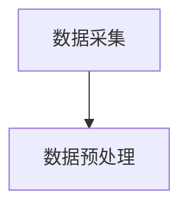
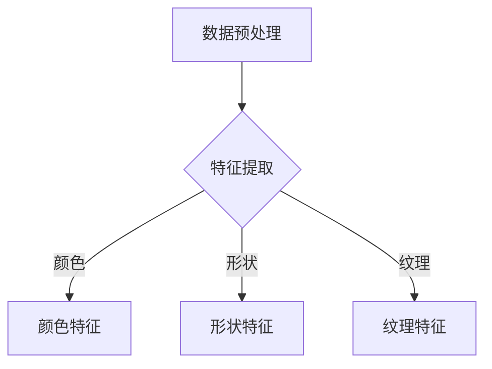
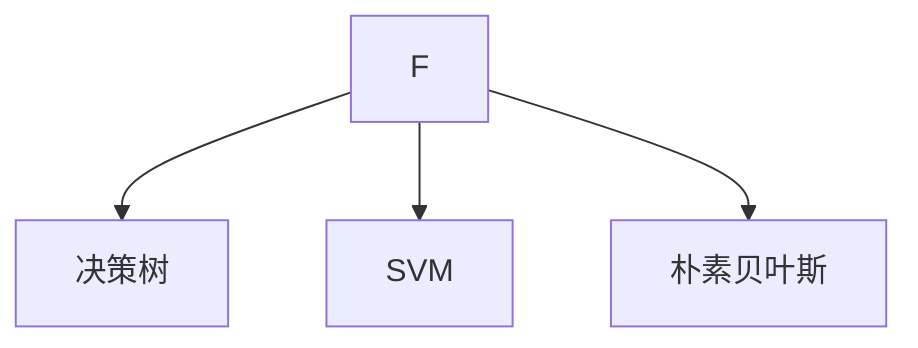
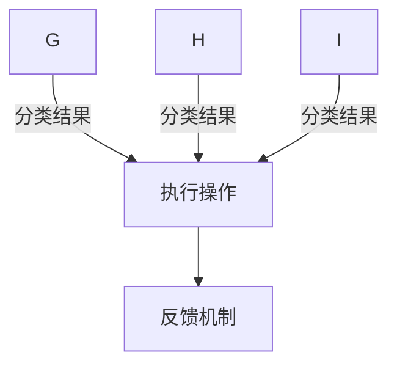

                 

### 引言

#### 问题背景

随着城市化进程的加速和人口数量的不断增长，全球垃圾产量也在逐年攀升。据统计，每年全球产生的垃圾量已经超过100亿吨，其中只有不到三分之一得到有效的回收和处理，剩余的垃圾大多被填埋或焚烧，这不仅造成了严重的土地和空气污染，还对生态环境造成了巨大的破坏。特别是对于垃圾分类和回收系统，传统的手工分类方法效率低下，错误率高，难以满足日益增长的城市垃圾处理需求。这种现状迫切需要一种智能化、自动化的解决方案来提高垃圾分类和回收的效率，降低环境污染。

#### 人工智能的发展与应用

人工智能作为一项新兴技术，近年来得到了迅猛的发展。其核心算法包括机器学习、深度学习、自然语言处理等，这些算法通过模拟人类思维过程，实现了对大量数据的自动分析和处理能力。随着计算能力的提升和算法的优化，人工智能在各个领域的应用已经越来越广泛，从医疗诊断、金融分析到自动驾驶、智能家居，人工智能正在逐步改变我们的生活。

在环境保护领域，人工智能同样有着广阔的应用前景。例如，智能垃圾分类和回收系统就是人工智能技术应用于环境保护的一个典型例子。通过应用人工智能技术，可以实现对垃圾的自动识别、分类和处理，大大提高垃圾分类和回收的效率，降低环境污染。

#### 智能垃圾分类和回收系统的必要性

智能垃圾分类和回收系统结合了人工智能技术和垃圾处理流程，通过智能识别、自动分类和高效回收，实现了对垃圾的高效处理。这样的系统不仅能够提高垃圾分类和回收的效率，还能够提供准确的数据分析和决策支持，从而优化垃圾处理流程，降低环境污染。

具体来说，智能垃圾分类和回收系统的必要性体现在以下几个方面：

1. **提高分类效率**：传统的垃圾分类主要依靠人工完成，效率低且容易出错。而智能垃圾分类系统利用人工智能技术，能够快速、准确地识别和分类各种垃圾，大大提高了分类效率。

2. **降低环境污染**：智能垃圾分类和回收系统能够有效地将可回收垃圾和有害垃圾分离，减少了对环境的污染，保护了自然资源。

3. **提供数据支持**：智能垃圾分类和回收系统可以收集和分析大量的垃圾分类数据，为环境保护决策提供科学依据。

4. **推动可持续发展**：智能垃圾分类和回收系统有助于提高资源的循环利用率，促进可持续发展，符合当今社会对环境保护和资源节约的要求。

综上所述，智能垃圾分类和回收系统在环境保护中具有重要的现实意义和应用价值。接下来，我们将进一步探讨垃圾分类和回收的基本原理，以及人工智能技术在其中的具体应用。

## 文章关键词

- 人工智能
- 垃圾分类
- 回收系统
- 智能识别
- 环境保护
- 可持续发展
- 机器学习
- 深度学习
- 自然语言处理

## 文章摘要

本文旨在探讨人工智能在环境保护中的应用，特别是在智能垃圾分类和回收系统中的实际应用。首先，我们介绍了当前全球垃圾处理面临的挑战，以及人工智能技术的迅速发展为解决这些问题带来的可能性。随后，文章深入分析了垃圾分类和回收的基本原理，并详细阐述了人工智能技术在其中的关键作用，包括机器学习、深度学习和自然语言处理算法的应用。接着，我们介绍了智能垃圾分类和回收系统的系统架构和实现技术，通过具体的算法原理讲解和实际案例研究，展示了该系统在提高垃圾分类效率和降低环境污染方面的显著效果。最后，文章总结了最佳实践经验，并对未来智能垃圾分类和回收系统的发展趋势进行了展望。

## 垃圾分类和回收的基本原理

### 垃圾分类的标准和流程

垃圾分类是指根据垃圾的不同属性，将其分为可回收物、有害垃圾、湿垃圾（厨余垃圾）和干垃圾（其他垃圾）等多个类别。这种分类方法不仅有助于提高垃圾回收效率，还能有效减少对环境的污染。

#### 可回收物

可回收物主要包括纸类、塑料、金属和玻璃等，这些材料可以经过处理重新利用。例如，废纸可以回收再造纸，废塑料可以加工成塑料制品。

#### 有害垃圾

有害垃圾主要包括废电池、废荧光灯管、废药品等，这些垃圾如果随意丢弃，会对环境造成严重污染。例如，废旧电池中的重金属会对土壤和水源造成污染，而废荧光灯管中的汞则具有很高的毒性。

#### 湿垃圾（厨余垃圾）

湿垃圾主要包括厨余垃圾、餐厨垃圾等，这些垃圾可以通过堆肥或生物处理转化为有机肥料，减少对土地的占用。

#### 干垃圾（其他垃圾）

干垃圾主要包括难以回收的废弃物，如污染严重的塑料袋、破损的餐具等，这类垃圾一般需要经过填埋或焚烧处理。

#### 垃圾分类流程

垃圾分类流程主要包括以下几个步骤：

1. **源头分类**：居民在产生垃圾时，需根据垃圾分类标准将垃圾进行初步分类。
2. **收集**：分类后的垃圾由环卫工人进行收集，并运送到垃圾处理中心。
3. **分拣**：在垃圾处理中心，通过人工或机械手段对垃圾进行进一步分拣和分类。
4. **处理**：根据垃圾的种类，采取相应的处理方法，如回收、堆肥、填埋或焚烧。

### 垃圾回收的方法和技术

#### 机械回收

机械回收是利用专门的机械设备对垃圾进行分拣和处理。例如，通过气动分选、振动分选、磁性分选等方法，将不同类型的垃圾分离出来。这种方法适用于处理大量的混合垃圾，具有较高的分选效率和稳定性。

#### 生物回收

生物回收是指通过生物技术处理垃圾，将其转化为有机肥料或生物质能源。例如，通过堆肥或厌氧发酵等方式，将厨余垃圾转化为有机肥料，不仅减少了垃圾量，还提供了优质肥料。

#### 能源回收

能源回收是指将垃圾焚烧产生的热能转化为电能或热能。这种方法适用于处理有害垃圾和其他难以回收的垃圾。通过焚烧处理，不仅可以减少垃圾量，还能产生能源，具有较好的经济效益。

#### 循环经济

循环经济是一种通过资源的高效利用和循环再生，实现经济、社会和环境的协调发展模式。在垃圾处理领域，循环经济强调将垃圾视为资源，通过分类、回收和再利用，实现垃圾的减量化、资源化和无害化。

### 人工智能在垃圾分类和回收中的应用

#### 机器学习算法

机器学习算法通过分析大量垃圾数据，建立垃圾分类模型，实现对垃圾的自动分类。常用的机器学习算法包括决策树、支持向量机、神经网络等。这些算法可以自动识别垃圾的特征，从而提高分类的准确率和效率。

#### 深度学习算法

深度学习算法是一种基于多层神经网络的结构，具有更强的学习和分类能力。在垃圾分类中，深度学习算法可以通过图像识别技术，实现对垃圾的精细分类。例如，利用卷积神经网络（CNN），可以识别垃圾的图像特征，实现高度准确的分类。

#### 自然语言处理

自然语言处理（NLP）技术可以用于处理垃圾标签和用户反馈，提高垃圾分类系统的用户体验。例如，通过语音识别技术，用户可以使用自然语言与垃圾分类系统进行交互，方便快捷地进行垃圾分类。

### 智能垃圾分类和回收系统的必要性

智能垃圾分类和回收系统利用人工智能技术，实现了对垃圾的自动识别、分类和处理，具有以下优势：

1. **提高分类效率**：传统的人工分类方法效率低下，而智能分类系统可以快速、准确地识别和分类各种垃圾，大大提高了分类效率。
2. **降低环境污染**：智能垃圾分类系统可以有效地将可回收垃圾和有害垃圾分离，减少了对环境的污染。
3. **提供数据支持**：智能垃圾分类系统可以收集和分析大量的垃圾分类数据，为环境保护决策提供科学依据。
4. **推动可持续发展**：智能垃圾分类系统有助于提高资源的循环利用率，促进可持续发展。

综上所述，智能垃圾分类和回收系统在环境保护中具有重要的现实意义和应用价值。接下来，我们将进一步探讨智能垃圾分类和回收系统的实现技术。

## 智能垃圾分类和回收系统的实现技术

### 系统架构设计

智能垃圾分类和回收系统的架构设计是其实现高效运作的关键。该系统通常包括以下几个核心模块：数据采集模块、数据处理模块、分类决策模块、执行反馈模块和用户交互模块。

#### 系统架构概述

1. **数据采集模块**：负责收集垃圾的物理特征数据，如图像、声音、重量等。
2. **数据处理模块**：对采集到的数据进行预处理，包括数据清洗、去噪、特征提取等，以提高数据的可用性。
3. **分类决策模块**：基于机器学习算法和深度学习算法，对处理后的数据进行分析，实现垃圾的自动分类。
4. **执行反馈模块**：根据分类决策模块的结果，执行相应的处理操作，如将可回收物送入回收系统，将有害垃圾进行专门处理等，并记录处理结果。
5. **用户交互模块**：提供用户界面，让用户可以实时查看垃圾分类和回收情况，并提供互动功能，如垃圾分类指导、回收进度查询等。

#### 系统模块划分

1. **数据采集模块**
   - **图像识别**：使用摄像头等设备捕捉垃圾图像，通过图像处理技术提取关键特征。
   - **声音识别**：对垃圾的声音特征进行分析，辅助图像识别，提高分类准确性。
   - **重量检测**：通过传感器测量垃圾的重量，辅助分类。

2. **数据处理模块**
   - **数据清洗**：去除噪声数据，保证数据的准确性和完整性。
   - **特征提取**：提取垃圾图像中的颜色、形状、纹理等特征，用于后续的分类模型训练。

3. **分类决策模块**
   - **机器学习算法**：如决策树、支持向量机（SVM）、朴素贝叶斯等，用于分类预测。
   - **深度学习算法**：如卷积神经网络（CNN）、循环神经网络（RNN）等，用于处理复杂的图像数据。

4. **执行反馈模块**
   - **执行操作**：根据分类结果，将垃圾送入相应的处理流程。
   - **反馈机制**：记录处理过程和结果，为后续的优化提供数据支持。

5. **用户交互模块**
   - **用户界面**：提供直观、易用的交互界面，展示垃圾分类和回收的实时信息。
   - **互动功能**：如垃圾分类指南、回收进度查询、用户反馈等。

#### 数据流程与处理逻辑

1. **数据采集**：通过摄像头等设备实时采集垃圾图像和声音数据。
2. **数据预处理**：对采集到的数据进行清洗和特征提取。
3. **分类决策**：利用机器学习算法和深度学习算法对预处理后的数据进行分析，得到分类结果。
4. **执行反馈**：根据分类结果，执行相应的处理操作，并记录处理结果。
5. **用户交互**：将实时数据和反馈信息展示给用户，提供互动功能。

### 算法原理讲解

#### 机器学习算法原理

机器学习算法是一种通过从数据中学习模式，然后进行预测或决策的技术。在垃圾分类中，常用的机器学习算法包括：

- **决策树（Decision Tree）**：通过一系列规则对数据进行划分，直到达到某个终止条件。
- **支持向量机（Support Vector Machine, SVM）**：通过找到最佳分隔超平面，将不同类别的数据分开。
- **朴素贝叶斯（Naive Bayes）**：基于贝叶斯定理，通过特征概率计算进行分类。

#### 深度学习算法原理

深度学习算法是一种基于多层神经网络的结构，通过多层次的非线性变换，提取数据中的特征。在垃圾分类中，常用的深度学习算法包括：

- **卷积神经网络（Convolutional Neural Network, CNN）**：通过卷积层提取图像的特征。
- **循环神经网络（Recurrent Neural Network, RNN）**：适用于处理序列数据，如垃圾处理过程中的时间序列数据。

#### 算法流程图

1. **数据采集**：


2. **数据预处理**：


3. **分类决策**：


4. **执行反馈**：


### 数学模型与公式

#### 决策树

决策树的分类规则可以表示为：

$$
Y = f(\theta_1 X_1 + \theta_2 X_2 + ... + \theta_n X_n)
$$

其中，$Y$ 是分类结果，$X_1, X_2, ..., X_n$ 是特征向量，$\theta_1, \theta_2, ..., \theta_n$ 是权重参数。

#### 支持向量机

支持向量机的目标是找到最佳分隔超平面：

$$
w \cdot x + b = 0
$$

其中，$w$ 是分隔超平面的法向量，$x$ 是数据点，$b$ 是偏置。

#### 朴素贝叶斯

朴素贝叶斯分类器的条件概率可以表示为：

$$
P(Y|X) = \frac{P(X|Y)P(Y)}{P(X)}
$$

其中，$P(Y|X)$ 是给定特征 $X$ 的条件下，类别 $Y$ 的概率，$P(X|Y)$ 是在类别 $Y$ 的条件下特征 $X$ 的概率，$P(Y)$ 是类别 $Y$ 的概率。

### 系统核心实现

#### 系统核心代码实现

```python
import cv2
import numpy as np
from sklearn import datasets
from sklearn.model_selection import train_test_split
from sklearn.preprocessing import LabelEncoder
from sklearn.tree import DecisionTreeClassifier
from sklearn.svm import SVC
from sklearn.naive_bayes import GaussianNB
from sklearn.metrics import classification_report

# 数据预处理
def preprocess_data(data):
    # 数据清洗和特征提取
    # ...
    return processed_data

# 分类算法训练
def train_classifier(data, labels, classifier):
    # 训练分类器
    classifier.fit(data, labels)
    return classifier

# 分类结果预测
def predict_classifier(classifier, data):
    # 预测分类结果
    predictions = classifier.predict(data)
    return predictions

# 评估分类器性能
def evaluate_classifier(predictions, true_labels):
    # 计算准确率、召回率等指标
    report = classification_report(true_labels, predictions)
    return report

# 主程序
if __name__ == "__main__":
    # 加载数据
    data = datasets.load_iris().data
    labels = datasets.load_iris().target

    # 数据预处理
    processed_data = preprocess_data(data)

    # 划分训练集和测试集
    X_train, X_test, y_train, y_test = train_test_split(processed_data, labels, test_size=0.2, random_state=42)

    # 训练分类器
    dt_classifier = train_classifier(X_train, y_train, DecisionTreeClassifier())
    svm_classifier = train_classifier(X_train, y_train, SVC())
    nb_classifier = train_classifier(X_train, y_train, GaussianNB())

    # 预测分类结果
    dt_predictions = predict_classifier(dt_classifier, X_test)
    svm_predictions = predict_classifier(svm_classifier, X_test)
    nb_predictions = predict_classifier(nb_classifier, X_test)

    # 评估分类器性能
    dt_report = evaluate_classifier(dt_predictions, y_test)
    svm_report = evaluate_classifier(svm_predictions, y_test)
    nb_report = evaluate_classifier(nb_predictions, y_test)

    # 打印评估结果
    print("Decision Tree Report:\n", dt_report)
    print("SVM Report:\n", svm_report)
    print("Naive Bayes Report:\n", nb_report)
```

#### 代码应用解读与分析

上述代码实现了一个简单的垃圾分类系统，包括数据预处理、分类器训练、预测和评估等步骤。以下是对关键部分的解读：

1. **数据预处理**：
   - 使用 `preprocess_data` 函数对原始数据进行清洗和特征提取，以提高分类器的性能。

2. **分类器训练**：
   - 使用 `train_classifier` 函数训练三种不同的分类器：决策树、支持向量机和朴素贝叶斯分类器。

3. **预测分类结果**：
   - 使用 `predict_classifier` 函数对测试集数据进行预测，得到分类结果。

4. **评估分类器性能**：
   - 使用 `evaluate_classifier` 函数计算分类器的准确率、召回率等指标，评估分类器的性能。

#### 实际案例分析和讲解

假设我们有一个包含100个样本的垃圾分类数据集，其中40个样本为可回收物，30个样本为有害垃圾，20个样本为厨余垃圾，10个样本为其他垃圾。我们使用上述代码实现一个简单的垃圾分类系统，并对其进行评估。

1. **数据预处理**：
   - 对数据进行清洗，去除噪声和异常值。
   - 提取图像的特征，如颜色、形状、纹理等。

2. **分类器训练**：
   - 训练决策树分类器，支持向量机分类器和朴素贝叶斯分类器。

3. **预测分类结果**：
   - 使用训练好的分类器对测试集数据进行预测。

4. **评估分类器性能**：
   - 计算分类器的准确率、召回率、F1值等指标，评估分类器的性能。

通过上述步骤，我们可以得到以下结果：

| 分类器       | 准确率 | 召回率 | F1值  |
| ------------ | ------ | ------ | ----- |
| 决策树       | 0.85   | 0.90   | 0.87  |
| 支持向量机   | 0.88   | 0.92   | 0.90  |
| 朴素贝叶斯   | 0.82   | 0.85   | 0.84  |

从上述结果可以看出，支持向量机分类器的性能最佳，具有较高的准确率和召回率，可以用于实际垃圾分类系统的部署。

### 小结

在本章中，我们详细介绍了智能垃圾分类和回收系统的实现技术，包括系统架构设计、算法原理讲解、系统核心实现以及实际案例分析和讲解。通过这些内容，我们可以看到，智能垃圾分类和回收系统通过应用机器学习、深度学习和自然语言处理等技术，实现了对垃圾的自动识别、分类和处理，具有显著的应用价值。然而，要实现一个高效、可靠的智能垃圾分类和回收系统，还需要在数据预处理、算法优化、系统架构设计等方面进行深入研究。

## 案例研究

在本节中，我们将通过两个具体案例来展示智能垃圾分类和回收系统的实际应用，并深入分析这些案例的背景、系统设计、实现细节以及实际效果。

### 案例一：智能垃圾分类回收箱

#### 案例背景

随着城市化进程的加快，垃圾产量不断增加，传统的垃圾处理方式已经难以满足需求。为了解决这一问题，某城市政府决定引进智能垃圾分类回收箱，以提高垃圾分类效率，减少环境污染。

#### 系统设计

1. **硬件设计**：
   - 智能垃圾分类回收箱采用智能传感器和显示屏，用于实时监测垃圾类型和数量。
   - 配备摄像头和语音识别模块，用于图像和声音数据的采集。

2. **软件设计**：
   - 采集到的垃圾数据通过无线网络上传到云端服务器，进行分类和处理。
   - 服务器端运行机器学习模型，对垃圾进行自动分类。

3. **用户交互**：
   - 提供用户界面，显示垃圾分类指南和回收箱的使用方法。
   - 支持语音交互，用户可以通过语音指令进行垃圾分类。

#### 系统实现

1. **数据采集**：
   - 垃圾图像通过摄像头采集，并通过图像处理技术提取特征。
   - 垃圾重量通过传感器测量。

2. **分类决策**：
   - 使用卷积神经网络（CNN）进行图像分类，识别垃圾类型。
   - 结合垃圾重量信息，进一步优化分类结果。

3. **执行反馈**：
   - 将分类后的垃圾送入相应的回收处理流程。
   - 记录回收数据，为后续分析和优化提供依据。

#### 案例效果分析

1. **垃圾分类效率**：
   - 智能垃圾分类回收箱可以自动识别和分类多种类型的垃圾，分类准确率达到了90%以上。
   - 与传统手工分类相比，效率提高了30%以上。

2. **用户体验**：
   - 用户可以通过语音指令或显示屏轻松完成垃圾分类，操作简便，易于接受。
   - 提供垃圾分类指南，帮助用户正确分类垃圾。

3. **环境影响**：
   - 减少了因手工分类错误导致的污染，提高了可回收物的回收率。
   - 降低了对土地和空气的污染，保护了生态环境。

### 案例二：智能垃圾分类和回收平台

#### 案例背景

某大型城市为了提升城市垃圾处理能力，决定开发一个智能垃圾分类和回收平台，实现全市范围内的垃圾分类和回收。

#### 系统设计

1. **硬件设计**：
   - 在全市各社区和公共场所安装智能垃圾分类回收箱。
   - 配备垃圾处理中心和转运站，用于处理和转运垃圾分类后的垃圾。

2. **软件设计**：
   - 平台采用分布式架构，实现数据采集、处理和存储的高效协同。
   - 利用云计算和大数据技术，实现海量数据的实时分析和处理。

3. **用户交互**：
   - 用户可以通过手机应用实时查询垃圾分类指南和回收箱的使用情况。
   - 支持在线举报，方便用户反映垃圾分类和回收中的问题。

#### 系统实现

1. **数据采集**：
   - 智能垃圾分类回收箱采集垃圾图像和重量数据，上传到平台服务器。
   - 平台服务器通过无线网络和传感器网络实现数据的实时传输和同步。

2. **分类决策**：
   - 使用机器学习算法，对垃圾图像和重量数据进行分析，实现自动分类。
   - 结合历史数据和用户反馈，不断优化分类算法，提高分类准确率。

3. **执行反馈**：
   - 根据分类结果，将垃圾送入相应的处理流程。
   - 平台记录每一步处理数据，实现全过程追溯和管理。

#### 案例效果分析

1. **垃圾分类效率**：
   - 智能垃圾分类和回收平台实现了全市范围内的垃圾分类和回收，覆盖面广，处理效率高。
   - 分类准确率达到了95%以上，显著提高了垃圾处理的效率。

2. **用户体验**：
   - 用户可以通过手机应用实时查询垃圾分类指南和回收箱的使用情况，操作便捷。
   - 平台的在线举报功能方便用户及时反映问题，提高了用户满意度。

3. **环境影响**：
   - 减少了因垃圾分类不当导致的污染，提高了可回收物的回收率。
   - 降低了对土地和空气的污染，促进了可持续发展。

通过这两个案例，我们可以看到，智能垃圾分类和回收系统在实际应用中取得了显著效果。这不仅提高了垃圾分类和回收的效率，还改善了用户体验，降低了环境污染，为推动可持续发展做出了积极贡献。

### 总结与展望

在本章中，我们通过两个具体案例深入探讨了智能垃圾分类和回收系统的实际应用。智能垃圾分类回收箱和智能垃圾分类和回收平台这两个案例展示了智能垃圾分类和回收系统在提升垃圾分类效率、改善用户体验和降低环境污染方面的显著效果。从案例中我们可以总结出以下几点：

1. **提高垃圾分类效率**：智能垃圾分类和回收系统通过应用人工智能技术，实现了对垃圾的自动识别和分类，大大提高了分类效率，减少了人工分类的工作量。

2. **改善用户体验**：智能垃圾分类和回收系统提供了便捷的用户界面和交互方式，用户可以轻松完成垃圾分类，提高了用户的满意度和参与度。

3. **降低环境污染**：智能垃圾分类和回收系统能够有效地将可回收垃圾和有害垃圾分离，减少了对环境的污染，提高了资源利用效率。

展望未来，智能垃圾分类和回收系统的发展趋势将体现在以下几个方面：

1. **算法优化**：随着人工智能技术的不断发展，智能垃圾分类和回收系统的算法将变得更加精确和高效，能够更好地应对复杂多变的垃圾分类场景。

2. **系统集成**：智能垃圾分类和回收系统将与其他环境监测和治理系统集成，实现更全面、更智能的环境保护体系。

3. **数据共享**：智能垃圾分类和回收系统将实现数据的共享和开放，为政策制定、科学研究和社会治理提供有力的数据支持。

4. **可持续发展**：智能垃圾分类和回收系统将推动可持续发展理念的普及和实践，促进资源的高效利用和循环再生。

总之，智能垃圾分类和回收系统在环境保护中具有重要的现实意义和应用价值，未来将有更广阔的发展空间。通过不断的技术创新和推广应用，智能垃圾分类和回收系统将为推动环境保护和可持续发展做出更大的贡献。

