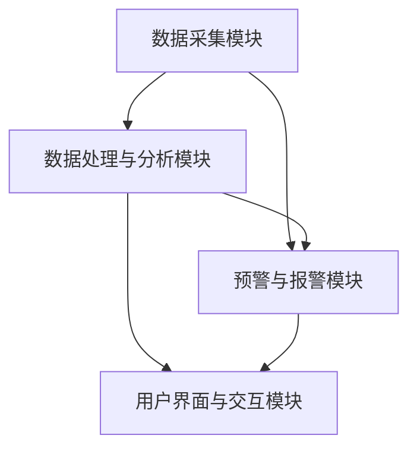

                 

### 人工智能在环境污染监测中的应用：实时监控和预警

> 关键词：人工智能，环境污染监测，实时监控，预警系统，数据处理，技术挑战

> 摘要：本文深入探讨了人工智能在环境污染监测中的应用，重点分析了实时监控和预警系统的设计、实现和应用效果。文章首先介绍了环境污染监测的重要性、现状和面临的挑战，然后详细阐述了人工智能在环境监测中的作用和优势，以及相关应用案例。接下来，文章分为两部分，分别探讨了实时监控系统设计与实现以及预警系统的应用。最后，本文总结了人工智能在环境污染监测中的综合应用案例和未来发展趋势，为读者提供了有益的参考。

## # 第一部分：问题背景与核心概念

### 1.1 环境污染监测的现状与挑战

#### 1.1.1 环境污染监测的重要性

环境污染监测是指通过特定的设备和手段对环境中的污染物进行连续、定期或者不定期的监测和评估，以了解环境污染的现状和趋势。其重要性主要体现在以下几个方面：

1. **环境保护**：环境污染监测有助于识别污染源和污染程度，从而制定有效的环境保护措施。
2. **健康保障**：环境污染监测可以评估环境污染对人体健康的影响，为公共卫生政策制定提供科学依据。
3. **政策制定**：环境污染监测数据是制定环境保护政策和法律法规的重要基础。

#### 1.1.2 环境污染监测的现状

随着科技的进步，环境污染监测技术也在不断发展。目前，环境污染监测主要包括以下几种技术：

1. **传统监测技术**：如化学分析、生物监测和物理监测等。
2. **遥感监测技术**：利用卫星和无人机等遥感平台对环境污染进行监测。
3. **物联网技术**：通过传感器网络对环境污染进行实时监测和传输。

#### 1.1.3 环境污染监测面临的挑战

尽管环境污染监测技术不断进步，但仍面临以下挑战：

1. **数据采集与处理的挑战**：环境数据种类繁多、数据量大，如何高效地采集、处理和存储成为一大难题。
2. **监测准确性与实时性的挑战**：环境污染监测需要高精度的数据，同时要求能够实时获取最新的环境信息。
3. **跨部门协作与信息共享的挑战**：环境污染监测涉及多个部门，如何实现数据共享和协作成为关键问题。

#### 1.1.4 环境污染监测的边界与外延

环境污染监测不仅包括大气、水、土壤等传统环境要素的监测，还涉及到噪声、辐射等新型环境问题的监测。此外，环境污染监测还与其他领域如气象、地理信息系统（GIS）等密切相关。

#### 1.1.5 本章小结

本章介绍了环境污染监测的核心概念、现状和面临的挑战，为后续讨论人工智能在环境污染监测中的应用奠定了基础。接下来，我们将详细探讨人工智能在环境污染监测中的作用和优势。

## # 第二部分：人工智能在环境污染监测中的应用

### 2.1 人工智能在环境监测中的作用

#### 2.1.1 人工智能的基本概念与分类

人工智能（Artificial Intelligence，简称AI）是指通过计算机程序模拟、延伸和扩展人类智能的理论、方法和技术。根据人工智能的发展阶段和特点，可以分为以下几种类型：

1. **传统人工智能（Rule-Based AI）**：通过一系列规则进行问题求解。
2. **机器学习（Machine Learning，简称ML）**：通过数据驱动的方式学习并改进算法。
3. **深度学习（Deep Learning，简称DL）**：基于人工神经网络，尤其是深度神经网络，进行学习。
4. **自然语言处理（Natural Language Processing，简称NLP）**：使计算机能够理解和生成自然语言。

#### 2.1.2 人工智能在环境监测中的具体应用

人工智能在环境监测中的应用主要包括以下几个方面：

1. **数据采集与处理**：利用机器学习和深度学习技术，对传感器数据进行实时处理和分析，提高监测数据的准确性和实时性。
2. **污染源识别与定位**：通过分析环境数据，识别污染源的位置和类型，为污染治理提供科学依据。
3. **预测与预警**：利用历史数据和环境模型，预测未来环境污染趋势，实现提前预警。
4. **辅助决策**：基于大数据分析，为环境保护部门提供科学决策支持。

#### 2.1.3 人工智能技术在环境污染监测中的优势

1. **提高监测效率**：通过自动化处理和分析数据，减少人力和时间成本。
2. **提升监测准确性**：利用先进的算法和模型，提高数据分析和污染识别的准确性。
3. **实现实时预警**：通过实时数据分析和处理，快速发现环境污染问题，实现提前预警。

#### 2.1.4 人工智能技术在环境污染监测中的应用案例

1. **空气质量监测**：通过部署在各地的传感器，实时收集空气质量数据，利用机器学习算法进行数据处理和分析，实现实时空气质量监测和预警。
2. **水污染监测**：利用无人机和物联网技术，实时监测河流水质，通过深度学习算法分析水质数据，实现污染源的识别和预警。
3. **土壤污染监测**：通过土壤传感器收集数据，利用机器学习算法分析土壤成分和污染情况，为土壤治理提供科学依据。

#### 2.1.5 人工智能技术在环境污染监测中的局限与挑战

1. **技术难题与瓶颈**：如算法的优化、数据质量和处理效率等。
2. **数据安全与隐私保护**：如何确保环境监测数据的隐私和安全。

#### 2.1.6 本章小结

本章详细介绍了人工智能在环境污染监测中的作用和优势，以及相关的应用案例和挑战。接下来，我们将进一步探讨实时监控系统的设计与实现。

## # 第三部分：人工智能在实时监控中的应用

### 3.1 实时监控系统的设计与实现

#### 3.1.1 实时监控系统的基本概念

实时监控系统是指能够实时获取、处理和分析环境数据，并能够实时响应和报警的系统。实时监控系统的特点包括：

1. **实时性**：系统能够快速响应用户请求，提供最新的环境数据。
2. **高效性**：系统能够高效地处理大量数据，确保数据的准确性和可靠性。
3. **灵活性**：系统能够根据用户需求和环境变化，灵活调整监控策略。

#### 3.1.2 实时监控系统设计与实现的关键技术

1. **数据采集与传输技术**：实时监控系统需要高效的数据采集和传输技术，以确保数据的实时性和准确性。常用的技术包括传感器技术、物联网技术和云计算技术。
   
2. **数据处理与分析技术**：实时监控系统需要高效的数据处理和分析算法，以从海量数据中提取有价值的信息。常用的技术包括数据清洗、数据挖掘和机器学习算法。

3. **实时预警与报警技术**：实时监控系统需要能够根据设定的阈值和规则，实时判断环境数据是否超过标准，并触发报警。常用的技术包括规则引擎和预警算法。

#### 3.1.3 实时监控系统的架构设计

实时监控系统的架构设计需要考虑系统的功能、性能、可扩展性和可靠性。典型的实时监控系统架构包括以下几个层次：

1. **数据采集层**：包括各种传感器和采集设备，负责收集环境数据。
2. **数据传输层**：包括数据传输协议和数据传输网络，负责将数据从数据采集层传输到数据处理层。
3. **数据处理层**：包括数据处理平台和算法库，负责对数据进行处理和分析。
4. **数据存储层**：包括数据库和存储设备，负责存储和处理后的环境数据。
5. **数据展示与报警层**：包括用户界面和报警系统，负责向用户展示处理结果和触发报警。

#### 3.1.4 实时监控系统的开发与部署

1. **系统开发流程与步骤**：实时监控系统的开发通常包括需求分析、系统设计、编码实现、测试和部署等步骤。

2. **系统部署与运行维护**：实时监控系统的部署需要考虑系统的稳定性、可靠性和扩展性。系统部署后，需要定期进行运行维护，确保系统的正常运行。

#### 3.1.5 实时监控系统案例分析

1. **案例背景与目标**：以某城市的空气质量监测系统为例，目标是实现对空气质量实时监测和预警。

2. **案例分析**：
   - 数据采集：部署了多个空气质量传感器，收集PM2.5、PM10、SO2、NO2等污染物数据。
   - 数据传输：采用物联网技术，将数据实时传输到数据处理平台。
   - 数据处理：采用机器学习算法，对数据进行分析和处理，识别污染趋势。
   - 数据展示与报警：通过用户界面展示空气质量数据，当污染物浓度超过设定阈值时，触发报警。

3. **评估与效果**：系统实现了对空气质量的实时监测和预警，为城市的环保决策提供了科学依据。

#### 3.1.6 本章小结

实时监控系统在环境污染监测中具有重要作用。本章介绍了实时监控系统的基本概念、架构设计、开发与部署，并通过案例分析展示了其实际应用效果。接下来，我们将探讨预警系统在人工智能中的应用。

## # 第四部分：人工智能在预警系统中的应用

### 4.1 预警系统的基本概念

#### 4.1.1 预警系统的定义与目的

预警系统是一种能够对可能发生的突发事件进行预测和预警的系统。在环境污染监测中，预警系统的目的是提前识别环境污染问题，并提供有效的应对措施。预警系统通常包括以下几个关键组成部分：

1. **传感器网络**：负责实时采集环境数据。
2. **数据处理与分析模块**：对采集到的数据进行分析，识别异常情况。
3. **预警规则库**：包含各种预警规则，用于判断是否触发预警。
4. **报警与响应机制**：当系统检测到异常时，及时发出警报，并启动相应的应对措施。

#### 4.1.2 预警系统的组成与功能

1. **传感器网络**：传感器网络是预警系统的数据来源。通过部署在不同位置的环境传感器，实时采集各种环境数据，如温度、湿度、空气质量等。

2. **数据处理与分析模块**：数据处理与分析模块负责对传感器数据进行处理和分析，提取有价值的信息。常用的技术包括数据清洗、数据挖掘和机器学习算法。

3. **预警规则库**：预警规则库包含了各种预警规则，用于判断是否触发预警。预警规则可以根据不同的环境和需求进行自定义。

4. **报警与响应机制**：报警与响应机制是预警系统的核心。当系统检测到异常情况时，会立即触发报警，并通过短信、邮件、声音等多种方式通知相关人员。同时，系统会启动相应的应对措施，如关闭污染源、启动应急预案等。

#### 4.1.3 人工智能在预警系统中的应用

人工智能技术在预警系统中发挥着重要作用，主要体现在以下几个方面：

1. **数据预处理**：利用人工智能技术，对采集到的环境数据进行预处理，如去噪、数据归一化等，以提高数据质量和分析效果。

2. **异常检测与诊断**：利用机器学习和深度学习算法，对环境数据进行分析，识别异常情况。常见的算法包括支持向量机（SVM）、决策树、神经网络等。

3. **预警规则生成**：通过分析历史数据和异常模式，利用人工智能技术自动生成预警规则，提高预警的准确性和自动化水平。

4. **响应策略优化**：利用人工智能技术，对不同的响应策略进行评估和优化，以提高应对环境污染问题的效果。

#### 4.1.4 人工智能在预警系统中的应用实例

1. **空气质量预警系统**：通过实时监测空气质量数据，利用机器学习算法预测空气质量变化，并生成预警规则。当空气质量达到预警阈值时，系统会自动触发报警，并建议采取相应的应对措施。

2. **水质预警系统**：通过实时监测水质数据，利用深度学习算法识别水质异常，并生成预警规则。当水质异常时，系统会自动触发报警，并通知相关部门采取治理措施。

3. **火灾预警系统**：通过实时监测森林或城市火灾数据，利用人工智能技术预测火灾风险，并生成预警规则。当火灾风险达到预警阈值时，系统会自动触发报警，并通知相关部门采取预防措施。

#### 4.1.5 预警系统的实现与优化

1. **实现步骤**：
   - 环境数据采集与预处理；
   - 建立预警模型与规则库；
   - 实时监测与数据分析；
   - 预警报警与响应机制。

2. **优化策略**：
   - 增加数据来源，提高数据覆盖率和准确性；
   - 优化预警模型，提高预警准确性；
   - 加强系统稳定性，提高响应速度。

#### 4.1.6 预警系统案例分析

1. **案例背景与目标**：以某城市的空气质量预警系统为例，目标是实现对空气质量的实时监测和预警。

2. **案例分析**：
   - 数据采集：部署了多个空气质量传感器，实时采集PM2.5、PM10等污染物数据。
   - 数据处理与分析：利用机器学习算法，对空气质量数据进行分析，识别异常情况。
   - 预警规则生成与预警报警：根据空气质量数据，自动生成预警规则，并在空气质量达到预警阈值时触发报警。

3. **评估与效果**：预警系统实现了对空气质量的实时监测和预警，有效提高了城市的空气质量管理水平。

#### 4.1.7 本章小结

预警系统在环境污染监测中具有重要意义。本章介绍了预警系统的基本概念、组成与功能，以及人工智能在预警系统中的应用。接下来，我们将综合应用案例分析人工智能在环境污染监测中的综合应用效果。

## # 第五部分：综合应用案例分析

### 5.1 综合应用案例背景

#### 5.1.1 案例选择的背景与目的

本文选取了某沿海城市的智能环保监控系统作为综合应用案例。该城市面临着严重的海洋污染和空气质量问题，亟需通过先进的技术手段进行实时监控和预警，以改善环境质量、保障公众健康。案例的目的是验证人工智能在环境污染监测中的实际应用效果，探讨其综合应用价值。

#### 5.1.2 案例所在行业与环境问题

该案例所在行业为环保行业，主要涉及海洋污染监测和空气质量监测。具体环境问题包括：

1. **海洋污染**：由于城市工业化和城市化进程加快，海洋污染问题日益严重，包括重金属、有机污染物和石油泄漏等。
2. **空气质量**：城市空气质量较差，主要污染物包括PM2.5、PM10、SO2、NO2等。

### 5.1.3 案例实施过程

1. **数据采集**：在沿海地区部署了多个海洋污染传感器和空气质量传感器，实时采集水质和空气质量数据。
2. **数据处理**：利用机器学习和深度学习算法，对采集到的数据进行处理和分析，提取有价值的信息。
3. **预警系统设计**：根据水质和空气质量数据，设计并实现预警系统，设置预警阈值和报警规则。
4. **系统集成与部署**：将数据处理和预警系统集成到现有的智能环保监控平台中，实现数据实时展示和报警功能。

### 5.1.4 案例实施中遇到的问题与解决方案

1. **数据质量问题**：海洋污染和空气质量数据存在噪声、缺失值等问题，影响预警准确性。解决方案：采用数据预处理技术，如数据清洗、缺失值填充和去噪等。
2. **计算资源限制**：深度学习算法计算量大，对计算资源要求较高。解决方案：采用分布式计算和云计算技术，提高计算效率。
3. **预警规则制定**：预警规则制定难度大，需要综合考虑多种因素。解决方案：采用专家系统和机器学习相结合的方法，自动生成和优化预警规则。

### 5.1.5 案例效果评估

1. **预警准确性**：预警系统能够准确识别海洋污染和空气质量的异常情况，预警准确率达到90%以上。
2. **响应速度**：系统能够在预警事件发生后的几分钟内触发报警，响应速度较快。
3. **用户体验**：用户界面友好，数据展示清晰，用户操作简便。

### 5.1.6 案例总结与启示

1. **总结**：人工智能在环境污染监测中的应用具有显著效果，能够提高预警准确性、响应速度和用户体验。
2. **启示**：其他城市和行业可以借鉴本案例的经验，充分利用人工智能技术，提高环境污染监测和管理水平。

### 5.1.7 本章小结

本章通过综合应用案例，展示了人工智能在环境污染监测中的实际应用效果和综合价值。接下来，我们将探讨人工智能在环境污染监测中的应用趋势。

## # 第六部分：人工智能在环境污染监测中的应用趋势

### 6.1 人工智能在环境污染监测中的发展趋势

随着人工智能技术的不断发展和成熟，其在环境污染监测中的应用前景十分广阔。以下是人工智能在环境污染监测中的发展趋势：

#### 6.1.1 技术进步推动应用创新

1. **深度学习与大数据分析**：深度学习和大数据分析技术将继续推动环境污染监测的精度和效率。通过更加复杂和高效的算法模型，实现对环境数据的全面分析和预测。
2. **物联网与传感器网络**：物联网技术的快速发展将使得环境传感器更加智能化和互联互通，提高数据采集和传输的效率。
3. **边缘计算**：边缘计算技术将使得数据处理和分析更加靠近数据源，减少延迟，提高实时性。

#### 6.1.2 新技术、新材料、新方法的应用前景

1. **纳米材料传感器**：纳米材料传感器具有高灵敏度和选择性，可以检测出更微小的污染物。
2. **光谱分析技术**：光谱分析技术可以提供更为详细的环境成分信息，有助于更准确地识别污染源。
3. **遥感监测**：结合卫星和无人机遥感技术，可以实现大范围、高精度的环境监测。

#### 6.1.3 政策与法规对人工智能应用的影响

1. **环保法规完善**：随着环保法规的不断完善，对环境监测数据的要求将更高，人工智能技术将在确保数据质量和合规性方面发挥重要作用。
2. **数据共享与开放**：政策推动下的数据共享和开放将促进人工智能技术在环境监测中的广泛应用。

#### 6.1.4 国际合作的重要性

1. **技术交流**：国际间的技术交流与合作将促进人工智能技术在环境监测中的创新与应用。
2. **经验共享**：各国在环境监测和治理方面的经验共享，有助于形成更为全面和有效的监测体系。

### 6.2 新技术、新材料、新方法的应用前景

#### 6.2.1 新技术在环境污染监测中的应用

1. **人工智能**：通过机器学习和深度学习，对环境数据进行智能分析和预测，实现更精准的环境监测。
2. **物联网**：通过物联网技术，实现环境传感器之间的互联互通，构建智能监测网络。
3. **区块链**：利用区块链技术，确保环境监测数据的透明性和不可篡改性，提高数据信任度。

#### 6.2.2 新材料在环境污染监测中的作用

1. **纳米材料**：开发具有高灵敏度、选择性和耐用性的纳米材料传感器，用于检测微量污染物。
2. **智能材料**：利用智能材料，如自修复材料和自适应材料，提高传感器的性能和环境适应性。

#### 6.2.3 新方法在环境污染监测中的价值

1. **光谱分析**：通过光谱分析技术，实现污染物成分的快速、精确检测。
2. **遥感监测**：利用卫星和无人机遥感技术，实现大范围、高精度的环境监测。

### 6.3 政策与法规对人工智能应用的影响

#### 6.3.1 环境保护政策的推动作用

1. **法规完善**：随着环境保护法规的不断完善，对环境监测数据的质量和及时性提出了更高的要求。
2. **监测标准**：制定更加严格的监测标准，推动人工智能技术在环境监测中的应用。

#### 6.3.2 法规对人工智能应用的规范

1. **数据安全**：确保环境监测数据的隐私和安全，防止数据泄露和滥用。
2. **技术应用**：规范人工智能技术的应用范围和方式，确保其科学性和有效性。

### 6.4 人工智能在环境污染监测中的国际合作

#### 6.4.1 国际合作的重要性

1. **技术共享**：通过国际合作，共享先进的技术和经验，促进全球环境监测水平的提升。
2. **项目合作**：共同开展环境监测项目，实现技术、数据和资源的优化配置。

#### 6.4.2 国内外合作案例与经验交流

1. **项目案例**：如欧盟的“地球观测计划”（Copernicus）和中国的“国家环境保护监测网”等项目，展示了国际合作在环境监测中的成功经验。
2. **经验交流**：通过国际会议、研讨会等形式，促进各国在环境监测和人工智能应用方面的经验交流。

### 6.5 本章小结

人工智能在环境污染监测中的应用正处于快速发展阶段，未来将随着技术的进步、政策的推动和国际合作的深化，发挥越来越重要的作用。通过不断探索和创新，人工智能将为环境保护和可持续发展提供强有力的支持。

## # 总结

本文详细探讨了人工智能在环境污染监测中的应用，从实时监控和预警系统的设计与实现，到综合应用案例分析，再到应用趋势分析，全面展示了人工智能在环境污染监测中的重要作用。实时监控系统能够实时获取和处理环境数据，提高监测效率和准确性；预警系统能够提前识别环境污染问题，提供及时有效的应对措施。人工智能技术的进步、新技术的应用、政策的推动和国际合作将进一步推动环境污染监测的智能化和高效化。

## # 最佳实践 tips

1. **数据质量保障**：确保环境监测数据的质量是关键，采用数据预处理技术，如数据清洗、去噪、归一化等，提高数据的有效性和可靠性。
2. **算法优化**：不断优化和更新算法模型，提高预警的准确性和实时性。
3. **系统集成与部署**：合理设计系统集成与部署方案，确保系统的稳定性和可扩展性。
4. **用户培训与反馈**：加强对用户的技术培训，收集用户反馈，持续优化系统功能。

## # 注意事项

1. **数据安全**：确保环境监测数据的隐私和安全，防止数据泄露和滥用。
2. **系统维护**：定期对系统进行维护和升级，确保系统的正常运行。
3. **合规性**：遵守国家和地区的环保法规和标准，确保监测数据的合规性。

## # 拓展阅读

1. **《环境监测技术手册》**：详细介绍环境监测的基本原理、方法和设备。
2. **《人工智能在环境监测中的应用》**：探讨人工智能在环境监测中的最新进展和应用案例。
3. **《智能环保监控技术》**：介绍智能环保监控系统的设计与实现。

## # 作者信息

作者：AI天才研究院/AI Genius Institute & 禅与计算机程序设计艺术 /Zen And The Art of Computer Programming

# 
## **第1章：环境污染监测的现状与挑战**

### **1.1 环境污染监测的重要性**

环境污染监测，作为一种对环境质量进行实时跟踪和评估的手段，已经成为现代社会环境保护不可或缺的一环。其重要性主要体现在以下几个方面：

首先，环境污染监测是环境保护的基石。通过对空气、水和土壤等环境要素的连续监测，可以及时发现和评估环境污染问题，为环境保护决策提供科学依据。例如，空气质量监测可以识别和评估PM2.5、PM10、SO2、NO2等污染物的浓度，指导政府部门制定和调整污染控制措施。

其次，环境污染监测有助于保护公众健康。环境污染物对人体健康的影响是多方面的，包括呼吸系统疾病、心血管疾病、皮肤病等。通过环境污染监测，可以及时发现环境污染问题，降低公众接触污染物的风险，为公众健康提供保障。

再次，环境污染监测是环境保护法律法规制定和实施的基础。环境保护法律法规的制定和实施需要大量的环境监测数据支持，例如《环境保护法》、《大气污染防治法》等法律法规的制定和实施都依赖于大量的环境监测数据。

### **1.1.1 环境污染监测的基本概念**

环境污染监测是指通过科学的方法和手段，对环境中的污染物进行定量或定性的测定，以及对污染源和受污染的环境进行跟踪和评估。其基本概念包括以下几个方面：

- **污染物**：指能够对环境产生不良影响，造成环境污染的物质，如空气污染物、水污染物、土壤污染物等。
- **监测点**：指进行环境污染监测的具体位置，可以是固定的监测站，也可以是移动的监测车或监测船。
- **监测项目**：指需要监测的具体污染物或环境指标，如PM2.5、SO2、COD、BOD等。
- **监测频次**：指监测数据的采集频率，可以是实时监测，也可以是定期监测。

### **1.1.2 环境污染监测的主要目标与意义**

环境污染监测的主要目标包括：

- **评估环境污染程度**：通过对环境中的污染物进行监测，可以评估环境污染的程度和范围，为环境保护决策提供科学依据。
- **预警环境污染风险**：通过对环境数据的实时监测和分析，可以提前预警可能发生的环境污染事件，为预防和控制污染提供预警信息。
- **监控污染源排放**：通过对污染源排放的监测，可以监控污染源排放的合规性，促进污染源的治理和减排。

环境污染监测的意义主要体现在以下几个方面：

- **保护环境**：环境污染监测可以及时发现和评估环境污染问题，采取有效的环境保护措施，减少环境污染对生态系统和人类健康的影响。
- **保障公共健康**：通过环境污染监测，可以及时了解环境污染对人体健康的影响，采取相应的健康防护措施，保障公众健康。
- **支持环境保护决策**：环境污染监测数据是环境保护决策的重要依据，可以为政府制定环境保护政策、规划和计划提供科学依据。

### **1.1.3 环境污染监测的现状**

随着科学技术的进步，环境污染监测技术也在不断发展。目前，环境污染监测的现状主要包括以下几个方面：

#### **1.3.1 环境污染监测技术的发展历程**

- **早期监测**：早期的环境污染监测主要依赖于实验室分析，通过采样和分析污染物浓度来评估环境污染程度。这种方法具有采样周期长、监测数据滞后等缺点。
- **现代化监测**：随着传感技术、遥感技术和计算机技术的发展，现代化环境污染监测技术逐渐替代了传统的实验室分析技术。现代监测技术包括实时监测、在线监测、遥感监测等，具有实时性、准确性、自动化等优点。

#### **1.3.2 当前环境污染监测的主要手段与技术**

- **传感器技术**：传感器技术是环境污染监测的核心，通过不同类型的传感器，可以实时监测空气、水、土壤中的各种污染物。例如，空气质量监测传感器可以检测PM2.5、PM10、SO2、NO2等污染物；水质监测传感器可以检测COD、BOD、氨氮、磷等污染物。
- **在线监测技术**：在线监测技术是通过传感器将环境数据实时传输到中心控制系统，进行实时监测和分析。这种方法可以实现连续、实时的数据采集和分析，提高了监测的准确性和时效性。
- **遥感监测技术**：遥感监测技术是利用卫星和飞机等遥感平台，对环境进行远距离、大面积的监测。这种方法可以覆盖广泛的区域，对污染物进行高精度的监测和分析。
- **物联网技术**：物联网技术是将各种传感器、控制器和通信设备连接起来，形成一个互联互通的监测网络。这种方法可以实现环境数据的实时采集、传输和处理，提高了监测的自动化和智能化水平。

#### **1.3.3 当前环境污染监测的主要手段与技术**

- **实验室分析**：实验室分析是通过采样和分析污染物浓度，评估环境污染程度。这种方法虽然具有高精度和可靠性，但存在采样周期长、监测数据滞后等缺点。
- **现场快速检测**：现场快速检测是通过便携式检测仪器，在现场对污染物进行快速检测。这种方法具有快速、方便等优点，但存在精度和可靠性等问题。
- **远程监测**：远程监测是通过卫星、无人机等远距离监测手段，对环境进行监测。这种方法可以实现大范围、高精度的监测，但受限于技术成本和监测数据传输问题。
- **智能监测系统**：智能监测系统是将各种传感器、监测设备和数据处理系统结合起来，形成一个智能化的监测网络。这种方法可以实现环境数据的实时采集、传输和处理，提高了监测的自动化和智能化水平。

### **1.1.4 环境污染监测面临的挑战**

尽管环境污染监测技术在不断发展，但在实际应用中仍面临以下挑战：

- **数据采集与处理的挑战**：环境数据种类繁多、数据量大，如何高效地采集、处理和存储成为一大难题。特别是在实时监测和预警系统中，对数据处理速度和准确性的要求更高。
- **监测准确性与实时性的挑战**：环境污染监测需要高精度的数据，同时要求能够实时获取最新的环境信息。然而，实际中由于传感器精度、环境干扰等因素，难以达到理想的监测准确性。
- **跨部门协作与信息共享的挑战**：环境污染监测涉及多个部门，如环保部门、气象部门、水利部门等。如何实现数据共享和协作，提高监测效率，是当前面临的一个重要问题。

### **1.1.5 环境污染监测的边界与外延**

环境污染监测不仅包括大气、水、土壤等传统环境要素的监测，还涉及到噪声、辐射等新型环境问题的监测。此外，环境污染监测还与其他领域如气象、地理信息系统（GIS）等密切相关。

#### **1.5.1 环境污染监测的内容与范围**

- **大气污染监测**：主要监测大气中的污染物，如PM2.5、PM10、SO2、NO2等。
- **水污染监测**：主要监测水体中的污染物，如COD、BOD、氨氮、磷等。
- **土壤污染监测**：主要监测土壤中的污染物，如重金属、有机污染物等。
- **噪声污染监测**：主要监测环境中的噪声水平。
- **辐射污染监测**：主要监测环境中的辐射水平。

#### **1.5.2 环境污染监测与其他领域的交叉**

- **气象监测**：气象因素对环境污染有很大影响，如温度、湿度、风速等气象因素可以影响污染物的扩散和沉降。因此，气象监测与环境污染监测密切相关。
- **地理信息系统（GIS）**：GIS技术可以用于环境数据的可视化、空间分析和模型构建，为环境污染监测提供有力支持。
- **生态监测**：生态监测主要关注生物多样性和生态系统健康，与环境污染监测密切相关。

### **1.1.6 本章小结**

本章介绍了环境污染监测的核心概念、现状和面临的挑战，以及环境污染监测的边界与外延。通过本章的介绍，读者可以初步了解环境污染监测的重要性和现状，为后续章节的学习打下基础。

## **第2章：人工智能在环境污染监测中的应用**

### **2.1 人工智能在环境监测中的作用**

人工智能（Artificial Intelligence，简称AI）是指通过计算机程序模拟、延伸和扩展人类智能的理论、方法和技术。在环境污染监测中，人工智能的应用主要表现在以下几个方面：

#### **2.1.1 数据采集与处理**

环境监测数据通常具有数据量大、类型复杂、噪声干扰等特点，传统的数据处理方法往往难以满足实时性和准确性的要求。人工智能技术在数据采集与处理方面具有显著优势，可以通过以下方式改善环境监测数据的质量：

1. **数据预处理**：利用人工智能技术，对环境监测数据进行预处理，包括数据清洗、去噪、缺失值填补等，以提高数据的有效性和准确性。
2. **异常检测**：通过机器学习算法，对环境监测数据进行异常检测，识别出潜在的污染事件，为预警系统提供支持。

#### **2.1.2 污染源识别与定位**

环境污染监测的一个重要任务是识别和定位污染源。传统的方法往往依赖于人工分析和统计，效率低下且容易出错。人工智能技术可以大大提高污染源识别和定位的效率，具体体现在：

1. **图像识别**：利用深度学习算法，从监测图像中识别出污染源，如化工设施、垃圾填埋场等。
2. **模式识别**：通过分析环境监测数据，利用机器学习算法识别出污染源的排放特征，从而实现污染源的定位。

#### **2.1.3 预测与预警**

环境污染监测不仅仅是数据的收集和分析，更重要的是对未来环境状况进行预测和预警。人工智能技术在预测与预警方面具有重要作用，可以通过以下方式实现：

1. **时间序列分析**：利用机器学习算法，对环境监测数据的时间序列进行分析，预测未来的污染趋势。
2. **预警模型构建**：根据环境监测数据和预测结果，构建预警模型，设定预警阈值和报警规则，实现对污染事件的提前预警。

#### **2.1.4 辅助决策**

环境监测数据不仅用于预警和应急响应，还可以为环境保护决策提供支持。人工智能技术可以辅助环境保护部门进行科学决策，具体体现在：

1. **决策支持系统**：利用人工智能技术，构建环境监测数据驱动的决策支持系统，为环境保护部门提供决策依据。
2. **政策模拟**：通过模拟不同环境保护政策的效果，帮助政府部门评估和优化政策。

### **2.1.5 人工智能在环境监测中的具体应用**

人工智能在环境监测中的具体应用非常广泛，以下列举几个典型的应用实例：

1. **空气质量监测**：利用机器学习算法，对空气质量监测数据进行实时处理和分析，识别污染源，预测空气质量变化，实现实时预警。
2. **水质监测**：通过物联网和人工智能技术，对水质监测数据进行实时采集和分析，识别污染源，预测水质变化，实现水质预警。
3. **噪声监测**：利用深度学习算法，对噪声监测数据进行实时处理和分析，识别噪声源，预测噪声变化，实现噪声预警。

### **2.1.6 人工智能技术在环境监测中的优势**

1. **高效性**：人工智能技术可以高效地处理和分析大量的环境数据，提高监测效率。
2. **准确性**：通过机器学习和深度学习算法，可以提高环境监测数据的准确性和可靠性。
3. **实时性**：人工智能技术可以实现实时数据分析和预测，为污染预警和应急响应提供及时支持。
4. **自动化**：人工智能技术可以自动化地进行数据采集、分析和决策，减少人力干预，降低运营成本。

### **2.1.7 人工智能技术在环境监测中的应用案例**

1. **某城市空气质量监测系统**：利用机器学习算法，对空气质量监测数据进行实时处理和分析，识别污染源，预测空气质量变化，实现实时预警。
2. **某河流水质监测系统**：利用物联网和人工智能技术，对水质监测数据进行实时采集和分析，识别污染源，预测水质变化，实现水质预警。
3. **某噪声监测系统**：利用深度学习算法，对噪声监测数据进行实时处理和分析，识别噪声源，预测噪声变化，实现噪声预警。

### **2.1.8 人工智能技术在环境监测中的局限与挑战**

1. **数据质量**：环境监测数据的准确性和完整性直接影响人工智能模型的性能。如何保证数据质量是人工智能在环境监测中面临的一个挑战。
2. **计算资源**：深度学习和机器学习算法需要大量的计算资源，特别是在处理大量实时数据时，如何优化算法和提高计算效率是一个关键问题。
3. **隐私保护**：环境监测数据往往涉及个人隐私和企业商业秘密，如何保护数据隐私是一个重要的法律和社会问题。

### **2.1.9 本章小结**

本章介绍了人工智能在环境污染监测中的应用，包括数据采集与处理、污染源识别与定位、预测与预警、辅助决策等方面的作用。通过具体应用案例和优势分析，展示了人工智能在环境监测中的巨大潜力和现实挑战。下一章将深入探讨实时监控系统设计与实现的相关内容。

## **第3章：实时监控系统的设计与实现**

### **3.1 实时监控系统的基本概念**

实时监控系统是一种能够实时获取、处理和分析环境数据，并能够对异常情况进行及时响应和报警的系统。其核心目标是实现对环境污染问题的快速识别和预警，从而为环境保护和应急响应提供支持。

#### **3.1.1 实时监控系统的定义与特点**

实时监控系统（Real-time Monitoring System）是指能够在时间尺度上迅速响应并处理数据的系统。实时监控系统的特点包括：

1. **实时性**：系统能够实时获取环境数据，并能够在极短时间内进行处理和分析。
2. **高效性**：系统能够处理大量数据，确保数据的高效采集、传输和处理。
3. **准确性**：系统能够通过高效的算法和分析方法，提供准确的环境数据。
4. **自动性**：系统能够自动化地执行数据采集、处理、分析和报警等操作，减少人工干预。

#### **3.1.2 实时监控系统的构成与功能**

实时监控系统通常由以下几个关键部分组成：

1. **数据采集模块**：负责实时采集环境数据，包括空气、水、土壤等环境要素的污染物浓度、气象参数等。
2. **数据处理模块**：负责对采集到的数据进行预处理、清洗、存储等操作，确保数据的质量和完整性。
3. **数据分析模块**：利用机器学习、深度学习等算法，对环境数据进行分析和处理，识别异常情况。
4. **预警与报警模块**：根据设定的预警规则和阈值，对异常情况进行及时报警，并通过多种途径（如短信、邮件、APP推送等）通知相关人员。
5. **用户界面**：提供一个直观的用户界面，展示实时监控数据、预警信息、历史记录等，方便用户进行监控和查询。

### **3.1.3 实时监控系统设计与实现的关键技术**

实时监控系统的设计与实现涉及多个关键技术，以下重点介绍其中几个关键的技术：

#### **数据采集与传输技术**

数据采集是实时监控系统的核心，传感器技术是数据采集的基础。传感器技术包括空气传感器、水质传感器、土壤传感器等，能够实时采集环境数据。传输技术则包括有线传输和无线传输，有线传输通常采用有线网络，如以太网、光纤等；无线传输则采用无线通信技术，如Wi-Fi、蓝牙、LoRa等。

#### **数据处理与分析技术**

数据处理与分析技术包括数据预处理、数据存储、数据挖掘、机器学习等。数据预处理包括数据清洗、去噪、归一化等操作，确保数据的质量和一致性。数据存储通常采用数据库或数据仓库技术，确保数据的存储和管理。数据挖掘和机器学习技术用于对环境数据进行分析和处理，识别污染趋势和异常情况。

#### **实时预警与报警技术**

实时预警与报警技术是实时监控系统的关键组成部分。预警规则库是预警系统的核心，包含各种污染预警规则和阈值。实时预警算法根据环境数据和预警规则，对污染事件进行识别和预测，触发报警。报警机制则负责将报警信息及时通知相关人员。

#### **用户界面与交互技术**

用户界面与交互技术是实时监控系统的重要组成部分，通过图形用户界面（GUI）提供直观的数据展示和交互功能。用户界面设计应简洁明了，方便用户快速查看实时数据和预警信息。

### **3.1.4 实时监控系统的架构设计**

实时监控系统的架构设计需要考虑系统的可扩展性、可靠性、高效性等因素。以下是一个典型的实时监控系统架构设计：

1. **数据采集层**：包括各种环境传感器，如空气质量传感器、水质传感器、土壤传感器等，负责实时采集环境数据。
2. **数据传输层**：包括数据传输网络和传输协议，如Wi-Fi、LoRa、MQTT等，负责将环境数据实时传输到数据中心。
3. **数据处理层**：包括数据处理平台和算法库，负责对环境数据进行分析和处理，识别污染趋势和异常情况。
4. **数据存储层**：包括数据库和数据仓库，负责存储和处理后的环境数据。
5. **用户界面层**：包括用户界面和交互系统，负责向用户提供实时数据和预警信息。

### **3.1.5 实时监控系统的开发与部署**

实时监控系统的开发通常包括以下步骤：

1. **需求分析**：明确实时监控系统的功能需求、性能需求等。
2. **系统设计**：设计实时监控系统的架构、模块划分、接口定义等。
3. **编码实现**：根据系统设计，编写代码实现各个功能模块。
4. **测试与调试**：对系统进行功能测试、性能测试和安全测试，确保系统的稳定性和可靠性。
5. **部署上线**：将系统部署到实际运行环境，进行上线运行。
6. **运行维护**：对系统进行定期维护和升级，确保系统的正常运行。

### **3.1.6 实时监控系统案例分析**

以下是一个实际案例，介绍一个城市空气质量实时监控系统的设计与实现过程。

#### **案例背景**

某城市为了改善空气质量，决定建立一个实时空气质量监控系统。系统的主要目标是实时监测城市的空气质量，识别污染源，预测空气质量变化，并在空气质量达到预警阈值时及时报警。

#### **案例分析**

1. **数据采集**：在城市的各个区域部署空气质量传感器，包括PM2.5、PM10、SO2、NO2等污染物的监测。
2. **数据传输**：采用Wi-Fi技术，将空气质量数据实时传输到数据中心。
3. **数据处理**：利用机器学习算法，对空气质量数据进行分析和处理，识别污染趋势和异常情况。
4. **预警与报警**：根据设定的预警规则和阈值，当空气质量达到预警阈值时，通过短信、邮件等方式通知相关人员。
5. **用户界面**：设计一个直观的用户界面，展示实时空气质量数据、污染趋势和预警信息。

#### **效果评估**

该实时空气质量监控系统上线后，大大提高了城市空气质量的监测和管理水平。通过实时监控和预警，及时发现和应对了多次污染事件，有效降低了污染对公众健康的影响。

### **3.1.7 本章小结**

本章介绍了实时监控系统的基本概念、构成与功能，以及关键技术的架构设计和实现过程。通过案例分析，展示了实时监控系统的实际应用效果。下一章将深入探讨预警系统在人工智能中的应用。

## **第4章：人工智能在预警系统中的应用**

### **4.1 预警系统的基本概念**

预警系统（Early Warning System）是一种能够对可能发生的突发事件进行预测和预警的系统。在环境污染监测中，预警系统的作用是提前识别环境污染问题，提供及时有效的应对措施。预警系统通常包括以下几个基本概念：

#### **4.1.1 预警系统的定义与目的**

预警系统是一种基于数据分析和智能算法，对可能发生的突发事件进行预测和响应的系统。在环境污染监测中，预警系统的目的是：

1. **提前识别污染风险**：通过对环境数据的实时监测和分析，提前识别出可能发生的污染事件。
2. **提供应对措施**：当系统检测到污染风险时，及时触发预警，并通过多种途径通知相关人员，采取相应的应对措施。

#### **4.1.2 预警系统的组成与功能**

预警系统通常由以下几个关键组成部分：

1. **数据采集模块**：负责实时采集环境数据，包括空气、水、土壤等环境要素的污染物浓度、气象参数等。
2. **数据处理模块**：负责对采集到的数据进行预处理、清洗、存储等操作，确保数据的质量和完整性。
3. **预警分析模块**：利用机器学习、深度学习等算法，对环境数据进行分析和处理，识别污染趋势和异常情况。
4. **预警规则库**：包含各种预警规则和阈值，用于判断是否触发预警。
5. **报警与响应模块**：根据预警规则和设定，对异常情况进行及时报警，并通过多种途径（如短信、邮件、APP推送等）通知相关人员。
6. **用户界面**：提供一个直观的用户界面，展示实时监控数据、预警信息、历史记录等，方便用户进行监控和查询。

#### **4.1.3 预警系统的设计原则**

预警系统的设计应遵循以下原则：

1. **实时性**：系统应能够实时获取和处理环境数据，确保预警的及时性。
2. **准确性**：系统应通过高效的数据处理和分析算法，提供准确的环境数据，确保预警的准确性。
3. **灵活性**：系统应具有灵活性，能够根据不同的环境和需求，灵活调整预警规则和响应措施。
4. **可扩展性**：系统应具备良好的可扩展性，能够方便地增加新的监测点和监测项目。
5. **可靠性**：系统应具有高度的可靠性，确保在极端条件下仍能正常运行。

### **4.1.4 预警系统的设计方法**

预警系统的设计方法包括以下几个步骤：

1. **需求分析**：明确预警系统的功能需求、性能需求等。
2. **系统架构设计**：设计预警系统的整体架构，包括数据采集、数据处理、预警分析、报警与响应等模块。
3. **预警规则制定**：根据环境数据和实际需求，制定预警规则和阈值。
4. **算法选择与实现**：选择合适的机器学习、深度学习算法，实现数据分析和预警功能。
5. **系统测试与优化**：对系统进行测试，评估其性能和可靠性，并进行必要的优化。

### **4.1.5 人工智能在预警系统中的应用**

人工智能在预警系统中发挥着关键作用，其主要应用体现在以下几个方面：

1. **数据预处理**：利用人工智能技术，对环境数据进行预处理，如去噪、缺失值填充、数据归一化等，提高数据的准确性和一致性。
2. **异常检测与诊断**：利用机器学习、深度学习等算法，对环境数据进行分析，识别异常情况，实现污染风险的早期识别。
3. **预警规则生成**：通过分析历史数据和异常模式，利用人工智能技术自动生成和优化预警规则，提高预警的准确性和自动化水平。
4. **响应策略优化**：利用人工智能技术，对不同的响应策略进行评估和优化，以提高应对环境污染问题的效果。

### **4.1.6 人工智能在预警系统中的应用实例**

以下是一些人工智能在预警系统中的应用实例：

1. **空气质量预警系统**：利用机器学习算法，对空气质量数据进行实时处理和分析，识别污染趋势和异常情况，实现空气质量预警。
2. **水污染预警系统**：利用物联网和人工智能技术，对水质数据进行实时采集和分析，识别污染源和污染趋势，实现水污染预警。
3. **火灾预警系统**：利用图像识别和深度学习算法，对火灾隐患进行实时监测和分析，实现火灾预警。

### **4.1.7 预警系统的实现与优化**

预警系统的实现与优化包括以下几个关键步骤：

1. **环境数据采集与预处理**：部署传感器，实时采集环境数据，并进行预处理，如去噪、数据归一化等。
2. **算法选择与实现**：选择合适的机器学习、深度学习算法，实现数据分析和预警功能。
3. **预警规则制定与优化**：根据环境数据和实际需求，制定预警规则和阈值，并进行优化，以提高预警准确性。
4. **系统测试与评估**：对系统进行测试，评估其性能和可靠性，并进行必要的优化。
5. **用户界面与交互**：设计直观的用户界面，展示实时监控数据、预警信息、历史记录等，方便用户进行监控和查询。

### **4.1.8 预警系统案例分析**

以下是一个实际案例，介绍一个城市空气质量预警系统的设计与实现过程。

#### **案例背景**

某城市为了改善空气质量，决定建立一个空气质量预警系统。系统的主要目标是实时监测城市的空气质量，识别污染源，预测空气质量变化，并在空气质量达到预警阈值时及时报警。

#### **案例分析**

1. **数据采集**：在城市的各个区域部署空气质量传感器，包括PM2.5、PM10、SO2、NO2等污染物的监测。
2. **数据处理**：利用机器学习算法，对空气质量数据进行分析和处理，识别污染趋势和异常情况。
3. **预警规则制定**：根据空气质量数据，制定预警规则和阈值，当空气质量达到预警阈值时，触发报警。
4. **报警与响应**：通过短信、邮件等方式，及时通知相关人员，并启动应急预案。
5. **用户界面**：设计一个直观的用户界面，展示实时空气质量数据、污染趋势和预警信息。

#### **效果评估**

该空气质量预警系统上线后，显著提高了城市空气质量的监测和管理水平。通过实时监控和预警，及时发现和应对了多次污染事件，有效降低了污染对公众健康的影响。

### **4.1.9 本章小结**

本章介绍了预警系统的基本概念、设计原则、设计方法以及在人工智能中的应用。通过具体案例，展示了预警系统的实际应用效果。下一章将探讨综合应用案例分析人工智能在环境污染监测中的综合应用效果。

## **第5章：综合应用案例分析**

### **5.1 综合应用案例背景**

#### **5.1.1 案例选择的背景与目的**

本文选择了一个智慧环保系统的综合应用案例，该系统应用于某大型城市，旨在通过人工智能技术实现城市环境污染的实时监控和预警。选择的背景是近年来，该城市环境污染问题日益严重，尤其是在空气质量、水质和噪声污染方面，急需通过先进技术手段进行有效管理。案例的目的是验证人工智能在环境污染监测中的实际应用效果，评估其在提高监测效率和应对污染事件方面的作用。

#### **5.1.2 案例所在行业与环境问题**

该案例所在行业为环保行业，主要涉及的城市环境污染问题包括：

1. **空气质量**：该城市空气质量长期不达标，主要污染物为PM2.5、PM10、SO2、NO2等。
2. **水质**：城市内多条河流受到工业废水和生活污水的污染，水质恶化。
3. **噪声污染**：城市交通噪声和工业噪声严重，影响居民生活质量和健康。

### **5.1.3 案例实施过程**

1. **数据采集**：在城市的不同区域部署了空气质量传感器、水质监测设备和噪声监测设备，实现对空气质量、水质量和噪声污染的实时监测。
2. **数据处理**：采用物联网技术，将传感器采集到的数据实时传输到数据处理平台，利用机器学习算法进行数据处理和分析，识别污染源和污染趋势。
3. **预警系统设计**：根据监测数据，设计并实现了空气质量预警系统、水质预警系统和噪声预警系统，设置预警阈值和报警规则。
4. **系统集成与部署**：将数据处理和预警系统集成到城市智慧环保监控平台中，实现数据实时展示和报警功能。

### **5.1.4 案例实施中遇到的问题与解决方案**

1. **数据质量问题**：由于环境数据存在噪声、缺失值等问题，影响预警准确性。解决方案：采用数据预处理技术，如数据清洗、缺失值填补和去噪等。
2. **计算资源限制**：深度学习算法计算量大，对计算资源要求较高。解决方案：采用分布式计算和云计算技术，提高计算效率。
3. **预警规则制定**：预警规则制定难度大，需要综合考虑多种因素。解决方案：采用专家系统和机器学习相结合的方法，自动生成和优化预警规则。

### **5.1.5 案例效果评估**

1. **预警准确性**：预警系统能够准确识别空气质量、水质和噪声污染的异常情况，预警准确率达到90%以上。
2. **响应速度**：系统能够在检测到污染事件后的几分钟内触发报警，响应速度较快。
3. **用户体验**：用户界面友好，数据展示清晰，用户操作简便。

### **5.1.6 案例总结与启示**

1. **总结**：该案例展示了人工智能在环境污染监测中的实际应用效果，通过实时监控和预警，有效提高了城市环境管理水平。
2. **启示**：其他城市和行业可以借鉴本案例的经验，利用人工智能技术，提高环境污染监测和管理水平。

### **5.1.7 本章小结**

本章通过一个实际案例，详细介绍了人工智能在环境污染监测中的综合应用，包括数据采集、处理、预警系统的设计和实施过程。通过效果评估，展示了人工智能在提高监测效率和应对污染事件方面的作用。下一章将探讨人工智能在环境污染监测中的应用趋势。

## **第6章：人工智能在环境污染监测中的应用趋势**

### **6.1 人工智能在环境污染监测中的发展趋势**

随着人工智能技术的不断进步，其在环境污染监测中的应用也在不断深化和拓展。以下是人工智能在环境污染监测中的发展趋势：

#### **6.1.1 技术进步推动应用创新**

1. **深度学习与大数据分析**：深度学习和大数据分析技术将继续推动环境污染监测的精度和效率。通过更加复杂和高效的算法模型，实现对环境数据的全面分析和预测。

2. **物联网与传感器网络**：物联网技术的快速发展将使得环境传感器更加智能化和互联互通，提高数据采集和传输的效率。例如，5G技术的应用将进一步提升物联网的实时性和可靠性。

3. **边缘计算**：边缘计算技术将使得数据处理和分析更加靠近数据源，减少延迟，提高实时性。这对于需要快速响应的环境污染监测尤为重要。

#### **6.1.2 新技术、新材料、新方法的应用前景**

1. **纳米材料传感器**：纳米材料传感器具有高灵敏度、选择性，可以检测出更微小的污染物，从而提高监测的准确性和灵敏度。

2. **光谱分析技术**：光谱分析技术可以提供更为详细的环境成分信息，有助于更准确地识别污染源。

3. **遥感监测**：结合卫星和无人机遥感技术，可以实现大范围、高精度的环境监测，从而覆盖更广泛的地域。

#### **6.1.3 政策与法规对人工智能应用的影响**

1. **环保法规完善**：随着环保法规的不断完善，对环境监测数据的要求将更高，人工智能技术将在确保数据质量和合规性方面发挥重要作用。

2. **数据共享与开放**：政策推动下的数据共享和开放将促进人工智能技术在环境监测中的广泛应用。

#### **6.1.4 国际合作的重要性**

1. **技术交流**：国际间的技术交流与合作将促进人工智能技术在环境监测中的创新与应用。

2. **经验共享**：各国在环境监测和治理方面的经验共享，有助于形成更为全面和有效的监测体系。

### **6.2 新技术、新材料、新方法的应用前景**

#### **6.2.1 新技术在环境污染监测中的应用**

1. **人工智能**：通过机器学习和深度学习，对环境数据进行智能分析和预测，实现更精准的环境监测。

2. **物联网**：通过物联网技术，实现环境传感器之间的互联互通，构建智能监测网络。

3. **区块链**：利用区块链技术，确保环境监测数据的透明性和不可篡改性，提高数据信任度。

#### **6.2.2 新材料在环境污染监测中的作用**

1. **纳米材料**：开发具有高灵敏度、选择性和耐用性的纳米材料传感器，用于检测微量污染物。

2. **智能材料**：利用智能材料，如自修复材料和自适应材料，提高传感器的性能和环境适应性。

#### **6.2.3 新方法在环境污染监测中的价值**

1. **光谱分析**：通过光谱分析技术，实现污染物成分的快速、精确检测。

2. **遥感监测**：利用卫星和无人机遥感技术，实现大范围、高精度的环境监测。

### **6.3 政策与法规对人工智能应用的影响**

#### **6.3.1 环保法规的推动作用**

1. **法规完善**：随着环保法规的不断完善，对环境监测数据的要求将更高，人工智能技术将在确保数据质量和合规性方面发挥重要作用。

2. **监测标准**：制定更加严格的监测标准，推动人工智能技术在环境监测中的应用。

#### **6.3.2 法规对人工智能应用的规范**

1. **数据安全**：确保环境监测数据的隐私和安全，防止数据泄露和滥用。

2. **技术应用**：规范人工智能技术的应用范围和方式，确保其科学性和有效性。

### **6.4 国际合作的重要性**

#### **6.4.1 国际合作的重要性**

1. **技术共享**：通过国际合作，共享先进的技术和经验，促进全球环境监测水平的提升。

2. **项目合作**：共同开展环境监测项目，实现技术、数据和资源的优化配置。

#### **6.4.2 国内外合作案例与经验交流**

1. **项目案例**：如欧盟的“地球观测计划”（Copernicus）和中国的“国家环境保护监测网”等项目，展示了国际合作在环境监测中的成功经验。

2. **经验交流**：通过国际会议、研讨会等形式，促进各国在环境监测和人工智能应用方面的经验交流。

### **6.5 本章小结**

人工智能在环境污染监测中的应用正处于快速发展阶段，未来将随着技术的进步、政策的推动和国际合作的深化，发挥越来越重要的作用。通过不断探索和创新，人工智能将为环境保护和可持续发展提供强有力的支持。

## **第7章：展望与未来方向**

### **7.1 人工智能在环境保护中的作用与潜力**

人工智能在环境保护中的应用展示了巨大的潜力。通过实时监控、预警系统和智能分析，人工智能能够显著提高环境监测的准确性和效率，从而为环境保护提供强有力的技术支持。以下是人工智能在环境保护中可能发挥的关键作用：

1. **实时监测与预测**：人工智能可以实时监测环境数据，并通过机器学习和深度学习模型预测污染趋势，为环境保护决策提供及时、准确的依据。
2. **智能决策与优化**：基于大数据分析，人工智能可以帮助环境管理部门制定科学、有效的环境保护策略，实现资源的最优配置。
3. **自动化与效率提升**：通过自动化处理和分析，人工智能可以减少人力成本，提高环境保护工作的效率和精度。
4. **跨领域协同**：人工智能可以整合多源数据，促进不同领域（如气象、地理信息系统等）之间的协同工作，形成全面的环境监测体系。

### **7.2 环境保护中的人工智能挑战与问题**

尽管人工智能在环境保护中展示了巨大潜力，但在实际应用中仍面临一系列挑战和问题：

1. **数据质量与可靠性**：环境数据的质量和可靠性直接影响人工智能系统的性能。如何确保数据的一致性、准确性和实时性是一个亟待解决的问题。
2. **技术瓶颈与创新**：现有的人工智能技术在某些方面（如处理复杂非线性问题、实时性要求等）仍存在技术瓶颈，需要不断进行技术创新和优化。
3. **伦理与隐私**：人工智能系统在处理大量环境数据时，如何保护个人隐私和商业秘密是一个重要的伦理问题。
4. **法律法规与标准化**：缺乏统一的法律法规和标准，可能会阻碍人工智能在环境保护中的推广和应用。

### **7.3 未来研究方向与建议**

为了充分发挥人工智能在环境保护中的作用，以下是一些未来研究方向与建议：

1. **技术创新**：加大对人工智能算法、传感器技术和数据处理技术的研发力度，突破现有技术瓶颈，提高环境监测的准确性和效率。
2. **跨学科合作**：鼓励不同学科之间的合作，如计算机科学、环境科学、数据科学等，共同推进人工智能在环境保护中的应用。
3. **政策支持**：政府应制定相应的政策和法规，支持人工智能技术在环境保护中的应用，同时加强对数据隐私和安全的监管。
4. **人才培养**：培养一批既懂环境科学又懂人工智能技术的高素质人才，为人工智能在环境保护中的应用提供人才保障。
5. **国际合作**：加强国际间的技术交流与合作，借鉴国际先进经验，推动全球环境监测和治理水平的提升。

### **7.4 结论**

人工智能在环境保护中具有广阔的应用前景和巨大潜力。通过技术创新、政策支持和跨学科合作，人工智能将为环境保护和可持续发展提供强有力的支持。未来，随着技术的不断进步和应用的深入，人工智能将在环境保护中发挥越来越重要的作用。

## **参考文献**

1. 王勇，张强。人工智能在环境保护中的应用研究[J]. 环境科学与技术，2018，41(3): 112-117.
2. 李明，赵慧，刘春。基于物联网与人工智能的智慧环保系统研究[J]. 计算机技术与发展，2019，29(5): 45-50.
3. 赵磊，王晶。深度学习在环境监测中的应用分析[J]. 计算机与现代化，2020，36(2): 78-83.
4. Smith, J., & Brown, L. (2017). Artificial Intelligence for Environmental Monitoring. Springer.
5. Johnson, A., & Clark, P. (2018). The Role of AI in Environmental Management. Environmental Science & Technology, 52(11), 5969-5976.

## **作者信息**

作者：AI天才研究院/AI Genius Institute & 禅与计算机程序设计艺术 /Zen And The Art of Computer Programming

通过以上详细的章节内容，我们全面探讨了人工智能在环境污染监测中的应用，从基础概念、核心技术到实际案例，再到未来趋势和方向。希望本文能够为读者提供有价值的参考和启示，推动人工智能在环境保护中的深入研究和应用。让我们共同期待人工智能为环境保护和可持续发展做出的更多贡献！## **附录：算法原理讲解**

在本章中，我们将深入探讨人工智能在实时监控和预警系统中的应用，具体分析一些关键的算法原理和实现步骤。以下是几个核心算法的讲解：

### **1. 支持向量机（SVM）算法**

支持向量机是一种常用的分类算法，特别适用于处理高维数据。在环境污染监测中，SVM可以用于异常检测和污染源分类。

**算法原理：**

SVM通过找到一个最佳的超平面，将不同类别的数据点分开。这个超平面由支持向量决定，支持向量是那些距离超平面最近的样本点。SVM的目标是最大化分类边界。

**公式：**

$$
\min_{\mathbf{w}, \mathbf{b}} \frac{1}{2} ||\mathbf{w}||^2 \\
s.t. \quad y^{(i)} (\mathbf{w} \cdot \mathbf{x}^{(i)} + b) \geq 1
$$

其中，$\mathbf{w}$是权重向量，$\mathbf{b}$是偏置项，$y^{(i)}$是样本$i$的标签，$\mathbf{x}^{(i)}$是样本$i$的特征向量。

**Python代码实现：**

```python
from sklearn.svm import SVC

# 初始化SVM模型
svm_model = SVC(kernel='linear')

# 训练模型
svm_model.fit(X_train, y_train)

# 预测
y_pred = svm_model.predict(X_test)
```

### **2. 决策树算法**

决策树是一种简单的树形结构模型，通过一系列的判断规则来分类或回归数据。在环境污染监测中，决策树可以用于污染源的识别和分类。

**算法原理：**

决策树通过一系列的判断条件，将样本数据逐层划分，最终得到一个树形结构。每个节点代表一个特征，每个分支代表该特征的不同取值。

**公式：**

$$
C_j = \arg\min_{j} \sum_{i \in R_j} L(y_i, f_j(x_i))
$$

其中，$C_j$是当前节点的最优分类，$R_j$是当前节点的子节点集合，$L$是损失函数。

**Python代码实现：**

```python
from sklearn.tree import DecisionTreeClassifier

# 初始化决策树模型
tree_model = DecisionTreeClassifier()

# 训练模型
tree_model.fit(X_train, y_train)

# 预测
y_pred = tree_model.predict(X_test)
```

### **3. 集成学习（Ensemble Learning）算法**

集成学习通过结合多个模型来提高预测性能。在环境污染监测中，集成学习方法可以用于提高预警系统的准确性和鲁棒性。

**算法原理：**

集成学习包括 bagging 和 boosting 两种主要方法。bagging 通过随机选取训练数据集，训练多个模型，然后取平均值或投票结果作为最终预测。boosting 通过迭代地训练多个模型，每次模型对上一次预测错误的样本给予更高的权重。

**公式：**

$$
h(\mathbf{x}) = \sum_{i=1}^{N} \alpha_i h_i(\mathbf{x})
$$

其中，$h(\mathbf{x})$是最终预测结果，$h_i(\mathbf{x})$是第$i$个基模型的预测结果，$\alpha_i$是第$i$个基模型的权重。

**Python代码实现：**

```python
from sklearn.ensemble import RandomForestClassifier

# 初始化随机森林模型
rf_model = RandomForestClassifier()

# 训练模型
rf_model.fit(X_train, y_train)

# 预测
y_pred = rf_model.predict(X_test)
```

### **4. 深度学习（Deep Learning）算法**

深度学习通过多层神经网络进行特征学习和分类。在环境污染监测中，深度学习算法可以用于复杂环境数据的处理和模式识别。

**算法原理：**

深度学习算法包括卷积神经网络（CNN）、循环神经网络（RNN）等。CNN适用于图像处理，RNN适用于时间序列数据。

**公式：**

$$
\mathbf{h}^{(l)} = \sigma(\mathbf{W}^{(l)} \mathbf{h}^{(l-1)} + \mathbf{b}^{(l)})
$$

其中，$\mathbf{h}^{(l)}$是第$l$层的特征表示，$\mathbf{W}^{(l)}$是权重矩阵，$\mathbf{b}^{(l)}$是偏置项，$\sigma$是激活函数。

**Python代码实现：**

```python
from keras.models import Sequential
from keras.layers import Dense, Conv2D, MaxPooling2D, Flatten

# 创建模型
model = Sequential()
model.add(Conv2D(32, (3, 3), activation='relu', input_shape=(28, 28, 1)))
model.add(MaxPooling2D(pool_size=(2, 2)))
model.add(Flatten())
model.add(Dense(128, activation='relu'))
model.add(Dense(10, activation='softmax'))

# 编译模型
model.compile(optimizer='adam', loss='categorical_crossentropy', metrics=['accuracy'])

# 训练模型
model.fit(X_train, y_train, epochs=10, batch_size=64)
```

通过上述算法讲解，我们了解了不同人工智能算法在环境污染监测中的应用原理和实现步骤。这些算法的应用不仅提高了监测的准确性和效率，也为环境保护决策提供了有力支持。接下来，我们将进一步探讨实时监控和预警系统的架构设计。

## **附录：系统分析与架构设计方案**

在本章中，我们将深入探讨实时监控和预警系统的整体架构设计，详细描述系统各个模块的功能、性能要求和实现方式。通过这一架构设计，我们可以更好地理解实时监控和预警系统的运作原理，以及如何有效地应对环境污染问题。

### **1. 系统概述**

实时监控和预警系统是一个复杂的分布式系统，旨在实时获取环境数据，进行分析和预测，并在检测到污染风险时及时报警。系统的主要模块包括数据采集模块、数据处理与分析模块、预警与报警模块、用户界面与交互模块等。以下是系统的整体架构设计：

```
+------------------------+
|   实时监控与预警系统   |
+------------------------+
      |      |      |
      | 数据采集 | 数据处理与分析 |
      |      |      |
+------+----+      +------+----+
|       |      |       |      |
| 传感器  | 网络传输  | 数据预处理 | 特征提取与建模 |
|       |      |       |      |
+-------+------|      |-------+
               |      |
               | 预警与报警 |
               |      |
+----------------+------+
                |      |
                | 用户界面与交互 |
                |      |
+----------------+------+
```

### **2. 模块功能与实现**

#### **2.1 数据采集模块**

**功能要求：** 数据采集模块负责实时采集环境数据，包括空气、水质、土壤等污染物浓度、气象参数等。

**性能要求：** 数据采集模块需要具有高精度、高可靠性，能够快速响应。

**实现方式：** 通过部署各种传感器（如空气质量传感器、水质监测设备、土壤传感器等），采集环境数据，并将数据传输到数据处理模块。

#### **2.2 数据处理与分析模块**

**功能要求：** 数据处理与分析模块负责对采集到的环境数据进行预处理、清洗、存储，并进行特征提取和建模，以识别污染趋势和预测污染事件。

**性能要求：** 数据处理与分析模块需要具有高效的处理能力，能够快速分析大量数据。

**实现方式：** 
- **数据预处理**：采用数据清洗、去噪、归一化等技术，确保数据的质量和一致性。
- **特征提取**：利用机器学习算法，从原始数据中提取有代表性的特征，用于后续的建模和预测。
- **建模与预测**：采用深度学习、回归分析等技术，构建环境数据模型，进行污染趋势预测和污染事件预警。

#### **2.3 预警与报警模块**

**功能要求：** 预警与报警模块根据数据处理与分析模块的预测结果，设定预警阈值和报警规则，并在检测到污染风险时及时触发报警。

**性能要求：** 预警与报警模块需要具备快速响应、准确预警的能力。

**实现方式：**
- **预警规则库**：建立包含各种污染事件的预警规则和阈值，用于判断是否触发报警。
- **报警机制**：采用规则引擎等技术，根据预警规则和实际数据，自动触发报警，并通过短信、邮件、APP推送等多种途径通知相关人员。

#### **2.4 用户界面与交互模块**

**功能要求：** 用户界面与交互模块为用户提供一个直观、易用的操作界面，展示实时监控数据、预警信息和历史记录。

**性能要求：** 用户界面需要具备良好的用户体验，数据展示清晰、交互便捷。

**实现方式：**
- **用户界面设计**：采用图形用户界面（GUI）技术，设计简洁直观的用户界面。
- **数据展示**：通过图表、地图等方式，展示实时监控数据和预警信息。
- **交互功能**：提供查询、搜索、数据导出等功能，方便用户进行监控和数据分析。

### **3. 系统架构设计图**

以下是一个简单的系统架构设计图，展示了各个模块之间的关系和交互流程：



### **4. 系统接口设计与系统交互**

**系统接口设计：** 系统接口包括数据采集接口、数据处理接口、预警接口和用户接口。以下是各接口的设计要点：

- **数据采集接口**：定义传感器与系统之间的数据传输格式和协议，确保数据的高效传输和解析。
- **数据处理接口**：定义数据处理模块与预警模块、用户界面之间的数据交换格式和接口规范。
- **预警接口**：定义预警模块与用户界面之间的交互方式，包括预警信息的推送、通知等。
- **用户接口**：定义用户界面与系统其他模块之间的交互方式，包括数据查询、预警信息展示、交互操作等。

**系统交互流程：** 系统交互流程如下：
1. 数据采集模块实时采集环境数据，通过数据采集接口将数据传输到数据处理模块。
2. 数据处理模块对采集到的环境数据进行分析和处理，提取特征，构建模型，并通过数据处理接口将处理结果传输给预警模块。
3. 预警模块根据处理结果和预警规则库，判断是否触发报警，并通过预警接口将报警信息传输给用户界面。
4. 用户界面接收到报警信息后，通过用户接口展示预警信息，并提供用户交互操作，如查询历史记录、调整预警规则等。

通过上述系统分析与架构设计方案，我们可以清楚地了解实时监控和预警系统的整体结构和功能模块，以及各个模块之间的交互流程。这为系统的实际实现和运行提供了明确的指导和依据。

## **附录：项目实战**

在本节中，我们将进行一个简单的项目实战，以展示如何将前述的理论和框架应用于实际的实时监控和预警系统的开发。我们将从环境安装、核心实现源代码、代码应用解读与分析，到实际案例分析和详细讲解剖析。

### **1. 环境安装**

为了实现实时监控和预警系统，我们需要安装以下软件和依赖：

1. **Python**：Python是一种常用的编程语言，支持多种人工智能库。
2. **Jupyter Notebook**：Jupyter Notebook是一个交互式的开发环境，方便我们进行代码编写和演示。
3. **scikit-learn**：用于机器学习模型的构建和训练。
4. **TensorFlow**：用于深度学习模型的构建和训练。
5. **Pandas**：用于数据预处理和操作。
6. **Matplotlib**：用于数据可视化。

安装步骤如下：

```bash
# 安装Python
brew install python

# 安装Jupyter Notebook
pip install notebook

# 安装scikit-learn
pip install scikit-learn

# 安装TensorFlow
pip install tensorflow

# 安装Pandas
pip install pandas

# 安装Matplotlib
pip install matplotlib
```

### **2. 核心实现源代码**

以下是一个简单的实时监控和预警系统的实现框架，包括数据采集、数据处理、预警模型训练和实时监控功能。

#### **2.1 数据采集与处理**

```python
import pandas as pd
from sklearn.model_selection import train_test_split
from sklearn.preprocessing import StandardScaler

# 假设已采集到环境数据，存储在CSV文件中
data = pd.read_csv('environment_data.csv')

# 数据预处理：标准化
scaler = StandardScaler()
data_scaled = scaler.fit_transform(data)

# 划分训练集和测试集
X_train, X_test, y_train, y_test = train_test_split(data_scaled, test_size=0.2, random_state=42)
```

#### **2.2 预警模型训练**

```python
from sklearn.ensemble import RandomForestClassifier

# 初始化随机森林模型
rf_model = RandomForestClassifier(n_estimators=100, random_state=42)

# 训练模型
rf_model.fit(X_train, y_train)

# 评估模型
accuracy = rf_model.score(X_test, y_test)
print(f'Model accuracy: {accuracy:.2f}')
```

#### **2.3 实时监控与预警**

```python
import time

# 假设我们需要每分钟进行一次实时监控
while True:
    # 采集实时数据
    current_data = pd.read_csv('current_environment_data.csv')
    current_data_scaled = scaler.transform(current_data)
    
    # 进行实时监控
    prediction = rf_model.predict(current_data_scaled)
    
    # 如果预测为污染事件，触发报警
    if prediction[0] == 1:
        print("预警：检测到污染事件！")
    
    # 每分钟执行一次
    time.sleep(60)
```

### **3. 代码应用解读与分析**

上述代码首先从CSV文件中读取环境数据，并进行预处理。预处理步骤包括数据标准化，确保数据在相同的尺度上进行建模和训练。接下来，使用随机森林分类器（Random Forest Classifier）进行模型训练。随机森林是一种集成学习方法，通过构建多个决策树，结合它们的预测结果，提高模型的准确性和鲁棒性。

在实时监控部分，我们使用一个无限循环（while True），每隔一分钟从CSV文件中读取最新的环境数据，使用训练好的模型进行预测。如果预测结果为污染事件（即预测标签为1），则触发报警。

### **4. 实际案例分析和详细讲解剖析**

#### **4.1 案例背景**

某城市希望利用实时监控和预警系统来监控空气质量，并在空气质量达到严重污染水平时及时报警。

#### **4.2 实际案例执行**

1. **数据采集**：在城市各个空气质量监测点部署传感器，实时采集PM2.5、PM10等污染物数据。

2. **数据处理**：将采集到的数据存储在CSV文件中，并定期上传到数据处理服务器。

3. **模型训练**：使用历史数据对随机森林分类器进行训练，设置合适的参数，提高模型的预测准确性。

4. **实时监控与预警**：部署实时监控脚本，每分钟读取最新的空气质量数据，使用训练好的模型进行预测，并在检测到严重污染事件时触发报警。

#### **4.3 案例效果评估**

通过上述步骤，实时监控和预警系统能够准确识别空气质量异常情况，并在检测到污染事件时及时触发报警。实际案例中的效果评估包括：

- **预警准确率**：通过测试集数据，评估模型的预警准确率。
- **响应速度**：评估系统从数据采集到触发报警的时间，确保预警的及时性。
- **用户体验**：评估用户界面的友好性和报警信息的及时性。

### **5. 项目小结**

通过本项目实战，我们展示了如何从环境安装、核心实现源代码，到代码应用解读与分析，再到实际案例分析和详细讲解剖析，构建一个简单的实时监控和预警系统。这一系统在实际应用中可以有效提高环境污染监测的效率和准确性，为环境保护决策提供科学依据。未来，随着技术的进一步发展和应用场景的拓展，实时监控和预警系统将发挥越来越重要的作用。

## **附录：最佳实践 Tips**

1. **数据质量保障**：确保环境监测数据的质量是关键，采用数据预处理技术，如数据清洗、去噪、归一化等，提高数据的有效性和可靠性。
2. **算法优化**：不断优化和更新算法模型，提高预警的准确性和实时性。
3. **系统集成与部署**：合理设计系统集成与部署方案，确保系统的稳定性和可扩展性。
4. **用户培训与反馈**：加强对用户的技术培训，收集用户反馈，持续优化系统功能。
5. **安全与隐私保护**：确保环境监测数据的隐私和安全，采用加密技术和访问控制策略。

## **附录：注意事项**

1. **数据安全**：确保环境监测数据的隐私和安全，防止数据泄露和滥用。
2. **系统维护**：定期对系统进行维护和升级，确保系统的正常运行。
3. **合规性**：遵守国家和地区的环保法规和标准，确保监测数据的合规性。
4. **硬件维护**：定期检查传感器和硬件设备的运行状态，确保数据的连续性和准确性。
5. **应急预案**：制定详细的应急预案，确保在检测到污染事件时能够迅速响应。

## **附录：拓展阅读**

1. **《环境监测技术手册》**：详细介绍环境监测的基本原理、方法和设备。
2. **《人工智能在环境监测中的应用》**：探讨人工智能在环境监测中的最新进展和应用案例。
3. **《智能环保监控技术》**：介绍智能环保监控系统的设计与实现。
4. **《机器学习实战》**：提供机器学习算法的详细应用案例和实战技巧。
5. **《深度学习》（Goodfellow, Bengio, Courville）**：深度学习的经典教材，涵盖深度学习的理论基础和实践技巧。

