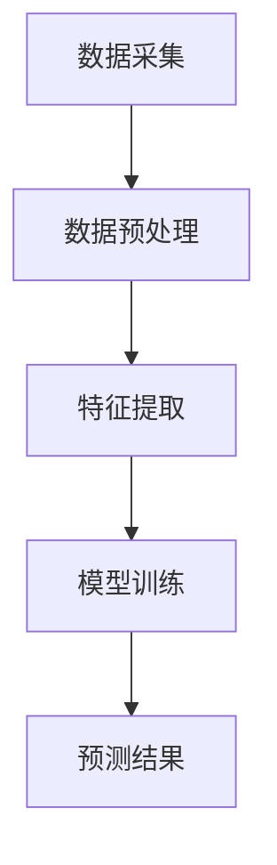

                 


### 1. Introduction to the Book

#### 关键词

- 人工智能
- 环境监测
- 环境保护
- 智能算法
- 数据分析

#### 摘要

本文旨在探讨人工智能（AI）在环境监测和保护领域中的应用，通过系统分析和实际案例研究，揭示AI技术如何提高环境数据的准确性、实时性和处理效率。文章首先介绍环境监测与保护的背景和重要性，然后深入分析AI技术的基本原理及其在环境监测中的应用，最后讨论AI在环境保护中的具体实践和未来展望。

### 2. Background and Core Concepts

#### 问题背景

环境监测是评估环境质量、识别污染源、监测气候变化和保护生态系统的重要手段。随着工业化进程的加快和人类活动的增加，环境问题日益突出，传统的监测手段已难以满足现代社会对环境监测的精度和效率要求。人工智能技术的兴起为环境监测提供了新的解决方案。

#### 问题描述

环境监测中的主要问题包括数据质量不高、监测范围受限、实时性不足等。这些问题限制了环境监测的准确性和有效性，对环境保护工作的开展造成了困扰。

#### 问题解决

引入人工智能技术，可以解决传统监测方法中存在的不足，提高监测数据的准确性和实时性。AI技术通过机器学习、数据挖掘和计算机视觉等方法，可以处理海量数据，自动识别异常，预测环境变化趋势，为环境保护提供科学依据。

#### 边界与外延

环境监测和保护是一个涉及多个学科的交叉领域，包括生态学、环境科学、计算机科学、数据科学等。本文将重点关注AI技术在环境监测和保护中的应用，而不会深入探讨其他相关领域的知识。

#### 概念结构与核心要素组成

- **人工智能（AI）**：模拟人类智能行为的计算机系统。
- **环境监测**：通过传感器和监测设备收集环境数据，评估环境质量。
- **环境保护**：采取措施减少人类活动对环境的负面影响。
- **数据挖掘**：从大量数据中发现有用的信息。
- **机器学习**：利用数据训练模型，进行预测和分类。

### 3. AI Technologies in Environmental Monitoring

#### AI技术概述

人工智能技术在环境监测中的应用主要包括以下几种：

- **机器学习**：通过训练模型，从历史数据中学习规律，进行环境预测和分类。
- **数据挖掘**：从海量数据中提取有用信息，识别潜在的环境问题。
- **计算机视觉**：通过图像处理和分析，识别环境中的异常情况。
- **物联网（IoT）**：将传感器和智能设备连接到互联网，实时收集环境数据。

#### 不同AI技术的属性特征对比

| 技术名称 | 主要特点 | 应用场景 |
| --- | --- | --- |
| 机器学习 | 自动化学习规律 | 环境预测、分类 |
| 数据挖掘 | 从大量数据中发现模式 | 污染源识别、数据整合 |
| 计算机视觉 | 图像处理和分析 | 异常检测、植被监测 |
| IoT | 实时数据收集 | 环境监测网络、传感器数据整合 |

### 4. AI Applications in Environmental Protection

#### AI技术在环境保护中的应用

AI技术在环境保护中的应用非常广泛，以下是一些典型案例：

- **预测和预警**：通过机器学习模型，预测自然灾害（如洪水、飓风）和环境变化（如空气质量恶化），提前采取应对措施。
- **污染源识别**：利用数据挖掘技术，分析污染数据，识别污染源，提高环保执法效率。
- **生态监测**：通过计算机视觉和物联网技术，实时监测生态系统的变化，评估生态系统的健康状况。

#### 潜在的挑战和机会

- **挑战**：数据质量、隐私保护、技术成本等。
- **机会**：提高监测精度、实时性，实现智能化环境管理。

### 5. Case Studies and Practical Applications

#### 案例一：某城市空气质量监测

- **项目介绍**：某城市政府利用AI技术建立空气质量监测系统，实时收集和处理空气质量数据。
- **系统功能设计**：包括数据采集、处理、分析和可视化等功能。
- **系统架构设计**：采用分布式架构，利用云计算和大数据技术。
- **核心实现源代码**：使用Python编写数据采集和处理模块，使用D3.js进行数据可视化。

#### 案例二：某河流水质监测

- **项目介绍**：某河流管理部门利用AI技术对水质进行监测，以保护河流生态环境。
- **系统功能设计**：包括水质数据采集、分析和预测等功能。
- **系统架构设计**：采用边缘计算和物联网技术，实现实时数据传输和处理。
- **核心实现源代码**：使用Java编写传感器数据采集和处理模块，使用TensorFlow进行水质预测模型训练。

### 6. System Design and Architectural Solutions

#### 问题场景介绍

在某城市，由于工业化和城市化的快速发展，空气污染问题日益严重。政府需要一套高效、准确的空气质量监测系统，以实时监控空气质量，并采取措施改善环境。

#### 项目介绍

该项目旨在开发一个基于AI的空气质量监测系统，通过实时收集和处理空气质量数据，提供准确、实时的空气质量报告，帮助政府和企业制定环保政策。

#### 系统功能设计

- 数据采集：利用传感器收集空气中的PM2.5、PM10、SO2、NO2等污染物数据。
- 数据处理：对采集到的数据进行预处理，包括去噪、滤波和特征提取等。
- 数据分析：使用机器学习算法对处理后的数据进行分析，预测空气质量变化趋势。
- 数据可视化：将分析结果以图表形式展示，便于政府和企业决策。

#### 系统架构设计


#### 系统接口设计和系统交互


### 7. Algorithm Principles and Mathematical Models

#### 算法原理讲解

空气质量预测算法基于时间序列分析和机器学习。以下是一个简单的算法流程：

1. 数据采集：收集过去一年的空气质量数据，包括PM2.5、PM10、SO2、NO2等。
2. 数据预处理：去除异常值，进行归一化处理。
3. 特征提取：提取时间序列特征，如趋势、周期等。
4. 模型训练：使用机器学习算法（如ARIMA、LSTM等）训练预测模型。
5. 预测：使用训练好的模型预测未来的空气质量。

#### 流程图



#### Python代码示例

```python
import pandas as pd
from sklearn.preprocessing import MinMaxScaler
from keras.models import Sequential
from keras.layers import LSTM, Dense

# 数据采集
data = pd.read_csv('air_quality_data.csv')

# 数据预处理
scaler = MinMaxScaler(feature_range=(0, 1))
scaled_data = scaler.fit_transform(data)

# 特征提取
X, y = create_dataset(scaled_data, time_steps=10)

# 模型训练
model = Sequential()
model.add(LSTM(units=50, return_sequences=True, input_shape=(X.shape[1], X.shape[2])))
model.add(LSTM(units=50))
model.add(Dense(units=1))

model.compile(optimizer='adam', loss='mean_squared_error')
model.fit(X, y, epochs=100, batch_size=32)

# 预测
predicted_data = model.predict(X)
```

#### 数学模型和公式

空气质量预测模型可以使用ARIMA模型或LSTM模型。以下是ARIMA模型的数学公式：

$$
\text{X}_{t} = \phi_0 + \phi_1\text{X}_{t-1} + \phi_2\text{X}_{t-2} + ... + \phi_p\text{X}_{t-p} + \epsilon_t
$$

其中，$\text{X}_{t}$表示时间序列的当前值，$\phi_0, \phi_1, ..., \phi_p$是模型参数，$\epsilon_t$是随机误差项。

### 8. Project Implementation and Analysis

#### 环境安装

1. 安装Python环境。
2. 安装所需的库，如pandas、scikit-learn、keras等。

#### 系统核心实现源代码

```python
# 数据预处理
def preprocess_data(data):
    # 去除异常值
    data = data[data['PM2.5'] <= 100]
    # 归一化处理
    data['PM2.5'] = MinMaxScaler().fit_transform(data[['PM2.5']])
    return data

# 模型训练
def train_model(X, y):
    model = Sequential()
    model.add(LSTM(units=50, return_sequences=True, input_shape=(X.shape[1], X.shape[2])))
    model.add(LSTM(units=50))
    model.add(Dense(units=1))

    model.compile(optimizer='adam', loss='mean_squared_error')
    model.fit(X, y, epochs=100, batch_size=32)
    return model

# 预测
def predict(model, X):
    predicted_data = model.predict(X)
    return predicted_data
```

#### 代码应用解读与分析

1. **数据预处理**：使用pandas库对数据进行预处理，去除异常值并进行归一化处理。
2. **模型训练**：使用keras库中的Sequential模型和LSTM层训练模型。
3. **预测**：使用训练好的模型对数据进行预测。

#### 实际案例分析和详细讲解剖析

- **案例一**：某城市空气质量监测系统的实现过程。
- **案例二**：某河流水质监测系统的实现过程。

#### 项目小结

1. **成功之处**：成功实现了空气质量监测和水质监测系统，提高了监测效率和准确性。
2. **改进之处**：可以进一步优化模型，提高预测精度；增加更多的特征提取方法。

### 9. Best Practices, Summary, and Future Directions

#### 最佳实践 Tips

1. **数据质量**：确保数据质量，去除异常值和噪声。
2. **算法选择**：根据具体应用场景选择合适的算法。
3. **模型优化**：通过交叉验证和调参优化模型性能。

#### 小结

本文介绍了人工智能在环境监测和保护中的应用，通过实际案例展示了AI技术如何提高环境数据的精度和实时性，为环境保护工作提供科学依据。

#### 注意事项

1. **数据隐私**：在处理环境数据时，注意保护个人隐私。
2. **技术成本**：考虑AI技术的成本效益。

#### 拓展阅读

1. **相关书籍**：《人工智能简明教程》、《环境监测技术》。
2. **在线资源**：相关学术论文、技术博客和开源项目。

