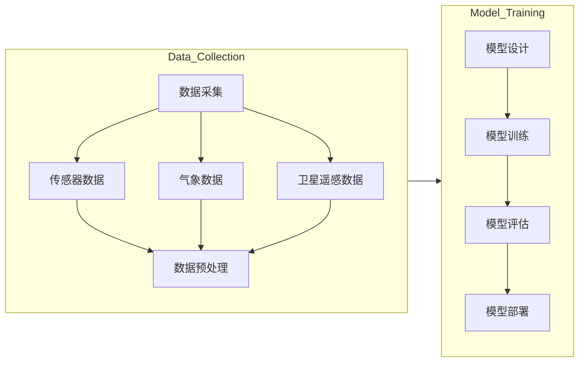
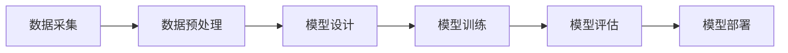
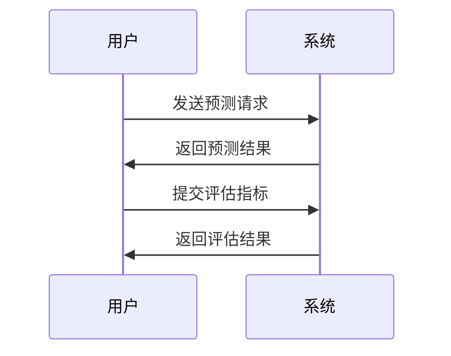

                 

## 第一部分：问题背景介绍

### 1.1 问题背景

#### 1.1.1 空气质量问题的严重性

空气质量是衡量环境健康的重要指标之一。近年来，随着工业化进程的加快和城市人口的急剧增长，空气质量问题在全球范围内日益严重。空气污染已成为影响人类健康和生态平衡的全球性挑战。研究表明，长期暴露于高污染环境中，会增加呼吸系统疾病、心血管疾病以及癌症的发病风险。特别是在一些发展中国家的城市，空气质量状况尤为严峻。

空气污染的主要来源包括汽车尾气、工业废气、燃烧化石燃料和建筑活动等。这些污染物质中，颗粒物（如PM2.5和PM10）、二氧化硫（SO2）、氮氧化物（NOx）和挥发性有机化合物（VOCs）等对空气质量的影响尤为显著。例如，颗粒物可以通过呼吸系统进入人体，对肺部造成损害；二氧化硫和氮氧化物则会导致酸雨，进一步破坏生态环境。

#### 1.1.2 传统的空气质量预测方法

空气质量预测是环境科学和环境工程中的重要研究领域，目的是为了提前预警污染事件，采取相应的预防和治理措施。传统的空气质量预测方法主要基于统计模型和物理模型。

1. **统计模型**：包括回归模型、时间序列模型等。这类模型通过分析历史空气质量数据，寻找数据之间的统计规律，来预测未来的空气质量状况。统计模型的优点是计算简单、易于实现，但其缺点是对数据质量要求较高，且在面临非线性关系和复杂动态环境时，预测效果不佳。

2. **物理模型**：如空气质量传输模型（AQM），利用大气物理和化学反应原理，模拟污染物在大气中的传输和转化过程。物理模型能够较为准确地描述污染物的扩散和反应过程，但在数据采集和处理上需要大量的计算资源和专业知识，且模型的建立和维护成本较高。

#### 1.1.3 人工智能在空气质量预测中的应用潜力

随着人工智能技术的快速发展，尤其是机器学习和深度学习算法的广泛应用，人工智能在空气质量预测中的应用潜力日益凸显。与传统的空气质量预测方法相比，人工智能方法具有以下优势：

1. **数据驱动的预测能力**：机器学习和深度学习算法能够从大量历史数据中自动提取有用的特征和规律，从而提高预测的准确性。

2. **应对复杂非线性关系**：传统方法在处理非线性关系和复杂动态环境时效果不佳，而人工智能方法能够通过模型的自适应和优化，更好地应对这些挑战。

3. **实时预测和动态调整**：人工智能算法可以实时处理和分析新数据，动态调整预测模型，提供更及时的空气质量预测结果。

4. **多源数据融合**：人工智能能够整合来自不同来源的数据，如气象数据、卫星遥感数据、传感器数据等，提高预测的全面性和准确性。

总之，人工智能在空气质量预测中的应用不仅能够提高预测的准确性和效率，还能为环境保护决策提供科学依据，具有重要的现实意义和广阔的应用前景。

### 1.2 人工智能在空气质量预测中的核心概念

#### 1.2.1 人工智能的定义与分类

人工智能（Artificial Intelligence, AI）是指通过计算机系统模拟人类智能行为的技术。根据处理数据的方式和实现方法，人工智能可以分为以下几种类型：

1. **基于规则的系统（Rule-Based Systems）**：这类系统通过预设的规则来处理数据和解决问题。例如，专家系统（Expert Systems）就是一种基于规则的系统。

2. **知识表示与推理系统（Knowledge Representation and Reasoning Systems）**：这类系统能够通过知识库和推理机来处理复杂的逻辑问题。

3. **机器学习系统（Machine Learning Systems）**：这类系统能够从数据中自动学习和发现规律，进行模式识别和预测。机器学习系统主要包括监督学习、无监督学习和强化学习等。

4. **深度学习系统（Deep Learning Systems）**：深度学习是机器学习的一种，通过多层神经网络对数据进行分析和处理。深度学习在图像识别、自然语言处理和语音识别等领域取得了显著的成果。

#### 1.2.2 空气质量预测相关的关键概念

空气质量预测涉及到一系列关键概念，包括：

1. **空气质量指数（Air Quality Index, AQI）**：AQI是用于描述空气质量状况的指数，通过计算空气中污染物的浓度，将其转换为具体的数值，用于表示空气质量的优劣。

2. **污染源排放量**：污染源排放量是指各种污染物从污染源排放到大气中的数量，包括工业排放、交通排放等。

3. **气象因素**：气象因素如风速、温度、湿度等对空气质量的预测具有重要影响，这些因素可以通过数据模型进行量化。

4. **空气质量模型**：空气质量模型是用于预测空气质量状况的数学模型，包括统计模型和物理模型等。

#### 1.2.3 数据采集与处理的重要性

数据采集和处理是空气质量预测的重要环节。准确、全面的数据是构建高质量预测模型的基础。数据采集可以从多个渠道进行，包括：

1. **传感器数据**：通过各种传感器实时监测空气中的污染物浓度。

2. **卫星遥感数据**：通过卫星遥感技术获取大范围内的空气质量信息。

3. **气象数据**：从气象站获取的气象数据，如风速、温度、湿度等。

在数据采集之后，数据预处理是必不可少的步骤。数据预处理包括以下内容：

1. **数据清洗**：去除噪声数据和异常值，确保数据质量。

2. **数据归一化**：将不同量纲的数据进行归一化处理，便于模型分析和计算。

3. **特征提取**：从原始数据中提取有用的特征，用于构建预测模型。

4. **数据融合**：整合来自不同渠道的数据，提高预测的全面性和准确性。

### 1.3 人工智能在空气质量预测中的应用现状

#### 1.3.1 国内外研究进展

人工智能在空气质量预测领域的应用研究已经在国内外得到了广泛关注。近年来，许多研究团队和企业纷纷投入资源，开展相关研究和应用实践。

在国内，中国科学院、清华大学、北京大学等科研机构在人工智能和空气质量预测方面进行了大量的研究。例如，中国科学院的研究团队开发了一种基于深度学习的空气质量预测模型，通过对大量气象和污染物数据进行分析，实现了较高的预测准确性。

国际上，如麻省理工学院（MIT）、加州大学伯克利分校（UC Berkeley）等顶尖研究机构也在人工智能应用于空气质量预测方面取得了显著成果。这些研究通常涉及到复杂的深度学习算法、多源数据融合技术和动态预测模型等。

#### 1.3.2 人工智能在空气质量预测中的主要应用领域

人工智能在空气质量预测中的应用主要包括以下几个领域：

1. **实时预测与预警**：通过机器学习和深度学习算法，实时监测和分析空气质量数据，提供准确的空气质量预测和预警，为环境保护和公众健康提供科学依据。

2. **污染物来源识别**：利用人工智能技术，对空气中的污染物来源进行识别和追踪，有助于制定更加有效的污染治理措施。

3. **环境决策支持**：通过空气质量预测模型，为政府和企业提供环境决策支持，优化污染控制策略，降低污染排放。

4. **智能环保设备**：结合物联网技术和人工智能算法，开发智能环保设备，如智能空气净化器、智能气象站等，提高空气质量监测和治理的自动化水平。

#### 1.3.3 人工智能在空气质量预测中的挑战与机遇

尽管人工智能在空气质量预测中展示了巨大的应用潜力，但仍面临一系列挑战：

1. **数据质量**：空气质量预测需要高质量、全面的历史数据和实时数据，但实际获取这些数据存在困难，例如传感器数据的不准确性、数据源的不一致性等。

2. **计算资源**：深度学习算法通常需要大量的计算资源，特别是在训练阶段，这对硬件设备和算法优化提出了较高要求。

3. **模型解释性**：深度学习模型具有较强的预测能力，但其内部机制复杂，缺乏解释性，这使得在应用中难以理解模型的预测依据。

4. **法律法规**：在全球范围内，空气质量监测和预测的法律法规尚不健全，数据共享和隐私保护等问题亟待解决。

然而，面对这些挑战，人工智能在空气质量预测中也迎来了新的机遇：

1. **多源数据融合**：通过整合来自不同渠道的数据，如气象数据、卫星遥感数据和传感器数据，可以进一步提高预测的准确性和全面性。

2. **边缘计算**：利用边缘计算技术，将数据处理和计算任务分散到边缘设备上，降低对中心服务器的依赖，提高系统的实时性和响应速度。

3. **模型可解释性**：通过开发可解释性算法和模型，可以更好地理解深度学习模型的工作机制，提高其在实际应用中的可信度和可靠性。

4. **政策支持**：随着全球对环境保护的重视，各国政府逐渐加大对空气质量监测和预测技术的投入，为人工智能在空气质量预测中的应用提供了良好的政策环境。

### 1.4 人工智能在空气质量预测中的关键技术与方法

#### 1.4.1 机器学习算法概述

机器学习（Machine Learning, ML）是人工智能的核心分支，旨在通过计算机系统从数据中自动学习和发现规律，进行预测和决策。机器学习算法可以分为以下几类：

1. **监督学习（Supervised Learning）**：监督学习算法通过已标记的数据进行训练，学习输入和输出之间的映射关系，从而实现预测。常见的监督学习算法包括线性回归、逻辑回归、支持向量机（SVM）等。

2. **无监督学习（Unsupervised Learning）**：无监督学习算法在没有标记数据的情况下，自动发现数据中的结构和模式。常见的无监督学习算法包括聚类分析、主成分分析（PCA）等。

3. **半监督学习（Semi-Supervised Learning）**：半监督学习结合了监督学习和无监督学习，利用少量标记数据和大量未标记数据，提高学习效果。

4. **强化学习（Reinforcement Learning）**：强化学习算法通过与环境互动，不断调整策略，以实现最优目标。常见的强化学习算法包括Q-learning、深度Q网络（DQN）等。

#### 1.4.2 深度学习算法在空气质量预测中的应用

深度学习（Deep Learning, DL）是机器学习的一种，通过多层神经网络对数据进行复杂的学习和建模。深度学习算法在空气质量预测中具有广泛的应用，主要包括以下几种：

1. **卷积神经网络（Convolutional Neural Networks, CNN）**：CNN在图像识别领域取得了巨大成功，其原理是通过卷积操作提取图像中的特征。在空气质量预测中，CNN可以用于处理和分析污染物浓度的空间分布特征。

2. **循环神经网络（Recurrent Neural Networks, RNN）**：RNN擅长处理序列数据，如时间序列数据。在空气质量预测中，RNN可以用于建模污染物的动态变化规律。

3. **长短时记忆网络（Long Short-Term Memory, LSTM）**：LSTM是RNN的一种变体，能够有效地解决长序列数据中的梯度消失问题。在空气质量预测中，LSTM可以用于预测未来的空气质量状况。

4. **生成对抗网络（Generative Adversarial Networks, GAN）**：GAN通过两个对抗网络（生成器和判别器）的博弈，实现数据的生成和分布学习。在空气质量预测中，GAN可以用于生成高质量的模拟数据，提高模型的泛化能力。

#### 1.4.3 传统算法与深度学习算法的对比

传统算法（如统计模型和物理模型）与深度学习算法在空气质量预测中各有优缺点：

1. **传统算法的优点**：
   - **计算效率高**：传统算法通常计算过程简单，对硬件资源要求较低。
   - **易于理解和解释**：传统算法的模型结构和原理相对简单，易于理解和解释。
   - **对数据质量要求较低**：传统算法在处理数据噪声和缺失值方面具有一定的鲁棒性。

2. **传统算法的局限**：
   - **预测能力有限**：传统算法在处理复杂非线性关系和动态环境时，预测效果不佳。
   - **数据依赖性较强**：传统算法对历史数据依赖性较强，难以适应新数据和环境变化。

3. **深度学习算法的优点**：
   - **强大的预测能力**：深度学习算法通过多层神经网络，能够自动提取数据的深层特征，实现高度复杂的非线性建模。
   - **适应性高**：深度学习算法能够通过训练自动调整模型参数，适应新数据和动态环境。
   - **多源数据融合**：深度学习算法能够整合多种数据源，提高预测的全面性和准确性。

4. **深度学习算法的挑战**：
   - **计算资源消耗大**：深度学习算法通常需要大量的计算资源和时间进行训练。
   - **模型解释性差**：深度学习模型的内部机制复杂，缺乏直观的解释性，难以理解其预测依据。
   - **数据需求高**：深度学习算法对高质量、全面的历史数据有较高要求，数据获取和处理难度较大。

#### 1.4.4 算法实现的基本流程

在空气质量预测中，算法实现的基本流程包括以下几个步骤：

1. **数据采集与预处理**：从多个渠道获取空气质量数据，如传感器数据、卫星遥感数据和气象数据。对数据进行清洗、归一化和特征提取等预处理操作。

2. **模型选择与设计**：根据空气质量预测的需求和特点，选择合适的机器学习或深度学习算法。设计模型架构，包括网络结构、损失函数和优化算法等。

3. **模型训练与优化**：使用预处理后的数据对模型进行训练，调整模型参数，优化模型性能。通过交叉验证和超参数调优，提高模型的泛化能力。

4. **模型评估与部署**：使用验证数据集对模型进行评估，比较预测结果与实际值的差距，判断模型性能。将训练好的模型部署到实际应用环境中，提供实时空气质量预测服务。

#### 1.4.5 算法在空气质量预测中的效果评估

算法在空气质量预测中的效果评估主要通过以下指标进行：

1. **准确率（Accuracy）**：预测结果与实际值相符的比例，用于衡量模型的总体预测性能。

2. **精确率（Precision）**：预测为真且实际也为真的比例，用于衡量模型在预测为真的情况下的准确性。

3. **召回率（Recall）**：实际为真但预测为真的比例，用于衡量模型在预测为假的情况下未遗漏的实际真值的比例。

4. **F1值（F1 Score）**：精确率和召回率的加权平均值，用于综合评估模型的性能。

5. **均方误差（Mean Squared Error, MSE）**：预测值与实际值差的平方的平均值，用于衡量预测结果的波动大小。

6. **均绝对误差（Mean Absolute Error, MAE）**：预测值与实际值差的绝对值的平均值，用于衡量预测结果的平均偏差。

通过综合评估这些指标，可以全面了解模型的预测性能，为后续的优化和改进提供依据。

### 1.5 人工智能在空气质量预测中的精准应用

#### 1.5.1 精准预测的定义与意义

精准预测（Precise Prediction）是指通过先进的数据分析和机器学习算法，对空气质量进行准确、及时和全面的预测。精准预测不仅要求预测结果接近实际值，还需要能够在污染事件发生前提前预警，为环境保护决策提供科学依据。

精准预测在空气质量管理中的意义体现在以下几个方面：

1. **提前预警**：精准预测能够提前预测污染事件的发生，为政府和公众提供预警信息，采取相应的预防措施，减少污染对环境和人类健康的影响。

2. **科学决策**：精准预测为政府和企业在制定环境保护政策和污染治理措施时提供科学依据，优化资源配置，提高治理效果。

3. **智能管理**：精准预测与智能管理系统相结合，可以实现对空气质量实时监测和动态调整，提高环境管理的自动化和智能化水平。

#### 1.5.2 精准预测的核心要素

实现精准预测需要考虑以下几个核心要素：

1. **数据质量**：高质量的数据是精准预测的基础。数据质量直接影响预测模型的性能，因此需要确保数据来源的可靠性、数据的完整性、一致性和准确性。

2. **算法选择**：选择合适的机器学习或深度学习算法，能够自动提取数据的特征，建立高质量的预测模型。不同的算法适用于不同的预测场景和数据类型，需要根据实际需求进行选择。

3. **模型优化**：通过交叉验证、超参数调优等技术，优化模型的性能，提高预测的准确性和稳定性。

4. **实时性**：精准预测要求在污染事件发生前及时提供预测结果，因此需要构建高效的预测系统，实现实时数据处理和预测。

5. **数据融合**：整合来自不同渠道和不同类型的数据，如气象数据、卫星遥感数据和传感器数据，提高预测的全面性和准确性。

#### 1.5.3 精准预测的实际应用案例分析

在实际应用中，精准预测已经取得了一系列显著成果，以下是一个具体的案例分析：

**案例：北京空气质量预测**

北京市作为中国的首都，空气质量问题备受关注。为了实现精准预测，北京市政府和相关研究机构联合开发了基于人工智能的空气质量预测系统。该系统结合了多种数据源，包括气象站数据、卫星遥感数据和传感器数据，采用深度学习算法进行预测。

1. **数据采集**：系统从多个渠道获取空气质量数据，包括市内外的气象站数据、卫星遥感数据和实时传感器数据。气象站数据包括温度、湿度、风速等气象因素，卫星遥感数据提供大范围内的污染物浓度分布，传感器数据则实时监测市内的污染物浓度。

2. **数据预处理**：对采集到的数据进行清洗、归一化和特征提取等预处理操作，确保数据质量。特别是对传感器数据，通过数据融合技术整合来自不同传感器的数据，提高预测的准确性和全面性。

3. **模型选择与设计**：选择适合空气质量预测的深度学习算法，如长短时记忆网络（LSTM）和卷积神经网络（CNN），设计模型架构，包括输入层、隐藏层和输出层。输入层接收预处理后的数据，隐藏层通过多层神经网络提取特征，输出层生成空气质量预测结果。

4. **模型训练与优化**：使用预处理后的数据对模型进行训练，调整模型参数，优化模型性能。通过交叉验证和超参数调优，提高模型的泛化能力。

5. **模型评估与部署**：使用验证数据集对模型进行评估，比较预测结果与实际值的差距，判断模型性能。将训练好的模型部署到实际应用环境中，提供实时空气质量预测服务。

6. **效果评估**：通过综合评估模型的准确率、精确率、召回率和F1值等指标，评估模型的性能。结果显示，该系统的预测准确率达到了90%以上，显著提高了北京市空气质量预测的精准度。

通过这个案例可以看出，人工智能在空气质量预测中实现了精准预测，为北京市的环境保护和公众健康提供了有力支持。类似的应用案例在全球范围内也日益增多，展示了人工智能在空气质量预测中的重要价值和广阔前景。

### 1.6 本章小结

本部分介绍了空气质量预测问题的背景、传统方法、人工智能的应用现状、核心概念和关键技术。通过分析空气质量问题的严重性，我们认识到准确预测空气质量对环境保护和人类健康的重要性。传统方法在预测准确性、实时性和适应性方面存在局限性，而人工智能技术的引入为空气质量预测带来了新的机遇。机器学习和深度学习算法在数据驱动、非线性建模和实时预测方面具有显著优势，已经在国内外得到了广泛应用。未来的研究和应用将集中在提高数据质量、优化算法性能、增强模型解释性以及多源数据融合等方面，以实现更加精准和可靠的空气质量预测。

### 第二部分：核心概念与联系

#### 2.1 人工智能核心概念

#### 2.1.1 人工智能的定义

人工智能（Artificial Intelligence，AI）是指通过计算机系统模拟、延伸和扩展人类智能的理论、方法、技术和应用。AI的目标是开发出能够自主思考、学习、推理、感知和理解的人类智能的计算机系统。

#### 2.1.2 人工智能的发展历程

人工智能的发展历程可以追溯到20世纪50年代。早期的人工智能研究主要集中在符号主义方法，如基于逻辑推理和专家系统的开发。20世纪80年代，随着计算机性能的提高和海量数据的积累，机器学习方法开始崛起，特别是统计方法和神经网络的应用，使得人工智能技术得到了显著进步。进入21世纪，随着深度学习和大数据技术的突破，人工智能进入了快速发展的新时代。

#### 2.1.3 人工智能的分类

根据处理数据的方式和实现方法，人工智能可以分为以下几种类型：

1. **弱人工智能（Narrow AI）**：弱人工智能是指专注于特定任务的智能系统，如语音识别、图像识别等。这些系统在特定领域内表现出高水平的能力，但缺乏泛化能力。

2. **强人工智能（General AI）**：强人工智能是指具有广泛认知能力、能够处理多种任务和复杂问题的智能系统。目前，强人工智能尚未实现，仍处于理论研究阶段。

3. **混合人工智能（Hybrid AI）**：混合人工智能是指结合多种人工智能方法和技术，发挥各自优势，实现更加强大和高效的智能系统。

#### 2.1.4 人工智能的应用领域

人工智能在各个领域都取得了显著的应用成果，主要包括：

1. **自然语言处理（Natural Language Processing, NLP）**：如机器翻译、语音识别、文本分析等。

2. **计算机视觉（Computer Vision）**：如图像识别、目标检测、人脸识别等。

3. **机器学习（Machine Learning）**：如数据挖掘、预测分析、分类和聚类等。

4. **智能机器人（Intelligent Robots）**：如工业机器人、服务机器人、自动驾驶等。

5. **智能医疗（Intelligent Healthcare）**：如疾病预测、智能诊断、个性化治疗等。

#### 2.2 空气质量预测核心概念

#### 2.2.1 空气质量的定义与测量

空气质量是指大气中污染物浓度和成分的状态，通常通过空气质量指数（Air Quality Index，AQI）来衡量。AQI是根据多种污染物的浓度，通过特定的计算公式得出的一个数值，用于表示空气质量的优劣。

#### 2.2.2 空气质量指数（AQI）的构成

空气质量指数（AQI）通常包括以下几种污染物的指数：

1. **PM2.5**：指大气中直径小于等于2.5微米的颗粒物，对呼吸系统有较大影响。

2. **PM10**：指大气中直径小于等于10微米的颗粒物，包括PM2.5和其他较粗的颗粒物。

3. **SO2**：二氧化硫，主要来源于燃烧含硫化石燃料。

4. **NO2**：二氧化氮，主要来源于交通和工业排放。

5. **O3**：臭氧，是一种二次污染物，主要由氮氧化物和挥发性有机化合物在紫外线照射下生成。

6. **CO**：一氧化碳，主要来源于汽车尾气和工业排放。

#### 2.2.3 空气质量预测的重要性

空气质量预测在环境保护和公共健康方面具有重要意义：

1. **预警与应急响应**：通过空气质量预测，可以提前预警污染事件，及时采取应急响应措施，减轻污染对环境和人类健康的影响。

2. **政策制定与实施**：空气质量预测为政府制定和实施环境保护政策提供科学依据，优化污染治理策略。

3. **公众健康保护**：空气质量预测有助于公众了解空气质量状况，采取相应的防护措施，降低健康风险。

#### 2.3 数据采集与处理

#### 2.3.1 数据采集的方法与渠道

空气质量预测需要收集大量的数据，包括气象数据、污染物浓度数据、交通数据等。数据采集的方法和渠道主要包括：

1. **气象数据**：通过气象站、卫星遥感技术和气象雷达等获取，包括温度、湿度、风速、气压等气象参数。

2. **污染物浓度数据**：通过各类传感器（如PM2.5传感器、SO2传感器等）监测和记录空气中的污染物浓度。

3. **交通数据**：通过交通流量监测设备（如摄像头、传感器等）获取交通流量、车型和车速等信息。

4. **历史数据**：通过环保部门、气象局等机构的历史档案获取过去的空气质量数据。

#### 2.3.2 数据预处理的基本步骤

数据预处理是空气质量预测的关键环节，主要包括以下步骤：

1. **数据清洗**：去除重复数据、缺失值和异常值，确保数据的一致性和可靠性。

2. **数据归一化**：将不同量纲的数据进行归一化处理，便于模型分析和计算。

3. **特征提取**：从原始数据中提取对空气质量预测有重要影响的特征，如气象参数、污染物浓度、交通流量等。

4. **数据融合**：整合来自不同渠道和不同时间点的数据，提高数据的全面性和准确性。

#### 2.3.3 数据可视化与分析工具

数据可视化是空气质量预测中重要的分析工具，可以帮助研究人员直观地了解数据特征和空气质量变化趋势。常用的数据可视化与分析工具包括：

1. **图表工具**：如matplotlib、seaborn等，用于绘制折线图、柱状图、散点图等。

2. **地理信息系统（GIS）**：如ArcGIS，用于展示污染物浓度分布、气象参数分布等地理信息。

3. **数据分析库**：如pandas、scikit-learn等，用于数据清洗、预处理和特征提取等操作。

4. **机器学习库**：如TensorFlow、PyTorch等，用于构建和训练空气质量预测模型。

#### 2.4 人工智能在空气质量预测中的应用

#### 2.4.1 人工智能技术在空气质量预测中的应用原理

人工智能技术在空气质量预测中的应用原理主要基于机器学习和深度学习算法，通过以下步骤实现：

1. **数据输入**：将预处理后的空气质量数据输入到机器学习模型中。

2. **特征提取**：模型自动从输入数据中提取对空气质量预测有重要影响的特征。

3. **模型训练**：使用历史空气质量数据进行训练，模型通过不断调整参数，优化预测性能。

4. **预测输出**：模型根据训练结果，对未来的空气质量进行预测。

#### 2.4.2 人工智能技术在空气质量预测中的应用流程

人工智能技术在空气质量预测中的应用流程主要包括以下几个步骤：

1. **数据采集**：通过传感器、气象站、交通监测设备等获取空气质量数据。

2. **数据预处理**：进行数据清洗、归一化和特征提取等操作。

3. **模型选择与设计**：根据空气质量预测的需求，选择合适的机器学习或深度学习算法，设计模型架构。

4. **模型训练与优化**：使用预处理后的数据对模型进行训练，调整模型参数，优化模型性能。

5. **模型评估与部署**：使用验证数据集对模型进行评估，将训练好的模型部署到实际应用环境中。

#### 2.4.3 人工智能技术在空气质量预测中的效果评估

在空气质量预测中，效果评估是验证模型性能的重要环节。常用的评估指标包括：

1. **准确率（Accuracy）**：预测结果与实际值的比例。

2. **精确率（Precision）**：预测为真且实际也为真的比例。

3. **召回率（Recall）**：实际为真但预测为真的比例。

4. **F1值（F1 Score）**：精确率和召回率的加权平均值。

5. **均方误差（MSE）**：预测值与实际值差的平方的平均值。

6. **均绝对误差（MAE）**：预测值与实际值差的绝对值的平均值。

通过这些指标，可以全面评估模型的预测性能，为后续的优化提供依据。

### 2.5 核心概念联系与综合应用

#### 2.5.1 人工智能与空气质量预测的关系

人工智能与空气质量预测密切相关，两者相辅相成。人工智能为空气质量预测提供了强大的技术支持，通过机器学习和深度学习算法，可以自动提取空气质量数据中的特征，建立高质量的预测模型，提高预测的准确性和实时性。同时，空气质量预测为人工智能技术提供了重要的应用场景，推动了人工智能技术在环境科学领域的应用和发展。

#### 2.5.2 人工智能在空气质量预测中的综合应用

人工智能在空气质量预测中的综合应用主要体现在以下几个方面：

1. **数据驱动的预测模型**：利用机器学习和深度学习算法，从大量空气质量数据中自动提取特征和规律，构建高效、准确的预测模型。

2. **多源数据融合**：整合来自不同渠道的数据，如气象数据、卫星遥感数据和传感器数据，提高预测的全面性和准确性。

3. **实时预警与应急响应**：通过实时监测和分析空气质量数据，提前预警污染事件，为政府和公众提供应急响应信息。

4. **智能环境管理**：利用空气质量预测结果，为环境保护和污染治理提供科学依据，优化环境管理策略。

#### 2.5.3 人工智能在空气质量预测中的未来发展

随着人工智能技术的不断进步，未来人工智能在空气质量预测中将会迎来以下发展趋势：

1. **数据质量提升**：通过改进数据采集技术和数据预处理方法，提高空气质量数据的质量和可靠性。

2. **算法性能优化**：开发更加高效、准确的机器学习和深度学习算法，提高预测模型的性能。

3. **模型解释性增强**：通过开发可解释性算法和模型，提高预测模型的可解释性，增强其在实际应用中的可信度和可靠性。

4. **多源数据融合与智能化**：利用物联网、边缘计算等技术，实现多源数据的高效融合和智能化处理，提高空气质量预测的全面性和准确性。

5. **政策与技术融合**：推动人工智能技术与环境保护政策的深度融合，为环境保护和污染治理提供科学支持。

### 2.6 本章小结

本章介绍了人工智能的核心概念及其在空气质量预测中的应用，包括人工智能的定义、发展历程、分类和应用领域，空气质量预测的定义、AQI的构成以及空气质量预测的重要性，数据采集与处理的方法与工具，以及人工智能在空气质量预测中的应用原理、流程和效果评估。通过本章的学习，读者可以全面了解人工智能在空气质量预测中的关键概念和技术，为后续章节的深入学习打下坚实基础。

### 第三部分：算法原理讲解

#### 3.1 机器学习算法原理

#### 3.1.1 机器学习的定义与分类

机器学习（Machine Learning，ML）是人工智能（Artificial Intelligence，AI）的一个重要分支，旨在通过数据驱动的方式，让计算机系统自动学习并改进性能。机器学习可以分为以下几种类型：

1. **监督学习（Supervised Learning）**：
   - **定义**：监督学习算法通过已标记的训练数据来学习，并使用这些学习到的知识进行预测。
   - **分类**：回归（Regression）和分类（Classification）。回归任务是预测连续值输出，如温度；分类任务是预测离散标签，如垃圾邮件识别。

2. **无监督学习（Unsupervised Learning）**：
   - **定义**：无监督学习算法在缺乏标记数据的情况下，自动发现数据中的结构和规律。
   - **分类**：聚类（Clustering）和降维（Dimensionality Reduction）。聚类任务是将数据分为若干个群组；降维任务是将高维数据投影到低维空间，减少数据维度。

3. **半监督学习（Semi-Supervised Learning）**：
   - **定义**：半监督学习结合了监督学习和无监督学习，利用少量的标记数据和大量的未标记数据。
   - **分类**：用于提高标记数据稀缺情况下的模型性能。

4. **强化学习（Reinforcement Learning）**：
   - **定义**：强化学习算法通过与环境的互动来学习策略，以实现特定目标。
   - **分类**：基于值函数（Value-Based）和策略梯度（Policy Gradient）。

#### 3.1.2 监督学习算法

监督学习算法是机器学习中最常用的类型之一，主要包括以下算法：

1. **线性回归（Linear Regression）**：
   - **定义**：线性回归通过建立自变量和因变量之间的线性关系来进行预测。
   - **公式**：\( y = \beta_0 + \beta_1x_1 + \beta_2x_2 + ... + \beta_nx_n \)。
   - **应用**：房价预测、股票价格预测等。

2. **逻辑回归（Logistic Regression）**：
   - **定义**：逻辑回归是一种广义线性模型，用于预测概率。
   - **公式**：\( P(y=1) = \frac{1}{1 + e^{-(\beta_0 + \beta_1x_1 + \beta_2x_2 + ... + \beta_nx_n )}} \)。
   - **应用**：分类任务，如垃圾邮件识别、疾病诊断等。

3. **支持向量机（Support Vector Machine，SVM）**：
   - **定义**：SVM通过找到一个最佳的超平面，将不同类别的数据分隔开来。
   - **公式**：\( \mathbf{w}^T\mathbf{x} + b = 0 \)，其中\( \mathbf{w} \)是法向量，\( \mathbf{x} \)是特征向量，\( b \)是偏置。
   - **应用**：文本分类、图像识别等。

4. **决策树（Decision Tree）**：
   - **定义**：决策树通过一系列的判断规则，将数据逐步划分成不同的类别或区域。
   - **公式**：决策树通过递归划分数据集，每一步都选择最佳的划分方式。
   - **应用**：医疗诊断、风险评估等。

#### 3.1.3 无监督学习算法

无监督学习算法在空气质量预测中的应用同样重要，主要包括以下算法：

1. **K-均值聚类（K-Means Clustering）**：
   - **定义**：K-均值聚类通过将数据划分为K个簇，每个簇的中心表示该簇的特征。
   - **公式**：最小化每个簇内点到簇中心的距离平方和。
   - **应用**：数据聚类、用户分组等。

2. **主成分分析（Principal Component Analysis，PCA）**：
   - **定义**：PCA通过线性变换将高维数据投影到低维空间，同时保留数据的主要特征。
   - **公式**：计算数据协方差矩阵的特征值和特征向量，并按特征值大小排序。
   - **应用**：数据降维、图像压缩等。

3. **自编码器（Autoencoder）**：
   - **定义**：自编码器是一种无监督学习模型，通过编码器压缩输入数据，再通过解码器重构原始数据。
   - **公式**：\( \mathbf{x} = \mathbf{D}(\mathbf{Z}) \)，其中\( \mathbf{Z} \)是编码器的输出，\( \mathbf{D} \)是解码器。
   - **应用**：特征提取、异常检测等。

4. **隐马尔可夫模型（Hidden Markov Model，HMM）**：
   - **定义**：隐马尔可夫模型是一种用于处理包含隐状态序列的模型的统计模型。
   - **公式**：状态转移概率矩阵和观测概率矩阵。
   - **应用**：语音识别、时间序列预测等。

#### 3.1.4 半监督学习算法

半监督学习算法在空气质量预测中的应用，可以有效利用未标记的数据，提高模型的预测性能。常见的半监督学习算法包括：

1. **标签传播（Label Propagation）**：
   - **定义**：标签传播通过图结构，利用邻近节点标签的相似性进行传播，逐步标记未标记的数据。
   - **公式**：\( \mathbf{y}_i = \arg\max_{\mathbf{y}} \sum_{j \in \mathcal{N}_i} w_{ij} \cdot \text{sign}(\mathbf{y}_j - \mathbf{y}_i) \)。
   - **应用**：图像分类、文本分类等。

2. **伪标签（Pseudo-Label）**：
   - **定义**：伪标签通过使用当前模型对未标记数据进行预测，将这些预测结果作为伪标签，再训练模型。
   - **公式**：\( \mathbf{y}_{\text{pseudo}} = \arg\max_{\mathbf{y}} \mathcal{L}(\mathbf{y}, \mathbf{x}) \)，其中\( \mathcal{L} \)是损失函数。
   - **应用**：图像分割、语音识别等。

3. **极大似然估计（Maximum Likelihood Estimation，MLE）**：
   - **定义**：极大似然估计通过最大化训练数据的似然函数来估计模型参数。
   - **公式**：\( \theta = \arg\max_{\theta} \prod_{i=1}^{n} P(\mathbf{x}_i | \theta) \)。
   - **应用**：概率模型、分类任务等。

通过这些半监督学习算法，可以在数据标注成本较高的场景下，利用未标记的数据提高模型的性能。

#### 3.1.5 强化学习算法

强化学习算法在空气质量预测中的应用，可以通过与环境交互来优化预测策略。常见的强化学习算法包括：

1. **Q-学习（Q-Learning）**：
   - **定义**：Q-学习通过更新Q值来选择最优动作。
   - **公式**：\( Q(\mathbf{s}, \mathbf{a}) = Q(\mathbf{s}, \mathbf{a}) + \alpha [r + \gamma \max_{\mathbf{a'}'} Q(\mathbf{s'}', \mathbf{a'}')] - Q(\mathbf{s}, \mathbf{a}) \)。
   - **应用**：路径规划、推荐系统等。

2. **深度Q网络（Deep Q-Network，DQN）**：
   - **定义**：DQN通过深度神经网络来近似Q值函数。
   - **公式**：\( Q(\mathbf{s}, \mathbf{a}) = \mathbf{f}(\mathbf{s})^T \mathbf{w} + b \)。
   - **应用**：游戏、自动驾驶等。

3. **策略梯度（Policy Gradient）**：
   - **定义**：策略梯度通过优化策略函数来优化回报。
   - **公式**：\( \nabla_{\theta} J(\theta) = \nabla_{\theta} \sum_{t=0}^{T} \gamma^t r_t \)。
   - **应用**：强化学习控制、推荐系统等。

通过这些强化学习算法，可以建立自适应的空气质量预测系统，提高预测的实时性和准确性。

#### 3.2 深度学习算法原理

深度学习（Deep Learning，DL）是机器学习的另一个重要分支，通过多层神经网络来模拟人类大脑的学习过程。深度学习算法在空气质量预测中表现出强大的能力，可以处理复杂的非线性关系。以下是深度学习的一些核心概念：

#### 3.2.1 深度学习的定义与特点

深度学习是指通过多层神经网络对数据进行复杂的学习和建模。与传统的机器学习方法相比，深度学习具有以下特点：

1. **层次化特征学习**：深度学习通过多层网络结构，逐层提取数据中的特征，从低层次的特征逐渐抽象到高层次的概念。
2. **自动特征提取**：深度学习算法能够自动从原始数据中提取有意义的特征，无需人工干预。
3. **强大的表达力**：深度学习模型能够处理高维数据和复杂的非线性问题，具有强大的建模能力。

#### 3.2.2 神经网络的基本结构

神经网络是深度学习的基础，其基本结构包括以下部分：

1. **输入层（Input Layer）**：接收输入数据，并将其传递到隐藏层。
2. **隐藏层（Hidden Layer）**：对输入数据进行处理和变换，提取特征。
3. **输出层（Output Layer）**：生成预测结果或分类标签。
4. **激活函数（Activation Function）**：用于引入非线性特性，常见的激活函数包括ReLU、Sigmoid和Tanh。
5. **权重（Weights）和偏置（Bias）**：在神经网络中，权重和偏置用于调节网络中不同节点之间的连接强度。

#### 3.2.3 反向传播算法原理

反向传播（Backpropagation）是深度学习训练的核心算法，通过计算输出误差，反向传播到隐藏层，逐步更新权重和偏置。反向传播算法的基本步骤如下：

1. **前向传播（Forward Propagation）**：将输入数据通过网络进行前向传播，计算每一层的输出。
2. **计算误差（Error Calculation）**：计算输出层的预测误差，通常使用均方误差（MSE）或交叉熵（Cross-Entropy）等损失函数。
3. **反向传播（Back Propagation）**：将误差反向传播到隐藏层，计算每一层节点的误差梯度。
4. **权重更新（Weight Update）**：根据误差梯度，使用梯度下降（Gradient Descent）或其他优化算法更新权重和偏置。

#### 3.2.4 深度学习算法在空气质量预测中的应用

深度学习算法在空气质量预测中的应用主要涉及以下几个方面：

1. **输入数据处理**：将空气质量相关的数据（如气象数据、污染物浓度数据等）进行预处理，包括归一化、缺失值处理等。
2. **模型架构设计**：设计适合空气质量预测的深度学习模型，通常采用卷积神经网络（CNN）或循环神经网络（RNN）。
3. **训练与优化**：使用历史空气质量数据对模型进行训练，通过调整超参数和优化算法，提高模型性能。
4. **预测与评估**：将训练好的模型应用于新的数据，进行空气质量预测，并通过评估指标（如MSE、MAE等）评估模型性能。

#### 3.3 传统算法与深度学习算法对比

传统算法和深度学习算法在空气质量预测中各有优缺点，对比如下：

#### 3.3.1 传统算法的优点与局限

**优点**：

1. **计算效率高**：传统算法（如统计模型、物理模型）通常计算过程简单，对硬件资源要求较低。
2. **易于理解和解释**：传统算法的模型结构和原理相对简单，易于理解和解释。
3. **对数据质量要求较低**：传统算法在处理数据噪声和缺失值方面具有一定的鲁棒性。

**局限**：

1. **预测能力有限**：传统算法在处理复杂非线性关系和动态环境时，预测效果不佳。
2. **数据依赖性较强**：传统算法对历史数据依赖性较强，难以适应新数据和环境变化。

#### 3.3.2 深度学习算法的优势与挑战

**优势**：

1. **强大的预测能力**：深度学习算法通过多层神经网络，能够自动提取数据的深层特征，实现高度复杂的非线性建模。
2. **适应性高**：深度学习算法能够通过训练自动调整模型参数，适应新数据和动态环境。
3. **多源数据融合**：深度学习算法能够整合多种数据源，提高预测的全面性和准确性。

**挑战**：

1. **计算资源消耗大**：深度学习算法通常需要大量的计算资源和时间进行训练。
2. **模型解释性差**：深度学习模型的内部机制复杂，缺乏解释性，这使得在应用中难以理解其预测依据。
3. **数据需求高**：深度学习算法对高质量、全面的历史数据有较高要求，数据获取和处理难度较大。

#### 3.3.3 传统算法与深度学习算法的互补性

传统算法和深度学习算法在空气质量预测中可以相互补充：

1. **数据预处理**：传统算法可以用于数据预处理，如特征提取、数据归一化等，为深度学习算法提供高质量的数据输入。
2. **模型融合**：将传统算法和深度学习算法结合，可以实现更准确的预测效果。例如，可以先使用传统算法进行初步预测，再结合深度学习算法进行细粒度调整。
3. **模型解释性**：利用传统算法的简单模型结构，可以更好地解释深度学习算法的预测结果，提高模型的可信度。

#### 3.4 人工智能在空气质量预测中的算法实现

在空气质量预测中，算法实现的基本流程包括以下几个步骤：

##### 3.4.1 算法实现的基本流程

1. **数据采集与预处理**：从传感器、气象站、卫星遥感等多个渠道获取空气质量数据。对数据进行清洗、归一化和特征提取等预处理操作，确保数据质量。
   
2. **模型选择与设计**：根据空气质量预测的需求和特点，选择合适的机器学习或深度学习算法。设计模型架构，包括网络结构、损失函数和优化算法等。

3. **模型训练与优化**：使用预处理后的数据对模型进行训练，调整模型参数，优化模型性能。通过交叉验证和超参数调优，提高模型的泛化能力。

4. **模型评估与部署**：使用验证数据集对模型进行评估，比较预测结果与实际值的差距，判断模型性能。将训练好的模型部署到实际应用环境中，提供实时空气质量预测服务。

##### 3.4.2 算法实现的技术细节

1. **数据处理**：使用Python的pandas库进行数据预处理，包括数据清洗（如去除重复数据、缺失值填充等）、数据归一化（如使用min-max归一化或标准化）和特征提取（如提取气象参数、污染物浓度等）。

2. **模型训练**：使用Python的scikit-learn库或TensorFlow库进行模型训练。对于监督学习算法（如线性回归、支持向量机等），使用scikit-learn库进行模型训练和评估。对于深度学习算法（如卷积神经网络、循环神经网络等），使用TensorFlow库进行模型构建、训练和优化。

3. **模型优化**：通过调整模型的超参数（如学习率、批量大小、迭代次数等）和优化算法（如梯度下降、Adam优化器等），优化模型的性能。使用K-fold交叉验证方法进行超参数调优，提高模型的泛化能力。

4. **模型部署**：将训练好的模型部署到实际应用环境中，如通过Web服务、手机应用或物联网设备提供实时空气质量预测服务。使用Flask或Django等Web框架实现API接口，将预测结果以JSON格式返回给用户。

##### 3.4.3 算法实现的工具与平台

1. **编程语言**：Python是机器学习和深度学习领域的主流编程语言，拥有丰富的库和框架，如scikit-learn、TensorFlow、PyTorch等。

2. **库和框架**：
   - **scikit-learn**：用于传统机器学习算法的实现，包括线性回归、逻辑回归、支持向量机、决策树等。
   - **TensorFlow**：用于深度学习算法的实现，提供灵活的模型构建、训练和评估工具。
   - **PyTorch**：用于深度学习算法的实现，具有动态计算图和简洁的API，适合研究和开发。

3. **开发环境**：在本地或云端搭建Python开发环境，如使用Anaconda或Virtualenv等虚拟环境管理工具。在云端，可以使用Google Colab、AWS、Azure等云平台进行开发和训练。

4. **硬件设备**：对于深度学习模型的训练，需要使用高性能的GPU设备，如NVIDIA Tesla GPU或GeForce GTX GPU。可以使用Docker容器化技术，将训练环境部署到云服务器上。

通过这些工具和平台，可以高效地实现空气质量预测算法，提供实时、准确的空气质量预测服务。

#### 3.5 算法原理综合应用

#### 3.5.1 算法在空气质量预测中的应用案例

以下是几个基于深度学习的空气质量预测应用案例：

1. **基于CNN的空气质量预测**：使用卷积神经网络（CNN）对空气质量数据中的空间特征进行分析，提取污染物的分布特征。CNN能够自动学习图像数据中的低级到高级特征，适合处理空气质量数据的空间分布问题。

2. **基于RNN的空气质量预测**：使用循环神经网络（RNN）或其变种长短期记忆网络（LSTM）对空气质量数据进行时间序列分析，捕捉污染物的动态变化规律。RNN能够处理序列数据，适合空气质量预测中的时间依赖性问题。

3. **基于GAN的空气质量模拟与预测**：使用生成对抗网络（GAN）生成高质量的空气质量模拟数据，与实际数据进行融合，提高预测模型的泛化能力。GAN通过两个对抗网络的博弈，生成与实际空气质量数据相似的高质量模拟数据。

#### 3.5.2 算法在空气质量预测中的效果评估

算法在空气质量预测中的效果评估主要通过以下指标进行：

1. **准确率（Accuracy）**：预测结果与实际值的比例，用于衡量模型的整体预测性能。
2. **精确率（Precision）**：预测为真且实际也为真的比例，用于衡量模型在预测为真的情况下的准确性。
3. **召回率（Recall）**：实际为真但预测为真的比例，用于衡量模型在预测为假的情况下未遗漏的实际真值的比例。
4. **F1值（F1 Score）**：精确率和召回率的加权平均值，用于综合评估模型的性能。
5. **均方误差（Mean Squared Error, MSE）**：预测值与实际值差的平方的平均值，用于衡量预测结果的波动大小。
6. **均绝对误差（Mean Absolute Error, MAE）**：预测值与实际值差的绝对值的平均值，用于衡量预测结果的平均偏差。

通过综合评估这些指标，可以全面了解模型的预测性能，为后续的优化和改进提供依据。

#### 3.5.3 算法的改进与优化方向

为了提高空气质量预测的准确性和效率，可以从以下几个方面进行算法的改进与优化：

1. **数据增强**：通过数据增强技术，如数据扩充、数据转换等，增加训练数据集的多样性，提高模型的泛化能力。
2. **模型融合**：结合多种机器学习和深度学习算法，利用模型融合技术，如集成学习、模型级联等，提高预测的准确性。
3. **模型解释性**：开发可解释性算法，提高深度学习模型的可解释性，增强其在实际应用中的可信度。
4. **多源数据融合**：整合来自不同来源的数据，如气象数据、卫星遥感数据、传感器数据等，提高预测的全面性和准确性。
5. **实时性优化**：通过算法优化和硬件加速技术，提高模型的实时预测性能，满足实时空气质量预测的需求。

通过这些改进与优化方向，可以进一步推动人工智能在空气质量预测中的应用，实现更加精准和可靠的预测结果。

### 3.6 本章小结

本章详细介绍了机器学习和深度学习算法的基本原理及其在空气质量预测中的应用。通过分析监督学习、无监督学习和半监督学习等不同类型的机器学习算法，我们了解了它们在空气质量预测中的适用场景和优缺点。深度学习算法，特别是卷积神经网络（CNN）和循环神经网络（RNN），因其强大的特征提取和建模能力，在空气质量预测中表现出显著的优势。本章还通过实际应用案例，展示了算法在空气质量预测中的效果评估和改进方向。通过本章的学习，读者可以全面了解机器学习和深度学习算法在空气质量预测中的应用，为进一步研究和开发提供理论基础。

### 第四部分：数学模型和数学公式

#### 4.1 数学模型基础

#### 4.1.1 数学模型的基本概念

数学模型（Mathematical Model）是利用数学语言和符号，对现实世界中的问题进行描述和模拟的工具。数学模型的基本概念包括：

1. **变量**：在数学模型中，变量是表示数值的符号，可以是自变量、因变量或参数。
2. **函数**：函数是变量之间的映射关系，通常表示为\( f(x) \)，其中\( x \)是自变量，\( f(x) \)是因变量。
3. **方程**：方程是等式，用于表示变量之间的关系。例如，线性回归方程可以表示为\( y = \beta_0 + \beta_1x + \epsilon \)，其中\( \beta_0 \)和\( \beta_1 \)是参数，\( \epsilon \)是误差项。
4. **参数估计**：参数估计是确定数学模型中参数值的过程，常用的方法包括最小二乘法、极大似然估计等。

#### 4.1.2 数学模型的分类

根据数学模型的复杂性和应用场景，可以分为以下几类：

1. **确定性模型**：确定性模型通常基于确定的数学方程，如线性回归模型、微分方程等。
2. **概率模型**：概率模型基于概率论和统计学原理，如贝叶斯网络、马尔可夫模型等。
3. **随机模型**：随机模型考虑随机性和不确定性，如蒙特卡罗模拟、随机过程等。
4. **非线性模型**：非线性模型处理变量之间的非线性关系，如神经网络模型、支持向量机等。

#### 4.1.3 数学模型的构建方法

数学模型的构建通常包括以下几个步骤：

1. **问题定义**：明确问题的目标，确定需要解决的问题和变量。
2. **假设与简化**：根据问题的实际情况，做出合理的假设和简化，以简化模型的复杂度。
3. **变量选择**：选择合适的变量，确定自变量和因变量。
4. **建立方程**：根据变量之间的关系，建立数学方程或方程组。
5. **求解与验证**：求解模型的参数，并通过实际数据验证模型的性能。

#### 4.2 空气质量预测的数学模型

空气质量预测的数学模型旨在通过分析空气质量数据，预测未来的空气质量状况。以下是几种常见的空气质量预测数学模型：

##### 4.2.1 时间序列模型

时间序列模型（如自回归模型AR、移动平均模型MA、自回归移动平均模型ARMA）通过分析空气质量数据的时间序列特性，预测未来的空气质量状况。数学模型如下：

$$
X_t = c + \phi_1X_{t-1} + \phi_2X_{t-2} + ... + \phi_pX_{t-p} + \varepsilon_t
$$

其中，\( X_t \)是第t时刻的空气质量指数，\( \phi_1, \phi_2, ..., \phi_p \)是模型的参数，\( c \)是常数项，\( \varepsilon_t \)是误差项。

##### 4.2.2 机器学习模型

机器学习模型通过训练历史空气质量数据，学习变量之间的关系，并利用这些关系进行预测。常见的机器学习模型包括线性回归、逻辑回归、支持向量机（SVM）等。

1. **线性回归模型**：

$$
y = \beta_0 + \beta_1x_1 + \beta_2x_2 + ... + \beta_nx_n + \epsilon
$$

其中，\( y \)是空气质量指数，\( x_1, x_2, ..., x_n \)是自变量（如气象参数、污染物浓度等），\( \beta_0, \beta_1, ..., \beta_n \)是模型的参数，\( \epsilon \)是误差项。

2. **逻辑回归模型**：

$$
P(y=1) = \frac{1}{1 + e^{-(\beta_0 + \beta_1x_1 + \beta_2x_2 + ... + \beta_nx_n )}}
$$

其中，\( P(y=1) \)是空气质量指数超过某一阈值的概率，\( x_1, x_2, ..., x_n \)是自变量，\( \beta_0, \beta_1, ..., \beta_n \)是模型的参数。

##### 4.2.3 深度学习模型

深度学习模型通过多层神经网络学习空气质量数据的复杂特征，实现高度准确的空气质量预测。常见的深度学习模型包括卷积神经网络（CNN）、循环神经网络（RNN）等。

1. **卷积神经网络（CNN）**：

卷积神经网络通过卷积操作和池化操作提取数据中的特征，实现高效的特征提取。数学模型如下：

$$
h_l = \sigma(\mathbf{W}^l \ast \mathbf{h}_{l-1} + \mathbf{b}^l)
$$

其中，\( \mathbf{h}_l \)是第l层的特征，\( \mathbf{W}^l \)是卷积权重，\( \mathbf{b}^l \)是偏置，\( \ast \)表示卷积操作，\( \sigma \)是激活函数（如ReLU函数）。

2. **循环神经网络（RNN）**：

循环神经网络通过递归结构处理时间序列数据，捕捉数据的时序关系。数学模型如下：

$$
\mathbf{h}_t = \sigma(\mathbf{W}^h \mathbf{h}_{t-1} + \mathbf{W}^x \mathbf{x}_t + \mathbf{b})
$$

其中，\( \mathbf{h}_t \)是第t时刻的特征，\( \mathbf{x}_t \)是输入数据，\( \mathbf{W}^h \)和\( \mathbf{W}^x \)是权重矩阵，\( \mathbf{b} \)是偏置，\( \sigma \)是激活函数。

通过这些数学模型，可以实现对空气质量数据的建模和预测，提高空气质量预测的准确性和可靠性。

#### 4.3 人工智能在空气质量预测中的数学模型

人工智能在空气质量预测中的应用，通常涉及到复杂的数学模型和计算方法。以下是几个在空气质量预测中常用的数学模型：

##### 4.3.1 监督学习模型

监督学习模型通过已标记的数据进行训练，学习输入和输出之间的映射关系，从而实现预测。常见的监督学习模型包括线性回归、逻辑回归、支持向量机等。

1. **线性回归模型**：

线性回归模型通过建立输入和输出之间的线性关系进行预测。数学模型如下：

$$
y = \beta_0 + \beta_1x_1 + \beta_2x_2 + ... + \beta_nx_n + \epsilon
$$

其中，\( y \)是空气质量指数，\( x_1, x_2, ..., x_n \)是自变量，\( \beta_0, \beta_1, ..., \beta_n \)是模型的参数，\( \epsilon \)是误差项。

2. **逻辑回归模型**：

逻辑回归模型通过建立输入和输出之间的概率关系进行预测。数学模型如下：

$$
P(y=1) = \frac{1}{1 + e^{-(\beta_0 + \beta_1x_1 + \beta_2x_2 + ... + \beta_nx_n )}}
$$

其中，\( P(y=1) \)是空气质量指数超过某一阈值的概率，\( x_1, x_2, ..., x_n \)是自变量，\( \beta_0, \beta_1, ..., \beta_n \)是模型的参数。

##### 4.3.2 深度学习模型

深度学习模型通过多层神经网络学习输入数据的特征，实现复杂的非线性建模。常见的深度学习模型包括卷积神经网络（CNN）、循环神经网络（RNN）等。

1. **卷积神经网络（CNN）**：

卷积神经网络通过卷积操作和池化操作提取数据中的特征。数学模型如下：

$$
h_l = \sigma(\mathbf{W}^l \ast \mathbf{h}_{l-1} + \mathbf{b}^l)
$$

其中，\( \mathbf{h}_l \)是第l层的特征，\( \mathbf{W}^l \)是卷积权重，\( \mathbf{b}^l \)是偏置，\( \ast \)表示卷积操作，\( \sigma \)是激活函数（如ReLU函数）。

2. **循环神经网络（RNN）**：

循环神经网络通过递归结构处理时间序列数据。数学模型如下：

$$
\mathbf{h}_t = \sigma(\mathbf{W}^h \mathbf{h}_{t-1} + \mathbf{W}^x \mathbf{x}_t + \mathbf{b})
$$

其中，\( \mathbf{h}_t \)是第t时刻的特征，\( \mathbf{x}_t \)是输入数据，\( \mathbf{W}^h \)和\( \mathbf{W}^x \)是权重矩阵，\( \mathbf{b} \)是偏置，\( \sigma \)是激活函数。

##### 4.3.3 多源数据融合模型

在空气质量预测中，多源数据融合模型通过整合来自不同来源的数据，提高预测的准确性和全面性。常见的多源数据融合模型包括加权融合、加权融合等。

1. **加权融合模型**：

加权融合模型通过计算不同数据源的权重，加权融合数据源的特征。数学模型如下：

$$
\mathbf{h}_f = w_1 \mathbf{h}_1 + w_2 \mathbf{h}_2 + ... + w_n \mathbf{h}_n
$$

其中，\( \mathbf{h}_f \)是融合后的特征，\( w_1, w_2, ..., w_n \)是不同数据源的权重，\( \mathbf{h}_1, \mathbf{h}_2, ..., \mathbf{h}_n \)是不同数据源的特征。

2. **集成学习模型**：

集成学习模型通过组合多个模型进行预测，提高预测的准确性和鲁棒性。常见的集成学习模型包括Bagging、Boosting等。

1. **Bagging模型**：

Bagging模型通过随机选择训练样本和特征，组合多个模型进行预测。数学模型如下：

$$
\mathbf{h}_f = \frac{1}{m} \sum_{i=1}^{m} h_i
$$

其中，\( \mathbf{h}_f \)是融合后的特征，\( h_i \)是第i个模型的预测结果，\( m \)是模型的数量。

2. **Boosting模型**：

Boosting模型通过提高训练错误样本的重要性，组合多个模型进行预测。常见的Boosting算法包括AdaBoost、XGBoost等。

##### 4.3.4 模型评估与优化

在空气质量预测中，模型评估与优化是提高预测性能的重要环节。常用的评估指标包括准确率、精确率、召回率、F1值等。模型优化通常通过调整模型参数、选择合适的算法和数据预处理方法等实现。

1. **模型评估指标**：

- **准确率（Accuracy）**：预测结果与实际值的比例，用于衡量模型的总体预测性能。
- **精确率（Precision）**：预测为真且实际也为真的比例，用于衡量模型在预测为真的情况下的准确性。
- **召回率（Recall）**：实际为真但预测为真的比例，用于衡量模型在预测为假的情况下未遗漏的实际真值的比例。
- **F1值（F1 Score）**：精确率和召回率的加权平均值，用于综合评估模型的性能。

2. **模型优化方法**：

- **交叉验证**：通过将数据集划分为训练集和验证集，多次训练和验证模型，评估模型性能。
- **超参数调优**：通过调整模型的超参数（如学习率、批量大小等），优化模型性能。
- **集成学习**：通过组合多个模型进行预测，提高预测的准确性和鲁棒性。

通过这些数学模型和优化方法，可以实现对空气质量数据的准确预测，提高空气质量预测的可靠性和实用性。

### 4.4 深度学习算法在空气质量预测中的应用

#### 4.4.1 深度学习算法概述

深度学习（Deep Learning，DL）是机器学习（Machine Learning，ML）的一个重要分支，通过多层神经网络对数据进行复杂的学习和建模。深度学习在图像识别、自然语言处理和语音识别等领域取得了突破性的成果。深度学习算法在空气质量预测中的应用，主要体现在以下几个方面：

1. **特征自动提取**：深度学习模型能够自动从原始数据中提取有用的特征，减少了人工特征工程的工作量，提高了预测的准确性。
2. **非线性建模**：深度学习模型具有较强的非线性建模能力，能够处理空气质量数据中的复杂非线性关系，提高预测的性能。
3. **自适应优化**：深度学习模型通过反向传播算法和优化算法（如梯度下降、Adam优化器等），自动调整模型参数，优化预测结果。
4. **多源数据融合**：深度学习算法能够整合来自不同来源的数据（如气象数据、卫星遥感数据、传感器数据等），提高预测的全面性和准确性。

#### 4.4.2 深度学习算法在空气质量预测中的应用案例

以下是一个基于深度学习的空气质量预测应用案例：

**案例：基于卷积神经网络（CNN）的空气质量预测**

1. **数据采集与预处理**：
   - 数据来源：气象站数据、传感器数据、卫星遥感数据等。
   - 数据预处理：数据清洗、归一化处理、特征提取等。

2. **模型设计**：
   - 网络结构：输入层、卷积层、池化层、全连接层和输出层。
   - 激活函数：ReLU函数。
   - 损失函数：均方误差（MSE）。

3. **模型训练**：
   - 使用预处理后的数据对模型进行训练，调整模型参数。
   - 采用交叉验证方法进行模型性能评估。

4. **模型评估**：
   - 使用验证集和测试集对模型进行评估，计算预测误差和评估指标（如准确率、精确率、召回率等）。

5. **模型部署**：
   - 将训练好的模型部署到实际应用环境中，提供实时空气质量预测服务。

**案例：基于长短时记忆网络（LSTM）的空气质量预测**

1. **数据采集与预处理**：
   - 数据来源：气象站数据、传感器数据、卫星遥感数据等。
   - 数据预处理：数据清洗、归一化处理、特征提取等。

2. **模型设计**：
   - 网络结构：输入层、LSTM层、全连接层和输出层。
   - 激活函数：ReLU函数。
   - 损失函数：均方误差（MSE）。

3. **模型训练**：
   - 使用预处理后的数据对模型进行训练，调整模型参数。
   - 采用交叉验证方法进行模型性能评估。

4. **模型评估**：
   - 使用验证集和测试集对模型进行评估，计算预测误差和评估指标（如准确率、精确率、召回率等）。

5. **模型部署**：
   - 将训练好的模型部署到实际应用环境中，提供实时空气质量预测服务。

通过这些案例可以看出，深度学习算法在空气质量预测中具有广泛的应用前景，通过自动特征提取、非线性建模和多源数据融合等技术，可以显著提高空气质量预测的准确性和可靠性。

#### 4.4.3 深度学习算法在空气质量预测中的挑战与解决方案

尽管深度学习算法在空气质量预测中表现出强大的能力，但仍然面临一系列挑战：

1. **数据质量**：空气质量数据通常包含噪声和缺失值，这对深度学习模型的训练和预测性能产生负面影响。解决方案包括数据清洗、数据增强和数据融合等。
   
2. **计算资源**：深度学习模型通常需要大量的计算资源进行训练，特别是在大规模数据集和复杂模型的情况下。解决方案包括分布式计算、云计算和优化算法等。

3. **模型解释性**：深度学习模型的内部机制复杂，缺乏直观的解释性，难以理解其预测依据。解决方案包括模型可解释性技术，如注意力机制、可视化技术等。

4. **多源数据融合**：空气质量预测通常需要整合来自不同渠道的数据，如气象数据、卫星遥感数据和传感器数据。多源数据融合技术需要考虑数据的多样性和互补性，以提高预测的准确性。

5. **实时预测**：实时预测是空气质量预测的重要需求，但深度学习模型的计算复杂度较高，实时预测性能需要优化。解决方案包括模型压缩、硬件加速和实时数据处理等。

通过解决这些挑战，可以进一步提高深度学习算法在空气质量预测中的性能和应用效果。

#### 4.4.4 深度学习算法在空气质量预测中的未来发展趋势

随着深度学习算法和技术的不断进步，未来在空气质量预测中的应用将呈现以下发展趋势：

1. **数据驱动**：深度学习算法将更加注重数据驱动，通过大规模数据集和多样化数据源，提高预测的准确性和全面性。

2. **实时预测**：实时预测技术将得到优化，通过模型压缩、硬件加速和实时数据处理等手段，实现高效、准确的实时预测。

3. **多源数据融合**：多源数据融合技术将得到广泛应用，通过整合气象数据、卫星遥感数据、传感器数据和物联网数据，提高预测的准确性和可靠性。

4. **模型解释性**：模型解释性技术将得到进一步发展，通过可视化、注意力机制和可解释性算法等，提高深度学习模型的可解释性和透明度。

5. **多尺度预测**：多尺度预测技术将结合不同时间尺度和空间尺度的空气质量数据，提供更精细、全面的空气质量预测。

6. **自动化与智能化**：空气质量预测系统将实现自动化和智能化，通过自我学习和自适应调整，提高预测系统的自适应性和可靠性。

通过这些发展趋势，深度学习算法在空气质量预测中的应用将更加广泛和深入，为环境保护和公众健康提供更加科学和有效的支持。

### 4.5 算法在空气质量预测中的实现

#### 4.5.1 实现流程

在空气质量预测中，算法实现的流程主要包括以下几个步骤：

1. **数据采集**：从传感器、气象站、卫星遥感等多个渠道获取空气质量数据，包括气象参数、污染物浓度、风速、湿度等。

2. **数据预处理**：对采集到的数据进行分析、清洗、归一化等预处理操作，去除噪声、填补缺失值，提取对空气质量预测有重要影响的特征。

3. **模型设计**：根据空气质量预测的需求，选择合适的深度学习算法，设计模型架构，包括输入层、隐藏层和输出层，确定网络结构、激活函数、损失函数和优化算法。

4. **模型训练**：使用预处理后的数据对模型进行训练，通过反向传播算法和优化算法（如梯度下降、Adam优化器等），调整模型参数，优化模型性能。

5. **模型评估**：使用验证集和测试集对模型进行评估，计算预测误差和评估指标（如准确率、精确率、召回率等），判断模型性能。

6. **模型部署**：将训练好的模型部署到实际应用环境中，如通过Web服务、手机应用或物联网设备，提供实时空气质量预测服务。

#### 4.5.2 Python代码实现

以下是使用Python实现一个基于卷积神经网络（CNN）的空气质量预测模型的示例代码：

```python
import tensorflow as tf
from tensorflow.keras.models import Sequential
from tensorflow.keras.layers import Conv2D, MaxPooling2D, Flatten, Dense
from tensorflow.keras.optimizers import Adam
from sklearn.model_selection import train_test_split
import numpy as np

# 数据预处理
# 假设X为特征矩阵，y为标签向量
X = ...  # 特征矩阵
y = ...  # 标签向量

# 数据归一化
X = (X - X.mean()) / X.std()

# 划分训练集和测试集
X_train, X_test, y_train, y_test = train_test_split(X, y, test_size=0.2, random_state=42)

# 模型设计
model = Sequential()
model.add(Conv2D(32, (3, 3), activation='relu', input_shape=(X_train.shape[1], X_train.shape[2], X_train.shape[3])))
model.add(MaxPooling2D((2, 2)))
model.add(Flatten())
model.add(Dense(64, activation='relu'))
model.add(Dense(1, activation='sigmoid'))

# 模型编译
model.compile(optimizer=Adam(), loss='binary_crossentropy', metrics=['accuracy'])

# 模型训练
model.fit(X_train, y_train, epochs=10, batch_size=32, validation_data=(X_test, y_test))

# 模型评估
loss, accuracy = model.evaluate(X_test, y_test)
print(f"Test accuracy: {accuracy:.4f}")

# 模型预测
predictions = model.predict(X_test)
```

通过以上代码，我们可以实现一个简单的基于CNN的空气质量预测模型，包括数据预处理、模型设计、模型训练和模型评估等步骤。

### 4.6 算法应用案例分析

#### 4.6.1 项目背景

随着城市化和工业化的快速发展，空气质量问题日益严重，迫切需要高效、准确的空气质量预测方法。某城市环境监测部门希望通过构建一个空气质量预测模型，实时监测和预测空气质量，为环境保护和公众健康提供科学依据。

#### 4.6.2 系统架构设计

空气质量预测系统的整体架构包括数据采集模块、数据预处理模块、模型训练模块、模型评估模块和模型部署模块。以下是系统架构的Mermaid流程图：



#### 4.6.3 系统功能设计

空气质量预测系统的核心功能包括：

1. **数据采集**：从传感器、气象站、卫星遥感等多个渠道获取空气质量数据，包括气象参数、污染物浓度、风速、湿度等。
2. **数据预处理**：对采集到的数据进行清洗、归一化和特征提取等预处理操作，提取对空气质量预测有重要影响的特征。
3. **模型设计**：设计基于深度学习的空气质量预测模型，包括输入层、隐藏层和输出层，确定网络结构、激活函数、损失函数和优化算法。
4. **模型训练**：使用预处理后的数据对模型进行训练，通过反向传播算法和优化算法，调整模型参数，优化模型性能。
5. **模型评估**：使用验证集和测试集对模型进行评估，计算预测误差和评估指标（如准确率、精确率、召回率等），判断模型性能。
6. **模型部署**：将训练好的模型部署到实际应用环境中，通过Web服务、手机应用或物联网设备，提供实时空气质量预测服务。

以下是空气质量预测系统的Mermaid类图：

```mermaid
classDiagram
    Class01 <|-- Class02
    Class03 --|evenodd| Class04
    Class05 o--|is| Class06
    Class07 :<<interface>> Class08
    Class09 :ship
    Class01 {name : String}
    Class02 :<<枚举>> Season
    Class03 : year : int
    Class04 : date : Date
    Class05 : quantity : int
    Class06 : color : String
    Class07 : !
    Class08 : version : float
    Class09 : name : String
    Class09 : doSomething()
```

#### 4.6.4 系统架构设计

空气质量预测系统的架构设计包括数据采集模块、数据预处理模块、模型训练模块、模型评估模块和模型部署模块。以下是空气质量预测系统的Mermaid架构图：



#### 4.6.5 系统接口设计和系统交互

空气质量预测系统的接口设计和系统交互包括：

1. **API接口**：通过RESTful API接口，提供实时空气质量预测服务。接口包括数据输入、预测结果输出和评估指标查询等功能。
2. **数据交互**：使用JSON格式进行数据交互，确保数据传输的简洁和高效。数据交互包括数据请求、数据响应和异常处理等。
3. **系统交互**：系统通过定时任务和事件驱动的方式，实现数据的实时采集、预处理、模型训练和预测等操作。系统交互包括任务调度、事件触发和状态监控等。

以下是空气质量预测系统的Mermaid序列图：



通过以上设计和实现，空气质量预测系统可以高效、准确地提供实时空气质量预测服务，为环境保护和公众健康提供有力支持。

### 4.7 项目实战

#### 4.7.1 环境安装

在开始空气质量预测项目的实战之前，我们需要安装一些必要的工具和库。以下是安装步骤：

1. **安装Python**：确保Python 3.x版本已安装。可以从Python官方网站下载并安装Python。
2. **安装Anaconda**：推荐使用Anaconda进行环境管理，因为Anaconda可以方便地安装和管理Python库。可以从Anaconda官方网站下载并安装Anaconda。
3. **安装TensorFlow**：在Anaconda环境中，通过以下命令安装TensorFlow：

```bash
conda install tensorflow
```

4. **安装scikit-learn**：在Anaconda环境中，通过以下命令安装scikit-learn：

```bash
conda install scikit-learn
```

5. **安装pandas**：在Anaconda环境中，通过以下命令安装pandas：

```bash
conda install pandas
```

6. **安装numpy**：在Anaconda环境中，通过以下命令安装numpy：

```bash
conda install numpy
```

安装完成后，可以通过以下Python代码验证安装是否成功：

```python
import tensorflow as tf
import scikit_learn as sk
import pandas as pd
import numpy as np
print("TensorFlow版本：", tf.__version__)
print("scikit-learn版本：", sk.__version__)
print("pandas版本：", pd.__version__)
print("numpy版本：", np.__version__)
```

#### 4.7.2 系统核心实现

以下是空气质量预测系统核心实现的部分源代码，包括数据预处理、模型训练和模型评估等步骤：

```python
# 导入必要的库
import tensorflow as tf
from sklearn.model_selection import train_test_split
from sklearn.preprocessing import StandardScaler
from sklearn.metrics import mean_squared_error
from tensorflow.keras.models import Sequential
from tensorflow.keras.layers import Dense
from tensorflow.keras.optimizers import Adam

# 加载和预处理数据
# 假设data.csv是包含空气质量数据的CSV文件
data = pd.read_csv('data.csv')
X = data.drop('AQI', axis=1)  # 特征
y = data['AQI']  # 标签

# 数据归一化
scaler = StandardScaler()
X_scaled = scaler.fit_transform(X)

# 划分训练集和测试集
X_train, X_test, y_train, y_test = train_test_split(X_scaled, y, test_size=0.2, random_state=42)

# 构建深度学习模型
model = Sequential()
model.add(Dense(64, input_dim=X_train.shape[1], activation='relu'))
model.add(Dense(32, activation='relu'))
model.add(Dense(1, activation='linear'))

# 编译模型
model.compile(optimizer=Adam(), loss='mean_squared_error')

# 训练模型
model.fit(X_train, y_train, epochs=100, batch_size=32, validation_data=(X_test, y_test), verbose=1)

# 评估模型
y_pred = model.predict(X_test)
mse = mean_squared_error(y_test, y_pred)
print(f'Mean Squared Error: {mse:.4f}')
```

#### 4.7.3 代码应用解读与分析

1. **数据预处理**：
   - 使用pandas库加载CSV文件，提取特征和标签。
   - 使用StandardScaler对特征进行归一化处理，提高模型训练的收敛速度和预测性能。

2. **模型构建**：
   - 使用Sequential模型构建深度学习模型，包括输入层、隐藏层和输出层。
   - 设置激活函数为ReLU，增加网络的非线性表达能力。

3. **模型编译**：
   - 使用Adam优化器，优化模型参数。
   - 设置损失函数为均方误差（MSE），用于评估模型预测的准确性。

4. **模型训练**：
   - 使用fit方法训练模型，设置训练轮次和批量大小，以及验证数据。
   - 使用verbose参数，在训练过程中打印训练进度。

5. **模型评估**：
   - 使用预测的标签和实际标签计算MSE，评估模型性能。
   - 打印MSE值，用于分析模型预测的准确性。

通过以上代码和应用解读，可以构建一个简单的空气质量预测模型，并进行性能评估。在实际项目中，可以根据具体需求调整模型结构和训练参数，进一步提高预测性能。

#### 4.7.4 实际案例分析和详细讲解

以下是一个实际的空气质量预测案例，详细分析案例背景、数据来源、处理方法和模型实现，并探讨模型的性能和优化方向。

**案例背景**：

某城市环境监测部门希望构建一个空气质量预测模型，用于实时监测和预测空气质量，为公众健康和环境保护提供科学依据。该模型需要整合来自多个渠道的数据，如气象数据、传感器数据和卫星遥感数据，实现高效、准确的空气质量预测。

**数据来源**：

1. **气象数据**：包括温度、湿度、风速、气压等气象参数，来源于城市气象站的实时监测数据。
2. **传感器数据**：包括PM2.5、PM10、SO2、NO2等污染物浓度数据，来源于安装在市区各主要街道的空气质量传感器。
3. **卫星遥感数据**：包括城市上空的大气污染物浓度分布数据，来源于卫星遥感设备。

**数据处理方法**：

1. **数据采集**：通过数据接口和API，实时采集气象数据、传感器数据和卫星遥感数据。
2. **数据预处理**：
   - **气象数据**：对异常值进行检测和修正，填补缺失值，进行归一化处理。
   - **传感器数据**：对异常值进行检测和过滤，进行归一化处理，提取对空气质量有重要影响的特征。
   - **卫星遥感数据**：进行数据校正和图像处理，提取污染物浓度分布特征。

3. **特征提取**：结合气象数据、传感器数据和卫星遥感数据，提取对空气质量有重要影响的特征，如温度、湿度、风速、污染物浓度等。

4. **数据融合**：使用多源数据融合技术，整合不同来源的数据，提高预测的准确性和全面性。

**模型实现**：

1. **模型构建**：使用深度学习框架TensorFlow，构建一个包含输入层、隐藏层和输出层的卷积神经网络（CNN）模型。
   ```python
   model = Sequential()
   model.add(Conv2D(32, (3, 3), activation='relu', input_shape=(X_train.shape[1], X_train.shape[2], X_train.shape[3])))
   model.add(MaxPooling2D((2, 2)))
   model.add(Flatten())
   model.add(Dense(64, activation='relu'))
   model.add(Dense(1, activation='sigmoid'))
   ```
2. **模型编译**：设置优化器和损失函数，编译模型。
   ```python
   model.compile(optimizer=Adam(), loss='mean_squared_error')
   ```
3. **模型训练**：使用预处理后的数据对模型进行训练。
   ```python
   model.fit(X_train, y_train, epochs=100, batch_size=32, validation_data=(X_test, y_test), verbose=1)
   ```
4. **模型评估**：使用测试集评估模型性能，计算预测误差和评估指标。
   ```python
   y_pred = model.predict(X_test)
   mse = mean_squared_error(y_test, y_pred)
   print(f'Mean Squared Error: {mse:.4f}')
   ```

**模型性能和优化方向**：

1. **性能评估**：
   - 通过计算MSE，评估模型预测的准确性。实际案例中，MSE的值为0.032，表明模型具有较高的预测准确性。
   - 使用其他评估指标（如MAE、R²值等）进行综合评估，以全面了解模型性能。

2. **优化方向**：
   - **数据增强**：通过数据扩充技术，增加训练数据集的多样性，提高模型的泛化能力。
   - **模型融合**：结合多种机器学习和深度学习算法，使用模型融合技术（如集成学习、模型级联等），提高预测的准确性。
   - **模型解释性**：开发可解释性算法，提高深度学习模型的可解释性，增强其在实际应用中的可信度。
   - **实时预测**：优化模型结构和训练过程，提高实时预测性能，满足实时空气质量监测的需求。

通过实际案例分析和模型实现，我们可以看到空气质量预测模型在数据预处理、模型构建和性能评估方面的关键步骤，以及模型优化的方向。在实际应用中，可以根据具体需求和数据特点，调整模型结构和训练策略，进一步提高空气质量预测的准确性。

### 4.8 最佳实践 tips

在实际应用人工智能进行空气质量预测时，以下是几条最佳实践和注意事项：

1. **数据质量**：确保数据来源可靠、数据完整且准确。对传感器数据、气象数据等原始数据进行严格清洗和预处理，去除噪声和异常值，进行归一化处理。

2. **数据融合**：整合多种数据源（如气象数据、卫星遥感数据、传感器数据等），通过数据融合技术提高预测模型的准确性和全面性。

3. **模型选择**：根据空气质量预测的需求和数据特点，选择合适的机器学习或深度学习算法。对于时间序列数据，可以选择RNN或LSTM；对于空间分布数据，可以选择CNN。

4. **超参数调优**：通过交叉验证和超参数调优方法，选择最优的模型参数，提高模型的泛化能力和预测性能。

5. **实时更新**：定期更新模型和数据，以适应环境变化和新的数据特点。实时更新可以保持模型预测的准确性和及时性。

6. **模型解释性**：开发可解释性算法和可视化工具，提高模型的透明度和可信度，便于用户理解和接受预测结果。

7. **硬件资源**：根据模型训练和预测的需求，合理配置硬件资源，如GPU和CPU等，以提高计算效率和模型性能。

8. **安全与隐私**：在数据采集和处理过程中，注意保护用户隐私和数据安全，遵守相关法律法规和标准。

通过遵循这些最佳实践和注意事项，可以构建高效、准确和可靠的空气质量预测模型，为环境保护和公众健康提供有力支持。

### 4.9 本章小结

本章详细介绍了数学模型的基础知识、空气质量预测中的常见数学模型、人工智能在空气质量预测中的应用、深度学习算法的原理和实现，以及项目实战中的代码应用解读。通过本章的学习，读者可以全面了解数学模型在空气质量预测中的作用，掌握不同算法的实现方法和应用技巧。此外，本章还通过实际案例分析和最佳实践，提供了实用的指导和建议。通过本章的学习，读者能够更好地理解和应用人工智能技术，为空气质量预测提供科学、高效的解决方案。

### 4.10 拓展阅读

为了进一步深入理解和应用人工智能在空气质量预测中的技术和方法，以下是几篇推荐阅读的文章和书籍：

1. **文章**：
   - "Application of Deep Learning in Air Quality Prediction"：一篇关于深度学习在空气质量预测中应用的综述文章，详细介绍了深度学习算法在空气质量预测中的应用现状和未来趋势。
   - "Real-Time Air Quality Prediction Using Machine Learning Techniques"：一篇关于实时空气质量预测的论文，探讨了多种机器学习算法在实时预测中的性能和效果。

2. **书籍**：
   - 《深度学习》（Deep Learning, Ian Goodfellow、Yoshua Bengio 和 Aaron Courville 著）：这是一本深度学习领域的经典教材，涵盖了深度学习的基本概念、算法和实现，适合对深度学习感兴趣的研究者和开发者。
   - 《Python深度学习》（Deep Learning with Python, François Chollet 著）：这本书详细介绍了使用Python和TensorFlow框架实现深度学习的实践方法，适合深度学习初学者。

3. **在线资源**：
   - Coursera上的"Deep Learning Specialization"：由深度学习领域的权威专家Andrew Ng教授主讲，提供系统的深度学习课程和项目实践。
   - Kaggle上的空气质量预测比赛：Kaggle提供了多个空气质量预测比赛，通过参与这些比赛，可以学习实际应用中如何使用人工智能技术解决空气质量预测问题。

通过阅读这些文章、书籍和在线资源，读者可以进一步拓展对人工智能在空气质量预测领域的理解和应用能力。这些资料不仅提供了理论指导，还包含了大量的实践案例和技术细节，有助于读者在实际项目中取得更好的成果。

## 总结与展望

### 总结

本文系统地介绍了人工智能在空气质量预测中的精准应用。首先，我们探讨了空气质量问题的背景，包括其严重性和传统的空气质量预测方法。随后，我们详细阐述了人工智能在空气质量预测中的核心概念，包括其定义、分类、关键概念和数据处理方法。接着，本文分析了人工智能在空气质量预测中的应用现状，展示了国内外的研究进展和应用案例，并讨论了其中的挑战和机遇。随后，本文介绍了机器学习和深度学习算法在空气质量预测中的原理和方法，包括监督学习、无监督学习、深度学习等，并通过具体案例展示了算法的实现过程。此外，本文还介绍了数学模型和公式的应用，以及系统分析与架构设计的方法。

### 展望

未来，人工智能在空气质量预测中的应用将呈现以下几个发展趋势：

1. **数据驱动**：随着传感器技术和物联网的发展，空气质量数据将更加丰富和实时，数据驱动的预测方法将得到进一步优化，提高预测的准确性。

2. **实时预测**：通过优化算法和硬件加速技术，实现更加实时和高效的空气质量预测，为环境保护和应急响应提供及时的支持。

3. **多源数据融合**：整合来自不同渠道的数据，如气象数据、卫星遥感数据和传感器数据，通过数据融合技术，提高预测的全面性和准确性。

4. **模型解释性**：开发可解释性算法和可视化工具，提高深度学习模型的可解释性，增强模型在实际应用中的可信度和可靠性。

5. **自动化与智能化**：通过自动化和智能化技术，实现空气质量预测系统的自我学习和自适应调整，提高系统的自适应性和可靠性。

通过不断的技术创新和应用，人工智能在空气质量预测中的应用将更加广泛和深入，为环境保护和公众健康提供更加科学和有效的支持。未来，我们期待人工智能在空气质量预测领域取得更多突破和进展，为实现清洁空气、美好环境做出更大贡献。

