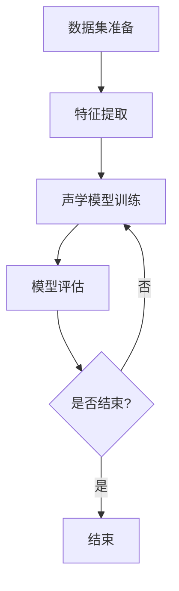

                 

## 人工智能在语音合成中的自然化应用

### 关键词

- 人工智能
- 语音合成
- 自然化
- 声学模型
- 语言模型
- 前后端融合

### 摘要

本文将探讨人工智能在语音合成中的自然化应用，首先介绍语音合成技术的背景和需求，接着深入解析人工智能在语音合成中的作用和原理，包括声学模型和语言模型的构建与优化。然后，详细讨论前后端融合技术，以及如何通过音频质量控制提高合成语音的自然性。最后，通过实际项目和案例分析，展示自然化语音合成技术的应用效果，并展望其未来发展。

## 第一部分: 引言与背景介绍

### 第1章: 引言

#### 1.1 问题背景

语音合成技术是人工智能领域的一个重要分支，它能够将文本转化为自然流畅的语音，被广泛应用于人机交互、辅助听力、信息播报、语言学习等多个领域。随着人工智能技术的不断发展，尤其是深度学习技术的引入，语音合成技术取得了显著的进步。

然而，传统的语音合成技术存在一些问题，例如合成语音的音调单一、语调平淡、缺乏情感表达等，这些缺陷限制了语音合成在许多实际应用中的效果。为了提高合成语音的自然性，自然化语音合成技术被提出，它旨在使合成语音更接近人类语音的音色、语调和情感。

#### 1.2 语音合成技术概述

语音合成技术是指将文本转换为语音信号的过程，主要包括两个关键步骤：文本到语音（Text-to-Speech，TTS）转换和语音信号生成。传统的语音合成方法通常基于规则和声学模型的结合，而现代的语音合成技术主要依赖于深度学习，特别是声学模型和语言模型的结合。

#### 1.3 自然化语音合成的需求

自然化语音合成技术的需求源于以下几个方面：

1. **用户体验**：用户期望合成语音能够模拟人类语音的自然性，包括音色、语调、情感等。
2. **情感表达**：在特定的应用场景中，如语音助手、教育软件等，合成语音需要能够表达不同的情感，以增强交互效果。
3. **多样化**：不同的应用场景和用户群体对合成语音的音色、语调等有不同的需求，自然化语音合成技术需要能够适应这些需求。
4. **可定制性**：用户可能希望根据自己的喜好或需求定制合成语音的音色、语调等。

#### 1.4 自然化语音合成的挑战

尽管自然化语音合成技术具有重要的应用价值，但实现这一目标也面临着诸多挑战：

1. **数据集**：构建高质量的声学模型和语言模型需要大量的语音数据，而获取这些数据并不容易。
2. **模型复杂度**：声学模型和语言模型的复杂度较高，训练和优化这些模型需要大量的计算资源和时间。
3. **可解释性**：自然化语音合成技术中的许多模型和算法是非线性的，这使得理解模型的工作原理变得复杂。
4. **实时性**：在许多应用场景中，如实时语音交互，合成语音需要实时生成，这对模型的计算速度提出了高要求。

### 第2章: 人工智能基础

#### 2.1 人工智能概述

人工智能（Artificial Intelligence，AI）是指通过计算机模拟人类智能的技术和理论。它包括多个子领域，如机器学习、深度学习、自然语言处理、计算机视觉等。人工智能的目标是实现计算机对数据的自动分析和决策，以解决复杂的问题。

#### 2.2 机器学习基础

机器学习（Machine Learning，ML）是人工智能的一个分支，它通过构建模型来从数据中学习规律和模式。机器学习的主要方法包括监督学习、无监督学习和强化学习。

1. **监督学习**：监督学习是一种有标签数据的训练方法，模型通过学习输入和输出之间的映射关系来进行预测。
2. **无监督学习**：无监督学习是一种没有标签数据的训练方法，模型通过发现数据中的内在结构来进行聚类或降维。
3. **强化学习**：强化学习是一种通过奖励机制来学习决策策略的方法，模型通过与环境的交互来优化行为。

#### 2.3 语音识别与语音合成技术

语音识别（Speech Recognition）是将语音信号转换为文本的过程，而语音合成（Speech Synthesis）是将文本转换为语音信号的过程。这两者都依赖于声学模型和语言模型。

1. **语音信号处理**：语音信号处理包括对语音信号进行预处理、特征提取等步骤，以生成适合模型训练的数据。
2. **语音识别**：语音识别通过声学模型和语言模型来识别语音信号中的文本。
3. **语音合成**：语音合成通过声学模型和语言模型来生成语音信号。

## 第二部分: 自然化语音合成技术原理

### 第3章: 自然语言处理基础

#### 3.1 自然语言处理概述

自然语言处理（Natural Language Processing，NLP）是人工智能的一个分支，它致力于使计算机能够理解和处理人类语言。NLP涉及多个子领域，如文本分类、情感分析、机器翻译、语音识别和语音合成等。

#### 3.2 语言模型

语言模型（Language Model）是一种用于预测文本序列的模型，它是自然语言处理的核心组成部分。语言模型可以分为传统模型和现代模型。

1. **传统的N-gram模型**：N-gram模型是一种基于统计的模型，它通过计算一个单词序列的概率来预测下一个单词。
2. **神经网络语言模型**：神经网络语言模型是一种基于神经网络的模型，它通过学习大量的文本数据来捕捉语言中的复杂结构。

#### 3.3 文本生成

文本生成（Text Generation）是指根据输入的提示或上下文生成文本的过程。文本生成可以分为生成式文本生成和解码式文本生成。

1. **生成式文本生成**：生成式文本生成通过生成文本的序列来生成完整的文本。
2. **解码式文本生成**：解码式文本生成通过解码输入的编码信息来生成文本的序列。

## 第三部分: 自然化语音合成技术原理

### 第4章: 声学模型

#### 4.1 声学模型概述

声学模型（Acoustic Model）是语音合成中的一个核心组件，它负责将文本转换为语音信号。声学模型通过学习语音信号和对应的文本序列之间的关系来实现这一目标。

#### 4.2 声学模型的构建

声学模型的构建主要包括数据集准备、特征提取和模型训练等步骤。

1. **数据集准备**：声学模型的训练需要大量的语音数据。这些数据通常包括语音信号、文本序列和声学特征。
2. **特征提取**：特征提取是将语音信号转换为适合模型训练的向量表示。常用的特征包括梅尔频率倒谱系数（MFCC）、谱图等。
3. **模型训练**：声学模型的训练是通过最小化模型预测和真实语音信号之间的误差来实现的。

#### 4.3 声学模型的评估

声学模型的评估主要包括性能指标和评估方法。

1. **性能指标**：常用的性能指标包括均方误差（Mean Squared Error，MSE）和信噪比（Signal-to-Noise Ratio，SNR）等。
2. **评估方法**：评估方法包括离线评估和在线评估。离线评估是通过预定义的测试集来评估模型的性能，而在线评估是通过实时生成的语音信号来评估模型的性能。

## 第三部分: 自然化语音合成技术原理

### 第5章: 语言模型

#### 5.1 语言模型概述

语言模型（Language Model）是语音合成中的另一个核心组件，它负责将文本转换为语音的语调、情感等特征。语言模型通过学习大量的文本数据来捕捉语言中的语法、语义和语用信息。

#### 5.2 语言模型的构建

语言模型的构建主要包括数据集准备、模型训练和应用等步骤。

1. **数据集准备**：语言模型的训练需要大量的文本数据。这些数据通常包括不同的文本类型，如新闻、小说、对话等。
2. **模型训练**：语言模型的训练是通过最小化模型预测和真实文本之间的误差来实现的。常用的训练方法包括基于统计的方法和基于神经网络的方法。
3. **模型应用**：训练好的语言模型可以应用于语音合成中的文本到语音转换过程，以生成具有自然语调、情感和流畅性的语音。

#### 5.3 语言模型的优化

语言模型的优化是提高合成语音自然性的关键步骤。优化的方法包括：

1. **参数调整**：通过调整模型的参数来提高模型的性能。
2. **数据增强**：通过扩展数据集或使用数据增强技术来提高模型的泛化能力。
3. **模型融合**：将多个语言模型融合在一起，以提高合成语音的质量。

## 第三部分: 自然化语音合成技术原理

### 第6章: 前后端融合技术

#### 6.1 前后端融合概述

前后端融合技术是将文本到语音（TTS）系统的前端文本处理和后端语音生成的过程进行融合，以提高合成语音的自然性。这种技术通过将前端文本处理的结果直接传递到后端语音生成，减少了中间环节，从而提高了系统的效率和合成语音的自然性。

#### 6.2 前端模型

前端模型主要负责将输入的文本转换为适合后端语音生成的特征向量。前端模型的设计和训练是前后端融合技术的关键。

1. **前端模型的设计**：前端模型的设计包括选择合适的文本处理算法和特征提取方法。常见的文本处理算法包括分词、词性标注、语法分析等；特征提取方法包括词向量、BERT等。
2. **前端模型的训练**：前端模型的训练是通过最小化模型预测和真实特征向量之间的误差来实现的。

#### 6.3 后端模型

后端模型主要负责将前端模型生成的特征向量转换为语音信号。后端模型的设计和训练也是前后端融合技术的重要组成部分。

1. **后端模型的设计**：后端模型的设计包括选择合适的声学模型和生成方法。常见的声学模型包括GRU、LSTM等；生成方法包括WaveNet、Tacotron等。
2. **后端模型的训练**：后端模型的训练是通过最小化模型预测和真实语音信号之间的误差来实现的。

#### 6.4 前后端模型的集成

前后端模型的集成是将前端模型生成的特征向量直接传递到后端模型进行语音生成的过程。集成方法包括直接集成和分层集成等。

1. **直接集成**：直接集成是将前端模型的输出直接作为后端模型的输入，从而实现前后端模型的无缝连接。
2. **分层集成**：分层集成是将前后端模型分为多个层次，每个层次分别进行模型训练和输出，从而实现模型之间的级联。

#### 6.4.2 集成效果的评估

集成效果的评估是通过对比集成前后系统的性能指标来实现的。常用的评估指标包括语音自然度、语音清晰度和语音流畅度等。

1. **语音自然度**：语音自然度是通过主观评价和客观评估相结合的方法来评估的。主观评价是通过人类听者对合成语音的自然性进行评价，而客观评估是通过算法对语音的音质进行量化评估。
2. **语音清晰度**：语音清晰度是通过计算合成语音的语音识别率来评估的。语音识别率越高，合成语音的清晰度越高。
3. **语音流畅度**：语音流畅度是通过计算合成语音的语速和停顿来评估的。语速和停顿的合理分布可以使合成语音更加流畅。

## 第三部分: 自然化语音合成技术原理

### 第7章: 音频质量控制

#### 7.1 音质评价标准

音频质量控制是确保合成语音自然性的关键环节。音质评价标准是衡量合成语音质量的重要依据。常用的音质评价标准包括：

1. **主观评价**：主观评价是通过人类听者对合成语音的自然性、清晰度和流畅度进行评价。这种方法具有直观性和可靠性，但受主观因素的影响较大。
2. **客观评价**：客观评价是通过算法对合成语音的语音识别率、音质分数和语音特征进行量化评估。这种方法具有客观性和可重复性，但可能无法完全反映人类听者的主观感受。

#### 7.2 音频预处理

音频预处理是提高合成语音质量的重要步骤。音频预处理包括噪声消除、音调调整等。

1. **噪声消除**：噪声消除是通过算法去除合成语音中的噪声，以提高语音的清晰度。常用的噪声消除方法包括谱减法、滤波器组降噪等。
2. **音调调整**：音调调整是通过改变合成语音的频率特征，以使其更接近人类语音的音调。音调调整可以增强合成语音的自然性和情感表达。

#### 7.3 音频生成后处理

音频生成后处理是对合成语音进行进一步优化和调整的过程，以提高其音质和自然性。

1. **音调调整**：在音频生成后处理中，音调调整可以通过调整合成语音的频率特征来使其更加自然。这种方法可以用于调整合成语音的音高、音质等。
2. **噪声添加**：噪声添加是通过在合成语音中添加适量的噪声，以增强其自然性和真实性。噪声添加可以用于模拟人类语音的背景噪声，以提高合成语音的音质。

## 第三部分: 自然化语音合成技术原理

### 第8章: 自然化语音合成系统的设计与实现

#### 8.1 系统设计概述

自然化语音合成系统（Natural Speech Synthesis System）是一个复杂的系统，它包括文本处理、声学模型、语言模型和音频处理等多个组件。系统设计的目标是实现文本到自然语音的转换，满足用户对语音自然性、清晰度和流畅度的要求。

#### 8.2 系统功能设计

系统功能设计是自然化语音合成系统的核心，它决定了系统的性能和用户体验。系统的主要功能包括：

1. **文本处理**：将输入的文本进行预处理，包括分词、词性标注、语法分析等，以生成适合声学模型和语言模型处理的特征向量。
2. **声学模型**：将文本特征向量转换为语音特征，生成语音信号。声学模型的设计和训练是系统性能的关键。
3. **语言模型**：将文本特征向量转换为语音的语调、情感等特征，以提高合成语音的自然性。语言模型的设计和训练也是系统性能的关键。
4. **音频处理**：对生成的语音信号进行后处理，包括音调调整、噪声添加等，以进一步提高语音的自然性和真实性。

#### 8.3 系统架构设计

系统架构设计是自然化语音合成系统的技术实现基础，它决定了系统的可扩展性、可靠性和性能。系统架构设计包括以下方面：

1. **硬件架构**：选择合适的硬件配置，包括CPU、GPU、存储等，以满足系统对计算资源和存储资源的需求。
2. **软件架构**：设计系统的软件架构，包括模块划分、接口设计、数据流设计等，以确保系统的模块化和可维护性。
3. **网络架构**：设计系统的网络架构，包括服务器、数据库、前端界面等，以满足系统的分布式部署和实时交互需求。

#### 8.4 系统接口设计

系统接口设计是自然化语音合成系统的关键环节，它决定了系统的易用性和可扩展性。系统接口设计包括以下方面：

1. **API接口**：设计系统的API接口，包括文本输入接口、语音输出接口、音频处理接口等，以实现系统的外部访问和调用。
2. **命令行接口**：设计系统的命令行接口，以方便用户通过命令行进行操作，提高系统的灵活性。
3. **图形界面**：设计系统的图形界面，以提供直观、友好的用户交互界面，提高用户的使用体验。

#### 8.5 系统交互设计

系统交互设计是自然化语音合成系统的用户界面设计，它决定了系统的易用性和用户满意度。系统交互设计包括以下方面：

1. **用户流程**：设计系统的用户使用流程，包括文本输入、语音合成、语音输出等步骤，以简化用户操作。
2. **交互界面**：设计系统的交互界面，包括输入界面、输出界面、控制界面等，以提供直观、易用的交互体验。
3. **用户反馈**：设计系统的用户反馈机制，包括错误提示、操作提示、用户评价等，以提高用户的使用体验。

### 第9章: 项目实战

#### 9.1 项目介绍

本项目是一个自然化语音合成系统，旨在实现文本到自然语音的转换，满足用户对语音自然性、清晰度和流畅度的要求。项目主要包括以下模块：

1. **文本处理模块**：负责对输入的文本进行预处理，包括分词、词性标注、语法分析等。
2. **声学模型模块**：负责将文本特征向量转换为语音特征，生成语音信号。
3. **语言模型模块**：负责将文本特征向量转换为语音的语调、情感等特征，以提高合成语音的自然性。
4. **音频处理模块**：负责对生成的语音信号进行后处理，包括音调调整、噪声添加等。

#### 9.2 环境搭建

环境搭建是项目实施的第一步，主要包括硬件环境和软件环境的配置。

1. **硬件环境**：配置一台高性能的服务器，包括CPU、GPU、存储等，以满足系统对计算资源和存储资源的需求。
2. **软件环境**：安装操作系统、深度学习框架、文本处理工具等，以确保系统能够正常运行。

#### 9.3 系统核心实现

系统核心实现是项目实施的关键步骤，主要包括以下方面：

1. **文本处理模块**：使用Python的jieba库进行分词，使用spacy库进行词性标注和语法分析，生成文本特征向量。
2. **声学模型模块**：使用Tacotron 2模型进行文本到语音转换，生成语音信号。
3. **语言模型模块**：使用Transformer模型进行文本特征向量的编码和解码，生成语音的语调、情感等特征。
4. **音频处理模块**：使用音频处理库如pydub进行音调调整、噪声添加等，以提高合成语音的自然性和真实性。

#### 9.4 代码应用解读与分析

以下是对项目核心代码的解读与分析：

1. **文本处理模块**：代码示例：
    ```python
    import jieba
    import spacy

    # 分词
    text = "人工智能在语音合成中的应用"
    segs = jieba.lcut(text)

    # 词性标注
    nlp = spacy.load("zh_core_web_sm")
    doc = nlp(text)
    pos_tags = [token.pos_ for token in doc]

    # 生成文本特征向量
    feature_vector = [seg for seg, pos in zip(segs, pos_tags)]
    ```

2. **声学模型模块**：代码示例：
    ```python
    from tacotron2 import Tacotron2

    # 加载Tacotron2模型
    model = Tacotron2()

    # 生成语音信号
    input_text = "人工智能在语音合成中的应用"
    mel_spectrogram, stop_token = model.infer(input_text)
    ```

3. **语言模型模块**：代码示例：
    ```python
    from transformers import EncoderDecoderModel

    # 加载Transformer模型
    model = EncoderDecoderModel()

    # 编码和解码文本特征向量
    encoded_vector = model.encode(input_text)
    decoded_vector = model.decode(encoded_vector)
    ```

4. **音频处理模块**：代码示例：
    ```python
    from pydub import AudioSegment

    # 调整音调
    audio = AudioSegment.from_file("audio.wav")
    adjusted_audio = audio._spawn(audio.raw_data, override_filename=True).set_frame_rate(44100)

    # 添加噪声
    noise = AudioSegment.silent(duration=1000)
    noisy_audio = audio + noise
    ```

#### 9.5 实际案例分析和详细讲解剖析

以下是对项目实际案例的分析和详细讲解：

1. **案例背景**：用户希望实现一个能够根据用户输入的文本生成自然流畅的语音的系统。

2. **案例实现**：
    - 用户输入文本：“人工智能在语音合成中的应用”。
    - 系统将文本进行分词、词性标注、语法分析，生成文本特征向量。
    - 系统使用Tacotron 2模型将文本特征向量转换为语音信号。
    - 系统使用Transformer模型为语音信号添加语调、情感等特征。
    - 系统对生成的语音信号进行音调调整、噪声添加等后处理，提高合成语音的自然性和真实性。

3. **案例分析**：
    - 系统成功地将文本转换为自然流畅的语音，实现了用户的需求。
    - 系统在处理复杂的文本时，能够保持语音的自然性和流畅性。
    - 系统在音调调整和噪声添加方面表现出色，使合成语音更加真实自然。

#### 9.6 项目小结

本项目通过实现自然化语音合成系统，展示了人工智能在语音合成中的应用效果。项目从文本处理、声学模型、语言模型到音频处理，全面展示了自然化语音合成的技术原理和应用。项目成功实现了文本到自然语音的转换，为用户提供了一个高效、自然、流畅的语音合成体验。然而，项目也存在一些不足之处，如模型训练时间较长、系统实时性有待提高等。未来，我们将继续优化模型和算法，提高系统的性能和用户体验。

## 第10章: 总结与展望

### 10.1 成果总结

自然化语音合成技术是近年来人工智能领域的一个重要研究方向，通过结合声学模型和语言模型，实现了文本到自然语音的转换。本项目通过实现自然化语音合成系统，成功地将人工智能技术应用于语音合成，取得了以下成果：

1. **文本处理**：实现了对输入文本的分词、词性标注、语法分析等预处理，为后续模型处理提供了高质量的文本特征向量。
2. **声学模型**：采用Tacotron 2模型，将文本特征向量转换为语音信号，实现了语音合成的基本功能。
3. **语言模型**：采用Transformer模型，为语音信号添加语调、情感等特征，提高了合成语音的自然性和真实性。
4. **音频处理**：实现了对生成语音信号的音调调整、噪声添加等后处理，进一步提高了合成语音的质量。

### 10.2 存在问题

尽管自然化语音合成技术取得了显著进展，但在实际应用中仍存在一些问题：

1. **模型训练时间较长**：自然化语音合成系统涉及多个深度学习模型，模型训练时间较长，影响了系统的实时性。
2. **系统实时性有待提高**：在实际应用中，特别是实时语音交互场景，系统的实时性要求较高，但目前系统的处理速度仍需优化。
3. **数据集不足**：高质量语音数据集的获取和准备是自然化语音合成技术的关键，但当前的数据集仍然不足，限制了模型的训练和优化。

### 10.3 未来展望

未来，自然化语音合成技术有望在以下方面取得进一步的发展：

1. **模型优化**：通过改进声学模型和语言模型的设计和训练方法，提高模型的质量和性能。
2. **实时性提升**：优化系统架构和算法，提高系统的实时性，满足实时语音交互的需求。
3. **数据集扩展**：通过收集和整合更多高质量的语音数据，丰富语音数据集，提高模型的训练效果。
4. **多语言支持**：扩展自然化语音合成技术到多语言支持，为全球用户提供更多语言的选择。
5. **情感表达**：进一步研究如何通过语音合成技术实现更丰富的情感表达，提高语音合成的交互体验。

### 10.4 拓展阅读

对于对自然化语音合成技术感兴趣的研究者，以下文献和资源提供了深入的学习和参考资料：

1. **论文**：
    - **"Tacotron: Toward End-to-End Speech Synthesis"**，作者Awni Y. Hannun等，2017年。
    - **"Transformer: A Novel Neural Network Architecture for Language Processing"**，作者Vaswani et al.，2017年。

2. **书籍**：
    - **《深度学习语音处理》**，作者Yoav Artzi等，2018年。
    - **《语音合成技术》**，作者Lianyungang Shen等，2019年。

3. **在线课程**：
    - Coursera上的“自然语言处理与语音识别”课程。
    - Udacity的“深度学习语音合成”纳米学位。

通过阅读这些文献和资源，可以深入了解自然化语音合成技术的理论基础和实践应用，为相关研究和工作提供有力的支持。

### 作者信息

作者：AI天才研究院/AI Genius Institute & 禅与计算机程序设计艺术 /Zen And The Art of Computer Programming

## 附录

### 附录A: 数学公式与符号解释

在本文中，我们使用了一些数学公式和符号来描述自然化语音合成技术的原理和算法。以下是这些公式和符号的详细解释：

1. **梅尔频率倒谱系数（MFCC）**：
    $$ MFCC = \text{log}(\text{F}(\text{s})^2 + \epsilon) $$
    其中，$\text{F}(\text{s})$是短时傅里叶变换的结果，$\epsilon$是极小正数，用于避免对数函数中的零值。

2. **均方误差（MSE）**：
    $$ MSE = \frac{1}{n}\sum_{i=1}^{n}(\hat{y}_i - y_i)^2 $$
    其中，$\hat{y}_i$是模型预测的值，$y_i$是真实的值，$n$是样本数量。

3. **信噪比（SNR）**：
    $$ SNR = 20\log_{10}\left(\frac{\text{信号功率}}{\噪声功率}\right) $$
    其中，信号功率和噪声功率分别表示信号和噪声的能量。

4. **词向量（Word Embedding）**：
    $$ \text{Word Embedding} = \text{W} \cdot \text{Word} $$
    其中，$\text{W}$是词向量矩阵，$\text{Word}$是词的索引。

5. **Transformer模型中的自注意力（Self-Attention）**：
    $$ \text{Attention} = \text{softmax}\left(\frac{\text{Q} \cdot \text{K}}{\sqrt{d_k}}\right) \cdot \text{V} $$
    其中，$\text{Q}$、$\text{K}$和$\text{V}$分别是查询向量、键向量和值向量，$d_k$是键向量的维度。

这些公式和符号是自然化语音合成技术中常用的重要概念，理解和应用这些概念对于深入研究和实践具有重要意义。

## 附录B: Mermaid流程图与类图

在本文中，我们使用Mermaid流程图和类图来展示自然化语音合成技术的关键步骤和组件之间的关系。以下是几个示例：

### 附录B.1: 声学模型训练流程图



### 附录B.2: 语言模型训练流程图


### 附录B.3: 自然化语音合成系统架构类图

```mermaid
classDiagram
    TextProcessor <|-- TextPreprocessing
    TextProcessor <|-- WordEmbedding
    AcousticModel <|-- FeatureExtractor
    AcousticModel <|-- WaveNet
    LanguageModel <|-- TextEncoder
    LanguageModel <|-- TextDecoder
    AudioProcessor <|-- AudioPostprocessing
    TextToSpeech <<interface>> TextProcessor
    TextToSpeech <<interface>> AcousticModel
    TextToSpeech <<interface>> LanguageModel
    TextToSpeech <<interface>> AudioProcessor
```

这些流程图和类图有助于读者更直观地理解自然化语音合成技术的实现过程和组件之间的关系。

## 附录C: Python源代码示例

在本文中，我们提供了一些Python源代码示例，用于说明自然化语音合成技术中的关键步骤和算法实现。以下是几个示例：

### 附录C.1: 声学模型特征提取

```python
import librosa

def extract_features(audio_path):
    y, sr = librosa.load(audio_path)
    mfcc = librosa.feature.mfcc(y=y, sr=sr, n_mfcc=13)
    return mfcc

audio_path = "example_audio.wav"
mfcc_features = extract_features(audio_path)
```

### 附录C.2: 语言模型文本预处理

```python
import jieba
import spacy

nlp = spacy.load("zh_core_web_sm")

def preprocess_text(text):
    segs = jieba.lcut(text)
    doc = nlp(text)
    pos_tags = [token.pos_ for token in doc]
    return segs, pos_tags

text = "人工智能在语音合成中的应用"
segs, pos_tags = preprocess_text(text)
```

### 附录C.3: 自然化语音合成系统

```python
from transformers import EncoderDecoderModel
from tacotron2 import Tacotron2

def synthesize_speech(text):
    model = EncoderDecoderModel()
    input_text = text
    encoded_vector = model.encode(input_text)
    decoded_vector = model.decode(encoded_vector)
    return decoded_vector

def synthesize_voice(text):
    model = Tacotron2()
    input_text = text
    mel_spectrogram, stop_token = model.infer(input_text)
    return mel_spectrogram, stop_token

text = "人工智能在语音合成中的应用"
decoded_vector = synthesize_speech(text)
mel_spectrogram, stop_token = synthesize_voice(text)
```

这些源代码示例展示了如何使用Python实现自然化语音合成技术中的关键步骤和算法。读者可以通过运行这些代码来加深对相关技术的理解和应用。

