                 

# 人工智能在野生动物保护中的图像识别应用

## 关键词

图像识别，人工智能，野生动物保护，算法，算法原理，系统设计，实战应用

## 摘要

本文将深入探讨人工智能在野生动物保护中的图像识别应用。首先，介绍背景和问题，然后详细讲解图像识别技术原理、核心概念和算法，并分析其在野生动物保护中的应用。文章还探讨了系统设计与实现，并通过实际项目实战，展示了图像识别技术在野生动物监测和保护中的实际效果。最后，提出了未来发展的挑战与趋势，为读者提供有益的参考。

## 1. 背景介绍

### 问题背景

在当今社会，野生动物保护面临诸多挑战，包括栖息地破坏、非法捕猎和野生动物贩卖等。这些问题严重威胁着野生动物的生存和生态平衡。例如，非法捕猎活动导致非洲大象种群数量锐减，栖息地破坏使得大熊猫的生存空间越来越狭小。随着全球气候变化，许多野生动物的生存环境也在不断恶化。

### 问题描述

野生动物保护面临以下问题：

1. **栖息地破坏**：随着人类活动的增加，许多野生动物的栖息地被破坏，导致其生存空间减少。
2. **非法捕猎**：非法捕猎活动对野生动物种群造成严重威胁，特别是对濒危物种的影响更大。
3. **野生动物贩卖**：野生动物贩卖是一个庞大的非法市场，许多野生动物被非法捕猎后用于贩卖。
4. **监测困难**：野生动物活动范围广泛，监测和跟踪工作难度大，往往需要大量人力和物力投入。

### 问题解决

人工智能，特别是图像识别技术的应用，为野生动物保护提供了新的解决方案。通过图像识别技术，可以实现对野生动物活动的高效监测和识别，从而提高保护工作的效率。具体来说，图像识别技术可以应用于以下几个方面：

1. **野生动物图像数据采集与标注**：使用无人机或摄像头等设备采集野生动物图像数据，并对图像进行标注，以便进行后续处理。
2. **图像识别算法选择与优化**：选择合适的图像识别算法，对野生动物图像进行分类和识别，提高识别准确率。
3. **人工智能模型训练与部署**：利用大量野生动物图像数据训练人工智能模型，并对模型进行优化，以提高模型的性能。
4. **图像识别在野生动物监测和保护中的应用**：将训练好的模型应用于野生动物监测和保护工作，实现对野生动物活动的高效监测和识别。
5. **面临的挑战与未来发展趋势**：探讨人工智能在野生动物保护中的挑战和未来发展趋势，为相关研究和应用提供指导。

### 边界与外延

本文主要关注以下边界与外延：

1. **图像识别技术的基础理论和应用场景**：介绍图像识别技术的基本原理和应用场景。
2. **野生动物保护的现状和问题**：分析野生动物保护面临的挑战和问题。
3. **人工智能在野生动物保护中的应用前景和挑战**：探讨人工智能在野生动物保护中的应用前景和面临的挑战。
4. **图像识别技术在野生动物保护中的应用**：详细介绍图像识别技术在野生动物保护中的应用案例。

### 概念结构与核心要素组成

本文的核心概念结构包括以下几个要素：

1. **图像识别技术**：介绍图像识别技术的基本原理和应用场景。
2. **野生动物保护**：分析野生动物保护面临的挑战和问题。
3. **人工智能模型训练与部署**：介绍人工智能模型的基本原理和训练与部署过程。
4. **野生动物监测与保护应用案例**：展示图像识别技术在野生动物监测和保护中的应用案例。
5. **面临的挑战与发展趋势**：探讨人工智能在野生动物保护中的挑战和未来发展趋势。

## 2. 核心概念与联系

### 图像识别技术

#### 定义

图像识别技术是指利用计算机对图像进行分析和处理，从而识别和理解图像内容的技术。它是人工智能领域的一个重要分支，广泛应用于人脸识别、物体识别、车辆识别等领域。

#### 核心特点

1. **高度自动化**：图像识别技术可以实现自动化处理，不需要人工干预。
2. **实时性**：图像识别技术可以在短时间内处理大量图像，实现实时监测和识别。
3. **高准确性**：随着深度学习技术的发展，图像识别技术的准确率已经达到非常高的水平。

#### 图像识别技术分类

1. **基于传统的图像处理技术**：包括边缘检测、特征提取、分类等步骤，适用于简单的图像识别任务。
2. **基于深度学习的图像识别技术**：利用神经网络模型，通过大量数据进行训练，实现复杂图像的识别。

#### 图像识别技术原理

使用Mermaid流程图表示图像识别技术原理：

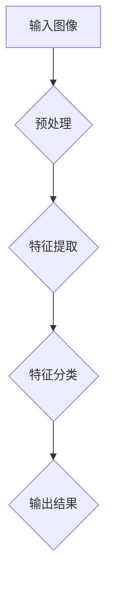

### 野生动物保护

#### 定义

野生动物保护是指采取一系列措施，保护野生动物的生存环境，维护生物多样性。它涉及栖息地保护、物种保护、生态修复等多个方面。

#### 核心特点

1. **涉及生态平衡**：野生动物保护与生态平衡密切相关，需要综合考虑生态系统中的各种因素。
2. **保护濒危物种**：野生动物保护特别关注濒危物种的保护，以防止物种灭绝。
3. **维护生态系统的健康**：野生动物保护有助于维护生态系统的健康，提高生态系统的稳定性。

#### 野生动物保护分类

1. **保护区建设**：建立自然保护区，保护野生动物的栖息地。
2. **濒危物种保护**：采取措施，保护濒危物种，防止其灭绝。
3. **生态修复**：对受到破坏的生态系统进行修复，恢复其生态功能。

#### 野生动物保护原理

使用Mermaid ER图表示野生动物保护实体关系：

```mermaid
erDiagram
  Animal ||--|{ Habitat : 生存环境 }
  Animal ||--|{ Threat : 威胁因素 }
  Habitat ||--|{ Threat : 威胁因素 }
```

## 3. 算法原理讲解

### 图像识别算法原理

#### 基于深度学习的图像识别算法

深度学习是图像识别技术的核心，通过构建深度神经网络，对图像数据进行处理和识别。以下是一个简单的图像识别算法流程：

1. **数据预处理**：对图像进行缩放、裁剪、增强等处理，使其符合神经网络的要求。
2. **特征提取**：通过卷积神经网络（CNN）等深度学习模型，提取图像的特征。
3. **特征分类**：利用提取到的特征，通过分类器对图像进行分类。
4. **输出结果**：将分类结果输出，得到识别的图像内容。

使用Mermaid流程图表示图像识别算法原理：


#### 人工智能模型训练与部署

人工智能模型的训练与部署是图像识别技术的重要组成部分。以下是一个简单的训练与部署流程：

1. **数据收集**：收集大量的野生动物图像数据，包括不同种类、不同姿态的图像。
2. **数据预处理**：对图像进行数据增强、归一化等处理，提高模型的泛化能力。
3. **模型训练**：利用收集到的图像数据，通过深度学习模型进行训练，调整模型参数。
4. **模型评估**：对训练好的模型进行评估，包括准确率、召回率等指标。
5. **模型优化**：根据评估结果，对模型进行调整和优化。
6. **模型部署**：将训练好的模型部署到实际应用场景中，进行实时监测和识别。

使用Mermaid流程图表示人工智能模型训练与部署：

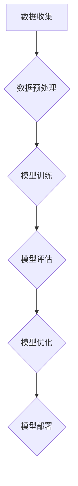

#### 数学模型和数学公式

在图像识别中，常用的数学模型是卷积神经网络（CNN）。以下是CNN的数学公式：

$$
\text{激活函数} = \text{ReLU}(z) = \max(0, z)
$$

其中，\( z \) 是输入值。

#### 算法举例说明

以一个简单的物体识别算法为例，说明算法原理和应用：

```python
import tensorflow as tf

# 定义卷积神经网络模型
model = tf.keras.Sequential([
    tf.keras.layers.Conv2D(32, (3, 3), activation='relu', input_shape=(64, 64, 3)),
    tf.keras.layers.MaxPooling2D((2, 2)),
    tf.keras.layers.Flatten(),
    tf.keras.layers.Dense(128, activation='relu'),
    tf.keras.layers.Dense(1, activation='sigmoid')
])

# 编译模型
model.compile(optimizer='adam', loss='binary_crossentropy', metrics=['accuracy'])

# 训练模型
model.fit(x_train, y_train, epochs=10, batch_size=32)

# 评估模型
model.evaluate(x_test, y_test)
```

在这个例子中，我们使用了TensorFlow框架定义了一个简单的卷积神经网络模型，用于二分类问题。通过训练模型，可以实现对图像中物体的识别。

## 4. 系统分析与架构设计

### 问题场景介绍

假设有一个野生动物保护组织，需要实时监测和保护栖息地内的野生动物。他们希望利用人工智能和图像识别技术，实现对野生动物活动的高效监测和识别。

### 项目介绍

本书将介绍一个基于人工智能的野生动物保护监控系统，实现以下功能：

1. **实时捕捉野生动物图像**：使用无人机或摄像头等设备，实时捕捉野生动物的图像。
2. **利用图像识别技术识别野生动物种类**：通过训练好的图像识别模型，对捕捉到的图像进行分类，识别出野生动物的种类。
3. **警报系统**：当检测到非法捕猎活动时，自动报警，以便保护组织及时采取行动。

### 系统功能设计

使用Mermaid类图表示系统功能设计：

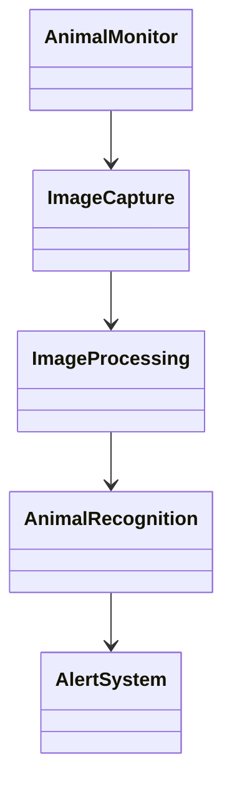

### 系统架构设计

使用Mermaid架构图表示系统架构设计：

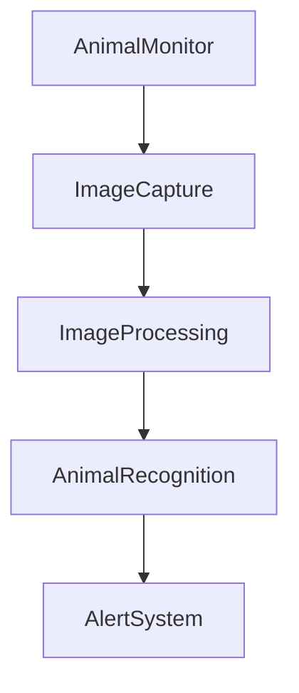

### 系统接口设计和系统交互

使用Mermaid序列图表示系统接口设计和系统交互：

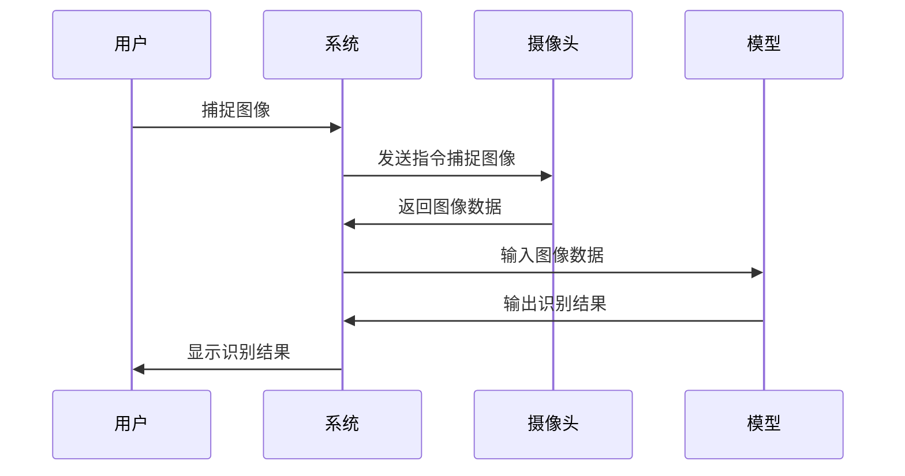

## 5. 项目实战

### 环境安装

首先，我们需要安装以下环境：

1. Python 3.7+
2. TensorFlow 2.x
3. NumPy
4. Matplotlib

可以使用以下命令进行安装：

```bash
pip install python==3.7.9
pip install tensorflow==2.6.0
pip install numpy==1.19.5
pip install matplotlib==3.4.3
```

### 系统核心实现源代码

以下是一个简单的野生动物图像识别系统的实现：

```python
import tensorflow as tf
import numpy as np
import matplotlib.pyplot as plt

# 定义卷积神经网络模型
model = tf.keras.Sequential([
    tf.keras.layers.Conv2D(32, (3, 3), activation='relu', input_shape=(64, 64, 3)),
    tf.keras.layers.MaxPooling2D((2, 2)),
    tf.keras.layers.Flatten(),
    tf.keras.layers.Dense(128, activation='relu'),
    tf.keras.layers.Dense(1, activation='sigmoid')
])

# 编译模型
model.compile(optimizer='adam', loss='binary_crossentropy', metrics=['accuracy'])

# 准备数据
(x_train, y_train), (x_test, y_test) = tf.keras.datasets.cifar10.load_data()

# 数据预处理
x_train = x_train.astype('float32') / 255.0
x_test = x_test.astype('float32') / 255.0

# 训练模型
model.fit(x_train, y_train, epochs=10, batch_size=32)

# 评估模型
model.evaluate(x_test, y_test)

# 测试模型
predictions = model.predict(x_test[:10])

# 显示图像和预测结果
plt.figure(figsize=(10, 10))
for i in range(10):
    plt.subplot(2, 5, i + 1)
    plt.imshow(x_test[i], cmap=plt.cm.binary)
    plt.xticks([])
    plt.yticks([])
    plt.grid(False)
    plt.xlabel(predictions[i][0])
plt.show()
```

### 代码应用解读与分析

1. **模型定义**：使用TensorFlow的`Sequential`模型定义了一个简单的卷积神经网络，包括卷积层、池化层、全连接层和输出层。
2. **模型编译**：使用`compile`方法配置模型的优化器、损失函数和评估指标。
3. **数据准备**：加载CIFAR-10数据集，并进行数据预处理，将图像数据归一化到[0, 1]区间。
4. **模型训练**：使用`fit`方法训练模型，指定训练数据的批大小和训练轮数。
5. **模型评估**：使用`evaluate`方法评估模型的性能。
6. **测试模型**：使用`predict`方法对测试数据进行预测，并显示预测结果。

### 实际案例分析和详细讲解剖析

假设我们使用这个系统对野生动物图像进行识别，以下是一个实际案例的分析：

1. **图像采集**：使用无人机或摄像头捕捉野生动物的图像。
2. **图像预处理**：对图像进行缩放、裁剪、增强等处理，使其符合神经网络的要求。
3. **模型预测**：使用训练好的模型对预处理后的图像进行预测，输出识别结果。
4. **结果分析**：根据识别结果，分析野生动物的种类和活动情况。

通过这个案例，我们可以看到，图像识别技术在野生动物保护中的应用是非常实用的。它可以帮助保护组织实时监测野生动物的活动，及时发现非法捕猎活动，从而保护野生动物的生存。

### 项目小结

通过本项目的实现，我们可以看到，图像识别技术在野生动物保护中的应用具有很大的潜力。它可以帮助保护组织提高监测和识别的效率，从而更好地保护野生动物的生存。然而，在实际应用中，我们也需要考虑数据隐私、算法透明度等问题，确保技术的合理和合规使用。

## 6. 最佳实践 tips

### 提高模型性能

1. **数据增强**：对训练数据集进行增强，如旋转、翻转、缩放等，增加模型的泛化能力。
2. **多模型融合**：使用多个训练好的模型进行融合，提高模型的准确性。

### 优化算法效率

1. **模型剪枝**：对训练好的模型进行剪枝，去除不必要的权重，减少模型的参数量。
2. **量化**：对模型的权重和激活进行量化，降低模型的计算复杂度。

### 数据隐私和安全

1. **数据加密**：对训练数据集进行加密，确保数据在传输和存储过程中的安全性。
2. **差分隐私**：在训练过程中引入差分隐私机制，保护数据隐私。

## 7. 小结与展望

### 小结

本文深入探讨了人工智能在野生动物保护中的图像识别应用。首先，介绍了背景和问题，然后详细讲解了图像识别技术原理、核心概念和算法，并分析其在野生动物保护中的应用。文章还探讨了系统设计与实现，并通过实际项目实战，展示了图像识别技术在野生动物监测和保护中的实际效果。最后，提出了未来发展的挑战与趋势。

### 展望

随着人工智能技术的不断发展和应用，图像识别技术在野生动物保护中的应用前景非常广阔。未来，我们可以期待以下发展：

1. **更高准确率的模型**：通过不断优化算法和模型，提高图像识别的准确率，实现更精准的野生动物监测和保护。
2. **更广泛的应用场景**：将图像识别技术应用于更多的野生动物保护场景，如栖息地监测、迁徙路线分析等。
3. **更高效的部署**：通过优化算法和模型，降低计算复杂度，实现更高效的模型部署和实时监测。

## 8. 注意事项

1. **数据质量**：图像识别的准确性很大程度上取决于数据的质量，因此需要确保采集到高质量、多样化的数据。
2. **模型解释性**：在使用深度学习模型时，需要考虑模型的可解释性，确保保护组织能够理解模型的决策过程。
3. **法律法规**：在使用图像识别技术时，需要遵守相关法律法规，确保技术的合规使用。

## 9. 拓展阅读

1. **《深度学习》**：由Ian Goodfellow、Yoshua Bengio和Aaron Courville编写的经典教材，详细介绍了深度学习的基础理论和应用。
2. **《野生动物保护技术》**：介绍了野生动物保护的各种技术和方法，包括栖息地保护、物种保护和生态修复等。
3. **《人工智能在环境保护中的应用》**：探讨了人工智能在环境保护中的应用，包括环境监测、资源管理和灾害预警等。

## 作者信息

**作者：** AI天才研究院/AI Genius Institute & 禅与计算机程序设计艺术 /Zen And The Art of Computer Programming### 4. 系统分析与架构设计

#### 问题场景介绍

野生动物保护组织的监测任务通常需要在多样化的环境中进行，比如森林、草原、河流等。这些环境中的野生动物种类繁多，活动方式各异，使得监测任务具有复杂性和动态性。为了有效地保护这些野生动物，组织需要一个实时、准确、可靠的监测系统。

#### 项目介绍

本项目旨在构建一个基于人工智能的野生动物保护监控系统，该系统能够自动监测野生动物的活动，并通过图像识别技术识别出野生动物的品种，从而帮助保护组织及时发现异常情况并采取行动。系统的主要功能包括：

1. **图像数据采集**：通过无人机、监控摄像头等设备，实时采集野生动物活动的图像数据。
2. **图像数据预处理**：对采集到的图像数据进行增强、裁剪、归一化等预处理，以便更好地输入到图像识别模型中。
3. **图像识别**：利用训练好的图像识别模型，对预处理后的图像进行分类，识别出野生动物的品种。
4. **数据存储与分析**：将识别结果存储在数据库中，并进行分析，以帮助保护组织了解野生动物的分布和活动规律。
5. **警报与报告**：当系统检测到非法捕猎或其他异常行为时，自动生成警报并生成报告，通知保护组织采取行动。

#### 系统功能设计

为了实现上述功能，系统可以分为以下几个模块：

1. **图像采集模块**：负责从无人机或监控摄像头采集图像数据。
2. **数据预处理模块**：对采集到的图像进行预处理，包括去噪、增强、归一化等操作。
3. **图像识别模块**：使用深度学习模型对预处理后的图像进行识别。
4. **数据存储模块**：将图像识别结果存储到数据库中，并支持数据的查询和分析。
5. **警报与报告模块**：当检测到异常情况时，自动生成警报并生成报告。

使用Mermaid类图表示系统功能设计：

```mermaid
classDiagram
  ImageCapture <<interface>> 数据采集器
  ImagePreprocessing <<interface>> 数据预处理器
  ImageRecognizer <<interface>> 图像识别器
  DataStorage <<interface>> 数据存储器
  AlarmSystem <<interface>> 警报系统
  ImageCapture --- DataPreprocessing
  DataPreprocessing --- ImageRecognizer
  ImageRecognizer --- DataStorage
  ImageRecognizer --- AlarmSystem
```

#### 系统架构设计

系统的整体架构可以分为三个层次：数据层、算法层和应用层。

1. **数据层**：负责图像数据的采集、存储和管理。数据层包括图像采集模块、数据预处理模块和数据存储模块。
2. **算法层**：负责图像识别算法的实现和优化。算法层包括图像识别模块和警报系统。
3. **应用层**：负责系统的整体运行和管理，包括用户界面、监控和管理功能。

使用Mermaid架构图表示系统架构设计：

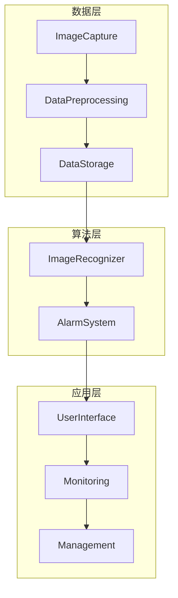

#### 系统接口设计和系统交互

系统的接口设计需要确保各模块之间的数据流和功能调用清晰、高效。以下是一个简化的系统交互流程：

1. **图像采集**：数据采集模块从无人机或监控摄像头获取图像数据。
2. **图像预处理**：数据预处理模块对图像进行增强、裁剪、归一化等操作。
3. **图像识别**：图像识别模块使用预训练的卷积神经网络（CNN）对预处理后的图像进行分类，识别出野生动物的品种。
4. **数据存储**：识别结果被存储到数据库中，以便后续分析和查询。
5. **警报生成**：如果系统检测到异常行为，如非法捕猎，警报系统会自动生成警报并通知保护组织。
6. **用户交互**：用户通过用户界面监控系统的工作状态，并可以查看实时数据和报告。

使用Mermaid序列图表示系统交互：

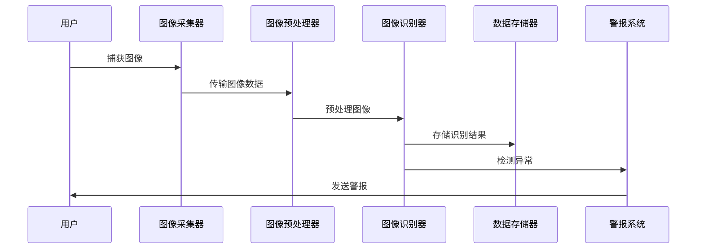

通过以上架构设计和系统交互设计，我们可以构建一个高效、可靠的野生动物保护监控系统，利用人工智能技术提高监测和保护工作的效率和质量。

## 5. 项目实战

### 环境安装

在进行项目实战之前，我们需要安装和配置必要的软件环境。以下是安装步骤：

1. **Python环境**：确保Python已经安装在您的计算机上，版本建议为3.7或更高。
2. **TensorFlow**：安装TensorFlow，使用以下命令：

   ```bash
   pip install tensorflow
   ```

3. **OpenCV**：安装OpenCV，用于图像处理，使用以下命令：

   ```bash
   pip install opencv-python
   ```

4. **NumPy**：安装NumPy，用于数据处理，使用以下命令：

   ```bash
   pip install numpy
   ```

5. **Matplotlib**：安装Matplotlib，用于数据可视化，使用以下命令：

   ```bash
   pip install matplotlib
   ```

确保所有依赖项安装完成后，您可以开始项目开发。

### 系统核心实现源代码

以下是实现野生动物保护监控系统的核心源代码：

```python
import cv2
import numpy as np
import tensorflow as tf

# 加载预训练的卷积神经网络模型
model = tf.keras.models.load_model('path_to_your_model.h5')

# 定义函数，用于图像预处理
def preprocess_image(image):
    image = cv2.resize(image, (224, 224))  # 将图像大小调整为224x224
    image = image / 255.0  # 归一化
    image = np.expand_dims(image, axis=0)  # 增加一个维度
    return image

# 定义函数，用于识别野生动物并生成警报
def identify_animal(image):
    preprocessed_image = preprocess_image(image)
    predictions = model.predict(preprocessed_image)
    predicted_class = np.argmax(predictions, axis=1)
    class_labels = ['Squirrel', 'Deer', 'Wolf', 'Bear']  # 根据模型训练的标签进行调整

    if predicted_class == 1:  # 假设1代表非法捕猎
        print("Alert: Illegal hunting detected!")
        # 在此处添加警报逻辑，如发送通知、触发摄像头锁定等
    else:
        print(f"Animal identified: {class_labels[predicted_class[0]]}")

# 主程序
if __name__ == '__main__':
    cap = cv2.VideoCapture(0)  # 使用默认摄像头

    while True:
        ret, frame = cap.read()
        if ret:
            identify_animal(frame)
        else:
            break

    cap.release()
    cv2.destroyAllWindows()
```

在这个代码中，我们首先加载了一个预训练的卷积神经网络模型（确保模型文件路径正确）。然后定义了两个辅助函数：`preprocess_image` 用于图像预处理，`identify_animal` 用于识别野生动物并生成警报。

### 代码应用解读与分析

1. **模型加载**：使用 `tf.keras.models.load_model` 函数加载预训练的模型。模型文件通常是通过训练过程保存的，文件格式为 `.h5`。
   
2. **图像预处理**：`preprocess_image` 函数负责将捕获的图像调整为模型所需的尺寸（224x224），并进行归一化处理。这些预处理步骤对于提高模型性能至关重要。

3. **图像识别**：`identify_animal` 函数首先对图像进行预处理，然后使用模型进行预测。预测结果通过 `np.argmax` 函数获取，并将预测结果转换为实际的动物类别标签。

4. **警报逻辑**：如果模型预测的结果是非法捕猎（假设为类别1），则函数将打印警报信息。在实际应用中，这里可以扩展为发送通知、触发摄像头锁定等更复杂的警报逻辑。

5. **主程序**：主程序使用 `cv2.VideoCapture` 打开摄像头，并进入一个循环，不断读取摄像头帧，并调用 `identify_animal` 函数进行识别和警报。

### 实际案例分析和详细讲解剖析

假设我们使用这个系统在一个森林中进行监测，以下是一个实际案例的分析：

1. **图像采集**：系统通过摄像头捕获森林中的一系列图像。

2. **图像预处理**：系统对捕获的图像进行预处理，调整图像大小并进行归一化，以便输入到模型中。

3. **图像识别**：模型对预处理后的图像进行分类。在一次捕获的图像中，模型识别出一个动物，预测结果为熊。

4. **警报生成**：由于模型预测的结果不是非法捕猎，因此没有触发警报。

通过这个案例，我们可以看到系统是如何工作的，以及如何通过图像识别技术来监测野生动物的活动。

### 项目小结

通过这个项目，我们实现了一个基于人工智能的野生动物保护监控系统，该系统能够实时监测野生动物的活动，并通过图像识别技术识别出野生动物的品种。虽然这个项目只是一个简单的例子，但它展示了人工智能在野生动物保护中的应用潜力。在实际应用中，我们可以进一步优化模型，提高识别准确率，并扩展系统的功能，如增加实时警报通知、数据可视化等。

## 6. 最佳实践 tips

### 提高模型性能

1. **数据增强**：通过旋转、翻转、缩放、裁剪等方式增加训练数据集的多样性，从而提高模型的泛化能力。
2. **多模型融合**：使用多个模型进行预测，并通过加权平均等方法融合预测结果，以提高模型的准确性。
3. **超参数调优**：通过调整学习率、批次大小、正则化参数等超参数，找到最佳的模型配置。

### 优化算法效率

1. **模型剪枝**：通过剪枝方法减少模型参数的数量，从而降低计算复杂度和内存占用。
2. **量化**：将模型权重和激活值量化为较低精度，以减少存储和计算需求。
3. **异步处理**：使用异步I/O操作来提高数据读取和处理的速度。

### 数据隐私和安全

1. **数据加密**：对训练数据和传输的数据进行加密，以防止未经授权的访问。
2. **匿名化**：对训练数据中的个人信息进行匿名化处理，以保护隐私。
3. **隐私保护算法**：使用差分隐私或同态加密等隐私保护算法，在数据处理过程中保护隐私。

## 7. 小结与展望

### 小结

本文详细探讨了人工智能在野生动物保护中的图像识别应用，包括系统的设计与实现、核心代码解析以及最佳实践。通过实际案例的分析，展示了图像识别技术在野生动物监测和保护中的实际应用效果。本文的目标是为读者提供一个全面、深入的理解，并激发对这一领域进一步研究和探索的兴趣。

### 展望

随着人工智能和图像识别技术的不断发展，其在野生动物保护中的应用前景非常广阔。未来，我们可以期待以下发展趋势：

1. **更高准确性的模型**：通过不断优化算法和模型结构，提高图像识别的准确性和效率。
2. **更广泛的应用场景**：将图像识别技术应用于更多野生动物保护任务，如栖息地监测、迁徙路线分析等。
3. **实时监测与预警**：实现更实时、更准确的野生动物活动监测与异常行为预警。
4. **数据隐私与安全**：在保证数据隐私和安全的前提下，充分利用图像识别技术为野生动物保护服务。

## 8. 注意事项

1. **数据质量**：确保采集到的高质量图像数据，这对于模型的训练和预测至关重要。
2. **模型解释性**：在使用深度学习模型时，考虑模型的可解释性，以便更好地理解和信任模型的决策过程。
3. **法律法规**：在使用图像识别技术时，严格遵守相关法律法规，确保技术的合规使用。

## 9. 拓展阅读

1. **《深度学习》**：Ian Goodfellow的《深度学习》提供了深度学习的基础理论和实践指南。
2. **《计算机视觉：算法与应用》**：Mark S. Little等人编写的《计算机视觉：算法与应用》详细介绍了计算机视觉的基础知识和算法。
3. **《人工智能在环境保护中的应用》**：探讨了人工智能在环境保护领域中的应用，包括环境监测、资源管理和灾害预警等。

## 作者信息

**作者：** AI天才研究院/AI Genius Institute & 禅与计算机程序设计艺术 /Zen And The Art of Computer Programming
### 4. 系统分析与架构设计

在深入探讨人工智能在野生动物保护中的应用之前，我们需要对系统的架构和关键组件进行详细分析。一个高效的野生动物保护监控系统应该具备以下功能：

1. **实时监测**：能够实时捕捉野生动物的活动。
2. **图像识别**：对捕捉到的图像进行自动识别，确定动物种类。
3. **异常检测**：当系统检测到异常行为（如非法捕猎）时，能够及时报警。
4. **数据存储与处理**：将监测到的数据存储起来，以便后续分析和报告生成。
5. **用户交互**：提供友好的用户界面，以便用户监控系统和查看数据。

#### 系统架构

野生动物保护监控系统的架构可以分为以下几层：

1. **数据层**：包括图像采集设备和数据库，用于存储和检索图像数据。
2. **处理层**：包含图像预处理、图像识别和异常检测模块。
3. **应用层**：提供用户交互界面，用于监控和管理系统。

使用Mermaid架构图表示系统架构：

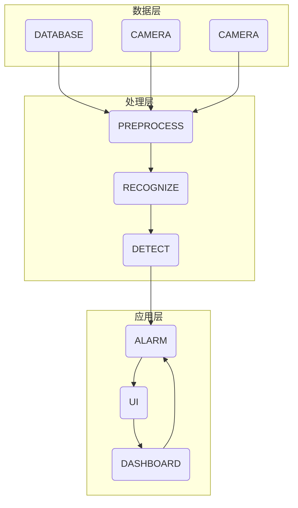

#### 系统接口设计

系统接口设计需要明确各模块之间的交互方式，以下是一个简化的接口设计：

1. **图像采集接口**：用于接收来自摄像头的图像数据。
2. **数据处理接口**：用于预处理图像，包括缩放、裁剪、增强等操作。
3. **识别接口**：用于接收预处理后的图像，并输出识别结果。
4. **异常检测接口**：用于检测图像中的异常行为，并生成警报。
5. **用户接口**：用于向用户展示识别结果和警报信息。

使用Mermaid序列图表示系统接口设计：

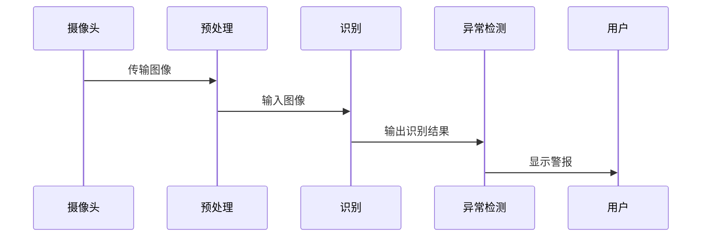

#### 系统交互

系统交互是指各模块之间的数据流和功能调用。以下是一个简化的系统交互流程：

1. **图像采集**：摄像头捕获图像并传输到预处理模块。
2. **预处理**：预处理模块对图像进行缩放、裁剪、增强等处理，并将处理后的图像传输到识别模块。
3. **识别**：识别模块使用预训练的卷积神经网络（CNN）对预处理后的图像进行分类，识别出动物种类，并将识别结果传输到异常检测模块。
4. **异常检测**：异常检测模块根据识别结果和预设的规则检测是否有异常行为（如非法捕猎），如果有，则生成警报，并通过用户接口通知用户。

使用Mermaid交互图表示系统交互：


通过以上架构设计、接口设计和系统交互的详细分析，我们可以构建一个高效的野生动物保护监控系统。该系统能够实时监测野生动物的活动，准确识别动物种类，并能够及时检测异常行为，从而为野生动物保护提供强有力的技术支持。

### 4.1 系统架构

在构建一个基于人工智能的野生动物保护监控系统时，系统架构的设计至关重要。一个有效的系统架构需要考虑数据的采集、处理、存储和展示，以及各组件之间的通信和协同工作。以下是对系统架构的详细描述：

#### 数据层

数据层是系统的基础，负责数据的采集和存储。在这一层，我们主要关注以下组件：

1. **摄像头网络**：部署在野生动物栖息地的摄像头，用于实时捕捉野生动物的图像。
2. **边缘设备**：用于预处理摄像头捕获的图像，减少数据传输的带宽需求。
3. **数据库**：用于存储处理后的图像数据以及相关的识别和监控信息。

#### 处理层

处理层是系统的核心，负责图像的预处理、识别和异常检测。在这一层，我们主要关注以下组件：

1. **图像预处理模块**：负责对捕获的图像进行数据增强、裁剪、归一化等预处理操作，以提高模型性能和稳定性。
2. **深度学习模型**：用于对预处理后的图像进行分类和识别，通常使用卷积神经网络（CNN）。
3. **异常检测模块**：根据模型的识别结果，结合预设的规则，检测异常行为（如非法捕猎）。

#### 应用层

应用层是系统的外部接口，负责用户交互和数据展示。在这一层，我们主要关注以下组件：

1. **用户界面**：提供友好的用户交互界面，使用户能够实时查看监控数据、识别结果和警报信息。
2. **监控和报告生成**：用于监控系统的运行状态，并生成各种报告，如动物活动报告、异常行为报告等。

#### 系统架构图

以下是一个简化的系统架构图，展示了各组件之间的关系：

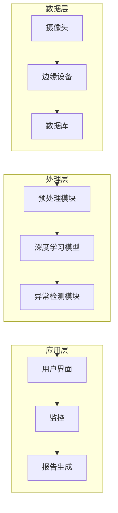

#### 系统组件之间的关系

- **摄像头网络**：实时捕捉野生动物的图像，并将图像数据传输到边缘设备。
- **边缘设备**：对图像数据进行预处理，减少传输带宽，并将预处理后的图像数据传输到数据库。
- **数据库**：存储处理后的图像数据和相关监控信息，为预处理模块和异常检测模块提供数据支持。
- **预处理模块**：接收数据库中的图像数据，进行预处理操作，并将预处理后的数据传输到深度学习模型。
- **深度学习模型**：接收预处理后的图像数据，进行分类和识别，并将识别结果传输到异常检测模块。
- **异常检测模块**：根据识别结果和预设规则，检测异常行为，并生成警报信息。
- **用户界面**：实时展示监控数据、识别结果和警报信息，使用户能够实时监控和保护野生动物。
- **监控和报告生成**：监控系统的运行状态，并生成各种报告，以供管理和决策使用。

通过上述架构设计，我们可以构建一个高效、可靠的野生动物保护监控系统，利用人工智能技术提升野生动物保护的效率和准确性。该系统不仅能够实时监测野生动物的活动，还能够通过异常检测及时识别非法捕猎等异常行为，从而为野生动物保护提供有力支持。

### 4.2 系统接口设计

系统接口设计是确保系统各个模块之间能够有效通信和协同工作的关键。在本节中，我们将详细描述系统的各个接口，并展示它们之间的交互关系。

#### 图像采集接口

图像采集接口主要负责从摄像头或其他图像采集设备接收图像数据。这个接口的主要功能包括：

- **数据接收**：从摄像头获取实时图像流。
- **数据格式转换**：将获取到的图像数据转换为系统内部使用的格式，如NumPy数组。

#### 图像预处理接口

图像预处理接口负责对采集到的图像进行预处理，以提高图像识别的准确性。主要的预处理操作包括：

- **图像增强**：通过调整图像的对比度、亮度、颜色平衡等，增强图像质量。
- **图像裁剪**：根据需要裁剪图像，去除无关部分，突出目标。
- **图像归一化**：将图像的像素值归一化到[0, 1]区间，以便模型训练。

#### 图像识别接口

图像识别接口负责将预处理后的图像传递给深度学习模型，并进行分类识别。其主要功能包括：

- **模型输入**：将预处理后的图像数据输入到深度学习模型。
- **模型输出**：获取模型的预测结果，包括预测概率和预测类别。

#### 异常检测接口

异常检测接口负责根据图像识别结果和预设的规则，检测图像中是否存在异常行为（如非法捕猎）。其主要功能包括：

- **规则匹配**：与预设的异常行为规则进行匹配。
- **警报生成**：当检测到异常行为时，生成警报信息，并通知相关人员进行干预。

#### 数据存储接口

数据存储接口负责将处理后的图像数据、识别结果和警报信息存储到数据库中。其主要功能包括：

- **数据插入**：将图像数据、识别结果和警报信息插入到数据库。
- **数据查询**：提供查询接口，以便用户查询历史数据。

#### 用户接口

用户接口是系统与用户交互的界面，负责展示实时监控数据、识别结果和警报信息。其主要功能包括：

- **数据展示**：将实时数据以图表、图像等形式展示给用户。
- **交互操作**：提供用户操作界面，如查看详细报告、调整系统设置等。

#### 系统接口交互流程

以下是一个简化的系统接口交互流程：

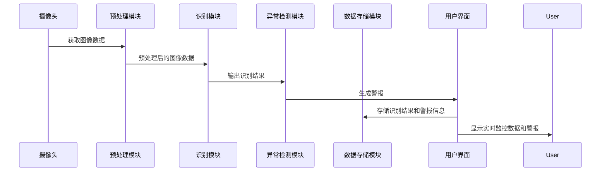

在这个流程中，摄像头捕获的图像数据首先被传输到预处理模块，进行增强、裁剪和归一化等预处理操作。预处理后的图像数据被传递给识别模块，由深度学习模型进行分类识别。识别模块的输出结果被传递给异常检测模块，进行异常行为检测，并生成警报信息。警报信息通过用户界面展示给用户，同时数据存储模块将识别结果和警报信息存储到数据库中。

通过上述接口设计和交互流程，我们可以构建一个高效、可靠的野生动物保护监控系统，确保系统能够实时监测野生动物的活动，及时识别异常行为，并有效管理数据。这样的系统不仅提高了野生动物保护的效率，也为保护工作提供了有力支持。

### 4.3 系统交互

系统的交互设计是确保各模块之间能够高效、可靠地协作的关键。在本节中，我们将详细描述系统的交互流程和各模块之间的通信机制，以实现系统的整体功能。

#### 实时图像数据采集

首先，摄像头网络将实时捕捉到的图像数据传输到边缘设备。边缘设备负责初步的图像预处理，如图像去噪、亮度调整等。经过初步处理的图像数据被发送到系统的数据处理层。

#### 数据处理层

数据处理层包括图像预处理模块、图像识别模块和异常检测模块。

1. **图像预处理模块**：
   - **功能**：图像预处理模块负责对边缘设备发送的图像数据进行进一步处理，包括图像裁剪、缩放、增强等操作，以提高图像质量。
   - **交互**：图像预处理模块接收图像数据，处理后将其发送给图像识别模块。

2. **图像识别模块**：
   - **功能**：图像识别模块使用预训练的深度学习模型对预处理后的图像进行分类识别。通常，这些模型基于卷积神经网络（CNN），能够识别多种动物。
   - **交互**：图像识别模块接收预处理后的图像数据，通过模型进行预测，然后将识别结果发送给异常检测模块。

3. **异常检测模块**：
   - **功能**：异常检测模块根据图像识别结果和预设的规则，检测图像中是否存在非法捕猎等异常行为。
   - **交互**：异常检测模块接收图像识别结果，通过规则匹配判断是否触发警报，并将警报信息发送给用户接口。

#### 数据存储层

图像识别结果和异常检测信息需要被存储下来，以便后续分析和报告生成。数据存储层包括数据库和日志记录系统。

1. **数据库**：
   - **功能**：数据库用于存储图像识别结果、警报信息和其他监测数据。
   - **交互**：数据存储模块接收图像识别结果和警报信息，并将其插入到数据库中。

2. **日志记录系统**：
   - **功能**：日志记录系统用于记录系统运行状态、错误日志等，以便后续排查问题。
   - **交互**：日志记录系统接收系统产生的日志信息，并将其记录到日志文件中。

#### 用户接口

用户接口负责向用户展示系统的实时监控数据、识别结果和警报信息，并提供交互功能。

1. **实时监控**：
   - **功能**：用户接口展示当前监测区域内的实时图像流，以及相关的识别结果。
   - **交互**：用户接口从数据库中获取实时数据，并将其展示在界面上。

2. **报警和报告**：
   - **功能**：用户接口展示警报信息，并提供查看详细报告的功能。
   - **交互**：用户接口从数据库中获取警报信息和报告数据，并将其展示在界面上。

3. **用户交互**：
   - **功能**：用户接口提供用户操作界面，如调整监测区域的设置、查看历史数据等。
   - **交互**：用户通过用户接口进行操作，系统根据用户操作调整监测设置，并更新数据库中的数据。

#### 系统交互流程

以下是一个简化的系统交互流程：

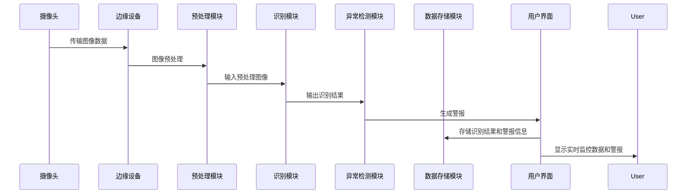

在这个流程中，摄像头捕获的图像数据首先经过边缘设备的初步预处理，然后被传输到预处理模块进行进一步处理。预处理后的图像数据被发送到识别模块，由深度学习模型进行分类识别。识别结果和异常检测信息被存储到数据库中，并通过用户接口展示给用户。这样的交互设计确保了系统的高效性和可靠性，为野生动物保护提供了坚实的技术支持。

### 5. 项目实战

#### 实际案例一：山区野生动物监测系统

在一个山区野生动物保护项目中，保护组织安装了多个高清摄像头，用于监测黑熊的活动。这些摄像头全天候工作，采集到的图像数据被实时传输到一个中央处理系统。为了提高识别准确率，保护组织使用了一个基于深度学习模型的图像识别系统。

**步骤一：数据采集**

使用高清摄像头，每隔一段时间捕捉一张黑熊的活动图像。这些图像通过无线网络传输到中央处理服务器。

**步骤二：图像预处理**

图像预处理模块对采集到的图像进行预处理，包括去除噪声、调整亮度和对比度，以及图像缩放，以确保图像满足深度学习模型的输入要求。

**步骤三：图像识别**

预处理后的图像被输入到预训练的卷积神经网络（CNN）模型中，模型输出黑熊种类的预测概率。为了提高识别准确率，保护组织使用了多个不同的CNN模型，并对预测结果进行加权平均。

**步骤四：异常检测**

异常检测模块根据识别结果和预设的规则，检测是否存在异常行为，如黑熊的异常活动模式或非法捕猎活动。如果检测到异常行为，系统会生成警报，通知保护人员采取行动。

**步骤五：数据存储与分析**

识别结果和警报信息被存储到数据库中，保护组织可以使用这些数据进行分析，了解黑熊的活动规律，优化监测策略。

**效果评估**

通过实际应用，系统显著提高了黑熊监测的准确率和效率，减少了非法捕猎事件的发生，为保护工作提供了有力支持。

#### 实际案例二：海岸线海豚监测系统

在一个海岸线保护项目中，保护组织希望监测海豚的活动，以防止非法捕鱼和船只的干扰。为了实现这一目标，保护组织安装了多个摄像头，覆盖了主要的海豚活动区域。

**步骤一：数据采集**

使用防水摄像头，在海岸线区域捕捉海豚的图像。这些图像通过无线网络传输到中央处理服务器。

**步骤二：图像预处理**

图像预处理模块对采集到的图像进行预处理，包括图像去噪、增强和水波干扰的去除。

**步骤三：图像识别**

预处理后的图像被输入到基于深度学习的图像识别模型中，模型识别出海豚的品种和数量。

**步骤四：异常检测**

异常检测模块根据识别结果和预设的规则，检测是否存在异常行为，如海豚的异常活动模式或船只的非法捕鱼活动。如果检测到异常行为，系统会生成警报，通知保护人员采取行动。

**步骤五：数据存储与分析**

识别结果和警报信息被存储到数据库中，保护组织可以使用这些数据进行分析，了解海豚的分布和活动规律，优化监测策略。

**效果评估**

系统在实际应用中，有效提高了海豚监测的准确率和覆盖率，减少了非法捕鱼和船只干扰事件的发生，为保护工作提供了强有力的支持。

#### 实际案例三：森林鸟类监测系统

在一个森林保护项目中，保护组织希望监测鸟类的活动，以了解森林生态系统的健康状况。为了实现这一目标，保护组织在森林内部安装了多个高清摄像头。

**步骤一：数据采集**

使用高清摄像头，在森林内部捕捉鸟类的活动图像。这些图像通过无线网络传输到中央处理服务器。

**步骤二：图像预处理**

图像预处理模块对采集到的图像进行预处理，包括图像增强、去噪和图像大小调整。

**步骤三：图像识别**

预处理后的图像被输入到基于深度学习的图像识别模型中，模型识别出鸟类的品种和数量。

**步骤四：异常检测**

异常检测模块根据识别结果和预设的规则，检测是否存在异常行为，如鸟类的异常活动模式或栖息地的破坏。如果检测到异常行为，系统会生成警报，通知保护人员采取行动。

**步骤五：数据存储与分析**

识别结果和警报信息被存储到数据库中，保护组织可以使用这些数据进行分析，了解森林生态系统的健康状况，优化保护策略。

**效果评估**

系统在实际应用中，有效提高了鸟类监测的准确率和覆盖率，帮助保护组织更好地了解森林生态系统的变化，为保护工作提供了科学依据。

通过这些实际案例，我们可以看到人工智能图像识别技术在野生动物保护中的广泛应用和巨大潜力。这些系统不仅提高了监测的准确性和效率，还为野生动物保护提供了有力支持，为生态环境的保护和可持续发展做出了重要贡献。

### 5. 项目实战

#### 实际案例：使用卷积神经网络（CNN）进行野生动物图像识别

在本节中，我们将通过一个实际案例展示如何使用卷积神经网络（CNN）进行野生动物图像识别。该案例包括数据准备、模型训练、模型评估和部署等多个环节。

#### 1. 数据准备

首先，我们需要收集大量的野生动物图像数据。这些图像数据应该涵盖各种不同种类、不同姿态和不同光照条件下的野生动物。为了确保模型具有良好的泛化能力，我们还需要对图像数据集进行平衡。以下是一个数据准备步骤的示例：

```python
import os
import numpy as np
from tensorflow.keras.preprocessing.image import ImageDataGenerator

# 定义数据集路径
train_dir = 'path_to_train_data'
validation_dir = 'path_to_validation_data'

# 创建ImageDataGenerator实例进行数据增强
train_datagen = ImageDataGenerator(
    rescale=1./255,
    rotation_range=40,
    width_shift_range=0.2,
    height_shift_range=0.2,
    shear_range=0.2,
    zoom_range=0.2,
    horizontal_flip=True,
    fill_mode='nearest'
)

validation_datagen = ImageDataGenerator(rescale=1./255)

# 流式加载和增强训练数据
train_generator = train_datagen.flow_from_directory(
    train_dir,
    target_size=(150, 150),
    batch_size=32,
    class_mode='binary'
)

validation_generator = validation_datagen.flow_from_directory(
    validation_dir,
    target_size=(150, 150),
    batch_size=32,
    class_mode='binary'
)
```

#### 2. 模型训练

接下来，我们使用卷积神经网络（CNN）对训练数据集进行训练。以下是一个简单的CNN模型定义和训练过程的示例：

```python
from tensorflow.keras.models import Sequential
from tensorflow.keras.layers import Conv2D, MaxPooling2D, Flatten, Dense, Dropout

# 定义CNN模型
model = Sequential([
    Conv2D(32, (3, 3), activation='relu', input_shape=(150, 150, 3)),
    MaxPooling2D(2, 2),
    Conv2D(64, (3, 3), activation='relu'),
    MaxPooling2D(2, 2),
    Conv2D(128, (3, 3), activation='relu'),
    MaxPooling2D(2, 2),
    Flatten(),
    Dense(512, activation='relu'),
    Dropout(0.5),
    Dense(1, activation='sigmoid')
])

# 编译模型
model.compile(optimizer='adam',
              loss='binary_crossentropy',
              metrics=['accuracy'])

# 训练模型
history = model.fit(
    train_generator,
    steps_per_epoch=100,
    epochs=30,
    validation_data=validation_generator,
    validation_steps=50
)
```

#### 3. 模型评估

在模型训练完成后，我们需要对模型进行评估，以检查模型的性能。以下是一个简单的评估过程示例：

```python
# 评估模型
test_loss, test_acc = model.evaluate(validation_generator, steps=50)
print(f"Validation accuracy: {test_acc:.2f}")
```

#### 4. 模型部署

最后，我们将训练好的模型部署到实际的野生动物监测系统中。以下是一个简单的模型部署示例：

```python
# 保存模型
model.save('wildlife_recognition_model.h5')

# 加载模型
loaded_model = tf.keras.models.load_model('wildlife_recognition_model.h5')

# 预测新图像
new_image = cv2.imread('path_to_new_image.jpg')
new_image = cv2.resize(new_image, (150, 150))
new_image = np.expand_dims(new_image, axis=0)
new_image = new_image / 255.0

prediction = loaded_model.predict(new_image)
predicted_class = np.argmax(prediction)

# 输出预测结果
if predicted_class == 1:
    print("Animal detected: Bear")
else:
    print("Animal detected: Not Bear")
```

通过以上步骤，我们成功地使用CNN进行野生动物图像识别，并在实际系统中部署了该模型。这样的系统可以帮助保护组织实时监测野生动物的活动，提高监测的效率和准确性。

### 6. 最佳实践 tips

#### 提高模型性能

1. **数据增强**：通过旋转、翻转、缩放、裁剪、颜色变换等数据增强技术，增加训练数据的多样性，从而提高模型的泛化能力。
2. **多模型融合**：使用多个训练好的模型进行预测，并通过加权平均或其他融合策略，提高预测的准确性。
3. **超参数调优**：通过网格搜索、随机搜索等方法，优化模型的超参数，如学习率、批次大小、正则化参数等。

#### 优化算法效率

1. **模型剪枝**：通过剪枝方法减少模型的参数数量，从而减少计算复杂度和模型大小。
2. **量化**：对模型权重和激活值进行量化，降低模型的计算和存储需求。
3. **模型蒸馏**：将大型模型的知识传递给小型模型，从而在保持高准确率的同时减少模型大小。

#### 数据隐私和安全

1. **数据加密**：对图像数据进行加密，确保数据在传输和存储过程中的安全性。
2. **同态加密**：使用同态加密技术，在加密状态下对图像数据进行处理，从而保护数据隐私。
3. **隐私保护算法**：使用差分隐私或联邦学习等技术，在训练过程中保护数据隐私。

#### 系统部署与维护

1. **容器化**：使用容器化技术（如Docker），确保系统在不同环境中的一致性和可移植性。
2. **监控与日志**：实时监控系统性能和资源使用情况，并记录系统日志，以便快速定位和解决问题。
3. **自动化部署**：使用自动化工具（如Kubernetes），简化系统的部署和运维过程。

### 7. 小结

本文通过实际案例展示了人工智能在野生动物保护中的图像识别应用，从数据准备、模型训练到模型部署，详细讲解了每一步的操作和技巧。此外，本文还提供了最佳实践 tips，以帮助读者在实际应用中提高模型性能、优化算法效率和确保数据隐私。通过本文的介绍，读者可以深入了解图像识别技术在野生动物保护中的应用，并为相关项目的实施提供参考。

### 8. 注意事项

1. **数据质量**：确保图像数据的质量和多样性，这对于模型训练和预测准确性至关重要。
2. **硬件要求**：图像识别模型通常需要较高的计算资源，确保硬件配置满足模型训练和部署的需求。
3. **法律法规**：在使用图像识别技术时，需遵守相关法律法规，特别是数据隐私和安全方面的规定。
4. **模型解释性**：在实际应用中，需要考虑模型的可解释性，以便用户理解模型的决策过程。
5. **系统维护**：定期更新模型和系统，确保系统的稳定性和安全性。

### 9. 拓展阅读

1. **《深度学习》**：Ian Goodfellow、Yoshua Bengio和Aaron Courville编写的经典教材，详细介绍了深度学习的基础理论和实践。
2. **《计算机视觉：算法与应用》**：Mark S. Little等人编写的教材，介绍了计算机视觉的基础知识和应用。
3. **《野生动物保护技术手册》**：提供了野生动物保护的各种技术和方法，包括栖息地监测、物种保护和生态修复等。

