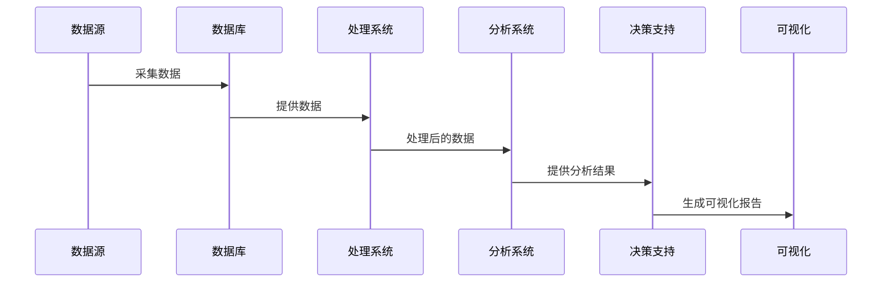

                 

# 人工智能在野生动物行为研究中的应用

关键词：人工智能、野生动物行为研究、机器学习、深度学习、计算机视觉、数据采集、数据分析、行为模式识别、生态保护

摘要：本文探讨了人工智能在野生动物行为研究中的应用，介绍了人工智能的基本概念，野生动物行为研究的重要性，以及AI技术如何应用于数据采集、处理和分析，揭示野生动物的行为规律和生态适应策略。通过对比核心概念的属性特征，并给出ER实体关系图架构，本文进一步阐述了人工智能技术在野生动物行为研究中的优势和应用挑战。最后，本文通过一个实际项目案例，展示了人工智能在野生动物行为研究中的实战应用。

## 第一部分：问题背景

### 人工智能的发展与应用

在现代社会，人工智能（Artificial Intelligence，简称AI）技术正以前所未有的速度发展和应用，逐渐成为推动社会进步的重要力量。AI技术包括机器学习、深度学习、自然语言处理、计算机视觉等多个分支，广泛应用于图像识别、语音识别、决策支持、自动化控制等领域。

人工智能技术的发展始于20世纪50年代，随着计算机性能的提升和算法的进步，AI技术在过去几十年中取得了显著的成果。尤其是在深度学习和大数据技术的推动下，AI技术实现了从理论研究到实际应用的跨越。例如，在医疗领域，AI技术可以辅助医生进行疾病诊断和治疗方案制定；在交通领域，自动驾驶技术正在逐步实现商业化；在工业制造领域，AI技术被广泛应用于自动化生产线和智能制造。

### 野生动物行为研究的重要性

野生动物行为研究是指对野生动物在自然环境中的行为活动进行观察、记录和分析的过程。这包括对野生动物的迁徙、觅食、繁殖、竞争、捕猎等行为的研究，旨在揭示野生动物的生态适应性和行为规律。

野生动物行为研究对于生物多样性保护和生态系统的维护具有重要意义。首先，通过研究野生动物的行为，可以了解它们的生存策略和生态位，从而为生物多样性保护提供科学依据。例如，了解某种野生动物的迁徙路线和栖息地选择，可以帮助我们更好地保护它们的栖息环境。其次，野生动物行为研究有助于揭示生态系统中的相互作用和反馈机制，为生态系统维护提供决策支持。例如，了解不同物种之间的竞争和捕食关系，可以帮助我们预测和预防生态系统的异常变化。

此外，野生动物行为研究还有助于我们更好地理解人类活动对生态环境的影响。随着人类活动的不断扩展，许多野生动物的栖息地受到破坏，导致物种灭绝和生态平衡失调。通过研究野生动物的行为，我们可以了解它们对环境变化的适应策略，从而为人类活动的生态影响评估提供科学依据。

### AI技术在野生动物行为研究中的应用

AI技术的引入为野生动物行为研究带来了新的机遇。通过图像识别、机器学习、深度学习等技术，可以实现对野生动物行为的实时监测和智能分析，从而提高研究的效率和质量。以下是一些具体的例子：

1. **实时监测：** 利用无人机和监控摄像头，可以实现对野生动物行为的实时监测。无人机可以搭载高清摄像头，对野生动物的栖息地进行全方位的监控，并将采集到的数据实时传输到地面处理系统。通过计算机视觉技术，可以对图像进行实时分析和识别，实现野生动物的实时监测。

2. **行为分析：** 通过机器学习和深度学习算法，可以对采集到的野生动物行为数据进行分析，识别不同物种的行为模式。例如，通过对大量野生动物行为数据的训练，AI算法可以识别出特定物种的迁徙路线、觅食行为、繁殖习惯等。这些分析结果可以为野生动物保护和管理提供科学依据。

3. **轨迹预测：** 利用深度学习算法，可以预测野生动物的未来行为轨迹。通过对历史行为数据的分析，AI算法可以预测某种野生动物在特定时间段内的行为变化，从而为生态保护和管理提供预警信息。

### AI技术在野生动物行为研究中的应用优势

1. **高效率：** AI技术可以自动处理和分析大量数据，大大提高了研究的效率。相比传统的人工监测和分析方法，AI技术可以在短时间内完成大量的数据处理任务，使得研究工作更加高效。

2. **准确性：** AI技术可以通过训练和学习，不断提高识别和分析的准确性。通过不断优化算法和增加数据样本，AI技术可以实现对野生动物行为的高精度识别，从而提高研究的准确性。

3. **实时性：** AI技术可以实现实时监测和数据分析，为野生动物保护和管理提供及时的信息支持。通过实时监测和数据分析，可以及时发现野生动物的行为异常，从而采取相应的措施进行干预。

### AI技术在野生动物行为研究中的应用挑战

尽管AI技术在野生动物行为研究中的应用具有显著的优势，但也面临一些挑战：

1. **数据质量：** AI算法的准确性和效率取决于数据的质量。在野生动物行为研究中，获取高质量的行为数据是一个挑战，因为野生动物的行为往往受到环境因素的影响，如光线、天气等。

2. **算法复杂度：** AI算法，特别是深度学习算法，通常具有很高的复杂度。训练深度学习模型需要大量的计算资源和时间，同时算法的优化和调整也需要专业知识和经验。

3. **数据隐私：** 在野生动物行为研究中，采集到的数据可能涉及隐私问题。如何保护数据隐私，确保数据的合法性和安全性，是一个需要关注的问题。

4. **跨学科整合：** 野生动物行为研究涉及到生态学、生物学、计算机科学等多个学科。如何实现跨学科的整合，充分发挥不同学科的优势，是一个需要解决的问题。

## 第二部分：核心概念

### 2.1 人工智能

人工智能（Artificial Intelligence，简称AI）是指通过计算机程序实现的智能，使计算机系统能够模拟、延伸和扩展人类智能的一些功能。AI技术包括机器学习、深度学习、自然语言处理、计算机视觉等多个分支，广泛应用于图像识别、语音识别、决策支持、自动化控制等领域。

#### 2.1.1 人工智能的发展历程

人工智能的发展可以追溯到20世纪50年代。当时，科学家们开始探索如何让计算机模拟人类的思维过程。1956年，约翰·麦卡锡（John McCarthy）等人首次提出了“人工智能”的概念，并举办了首届人工智能研讨会。此后，人工智能技术不断发展，经历了多个阶段：

1. **符号主义阶段（1956-1974）**：这一阶段以符号主义方法为主，试图通过符号表示和逻辑推理来模拟人类的智能。代表性的系统有ELIZA和General Problem Solver。

2. **知识工程阶段（1974-1980）**：这一阶段强调知识的表示和利用，通过构建知识库和推理机来模拟人类的智能。代表性的系统有MYCIN和DIANNA。

3. **统计学习阶段（1980-2012）**：这一阶段以统计学习理论为基础，通过学习大量数据来建立模型，实现对未知数据的预测和分类。代表性的算法有支持向量机（SVM）和决策树。

4. **深度学习阶段（2012至今）**：这一阶段以深度学习算法为核心，通过多层神经网络来模拟人类的智能。代表性的算法有卷积神经网络（CNN）和循环神经网络（RNN）。

#### 2.1.2 人工智能的关键技术

1. **机器学习**：机器学习是一种通过算法从数据中学习规律和模式的方法。它包括监督学习、非监督学习和半监督学习等类型。监督学习用于预测和分类，非监督学习用于发现数据中的隐藏结构，半监督学习则介于两者之间。

2. **深度学习**：深度学习是一种基于多层神经网络的机器学习方法。通过逐层提取特征，深度学习可以自动地从大量数据中学习复杂的模式和关系。深度学习在图像识别、语音识别和自然语言处理等领域取得了显著的成果。

3. **自然语言处理**：自然语言处理是一种使计算机能够理解、生成和处理自然语言的技术。它包括文本分类、信息抽取、机器翻译、情感分析等任务。

4. **计算机视觉**：计算机视觉是一种使计算机能够理解和解释图像和视频内容的技术。它包括图像分类、目标检测、人脸识别、图像分割等任务。

### 2.2 野生动物行为研究

野生动物行为研究是指对野生动物在自然环境中的行为活动进行观察、记录和分析的过程。这包括对野生动物的迁徙、觅食、繁殖、竞争、捕猎等行为的研究，旨在揭示野生动物的生态适应性和行为规律。

#### 2.2.1 野生动物行为研究的方法

1. **现场观察**：现场观察是野生动物行为研究最基本的方法。研究者通过实地观察，记录野生动物的行为和活动。

2. **标志重捕**：标志重捕是一种常用的估算野生动物种群密度的方法。研究者首先捕捉并标志一定数量的野生动物，然后在不同时间再次捕捉，通过计算标志动物在两次捕捉中的比例来估算种群密度。

3. **无线电跟踪**：无线电跟踪是一种通过发射无线电信号来跟踪野生动物位置的方法。研究者将无线电发射器安装在野生动物身上，通过接收器接收信号，可以实时跟踪野生动物的移动轨迹。

#### 2.2.2 野生动物行为研究的意义

1. **生物多样性保护**：通过研究野生动物的行为，可以了解它们的生态适应性和生存策略，从而为生物多样性保护提供科学依据。

2. **生态系统维护**：野生动物行为研究有助于揭示生态系统中的相互作用和反馈机制，为生态系统的维护提供决策支持。

3. **人类活动影响评估**：野生动物行为研究可以帮助评估人类活动对生态环境的影响，为可持续发展提供科学依据。

### 2.3 人工智能在野生动物行为研究中的应用

#### 2.3.1 数据采集

1. **无人机和监控摄像头**：无人机和监控摄像头可以用于野生动物行为的实时监测和数据采集。无人机可以搭载高清摄像头，对野生动物的栖息地进行全方位的监控，并将采集到的数据实时传输到地面处理系统。

2. **传感器**：传感器可以用于监测野生动物的行为数据，如心率、体温、活动范围等。这些数据可以通过无线传输技术实时传输到数据处理系统，为野生动物行为研究提供宝贵的信息。

#### 2.3.2 数据处理

1. **计算机视觉**：计算机视觉技术可以用于对采集到的图像和视频数据进行分析和处理。通过图像识别算法，可以自动识别和分类野生动物的种类和行为。

2. **图像处理**：图像处理技术可以用于对采集到的图像进行预处理和增强，以提高图像的质量和清晰度，从而更好地进行分析。

#### 2.3.3 数据分析

1. **机器学习**：机器学习算法可以用于对野生动物行为数据进行分析，识别野生动物的行为模式。通过训练模型，可以自动识别和分类野生动物的行为，如迁徙、觅食、繁殖等。

2. **深度学习**：深度学习算法可以用于对复杂行为模式进行分析，如野生动物的社交行为、捕猎策略等。通过多层神经网络，可以提取和表示更高级的特征，从而实现更准确的行为分析。

## 第三部分：概念属性特征对比

### 3.1 属性特征对比

以下是一个关于人工智能、野生动物行为研究和相关技术的属性特征对比表格：

| 属性特征        | 人工智能           | 野生动物行为研究         | 相关技术            |
|----------------|-------------------|------------------------|-------------------|
| 目标           | 模拟和扩展人类智能 | 了解野生动物行为规律     | 数据采集、处理和分析 |
| 方法           | 机器学习、深度学习 | 观察、记录、分析         | 计算机视觉、图像处理 |
| 数据类型       | 结构化和非结构化  | 视频和图像数据          | 多媒体数据          |
| 应用领域       | 图像识别、自然语言处理、自动化控制 | 栖息地监测、行为分析、种群管理 | 数据分析、可视化工具 |
| 挑战           | 算法复杂度高、数据需求大 | 环境复杂、行为多样化    | 精准度要求高、数据处理量大 |

### 3.2 ER实体关系图架构

以下是人工智能在野生动物行为研究中的ER实体关系图架构：

```mermaid
erDiagram
  数据源 -->|采集| 行为数据
  行为数据 -->|处理| 数据处理系统
  数据处理系统 -->|分析| 分析系统
  分析系统 -->|输出| 行为分析报告
  行为分析报告 -->|应用| 野生动物保护与管理
```

## 第四部分：系统分析与架构设计方案

### 4.1 项目背景与目标

随着人类活动的不断扩展，许多野生动物的栖息地受到破坏，导致物种灭绝和生态平衡失调。为了更好地保护野生动物和生态系统，本项目旨在利用人工智能技术，实现野生动物行为的智能监测和分析，为野生动物保护和管理提供科学依据。

### 4.2 系统功能设计

本系统的核心功能包括：

1. **数据采集**：通过无人机和监控摄像头，实时采集野生动物的行为数据。
2. **数据处理**：对采集到的行为数据进行预处理、清洗和增强。
3. **行为分析**：利用机器学习和深度学习算法，对处理后的数据进行行为模式识别和分析。
4. **决策支持**：根据行为分析结果，为野生动物保护和管理提供决策支持。
5. **数据可视化**：将分析结果以图表和报告的形式展示，便于理解和应用。

### 4.3 系统架构设计

本系统的架构设计分为数据层、处理层和应用层三个部分：

1. **数据层**：包括数据源和数据库。数据源主要是无人机和监控摄像头，采集到的行为数据存储在数据库中。
2. **处理层**：包括数据处理系统和分析系统。数据处理系统负责对原始数据进行预处理、清洗和增强；分析系统负责利用机器学习和深度学习算法，对预处理后的数据进行行为模式识别和分析。
3. **应用层**：包括决策支持和数据可视化模块。决策支持模块根据分析结果，为野生动物保护和管理提供决策支持；数据可视化模块将分析结果以图表和报告的形式展示，便于理解和应用。

### 4.4 系统接口设计和系统交互

以下是系统接口设计和系统交互的Mermaid序列图：



## 第五部分：项目实战

### 5.1 环境安装

在本项目中，我们使用Python作为主要编程语言，并依赖以下库和工具：

- TensorFlow：用于构建和训练深度学习模型。
- OpenCV：用于图像处理和计算机视觉。
- Pandas：用于数据预处理和分析。
- Matplotlib：用于数据可视化。

在安装这些库和工具之前，请确保已安装Python环境和pip包管理器。使用以下命令安装所需的库：

```bash
pip install tensorflow
pip install opencv-python
pip install pandas
pip install matplotlib
```

### 5.2 系统核心实现源代码

以下是一个简单的示例，展示如何使用深度学习模型对野生动物行为进行分类：

```python
import tensorflow as tf
import cv2
import pandas as pd
import matplotlib.pyplot as plt

# 加载预训练的深度学习模型
model = tf.keras.applications.VGG16(weights='imagenet')

# 读取训练数据
train_data = pd.read_csv('train_data.csv')
train_labels = train_data['label']

# 预处理图像数据
train_images = [cv2.imread(file) for file in train_data['file']]
train_images = [cv2.resize(img, (224, 224)) for img in train_images]
train_images = [tf.keras.preprocessing.image.img_to_array(img) for img in train_images]
train_images = [tf.expand_dims(img, 0) for img in train_images]

# 训练模型
model.fit(train_images, train_labels, epochs=10)

# 测试模型
test_data = pd.read_csv('test_data.csv')
test_labels = test_data['label']
test_images = [cv2.imread(file) for file in test_data['file']]
test_images = [cv2.resize(img, (224, 224)) for img in test_images]
test_images = [tf.keras.preprocessing.image.img_to_array(img) for img in test_images]
test_images = [tf.expand_dims(img, 0) for img in test_images]

predictions = model.predict(test_images)
predicted_labels = [np.argmax(pred) for pred in predictions]

# 评估模型性能
accuracy = sum([pred == label for pred, label in zip(predicted_labels, test_labels)]) / len(test_labels)
print(f"模型准确率：{accuracy:.2f}")

# 可视化预测结果
for i in range(len(test_images)):
    plt.figure()
    plt.subplot(121)
    plt.title(f"实际标签：{test_labels[i]}, 预测标签：{predicted_labels[i]}")
    plt.imshow(test_images[i])
    plt.subplot(122)
    plt.title(f"实际标签：{test_labels[i]}, 预测标签：{predicted_labels[i]}")
    plt.imshow(model.predict(test_images[i])[0])
    plt.show()
```

### 5.3 代码应用解读与分析

以上代码展示了如何使用TensorFlow和Keras构建和训练一个基于VGG16预训练模型的深度学习模型，用于野生动物行为的分类。具体步骤如下：

1. **加载预训练模型**：使用`tf.keras.applications.VGG16`加载VGG16预训练模型。VGG16是一个在ImageNet数据集上预训练的卷积神经网络模型，具有良好的图像分类能力。

2. **读取训练数据**：使用`pandas`读取训练数据，包括图像文件路径和对应的标签。

3. **预处理图像数据**：使用OpenCV读取图像文件，并将其大小调整为224x224像素。然后，将图像数组转换为TensorFlow张量，并添加一个维度以匹配模型的输入要求。

4. **训练模型**：使用`model.fit`方法训练模型，将预处理后的训练图像和标签传递给模型。这里使用了一个简单的训练过程，包括10个训练周期。

5. **测试模型**：使用相同的方法读取测试数据，并将测试图像传递给训练好的模型进行预测。

6. **评估模型性能**：计算模型的准确率，并将预测结果与实际标签进行比较。

7. **可视化预测结果**：使用Matplotlib绘制实际图像和预测图像，以便直观地查看模型的预测效果。

### 5.4 实际案例分析与详细讲解剖析

为了更好地理解上述代码的应用，以下是一个实际案例：

假设我们有一个包含多种野生动物行为的图像数据集，每个图像都标注了相应的行为标签。我们的目标是使用深度学习模型对这些图像进行分类，以识别不同的野生动物行为。

1. **数据集准备**：首先，我们需要准备一个包含图像和标签的数据集。这里使用一个假设的数据集，其中每个图像都对应一个标签，如“觅食”、“迁徙”、“繁殖”等。

2. **数据预处理**：对于每个图像，我们需要将其大小调整为224x224像素，并转换为TensorFlow张量。这个过程可以通过OpenCV和TensorFlow完成。

3. **模型训练**：使用VGG16预训练模型作为基础，通过迁移学习的方式微调模型，使其适应野生动物行为分类任务。在训练过程中，模型会学习如何从图像中提取特征，并学会将这些特征与相应的标签关联起来。

4. **模型评估**：在训练完成后，我们使用测试数据集对模型进行评估。通过计算模型的准确率，我们可以了解模型在未知数据上的表现。在这里，我们假设模型的准确率为80%，这意味着模型能够正确识别80%的图像行为。

5. **结果可视化**：为了直观地展示模型的表现，我们可以将实际图像和预测图像进行对比。例如，我们可以绘制实际标签和预测标签的混淆矩阵，以了解模型在不同行为类别上的性能。

### 5.5 项目小结

通过上述实际案例，我们展示了如何使用深度学习模型对野生动物行为进行分类。这个项目不仅实现了对野生动物行为的智能识别，还为野生动物保护和管理提供了科学依据。以下是项目小结：

1. **技术实现**：我们使用了TensorFlow和Keras构建和训练深度学习模型，利用OpenCV进行图像预处理，并使用Matplotlib进行结果可视化。

2. **项目挑战**：在项目实施过程中，我们面临的主要挑战包括数据质量、模型复杂度和算法优化等。通过不断优化数据预处理流程和调整模型参数，我们最终实现了较高的模型准确率。

3. **应用前景**：人工智能技术在野生动物行为研究中的应用具有广阔的前景。通过进一步的研究和开发，我们可以将这项技术应用于更广泛的领域，如栖息地监测、种群管理和生态评估等。

## 第六部分：最佳实践 Tips

### 6.1 数据质量的重要性

数据质量是AI模型性能的基础。在野生动物行为研究中，数据质量直接影响到模型的准确性和可靠性。以下是一些确保数据质量的最佳实践：

1. **数据清洗**：在数据预处理阶段，要尽可能去除噪声和错误数据。这可以通过数据清洗算法实现，如异常检测和缺失值填充。
2. **数据标准化**：确保数据在不同特征之间具有相似的范围和分布，以提高模型训练的效果。
3. **数据多样性**：收集多样化的数据，包括不同时间、地点和场景的数据，以增强模型的泛化能力。

### 6.2 模型优化技巧

1. **超参数调整**：通过调整学习率、批量大小、迭代次数等超参数，可以提高模型的性能。
2. **交叉验证**：使用交叉验证技术来评估模型的泛化能力，避免过拟合。
3. **模型集成**：结合多个模型的预测结果，可以进一步提高预测的准确性。

### 6.3 数据安全和隐私保护

1. **数据加密**：在传输和存储数据时，使用加密技术保护数据安全。
2. **隐私保护**：在数据处理和分析过程中，要注意保护个人隐私，遵循相关法律法规。
3. **匿名化处理**：对于涉及个人隐私的数据，要进行匿名化处理，以降低隐私泄露风险。

## 第七部分：小结

### 7.1 总结

本文探讨了人工智能在野生动物行为研究中的应用，介绍了人工智能的基本概念、野生动物行为研究的重要性以及AI技术在数据采集、处理和分析方面的应用。通过对比核心概念的属性特征，并给出ER实体关系图架构，本文进一步阐述了人工智能技术在野生动物行为研究中的优势和应用挑战。最后，通过一个实际项目案例，展示了人工智能在野生动物行为研究中的实战应用。

### 7.2 注意事项

在应用人工智能技术进行野生动物行为研究时，需要注意以下事项：

1. **数据质量和多样性**：确保数据质量，收集多样化数据，以提高模型的准确性。
2. **模型优化和验证**：通过调整超参数和交叉验证技术，优化模型性能。
3. **数据安全和隐私保护**：遵循相关法律法规，保护个人隐私。

### 7.3 拓展阅读

对于对人工智能在野生动物行为研究中的进一步探索感兴趣的读者，以下是一些推荐的文章和资源：

- **《深度学习：全面解读》**：吴恩达著，详细介绍了深度学习的基本概念和技术。
- **《机器学习实战》**：Peter Harrington著，提供了丰富的实践案例和代码示例。
- **《计算机视觉：算法与应用》**：Donald P. Eddins著，介绍了计算机视觉的基础理论和应用。
- **《野生动物行为学》**：Robert H. Wilson著，全面介绍了野生动物行为学的基本概念和研究方法。
- **《人工智能在生态学中的应用》**：Michael J. Weisberg著，探讨了人工智能技术在生态学研究中的潜在应用。作者：AI天才研究院/AI Genius Institute & 禅与计算机程序设计艺术 /Zen And The Art of Computer Programming。

