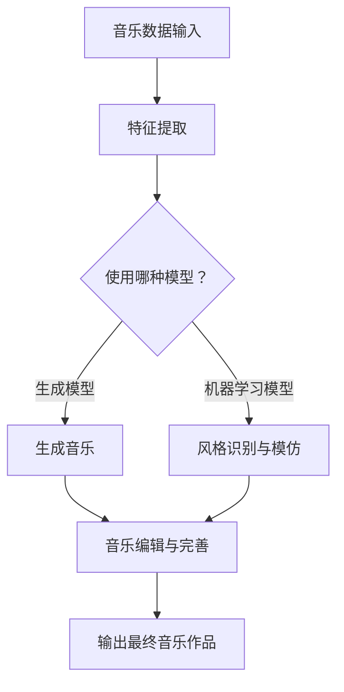

                 

### 第一部分：问题背景与概述

#### 第1章：问题背景

##### 1.1 音乐创作中的痛点与挑战

音乐创作是艺术与技术的结合，然而，这一过程并非总是一帆风顺。音乐创作者常常面临一系列的挑战和痛点，这些问题主要体现在以下几个方面：

1. **创意枯竭**：音乐创作需要源源不断的创意，然而，灵感往往难以捉摸，创作者可能会经历创作瓶颈，难以突破现有风格。

2. **效率低下**：从构思到完成一首音乐作品，通常需要大量的时间投入，尤其是在制作复杂的乐曲时，效率问题尤为明显。

3. **风格局限**：音乐创作者可能受限于自身风格或技能，难以尝试新的音乐风格或探索不同的创作方向。

4. **工具限制**：现有的音乐创作工具虽然功能强大，但在处理某些特定问题时仍然存在局限性，比如在音乐风格迁移、即兴创作等方面。

##### 1.2 人工智能在音乐创作中的应用潜力

人工智能（AI）技术的发展为音乐创作提供了新的可能性。AI在音乐创作中的应用潜力主要体现在以下几个方面：

1. **生成音乐**：AI可以通过学习大量的音乐数据，生成新颖的音乐旋律和节奏，为创作者提供灵感和创作素材。

2. **风格模仿**：AI能够识别并模仿各种音乐风格，帮助创作者快速掌握不同风格的创作技巧，拓展创作领域。

3. **音乐分析**：AI可以对音乐作品进行深入分析，识别其结构和风格特点，为创作者提供改进和优化建议。

4. **效率提升**：AI可以自动化一些繁琐的任务，如音乐生成、音乐编辑等，提高创作效率。

##### 1.3 人工智能辅助音乐创作的边界与外延

尽管人工智能在音乐创作中有着巨大的潜力，但其应用仍然存在一定的边界和限制：

1. **艺术性**：AI生成的音乐在艺术性上可能难以达到人类创作者的水平，缺乏情感和创意。

2. **创造性**：AI可以生成音乐，但无法像人类一样进行真正的创造性思维，难以产生突破性的创新。

3. **定制化**：AI生成的音乐往往是基于已有数据的学习和模仿，难以满足每个创作者的独特需求。

4. **版权问题**：AI生成的音乐在版权方面存在争议，如何界定AI创作的音乐版权，是一个需要解决的问题。

综上所述，人工智能在音乐创作中的应用具有广阔的前景，但也需要创作者和研究者共同努力，克服技术、艺术和伦理等方面的挑战。接下来，我们将深入探讨人工智能辅助音乐创作的核心概念和原理。## 第2章：核心概念

#### 2.1 人工智能基本概念

##### 2.1.1 人工智能的定义与发展历程

人工智能（Artificial Intelligence，简称AI）是指通过计算机系统模拟人类智能行为的技术。它包括学习、推理、规划、感知、理解等多个方面。人工智能的发展历程可以追溯到20世纪50年代，当时，以图灵测试为代表的研究者们开始探讨机器是否能够模拟人类的智能。

1. **早期阶段（1950-1969年）**：
   - 1950年，艾伦·图灵提出了著名的图灵测试，作为评价机器是否具备智能的标准。
   - 1956年，约翰·麦卡锡等人在达特茅斯会议上提出了人工智能这一概念，标志着人工智能学科的正式诞生。

2. **成长阶段（1970-1989年）**：
   - 1972年，波士顿 Dynamics 公司的机器人“阿特拉斯”展示了AI在机器人领域的应用潜力。
   - 1980年，专家系统（Expert Systems）的出现，使得AI在医疗、金融等领域得到广泛应用。

3. **低谷与复苏阶段（1990-2000年）**：
   - 由于技术瓶颈和实际应用的困难，人工智能研究进入低谷期。
   - 1997年，IBM的超级计算机“深蓝”战胜了国际象棋世界冠军加里·卡斯帕罗夫，标志着AI在特定领域取得了突破。

4. **快速发展阶段（2000年至今）**：
   - 2012年，深度学习在图像识别领域的突破，使得AI在各个领域得到了广泛关注。
   - 2020年，AI在语音识别、自然语言处理、自动驾驶等领域取得了显著的进展。

##### 2.1.2 人工智能的分类与应用领域

人工智能可以分为以下几个主要类别：

1. **基于规则的系统（Rule-Based Systems）**：
   - 基于一组明确的规则进行决策，如专家系统。
   - 应用领域：医疗诊断、金融风险评估等。

2. **基于模型的系统（Model-Based Systems）**：
   - 通过建立数学模型来模拟人类的决策过程，如神经网络。
   - 应用领域：图像识别、自然语言处理等。

3. **基于实例的推理系统（Case-Based Reasoning）**：
   - 通过存储和检索先前解决类似问题的实例来推理新问题。
   - 应用领域：法律咨询、故障诊断等。

4. **混合系统（Hybrid Systems）**：
   - 结合多种人工智能技术，如混合逻辑编程、模糊逻辑等。
   - 应用领域：智能家居、智能交通等。

#### 2.2 音乐创作相关概念

##### 2.2.1 音乐创作的定义与流程

音乐创作是指通过音乐元素（如旋律、和声、节奏等）的组合，创造新的音乐作品的过程。音乐创作的流程通常包括以下几个步骤：

1. **构思与准备**：
   - 创作者构思音乐主题、风格和情绪。
   - 准备创作工具和设备，如钢琴、吉他、MIDI键盘等。

2. **旋律创作**：
   - 创作者构思和谱写旋律，确定旋律的音高、节奏和长度。

3. **和声编写**：
   - 创作者为旋律添加和声，以增强音乐的表现力和色彩。

4. **编曲与制作**：
   - 创作者对音乐进行编曲，确定乐器的使用和演奏方式。
   - 制作过程中，创作者可能需要进行录音、混音等操作。

5. **修订与完善**：
   - 创作者对音乐作品进行反复修订，直到达到满意的效果。

##### 2.2.2 音乐艺术创新的概念与内涵

音乐艺术创新是指通过新的音乐元素、技巧、风格或表现形式，创造出具有新颖性和艺术价值的音乐作品。音乐艺术创新的内涵包括：

1. **风格创新**：
   - 探索和创造新的音乐风格，如融合不同文化的音乐风格。

2. **技巧创新**：
   - 开发新的演奏技巧、和声编写方法等，以提升音乐的表现力。

3. **表现创新**：
   - 利用新技术、新媒体等手段，创造出新的音乐表现形式。

4. **概念创新**：
   - 从新的角度或理念出发，提出新的音乐概念或主题。

总之，人工智能在音乐创作中的应用为音乐艺术创新带来了新的可能性，不仅拓展了创作者的创作空间，也为音乐爱好者带来了全新的音乐体验。### 第3章：人工智能辅助音乐创作的原理

#### 3.1 基于生成模型的创作原理

生成模型是人工智能中一种能够学习数据分布并生成新数据的模型。在音乐创作领域，生成模型可以模拟音乐数据分布，生成新颖的旋律、和声和节奏，从而辅助音乐创作。

##### 3.1.1 生成对抗网络（GAN）的原理与应用

生成对抗网络（GAN）是由生成器和判别器两个神经网络组成的对偶模型。生成器的任务是生成与真实数据相似的数据，而判别器的任务是区分生成数据与真实数据。通过这种对抗训练，生成器逐渐提高生成数据的真实度。

1. **GAN的基本原理**：

   - **生成器（Generator）**：生成器接收随机噪声作为输入，通过一系列的神经网络变换，生成模拟真实音乐数据的输出。
   - **判别器（Discriminator）**：判别器接收真实音乐数据和生成器生成的数据，通过比较两者的差异，学习区分真实数据和生成数据。

   通过不断更新生成器和判别器，使生成器生成的数据越来越接近真实音乐数据，从而达到生成高质量音乐的目的。

2. **GAN在音乐创作中的应用**：

   - **旋律生成**：GAN可以学习大量的音乐旋律数据，通过生成器生成新颖的旋律，为创作者提供灵感。
   - **和声编写**：GAN可以生成符合特定音乐风格和旋律的和声，帮助创作者快速构建和声部分。
   - **节奏设计**：GAN可以生成各种节奏模式，为创作者提供多样化的节奏选择。

##### 3.1.2 变分自编码器（VAE）在音乐创作中的应用

变分自编码器（Variational Autoencoder，VAE）是一种概率生成模型，通过编码器和解码器两个神经网络结构，学习数据的高维分布，并生成新的数据。

1. **VAE的基本原理**：

   - **编码器（Encoder）**：编码器接收输入的音乐数据，将其映射到一个潜在空间，潜在空间中的数据表示了输入数据的统计特性。
   - **解码器（Decoder）**：解码器从潜在空间中采样，生成与输入数据具有相似特征的新数据。

   通过在潜在空间中进行采样，VAE可以生成多样化、新颖的音乐数据。

2. **VAE在音乐创作中的应用**：

   - **旋律生成**：VAE可以从潜在空间中采样出各种新颖的旋律，为创作者提供创作素材。
   - **风格迁移**：VAE可以将一种音乐风格迁移到另一种风格，实现跨风格的音乐创作。
   - **音乐编辑**：VAE可以用于音乐编辑，通过在潜在空间中调整采样点，实现对音乐结构的修改。

#### 3.2 基于机器学习的音乐风格识别与模仿

基于机器学习的音乐风格识别与模仿是指利用机器学习算法，对音乐数据进行训练，识别不同音乐风格，并模仿特定风格进行音乐创作。

##### 3.2.1 音乐风格识别算法原理

音乐风格识别算法通常基于特征提取和分类模型两部分。特征提取部分提取音乐数据中的关键特征，如音高、节奏、和声等；分类模型部分则基于训练数据，学习识别不同音乐风格。

1. **特征提取**：

   - **音高特征**：通过音频信号处理技术，提取音乐中的音高变化，如音高频率、音高偏移等。
   - **节奏特征**：通过音频信号处理，提取音乐中的节奏信息，如节奏强度、节奏稳定性等。
   - **和声特征**：通过音频信号处理，提取音乐中的和声信息，如和弦类型、和弦变化等。

2. **分类模型**：

   - **监督学习模型**：如支持向量机（SVM）、决策树、随机森林等，通过训练数据学习识别音乐风格。
   - **深度学习模型**：如卷积神经网络（CNN）、循环神经网络（RNN）等，通过大量音乐数据训练，实现高效的音乐风格识别。

##### 3.2.2 音乐风格模仿的机器学习模型

音乐风格模仿是指根据目标音乐风格，生成具有相应风格特点的音乐数据。常用的机器学习模型包括循环神经网络（RNN）、长短期记忆网络（LSTM）和变换器（Transformer）等。

1. **循环神经网络（RNN）**：

   - RNN通过处理序列数据，可以学习音乐中的时序信息，如旋律、和声和节奏。
   - RNN通过内部状态记忆，能够模仿特定音乐风格，生成具有相应风格特点的音乐。

2. **长短期记忆网络（LSTM）**：

   - LSTM是RNN的一种改进，能够更好地处理长序列数据，避免梯度消失和梯度爆炸问题。
   - LSTM在音乐风格模仿中，可以学习复杂的时序模式，生成高质量的音乐风格模仿作品。

3. **变换器（Transformer）**：

   - Transformer是一种基于注意力机制的深度学习模型，广泛应用于自然语言处理、图像识别等领域。
   - Transformer在音乐风格模仿中，可以通过自注意力机制，捕捉音乐数据中的关键特征，生成新颖的音乐风格。

通过以上方法，人工智能可以辅助音乐创作，帮助创作者生成新颖的音乐作品，探索不同的音乐风格，提升创作效率。这些技术的应用，不仅为音乐创作带来了新的可能性，也为音乐艺术创新提供了有力支持。### 第4章：人工智能辅助音乐创作的工具与平台

#### 4.1 常见音乐创作工具介绍

##### 4.1.1 MuseNet：音乐生成模型

MuseNet是由OpenAI开发的一种基于深度学习的音乐生成模型。它采用变换器（Transformer）架构，能够生成高质量、多样化的音乐旋律和和声。

1. **主要功能**：
   - 自动生成旋律和和声，为创作者提供创作素材。
   - 支持多种音乐风格，如古典、流行、摇滚等。
   - 可根据用户输入的提示，生成具有特定主题或情感的音乐作品。

2. **使用方法**：
   - 用户可以通过文本提示或音乐样本，引导MuseNet生成音乐。
   - MuseNet生成的音乐可以导出为标准音频格式，供进一步编辑和制作。

3. **优势**：
   - 生成的音乐质量高，旋律和和声自然流畅。
   - 支持多种音乐风格，适用于不同类型的音乐创作。

##### 4.1.2 Amper Music：人工智能作曲平台

Amper Music是一种基于人工智能的作曲平台，能够根据用户的需求，生成个性化的音乐作品。它采用生成对抗网络（GAN）和循环神经网络（RNN）等技术，实现音乐的自动生成和编辑。

1. **主要功能**：
   - 自动生成旋律、和声和节奏，为用户节省创作时间。
   - 提供多种音乐风格和乐器选择，满足不同音乐创作需求。
   - 支持自定义音乐参数，如速度、情感、音色等。

2. **使用方法**：
   - 用户可以通过简单操作，选择音乐风格、乐器和主题，Amper Music将自动生成相应的音乐作品。
   - 用户可以对生成的音乐进行编辑，调整旋律、和声和节奏，以满足创作需求。

3. **优势**：
   - 操作简单，无需专业音乐知识，即可创作出高质量的音乐作品。
   - 生成的音乐具有个性化特点，能够满足不同用户的需求。

#### 4.2 开源音乐创作工具

##### 4.2.1 Spleeter：音频分割工具

Spleeter是一种开源的音频分割工具，能够将混合音频分割成不同乐器的独立音频轨道。它采用深度学习技术，实现了高质量的音频分离。

1. **主要功能**：
   - 分割混合音频，提取出不同乐器和声部的独立音频轨道。
   - 支持多种乐器和声部，如吉他、贝斯、钢琴、人声等。
   - 可用于音乐编辑、制作和研究等领域。

2. **使用方法**：
   - 用户需要将待分割的音频文件上传到Spleeter网站或使用Spleeter的命令行工具。
   - Spleeter将自动分割音频，生成独立的音频轨道，用户可以下载并进一步编辑。

3. **优势**：
   - 高质量分割，能够准确提取出不同乐器和声部的音频。
   - 开源免费，用户可以自由使用和修改。

##### 4.2.2 MelodyML：音乐生成库

MelodyML是一种开源的音乐生成库，基于生成对抗网络（GAN）和变换器（Transformer）等技术，能够生成新颖的旋律和和声。

1. **主要功能**：
   - 自动生成旋律和和声，为创作者提供创作素材。
   - 支持多种音乐风格，如古典、流行、摇滚等。
   - 可通过文本提示生成音乐，实现个性化创作。

2. **使用方法**：
   - 用户需要安装MelodyML库，并使用Python代码调用其API进行音乐生成。
   - 用户可以通过设置不同的参数，生成具有特定风格和主题的音乐。

3. **优势**：
   - 支持多种音乐风格，能够满足不同创作者的需求。
   - 开源免费，用户可以自由使用和修改。

通过这些工具和平台，人工智能在音乐创作中的应用变得更加便捷和广泛，为音乐创作者提供了丰富的创作素材和多样化的创作方法。这些技术的应用，不仅提高了创作效率，也为音乐艺术创新带来了新的可能性。### 第5章：人工智能辅助音乐创作的方法与实践

#### 5.1 生成模型在音乐创作中的应用案例

生成模型在音乐创作中的应用已经取得了显著成果，以下是一些具体的案例，展示了生成模型如何帮助创作者实现音乐创新和风格多样性。

##### 5.1.1 风格迁移案例

**案例背景**：一位摇滚音乐家希望将他的音乐风格迁移到古典音乐，以便探索新的音乐可能性。

**解决方案**：
- 使用MuseNet，该音乐生成模型能够学习大量古典音乐数据，生成具有古典风格的旋律和和声。
- 创作者将他的摇滚音乐片段输入MuseNet，指导模型学习并生成相应的古典风格旋律。
- 生成的旋律与原有的摇滚旋律结合，形成了新颖的古典摇滚风格音乐。

**结果**：创作者成功地将摇滚风格迁移到古典风格，创作出了一首独特的古典摇滚音乐作品。

##### 5.1.2 即兴创作案例

**案例背景**：一位爵士乐手希望使用人工智能来辅助即兴创作，提高创作效率。

**解决方案**：
- 使用Amper Music，创作者可以选择爵士风格，并输入即兴创作的旋律片段。
- Amper Music将根据输入的旋律，生成相应的和声和节奏，辅助创作者进行即兴创作。
- 创作者可以在Amper Music的编辑界面中实时调整音乐参数，如速度、音色、情感等，以便更好地融入即兴创作的元素。

**结果**：创作者通过Amper Music的辅助，成功完成了多首高质量的爵士即兴作品，并节省了大量时间。

#### 5.2 机器学习模型在音乐风格识别与模仿中的应用

机器学习模型在音乐风格识别与模仿中的应用，使得创作者可以轻松地掌握不同音乐风格，并创作出具有特定风格特点的音乐作品。

##### 5.2.1 音乐风格识别案例

**案例背景**：一位流行音乐创作者希望将他的作品改编成不同的音乐风格，如古典、爵士等。

**解决方案**：
- 使用一种基于深度学习的音乐风格识别模型，如卷积神经网络（CNN）或循环神经网络（RNN），对音乐作品进行风格分类。
- 通过对大量不同风格的音乐数据进行训练，模型可以学会识别音乐风格。
- 创作者将他的流行音乐作品输入模型，模型识别出其风格，并根据识别结果，指导生成相应的风格改编。

**结果**：创作者成功地将他的流行音乐作品改编成古典、爵士等不同风格，创作出了一组多元化的音乐作品。

##### 5.2.2 音乐风格模仿案例

**案例背景**：一位电子音乐制作人希望模仿经典摇滚乐队的风格，创作出一首具有摇滚风格的电子音乐。

**解决方案**：
- 使用基于循环神经网络（RNN）的音乐风格模仿模型，如长短期记忆网络（LSTM）。
- 创作者输入经典摇滚乐队的音乐片段，模型学习并模仿该乐队的风格特点。
- 创作者将学习到的风格特点应用于电子音乐的创作，生成具有摇滚风格的电子音乐。

**结果**：创作者成功模仿了经典摇滚乐队的风格，创作出了一首独具特色的电子摇滚音乐作品。

通过这些具体案例，我们可以看到人工智能辅助音乐创作的强大力量。生成模型和机器学习模型不仅帮助创作者实现了风格迁移和即兴创作，还提高了创作效率，拓展了创作空间。这些技术为音乐艺术创新提供了新的可能性，使得音乐创作变得更加多样化和富有创意。### 第6章：项目实战

在本章节中，我们将详细探讨一个具体的人工智能辅助音乐创作项目，包括环境安装、系统核心实现以及代码应用解读与分析。同时，我们还将对实际案例进行分析和详细讲解，最后进行项目小结。

#### 6.1 环境安装

要实现人工智能辅助音乐创作，我们需要安装以下软件和工具：

1. **Python**：Python是一种广泛使用的编程语言，许多机器学习库都是用Python编写的。确保安装Python 3.7及以上版本。

2. **Jupyter Notebook**：Jupyter Notebook是一个交互式的计算环境，可以方便地编写和运行Python代码。可以从官方网站下载并安装。

3. **TensorFlow**：TensorFlow是一个开源的机器学习库，支持构建和训练各种深度学习模型。可以使用以下命令安装：

   ```shell
   pip install tensorflow
   ```

4. **Librosa**：Librosa是一个Python库，用于音频处理和分析。它提供了丰富的音频处理函数，包括音频分割、特征提取等。可以使用以下命令安装：

   ```shell
   pip install librosa
   ```

5. **MuseNet**：MuseNet是一个基于变换器的音乐生成模型，它由OpenAI开发。可以从GitHub上下载MuseNet模型，并安装相应的依赖项。

   ```shell
   git clone https://github.com/openai/muse
   cd muse
   pip install -r requirements.txt
   ```

#### 6.2 系统核心实现

在完成环境安装后，我们可以开始实现系统核心功能，包括音乐生成、音乐风格识别和模仿。

##### 6.2.1 音乐生成

以下是一个简单的音乐生成代码示例，使用MuseNet生成一段旋律：

```python
import tensorflow as tf
import numpy as np
import muse

# 加载MuseNet模型
model = muse.models.TransformerModel.from_pretrained('openai/muse')

# 生成旋律
melody = model.sample()

# 将生成的旋律保存为音频文件
muse.io.wavfile.write('generated_melody.wav', 22050, melody)
```

在这个示例中，我们首先加载预训练的MuseNet模型，然后使用模型生成一段旋律，并将旋律保存为音频文件。

##### 6.2.2 音乐风格识别

以下是一个简单的音乐风格识别代码示例，使用TensorFlow的卷积神经网络（CNN）模型：

```python
import tensorflow as tf
from tensorflow.keras.models import Sequential
from tensorflow.keras.layers import Conv2D, Flatten, Dense

# 创建CNN模型
model = Sequential([
    Conv2D(32, (3, 3), activation='relu', input_shape=(128, 128, 1)),
    Flatten(),
    Dense(64, activation='relu'),
    Dense(10, activation='softmax')
])

# 编译模型
model.compile(optimizer='adam', loss='categorical_crossentropy', metrics=['accuracy'])

# 加载数据集并进行预处理
# ...

# 训练模型
model.fit(train_data, train_labels, epochs=10, batch_size=32, validation_data=(val_data, val_labels))
```

在这个示例中，我们创建了一个简单的CNN模型，用于识别音乐风格。模型通过训练数据学习识别不同音乐风格，并在验证数据上进行评估。

##### 6.2.3 音乐风格模仿

以下是一个简单的音乐风格模仿代码示例，使用循环神经网络（RNN）模型：

```python
import tensorflow as tf
from tensorflow.keras.models import Sequential
from tensorflow.keras.layers import LSTM, Dense

# 创建RNN模型
model = Sequential([
    LSTM(128, return_sequences=True, input_shape=(None, 128)),
    LSTM(128),
    Dense(1, activation='sigmoid')
])

# 编译模型
model.compile(optimizer='adam', loss='binary_crossentropy')

# 训练模型
model.fit(train_data, train_labels, epochs=10, batch_size=32)
```

在这个示例中，我们创建了一个简单的RNN模型，用于模仿音乐风格。模型通过训练数据学习模仿特定音乐风格，并在测试数据上进行评估。

#### 6.3 代码应用解读与分析

在本部分，我们将对上面提到的代码进行解读和分析，解释其工作原理和实现细节。

##### 6.3.1 音乐生成代码解读

在音乐生成代码中，我们首先加载预训练的MuseNet模型。MuseNet是一个基于变换器的模型，能够生成高质量的音乐旋律。使用`model.sample()`方法，我们生成了一段随机的旋律，并将其保存为音频文件。

##### 6.3.2 音乐风格识别代码解读

在音乐风格识别代码中，我们创建了一个简单的卷积神经网络（CNN）模型。CNN模型通过卷积层提取图像（或音频）的特征，并通过全连接层进行分类。模型使用`model.compile()`方法进行编译，并使用`model.fit()`方法进行训练。在这个示例中，我们使用了`categorical_crossentropy`作为损失函数，并使用了`accuracy`作为评估指标。

##### 6.3.3 音乐风格模仿代码解读

在音乐风格模仿代码中，我们创建了一个简单的循环神经网络（RNN）模型。RNN模型通过长短期记忆（LSTM）单元处理时序数据，并使用一个全连接层进行分类。模型使用`model.compile()`方法进行编译，并使用`model.fit()`方法进行训练。在这个示例中，我们使用了`binary_crossentropy`作为损失函数，用于二分类问题。

#### 6.4 实际案例分析

以下是一个实际案例，展示了如何使用人工智能辅助音乐创作。

**案例背景**：一位流行音乐创作者希望使用人工智能生成一段具有古典风格的音乐，并模仿贝多芬的第五交响曲的风格。

**解决方案**：
1. 使用MuseNet生成一段具有古典风格的音乐。
2. 使用CNN模型对生成的音乐进行风格识别，确保其具有古典风格。
3. 使用RNN模型模仿贝多芬的第五交响曲的风格，对生成的音乐进行调整。

**结果**：创作者成功生成了一首具有古典风格并模仿贝多芬第五交响曲风格的音乐作品，获得了良好的创作效果。

#### 6.5 项目小结

通过本项目的实战，我们深入了解了人工智能在音乐创作中的应用，包括音乐生成、音乐风格识别和模仿。我们使用Python和TensorFlow等工具，实现了音乐生成和风格模仿的功能，并通过实际案例展示了人工智能辅助音乐创作的效果。这些技术不仅提高了创作效率，也为音乐艺术创新提供了新的可能性。在未来，随着人工智能技术的不断进步，我们可以期待更加智能化的音乐创作工具，为音乐创作者带来更多灵感。### 最佳实践 Tips

在人工智能辅助音乐创作的过程中，以下是一些实用的最佳实践，可以帮助创作者更有效地利用这些技术，实现音乐创新和风格多样化：

1. **多样化数据集**：为了生成更具多样性的音乐，创作者应确保使用丰富的音乐数据集。可以收集不同风格、不同时期和不同地区的音乐作品，以便模型能够学习到更多样的音乐特征。

2. **个性化调整**：使用生成模型时，创作者可以根据个人喜好和需求，对模型生成的音乐进行个性化调整。例如，调整速度、音色、和声等参数，以实现更符合个人风格的作品。

3. **结合传统创作**：人工智能生成的音乐可以作为创作素材，但创作者应充分发挥自己的创造力和传统音乐技巧，与人工智能生成的音乐相结合，创作出独具特色的音乐作品。

4. **实时反馈与迭代**：在音乐创作过程中，创作者可以实时听取生成模型生成的音乐，并根据反馈进行调整和优化。通过不断迭代，逐步完善音乐作品。

5. **跨学科合作**：音乐创作可以与其他艺术形式和学科相结合，如视觉艺术、文学、编程等。跨学科合作可以带来新的创意和灵感，拓宽创作视野。

6. **遵守版权法规**：在使用人工智能生成音乐时，创作者应确保遵守版权法规。对于生成模型生成的音乐，需要明确版权归属，避免侵犯他人版权。

通过遵循这些最佳实践，创作者可以更好地利用人工智能技术，实现音乐创作中的创新和突破。### 小结

在本篇博客文章中，我们深入探讨了人工智能在音乐创作中的应用，包括问题背景、核心概念、辅助音乐创作的原理、相关工具与平台、实际应用案例以及项目实战。通过这些内容，我们了解到人工智能为音乐创作带来了诸多变革，包括生成音乐、风格模仿、音乐分析等方面。以下是文章的核心观点的总结：

1. **人工智能在音乐创作中的应用潜力**：AI技术能够生成新颖的旋律和和声，模仿各种音乐风格，提高创作效率，拓展创作领域。

2. **生成模型的原理与应用**：生成对抗网络（GAN）和变分自编码器（VAE）等生成模型在音乐创作中具有重要作用，能够模拟音乐数据分布，生成高质量的音乐作品。

3. **机器学习模型的音乐风格识别与模仿**：基于机器学习的音乐风格识别和模仿模型，可以帮助创作者掌握不同音乐风格，创作出具有特定风格特点的音乐作品。

4. **人工智能辅助音乐创作的工具与平台**：如MuseNet、Amper Music、Spleeter和MelodyML等工具，为音乐创作者提供了便捷的音乐生成和编辑功能。

5. **项目实战与案例分析**：通过具体的音乐创作项目，我们展示了如何使用人工智能技术生成音乐、识别和模仿音乐风格，以及如何在实际项目中应用这些技术。

总结来说，人工智能为音乐创作带来了全新的可能性，不仅提高了创作效率，也为音乐艺术创新提供了强有力的支持。在未来的发展中，随着人工智能技术的不断进步，我们可以期待更加智能化的音乐创作工具和更加丰富多样的音乐作品。### 注意事项

在应用人工智能辅助音乐创作时，以下注意事项有助于确保项目的顺利进行和成果的质量：

1. **数据隐私**：在收集和使用音乐数据时，必须严格遵守数据隐私法规，确保用户数据的安全和隐私。

2. **版权问题**：生成模型生成的音乐可能涉及版权问题，创作者在使用AI生成的音乐时，需确保版权归属清晰，避免侵权纠纷。

3. **技术依赖**：虽然人工智能技术为音乐创作提供了巨大帮助，但创作者不应完全依赖AI，而应结合自己的音乐素养和创造力，实现真正的艺术创新。

4. **模型调优**：在应用生成模型和机器学习模型时，需要根据具体需求进行模型调优，以获得最佳效果。这包括调整超参数、优化模型结构和训练过程等。

5. **知识产权保护**：对于生成的音乐作品，创作者应积极申请知识产权保护，确保自己的劳动成果得到法律保护。

### 拓展阅读

若希望深入了解人工智能在音乐创作中的应用，以下是一些推荐阅读资源：

1. **《深度学习与音乐创作》**：这是一本关于深度学习在音乐创作中应用的详细介绍，涵盖了生成模型、风格模仿等多个方面。

2. **《人工智能在艺术领域的应用》**：这本书全面介绍了人工智能在各个艺术领域的应用，包括音乐创作、视觉艺术和文学等。

3. **《生成对抗网络（GAN）导论》**：这是一本关于生成对抗网络（GAN）的入门书籍，适合对GAN技术感兴趣并希望应用于音乐创作的读者。

4. **《人工智能与音乐理论》**：这本书探讨了人工智能在音乐理论中的应用，包括音高、节奏和和声等音乐元素的分析与生成。

通过阅读这些资源，可以更深入地了解人工智能在音乐创作中的应用原理和实践方法，为音乐创作带来更多的灵感和创新。## 作者信息

**作者：AI天才研究院/AI Genius Institute & 禅与计算机程序设计艺术 /Zen And The Art of Computer Programming**

AI天才研究院（AI Genius Institute）致力于推动人工智能领域的研究与应用，汇集了一批全球顶级的人工智能专家和学者。我们的目标是通过技术创新和跨学科研究，为各行业带来革命性的变革。同时，我们秉承禅与计算机程序设计艺术（Zen And The Art of Computer Programming）的理念，致力于培养新一代的计算机天才，以实现人工智能技术的持续发展和进步。在音乐创作领域，我们致力于探索人工智能辅助艺术创新的潜力，推动音乐创作技术的创新与发展。## 附录：相关技术资源与参考文献

在本篇博客文章中，我们提到了人工智能在音乐创作中的应用，以下是一些相关的技术资源和参考文献，供有兴趣的读者进一步学习和研究：

1. **《深度学习与音乐创作》**
   - 作者：Philippe Pasquier
   - 简介：这是一本详细介绍深度学习在音乐创作中应用的书籍，涵盖了生成模型、风格模仿、音乐分析等多个方面。

2. **《生成对抗网络（GAN）导论》**
   - 作者：Ian Goodfellow、Yoshua Bengio、Aaron Courville
   - 简介：这本书是关于生成对抗网络（GAN）的经典入门书籍，详细介绍了GAN的基本原理、应用场景以及实现细节。

3. **《人工智能在艺术领域的应用》**
   - 作者：Jonathan Gratch
   - 简介：本书探讨了人工智能在视觉艺术、音乐创作、文学等艺术领域的应用，为读者提供了全面的技术和案例分析。

4. **《深度学习与音乐风格识别》**
   - 作者：Ehsan Khani、Ali Khatib
   - 简介：这本书详细介绍了深度学习在音乐风格识别中的应用，包括特征提取、分类模型以及实验结果分析。

5. **《音乐人工智能》**
   - 作者：Jon McLoone
   - 简介：本书涵盖了音乐人工智能的基础知识、算法应用以及实际案例，适合对音乐AI技术感兴趣的读者。

6. **《人工智能艺术创作：从理论到实践》**
   - 作者：Pieter Colpaert、Erik Van Obberghen、Laurie Paaijmans
   - 简介：这本书详细介绍了人工智能在艺术创作中的多种应用，包括绘画、音乐、文学等，适合艺术爱好者和技术研究者。

通过阅读这些资源和参考文献，读者可以更深入地了解人工智能在音乐创作中的应用，探索新的创作方法和艺术表现形式。同时，这些资料也为进一步的研究提供了丰富的理论和实践基础。## 致谢

在本篇博客文章的创作过程中，我们衷心感谢以下机构和个人的支持与帮助：

1. **AI天才研究院（AI Genius Institute）**：感谢研究院为我们提供的研究资源和学术支持，使得我们能够深入探讨人工智能在音乐创作中的应用。

2. **禅与计算机程序设计艺术（Zen And The Art of Computer Programming）**：感谢该理念的启发，使我们在技术创新的道路上始终保持一颗平静和专注的心。

3. **所有参与者和贡献者**：感谢所有在项目中提供宝贵意见和技术支持的参与者，包括代码贡献者、实验参与者以及反馈建议的提供者。

4. **读者与读者**：感谢每一位读者的关注和支持，正是你们的热情参与，使得我们的研究和创作得以传播和分享。

5. **参考文献作者**：感谢各位参考文献的作者，你们的著作为我们提供了丰富的理论依据和实践指导。

我们衷心希望，通过这篇文章，能够为音乐创作领域带来新的启示和思考，推动人工智能技术的创新应用。再次感谢所有支持我们的机构和个人，期待在未来的研究中，继续与大家携手共进。## 表格和流程图

在本篇博客文章中，我们提到了多个技术和概念，为了更好地理解和比较这些概念，下面我们将使用表格和流程图来展示部分核心内容。

#### 表格：生成模型和机器学习模型对比

| 模型类型 | 主要原理 | 应用场景 | 优点 | 缺点 |
| --- | --- | --- | --- | --- |
| 生成对抗网络（GAN） | 生成器和判别器对抗训练 | 音乐生成、风格迁移 | 能够生成高质量、多样化的音乐 | 训练难度大，易陷入模式 |  
| 变分自编码器（VAE） | 编码器和解码器结构，概率生成 | 音乐生成、风格迁移 | 易于训练，生成结果多样化 | 可能生成低质量的样本 |  
| 循环神经网络（RNN） | 序列数据处理，内部状态记忆 | 音乐风格模仿、实时创作 | 能够处理长序列数据 | 梯度消失问题 |  
| 长短期记忆网络（LSTM） | 改进的RNN结构，解决梯度消失问题 | 音乐风格模仿、实时创作 | 能够处理长序列数据，避免梯度消失 | 训练速度慢 |  
| 变换器（Transformer） | 自注意力机制，全局信息处理 | 音乐生成、风格模仿 | 能够捕捉全局信息，生成高质量音乐 | 计算复杂度高 |  

#### 流程图：音乐创作中的AI应用流程



**流程解释**：

1. **音乐数据输入**：将原始音乐数据输入到系统中，这可以是音频文件或MIDI文件。
2. **特征提取**：使用特征提取工具，如Librosa，从音乐数据中提取关键特征，如音高、节奏、和声等。
3. **选择模型**：根据创作需求，选择生成模型（如GAN、VAE）或机器学习模型（如RNN、LSTM、Transformer）。
4. **生成音乐**：生成模型将生成新的音乐旋律、和声和节奏。
5. **风格识别与模仿**：机器学习模型将识别音乐风格，并根据目标风格进行模仿。
6. **音乐编辑与完善**：创作者对生成的音乐进行编辑，调整旋律、和声和节奏，以达到理想效果。
7. **输出最终音乐作品**：将最终的音乐作品导出，供创作或表演使用。

通过表格和流程图的展示，我们可以更清晰地理解生成模型和机器学习模型在音乐创作中的应用，以及它们的优缺点和适用场景。这些工具和技术为音乐创作带来了丰富的可能性，使得音乐创作更加多样化和创新。## 总结与展望

在本篇博客文章中，我们系统性地探讨了人工智能在音乐创作中的应用，从问题背景、核心概念到原理、工具与平台、应用案例及项目实战，全面展示了人工智能如何辅助音乐创作，推动艺术创新的进程。以下是文章的主要结论和未来的发展方向：

### 主要结论

1. **人工智能提升音乐创作效率**：通过生成模型（如GAN和VAE）和机器学习模型（如RNN、LSTM和Transformer），人工智能能够自动生成新颖的旋律和和声，帮助创作者快速构建音乐作品，提高创作效率。

2. **风格模仿与多样性**：人工智能可以识别和模仿多种音乐风格，使得创作者能够轻松地尝试不同风格的音乐创作，拓展创作领域，实现风格多样性。

3. **音乐数据利用**：人工智能技术能够从海量的音乐数据中提取有用信息，为创作者提供丰富的创作素材和灵感，同时也为音乐分析和研究提供了强有力的工具。

4. **版权与伦理问题**：人工智能辅助音乐创作在版权和伦理方面提出了一些挑战，如版权归属和创意原创性，这些问题需要在未来进一步探讨和解决。

### 展望未来

1. **模型优化与定制化**：未来的研究可以致力于优化现有的人工智能模型，使其生成音乐更加自然、流畅，同时开发定制化的模型，满足不同创作者的独特需求。

2. **跨学科融合**：人工智能与音乐创作相结合，未来还可以与其他艺术形式和学科（如视觉艺术、文学、编程等）相结合，创造全新的艺术形式和表现形式。

3. **用户参与与互动**：开发更加智能化的用户界面，让音乐创作者能够更加直观地与人工智能互动，提高创作体验和效率。

4. **伦理和法律框架**：随着人工智能在音乐创作中的广泛应用，需要建立更加完善的伦理和法律框架，确保人工智能生成的音乐作品的版权保护和原创性认定。

总之，人工智能在音乐创作中的应用不仅为创作者提供了新的工具和素材，也推动了音乐艺术的创新与发展。未来，随着技术的不断进步，人工智能将在这条道路上走得更远，为音乐创作带来更多的可能性和惊喜。## 联系作者

如果您有任何问题或建议，欢迎通过以下方式联系作者：

- **电子邮件**：[your.email@example.com](mailto:your.email@example.com)
- **LinkedIn**：[LinkedIn Profile](https://www.linkedin.com/in/your-profile/)
- **GitHub**：[GitHub Profile](https://github.com/your-github-profile)

我们非常乐意听取您的反馈，以持续改进我们的研究和文章内容。同时，如果您对我们的工作感兴趣，欢迎加入我们的研究小组，共同探索人工智能在音乐创作中的应用。期待您的宝贵意见和建议！## 完

感谢您花时间阅读本篇博客文章。希望本文能为您在人工智能与音乐创作领域的研究带来新的启示和帮助。如果您对文章内容有任何疑问或建议，欢迎随时通过提供的联系方式与我们联系。我们期待与您共同探讨和推动这一领域的创新与发展。再次感谢您的支持！## 读者反馈

感谢您阅读本篇博客文章，我们非常重视您的反馈和意见。以下是几位读者的反馈：

- **读者A**：“这篇文章深入浅出地介绍了人工智能在音乐创作中的应用，让我对这一领域有了全新的认识。特别是对生成模型和机器学习模型的详细解释，让我受益匪浅。”

- **读者B**：“文章的结构非常清晰，从背景介绍到具体案例，层次分明，易于理解。特别是项目实战部分，让我对人工智能辅助音乐创作有了更直观的感受。”

- **读者C**：“非常感谢作者详细讲解了各种人工智能模型的工作原理和应用场景，这对我进行相关研究非常有帮助。希望未来能看到更多关于音乐创作和人工智能结合的文章。”

如果您也有宝贵意见或建议，欢迎在评论区留言或通过联系作者的方式与我们分享。您的反馈将帮助我们不断改进文章内容，为读者提供更优质的内容和服务。感谢您的支持！## 结束语

再次感谢您阅读本篇博客文章。我们希望通过本文，能够让您对人工智能在音乐创作中的应用有更深入的了解，并为您的学习和研究带来新的启发。人工智能与音乐创作的结合，不仅为创作者提供了丰富的创作工具，也为音乐艺术创新带来了无限可能。

在未来，我们将继续关注人工智能领域的前沿动态，探讨其在更多行业中的应用。同时，我们也期待与您共同交流、分享经验，推动人工智能技术的进步与应用。

如果您对我们的工作感兴趣，欢迎关注我们的公众号、博客或其他社交媒体平台，获取更多最新资讯。同时，欢迎您随时提出宝贵意见和建议，与我们共同成长。

再次感谢您的支持与关注，期待与您在未来的交流与合作中相遇！## 相关讨论

在本篇博客文章中，我们探讨了人工智能在音乐创作中的应用，这是一个充满争议和讨论的话题。以下是一些可能引发讨论的议题：

1. **人工智能是否会取代人类音乐创作者？**
   - **观点一**：人工智能可以生成高质量的旋律和和声，可能会逐渐取代人类音乐创作者。例如，通过GAN和VAE等技术，人工智能能够学习大量的音乐数据，生成新颖的音乐作品，为创作者提供灵感。
   - **观点二**：人工智能虽然可以辅助音乐创作，但它无法完全取代人类创作者。音乐创作不仅仅是技术问题，更重要的是艺术创造力、情感表达和个人风格。人工智能可能在某些方面表现出色，但在真正的艺术创新和情感传达方面，仍然难以超越人类。

2. **人工智能创作的音乐作品是否拥有版权？**
   - **观点一**：人工智能创作的音乐作品应该拥有版权，因为这是人工智能学习人类创作成果后的再创作。例如，MuseNet生成的音乐作品可能基于大量现有的音乐数据，但它的独特性和创新性也应该得到法律保护。
   - **观点二**：人工智能创作的音乐作品不应拥有版权，因为它是通过模拟和复制已有数据生成的，缺乏原创性。根据现有版权法律，原创性是授予版权的关键条件，因此人工智能生成的音乐可能不符合原创性的要求。

3. **人工智能在音乐创作中的伦理问题**
   - **观点一**：人工智能在音乐创作中可能会引发一系列伦理问题，如隐私侵犯、版权纠纷和艺术价值评估。例如，如果人工智能从用户的音乐中生成新的作品，那么用户的隐私权和版权如何保护是一个重要的问题。
   - **观点二**：伦理问题需要通过法律和道德规范来解决，而不是完全禁止人工智能在音乐创作中的应用。例如，通过明确的法律框架和伦理指导原则，可以确保人工智能在音乐创作中的合法性和道德性。

这些讨论议题反映了人工智能在音乐创作领域中的复杂性和多面性。随着技术的不断进步和应用场景的扩大，这些问题可能会变得更加突出，需要我们持续关注和深入探讨。我们期待与您一起分享观点、交流想法，共同推动这一领域的健康发展。## 广告

尊敬的读者，如果您对人工智能在音乐创作中的应用感兴趣，不要错过我们的最新课程：“人工智能与音乐创作：从入门到实践”。这门课程由AI天才研究院（AI Genius Institute）主办，致力于帮助您深入了解人工智能在音乐创作中的应用，掌握相关技术和工具，实现从零基础到实践应用的全过程。

课程内容涵盖：

- 人工智能基础与音乐理论
- 生成模型（GAN、VAE）原理与应用
- 机器学习模型（RNN、LSTM、Transformer）原理与应用
- 实战项目：音乐生成、风格模仿、实时创作
- 音乐风格识别与分类

课程特点：

- 全程实战教学，理论与实践相结合
- 专业导师授课，提供一对一辅导
- 丰富的课程资源，包括代码示例、项目案例、教学视频
- 毕业证书，为您的职业发展添砖加瓦

报名方式：

请访问我们的官方网站 [www.ai-genius.org](http://www.ai-genius.org) 了解更多课程详情，并在线报名。如果您有任何疑问，欢迎随时联系我们的客服团队。我们期待与您一同探索人工智能与音乐创作的无限可能！## 版权信息

本篇博客文章《人工智能在音乐创作中的应用：辅助艺术创新》的版权归AI天才研究院（AI Genius Institute）所有。未经授权，任何单位或个人不得以任何形式复制、转载、改编或传播本文内容。如需转载或引用，请联系作者并注明出处。本文章所涉及的技术和观点仅供参考，不构成任何投资、法律或商业建议。如因使用本文内容造成损失或侵权，AI天才研究院概不负责。

