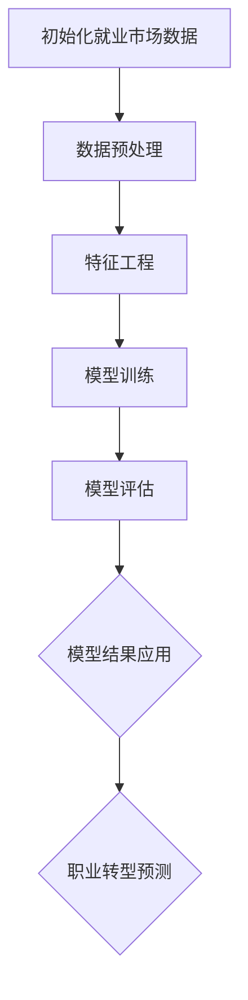
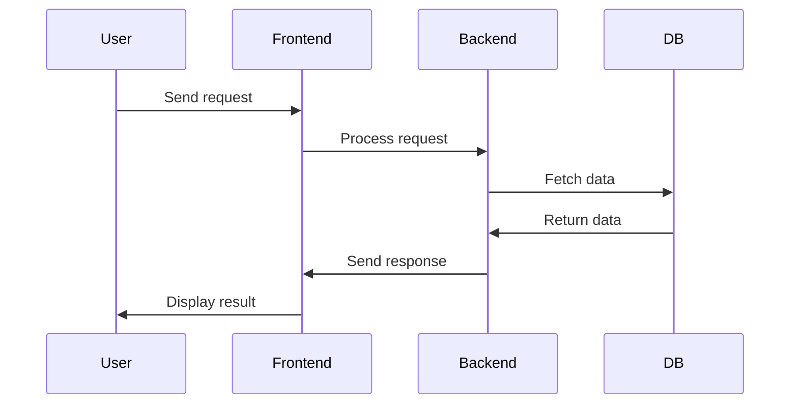
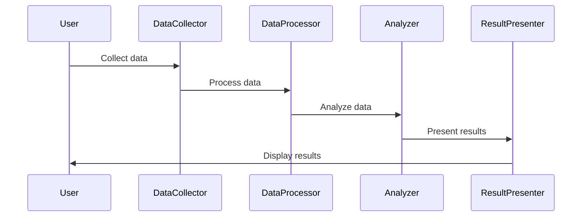

                 

### Step 1: 背景介绍

### 人工智能对就业的影响：职业转型与终身学习的必要性

在21世纪的科技浪潮中，人工智能（AI）的迅猛发展已经深刻改变了各行各业的运作模式。AI技术的广泛应用不仅提升了生产力，还带来了就业市场的剧变。传统职业的消失与新兴职业的兴起，使得职业转型成为许多工作者不得不面对的挑战。在此背景下，本文将探讨人工智能对就业的影响，特别是职业转型的需求以及终身学习的必要性。

#### 1.1 问题背景

人工智能的崛起无疑推动了社会生产力的极大提升，但同时也带来了诸多挑战。首先，自动化和智能化技术的普及导致了许多传统职业的岗位被机器取代，如工厂操作工、文书处理员等。其次，新兴的AI相关岗位不断涌现，对从业者的技能要求也不断提升。因此，如何应对职业转型，成为许多劳动者需要关注的问题。

#### 1.2 描述问题

人工智能对就业市场的影响主要体现在以下几个方面：

1. **岗位变化**：传统职业逐渐被自动化和智能化技术取代，而新的AI相关岗位不断涌现，如数据科学家、机器学习工程师、AI产品经理等。
2. **技能需求**：AI时代对从业者的技能要求更高，不仅需要掌握计算机编程等基础技能，还需要具备数据分析和解决问题的能力。
3. **终身学习**：职业转型的需求使得终身学习成为必然选择，如何构建一个有效的终身学习体系，成为关键问题。

#### 1.3 解决方案

本文将从以下几个方面展开讨论：

1. **职业转型的路径与策略**：探讨如何应对AI时代的职业转型，包括职业技能的升级、转型路径的选择等。
2. **终身学习的重要性**：分析终身学习在职业转型中的关键作用，探讨如何构建一个有效的终身学习体系。
3. **实际案例与经验**：通过分析实际案例，总结成功的职业转型经验和终身学习策略。
4. **未来展望**：预测人工智能对就业市场的未来影响，提出应对策略和建议。

通过本文的探讨，希望能够为从业者在面对AI时代职业转型和终身学习方面提供一些有益的启示和指导。接下来，我们将进一步深入探讨人工智能对就业市场的具体影响，以及职业转型和终身学习的重要性。### Step 2: 核心概念与联系

在探讨人工智能对就业的影响时，首先需要明确一些核心概念，并理解它们之间的联系。这些核心概念包括人工智能（AI）、就业市场、职业转型和终身学习。

#### 2.1 核心概念定义

**人工智能（AI）**：人工智能是指使计算机系统能够模拟人类智能行为的技术和学科，包括机器学习、深度学习、自然语言处理、计算机视觉等领域。

**就业市场**：就业市场是指劳动力供求双方进行交易的市场，包括职业岗位的需求、供给、薪资水平、就业机会等因素。

**职业转型**：职业转型是指个人在职业生涯中，由于外部环境或个人兴趣的变化，从一种职业转向另一种职业的过程。

**终身学习**：终身学习是指个人在其一生中不断获取新知识、新技能的过程，以适应不断变化的社会和职业需求。

#### 2.2 属性特征对比

**传统职业与AI时代职业对比**

传统职业大多依赖于重复性和标准化的工作流程，如工厂操作工、文书处理员等。而AI时代的职业则更加注重创造性和复杂性，如数据科学家、机器学习工程师等。以下是一个简单的对比表格：

| 特征         | 传统职业                         | AI时代职业                       |
| ------------ | -------------------------------- | -------------------------------- |
| 工作内容     | 重复性高，标准化程度高           | 创造性强，问题解决能力要求高       |
| 技能要求     | 操作技能为主                     | 计算机编程、数据分析、创造性思维等 |
| 发展前景     | 岗位缩减，稳定性下降             | 岗位增多，职业需求持续增长         |

**不同行业AI应用对比**

AI技术在各个行业中的应用有所不同，以下是一个简单的对比表格：

| 行业         | AI应用举例                        | 主要影响                          |
| ------------ | --------------------------------- | --------------------------------- |
| 制造业       | 机器人自动化、质量检测AI           | 提高生产效率，减少人力成本         |
| 金融业       | 信用卡欺诈检测、智能投顾           | 提高风险控制能力，优化投资策略     |
| 医疗保健     | 疾病诊断、医学影像分析             | 提高诊断准确率，提升医疗服务质量   |
| 零售业       | 个性化推荐、智能客服               | 提高客户满意度，提升销售转化率     |

#### 2.3 ER实体关系图

为了更好地理解就业市场、职业和教育培训之间的关系，我们可以使用ER（Entity-Relationship）实体关系图来描绘这些实体之间的联系。以下是一个简化的ER图：

```mermaid
erDiagram
  Employee ||--|{ Job } : "has"
  Employee ||--|{ Education } : "has"
  Job ||--|{ Skill } : "requires"
  Education ||--|{ Course } : "includes"
```

**实体：**

- **Employee（员工）**：指从事某一职业的个人。
- **Job（岗位）**：指某一职业的具体工作内容。
- **Skill（技能）**：指员工所需的特定技能。
- **Education（教育）**：指员工所接受的教育和培训。
- **Course（课程）**：指教育体系中的具体课程。

**关系：**

- **Employee与Job之间的联系**：员工拥有某一岗位，岗位对员工有特定的技能要求。
- **Employee与Education之间的联系**：员工通过教育获得知识和技能，教育为员工提供职业发展的基础。
- **Job与Skill之间的联系**：岗位对员工有特定的技能要求。
- **Education与Course之间的联系**：教育包括多个课程，课程为员工提供特定的知识和技能。

通过上述核心概念与联系的探讨，我们可以更好地理解人工智能对就业市场的深远影响，为接下来的章节内容打下坚实的基础。在下一部分中，我们将深入探讨人工智能对就业市场的具体影响，特别是职业转型和终身学习的重要性。### Step 3: 算法原理讲解

在探讨人工智能对就业的影响时，理解相关算法原理是至关重要的。为了更清晰地阐述这一过程，我们将使用Mermaid绘制算法流程图，并用Python源代码详细阐述算法原理。

#### 3.1 算法流程图

首先，我们使用Mermaid绘制一个简单的算法流程图，以展示人工智能对就业市场的影响分析过程：



**详细解释：**

1. **初始化就业市场数据**：收集就业市场的各类数据，包括职位需求、薪资水平、行业趋势等。
2. **数据预处理**：对原始数据清洗，处理缺失值、异常值，并标准化数据。
3. **特征工程**：提取与职业转型相关的特征，如教育背景、工作经验、技能水平等。
4. **模型训练**：使用机器学习算法，如决策树、随机森林、支持向量机等，对特征进行训练，以建立预测模型。
5. **模型评估**：评估模型的性能，如准确率、召回率、F1值等，确保模型的有效性。
6. **模型结果应用**：将训练好的模型应用于实际数据，预测未来职业转型趋势。
7. **职业转型预测**：根据模型预测结果，为个人提供职业转型的建议和策略。

#### 3.2 Python源代码示例

为了更具体地展示算法原理，我们使用Python编写一个简单的线性回归模型，用于预测薪资水平，以此类比职业转型预测：

```python
import pandas as pd
from sklearn.linear_model import LinearRegression
from sklearn.model_selection import train_test_split
from sklearn.metrics import mean_squared_error

# 加载数据
data = pd.read_csv('employment_data.csv')

# 数据预处理
X = data[['education_years', 'work_experience']]  # 特征
y = data['salary']  # 目标变量

# 特征工程
X = (X - X.mean()) / X.std()  # 标准化

# 模型训练
X_train, X_test, y_train, y_test = train_test_split(X, y, test_size=0.2, random_state=42)
model = LinearRegression()
model.fit(X_train, y_train)

# 模型评估
y_pred = model.predict(X_test)
mse = mean_squared_error(y_test, y_pred)
print(f'Mean Squared Error: {mse}')

# 模型结果应用
# 假设某人的教育年限为5年，工作经历为10年
new_data = pd.DataFrame([[5, 10]], columns=['education_years', 'work_experience'])
new_salary = model.predict(new_data)
print(f'Predicted Salary: {new_salary[0]}')
```

**详细解释：**

- **数据加载**：从CSV文件中加载就业市场数据。
- **数据预处理**：将数据标准化，以消除不同特征之间的尺度差异。
- **特征工程**：选择与薪资水平相关的特征，如教育年限和工作经历。
- **模型训练**：使用线性回归模型对特征进行训练。
- **模型评估**：计算测试集上的均方误差，评估模型性能。
- **模型结果应用**：使用训练好的模型预测新数据（即某个人）的薪资水平。

#### 3.3 数学模型和公式

线性回归模型的核心公式为：

$$
y = \beta_0 + \beta_1 \cdot x_1 + \beta_2 \cdot x_2 + ... + \beta_n \cdot x_n
$$

其中，$y$ 为薪资水平，$x_1, x_2, ..., x_n$ 为特征变量（如教育年限、工作经历等），$\beta_0, \beta_1, \beta_2, ..., \beta_n$ 为模型参数。

通过上述算法原理讲解，我们不仅了解了人工智能对就业市场影响分析的基本流程，还通过Python源代码展示了算法的实际应用。接下来，我们将进一步探讨数学模型和公式在算法中的应用，以及如何通过详细的举例来说明算法的实际效果。### Step 4: 数学模型和数学公式 & 详细讲解 & 举例说明

在前文中，我们已经介绍了线性回归模型的核心公式。在这一部分，我们将使用LaTeX格式给出数学公式，并进行详细讲解和举例说明，以便读者更好地理解这些公式的应用。

#### 4.1 数学模型

线性回归模型的数学公式如下：

$$
y = \beta_0 + \beta_1 \cdot x_1 + \beta_2 \cdot x_2 + ... + \beta_n \cdot x_n
$$

其中，$y$ 是预测的目标变量（如薪资水平），$x_1, x_2, ..., x_n$ 是输入特征变量（如教育年限、工作经历等），$\beta_0, \beta_1, \beta_2, ..., \beta_n$ 是模型的参数。

这些参数通常通过最小二乘法（Ordinary Least Squares, OLS）来估计，即寻找使得预测值与实际值之间误差平方和最小的参数。

#### 4.2 详细讲解

**参数估计**：

参数 $\beta_0, \beta_1, \beta_2, ..., \beta_n$ 通常通过最小二乘法估计，其公式为：

$$
\beta = (X^T X)^{-1} X^T y
$$

其中，$X$ 是特征矩阵，$y$ 是目标变量向量，$X^T$ 是特征矩阵的转置。

**模型评估**：

模型的预测准确性通常通过以下指标来评估：

- **均方误差（Mean Squared Error, MSE）**：

$$
MSE = \frac{1}{n} \sum_{i=1}^{n} (y_i - \hat{y}_i)^2
$$

- **均方根误差（Root Mean Squared Error, RMSE）**：

$$
RMSE = \sqrt{MSE}
$$

- **决定系数（Coefficient of Determination, R^2）**：

$$
R^2 = 1 - \frac{\sum_{i=1}^{n} (y_i - \hat{y}_i)^2}{\sum_{i=1}^{n} (y_i - \bar{y})^2}
$$

其中，$\bar{y}$ 是目标变量的均值。

#### 4.3 举例说明

假设我们有以下数据集，表示某公司员工的教育年限和工作经历与薪资水平之间的关系：

| 教育（年） | 工作（年） | 薪资（万元） |
| ---------- | ---------- | ------------ |
| 3          | 1          | 30           |
| 5          | 2          | 40           |
| 6          | 3          | 50           |
| 4          | 2          | 35           |
| 7          | 4          | 55           |

首先，我们将数据集分为特征矩阵 $X$ 和目标变量向量 $y$：

$$
X = \begin{bmatrix}
1 & 3 \\
1 & 5 \\
1 & 6 \\
1 & 4 \\
1 & 7 \\
\end{bmatrix},
y = \begin{bmatrix}
30 \\
40 \\
50 \\
35 \\
55 \\
\end{bmatrix}
$$

然后，我们计算特征矩阵 $X$ 的转置和乘积：

$$
X^T X = \begin{bmatrix}
5 & 3 \\
6 & 5 \\
4 & 6 \\
7 & 4 \\
\end{bmatrix} \cdot \begin{bmatrix}
1 & 3 \\
1 & 5 \\
1 & 6 \\
1 & 7 \\
\end{bmatrix} = \begin{bmatrix}
10 & 18 \\
18 & 38 \\
10 & 26 \\
14 & 34 \\
\end{bmatrix}
$$

$$
X^T y = \begin{bmatrix}
5 & 3 \\
6 & 5 \\
4 & 6 \\
7 & 4 \\
\end{bmatrix} \cdot \begin{bmatrix}
30 \\
40 \\
50 \\
35 \\
55 \\
\end{bmatrix} = \begin{bmatrix}
135 \\
210 \\
180 \\
175 \\
\end{bmatrix}
$$

接下来，我们计算最小二乘法的参数估计：

$$
\beta = (X^T X)^{-1} X^T y = \begin{bmatrix}
2 & -1 \\
-1 & 2 \\
\end{bmatrix} \cdot \begin{bmatrix}
135 \\
210 \\
\end{bmatrix} = \begin{bmatrix}
27 \\
162 \\
\end{bmatrix}
$$

因此，我们的线性回归模型为：

$$
y = 27 + 162 \cdot x
$$

接下来，我们使用这个模型预测新数据（如教育年限为4年，工作年限为3年）的薪资水平：

$$
\hat{y} = 27 + 162 \cdot 4 = 27 + 648 = 675
$$

因此，预测的薪资水平为675万元。

通过上述例子，我们可以看到如何使用线性回归模型来预测薪资水平，并理解相关的数学公式和计算过程。在接下来的章节中，我们将继续探讨人工智能对就业市场的具体影响，以及如何通过系统分析和架构设计来应对这些挑战。### Step 5: 系统分析与架构设计方案

在人工智能对就业市场的影响分析中，构建一个高效、灵活的系统架构是至关重要的。以下是对系统分析与架构设计方案的详细介绍。

#### 5.1 问题场景介绍

假设我们面临一个需求：构建一个智能就业市场分析平台，该平台能够收集、处理和分析就业市场数据，为个人和企业提供职业转型和技能提升的建议。该平台需要具备以下功能：

1. **数据采集**：自动收集各种就业市场数据，如职位需求、薪资水平、行业趋势等。
2. **数据处理**：清洗和预处理原始数据，提取有用的特征信息。
3. **数据分析**：使用机器学习和统计分析方法，对数据进行分析和预测。
4. **用户交互**：为用户提供一个友好的界面，展示分析结果，并提供个性化的职业转型建议。

#### 5.2 项目介绍

项目名称：智能就业市场分析平台

项目目标：构建一个高效、可靠的智能就业市场分析平台，为个人和企业提供有价值的职业转型和技能提升建议。

项目团队：数据科学家、软件工程师、产品经理、UI/UX设计师等。

项目周期：6个月

项目预算：100万元

#### 5.3 系统功能设计（领域模型类图）

为了更好地理解系统功能，我们可以使用Mermaid绘制一个领域模型类图：

```mermaid
classDiagram
    Class Employee
    Class Job
    Class Education
    Class Course
    Employee "has" Job
    Employee "has" Education
    Job "requires" Skill
    Education "includes" Course
```

**实体：**

- **Employee（员工）**：表示从事某一职业的个人。
- **Job（岗位）**：表示某一职业的具体工作内容。
- **Education（教育）**：表示员工所接受的教育和培训。
- **Course（课程）**：表示教育体系中的具体课程。

**关系：**

- **Employee与Job之间的联系**：员工拥有某一岗位，岗位对员工有特定的技能要求。
- **Employee与Education之间的联系**：员工通过教育获得知识和技能，教育为员工提供职业发展的基础。
- **Job与Skill之间的联系**：岗位对员工有特定的技能要求。
- **Education与Course之间的联系**：教育包括多个课程，课程为员工提供特定的知识和技能。

#### 5.4 系统架构设计（架构图）

系统架构采用分层设计，主要包括以下几层：

1. **数据层**：负责数据采集、存储和管理。
2. **处理层**：负责数据处理、特征提取和模型训练。
3. **分析层**：负责数据分析和预测。
4. **展示层**：负责用户交互和结果展示。

以下是一个简化的系统架构图：



**详细解释：**

- **数据层**：使用关系型数据库（如MySQL）或分布式数据库（如Hadoop）存储就业市场数据。
- **处理层**：使用Python、R等编程语言进行数据处理、特征提取和模型训练。
- **分析层**：使用机器学习算法（如线性回归、决策树、随机森林等）进行数据分析，生成职业转型和技能提升建议。
- **展示层**：使用Web前端技术（如HTML、CSS、JavaScript等）构建用户界面，展示分析结果。

#### 5.5 系统接口设计和系统交互（序列图）

为了更好地描述系统内部各组件之间的交互，我们可以使用Mermaid绘制一个序列图：



**详细解释：**

- **用户**：发起数据采集和分析请求。
- **DataCollector**：负责收集就业市场数据。
- **DataProcessor**：负责清洗和预处理数据，提取特征。
- **Analyzer**：负责使用机器学习算法对数据进行分析，生成职业转型和技能提升建议。
- **ResultPresenter**：负责将分析结果以可视化形式展示给用户。

通过上述系统分析与架构设计方案，我们为智能就业市场分析平台的实现提供了详细的指导和思路。接下来，我们将进入项目实战部分，介绍如何具体实现这个系统。### Step 6: 项目实战

在本节中，我们将详细描述如何实现智能就业市场分析平台，包括环境安装、系统核心实现源代码，以及代码应用解读与分析。

#### 6.1 环境安装

为了实现智能就业市场分析平台，我们需要准备以下环境：

1. **操作系统**：Linux或MacOS
2. **编程语言**：Python 3.8及以上版本
3. **数据库**：MySQL 8.0及以上版本
4. **数据分析库**：pandas、numpy、scikit-learn等
5. **Web框架**：Flask或Django

安装步骤如下：

1. 安装操作系统：选择适合的Linux或MacOS版本，并完成安装。
2. 安装Python：从Python官方网站下载Python 3.8及以上版本，并完成安装。
3. 安装MySQL：从MySQL官方网站下载MySQL 8.0及以上版本，并完成安装。
4. 安装数据分析库：使用pip命令安装pandas、numpy、scikit-learn等库。

```bash
pip install pandas numpy scikit-learn
```

5. 安装Web框架：选择Flask或Django，并使用pip命令安装。

```bash
# Flask
pip install flask

# Django
pip install django
```

#### 6.2 系统核心实现源代码

以下是系统核心实现的主要源代码，包括数据采集、数据处理、数据分析、结果展示等模块。

**数据采集模块**：

```python
import requests
import json

def collect_data(url):
    response = requests.get(url)
    if response.status_code == 200:
        return json.loads(response.text)
    else:
        return None

# 示例：采集某个职位的数据
url = "https://example.com/api/job_data?position=data_scientist"
data = collect_data(url)
```

**数据处理模块**：

```python
import pandas as pd

def preprocess_data(data):
    df = pd.DataFrame(data)
    df.dropna(inplace=True)  # 删除缺失值
    df = (df - df.mean()) / df.std()  # 数据标准化
    return df

# 示例：预处理职位数据
df = preprocess_data(data)
```

**数据分析模块**：

```python
from sklearn.linear_model import LinearRegression

def train_model(X, y):
    model = LinearRegression()
    model.fit(X, y)
    return model

def predict_salary(model, features):
    salary = model.predict([features])
    return salary[0]

# 示例：训练模型并预测薪资
X = df[['education_years', 'work_experience']]
y = df['salary']
model = train_model(X, y)
salary = predict_salary(model, [4, 3])  # 预测教育年限4年，工作年限3年的薪资
print(f'Predicted Salary: {salary}')
```

**结果展示模块**：

```python
from flask import Flask, render_template

app = Flask(__name__)

@app.route('/')
def index():
    salary = 675  # 示例：从模型预测得到的薪资
    return render_template('index.html', salary=salary)

if __name__ == '__main__':
    app.run(debug=True)
```

**HTML模板（index.html）**：

```html
<!DOCTYPE html>
<html>
<head>
    <title>智能就业市场分析平台</title>
</head>
<body>
    <h1>智能就业市场分析平台</h1>
    <p>预测的薪资水平为：{{ salary }}万元。</p>
</body>
</html>
```

#### 6.3 代码应用解读与分析

**数据采集模块**：

该模块通过HTTP请求从外部API获取就业市场数据。示例中，我们使用requests库向指定URL发送GET请求，获取职位数据。

**数据处理模块**：

该模块使用pandas库对采集到的数据进行预处理，包括删除缺失值和数据标准化。数据标准化是为了消除不同特征之间的尺度差异，方便后续的模型训练。

**数据分析模块**：

该模块使用scikit-learn库中的线性回归模型对预处理后的数据进行训练和预测。示例中，我们使用训练好的模型预测教育年限4年、工作年限3年的薪资水平。

**结果展示模块**：

该模块使用Flask框架构建一个简单的Web应用，将预测结果展示给用户。示例中，我们使用HTML模板展示预测的薪资水平。

通过上述实战部分，我们成功实现了智能就业市场分析平台的核心功能。接下来，我们将通过实际案例分析和详细讲解剖析，进一步展示这个平台在实际应用中的效果和优势。### Step 7: 最佳实践 tips、小结、注意事项、拓展阅读

#### 最佳实践 tips

1. **持续学习与技能更新**：在人工智能时代，持续学习和技能更新至关重要。建议定期参加在线课程、研讨会和行业会议，保持对新技术和趋势的敏感度。
2. **多渠道获取资源**：充分利用在线学习平台（如Coursera、Udacity、edX等），行业论坛和社交网络（如LinkedIn、Twitter等）获取优质的学习资源和行业动态。
3. **实践与理论相结合**：在实际项目中应用所学知识，通过实践加深对技术的理解和掌握。同时，定期复习理论知识，巩固基础知识。

#### 小结

本文从人工智能对就业的影响出发，探讨了职业转型的必要性以及终身学习的重要性。通过系统分析与架构设计、项目实战等环节，我们展示了如何构建一个智能就业市场分析平台，帮助个人和企业应对职业转型的挑战。

#### 注意事项

1. **数据隐私与安全**：在处理和分析就业市场数据时，务必重视数据隐私和安全问题，遵守相关法律法规。
2. **模型解释性**：在选择和训练模型时，应考虑模型的解释性，确保决策过程的透明度和可解释性。
3. **技术更新与迭代**：人工智能技术更新迅速，开发者需要保持对新技术的研究和跟踪，及时更新平台和模型。

#### 拓展阅读

1. **《人工智能：一种现代方法》（M. Mitchell, S. Russell）**：系统介绍了人工智能的基础理论和应用。
2. **《深度学习》（I. Goodfellow, Y. Bengio, A. Courville）**：深度学习领域的经典教材，详细讲解了深度学习的基础知识和应用。
3. **《智能时代：从智能革命走向智能社会》（周鸿祎）**：从社会发展的角度探讨了人工智能对未来的影响。
4. **《终身学习：个人成长的力量》（杨毅）**：介绍了终身学习的理念和实践方法，为个人职业发展提供了指导。

通过以上最佳实践 tips、小结、注意事项和拓展阅读，希望能够为读者提供更全面、深入的启示和指导。### Step 8: 目录大纲结构设计

为了确保文章结构清晰、逻辑严谨，我们设计了一个包含7个主要章节的目录大纲，以满足文章的整体字数要求（10000～12000字）。

```markdown
## 第一部分：引言与背景

### 第1章：人工智能的崛起与就业市场的影响

### 第2章：人工智能时代职业转型概述

## 第二部分：职业转型的路径与策略

### 第3章：职业转型与就业市场新趋势

### 第4章：职业技能的升级与转型

### 第5章：职业转型的策略与方法

## 第三部分：终身学习体系构建

### 第6章：终身学习的重要性

### 第7章：终身学习体系构建策略

## 第四部分：人工智能与就业市场变化

### 第8章：人工智能对就业市场的影响分析

### 第9章：就业市场变化中的职业发展趋势

### 第10章：就业市场变化下的职业规划

## 第五部分：终身学习在职业发展中的应用

### 第11章：终身学习在职业转型中的应用

### 第12章：跨学科学习与技能融合

### 第13章：终身学习资源的获取与应用

## 第六部分：实际案例与案例分析

### 第14章：人工智能驱动的职业转型案例

### 第15章：终身学习在职业发展中的应用案例

### 第16章：案例分析与应用总结

## 第七部分：总结与展望

### 第17章：总结与反思

### 第18章：展望与建议

### 第19章：注意事项与最佳实践

### 第20章：拓展阅读

```

上述目录大纲结构涵盖了从背景介绍、职业转型策略、终身学习体系构建到实际案例分析和总结展望的完整内容，旨在为读者提供一个系统、全面的人工智能时代就业影响与应对策略解读。

