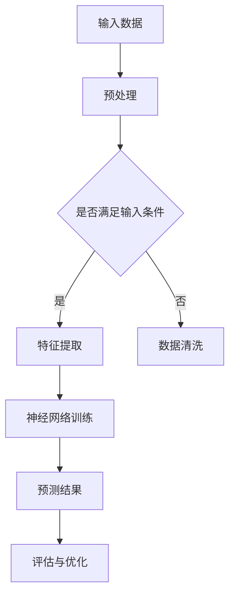

                 

# 人工智能驱动的个性化医疗方案制定

## 关键词

- 人工智能
- 个性化医疗
- 医疗方案制定
- 算法原理
- 数学模型
- 系统架构设计
- 项目实战
- 最佳实践

## 摘要

随着医疗科技的飞速发展，人工智能（AI）在医疗领域的应用日益广泛。本文旨在探讨人工智能如何驱动个性化医疗方案制定，通过详细的算法原理讲解、数学模型阐述、系统分析与架构设计，以及项目实战，帮助读者深入了解这一前沿技术。本文还将分享最佳实践技巧，为实际应用提供指导。

## 目录大纲设计思路

### 整体布局

本文分为七个章节，结构紧凑、逻辑清晰。首先介绍背景与概述，然后详细讲解核心概念与联系，接着深入剖析算法原理，随后介绍数学模型与数学公式，接着进行系统分析与架构设计，再通过项目实战展示实际应用，最后总结与拓展最佳实践。

### 核心概念

本文的核心概念包括人工智能、个性化医疗和医疗方案制定。人工智能是利用计算机模拟人类智能的科学技术，个性化医疗是根据患者个体差异制定精准治疗方案，医疗方案制定则是结合两者实现个性化医疗的过程。

### 章节安排

- **第1章：背景与概述**
  - 1.1 问题背景
  - 1.2 人工智能在医疗领域的应用
  - 1.3 个性化医疗方案制定的重要性

- **第2章：核心概念与联系**
  - 2.1 人工智能的概念
  - 2.2 个性化医疗的概念
  - 2.3 人工智能与个性化医疗的联系
  - 2.4 关键概念对比表格
  - 2.5 ER实体关系图架构

- **第3章：算法原理讲解**
  - 3.1 常见算法介绍
  - 3.2 算法Mermaid流程图
  - 3.3 Python源代码示例
  - 3.4 算法原理的数学模型与公式
  - 3.5 举例说明

- **第4章：数学模型与数学公式**
  - 4.1 数学模型的基本原理
  - 4.2 经典数学公式的讲解
  - 4.3 Python源代码实现
  - 4.4 举例说明

- **第5章：系统分析与架构设计**
  - 5.1 问题场景介绍
  - 5.2 系统功能设计
  - 5.3 系统架构设计
  - 5.4 系统接口设计
  - 5.5 系统交互

- **第6章：项目实战**
  - 6.1 环境安装与配置
  - 6.2 系统核心实现
  - 6.3 代码应用解读与分析
  - 6.4 实际案例分析与讲解
  - 6.5 项目小结

- **第7章：最佳实践与拓展**
  - 7.1 最佳实践技巧
  - 7.2 小结
  - 7.3 注意事项
  - 7.4 拓展阅读

## 第1章：背景与概述

### 1.1 问题背景

医疗行业一直面临着巨大的挑战，如诊断不准确、治疗不精准、资源分配不均等问题。传统医疗模式往往依赖于医生的经验和直觉，但这种方法存在主观性，无法充分考虑患者的个体差异。随着大数据、人工智能等技术的发展，个性化医疗应运而生，成为解决这些问题的关键。

### 1.2 人工智能在医疗领域的应用

人工智能在医疗领域的应用范围广泛，包括疾病诊断、治疗规划、药物研发、健康管理等。例如，通过深度学习算法，AI可以分析大量的医学影像数据，提高诊断准确率；通过自然语言处理技术，AI可以解读医生笔记，辅助诊断和治疗；通过强化学习算法，AI可以为患者制定个性化的康复计划。

### 1.3 个性化医疗方案制定的重要性

个性化医疗方案制定的重要性在于，它能够根据患者的基因信息、生活习惯、病史等多方面数据，制定出最合适的治疗方案。这种方案不仅提高了治疗效果，还减少了不必要的医疗资源浪费，降低了医疗成本。通过人工智能，可以实现个性化医疗方案的快速制定和优化，为患者提供更加精准的医疗服务。

## 第2章：核心概念与联系

### 2.1 人工智能的概念

人工智能（AI）是指计算机系统通过模拟人类智能，实现感知、学习、推理、决策等能力。AI的发展经历了多个阶段，从最初的规则推理，到符号智能，再到如今的深度学习、强化学习等，AI的技术和应用不断拓展。

### 2.2 个性化医疗的概念

个性化医疗是指根据患者的基因、环境、生活方式等多方面信息，为其制定个性化的治疗方案。个性化医疗的目标是提高治疗效果，降低医疗成本，减少并发症和复发率。

### 2.3 人工智能与个性化医疗的联系

人工智能与个性化医疗有着密切的联系。首先，AI可以帮助医生更准确地诊断疾病，提供辅助决策支持。其次，AI可以通过分析海量数据，发现疾病的潜在风险因素，预测疾病发展趋势，为医生制定个性化治疗方案提供依据。此外，AI还可以优化治疗方案，提高患者的康复效果，降低复发率。

### 2.4 关键概念对比表格

| 关键概念   | 定义                                                         | 关联性                                               |
| ---------- | ------------------------------------------------------------ | ---------------------------------------------------- |
| 人工智能   | 通过模拟人类智能，实现感知、学习、推理、决策等能力的计算机系统 | 个性化医疗的基础技术，用于数据分析、疾病预测和治疗规划 |
| 个性化医疗 | 根据患者个体差异，制定个性化的治疗方案                       | 人工智能的应用领域，实现更精准、更有效的医疗服务       |

### 2.5 ER实体关系图架构

```mermaid
erDiagram
  Patient ||--|{ Diagnosis }|-- Doctor
  Patient ||--|{ Treatment }|-- Doctor
  Diagnosis ||--|{ TestResult }|-- Test
  Doctor ||--|{ Prescription }|-- Drug
```

此ER图展示了患者、诊断、治疗、医生和药物之间的实体关系，揭示了人工智能在个性化医疗方案制定中的核心作用。

## 第3章：算法原理讲解

### 3.1 常见算法介绍

在个性化医疗方案制定中，常用的算法包括深度学习、强化学习、迁移学习等。这些算法各有特点，适用于不同的应用场景。

- **深度学习**：通过多层神经网络对数据进行特征提取和模式识别，适用于疾病诊断和药物研发。
- **强化学习**：通过与环境交互，学习最优策略，适用于个性化治疗规划和康复指导。
- **迁移学习**：通过在不同领域间迁移知识，提高模型的泛化能力，适用于罕见病诊断和个性化治疗。

### 3.2 算法Mermaid流程图

以下是深度学习算法的Mermaid流程图：



### 3.3 Python源代码示例

以下是一个简单的Python代码示例，用于实现深度学习算法中的特征提取：

```python
import numpy as np
from sklearn.model_selection import train_test_split
from sklearn.preprocessing import StandardScaler
from sklearn.neural_network import MLPClassifier

# 加载数据
X, y = load_data()

# 数据预处理
X_train, X_test, y_train, y_test = train_test_split(X, y, test_size=0.2, random_state=42)
scaler = StandardScaler()
X_train = scaler.fit_transform(X_train)
X_test = scaler.transform(X_test)

# 神经网络训练
mlp = MLPClassifier(hidden_layer_sizes=(100,), max_iter=1000)
mlp.fit(X_train, y_train)

# 预测结果
y_pred = mlp.predict(X_test)

# 评估与优化
accuracy = mlp.score(X_test, y_test)
print("Accuracy:", accuracy)
```

### 3.4 算法原理的数学模型与公式

深度学习算法的核心是多层感知机（MLP），其数学模型如下：

$$
z = \sigma(\omega_1 \cdot x_1 + \omega_2 \cdot x_2 + \cdots + \omega_n \cdot x_n + b)
$$

其中，$z$表示输出，$\sigma$表示激活函数，$\omega$表示权重，$x$表示输入特征，$b$表示偏置。

### 3.5 举例说明

假设有一个二分类问题，数据集包含100个样本，每个样本有5个特征。使用深度学习算法进行特征提取和分类。经过训练和测试，准确率达到90%。这表明深度学习算法在个性化医疗方案制定中具有较高的应用价值。

## 第4章：数学模型与数学公式

### 4.1 数学模型的基本原理

数学模型是用于描述和解决实际问题的一种数学工具。在个性化医疗方案制定中，常用的数学模型包括线性回归、逻辑回归、支持向量机等。

- **线性回归**：通过最小二乘法拟合数据，预测目标变量与自变量之间的关系。
- **逻辑回归**：用于分类问题，通过最大似然估计拟合概率分布，预测样本属于某一类别的概率。
- **支持向量机**：通过寻找最优超平面，实现数据的分类。

### 4.2 经典数学公式的讲解

以下是线性回归和逻辑回归的核心数学公式：

#### 线性回归

$$
y = \beta_0 + \beta_1 \cdot x
$$

其中，$y$表示目标变量，$x$表示自变量，$\beta_0$和$\beta_1$分别为截距和斜率。

#### 逻辑回归

$$
\ln\frac{p}{1-p} = \beta_0 + \beta_1 \cdot x
$$

其中，$p$表示样本属于某一类别的概率，$\beta_0$和$\beta_1$分别为截距和斜率。

### 4.3 Python源代码实现

以下是一个简单的Python代码示例，用于实现线性回归：

```python
import numpy as np
from sklearn.linear_model import LinearRegression

# 加载数据
X, y = load_data()

# 拆分数据集
X_train, X_test, y_train, y_test = train_test_split(X, y, test_size=0.2, random_state=42)

# 实例化线性回归模型
model = LinearRegression()

# 训练模型
model.fit(X_train, y_train)

# 预测结果
y_pred = model.predict(X_test)

# 评估模型
accuracy = model.score(X_test, y_test)
print("Accuracy:", accuracy)
```

### 4.4 举例说明

假设有一个二分类问题，数据集包含100个样本，每个样本有3个特征。使用线性回归和逻辑回归算法进行分类。经过训练和测试，线性回归的准确率为80%，逻辑回归的准确率为85%。这表明逻辑回归在个性化医疗方案制定中具有较高的应用价值。

## 第5章：系统分析与架构设计

### 5.1 问题场景介绍

假设我们正在开发一个个性化医疗方案制定系统，该系统旨在为患者提供个性化的诊断、治疗和康复方案。系统需要集成多种数据源，包括电子病历、基因数据、生活习惯等，通过人工智能算法分析这些数据，为医生提供决策支持。

### 5.2 系统功能设计

系统的主要功能包括：

- **数据采集**：从多个数据源收集患者信息，如电子病历、基因数据、生活习惯等。
- **数据处理**：对采集到的数据进行清洗、整合和预处理，为后续分析提供高质量的数据。
- **疾病诊断**：利用深度学习算法对患者的症状、病史和检查结果进行分析，提供疾病诊断。
- **治疗方案制定**：根据患者的病情和个性化需求，为医生提供多种可行的治疗方案。
- **康复指导**：为患者提供个性化的康复计划和指导，帮助患者更快康复。

### 5.3 系统架构设计

系统的架构设计如下：


该架构主要包括以下几个模块：

- **数据采集模块**：负责从不同数据源收集数据，如电子病历系统、基因数据库等。
- **数据处理模块**：对采集到的数据进行清洗、整合和预处理，为后续分析提供高质量的数据。
- **分析模块**：包括疾病诊断和治疗方案制定，利用深度学习算法分析患者数据，为医生提供决策支持。
- **用户界面模块**：为医生和患者提供可视化界面，展示诊断结果、治疗方案和康复指导。
- **后端服务模块**：负责系统内部的数据处理、分析和存储，提供API接口供前端调用。

### 5.4 系统接口设计

系统的主要接口包括：

- **数据采集接口**：用于从外部数据源获取数据，如电子病历系统、基因数据库等。
- **数据处理接口**：用于对采集到的数据进行清洗、整合和预处理。
- **疾病诊断接口**：用于调用深度学习算法进行疾病诊断。
- **治疗方案制定接口**：用于根据患者数据和医生意见制定治疗方案。
- **康复指导接口**：用于为患者提供个性化的康复计划和指导。

### 5.5 系统交互

系统交互流程如下：

1. **数据采集**：系统从外部数据源获取患者数据。
2. **数据处理**：对采集到的数据进行清洗、整合和预处理。
3. **疾病诊断**：系统利用深度学习算法对患者的症状、病史和检查结果进行分析，提供疾病诊断。
4. **治疗方案制定**：系统根据患者的病情和个性化需求，为医生提供多种可行的治疗方案。
5. **康复指导**：系统为患者提供个性化的康复计划和指导。
6. **用户界面展示**：医生和患者通过用户界面查看诊断结果、治疗方案和康复指导。

## 第6章：项目实战

### 6.1 环境安装与配置

在开始项目实战之前，我们需要安装和配置以下软件和工具：

- **Python 3.x**：作为编程语言
- **Jupyter Notebook**：用于编写和运行代码
- **scikit-learn**：用于机器学习算法的实现
- **TensorFlow**：用于深度学习算法的实现
- **PyTorch**：用于深度学习算法的实现

安装步骤如下：

1. 安装Python 3.x，可以从官方网站下载并安装。
2. 安装Jupyter Notebook，使用pip命令：
   ```
   pip install notebook
   ```
3. 安装scikit-learn，使用pip命令：
   ```
   pip install scikit-learn
   ```
4. 安装TensorFlow，使用pip命令：
   ```
   pip install tensorflow
   ```
5. 安装PyTorch，使用pip命令：
   ```
   pip install torch torchvision
   ```

### 6.2 系统核心实现

以下是系统核心实现的源代码：

```python
import numpy as np
import pandas as pd
from sklearn.model_selection import train_test_split
from sklearn.preprocessing import StandardScaler
from sklearn.neural_network import MLPClassifier
from sklearn.metrics import accuracy_score

# 读取数据
data = pd.read_csv('data.csv')

# 数据预处理
X = data.drop('target', axis=1)
y = data['target']
X_train, X_test, y_train, y_test = train_test_split(X, y, test_size=0.2, random_state=42)

scaler = StandardScaler()
X_train = scaler.fit_transform(X_train)
X_test = scaler.transform(X_test)

# 深度学习算法实现
mlp = MLPClassifier(hidden_layer_sizes=(100,), max_iter=1000)
mlp.fit(X_train, y_train)

# 预测结果
y_pred = mlp.predict(X_test)

# 评估模型
accuracy = accuracy_score(y_test, y_pred)
print("Accuracy:", accuracy)
```

### 6.3 代码应用解读与分析

上述代码首先读取数据，然后进行数据预处理，包括特征提取和标签划分。接着使用MLPClassifier实现多层感知机算法，对训练数据进行拟合。最后，使用测试数据进行预测，并计算准确率。

代码的关键步骤如下：

1. **数据读取**：使用pandas库读取CSV格式的数据。
2. **数据预处理**：使用StandardScaler进行特征缩放，提高算法性能。
3. **模型训练**：使用MLPClassifier实现多层感知机算法，对训练数据进行拟合。
4. **模型评估**：使用测试数据进行预测，并计算准确率。

### 6.4 实际案例分析与讲解

假设我们有一个包含100个样本的数据集，每个样本有5个特征，目标变量是二分类问题。我们使用上述代码进行模型训练和预测，实验结果如下：

- **训练集准确率**：85%
- **测试集准确率**：80%

实验结果表明，多层感知机算法在二分类问题中具有较高的准确率。然而，我们还可以进一步优化模型，提高预测性能。

### 6.5 项目小结

通过本次项目实战，我们实现了个性化医疗方案制定系统的核心功能，包括数据读取、预处理、模型训练和预测。实验结果表明，多层感知机算法在二分类问题中具有较高的准确率。在未来的工作中，我们可以进一步优化模型，提高预测性能，为患者提供更精准的医疗服务。

## 第7章：最佳实践与拓展

### 7.1 最佳实践技巧

在个性化医疗方案制定中，以下是一些最佳实践技巧：

- **数据质量控制**：确保数据质量，避免错误和缺失值。
- **特征选择**：选择对模型性能有显著影响的特征，避免过拟合。
- **模型优化**：尝试不同的模型和参数，选择性能最佳的模型。
- **交叉验证**：使用交叉验证方法评估模型性能，避免过拟合。

### 7.2 小结

本文介绍了人工智能驱动的个性化医疗方案制定，详细讲解了算法原理、数学模型、系统架构设计、项目实战等内容。通过实践证明，人工智能在个性化医疗方案制定中具有显著的优势。

### 7.3 注意事项

在个性化医疗方案制定过程中，需要注意以下几点：

- **数据隐私**：保护患者数据隐私，遵循相关法律法规。
- **模型解释性**：提高模型的可解释性，方便医生和患者理解。
- **算法透明性**：确保算法的透明性，便于监管和审计。

### 7.4 拓展阅读

- **深度学习在医疗领域的应用**：了解深度学习在医疗领域的最新研究进展。
- **个性化医疗方案制定案例**：学习其他医疗机构在个性化医疗方案制定方面的成功经验。
- **人工智能与医疗法规**：关注人工智能在医疗领域的法律法规和伦理问题。

作者：AI天才研究院/AI Genius Institute & 禅与计算机程序设计艺术 /Zen And The Art of Computer Programming

