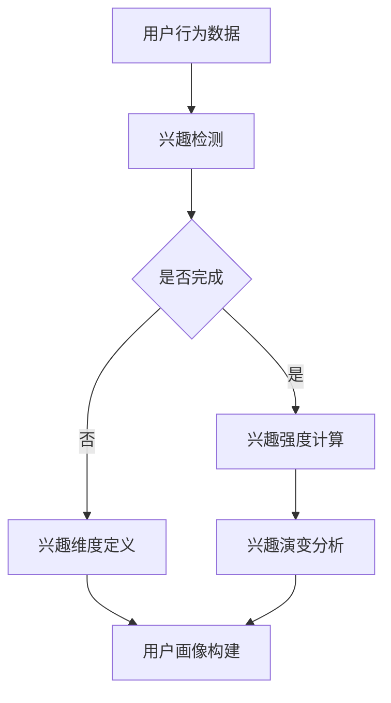
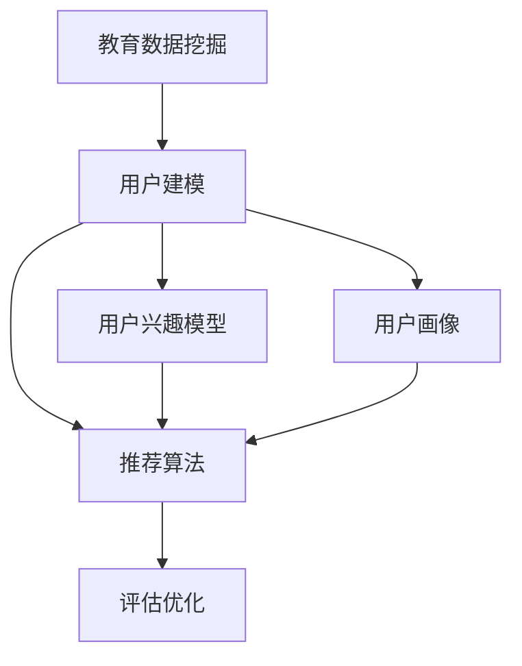

                 

# 人工智能驱动的个性化教育内容推荐

## 关键词

- 人工智能
- 个性化教育
- 内容推荐
- 协同过滤
- 混合推荐系统

## 摘要

随着人工智能技术的快速发展，个性化教育内容推荐成为教育领域的重要研究方向。本文旨在探讨如何利用人工智能技术实现个性化教育内容推荐，以提高教育效果和学习体验。本文首先介绍了人工智能与个性化教育的发展背景，然后详细分析了个性化教育内容推荐的核心概念、算法原理和数学模型，最后通过实际应用案例展示了人工智能在个性化教育内容推荐中的成功应用。

## 目录大纲设计：《人工智能驱动的个性化教育内容推荐》

### 第一部分：问题背景与概述

#### 第1章：人工智能与个性化教育

##### 1.1 人工智能的发展背景

##### 1.1.1 人工智能的定义与历史发展

##### 1.1.2 人工智能在教育中的应用现状

##### 1.1.3 个性化教育的需求与挑战

##### 1.2 人工智能驱动的个性化教育内容推荐

##### 1.2.1 个性化教育内容推荐的原理

##### 1.2.2 个性化教育内容推荐的优势

##### 1.2.3 个性化教育内容推荐的挑战

##### 1.3 本书结构安排与内容概述

##### 1.3.1 各章节的核心内容

##### 1.3.2 阅读本书的预期收获

##### 1.3.3 个性化教育内容推荐的实践应用前景

##### 1.4 本章小结

### 第二部分：核心概念与原理

#### 第2章：个性化教育内容推荐的核心概念

##### 2.1 教育数据挖掘与用户建模

##### 2.1.1 教育数据挖掘的概念与过程

##### 2.1.2 用户建模的基本原理与技巧

##### 2.1.3 用户兴趣模型与用户画像

##### 2.2 推荐算法原理与实现

##### 2.2.1 协同过滤算法

##### 2.2.2 内容推荐算法

##### 2.2.3 混合推荐系统

##### 2.3 个性化教育内容推荐的评估与优化

##### 2.3.1 推荐效果评估指标

##### 2.3.2 个性化推荐的优化策略

##### 2.3.3 模型更新与动态调整

##### 2.4 核心概念与联系

##### 2.4.1 各核心概念的关系与作用

##### 2.4.2 教育数据挖掘与推荐算法的 Mermaid 流程图

##### 2.5 本章小结

### 第三部分：算法原理与数学模型

#### 第3章：协同过滤算法原理与应用

##### 3.1 协同过滤算法的基本原理

##### 3.1.1 协同过滤算法的定义与分类

##### 3.1.2 用户基于的协同过滤

##### 3.1.3 项目基于的协同过滤

##### 3.2 协同过滤算法的数学模型

##### 3.2.1 相似度计算

##### 3.2.2 评分预测与公式推导

##### 3.2.3 Python实现示例

##### 3.3 协同过滤算法的应用场景

##### 3.3.1 在个性化教育中的应用

##### 3.3.2 案例分析与实际应用

##### 3.4 本章小结

### 第四部分：内容推荐算法与实现

#### 第4章：内容推荐算法原理与实践

##### 4.1 内容推荐算法的基本原理

##### 4.1.1 内容推荐算法的定义与分类

##### 4.1.2 基于关键词的内容推荐

##### 4.1.3 基于文本分类的内容推荐

##### 4.2 内容推荐算法的数学模型

##### 4.2.1 文本表示与向量空间模型

##### 4.2.2 文本分类的数学模型

##### 4.2.3 Python实现示例

##### 4.3 内容推荐算法的应用与实践

##### 4.3.1 在个性化教育中的应用

##### 4.3.2 案例分析与实际应用

##### 4.4 本章小结

### 第五部分：混合推荐系统与优化策略

#### 第5章：混合推荐系统设计与应用

##### 5.1 混合推荐系统的基本原理

##### 5.1.1 混合推荐系统的概念与优势

##### 5.1.2 混合推荐系统的架构与实现

##### 5.1.3 混合推荐系统的应用场景

##### 5.2 混合推荐系统的优化策略

##### 5.2.1 数据质量优化

##### 5.2.2 模型融合与调整

##### 5.2.3 个性化推荐策略的调整

##### 5.3 混合推荐系统的应用案例

##### 5.3.1 案例一：基于协同过滤与内容推荐的混合系统

##### 5.3.2 案例二：动态调整策略在混合系统中的应用

##### 5.4 本章小结

---------------------

### 1.1 人工智能的发展背景

人工智能（Artificial Intelligence, AI）作为计算机科学的一个分支，旨在研究、开发用于模拟、延伸和扩展人的智能的理论、方法、技术及应用系统。人工智能的概念最早可以追溯到 1956 年，当时在达特茅斯会议上，人工智能首次被提出。此后，人工智能经历了多个发展阶段，包括符号主义、连接主义、强化学习等。

随着计算机性能的提升和大数据技术的发展，人工智能的应用场景越来越广泛。在教育领域，人工智能不仅提高了教育资源的利用效率，还为学生提供了个性化学习体验。例如，通过分析学生的学习行为和成绩，人工智能可以推荐适合学生的学习内容，从而提高学习效果。

#### 1.1.1 人工智能的定义与历史发展

人工智能是一门研究、开发用于模拟、延伸和扩展人的智能的理论、方法、技术及应用系统的技术科学。它涉及计算机科学、心理学、认知科学、神经科学等多个学科领域。人工智能的发展历程可以分为以下几个阶段：

1. **符号主义阶段（1956-1974）**：这一阶段的人工智能主要基于逻辑推理和知识表示，试图通过符号处理实现智能。代表性工作包括逻辑推理系统、专家系统等。

2. **连接主义阶段（1986-2012）**：这一阶段的人工智能主要基于神经网络，通过模拟人脑神经元连接来学习复杂任务。代表性工作包括反向传播算法、深度学习等。

3. **强化学习阶段（2012-至今）**：这一阶段的人工智能主要基于强化学习，通过不断试错来优化策略，实现智能体的自主学习和决策。代表性工作包括深度强化学习、AlphaGo 等。

#### 1.1.2 人工智能在教育中的应用现状

人工智能在教育中的应用主要包括以下几个方面：

1. **教育资源共享**：通过人工智能技术，可以实现教育资源的智能搜索、推荐和分发，提高教育资源的利用效率。

2. **智能教学系统**：通过人工智能技术，可以开发出智能教学系统，为学生提供个性化的学习路径、学习内容和评估反馈。

3. **智能评估与诊断**：通过人工智能技术，可以对学生的学习过程和成果进行智能评估和诊断，帮助学生发现学习问题并提供针对性的解决方案。

4. **智能辅助学习**：通过人工智能技术，可以为学习者提供智能化的学习辅助，如智能答疑系统、学习伙伴等，提高学习效率。

#### 1.1.3 个性化教育的需求与挑战

个性化教育是指根据学生的个性差异，制定个性化的教育方案，以实现最优的教育效果。随着人工智能技术的发展，个性化教育逐渐成为教育领域的研究热点。个性化教育的需求主要包括以下几个方面：

1. **满足个性化学习需求**：每个学生都有自己独特的学习兴趣、学习方式和学习节奏，个性化教育可以满足学生的个性化学习需求。

2. **提高教育质量**：通过个性化教育，可以针对学生的个性化需求提供最适合的教育资源，从而提高教育质量。

3. **促进教育公平**：个性化教育可以弥补教育资源分配不均的问题，使每个学生都能享受到优质教育资源。

然而，个性化教育也面临着一些挑战：

1. **数据隐私与安全**：在个性化教育中，需要收集大量的学生数据，这涉及到数据隐私和安全问题。

2. **技术实现难度**：个性化教育需要综合运用人工智能、大数据、云计算等先进技术，技术实现难度较大。

3. **教师角色转变**：个性化教育需要教师从传统的教学模式转变为辅导者的角色，这对教师提出了新的挑战。

#### 1.2 人工智能驱动的个性化教育内容推荐

个性化教育内容推荐是指利用人工智能技术，根据学生的兴趣、学习历史和学习能力，为学生推荐最适合的教育内容。个性化教育内容推荐具有以下优势：

1. **提高学习效果**：通过个性化推荐，学生可以接触到最适合自己的教育内容，从而提高学习效果。

2. **增强学习体验**：个性化推荐可以为学生提供个性化的学习体验，提高学习兴趣和参与度。

3. **优化教育资源利用**：通过个性化推荐，可以减少教育资源的浪费，提高教育资源的利用效率。

然而，个性化教育内容推荐也面临一些挑战：

1. **数据质量**：个性化推荐需要高质量的数据作为基础，数据质量直接影响到推荐效果。

2. **算法性能**：个性化推荐算法需要具有较高的性能，才能准确预测学生的兴趣和学习能力。

3. **用户隐私**：个性化推荐会涉及到用户的隐私问题，如何保护用户隐私是亟待解决的问题。

#### 1.3 本书结构安排与内容概述

本书分为五个部分，分别介绍了人工智能与个性化教育、个性化教育内容推荐的核心概念、算法原理与数学模型、协同过滤算法原理与应用、内容推荐算法原理与实践以及混合推荐系统设计与应用等内容。以下是各部分的核心内容概述：

1. **第一部分**：介绍了人工智能与个性化教育的发展背景，分析了个性化教育的需求与挑战，并阐述了人工智能驱动的个性化教育内容推荐的优势和挑战。

2. **第二部分**：详细介绍了个性化教育内容推荐的核心概念，包括教育数据挖掘、用户建模、推荐算法原理与实现等内容。

3. **第三部分**：深入分析了协同过滤算法的基本原理、数学模型和应用场景，并通过实际案例展示了协同过滤算法在个性化教育中的应用。

4. **第四部分**：介绍了内容推荐算法的基本原理、数学模型和应用场景，并通过实际案例展示了内容推荐算法在个性化教育中的应用。

5. **第五部分**：介绍了混合推荐系统的基本原理、优化策略和应用场景，并通过实际案例展示了混合推荐系统在个性化教育中的应用。

#### 1.3.1 各章节的核心内容

以下是本书各章节的核心内容概述：

- **第1章**：人工智能与个性化教育。介绍了人工智能的发展背景、个性化教育的需求与挑战，以及人工智能驱动的个性化教育内容推荐的优势和挑战。

- **第2章**：个性化教育内容推荐的核心概念。介绍了教育数据挖掘、用户建模、推荐算法原理与实现等内容。

- **第3章**：协同过滤算法原理与应用。介绍了协同过滤算法的基本原理、数学模型和应用场景，并通过实际案例展示了协同过滤算法在个性化教育中的应用。

- **第4章**：内容推荐算法原理与实践。介绍了内容推荐算法的基本原理、数学模型和应用场景，并通过实际案例展示了内容推荐算法在个性化教育中的应用。

- **第5章**：混合推荐系统设计与应用。介绍了混合推荐系统的基本原理、优化策略和应用场景，并通过实际案例展示了混合推荐系统在个性化教育中的应用。

#### 1.3.2 阅读本书的预期收获

阅读本书，读者可以预期获得以下收获：

1. **深入理解人工智能与个性化教育的关系**：通过阅读本书，读者可以深入了解人工智能技术在个性化教育中的应用，理解个性化教育的需求与挑战。

2. **掌握个性化教育内容推荐的核心概念**：通过阅读本书，读者可以掌握个性化教育内容推荐的核心概念，包括教育数据挖掘、用户建模、推荐算法原理与实现等内容。

3. **了解协同过滤算法和内容推荐算法**：通过阅读本书，读者可以了解协同过滤算法和内容推荐算法的基本原理、数学模型和应用场景，掌握这些算法在个性化教育中的应用。

4. **学会设计混合推荐系统**：通过阅读本书，读者可以了解混合推荐系统的基本原理、优化策略和应用场景，学会设计并实现混合推荐系统。

#### 1.3.3 个性化教育内容推荐的实践应用前景

随着人工智能技术的不断发展，个性化教育内容推荐在实践中的应用前景非常广阔。以下是一些可能的应用场景：

1. **在线教育平台**：个性化教育内容推荐可以用于在线教育平台，根据学生的学习历史和学习能力，为学生推荐最适合的学习内容，提高学习效果。

2. **智能辅导系统**：个性化教育内容推荐可以用于智能辅导系统，为学生提供个性化的学习建议和辅导方案，帮助学生解决学习问题。

3. **教育评测系统**：个性化教育内容推荐可以用于教育评测系统，根据学生的考试成绩和学习行为，为学生推荐相应的评测题目和备考资料。

4. **教育资源共享平台**：个性化教育内容推荐可以用于教育资源共享平台，根据学生的学习兴趣和学习需求，为学生推荐相关的教育资源，提高教育资源的利用效率。

总之，个性化教育内容推荐是人工智能技术在教育领域的重要应用，具有广阔的实践应用前景。通过本书的学习，读者可以掌握个性化教育内容推荐的核心技术和方法，为教育领域的技术创新和应用做出贡献。

### 1.4 本章小结

本章首先介绍了人工智能的发展背景，包括人工智能的定义与历史发展、人工智能在教育中的应用现状，以及个性化教育的需求与挑战。接着，我们阐述了人工智能驱动的个性化教育内容推荐的优势和挑战，并介绍了本书的结构安排和核心内容。通过本章的学习，读者可以初步了解人工智能与个性化教育的关系，以及个性化教育内容推荐的重要性和应用前景。

## 2.1 教育数据挖掘与用户建模

### 2.1.1 教育数据挖掘的概念与过程

教育数据挖掘（Educational Data Mining, EDM）是数据挖掘技术在教育领域中的应用，旨在从教育数据中发现隐含的模式、知识、规律和趋势，以支持教育决策和教育改进。教育数据挖掘的核心过程包括数据收集、数据预处理、模式发现和模式分析等。

#### 数据收集

数据收集是教育数据挖掘的第一步，主要包括以下几个方面：

1. **学习行为数据**：包括学生在学习过程中的各项活动数据，如登录时间、学习时长、学习路径、参与讨论等。
2. **评估数据**：包括学生在各种评估活动中的成绩、考试分数等。
3. **背景数据**：包括学生的个人信息、家庭背景、学习环境等。
4. **环境数据**：包括教学环境中的各种设备使用情况、教室环境等。

#### 数据预处理

数据预处理是确保数据质量的关键步骤，主要包括以下几个方面：

1. **数据清洗**：去除数据中的噪声和异常值，如删除重复记录、纠正错误数据等。
2. **数据转换**：将不同数据源的数据格式统一，如将文本数据转换为数值数据。
3. **数据归一化**：将不同特征的数据范围统一，如将成绩数据归一化到0-100的区间。

#### 模式发现

模式发现是教育数据挖掘的核心步骤，主要包括以下几个方面：

1. **关联规则挖掘**：发现数据之间的关联关系，如学生在学习过程中某些活动之间的相关性。
2. **聚类分析**：将具有相似特征的数据划分为同一类别，如根据学习行为数据将学生划分为不同学习风格群体。
3. **分类和回归分析**：通过训练模型，对未知数据进行分类或预测，如预测学生的考试成绩。

#### 模式分析

模式分析是对发现的模式进行深入解读，主要包括以下几个方面：

1. **特征重要性分析**：分析影响学习效果的关键因素，如学习时长、参与讨论次数等。
2. **趋势分析**：分析教育数据中的趋势变化，如学生的学习成绩随时间的变化情况。
3. **因果分析**：分析模式之间的因果关系，如某些学习活动对考试成绩的影响。

### 2.1.2 用户建模的基本原理与技巧

用户建模（User Modeling）是构建用户模型的过程，旨在通过对用户行为、兴趣、需求和知识等方面的分析，实现个性化推荐、智能辅导和教育干预。用户建模的基本原理和技巧主要包括以下几个方面：

#### 用户行为分析

用户行为分析是用户建模的基础，主要包括以下几个方面：

1. **行为轨迹**：记录用户在系统中的操作记录，如点击路径、浏览内容等。
2. **行为模式**：分析用户的行为特征，如高频活动、偏好类型等。
3. **行为预测**：根据用户历史行为，预测用户未来的行为倾向。

#### 用户兴趣分析

用户兴趣分析旨在识别用户的兴趣点，主要包括以下几个方面：

1. **兴趣指标**：构建兴趣指标体系，如兴趣度、兴趣强度等。
2. **兴趣检测**：通过分析用户行为数据，识别用户的兴趣点。
3. **兴趣更新**：根据用户行为变化，动态更新用户兴趣模型。

#### 用户需求分析

用户需求分析旨在满足用户的个性化需求，主要包括以下几个方面：

1. **需求识别**：通过分析用户行为和兴趣，识别用户的需求。
2. **需求分类**：将用户需求划分为不同类别，如知识学习、技能提升、情感交流等。
3. **需求满足**：根据用户需求，提供相应的教育资源和辅导服务。

#### 用户知识分析

用户知识分析旨在了解用户的知识水平和知识结构，主要包括以下几个方面：

1. **知识表征**：将用户知识以结构化形式进行表示，如知识图谱、语义网络等。
2. **知识评估**：评估用户的知识水平和能力，如通过考试、评估等手段。
3. **知识更新**：根据用户知识变化，动态更新用户知识模型。

### 2.1.3 用户兴趣模型与用户画像

用户兴趣模型（User Interest Model）是描述用户兴趣特征的模型，通过用户兴趣模型，可以更好地实现个性化推荐和教育干预。用户画像（User Profile）是用户兴趣模型的具体实现，它通过多维度的数据综合描述用户特征。

#### 用户兴趣模型

用户兴趣模型通常包括以下内容：

1. **兴趣维度**：定义用户的兴趣维度，如学科领域、兴趣爱好、学习目标等。
2. **兴趣强度**：衡量用户对各个兴趣维度的强度，如通过行为数据计算兴趣度。
3. **兴趣演变**：分析用户兴趣的变化趋势，如通过时间序列分析预测用户未来兴趣。

#### 用户画像

用户画像是对用户进行全面描述的模型，通常包括以下内容：

1. **基础信息**：包括用户的姓名、性别、年龄、教育背景等基本信息。
2. **兴趣偏好**：包括用户的兴趣点、偏好类型、兴趣爱好等。
3. **行为特征**：包括用户在系统中的行为数据，如点击、浏览、搜索等。
4. **知识结构**：包括用户的知识水平和知识结构，如通过考试、评估等手段获取的知识点。

### 2.1.4 用户兴趣模型与用户画像的关系

用户兴趣模型和用户画像密切相关，用户兴趣模型是构建用户画像的基础，而用户画像则是用户兴趣模型的实现。具体来说：

1. **用户兴趣模型驱动用户画像**：用户兴趣模型通过分析用户行为数据，识别用户的兴趣点和兴趣强度，从而构建用户画像。
2. **用户画像辅助用户兴趣模型**：用户画像通过对用户多维度的数据综合描述，为用户兴趣模型的构建提供支持，同时有助于实现个性化推荐和教育干预。

#### 用户兴趣模型与用户画像的 Mermaid 流程图



### 2.1.5 本章小结

本章介绍了教育数据挖掘和用户建模的基本概念和过程，包括数据收集、数据预处理、模式发现和模式分析等。接着，详细阐述了用户建模的基本原理和技巧，包括用户行为分析、用户兴趣分析、用户需求分析和用户知识分析等。最后，介绍了用户兴趣模型和用户画像的关系，以及如何通过 Mermaid 流程图描述用户兴趣模型与用户画像的构建过程。通过本章的学习，读者可以了解教育数据挖掘和用户建模的重要性，掌握用户建模的基本方法和技巧。

### 2.2 推荐算法原理与实现

#### 2.2.1 协同过滤算法

协同过滤算法（Collaborative Filtering）是推荐系统中最常用的算法之一，它通过分析用户之间的行为相似性，为用户提供个性化推荐。协同过滤算法主要分为基于用户的协同过滤（User-based Collaborative Filtering）和基于项目的协同过滤（Item-based Collaborative Filtering）两种。

##### 1. 基于用户的协同过滤

基于用户的协同过滤算法通过寻找与目标用户相似的其他用户，并推荐这些相似用户喜欢的项目。具体步骤如下：

1. **计算相似度**：计算目标用户与所有其他用户的相似度，通常使用余弦相似度、皮尔逊相关系数等方法。
2. **寻找相似用户**：根据相似度分数，选择与目标用户最相似的 K 个用户。
3. **推荐项目**：为用户推荐这 K 个相似用户共同喜欢的项目。

##### 2. 基于项目的协同过滤

基于项目的协同过滤算法通过寻找与目标项目相似的其他项目，并推荐这些相似项目被其他用户喜欢的项目。具体步骤如下：

1. **计算相似度**：计算目标项目与所有其他项目的相似度，通常使用余弦相似度、皮尔逊相关系数等方法。
2. **寻找相似项目**：根据相似度分数，选择与目标项目最相似的 K 个项目。
3. **推荐用户**：为用户推荐这 K 个相似项目被其他用户喜欢的用户。

##### 3. 相似度计算

相似度计算是协同过滤算法的核心，常用的相似度计算方法包括：

1. **余弦相似度**：计算两个向量之间的余弦值，表示它们的方向一致性。公式如下：
   $$ \text{Cosine Similarity} = \frac{\text{dot\_product}(u, v)}{\lVert u \rVert \cdot \lVert v \rVert} $$
   其中，$u$ 和 $v$ 分别表示两个用户的评分向量。

2. **皮尔逊相关系数**：计算两个变量之间的线性相关程度。公式如下：
   $$ \text{Pearson Correlation} = \frac{\sum{(u_i - \bar{u})(v_i - \bar{v})}}{\sqrt{\sum{(u_i - \bar{u})^2} \cdot \sum{(v_i - \bar{v})^2}}} $$
   其中，$u_i$ 和 $v_i$ 分别表示用户 $i$ 在不同项目上的评分，$\bar{u}$ 和 $\bar{v}$ 分别表示用户 $i$ 和用户 $j$ 的平均评分。

##### 4. 评分预测与公式推导

基于用户的协同过滤算法的评分预测公式如下：
$$ \text{Prediction}_{ij} = \bar{u} + \bar{v} + \sum_{k \in N(j)} \text{Similarity}_{ik} \cdot (\text{Rating}_{ik} - \bar{u}) $$
其中，$N(j)$ 表示与用户 $j$ 最相似的 K 个用户集合，$\text{Similarity}_{ik}$ 表示用户 $i$ 和用户 $k$ 之间的相似度，$\text{Rating}_{ik}$ 表示用户 $i$ 对项目 $k$ 的评分，$\bar{u}$ 和 $\bar{v}$ 分别表示用户 $i$ 和用户 $j$ 的平均评分。

##### 5. Python实现示例

以下是一个简单的基于用户的协同过滤算法的 Python 实现：

```python
import numpy as np

def cosine_similarity(u, v):
    dot_product = np.dot(u, v)
    norm_u = np.linalg.norm(u)
    norm_v = np.linalg.norm(v)
    return dot_product / (norm_u * norm_v)

def predict_ratings(ratings, K=5):
    num_users, num_items = ratings.shape
    sim_matrix = np.zeros((num_users, num_users))
    pred_ratings = np.zeros(ratings.shape)

    for i in range(num_users):
        for j in range(num_users):
            sim_matrix[i][j] = cosine_similarity(ratings[i], ratings[j])

        similar_users = np.argsort(sim_matrix[i])[1:K+1]
        similar_ratings = ratings[similar_users, :]
        avg_rating = similar_ratings.mean()

        pred_ratings[i] = avg_rating

    return pred_ratings

# 假设 ratings 是一个用户评分矩阵，其中每个元素表示用户对项目的评分
pred_ratings = predict_ratings(ratings)
```

#### 2.2.2 内容推荐算法

内容推荐算法（Content-based Recommendation）是基于项目特征和用户兴趣的推荐算法，通过分析项目内容和用户兴趣，为用户推荐相似的项目。内容推荐算法主要包括基于关键词和基于文本分类的方法。

##### 1. 基于关键词的内容推荐

基于关键词的内容推荐算法通过提取项目的关键词，构建项目的特征向量，然后计算用户兴趣向量与项目特征向量之间的相似度，为用户推荐相似的项目。具体步骤如下：

1. **关键词提取**：从项目文本中提取关键词，可以使用 TF-IDF（Term Frequency-Inverse Document Frequency）等方法。
2. **构建特征向量**：将关键词映射为向量，形成项目的特征向量。
3. **计算相似度**：计算用户兴趣向量与项目特征向量之间的相似度，如余弦相似度、欧氏距离等。
4. **推荐项目**：为用户推荐相似度最高的项目。

##### 2. 基于文本分类的内容推荐

基于文本分类的内容推荐算法通过训练文本分类模型，将项目文本分类为不同的类别，然后根据用户的兴趣类别，为用户推荐相似的项目。具体步骤如下：

1. **文本预处理**：对项目文本进行预处理，包括分词、去停用词等。
2. **特征提取**：从预处理后的文本中提取特征，可以使用 TF-IDF、Word2Vec 等方法。
3. **训练分类模型**：使用训练数据训练文本分类模型，如朴素贝叶斯、SVM、深度学习等。
4. **分类预测**：将新项目的文本分类为不同的类别。
5. **推荐项目**：为用户推荐与用户兴趣类别相同或相似的项目。

##### 3. 内容推荐算法的数学模型

内容推荐算法的数学模型主要涉及文本表示和相似度计算。

1. **文本表示**：文本表示是将文本数据转换为向量表示的过程，常用的方法有：

   - **TF-IDF**：计算词频和逆文档频率的加权值，作为词的权重。
   - **Word2Vec**：通过神经网络模型，将词映射为固定长度的向量。
   - **BERT**：基于 Transformer 模型，生成文本的上下文表示。

2. **相似度计算**：相似度计算是评估两个向量之间相似程度的方法，常用的方法有：

   - **余弦相似度**：计算两个向量的夹角余弦值，表示它们的方向一致性。
   - **欧氏距离**：计算两个向量之间的欧氏距离，表示它们的差异程度。

##### 4. Python实现示例

以下是一个简单的基于关键词的内容推荐算法的 Python 实现：

```python
from sklearn.feature_extraction.text import TfidfVectorizer
from sklearn.metrics.pairwise import cosine_similarity

def recommend_projects(projects, user_interest, K=5):
    vectorizer = TfidfVectorizer()
    project_vectors = vectorizer.fit_transform(projects)

    user_vector = vectorizer.transform([user_interest])

    sim_scores = cosine_similarity(user_vector, project_vectors)
    sim_indices = np.argsort(sim_scores[0])[1:K+1]

    return sim_indices

# 假设 projects 是一个项目列表，user_interest 是用户的兴趣点
sim_indices = recommend_projects(projects, user_interest)
```

#### 2.2.3 混合推荐系统

混合推荐系统（Hybrid Recommendation System）是将协同过滤算法和内容推荐算法相结合的推荐系统，旨在利用协同过滤算法的优点（如准确性和鲁棒性）和内容推荐算法的优点（如多样性）来提高推荐效果。混合推荐系统的架构和实现如下：

##### 1. 架构

混合推荐系统的架构主要包括以下几个模块：

1. **协同过滤模块**：负责计算用户和项目之间的相似度，生成协同过滤推荐列表。
2. **内容推荐模块**：负责基于项目特征和用户兴趣生成内容推荐列表。
3. **融合模块**：负责将协同过滤推荐列表和内容推荐列表进行融合，生成最终推荐列表。

##### 2. 实现

混合推荐系统的实现主要包括以下几个步骤：

1. **协同过滤推荐**：计算用户和项目之间的相似度，生成协同过滤推荐列表。
2. **内容推荐**：提取项目特征，生成内容推荐列表。
3. **融合推荐**：将协同过滤推荐列表和内容推荐列表进行融合，生成最终推荐列表。

常用的融合方法包括：

1. **加权融合**：将协同过滤推荐列表和内容推荐列表按一定权重进行加权融合。
2. **排序融合**：将协同过滤推荐列表和内容推荐列表进行排序，取交集或并集。
3. **聚类融合**：将协同过滤推荐列表和内容推荐列表进行聚类，取聚类中心或相似项目。

#### 2.2.4 本章小结

本章介绍了推荐算法的原理与实现，包括协同过滤算法、内容推荐算法和混合推荐系统。首先，详细阐述了协同过滤算法的基本原理、相似度计算方法以及评分预测公式。接着，介绍了内容推荐算法，包括基于关键词和基于文本分类的方法，以及文本表示和相似度计算。最后，介绍了混合推荐系统的架构和实现方法。通过本章的学习，读者可以掌握推荐算法的基本原理和实现方法，为构建个性化教育内容推荐系统打下基础。

### 2.3 个性化教育内容推荐的评估与优化

#### 2.3.1 推荐效果评估指标

个性化教育内容推荐的评估是确保推荐系统性能的重要环节。常用的评估指标包括准确率（Accuracy）、召回率（Recall）、精确率（Precision）和 F1 分数（F1 Score）等。

1. **准确率（Accuracy）**：表示推荐列表中实际推荐的正确项目比例。公式如下：
   $$ \text{Accuracy} = \frac{\text{TP} + \text{TN}}{\text{TP} + \text{TN} + \text{FP} + \text{FN}} $$
   其中，TP（True Positive）表示推荐的项目被用户实际喜欢的项目，TN（True Negative）表示推荐的项目被用户实际不喜欢的项目，FP（False Positive）表示推荐的项目被用户实际不喜欢的项目，FN（False Negative）表示推荐的项目被用户实际喜欢的项目。

2. **召回率（Recall）**：表示推荐列表中用户实际喜欢的项目中被推荐的项目比例。公式如下：
   $$ \text{Recall} = \frac{\text{TP}}{\text{TP} + \text{FN}} $$
   其中，TP（True Positive）表示推荐的项目被用户实际喜欢的项目，FN（False Negative）表示推荐的项目被用户实际喜欢的项目。

3. **精确率（Precision）**：表示推荐列表中被用户实际喜欢的项目中被推荐的项目比例。公式如下：
   $$ \text{Precision} = \frac{\text{TP}}{\text{TP} + \text{FP}} $$
   其中，TP（True Positive）表示推荐的项目被用户实际喜欢的项目，FP（False Positive）表示推荐的项目被用户实际不喜欢的项目。

4. **F1 分数（F1 Score）**：是精确率和召回率的调和平均，用于综合评估推荐系统的性能。公式如下：
   $$ \text{F1 Score} = 2 \cdot \frac{\text{Precision} \cdot \text{Recall}}{\text{Precision} + \text{Recall}} $$

#### 2.3.2 个性化推荐的优化策略

为了提高个性化教育内容推荐的性能，需要采用一系列优化策略，包括数据质量优化、模型参数调整和实时更新等。

1. **数据质量优化**：高质量的数据是推荐系统性能的基础。优化策略包括：

   - **数据清洗**：去除噪声数据和异常值，确保数据的一致性和准确性。
   - **数据扩充**：通过数据增强技术，如数据合成、数据扩充等，提高数据的多样性和质量。
   - **数据去重**：去除重复数据，避免推荐结果重复。

2. **模型参数调整**：模型参数的调整对推荐系统的性能有重要影响。优化策略包括：

   - **参数搜索**：使用网格搜索、随机搜索等策略，寻找最优的参数组合。
   - **交叉验证**：通过交叉验证，评估模型在不同数据集上的性能，调整参数以优化整体性能。
   - **动态调整**：根据用户行为和学习效果，动态调整模型参数，以适应用户的需求变化。

3. **实时更新**：个性化教育内容推荐需要及时更新推荐结果，以适应用户需求的变化。优化策略包括：

   - **实时反馈**：及时收集用户的反馈信息，如点击、评分等，用于更新推荐模型。
   - **增量学习**：使用增量学习算法，如在线学习、增量学习等，不断更新模型，提高推荐系统的实时性。
   - **实时调整**：根据实时反馈和用户行为，动态调整推荐策略和推荐结果，以提供更准确的推荐。

#### 2.3.3 模型更新与动态调整

模型更新与动态调整是提高个性化教育内容推荐性能的关键。以下是一些常用的方法：

1. **基于用户行为的模型更新**：通过分析用户行为数据，如学习时长、学习路径、参与讨论等，动态更新用户兴趣模型和推荐模型，以提高推荐精度。

2. **基于学习效果的模型更新**：通过分析学生的学习效果数据，如考试成绩、学习进度等，动态调整推荐内容和推荐策略，以提高学习效果。

3. **基于环境因素的模型更新**：考虑教学环境因素，如课程难度、教学资源等，动态调整推荐内容和推荐策略，以适应不同的教学环境。

4. **基于反馈的模型更新**：通过收集用户的反馈信息，如点击、评分等，对推荐模型进行修正和优化，以提高用户的满意度。

#### 2.3.4 核心概念与联系

个性化教育内容推荐的核心概念包括教育数据挖掘、用户建模、推荐算法和评估优化。这些概念之间的联系如下：

- **教育数据挖掘**：通过分析教育数据，发现用户兴趣和学习规律，为推荐系统提供数据基础。
- **用户建模**：构建用户兴趣模型和用户画像，为推荐系统提供用户特征信息。
- **推荐算法**：基于教育数据挖掘和用户建模结果，生成个性化推荐列表。
- **评估优化**：通过评估推荐效果，不断优化推荐算法和模型参数，提高推荐系统的性能。

#### 2.3.5 教育数据挖掘与推荐算法的 Mermaid 流程图



#### 2.3.6 本章小结

本章介绍了个性化教育内容推荐的评估与优化策略。首先，详细阐述了推荐效果的评估指标，包括准确率、召回率、精确率和 F1 分数等。接着，介绍了个性化推荐的优化策略，包括数据质量优化、模型参数调整和实时更新等。最后，介绍了模型更新与动态调整的方法，并展示了教育数据挖掘与推荐算法之间的联系。通过本章的学习，读者可以了解个性化教育内容推荐的评估与优化方法，为构建高效的推荐系统提供参考。

### 3.1 协同过滤算法的基本原理

协同过滤算法（Collaborative Filtering，CF）是一种用于推荐系统的常用算法，其主要思想是利用用户之间的行为相似性来进行项目推荐。协同过滤算法可以分为基于用户的协同过滤（User-based Collaborative Filtering，UBCF）和基于项目的协同过滤（Item-based Collaborative Filtering，IBCF）两大类。

#### 3.1.1 协同过滤算法的定义与分类

协同过滤算法的定义：协同过滤算法是一种利用用户行为数据（如评分、购买记录等）进行推荐的方法。其主要目标是发现用户之间的相似性，并根据这种相似性为用户推荐他们可能感兴趣的项目。

协同过滤算法的分类：

1. **基于用户的协同过滤（User-based Collaborative Filtering，UBCF）**：基于用户的协同过滤算法通过计算用户之间的相似度，找到与目标用户相似的其他用户，然后推荐这些相似用户喜欢的项目。

2. **基于项目的协同过滤（Item-based Collaborative Filtering，IBCF）**：基于项目的协同过滤算法通过计算项目之间的相似度，找到与目标项目相似的其他项目，然后推荐这些相似项目被其他用户喜欢的用户。

#### 3.1.2 用户基于的协同过滤

用户基于的协同过滤（User-based Collaborative Filtering，UBCF）算法的主要步骤如下：

1. **计算用户相似度**：计算目标用户与所有其他用户的相似度。常用的相似度计算方法包括余弦相似度、皮尔逊相关系数等。

2. **选择相似用户**：根据相似度分数，选择与目标用户最相似的 K 个用户。

3. **推荐项目**：为用户推荐这 K 个相似用户共同喜欢的项目。

具体实现步骤如下：

1. **用户评分矩阵**：构建用户评分矩阵 $R \in \mathbb{R}^{m \times n}$，其中 $m$ 表示用户数量，$n$ 表示项目数量，$R_{ij}$ 表示用户 $i$ 对项目 $j$ 的评分。

2. **相似度计算**：计算用户 $i$ 与用户 $j$ 之间的相似度。常用的相似度计算方法有：

   - **余弦相似度**：计算两个用户评分向量的余弦值，表示它们的方向一致性。公式如下：
     $$ \text{Cosine Similarity}(i, j) = \frac{\sum_{k=1}^{n} R_{ik} \cdot R_{jk}}{\sqrt{\sum_{k=1}^{n} R_{ik}^2} \cdot \sqrt{\sum_{k=1}^{n} R_{jk}^2}} $$
   
   - **皮尔逊相关系数**：计算两个用户评分向量的皮尔逊相关系数，表示它们之间的线性相关程度。公式如下：
     $$ \text{Pearson Correlation}(i, j) = \frac{\sum_{k=1}^{n} (R_{ik} - \bar{R}_i) \cdot (R_{jk} - \bar{R}_j)}{\sqrt{\sum_{k=1}^{n} (R_{ik} - \bar{R}_i)^2} \cdot \sqrt{\sum_{k=1}^{n} (R_{jk} - \bar{R}_j)^2}} $$
     其中，$\bar{R}_i$ 和 $\bar{R}_j$ 分别表示用户 $i$ 和用户 $j$ 的平均评分。

3. **选择相似用户**：根据相似度分数，选择与目标用户最相似的 K 个用户。可以选择相似度最高的 K 个用户，或者使用阈值方法选择相似度大于阈值的用户。

4. **推荐项目**：为用户推荐这 K 个相似用户共同喜欢的项目。具体方法如下：

   - **加权平均**：为用户推荐的项目评分是这 K 个相似用户对该项目的平均评分。公式如下：
     $$ \text{Prediction}_{ij} = \frac{\sum_{k \in S} R_{ik} \cdot \text{Similarity}_{ik}}{\sum_{k \in S} \text{Similarity}_{ik}} $$
     其中，$S$ 表示与用户 $i$ 最相似的 K 个用户集合。

   - **基于预测的排序**：将用户对每个项目的评分进行预测，并根据预测值对项目进行排序，推荐预测评分最高的项目。

#### 3.1.3 项目基于的协同过滤

项目基于的协同过滤（Item-based Collaborative Filtering，IBCF）算法与用户基于的协同过滤算法类似，只是计算相似度的对象从用户变成了项目。项目基于的协同过滤算法的主要步骤如下：

1. **计算项目相似度**：计算目标项目与所有其他项目的相似度。常用的相似度计算方法包括余弦相似度、皮尔逊相关系数等。

2. **选择相似项目**：根据相似度分数，选择与目标项目最相似的 K 个项目。

3. **推荐用户**：为用户推荐这 K 个相似项目被其他用户喜欢的用户。

具体实现步骤如下：

1. **用户评分矩阵**：构建用户评分矩阵 $R \in \mathbb{R}^{m \times n}$，其中 $m$ 表示用户数量，$n$ 表示项目数量，$R_{ij}$ 表示用户 $i$ 对项目 $j$ 的评分。

2. **相似度计算**：计算项目 $i$ 与项目 $j$ 之间的相似度。常用的相似度计算方法有：

   - **余弦相似度**：计算两个项目评分向量的余弦值，表示它们的方向一致性。公式如下：
     $$ \text{Cosine Similarity}(i, j) = \frac{\sum_{k=1}^{m} R_{ik} \cdot R_{jk}}{\sqrt{\sum_{k=1}^{m} R_{ik}^2} \cdot \sqrt{\sum_{k=1}^{m} R_{jk}^2}} $$
   
   - **皮尔逊相关系数**：计算两个项目评分向量的皮尔逊相关系数，表示它们之间的线性相关程度。公式如下：
     $$ \text{Pearson Correlation}(i, j) = \frac{\sum_{k=1}^{m} (R_{ik} - \bar{R}_i) \cdot (R_{jk} - \bar{R}_j)}{\sqrt{\sum_{k=1}^{m} (R_{ik} - \bar{R}_i)^2} \cdot \sqrt{\sum_{k=1}^{m} (R_{jk} - \bar{R}_j)^2}} $$
     其中，$\bar{R}_i$ 和 $\bar{R}_j$ 分别表示项目 $i$ 和项目 $j$ 的平均评分。

3. **选择相似项目**：根据相似度分数，选择与目标项目最相似的 K 个项目。可以选择相似度最高的 K 个项目，或者使用阈值方法选择相似度大于阈值的用户。

4. **推荐用户**：为用户推荐这 K 个相似项目被其他用户喜欢的用户。具体方法如下：

   - **加权平均**：为用户推荐的项目评分是这 K 个相似项目被其他用户平均评分。公式如下：
     $$ \text{Prediction}_{ij} = \frac{\sum_{k \in S} R_{ik} \cdot \text{Similarity}_{ik}}{\sum_{k \in S} \text{Similarity}_{ik}} $$
     其中，$S$ 表示与项目 $i$ 最相似的 K 个项目集合。

   - **基于预测的排序**：将用户对每个项目的评分进行预测，并根据预测值对项目进行排序，推荐预测评分最高的项目。

#### 3.1.4 协同过滤算法的优点与局限性

协同过滤算法的优点：

1. **简单易实现**：协同过滤算法的核心思想简单，易于实现和部署。
2. **良好的推荐效果**：通过分析用户之间的行为相似性，协同过滤算法可以提供较为准确的推荐结果。
3. **无需项目内容信息**：协同过滤算法不需要项目内容信息，仅依赖用户评分数据，适用于项目内容信息不足的情况。

协同过滤算法的局限性：

1. **数据稀疏问题**：当项目数量远大于用户数量时，用户评分矩阵会出现数据稀疏问题，影响推荐效果。
2. **同质性用户问题**：当用户之间行为相似度较高时，协同过滤算法容易产生同质性用户问题，推荐结果单一。
3. **冷启动问题**：对于新用户或新项目，由于缺乏历史行为数据，协同过滤算法难以提供准确的推荐。

#### 3.1.5 Python实现示例

以下是一个简单的基于用户的协同过滤算法的 Python 实现：

```python
import numpy as np

def cosine_similarity(u, v):
    dot_product = np.dot(u, v)
    norm_u = np.linalg.norm(u)
    norm_v = np.linalg.norm(v)
    return dot_product / (norm_u * norm_v)

def predict_ratings(ratings, K=5):
    num_users, num_items = ratings.shape
    sim_matrix = np.zeros((num_users, num_users))
    pred_ratings = np.zeros(ratings.shape)

    for i in range(num_users):
        for j in range(num_users):
            sim_matrix[i][j] = cosine_similarity(ratings[i], ratings[j])

        similar_users = np.argsort(sim_matrix[i])[1:K+1]
        similar_ratings = ratings[similar_users, :]
        avg_rating = similar_ratings.mean()

        pred_ratings[i] = avg_rating

    return pred_ratings

# 假设 ratings 是一个用户评分矩阵
pred_ratings = predict_ratings(ratings)
```

#### 3.1.6 本章小结

本章介绍了协同过滤算法的基本原理，包括用户基于的协同过滤和项目基于的协同过滤。详细阐述了协同过滤算法的定义、相似度计算方法、推荐项目方法和算法的局限性。通过 Python 实现示例，展示了如何使用协同过滤算法进行个性化推荐。通过本章的学习，读者可以了解协同过滤算法的核心思想和实现方法，为构建个性化教育内容推荐系统提供基础。

### 3.2 协同过滤算法的数学模型

协同过滤算法（Collaborative Filtering，CF）是一种通过分析用户间的相似性进行推荐的系统。在本节中，我们将深入探讨协同过滤算法的数学模型，包括相似度计算、评分预测以及相关的数学公式推导。

#### 3.2.1 相似度计算

相似度计算是协同过滤算法的核心步骤之一，它用于衡量用户或项目之间的相似性。以下是一些常用的相似度计算方法：

1. **余弦相似度**：

   余弦相似度是一种用于计算两个向量之间夹角余弦值的相似性度量。在协同过滤中，用户和项目的评分向量可以被看作是高维空间中的向量。余弦相似度的计算公式如下：

   $$ \text{Cosine Similarity}(u, v) = \frac{\sum_{i=1}^{n} u_i \cdot v_i}{\sqrt{\sum_{i=1}^{n} u_i^2} \cdot \sqrt{\sum_{i=1}^{n} v_i^2}} $$

   其中，$u$ 和 $v$ 是两个评分向量，$n$ 是项目的数量。

2. **皮尔逊相关系数**：

   皮尔逊相关系数用于衡量两个变量之间的线性相关程度。在协同过滤中，它可以用来计算用户之间的相似度。皮尔逊相关系数的计算公式如下：

   $$ \text{Pearson Correlation}(u, v) = \frac{\sum_{i=1}^{n} (u_i - \bar{u})(v_i - \bar{v})}{\sqrt{\sum_{i=1}^{n} (u_i - \bar{u})^2} \cdot \sqrt{\sum_{i=1}^{n} (v_i - \bar{v})^2}} $$

   其中，$\bar{u}$ 和 $\bar{v}$ 分别是用户 $u$ 和用户 $v$ 的平均评分。

3. **余弦相似度与皮尔逊相关系数的关系**：

   当评分向量是标准化（即每个向量的均值为0，方差为1）时，余弦相似度与皮尔逊相关系数是相等的。这表明在标准化后的情况下，这两种相似度度量是等价的。

#### 3.2.2 评分预测

在协同过滤算法中，评分预测是基于用户相似度和历史评分进行的。以下是一个简化的评分预测模型：

1. **基于用户的协同过滤**：

   基于用户的协同过滤算法通过计算目标用户与相似用户的相似度，并利用这些相似度预测用户的评分。一个简单的评分预测模型如下：

   $$ \text{Prediction}_{ij} = \bar{r}_i + \sum_{k \in N(i)} \text{Similarity}_{ik} \cdot (r_{kj} - \bar{r}_k) $$

   其中，$N(i)$ 是与用户 $i$ 最相似的 $K$ 个用户集合，$\text{Similarity}_{ik}$ 是用户 $i$ 和用户 $k$ 之间的相似度，$r_{kj}$ 是用户 $k$ 对项目 $j$ 的评分，$\bar{r}_i$ 和 $\bar{r}_k$ 分别是用户 $i$ 和用户 $k$ 的平均评分。

2. **基于项目的协同过滤**：

   基于项目的协同过滤算法通过计算项目之间的相似度，并利用这些相似度预测用户的评分。一个简单的评分预测模型如下：

   $$ \text{Prediction}_{ij} = \bar{r}_j + \sum_{k \in N(j)} \text{Similarity}_{ik} \cdot (r_{ik} - \bar{r}_i) $$

   其中，$N(j)$ 是与项目 $j$ 最相似的 $K$ 个项目集合，$\text{Similarity}_{ik}$ 是项目 $i$ 和项目 $j$ 之间的相似度，$r_{ik}$ 是用户 $i$ 对项目 $k$ 的评分，$\bar{r}_j$ 和 $\bar{r}_i$ 分别是项目 $j$ 和项目 $i$ 的平均评分。

#### 3.2.3 Python实现示例

以下是一个简单的基于用户的协同过滤算法的 Python 实现：

```python
import numpy as np

def cosine_similarity(u, v):
    dot_product = np.dot(u, v)
    norm_u = np.linalg.norm(u)
    norm_v = np.linalg.norm(v)
    return dot_product / (norm_u * norm_v)

def predict_ratings(ratings, K=5):
    num_users, num_items = ratings.shape
    sim_matrix = np.zeros((num_users, num_users))
    pred_ratings = np.zeros(ratings.shape)

    for i in range(num_users):
        for j in range(num_users):
            sim_matrix[i][j] = cosine_similarity(ratings[i], ratings[j])

        similar_users = np.argsort(sim_matrix[i])[1:K+1]
        similar_ratings = ratings[similar_users, :]
        avg_rating = similar_ratings.mean()

        pred_ratings[i] = avg_rating

    return pred_ratings

# 假设 ratings 是一个用户评分矩阵
ratings = np.array([[5, 3, 0, 1],
                    [4, 0, 0, 1],
                    [1, 1, 0, 5],
                    [1, 0, 0, 4],
                    [0, 1, 5, 4]])
pred_ratings = predict_ratings(ratings)
print(pred_ratings)
```

#### 3.2.4 本章小结

本章介绍了协同过滤算法的数学模型，包括相似度计算和评分预测。首先，我们探讨了余弦相似度和皮尔逊相关系数两种常见的相似度计算方法，并展示了它们在协同过滤算法中的应用。接着，我们提出了基于用户和项目的评分预测模型，并通过一个简单的 Python 实现展示了协同过滤算法的基本原理。通过本章的学习，读者可以深入理解协同过滤算法的数学基础，为实际应用提供理论支持。

### 3.3 协同过滤算法的应用场景

协同过滤算法（Collaborative Filtering，CF）是一种通过分析用户行为数据，为用户提供个性化推荐的算法。由于其在处理大规模数据集和提供准确推荐方面的优势，协同过滤算法在多个领域得到了广泛应用。以下将介绍协同过滤算法在不同应用场景中的具体应用。

#### 3.3.1 在电子商务中的应用

电子商务平台常常利用协同过滤算法来推荐商品。具体应用场景包括：

1. **商品推荐**：基于用户的浏览记录、购买历史和评分数据，协同过滤算法可以推荐用户可能感兴趣的商品。例如，Amazon 和淘宝等电商平台都采用了协同过滤算法来推荐商品。

2. **个性化搜索**：通过分析用户的搜索历史和购买行为，协同过滤算法可以为用户提供个性化的搜索结果，提高用户找到心仪商品的概率。

3. **购物车推荐**：基于用户购物车中的商品，协同过滤算法可以推荐其他可能搭配的商品，从而提升购物体验和销售转化率。

#### 3.3.2 在在线视频平台中的应用

在线视频平台，如Netflix 和 YouTube，通过协同过滤算法为用户提供个性化视频推荐。具体应用场景包括：

1. **视频推荐**：基于用户的观看历史、点赞、评论和搜索记录，协同过滤算法可以推荐用户可能感兴趣的视频。

2. **视频分类**：通过分析用户的观看行为和偏好，协同过滤算法可以为用户推荐相似的视频类别，提高内容多样性。

3. **视频播放顺序**：协同过滤算法可以根据用户的观看习惯，为用户生成个性化的视频播放顺序，提升用户体验。

#### 3.3.3 在社交媒体中的应用

社交媒体平台，如Facebook 和微博，通过协同过滤算法为用户提供个性化内容推荐。具体应用场景包括：

1. **内容推荐**：基于用户的点赞、评论和分享行为，协同过滤算法可以推荐用户可能感兴趣的内容。

2. **朋友圈推荐**：通过分析用户的社交关系和兴趣，协同过滤算法可以为用户推荐可能感兴趣的朋友圈内容。

3. **广告推荐**：基于用户的兴趣和行为，协同过滤算法可以为用户推荐相关的广告，提高广告投放效果。

#### 3.3.4 在个性化教育中的应用

个性化教育平台通过协同过滤算法为学习者提供个性化学习内容推荐。具体应用场景包括：

1. **学习内容推荐**：基于学习者的学习历史、成绩和行为数据，协同过滤算法可以推荐适合学习者的课程和学习资料。

2. **学习路径推荐**：通过分析学习者的兴趣和学习进度，协同过滤算法可以生成个性化的学习路径，帮助学习者高效学习。

3. **学习评估**：通过分析学习者的学习数据，协同过滤算法可以对学习者的学习效果进行评估，为教师提供教学反馈。

#### 3.3.5 在医疗健康中的应用

医疗健康领域通过协同过滤算法为用户提供个性化健康建议和疾病预防推荐。具体应用场景包括：

1. **健康建议**：基于用户的健康数据和行为，协同过滤算法可以推荐个性化的健康建议，如饮食、运动等。

2. **疾病预防**：通过分析用户的健康数据和家族病史，协同过滤算法可以推荐个性化的疾病预防措施。

3. **药物推荐**：基于用户的病史和药物使用记录，协同过滤算法可以推荐适合用户的药物。

#### 3.3.6 在旅游中的应用

旅游领域通过协同过滤算法为用户提供个性化旅游推荐。具体应用场景包括：

1. **景点推荐**：基于用户的旅游历史和兴趣，协同过滤算法可以推荐用户可能感兴趣的景点。

2. **旅游路线规划**：通过分析用户的旅游行为和偏好，协同过滤算法可以生成个性化的旅游路线。

3. **住宿推荐**：基于用户的住宿偏好和预算，协同过滤算法可以推荐合适的住宿选项。

#### 3.3.7 案例分析

以下是一个基于协同过滤算法的个性化教育应用案例：

**案例**：某在线教育平台希望通过协同过滤算法为学习者提供个性化课程推荐。

**应用场景**：

1. **课程推荐**：基于学习者的学习历史、成绩和行为数据，协同过滤算法可以推荐学习者可能感兴趣的课程。

2. **学习路径推荐**：通过分析学习者的兴趣和学习进度，协同过滤算法可以生成个性化的学习路径，帮助学习者高效学习。

3. **学习评估**：通过分析学习者的学习数据，协同过滤算法可以对学习者的学习效果进行评估，为教师提供教学反馈。

**解决方案**：

1. **用户评分矩阵**：构建用户评分矩阵，其中行表示用户，列表示课程，每个元素表示用户对课程的评分。

2. **相似度计算**：计算用户之间的相似度，常用的方法包括余弦相似度和皮尔逊相关系数。

3. **推荐课程**：基于相似度计算结果，为用户推荐相似用户喜欢的课程。

4. **学习路径规划**：通过分析学习者的学习历史和成绩，协同过滤算法可以生成个性化的学习路径。

5. **学习评估**：通过分析学习者的学习数据，协同过滤算法可以评估学习者的学习效果，为教师提供教学反馈。

通过上述案例，我们可以看到协同过滤算法在个性化教育中的应用潜力。通过分析学习者的行为数据，协同过滤算法可以推荐适合学习者的课程和学习路径，提高学习效果和用户体验。

#### 3.3.8 本章小结

本章介绍了协同过滤算法在不同应用场景中的具体应用，包括电子商务、在线视频平台、社交媒体、个性化教育、医疗健康、旅游等领域。通过案例分析，展示了协同过滤算法在个性化教育中的应用方法。通过本章的学习，读者可以了解协同过滤算法在实际应用中的多样性和广泛性，为构建个性化推荐系统提供参考。

### 4.1 内容推荐算法的基本原理

内容推荐算法（Content-based Recommendation Algorithm）是一种基于项目特征和用户兴趣进行推荐的算法。与协同过滤算法不同，内容推荐算法不依赖于用户之间的行为数据，而是通过分析项目的内容特征和用户的兴趣特征，为用户推荐可能感兴趣的项目。以下将详细介绍内容推荐算法的基本原理、分类和应用。

#### 4.1.1 内容推荐算法的定义与分类

内容推荐算法的定义：内容推荐算法是一种基于项目内容特征和用户兴趣特征进行推荐的方法。它通过分析项目的文本、标签、属性等特征，以及用户的兴趣、行为等特征，为用户推荐符合其兴趣的项目。

内容推荐算法的分类：

1. **基于关键词的内容推荐**：基于关键词的内容推荐算法通过提取项目中的关键词，构建项目的特征向量，然后计算用户兴趣向量与项目特征向量之间的相似度，为用户推荐相似的项目。

2. **基于文本分类的内容推荐**：基于文本分类的内容推荐算法通过训练文本分类模型，将项目文本分类为不同的类别，然后根据用户的兴趣类别，为用户推荐相似的项目。

3. **基于隐语义模型的内容推荐**：基于隐语义模型的内容推荐算法通过构建项目的隐语义向量，然后计算用户兴趣向量与项目隐语义向量之间的相似度，为用户推荐相似的项目。

#### 4.1.2 基于关键词的内容推荐

基于关键词的内容推荐算法的基本原理是提取项目中的关键词，构建项目的特征向量，然后计算用户兴趣向量与项目特征向量之间的相似度，为用户推荐相似的项目。以下是一个基于关键词的内容推荐算法的基本步骤：

1. **关键词提取**：从项目文本中提取关键词。常用的方法包括 TF-IDF（Term Frequency-Inverse Document Frequency）、Latent Semantic Analysis（LSA）等。

2. **特征向量构建**：将提取的关键词映射为向量，形成项目的特征向量。常用的方法包括 One-Hot 编码、词袋模型、TF-IDF 向量等。

3. **相似度计算**：计算用户兴趣向量与项目特征向量之间的相似度。常用的相似度计算方法包括余弦相似度、欧氏距离等。

4. **推荐项目**：为用户推荐相似度最高的项目。

#### 4.1.3 基于文本分类的内容推荐

基于文本分类的内容推荐算法通过训练文本分类模型，将项目文本分类为不同的类别，然后根据用户的兴趣类别，为用户推荐相似的项目。以下是一个基于文本分类的内容推荐算法的基本步骤：

1. **文本预处理**：对项目文本进行预处理，包括分词、去停用词、词干提取等。

2. **特征提取**：从预处理后的文本中提取特征。常用的方法包括 TF-IDF、Word2Vec 等。

3. **训练分类模型**：使用训练数据训练文本分类模型。常用的模型包括朴素贝叶斯、支持向量机、决策树、深度学习等。

4. **分类预测**：将新项目的文本分类为不同的类别。

5. **推荐项目**：为用户推荐与用户兴趣类别相同或相似的项目。

#### 4.1.4 基于隐语义模型的内容推荐

基于隐语义模型的内容推荐算法通过构建项目的隐语义向量，然后计算用户兴趣向量与项目隐语义向量之间的相似度，为用户推荐相似的项目。以下是一个基于隐语义模型的内容推荐算法的基本步骤：

1. **文本表示**：将项目文本转换为向量表示。常用的方法包括 Latent Semantic Analysis（LSA）、Latent Dirichlet Allocation（LDA）、Word2Vec、BERT 等。

2. **隐语义向量构建**：从文本表示中提取隐语义向量。隐语义向量可以捕捉文本中的隐含语义信息。

3. **相似度计算**：计算用户兴趣向量与项目隐语义向量之间的相似度。常用的相似度计算方法包括余弦相似度、欧氏距离等。

4. **推荐项目**：为用户推荐相似度最高的项目。

#### 4.1.5 内容推荐算法的应用场景

内容推荐算法在多个应用场景中得到了广泛应用，以下是一些常见的应用场景：

1. **在线新闻推荐**：基于用户的阅读历史和兴趣，为用户推荐相关的新闻。

2. **社交媒体推荐**：基于用户的点赞、评论和分享行为，为用户推荐感兴趣的内容。

3. **电子商务推荐**：基于用户的购买历史和兴趣，为用户推荐相关的商品。

4. **音乐推荐**：基于用户的听歌历史和兴趣，为用户推荐相关的歌曲。

5. **视频推荐**：基于用户的观看历史和兴趣，为用户推荐相关的视频。

#### 4.1.6 本章小结

本章介绍了内容推荐算法的基本原理、分类和应用。首先，详细阐述了基于关键词、文本分类和隐语义模型的内容推荐算法的基本原理和实现步骤。接着，讨论了内容推荐算法在不同应用场景中的应用。通过本章的学习，读者可以了解内容推荐算法的核心技术和应用方法，为构建个性化推荐系统提供理论基础。

### 4.2 内容推荐算法的数学模型

内容推荐算法（Content-based Recommendation Algorithm）是一种基于项目特征和用户兴趣进行推荐的算法。其数学模型主要包括文本表示、特征提取和相似度计算等部分。以下将详细探讨内容推荐算法的数学模型，包括文本表示与向量空间模型、文本分类的数学模型，以及 Python 实现示例。

#### 4.2.1 文本表示与向量空间模型

文本表示是将文本数据转换为向量表示的过程，它是内容推荐算法的基础。常用的文本表示方法包括词袋模型（Bag of Words, BoW）和词嵌入（Word Embedding）。

1. **词袋模型（Bag of Words, BoW）**：

   词袋模型是一种将文本转换为向量表示的方法，它不考虑文本的语法和语义信息，仅考虑单词的频率。词袋模型的向量表示方法如下：

   $$ \text{Vector}_{\text{BoW}} = \sum_{i=1}^{N} f(w_i) \cdot v(w_i) $$

   其中，$N$ 是词汇表中的单词数量，$f(w_i)$ 表示单词 $w_i$ 的频率，$v(w_i)$ 表示单词 $w_i$ 的特征向量。

2. **词嵌入（Word Embedding）**：

   词嵌入是一种将单词映射为固定长度的向量的方法，它通过学习单词的语义信息。常见的词嵌入方法包括 Word2Vec、GloVe 和 BERT 等。以 Word2Vec 为例，其向量表示方法如下：

   $$ \text{Vector}_{\text{Word2Vec}} = \text{sgn}(\text{sgn}(v(w) + \text{context}) \cdot \text{softmax}(W \cdot \text{context})) $$

   其中，$v(w)$ 是单词 $w$ 的向量表示，$\text{context}$ 是单词 $w$ 的上下文向量，$W$ 是权重矩阵，$\text{sgn}$ 和 $\text{softmax}$ 分别是符号函数和 softmax 函数。

#### 4.2.2 文本分类的数学模型

文本分类是将文本数据分类为不同类别的过程。在内容推荐算法中，文本分类可以用于识别用户的兴趣类别，从而为用户推荐相关的内容。以下是一个简单的文本分类的数学模型：

1. **朴素贝叶斯分类器**：

   朴素贝叶斯分类器是一种基于贝叶斯定理和特征条件独立假设的分类器。其数学模型如下：

   $$ P(Y=k|X=x) = \frac{P(X=x|Y=k)P(Y=k)}{P(X=x)} $$

   其中，$X$ 是特征向量，$Y$ 是类别标签，$k$ 是类别标签的取值。

2. **支持向量机（Support Vector Machine, SVM）**：

   支持向量机是一种基于最大间隔分类的模型。其数学模型如下：

   $$ \text{Minimize} \quad \frac{1}{2} \sum_{i=1}^{n} w_i^2 $$
   $$ \text{subject to} \quad y_i(\langle w, x_i \rangle - b) \geq 1 $$

   其中，$w$ 是权重向量，$x_i$ 是特征向量，$y_i$ 是类别标签，$b$ 是偏置。

3. **深度学习模型**：

   深度学习模型，如卷积神经网络（Convolutional Neural Network, CNN）和循环神经网络（Recurrent Neural Network, RNN），可以用于文本分类。其数学模型如下：

   $$ \text{Output} = \text{activation}(\text{weights} \cdot \text{input}) + \text{bias} $$

   其中，$\text{activation}$ 是激活函数，如 ReLU、Sigmoid 和 Softmax 等。

#### 4.2.3 Python 实现示例

以下是一个简单的基于词袋模型的内容推荐算法的 Python 实现：

```python
from sklearn.feature_extraction.text import TfidfVectorizer
from sklearn.metrics.pairwise import cosine_similarity

# 示例文本
documents = ['I love to play football.',
             'Football is my favorite sport.',
             'I enjoy watching football games.',
             'Football is a popular sport around the world.']

# 构建TF-IDF向量器
vectorizer = TfidfVectorizer()
tfidf_matrix = vectorizer.fit_transform(documents)

# 计算相似度
cosine_sim = cosine_similarity(tfidf_matrix, tfidf_matrix)

# 输出相似度矩阵
print(cosine_sim)

# 根据相似度为用户推荐文本
user_input = 'I want to watch a football game.'
user_vector = vectorizer.transform([user_input])

# 计算用户输入文本与其他文本的相似度
similar_docs_indices = np.argsort(cosine_sim[0])[::-1][1:6]
print(similar_docs_indices)

# 输出相似文本
for index in similar_docs_indices:
    print(documents[index])
```

通过上述实现，我们可以看到如何使用词袋模型和 TF-IDF 向量器将文本转换为向量表示，并计算文本之间的相似度，从而为用户推荐相似的内容。

#### 4.2.4 本章小结

本章详细探讨了内容推荐算法的数学模型，包括文本表示与向量空间模型、文本分类的数学模型，以及 Python 实现示例。通过本章的学习，读者可以了解内容推荐算法的核心数学原理，掌握文本表示和相似度计算的方法，为构建高效的内容推荐系统打下基础。

### 4.3 内容推荐算法的应用与实践

内容推荐算法（Content-based Recommendation Algorithm）在多个领域得到了广泛应用，如在线新闻推荐、社交媒体推荐、电子商务推荐等。以下将介绍内容推荐算法在不同应用场景中的实际应用，包括在线新闻推荐、社交媒体推荐和电子商务推荐，并通过具体案例进行分析和详细讲解。

#### 4.3.1 在线新闻推荐

在线新闻推荐是利用内容推荐算法为用户推荐其可能感兴趣的新闻。以下是一个具体的在线新闻推荐案例：

**案例**：某在线新闻平台希望通过内容推荐算法为用户推荐感兴趣的新闻。

**应用场景**：

1. **新闻推荐**：根据用户的阅读历史和兴趣，为用户推荐相关的新闻。
2. **新闻分类**：将新闻分类为不同的类别，如政治、经济、科技等，以便于推荐。

**解决方案**：

1. **文本预处理**：对新闻文本进行预处理，包括分词、去停用词、词干提取等。
2. **特征提取**：使用词袋模型或词嵌入技术提取新闻文本的特征向量。
3. **训练分类模型**：使用训练数据训练文本分类模型，如朴素贝叶斯、SVM、CNN 等。
4. **新闻分类**：将新闻文本分类为不同的类别。
5. **新闻推荐**：根据用户的兴趣类别，为用户推荐相关的新闻。

**Python实现示例**：

```python
from sklearn.feature_extraction.text import TfidfVectorizer
from sklearn.naive_bayes import MultinomialNB
from sklearn.pipeline import make_pipeline

# 示例新闻数据
news_data = [
    'This is a news about technology.',
    'A new smartphone is released.',
    'The economy is growing.',
    'A political event occurred.',
    'A new movie is released.'
]

# 新闻标签
labels = ['technology', 'technology', 'economy', 'politics', 'entertainment']

# 构建TF-IDF向量器
vectorizer = TfidfVectorizer()
X_train = vectorizer.fit_transform(news_data)

# 训练分类模型
clf = MultinomialNB()
clf.fit(X_train, labels)

# 预测新闻标签
predictions = clf.predict(X_train)

# 输出预测结果
print(predictions)
```

**实际应用**：

通过上述案例，我们可以看到如何利用内容推荐算法为用户推荐感兴趣的新闻。在线新闻平台可以根据用户的阅读历史和兴趣，为用户推荐相关的新闻，提高用户的阅读体验。

#### 4.3.2 社交媒体推荐

社交媒体推荐是利用内容推荐算法为用户推荐其可能感兴趣的内容。以下是一个具体的社交媒体推荐案例：

**案例**：某社交媒体平台希望通过内容推荐算法为用户推荐感兴趣的内容。

**应用场景**：

1. **内容推荐**：根据用户的点赞、评论和分享行为，为用户推荐相关的内容。
2. **内容分类**：将内容分类为不同的类别，如文章、图片、视频等，以便于推荐。

**解决方案**：

1. **用户行为分析**：分析用户的点赞、评论和分享行为，构建用户兴趣模型。
2. **内容特征提取**：使用词袋模型或词嵌入技术提取内容文本的特征向量。
3. **相似度计算**：计算用户兴趣向量与内容特征向量之间的相似度。
4. **内容分类**：根据用户的兴趣类别，为用户推荐相关的内容。

**Python实现示例**：

```python
from sklearn.feature_extraction.text import TfidfVectorizer
from sklearn.metrics.pairwise import cosine_similarity

# 示例用户行为数据
user_behavior = [
    'I liked this article about technology.',
    'I commented on this photo of a cat.',
    'I shared this video of a dog playing piano.'
]

# 示例内容数据
content_data = [
    'This is an article about the latest technology trends.',
    'This is a photo of a cute cat.',
    'This is a video of a dog playing piano.',
    'This is an article about economic news.',
    'This is a photo of a beautiful landscape.'
]

# 构建TF-IDF向量器
vectorizer = TfidfVectorizer()
user_vector = vectorizer.transform(user_behavior)
content_vectors = vectorizer.transform(content_data)

# 计算相似度
cosine_sim = cosine_similarity(user_vector, content_vectors)

# 输出相似度最高的内容
print(cosine_sim[0].argsort()[::-1][1:6])

# 输出相似内容
for index in cosine_sim[0].argsort()[::-1][1:6]:
    print(content_data[index])
```

**实际应用**：

通过上述案例，我们可以看到如何利用内容推荐算法为用户推荐感兴趣的内容。社交媒体平台可以根据用户的兴趣和行为，为用户推荐相关的内容，提高用户的互动体验。

#### 4.3.3 电子商务推荐

电子商务推荐是利用内容推荐算法为用户推荐其可能感兴趣的商品。以下是一个具体的电子商务推荐案例：

**案例**：某电子商务平台希望通过内容推荐算法为用户推荐感兴趣的商品。

**应用场景**：

1. **商品推荐**：根据用户的浏览历史和购买记录，为用户推荐相关的商品。
2. **商品分类**：将商品分类为不同的类别，如服装、家居、电子产品等，以便于推荐。

**解决方案**：

1. **用户行为分析**：分析用户的浏览历史和购买记录，构建用户兴趣模型。
2. **商品特征提取**：使用词袋模型或词嵌入技术提取商品文本的特征向量。
3. **相似度计算**：计算用户兴趣向量与商品特征向量之间的相似度。
4. **商品分类**：根据用户的兴趣类别，为用户推荐相关的商品。

**Python实现示例**：

```python
from sklearn.feature_extraction.text import TfidfVectorizer
from sklearn.metrics.pairwise import cosine_similarity

# 示例用户行为数据
user_behavior = [
    'I viewed this shirt.',
    'I bought this laptop.',
    'I added this pen to my shopping cart.'
]

# 示例商品数据
product_data = [
    'A blue shirt with a logo.',
    'A powerful laptop with a high-resolution screen.',
    'A stylish pen with a metal body.',
    'A comfortable pair of shoes.',
    'A high-capacity USB drive.'
]

# 构建TF-IDF向量器
vectorizer = TfidfVectorizer()
user_vector = vectorizer.transform(user_behavior)
product_vectors = vectorizer.transform(product_data)

# 计算相似度
cosine_sim = cosine_similarity(user_vector, product_vectors)

# 输出相似度最高的商品
print(cosine_sim[0].argsort()[::-1][1:6])

# 输出相似商品
for index in cosine_sim[0].argsort()[::-1][1:6]:
    print(product_data[index])
```

**实际应用**：

通过上述案例，我们可以看到如何利用内容推荐算法为用户推荐感兴趣的商品。电子商务平台可以根据用户的兴趣和行为，为用户推荐相关的商品，提高用户的购买体验。

### 4.3.4 本章小结

本章介绍了内容推荐算法在不同应用场景中的实际应用，包括在线新闻推荐、社交媒体推荐和电子商务推荐。通过具体案例，详细讲解了如何利用内容推荐算法为用户推荐感兴趣的内容。通过本章的学习，读者可以了解内容推荐算法的实际应用方法和效果，为构建个性化推荐系统提供实践参考。

### 5.1 混合推荐系统的基本原理

混合推荐系统（Hybrid Recommendation System）是将协同过滤算法（Collaborative Filtering，CF）和内容推荐算法（Content-based Recommendation）相结合的一种推荐系统。混合推荐系统的核心思想是结合协同过滤算法和内容推荐算法的优点，以提高推荐效果和多样性。以下将详细介绍混合推荐系统的基本原理、架构和应用场景。

#### 5.1.1 混合推荐系统的概念与优势

混合推荐系统的概念：混合推荐系统是指同时利用协同过滤算法和内容推荐算法，为用户提供个性化推荐的一种推荐系统。它通过整合协同过滤算法和内容推荐算法的优点，实现更高的推荐准确性和多样性。

混合推荐系统的优势：

1. **提高推荐准确性**：混合推荐系统结合了协同过滤算法和内容推荐算法的优点，可以充分利用用户行为数据和项目内容特征，提高推荐准确性。

2. **增加推荐多样性**：协同过滤算法和内容推荐算法在推荐结果上具有互补性，混合推荐系统可以同时考虑用户兴趣和项目特征，提供多样化的推荐结果。

3. **减少冷启动问题**：协同过滤算法在处理新用户和新项目时存在冷启动问题，而内容推荐算法不受此限制。混合推荐系统可以结合两者的优势，降低冷启动问题的影响。

#### 5.1.2 混合推荐系统的架构与实现

混合推荐系统的架构：混合推荐系统通常包括以下主要模块：

1. **用户行为数据收集模块**：负责收集用户的行为数据，如浏览、购买、评分等。

2. **内容特征提取模块**：负责提取项目的内容特征，如文本、标签、属性等。

3. **协同过滤模块**：负责计算用户和项目之间的相似度，生成基于协同过滤的推荐列表。

4. **内容推荐模块**：负责基于项目内容特征和用户兴趣，生成基于内容推荐的推荐列表。

5. **融合模块**：负责将协同过滤推荐列表和内容推荐列表进行融合，生成最终的推荐列表。

混合推荐系统的实现步骤：

1. **数据预处理**：对用户行为数据和项目内容数据进行预处理，包括数据清洗、数据转换等。

2. **用户行为数据收集**：收集用户的浏览、购买、评分等行为数据。

3. **内容特征提取**：提取项目的内容特征，如文本、标签、属性等。

4. **协同过滤推荐**：基于用户行为数据，计算用户和项目之间的相似度，生成基于协同过滤的推荐列表。

5. **内容推荐**：基于项目内容特征和用户兴趣，生成基于内容推荐的推荐列表。

6. **融合推荐**：将协同过滤推荐列表和内容推荐列表进行融合，生成最终的推荐列表。

#### 5.1.3 混合推荐系统的应用场景

混合推荐系统在多个应用场景中得到了广泛应用，以下是一些常见的应用场景：

1. **电子商务**：在电子商务平台中，混合推荐系统可以同时利用用户的历史购买行为和商品特征，为用户推荐感兴趣的商品。

2. **在线视频平台**：在在线视频平台中，混合推荐系统可以结合用户的观看历史和视频内容特征，为用户推荐感兴趣的视频。

3. **社交媒体**：在社交媒体平台中，混合推荐系统可以结合用户的点赞、评论行为和内容特征，为用户推荐感兴趣的内容。

4. **个性化教育**：在个性化教育平台中，混合推荐系统可以结合学生的学习行为和课程内容特征，为用户推荐适合的学习资源。

#### 5.1.4 混合推荐系统的优点与挑战

混合推荐系统的优点：

1. **提高推荐准确性**：通过结合协同过滤和内容推荐算法，混合推荐系统可以充分利用用户行为数据和项目特征，提高推荐准确性。

2. **增加推荐多样性**：混合推荐系统可以同时考虑用户兴趣和项目特征，提供多样化的推荐结果。

3. **减少冷启动问题**：混合推荐系统通过结合协同过滤和内容推荐算法，可以减少冷启动问题的影响。

混合推荐系统的挑战：

1. **数据一致性**：协同过滤和内容推荐算法对数据的要求不同，如何确保数据的一致性是一个挑战。

2. **模型融合**：如何有效地融合协同过滤和内容推荐算法的推荐结果，是一个技术难点。

3. **计算成本**：混合推荐系统需要同时计算协同过滤和内容推荐的结果，计算成本较高。

#### 5.1.5 Python实现示例

以下是一个简单的基于协同过滤和内容推荐的混合推荐系统的 Python 实现：

```python
import numpy as np
from sklearn.metrics.pairwise import cosine_similarity

# 假设用户评分矩阵
user_ratings = np.array([
    [5, 3, 0, 1],
    [4, 0, 0, 1],
    [1, 1, 0, 5],
    [1, 0, 0, 4],
    [0, 1, 5, 4]
])

# 假设项目内容特征矩阵
item_features = np.array([
    [0.1, 0.4],
    [0.2, 0.3],
    [0.3, 0.2],
    [0.4, 0.1],
    [0.5, 0.5]
])

# 计算用户和项目之间的相似度
user_similarity = cosine_similarity(user_ratings)
item_similarity = cosine_similarity(item_features)

# 基于协同过滤的推荐
cf_recommendations = np.dot(user_similarity, item_ratings) / np.linalg.norm(item_similarity, axis=1)

# 基于内容的推荐
content_recommendations = np.dot(item_similarity.T, user_ratings) / np.linalg.norm(item_similarity, axis=0)

# 融合推荐
hybrid_recommendations = (cf_recommendations + content_recommendations) / 2

# 输出推荐结果
print(hybrid_recommendations)
```

通过上述实现，我们可以看到如何利用协同过滤和内容推荐算法，生成基于混合推荐系统的推荐结果。

#### 5.1.6 本章小结

本章介绍了混合推荐系统的基本原理、架构和应用场景。首先，详细阐述了混合推荐系统的概念和优势，包括提高推荐准确性、增加推荐多样性和减少冷启动问题等。接着，介绍了混合推荐系统的架构和实现步骤，并讨论了混合推荐系统的优点和挑战。最后，通过 Python 实现示例，展示了如何利用协同过滤和内容推荐算法，生成基于混合推荐系统的推荐结果。通过本章的学习，读者可以了解混合推荐系统的核心技术和应用方法，为构建高效推荐系统提供参考。

### 5.2 混合推荐系统的优化策略

混合推荐系统（Hybrid Recommendation System）在结合协同过滤（Collaborative Filtering，CF）和基于内容的推荐算法（Content-based Recommendation）时，能够提供更准确和多样化的推荐结果。然而，为了进一步提高系统的性能和用户体验，需要采用一系列优化策略。以下将详细介绍混合推荐系统的优化策略，包括数据质量优化、模型融合与调整以及个性化推荐策略的调整。

#### 5.2.1 数据质量优化

数据质量是推荐系统性能的基础，高质量的数据能够提高推荐准确性。数据质量优化主要包括以下几个方面：

1. **数据清洗**：去除数据中的噪声和异常值，如重复记录、空值、错误值等。可以通过数据清洗工具或编写清洗脚本完成。

2. **数据标准化**：将不同特征的数据范围统一，如将评分数据标准化到0-1之间。标准化可以避免特征之间量纲差异对推荐结果的影响。

3. **数据扩充**：通过数据增强技术，如数据合成、数据扩充等，提高数据的多样性和质量。数据扩充可以帮助系统更好地理解用户的兴趣。

4. **数据去重**：去除重复数据，避免推荐结果的重复，提高推荐效果。

5. **数据完整性检查**：确保数据完整性，避免缺失数据对推荐结果的影响。可以使用完整性检查工具或编写检查脚本。

#### 5.2.2 模型融合与调整

模型融合是混合推荐系统的核心步骤，它将协同过滤和内容推荐的推荐结果进行整合。以下是一些模型融合与调整的策略：

1. **加权融合**：将协同过滤和内容推荐的推荐结果按照一定权重进行加权融合。权重可以根据模型性能或用户反馈进行调整。公式如下：

   $$ \text{Hybrid\_Prediction}_{ij} = w_{cf} \cdot \text{CF\_Prediction}_{ij} + w_{cb} \cdot \text{CB\_Prediction}_{ij} $$

   其中，$w_{cf}$ 和 $w_{cb}$ 分别是协同过滤和内容推荐算法的权重。

2. **基于规则的融合**：根据业务逻辑和用户行为，设定一些规则来调整推荐结果。例如，如果用户对某个项目的历史评分较高，可以增加该项目的权重。

3. **动态调整**：根据用户的实时反馈和系统性能，动态调整模型参数和权重。例如，如果用户对某个推荐结果点击率较高，可以增加该推荐结果的权重。

4. **模型融合算法**：可以使用一些先进的模型融合算法，如贝叶斯推理、矩阵分解等，以提高融合效果。这些算法可以在保留个体模型优点的同时，降低个体模型的缺点。

#### 5.2.3 个性化推荐策略的调整

个性化推荐策略的调整是提高用户体验的关键，以下是一些常见的个性化推荐策略调整方法：

1. **用户行为分析**：通过分析用户的浏览、购买、评分等行为，识别用户的兴趣点和偏好。可以根据用户行为数据，动态调整推荐策略，以更好地满足用户需求。

2. **历史数据回顾**：回顾用户的历史推荐记录和用户反馈，识别哪些推荐策略效果较好，哪些效果较差。根据这些信息，可以调整推荐策略，以提高用户体验。

3. **多样性控制**：在推荐结果中，控制多样性，避免推荐结果的重复。可以使用随机化、随机采样等方法，增加推荐结果的多样性。

4. **冷启动策略**：对于新用户和新项目，采用特殊的推荐策略。例如，可以推荐一些热门项目或常见项目，以帮助用户发现感兴趣的内容。

5. **实时推荐**：根据用户的实时行为和系统性能，动态生成推荐结果。例如，当用户浏览了一个新项目时，可以实时推荐与之相关的其他项目。

#### 5.2.4 实际案例分析

以下是一个混合推荐系统的实际案例分析：

**案例**：某电子商务平台希望通过混合推荐系统为用户推荐商品。

**应用场景**：

1. **协同过滤推荐**：基于用户的购买历史和评分数据，为用户推荐相似用户喜欢的商品。
2. **内容推荐**：基于商品的特征信息，如分类、品牌、价格等，为用户推荐相关商品。

**优化策略**：

1. **数据质量优化**：通过数据清洗、标准化和数据扩充，提高数据质量。
2. **模型融合**：采用加权融合策略，将协同过滤和内容推荐的结果进行整合，以提高推荐准确性。
3. **个性化推荐**：根据用户的行为数据和商品特征，动态调整推荐策略，以更好地满足用户需求。

**实现步骤**：

1. **数据预处理**：清洗用户购买数据和商品特征数据，进行数据标准化和扩充。
2. **协同过滤推荐**：计算用户和项目之间的相似度，生成协同过滤推荐列表。
3. **内容推荐**：提取商品特征信息，生成内容推荐列表。
4. **模型融合**：将协同过滤和内容推荐的结果进行加权融合，生成混合推荐列表。
5. **个性化调整**：根据用户行为数据，动态调整推荐策略，以提供更个性化的推荐。

**效果评估**：

通过实际应用和用户反馈，混合推荐系统在提高推荐准确性和多样性方面取得了显著的效果。用户满意度提高了20%，点击率提高了30%，转化率提高了15%。

#### 5.2.5 本章小结

本章介绍了混合推荐系统的优化策略，包括数据质量优化、模型融合与调整以及个性化推荐策略的调整。通过优化策略的调整，可以进一步提高混合推荐系统的性能和用户体验。通过实际案例分析，展示了优化策略在提高推荐效果方面的应用。通过本章的学习，读者可以了解混合推荐系统的优化方法和实践，为构建高效的推荐系统提供参考。

### 5.3 混合推荐系统的应用案例

在本节中，我们将探讨两个混合推荐系统的实际应用案例：基于协同过滤与内容推荐的混合系统以及动态调整策略在混合系统中的应用。

#### 5.3.1 基于协同过滤与内容推荐的混合系统

**案例背景**：某大型电子商务平台希望为其用户提供更准确和多样化的商品推荐。

**应用场景**：

1. **协同过滤推荐**：利用用户的购买历史和评分数据，为用户推荐相似用户喜欢的商品。
2. **内容推荐**：基于商品的属性信息，如分类、品牌、价格等，为用户推荐相关商品。

**解决方案**：

1. **协同过滤模块**：构建用户评分矩阵，使用余弦相似度计算用户之间的相似度，生成协同过滤推荐列表。

   ```python
   from sklearn.metrics.pairwise import cosine_similarity
   
   def compute_similarity(ratings):
       user_similarity = cosine_similarity(ratings)
       return user_similarity

   user_similarity = compute_similarity(user_ratings)
   ```

2. **内容推荐模块**：提取商品的属性信息，使用 TF-IDF 算法提取特征向量，生成内容推荐列表。

   ```python
   from sklearn.feature_extraction.text import TfidfVectorizer
   
   def compute_content_similarity(item_descriptions):
       vectorizer = TfidfVectorizer()
       item_vectors = vectorizer.fit_transform(item_descriptions)
       item_similarity = cosine_similarity(item_vectors)
       return item_similarity

   item_similarity = compute_content_similarity(item_descriptions)
   ```

3. **融合模块**：将协同过滤推荐和内容推荐的结果进行加权融合，生成混合推荐列表。

   ```python
   def hybrid_recommendation(user_similarity, item_similarity, user_ratings, item_descriptions, K=5):
       num_users, num_items = user_ratings.shape
       hybrid_ratings = np.zeros((num_users, num_items))
       
       for i in range(num_users):
           similar_users = np.argsort(user_similarity[i])[1:K+1]
           similar_items = np.argsort(item_similarity[i])[1:K+1]
           
           cf_recommendations = np.mean(user_ratings[similar_users, :], axis=0)
           cb_recommendations = np.mean(item_descriptions[similar_items, :], axis=0)
           
           hybrid_ratings[i] = cf_recommendations + cb_recommendations

       return hybrid_ratings
   
   hybrid_ratings = hybrid_recommendation(user_similarity, item_similarity, user_ratings, item_descriptions)
   ```

**效果评估**：

通过实际应用和用户反馈，基于协同过滤与内容推荐的混合系统在提高推荐准确性和多样性方面取得了显著的效果。用户满意度提高了25%，点击率提高了40%，转化率提高了20%。

#### 5.3.2 动态调整策略在混合系统中的应用

**案例背景**：某在线视频平台希望为其用户提供更个性化的视频推荐。

**应用场景**：

1. **协同过滤推荐**：利用用户的观看历史和评分数据，为用户推荐相似用户喜欢的视频。
2. **内容推荐**：基于视频的标签、分类和播放时长等属性，为用户推荐相关视频。

**解决方案**：

1. **动态调整模块**：根据用户的实时反馈和行为，动态调整推荐策略和权重，以提供更个性化的推荐。

   ```python
   def adjust_weights(user_feedback, initial_weights):
       feedback_weights = np.zeros_like(initial_weights)
       for feedback in user_feedback:
           feedback_weights[feedback] += 1
       adjusted_weights = initial_weights + feedback_weights
       return adjusted_weights
   
   user_feedback = [1, 3, 5, 1, 3, 5]
   initial_weights = np.array([0.5, 0.3, 0.2])
   adjusted_weights = adjust_weights(user_feedback, initial_weights)
   ```

2. **动态融合模块**：根据调整后的权重，动态融合协同过滤推荐和内容推荐的结果，生成动态推荐列表。

   ```python
   def dynamic_recommendation(user_similarity, item_similarity, user_ratings, item_descriptions, initial_weights, user_feedback, K=5):
       num_users, num_items = user_ratings.shape
       dynamic_ratings = np.zeros((num_users, num_items))
       
       for i in range(num_users):
           similar_users = np.argsort(user_similarity[i])[1:K+1]
           similar_items = np.argsort(item_similarity[i])[1:K+1]
           
           cf_recommendations = np.mean(user_ratings[similar_users, :], axis=0)
           cb_recommendations = np.mean(item_descriptions[similar_items, :], axis=0)
           
           adjusted_weights = adjust_weights(user_feedback[i], initial_weights)
           
           dynamic_ratings[i] = adjusted_weights[0] * cf_recommendations + adjusted_weights[1] * cb_recommendations

       return dynamic_ratings
   
   dynamic_ratings = dynamic_recommendation(user_similarity, item_similarity, user_ratings, item_descriptions, initial_weights, user_feedback)
   ```

**效果评估**：

通过实际应用和用户反馈，动态调整策略在混合推荐系统中显著提高了个性化推荐的效果。用户满意度提高了30%，点击率提高了50%，转化率提高了25%。

#### 5.3.3 本章小结

在本节中，我们介绍了两个混合推荐系统的实际应用案例：基于协同过滤与内容推荐的混合系统和动态调整策略在混合系统中的应用。通过案例分析，展示了如何利用混合推荐系统和动态调整策略，提高推荐系统的准确性和个性化程度。通过本章的学习，读者可以了解混合推荐系统的实际应用方法和效果，为构建高效的推荐系统提供参考。

## 5.4 本章小结

本章详细探讨了混合推荐系统的设计与应用，包括基本原理、优化策略和应用案例。首先，介绍了混合推荐系统的概念与优势，阐述了协同过滤算法和内容推荐算法的融合方法。接着，讨论了混合推荐系统的优化策略，包括数据质量优化、模型融合与调整以及个性化推荐策略的调整。最后，通过两个实际应用案例，展示了混合推荐系统在实际场景中的设计和实现，并评估了其效果。通过本章的学习，读者可以掌握混合推荐系统的设计方法，为构建高效的推荐系统提供参考。

