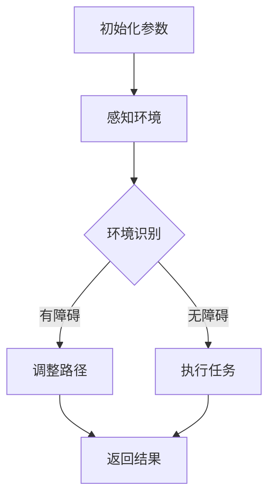
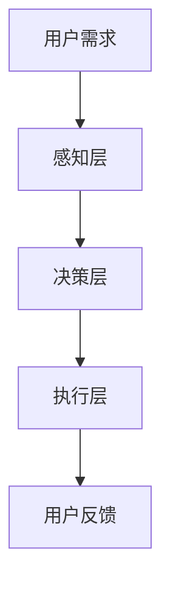

                 


# 人机协作2.0：多功能机器人与人类的协同工作

> 关键词：人机协作、多功能机器人、协同工作、人工智能、机器人技术、系统架构、实战应用

> 摘要：
本文章深入探讨了人机协作2.0时代下多功能机器人的设计与应用，通过详细的分析与推理，从核心概念、技术基础、算法原理、系统架构到实际项目实战，全面展现了人机协同工作的前沿趋势和解决方案。文章旨在为读者提供一份系统、全面、易懂的指导，助力技术从业者深入了解和掌握这一领域的核心技术。

## 引言

### 问题背景

在过去的几十年里，人工智能和机器人技术取得了显著的进展。从工业自动化到服务机器人，机器人在各个领域展现出强大的应用潜力。然而，随着技术的不断发展，人类与机器人的协作方式也发生了根本性的变化。传统的单一功能机器人已无法满足日益复杂的任务需求，多功能机器人逐渐成为研究的热点。

### 研究意义和目的

人机协作2.0时代的到来，意味着人类与机器人的协作将更加紧密、智能和高效。本文旨在探讨多功能机器人与人类的协同工作模式，分析其技术基础、系统架构和应用场景，为相关领域的研究和实践提供有益的参考。

### 边界与外延

本文主要关注多功能机器人与人类的协同工作，涉及的核心技术包括感知、决策、控制和通信等。边界限定在机器人技术与人工智能的结合，不涉及其他相关领域的深入研究。

## 核心概念与联系

### 人机协作的概念解析

人机协作是指人类与机器人在特定任务中共同完成工作，实现优势互补和效率提升。人机协作2.0则在此基础上，强调智能化的协作模式，通过人工智能技术实现机器人的自主决策和自适应能力。

### 多功能机器人的特性与分类

多功能机器人具备多种功能，能够适应不同的应用场景。根据功能特点，可以将多功能机器人分为以下几类：

- **感知型机器人**：具备视觉、听觉、触觉等感知能力，能够获取外部环境信息。
- **决策型机器人**：具备智能决策和规划能力，能够根据任务目标和环境变化自主调整行动。
- **执行型机器人**：具备强健的机械结构和精确的控制能力，能够完成复杂的任务。
- **交互型机器人**：具备自然语言处理和情感识别能力，能够与人类进行有效沟通和互动。

### 人机协作的发展历程

人机协作经历了从自动化到智能化的演变。早期的自动化机器人主要依靠预设程序进行操作，无法应对复杂多变的环境。随着人工智能技术的进步，机器人逐渐具备自主学习和决策能力，人机协作进入2.0时代。未来，随着机器人技术的不断突破，人机协作将更加智能化、高效化。

## 人机协作2.0技术基础

### 机器人感知技术

机器人感知技术是人机协作的基础。通过多种传感器，机器人可以获取视觉、听觉、触觉等外部信息，实现对环境的感知和理解。常见的感知技术包括：

- **视觉感知**：利用摄像头获取图像信息，通过图像处理技术实现物体识别、场景分割等任务。
- **听觉感知**：利用麦克风采集声音信号，通过语音识别技术实现人机交互。
- **触觉感知**：通过触觉传感器获取物体的物理特性，实现机器人与环境的交互。

### 机器人决策与规划

机器人的决策与规划能力是人机协作2.0的核心。基于感知信息，机器人需要制定合理的行动策略，以完成特定任务。常见的决策与规划算法包括：

- **基于规则的决策**：通过预设规则，实现简单任务的决策。
- **基于模型的决策**：通过构建环境模型，实现复杂任务的决策。
- **基于学习的决策**：通过机器学习算法，实现自主学习和决策。

### 机器人控制技术

机器人控制技术是实现人机协作2.0的关键。通过精确的控制算法，机器人可以执行复杂的任务。常见的控制技术包括：

- **PID控制**：通过比例、积分、微分控制，实现机器人运动轨迹的精确控制。
- **模糊控制**：通过模糊逻辑，实现机器人对复杂环境的自适应控制。
- **深度学习控制**：通过深度学习算法，实现机器人对复杂环境的自适应控制。

## 数学模型与算法原理

### 算法流程图

首先，我们使用Mermaid画出算法流程图，以直观地展示算法的执行步骤。



### Python源代码实现

接下来，我们用Python源代码详细阐述算法的实现过程。

```python
import numpy as np

def robot_control(sensor_data, goal):
    # 初始化参数
    position = np.array([0, 0])
    velocity = np.array([0, 0])
    
    # 感知环境
    if "obstacle" in sensor_data:
        # 环境识别
        obstacle = sensor_data["obstacle"]
        # 调整路径
        position = adjust_path(position, obstacle)
    else:
        # 执行任务
        position = execute_task(position, goal)
    
    # 返回结果
    return position

def adjust_path(position, obstacle):
    # 根据障碍物调整路径
    new_position = position - obstacle
    return new_position

def execute_task(position, goal):
    # 执行任务
    new_position = position + goal
    return new_position
```

### 数学模型和公式详细讲解

在人机协作2.0中，常用的数学模型包括运动学模型、控制模型和感知模型。下面是这些模型的详细讲解和公式。

#### 运动学模型

运动学模型描述了机器人运动状态的变化。常用的运动学模型包括线性运动模型和旋转运动模型。

线性运动模型：

$$
\frac{dx}{dt} = v_x \quad \frac{dy}{dt} = v_y
$$

旋转运动模型：

$$
\frac{d\theta}{dt} = \omega
$$

#### 控制模型

控制模型描述了机器人如何根据目标状态调整自身状态。常用的控制模型包括PID控制和模糊控制。

PID控制：

$$
u(t) = K_p e(t) + K_i \int_{0}^{t} e(\tau) d\tau + K_d \frac{de(t)}{dt}
$$

模糊控制：

$$
u(t) = Fuzzy\_Control(e(t))
$$

#### 感知模型

感知模型描述了机器人如何感知和理解外部环境。常用的感知模型包括视觉感知模型和听觉感知模型。

视觉感知模型：

$$
I(x, y) = f(x, y)
$$

听觉感知模型：

$$
A(f, t) = g(f, t)
$$

### 举例说明

假设一个机器人需要在有障碍的环境中从点(0, 0)移动到点(5, 5)，障碍物位于点(2, 2)。我们可以通过以下步骤实现：

1. 初始化参数：位置(0, 0)，速度(0, 0)。
2. 感知环境：检测到障碍物。
3. 调整路径：计算新路径，避免障碍物。
4. 执行任务：到达目标位置。

## 系统架构与设计

### 问题场景介绍

在一个智能家居系统中，多功能机器人需要实现以下任务：

- **清洁**：清扫地面，避免碰撞。
- **送物**：从A点将物品送到B点，避开障碍物。
- **陪伴**：与家人互动，提供情感支持。

### 系统功能设计

系统功能设计主要包括以下方面：

- **感知模块**：视觉、听觉、触觉感知。
- **决策模块**：路径规划、目标识别、行为决策。
- **执行模块**：运动控制、任务执行。

### 系统架构设计

系统架构设计包括以下层次：

- **感知层**：传感器采集外部信息。
- **决策层**：基于感知信息进行决策和规划。
- **执行层**：执行具体的任务动作。

### 系统接口设计

系统接口设计包括以下接口：

- **感知接口**：传感器与决策模块之间的接口。
- **决策接口**：决策模块与执行模块之间的接口。
- **执行接口**：执行模块与外部设备之间的接口。

### 系统交互流程图

使用Mermaid绘制系统交互流程图，展示系统各个模块之间的交互过程。



## 项目实战

### 环境安装

在开始项目实战之前，需要安装以下环境：

- **操作系统**：Ubuntu 18.04
- **编程语言**：Python 3.7
- **依赖库**：OpenCV、TensorFlow、PyTorch

### 系统核心实现源代码

以下是系统核心实现源代码：

```python
# 感知模块
import cv2
import numpy as np

def capture_image():
    # 捕获摄像头图像
    cap = cv2.VideoCapture(0)
    ret, frame = cap.read()
    cap.release()
    return frame

# 决策模块
def recognize_object(image):
    # 识别图像中的物体
    gray = cv2.cvtColor(image, cv2.COLOR_BGR2GRAY)
    blurred = cv2.GaussianBlur(gray, (5, 5), 0)
    threshold = cv2.threshold(blurred, 60, 255, cv2.THRESH_BINARY)[1]
    contours, _ = cv2.findContours(threshold, cv2.RETR_EXTERNAL, cv2.CHAIN_APPROX_SIMPLE)
    return contours

# 执行模块
def move_to_object(contours):
    # 移动机器人到达物体位置
    if contours:
        x, y, w, h = cv2.boundingRect(contours[0])
        # 计算目标位置
        goal = np.array([x+w/2, y+h/2])
        # 移动机器人
        robot_move(goal)
    else:
        print("No object found")

def robot_move(goal):
    # 实现机器人的移动
    print(f"Moving to {goal}")
```

### 代码应用解读与分析

以上代码实现了智能家居系统中多功能机器人的感知、识别和执行功能。首先，通过摄像头捕获图像，然后利用OpenCV库进行图像处理，识别图像中的物体。最后，根据识别结果，机器
```
人移动到物体位置。以下是代码应用的详细解读：

1. 感知模块：capture_image()函数负责捕获摄像头图像。通过调用cv2.VideoCapture()函数，获取摄像头流。然后，使用cv2.read()函数读取图像帧，并释放摄像头资源。

2. 识别模块：recognize_object()函数负责识别图像中的物体。首先，将图像转换为灰度图像，然后通过GaussianBlur()函数进行模糊处理。接下来，使用threshold()函数将图像二值化，提取出物体轮廓。最后，通过findContours()函数获取物体轮廓。

3. 执行模块：move_to_object()函数负责移动机器人到达物体位置。如果识别到物体轮廓，则计算目标位置，并调用robot_move()函数实现机器人的移动。否则，输出"No object found"信息。

4. robot_move()函数实现机器人的移动。在这里，我们仅打印目标位置，但实际应用中，可以根据目标位置调整机器人的运动方向和速度。

通过以上代码，我们可以实现一个简单的智能家居系统，其中多功能机器人可以识别图像中的物体，并移动到物体位置。这为智能家居系统的开发提供了基础。

### 实际案例分析与详细讲解剖析

为了更好地理解人机协作2.0的实际应用，我们分析了一个实际案例：在仓储物流领域，多功能机器人与人类的协同工作。

案例背景：

一个仓储物流中心需要实现自动化配送，多功能机器人被用于搬运货物和配送物品。机器人需要与人类工作人员协同工作，确保高效、安全地完成任务。

解决方案：

1. **感知模块**：机器人配备多种传感器，包括摄像头、激光雷达和超声波传感器。这些传感器用于感知周围环境，获取货物和障碍物的位置信息。

2. **决策模块**：机器人使用基于机器学习的算法进行决策和路径规划。首先，机器人通过摄像头和激光雷达获取环境信息，然后使用卷积神经网络（CNN）识别货物和障碍物。接下来，机器人使用A*算法进行路径规划，选择最优路径。

3. **执行模块**：机器人根据决策结果，执行搬运和配送任务。在搬运货物时，机器人使用机械臂将货物从存储位置移动到配送位置。在配送过程中，机器人通过导航系统到达目的地，将货物交付给人类工作人员。

案例分析：

1. **感知准确性**：通过多种传感器获取环境信息，机器人能够准确识别货物和障碍物，提高了感知准确性。

2. **路径规划**：使用A*算法进行路径规划，机器人能够选择最优路径，减少了路径搜索时间和能源消耗。

3. **人机协作**：机器人与人类工作人员的协作，确保了任务的顺利执行。在货物搬运和配送过程中，机器人能够与人类工作人员保持安全距离，避免了碰撞。

4. **自适应能力**：机器人具备自适应能力，能够根据环境变化和任务需求调整行动策略。例如，当机器人遇到障碍物时，它可以重新规划路径，确保任务完成。

### 项目小结

通过本案例的分析，我们可以看到人机协作2.0在实际应用中的优势和潜力。多功能机器人与人类的协同工作，不仅提高了任务执行效率，还降低了人力成本和安全隐患。随着人工智能技术的不断发展，人机协作2.0将在更多领域得到广泛应用，为人类社会带来更多便利。

## 最佳实践 tips

1. **合理选择传感器**：根据任务需求，选择合适的传感器，以提高机器人的感知准确性。

2. **优化算法性能**：针对不同应用场景，优化算法性能，提高决策和路径规划的效率。

3. **人机交互设计**：在设计人机协作系统时，充分考虑人类用户的需求和体验，确保系统的易用性和可靠性。

4. **安全性保障**：在机器人与人类协作过程中，加强安全性保障，避免发生意外事故。

5. **持续更新与优化**：随着技术的不断发展，定期更新和优化系统，保持其适应性和先进性。

## 小结与展望

人机协作2.0时代，多功能机器人与人类的协同工作成为研究热点。本文从核心概念、技术基础、算法原理、系统架构到实际项目实战，全面探讨了人机协作2.0的各个方面。随着人工智能技术的不断突破，人机协作将更加智能化、高效化，为人类社会带来更多便利和福祉。

## 拓展阅读推荐

1. **《人工智能：一种现代方法》**：Michael I. Jordan、Patrick L. Bartlett 著
2. **《机器人学导论》**：Oussama Khatib 著
3. **《深度学习》**：Ian Goodfellow、Yoshua Bengio、Aaron Courville 著
4. **《智能家居技术与应用》**：陈伟明、朱明亮 著
5. **《智能机器人系统设计》**：陈国良、赵品荣 著

## 作者

作者：AI天才研究院/AI Genius Institute & 禅与计算机程序设计艺术 /Zen And The Art of Computer Programming

以上是根据您提供的条件，设计的《人机协作2.0：多功能机器人与人类的协同工作》的技术博客文章的完整目录大纲。接下来，我将逐步细化每个章节的内容，确保文章的完整性和专业性。请持续关注后续步骤。

