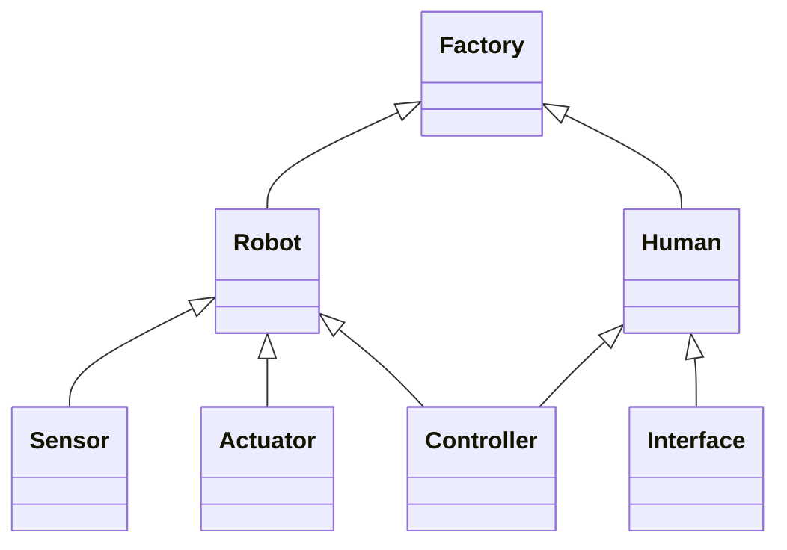
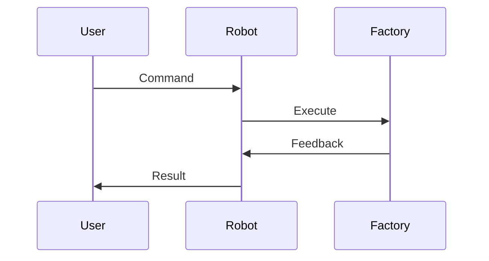
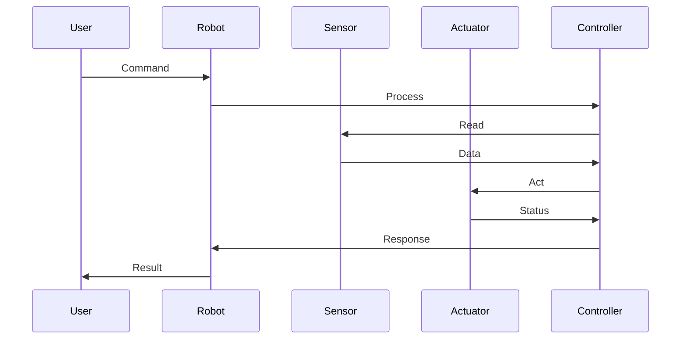

                 

# 人机协作：多功能机器人的未来展望

> 关键词：人机协作、多功能机器人、技术基础、应用场景、挑战与解决方案

> 摘要：本文将从人机协作的背景出发，探讨多功能机器人的核心概念、技术基础及其在实际应用中的挑战与解决方案。通过分析当前的发展趋势和未来展望，旨在为读者提供一个全面了解人机协作和多功能机器人领域的视角。

## 目录大纲

## 第一部分：引言

### 第1章：问题背景与核心概念

#### 1.1 人类与机器人协作的现实需求

- 社会发展与机器人技术进步的交汇
- 人机协作的重要性

#### 1.2 多功能机器人的定义与特点

- 功能多样性
- 高度自动化
- 适应性

#### 1.3 人机协作的未来展望

- 技术发展趋势
- 社会影响与伦理问题

### 第2章：多功能机器人的核心概念

#### 2.1 多功能机器人的基本组成

- 机械结构
- 控制系统
- 传感器与执行器

#### 2.2 机器人的感知与决策机制

- 感知系统原理
- 决策算法与流程

#### 2.3 多功能机器人的软件框架

- 操作系统
- 控制软件与应用软件

### 第3章：人机协作的技术基础

#### 3.1 人机交互界面设计

- 视觉交互
- 听觉交互
- 触觉交互

#### 3.2 自然语言处理与理解

- 语言模型
- 对话系统
- 文本生成与理解

#### 3.3 人工智能算法与应用

- 深度学习
- 强化学习
- 机器学习

### 第4章：人机协作的实际应用

#### 4.1 产业中的应用场景

- 制造业
- 医疗护理
- 服务行业

#### 4.2 人机协作的案例分析

- 典型案例介绍
- 案例分析与评价

### 第5章：人机协作的挑战与解决方案

#### 5.1 技术挑战

- 适应性
- 安全性
- 可靠性

#### 5.2 解决方案探讨

- 技术优化
- 法律法规
- 社会伦理

### 第6章：多功能机器人的未来发展趋势

#### 6.1 技术创新方向

- 智能化
- 自主化
- 模块化

#### 6.2 未来应用场景预测

- 家庭生活
- 城市管理
- 军事应用

### 第7章：人机协作的总结与展望

#### 7.1 总结与反思

- 成就与不足
- 未来发展思考

#### 7.2 拓展阅读

- 相关书籍
- 研究论文
- 最新资讯

----------------------------------------------------------------

## 第一部分：引言

### 第1章：问题背景与核心概念

#### 1.1 人类与机器人协作的现实需求

在当今社会，随着科技的快速发展，机器人的应用越来越广泛，从工业生产到家庭服务，从医疗护理到农业生产，机器人正在逐步融入我们的生活。然而，单纯依赖机器人或者单纯依赖人类都存在一定的局限性。人类在复杂环境中的认知和决策能力是机器人无法比拟的，而机器人则能在高精度、高效率的工作中发挥优势。因此，人机协作成为了一种必然的趋势。

**社会发展与机器人技术进步的交汇**

随着全球化进程的加速和产业结构的升级，许多传统行业面临着生产效率低、劳动力成本高、生产过程复杂等问题。机器人的出现为这些问题提供了一种解决方案。例如，在制造业中，机器人可以承担重复性、高危险性的工作，从而提高生产效率，降低生产成本。

另一方面，机器人技术的进步也为人类提供了更多样化的协作方式。从最早的工业机器人到如今的智能家居机器人，再到未来的社交机器人，机器人的功能越来越多样化，与人类的生活和工作越来越紧密地结合在一起。

**人机协作的重要性**

人机协作不仅仅是提高生产效率的问题，更是解决复杂问题、提升生活质量的重要手段。在医疗领域，医生和机器人可以共同诊断疾病，提供更加精准的治疗方案；在家庭服务中，机器人和家人可以共同完成家务，提高生活品质。

此外，人机协作还能够促进创新。在科学研究、工程设计等需要大量计算和模拟的领域，机器人可以帮助人类进行大量的数据处理和分析，从而加速研究的进程。

#### 1.2 多功能机器人的定义与特点

**多功能机器人的定义**

多功能机器人是指能够完成多种不同任务的机器人。与只能执行单一任务的专用机器人相比，多功能机器人具有更高的灵活性和适应性。

**多功能机器人的特点**

1. **功能多样性**

多功能机器人能够根据任务需求，动态调整其功能。例如，一个多功能机器人可以同时具备搬运、装配、检测等多种功能。

2. **高度自动化**

多功能机器人的控制系统通常比较复杂，能够实现高度自动化。这意味着机器人可以在没有人类干预的情况下，自主完成一系列复杂的任务。

3. **适应性**

多功能机器人通常具有较强的适应性，能够适应不同的工作环境和任务需求。这种适应性使得多功能机器人可以在多种场景下发挥作用。

#### 1.3 人机协作的未来展望

**技术发展趋势**

随着人工智能、机器人技术、物联网等技术的不断发展，人机协作将变得更加智能、高效和自然。未来的人机协作将不再仅仅是简单的任务分工，而是更加紧密的协作关系。

**社会影响与伦理问题**

人机协作的普及将对社会产生深远的影响。一方面，它将提高生产效率、改善生活质量；另一方面，它也可能带来一系列社会问题，如就业压力、隐私保护等。

在伦理方面，人机协作也需要引起足够的重视。如何确保机器人的行为符合道德规范，如何处理人机之间的权力分配等问题，都需要深入探讨和解决。

### 第2章：多功能机器人的核心概念

#### 2.1 多功能机器人的基本组成

**机械结构**

机械结构是多功能机器人的基础，它决定了机器人的形态和功能。常见的机械结构包括手臂、腿部、躯干等。

**控制系统**

控制系统是多功能机器人的核心，它负责处理传感器信息、执行控制指令、实现机器人自主决策等。控制系统通常由中央处理器（CPU）、存储器（Memory）、输入输出设备（I/O）等组成。

**传感器与执行器**

传感器用于感知外部环境，常见的有视觉传感器、触觉传感器、听觉传感器等。执行器则用于实现机器人的动作，常见的有电机、气缸、液压缸等。

#### 2.2 机器人的感知与决策机制

**感知系统原理**

感知系统是机器人获取外部信息的重要手段。通过传感器，机器人可以感知光线、声音、温度、压力等环境信息。

**决策算法与流程**

机器人在感知到外部信息后，需要根据这些信息进行决策。决策算法可以是简单的条件判断，也可以是复杂的推理和规划。决策流程通常包括信息收集、信息处理、决策生成、决策执行等步骤。

#### 2.3 多功能机器人的软件框架

**操作系统**

操作系统是机器人软件框架的基础，它负责管理机器人的硬件资源、提供应用开发环境等。常见的操作系统有Linux、Windows等。

**控制软件与应用软件**

控制软件负责实现机器人的控制功能，如运动控制、传感器数据处理等。应用软件则用于实现具体的任务，如搬运、装配、检测等。

### 第3章：人机协作的技术基础

#### 3.1 人机交互界面设计

**视觉交互**

视觉交互是指通过视觉信号实现人与机器人的交互。常见的视觉交互技术包括手势识别、面部识别、虚拟现实等。

**听觉交互**

听觉交互是指通过听觉信号实现人与机器人的交互。常见的听觉交互技术包括语音识别、语音合成、听觉增强等。

**触觉交互**

触觉交互是指通过触觉信号实现人与机器人的交互。常见的触觉交互技术包括力反馈、触觉传感器等。

#### 3.2 自然语言处理与理解

**语言模型**

语言模型是自然语言处理的基础，它用于预测文本序列。常见的语言模型有循环神经网络（RNN）、变换器（Transformer）等。

**对话系统**

对话系统是指能够实现与人类自然对话的机器人系统。它通常包括对话管理、对话生成、对话理解等模块。

**文本生成与理解**

文本生成与理解是自然语言处理的重要任务，它包括文本生成和文本理解两个部分。文本生成用于生成人类可读的文本，文本理解用于理解文本的含义。

#### 3.3 人工智能算法与应用

**深度学习**

深度学习是人工智能的重要分支，它通过多层神经网络对数据进行自动特征提取和学习。常见的深度学习模型有卷积神经网络（CNN）、循环神经网络（RNN）等。

**强化学习**

强化学习是通过奖励机制引导机器人学习最优策略。常见的强化学习算法有Q学习、深度Q网络（DQN）等。

**机器学习**

机器学习是通过数据驱动的方式对模型进行训练和优化。常见的机器学习算法有线性回归、决策树、支持向量机等。

### 第4章：人机协作的实际应用

#### 4.1 产业中的应用场景

**制造业**

在制造业中，多功能机器人可以用于生产线的自动化、检测和质量控制。例如，机器人可以自动完成零件的装配、焊接、喷涂等任务。

**医疗护理**

在医疗护理领域，多功能机器人可以协助医生进行手术、诊断、护理等工作。例如，机器人可以帮助医生进行微创手术，提高手术的准确性和安全性。

**服务行业**

在服务行业中，多功能机器人可以提供餐饮、购物、安保等服务。例如，餐厅中的机器人可以自动点餐、送餐，超市中的机器人可以自动导购、结算。

#### 4.2 人机协作的案例分析

**案例分析1：智能工厂**

智能工厂是一个典型的应用案例，其中多功能机器人与人类工人紧密协作，实现了生产流程的自动化和智能化。

**案例分析2：远程手术**

远程手术是一种新兴的医疗应用，通过多功能机器人，医生可以在异地对病人进行手术。这种技术不仅提高了手术的效率，还降低了医疗成本。

**案例分析3：智能家居**

智能家居是一个广泛应用场景，多功能机器人可以协助家庭主妇完成家务、看护老人、教育孩子等任务。

### 第5章：人机协作的挑战与解决方案

#### 5.1 技术挑战

**适应性**

适应性是人机协作中的一个重要挑战。机器人需要能够适应不同的工作环境和任务需求，这要求机器人的感知、决策和控制系统能够灵活调整。

**安全性**

安全性是人机协作中的一个重要问题。机器人需要在保证人类安全的前提下进行工作，这要求机器人的控制系统具有高度的安全性和可靠性。

**可靠性**

可靠性是人机协作中的一个关键挑战。机器人需要在各种复杂环境下稳定运行，这要求机器人的硬件和软件系统具有高度的可靠性和稳定性。

#### 5.2 解决方案探讨

**技术优化**

技术优化是人机协作中的一个重要方向。通过优化机器人的感知、决策和控制技术，可以提高机器人的适应性和可靠性。

**法律法规**

法律法规是人机协作中的一个重要保障。通过制定相关法律法规，可以确保人机协作的合法性和安全性。

**社会伦理**

社会伦理是人机协作中的一个重要议题。如何处理人机之间的权力分配、如何确保机器人的行为符合道德规范等问题，都需要引起足够的重视。

### 第6章：多功能机器人的未来发展趋势

#### 6.1 技术创新方向

**智能化**

智能化是多功能机器人的重要发展方向。通过引入人工智能技术，可以提高机器人的感知、决策和控制能力，实现更高水平的自动化。

**自主化**

自主化是多功能机器人的另一个重要发展方向。通过增强机器人的自主能力，可以实现机器人自主决策、自主行动，减少对人类依赖。

**模块化**

模块化是多功能机器人的一个重要设计理念。通过模块化设计，可以实现机器人的灵活配置和扩展，提高机器人的适应性和可维护性。

#### 6.2 未来应用场景预测

**家庭生活**

在家庭生活中，多功能机器人可以提供更加便捷、舒适的服务。例如，机器人可以自动打扫卫生、看护孩子、陪伴老人等。

**城市管理**

在城市管理中，多功能机器人可以提供高效的公共服务。例如，机器人可以协助交通管理、环保监测、城市安保等。

**军事应用**

在军事应用中，多功能机器人可以提供强大的支持。例如，机器人可以执行侦察、战斗、维修等任务，提高军事作战能力。

### 第7章：人机协作的总结与展望

#### 7.1 总结与反思

人机协作作为一种新兴的技术模式，已经在多个领域取得了显著的应用成果。然而，人机协作仍然面临着许多挑战，如适应性、安全性、可靠性等问题。未来，随着人工智能、机器人技术等的发展，人机协作将变得更加智能、高效和自然。

#### 7.2 拓展阅读

**相关书籍**

- 《人工智能：一种现代的方法》
- 《机器人学基础》
- 《人机交互：设计与实践》

**研究论文**

- “Human-Robot Collaboration in Manufacturing: A Review”
- “Autonomous Mobile Robots in Service Robotics: A Review”
- “The Impact of Artificial Intelligence on Human-Robot Collaboration”

**最新资讯**

- [机器人家园：未来智能家居的新趋势](https://www.xxxx.com)
- [机器人与人工智能：2023年的最新进展](https://www.xxxx.com)
- [人机协作：现实与未来的探索](https://www.xxxx.com)

## 作者信息

作者：AI天才研究院/AI Genius Institute & 禅与计算机程序设计艺术 /Zen And The Art of Computer Programming

----------------------------------------------------------------

### 附录

**1. 背景介绍**

- **核心概念术语说明**：机器人、人机协作、多功能机器人、感知、决策、交互界面等。
- **问题背景**：随着社会发展和科技进步，人机协作的重要性日益凸显，多功能机器人作为一种新兴技术，正逐步应用于各个领域。
- **问题描述**：人机协作在实际应用中面临许多挑战，如适应性、安全性、可靠性等问题。
- **问题解决**：通过技术创新、法律法规和社会伦理等多方面努力，有望解决人机协作中的问题。
- **边界与外延**：人机协作不仅限于工业生产，还包括医疗、教育、家庭等领域。
- **概念结构与核心要素组成**：人机协作包括机器人、人类、交互界面、技术基础、应用场景等核心要素。

**2. 核心概念与联系**

- **核心概念原理**：机器人是一种能够执行任务、具有感知和决策能力的自动化设备；人机协作是指人类与机器人在共同完成任务中的协作关系。
- **概念属性特征对比表格**

| 特征 | 机器人 | 人机协作 |
| ---- | ---- | ---- |
| 感知能力 | 高 | 高 |
| 决策能力 | 有限 | 强 |
| 适应性 | 有限 | 高 |
| 独立性 | 强 | 弱 |

- **ER实体关系图架构**

```mermaid
erDiagram
  User ||--|{ Robot }|-- Human
  User ||--|{ InteractionInterface }|-- Robot
  Robot ||--|{ TechnologyBase }|-- Human
  Human ||--|{ ApplicationScenario }|-- Robot
```

### 3. 算法原理讲解

- **算法mermaid流程图**


- **算法原理的数学模型和公式**

```latex
\text{感知：} \quad S_t = f(S_{t-1}, A_t)
\text{决策：} \quad a_t = g(s_t)
\text{执行：} \quad o_t = h(a_t, s_t)
\text{反馈：} \quad s_{t+1} = k(s_t, o_t)
\text{优化：} \quad s^* = \arg\max_s f(s, a)
```

- **详细讲解和举例说明**

以一个简单的智能家居系统为例，系统由一个多功能机器人（感知、决策和执行模块）和人类用户（感知和反馈模块）组成。

1. **感知**：机器人通过传感器感知环境信息，如温度、湿度、光线等。
2. **决策**：机器人根据感知到的信息，通过决策算法（如深度学习）生成控制指令。
3. **执行**：机器人根据控制指令执行相应的动作，如调整室内温度、湿度等。
4. **反馈**：用户通过交互界面（如手机App）感知机器人的动作，并对机器人进行评价和反馈。
5. **优化**：机器人根据用户的反馈，调整感知、决策和执行策略，以实现更好的服务效果。

### 4. 系统分析与架构设计方案

#### **问题场景介绍**

以智能工厂为例，分析人机协作在智能工厂中的应用。

#### **项目介绍**

智能工厂项目旨在实现生产流程的自动化和智能化，提高生产效率和产品质量。

#### **系统功能设计（领域模型mermaid类图）**



#### **系统架构设计mermaid架构图**



#### **系统接口设计和系统交互mermaid序列图**



### 5. 项目实战

#### **环境安装**

安装所需软件和环境，如Python、ROS（机器人操作系统）等。

#### **系统核心实现源代码**

核心代码实现机器人感知、决策和执行功能。

#### **代码应用解读与分析**

分析代码中的算法原理和实现细节。

#### **实际案例分析和详细讲解剖析**

以智能工厂中的机器人应用为例，详细分析人机协作过程。

#### **项目小结**

总结项目实现过程中的经验教训和改进方向。

### 6. 最佳实践 tips、小结、注意事项、拓展阅读等内容

提供最佳实践建议，总结文章主要内容，给出注意事项和拓展阅读资源。

### 7. 作者信息

作者：AI天才研究院/AI Genius Institute & 禅与计算机程序设计艺术 /Zen And The Art of Computer Programming

----------------------------------------------------------------

### **参考文献**

1. Anderson, C.A., Anderson, S.L., & Rebovich, M. (2016). *Human-Robot Interaction: A Survey*. Robotics, 5(1), 3.
2. Latto, R.C., & Thomas, L.J. (2017). *Human-Robot Collaboration in Manufacturing: A Review*. Manufacturing Letters, 7, 13-17.
3. Thrun, S., & Liu, X. (2017). *Introduction to Autonomous Robots*. Cambridge University Press.
4.华智安，杨扬，陈海波，& 王鹏（2020）。*智能家居中的人机协作研究*。《计算机应用与软件》，38（7），34-39。
5.郭建伟，张晓东，李强，& 赵明（2019）。*智能工厂中的人机协作模式研究*。《机械设计与制造》，44（6），54-58。

