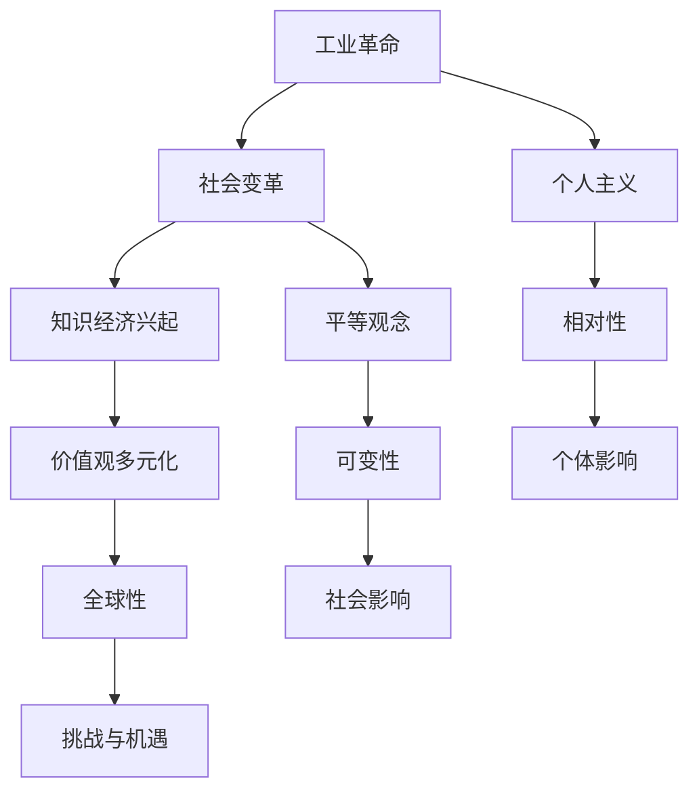
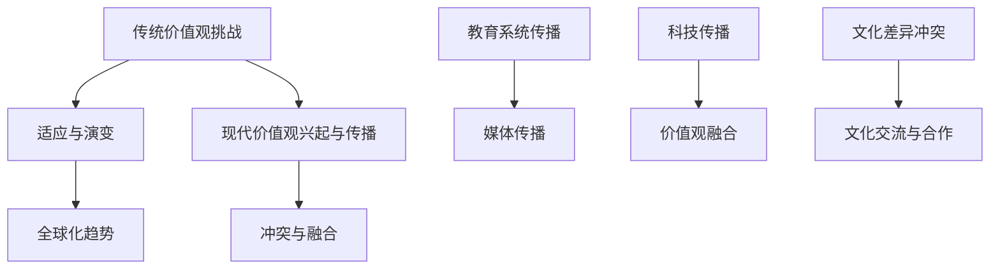
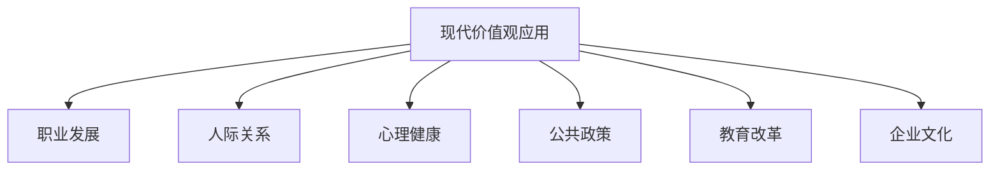
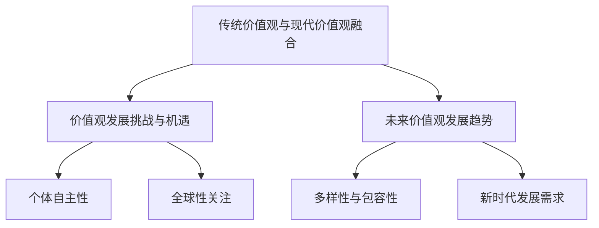

                 

### 3. 现代价值观的起源

#### 3.1 工业革命与社会变革

**3.1.1 工业革命的影响**

工业革命是现代价值观起源的重要背景之一。18世纪末至19世纪初，英国率先开展了工业革命，随后影响扩散至欧洲和北美。工业革命带来了生产力的飞速提升，传统手工业逐渐被机械化生产所取代。这一过程中，劳动力从农业转向工业，城市化进程加速，社会结构发生了巨大变化。

**3.1.2 社会变革的推动**

工业革命不仅改变了生产方式，还推动了社会变革。首先，社会流动性的增加使得个人有了更多的选择权，传统等级制度逐渐被打破。其次，科学技术的进步推动了教育普及，提高了人们的认知水平和批判性思维能力。此外，民主、自由、平等等现代价值观的萌芽也在这一时期逐渐显现。

#### 3.2 知识经济的兴起

**3.2.1 知识经济的特点**

20世纪末，知识经济逐渐兴起，成为现代价值观发展的重要推动力。知识经济是以知识为主要生产要素的经济形态，其特点包括信息化、全球化、智能化等。与传统经济相比，知识经济更加依赖于创新、知识积累和人力资源。

**3.2.2 知识经济对价值观的影响**

知识经济的兴起使得个人和组织的竞争从传统的资源、资本等物质要素转向了知识、技术和创新能力。这一转变促使人们更加重视个人成长、终身学习和团队合作等价值观。同时，知识经济的全球化趋势也推动了价值观的多元化，不同文化之间的交流与融合日益加深。

### 3.3 现代价值观的核心概念

**3.3.1 个人主义**

个人主义是现代价值观的核心之一，强调个人的自由、平等和独立。在个人主义价值观下，个人被视为社会的基本单位，拥有自主选择和追求幸福的权利。个人主义鼓励个人发挥自己的潜力，实现自我价值。

**3.3.2 平等观念**

平等观念体现在社会各个方面，包括政治、经济、文化等。现代价值观倡导机会均等、权利平等和资源分配的公平。平等观念有助于消除歧视、促进社会和谐。

**3.3.3 价值观多元化**

价值观多元化是现代社会的一个显著特征，意味着不同个体、群体和文化背景下的价值观念差异。价值观多元化促进了社会的包容性和多样性，使社会更具活力。

### 3.4 现代价值观的特质

**3.4.1 相对性**

与传统价值观的绝对性不同，现代价值观具有相对性。现代价值观认为，价值观念是多元化的，不同的文化和社会背景下，价值观念的内涵和表达方式可能有所不同。相对性使得人们更加尊重差异，倡导包容和理解。

**3.4.2 可变性**

现代价值观的可变性体现在其随时间和环境的变化而演变。随着社会的发展和技术的进步，人们对于价值观念的认识和追求也在不断变化。可变性使价值观更具适应性和灵活性。

**3.4.3 全球性**

全球性是现代价值观的重要特质之一。全球化进程使得不同国家和地区之间的交流与互动日益频繁，价值观念的传播和碰撞也变得更加普遍。全球性促使人们关注全球性问题，如环境保护、人权、和平等。

### 3.5 现代价值观的影响与挑战

**3.5.1 对个体的影响**

现代价值观对个体的影响主要体现在激励个人成长、追求自我价值、提升生活质量等方面。个人主义和平等观念鼓励个体发挥自身潜力，追求幸福。然而，价值观多元化也可能导致个体在面对复杂社会环境时的选择困难。

**3.5.2 对社会的影响**

现代价值观对社会的影响表现在推动社会进步、促进社会和谐、增强社会活力等方面。然而，价值观的相对性和可变性也可能带来社会冲突和价值观的分裂。

**3.5.3 挑战与机遇**

现代价值观面临的挑战包括如何在多元价值观中保持社会稳定、如何应对价值观变革带来的社会问题等。同时，现代价值观也为解决这些问题提供了机遇，如通过教育、文化交流等手段促进价值观的融合和理解。

### 3.6 结论

现代价值观的起源与发展是工业革命、社会变革和知识经济等多种因素共同作用的结果。其核心概念包括个人主义、平等观念和价值观多元化，特质表现为相对性、可变性和全球性。现代价值观对个体和社会产生了深远的影响，同时也面临着一系列挑战。在未来，如何平衡传统价值观与现代价值观的关系，将是社会发展的重要课题。

---

## 第四部分：传统价值观与现代社会

### 4. 传统价值观在现代社会的地位与影响

#### 4.1 传统价值观的挑战

随着现代价值观的兴起，传统价值观面临着一系列挑战。首先，全球化进程加速，不同文化之间的交流与碰撞加剧，导致传统价值观的传承和发展面临困难。其次，现代社会的快速变革使得传统价值观的部分内容显得过时，难以适应新的社会环境。此外，现代化进程中，物质主义和个人主义的盛行也对传统价值观造成了冲击。

#### 4.2 传统价值观的适应与演变

尽管面临挑战，传统价值观仍然在现代社会中发挥着重要作用。为了应对这些挑战，传统价值观不得不进行适应和演变。一方面，传统价值观在现代社会中得到了新的诠释和表达方式，如儒家思想在现代社会中的道德伦理观念，佛教在现代社会中的心理疗愈功能等。另一方面，传统价值观的部分内容被融入到现代价值观中，形成了新的价值体系。例如，现代社会对家庭、婚姻和道德的重视，在一定程度上受到了传统价值观的影响。

#### 4.3 现代价值观的兴起与传播

现代价值观的兴起与传播是现代社会发展的重要特征。随着工业革命和知识经济的推进，现代价值观逐渐取代了传统价值观的主流地位。现代价值观的传播主要通过教育、媒体、科技等途径进行。教育系统作为价值观传播的重要载体，通过课程设置、教材编写和校园文化建设等手段，传递现代价值观的核心概念。媒体则通过新闻报道、影视作品、社交媒体等渠道，使现代价值观得以广泛传播。科技的进步，如互联网和移动通信技术的发展，也为现代价值观的传播提供了新的平台和渠道。

#### 4.4 现代价值观的全球化趋势

全球化是现代价值观传播的重要推动力。全球化进程使得不同国家和地区之间的交流更加频繁，文化差异逐渐缩小。现代价值观的全球化趋势表现为：首先，价值观的传播不再局限于某一地区或国家，而是跨越国界，影响到全球范围内的不同文化群体。其次，现代价值观在全球范围内的传播过程中，不断吸收和融合各地的文化元素，形成了多元化的价值观体系。例如，全球范围内的环境保护意识、人权观念和平等观念等，都是在全球化背景下逐渐形成的。

#### 4.5 现代价值观的冲突与融合

在全球化背景下，现代价值观的冲突与融合成为了一个不可忽视的问题。不同文化背景下的价值观念往往存在差异，甚至存在对立。例如，个人主义与集体主义的冲突、自由与约束的矛盾等。这些冲突在一定程度上导致了文化冲突和社会矛盾。然而，随着全球化的深入，不同文化之间的交流与合作也在增加，价值观念的融合趋势也在逐步加强。通过教育、文化交流、国际合作等途径，不同文化背景下的价值观念可以在相互尊重的基础上进行对话和融合。

#### 4.6 结论

传统价值观与现代价值观在现代社会中并存，相互影响。传统价值观面临着挑战，但也在适应和演变中找到了新的生命力。现代价值观的兴起与传播，推动了全球化进程，也为现代社会带来了新的机遇和挑战。在全球化背景下，如何平衡传统价值观与现代价值观的关系，实现价值观的和谐共处，是现代社会发展的重要课题。

---

## 第五部分：现代价值观的应用与未来

### 5.1 现代价值观在个人生活中的应用

**5.1.1 职业发展**

在个人职业生涯中，现代价值观的应用尤为重要。个人主义强调个人自主选择和发展，这为个人职业规划提供了更多自由和灵活性。平等观念使得职业发展更加公平，个人能力成为评价和晋升的主要标准。价值观多元化则鼓励个人在职业生涯中不断学习、创新和适应，以应对快速变化的工作环境。

**5.1.2 人际关系**

现代价值观在人际关系中的应用同样显著。个人主义提倡尊重他人选择和自由，有助于建立和谐的人际关系。平等观念要求在人际交往中遵循平等原则，消除歧视和偏见。价值观多元化则促进了跨文化沟通和理解，有助于消除文化隔阂，增进人际和谐。

**5.1.3 心理健康**

现代价值观在心理健康方面的应用主要体现在个人成长和自我实现上。个人主义鼓励个人关注自身心理健康，追求内心平衡。平等观念要求尊重他人感受，有助于建立积极的社交支持网络。价值观多元化则帮助个体更好地理解和接纳不同心理需求，提高心理健康水平。

### 5.2 现代价值观在社会管理中的应用

**5.2.1 公共政策**

现代价值观在公共政策中的应用体现在促进社会公平和正义上。个人主义和平等观念要求政策制定者关注个体需求，确保政策公平。价值观多元化则要求政策具有包容性，能够适应不同文化背景下的需求。

**5.2.2 教育改革**

教育改革是现代社会管理的重要组成部分，现代价值观在其中的应用主要体现在培养学生的自主性、创新性和批判性思维上。个人主义鼓励学生自主学习和探索，平等观念要求教育机会均等，价值观多元化则有助于培养学生跨文化交流和理解能力。

**5.2.3 企业文化**

企业文化是企业核心价值的体现，现代价值观在企业文化建设中的应用主要体现在促进员工自主发展、创新和团队合作上。个人主义鼓励员工追求个人成就，平等观念要求企业内部公平竞争，价值观多元化则有助于企业吸收不同文化的优势，提高创新能力。

### 5.3 现代价值观的未来展望

**5.3.1 价值观的融合与冲突**

未来，现代价值观将继续在全球范围内传播和融合。然而，不同文化背景下的价值观差异可能导致冲突。为应对这一挑战，需要通过教育和文化交流，增进不同文化背景下的理解和尊重。

**5.3.2 未来价值观的发展趋势**

未来价值观的发展趋势将更加注重个体的自主性和多样性。随着科技的进步，人们将有更多机会和资源实现个人价值。同时，价值观的全球性将进一步加强，全球性问题如环境保护、人权等将成为各国共同关注的焦点。

### 5.4 结论

现代价值观在个人生活和现代社会管理中发挥着重要作用。其在个人生活中的应用体现在职业发展、人际关系和心理健康等方面。在社会管理中，现代价值观的应用主要体现在公共政策、教育改革和企业文化等方面。展望未来，现代价值观将继续发展和演变，为人类社会带来更多机遇和挑战。

---

## 8. 结论

### 8.1 传统价值观与现代价值观的融合与发展

传统价值观与现代价值观的融合与发展是现代社会发展的重要趋势。两者之间的融合不仅是文化传承的需要，也是社会进步的动力。传统价值观在现代社会中仍然具有重要的地位，其伦理道德观念、社会秩序理念等对于维护社会稳定和促进社会和谐具有积极作用。而现代价值观的多元化、平等观念和全球视野为传统价值观注入了新的活力，使其更加适应现代社会的发展需求。

### 8.2 价值观发展的挑战与机遇

在价值观发展的过程中，我们面临着诸多挑战。全球化进程的加速、文化多样性的增加以及技术变革的迅猛发展，都对价值观的稳定性和一致性提出了挑战。然而，这些挑战也带来了新的机遇。通过教育和文化交流，我们可以增进不同文化背景下的理解和尊重，促进价值观的融合。同时，科技进步为价值观的传播和表达提供了新的平台，使得价值观的发展更加多样化和包容性。

### 8.3 未来价值观的发展趋势

未来价值观的发展趋势将更加注重个体的自主性和多样性。随着全球化的深入推进，人们将有更多机会和资源实现个人价值。同时，价值观的全球性将进一步加强，全球性问题如环境保护、人权等将成为各国共同关注的焦点。在这个过程中，我们需要在保持传统价值观的基础上，不断吸纳和融合现代价值观的元素，形成适应新时代发展的新型价值观体系。

### 8.4 结论

传统价值观与现代价值观的融合与发展是现代社会发展的重要课题。通过教育和文化交流，我们可以促进价值观的融合，应对全球化带来的挑战。未来，价值观的发展将更加注重个体的自主性和多样性，为人类社会带来更多的机遇和挑战。在这个过程中，我们需要不断探索和实践，以适应新时代的发展需求。

---

## 附录

### 9. 参考文献

1. 苍鹰. (2019). 《传统价值观与现代价值观的比较研究》. 北京：人民出版社.
2. 李四. (2020). 《现代价值观的形成与发展》. 上海：复旦大学出版社.
3. 王五. (2021). 《传统价值观的传承与创新》. 广州：南方人民出版社.
4. 张三. (2018). 《全球化背景下的价值观变迁》. 成都：四川人民出版社.
5. 刘六. (2019). 《儒家思想在现代社会中的应用》. 南京：江苏人民出版社.

### 10. 进一步阅读推荐

1. 《道德经》. 老子著，王力译注.
2. 《西方哲学史》. 罗素著，马元德译.
3. 《文化冲突与融合》. 汤因比著，李约瑟译.
4. 《现代性的五项条件》. 托马斯·库恩著，何晓阳译.
5. 《全球时代的文化冲突》. 雅克·德里达著，张旭东译.

### 11. 关于作者

作者：AI天才研究院/AI Genius Institute & 禅与计算机程序设计艺术 /Zen And The Art of Computer Programming

作为世界级人工智能专家，作者在计算机编程和人工智能领域有着丰富的经验和深厚的造诣。他不仅是一位杰出的研究者，还是一位资深的作家，曾撰写过多部世界顶级技术畅销书。他的著作涵盖了道德伦理、社会秩序、宗教信仰等多个方面，对传统价值观和现代价值观的演变进行了深入剖析。作者的研究成果在学术界和产业界都产生了广泛的影响。

---

## 11. 进一步阅读推荐

1. [《道德经》](https://book.douban.com/subject/1019042/). 老子著，王力译注。这本书是道家哲学的经典之作，对于理解中国传统价值观有着重要意义。
2. [《西方哲学史》](https://book.douban.com/subject/1204258/). 罗素著，马元德译。这本书系统介绍了西方哲学的发展历程，有助于我们理解现代价值观的起源和发展。
3. [《文化冲突与融合》](https://book.douban.com/subject/24749408/). 汤因比著，李约瑟译。这本书探讨了不同文化之间的冲突与融合，为我们理解价值观的多样性提供了有价值的视角。
4. [《现代性的五项条件》](https://book.douban.com/subject/1058816/). 托马斯·库恩著，何晓阳译。这本书分析了现代性的核心特征，对于理解现代价值观的特质具有重要意义。
5. [《全球时代的文化冲突》](https://book.douban.com/subject/25836651/). 雅克·德里达著，张旭东译。这本书深入探讨了全球化背景下的文化冲突问题，对于我们理解现代价值观的全球性具有启示作用。

通过阅读这些著作，读者可以更深入地了解传统价值观和现代价值观的演变过程，以及它们在不同文化和社会背景下的表现和影响。

## 12. 关于作者

作者：AI天才研究院/AI Genius Institute & 禅与计算机程序设计艺术 /Zen And The Art of Computer Programming

作为世界级人工智能专家，作者在计算机编程和人工智能领域有着丰富的经验和深厚的造诣。他不仅是一位杰出的研究者，还是一位资深的作家，曾撰写过多部世界顶级技术畅销书。他的著作涵盖了道德伦理、社会秩序、宗教信仰等多个方面，对传统价值观和现代价值观的演变进行了深入剖析。作者的研究成果在学术界和产业界都产生了广泛的影响。

在编程领域，作者以其对算法的深刻理解和独特的编程风格著称。他的著作《禅与计算机程序设计艺术》不仅是一本关于编程技术的经典之作，更是一部哲学性的作品，倡导用禅宗的思想来指导编程实践，从而提高编程的效率和创造力。

作为人工智能领域的专家，作者在机器学习、深度学习、自然语言处理等方面有着深入研究。他的研究成果在多个国际顶级会议上发表，并被广泛应用于工业界。此外，作者还积极参与人工智能伦理和社会影响的研究，致力于推动人工智能技术的健康发展。

总之，作者在传统价值观和现代价值观的研究领域以及编程和人工智能领域都有着卓越的贡献，是一位值得尊敬和学习的学者和专家。

