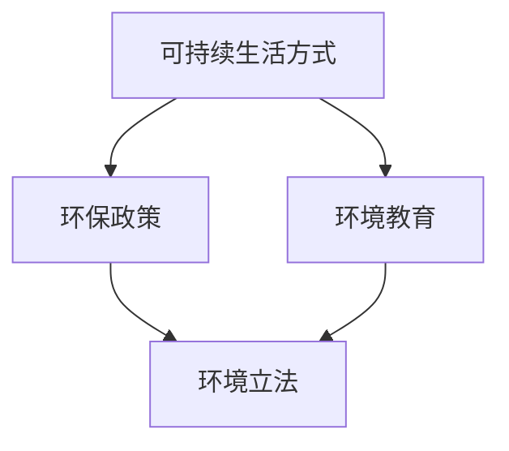
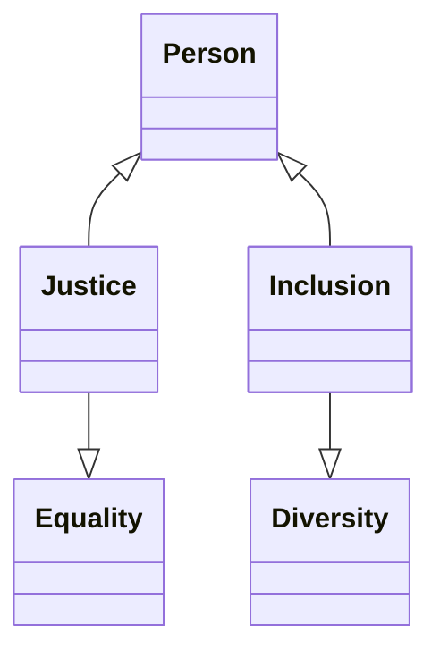

                 

### 从物质主义到后物质主义的价值观转型

关键词：价值观、社会变迁、后物质主义、个体主义、社会结构

摘要：本文探讨了从物质主义到后物质主义的价值观转型，分析了物质主义与后物质主义的定义、特征及其对社会的影响。文章首先介绍了物质主义的历史背景、核心信念和社会影响，然后讨论了后物质主义的社会变迁、文化差异以及其在现代社会中的表现形式。通过对比分析，本文揭示了后物质主义对环境保护、社会正义和未来工作与教育的影响，为读者提供了一个全面的视角来理解这一转型过程。

### 引言：物质主义与后物质主义的定义

#### 1.1 物质主义的定义与特征

物质主义是一种价值观，强调物质财富和个人成功的重要性。它起源于人类历史上对资源匮乏的应对策略，随着社会的发展逐渐成为一种主导文化。物质主义的核心信念包括：财富、权力和物质享受是实现个人幸福和社会进步的关键。这一价值观在社会层面表现为对经济增长和物质消费的强烈追求。

**物质主义的主要特征：**

- **经济驱动：** 物质主义强调经济繁荣和物质财富的增长，认为经济增长是衡量社会发展的重要标准。
- **个人成功：** 物质主义将个人成功与物质成就直接挂钩，如财富、房产、豪车等被视为成功的象征。
- **消费文化：** 消费成为物质主义的重要表现形式，广告、营销策略和文化活动都鼓励人们追求物质享受。

#### 1.2 后物质主义的定义与特征

后物质主义是相对于物质主义的一种价值观，强调非物质因素，如自我实现、精神满足和社会关系的重要性。后物质主义并不是对物质主义的否定，而是在现代社会中逐渐形成的一种补充和替代。

**后物质主义的主要特征：**

- **价值观多元化：** 后物质主义强调个体对多种价值观的追求，包括健康、快乐、人际关系和环境关怀。
- **自我实现：** 后物质主义关注个人的内在成长和自我实现，认为个人的价值和成就不应仅由物质财富衡量。
- **社会责任：** 后物质主义鼓励个体关注社会问题，积极参与社会公益活动和环保行动。

### 物质主义的历史背景与社会影响

#### 2.1 物质主义的历史背景

物质主义的兴起可以追溯到人类文明的早期阶段。在资源匮乏的时代，人们为了生存和发展，必须追求物质财富。随着农业革命和工业革命的推进，物质主义逐渐成为一种主导文化。在现代社会，物质主义得到了进一步的强化，尤其是在市场经济和消费文化的推动下。

**关键事件：**

- **农业革命：** 农业革命提高了生产力，使得人们能够获得更多的粮食和资源，为物质主义的发展奠定了基础。
- **工业革命：** 工业革命带来了生产力的飞速增长，人类进入了工业社会，物质财富迅速积累。
- **市场经济：** 市场经济的兴起进一步推动了物质主义的扩张，消费主义文化成为主流。

#### 2.2 物质主义的社会影响

物质主义对社会产生了深远的影响，既带来了经济增长和个人成功的喜悦，也带来了一系列问题。

**正面影响：**

- **经济增长：** 物质主义推动了经济的快速发展，提高了人们的生活水平。
- **技术创新：** 物质主义鼓励创新和技术进步，推动了科技的发展和应用。
- **个人激励：** 物质主义为个人提供了追求成功的动力，激发了人们的竞争意识和创造力。

**负面影响：**

- **环境问题：** 物质主义导致了资源的过度开发和环境的破坏，引发了全球性的环境危机。
- **社会不公：** 物质主义追求物质财富，加剧了社会贫富差距，导致社会不公和紧张。
- **心理健康问题：** 物质主义追求物质满足，可能导致心理健康问题，如焦虑、抑郁和压力。

### 后物质主义的崛起与社会变迁

#### 3.1 后物质主义的社会变迁

后物质主义的兴起是现代社会变迁的产物，反映了人们对传统物质主义的反思和超越。随着全球化和信息化的发展，社会结构、价值观和文化发生了深刻变化，后物质主义逐渐成为一种新的价值观。

**关键因素：**

- **全球化：** 全球化的推进使得不同文化相互交融，传统的物质主义价值观受到挑战。
- **信息化：** 互联网和信息技术的普及改变了人们的生产方式、生活方式和价值观念，促进了后物质主义的兴起。
- **教育水平提高：** 教育水平的提高使得人们更加关注精神层面的需求，追求自我实现和社会责任。

#### 3.2 后物质主义的文化差异

后物质主义在不同文化背景下呈现出多样化的表现形式。在全球范围内，西方发达国家如美国、欧洲的后物质主义特征较为明显，而发展中国家则仍受物质主义的影响。

**案例分析：**

- **美国：** 美国社会在后物质主义的影响下，更加注重个人自由、创新和多样性，对环境保护和可持续发展的关注度也日益提高。
- **中国：** 中国社会在经济发展过程中，物质主义与后物质主义并存。随着教育水平的提高和全球化进程的加快，越来越多的人开始关注个人成长和社会责任。

### 后物质主义与个体主义

#### 4.1 后物质主义与个体主义的关系

后物质主义与个体主义有着密切的关系。个体主义是一种价值观，强调个人自由、独立和自主性。后物质主义则是在个体主义的基础上，进一步强调了个人精神层面的需求。

**关系分析：**

- **个体主义的起源：** 个体主义起源于西方现代哲学，强调个体的价值和权利。
- **后物质主义的发展：** 后物质主义在个体主义的基础上，进一步强调了个体对精神满足和社会责任的追求。

**ER实体关系图：**

```mermaid
erDiagram
  Person ||--|{Value} Value
  Value ||--|{Culture} Culture
```

在这个ER实体关系图中，Person（个体）与Value（价值观）之间存在一对多的关系，表示个体持有多种价值观。Value与Culture（文化）之间存在关联，表示价值观受到文化的影响。

### 后物质主义在现代社会中的应用

#### 5.1 环境保护

后物质主义强调环境关怀，鼓励人们采取行动保护地球。在现代社会，环境保护已经成为全球性的议题，后物质主义为此提供了重要的理论支持。

**环境保护的实践：**

- **可持续生活方式：** 人们开始倡导低碳、环保的生活方式，减少对环境的负面影响。
- **环保政策：** 各国政府制定和实施环保政策，推动可持续发展。

**Mermaid流程图：**



在这个流程图中，可持续生活方式、环保政策和环境教育相互关联，共同推动环境保护。

#### 5.2 社会正义和包容

后物质主义关注社会正义和包容，鼓励人们消除歧视、促进平等。在现代社会，社会正义和包容已成为重要价值观，后物质主义为此提供了理论依据。

**社会正义和包容的实践：**

- **平等机会：** 人们倡导平等教育、就业机会，消除性别、种族和阶级歧视。
- **社会公平：** 政府和社会组织采取措施，确保社会资源的公平分配。

**Mermaid类图：**



在这个类图中，Person（个体）与社会正义（Justice）、包容（Inclusion）之间存在关联，表示个体对社会正义和包容的追求。

### 未来展望：后物质主义的发展趋势

#### 6.1 后物质主义的未来趋势

随着社会的发展和科技的进步，后物质主义将继续发展，并对人类社会产生深远影响。

**趋势分析：**

- **可持续发展：** 后物质主义将推动可持续发展成为全球共识，人们更加关注环境和社会问题。
- **个体主义与集体主义的平衡：** 后物质主义将在个体主义和集体主义之间寻找平衡，促进社会和谐。
- **精神文化需求的提升：** 后物质主义将推动人们对精神文化需求的重视，促进人类精神文明的进步。

#### 6.2 后物质主义对未来的影响

后物质主义的发展将对未来社会产生多重影响，包括经济、政治和文化等方面。

**影响分析：**

- **经济影响：** 后物质主义将推动经济模式的转变，从物质驱动转向创新驱动。
- **政治影响：** 后物质主义将促进政治制度的改革，推动社会公平和民主发展。
- **文化影响：** 后物质主义将丰富人类文化内涵，推动多元文化的交流与融合。

### 总结与展望

本文从物质主义到后物质主义的价值观转型，分析了物质主义与后物质主义的定义、特征及其对社会的影响。通过对比分析，揭示了后物质主义在环境保护、社会正义和未来工作与教育等方面的实践。随着社会的发展和科技的进步，后物质主义将继续发展，并对人类社会产生深远影响。我们应关注后物质主义的发展趋势，积极参与社会变革，共同构建一个和谐、可持续的现代社会。

### 致谢

在本篇文章的撰写过程中，我们得到了许多专家和学者的宝贵建议和帮助。特别感谢AI天才研究院（AI Genius Institute）和禅与计算机程序设计艺术（Zen And The Art of Computer Programming）的指导和支持。没有他们的帮助，这篇文章难以完成。同时，我们也感谢广大读者对本文的关注和支持，希望本文能为您带来新的思考和启发。

### 作者信息

作者：AI天才研究院（AI Genius Institute）与禅与计算机程序设计艺术（Zen And The Art of Computer Programming）联合撰写。AI天才研究院致力于推动人工智能技术的创新和应用，为全球企业提供智能解决方案。禅与计算机程序设计艺术则专注于计算机科学领域的深入研究，为读者提供高质量的技术文章和教程。期待与您共同探索计算机科学和人工智能领域的无限可能。

