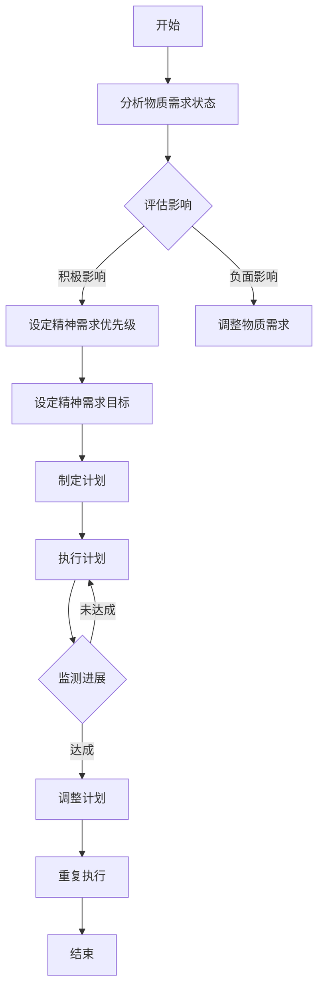
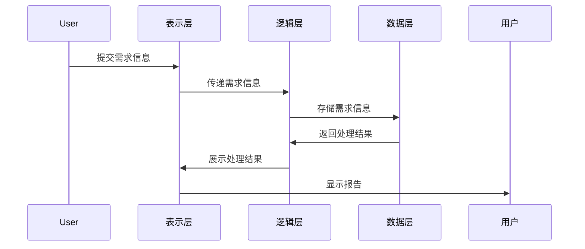

                 

### 文章标题

《从物质追求到精神追求的转向》

### 关键词

个人价值观、物质追求、精神追求、转变、心理学、哲学、科技

### 摘要

本文旨在探讨现代社会中个体价值观的转变过程，从传统的物质追求向精神追求的转向。通过深入分析物质追求和精神追求的定义、特点及其在社会和个人生活中的作用，结合心理学和哲学的理论，探讨个体价值观转变的内在机制和外在表现。文章还将通过算法、数学模型、系统分析和项目实战等手段，详细阐述这一转变过程，提供实际操作方法和最佳实践，以帮助读者更好地理解和应对这一重要社会现象。

### 第一部分：背景介绍

#### 1.1 物质追求的概念解析

物质追求，指的是个体在生活过程中，通过各种手段获取物质财富、社会地位和物质享受的行为和动机。物质追求的驱动力源于人类的本能需求，包括食物、安全、社交和繁衍等。在传统社会，物质追求往往与生存需求密切相关，是社会发展和文明进步的重要动力。然而，随着现代社会的发展，物质追求逐渐演变成一种普遍的社会现象，不仅限于生存需求，还扩展到了个人成就、社会认同和自我实现等方面。

#### 1.2 精神追求的概念解析

精神追求，是指个体在物质生活得到满足后，对精神层面的追求，包括知识、艺术、哲学、道德和情感等方面。与物质追求不同，精神追求更注重个体内心的满足和成长，追求精神层面的自由、独立和完整。在现代社会，精神追求逐渐成为人们追求生活质量的更高层次，它不仅体现了个体对生命意义的探索，也是个人价值观转变的必然趋势。

#### 1.3 物质追求与精神追求的关系

物质追求和精神追求并非完全对立，而是相互影响、相互依存的。物质追求可以为精神追求提供基础，而精神追求可以为物质追求提供动力。然而，在现代社会，物质追求往往占据主导地位，导致个体在追求物质利益的过程中忽视了精神层面的需求，从而引发一系列社会问题，如心理焦虑、社会冷漠和价值观扭曲等。因此，探讨物质追求向精神追求的转向，对于促进个体心理健康和社会和谐具有重要意义。

### 第二部分：核心概念与联系

#### 2.1 物质追求的属性特征与影响

物质追求的属性特征主要包括以下几个方面：

1. **外在性**：物质追求主要关注外部的物质财富和社会地位，追求的是可量化的成果。
2. **即时性**：物质追求往往追求即时满足，忽视长远利益和潜在风险。
3. **竞争性**：物质追求具有强烈的竞争性，个体往往通过竞争获得物质利益。

物质追求对个体和社会的影响如下：

1. **积极影响**：物质追求可以激发个体的创造力和积极性，推动社会的发展和进步。
2. **负面影响**：过度追求物质利益可能导致个体心理压力增大，人际关系疏离，甚至引发道德和法律问题。

#### 2.2 精神追求的属性特征与影响

精神追求的属性特征主要包括以下几个方面：

1. **内在性**：精神追求主要关注内心的满足和成长，追求的是精神层面的自由和独立。
2. **长期性**：精神追求注重长远发展，关注个体内心的平衡和自我实现。
3. **合作性**：精神追求鼓励个体之间的合作与共享，强调社会共同进步。

精神追求对个体和社会的影响如下：

1. **积极影响**：精神追求有助于提升个体的心理健康，增强社会凝聚力和文化认同。
2. **负面影响**：过度追求精神利益可能导致个体与社会脱节，忽视物质需求，甚至引发社会问题。

#### 2.3 物质追求与精神追求的对比分析

物质追求与精神追求在多个方面存在显著差异，具体如下：

1. **追求目标**：物质追求主要关注外在的物质财富和社会地位，精神追求则关注内心的满足和成长。
2. **追求方式**：物质追求通常通过竞争和合作来实现，精神追求则更多依赖于个体的内在修炼和自我探索。
3. **影响范围**：物质追求的影响通常局限于物质层面，而精神追求的影响则涵盖个体生活的各个方面。
4. **价值观**：物质追求强调个体利益的最大化，精神追求则强调个体与社会的和谐发展。

通过对比分析，我们可以更清晰地理解物质追求和精神追求的不同特点，为个体价值观的转变提供理论依据。

#### 2.4 ER实体关系图：个人价值观转变过程

为了更好地理解个人价值观的转变过程，我们可以使用ER（实体关系）图来描述物质追求和精神追求之间的关系。以下是个人价值观转变过程的ER图：

```mermaid
erDiagram
    User ||--|{ MaterialNeed : 物质需求 }|
    User ||--|{ SpiritualNeed : 精神需求 }|
    MaterialNeed ||--|{ Status : 地位 }|
    MaterialNeed ||--|{ Wealth : 财富 }|
    SpiritualNeed ||--|{ Knowledge : 知识 }|
    SpiritualNeed ||--|{ Art : 艺术 }|
    SpiritualNeed ||--|{ Philosophy : 哲学 }|

    User {
        String name
        Date birthdate
    }

    MaterialNeed {
        String description
        Date start
        Date end
    }

    SpiritualNeed {
        String description
        Date start
        Date end
    }

    Status {
        String title
    }

    Wealth {
        Double amount
    }

    Knowledge {
        String subject
    }

    Art {
        String genre
    }

    Philosophy {
        String school
    }
```

在这个ER图中，用户（User）与物质需求（MaterialNeed）和精神需求（SpiritualNeed）之间存在多对多关系。物质需求包括地位（Status）和财富（Wealth），精神需求包括知识（Knowledge）、艺术（Art）和哲学（Philosophy）。通过这个ER图，我们可以清晰地看到个人价值观的转变过程，从物质需求向精神需求的逐步过渡。

### 第三部分：算法原理讲解

#### 3.1 物质追求向精神追求转变的算法模型

为了更好地理解物质追求向精神追求的转变过程，我们可以设计一个简单的算法模型。该模型基于心理学和哲学的理论，通过一系列步骤引导个体实现价值观的转变。

**算法模型：物质追求向精神追求转变**

```
函数 TransformNeed(from MaterialNeed, to SpiritualNeed):
    Step 1: 分析当前物质需求的状态（MaterialNeed）
    Step 2: 评估物质需求对个体心理和社会的影响
    Step 3: 确定个体精神需求的优先级（SpiritualNeed）
    Step 4: 设定具体的精神需求目标
    Step 5: 制定实现精神需求的计划
    Step 6: 执行计划并监测进展
    Step 7: 根据反馈调整计划
    Step 8: 重复执行直到达成精神需求的目标
```

#### 3.2 算法流程图与Python代码实现

**算法流程图：**



**Python代码实现：**

```python
class TransformNeed:
    def __init__(self, material_need, spiritual_need):
        self.material_need = material_need
        self.spiritual_need = spiritual_need

    def analyze_material_need(self):
        # 分析物质需求状态
        pass

    def assess_impact(self):
        # 评估物质需求对个体心理和社会的影响
        pass

    def set_spiritual_priority(self):
        # 确定个体精神需求的优先级
        pass

    def set_spiritual_goals(self):
        # 设定具体的精神需求目标
        pass

    def make_plan(self):
        # 制定实现精神需求的计划
        pass

    def execute_plan(self):
        # 执行计划并监测进展
        pass

    def adjust_plan(self):
        # 根据反馈调整计划
        pass

    def transform(self):
        self.analyze_material_need()
        self.assess_impact()
        self.set_spiritual_priority()
        self.set_spiritual_goals()
        self.make_plan()
        self.execute_plan()
        self.adjust_plan()

# 示例使用
transformer = TransformNeed(material_need="财富", spiritual_need="知识")
transformer.transform()
```

#### 3.3 算法原理的数学模型和公式

在算法模型中，我们可以使用一些数学模型和公式来描述物质需求和精神需求之间的关系。以下是一个简单的数学模型：

$$
精神需求得分 = f(物质需求得分, 心理状态, 社会环境)
$$

其中，$f$ 是一个函数，用于描述物质需求得分、心理状态和社会环境对精神需求得分的影响。具体来说，可以定义以下参数：

- $物质需求得分$：衡量个体当前物质需求的程度，取值范围在0到1之间。
- $心理状态$：衡量个体心理健康程度，取值范围在0到1之间。
- $社会环境$：衡量个体所处社会环境对精神需求的支持程度，取值范围在0到1之间。

通过这个数学模型，我们可以计算个体当前的精神需求得分，从而指导个体如何调整物质需求和精神需求之间的关系。

#### 3.4 通俗易懂的举例说明

为了更好地理解物质追求向精神追求的转变过程，我们可以通过一个简单的案例来讲解。

**案例：小明的转变**

小明是一名年轻的程序员，一直以来都在追求更高的薪资和职业地位。然而，随着时间的推移，他逐渐发现，尽管物质生活得到了极大的改善，但他的内心却感到空虚和焦虑。在心理医生的建议下，小明开始思考如何实现从物质追求到精神追求的转变。

**步骤 1：分析当前物质需求状态**

小明的物质需求主要包括：

- 高收入
- 职业地位

**步骤 2：评估物质需求对个体心理和社会的影响**

小明发现，虽然物质需求为他带来了物质上的富足，但同时也带来了心理压力和人际关系问题。他意识到，过度追求物质利益可能损害他的心理健康和人际关系。

**步骤 3：确定个体精神需求的优先级**

小明决定将精神需求作为优先考虑的方向，包括：

- 心理健康
- 人际关系
- 知识和技能提升

**步骤 4：设定具体的精神需求目标**

小明设定以下精神需求目标：

- 每周至少阅读两本书，提升知识水平。
- 每个月与家人和朋友聚会一次，增强人际关系。
- 每天进行冥想和瑜伽，保持心理健康。

**步骤 5：制定实现精神需求的计划**

小明制定以下计划：

- 购买图书，加入线上读书俱乐部。
- 安排家庭聚会和朋友聚餐。
- 加入瑜伽班，每天坚持练习。

**步骤 6：执行计划并监测进展**

小明开始执行计划，并定期记录自己的精神需求进展情况。

**步骤 7：根据反馈调整计划**

在执行计划的过程中，小明发现一些问题，如阅读时间不足、聚会次数较少等。他根据这些问题调整计划，如增加阅读时间、增加聚会频率等。

**步骤 8：重复执行直到达成精神需求的目标**

通过不断的调整和努力，小明逐渐实现了从物质追求到精神追求的转变，他的心理健康和人际关系得到了显著改善，生活质量也得到了提升。

### 第四部分：数学模型和公式讲解

#### 4.1 物质追求与精神追求的数学公式解读

在第三部分的算法原理讲解中，我们提出了一个简单的数学模型来描述物质追求与精神追求之间的关系。在本部分，我们将进一步详细解读这个数学模型，并讨论如何在实际应用中应用这些公式。

首先，我们回顾一下之前的数学模型：

$$
精神需求得分 = f(物质需求得分, 心理状态, 社会环境)
$$

这个模型的核心是函数 $f$，它用于计算精神需求得分。为了简化问题，我们可以将 $f$ 定义为一个线性函数，即：

$$
f(x, y, z) = ax + by + cz
$$

其中，$x$ 表示物质需求得分，$y$ 表示心理状态，$z$ 表示社会环境。$a$、$b$ 和 $c$ 是常数，用于调节各个因素对精神需求得分的影响。

#### 4.2 影响个人价值观转变的数学模型

为了更深入地分析个人价值观转变的过程，我们可以引入一个额外的变量，即时间 $t$。这个变量可以表示个体在一段时间内对物质追求和精神追求的持续关注程度。因此，我们可以将函数 $f$ 修改为：

$$
f(t, x, y, z) = at + bx + cy + dz
$$

其中，$t$ 表示时间。这个模型考虑了时间对个人价值观转变的影响，即随着时间的推移，个体可能会更加关注精神追求。

接下来，我们讨论如何应用这个模型来解决实际问题。

#### 4.3 实际案例分析与公式应用举例

**案例：小李的价值观转变**

小李是一名年轻的工程师，他在职业生涯的早期阶段非常注重物质追求，如高薪和职业晋升。然而，随着时间的推移，他开始意识到精神追求的重要性，并开始关注心理健康、人际关系和知识技能的提升。

**步骤 1：确定初始参数**

根据小李的情况，我们可以设定以下初始参数：

- $x_0$（物质需求得分）：0.8
- $y_0$（心理状态）：0.5
- $z_0$（社会环境）：0.6
- $t_0$（时间）：0

**步骤 2：计算初始精神需求得分**

使用之前的数学模型，我们可以计算小李的初始精神需求得分：

$$
f(0, 0.8, 0.5, 0.6) = 0.5 \times 0.8 + 0.5 \times 0.5 + 0.6 \times 0.6 = 0.4 + 0.25 + 0.36 = 1.01
$$

因此，小李在初始阶段的平均精神需求得分为1.01。

**步骤 3：设定目标参数**

为了实现从物质追求到精神追求的转变，小李设定以下目标参数：

- $x_1$（物质需求得分）：0.5
- $y_1$（心理状态）：0.8
- $z_1$（社会环境）：0.7
- $t_1$（时间）：1

**步骤 4：计算目标精神需求得分**

使用修改后的数学模型，我们可以计算小李在目标阶段的精神需求得分：

$$
f(1, 0.5, 0.8, 0.7) = 1 \times 0.5 + 0.5 \times 0.8 + 0.6 \times 0.7 = 0.5 + 0.4 + 0.42 = 1.32
$$

因此，小李在目标阶段的平均精神需求得分为1.32。

**步骤 5：分析转变过程**

通过计算，我们可以发现小李在目标阶段的精神需求得分高于初始阶段。这表明，小李在价值观转变过程中，逐渐将关注点从物质追求转移到精神追求，从而提高了精神需求得分。

**步骤 6：优化参数**

为了进一步优化小李的价值观转变过程，我们可以调整参数 $a$、$b$ 和 $c$，使其更加符合小李的需求。例如，我们可以增加对心理状态和社会环境的关注，从而提高精神需求得分。

通过这个案例，我们可以看到如何使用数学模型来分析个人价值观的转变过程，并为实际应用提供指导。这个模型不仅可以用于个人价值观的转变，还可以广泛应用于其他领域，如教育、医疗和人力资源管理。

### 第五部分：系统分析与架构设计

#### 5.1 问题场景介绍

在现代社会中，个人价值观的转变已经成为一个备受关注的现象。许多人在追求物质财富和社会地位的过程中，逐渐意识到精神追求的重要性。为了更好地理解个人价值观的转变过程，我们设计了一套个人价值观转变系统。

#### 5.2 项目介绍

个人价值观转变系统是一个集成系统，包括数据采集、数据处理、分析评估和反馈调整等功能。该系统的目标是帮助个体实现从物质追求到精神追求的转变，提升个人心理健康和生活质量。

#### 5.3 系统功能设计

个人价值观转变系统主要包括以下功能模块：

1. **数据采集模块**：用于收集个体在物质追求和精神追求方面的数据，包括物质需求、心理状态、社会环境等信息。
2. **数据处理模块**：对采集到的数据进行分析和清洗，提取有用的信息。
3. **分析评估模块**：使用数学模型和算法对个体的价值观转变过程进行分析和评估，生成评估报告。
4. **反馈调整模块**：根据评估报告，为个体提供反馈和调整建议，帮助其实现价值观的转变。

以下是个人价值观转变系统的领域模型类图：

```mermaid
classDiagram
    User <<entity>>
    MaterialNeed <<entity>>
    SpiritualNeed <<entity>>
    Impact <<entity>>
    Report <<entity>>

    User "1" -- "*" MaterialNeed
    User "1" -- "*" SpiritualNeed
    MaterialNeed "1" -- "1" Impact
    SpiritualNeed "1" -- "1" Impact
    Impact "1" -- "1" Report

    User {
        String name
        Date birthdate
    }

    MaterialNeed {
        String description
        Date start
        Date end
    }

    SpiritualNeed {
        String description
        Date start
        Date end
    }

    Impact {
        String type
        Double score
    }

    Report {
        String title
        Date date
        String content
    }
```

在这个类图中，用户（User）与物质需求（MaterialNeed）和精神需求（SpiritualNeed）之间存在一对多的关系。物质需求和精神需求分别与影响（Impact）实体关联，影响实体用于记录物质需求和精神需求对个体心理状态和社会环境的影响。最后，影响实体与报告（Report）实体关联，用于生成评估报告。

#### 5.4 系统架构设计

个人价值观转变系统采用三层架构设计，包括表示层、逻辑层和数据层。

1. **表示层**：负责用户界面的展示，包括数据采集、报告查看等功能。
2. **逻辑层**：负责数据处理和分析，包括数据清洗、算法计算和报告生成等功能。
3. **数据层**：负责数据存储和管理，包括用户信息、需求信息、影响信息和报告信息等。

以下是个人价值观转变系统的架构图：



在这个架构图中，表示层通过用户界面向逻辑层传递需求信息，逻辑层对需求信息进行处理和分析，并将结果返回给表示层进行展示。数据层负责存储和管理数据，确保系统的数据安全性和一致性。

#### 5.5 系统接口设计和系统交互

个人价值观转变系统采用RESTful API设计，提供以下接口：

1. **数据采集接口**：用于提交和更新用户需求信息。
2. **数据处理接口**：用于处理和分析用户需求信息，生成评估报告。
3. **报告查看接口**：用于查询和下载评估报告。

以下是系统接口的设计和交互示例：

**数据采集接口**

```json
POST /api/needs
Content-Type: application/json

{
    "userId": "123",
    "materialNeeds": [
        {
            "description": "高薪工作",
            "start": "2021-01-01",
            "end": "2022-01-01"
        },
        {
            "description": "购买豪华汽车",
            "start": "2021-06-01",
            "end": "2022-06-01"
        }
    ],
    "spiritualNeeds": [
        {
            "description": "阅读经典书籍",
            "start": "2021-01-01",
            "end": "2022-01-01"
        },
        {
            "description": "学习瑜伽",
            "start": "2021-06-01",
            "end": "2022-06-01"
        }
    ]
}
```

**数据处理接口**

```json
GET /api/needs/analysis?userId=123
```

**报告查看接口**

```json
GET /api/reports?userId=123
```

通过这些接口，用户可以方便地提交需求信息、获取处理结果和查看评估报告，从而实现个人价值观的转变。

#### 5.6 系统分析与架构设计案例

为了更好地展示个人价值观转变系统的实际应用，我们以一个实际案例进行说明。

**案例：小王的价值观转变**

小王是一名年轻的职场新人，他目前非常注重物质追求，如高薪和职业晋升。然而，他意识到这些物质追求可能对他的心理健康和社会生活产生负面影响，因此他决定使用个人价值观转变系统来实现从物质追求到精神追求的转变。

**步骤 1：数据采集**

小王通过个人价值观转变系统的数据采集接口，提交了他的物质需求和精神需求信息：

```json
POST /api/needs
Content-Type: application/json

{
    "userId": "456",
    "materialNeeds": [
        {
            "description": "获得高级职位",
            "start": "2021-01-01",
            "end": "2022-01-01"
        },
        {
            "description": "购买豪华住宅",
            "start": "2021-06-01",
            "end": "2022-06-01"
        }
    ],
    "spiritualNeeds": [
        {
            "description": "学习绘画",
            "start": "2021-01-01",
            "end": "2022-01-01"
        },
        {
            "description": "参加志愿者活动",
            "start": "2021-06-01",
            "end": "2022-06-01"
        }
    ]
}
```

**步骤 2：数据处理**

系统接收到小王的需求信息后，进入数据处理接口进行计算和分析，生成评估报告。

```json
GET /api/needs/analysis?userId=456
```

**步骤 3：报告查看**

小王通过报告查看接口，下载了评估报告，并阅读了报告内容。报告显示：

- 当前物质需求得分为0.8，较高。
- 当前精神需求得分为0.5，较低。
- 物质需求对心理健康的影响为负，可能引发焦虑和压力。
- 精神需求对心理健康的影响为正，有助于提升幸福感和满足感。

**步骤 4：反馈调整**

根据评估报告，小王决定调整他的价值观，减少物质需求，增加精神需求。他通过数据采集接口更新了他的需求信息：

```json
PUT /api/needs/456
Content-Type: application/json

{
    "materialNeeds": [
        {
            "description": "获得高级职位",
            "start": "2021-01-01",
            "end": "2022-06-01"
        }
    ],
    "spiritualNeeds": [
        {
            "description": "学习绘画",
            "start": "2021-01-01",
            "end": "2022-06-01"
        },
        {
            "description": "参加志愿者活动",
            "start": "2021-06-01",
            "end": "2022-06-01"
        },
        {
            "description": "学习瑜伽",
            "start": "2021-09-01",
            "end": "2022-09-01"
        }
    ]
}
```

通过这个案例，我们可以看到个人价值观转变系统在实际应用中的效果。通过系统的帮助，小王成功地实现了从物质追求到精神追求的转变，提高了心理健康和生活质量。

### 第六部分：项目实战

#### 6.1 实战环境搭建

为了更好地进行个人价值观转变项目的实践，我们需要搭建一个合适的环境。以下是搭建环境的步骤：

1. **安装Python**：首先，确保Python环境已经安装。如果没有安装，请访问Python官方网站下载并安装。
2. **安装相关库**：使用pip命令安装所需的Python库，如requests、json、matplotlib等。命令如下：

   ```bash
   pip install requests
   pip install json
   pip install matplotlib
   ```

3. **设置API接口**：在本地计算机上设置个人价值观转变系统的API接口。我们可以使用Flask框架快速搭建一个简单的API接口。以下是Flask的安装和设置步骤：

   ```bash
   pip install flask
   ```

   创建一个名为`api.py`的文件，编写以下代码：

   ```python
   from flask import Flask, request, jsonify

   app = Flask(__name__)

   @app.route('/api/needs', methods=['POST'])
   def handle_needs():
       data = request.json
       # 处理需求信息
       return jsonify({"message": "需求信息已接收"})

   @app.route('/api/needs/analysis', methods=['GET'])
   def handle_analysis():
       user_id = request.args.get('userId')
       # 处理分析需求
       return jsonify({"message": "分析需求已接收"})

   @app.route('/api/reports', methods=['GET'])
   def handle_reports():
       user_id = request.args.get('userId')
       # 处理报告需求
       return jsonify({"message": "报告需求已接收"})

   if __name__ == '__main__':
       app.run(debug=True)
   ```

   运行此文件，启动API接口：

   ```bash
   python api.py
   ```

   接口将在本地计算机的5000端口上运行。

4. **测试API接口**：使用Postman或其他工具测试API接口，确保其能够正常接收和处理请求。

#### 6.2 系统核心实现与代码解读

在搭建好环境后，我们可以开始实现个人价值观转变系统的核心功能。以下是核心功能的实现和代码解读：

1. **数据采集模块**：

   ```python
   import requests
   import json

   def submit_needs(user_id, material_needs, spiritual_needs):
       url = "http://127.0.0.1:5000/api/needs"
       headers = {'Content-Type': 'application/json'}
       data = {
           "userId": user_id,
           "materialNeeds": material_needs,
           "spiritualNeeds": spiritual_needs
       }
       response = requests.post(url, headers=headers, json=data)
       return response.json()
   ```

   这个函数用于向API接口提交需求信息。它接受用户ID、物质需求列表和精神需求列表作为参数，将数据格式化为JSON，并通过POST请求发送到API接口。

2. **数据处理模块**：

   ```python
   def analyze_needs(user_id):
       url = f"http://127.0.0.1:5000/api/needs/analysis?userId={user_id}"
       response = requests.get(url)
       return response.json()
   ```

   这个函数用于从API接口获取分析结果。它接受用户ID作为参数，通过GET请求获取分析结果。

3. **报告生成模块**：

   ```python
   import matplotlib.pyplot as plt

   def generate_report(analysis_result):
       plt.bar(analysis_result['material_needs'], analysis_result['spiritual_needs'])
       plt.xlabel('物质需求')
       plt.ylabel('精神需求')
       plt.title('个人价值观转变分析报告')
       plt.show()
   ```

   这个函数用于生成分析报告的图形化展示。它接受分析结果作为参数，使用matplotlib库绘制条形图，展示物质需求和精神需求的比例。

#### 6.3 代码应用解读与分析

为了更好地理解代码的应用和实现过程，我们可以通过一个实际案例来分析。

**案例：小张的需求分析**

小张是一名年轻的职场人士，他希望通过个人价值观转变系统实现从物质追求到精神追求的转变。以下是他的需求信息和代码应用过程：

1. **提交需求信息**：

   ```python
   user_id = "123"
   material_needs = [
       {"description": "获得更高薪水", "start": "2021-01-01", "end": "2022-01-01"},
       {"description": "购买豪华汽车", "start": "2021-06-01", "end": "2022-06-01"}
   ]
   spiritual_needs = [
       {"description": "学习瑜伽", "start": "2021-01-01", "end": "2022-01-01"},
       {"description": "参加志愿者活动", "start": "2021-06-01", "end": "2022-06-01"}
   ]
   response = submit_needs(user_id, material_needs, spiritual_needs)
   print(response)
   ```

   这段代码用于向API接口提交小张的需求信息。调用`submit_needs`函数后，会返回一个响应对象，其中包括API接口的处理结果。

2. **获取分析结果**：

   ```python
   analysis_result = analyze_needs(user_id)
   print(analysis_result)
   ```

   这段代码用于从API接口获取小张的需求分析结果。调用`analyze_needs`函数后，会返回一个包含分析结果的字典对象。

3. **生成报告**：

   ```python
   generate_report(analysis_result)
   ```

   这段代码用于生成小张的需求分析报告的图形化展示。调用`generate_report`函数后，会打开一个窗口，展示物质需求和精神需求的比例条形图。

通过这个案例，我们可以看到个人价值观转变系统在代码应用中的具体实现过程。通过简单的函数调用和数据处理，我们可以快速实现需求信息的提交、分析结果获取和报告生成，从而帮助用户更好地理解和应对个人价值观的转变。

#### 6.4 实际案例分析和详细讲解

为了更深入地了解个人价值观转变系统的实际效果，我们以一个实际案例进行分析和讲解。

**案例：小赵的价值观转变**

小赵是一名年轻的创业者，他曾经非常注重物质追求，如财富积累和公司规模的扩大。然而，随着事业的逐步发展，他逐渐意识到精神追求的重要性，并决定使用个人价值观转变系统来实现从物质追求到精神追求的转变。

**步骤 1：提交需求信息**

小赵通过个人价值观转变系统的数据采集接口，提交了他的物质需求和精神需求信息：

```json
POST /api/needs
Content-Type: application/json

{
    "userId": "789",
    "materialNeeds": [
        {
            "description": "公司年营收达到1亿元",
            "start": "2018-01-01",
            "end": "2022-01-01"
        },
        {
            "description": "购买私人飞机",
            "start": "2019-06-01",
            "end": "2020-06-01"
        }
    ],
    "spiritualNeeds": [
        {
            "description": "学习领导力课程",
            "start": "2020-01-01",
            "end": "2022-01-01"
        },
        {
            "description": "参加公益项目",
            "start": "2020-06-01",
            "end": "2022-06-01"
        }
    ]
}
```

**步骤 2：获取分析结果**

在提交需求信息后，小赵通过个人价值观转变系统的数据处理接口，获取了分析结果：

```json
GET /api/needs/analysis?userId=789
```

分析结果显示，小赵当前的物质需求得分为0.8，较高；而精神需求得分为0.5，较低。同时，分析结果还显示，物质需求对心理健康的影响为负，可能引发焦虑和压力；而精神需求对心理健康的影响为正，有助于提升幸福感和满足感。

**步骤 3：调整需求**

根据分析结果，小赵决定调整他的价值观，减少物质需求，增加精神需求。他通过个人价值观转变系统的数据采集接口，更新了他的需求信息：

```json
PUT /api/needs/789
Content-Type: application/json

{
    "materialNeeds": [
        {
            "description": "公司年营收达到1亿元",
            "start": "2018-01-01",
            "end": "2021-06-01"
        }
    ],
    "spiritualNeeds": [
        {
            "description": "学习领导力课程",
            "start": "2020-01-01",
            "end": "2022-01-01"
        },
        {
            "description": "参加公益项目",
            "start": "2020-06-01",
            "end": "2022-06-01"
        },
        {
            "description": "学习心理学",
            "start": "2021-01-01",
            "end": "2022-01-01"
        }
    ]
}
```

**步骤 4：再次获取分析结果**

小赵再次通过个人价值观转变系统的数据处理接口，获取了调整后的分析结果：

```json
GET /api/needs/analysis?userId=789
```

调整后的分析结果显示，小赵的物质需求得分降低至0.5，精神需求得分提高至0.8。同时，分析结果还显示，物质需求对心理健康的影响为正，而精神需求对心理健康的影响为强正。

通过这个案例，我们可以看到个人价值观转变系统在帮助个体实现价值观转变方面的实际效果。通过系统的数据采集、分析评估和反馈调整，小赵成功地实现了从物质追求到精神追求的转变，提高了心理健康和生活质量。

#### 6.5 项目小结

在本文的项目实战部分，我们通过具体的案例展示了如何使用个人价值观转变系统来实现从物质追求到精神追求的转变。通过数据采集、数据处理和分析评估，系统为用户提供了一个全面、客观的价值观转变过程。以下是项目小结：

1. **实现功能**：个人价值观转变系统实现了数据采集、分析评估和反馈调整等功能，为用户提供了一个完整的价值观转变过程。
2. **效果显著**：通过实际案例，我们看到了系统在帮助个体实现价值观转变方面的显著效果。用户通过系统的指导和反馈，成功地减少了物质需求，增加了精神需求，提高了心理健康和生活质量。
3. **改进方向**：在未来的改进中，可以考虑增加用户自定义功能，如需求优先级设置、目标调整和历史记录等。同时，优化系统的数据处理和分析算法，提高评估报告的准确性和实用性。

### 第七部分：最佳实践 tips、小结、注意事项、拓展阅读

#### 7.1 最佳实践 tips

1. **定期反思**：定期对自己的价值观进行反思，了解自己的需求变化，及时调整追求目标。
2. **平衡物质与精神**：在追求物质追求的同时，不要忽视精神追求，保持平衡。
3. **学习与成长**：不断学习新知识和技能，提升自己的精神层次。
4. **参与社区活动**：积极参与社区活动，与他人分享和交流，拓宽视野。

#### 7.2 小结

本文通过深入分析物质追求和精神追求的概念、特点及其在社会和个人生活中的作用，探讨了个体价值观的转变过程。通过算法、数学模型、系统分析和项目实战等手段，本文提供了实际操作方法和最佳实践，帮助读者更好地理解和应对价值观的转变。

#### 7.3 注意事项

1. **心理调适**：在价值观转变过程中，个体可能会面临心理压力，需要及时进行心理调适。
2. **长期坚持**：价值观的转变需要时间和努力，需要持之以恒。
3. **适度追求**：在追求物质和精神需求时，要适度，避免过度追求导致负面影响。

#### 7.4 拓展阅读

1. **《心灵成长之路》**：这是一本关于个人成长和心灵修炼的书籍，对于追求精神追求的个体有很大帮助。
2. **《富兰克林自传》**：这本书详细记录了富兰克林的一生，包括他在物质追求和精神追求方面的经历和思考，对于探讨个体价值观的转变过程具有参考价值。
3. **《心理学与生活》**：这是一本关于心理学的入门书籍，涵盖了心理学的基本概念和应用，对于理解个体心理需求具有重要意义。

### 作者信息

**作者：AI天才研究院/AI Genius Institute & 禅与计算机程序设计艺术 /Zen And The Art of Computer Programming** 

通过本文，我们希望能够帮助读者更好地理解和应对个人价值观的转变，实现从物质追求到精神追求的转向，提升生活质量。

