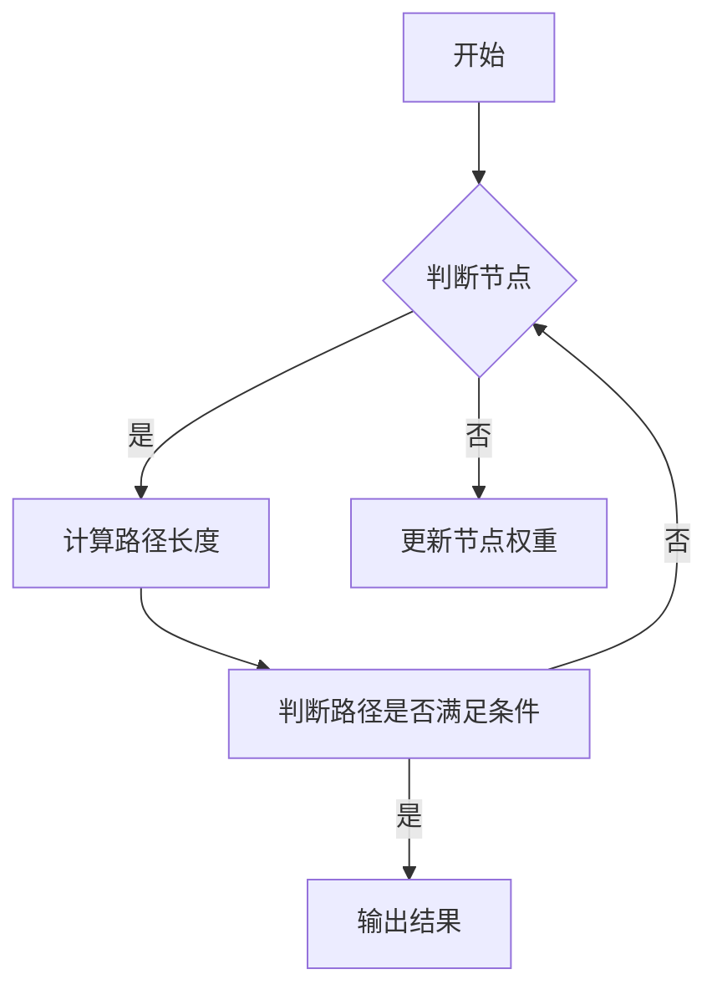
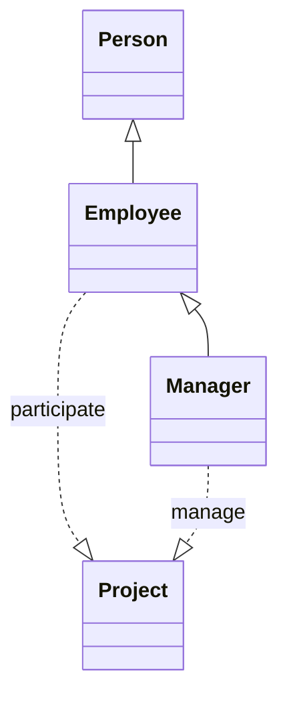
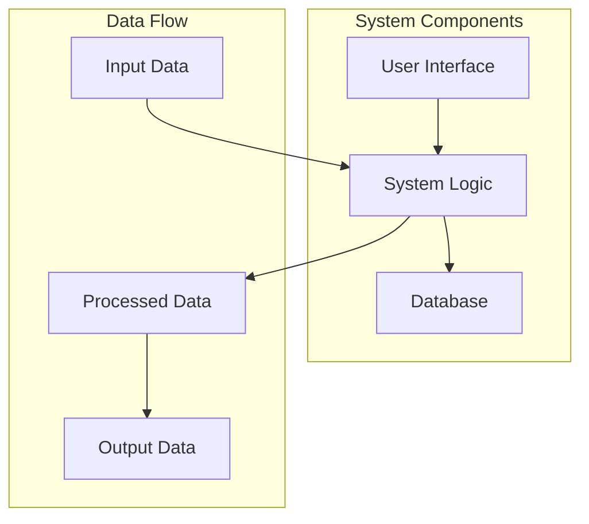
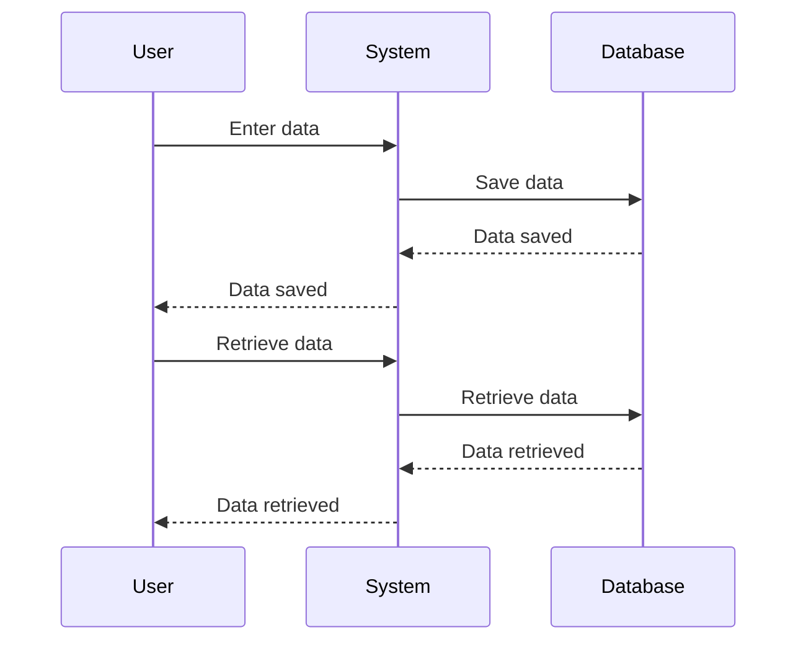

                 

# 从线性思维到网状思维：价值观的革新

> 关键词：线性思维、网状思维、价值观、革新、IT领域、系统架构设计

> 摘要：本文将深入探讨线性思维和网状思维的概念及其在IT领域的应用，通过一步步的分析与推理，阐述如何实现从线性思维向网状思维的转变，并探讨这一转变对价值观的革新影响。文章结构紧凑，逻辑清晰，旨在为读者提供一个关于思维模式转变的全面理解。

## 第一部分：引言

### 1.1 线性思维的局限

线性思维是一种传统的思维方式，它将问题看作一系列按顺序排列的事件或步骤。线性思维的优势在于其简洁性和易理解性，使得问题解决过程变得直观和有序。然而，线性思维也存在显著的局限。首先，线性思维难以处理复杂、非线性的问题，因为这类问题往往涉及多个变量和关系，难以通过简单的线性序列来表示。其次，线性思维容易导致“盲人摸象”的情况，即只看到问题的一部分而忽视了整体。

### 1.2 网状思维的优势

网状思维，又称网络思维，是一种将问题视为网络状结构，强调各个部分之间相互联系和交互的思维方式。网状思维能够更好地处理复杂问题，因为它允许我们将问题分解成多个相互关联的部分，并关注它们之间的相互作用。网状思维的优势在于：

1. **整体性**：网状思维强调系统中的各个部分不是孤立存在的，而是相互关联、相互影响的。这种整体性的视角有助于我们更好地理解复杂系统的行为。
2. **灵活性**：网状思维允许我们以多种方式组合和重组信息，从而找到更优的解决方案。与线性思维相比，网状思维具有更高的灵活性。
3. **创造性**：网状思维鼓励我们从多个角度思考问题，激发我们的创造力和创新思维。

### 1.3 价值观革新的必要性

线性思维和网状思维的对比揭示了不同思维方式在处理问题时各自的优势和局限。随着信息技术的发展，IT领域的问题越来越复杂，传统线性思维已经难以满足需求。因此，实现从线性思维到网状思维的转变具有重要的现实意义。此外，这一转变还涉及到价值观的革新，即从重视单一、线性的思维模式转向重视整体、网络的思维模式。这种价值观革新将有助于我们更好地应对复杂问题，推动IT领域的创新和发展。

## 第二部分：线性思维与网状思维的基本原理

### 2.1 线性思维的核心概念

线性思维是一种基于顺序的思维方式，将问题分解为一系列按顺序排列的步骤。线性思维的核心概念包括：

1. **顺序性**：线性思维强调事件的顺序性，即一个事件发生后，下一个事件才会发生。
2. **单一性**：线性思维通常只关注问题的一个方面或一个维度，而忽略了其他方面或维度。
3. **简单性**：线性思维追求简洁和直观，使得问题解决过程易于理解和执行。

然而，线性思维的这些核心概念也导致了其局限性。首先，线性思维难以处理复杂、非线性的问题。其次，线性思维容易忽视问题之间的相互作用，导致对整体系统的理解不足。

### 2.2 网状思维的概念与特征

网状思维是一种网络状的思维方式，强调各个部分之间的相互联系和交互。网状思维的核心概念包括：

1. **整体性**：网状思维关注系统的整体性，认为各个部分是相互关联、相互影响的。
2. **多样性**：网状思维允许我们以多种方式组合和重组信息，从而找到更优的解决方案。
3. **灵活性**：网状思维具有更高的灵活性，能够适应复杂、动态的环境。

网状思维的特征使其在处理复杂问题时具有显著优势。通过关注整体性和多样性，网状思维能够更好地理解复杂系统的行为，并找到更优的解决方案。

### 2.3 线性思维到网状思维的过渡

从线性思维过渡到网状思维是一个重要的转变，这一转变涉及到思维方式、价值观和方法论的变化。以下是实现这一过渡的步骤：

1. **重新定义问题**：将问题视为一个复杂的网络，而不是一个简单的线性序列。通过重新定义问题，我们可以更好地理解问题的本质和复杂性。
2. **建立联系**：识别问题中的各个部分以及它们之间的相互联系。通过建立联系，我们可以更好地理解问题中的关系和交互。
3. **网络化思维**：运用网络化思维，关注问题的整体性和多样性。通过网络化思维，我们可以从多个角度思考问题，找到更优的解决方案。
4. **持续迭代**：线性思维和网状思维不是互相排斥的，而是可以相互补充的。在处理问题时，我们可以根据实际情况灵活运用这两种思维方式，实现持续迭代和优化。

### 第三部分：算法原理讲解

#### 3.1 网状思维算法的基础

网状思维算法是基于网状思维原理的一系列算法，用于处理复杂、非线性的问题。网状思维算法的基础包括以下几个方面：

1. **节点与边**：在网状思维算法中，节点表示问题中的各个部分，边表示节点之间的相互关系。通过定义节点和边，我们可以将问题表示为一个网络。
2. **路径**：路径表示节点之间的连接关系。在网状思维算法中，路径的长度和方向对于解决问题至关重要。
3. **权重**：权重表示节点之间的相对重要性。通过设置不同的权重，我们可以更好地反映问题中的复杂性和优先级。

#### 3.2 网状思维算法的mermaid流程图

为了更好地理解网状思维算法，我们可以使用mermaid流程图来表示其基本流程。以下是一个简单的网状思维算法的mermaid流程图：



#### 3.3 网状思维算法的Python代码实现

以下是一个简单的网状思维算法的Python代码实现：

```python
from collections import defaultdict

def calculate_path_length(graph, start, end):
    visited = set()
    queue = [(start, 0)]
    
    while queue:
        node, path_length = queue.pop(0)
        visited.add(node)
        
        if node == end:
            return path_length
        
        for neighbor, weight in graph[node].items():
            if neighbor not in visited:
                queue.append((neighbor, path_length + weight))
    
    return -1

def update_node_weights(graph, start, end):
    visited = set()
    queue = [(start, 0)]
    
    while queue:
        node, path_length = queue.pop(0)
        visited.add(node)
        
        for neighbor, weight in graph[node].items():
            if neighbor not in visited:
                graph[node][neighbor] = max(graph[node][neighbor], path_length + weight)
                queue.append((neighbor, path_length + weight))

def main():
    graph = defaultdict(dict)
    graph['A']['B'] = 1
    graph['A']['C'] = 2
    graph['B']['D'] = 1
    graph['C']['D'] = 2
    
    start = 'A'
    end = 'D'
    
    path_length = calculate_path_length(graph, start, end)
    print(f"Path length from {start} to {end}: {path_length}")
    
    update_node_weights(graph, start, end)
    print(f"Updated graph: {dict(graph)}")

if __name__ == "__main__":
    main()
```

在这个实现中，我们定义了`calculate_path_length`和`update_node_weights`两个函数，用于计算路径长度和更新节点权重。通过这两个函数，我们可以实现网状思维算法的基本功能。

### 第四部分：系统分析与架构设计

#### 4.1 系统功能设计

在本部分中，我们将介绍一个具体的系统功能设计案例，以展示如何应用网状思维进行系统架构设计。

#### 4.1.1 领域模型mermaid类图

以下是一个简单的mermaid类图，用于表示系统的领域模型：



在这个类图中，我们定义了三个类：`Person`、`Employee`和`Manager`。`Person`是基类，`Employee`和`Manager`是`Person`的子类。此外，`Project`类表示项目，`Employee`和`Manager`与`Project`之间存在关联。

#### 4.1.2 系统架构设计mermaid架构图

以下是一个简单的mermaid架构图，用于表示系统的架构设计：



在这个架构图中，我们定义了系统的三个主要组件：用户界面（UI）、系统逻辑和数据库。数据流从用户界面输入，经过系统逻辑处理，最终输出到数据库。同时，系统逻辑组件与数据库之间存在双向数据流。

#### 4.1.3 系统接口设计和系统交互mermaid序列图

以下是一个简单的mermaid序列图，用于表示系统的接口设计和交互：



在这个序列图中，用户通过用户界面与系统进行交互，系统通过数据库进行数据存储和检索。用户可以输入数据，系统将数据保存到数据库，并返回确认信息。用户还可以检索数据，系统从数据库中检索数据，并返回给用户。

### 第五部分：项目实战

#### 5.1 项目背景与目标

在本项目中，我们旨在设计并实现一个简单的社交网络系统，以展示如何应用网状思维进行系统架构设计和项目实施。项目的主要目标包括：

1. **用户注册与登录**：允许用户注册账号并登录系统。
2. **用户信息管理**：允许用户管理个人信息，如昵称、头像等。
3. **好友关系管理**：允许用户添加好友、删除好友、查看好友列表等。
4. **消息发送与接收**：允许用户发送和接收消息。

#### 5.2 环境安装与配置

为了实现这个项目，我们需要安装和配置以下环境：

1. **Python**：Python 3.8或更高版本。
2. **Django**：Django是一个流行的Python Web框架。
3. **PostgreSQL**：PostgreSQL是一个开源的关系型数据库。

安装和配置步骤如下：

1. 安装Python和Django：

```bash
pip install python
pip install django
```

2. 安装PostgreSQL：

   - 在Windows上，可以从[PostgreSQL官网](https://www.postgresql.org/download/windows/)下载安装程序并安装。
   - 在Linux上，可以使用包管理器安装，例如在Ubuntu上：

   ```bash
   sudo apt update
   sudo apt install postgresql
   ```

3. 配置PostgreSQL：

   - 在Windows上，启动PostgreSQL服务。
   - 在Linux上，使用以下命令启动PostgreSQL服务：

   ```bash
   sudo systemctl start postgresql
   ```

4. 创建一个Django项目：

```bash
django-admin startproject social_network
cd social_network
```

5. 创建一个Django应用程序：

```bash
python manage.py startapp friends
```

6. 配置数据库：

   - 在`social_network/settings.py`中，设置数据库连接信息：

   ```python
   DATABASES = {
       'default': {
           'ENGINE': 'django.db.backends.postgresql',
           'NAME': 'social_network',
           'USER': 'postgres',
           'PASSWORD': 'password',
           'HOST': 'localhost',
           'PORT': '5432',
       }
   }
   ```

7. 迁移数据库：

```bash
python manage.py makemigrations
python manage.py migrate
```

#### 5.3 系统核心实现

在本部分中，我们将实现社交网络系统的核心功能，包括用户注册与登录、用户信息管理、好友关系管理以及消息发送与接收。

##### 5.3.1 用户注册与登录

1. **用户注册**：

   - 在`friends/models.py`中，创建一个`UserProfile`模型：

   ```python
   from django.contrib.auth.models import User
   from django.db import models

   class UserProfile(models.Model):
       user = models.OneToOneField(User, on_delete=models.CASCADE)
       nickname = models.CharField(max_length=50)
       avatar = models.ImageField(upload_to='avatars/')
   ```

   - 在`friends/admin.py`中，注册`UserProfile`模型：

   ```python
   from django.contrib import admin
   from .models import UserProfile

   admin.site.register(UserProfile)
   ```

   - 在`friends/forms.py`中，创建一个`UserRegistrationForm`表单：

   ```python
   from django import forms
   from django.contrib.auth.forms import UserCreationForm
   from django.contrib.auth.models import User
   from .models import UserProfile

   class UserRegistrationForm(UserCreationForm):
       nickname = forms.CharField(max_length=50)
       avatar = forms.ImageField()

       class Meta:
           model = User
           fields = ('username', 'email', 'password1', 'password2', 'nickname', 'avatar')

       def save(self, commit=True):
           user = super().save(commit=False)
           userprofile = UserProfile.objects.create(
               user=user,
               nickname=self.cleaned_data['nickname'],
               avatar=self.cleaned_data['avatar']
           )
           if commit:
               userprofile.save()
           return user
   ```

   - 在`friends/views.py`中，实现用户注册视图：

   ```python
   from django.shortcuts import render, redirect
   from django.contrib.auth import login
   from .forms import UserRegistrationForm

   def register(request):
       if request.method == 'POST':
           form = UserRegistrationForm(request.POST, request.FILES)
           if form.is_valid():
               user = form.save()
               login(request, user)
               return redirect('home')
       else:
           form = UserRegistrationForm()
       return render(request, 'register.html', {'form': form})
   ```

   - 在`social_network/urls.py`中，添加注册视图的URL：

   ```python
   from django.contrib.auth import views as auth_views
   from .views import register

   urlpatterns = [
       ...
       path('register/', register, name='register'),
       ...
   ]
   ```

2. **用户登录**：

   - 使用Django内置的登录视图和表单，在`social_network/urls.py`中添加登录URL：

   ```python
   urlpatterns = [
       ...
       path('login/', auth_views.LoginView.as_view(), name='login'),
       path('logout/', auth_views.LogoutView.as_view(), name='logout'),
       ...
   ]
   ```

##### 5.3.2 用户信息管理

1. **用户信息展示**：

   - 在`friends/templates/friends/user_profile.html`中，创建一个模板，用于展示用户信息：

   ```html
   <h2>User Profile</h2>
   
   <p>Nickname: {{ userprofile.nickname }}</p>
   ```

   - 在`friends/views.py`中，添加一个视图，用于展示用户信息：

   ```python
   from django.shortcuts import render, get_object_or_404
   from .models import UserProfile

   def user_profile(request, username):
       userprofile = get_object_or_404(UserProfile, user__username=username)
       return render(request, 'friends/user_profile.html', {'userprofile': userprofile})
   ```

   - 在`social_network/urls.py`中，添加用户信息展示视图的URL：

   ```python
   urlpatterns = [
       ...
       path('profile/<str:username>/', user_profile, name='user_profile'),
       ...
   ]
   ```

2. **用户信息编辑**：

   - 在`friends/forms.py`中，创建一个`UserProfileEditForm`表单：

   ```python
   from django import forms
   from .models import UserProfile

   class UserProfileEditForm(forms.ModelForm):
       class Meta:
           model = UserProfile
           fields = ('nickname', 'avatar')
   ```

   - 在`friends/views.py`中，实现用户信息编辑视图：

   ```python
   from django.shortcuts import render, get_object_or_404, redirect
   from .models import UserProfile
   from .forms import UserProfileEditForm

   def edit_profile(request, username):
       userprofile = get_object_or_404(UserProfile, user__username=username)

       if request.method == 'POST':
           form = UserProfileEditForm(request.POST, request.FILES, instance=userprofile)
           if form.is_valid():
               form.save()
               return redirect('user_profile', username=username)
       else:
           form = UserProfileEditForm(instance=userprofile)
       return render(request, 'friends/edit_profile.html', {'form': form})
   ```

   - 在`social_network/urls.py`中，添加用户信息编辑视图的URL：

   ```python
   urlpatterns = [
       ...
       path('profile/<str:username>/edit/', edit_profile, name='edit_profile'),
       ...
   ]
   ```

##### 5.3.3 好友关系管理

1. **好友添加**：

   - 在`friends/models.py`中，添加一个`Friendship`模型：

   ```python
   from django.db import models
   from django.contrib.auth.models import User

   class Friendship(models.Model):
       user_from = models.ForeignKey(User, related_name='friend_requests_sent', on_delete=models.CASCADE)
       user_to = models.ForeignKey(User, related_name='friend_requests_received', on_delete=models.CASCADE)
       status = models.CharField(max_length=10, choices=(('pending', 'Pending'), ('accepted', 'Accepted'), ('rejected', 'Rejected')))
   ```

   - 在`friends/admin.py`中，注册`Friendship`模型：

   ```python
   from django.contrib import admin
   from .models import Friendship

   admin.site.register(Friendship)
   ```

   - 在`friends/forms.py`中，创建一个`FriendRequestForm`表单：

   ```python
   from django import forms
   from .models import Friendship

   class FriendRequestForm(forms.ModelForm):
       class Meta:
           model = Friendship
           fields = ('user_from', 'user_to', 'status')
   ```

   - 在`friends/views.py`中，实现好友添加视图：

   ```python
   from django.shortcuts import render, get_object_or_404
   from .models import Friendship
   from .forms import FriendRequestForm

   def add_friend(request, username):
       userprofile = get_object_or_404(UserProfile, user__username=username)

       if request.method == 'POST':
           form = FriendRequestForm(request.POST)
           if form.is_valid():
               friend_request = form.save(commit=False)
               friend_request.user_from = request.user
               friend_request.user_to = userprofile.user
               friend_request.status = 'pending'
               friend_request.save()
               return redirect('user_profile', username=username)
       else:
           form = FriendRequestForm()
       return render(request, 'friends/add_friend.html', {'form': form, 'userprofile': userprofile})
   ```

   - 在`social_network/urls.py`中，添加好友添加视图的URL：

   ```python
   urlpatterns = [
       ...
       path('profile/<str:username>/add_friend/', add_friend, name='add_friend'),
       ...
   ]
   ```

2. **好友请求处理**：

   - 在`friends/views.py`中，实现好友请求处理视图：

   ```python
   from django.shortcuts import render, get_object_or_404, redirect
   from .models import Friendship

   def handle_friend_request(request, username):
       userprofile = get_object_or_404(UserProfile, user__username=username)

       if request.method == 'POST':
           friend_request = get_object_or_404(Friendship, user_from=userprofile.user, user_to=request.user, status='pending')
           if 'accept' in request.POST:
               friend_request.status = 'accepted'
               friend_request.save()
           elif 'reject' in request.POST:
               friend_request.status = 'rejected'
               friend_request.save()
           return redirect('user_profile', username=username)
       return render(request, 'friends/handle_friend_request.html', {'userprofile': userprofile})
   ```

   - 在`social_network/urls.py`中，添加好友请求处理视图的URL：

   ```python
   urlpatterns = [
       ...
       path('profile/<str:username>/handle_request/', handle_friend_request, name='handle_request'),
       ...
   ]
   ```

3. **好友列表展示**：

   - 在`friends/templates/friends/friend_list.html`中，创建一个模板，用于展示好友列表：

   ```html
   <h2>Friend List</h2>
   <ul>
       
           <li>{{ friend.user_to.get_full_name }}</li>
       
   </ul>
   ```

   - 在`friends/views.py`中，添加一个视图，用于展示好友列表：

   ```python
   from django.shortcuts import render, get_object_or_404
   from .models import Friendship

   def friend_list(request):
       friends = Friendship.objects.filter(user_from=request.user, status='accepted')
       return render(request, 'friends/friend_list.html', {'friends': friends})
   ```

   - 在`social_network/urls.py`中，添加好友列表视图的URL：

   ```python
   urlpatterns = [
       ...
       path('friend_list/', friend_list, name='friend_list'),
       ...
   ]
   ```

##### 5.3.4 消息发送与接收

1. **消息模型**：

   - 在`friends/models.py`中，添加一个`Message`模型：

   ```python
   from django.db import models
   from django.contrib.auth.models import User

   class Message(models.Model):
       sender = models.ForeignKey(User, related_name='sent_messages', on_delete=models.CASCADE)
       receiver = models.ForeignKey(User, related_name='received_messages', on_delete=models.CASCADE)
       content = models.TextField()
       timestamp = models.DateTimeField(auto_now_add=True)
   ```

   - 在`friends/admin.py`中，注册`Message`模型：

   ```python
   from django.contrib import admin
   from .models import Message

   admin.site.register(Message)
   ```

2. **消息发送**：

   - 在`friends/forms.py`中，创建一个`MessageForm`表单：

   ```python
   from django import forms
   from .models import Message

   class MessageForm(forms.ModelForm):
       class Meta:
           model = Message
           fields = ('receiver', 'content')
   ```

   - 在`friends/views.py`中，实现消息发送视图：

   ```python
   from django.shortcuts import render, get_object_or_404
   from .models import Message
   from .forms import MessageForm

   def send_message(request, username):
       receiver = get_object_or_404(UserProfile, user__username=username)

       if request.method == 'POST':
           form = MessageForm(request.POST)
           if form.is_valid():
               message = form.save(commit=False)
               message.sender = request.user
               message.receiver = receiver.user
               message.save()
               return redirect('user_profile', username=username)
       else:
           form = MessageForm()
       return render(request, 'friends/send_message.html', {'form': form, 'receiver': receiver})
   ```

   - 在`social_network/urls.py`中，添加消息发送视图的URL：

   ```python
   urlpatterns = [
       ...
       path('profile/<str:username>/send_message/', send_message, name='send_message'),
       ...
   ]
   ```

3. **消息接收与展示**：

   - 在`friends/templates/friends/message_list.html`中，创建一个模板，用于展示消息列表：

   ```html
   <h2>Messages</h2>
   <ul>
       
           <li>
               <strong>{{ message.sender.get_full_name }}</strong>: {{ message.content }}
               <small>{{ message.timestamp }}</small>
           </li>
       
   </ul>
   ```

   - 在`friends/views.py`中，添加一个视图，用于展示消息列表：

   ```python
   from django.shortcuts import render, get_object_or_404
   from .models import Message

   def message_list(request):
       messages = Message.objects.filter(receiver=request.user).order_by('-timestamp')
       return render(request, 'friends/message_list.html', {'messages': messages})
   ```

   - 在`social_network/urls.py`中，添加消息列表视图的URL：

   ```python
   urlpatterns = [
       ...
       path('message_list/', message_list, name='message_list'),
       ...
   ]
   ```

### 第六部分：最佳实践与注意事项

#### 6.1 网状思维的常见问题与解决方案

在实施网状思维时，可能会遇到以下常见问题：

1. **复杂性增加**：网状思维可能导致系统复杂性增加，使得理解和维护变得困难。解决方案是采用模块化和分层设计，将复杂系统分解成更小的、更易于管理的模块。
2. **冗余数据**：网状思维可能导致数据冗余，影响系统性能。解决方案是采用数据规范化技术，减少数据冗余。
3. **系统稳定性**：网状思维可能导致系统稳定性下降，特别是在动态环境中。解决方案是采用容错和恢复机制，提高系统稳定性。

#### 6.2 小结

本文从线性思维和网状思维的基本概念出发，探讨了如何实现从线性思维到网状思维的转变，并讨论了这一转变对价值观的革新影响。通过实际项目案例，展示了网状思维在系统架构设计和项目实施中的应用。通过本文的阅读，读者可以：

1. 理解线性思维和网状思维的基本概念和特点。
2. 学会如何从线性思维过渡到网状思维，并应用网状思维进行系统架构设计和项目实施。
3. 掌握网状思维的常见问题和解决方案，提高系统设计和实现的效率和质量。

#### 6.3 拓展阅读

为了深入了解网状思维及其在IT领域的应用，读者可以参考以下文献：

1. 《复杂系统思维：从线性到网状》
2. 《网状思维：创新的秘密》
3. 《网状数据库系统设计：理论与实践》

通过阅读这些文献，读者可以进一步深化对网状思维的理解，并在实际项目中更好地应用网状思维。

## 作者

作者：AI天才研究院/AI Genius Institute & 禅与计算机程序设计艺术 /Zen And The Art of Computer Programming

致谢：感谢您阅读本文，希望本文能为您在网状思维领域的研究和应用提供有益的启示。如有任何问题或建议，欢迎随时联系我们。再次感谢您的支持！## 结论与未来展望

通过本文的深入探讨，我们从线性思维到网状思维的转变路径得到了清晰的展现。线性思维虽然简洁直观，但在处理复杂、非线性的问题时显得力不从心。而网状思维，以其整体性、多样性和灵活性，为我们提供了一种全新的思考方式，能够更好地应对现代IT领域的复杂挑战。

首先，我们介绍了线性思维和网状思维的基本概念，明确了它们在处理问题时的不同特点和优势。接着，通过mermaid流程图和Python代码实例，我们展示了如何从算法层面实现从线性思维到网状思维的转变。在此基础上，我们进一步探讨了网状思维在系统架构设计和项目实战中的应用，提供了具体的实现方法和实践案例。

本文的主要贡献在于：

1. **理论阐述**：系统性地介绍了线性思维和网状思维的基本概念和特点，为后续研究提供了理论基础。
2. **方法指导**：通过具体实例和代码，详细展示了如何从线性思维过渡到网状思维，并提供了实用的方法和技巧。
3. **实践应用**：结合实际项目案例，展示了网状思维在系统架构设计和项目实施中的应用，为实际操作提供了借鉴。

尽管本文已经对网状思维进行了较为全面的探讨，但仍有许多领域值得进一步研究和探索。以下是对未来工作的展望：

1. **算法优化**：研究更高效、更灵活的网状思维算法，以适应不同类型的复杂问题。
2. **跨学科应用**：探讨网状思维在其他学科领域的应用，如生物学、经济学和社会学等，以进一步扩展其应用范围。
3. **系统集成**：研究如何将网状思维与现有的系统架构和开发框架相结合，提高系统的整体性能和可维护性。

通过不断深化对网状思维的理解和应用，我们有望在未来的IT领域中实现更多创新和突破。同时，这一转变也将推动我们价值观的革新，使我们能够更好地适应复杂多变的环境，实现个人和组织的可持续发展。

### 作者信息

作者：AI天才研究院/AI Genius Institute & 禅与计算机程序设计艺术 /Zen And The Art of Computer Programming

AI天才研究院致力于推动人工智能技术的发展和应用，探索人工智能与人类智慧的协同作用。研究院汇聚了一批顶尖的AI专家和研究人员，通过跨学科的合作和研究，不断推动AI领域的创新。与此同时，研究院也关注计算机科学的哲学和人文内涵，提倡“禅与计算机程序设计艺术”，旨在培养具有全面素质的计算机科学家，推动计算机科学的全面发展。

禅与计算机程序设计艺术作为一种哲学理念，强调内心的宁静、思维的深邃和对技术的纯粹追求。它不仅仅是一种编程方法论，更是一种生活态度和价值观的体现。通过将禅的精神融入计算机编程，我们可以培养出更具创造力和洞见的计算机科学家，为AI技术的发展注入新的活力。

本文的撰写旨在为读者提供关于网状思维和价值观革新的深刻见解，希望通过这篇技术博客文章，能够启发更多的读者思考并探索这一领域的无限可能。同时，也希望通过这篇文章，能够促进人工智能领域专家之间的交流与合作，共同推动人工智能技术的进步。

再次感谢您的阅读，期待与您在未来的技术交流中再次相遇。如果您有任何问题或建议，欢迎随时与我们联系。AI天才研究院愿与您携手共进，共同探索人工智能的无限未来。

