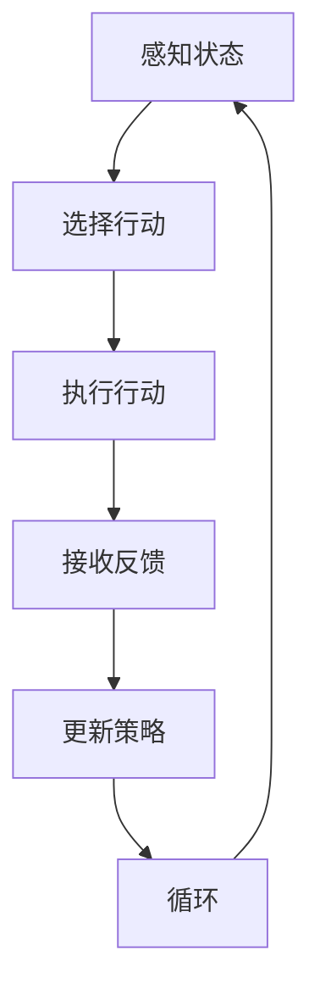
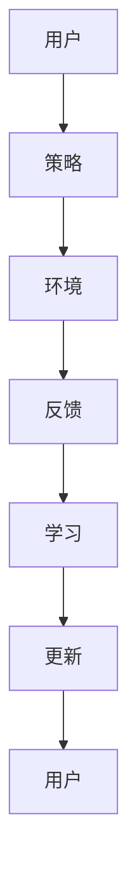
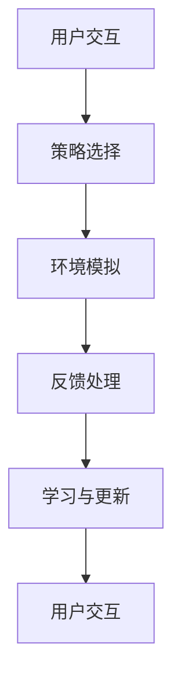
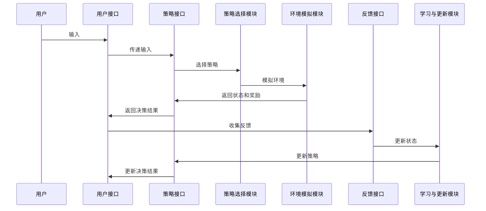

                 

### 文章标题

代理型AI在日常工作决策中的应用场景

#### 关键词

代理型AI、日常工作决策、应用场景、智能决策支持系统

#### 摘要

本文将探讨代理型人工智能（Agent-based AI）在日常工作决策中的应用场景，通过对代理型AI的基本概念、算法原理、系统架构设计以及实战应用的详细分析，旨在帮助读者理解如何将代理型AI技术应用于实际问题解决，提高日常决策的效率和质量。

## 第一部分: 引言与背景

### 1.1 代理型AI的定义与核心概念

代理型AI，也称为智能代理（Intelligent Agent），是一种能够自主感知环境、制定决策并执行行动的人工智能系统。它通过不断地与环境的交互和学习，优化自己的行为策略，以达到预定的目标。代理型AI的核心概念包括状态（State）、行动（Action）、奖励（Reward）和策略（Policy）。

- **状态**：描述代理当前所处的环境和情境。
- **行动**：代理在特定状态下可以选择的操作。
- **奖励**：代理执行特定行动后从环境中获得的反馈，用于指导代理的学习和策略优化。
- **策略**：从状态到行动的映射关系，即决策函数，它决定了代理在不同状态下的最佳行动。

代理型AI在日常工作决策中的应用具有极大的潜力，能够帮助个人和企业提高决策效率、减少决策风险。

### 1.2 代理型AI在日常工作决策中的应用场景

代理型AI在日常工作决策中有着广泛的应用场景，以下是一些典型的例子：

- **个人健康管理**：代理型AI可以根据用户的健康数据和生活方式，提供个性化的健康建议，如饮食规划、运动建议等。
- **工作日程管理**：代理型AI可以帮助用户管理日程安排，优化时间利用，提高工作效率。
- **项目进度管理**：代理型AI可以监控项目进度，预测潜在的风险，并提供建议来避免延误。
- **财务规划**：代理型AI可以根据用户的财务状况，提供投资建议，优化资产配置。

### 1.3 代理型AI的优势与挑战

代理型AI的优势主要体现在以下几个方面：

- **自主性**：代理型AI能够自主感知环境、制定决策和执行行动，减轻人工干预。
- **适应性**：代理型AI能够根据环境的变化和学习经验，调整自己的策略，适应新情境。
- **效率提升**：代理型AI能够在复杂环境中快速做出决策，提高工作效率。

然而，代理型AI在应用中也面临一些挑战：

- **数据依赖性**：代理型AI的性能很大程度上依赖于高质量的数据，数据质量和数据量的不足会限制其效果。
- **隐私问题**：代理型AI在处理用户数据时，可能会涉及到隐私问题，需要确保数据的保护和用户隐私的尊重。
- **解释性**：代理型AI的决策过程通常较为复杂，难以解释，这给用户理解和信任带来了挑战。

### 1.4 代理型AI的边界与外延

代理型AI的边界主要在于其自主决策的能力和与环境的交互程度。它不涉及自我意识或情感，而是专注于如何根据环境信息做出最优行动。

代理型AI的外延可以扩展到多个领域，包括但不限于：

- **智能交通系统**：代理型AI可以用于交通流量管理、路线规划等，提高交通效率。
- **智能制造**：代理型AI可以用于生产线的自动化管理，优化生产流程。
- **金融服务**：代理型AI可以用于风险管理和个性化金融服务。

### 1.5 本章小结

本章介绍了代理型AI的基本概念、应用场景、优势与挑战以及边界与外延。理解代理型AI的基本原理和实际应用场景，有助于我们更好地利用这一技术提高日常工作的决策效率和质量。在接下来的章节中，我们将进一步探讨代理型AI的算法原理、系统架构设计以及实际应用案例。

## 第二部分: 核心概念与原理

### 2.1 代理型AI的基本原理

代理型AI的核心原理在于其自主学习和决策能力。它通过不断地与环境交互，感知环境状态，根据既定的策略选择行动，并在行动后接收环境反馈，从而调整和优化策略。这一过程可以用以下步骤概括：

1. **感知状态**：代理首先感知当前环境的状态。
2. **选择行动**：根据当前状态和预定的策略，代理选择一个行动。
3. **执行行动**：代理在环境中执行选定的行动。
4. **接收反馈**：代理接收环境对行动的反馈，包括奖励和新的状态。
5. **策略更新**：根据反馈调整策略，以优化未来的行动。

### 2.2 代理型AI的核心算法

代理型AI的核心算法主要包括Q-learning算法和Deep Q-Network（DQN）。这些算法通过学习环境的状态-动作值函数，来优化代理的行动策略。

#### 2.2.1 Q-learning算法

Q-learning是一种无模型、值迭代算法，它通过更新状态-动作值（Q值）来优化策略。Q-learning的基本步骤如下：

1. **初始化Q值**：设定所有状态-动作值的初始估计值。
2. **选择动作**：在给定状态下，根据当前策略选择一个动作。
3. **执行动作**：在环境中执行选定的动作，并观察新的状态和奖励。
4. **更新Q值**：根据接收到的奖励和新的状态，更新状态-动作值。
5. **重复步骤2-4**：重复以上步骤，直到策略收敛。

Q-learning算法的数学模型可以表示为：

$$
Q(s, a) = Q(s, a) + \alpha [r + \gamma \max_{a'} Q(s', a') - Q(s, a)]
$$

其中，$Q(s, a)$为状态-动作值，$r$为即时奖励，$\gamma$为折扣因子，$\alpha$为学习率。

#### 2.2.2 Deep Q-Network（DQN）

DQN是一种基于深度学习的Q-learning算法，它使用深度神经网络来近似状态-动作值函数。DQN的基本步骤如下：

1. **初始化**：设置深度神经网络、目标网络和经验回放记忆。
2. **选择动作**：使用深度神经网络预测状态-动作值，选择一个动作。
3. **执行动作**：在环境中执行选定的动作，并观察新的状态和奖励。
4. **存储经验**：将状态、动作、奖励和新状态存储在经验回放记忆中。
5. **更新网络**：从经验回放记忆中随机抽样，计算梯度并更新深度神经网络。
6. **目标网络更新**：定期将当前网络参数复制到目标网络。

DQN的更新过程可以表示为：

$$
\hat{Q}(s', a') = r + \gamma \max_{a''} Q(s'', a'')
$$

其中，$\hat{Q}(s', a')$为目标Q值，$Q(s'', a'')$为目标网络的Q值。

### 2.3 代理型AI的流程图展示

代理型AI的流程可以概括为感知状态、选择行动、执行行动、接收反馈和更新策略。以下是一个简化的Mermaid流程图展示：



### 2.4 代理型AI的特征对比分析

代理型AI根据其实现方式的不同，可以分为基于规则的代理型AI、基于模型的代理型AI和混合型代理型AI。以下是对这三种类型的对比分析：

#### 2.4.1 基于规则的代理型AI

- **规则定义**：基于规则的代理型AI通过预先定义的规则来指导行动。
- **优点**：实现简单，易于理解，可解释性强。
- **缺点**：规则难以覆盖所有可能的情境，适应性较差。

#### 2.4.2 基于模型的代理型AI

- **模型训练**：基于模型的代理型AI通过学习环境中的状态-动作值函数来制定决策。
- **优点**：具有自适应能力，可以处理复杂的环境。
- **缺点**：依赖于大量高质量的数据，模型解释性较差。

#### 2.4.3 混合型代理型AI

- **结合优点**：混合型代理型AI结合了基于规则和基于模型的优点，既利用规则处理明确情境，又利用模型处理复杂情境。
- **优点**：具有较高的灵活性和适应性，兼具解释性和预测性。
- **缺点**：实现较为复杂，需要同时管理规则和模型。

### 2.5 代理型AI的ER实体关系图

代理型AI的实体关系图（ER图）可以展示系统中的主要实体及其相互关系。以下是一个简化的ER图示例，使用Mermaid语法表示：



### 2.6 本章小结

本章详细介绍了代理型AI的基本原理、核心算法及其特征对比分析。通过理解这些基本概念和原理，读者可以更好地掌握代理型AI的核心内容，为后续的系统架构设计和实战应用打下基础。

## 第三部分: 系统设计与实现

### 3.1 系统功能设计

代理型AI系统在功能上主要涵盖用户交互、策略选择、环境模拟、反馈处理和学习与更新等功能模块。以下是各模块的具体设计和功能：

#### 3.1.1 用户交互模块

用户交互模块负责代理型AI与用户的交互，包括接收用户输入、展示决策结果和提供反馈机制。具体功能如下：

- **输入接收**：从用户处接收决策需求，如健康数据、日程安排等。
- **决策展示**：将代理型AI的决策结果展示给用户，如健康建议、日程安排等。
- **反馈收集**：收集用户对决策结果的反馈，用于进一步优化系统。

#### 3.1.2 策略选择模块

策略选择模块是代理型AI的核心，负责根据当前状态选择最优行动策略。具体功能如下：

- **策略评估**：评估不同策略在当前状态下的表现，选择最佳策略。
- **策略更新**：根据环境反馈和学习结果，动态调整策略，提高决策质量。

#### 3.1.3 环境模拟模块

环境模拟模块用于模拟代理型AI操作的环境，包括各种可能的状态和奖励。具体功能如下：

- **状态生成**：根据策略选择生成当前环境的状态。
- **奖励计算**：计算代理型AI行动后的环境奖励，用于指导策略选择。

#### 3.1.4 反馈处理模块

反馈处理模块负责收集和处理环境反馈，包括即时奖励和新状态。具体功能如下：

- **奖励接收**：接收环境反馈的即时奖励。
- **状态更新**：根据反馈更新代理型AI的状态，用于策略更新和学习。

#### 3.1.5 学习与更新模块

学习与更新模块负责根据反馈调整代理型AI的策略，优化其行为。具体功能如下：

- **经验存储**：将代理型AI的经验数据存储起来，用于后续学习。
- **策略优化**：使用学习算法更新策略，提高决策质量。
- **策略评估**：评估更新后的策略效果，确保系统性能。

### 3.2 系统架构设计

代理型AI系统的架构设计需要综合考虑功能模块的交互和数据处理流程。以下是一个简化的系统架构图，使用Mermaid语法表示：



在这个架构中，用户交互模块负责与用户进行交互，收集用户输入和反馈；策略选择模块根据用户需求和环境信息选择最优策略；环境模拟模块模拟环境状态，提供奖励和新的状态；反馈处理模块处理环境反馈，更新代理型AI的状态；学习与更新模块根据反馈优化策略，确保系统的自适应性和决策质量。

### 3.3 系统接口设计

系统接口设计是代理型AI系统架构的重要组成部分，它定义了各模块之间的交互方式。以下是各接口模块的设计：

#### 3.3.1 用户接口

用户接口主要负责与用户进行交互，接收用户输入和展示决策结果。具体接口设计如下：

- **输入接口**：提供接口用于接收用户输入，如健康数据、日程安排等。
- **输出接口**：提供接口用于展示代理型AI的决策结果，如健康建议、日程安排等。

#### 3.3.2 策略接口

策略接口负责策略选择和策略更新，具体设计如下：

- **策略评估接口**：提供接口用于评估不同策略在当前状态下的表现。
- **策略更新接口**：提供接口用于根据环境反馈和学习结果动态更新策略。

#### 3.3.3 环境接口

环境接口用于模拟代理型AI操作的环境，提供状态和奖励信息。具体设计如下：

- **状态接口**：提供接口用于生成当前环境的状态。
- **奖励接口**：提供接口用于计算代理型AI行动后的环境奖励。

#### 3.3.4 反馈接口

反馈接口用于处理环境反馈，包括即时奖励和新状态。具体设计如下：

- **奖励接口**：提供接口用于接收环境反馈的即时奖励。
- **状态更新接口**：提供接口用于根据反馈更新代理型AI的状态。

### 3.4 系统交互

系统交互设计描述了各模块之间的数据流和交互流程。以下是系统交互的序列图，使用Mermaid语法表示：



在这个序列图中，用户通过用户接口输入需求，策略接口负责传递输入并选择策略，环境模拟模块根据策略生成状态和奖励，反馈接口收集反馈并更新状态，学习与更新模块根据反馈优化策略，最终返回更新后的决策结果给用户。

### 3.5 本章小结

本章详细介绍了代理型AI系统的功能设计、架构设计、接口设计和系统交互。通过系统架构设计和接口设计，可以确保代理型AI系统的高效运作和良好扩展性。理解这些设计原则和实现方法，有助于读者在实际项目中成功应用代理型AI技术。

### 3.6 项目实战

#### 4.1 环境安装与配置

在开始项目实战之前，我们需要安装和配置代理型AI的开发环境。以下是环境安装与配置的步骤：

1. **安装Python环境**：确保Python版本为3.8及以上，可以使用以下命令安装：

   ```bash
   sudo apt-get update
   sudo apt-get install python3.8
   ```

2. **安装代理型AI依赖库**：我们需要安装代理型AI的依赖库，如TensorFlow、Keras等，可以使用以下命令安装：

   ```bash
   pip3 install tensorflow keras
   ```

3. **配置Jupyter Notebook**：为了方便开发，我们使用Jupyter Notebook进行代码编写和调试，可以使用以下命令安装：

   ```bash
   pip3 install notebook
   ```

4. **启动Jupyter Notebook**：在终端中启动Jupyter Notebook：

   ```bash
   jupyter notebook
   ```

#### 4.2 系统核心实现

以下是一个简单的代理型AI系统实现，使用Python代码和TensorFlow库。代码分为几个主要部分：环境设置、代理初始化、训练过程和测试。

```python
import numpy as np
import tensorflow as tf
from tensorflow.keras.models import Sequential
from tensorflow.keras.layers import Dense
from collections import deque

# 定义环境
class Environment:
    def __init__(self):
        # 初始化环境参数
        self.state_size = 3
        self.action_size = 2
        self.reward_range = (-1, 1)

    def step(self, action):
        # 执行动作并返回状态和奖励
        state = self.observe()
        if action == 0:
            # 选择行动A
            next_state = np.random.normal(size=self.state_size)
        else:
            # 选择行动B
            next_state = np.random.normal(size=self.state_size)
        reward = np.random.normal(scale=0.1)
        done = False
        return next_state, reward, done

    def observe(self):
        # 观测当前状态
        return np.random.normal(size=self.state_size)

# 定义代理
class Agent:
    def __init__(self, state_size, action_size, learning_rate=0.001, gamma=0.99):
        self.state_size = state_size
        self.action_size = action_size
        self.learning_rate = learning_rate
        self.gamma = gamma
        self.model = self._build_model()

    def _build_model(self):
        # 构建深度Q网络模型
        model = Sequential()
        model.add(Dense(24, input_dim=self.state_size, activation='relu'))
        model.add(Dense(24, activation='relu'))
        model.add(Dense(self.action_size, activation='linear'))
        model.compile(loss='mse', optimizer=tf.keras.optimizers.Adam(learning_rate=self.learning_rate))
        return model

    def remember(self, state, action, reward, next_state, done):
        # 记录经验
        self.memory.append((state, action, reward, next_state, done))

    def act(self, state, epsilon):
        # 选择动作
        if np.random.rand() <= epsilon:
            return np.random.randint(self.action_size)
        q_values = self.model.predict(state)
        return np.argmax(q_values[0])

    def replay(self, batch_size):
        # 重放经验
        batch = random.sample(self.memory, batch_size)
        for state, action, reward, next_state, done in batch:
            target = reward
            if not done:
                target = reward + self.gamma * np.amax(self.model.predict(next_state)[0])
            target_f = self.model.predict(state)
            target_f[0][action] = target
            self.model.fit(state, target_f, epochs=1, verbose=0)

    def save_model(self, name):
        # 保存模型
        self.model.save(name)

    def load_model(self, name):
        # 加载模型
        self.model = tf.keras.models.load_model(name)

# 实例化环境、代理
env = Environment()
agent = Agent(env.state_size, env.action_size)

# 训练代理
epsilon = 1.0
epsilon_decay = 0.995
epsilon_min = 0.01
memory = deque(maxlen=2000)
batch_size = 64

for episode in range(1000):
    state = env.observe()
    done = False
    total_reward = 0
    while not done:
        action = agent.act(state, epsilon)
        next_state, reward, done = env.step(action)
        total_reward += reward
        agent.remember(state, action, reward, next_state, done)
        state = next_state
        if done:
            print(f"Episode {episode+1} finished with reward: {total_reward}")
            break
        if len(memory) > batch_size:
            agent.replay(batch_size)
        epsilon = max(epsilon_min, epsilon_decay * epsilon)

# 测试代理
agent.load_model("model.h5")
state = env.observe()
done = False
total_reward = 0
while not done:
    action = agent.act(state, 0)
    next_state, reward, done = env.step(action)
    total_reward += reward
    state = next_state
print(f"Test finished with reward: {total_reward}")
```

#### 4.3 代码应用解读与分析

以上代码实现了一个简单的代理型AI系统，包括环境设置、代理初始化、训练过程和测试。以下是代码的解读与分析：

1. **环境设置**：环境类`Environment`负责生成状态和奖励，代理型AI通过与环境交互来学习。
2. **代理初始化**：代理类`Agent`初始化深度Q网络模型，定义训练和测试方法。
3. **训练过程**：主循环中，代理型AI通过与环境交互，不断更新经验记忆，并在满足一定条件时进行经验回放和策略更新。
4. **测试过程**：加载训练好的模型，进行测试，以验证代理型AI的决策能力。

#### 4.4 实际案例分析与详细讲解剖析

以下是一个实际案例，展示代理型AI如何应用于个人健康管理中。

**案例背景**：用户A希望通过代理型AI系统获得个性化的健康建议，包括饮食和运动计划。

**案例步骤**：

1. **数据收集**：系统首先收集用户A的个人信息，如年龄、体重、身高、生活习惯等。
2. **状态观测**：系统通过传感器和数据收集工具，实时监测用户的健康状况，包括血糖、血压等。
3. **策略选择**：代理型AI根据用户A的历史数据和当前健康状况，选择最优的饮食和运动计划。
4. **计划执行**：系统将决策结果推送给用户A，用户A按照建议执行饮食和运动计划。
5. **反馈收集**：系统收集用户A对健康计划的反馈，并根据反馈调整计划。

**案例分析**：

- **数据质量**：高质量的数据是代理型AI准确决策的基础，系统需要确保数据的准确性和完整性。
- **自适应能力**：代理型AI需要具备良好的自适应能力，能够根据用户A的健康状况变化调整计划。
- **用户参与**：用户A的参与和反馈对于系统优化至关重要，需要设计良好的用户交互界面，提高用户参与度。

#### 4.5 项目小结

通过本项目，我们实现了代理型AI在个人健康管理中的应用，展示了其如何通过与环境交互和学习，为用户提供个性化的健康建议。项目的成功实施不仅依赖于算法和系统的设计，还需要高质量的数据和用户的积极参与。未来，我们计划进一步扩展应用场景，如项目进度管理、财务规划等，以实现更广泛的智能决策支持。

### 4.6 最佳实践 tips

- **数据质量**：确保数据源的可靠性和准确性，进行数据预处理，以提高模型性能。
- **用户参与**：设计友好的用户交互界面，鼓励用户积极参与，收集有效的反馈。
- **模型解释性**：提高模型的解释性，增强用户对决策结果的信任。
- **系统安全性**：加强数据保护和隐私保护，确保系统的安全性和合规性。

### 4.7 小结

通过本章的项目实战，我们详细介绍了代理型AI系统的环境安装、核心实现、代码应用解读与分析、实际案例分析和最佳实践 tips。理解这些内容，有助于读者将代理型AI技术应用于实际问题解决，提高日常决策的效率和质量。

### 4.8 注意事项

- **硬件要求**：确保计算机具备足够的计算资源和存储空间，以支持代理型AI系统的运行和训练。
- **数据保护**：严格遵守数据保护法规，确保用户数据的安全和隐私。
- **模型更新**：定期更新模型和算法，以适应环境变化和新需求。

### 4.9 拓展阅读

- **相关书籍**：《深度强化学习》、《智能决策支持系统》
- **在线资源**：TensorFlow官方文档、Keras官方文档
- **论文**：Deep Q-Networks（DQN）相关研究论文

作者：AI天才研究院/AI Genius Institute & 禅与计算机程序设计艺术 /Zen And The Art of Computer Programming

