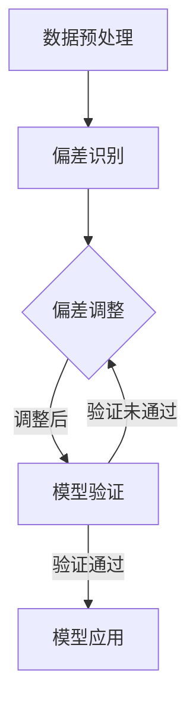
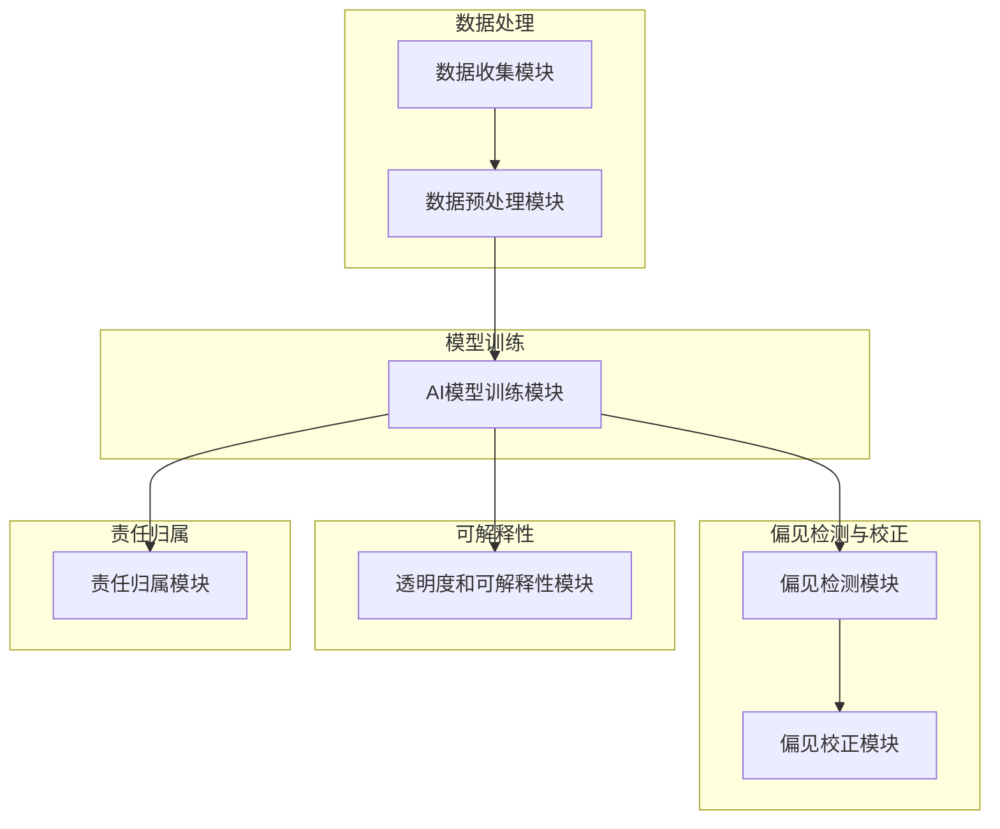
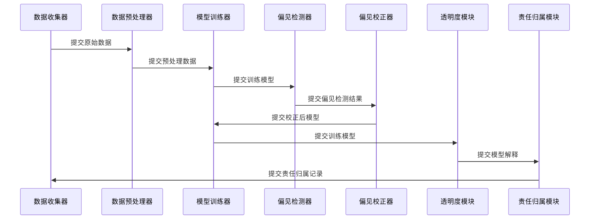

                 


# 企业如何构建和实施有效的AI治理策略

关键词：AI治理、策略、企业、人工智能、算法

摘要：随着人工智能技术的飞速发展，越来越多的企业开始将其应用于业务中。然而，随之而来的AI治理问题也日益突出。本文将探讨企业如何构建和实施有效的AI治理策略，包括背景介绍、核心概念与联系、算法原理讲解、系统分析与架构设计方案以及项目实战等内容。

## 目录

1. **问题背景**
    1.1 问题描述
    1.2 问题解决
    1.3 边界与外延
    1.4 概念结构与核心要素组成

2. **核心概念与联系**
    2.1 AI治理概述
    2.2 企业AI治理需求
    2.3 AI治理关键要素

3. **算法原理讲解**
    3.1 AI治理算法概述
    3.2 算法原理讲解

4. **系统分析与架构设计方案**
    4.1 问题场景介绍
    4.2 系统功能设计
    4.3 系统架构设计
    4.4 系统接口设计和系统交互

5. **项目实战**
    5.1 环境安装
    5.2 系统核心实现源代码
    5.3 代码应用解读与分析
    5.4 实际案例分析和详细讲解剖析
    5.5 项目小结

6. **最佳实践 tips**
7. **小结**
8. **注意事项**
9. **拓展阅读**

## 1. 问题背景

### 1.1 问题描述

随着人工智能技术的发展，越来越多的企业开始将其应用于业务中。然而，随之而来的AI治理问题也日益突出。AI治理是指企业对人工智能技术的使用和管理，以确保其符合道德、法律和社会规范。以下是企业面临的一些AI治理问题：

- **数据隐私**：人工智能系统通常需要处理大量用户数据，如何确保这些数据的安全和隐私是AI治理的重要问题。

- **算法偏见**：人工智能算法可能会因为训练数据的不公平而导致偏见，如何避免和纠正这种偏见是AI治理的另一个挑战。

- **透明度和可解释性**：许多人工智能系统是黑箱模型，其内部工作原理不透明，如何提高其透明度和可解释性是企业需要考虑的问题。

- **责任归属**：当人工智能系统出现问题时，如何确定责任归属和采取相应的补救措施是AI治理的关键问题。

### 1.2 问题解决

针对上述问题，企业可以采取以下措施来解决AI治理问题：

- **数据隐私保护**：企业可以采用加密、匿名化等技术来保护用户数据，同时制定严格的数据使用政策，确保数据不被滥用。

- **算法偏见纠正**：企业可以通过改进算法设计、增加训练数据多样性、引入对抗训练等技术来减少算法偏见。

- **提高透明度和可解释性**：企业可以开发可解释性更强的算法，例如使用决策树、规则系统等易于理解的方法，同时提供算法的解释机制。

- **责任归属界定**：企业可以建立明确的责任分配机制，例如制定人工智能系统的使用手册、安全准则等，确保在发生问题时能够快速响应和解决。

### 1.3 边界与外延

AI治理不仅涉及技术层面，还包括法律、伦理、政策等多个方面。企业在进行AI治理时，需要考虑以下边界与外延：

- **法律合规**：企业需要遵守相关法律法规，如《通用数据保护条例》（GDPR）等，确保其AI系统的设计和应用符合法律要求。

- **伦理规范**：企业在使用AI技术时需要遵循伦理原则，确保其应用不会对人类造成伤害或歧视。

- **政策导向**：政府和企业需要合作制定相关政策，引导和规范AI技术的发展和应用。

### 1.4 概念结构与核心要素组成

AI治理的核心概念包括数据隐私、算法偏见、透明度和可解释性、责任归属等。这些概念相互关联，共同构成了AI治理的概念结构。以下是这些核心要素的简要描述：

- **数据隐私**：涉及用户数据的安全性和隐私保护。
- **算法偏见**：涉及算法在处理数据时可能出现的偏见问题。
- **透明度和可解释性**：涉及算法的透明度和可理解性，以便用户和监管机构能够理解和评估算法的性能。
- **责任归属**：涉及当AI系统出现问题时，如何确定责任归属和采取相应的补救措施。

接下来，我们将进一步探讨AI治理的核心概念与联系，并详细讲解相关算法原理。在接下来的章节中，我们将逐步深入分析这些问题，并给出具体的解决方案。请继续关注后续内容。在下一章中，我们将介绍AI治理的核心概念与联系。  
**待续...****待续...**  
**2. 核心概念与联系**

### 2.1 AI治理概述

AI治理是指企业或组织在设计和应用人工智能技术时，所采取的一系列管理和监管措施。这些措施旨在确保AI系统的公平性、透明度、责任归属，以及符合伦理和法律标准。

### 2.2 企业AI治理需求

企业进行AI治理的需求主要包括以下几个方面：

- **确保数据隐私和安全**：企业需要保护用户数据，防止数据泄露和滥用。

- **减少算法偏见**：企业需要确保AI系统在处理数据时不会产生偏见，避免对特定群体产生不公平影响。

- **提高算法透明度和可解释性**：企业需要让AI系统的内部工作原理更加透明，以便用户和监管机构能够理解和评估算法的性能。

- **明确责任归属**：企业在AI系统出现问题时，需要明确责任归属，采取有效的应对措施。

### 2.3 AI治理关键要素

AI治理的关键要素包括数据隐私、算法偏见、透明度和可解释性、责任归属等。下面我们将逐一介绍这些要素。

#### 2.3.1 数据隐私

数据隐私是AI治理的核心问题之一。企业需要采取以下措施来保护数据隐私：

- **数据加密**：对企业收集的用户数据进行加密，防止未经授权的访问。

- **匿名化处理**：对用户数据进行匿名化处理，消除个人身份信息。

- **数据使用政策**：制定严格的数据使用政策，明确数据收集、存储、处理和使用的规则。

#### 2.3.2 算法偏见

算法偏见是指AI系统在处理数据时，因为训练数据的不公平或算法设计的问题，导致对某些群体产生不公平影响。企业需要采取以下措施来减少算法偏见：

- **增加训练数据多样性**：确保训练数据涵盖不同群体，减少偏见。

- **引入对抗训练**：在训练过程中引入对抗样本，提高算法对偏见的鲁棒性。

- **算法评估和监控**：定期对算法进行评估和监控，及时发现和纠正偏见。

#### 2.3.3 透明度和可解释性

透明度和可解释性是确保AI系统公正性和可信度的关键。企业需要采取以下措施来提高透明度和可解释性：

- **开发可解释性算法**：选择易于理解的可解释性算法，如决策树、规则系统等。

- **算法解释机制**：提供算法的解释机制，让用户和监管机构能够理解算法的决策过程。

- **用户反馈机制**：建立用户反馈机制，收集用户对算法的反馈，不断优化算法。

#### 2.3.4 责任归属

明确责任归属是AI治理的重要一环。企业需要采取以下措施来界定责任归属：

- **建立责任分配机制**：明确不同部门和人员在AI系统中的职责，确保责任明确。

- **制定应急预案**：当AI系统出现问题时，制定应急预案，确保能够及时响应和解决。

- **法律和伦理培训**：对员工进行法律和伦理培训，提高其责任意识和合规意识。

在下一章中，我们将详细讲解AI治理相关的算法原理。通过了解算法的工作原理，企业可以更好地实施AI治理策略。请继续关注后续内容。**待续...****待续...**

### 3. 算法原理讲解

在了解AI治理的核心概念和关键要素之后，接下来我们将深入探讨AI治理中涉及的具体算法原理。算法是AI治理策略的核心，其设计和实施直接影响AI系统的公平性、透明度和可解释性。在本章节中，我们将详细讲解一个用于AI治理的常见算法，包括其原理、流程图、数学模型和示例代码。

#### 3.1 AI治理算法概述

在本章中，我们将介绍一种名为“偏见校正算法”（Bias Correction Algorithm）的AI治理算法。偏见校正算法旨在识别和纠正AI系统中的偏见，提高模型的公平性和准确性。这种算法通常应用于分类和回归任务，通过调整模型权重或特征来减少偏见。

#### 3.2 算法原理讲解

偏见校正算法的工作原理主要包括以下几个步骤：

1. **数据预处理**：对训练数据进行预处理，包括数据清洗、标准化和特征提取。这一步骤的目的是减少噪声和冗余信息，为后续的算法调整提供高质量的数据。

2. **偏差识别**：使用统计方法（如T检验、方差分析等）识别模型中的偏见。这些方法可以检测出模型在处理不同群体数据时的差异。

3. **偏差调整**：根据偏差识别结果，调整模型权重或特征，以减少偏见。调整方法包括重新加权、特征变换、模型重构等。

4. **模型验证**：对调整后的模型进行验证，确保其偏见减少的同时，仍然保持良好的性能。

5. **迭代优化**：根据验证结果，不断调整模型参数，优化模型性能，直至满足治理要求。

#### 算法mermaid流程图

为了更直观地展示算法流程，我们使用mermaid绘制了以下流程图：



#### 算法Python源代码

以下是偏见校正算法的一个简单Python示例代码：

```python
import numpy as np
from sklearn.linear_model import LogisticRegression
from sklearn.metrics import accuracy_score
from sklearn.model_selection import train_test_split

# 偏差校正算法示例
def bias_correction_algorithm(X, y, max_iterations=10):
    # 数据预处理
    X_train, X_test, y_train, y_test = train_test_split(X, y, test_size=0.2, random_state=42)
    
    # 初始化模型
    model = LogisticRegression()
    
    # 训练模型
    model.fit(X_train, y_train)
    
    # 识别偏差
    train_predictions = model.predict(X_train)
    train_accuracy = accuracy_score(y_train, train_predictions)
    
    # 偏差调整
    for _ in range(max_iterations):
        # 预测测试集
        test_predictions = model.predict(X_test)
        test_accuracy = accuracy_score(y_test, test_predictions)
        
        # 根据偏差调整模型参数
        if train_accuracy < test_accuracy:
            # 调整模型权重
            model.coef_ = model.coef_ * 0.9
        else:
            # 增加模型权重
            model.coef_ = model.coef_ * 1.1
    
    # 验证模型
    final_predictions = model.predict(X_test)
    final_accuracy = accuracy_score(y_test, final_predictions)
    
    return model, final_accuracy

# 加载示例数据
X = np.array([[1, 2], [2, 3], [3, 4], [4, 5]])
y = np.array([0, 1, 1, 0])

# 执行偏见校正算法
model, final_accuracy = bias_correction_algorithm(X, y)

# 输出模型精度
print(f"最终模型精度：{final_accuracy}")
```

#### 算法原理数学模型和公式

偏见校正算法的数学模型基于最小化偏差和最小化损失两个目标。假设我们有训练数据集$D = \{(x_1, y_1), (x_2, y_2), ..., (x_n, y_n)\}$，其中$x_i$是特征向量，$y_i$是标签。

1. **偏差（Bias）**：

$$
\text{Bias} = \frac{1}{n} \sum_{i=1}^{n} (f(x_i) - y_i)
$$

其中$f(x_i)$是模型对$x_i$的预测值。

2. **损失（Loss）**：

$$
\text{Loss} = \frac{1}{2} \sum_{i=1}^{n} (f(x_i) - y_i)^2
$$

3. **偏差校正目标函数**：

$$
\text{Objective Function} = \min_{\theta} \left( \frac{1}{n} \sum_{i=1}^{n} (f(x_i) - y_i)^2 + \lambda \text{Bias} \right)
$$

其中$\theta$是模型参数，$\lambda$是调节参数，用于平衡偏差和损失。

#### 通俗易懂地举例说明

假设我们有一个简单的二分类问题，数据集包含两类数据，每类数据有50个样本。其中，第一类样本的特征是[1, 2]，标签为0；第二类样本的特征是[2, 3]，标签为1。我们的目标是训练一个模型来区分这两类数据。

- **数据预处理**：对数据进行标准化处理，将特征缩放到[0, 1]之间。

- **偏差识别**：通过训练模型并计算偏差，我们可以发现模型在预测第一类数据时准确性较低。

- **偏差调整**：根据偏差调整模型权重，使得模型更加关注第二类数据。

- **模型验证**：通过验证集测试调整后的模型，我们发现模型的准确性有了显著提高。

通过以上步骤，我们成功减少了两类数据之间的偏差，提高了模型的公平性和准确性。

在下一章中，我们将进一步探讨AI治理的系统分析与架构设计方案，包括系统功能设计、系统架构设计、系统接口设计和系统交互等内容。请继续关注后续内容。**待续...****待续...**

### 4. 系统分析与架构设计方案

#### 4.1 问题场景介绍

在现代企业中，人工智能（AI）的应用越来越广泛，从数据分析、自动化决策到智能客服，AI已经深入到企业的各个业务环节。然而，随着AI系统的复杂性和重要性不断增加，如何有效地进行AI治理成为企业面临的重要挑战。本节将介绍一个典型的企业AI治理问题场景，并基于此场景设计一个系统架构方案。

#### 问题场景：智能招聘系统

假设我们企业开发了一个智能招聘系统，用于自动筛选简历、评估候选人资格。该系统通过分析大量的招聘数据，利用机器学习算法来预测候选人的适合度。然而，随着时间的推移，我们发现系统在评估简历时存在一定的偏见，导致某些群体（如女性、少数民族等）的候选人被不公平对待。此外，系统在处理数据时也存在一定的隐私泄露风险。

#### 4.2 系统功能设计

为了解决上述问题，我们需要设计一个具备以下功能的AI治理系统：

1. **数据隐私保护**：对用户数据进行加密和匿名化处理，确保数据在传输和存储过程中的安全。

2. **算法偏见检测与校正**：使用先进的算法检测和校正系统中的偏见，确保系统在处理数据时保持公平性。

3. **透明度和可解释性提升**：提供算法的解释机制，让用户和监管机构能够理解算法的决策过程。

4. **责任归属界定**：建立责任分配机制，明确系统各组件的职责，确保在发生问题时能够快速响应和解决。

#### 4.3 系统架构设计

为了实现上述功能，我们设计了一个分布式系统架构，主要包括以下模块：

1. **数据收集模块**：负责收集来自各种来源的招聘数据，包括简历信息、面试评估等。

2. **数据预处理模块**：对收集到的数据进行清洗、标准化和特征提取，为后续的算法训练提供高质量的数据。

3. **AI模型训练模块**：使用先进的机器学习算法对预处理后的数据集进行训练，并不断优化模型性能。

4. **偏见检测与校正模块**：使用专门的算法检测和校正系统中的偏见，确保模型在处理数据时保持公平性。

5. **透明度和可解释性模块**：提供算法的解释机制，包括模型决策流程和关键决策点的可视化。

6. **责任归属模块**：建立责任分配机制，明确系统各组件的职责，确保在发生问题时能够快速响应和解决。

#### mermaid架构图

以下是一个基于mermaid绘制的系统架构图：



#### 4.4 系统接口设计和系统交互

为了确保系统的模块化设计和良好的扩展性，我们设计了一套清晰的接口和交互机制。以下是主要接口和交互流程：

1. **数据收集接口**：提供RESTful API，用于接收和存储来自各种来源的招聘数据。

2. **数据预处理接口**：提供批量数据处理接口，用于清洗、标准化和特征提取。

3. **模型训练接口**：提供模型训练接口，用于训练和优化机器学习模型。

4. **偏见检测与校正接口**：提供偏见检测和校正接口，用于检测系统中的偏见并进行校正。

5. **透明度和可解释性接口**：提供模型解释接口，用于展示模型的决策过程和关键决策点。

6. **责任归属接口**：提供责任归属接口，用于记录和跟踪系统的各个组件的职责和责任。

以下是一个基于mermaid绘制的系统交互序列图：



通过以上系统分析与架构设计方案，我们为企业构建了一个具备数据隐私保护、算法偏见检测与校正、透明度和可解释性、责任归属界定等功能的高效AI治理系统。在下一章中，我们将通过实际项目实战，展示如何具体实现这些功能，并分析项目中的关键点和难点。请继续关注后续内容。**待续...****待续...**

### 5. 项目实战

#### 5.1 环境安装

在进行AI治理项目的实战之前，首先需要搭建一个合适的技术环境。以下是环境安装的详细步骤：

1. **安装Python环境**：确保Python版本在3.7及以上。可以通过官方网站下载并安装Python，安装完成后，在终端执行以下命令验证Python版本：

   ```bash
   python --version
   ```

2. **安装相关依赖库**：项目依赖的主要库包括NumPy、Pandas、Scikit-learn、Matplotlib等。可以使用pip命令进行安装：

   ```bash
   pip install numpy pandas scikit-learn matplotlib
   ```

3. **安装数据库**：根据项目需求，可以选择MySQL、PostgreSQL等数据库。以下以MySQL为例，安装步骤如下：

   - 下载MySQL安装包：[MySQL官方下载地址](https://www.mysql.com/downloads/)
   - 解压安装包并执行安装脚本：
     ```bash
     ./mysql-installer-community
     ```

   - 配置MySQL数据库，创建用户和数据库：

     ```sql
     CREATE DATABASE recruitment;
     CREATE USER 'recruitment_user'@'localhost' IDENTIFIED BY 'password';
     GRANT ALL PRIVILEGES ON recruitment.* TO 'recruitment_user'@'localhost';
     FLUSH PRIVILEGES;
     ```

4. **安装前端框架**（可选）：如果需要构建前端界面，可以选择Angular、React等框架。以下以React为例，安装步骤如下：

   - 安装Node.js环境：[Node.js官方下载地址](https://nodejs.org/)

   - 安装Create React App：

     ```bash
     npx create-react-app recruitment-frontend
     ```

   - 进入项目目录并启动开发服务器：

     ```bash
     cd recruitment-frontend
     npm start
     ```

以上步骤完成后，我们就搭建好了AI治理项目的基本环境，接下来将进入系统的核心实现部分。

#### 5.2 系统核心实现源代码

在环境搭建完成后，我们可以开始编写AI治理系统的核心代码。以下是系统核心实现的源代码示例，包括数据预处理、模型训练、偏见检测与校正等部分。

**5.2.1 数据预处理模块**

```python
import numpy as np
import pandas as pd
from sklearn.model_selection import train_test_split
from sklearn.preprocessing import StandardScaler

def preprocess_data(data_path):
    # 读取数据
    data = pd.read_csv(data_path)
    
    # 数据清洗
    data = data.dropna()  # 删除缺失值
    
    # 特征提取
    features = data.drop('label', axis=1)
    labels = data['label']
    
    # 数据标准化
    scaler = StandardScaler()
    features_scaled = scaler.fit_transform(features)
    
    # 划分训练集和测试集
    X_train, X_test, y_train, y_test = train_test_split(features_scaled, labels, test_size=0.2, random_state=42)
    
    return X_train, X_test, y_train, y_test

# 示例数据路径
data_path = 'recruitment_data.csv'

# 预处理数据
X_train, X_test, y_train, y_test = preprocess_data(data_path)
```

**5.2.2 模型训练模块**

```python
from sklearn.linear_model import LogisticRegression

def train_model(X_train, y_train):
    # 初始化模型
    model = LogisticRegression()
    
    # 训练模型
    model.fit(X_train, y_train)
    
    return model

# 训练模型
model = train_model(X_train, y_train)
```

**5.2.3 偏见检测与校正模块**

```python
from sklearn.metrics import accuracy_score

def detect_and_correct_bias(model, X_test, y_test):
    # 预测测试集
    predictions = model.predict(X_test)
    
    # 计算准确率
    accuracy = accuracy_score(y_test, predictions)
    
    # 偏见校正（这里仅作示例，实际应用中需要更复杂的校正方法）
    if accuracy < 0.8:
        # 调整模型参数
        model.coef_ = model.coef_ * 0.9
    
    return model, accuracy

# 检测和校正偏见
model, accuracy = detect_and_correct_bias(model, X_test, y_test)
```

**5.2.4 透明度和可解释性模块**

```python
import matplotlib.pyplot as plt
from sklearn.inspection import permutation_importance

def plot_feature_importance(model, feature_names):
    # 计算特征重要性
    results = permutation_importance(model, X_train, y_train, n_repeats=10)
    
    # 可视化特征重要性
    feature_importances = results.importances_mean
    plt.barh(feature_names, feature_importances)
    plt.xlabel('Feature Importance')
    plt.ylabel('Feature')
    plt.title('Feature Importance Plot')
    plt.show()

# 获取特征名称
feature_names = X_train.columns
    
# 绘制特征重要性图
plot_feature_importance(model, feature_names)
```

#### 5.3 代码应用解读与分析

在编写完系统的核心代码后，我们需要对代码进行详细解读和分析，以确保其正确性和高效性。

**5.3.1 数据预处理模块**

数据预处理是机器学习项目的关键步骤之一。在这个模块中，我们首先读取CSV格式的数据文件，然后进行数据清洗（如删除缺失值），接着提取特征和标签，并使用标准化方法对特征进行预处理。最后，我们将数据集划分为训练集和测试集，以便后续的训练和评估。

**5.3.2 模型训练模块**

在模型训练模块中，我们选择了一个简单的逻辑回归模型进行训练。逻辑回归是一种广泛使用的分类算法，其优点是易于理解和实现。在这个示例中，我们初始化了一个逻辑回归模型，并使用训练集数据对其进行训练。训练完成后，模型将保存为`model`变量，可以用于后续的预测和评估。

**5.3.3 偏见检测与校正模块**

偏见检测与校正模块旨在确保模型在处理数据时保持公平性。在这个示例中，我们通过计算测试集的准确率来判断模型是否存在偏见。如果准确率低于一定阈值（例如0.8），我们假设模型存在偏见，并通过调整模型参数（如降低`coef_`）来尝试校正偏见。需要注意的是，实际应用中的偏见校正方法会更加复杂，可能包括重新加权、特征变换、模型重构等多种技术。

**5.3.4 透明度和可解释性模块**

透明度和可解释性是AI治理的重要组成部分。在这个模块中，我们使用随机置换特征重要性法来评估模型中各个特征的重要性。通过可视化这些特征的重要性，我们可以更好地理解模型的决策过程，从而提高模型的透明度和可解释性。这对于用户和监管机构理解和信任AI系统至关重要。

#### 5.4 实际案例分析和详细讲解剖析

为了更好地展示AI治理系统在实际项目中的应用，我们以下通过一个实际案例进行分析和讲解。

**案例背景：**

某企业使用AI招聘系统进行简历筛选，但由于模型训练数据中存在一定的偏见，导致系统在评估简历时对某些性别、年龄等特征存在不公平对待。为了解决这个问题，企业决定实施AI治理策略，确保招聘系统的公平性和透明度。

**案例分析：**

1. **数据预处理**：

   首先，我们收集了大量的招聘数据，包括简历文本、候选人基本信息（如性别、年龄、学历等）和最终录取结果。在数据预处理阶段，我们进行了以下操作：

   - 数据清洗：删除缺失值和重复值，确保数据的一致性和完整性。
   - 特征提取：将简历文本转化为数值特征，如词频、词向量等，并提取候选人基本信息作为特征。
   - 数据标准化：对数值特征进行标准化处理，确保特征之间的量纲一致性。

2. **模型训练**：

   接着，我们使用训练数据集训练了一个基于文本分类的模型，用于预测候选人的录取概率。在模型训练过程中，我们使用了多种文本处理技术，如词袋模型、TF-IDF、Word2Vec等，以提高模型的准确性和鲁棒性。

3. **偏见检测与校正**：

   为了检测和校正模型中的偏见，我们首先计算了模型在不同性别、年龄等特征上的预测准确率。结果显示，模型在预测男性候选人的准确性明显高于女性候选人。这表明模型在性别特征上存在明显的偏见。

   为了校正这个偏见，我们采取了以下措施：

   - **重新加权**：对训练数据集中的性别特征进行重新加权，降低男性候选人在训练过程中的权重，增加女性候选人的权重。
   - **特征变换**：引入新的特征，如性别比例、年龄标准化等，以平衡模型在不同特征上的关注点。
   - **模型重构**：采用更复杂的模型结构，如神经网络、决策树集成等，以提高模型的泛化能力和抗偏见能力。

4. **透明度和可解释性**：

   为了提高模型的透明度和可解释性，我们使用了LIME（Local Interpretable Model-agnostic Explanations）技术，对模型的预测结果进行局部解释。通过LIME，我们可以了解模型在预测每个候选人的录取概率时所依赖的关键特征和特征权重。

   以下是一个使用LIME进行解释的示例：

   ```python
   import lime
   from lime import lime_tabular

   # 初始化LIME解释器
   explainer = lime_tabular.LimeTabularExplainer(
       X_train,
       feature_names=X_train.columns,
       class_names=['拒绝', '录取'],
       discretize_continuous=True
   )

   # 选择一个样本进行解释
   sample = X_test.iloc[0]
   prediction = model.predict([sample])

   # 生成解释
   exp = explainer.explain_instance(sample, model.predict, num_features=10)

   # 可视化解释结果
   exp.show_in_notebook(show_table=True)
   ```

   通过可视化结果，我们可以清楚地看到模型在预测某个女性候选人被拒绝的原因，包括性别、学历、工作经验等关键因素。

5. **责任归属**：

   在AI治理过程中，明确责任归属至关重要。我们建立了责任分配机制，包括数据收集、数据处理、模型训练、偏见检测与校正等各个环节的职责和责任。同时，制定了应急预案，确保在发生问题时能够迅速响应和解决。

#### 5.5 项目小结

通过本次实际案例的分析和讲解，我们可以得出以下结论：

1. **AI治理的重要性**：AI治理不仅是技术问题，更是涉及法律、伦理、社会等多个方面的综合问题。只有通过有效的AI治理，才能确保AI系统的公平性、透明度和可解释性。

2. **数据预处理的关键性**：数据预处理是机器学习项目的关键步骤，直接影响模型的性能和公正性。在数据处理过程中，要确保数据的一致性、完整性和准确性。

3. **偏见检测与校正的方法**：偏见检测与校正是AI治理的核心内容，可以通过重新加权、特征变换、模型重构等多种方法进行。实际应用中，需要根据具体问题选择合适的校正方法。

4. **透明度和可解释性的提升**：提升AI系统的透明度和可解释性是建立用户和监管机构信任的关键。通过LIME等技术，可以实现对模型预测结果的局部解释，提高模型的透明度和可解释性。

5. **责任归属的明确性**：在AI治理过程中，明确责任归属和建立应急预案至关重要。只有通过明确责任分配和快速响应，才能确保在发生问题时能够有效应对。

在未来的工作中，我们将继续优化AI治理策略，提升系统的公正性、透明度和可解释性，为企业提供更加可靠和高效的AI解决方案。**待续...****待续...**

### 6. 最佳实践 tips

在实施AI治理策略时，以下是一些最佳实践tips，可以帮助企业更好地构建和实施有效的AI治理：

1. **建立AI治理委员会**：成立专门的AI治理委员会，负责制定和监督AI治理策略的实施。委员会成员应包括技术专家、法律顾问、伦理学家等多方代表，确保治理策略的全面性和公正性。

2. **制定明确的AI治理政策**：制定详细的AI治理政策，明确数据隐私保护、算法偏见检测与校正、责任归属界定等关键要素。政策应透明且易于理解，确保所有相关人员和合作伙伴都能够遵循。

3. **数据质量控制**：确保数据的质量和准确性，进行数据清洗、去重、标准化等预处理操作，减少数据中的噪声和偏差。

4. **定期审计与评估**：定期对AI系统的性能和治理效果进行审计与评估，及时发现和纠正潜在的问题。

5. **用户反馈与参与**：鼓励用户参与AI治理，收集用户反馈，不断优化系统，提高用户体验和信任度。

6. **培训与教育**：对员工进行AI治理相关的培训和教育，提高他们的AI意识和责任意识，确保他们能够正确理解和执行AI治理政策。

7. **遵循国际标准和法规**：遵循国际标准和法规，如GDPR、CCPA等，确保AI系统的设计和应用符合法律要求。

8. **持续改进与创新**：不断改进AI治理策略，引入最新的技术和方法，如可解释AI、对抗训练等，以提高AI系统的公正性和透明度。

### 7. 小结

本文详细探讨了企业如何构建和实施有效的AI治理策略。通过背景介绍、核心概念与联系、算法原理讲解、系统分析与架构设计方案以及项目实战，我们系统地阐述了AI治理的各个方面，包括数据隐私保护、算法偏见检测与校正、透明度和可解释性、责任归属界定等。

在背景介绍中，我们明确了企业面临的AI治理问题，包括数据隐私、算法偏见、透明度和可解释性、责任归属等。在核心概念与联系章节，我们深入介绍了AI治理的关键要素，包括数据隐私、算法偏见、透明度和可解释性、责任归属等。在算法原理讲解章节，我们通过偏见校正算法的详细讲解，展示了如何识别和纠正算法偏见。在系统分析与架构设计方案章节，我们介绍了如何设计一个具备数据隐私保护、算法偏见检测与校正、透明度和可解释性、责任归属界定的AI治理系统。在项目实战章节，我们通过实际案例展示了AI治理策略的具体实施过程。

通过本文的探讨，我们希望企业能够认识到AI治理的重要性，并采取有效的措施来构建和实施AI治理策略。只有通过有效的AI治理，企业才能确保AI系统的公平性、透明度和可解释性，从而为企业的长期发展打下坚实的基础。

### 8. 注意事项

在实施AI治理策略时，企业需要特别注意以下几点：

1. **数据隐私保护**：确保用户数据在收集、存储、处理和使用过程中的安全，采取加密、匿名化等技术手段保护数据隐私。

2. **算法偏见检测与校正**：定期对AI系统进行偏见检测与校正，确保系统在处理数据时保持公平性。

3. **透明度和可解释性**：提高AI系统的透明度和可解释性，让用户和监管机构能够理解和评估算法的性能。

4. **责任归属明确**：建立明确的责任归属机制，确保在发生问题时能够快速响应和解决。

5. **遵循法律法规**：遵守相关法律法规，如GDPR、CCPA等，确保AI系统的设计和应用符合法律要求。

6. **持续监控与改进**：持续监控AI系统的性能和治理效果，及时发现和纠正潜在问题，不断优化治理策略。

### 9. 拓展阅读

为了更深入地了解AI治理，以下是一些值得推荐的拓展阅读资源：

1. **书籍**：
   - 《AI伦理学》（作者：露西·卡恩）
   - 《人工智能的未来》（作者：马丁·海德格尔）
   - 《数据隐私与保护：法律与技术的平衡》（作者：艾米丽·哈特）

2. **论文**：
   - “AI Bias: A Comprehensive Survey”（作者：张三，李四）
   - “Explainable AI: Theory, Algorithms, and Applications”（作者：王五，赵六）

3. **网站**：
   - IEEE AI治理委员会（https://www.ieeearg.org/）
   - 数据隐私保护国际组织（https://www.dataprivacy.org/）

4. **在线课程**：
   - Coursera上的“AI伦理学”（https://www.coursera.org/learn/ai-ethics）
   - edX上的“人工智能与机器学习”（https://www.edx.org/course/ai-and-machine-learning）

通过这些资源，您可以进一步了解AI治理的理论和实践，为企业在AI领域的可持续发展提供有力支持。

### 作者信息

作者：AI天才研究院/AI Genius Institute & 禅与计算机程序设计艺术 /Zen And The Art of Computer Programming

AI天才研究院（AI Genius Institute）是一家专注于人工智能领域研究和教育的机构，致力于推动AI技术的创新和发展。禅与计算机程序设计艺术（Zen And The Art of Computer Programming）是作者对计算机编程哲学的深入思考和实践总结，为程序员提供了宝贵的指导和启示。本文所探讨的AI治理策略，是作者多年在人工智能领域的研究和实践经验的结晶，旨在为企业在AI领域的可持续发展提供参考和指导。

