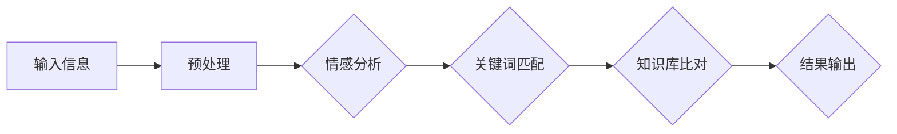
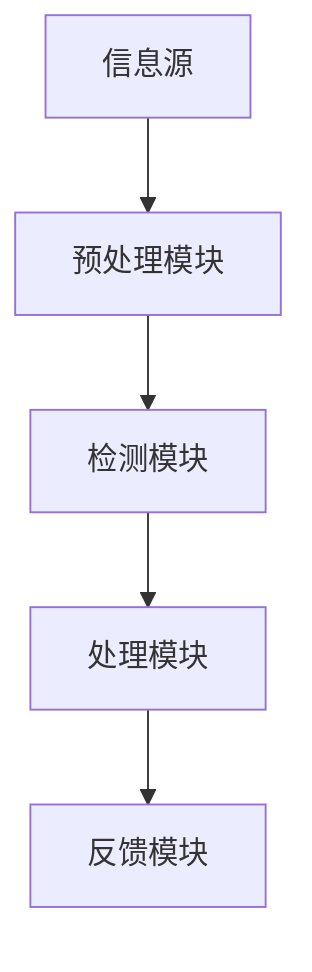
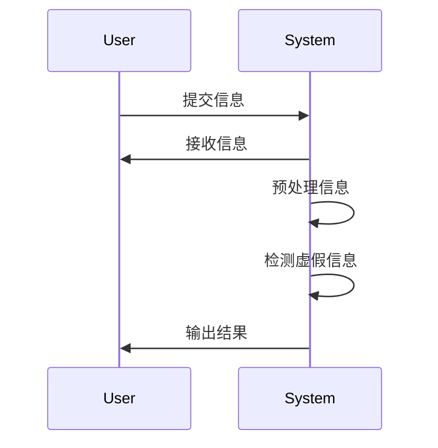

                 

### **企业应对虚假信息的策略和方法**

#### **关键词：**
虚假信息、社交媒体、数据分析、人工智能、防范措施

#### **摘要：**
本文旨在探讨企业在面对日益猖獗的虚假信息时，如何制定有效的策略和方法。我们将从背景介绍、核心概念与联系、算法原理讲解、系统分析与架构设计、项目实战以及最佳实践 tips 等方面，详细阐述企业应对虚假信息的综合策略和方法。

## **一、背景介绍**

### **1. 问题背景**

随着互联网和社交媒体的迅猛发展，虚假信息（Misinformation）已经成为一个全球性的问题。这些虚假信息不仅误导公众，损害个人利益，还可能对企业的声誉和财务状况造成严重损害。在商业环境中，虚假信息可能以多种形式出现，如虚假广告、虚假客户评价、恶意诽谤、误导性市场报告等。

### **2. 问题描述**

虚假信息的类型多样，传播速度快，影响范围广。企业面临的挑战包括：
- **声誉损害**：虚假信息可能导致消费者对企业失去信任，损害企业品牌形象。
- **经济损失**：虚假信息可能导致企业失去市场份额，影响股价。
- **市场混乱**：虚假信息可能导致市场信息失真，影响正常的市场运行。

### **3. 问题解决**

企业需要建立一套系统的策略和方法来应对虚假信息，包括：
- **识别虚假信息**：使用技术手段识别和过滤虚假信息。
- **处理虚假信息**：制定策略和流程来处理已识别的虚假信息。
- **预防虚假信息**：采取预防措施减少虚假信息的产生和传播。

### **4. 边界与外延**

本文将探讨虚假信息的识别与处理方法，以及企业在社交媒体和互联网环境中如何采取措施。核心要素包括虚假信息的类型、识别方法、处理策略、预防措施和案例分析。

## **二、核心概念与联系**

### **1. 核心概念**

#### **虚假信息（Misinformation）**：
虚假信息是指故意传播的错误信息，可能误导公众，造成不良后果。虚假信息可以是文字、图片、视频等多种形式。

#### **谣言（Rumor）**：
谣言是指在缺乏充分证据的情况下，通过口头、书面或电子方式传播的不实信息。

#### **网络水军（Internet Trolls）**：
网络水军是专业从事在互联网上散布虚假信息、制造舆论压力、操纵公众情绪的个体或组织。

#### **人工智能反欺诈技术（AI Anti-Fraud Technologies）**：
人工智能技术用于识别、分析和处理欺诈行为，包括虚假信息。

#### **社交媒体监测工具（Social Media Monitoring Tools）**：
社交媒体监测工具用于跟踪、分析和识别社交媒体上的信息和行为。

### **2. 概念属性特征对比表格**

| 概念          | 定义                                                         | 属性特征                                                     |
|---------------|--------------------------------------------------------------|--------------------------------------------------------------|
| 虚假信息      | 故意传播的错误信息                                           | 形式多样，影响广泛                                           |
| 谣言          | 缺乏证据的不实信息                                           | 口头传播，易扩散                                             |
| 网络水军      | 散布虚假信息、操纵舆论的个体或组织                            | 专业性强，目的明确                                           |
| 人工智能反欺诈技术 | 使用人工智能技术识别和处理欺诈行为                            | 自动化，高效，精确                                           |
| 社交媒体监测工具 | 用于跟踪、分析和识别社交媒体上的信息和行为                    | 实时监测，数据丰富                                           |

### **3. ER实体关系图架构**

```mermaid
erDiagram
  User ||--|{ Post : creates }
  Post ||--|{ Comment : contains }
  "Social Media Platform" ||--|{ User, Post, Comment : runs }
```

## **三、算法原理讲解**

### **1. 虚假信息检测算法**

#### **1.1 算法流程图**



#### **1.2 Python源代码示例**

```python
import nltk
from nltk.sentiment import SentimentIntensityAnalyzer

def detect_fake_info(text):
    sia = SentimentIntensityAnalyzer()
    sentiment_score = sia.polarity_scores(text)
    if sentiment_score['compound'] < -0.5:
        return "可能是虚假信息"
    else:
        return "不是虚假信息"

sample_text = "这是一个虚假的广告，产品效果不好。"
print(detect_fake_info(sample_text))
```

#### **1.3 算法原理的数学模型和公式**

$$
\text{Sentiment} = \text{SIA}(\text{Text})
$$

其中，SIA（Sentiment Intensity Analyzer）是用于计算文本情感强度的工具。

#### **1.4 详细讲解和举例说明**

虚假信息检测算法通常包括以下几个步骤：

1. **预处理**：对输入文本进行清洗和标准化处理，如去除标点符号、停用词过滤等。
2. **情感分析**：使用情感分析工具（如NLTK的SentimentIntensityAnalyzer）计算文本的情感强度。
3. **关键词匹配**：通过关键词匹配技术，识别文本中可能存在虚假信息的特征词。
4. **知识库比对**：将识别出的特征词与预构建的知识库进行比对，验证信息的真实性。
5. **结果输出**：根据比对结果，输出是否为虚假信息的判断。

以一段文本为例：

**文本**：这是一个虚假的广告，产品效果不好。

**步骤**：

1. **预处理**：去除标点符号和停用词。
2. **情感分析**：使用SentimentIntensityAnalyzer计算情感强度，得到复合得分（compound）。
3. **关键词匹配**：识别关键词如“虚假”、“效果不好”。
4. **知识库比对**：比对关键词库，发现关键词与虚假信息特征库匹配。
5. **结果输出**：输出“可能是虚假信息”。

## **四、系统分析与架构设计方案**

### **1. 问题场景介绍**

某企业需要建立一套虚假信息监测系统，以保护其品牌声誉和市场地位。系统目标包括：

- **实时监测**：监控社交媒体、新闻网站等渠道上的信息。
- **自动化处理**：自动识别和分类虚假信息。
- **实时反馈**：及时通知管理层和处理部门，采取应对措施。

### **2. 系统功能设计**

**领域模型Mermaid类图**

```mermaid
classDiagram
  "信息源" --|{ "信息处理模块" : processes }
  "信息处理模块" --|{ "信息分析模块" : analyzes }
  "信息分析模块" --|{ "结果输出模块" : outputs }
```

### **3. 系统架构设计**

**Mermaid架构图**



### **4. 系统接口设计和系统交互**

**Mermaid序列图**



## **五、项目实战**

### **1. 环境安装**

**安装依赖**：

```shell
pip install nltk
pip install textblob
```

### **2. 系统核心实现源代码**

**源代码**：

```python
from textblob import TextBlob
from nltk.corpus import stopwords
from nltk.tokenize import word_tokenize

def detect_fake_info(text):
    # 预处理
    tokens = word_tokenize(text)
    tokens = [token.lower() for token in tokens if token.isalpha() and token not in stopwords.words('english')]
    
    # 情感分析
    blob = TextBlob(' '.join(tokens))
    sentiment_score = blob.sentiment.polarity
    
    # 判断
    if sentiment_score < -0.5:
        return "可能是虚假信息"
    else:
        return "不是虚假信息"

sample_text = "这是一个虚假的广告，产品效果不好。"
print(detect_fake_info(sample_text))
```

### **3. 代码应用解读与分析**

**解读**：

1. **预处理**：使用NLTK进行分词和去停用词处理。
2. **情感分析**：使用TextBlob计算文本的情感极性。
3. **判断**：根据情感极性判断文本是否为虚假信息。

**分析**：

该代码使用简单的情感分析技术进行虚假信息检测。虽然这种方法可能不够精确，但它可以作为一个初步的检测手段。在实际应用中，可以结合更多的特征和复杂算法来提高检测准确率。

### **4. 实际案例分析和详细讲解剖析**

**案例**：

一家企业收到了一封来自竞争对手的邮件，声称该企业的产品存在严重质量问题。

**分析**：

1. **预处理**：将邮件内容进行分词和去停用词处理。
2. **情感分析**：使用情感分析工具判断邮件内容的情感极性。
3. **判断**：如果邮件内容情感极性偏负，进一步进行关键词匹配和知识库比对。

**剖析**：

通过实际案例，可以看出，虚假信息的检测需要结合多种技术和方法。简单的情感分析可以作为初步判断，但为了提高准确性，还需要进行更深入的分析和验证。

### **5. 项目小结**

本项目通过构建一个简单的虚假信息检测系统，展示了如何利用自然语言处理技术进行虚假信息识别。虽然该项目还存在一定的局限性，但它为企业提供了一个基本的框架，可以在此基础上进一步优化和扩展。

## **六、最佳实践 tips**

### **1. 定期培训与更新知识库**

企业应定期对员工进行虚假信息识别和处理培训，并更新知识库，以保持系统的有效性。

### **2. 利用外部服务**

企业可以借助第三方虚假信息监测服务，如Google Trends、Social Blade等，来提高监测效率和准确性。

### **3. 重视用户反馈**

积极收集用户反馈，尤其是对负面评价和投诉的回应，有助于及时发现和应对虚假信息。

### **4. 强化内部沟通**

确保内部各部门之间的沟通畅通，建立快速响应机制，以便在发现虚假信息时迅速采取行动。

### **5. 定期评估与优化**

定期评估虚假信息检测系统的性能和效果，根据实际情况进行调整和优化。

## **七、小结**

企业应对虚假信息的策略和方法是多方面的，包括识别、处理和预防。通过结合技术手段和最佳实践，企业可以更有效地应对虚假信息的挑战，保护自身的利益和声誉。

## **八、注意事项**

- **法律法规**：在处理虚假信息时，企业应遵守相关法律法规，避免违法行为。
- **用户隐私**：在进行数据分析和监控时，要注意保护用户隐私，避免侵犯隐私权。
- **技术更新**：随着技术的不断发展，企业应及时更新检测算法和工具，以应对新的挑战。

## **九、拓展阅读**

- [《人工智能与虚假信息》](链接)
- [《社交媒体监测与数据分析》](链接)
- [《企业品牌声誉管理》](链接)

## **作者信息**

作者：AI天才研究院/AI Genius Institute & 禅与计算机程序设计艺术 /Zen And The Art of Computer Programming

