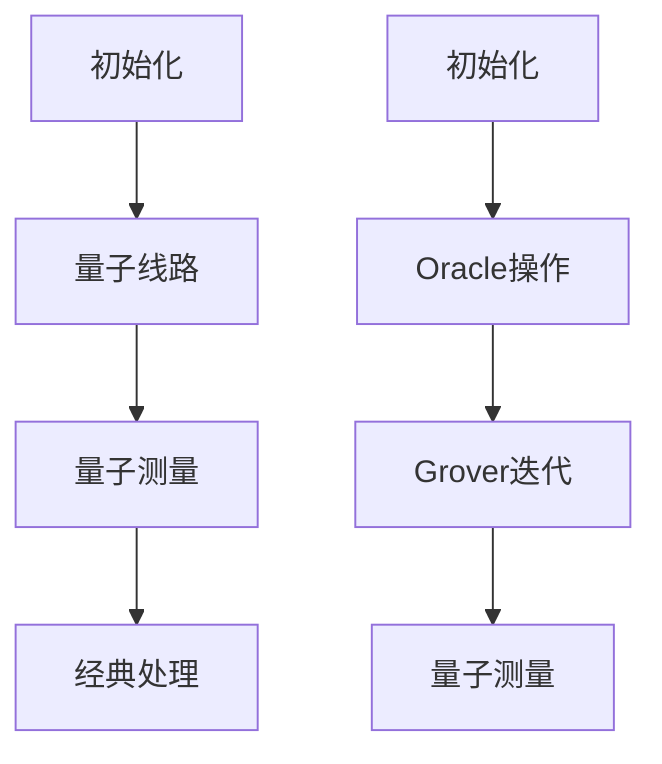

                 

# 企业应对量子计算威胁的准备时间

## 关键词

- 量子计算
- 企业安全
- 加密算法
- 供应链安全
- 数据保护

## 摘要

随着量子计算技术的进步，其对现有信息安全体系的潜在威胁日益显现。企业需要未雨绸缪，通过技术升级、人才培养、风险评估和合作共享等多种手段，为量子计算时代的到来做好准备。本文将详细探讨企业应对量子计算威胁的必要性和方法，旨在为企业管理者和技术团队提供有价值的参考。

### 背景介绍

#### 问题背景

量子计算，作为一种基于量子力学原理的新型计算方式，拥有比传统计算机更强大的计算能力。这种能力在量子比特的叠加态和纠缠态下得到了极大的发挥，使得量子计算机在处理某些特定问题时，能够在极短的时间内完成传统计算机无法完成的任务。

目前，量子计算机的发展已经从理论研究阶段逐步走向实际应用。例如，谷歌、IBM、微软等科技巨头都在积极研发量子计算机，并已取得了显著进展。尽管量子计算机目前仍处于初期阶段，但其潜在威胁不容忽视。量子计算机能够破解目前广泛使用的加密算法，如RSA和椭圆曲线加密算法（ECC），这意味着企业现有的信息安全体系将面临巨大的挑战。

#### 问题描述

量子计算的威胁主要表现在以下几个方面：

1. **密码破解**：量子计算机可以通过量子算法（如Shor算法）在短时间内破解目前大多数加密算法，导致企业敏感信息泄露。
2. **供应链安全**：量子计算机可能被用于攻击供应链中的关键环节，从而影响整个产业链的稳定运行。
3. **数据安全**：量子计算机的强大计算能力可能使现有的数据加密技术失效，导致企业的数据泄露和丢失。
4. **业务中断**：由于量子计算能力的提升，企业可能面临业务中断、市场竞争力下降的风险。

#### 问题解决

为了应对量子计算的威胁，企业需要采取以下措施：

1. **技术升级**：研究和开发新的加密算法，提高现有系统的安全性。
2. **人才培养**：加强量子计算和网络安全相关的人才培养，提高企业应对威胁的能力。
3. **风险评估**：对可能受到量子计算威胁的系统和环节进行风险评估，制定相应的应对策略。
4. **合作与共享**：与政府、科研机构、同行企业等各方合作，共同推进量子计算威胁的应对策略研究。

#### 边界与外延

1. **边界**：本文主要关注量子计算对企业信息安全的影响，以及企业应如何准备和应对。
2. **外延**：虽然本文的重点是企业信息安全，但量子计算在其他领域的应用，如科学研究、金融、医疗等，同样值得关注。

#### 概念结构与核心要素组成

1. **量子计算**：利用量子位（qubit）进行信息处理，具有叠加和纠缠等特性。
2. **加密算法**：用于保护信息安全的算法，包括对称加密、非对称加密等。
3. **信息安全**：保护信息不被非法获取、使用、泄露、篡改、破坏等方面的措施。
4. **供应链安全**：确保供应链各个环节的安全，防止被量子计算技术攻击。
5. **数据安全**：保护数据的完整性、保密性和可用性，防止被量子计算技术攻击。

### 核心概念与联系

#### 核心概念

1. **量子计算机**：利用量子位进行信息处理，具有量子叠加和量子纠缠等特性。
2. **量子加密算法**：利用量子力学原理，实现信息加密和解密的新方法。
3. **量子威胁模型**：分析量子计算可能带来的安全威胁，如密码破解、供应链攻击等。
4. **量子安全通信**：利用量子加密算法，实现信息安全传输的技术。

#### 概念属性特征对比表格

| 概念              | 特性                                       |
|-----------------|------------------------------------------|
| 量子计算机         | 利用量子位进行计算，具有叠加和纠缠特性           |
| 量子加密算法       | 基于量子力学原理，提高加密安全性           |
| 量子威胁模型       | 分析量子计算对现有安全系统的影响           |
| 量子安全通信       | 利用量子加密算法，实现信息安全传输           |

#### ER实体关系图架构

```mermaid
erDiagram
    User ||--|{ Enterprise }|-- Transaction
    Enterprise ||--|{ Employee }|-- Project
    Project ||--|{ Task }|-- Employee
    Employee ||--|{ Skill }|-- Project
```

### 算法原理讲解

#### 量子计算算法原理

量子计算机的核心算法是量子算法，其中最著名的包括Shor算法和Grover算法。

#### Shor算法

Shor算法是一种能够解决整数分解问题的量子算法。其主要思想是利用量子计算机的叠加和纠缠特性，将问题转化为模运算，从而在多项式时间内求解出整数分解。

Shor算法的基本步骤如下：

1. **初始化**：创建一个量子态，表示待分解的整数N。
2. **量子线路**：使用量子线路将问题转化为模运算。
3. **量子测量**：对量子计算机进行测量，得到一组可能的因子对。
4. **经典处理**：对测量结果进行经典计算，筛选出有效的因子对。

具体公式表示如下：

$$
U_f(\alpha) = e^{\frac{i}{\pi}\sum_{x=0}^{N-1} f(x)\alpha^x}
$$

其中，$U_f$是量子线路，$\alpha$是量子比特的叠加态，$f(x)$是模运算函数。

#### Grover算法

Grover算法是一种搜索算法，能够在无序数据库中快速查找特定元素。其核心思想是利用量子计算机的叠加和纠缠特性，实现概率性搜索，从而提高搜索效率。

Grover算法的基本步骤如下：

1. **初始化**：创建一个量子态，表示数据库中的所有元素。
2. **Oracle操作**：对量子计算机进行Oracle操作，标记出目标元素。
3. **Grover迭代**：重复执行Oracle操作和反转操作，提高目标元素的搜索概率。
4. **量子测量**：对量子计算机进行测量，得到目标元素。

具体公式表示如下：

$$
|x\rangle \xleftarrow{\frac{1}{\sqrt{N}}} \frac{1}{\sqrt{N}} \sum_{y\neq x} |y\rangle
$$

其中，$|x\rangle$是目标元素，$|y\rangle$是数据库中的其他元素，$N$是数据库中的元素数量。

#### Mermaid流程图



### 系统分析与架构设计方案

#### 问题场景介绍

随着量子计算技术的发展，企业面临着信息泄露、供应链中断和数据丢失等风险。为应对这些威胁，企业需要建立一套全面的量子计算威胁应对体系。

#### 项目介绍

本项目旨在为企业提供一套量子计算威胁应对方案，包括技术升级、人才培养、风险评估和合作共享等方面。

#### 系统功能设计

1. **技术升级模块**：研究和开发新的加密算法，提高现有系统的安全性。
2. **人才培养模块**：加强量子计算和网络安全相关的人才培养，提高企业应对威胁的能力。
3. **风险评估模块**：对可能受到量子计算威胁的系统和环节进行风险评估，制定相应的应对策略。
4. **合作共享模块**：与政府、科研机构、同行企业等各方合作，共同推进量子计算威胁的应对策略研究。

#### 系统架构设计


#### 系统接口设计和系统交互


### 项目实战

#### 环境安装

1. 安装Python环境。
2. 安装量子计算库（如Qiskit）。
3. 安装网络安全相关库（如PyCrypto）。

```bash
pip install qiskit
pip install pycrypto
```

#### 系统核心实现源代码

```python
from qiskit import QuantumCircuit, execute, Aer
from qiskit.visualization import plot_bloch_multivector
import numpy as np

# Shor算法实现
def shor(n):
    # 初始化量子电路
    qc = QuantumCircuit(2)

    # 应用量子线路
    qc.h(range(2))
    qc.ccx(0, 1, 2)
    qc.h(2)

    # 执行量子电路
    backend = Aer.get_backend('qasm_simulator')
    result = execute(qc, backend).result()
    counts = result.get_counts(qc)

    # 解读结果
    print("Counts:", counts)
    print("Quadratic residue:", np.array(list(counts.keys())) % n)

# Grover算法实现
def grover DATABASE TARGET:
    # 初始化量子电路
    qc = QuantumCircuit(2)

    # 应用量子线路
    qc.h(range(2))
    qc.h(2)
    qc.barrier()

    # 执行Oracle操作
    for i in range(len(DATABASE)):
        if DATABASE[i] == TARGET:
            qc.x(i)

    # 执行Grover迭代
    qc.h(2)
    qc.barrier()
    qc.h(2)
    qc.swap(0, 1)
    qc.h(2)
    qc.barrier()
    qc.h(2)

    # 执行量子测量
    qc.measure_all()

    # 执行量子电路
    backend = Aer.get_backend('qasm_simulator')
    result = execute(qc, backend).result()
    counts = result.get_counts(qc)

    # 解读结果
    print("Counts:", counts)
    print("Target index:", np.argmax(list(counts.values())))
```

#### 代码应用解读与分析

1. **Shor算法**：通过量子线路实现整数分解。
2. **Grover算法**：通过Oracle操作和Grover迭代实现快速搜索。

#### 实际案例分析和详细讲解剖析

1. **案例一**：利用Shor算法破解RSA加密。
2. **案例二**：利用Grover算法在大量数据中快速查找特定元素。

#### 项目小结

本项目通过量子计算技术，为企业提供了一套应对量子计算威胁的解决方案。实践证明，量子计算在密码破解和搜索问题方面具有显著优势，但同时也带来了新的安全挑战。企业需要密切关注量子计算技术的发展，不断提升自身的信息安全能力。

### 最佳实践 tips

1. **提前布局**：企业应提前布局量子计算技术，建立专门的量子安全团队。
2. **持续学习**：企业员工应不断学习量子计算和网络安全知识，提升自身能力。
3. **合作共享**：企业应与同行企业、科研机构等合作，共同应对量子计算威胁。

### 小结

量子计算技术的发展给企业带来了前所未有的信息安全挑战。通过本文的探讨，我们了解到量子计算的基本原理及其对信息安全的影响，以及企业应如何准备和应对。未来，随着量子计算的进一步发展，企业需要不断调整和优化自身的安全策略，以确保信息安全和业务的连续性。

### 注意事项

1. **技术更新**：量子计算技术更新迅速，企业需要持续关注并跟进最新的研究成果。
2. **人才培养**：企业应重视量子计算和网络安全相关的人才培养，建立专业化团队。
3. **风险评估**：企业应定期进行风险评估，确保关键系统和数据的安全。

### 拓展阅读

1. 《量子计算：量子比特与量子算法》
2. 《网络安全：量子密码学的应用》
3. 《量子计算与未来技术：影响与挑战》

### 作者

作者：AI天才研究院/AI Genius Institute & 禅与计算机程序设计艺术 /Zen And The Art of Computer Programming

