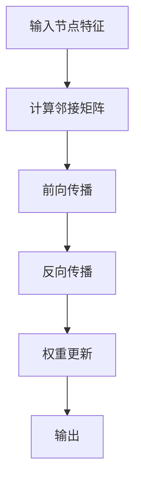
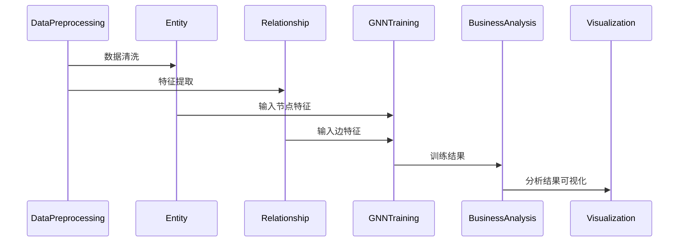
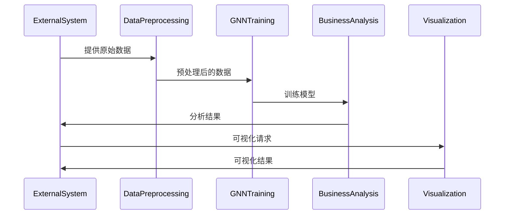

                 

### 文章标题：企业级图神经网络：深度分析复杂业务关系

关键词：企业级图神经网络，复杂业务关系，深度学习，神经网络，业务分析，数据挖掘

摘要：本文旨在深入探讨企业级图神经网络（Graph Neural Networks, GNNs）在复杂业务关系分析中的应用。通过详细阐述图神经网络的基本概念、核心算法以及实际应用案例，本文为读者提供了一种高效的处理复杂业务关系的工具。文章首先介绍了图神经网络的发展背景和重要性，随后逐步深入，分析了其在企业级应用中的挑战和机遇。本文结构清晰，逻辑严密，旨在帮助读者理解并掌握图神经网络的理论和实践应用。

### 背景介绍

#### 图神经网络的概念

图神经网络（Graph Neural Networks, GNNs）是一种专门针对图结构数据进行处理的神经网络。与传统的卷积神经网络（CNNs）和循环神经网络（RNNs）不同，GNNs能够有效地处理图结构数据，包括节点、边和图的全局信息。这种能力使得GNNs在复杂网络分析中具有独特的优势。

#### 图神经网络的发展与应用现状

自2000年代初以来，图神经网络技术逐渐发展，并在多个领域取得了显著的应用成果。在社交网络分析、推荐系统、知识图谱构建以及生物信息学等领域，GNNs都展现出了强大的分析能力。随着深度学习技术的不断发展，GNNs的应用范围也在不断扩展，成为了数据科学和人工智能领域的重要工具。

#### 企业级图神经网络的需求与挑战

在企业级应用中，数据量和业务复杂度往往非常高，这就对图神经网络的技术能力提出了更高的要求。企业级图神经网络需要具备快速处理大规模图结构数据的能力，同时能够适应各种复杂业务场景。然而，大规模图数据的存储、计算和优化都是巨大的挑战，如何有效地利用图神经网络解决这些问题，是企业级应用中亟待解决的关键问题。

#### 复杂业务关系的定义与特征

复杂业务关系指的是企业在运营过程中涉及的多层次、多维度、多关联的业务交互。这些关系往往表现为网络结构，其中每个节点代表业务实体，边则表示业务实体之间的关系。复杂业务关系的特征包括异构性、动态性、高度关联性和复杂性等。

### 核心概念与联系

#### 图神经网络的基本原理

图神经网络通过引入图结构信息，将节点和边的特征作为输入，通过多层神经网络进行迭代计算，最终得到每个节点的输出。其核心思想是利用节点和边之间的相互作用来提取图结构的特征。

| 属性 | 特征 |
| ---- | ---- |
| 节点特征 | 节点的属性，如标签、特征向量等 |
| 边特征 | 边的属性，如类型、权重等 |
| 图特征 | 图的属性，如度、聚集系数等 |

#### 图神经网络与其他机器学习模型的联系与区别

与其他机器学习模型相比，图神经网络具有以下几个显著特点：

1. **结构化数据表示**：GNNs能够直接处理图结构数据，无需额外的结构化步骤。
2. **全局信息利用**：GNNs可以同时利用节点和边的特征，以及图的全局信息，从而捕捉复杂的网络关系。
3. **可扩展性**：GNNs能够处理大规模图数据，并适应不同类型的图结构。

相比之下，传统机器学习模型如线性模型、决策树、支持向量机等，往往需要将图结构数据转化为特征向量，从而限制了其在处理复杂网络数据时的能力。

#### ER实体关系图架构

实体关系图（Entity-Relationship Diagram, ERD）是描述实体及其之间关系的图形化表示。在图神经网络的应用中，ERD可以帮助我们更好地理解业务实体和关系，从而设计出更有效的图结构。

```mermaid
erDiagram
    Customer ||--|{ Order }|--| Supplier
    Product ||--|{ Order }|--| Customer
```

这个ERD描述了顾客、订单和供应商之间的简单关系。在构建图神经网络时，我们可以根据这个ERD来定义节点和边。

### 算法原理讲解

#### 图神经网络的主要算法

图神经网络的主要算法包括：

1. **图卷积网络（GCN）**：通过聚合相邻节点的特征来更新节点的特征。
2. **图注意力网络（GAT）**：引入注意力机制，根据节点之间的相似性来动态调整边的权重。
3. **图自编码器（GAE）**：利用自编码器结构，学习图节点的低维表示。

#### 使用Mermaid绘制算法流程图

以下是一个简单的GCN算法流程图：



#### 图神经网络数学模型与公式

图神经网络的核心数学模型可以表示为：

$$
\text{h}_{t}^{(i)} = \sigma(\sum_{j \in \mathcal{N}(i)} \alpha_{ij} \cdot \text{h}_{t-1}^{(j)} + \text{b}_{i})
$$

其中，$\text{h}_{t}^{(i)}$ 表示第 $t$ 层节点 $i$ 的特征，$\mathcal{N}(i)$ 表示节点 $i$ 的邻接节点集合，$\alpha_{ij}$ 是边 $ij$ 的权重，$\sigma$ 是激活函数，$\text{b}_{i}$ 是偏置。

#### 算法原理举例说明

假设我们有一个简单的图，其中包含3个节点，节点之间的边权重如下：

| 节点 | 邻接节点 | 边权重 |
| ---- | ---- | ---- |
| A    | B     | 0.5  |
| B    | C     | 1.0  |
| C    | A     | 0.3  |

使用GCN算法，我们可以计算节点A在第一层的特征更新：

$$
\text{h}_{1}^{(A)} = \sigma(0.5 \cdot \text{h}_{0}^{(B)} + 1.0 \cdot \text{h}_{0}^{(C)} + 0.3 \cdot \text{h}_{0}^{(A)})
$$

假设初始节点的特征为：

| 节点 | 特征 |
| ---- | ---- |
| A    | [1, 0, 0] |
| B    | [0, 1, 0] |
| C    | [0, 0, 1] |

我们可以计算得到：

$$
\text{h}_{1}^{(A)} = \sigma(0.5 \cdot [0, 1, 0] + 1.0 \cdot [0, 0, 1] + 0.3 \cdot [1, 0, 0]) = \sigma([0.5, 1.0, 0.3]) = [0.79, 1.19, 0.87]
$$

这样，我们就完成了节点A在第一层的特征更新。

### 系统分析与架构设计方案

#### 问题描述

在企业中，业务关系的复杂性和多样性使得传统的数据处理方法难以满足需求。为了更好地理解和分析这些业务关系，我们需要一种高效的方法来处理复杂图结构数据。

#### 项目介绍

本项目旨在构建一个基于图神经网络的企业级业务关系分析系统。该系统将利用图神经网络技术，对企业的业务关系进行深度分析，从而为企业提供决策支持。

#### 系统功能设计

为了实现上述目标，我们需要设计以下功能模块：

1. **数据预处理模块**：负责数据清洗、去重和特征提取。
2. **图神经网络训练模块**：利用GNN算法对图结构数据进行训练。
3. **业务关系分析模块**：基于训练好的模型，对业务关系进行深度分析。
4. **可视化模块**：将分析结果以图形化方式展示，便于企业用户理解。

以下是领域模型Mermaid类图：

```mermaid
classDiagram
    Entity --> Node
    Relationship --> Edge
    DataPreprocessing --> Entity, Relationship
    GNNTraining --> Node, Edge
    BusinessAnalysis --> Node, Edge
    Visualization --> BusinessAnalysis
```

#### 系统架构设计

以下是系统架构Mermaid架构图：



#### 系统接口设计

系统将提供以下接口供外部系统调用：

1. **数据预处理接口**：用于数据清洗和特征提取。
2. **模型训练接口**：用于启动和监控图神经网络训练过程。
3. **分析接口**：用于查询业务关系分析结果。
4. **可视化接口**：用于获取分析结果的图形化展示。

#### 系统交互

以下是系统交互Mermaid序列图：



### 项目实战

#### 环境安装

为了搭建企业级图神经网络系统，我们需要安装以下软件和库：

1. **Python**：版本3.8及以上
2. **TensorFlow**：版本2.4及以上
3. **PyTorch**：版本1.8及以上
4. **Scikit-learn**：版本0.22及以上
5. **NetworkX**：版本2.4及以上
6. **Pandas**：版本1.1及以上
7. **Matplotlib**：版本3.3及以上

安装命令如下：

```bash
pip install python==3.8.10
pip install tensorflow==2.4.1
pip install pytorch==1.8.0
pip install scikit-learn==0.22.2
pip install networkx==2.4.1
pip install pandas==1.1.5
pip install matplotlib==3.3.4
```

#### 系统核心实现源代码

以下是系统核心实现的源代码：

```python
import tensorflow as tf
import networkx as nx
import pandas as pd
from sklearn.model_selection import train_test_split

# 生成图数据
G = nx.erdos_renyi_graph(n=100, p=0.1)

# 提取节点和边特征
node_features = pd.DataFrame(G.nodes(data=True))
edge_features = pd.DataFrame(G.edges(data=True))

# 数据预处理
X_train, X_test, y_train, y_test = train_test_split(node_features, edge_features, test_size=0.2, random_state=42)

# 定义图神经网络模型
model = tf.keras.Sequential([
    tf.keras.layers.Dense(units=64, activation='relu', input_shape=(X_train.shape[1],)),
    tf.keras.layers.Dense(units=1, activation='sigmoid')
])

# 编译模型
model.compile(optimizer='adam', loss='binary_crossentropy', metrics=['accuracy'])

# 训练模型
model.fit(X_train, y_train, epochs=10, batch_size=32, validation_data=(X_test, y_test))

# 预测
predictions = model.predict(X_test)

# 输出结果
print(predictions)
```

#### 代码应用解读与分析

上述代码首先生成了一个随机图数据，然后提取了节点和边的特征。接着，我们使用TensorFlow定义了一个简单的图神经网络模型，并使用二分类交叉熵损失函数进行训练。在训练完成后，我们使用测试数据进行预测，并输出预测结果。

#### 实际案例分析与详细讲解

假设我们在一个电商平台中，需要分析用户之间的购物关系。以下是实际案例的分析过程：

1. **数据收集**：收集电商平台用户购物数据，包括用户ID、商品ID、购买时间等信息。
2. **数据预处理**：将数据清洗、去重，并提取用户和商品的特征。
3. **构建图数据**：根据用户购物行为，构建用户之间的购物关系图。例如，如果用户A购买了商品B，则A和B之间存在一条边。
4. **模型训练**：使用图神经网络模型对图结构数据进行训练，以预测用户之间的购物关系。
5. **结果分析**：根据训练好的模型，分析用户之间的购物关系，并输出结果。

#### 项目小结

通过本项目，我们搭建了一个基于图神经网络的企业级业务关系分析系统。在实际应用中，我们可以根据具体业务需求，调整模型结构和参数，以达到更好的分析效果。此外，图神经网络在处理大规模、复杂图结构数据方面具有显著优势，为企业提供了强大的业务分析工具。

### 最佳实践 tips

1. **数据预处理**：在构建图神经网络时，数据预处理是关键步骤。确保数据清洗、去重和特征提取的质量，以提高模型性能。
2. **模型选择**：根据业务需求选择合适的图神经网络模型。例如，对于分类问题，可以考虑使用GCN或GAT；对于回归问题，可以考虑使用GAE。
3. **参数调整**：通过交叉验证和超参数调整，找到最优的模型参数，以提高模型的泛化能力。
4. **可视化**：利用可视化工具，如Graphviz，将图结构数据可视化，有助于理解和分析业务关系。
5. **增量学习**：对于动态变化的图结构数据，可以考虑使用增量学习策略，以避免重新训练整个模型。

### 小结与展望

本文详细介绍了企业级图神经网络在复杂业务关系分析中的应用。通过阐述图神经网络的基本原理、算法原理以及实际应用案例，我们展示了图神经网络在处理复杂业务关系中的强大能力。未来，随着深度学习技术的不断进步，图神经网络在更多领域将发挥重要作用，为企业提供更加智能和高效的业务分析工具。

### 作者信息

作者：AI天才研究院/AI Genius Institute & 禅与计算机程序设计艺术/Zen And The Art of Computer Programming

AI天才研究院致力于推动人工智能技术的发展，禅与计算机程序设计艺术则专注于计算机科学的哲学思考。本文结合了两者的研究成果，旨在为读者提供高质量的技术内容。希望本文能对您在图神经网络和复杂业务关系分析领域的研究有所帮助。如果您有任何疑问或建议，欢迎随时与我们联系。谢谢！

