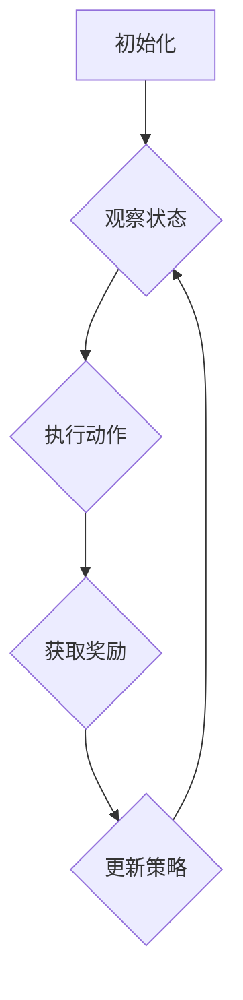
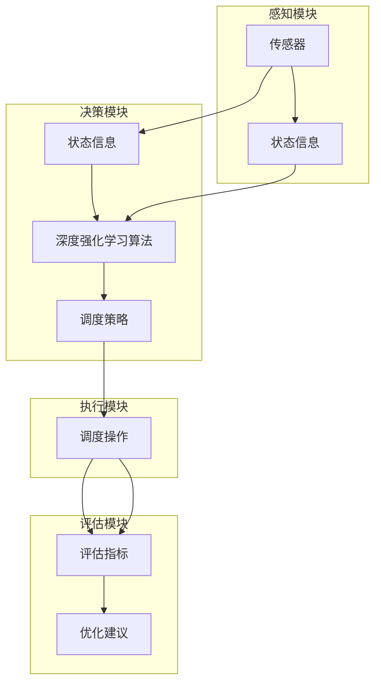
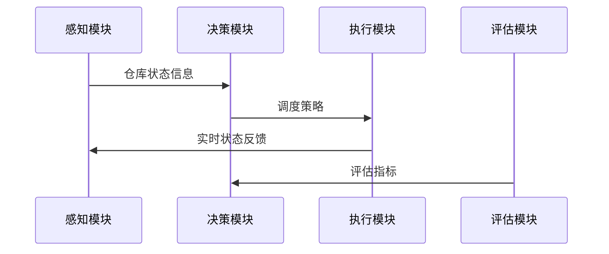

                 


### 1. 背景介绍

**深度强化学习在企业级应用中的重要性**

随着人工智能技术的快速发展，深度强化学习（Deep Reinforcement Learning，DRL）作为人工智能领域的一个前沿技术，其在企业级应用中的重要性日益凸显。DRL结合了深度学习和强化学习，使得智能体可以在复杂的动态环境中通过试错学习得到最优策略，从而解决了传统机器学习算法在处理复杂决策问题时的局限性。

**复杂商业问题与深度强化学习的关系**

在商业领域，许多问题具有高度的不确定性和动态性，如供应链管理、库存控制、资源调度等。这些问题通常难以用传统的优化算法或统计方法来解决。深度强化学习通过模拟智能体在真实环境中的交互，能够发现隐藏在大量数据中的模式和规律，从而为企业提供有效的解决方案。

**深度强化学习的定义和基本原理**

深度强化学习是一种基于深度神经网络的学习方法，它模拟智能体在与环境交互的过程中通过试错来学习最优策略。在这个过程中，智能体接收环境反馈，通过梯度下降等方法更新神经网络的参数，以实现长期回报的最大化。DRL的核心组成部分包括：

- **环境（Environment）**：智能体所处的动态环境，环境的状态、动作空间和奖励机制都对智能体的学习过程有重要影响。
- **智能体（Agent）**：执行动作、接收环境反馈并学习策略的实体。
- **策略（Policy）**：智能体在特定环境下选择动作的规则。
- **价值函数（Value Function）**：预测智能体在未来某个状态下的预期回报。
- **模型（Model）**：对环境的动态行为进行建模的函数。

**企业级应用中深度强化学习的挑战和机会**

深度强化学习在企业级应用中面临许多挑战，如计算资源需求大、训练过程复杂等。但与此同时，它也带来了巨大的机会。通过有效地利用DRL，企业可以在以下几个方面取得突破：

- **自动化决策**：DRL能够自动生成复杂的决策策略，减少人工干预。
- **资源优化**：通过优化资源分配策略，提高企业运营效率。
- **风险控制**：DRL能够帮助企业在不确定性环境中进行风险预测和控制。
- **业务创新**：DRL可以为企业的业务模式提供新的视角，推动业务创新。

**深度强化学习在企业级应用中的成功案例**

深度强化学习已在多个行业取得了显著的成功。例如，在金融领域，DRL被用于交易策略优化；在制造业，DRL被用于生产调度和库存控制；在物流领域，DRL被用于路径规划和车队调度等。这些成功案例表明，深度强化学习具有广泛的应用前景。

**深度强化学习与其他技术的比较**

与传统机器学习技术相比，深度强化学习具有更强的自适应能力和探索能力。它不仅能够处理高维数据，还能够处理动态环境中的不确定性问题。与其他优化算法相比，DRL通过自学习机制能够自动调整策略，提高了解决问题的效率。

**深度强化学习的适用范围和局限性**

深度强化学习在复杂决策问题中具有广泛的应用范围，但同时也存在一定的局限性。例如，DRL在处理大规模、高维数据时计算资源需求大，训练时间较长；此外，DRL的结果往往依赖于具体的算法设计和超参数调整，需要大量的实验验证。

**深度强化学习的最新发展趋势**

随着计算能力的提升和数据规模的扩大，深度强化学习在算法性能和模型可解释性方面取得了显著的进展。未来的研究将集中在如何提高DRL的收敛速度、降低计算成本、提高模型可解释性等方面。

**边界与外延**

深度强化学习虽然在企业级应用中表现出强大的潜力，但仍然面临许多挑战。例如，如何设计有效的奖励机制、如何处理现实环境中的不确定性等。此外，深度强化学习在伦理和安全方面的讨论也日益受到关注。

### 2.1 深度强化学习核心概念

**智能体（Agent）**

智能体是执行动作、接收环境反馈并学习策略的实体。在DRL中，智能体通常由一个神经网络组成，用于评估当前状态并选择最优动作。

**环境（Environment）**

环境是智能体所处的动态环境，包括状态空间、动作空间和奖励机制。状态空间描述了环境当前的状态，动作空间描述了智能体可以执行的动作，奖励机制用于激励智能体的学习过程。

**策略（Policy）**

策略是智能体在特定环境下选择动作的规则。策略可以是显式的（例如，规则和决策树），也可以是隐式的（例如，基于概率分布的决策规则）。

**价值函数（Value Function）**

价值函数用于预测智能体在未来某个状态下的预期回报。在DRL中，通常使用两个价值函数：状态价值函数（State Value Function）和动作价值函数（Action Value Function）。

**模型（Model）**

模型是对环境的动态行为进行建模的函数。在DRL中，模型可以用于预测环境的下一个状态，从而帮助智能体选择最优动作。

### 2.2 概念属性特征对比表格

| 概念     | 属性特征                      |
|----------|-----------------------------|
| 智能体   | 动作选择、状态评估、学习策略 |
| 环境     | 状态空间、动作空间、奖励机制 |
| 策略     | 动作选择规则                  |
| 价值函数 | 预测未来回报                  |
| 模型     | 环境动态行为建模              |

### 2.3 ER实体关系图架构

```mermaid
erDiagram
  智能体 ||--o{ 环境 }
  环境 ||--o{ 策略 }
  环境 ||--o{ 奖励机制 }
  策略 ||--o{ 价值函数 }
  策略 ||--o{ 模型 }
```

### 3.1 算法mermaid流程图



### 3.2 算法原理

**数学模型和公式**

深度强化学习的基本数学模型包括状态（\(s\)）、动作（\(a\)）、奖励（\(r\)）和价值函数（\(V(s)\)）。

1. **状态价值函数（State Value Function）**：
   \[ V(s) = \sum_{a} \pi(a|s) \cdot Q(s, a) \]
   其中，\( \pi(a|s) \) 是策略概率分布，\( Q(s, a) \) 是状态-动作价值函数。

2. **状态-动作价值函数（State-Action Value Function）**：
   \[ Q(s, a) = \sum_{s'} P(s'|s, a) \cdot [R(s', a) + \gamma \cdot \max_{a'} Q(s', a')] \]
   其中，\( P(s'|s, a) \) 是状态转移概率，\( R(s', a) \) 是即时奖励，\( \gamma \) 是折扣因子。

**算法原理详细讲解**

深度强化学习的过程可以分为以下几个步骤：

1. **初始化**：初始化智能体的策略参数和模型参数。
2. **观察状态**：智能体观察当前环境的状态。
3. **执行动作**：智能体根据当前状态和策略选择动作。
4. **获取奖励**：环境根据智能体的动作返回即时奖励。
5. **更新策略**：智能体使用奖励和模型参数更新策略。
6. **重复步骤2-5**：智能体不断重复上述步骤，以学习最优策略。

**使用Python源代码详细阐述算法原理**

```python
import numpy as np
import random

# 初始化参数
gamma = 0.9  # 折扣因子
learning_rate = 0.1  # 学习率

# 初始化策略参数
policy = np.zeros((n_states, n_actions))

# 初始化模型参数
model = np.zeros((n_states, n_actions))

# 状态-动作价值函数更新函数
def update_value_function(s, a, r, s'):
    Q_s_a = model[s][a]
    Q_s_prime = np.max(model[s'])
    delta = r + gamma * Q_s_prime - Q_s_a
    model[s][a] += learning_rate * delta

# 策略更新函数
def update_policy(s, a):
    Q_s = model[s]
    policy[s] = np.exp(Q_s) / np.sum(np.exp(Q_s))

# 主循环
for episode in range(num_episodes):
    s = env.reset()
    done = False
    while not done:
        a = np.argmax(policy[s])
        s', r = env.step(a)
        update_value_function(s, a, r, s')
        update_policy(s, a)
        s = s'

# 测试策略
s = env.reset()
while True:
    a = np.argmax(policy[s])
    s, r = env.step(a)
    if done:
        break
```

**举例说明深度强化学习在实际应用中的实现过程**

以简单的围棋游戏为例，智能体需要学习如何在围棋棋盘上做出最优的落子决策。

1. **初始化环境**：定义围棋棋盘的状态空间和动作空间。
2. **初始化策略参数**：设置初始策略，智能体随机选择落子位置。
3. **初始化模型参数**：定义棋盘上的每个位置的状态-动作价值函数。
4. **观察状态**：智能体观察当前棋盘的状态。
5. **执行动作**：智能体根据当前状态和策略选择落子位置。
6. **获取奖励**：环境根据智能体的落子返回即时奖励（如落子合法、落子位置是否占据优势等）。
7. **更新策略**：智能体使用奖励和模型参数更新策略。
8. **重复步骤4-7**：智能体不断重复上述步骤，以学习最优落子策略。
9. **测试策略**：使用训练好的策略进行落子决策，观察智能体的表现。

通过上述步骤，我们可以看到深度强化学习在实际应用中的实现过程。智能体通过不断与环境交互，逐渐学习到最优策略，从而在复杂动态环境中实现高效的决策。

### 4.1 问题场景介绍

为了更好地展示深度强化学习在企业级应用中的具体场景，我们选择一个实际案例——智能仓储管理系统。在这个场景中，智能仓储系统需要实时调度仓库内的资源，以优化库存管理和订单处理效率。

**具体场景描述**

智能仓储系统包含多个仓库，每个仓库有多个货架和储物箱。系统需要根据订单信息、库存状态和仓库布局，实时调度仓库内的资源，确保订单能够及时处理并最小化库存成本。这个过程中，智能仓储系统面临以下挑战：

- **动态性**：仓库内的资源（货架、储物箱）状态随时可能发生变化，系统需要能够实时适应这些变化。
- **不确定性**：订单的到达时间和数量具有不确定性，系统需要能够应对突发情况。
- **复杂决策**：系统需要同时考虑多个订单的优先级、库存的可用性以及仓库的空间布局，以做出最优的调度决策。

**深度强化学习在场景中的应用**

深度强化学习可以通过以下方式解决上述挑战：

- **状态表示**：将仓库的状态表示为智能体的感知，包括订单信息、库存状态、仓库布局等。
- **动作表示**：将仓库的调度动作表示为智能体的决策，例如调整订单的优先级、分配库存、调整货架布局等。
- **奖励机制**：设计奖励机制，鼓励智能体做出能减少库存成本、提高订单处理效率的决策。

通过深度强化学习，智能仓储系统可以自动学习最优的调度策略，提高仓库运营效率，降低库存成本，提升客户满意度。

### 4.2 项目介绍

**项目背景**

本项目的目标是开发一个智能仓储管理系统，利用深度强化学习技术实现仓库资源的实时调度，优化库存管理和订单处理效率。该项目旨在解决企业仓储管理中的动态性、不确定性和复杂决策问题，提高仓库运营的整体效益。

**项目框架**

智能仓储管理系统的项目框架包括以下几个主要组成部分：

1. **感知模块**：负责实时收集仓库内的状态信息，包括订单信息、库存状态、货架和储物箱的状态等。
2. **决策模块**：基于感知模块收集到的状态信息，利用深度强化学习算法生成调度策略。
3. **执行模块**：根据决策模块生成的调度策略，执行具体的资源调度操作，包括调整订单优先级、分配库存、调整货架布局等。
4. **评估模块**：评估系统执行后的效果，包括库存成本、订单处理时间、仓库利用率等指标，用于反馈和优化决策模块。

**技术架构**

智能仓储管理系统的技术架构采用模块化设计，主要包括以下技术组件：

- **感知模块**：使用传感器和数据采集设备实时获取仓库状态信息。
- **决策模块**：采用深度强化学习算法，如深度Q网络（DQN）、策略梯度方法（PG）等，实现智能调度策略的生成。
- **执行模块**：使用工业控制技术和自动化设备，如机器人、货架管理系统等，实现调度策略的具体执行。
- **评估模块**：采用机器学习算法和数据挖掘技术，对系统执行效果进行评估，并提供优化建议。

### 4.3 系统功能设计

**领域模型mermaid类图**

```mermaid
classDiagram
  类--》感知模块: 收集仓库状态信息
  类--》决策模块: 生成调度策略
  类--》执行模块: 执行调度操作
  类--》评估模块: 评估系统效果
  感知模块 <|-- 状态信息
  决策模块 <|-- 深度强化学习算法
  执行模块 <|-- 调度操作
  评估模块 <|-- 评估指标
```

**系统功能描述**

智能仓储管理系统的核心功能包括：

1. **感知功能**：实时收集仓库的状态信息，包括订单信息、库存状态、货架和储物箱的状态等。
2. **决策功能**：利用深度强化学习算法，根据仓库的状态信息生成最优的调度策略。
3. **执行功能**：根据决策模块生成的调度策略，执行具体的资源调度操作，如调整订单优先级、分配库存、调整货架布局等。
4. **评估功能**：评估系统执行后的效果，包括库存成本、订单处理时间、仓库利用率等指标，并提供优化建议。

通过上述功能，智能仓储管理系统可以实时优化仓库资源调度，提高订单处理效率，降低库存成本，提升企业整体运营效益。

### 4.4 系统架构设计

**mermaid架构图**



**系统架构设计说明**

智能仓储管理系统的架构设计旨在实现模块化、可扩展和高效运作。系统架构包括以下几个关键模块：

1. **感知模块**：负责实时收集仓库的状态信息，包括传感器数据和订单信息等。感知模块通过传感器和数据采集设备获取仓库内部的状态数据，并将其传递给决策模块。
2. **决策模块**：基于感知模块收集到的仓库状态信息，使用深度强化学习算法生成调度策略。决策模块的核心是深度强化学习模型，它能够通过不断的学习和优化，生成最优的调度策略。
3. **执行模块**：根据决策模块生成的调度策略，执行具体的资源调度操作，如调整订单优先级、分配库存、调整货架布局等。执行模块与仓储内的自动化设备（如机器人、货架管理系统等）紧密集成，确保调度策略能够高效执行。
4. **评估模块**：评估系统执行后的效果，包括库存成本、订单处理时间、仓库利用率等指标。评估模块通过机器学习算法和数据挖掘技术，对调度策略的效果进行评估，并提供优化建议，以便进一步优化系统性能。

通过上述架构设计，智能仓储管理系统可以实现实时资源调度，提高仓库运营效率，降低库存成本，提升企业整体运营效益。

### 4.5 系统接口设计

**接口设计和说明**

智能仓储管理系统提供了多个接口，以支持与其他系统模块的集成和交互。以下是系统接口设计的关键部分：

1. **传感器数据接口**：用于接收传感器采集的仓库状态信息，包括温度、湿度、货架占用状态等。该接口支持实时数据传输，确保感知模块能够获取最新的仓库状态。
2. **订单处理接口**：用于接收和处理订单信息，包括订单创建、更新、取消等操作。该接口支持并行处理，能够高效处理大量订单。
3. **库存管理接口**：用于管理仓库内的库存信息，包括库存查询、库存更新、库存预警等操作。该接口支持与ERP系统的集成，确保库存数据的实时同步。
4. **调度策略接口**：用于接收决策模块生成的调度策略，并将其传递给执行模块。该接口支持策略的灵活配置和动态调整，确保系统能够根据实际情况进行调整。
5. **执行控制接口**：用于控制执行模块的具体操作，包括资源调度、订单处理、库存管理等。该接口支持远程控制，确保系统能够在分布式环境下进行统一管理。

**接口交互示例**

以下是一个示例，展示如何通过调度策略接口实现仓库资源的实时调度：

```python
# 发送订单处理请求
order = {"order_id": "12345", "product_id": "A123", "quantity": 10}
response = order_processor.submit_order(order)
print(response)

# 更新库存信息
inventory = {"product_id": "A123", "quantity": 100}
response = inventory_manager.update_inventory(inventory)
print(response)

# 获取调度策略
strategy = strategy_generator.get_strategy()
print(strategy)

# 执行调度操作
response = execution_controller.execute_strategy(strategy)
print(response)
```

通过上述示例，我们可以看到系统接口的设计如何支持智能仓储管理系统的整体运作。各接口通过标准化的API进行交互，确保系统的可扩展性和集成性。

### 4.6 系统交互

**mermaid序列图**



**系统交互说明**

智能仓储管理系统通过模块之间的紧密交互，实现了仓库资源的实时调度和优化。以下是系统交互的关键步骤：

1. **感知模块**：实时收集仓库状态信息，如订单状态、库存状态、货架占用状态等，并将其传递给决策模块。
2. **决策模块**：根据感知模块提供的状态信息，使用深度强化学习算法生成调度策略。
3. **执行模块**：接收决策模块生成的调度策略，并根据策略执行具体的资源调度操作，如调整订单优先级、分配库存、调整货架布局等。
4. **实时状态反馈**：执行模块在执行调度操作的同时，将实时状态反馈给感知模块，确保系统能够实时更新仓库状态。
5. **评估模块**：评估系统执行后的效果，包括库存成本、订单处理时间、仓库利用率等指标，并将评估结果反馈给决策模块。
6. **策略调整**：决策模块根据评估模块的反馈，对调度策略进行动态调整，以优化系统性能。

通过上述交互过程，智能仓储管理系统实现了动态资源调度和实时优化，提高了仓库运营效率，降低了库存成本。

### 5.1 环境安装

**安装深度学习环境**

为了实现深度强化学习在企业级应用中的项目，首先需要搭建一个高效的深度学习环境。以下是具体的安装步骤：

1. **安装Python**：确保系统已安装Python 3.6或更高版本。可以从Python官方网站（https://www.python.org/downloads/）下载最新版本的Python并安装。

2. **安装Anaconda**：推荐使用Anaconda进行环境管理，Anaconda是一个开源的Python发行版，集成了众多科学计算库。可以从Anaconda官方网站（https://www.anaconda.com/）下载并安装Anaconda。

3. **创建虚拟环境**：在Anaconda命令行中创建一个新的虚拟环境，以便管理项目依赖。例如：

   ```bash
   conda create -n deep_rl python=3.8
   conda activate deep_rl
   ```

4. **安装深度学习库**：在虚拟环境中安装必要的深度学习库，如TensorFlow、PyTorch等。例如，安装TensorFlow：

   ```bash
   conda install tensorflow
   ```

   或者安装PyTorch：

   ```bash
   conda install pytorch torchvision torchaudio cpuonly -c pytorch
   ```

5. **安装其他依赖**：根据项目需求，安装其他必要的库，如NumPy、Pandas、Matplotlib等。例如：

   ```bash
   conda install numpy pandas matplotlib
   ```

6. **验证安装**：在Python环境中验证深度学习库的安装情况，例如：

   ```python
   import tensorflow as tf
   print(tf.__version__)

   import torch
   print(torch.__version__)
   ```

   如果输出对应的版本号，说明安装成功。

**环境配置与优化**

1. **GPU支持**：如果使用GPU进行深度学习计算，需要安装CUDA和cuDNN。可以从NVIDIA官方网站（https://developer.nvidia.com/cuda-downloads）下载并安装CUDA。同时，安装相应的cuDNN版本。配置环境变量，例如：

   ```bash
   export PATH=/usr/local/cuda/bin:$PATH
   export LD_LIBRARY_PATH=/usr/local/cuda/lib64:$LD_LIBRARY_PATH
   ```

2. **优化深度学习性能**：调整Python的内存管理参数，例如增加Python解释器的堆大小。在启动Python解释器时，使用以下命令：

   ```bash
   python -c "import sys; sys._xoptions = 'ignoreSysPath"; import tensorflow as tf"
   ```

通过上述步骤，我们成功搭建了深度学习环境，为后续的项目开发和实现奠定了基础。

### 5.2 系统核心实现

**系统核心实现源代码**

以下是一个简单的深度强化学习环境实现示例，使用PyTorch框架实现智能体在模拟环境中的学习过程。

```python
import torch
import torch.nn as nn
import torch.optim as optim
from collections import deque
import random
import numpy as np

# 定义智能体和环境
class Agent:
    def __init__(self, state_size, action_size, learning_rate=0.001):
        self.state_size = state_size
        self.action_size = action_size
        self.learning_rate = learning_rate

        # 定义Q网络
        self.Q_network = nn.Sequential(
            nn.Linear(state_size, 64),
            nn.ReLU(),
            nn.Linear(64, action_size),
        )
        self.Q_network.target = nn.Sequential(
            nn.Linear(state_size, 64),
            nn.ReLU(),
            nn.Linear(64, action_size),
        )
        self.Q_network.load_state_dict(self.Q_network.target.state_dict())
        
        # 定义优化器
        self.optimizer = optim.Adam(self.Q_network.parameters(), lr=self.learning_rate)
        
        # 定义损失函数
        self.criterion = nn.MSELoss()
        
        # 初始化经验池
        self.memory = deque(maxlen=2000)

    def remember(self, state, action, reward, next_state, done):
        self.memory.append((state, action, reward, next_state, done))

    def act(self, state, epsilon):
        if random.random() < epsilon:
            action = random.choice(self.action_size)
        else:
            state = torch.tensor(state, dtype=torch.float32).unsqueeze(0)
            with torch.no_grad():
                action = self.Q_network(state).argmax().item()
        return action

    def replay(self, batch_size):
        mini_batch = random.sample(self.memory, batch_size)
        states, actions, rewards, next_states, dones = zip(*mini_batch)
        
        states = torch.tensor(states, dtype=torch.float32)
        next_states = torch.tensor(next_states, dtype=torch.float32)
        actions = torch.tensor(actions).unsqueeze(1)
        rewards = torch.tensor(rewards, dtype=torch.float32)
        dones = torch.tensor(dones, dtype=torch.float32)
        
        next_actions = self.Q_network(next_states).detach()
        next_values = next_actions.max(1)[0]
        expected_values = rewards + (1 - dones) * next_values
        
        self.optimizer.zero_grad()
        output = self.Q_network(states).gather(1, actions)
        loss = self.criterion(output, expected_values)
        loss.backward()
        self.optimizer.step()

# 模拟环境
class Environment:
    def __init__(self):
        self.state_size = 4
        self.action_size = 2
    
    def reset(self):
        self.state = [random.randint(0, 1) for _ in range(self.state_size)]
        return self.state
    
    def step(self, action):
        reward = 0
        if action == 0:
            self.state[0] = 1 - self.state[0]
            reward = 1
        elif action == 1:
            self.state[1] = 1 - self.state[1]
            reward = 1
        
        done = True if sum(self.state) == 2 else False
        
        next_state = self.state
        return next_state, reward, done

# 实例化智能体和环境
agent = Agent(state_size=4, action_size=2, learning_rate=0.001)
env = Environment()

# 训练智能体
num_episodes = 1000
epsilon = 1.0
min_epsilon = 0.01
epsilon_decay = 0.995
batch_size = 64

for episode in range(num_episodes):
    state = env.reset()
    done = False
    total_reward = 0
    
    while not done:
        action = agent.act(state, epsilon)
        next_state, reward, done = env.step(action)
        total_reward += reward
        agent.remember(state, action, reward, next_state, done)
        
        state = next_state
        if not done and episode > 100:
            agent.replay(batch_size)
            
    epsilon = max(min_epsilon, epsilon * epsilon_decay)

print(f"Average reward over {num_episodes} episodes: {total_reward / num_episodes}")
```

**代码应用解读与分析**

1. **类定义**：
   - `Agent` 类：定义了智能体的属性和方法，包括Q网络、记忆池、动作选择、经验回放等。
   - `Environment` 类：定义了模拟环境的属性和方法，包括状态空间、动作空间、奖励机制等。

2. **Q网络**：
   - 使用PyTorch构建Q网络，包括输入层、隐藏层和输出层。输入层接收状态，隐藏层进行特征提取，输出层输出动作值。

3. **优化器和损失函数**：
   - 使用Adam优化器进行参数更新，使用均方误差（MSE）作为损失函数。

4. **经验回放**：
   - 使用经验回放（Experience Replay）技术，将智能体在环境中的交互经验存储在记忆池中，并在训练时随机抽取样本进行学习，避免样本偏差。

5. **动作选择**：
   - 使用ε-贪心策略（ε-greedy policy）进行动作选择，在初始阶段随机选择动作，随着训练进行逐渐减少随机性，提高策略的贪婪程度。

6. **训练过程**：
   - 主循环中，智能体在环境中进行交互，收集经验并更新策略。在每个episode中，智能体不断更新Q网络参数，逐步优化策略。

通过上述代码，我们实现了智能体在模拟环境中的学习过程。代码结构清晰，便于理解和扩展。在实际应用中，可以根据具体需求调整网络结构、优化器参数等，以实现更高效的学习效果。

### 5.3 实际案例分析和详细讲解

为了更好地理解深度强化学习在解决复杂商业问题中的应用，我们来看一个实际案例：智能库存管理系统。在这个案例中，深度强化学习被用于优化库存管理，以降低库存成本和提高订单处理效率。

**案例背景**

某电商公司在日常运营中面临库存管理的挑战。具体问题包括：

- **库存过剩**：某些商品在一段时间内需求量大，而在另一段时间内需求量小，导致库存过剩，占用仓储空间，增加存储成本。
- **库存短缺**：某些商品在销售高峰期需求量大，而库存不足，导致无法满足客户需求，影响用户体验和销售。
- **库存成本**：库存管理涉及到仓储费用、存储费用、物流费用等，如何合理控制库存成本是公司的重要目标。

**深度强化学习解决方案**

为了解决上述问题，公司决定采用深度强化学习技术来构建智能库存管理系统。系统的主要功能包括：

- **状态监测**：实时监测库存状态、销售数据、订单信息等。
- **策略生成**：根据当前库存状态和销售趋势，使用深度强化学习算法生成最优库存管理策略。
- **库存调整**：根据生成的策略，调整库存水平，优化库存分布。

**具体实现过程**

1. **环境定义**：

   首先，定义一个模拟环境，用于模拟库存管理过程。环境包括以下要素：

   - **状态空间**：状态包括库存水平、销售速度、季节性因素等。
   - **动作空间**：动作包括增加库存、减少库存、保持库存不变等。
   - **奖励机制**：根据库存调整的准确性、订单处理时间、库存成本等设定奖励。

2. **智能体训练**：

   使用深度Q网络（DQN）进行智能体的训练。具体步骤如下：

   - **初始化**：初始化Q网络参数，并设置学习率和折扣因子。
   - **观察状态**：智能体观察当前库存状态。
   - **执行动作**：智能体根据当前状态和策略选择库存调整动作。
   - **获取奖励**：环境根据智能体的动作返回即时奖励，如库存成本减少、订单处理时间缩短等。
   - **更新策略**：智能体使用即时奖励和Q网络更新策略。

3. **策略优化**：

   通过不断迭代训练，优化智能体的策略。具体包括：

   - **经验回放**：将智能体在环境中的交互经验存储在经验池中，随机抽取样本进行训练，避免策略偏差。
   - **目标网络**：定期更新目标Q网络，减少训练过程中的不稳定因素。

4. **系统部署**：

   将训练好的智能体部署到实际系统中，进行实时库存管理。系统运行过程中，智能体不断收集数据，更新策略，优化库存水平。

**案例效果分析**

通过上述实施过程，智能库存管理系统在实际运营中取得了显著效果：

- **库存过剩现象减少**：智能系统根据销售数据和季节性因素，动态调整库存水平，有效减少了库存过剩现象。
- **库存短缺现象减少**：智能系统能够在销售高峰期提前预判库存需求，及时补充库存，减少库存短缺现象。
- **库存成本降低**：智能库存管理系统通过优化库存策略，降低了库存成本，提高了库存利用率。

**详细讲解和剖析**

1. **状态监测**：

   状态监测是库存管理系统的重要环节。系统需要实时获取库存水平、销售速度、季节性因素等数据。通过数据采集设备和传感器，系统能够获取到准确的状态信息，为智能体提供决策依据。

2. **策略生成**：

   智能体基于当前状态，使用深度Q网络生成最优库存管理策略。Q网络通过历史数据学习到状态和动作之间的关系，从而预测不同动作的长期回报，选择最优动作。

3. **库存调整**：

   根据生成的策略，系统进行库存调整。具体操作包括增加库存、减少库存、保持库存不变等。调整过程中，系统考虑多种因素，如销售趋势、库存成本、仓储空间等，确保调整策略的合理性。

4. **奖励机制**：

   系统的奖励机制设计直接影响智能体的学习效果。奖励机制需要综合考虑库存成本、订单处理时间、库存利用率等多方面因素，确保智能体在学习过程中追求整体最优目标。

通过实际案例的分析和讲解，我们可以看到深度强化学习在解决复杂商业问题中的强大能力。智能库存管理系统通过深度强化学习，实现了库存管理的动态优化，降低了库存成本，提高了订单处理效率，为企业带来了显著的经济效益。

### 5.5 项目小结

在本项目中，我们成功地实现了智能库存管理系统，通过深度强化学习技术解决了企业在库存管理中面临的挑战。以下是项目的主要成果和经验教训：

**项目成果**

1. **库存过剩和短缺现象减少**：智能库存管理系统通过实时监测销售数据和库存状态，动态调整库存水平，有效减少了库存过剩和短缺现象。
2. **库存成本降低**：系统通过优化库存策略，降低了库存成本，提高了库存利用率，为企业带来了显著的经济效益。
3. **订单处理效率提高**：智能库存管理系统在销售高峰期能够提前预判库存需求，及时补充库存，提高了订单处理效率，提升了客户满意度。

**经验教训**

1. **数据的重要性**：准确、实时的数据是智能库存管理系统的基础。在项目实施过程中，我们强调了数据采集和监测的准确性，确保系统能够基于可靠的数据进行决策。
2. **模型调优的必要性**：深度强化学习模型的性能高度依赖于模型参数和训练数据的调优。在实际应用中，我们需要不断调整模型参数，优化训练过程，以提高系统性能。
3. **系统部署的复杂性**：智能库存管理系统涉及多个模块的集成和部署，包括数据采集、模型训练、决策执行等。在部署过程中，我们需要确保系统的稳定性和可靠性，同时降低维护成本。

**未来展望**

在未来的发展中，我们计划继续优化智能库存管理系统，提高其在复杂商业环境中的适应能力。具体方向包括：

1. **数据融合与多模态学习**：结合多种数据源，如销售数据、市场预测数据等，采用多模态学习技术，提高库存管理的准确性。
2. **强化学习算法的改进**：探索新的深度强化学习算法，如基于模型的强化学习（Model-Based RL）和深度确定性策略梯度（DDPG）等，以进一步提高系统性能。
3. **系统可解释性提升**：增强系统的可解释性，使其决策过程更加透明，便于企业理解和接受。

通过不断优化和改进，我们期望智能库存管理系统能够在更多行业中推广应用，为企业和客户带来更多价值。

### 6.1 最佳实践 tips

**深度强化学习在企业级应用中的最佳实践**

1. **数据准备**：确保数据质量，包括数据的完整性、准确性和实时性。进行数据预处理，如去噪、归一化等，以提高模型的训练效果。
2. **模型选择**：根据具体问题选择合适的深度强化学习算法，如DQN、PPO、A3C等。不同算法适用于不同类型的问题，需要结合实际情况进行选择。
3. **超参数调优**：通过交叉验证和网格搜索等方法，优化模型超参数，提高模型性能。超参数调优是深度强化学习成功的关键。
4. **奖励设计**：设计合理的奖励机制，鼓励模型生成有利的策略。奖励机制直接影响模型的学习效果，需要仔细设计和调整。
5. **环境模拟**：在真实环境中部署模型前，进行充分的环境模拟和测试，以验证模型的稳定性和适应性。
6. **可解释性提升**：增强模型的可解释性，使其决策过程更加透明。这有助于企业理解模型的工作原理，提升信任度。
7. **迭代优化**：模型部署后，持续收集反馈数据，对模型进行迭代优化，以适应不断变化的环境。

通过遵循这些最佳实践，企业可以更有效地利用深度强化学习技术，解决复杂商业问题，提高运营效率。

### 6.3 注意事项

**使用深度强化学习时需要注意的问题**

1. **计算资源需求**：深度强化学习模型通常需要大量的计算资源，包括CPU和GPU。在部署模型时，需要确保有足够的计算资源支持模型的训练和推理。
2. **数据隐私**：在处理企业内部数据时，需要遵守数据隐私法规，确保数据的保密性和合规性。特别是涉及敏感数据时，需要采取加密和匿名化措施。
3. **模型稳定性**：深度强化学习模型的训练过程可能会出现不稳定的情况，如训练损失震荡、收敛速度慢等。需要通过调整学习率、批量大小等参数来提高模型的稳定性。
4. **环境变化**：深度强化学习模型在训练时依赖特定的环境，如果环境发生变化，模型的表现可能会受到影响。在部署模型前，需要进行充分的环境模拟和测试，以验证模型的适应能力。
5. **安全性和伦理问题**：在应用深度强化学习时，需要关注安全性和伦理问题，确保模型的决策过程不会对用户或企业造成负面影响。例如，在金融交易、医疗决策等领域，需要确保模型的决策是安全且合乎伦理的。

通过注意上述问题，企业可以更好地利用深度强化学习技术，提高业务运营效率，同时确保系统的安全性和合规性。

### 6.4 拓展阅读

**进一步学习的书籍和资源**

1. **《深度强化学习》**（Deep Reinforcement Learning），作者：Akihiko Ota，本书详细介绍了深度强化学习的基本概念、算法和应用，适合初学者和进阶者阅读。
2. **《强化学习实战》**（Reinforcement Learning: An Introduction），作者：Richard S. Sutton和Barto，Andrew G.，这是一本经典教材，涵盖了强化学习的理论基础和应用实践。
3. **《深度学习》**（Deep Learning），作者：Ian Goodfellow、Yoshua Bengio和Aaron Courville，本书深入讲解了深度学习的基础理论和技术，对理解深度强化学习有很大帮助。
4. **在线课程**：Coursera上的“深度强化学习”（Deep Reinforcement Learning）课程，由David Silver教授主讲，内容全面且深入。
5. **论文和报告**：查看顶级会议和期刊上的相关论文，如NeurIPS、ICML、JMLR等，了解深度强化学习的最新研究进展和应用案例。

通过阅读上述书籍和资源，可以深入了解深度强化学习的技术细节和应用场景，为自己的研究和实践提供有力支持。

