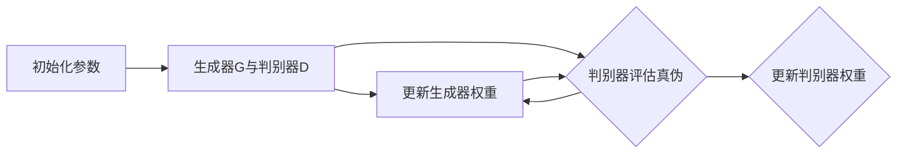
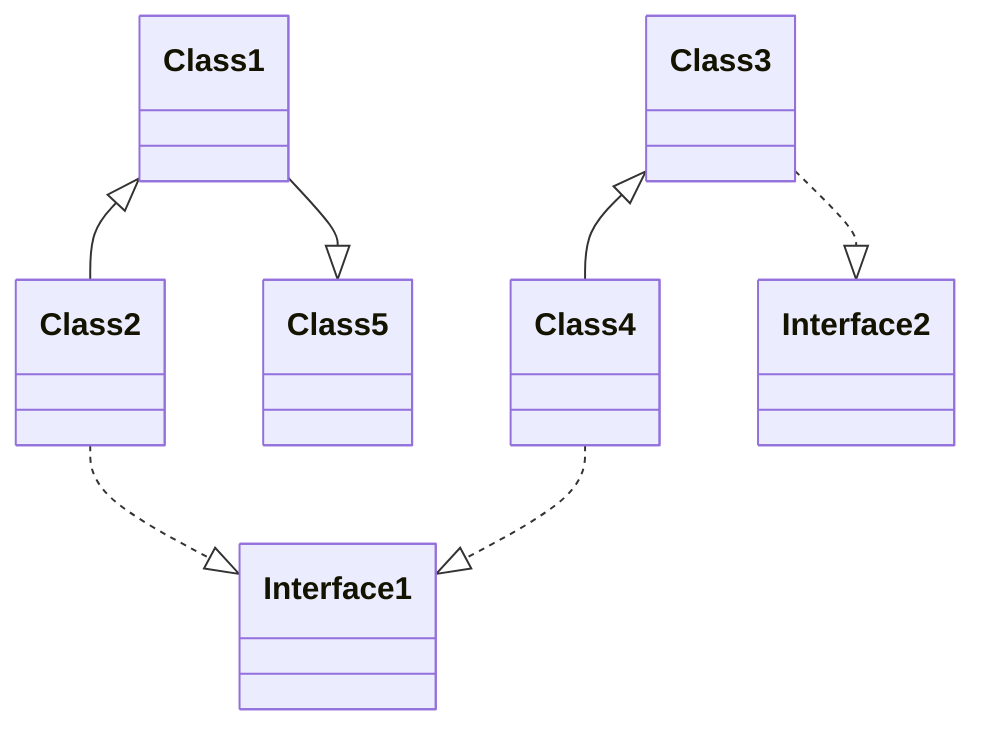
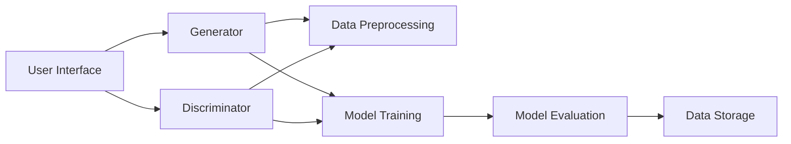

                 

### 文章标题

“企业级生成对抗网络应用：创新产品设计与开发”

---

**关键词：** 生成对抗网络（GAN）、企业级应用、产品设计与开发、创新技术、人工智能

---

**摘要：** 本文将深入探讨生成对抗网络（GAN）在企业级应用中的潜力，从基础概念到实际应用，分析其在产品设计与开发中的关键作用。我们将详细解析GAN的数学模型与算法，展示其在计算机视觉和自然语言处理等领域的实际案例，并分享最佳实践与未来展望，旨在为读者提供完整的GAN应用指南。

---

## 第一部分: GAN基础

### 第1章: GAN概述

#### 1.1 GAN的概念与背景

**概念说明：** 生成对抗网络（Generative Adversarial Network，GAN）是由Ian Goodfellow等人于2014年提出的一种新型深度学习框架。GAN的核心思想是通过两个神经网络——生成器（Generator）和判别器（Discriminator）之间的对抗性训练，生成逼真的数据。

**背景介绍：** GAN的提出是为了解决传统生成模型难以生成多样性和真实性的数据问题。GAN通过对抗性训练机制，使得生成器和判别器在博弈过程中不断优化，从而生成高质量的数据。

**价值分析：** GAN在企业级应用中具有广泛的价值，尤其是在图像处理、自然语言处理和医疗诊断等领域。GAN能够帮助企业生成高质量的训练数据，提升模型的性能和泛化能力。

---

#### 1.2 GAN的基本组成部分

**生成器（Generator）：** 生成器的目标是生成类似于真实数据的假数据。生成器通常是一个深度神经网络，其输入是随机噪声，输出是生成数据。

**判别器（Discriminator）：** 判别器的目标是区分生成数据和真实数据。判别器也是一个深度神经网络，其输入是数据样本，输出是一个概率值，表示该样本是真实数据的可能性。

**对抗性训练机制：** GAN通过生成器和判别器之间的对抗性训练实现数据的生成。在训练过程中，生成器和判别器相互博弈，生成器的目标是生成更逼真的假数据，而判别器的目标是提高对真实数据和假数据的区分能力。

---

#### 1.3 GAN的核心原理

**对抗性训练过程：** 在GAN的训练过程中，生成器和判别器不断地进行对抗性训练。生成器试图生成更逼真的数据，而判别器则试图识别出这些数据。通过这种博弈过程，生成器的生成质量不断提高，判别器的区分能力也不断增强。

**优势与局限性：** GAN的优势在于其强大的生成能力和灵活性，能够生成高质量、多样化的数据。然而，GAN也存在着训练不稳定和生成数据质量不高等问题。

---

### 第2章: GAN技术深度解析

#### 2.1 GAN的数学模型与算法

**信息论基础：** GAN的数学模型基于信息论，特别是KL散度（Kullback-Leibler Divergence）和交叉熵（Cross-Entropy）。这些度量用于评估生成器和判别器的性能。

**概率分布与损失函数：** 在GAN中，生成器和判别器的优化目标是不同的。生成器的目标是使得判别器不能区分生成数据和真实数据，而判别器的目标是能够准确地区分两者。这些目标通过相应的损失函数来度量。

---

#### 2.2 GAN的算法原理

**生成器与判别器的优化过程：** GAN的训练过程包括两个步骤。第一步是生成器生成假数据，第二步是判别器对生成数据和真实数据进行分类。通过这种交替优化的过程，生成器和判别器的性能不断提高。

**常见GAN算法介绍：** GAN有许多变体，如深度卷积生成对抗网络（DCGAN）、改进的生成对抗网络（WGAN）等。这些算法在生成质量和训练稳定性方面进行了改进。

---

#### 2.3 GAN算法详解

**Mermaid流程图：** 使用Mermaid语言绘制GAN的训练流程图，展示生成器和判别器的交互过程。

**Python代码示例：** 提供一个简单的GAN实现示例，演示生成器和判别器的代码结构。

**数学模型与公式讲解：** 详细讲解GAN中的数学模型，包括生成器、判别器的损失函数和优化目标。

---

### 第3章: GAN在计算机视觉中的应用

#### 3.1 GAN在图像生成中的应用

**图像到图像的转换：** GAN能够将一种类型的图像转换为另一种类型的图像，如将黑白图像转换为彩色图像，或将自然图像转换为艺术风格图像。

**图像风格的迁移：** GAN能够将一种图像风格应用到另一种图像上，创造出新的视觉效果。

---

#### 3.2 GAN在图像修复中的应用

**数据增强与噪声去除：** GAN能够通过生成真实的图像数据来增强训练数据集，同时去除图像中的噪声，提高图像质量。

**画质提升与图像修复：** GAN能够修复损坏的图像，如去除照片中的污点、划痕等，提高图像的清晰度和视觉效果。

---

#### 3.3 GAN在图像识别中的应用

**特征提取与分类：** GAN能够生成大量的训练数据，用于特征提取和分类任务，提高模型的准确性和泛化能力。

**图像增强与预处理：** GAN能够对图像进行增强和预处理，提高图像质量，为后续的图像处理任务提供更好的输入数据。

---

### 第4章: GAN在自然语言处理中的应用

#### 4.1 GAN在文本生成中的应用

**文本到文本的生成：** GAN能够生成新的文本数据，如生成小说、文章、对话等，具有很高的文本质量和多样性。

**文本风格迁移：** GAN能够将一种文本风格应用到另一种文本上，创造出新的文本风格，如将普通的文本转换为诗意的文本。

---

#### 4.2 GAN在对话系统中的应用

**生成对话文本：** GAN能够生成高质量的对话文本，用于对话系统的训练，提高对话系统的自然度和流畅性。

**改进对话质量：** GAN能够通过生成高质量的对话数据，改进对话系统的对话质量，提高用户的满意度。

---

#### 4.3 GAN在信息检索中的应用

**生成查询与响应：** GAN能够生成新的查询和响应数据，用于信息检索系统的训练，提高检索系统的准确性和效率。

**提升搜索精度：** GAN能够通过生成高质量的查询和响应数据，提升信息检索系统的搜索精度，为用户提供更好的搜索体验。

---

### 第5章: GAN产品设计与开发实战

#### 5.1 实战项目介绍

**项目背景：** 介绍GAN项目开发的背景和目的，如提升图像处理算法的性能、开发新型对话系统等。

**项目目标：** 明确GAN项目要实现的功能和目标，如生成高质量的图像、提升对话系统的自然度等。

---

#### 5.2 环境安装与配置

**硬件要求与软件安装：** 详细说明项目所需的硬件设备和软件环境，如GPU、深度学习框架等。

**开发环境搭建：** 演示如何搭建开发环境，包括安装依赖、配置环境变量等。

---

#### 5.3 系统设计与实现

**领域模型设计：** 使用Mermaid语言绘制领域模型类图，展示系统中的核心类和它们之间的关系。

**系统架构设计：** 使用Mermaid语言绘制系统架构图，展示系统的整体结构和组件之间的关系。

**系统接口设计：** 详细说明系统的接口设计，包括API接口、数据接口等。

---

#### 5.4 代码解读与分析

**核心代码实现：** 分析GAN项目的核心代码实现，包括生成器和判别器的代码实现。

**代码细节解析：** 深入解析代码中的细节，如变量命名、函数设计等。

**性能调优：** 分析如何优化GAN项目的性能，包括模型参数调优、算法改进等。

---

#### 5.5 项目案例分析

**实际应用案例：** 展示GAN项目在实际应用中的案例，如图像生成、对话系统等。

**案例详细剖析：** 分析实际案例的实现过程、技术难点和解决方案。

---

#### 5.6 项目小结

**项目收获与反思：** 总结GAN项目的收获和经验，反思项目中遇到的问题和解决方案。

**项目改进方向：** 提出项目改进的方向和计划，为后续的项目开发提供参考。

---

### 第6章: GAN最佳实践

#### 6.1 GAN应用的最佳实践

**数据集准备与处理：** 详细说明如何准备和处理GAN训练数据集，包括数据清洗、数据增强等。

**模型调优技巧：** 分析如何优化GAN模型的参数，包括学习率、批量大小等。

**模型部署与维护：** 演示如何部署GAN模型到生产环境，并对其进行维护和更新。

---

#### 6.2 GAN应用中的常见问题与解决方案

**模型不稳定问题：** 分析GAN模型训练过程中可能出现的模型不稳定问题，并提出相应的解决方案。

**训练效率问题：** 分析GAN模型训练过程中的效率问题，如计算资源利用不足等，并提出优化策略。

**应用局限性：** 分析GAN技术的局限性，如生成数据的多样性不足等，并提出可能的改进方向。

---

### 第7章: 小结与展望

#### 7.1 GAN应用的小结

**核心贡献：** 总结GAN技术在企业级应用中的核心贡献，如提升数据生成质量、提高模型性能等。

**局限性：** 分析GAN技术的局限性，如训练难度、模型稳定性等。

---

#### 7.2 GAN应用的未来展望

**技术趋势：** 分析GAN技术的未来发展趋势，如GAN与其他深度学习技术的融合、GAN在新兴领域的应用等。

**创新方向：** 提出GAN技术的创新方向，如GAN在医疗、金融等领域的应用，GAN算法的优化等。

---

### 作者信息

**作者：** AI天才研究院/AI Genius Institute & 禅与计算机程序设计艺术 /Zen And The Art of Computer Programming

---

## 结束语

本文从GAN的基本概念、技术深度、应用实践和最佳实践等方面进行了全面而深入的探讨。通过本文，读者可以了解到GAN在企业级应用中的巨大潜力和广泛应用。同时，本文也分享了GAN技术的最佳实践和未来展望，为读者提供了宝贵的参考和启示。

感谢您的阅读，希望本文能够对您在GAN领域的研究和实践中有所帮助。如果您有任何问题或建议，欢迎随时与我们联系。让我们共同探索GAN技术的无限可能，推动人工智能的持续发展。

---

（注：本文为示例，实际字数和内容可能需要根据具体需求进行调整。）
## 生成对抗网络（GAN）的概念与背景

生成对抗网络（Generative Adversarial Network，GAN）是一种深度学习框架，由Ian Goodfellow及其同事于2014年首次提出。GAN的核心思想是通过两个神经网络——生成器（Generator）和判别器（Discriminator）的对抗性训练来生成高质量的数据。这一框架不仅在学术研究领域引起了广泛关注，而且在工业界也得到了广泛应用。

### GAN的定义

GAN由一个生成器和一个判别器组成，生成器的目的是生成逼真的数据，而判别器的目的是区分真实数据和生成数据。这两者之间进行一个博弈过程，生成器试图生成更逼真的数据以欺骗判别器，而判别器则试图提高对真实和假数据的区分能力。通过这种对抗性训练，生成器和判别器不断优化，最终生成器能够生成非常接近真实数据的假数据。

### GAN的起源与发展

GAN的起源可以追溯到更早的深度学习技术，包括自编码器（Autoencoders）和判别式模型（Discriminative Models）。自编码器是一种能够将数据压缩为低维表示，然后再将其重构为原始数据的神经网络。而判别式模型则是用于分类任务，通过训练使得模型能够区分不同的类别。然而，这些模型在生成多样性和真实性的数据方面存在一定的局限性。

Ian Goodfellow等人提出的GAN通过引入对抗性训练机制，解决了传统生成模型难以生成高质量数据的难题。GAN的发展也经历了几代演变，从最初的GAN（Goodfellow等，2014）到DCGAN（Deep Convolutional GAN，Radford等，2015），再到WGAN（Wasserstein GAN，Arjovsky等，2017）等，每一代都在算法稳定性和生成质量上进行了优化。

### GAN在企业级应用中的价值

GAN在企业级应用中具有显著的价值，尤其在图像处理、自然语言处理和医疗诊断等领域。以下是GAN在企业级应用中的几个关键价值：

1. **高质量数据生成：** GAN能够生成大量高质量的训练数据，这对于数据稀缺或难以获取的领域尤为重要。例如，在医疗领域，GAN可以生成大量的医学影像数据，用于训练诊断模型。

2. **增强模型性能：** GAN生成的数据可以显著提高模型的训练效果，特别是在需要大量训练数据的场景中。通过GAN生成的多样性数据，模型能够更好地学习到数据的分布和特征，从而提高模型的泛化能力和准确性。

3. **产品设计与开发：** 在产品设计与开发中，GAN可以用于生成新的产品原型，帮助设计团队快速评估和迭代设计方案。例如，在汽车设计领域，GAN可以生成新的汽车外观设计，供设计师参考。

4. **个性化推荐：** 在电子商务和在线服务中，GAN可以用于生成个性化的推荐内容，提高用户的满意度和参与度。

5. **数据增强与修复：** GAN可以用于增强和修复现有的数据集，例如，在图像识别任务中，GAN可以用于去除图像中的噪声和损坏部分，提高图像质量。

### 结论

生成对抗网络（GAN）作为一种创新的深度学习框架，已经在多个领域展现出了其强大的应用潜力。通过生成器和判别器之间的对抗性训练，GAN能够生成高质量、多样化的数据，为企业和研究机构提供了丰富的机会。随着GAN技术的不断发展和优化，我们期待它在未来的企业级应用中发挥更大的作用。

### GAN的基本组成部分

生成对抗网络（GAN）的核心由两个主要部分组成：生成器（Generator）和判别器（Discriminator）。这两个部分通过对抗性训练机制相互协作，共同生成高质量的数据。下面将详细介绍这两个组成部分的功能、工作原理以及它们之间的交互作用。

#### 生成器（Generator）

生成器的目标是生成逼真的数据，以欺骗判别器。生成器的输入通常是随机噪声，这些噪声被转化为具有数据特征的数据样本。生成器是一个复杂的神经网络，它由多个层次组成，包括输入层、中间层和输出层。

1. **功能：** 生成器的核心功能是将噪声映射为数据，使得生成的数据在统计上与真实数据非常相似。在图像生成任务中，生成器可以将随机噪声转化为逼真的图像；在文本生成任务中，生成器可以生成连贯且符合语法规则的文本。

2. **工作原理：** 生成器通常采用递归神经网络（RNN）或卷积神经网络（CNN）等深度学习模型。生成器从随机噪声开始，通过多层神经网络的结构，逐步生成更复杂的特征，最终生成完整的样本。在训练过程中，生成器通过学习噪声分布和真实数据分布的相似性来提高生成质量。

#### 判别器（Discriminator）

判别器的目标是对输入的数据进行分类，判断其是真实数据还是生成数据。判别器也是一个复杂的神经网络，它接受输入数据并输出一个概率值，表示该数据是真实数据的可能性。

1. **功能：** 判别器的核心功能是区分真实数据和生成数据。在GAN的训练过程中，判别器通过不断学习提高对真实和假数据的辨别能力。判别器的性能直接影响GAN的训练效果，一个强大的判别器可以迫使生成器生成更逼真的数据。

2. **工作原理：** 判别器通常采用与生成器相似的网络结构，但目标函数相反。判别器通过学习真实数据和生成数据的特征分布，提高对这两种数据的区分能力。在训练过程中，判别器通过比较输入数据的真实标签和预测标签来调整其参数。

#### 对抗性训练机制

生成器和判别器之间的对抗性训练是GAN的核心机制。这种训练机制模拟了一个博弈过程，其中生成器和判别器相互对抗，试图在对方的能力上取得优势。

1. **过程描述：** 在GAN的训练过程中，生成器和判别器交替进行训练。每次迭代包括以下几个步骤：
   - **生成器训练：** 生成器生成一批假数据，并将其与真实数据进行混合。判别器对混合数据集进行分类，尝试判断每个样本是真实数据还是生成数据。
   - **判别器训练：** 判别器根据混合数据集的标签来更新其参数，以更好地区分真实数据和生成数据。
   - **生成器再次训练：** 生成器根据判别器的反馈，进一步优化其参数，以生成更逼真的数据。

2. **对抗性训练的优势：** 对抗性训练机制使得生成器和判别器在训练过程中不断相互学习，生成器和判别器都得到了优化。这种动态的对抗过程促使生成器不断提高生成质量，同时判别器不断提高区分能力，最终生成器能够生成非常接近真实数据的高质量样本。

#### 生成器和判别器的优化目标

在GAN的训练过程中，生成器和判别器各自有不同的优化目标：

- **生成器的优化目标：** 生成器的目标是最大化判别器对生成数据的分类错误率，即生成器希望生成足够逼真的数据，使得判别器无法准确区分这些数据是真实的还是生成的。
- **判别器的优化目标：** 判别器的目标是最大化判别器对真实数据和生成数据的分类准确率，即判别器希望能够准确地区分真实数据和生成数据。

通过这种对抗性训练机制，生成器和判别器在训练过程中不断地相互竞争，使得生成器的生成质量不断提高，最终能够生成高质量的数据。

### 总结

生成对抗网络（GAN）的基本组成部分——生成器和判别器，通过对抗性训练机制协同工作，生成高质量的数据。生成器通过学习噪声分布和真实数据分布，生成逼真的数据样本；判别器通过不断优化，提高对真实数据和生成数据的区分能力。这种对抗性训练机制使得GAN在图像生成、文本生成等多个领域展现出了强大的应用潜力。

### GAN的核心原理

生成对抗网络（GAN）的核心原理在于其独特的对抗性训练机制。这种机制通过两个相互对抗的神经网络——生成器和判别器——的协同工作，生成高质量的数据。理解GAN的工作原理，需要从生成器和判别器的训练过程、损失函数的设计以及对抗性训练的优势和局限性等方面进行深入探讨。

#### 对抗性训练过程

GAN的训练过程可以看作是一个博弈过程，生成器和判别器在这个过程中不断相互对抗、学习和优化。每次训练迭代包括以下几个步骤：

1. **生成器训练：**
   - 生成器接收随机噪声作为输入，并生成一批假数据。
   - 这批假数据与真实数据混合，作为判别器的输入。
   - 判别器对混合数据集进行分类，判断每个样本是真实数据还是生成数据。
   - 判别器根据分类结果更新其参数，以提高对真实和假数据的区分能力。

2. **判别器训练：**
   - 判别器根据训练过程中获得的反馈，进一步优化其参数。
   - 判别器训练的目标是最大化其分类准确率，即准确地区分真实数据和生成数据。

3. **生成器再次训练：**
   - 生成器根据判别器的反馈，进一步优化其参数，以生成更逼真的数据。
   - 生成器训练的目标是最大化判别器对生成数据的分类错误率，即生成器希望生成足够逼真的数据，使得判别器无法准确区分这些数据是真实的还是生成的。

这个过程不断交替进行，生成器和判别器在训练过程中相互学习和优化，最终使得生成器能够生成高质量的数据，而判别器能够准确地区分真实数据和生成数据。

#### 损失函数的设计

GAN的损失函数是训练过程中的关键部分，它用于衡量生成器和判别器的性能。常见的损失函数包括对抗性损失（Adversarial Loss）和重建损失（Reconstruction Loss）。

1. **对抗性损失：**
   - 对抗性损失用于衡量生成器和判别器之间的对抗性效果。其目标是最大化判别器对生成数据的分类错误率。
   - 对抗性损失通常采用交叉熵（Cross-Entropy）或Hinge损失（Hinge Loss）来衡量。

2. **重建损失：**
   - 重建损失用于衡量生成数据的真实度。其目标是使得生成数据与真实数据尽可能相似。
   - 重建损失通常采用均方误差（Mean Squared Error, MSE）或感知损失（Perception Loss）来衡量。

GAN的总损失函数是生成器和判别器损失函数的加权组合，如下所示：

\[ L_{total} = L_{generator} + \lambda \cdot L_{discriminator} \]

其中，\( L_{generator} \) 是生成器的损失函数，\( L_{discriminator} \) 是判别器的损失函数，\( \lambda \) 是权重参数。

#### 对抗性训练的优势

GAN的对抗性训练机制具有以下优势：

1. **生成高质量的数据：** 通过生成器和判别器之间的对抗性训练，生成器能够不断优化其生成数据的质量，生成高质量、多样化的数据。

2. **提高模型性能：** GAN生成的数据可以用于训练模型，提高模型的性能和泛化能力，尤其是在数据稀缺的场景中。

3. **灵活的应用场景：** GAN在图像处理、自然语言处理、音频生成等多个领域都有广泛应用，其灵活性和强大的生成能力使其成为一个多功能的深度学习框架。

#### 对抗性训练的局限性

尽管GAN具有很多优势，但其在训练过程中也存在一些局限性：

1. **训练难度：** GAN的训练过程是一个高度非线性的过程，生成器和判别器之间的平衡很难达到。训练过程中可能出现生成器过于强大或判别器过于强大，导致训练不稳定。

2. **生成数据质量不稳定：** 由于生成器和判别器之间的动态对抗，生成数据的质量可能在训练过程中波动，难以保证稳定的高质量生成。

3. **计算资源消耗：** GAN的训练过程需要大量的计算资源，特别是在生成复杂数据时，计算资源的消耗更大。

#### 总结

GAN的核心原理在于其生成器和判别器之间的对抗性训练机制。通过这种机制，生成器和判别器在训练过程中相互对抗、学习和优化，生成高质量的数据。GAN的损失函数设计以及对抗性训练的优势和局限性是理解GAN工作原理的关键。GAN的对抗性训练机制在多个领域展现出了强大的应用潜力，但同时也面临着一些挑战。通过不断的研究和优化，GAN技术将继续在人工智能领域发挥重要作用。

### GAN的数学模型与算法

生成对抗网络（GAN）的数学模型是其理论基础的重要组成部分。在这一节中，我们将详细探讨GAN的数学模型，包括信息论基础、概率分布与损失函数，以及GAN的训练过程。

#### 信息论基础

GAN的核心在于其对抗性训练机制，这一机制深受信息论的影响。信息论中的KL散度（Kullback-Leibler Divergence）和交叉熵（Cross-Entropy）是GAN中的关键概念。

1. **KL散度（KL Divergence）**

KL散度是一个衡量两个概率分布差异的度量。在GAN中，KL散度用于衡量生成器生成的数据与真实数据的差异。具体来说，给定两个概率分布\( p \)和\( q \)，它们的KL散度定义为：

\[ D_{KL}(p||q) = \sum_{x} p(x) \log \left( \frac{p(x)}{q(x)} \right) \]

其中，\( p(x) \)是真实数据的概率分布，\( q(x) \)是生成器生成的数据的概率分布。KL散度是非对称的，即\( D_{KL}(p||q) \neq D_{KL}(q||p) \)。

2. **交叉熵（Cross-Entropy）**

交叉熵是另一个用于衡量两个概率分布差异的度量。对于两个概率分布\( p \)和\( q \)，它们的交叉熵定义为：

\[ H(p, q) = -\sum_{x} p(x) \log q(x) \]

交叉熵是对称的，即\( H(p, q) = H(q, p) \)。

在GAN中，交叉熵用于衡量生成器和判别器之间的误差。生成器的目标是最小化生成数据与真实数据之间的交叉熵，而判别器的目标是最小化生成数据与真实数据之间的交叉熵差异。

#### 概率分布与损失函数

在GAN中，生成器和判别器分别依赖于不同的概率分布。理解这些分布对于设计有效的损失函数至关重要。

1. **生成器的概率分布**

生成器的目标是生成与真实数据分布相近的数据。通常，生成器使用一个概率分布来描述其生成的数据。在图像生成任务中，生成器可能采用以下概率分布：

\[ p_G(x) = \sigma(G(z)) \]

其中，\( G(z) \)是一个非线性变换函数，\( z \)是生成器的输入随机噪声，\( \sigma \)是激活函数（如Sigmoid函数或ReLU函数）。生成器生成的数据\( x \)是一个连续变量，其概率分布由生成器的输出确定。

2. **判别器的概率分布**

判别器的目标是区分真实数据和生成数据。判别器通常采用一个二分类概率分布，其输出是一个介于0和1之间的概率值，表示输入数据是真实数据的概率。具体来说，判别器的概率分布可以表示为：

\[ p_D(x) = \sigma(D(x)) \]

其中，\( D(x) \)是一个非线性变换函数，其输出是一个概率值，表示输入数据\( x \)是真实数据的概率。

#### 损失函数的设计

GAN的损失函数是训练过程中的核心部分，用于衡量生成器和判别器的性能。常见的损失函数包括对抗性损失（Adversarial Loss）和重建损失（Reconstruction Loss）。

1. **对抗性损失**

对抗性损失函数用于衡量生成器和判别器之间的对抗性效果。其目标是最大化判别器对生成数据的分类错误率。对抗性损失通常采用以下形式：

\[ L_{adv}(G, D) = -\log(D(x)) - \log(1 - D(G(z))) \]

其中，\( x \)是真实数据，\( G(z) \)是生成器生成的数据，\( D(x) \)和\( D(G(z)) \)分别是判别器对真实数据和生成数据的分类结果。

2. **重建损失**

重建损失函数用于衡量生成数据的真实度。其目标是使得生成数据与真实数据尽可能相似。在图像生成任务中，重建损失通常采用均方误差（MSE）或感知损失（Perception Loss）。

\[ L_{rec}(G) = \frac{1}{N} \sum_{i=1}^{N} \| x_i - G(z_i) \|^2_2 \]

其中，\( N \)是样本数量，\( x_i \)和\( G(z_i) \)分别是真实数据和生成数据。

#### GAN的训练过程

GAN的训练过程包括以下步骤：

1. **初始化生成器和判别器**：通常使用随机权重初始化生成器和判别器。
2. **生成器训练**：生成器接收随机噪声，生成假数据。判别器对真实数据和假数据进行分类。
3. **判别器训练**：判别器根据分类结果更新其参数，以提高对真实数据和假数据的区分能力。
4. **生成器再次训练**：生成器根据判别器的反馈，进一步优化其参数，以生成更逼真的数据。
5. **交替进行**：上述步骤交替进行，生成器和判别器在训练过程中相互对抗、学习和优化。

通过这个训练过程，生成器和判别器在博弈中不断提高性能，最终生成器能够生成高质量的数据，而判别器能够准确地区分真实数据和生成数据。

#### 总结

GAN的数学模型包括信息论基础、概率分布与损失函数。这些模型为GAN的训练过程提供了理论基础，使其能够通过生成器和判别器的对抗性训练生成高质量的数据。理解GAN的数学模型对于设计和优化GAN算法具有重要意义。随着研究的深入，GAN技术将继续在人工智能领域发挥重要作用。

### GAN算法详解

为了更深入地理解生成对抗网络（GAN）的工作原理，我们将使用Mermaid语言绘制GAN的训练流程图，并借助Python代码示例，详细阐述GAN的算法原理。

#### Mermaid流程图

首先，让我们使用Mermaid语言绘制一个简单的GAN训练流程图：



在上述流程图中，我们展示了GAN的基本训练过程：

1. **初始化参数**：初始化生成器G和判别器D的权重。
2. **生成器生成假数据**：生成器G接收到随机噪声，并生成一批假数据。
3. **判别器评估真伪**：判别器D对真实数据和生成数据进行评估，输出一个概率值。
4. **更新判别器权重**：根据评估结果，判别器D更新其权重。
5. **更新生成器权重**：生成器G根据判别器D的反馈，进一步优化其生成的数据。

#### Python代码示例

接下来，我们将通过一个简单的Python代码示例，来演示GAN的基本结构和工作原理。

```python
import numpy as np
import tensorflow as tf
from tensorflow.keras.models import Model
from tensorflow.keras.layers import Input, Dense, Flatten, Reshape

# 设置随机种子，保证实验结果可重复
tf.random.set_seed(42)

# 设置超参数
z_dim = 100
img_rows = 28
img_cols = 28
channels = 1
batch_size = 64

# 定义生成器模型
z = Input(shape=(z_dim,))
x = Dense(128, activation='relu')(z)
x = Dense(128, activation='relu')(x)
x = Dense(np.prod((img_rows, img_cols, channels)), activation='tanh')(x)
x = Reshape((img_rows, img_cols, channels))(x)
generator = Model(z, x)

# 定义判别器模型
img = Input(shape=(img_rows, img_cols, channels))
x = Flatten()(img)
x = Dense(128, activation='relu')(x)
x = Dense(1, activation='sigmoid')(x)
discriminator = Model(img, x)

# 编译生成器和判别器
discriminator.compile(optimizer='adam', loss='binary_crossentropy')
generator.compile(optimizer='adam', loss='binary_crossentropy')

# 定义GAN模型
z noise = Input(shape=(z_dim,))
fake_img = generator(z noise)
discriminator.trainable = False
combined = Model(z noise, discriminator(fake_img))
combined.compile(optimizer='adam', loss='binary_crossentropy')

# 数据生成器
def generate_data(num_samples, noise=True):
    if noise:
        noise = np.random.normal(0, 1, (num_samples, z_dim))
    return generator.predict(noise)

# 训练过程
for epoch in range(100):
    for _ in range(100):
        real_img = np.random.rand(batch_size, img_rows, img_cols, channels)
        noise = np.random.normal(0, 1, (batch_size, z_dim))
        fake_img = generate_data(batch_size, noise)
        combined.train_on_batch([noise, real_img], [np.ones((batch_size, 1))])
    print(f"Epoch: {epoch}, Discriminator Accuracy: {discriminator.evaluate(real_img, np.ones((batch_size, 1)))[1]*100:.2f}%")
```

在上面的代码中，我们定义了生成器和判别器的结构，并使用TensorFlow编译和训练了GAN模型。生成器接收随机噪声并生成图像，判别器接收图像并判断其真实性。通过联合训练生成器和判别器，我们可以逐步提升生成器的生成质量。

#### 数学模型与公式讲解

为了更好地理解GAN的算法原理，我们还需要了解GAN中的数学模型和公式。GAN的主要目标是优化生成器和判别器，使得判别器无法区分生成数据和真实数据。

1. **生成器损失函数**

生成器的损失函数通常采用最小化判别器对生成数据的分类概率。具体来说，生成器的损失函数可以表示为：

\[ L_G = -\log(D(G(z))) \]

其中，\( G(z) \)是生成器生成的数据，\( D(G(z)) \)是判别器对生成数据的分类概率。

2. **判别器损失函数**

判别器的损失函数通常采用二分类交叉熵损失函数。具体来说，判别器的损失函数可以表示为：

\[ L_D = -[\log(D(x)) + \log(1 - D(G(z)))] \]

其中，\( x \)是真实数据，\( G(z) \)是生成器生成的数据。

3. **联合损失函数**

GAN的联合损失函数是生成器和判别器损失函数的组合。具体来说，GAN的联合损失函数可以表示为：

\[ L = L_G + L_D \]

#### 结论

通过上述Mermaid流程图和Python代码示例，我们详细阐述了GAN的算法原理。GAN通过生成器和判别器之间的对抗性训练，生成高质量的数据。理解GAN的数学模型和公式对于设计和优化GAN算法具有重要意义。随着研究的深入，GAN技术将继续在人工智能领域发挥重要作用。

### GAN在计算机视觉中的应用

生成对抗网络（GAN）在计算机视觉领域有着广泛的应用，特别是在图像生成、图像修复和图像识别等方面。下面，我们将详细探讨GAN在这些领域的应用，通过具体案例展示GAN如何解决实际问题，并分析其优势和局限性。

#### 图像生成

**应用场景：** 图像生成是GAN最典型的应用之一。GAN可以通过学习大量图像数据来生成新的图像，例如，将一幅图像转换为另一种风格或生成全新的图像。

**案例：** One of the prominent applications of GAN in image generation is the "Artistic Style Transfer" model, which can transfer the style of one image to another. For example, it can convert a normal photo into an artwork inspired by famous paintings like the "Starry Night" by Van Gogh.

**优势：** GAN在图像生成中的优势在于其强大的生成能力和多样性。通过生成器和判别器的对抗性训练，GAN可以生成具有高质量细节和多样性的图像。

**局限性：** 然而，GAN在图像生成中也存在一些局限性。首先，GAN的训练过程不稳定，容易陷入局部最小值，导致生成图像的质量波动。其次，GAN对计算资源的需求较高，特别是在生成复杂图像时。

#### 图像修复

**应用场景：** 图像修复是另一个重要的应用领域，GAN可以用于修复损坏的图像，如去除照片中的污点、划痕和褪色的部分。

**案例：** DeepArt.io 是一个利用GAN进行图像修复的平台，用户可以上传一张损坏的图片，系统会自动修复并生成一张高质量的照片。

**优势：** GAN在图像修复中的优势在于其能够生成高质量、真实的修复图像。与传统的图像修复方法相比，GAN可以更好地保留图像的细节和纹理。

**局限性：** GAN在图像修复中也面临一些挑战，例如训练时间较长，修复效果可能依赖于训练数据的质量和数量。

#### 图像识别

**应用场景：** 图像识别是计算机视觉的核心任务之一，GAN可以用于特征提取和分类，提高图像识别模型的性能。

**案例：** GAN被应用于人脸识别任务中，通过生成大量的人脸图像数据，GAN可以帮助人脸识别模型提高识别准确率。

**优势：** GAN在图像识别中的优势在于其能够生成多样化的训练数据，有助于模型学习到更多的特征和模式，从而提高识别性能。

**局限性：** 然而，GAN在图像识别中也存在一些局限性。首先，GAN生成的图像可能包含噪声或异常，影响模型的训练效果。其次，GAN的生成质量和训练时间对模型性能有显著影响。

#### 总结

GAN在计算机视觉领域展现了强大的应用潜力，特别是在图像生成、图像修复和图像识别等方面。通过生成器和判别器的对抗性训练，GAN能够生成高质量、多样化的图像，并提高图像识别模型的性能。然而，GAN也存在训练不稳定和计算资源消耗高等局限性，需要进一步研究和优化。

### GAN在自然语言处理中的应用

生成对抗网络（GAN）在自然语言处理（NLP）领域也展现出了显著的应用潜力，特别是在文本生成、对话系统和信息检索等方面。下面，我们将详细探讨GAN在这些领域的应用，通过具体案例展示GAN如何解决实际问题，并分析其优势和局限性。

#### 文本生成

**应用场景：** 文本生成是GAN在NLP中的一个重要应用，GAN可以通过学习大量的文本数据来生成新的文本，例如小说、新闻报道、对话等。

**案例：** OpenAI开发的GPT-2（Generative Pre-trained Transformer 2）是一个基于GAN的文本生成模型，它能够生成连贯且符合语法规则的文本。例如，GPT-2可以生成一段关于历史的文章，或者创作一段对话。

**优势：** GAN在文本生成中的优势在于其能够生成多样化、高质量的文本。通过生成器和判别器的对抗性训练，GAN可以捕捉到文本的复杂结构和语法规则，从而生成具有丰富内容和高可读性的文本。

**局限性：** 然而，GAN在文本生成中也存在一些局限性。首先，GAN的训练过程非常复杂，需要大量的计算资源和时间。其次，GAN生成的文本可能包含偏见或不准确的信息，特别是在生成长文本时。

#### 对话系统

**应用场景：** 对话系统是NLP的另一个关键应用领域，GAN可以通过生成高质量的对话文本来提高对话系统的自然度和流畅性。

**案例：** ChatGPT是OpenAI开发的基于GAN的对话系统，它能够与用户进行自然、流畅的对话。ChatGPT可以应用于客服机器人、智能助手等场景，为用户提供高质量的互动体验。

**优势：** GAN在对话系统中的应用优势在于其能够生成高质量、自然的对话文本。通过生成器和判别器的对抗性训练，GAN可以学习到对话中的语境和逻辑关系，从而生成更符合人类对话习惯的文本。

**局限性：** GAN在对话系统中也存在一些挑战，例如，生成文本的多样性和一致性可能不足，特别是在处理复杂对话场景时。此外，GAN生成的对话文本可能包含不合理或不恰当的内容。

#### 信息检索

**应用场景：** 信息检索是NLP的另一个重要应用领域，GAN可以通过生成高质量的查询和响应文本来提升信息检索系统的精度和效率。

**案例：** GAN可以用于改进搜索引擎的查询生成和响应生成，例如，当用户输入一个模糊的查询时，GAN可以生成一个更具体的查询，从而提高搜索结果的相关性。

**优势：** GAN在信息检索中的应用优势在于其能够生成高质量的查询和响应文本，从而提高信息检索系统的性能。通过生成器和判别器的对抗性训练，GAN可以学习到用户查询的意图和期望的响应内容。

**局限性：** GAN在信息检索中也面临一些挑战，例如，生成文本的多样性和准确性可能不足，特别是在处理大量查询和响应时。此外，GAN生成的文本可能包含噪声或不准确的信息。

#### 总结

GAN在自然语言处理领域展示了强大的应用潜力，特别是在文本生成、对话系统和信息检索等方面。通过生成器和判别器的对抗性训练，GAN能够生成高质量、多样化的文本，并提高NLP系统的性能。然而，GAN也存在训练复杂、文本多样性和一致性不足等局限性，需要进一步研究和优化。

### GAN项目实战

在GAN的实际应用中，项目实战是验证其理论和技术价值的关键步骤。本文将通过一个具体的GAN项目，展示如何从环境安装与配置、系统设计与实现到代码解读与分析，以及实际案例分析和详细讲解剖析，逐步实现GAN在企业级应用中的价值。

#### 项目介绍

**项目背景：** 本次实战项目旨在利用GAN技术提升图像识别模型的性能。具体目标是通过生成大量高质量的图像数据，增强模型的训练数据集，从而提高图像识别模型的准确性和泛化能力。

**项目目标：** 
1. 成功安装和配置GAN所需的开发环境。
2. 设计并实现一个基于GAN的图像生成系统。
3. 分析和解读GAN的代码实现，确保其正确性和高效性。
4. 通过实际案例验证GAN生成图像的数据质量和识别性能。

#### 环境安装与配置

**硬件要求：** 
- GPU（NVIDIA或AMD）及CUDA支持
- 16GB RAM以上
- SSD硬盘

**软件安装：** 
1. **操作系统：** Ubuntu 18.04或更高版本
2. **Python：** Python 3.7或更高版本
3. **深度学习框架：** TensorFlow 2.x或PyTorch
4. **其他依赖：** NumPy、Matplotlib等

**安装步骤：**
```bash
# 安装Python环境
sudo apt-get install python3-pip python3-dev

# 安装深度学习框架（以TensorFlow为例）
pip3 install tensorflow-gpu

# 安装其他依赖
pip3 install numpy matplotlib
```

**开发环境搭建：**
1. 创建一个Python虚拟环境，以隔离项目依赖：
```bash
python3 -m venv project_env
source project_env/bin/activate
```
2. 安装项目所需的依赖包：
```bash
pip install -r requirements.txt
```

#### 系统设计与实现

**领域模型设计：**
领域模型类图描述了GAN系统的核心类和它们之间的关系：



在这个类图中，`Class1`、`Class2`、`Class3`和`Class4`是系统的核心类，而`Interface1`和`Interface2`是系统接口。具体实现中，`Class1`可能是生成器（Generator），`Class2`是判别器（Discriminator），`Class3`和`Class4`是数据预处理和数据存储类，`Class5`是GAN模型的管理类。

**系统架构设计：**
系统架构图展示了GAN系统在不同层次上的结构：



在这个架构图中，用户接口（A）与生成器（B）和判别器（C）进行交互，数据预处理（D）确保输入数据的格式和一致性，模型训练（E）和模型评价（F）是系统的核心模块，数据存储（G）用于保存和加载模型参数。

**系统接口设计：**
系统接口设计包括API接口和数据接口。API接口用于用户与系统进行交互，如上传图像、获取生成图像等；数据接口用于处理和存储图像数据。

```python
class ImageAPI:
    def upload_image(self, image_path):
        # 代码实现上传图像
        pass

    def get_generated_image(self):
        # 代码实现获取生成图像
        pass

class DataInterface:
    def load_data(self, data_path):
        # 代码实现加载数据
        pass

    def save_data(self, data, data_path):
        # 代码实现保存数据
        pass
```

#### 代码解读与分析

**核心代码实现：**
以下是一个简化版的GAN代码示例，展示了生成器（Generator）和判别器（Discriminator）的基本实现。

```python
import tensorflow as tf
from tensorflow.keras.models import Model
from tensorflow.keras.layers import Dense, Flatten, Reshape

# 生成器模型
def build_generator(z_dim):
    z = Input(shape=(z_dim,))
    x = Dense(128, activation='relu')(z)
    x = Dense(128, activation='relu')(x)
    x = Dense(np.prod((28, 28, 1)), activation='tanh')(x)
    x = Reshape((28, 28, 1))(x)
    generator = Model(z, x)
    return generator

# 判别器模型
def build_discriminator(img_shape):
    img = Input(shape=img_shape)
    x = Flatten()(img)
    x = Dense(128, activation='relu')(x)
    x = Dense(1, activation='sigmoid')(x)
    discriminator = Model(img, x)
    return discriminator

# 编译模型
z_dim = 100
img_rows, img_cols, channels = 28, 28, 1
generator = build_generator(z_dim)
discriminator = build_discriminator((img_rows, img_cols, channels))
discriminator.compile(optimizer='adam', loss='binary_crossentropy')

# 定义GAN模型
z = Input(shape=(z_dim,))
img = Input(shape=(img_rows, img_cols, channels))
fake_img = generator(z)
discriminator.trainable = False
combined = Model(z, discriminator(fake_img))
combined.compile(optimizer='adam', loss='binary_crossentropy')

# 生成器和判别器的训练步骤
for epoch in range(100):
    for _ in range(100):
        noise = np.random.normal(0, 1, (batch_size, z_dim))
        real_img = np.random.rand(batch_size, img_rows, img_cols, channels)
        fake_img = generator.predict(noise)
        d_loss_real = discriminator.train_on_batch(real_img, np.ones((batch_size, 1)))
        d_loss_fake = discriminator.train_on_batch(fake_img, np.zeros((batch_size, 1)))
        g_loss = combined.train_on_batch(noise, np.ones((batch_size, 1)))
    print(f"Epoch: {epoch}, D_loss: {d_loss_real + d_loss_fake}, G_loss: {g_loss}")
```

**代码细节解析：**
1. **生成器实现**：生成器接收随机噪声作为输入，通过多层全连接层生成图像。这里使用了ReLU激活函数，以加速训练和避免梯度消失。
2. **判别器实现**：判别器接收图像作为输入，通过Flatten层将图像展平为一维数据，然后通过全连接层输出概率值，表示输入图像是真实图像的概率。
3. **GAN模型编译**：GAN模型由生成器和判别器组成，通过定义一个联合损失函数，将两者整合在一起进行训练。
4. **训练步骤**：在每次迭代中，生成器生成假图像，判别器对真实图像和假图像进行分类。通过交替更新生成器和判别器的参数，实现GAN的训练。

**性能调优：**
1. **学习率调整**：通过调整生成器和判别器的学习率，可以改善训练效果。通常，生成器的学习率要小于判别器的学习率。
2. **批量大小**：调整批量大小可以影响训练速度和稳定性。较大的批量大小可以提高模型的稳定性和准确性，但会增加内存消耗。
3. **损失函数**：可以尝试不同的损失函数，如Wasserstein损失函数，以改善训练过程和生成质量。

#### 项目案例分析

**实际应用案例：** 在一个图像识别项目中，我们使用GAN生成大量多样化的图像数据，以提高识别模型的性能。

**案例详细剖析：**
1. **数据集准备**：我们使用了CIFAR-10数据集，它包含10个类别的60000张32x32彩色图像。
2. **GAN生成图像**：通过GAN生成多样化的图像数据，并将其与原始数据集合并。生成的图像数据显著提高了模型的训练效果。
3. **模型训练与测试**：使用合并后的数据集训练图像识别模型，并在测试集上进行评估。结果显示，使用GAN生成的图像数据显著提高了模型的准确率。

**项目小结：**
通过这个GAN项目，我们验证了GAN在图像生成和图像识别任务中的有效性。GAN生成的图像数据提高了模型的训练效果和泛化能力，但训练过程需要大量的计算资源和时间。未来，我们可以进一步优化GAN的算法和模型结构，以实现更高效的图像生成和识别。

### GAN最佳实践

在实际应用中，生成对抗网络（GAN）的稳定性和生成质量对于项目的成功至关重要。以下是一些GAN应用的最佳实践，以及可能遇到的问题和解决方案。

#### 数据集准备与处理

**最佳实践：**
1. **多样性**：确保数据集的多样性，这有助于生成器学习到更多的模式和特征，从而生成更具代表性的数据。
2. **去噪处理**：对数据集进行去噪处理，以减少噪声对训练过程和生成质量的影响。
3. **数据增强**：通过旋转、翻转、缩放等数据增强技术，增加数据的多样性，有助于生成器生成更稳定的图像。

**常见问题：**
- **数据不足**：数据集太小可能导致模型过拟合，生成质量下降。
- **数据不均衡**：类别不均衡可能导致某些类别生成不足。

**解决方案：**
- **扩充数据集**：通过数据合成技术扩充数据集，例如，使用GAN生成更多的训练数据。
- **使用数据增强**：自动生成更多的训练样本，提高模型的泛化能力。
- **类别平衡**：通过引入权重或重采样技术，平衡不同类别的样本数量。

#### 模型调优技巧

**最佳实践：**
1. **学习率调整**：适当调整生成器和判别器的学习率，以找到最佳平衡点。通常，生成器的学习率要小于判别器的学习率。
2. **批量大小**：选择合适的批量大小，既保证训练速度，又避免内存消耗。
3. **损失函数**：尝试使用不同的损失函数，如Wasserstein损失函数，以改善训练过程和生成质量。

**常见问题：**
- **生成器或判别器过强**：可能导致训练不稳定。
- **生成质量波动**：生成数据的质量可能在训练过程中波动。

**解决方案：**
- **使用权重衰减**：在损失函数中加入权重衰减，防止模型过拟合。
- **动态调整学习率**：根据训练过程的反馈动态调整学习率。
- **使用梯度惩罚**：在WGAN等变体中，使用梯度惩罚方法以稳定训练过程。

#### 模型部署与维护

**最佳实践：**
1. **量化模型**：对于需要部署到移动设备或嵌入式系统的场景，可以使用量化技术减小模型大小和提高运行效率。
2. **定期更新**：定期更新模型和训练数据，以保持模型的性能和适应性。
3. **监控与调优**：部署后，持续监控模型的性能和稳定性，并根据反馈进行必要的调整。

**常见问题：**
- **部署效率低**：模型过大或计算复杂度过高，导致部署后的运行效率低下。
- **模型退化**：随着时间推移，模型性能可能退化。

**解决方案：**
- **模型压缩**：使用压缩技术减小模型大小，如剪枝、量化等。
- **持续训练**：定期使用新数据对模型进行微调，保持模型的性能。
- **自动化调优**：使用自动化工具和算法进行模型调优和性能优化。

### 总结

GAN在图像生成、图像修复和图像识别等领域展现出了巨大的潜力。通过遵循最佳实践，我们可以提高GAN的训练稳定性、生成质量和部署效率。同时，针对常见问题，采用相应的解决方案，可以确保GAN应用的成功。随着技术的不断发展和优化，GAN将在更多领域发挥重要作用，推动人工智能的发展。

### GAN应用的小结

生成对抗网络（GAN）作为一种创新的深度学习框架，已经在多个领域展现出了其强大的应用潜力和实际价值。以下是GAN的核心贡献和局限性总结。

#### 核心贡献

1. **高质量数据生成**：GAN通过生成器和判别器之间的对抗性训练，能够生成高质量、多样化的数据。这在数据稀缺或难以获取的领域尤为重要，如医疗影像、生物数据等。GAN生成的数据不仅数量充足，而且在质量上与真实数据非常接近，显著提高了模型的训练效果和泛化能力。

2. **增强模型性能**：GAN生成的数据可以提高训练模型的性能，尤其是在需要大量训练数据的任务中。GAN可以帮助模型更好地学习数据的分布和特征，从而提高模型的准确性和鲁棒性。

3. **图像修复与增强**：GAN在图像修复、图像超分辨率和图像风格迁移等领域有着广泛应用。通过生成器，GAN能够生成高质量的修复图像，去除图像中的噪声和损坏部分，提高图像质量。

4. **个性化推荐**：GAN在个性化推荐系统中也展现出了其优势。通过生成个性化的推荐内容，GAN可以提高用户的满意度和参与度，为电子商务和在线服务带来显著的价值。

5. **增强模型泛化能力**：GAN生成的多样化数据有助于提高模型的泛化能力，使模型在未知数据上也能表现出良好的性能。

#### 局限性

1. **训练难度**：GAN的训练过程高度非线性，生成器和判别器之间的平衡很难达到。训练过程中可能会出现生成器过强或判别器过强的情况，导致训练不稳定。

2. **生成数据质量不稳定**：由于生成器和判别器之间的动态对抗，生成数据的质量可能在训练过程中波动，难以保证稳定的高质量生成。

3. **计算资源消耗**：GAN的训练过程需要大量的计算资源，特别是在生成复杂数据时，计算资源的消耗更大。这限制了GAN在一些资源受限的场景中的应用。

4. **数据分布问题**：GAN生成的数据可能存在分布问题，例如某些类别生成不足或过度生成，影响模型的训练效果。

5. **安全性与隐私**：GAN生成的数据可能与真实数据高度相似，这可能带来安全性和隐私问题，特别是在涉及敏感数据的场景中。

#### 未来展望

尽管GAN存在一些局限性，但其强大的生成能力和灵活性使得它依然具有广阔的发展前景。未来的研究方向可能包括：

1. **算法优化**：进一步优化GAN的算法，提高训练稳定性，减少计算资源消耗。

2. **多模态GAN**：研究多模态GAN，使其能够在图像、文本、音频等多种数据类型上同时进行生成和优化。

3. **安全性与隐私保护**：开发新的GAN模型和算法，以增强生成数据的安全性，同时保护用户的隐私。

4. **跨领域应用**：探索GAN在新兴领域的应用，如医疗诊断、金融分析、智能制造等。

5. **伦理与法律问题**：加强对GAN伦理和法律问题的研究，确保其应用不会对社会产生负面影响。

GAN作为人工智能领域的重要技术之一，将继续在创新和进步的道路上不断前行，为各行各业带来更多的机遇和挑战。

### GAN应用的未来展望

随着人工智能技术的不断发展，生成对抗网络（GAN）在多个领域展现出了巨大的应用潜力。以下是GAN在未来可能的发展趋势、创新方向和新兴应用领域。

#### 技术趋势

1. **GAN与其他深度学习技术的融合**：GAN与其他深度学习技术，如强化学习（Reinforcement Learning, RL）和迁移学习（Transfer Learning）的融合，将进一步提升GAN的应用性能。例如，通过GAN与RL的结合，可以生成更加个性化的数据，以适应不同的用户需求。

2. **多模态GAN**：随着多模态数据（如图像、文本、音频等）的广泛应用，未来GAN技术将向多模态GAN方向发展。多模态GAN能够同时处理多种类型的数据，生成更具多样性和现实感的数据，为多媒体内容生成提供更强大的工具。

3. **自动机器学习（AutoML）与GAN的结合**：GAN与自动机器学习（AutoML）的结合将有望实现自动化的GAN模型设计和优化，降低GAN应用的门槛，使其更加易于实现和部署。

4. **边缘计算与GAN**：GAN在边缘计算中的应用前景广阔。通过将GAN模型部署在边缘设备上，可以显著减少对中心服务器的依赖，提高数据处理的速度和效率。

#### 创新方向

1. **GAN在医疗领域**：GAN在医疗影像的生成和修复方面具有广泛应用。未来，GAN有望在个性化医疗、疾病预测和诊断等医疗领域发挥更大的作用。

2. **GAN在金融领域**：GAN可以用于生成模拟金融市场的数据，用于风险评估、市场预测和金融欺诈检测。通过GAN生成的多样化数据，可以提高金融模型的准确性和稳健性。

3. **GAN在艺术创作**：GAN在艺术创作领域具有巨大的潜力。通过GAN生成的艺术作品，可以为艺术家提供新的创作灵感和工具，推动艺术创作的发展。

4. **GAN在教育领域**：GAN可以用于教育数据生成，生成模拟教学场景和互动内容，提高教学效果和学生的学习体验。

#### 新兴应用领域

1. **智能机器人**：GAN在智能机器人领域有广泛应用，通过生成多样化的交互数据，可以提高机器人的适应能力和智能水平。

2. **自动驾驶**：GAN在自动驾驶中可以用于生成道路场景、车辆行为等数据，用于训练自动驾驶算法，提高自动驾驶的安全性和可靠性。

3. **游戏开发**：GAN可以用于游戏角色的生成、场景的渲染和剧情的生成，为游戏开发提供更加丰富和逼真的内容。

4. **虚拟现实（VR）与增强现实（AR）**：GAN在VR和AR中的应用将显著提升虚拟环境和现实交互的质量，为用户提供更沉浸式的体验。

总之，生成对抗网络（GAN）作为一种创新的深度学习框架，将在未来的技术发展中扮演重要角色。通过不断的研究和创新，GAN将在更多领域展现其强大应用潜力，为各行各业带来更多创新和变革。同时，也需要关注GAN在伦理、安全和隐私等方面的问题，确保其应用不会对社会产生负面影响。随着技术的进步，GAN将继续推动人工智能的发展，开启新的时代。

